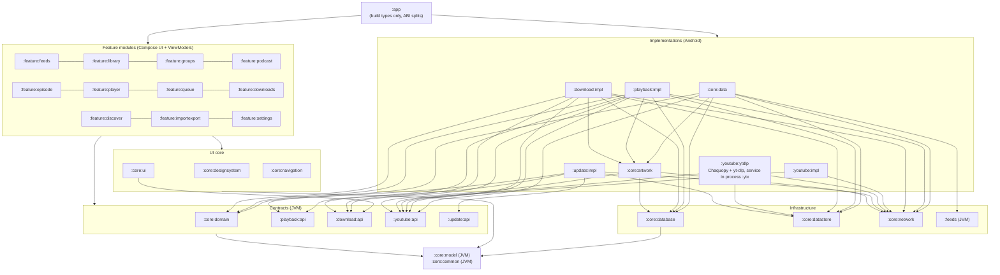
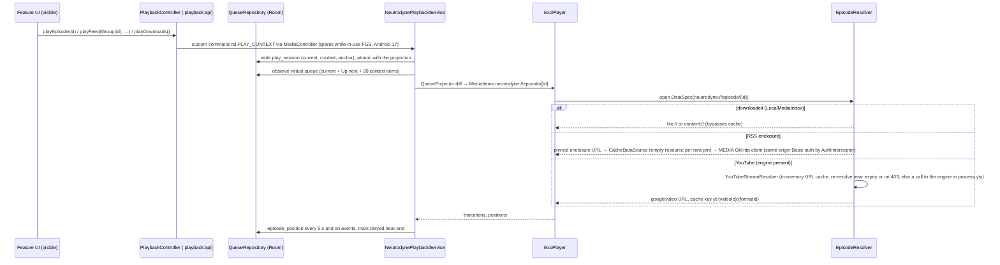
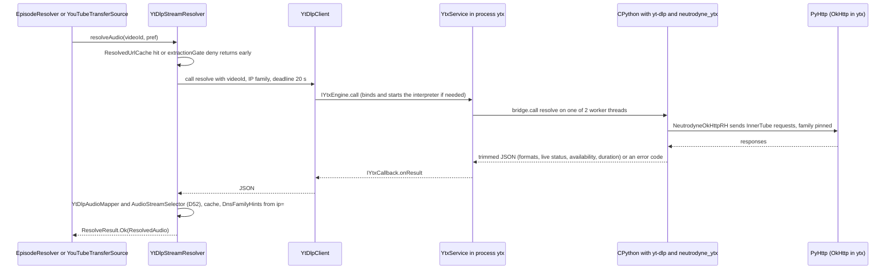
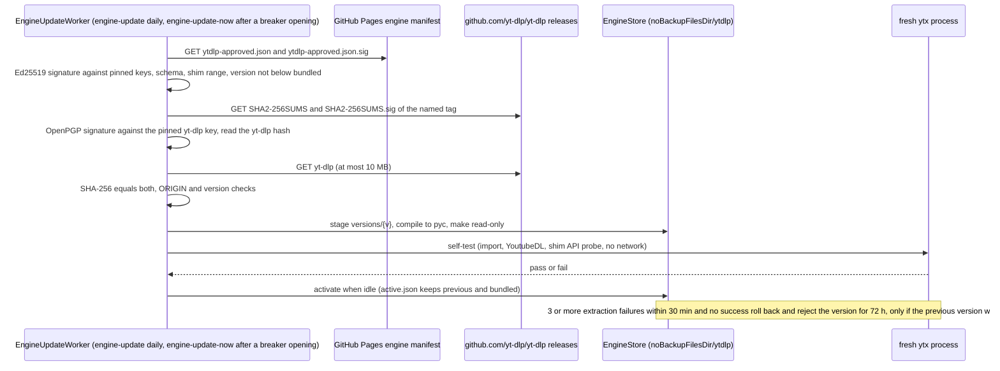
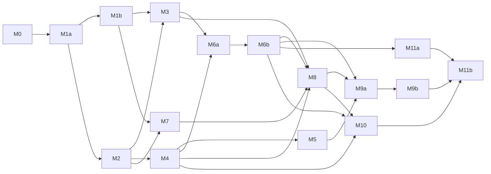

# Neutrodyne — Master plan

> Status: approved baseline for implementation, 2026-10-04; integration review applied 2026-10-05 (amended D-ids, D68–D71, PO-21–PO-30, new risks); final cross-review fixes 2026-10-05 (milestone graph, sizes and the M1/M6 increments, added acceptance criteria, R1.8 limits, deferred Favourites/History views); **revised 2026-10-05 for the product owner's decisions** — application ID `ch.lkmc.neutrodyne` frozen, GitHub Releases as the only channel, no Google developer-verification registration, an in-app updater, yt-dlp embedded in CPython replacing NewPipe Extractor, no GPL code anywhere (amended D2, D3, D13, D26, D39, D51, D60–D64; new D72–D80, R3.9, R6, N12; PO-1, PO-2, PO-5, PO-8 resolved; PO-22, PO-23, PO-29 obsolete; new PO-31–PO-36; M9 and M11 split into increments). Audience: product owner (sections 1–4, 6–8) and engineers / AI coding sessions (all sections).
> This document is the single source of truth for scope, requirement IDs, decisions (D-ids), product-owner decisions (PO-ids), milestones (M-ids) and risks. The nine design documents in [`design/`](design/) elaborate it and must not contradict it. Where a design document and this plan disagree, this plan wins until it is amended.

Contents: [1. Vision and scope](#1-vision-and-scope) · [2. Requirements](#2-requirements) · [3. Key decisions](#3-key-decisions) · [4. Decisions needed from the product owner](#4-decisions-needed-from-the-product-owner) · [5. Architecture overview](#5-architecture-overview) · [6. Feature scope](#6-feature-scope) · [7. Roadmap](#7-roadmap) · [8. Risks and mitigations](#8-risks-and-mitigations) · [9. Design document index](#9-design-document-index) · [10. Glossary](#10-glossary) · [Appendix A. Key sources](#appendix-a-key-sources)

---

## 1. Vision and scope

**Neutrodyne is a server-less, open-source Android podcast player organised around groups.** A group ("tech", "news", "fiction") is a user-defined set of podcasts and YouTube channels, and every group is its own newest-first episode feed. Covers carry the visual identity of the app. Everything runs on the device: the phone polls feeds itself, there is no Neutrodyne backend, no account and no tracking.

The one place where every mainstream podcast app is weak is "a group as its own feed": AntennaPod's per-tag episode view has been an open request since 2021 ([#5222](https://github.com/AntennaPod/AntennaPod/issues/5222)), and Pocket Casts folders are paid, single-membership and cannot be used in Smart Playlists ([Pocket Casts docs](https://support.pocketcasts.com/knowledge-base/episode-filters/)). That is the product's differentiator; everything else must reach the table-stakes bar of AntennaPod and the polish bar of Pocket Casts.

### 1.1 Guiding principles

1. **Groups are first-class.** Many-to-many membership, a feed per group, per-group defaults, and groups that survive OPML and backup round trips.
2. **Cover-first.** Artwork is visible on every surface (grid, rows, player, lock screen, car) and drives colour; chrome stays quiet.
3. **Local-first and private.** The app talks only to hosts the user chose (feeds, enclosures, artwork, opted-in directories, YouTube when used, GitHub for app and YouTube-engine updates while those are on). No analytics, no ads, no proprietary SDKs.
4. **Never lose user data.** Subscriptions, groups, played state, positions and queue survive refreshes, crashes, migrations, reinstalls and phone changes.
5. **Built for Android 15–17 from day one.** Background-audio hardening, job quotas, user-initiated transfers, edge-to-edge, predictive back and large screens are design inputs, not retrofits.
6. **Honest, verifiable distribution.** One app, published only as signed per-ABI APKs on GitHub Releases ([D79](#3-key-decisions)). Where a device or a setting cannot run the YouTube engine, the app says so and offers "Watch on YouTube" ([D77](#3-key-decisions)); where Android makes installing or updating harder for an unregistered developer, the app and the README explain it plainly ([D80](#3-key-decisions)). Every release can be checked against its checksums, provenance attestation and certificate fingerprint.
7. **Public-domain code.** The repository and every shipped binary are Unlicense code plus permissively licensed components; no GPL, LGPL or AGPL code anywhere ([D3](#3-key-decisions), [PO-1](#po-1-licensing-of-shipped-binaries)).
8. **Testable by construction.** Pure-JVM parsers with golden corpora, fakes behind interfaces, exported Room schemas with migration tests, CI on every change.

### 1.2 Non-goals for v1.0

| Not in v1.0 | Why / when |
|---|---|
| Neutrodyne server, accounts, cross-device sync (gpodder, Nextcloud) | Distributed model ([D1](#3-key-decisions)); sync is "later" |
| Google Play, F-Droid, IzzyOnDroid or any other store | GitHub Releases is the only channel ([PO-2](#po-2-distribution-channels), [D79](#3-key-decisions)); Obtainium is documented as an alternative updater |
| Registration with Google's Android developer verification | Not registered ([PO-5](#po-5-google-developer-verification), [D80](#3-key-decisions)); install and update guidance instead |
| Chromecast | Not planned: Media3 Cast needs proprietary Google Play services, and there is only one build ([PO-6](#po-6-chromecast)) |
| In-app YouTube playback and downloads on 32-bit ARM (`armeabi-v7a`) devices | No CPython ≥ 3.12 runtime exists for 32-bit ARM; YouTube episodes are external episodes there ([D77](#3-key-decisions)) |
| Wear OS app, home-screen widgets, Quick Settings tile | v1.x (widgets) / later |
| Video-first experience | Video podcasts play as audio in v1.0; video surface and PiP in v1.x; YouTube is audio-only |
| Smart (rule-based) groups, nested groups, multiple queues | Schema reserved; later |
| Statistics, bookmarks, transcripts UI, value-for-value | Later (transcripts are ingested, not shown) |
| Favourites list or filter, listening-history view | v1.x (M15). v1.0 lets the user mark favourites (episode detail) because favourites drive cleanup protection (R4.5) and merge in backups, and it stores `playedAt` with an index, so both views arrive without a migration |
| Volume boost, intro/outro skip, end-of-chapter timer, shake-to-extend | v1.x |
| Exact-time refresh, auto-play on Bluetooth connect, alarm wake-up podcasts | Impossible or silently muted under Android 15/17 rules ([D43](#3-key-decisions)) |
| Local-network (LAN) feeds, user-installed CAs | v1.x; clear error in v1.0 ([D28](#3-key-decisions)) |
| User-chosen (SAF) download folder | v1.x; v1.0 uses app-specific storage ([D48](#3-key-decisions)) |
| YouTube login, members-only, age-restricted content, YouTube Data API | Not supported ([D51](#3-key-decisions)) |
| Material 3 Expressive | Alpha-only today ([PO-4](#po-4-material-3-expressive)) |
| Spotify-exclusive shows, radio, news reader | Out of product scope |

---

## 2. Requirements

### 2.1 Functional requirements

Each sub-requirement is a testable statement. "Group feed" and the other terms are defined in the [Glossary](#10-glossary).

**R1 — Import and export of subscriptions**

| ID | Statement |
|---|---|
| R1.1 | The user can import an OPML 1.0/2.0 file chosen in the system file picker, shared from another app, or opened with "Open with". Malformed files (unescaped `&`, missing `/>`, undefined entities) still import every recoverable feed URL, and the user is told when folder structure was lost. |
| R1.2 | An import shows a preview (selectable items, duplicates, already-subscribed, invalid URLs, group mapping) before anything is written. Folder nesting and the `category` attribute both map to groups; known wrapper folders (`feeds`, Overcast `playlists`, a single root wrapper) do not become groups; already-subscribed podcasts receive the imported group memberships. |
| R1.3 | After confirming, all imported podcasts appear in the library within 2 s (as pending), are fetched in the background, and each item ends in a recorded status (subscribed, merged, not a feed, no media, auth required, gone, failed). Failures stay subscribed with Retry / Edit URL / Remove actions, and a final report is shown. Importing never posts new-episode notifications or queues auto-downloads for the imported back catalogue. |
| R1.4 | The user can export all subscriptions as OPML 2.0, either grouped (default: each feed exactly once, inside the folder of its first group, with a `category` attribute listing all its groups) or flat. Exporting and re-importing into an empty Neutrodyne reproduces every group, membership and group order. |
| R1.5 | The user can export or share a single group as OPML. |
| R1.6 | YouTube channel subscriptions export as `https://www.youtube.com/feeds/videos.xml?channel_id=UC…` outlines and re-import as YouTube podcasts. NewPipe JSON, LibreTube JSON (including channel groups) and Google Takeout `subscriptions.csv` (plain or inside a ZIP) can be imported; NewPipe JSON can be exported. |
| R1.7 | The user can create a full backup (a versioned ZIP containing library, groups, settings, per-episode user state, Up next and an OPML copy) and restore it in Merge (default) or Replace mode, including into a newer app version. |
| R1.8 | Without user action, Android Auto Backup carries a daily snapshot of the library to a new device; on first launch after reinstall the library, groups, played state, positions and queue are restored automatically. This works only where the platform backs up: API 28+ with a screen lock (PO-15) and an active system backup transport (Google backup through Play services, or a ROM-integrated transport such as [Seedvault](https://github.com/seedvault-app/seedvault) on de-Googled ROMs). Elsewhere the manual backup of R1.7 is the path (scheduled backup to a user folder: M15), and Settings › Backup says so. GitHub installs: device setup on a new phone never reinstalls Neutrodyne, so the snapshot is restored when the user installs the APK on the new device (Unverified that this still reads the old device's data set after setup; checked in M11b, [05 Open questions](design/05-groups-opml-backup.md#open-questions) 17); otherwise the manual backup of R1.7 is the path, and the README's "Install and update" section recommends a manual backup before changing phones. |
| R1.9 | Exports and backups never contain Basic-auth passwords unless the user opts in, and the user is warned when exported feed URLs look like private tokenised links. |

**R2 — Groups and group feeds**

| ID | Statement |
|---|---|
| R2.1 | The user can create, rename, recolour (12-colour palette), set an icon for, reorder and delete groups. Names are 1–40 characters after trimming, may contain emoji, and are unique case-insensitively after NFC normalisation. Deleting a group never deletes podcasts and can be undone for 10 s. |
| R2.2 | A podcast or YouTube channel can belong to zero, one or many groups. Memberships can be edited from the podcast screen, the group editor, a multi-select in the library, and during import or subscribe. |
| R2.3 | Each group is a separate feed: a paged list of all episodes of its member podcasts and channels, ordered by `sortDate` (newest first by default, per-group setting), with stable order across pages. Two virtual feeds exist: **All** (every podcast whose `includeInAll` is on) and **Ungrouped** (podcasts in no group). |
| R2.4 | The Feeds screen shows All, then user groups in user order, then optionally Ungrouped, as tabs; swiping switches feeds; the selected feed survives process death; deleting the selected group falls back to All. |
| R2.5 | Within a feed the user can filter by unplayed, downloaded, in progress and media type (audio / video), and can hide episodes older than N days (per group). |
| R2.6 | From a group the user can refresh only that group's podcasts, play the group (Up next first, then the group's unplayed episodes in the group's play order), mark all episodes as played (optionally only older than a date), download all unplayed (after a confirmation showing count and estimated size) and share the group as OPML. |
| R2.7 | Groups carry optional defaults: playback speed and skip silence (applied when playing from that group), auto-download policy, new-episode notifications (one system notification channel per group) and refresh interval. Every settings screen shows the effective value and where it comes from. |
| R2.8 | The groups list and tabs show per-group unplayed and new-since-last-visit counts, computed over a bounded time window. |
| R2.9 | With 300 podcasts, 50,000 episodes and 20 groups, a group feed's first page renders in ≤ 60 ms and the All feed in ≤ 100 ms of query time on the reference device (see N5). |

**R3 — YouTube channels as podcasts**

| ID | Statement |
|---|---|
| R3.1 | The user can subscribe to a YouTube channel by pasting or sharing any channel URL, handle (`@name`), legacy `/c/` or `/user/` URL, uploads-playlist URL or video URL. The channel ID (`UC…`) is resolved and stored, never the handle. Where the YouTube engine is available ([D77](#3-key-decisions)) the user can also search channels by name. |
| R3.2 | A subscribed channel appears as a podcast with the channel avatar as cover, the channel banner on its detail screen and per-video thumbnails. By default only long-form uploads appear (no Shorts, no live streams, no members-only); per channel the user can opt into Shorts and past live streams. Premieres appear only once playable. |
| R3.3 | New uploads appear after a refresh. A YouTube-wide feed outage (all channels returning 404) never unsubscribes or marks channels dead; it shows one global notice and backs off. |
| R3.4 | YouTube channels behave like podcasts for groups, group feeds, counts, played state, positions, OPML export/import and backup. |
| R3.5 | **With the YouTube engine** (the `arm64-v8a` and `x86_64` APKs, engine not disabled, [D77](#3-key-decisions)): YouTube episodes play as audio in the regular player (queue, background, lock screen, Bluetooth, sleep timer, chapters from description timestamps). Expired or IP-bound stream URLs are re-resolved transparently without losing position. |
| R3.6 | **With the YouTube engine:** YouTube episodes can be downloaded as audio files (m4a by default) through the same download engine, policies and Downloads screen as podcasts, including auto-download (smaller default keep count). |
| R3.7 | **Without the YouTube engine** (the `armeabi-v7a` APK, the engine turned off in Settings › YouTube, or an engine that cannot start): YouTube episodes are external episodes. They show title, date, description and thumbnail, and open in the YouTube app (or a browser). They cannot be queued, downloaded or played in the background, are skipped by "Play group", and do not count towards auto-download. Settings › YouTube says why in-app playback is unavailable and, where possible, how to get it (turn the engine on; install the 64-bit APK). |
| R3.8 | Stream-resolution failures are classified. Per-item "unavailable" reasons (age-restricted, members-only, upcoming, live, region, private, made-for-kids) are shown on the episode; repeated extraction failures open a circuit breaker, trigger an immediate YouTube-engine update check and show "YouTube playback is temporarily broken — Neutrodyne is checking for a fix"; the queue continues with the next playable item. |
| R3.9 | The YouTube engine updates without an app update ([D76](#3-key-decisions)): a newer approved yt-dlp release is downloaded, verified (manifest signature, upstream signature, SHA-256), self-tested and activated without interrupting playback; a version that fails after activation is rolled back automatically. Settings › YouTube shows the active engine version and its source, and offers "Check for engine update", "Reset to bundled" and the update policy (Neutrodyne-approved, upstream stable, off). |

**R4 — Streaming and downloading**

| ID | Statement |
|---|---|
| R4.1 | Any audio episode can be streamed without downloading, with seeking, resume at the saved position, and a setting for streaming on metered networks (Allow / Ask / Never). |
| R4.2 | The user can download an episode with visible progress, pause, resume, cancel and retry. Downloads resume after network loss, process death and reboot from the bytes already received, and never store an HTML error page as an episode. |
| R4.3 | A downloaded episode plays from the local file in the same queue item as its stream would, fully offline, with artwork. |
| R4.4 | Auto-download can be enabled per podcast, per group or globally, with keep-latest-N, network policy (unmetered / any) and optional charging requirement. An episode the user deleted is never auto-downloaded again. |
| R4.5 | Played episodes are deleted automatically after a grace period (default 24 h); favourites, the playing episode, the next Up-next items, unplayed manual downloads and unplayed automatic downloads that are in progress are never auto-deleted; an optional storage cap stops auto-downloads when reached. |
| R4.6 | A Downloads screen shows in-progress items with their wait reason ("Waiting for Wi-Fi", "Retrying in 4 min", "Storage full"), completed items with storage usage, and failed items, with bulk delete. |
| R4.7 | Playback continues in the background with a media notification, lock-screen controls, Bluetooth and headset buttons, audio focus handling, pause on headphone unplug, and a System UI resumption card after reboot. |
| R4.8 | Up next supports add next / add last, drag reorder and swipe remove. Positions persist continuously; episodes are marked played automatically near the end; speed (0.5–3.0×), skip silence, configurable skip intervals, a sleep timer (duration, end of episode) and chapters (Podcasting 2.0 JSON, Podlove Simple Chapters, ID3/MP4 embedded) are available. |

**R5 — A nice UI showing podcasts' graphical covers**

| ID | Statement |
|---|---|
| R5.1 | The library is an adaptive cover grid (3 columns on 360–411 dp phones by default, density 72 / 100 / 152 dp selectable) with group filter chips and a Groups view of 2×2 cover mosaics. |
| R5.2 | Covers appear on every main surface: feed rows (56 dp), podcast header (160 dp), full player (≥ 280 dp), mini player (48 dp), notification, lock screen and Android Auto. |
| R5.3 | Artwork for every subscription and every downloaded episode is available offline from a pinned local store, which also feeds the lock screen and Auto. |
| R5.4 | Missing, broken or tiny artwork is replaced by a generated monogram cover (initials on a deterministic hue, ≥ 4.5:1 contrast); tiles show the artwork's average colour while loading, never a grey flash. |
| R5.5 | The app uses wallpaper dynamic colour on Android 12+ (brand scheme below); the full player, mini player tint and podcast header use a colour scheme derived from the artwork; light, dark and pure-black themes exist. |
| R5.6 | Groups have a colour, an optional icon and a 2×2 mosaic of member covers. |
| R5.7 | Covers animate between grid, podcast header and episode screens without flashing; layouts adapt to compact, medium, expanded and large widths and to tabletop posture. |
| R5.8 | YouTube thumbnails are shown 16:9-correct (never letterboxed bars), with a resolution fallback chain; system surfaces use the square channel avatar. |

**R6 — Installing and updating** (GitHub Releases is the only channel, [D78](#3-key-decisions)–[D80](#3-key-decisions))

| ID | Statement |
|---|---|
| R6.1 | A user can install Neutrodyne by following the README's "Install and update" section: which per-ABI APK to download from GitHub Releases, how to check it (`SHA256SUMS`, certificate fingerprint, `gh attestation verify`), Android's "install unknown apps" prompt and, on certified devices with Google services once Google's global developer-verification rollout starts (2027), the one-time advanced flow or ADB. The same guidance is in the app (Settings › About › Install & updates). |
| R6.2 | The app checks GitHub for a newer release at most once a day and on "Check now" (stable channel by default, beta channel opt-in), shows what is new, downloads the APK for the device's primary ABI and installs it only after its SHA-256 and signing certificate match. It never installs while audio plays or a download runs. Settings › Updates offers Off / Notify / Automatic. |
| R6.3 | When another updater (Obtainium) is the app's installer of record, the in-app updater does not install and says that updates are managed elsewhere. |
| R6.4 | When Android blocks an update because the developer is not verified, the app explains why and what the user can do (the advanced flow with "indefinitely", ADB) and offers "Download in browser". In the releases before Google's global enforcement, the app shows a one-time notice recommending the advanced flow's "indefinitely" option ([PO-36](#48-further-product-owner-decisions)); unless M11a ships well before Google's date, that notice reaches mainly testers, so from the global date on the same one-time notice tells every installation that has not seen it (fresh installs made through the advanced flow) to switch "7 days" to "indefinitely". |

### 2.2 Non-functional requirements

| ID | Area | Requirement (testable) |
|---|---|---|
| N1 | Reliability and data safety | No release may lose subscriptions, groups, played state, positions or queue: every schema change ships a tested Room migration; refreshes never delete user state; a stored non-zero position is never overwritten with 0 except by explicit reset or mark-played; at most 5 s of position is lost on a process kill. |
| N2 | Background and battery | Comply with Android 15–17 background rules: no exact alarms, no `REQUEST_IGNORE_BATTERY_OPTIMIZATIONS`, no FGS start from `BOOT_COMPLETED`; every background job is resumable, and every job that is neither user-initiated nor a foreground worker stops itself before 8 min; user-started downloads use user-initiated data transfer jobs on API 34+; playback is only started from user-visible or media-key paths. |
| N3 | Privacy | No analytics, advertising, Firebase or Google Play services; network traffic only to user-initiated hosts and opted-in services listed in `PRIVACY.md` (including GitHub for app updates and YouTube-engine updates while they are on); private feed URLs and tokens never appear in logs, crash reports or directory queries; crash reports are sent only by the user's own email after per-crash consent. |
| N4 | Accessibility | Target WCAG 2.2 AA: every interactive element ≥ 48 dp, one TalkBack focus stop per row with custom actions for every swipe/drag/long-press action, readable at 200 % font scale, text contrast ≥ 4.5:1 (icons ≥ 3:1), honours "remove animations". Automated `ui-test-junit4-accessibility` checks run in instrumented UI tests. |
| N5 | Performance and scale | Targets on the reference device (PO-agreed mid-range phone): cold start p50 < 600 ms (the YouTube engine never runs in the main process); frame jank < 1 % in cover-grid and feed scrolling; group-feed queries per R2.9; scale tested to 300 podcasts, 50,000 episodes, 50 groups. APK size per ABI: `arm64-v8a` and `x86_64` < 40 MB each, `armeabi-v7a` < 30 MB (no universal APK, [D77](#3-key-decisions)). YouTube engine: `:ytx` PSS ≤ 90 MB while alive, stopped after 3 min idle; first resolve after a cold `:ytx` start p50 ≤ 3 s, warm resolve p50 ≤ 1.5 s. The engine budgets are estimates (≈ 15–22 MB per 64-bit ABI, ≈ 70 MB RSS, 1–3 s first resolve) confirmed or amended by the M9a spike. |
| N6 | Offline | With no network the library, feeds, show notes, downloaded episodes and their artwork work; non-downloaded items are visibly unavailable; nothing blocks on a network call. |
| N7 | Platform compliance | targetSdk 37; edge-to-edge; predictive back; no orientation or resizability locks; 16 KB page alignment of every native library, including the CPython runtime and its extension modules; declared FGS types; contextual `POST_NOTIFICATIONS`; per-app language support; a closed permission set (01), which includes `REQUEST_INSTALL_PACKAGES` and `UPDATE_PACKAGES_WITHOUT_USER_ACTION` for the in-app updater ([D78](#3-key-decisions)). |
| N8 | Licensing | The repository and every shipped artefact — APKs and YouTube-engine updates — contain only Unlicense code and permissively licensed third-party components; no GPL, LGPL or AGPL code anywhere ([D3](#3-key-decisions)). CI enforces it with the Licensee allow-list for Gradle dependencies, a lockfile and licence allow-list for bundled Python components, and an APK content scan. Every bundled component (CPython and its bundled libraries such as OpenSSL and SQLite, Chaquopy, yt-dlp, yt-dlp-ejs with meriyah and astring, CA certificate data, and QuickJS/quickjs-kt when shipped) is listed on the Licences screen and in `THIRD_PARTY_NOTICES.md`. Prior-art GPL/MPL code is never copied. |
| N9 | Security of untrusted input | Feeds, OPML, backups and import files are untrusted: no DTD/entity expansion, size/depth/count caps, zip-slip and zip-bomb protection, whitelisted backup entries; credentials encrypted with an Android Keystore key. |
| N10 | Localisation | All user-visible text externalised; RTL layouts verified; per-app language picker; pseudo-locale screenshot tests; translations via Weblate. |
| N11 | Maintainability | Module boundaries enforced by build checks; CI green on every merge; YouTube extraction fixes reach users primarily as engine updates: the engine canary approves a new yt-dlp stable release within 6 h of its publication when its gate passes (signatures, API probe, recorded responses replayed by endpoint and client, so changed requests alone never block), and apps activate an approved version within 24 h (sooner after a circuit-breaker opening) ([D76](#3-key-decisions)); a release the gate cannot judge without new recordings is re-recorded and dispatched by a maintainer within 24 h (target); the APK hotfix path (tag → signed GitHub release < 30 min) remains for shim and app fixes; design docs updated with every deviation. |
| N12 | Release and update integrity | Every published release is an immutable GitHub release carrying `SHA256SUMS`, a build-provenance attestation and the signing-certificate SHA-256 in its body; the in-app updater installs only APKs whose SHA-256, package name, version code and signing certificate match; the engine updater activates only code that passed the [D76](#3-key-decisions) trust chain and on-device self-test and can always return to the bundled version; the release signing key exists only offline and in the protected `release` environment, the engine-manifest key only in the `engine-approval` environment. |

### 2.3 Traceability

Design-doc section links point at the mandatory headings defined for each document. Milestones are defined in [7. Roadmap](#7-roadmap).

| Req. | Design doc sections | Milestones |
|---|---|---|
| R1.1–R1.3 | [05 OPML import](design/05-groups-opml-backup.md#opml-import), [05 Receiving files](design/05-groups-opml-backup.md#receiving-files), [02 Tables](design/02-data-model.md#tables) | M3 |
| R1.4–R1.5 | [05 OPML export](design/05-groups-opml-backup.md#opml-export) | M3 |
| R1.6 | [04 Import and export formats](design/04-youtube.md#import-and-export-formats), [05 OPML import](design/05-groups-opml-backup.md#opml-import) | M8 |
| R1.7 | [05 Full backup and restore](design/05-groups-opml-backup.md#full-backup-and-restore) | M3 |
| R1.8 | [05 Auto Backup](design/05-groups-opml-backup.md#auto-backup), [05 First-launch restore](design/05-groups-opml-backup.md#first-launch-restore), [07 Storage layout](design/07-downloads.md#storage-layout) | M3, M6 |
| R1.9 | [05 OPML export](design/05-groups-opml-backup.md#opml-export), [03 Feed moves, auth and paging](design/03-feeds-and-discovery.md#feed-moves-auth-and-paging) | M3 |
| R2.1 | [05 Group model and lifecycle](design/05-groups-opml-backup.md#group-model-and-lifecycle), [08 Screens](design/08-ui-ux.md#screens) | M2 |
| R2.2 | [05 Group model and lifecycle](design/05-groups-opml-backup.md#group-model-and-lifecycle), [05 OPML import](design/05-groups-opml-backup.md#opml-import), [03 Subscribe transaction](design/03-feeds-and-discovery.md#subscribe-transaction), [08 Add podcast sheet](design/08-ui-ux.md#add-podcast-sheet) | M2 (podcast screen, group editor, library), M3 (import), M7 (subscribe) |
| R2.3–R2.4 | [05 Group feeds](design/05-groups-opml-backup.md#group-feeds), [02 Key queries](design/02-data-model.md#key-queries), [08 Group feed pager](design/08-ui-ux.md#group-feed-pager) | M2 |
| R2.5 | [05 Group feeds](design/05-groups-opml-backup.md#group-feeds), [02 Feed pages](design/02-data-model.md#feed-pages), [08 Filter chips](design/08-ui-ux.md#filter-chips) | M2 (unplayed, media, hide older), M4 (in progress), M6 (downloaded) |
| R2.6 | [05 Playing a group](design/05-groups-opml-backup.md#playing-a-group), [06 Queue and play context](design/06-playback.md#queue-and-play-context), [07 Auto-download policy](design/07-downloads.md#auto-download-policy) | M2, M3, M4, M6 |
| R2.7 | [05 Effective settings resolution](design/05-groups-opml-backup.md#effective-settings-resolution), [03 New-episode notifications](design/03-feeds-and-discovery.md#new-episode-notifications) | M2, M4, M6 |
| R2.8–R2.9 | [02 Key queries](design/02-data-model.md#key-queries), [02 Invalidation hygiene](design/02-data-model.md#invalidation-hygiene), [09 Performance budgets](design/09-quality-and-release.md#performance-budgets) | M2 |
| R3.1 | [04 Channel resolution](design/04-youtube.md#channel-resolution), [04 Channel search](design/04-youtube.md#channel-search), [03 Add podcast flow](design/03-feeds-and-discovery.md#add-podcast-flow) | M8, M9 |
| R3.2–R3.3 | [04 Atom feed ingestion](design/04-youtube.md#atom-feed-ingestion), [04 Fetch policy](design/04-youtube.md#fetch-policy), [04 Content flags and filtering](design/04-youtube.md#content-flags-and-filtering), [04 Artwork and thumbnails](design/04-youtube.md#artwork-and-thumbnails) | M8 |
| R3.4 | [05 Group feeds](design/05-groups-opml-backup.md#group-feeds), [04 Import and export formats](design/04-youtube.md#import-and-export-formats) | M8 |
| R3.5 | [04 YouTube engine](design/04-youtube.md#youtube-engine), [04 Stream resolution](design/04-youtube.md#stream-resolution), [04 Playback integration](design/04-youtube.md#playback-integration), [06 Media items and URI resolution](design/06-playback.md#media-items-and-uri-resolution) | M9 |
| R3.6 | [04 Download integration](design/04-youtube.md#download-integration), [07 YouTube transfers](design/07-downloads.md#youtube-transfers) | M9 |
| R3.7 | [04 Capability matrix](design/04-youtube.md#capability-matrix), [08 Capability differences in UI](design/08-ui-ux.md#capability-differences-in-ui), [01 Build variants and ABIs](design/01-foundation.md#build-variants-and-abis) | M8, M9 |
| R3.8 | [04 Error handling and circuit breaker](design/04-youtube.md#error-handling-and-circuit-breaker) | M9 |
| R3.9 | [04 Engine updates](design/04-youtube.md#engine-updates), [04 Maintenance and hotfix process](design/04-youtube.md#maintenance-and-hotfix-process), [09 engine-canary.yml](design/09-quality-and-release.md#engine-canaryyml), [08 Settings](design/08-ui-ux.md#settings) | M9 |
| R4.1 | [06 Media items and URI resolution](design/06-playback.md#media-items-and-uri-resolution), [06 Streaming cache](design/06-playback.md#streaming-cache) | M4 |
| R4.2 | [07 Runners and scheduling](design/07-downloads.md#runners-and-scheduling), [07 Transfer core](design/07-downloads.md#transfer-core), [07 State machine](design/07-downloads.md#state-machine) | M6 |
| R4.3 | [06 Media items and URI resolution](design/06-playback.md#media-items-and-uri-resolution), [07 Storage layout](design/07-downloads.md#storage-layout) | M6 |
| R4.4–R4.5 | [07 Auto-download policy](design/07-downloads.md#auto-download-policy), [07 Cleanup and quota](design/07-downloads.md#cleanup-and-quota), [05 Effective settings resolution](design/05-groups-opml-backup.md#effective-settings-resolution) | M6 |
| R4.6 | [07 Progress and notifications](design/07-downloads.md#progress-and-notifications), [08 Downloads](design/08-ui-ux.md#downloads) | M6 |
| R4.7 | [06 Service architecture](design/06-playback.md#service-architecture), [06 Notification and media buttons](design/06-playback.md#notification-and-media-buttons), [06 System surfaces](design/06-playback.md#system-surfaces), [06 Background restrictions](design/06-playback.md#background-restrictions) | M4, M5 |
| R4.8 | [06 Queue and play context](design/06-playback.md#queue-and-play-context), [06 Positions and played state](design/06-playback.md#positions-and-played-state), [06 Sleep timer](design/06-playback.md#sleep-timer), [06 Chapters](design/06-playback.md#chapters) | M4, M5 |
| R5.1 | [08 Screens](design/08-ui-ux.md#screens), [08 Components](design/08-ui-ux.md#components) | M1, M10 |
| R5.2–R5.4 | [08 Artwork pipeline](design/08-ui-ux.md#artwork-pipeline), [06 System surfaces](design/06-playback.md#system-surfaces) | M1, M4, M10 |
| R5.5 | [08 Theming and colour](design/08-ui-ux.md#theming-and-colour) | M10 |
| R5.6 | [08 Components](design/08-ui-ux.md#components), [05 Group model and lifecycle](design/05-groups-opml-backup.md#group-model-and-lifecycle) | M2, M10 |
| R5.7 | [08 Adaptive layouts](design/08-ui-ux.md#adaptive-layouts), [08 Navigation](design/08-ui-ux.md#navigation) | M10 |
| R5.8 | [08 Artwork pipeline](design/08-ui-ux.md#artwork-pipeline), [04 Artwork and thumbnails](design/04-youtube.md#artwork-and-thumbnails) | M8, M10 |
| R6.1 | [09 Distribution channels](design/09-quality-and-release.md#distribution-channels), [09 Developer verification](design/09-quality-and-release.md#developer-verification), [08 Install and updates help](design/08-ui-ux.md#install-and-updates-help) | M0 (release assets), M11 |
| R6.2–R6.3 | [09 In-app updater](design/09-quality-and-release.md#in-app-updater), [08 Updates settings](design/08-ui-ux.md#updates-settings), [01 Manifest and permissions](design/01-foundation.md#manifest-and-permissions) | M0 (update manifest), M11 |
| R6.4 | [09 Developer verification](design/09-quality-and-release.md#developer-verification), [09 In-app updater](design/09-quality-and-release.md#in-app-updater), [08 Install and updates help](design/08-ui-ux.md#install-and-updates-help) | M11 |
| N1 | [02 Migrations and schema testing](design/02-data-model.md#migrations-and-schema-testing), [06 Positions and played state](design/06-playback.md#positions-and-played-state), [05 Full backup and restore](design/05-groups-opml-backup.md#full-backup-and-restore), [02 Error handling and recovery](design/02-data-model.md#error-handling-and-recovery) | M1, M3, M4, M6, M11 |
| N2 | [01 Platform compliance](design/01-foundation.md#platform-compliance), [03 Refresh scheduling](design/03-feeds-and-discovery.md#refresh-scheduling), [06 Background restrictions](design/06-playback.md#background-restrictions), [07 Runners and scheduling](design/07-downloads.md#runners-and-scheduling) | M1, M4, M5, M6 |
| N3 | [09 Privacy](design/09-quality-and-release.md#privacy), [09 Crash reporting and diagnostics](design/09-quality-and-release.md#crash-reporting-and-diagnostics), [01 Logging and redaction](design/01-foundation.md#logging-and-redaction) | M0, M7, M8, M9, M11 |
| N4 | [08 Accessibility](design/08-ui-ux.md#accessibility), [09 Compose UI and screenshot tests](design/09-quality-and-release.md#compose-ui-and-screenshot-tests) | M1, M2 (checks in every UI change), M10 (audit) |
| N5 | [09 Performance budgets](design/09-quality-and-release.md#performance-budgets), [02 Indices](design/02-data-model.md#indices), [04 YouTube engine](design/04-youtube.md#youtube-engine) | M2, M9, M10, M11 |
| N6 | [08 Artwork pipeline](design/08-ui-ux.md#artwork-pipeline), [07 Storage layout](design/07-downloads.md#storage-layout) | M1, M4, M6 |
| N7 | [01 Platform compliance](design/01-foundation.md#platform-compliance), [01 Manifest and permissions](design/01-foundation.md#manifest-and-permissions), [01 Build variants and ABIs](design/01-foundation.md#build-variants-and-abis) | M0, M9, M11 |
| N8 | [01 Licensing and dependency policy](design/01-foundation.md#licensing-and-dependency-policy), [01 Python and native components](design/01-foundation.md#python-and-native-components), [04 Licensing and legal](design/04-youtube.md#licensing-and-legal) | M0, M9, M11 |
| N9 | [05 OPML import](design/05-groups-opml-backup.md#opml-import), [03 Parser](design/03-feeds-and-discovery.md#parser), [09 Untrusted-input robustness](design/09-quality-and-release.md#untrusted-input-robustness) | M1, M3, M8 |
| N10 | [09 Localisation](design/09-quality-and-release.md#localisation) | M0, M10, M11 |
| N11 | [01 Dependency rules](design/01-foundation.md#dependency-rules), [09 CI pipelines](design/09-quality-and-release.md#ci-pipelines), [04 Maintenance and hotfix process](design/04-youtube.md#maintenance-and-hotfix-process), [04 Engine updates](design/04-youtube.md#engine-updates) | M0, M9, M11 |
| N12 | [09 Versioning and signing](design/09-quality-and-release.md#versioning-and-signing), [09 Distribution channels](design/09-quality-and-release.md#distribution-channels), [09 In-app updater](design/09-quality-and-release.md#in-app-updater), [04 Engine updates](design/04-youtube.md#engine-updates) | M0, M9, M11 |

---

## 3. Key decisions

ADR-style register. "Conflict" marks a decision that resolves contradictory research recommendations; "the stack research", "the feed research" and so on name the pre-plan research notes, which are not part of the repository — the evidence they relied on is cited in each design document's Sources section. The owning design document records the detail; changing a decision requires amending this table.

| ID | Decision | Choice | Rationale | Alternatives rejected | Owner |
|---|---|---|---|---|---|
| D1 | System architecture | Distributed: the device polls feeds; no Neutrodyne server | No backend to run or trust; private feeds stay private; works with authenticated feeds (AntennaPod model) | Central poller (Pocket Casts model) | PLAN, [03](design/03-feeds-and-discovery.md) |
| D2 | Build variants (amended 2026-10-05) | One product, **no product flavors**: build types `debug` (`applicationIdSuffix ".debug"`), `release` and the baseline-profile plugin's `benchmarkRelease`/`nonMinifiedRelease`; release APKs split per ABI ([D77](#3-key-decisions)); YouTube differences are runtime capabilities, never build variants. An emergency build without the YouTube engine is a Gradle switch (`-Pneutrodyne.youtubeEngine=false`), not a flavor | GitHub Releases is the only channel ([PO-2](#po-2-distribution-channels)), so the store-driven `foss`/`play` split has no purpose; one binary per ABI to test and explain | `foss`/`play` flavors (previous decision); an ABI product-flavor dimension (Chaquopy's FAQ recommends it because ABI splits do not split its assets; kept as the fallback if spike S7 shows more than 5 MB of foreign-ABI assets in a 64-bit APK, or unusable Python assets that push the `armeabi-v7a` APK over PB13) | [01](design/01-foundation.md#build-variants-and-abis) |
| D3 | Licensing structure (PO-1 resolved 2026-10-05) | The repository and every shipped binary — APKs and YouTube-engine updates — are own code under the Unlicense plus permissively licensed third-party components (Apache-2.0, MIT, BSD-2/3-Clause, ISC, 0BSD, PSF-2.0, zlib, bzip2-1.0.6, public domain; MPL-2.0 only for unmodified data files such as the CA certificate bundle). **No GPL, LGPL or AGPL code anywhere.** NewPipe Extractor is replaced by yt-dlp (Unlicense, [D72](#3-key-decisions)); Rhino, nanojson and the NIO desugaring runtime leave with it. Never shipped: yt-dlp's PyInstaller executables (GPL parts), youtubedl-android (GPL-3.0), Termux-built Python (GNU readline), `mutagen` (GPL-2.0+), `bgutil-ytdlp-pot-provider` (GPL-3.0), Deno or Node. Enforced by Licensee, a Python component lockfile check and an APK content scan (N8) | Owner decision: the whole project and its binaries stay public domain plus permissive; no corresponding-source obligations, no licence split between builds | GPL-3.0 `foss` APK with NewPipe Extractor in a GPL module (previous default); a separate GPL companion APK; relicensing to GPL | [01](design/01-foundation.md#licensing-and-dependency-policy), [04](design/04-youtube.md#licensing-and-legal) |
| D4 | Toolchain | Kotlin 2.4.20, AGP 9.4.1 with built-in Kotlin (fallback 9.3.3), **Gradle 9.7.1**, KSP 2.3.12, JDK 21 runs Gradle, bytecode 17; no kapt | Only current AGP line; Compose 1.12 needs AGP ≥ 9.2. Conflict: Gradle 9.8.0 is current, but Kotlin 2.4.20 is tested only to Gradle 9.7.0, so stay on 9.7.1 | AGP 8.x; Gradle 9.8 | [01](design/01-foundation.md#toolchain-and-versions) |
| D5 | SDK levels (subject to PO-7) | minSdk 26, compileSdk 37, targetSdk 37 | ~96.1 % reach; removes pre-O branches; Android 17 rules designed in | minSdk 24 / 29 / 31 | [01](design/01-foundation.md#toolchain-and-versions) |
| D6 | Design system (subject to PO-4) | Compose BOM 2026.09.00, Material 3 **1.4.0 stable**; all components wrapped in `:core:designsystem` | Conflict: the stack research treated Expressive as an isolated alpha; `material3:1.5.0-alpha29` actually pulls Compose core `1.13.0-alpha01` into the whole app | Expressive at launch; Views | [08](design/08-ui-ux.md#theming-and-colour) |
| D7 | Navigation | Navigation 3 1.2.0, one back stack per top-level tab, `ListDetailSceneStrategy`; keys named `*Key` in `:core:navigation`; cross-feature sheets are Nav3 entries | Nav2 is in maintenance mode; adaptive panes. Conflict: research used both `*Route` and `*Key` names | Navigation Compose 2.x | [08](design/08-ui-ux.md#navigation), [01](design/01-foundation.md#architecture-patterns) |
| D8 | Dependency injection | Hilt 2.60.1 + androidx.hilt 1.4.0 (KSP) | First-party integrations for services, workers, Nav3 ViewModels; compile-time graph | Metro, Koin, manual | [01](design/01-foundation.md#dependency-injection) |
| D9 | Persistence | Room 3.0.3 (`androidx.room3`) with `BundledSQLiteDriver` in production; driver is a Hilt binding so JVM/Robolectric tests use `AndroidSQLiteDriver` | The same current SQLite on every API level; bundled `.so` likely won't load under Robolectric. All SQL stays within the SQLite 3.18 baseline (no window functions, SQL `UPSERT` or `RETURNING`), so falling back to `AndroidSQLiteDriver` (spike S6) stays a one-line change ([02 SQL dialect baseline](design/02-data-model.md#sql-dialect-baseline)) | Room 2.8, SQLDelight, framework driver in production | [02](design/02-data-model.md#conventions) |
| D10 | HTTP stack | One `OkHttpClient` (OkHttp 5.5.0) shared via `newBuilder()`; **no OkHttp `Cache` anywhere in v1** | Conflict: the stack research proposed a 64 MB OkHttp cache for feed conditional GET; the feed research showed it duplicates bodies, honours `max-age` (stale pull-to-refresh) and stores validators for failed parses. Feeds use own validators, Coil its own disk cache, media its `SimpleCache`, search an in-memory LRU | OkHttp `Cache`; Ktor; Retrofit | [01](design/01-foundation.md#networking-baseline), [03](design/03-feeds-and-discovery.md#fetch-pipeline) |
| D11 | Feed parser | Hand-written streaming `XmlPullParser` in pure-JVM `:feeds`, namespace-URI matching, relaxed mode, HTML entities predefined; golden corpus | RSS-Parser has no Podcasting 2.0, one enclosure, prefix matching | RSS-Parser, ROME, xmlutil, porting GPL AntennaPod code | [03](design/03-feeds-and-discovery.md#parser) |
| D12 | Layering | UDF/MVVM. Repository **interfaces** and cross-repository use cases live in pure-JVM `:core:domain`; implementations in `:core:data` and `*:impl`; features depend only on `:core:domain` and `*:api`, never on `:core:data`/`:core:database` | The stack research left this rule open; this makes features testable with fakes and keeps Room out of feature classpaths | Features reading `:core:data` directly; mandatory use case per action | [01](design/01-foundation.md#dependency-rules) |
| D13 | Module names (amended 2026-10-05) | The canonical module list in [5.1](#51-module-graph). 2026-10-05: the GPL module `:youtube:streams` is replaced by `:youtube:ytdlp` (Unlicense; the only module applying the Chaquopy plugin; its service runs in process `:ytx`); `:update:api` (JVM) and `:update:impl` are added for the in-app updater ([D78](#3-key-decisions)) | Conflict: research proposed `:feature:add` vs `:feature:discover`, `:core:download` vs `:download:impl`, `:youtube-streams` vs `:youtube:impl-streams`, `:core:work`, `:feature:importexport` | Updater inside `:feature:settings` or `:core:data` (features may not host workers or services; the updater is a cross-cutting implementation behind an `:*:api` contract like playback and downloads) | [01](design/01-foundation.md#module-layout) |
| D14 | Source of truth | Room is the single source of truth; UI observes flows; deferrable work runs in WorkManager | Offline by construction | In-memory caches as truth | [01](design/01-foundation.md#architecture-patterns) |
| D15 | Feed data vs user state | `episode` holds feed-derived columns only; they are written only by the refresh pipeline (03 ingestion, 04 enrichment), with three exceptions: restore inserts stubs, retention deletes rows, and 04's `YouTubeAvailabilityRecorder` writes `availability` at resolve time. Low-churn user state in `episode_state`; high-churn position in `episode_position` | Conflict: the downloads research put `downloadDismissedAt`/`isFavorite`/`playedAt` on `episode`; the playback research kept position with played state. Refreshes must never clobber user state, and list queries must not join 5-s writes | User columns on `episode`; one state table | [02](design/02-data-model.md#tables) |
| D16 | List invalidation hygiene | Paged list queries join only low-churn tables (`episode`, `podcast`, `podcast_group_member`, `episode_state`, `download`, `artwork`); positions, live download bytes and now-playing reach rows through `EpisodeLiveStateSource` keyed by visible IDs; `podcast` fetch-state writes during a refresh are batched by `FetchStateBatcher` (≤ 15 invalidations per 300-feed refresh), with a 1:1 `podcast_fetch_state` table as the fallback if that or R2.9 fails | Conflict: the stack research's group-feed SQL joined position and download progress; Room re-runs `COUNT(*)` + page on every write to any observed table (the groups and OPML research, the UI research) | Join everything; custom throttled `PagingSource` | [02](design/02-data-model.md#invalidation-hygiene), [08](design/08-ui-ux.md#live-row-state) |
| D17 | Download progress persistence | `download` row is low-churn: `downloadedBytes` persisted only on state transitions; the `.part` file length is the authoritative resume offset; live bytes via in-memory `DownloadProgressSource` (≤ 4 Hz) | Conflict: the downloads research persisted bytes every ~2 s into a table that list queries join | Separate `download_progress` table | [07](design/07-downloads.md#progress-and-notifications) |
| D18 | Episode identity | Key ladder guid → normalised enclosure URL → hash(title + day) → hash(link), with fallback matching for GUID rewrites; key algorithm carries a version (`kv` per backup line; a numeric key prefix for versions after 1) because backups depend on it; the database is never bulk re-keyed — an older-version key is rewritten in place when its item reappears | Prevents duplicates on host migrations; backups match by key | Row IDs in backups; guid only | [03](design/03-feeds-and-discovery.md#ingestion-and-diff), [02](design/02-data-model.md#identity-keys) |
| D19 | Feed ordering | `sortDate = min(pubDate ?: firstSeenAt, firstSeenAt + 24h)`, tiebreak `feedOrder` (rows of one parse are inserted in descending `feedOrder`, so `id` encodes it), list order `(sortDate, id)` | Future-dated and undated items cannot pin to the top of group feeds | Raw pubDate | [03](design/03-feeds-and-discovery.md#ingestion-and-diff) |
| D20 | Per-scope settings | Typed tables `podcast_settings` and `podcast_group_settings` (nullable = inherit), globals in DataStore; **no per-episode overrides in v1** | Conflict: the playback research proposed one scope-keyed `PlaybackOverrides` table (no FKs, orphans) | Scope-keyed table | [05](design/05-groups-opml-backup.md#effective-settings-resolution), [02](design/02-data-model.md#tables) |
| D21 | UUID storage | UUIDs stored as `TEXT` | Conflict: the stack research claims built-in `kotlin.uuid.Uuid` support in Room 3; the groups and OPML research found it only in 3.1.0-alpha01. `TEXT` works either way | `Uuid` column type | [02](design/02-data-model.md#conventions) |
| D22 | Schema baseline | The complete v1 schema (every canonical table) is created in M1; every later change ships a migration with a `MigrationTestHelper` test from the first tester build on; `@AutoMigration` only for additive changes, everything else uses 02's table-rebuild procedure (`foreign_keys = OFF` inside the migration, `sqlite_sequence` preserved) | Testers' data matters; avoids churn while features land | Destructive migrations until 1.0 | [02](design/02-data-model.md#migrations-and-schema-testing) |
| D23 | Episode retention | Episodes absent from the feed (`inFeed = 0`) are deleted after 90 days unless downloaded, queued, favourited, in progress or played in the last 30 days; newest item per feed kept. YouTube videos that only scrolled out of the 15-entry Atom window keep `inFeed = 1` and are therefore never retention-deleted (growth measured in M11) | Conflict: the feed research left it open; the prior-art research documents 80–364 MB AntennaPod databases | Keep forever | [02](design/02-data-model.md#retention-and-maintenance) |
| D24 | Unsubscribe and preview | Previews are parsed in memory and never persisted; unsubscribing deletes the podcast and its episodes, state and downloads (with confirmation) | No orphan "preview" rows to clean; simpler queries (no `isSubscribed` predicate) | AntennaPod-style persisted previews | [03](design/03-feeds-and-discovery.md#add-podcast-flow) |
| D25 | Refresh scheduling | One periodic WorkManager tick (`refresh-periodic`) whose interval is the smallest effective refresh interval (default 4 h, never < 1 h) + per-feed `nextRefreshAt` with backoff; manual refresh is `refresh-now`, expedited on API 31+ only (no foreground notification below); a forced refresh persists as `nextRefreshAt = 0`; conditional GET, plus one unconditional fetch per fortnight on an unmetered network; 6 parallel fetches, 2 per host; 8-min soft deadline with `refresh-continuation` (`KEEP`; a continuation that still has work returns `Result.retry()`, at most 10 attempts) | Conflict: the prior-art research proposed an hourly tick and 4 threads; the feed research a user-interval tick and 6/2. Per-group intervals require the min rule | Per-feed periodic work; AlarmManager | [03](design/03-feeds-and-discovery.md#refresh-scheduling) |
| D26 | Discovery (subject to PO-3; amended 2026-10-05) | Apple iTunes Search (default), fyyd, Podcast Index only when a key is present: bring-your-own-key by default; once Podcast Index grants written permission, a project key may be injected into release builds (CI secret → `BuildConfig`, never committed); no gpodder.net | Keyless coverage; PI ToS forbids embedding credentials in open-source projects, and an injected key is extractable from the APK, so only with written permission. With GitHub-only builds no secret-less third-party rebuild has to match ours | gpodder.net (stale), commercial directories | [03](design/03-feeds-and-discovery.md#search-and-discovery) |
| D27 | Show notes | Sanitise with jsoup 1.23.2 at display time into a block model (`:feeds`), render with a custom Compose renderer; timestamps become seek links; remote images optional | `AnnotatedString.fromHtml` is too limited; WebView too heavy | WebView; `fromHtml` only | [03](design/03-feeds-and-discovery.md#show-notes), [08](design/08-ui-ux.md#components) |
| D28 | Network policy (subject to PO-13) | Cleartext `http://` allowed via network security config; `https://` tried first only for scheme-less user input; user CAs not trusted; LAN feeds unsupported in v1 with a specific error | Many feeds, enclosures and covers are still `http://`; Android 17 LAN permission is a v1.x feature | Block cleartext; upgrade-or-fail | [01](design/01-foundation.md#networking-baseline), [03](design/03-feeds-and-discovery.md#fetch-pipeline) |
| D29 | Group model | Many-to-many via `podcast_group_member`; groups have local `id`, stable `uuid`, unique `nameKey`; All and Ungrouped are virtual `FeedSource`s; smart-group columns reserved | Overlapping groups are natural; UUIDs survive rename, backup and future sync | One group per podcast; tag string | [05](design/05-groups-opml-backup.md#group-model-and-lifecycle) |
| D30 | Group feed paging | One `FeedQueryBuilder` → `RoomRawQuery` → `@RawQuery` returning `PagingSource` (Room LimitOffset); fallback: generated `@Query` per (source × order) if the spike fails | One builder for every feed, Auto browse and future smart groups | Denormalised feed table; custom keyset source (fallback only for All) | [05](design/05-groups-opml-backup.md#group-feeds), [02](design/02-data-model.md#key-queries) |
| D31 | OPML export format | Hybrid by default: each feed once, nested under its primary (first) group, `category` lists all groups (percent-encoded `, / %`); "Flat list" option; YouTube included by default; Neutrodyne extras in namespace prefix `nd` | Conflict: the prior-art research preferred flat + `category` by default; the groups and OPML research showed FreshRSS turns a flat `category="tech,news"` into one category named "tech, news" while folder-aware importers recreate the primary group | Flat default; repeated feeds per folder | [05](design/05-groups-opml-backup.md#opml-export) |
| D32 | OPML import | Streaming parser cascade strict → relaxed → regex salvage; preview; commit creates `PENDING_FIRST_FETCH` podcasts; the refresh engine fetches them with `initialFetch` suppression; per-item status in `import_item` | Library fills instantly; resumable; dead feeds kept (AntennaPod 3.1 lesson) | Validate before subscribe; DOM parsing | [05](design/05-groups-opml-backup.md#opml-import) |
| D33 | Backup format | Versioned ZIP: `manifest.json`, `library.json`, `episodes.jsonl`, `queue.json`, `settings.json`, `subscriptions.opml`, keyed by stable identities (feed key, `podcastGuid`, episode `identityKey`); Merge/Replace restore; Basic-auth passwords only on opt-in (R1.9), stored in plain text in `library.json` (passphrase encryption is v1.x); raw DB copy only as a diagnostics export | Conflict: the prior-art research suggested periodic full-DB export (AntennaPod); raw copies are schema-bound, replace-only and large | DB file copy; OPML only | [05](design/05-groups-opml-backup.md#full-backup-and-restore) |
| D34 | Android Auto Backup | Include-only rules: `files/backup/auto-snapshot.zip` + `datastore/settings.preferences_pb`; never the Room DB, downloads, Coil cache, credentials or `device_settings` | Conflict: the downloads research only excluded download folders (DB still backed up); the 25 MB cap silently cancels the whole backup | Exclude-only rules; `allowBackup=false` | [05](design/05-groups-opml-backup.md#auto-backup) |
| D35 | DataStore split | `settings` (portable, backed up) and `device_settings` (SAF grants, volume UUIDs, prompts; never backed up) | Restored device-bound values lie on a new phone | One file | [01](design/01-foundation.md#architecture-patterns), [05](design/05-groups-opml-backup.md#auto-backup) |
| D36 | New-episode notification channels | One channel per notifying group (`new_episodes_<groupUuid>`) in channel group `grp_new_episodes`, plus `new_episodes` default; off by default | Conflict: the stack research had one `new_episodes` channel; per-group channels give per-group sound/importance in system settings | Single channel | [03](design/03-feeds-and-discovery.md#new-episode-notifications) |
| D37 | Playback service | `MediaLibraryService` (class `NeutrodynePlaybackService`, name stable forever) with a small browse tree | Conflict: the stack research used `MediaSessionService`; only the library variant shows the System UI resumption card after reboot, and it enables Auto/AVRCP browsing | `MediaSessionService` | [06](design/06-playback.md#service-architecture) |
| D38 | Queue model | DB owns Up next (`queue_entry`) and the play context (`play_session`); the player holds a projection window: current + Up next + K = 20 context items, diffed by `QueueProjector` | Conflict: the prior-art research proposed mirroring the whole queue into ExoPlayer; a 2,000-episode group would serialise to every controller. The window keeps a continuous playlist (no FGS restarts between items) | Full mirror; one item at a time | [06](design/06-playback.md#queue-and-play-context) |
| D39 | Media URI | Every playable episode's `MediaItem` URI is `neutrodyne://episode/{episodeId}` (mediaId `episode:{episodeId}`), resolved per connection by a `ResolvingDataSource` to a local file, a pinned remote enclosure, or (YouTube engine present, [D77](#3-key-decisions)) a fresh YouTube stream URL. No `yt://` media URIs | Conflict: the YouTube research proposed `yt://<videoId>`, the playback research `neutrodyne://yt/{videoId}`. One scheme makes downloads, YouTube and queue diffing uniform | Per-source schemes; resolve at item build | [06](design/06-playback.md#media-items-and-uri-resolution), [04](design/04-youtube.md#playback-integration) |
| D40 | Streaming cache | Media3 `SimpleCache` with LRU 500 MB (user-adjustable) in `filesDir/media-cache`, separate from downloads | Robust rewind and short gaps; downloads must never be LRU-evicted. DAI safety (T7): every new RSS pin starts with an empty cache resource for its key, so streamed bytes are reused only within one playback; only YouTube keys (`yt:{videoId}:{formatId}`) are reused across sessions | No cache; Media3 downloads as store | [06](design/06-playback.md#streaming-cache) |
| D41 | Position persistence | Save every 5 s while playing, plus on pause, seek, item transition (outgoing item first) and service destroy, into `episode_position`; never overwrite non-zero with 0 unless reset or played | Conflict: the playback research proposed 10 s, the prior-art research 5 s plus the guard (AntennaPod 3.12 position-loss bug class). Cheap because the table is not joined by lists | 10 s | [06](design/06-playback.md#positions-and-played-state) |
| D42 | Artwork for system surfaces | Pinned `ArtworkStore` (`filesDir/artwork`, ≤ 1024 px) is served by `ArtworkProvider` (`content://${applicationId}.artwork/…`) to notification, lock screen, Auto, resumption card and (later) widgets; Coil reads the same files first | Conflict: the playback research proposed serving from Coil's disk cache; that cache is purgeable, LRU and URL-keyed | Coil disk cache; embedded ID3 art | [08](design/08-ui-ux.md#artwork-pipeline), [06](design/06-playback.md#system-surfaces) |
| D43 | Android 17 background audio | Playback starts only via `MediaController.play()` from visible UI, notification, media key or widget tap; no auto-play-on-connect, alarm or "play when download finishes"; after FGS demotion post "Tap to resume" | Silent muting otherwise ([Android 17 bg audio](https://developer.android.com/about/versions/17/changes/bg-audio)) | Background-started playback | [06](design/06-playback.md#background-restrictions) |
| D44 | Play group semantics (subject to PO-11) | "Play group" keeps Up next and plays it first, then the group's unplayed episodes in the group's `playOrder` (Spotify model); with a non-empty Up next it interrupts the playing item for the Up next head | Least destructive; Up next stays user-owned | Replace Up next; ask every time | [06](design/06-playback.md#queue-and-play-context), [05](design/05-groups-opml-backup.md#playing-a-group) |
| D45 | Effective settings | Playback (speed, skip silence, later boost): podcast override → group of the current play context, only when the item's podcast is a member of that group (Up next items included) → global. Auto-download: podcast explicit → merge over member groups whose auto-download is on (`enabled = any`, `keepLatest = max`, network = most restrictive, delete-after = least aggressive, require charging = any `true`, include video = any `false`; a group's dependent fields are cleared while its auto-download is off) → global; YouTube auto-download globals are separate. Notifications: podcast → any group → global (off). Refresh interval: podcast → min over groups → global; 0 = "Manual only" at every scope (PO-21), counted as +∞ in the min over groups. Intro/outro skip (M12) is podcast-only | One `EffectiveSettingsResolver` used by playback, downloads, refresh and notifications | Per-module ad-hoc rules | [05](design/05-groups-opml-backup.md#effective-settings-resolution) |
| D46 | Download engine | Own engine on OkHttp writing real files (`.part` → verify → rename/copy), `Range`/`If-Range` resume, `Accept-Encoding: identity`, DB as the only state | Users can copy files; per-download network rules; Media3 `DownloadService` cannot restart from background and stores opaque spans; system `DownloadManager` is opaque and quota-bound | Media3 downloads; system DownloadManager | [07](design/07-downloads.md#engine-architecture) |
| D47 | Download runners | Manual: user-initiated data transfer job (API 34+); WorkManager expedited work promoted to a `dataSync` FGS only when started while visible (API 26–33). Auto: regular WorkManager lane worker with constraints and an 8-min soft deadline. One unique worker per lane (`KEEP` for the first enqueue per process, `APPEND_OR_REPLACE` afterwards); `download-wake-MANUAL`/`download-wake-AUTO` (`REPLACE`) re-arm delayed or condition-bound rows | Android 16 quotas apply to jobs running beside the playback FGS; UIDT is exempt but user-initiated only. `dataSync` runs only where the Android 15 cap does not apply | WorkManager-only; long `dataSync` FGS | [07](design/07-downloads.md#runners-and-scheduling) |
| D48 | Download storage | Default `getExternalFilesDir(DIRECTORY_PODCASTS)` (no permission, visible over USB), internal option; SAF custom folder in v1.x; no MediaStore; `hasFragileUserData = true` | Simple, resumable; MediaStore loses ownership after reinstall | MediaStore; SAF in v1.0 | [07](design/07-downloads.md#storage-layout) |
| D49 | File layout | One layout for RSS and YouTube: `<root>/<Podcast Title> [p<id>]/<yyyy-MM-dd> <Episode Title> [e<id>].<ext>`, `.part` files in `<root>/.partial/` | Conflict: the YouTube research proposed a separate `Neutrodyne/YouTube/<channel>/` tree | Per-source trees | [07](design/07-downloads.md#storage-layout) |
| D50 | Stream URLs are never persisted | Resolved googlevideo and post-redirect CDN URLs live only in memory (`ResolvedUrlCache`, TTL ≤ min(expire − 10 min, 5 h)) | Conflict: the downloads research stored `resolvedUrl`/`resolvedExpiresAt` in `download`; the YouTube research showed URLs are IP-bound and expire (~6 h) | Persisted URLs | [04](design/04-youtube.md#stream-resolution), [07](design/07-downloads.md#youtube-transfers) |
| D51 | YouTube layers (amended 2026-10-05) | Layer A (every APK, Unlicense): channel ID resolution, Atom feed of the long-form uploads playlist (`playlist_id=UULF…`), avatars, thumbnails. Layer B (APKs with the YouTube engine, [D72](#3-key-decisions), [D77](#3-key-decisions)): yt-dlp for audio stream URLs, downloads, enrichment (durations; live, upcoming, members and age flags), `@handle` → channel-ID lookup, back catalogue via the channel's videos tab and channel search. Without the engine (`armeabi-v7a` APK, engine disabled or unusable) YouTube items are external episodes. No YouTube Data API in v1 | The owner decided to ship extraction outside Google Play, where Play policy does not apply; YouTube's API policies forbid background play, audio separation and downloads, and the Data API's shared quota and extractable key rule it out anyway | Data API everywhere; NewPipe Extractor (GPL-3.0); companion app | [04](design/04-youtube.md#capability-matrix) |
| D52 | YouTube audio format | itag 140 (AAC m4a) default, ranks 140 > 251 > 250 > 139 > 249; original audio track; non-DRC; Opus / data-saver as settings. Formats are identified by `formatId` (the itag, plus `-drc` or `~{audioTrackId}` for DRC and dubbed variants, matching yt-dlp's `format_id` convention); media-cache keys are `yt:{videoId}:{formatId}`. Unchanged by the engine switch: `:youtube:api`'s `AudioStreamSelector` ranks the formats yt-dlp returns | Plays everywhere, best "copy the file" story | Opus default | [04](design/04-youtube.md#stream-resolution) |
| D53 | YouTube playlists | `PL…` playlists not subscribable in v1 (`SourceType.YOUTUBE_PLAYLIST` reserved) | Atom returns the first 15 in playlist order, so new items may never appear | Support with Atom only | [04](design/04-youtube.md#channel-resolution) |
| D54 | Top-level destinations | Feeds · Library · Up next · Downloads · Discover; Settings is a gear in top bars and the rail footer | Conflict: the stack research listed Library, Groups, Downloads/Queue, Settings; M3 caps a bar at 5 and Settings is not a peer | Settings tab; drawer | [08](design/08-ui-ux.md#information-architecture) |
| D55 | Switching group feeds | `PrimaryScrollableTabRow` + `HorizontalPager`, "All groups" sheet for many groups; filter chips only filter within a feed; row swipe actions off in Feeds (on elsewhere) | Tabs are places, chips are filters; pager swipe and row swipe conflict | Chips as group selector; drawer | [08](design/08-ui-ux.md#group-feed-pager) |
| D56 | Player presentation | One root-level `PlayerSheet` (mini ↔ full via `AnchoredDraggableState`), not a navigation destination; side panel on ≥ 840 dp | Conflict: the stack research proposed a `PlayerKey` entry; a nav entry cannot follow the finger and pollutes every tab's back stack | Nav destination; `BottomSheetScaffold` | [08](design/08-ui-ux.md#player-sheet) |
| D57 | Colour extraction | `com.materialkolor:material-color-utilities` 5.0.1 (pure Kotlin MCU) computes a seed and average colour once per artwork in a worker, persisted in `artwork`; schemes built from seeds | Conflict: the stack research offered MaterialKolor or `androidx.palette`; palette gives no M3 roles and the `material-kolor` Compose artifact is compiled against M3 1.5 alpha | Palette; extraction in composition | [08](design/08-ui-ux.md#theming-and-colour) |
| D58 | Image loading | Coil 3.6.3 singleton: OkHttp client without cache, memory 20 % (25 % of that in background), disk 256 MB in `cacheDir/coil`, `ArtworkRef` mapper (pinned file first), YouTube thumbnail interceptor, explicit two-tier memory keys | Conflict: the stack research's loader double-cached via OkHttp and used a different cache path; two-tier keys prevent shared-element flashes | Glide; default Coil config | [08](design/08-ui-ux.md#artwork-pipeline) |
| D59 | Testing stack | JUnit 4 + TestParameterInjector, Truth, Turbine, coroutines-test, hand-written fakes in `:core:testing`, MockWebServer 5.5.0, Robolectric 4.17, Roborazzi 1.76.0, Media3 test utils, GMD instrumented tests | Conflict: the UI research suggested Compose Preview Screenshot Testing (alpha); Roborazzi is the stable option compatible with AGP 9 | JUnit 6, MockK-first, Paparazzi | [09](design/09-quality-and-release.md#test-strategy) |
| D60 | CI and tooling (amended 2026-10-05) | GitHub Actions (SHA-pinned), Gradle Managed Devices, Lint + Spotless/ktlint/compose-rules (blocking), detekt 2.0 alpha (non-blocking), Licensee for Gradle dependencies plus `checkPythonLicences` (lockfile `youtube/ytdlp/python-components.lock` against a licence allow-list) and an APK content scan (no GPL/LGPL/AGPL markers such as `mutagen`, `readline`), module-graph assertion, Renovate (no extractor fast lane: the bundled yt-dlp version is bumped by `scripts/engine/bump-ytdlp.sh`), scheduled `engine-canary.yml` that approves yt-dlp releases ([D76](#3-key-decisions)) | Free for public repos; parity between local and CI; licence regressions are caught before a release, not by users | Dependabot; emulator-runner as primary; Renovate-driven extractor bumps (each needs an APK) | [09](design/09-quality-and-release.md#ci-pipelines) |
| D61 | Signing and IDs (PO-8 resolved 2026-10-05) | `applicationId` and base package `ch.lkmc.neutrodyne` (debug `ch.lkmc.neutrodyne.debug`), frozen before the first public APK. One RSA-4096 app-signing key, created offline in M0 before the first signed pre-release, held by the maintainer with an encrypted offline backup (a second holder is recommended, [PO-35](#48-further-product-owner-decisions)); APK signature schemes v2 + v3 (v1 off, minSdk 26); certificate SHA-256 published in the README and every release body; a key-compromise runbook based on APK Signature Scheme v3.1 rotation (`apksigner rotate`, protects API 33+ devices) | There is no store escrow: a lost key forces every user to uninstall and reinstall, and Google states a lost key makes later developer registration impossible; changing the ID later would create a different app | Per-channel keys; Play App Signing (no Play) | [09](design/09-quality-and-release.md#versioning-and-signing) |
| D62 | Privacy and crash reporting (subject to PO-10; amended 2026-10-05) | No analytics, ads, Firebase or Play services; ACRA 5.14.2 with mail sender + dialog (per-crash consent), no logcat, URL redaction; the mailbox `neutrodyne.acraMailto` is committed in `gradle.properties` (no build-time secret needed); ACRA is not installed in the `:ytx` process — engine crashes are recorded by the main process as engine health, not offered as crash reports | Zero network traffic from the reporter; a Python crash must never prompt the user like an app crash | Crashlytics, Sentry, HTTP ACRA | [09](design/09-quality-and-release.md#crash-reporting-and-diagnostics) |
| D63 | Versioning | SemVer `versionName`; `versionCode = MAJOR·1 000 000 + MINOR·10 000 + PATCH·100 + S` with S = N for `-beta.N` (N 1–79), 79 + N for `-rc.N` (N 1–15), 95 for stable (96–99 reserved); single source in `gradle.properties`; tags `vX.Y.Z`; the tester build of milestone Mn is `0.{n+1}.0-beta.N` (an increment that lands out of order ships under the current line, so version codes stay monotonic); a hotfix while `main` carries a pre-release is cut from a `release/X.Y` branch. All ABI APKs of one release share its `versionCode` | Deterministic from source; monotonic codes are what the in-app updater, Obtainium and Android's downgrade rule compare | Git commit counts; per-ABI version-code offsets (needed only by stores that host several APKs of one version) | [09](design/09-quality-and-release.md#versioning-and-signing) |
| D64 | Deferred surfaces (amended 2026-10-05) | Android Auto: basic browse tree in v1.0 (needed by `MediaLibraryService`), polish in v1.x (sideloaded apps appear in Android Auto only after its "Unknown sources" developer setting; no store car review exists for a GitHub app); widgets, video surface/PiP in v1.x; Chromecast not planned ([PO-6](#po-6-chromecast)) | Conflict: the UI research put the Now-playing widget in v1, the prior-art research put widgets later; widget-started playback under Android 17 is unverified; Cast needs proprietary Play services in the only build | All in v1.0 | PLAN, [06](design/06-playback.md#system-surfaces), [08](design/08-ui-ux.md#scope) |
| D65 | Listening extras split | v1.0: speed, skip silence (Media3 built-in), sleep timer (duration, end of episode), chapters. v1.x: volume boost (custom limiter processor), intro/outro skip, end-of-chapter timer, shake-to-extend | Conflict: the playback research specified all in the first cut, the prior-art research marked boost/skip-intro "later"; the audio chain is designed for boost from day one, columns reserved | All in v1.0 | [06](design/06-playback.md#per-scope-playback-settings) |
| D66 | Import back catalogue | Imported and restored podcasts fetch with `initialFetch = true`: no `isNew`, no notifications, no auto-download; existing episodes default to unplayed with a preview toggle "treat existing episodes as played except the newest per podcast" | Prevents 300-notification storms and gigabyte auto-downloads | Treat imports as new | [05](design/05-groups-opml-backup.md#opml-import), [03](design/03-feeds-and-discovery.md#ingestion-and-diff) |
| D67 | Auto-download on subscribe | No back-catalogue auto-download: only episodes first seen after the later of subscribing and enabling auto-download are candidates (watermark pass) | Avoids surprise data use | Backfill newest N | [07](design/07-downloads.md#auto-download-policy) |
| D68 | Show-notes block model placement | `:feeds` produces `ShowNotesDocument`; `:core:data` maps it 1:1 into the `:core:model` mirror `ShowNotes` that 08 renders; `:feeds` keeps no project dependency (01 rule 8) | The parser stays a dependency-free library and its tests need nothing else; the mapper is mechanical | `:feeds → :core:model` (03's preference: no mirror types, but couples the parser to the app model) | [01](design/01-foundation.md#dependency-rules), [03](design/03-feeds-and-discovery.md#sanitiser-and-block-model) |
| D69 | Paged feeds (RFC 5005) | Older pages are fetched automatically only after a subscribe from a preview with `feeds.backfill_paged_feeds` on (50 pages per run, 5,000 items) and on "Load older episodes" (50 pages per run); imports and restores never backfill; older-page ingests never set `isNew` or flip `inFeed` | 300 imported feeds × 50 pages would be gigabytes; refreshes must not mark old pages absent | Backfill everything; no paging | [03](design/03-feeds-and-discovery.md#rfc-5005-paging) |
| D70 | First-launch restore | The automatic restore from the Auto Backup snapshot runs in Merge mode; a snapshot from another installation is never overwritten before it was restored or discarded; one found on a non-empty database is offered by a banner, never restored silently | Identical to Replace on an empty database, but cannot remove a podcast the user added before the worker ran; a reinstall cannot replace the cloud copy with an empty one | Replace mode; restore without guard | [05](design/05-groups-opml-backup.md#first-launch-restore) |
| D71 | Description storage | `episode_description.html` is a compressed `BLOB`; the v1.x FTS index (M15) covers `title` and `snippet` only | Saves ≈ 50 MB at the N5 scale | Plain `TEXT` descriptions indexed by FTS | [02](design/02-data-model.md#episode_description) |
| D72 | YouTube engine (2026-10-05) | yt-dlp's official zipimport release asset `yt-dlp` (Unlicense; contains yt-dlp-ejs: Unlicense core with MIT astring and ISC meriyah), with no optional extras, runs as a Python library in CPython (PSF-2.0) embedded by Chaquopy (MIT) in module `:youtube:ytdlp`; Python 3.14 (fallback 3.13; S7 decides, together with the matching build-host Python that Chaquopy's build-time `.pyc` compilation needs in CI and the release container). Gated by spike **S7** in M0 (Chaquopy with AGP 9.4.1, built-in Kotlin 2.4.20, targetSdk 37 and a 16 KB API 37 image: 17.0.0 of 2025-11-30 is still the latest Chaquopy release on Maven Central, its published documentation names AGP 7.3–9.2 at most, and AGP 9.4.1 and target-37 support exist only on its unreleased master, 17.1.0) and by the M9a first-week spike (APK size, cold/warm resolve latency, `:ytx` RSS on the reference device). Fallback A2: python.org's official Android CPython (arm64, x86_64) as a long-lived child process started from a launcher in `jniLibs` (`useLegacyPackaging = true`), JSON over stdio; second fallback: a Kotlin InnerTube client ported from yt-dlp's Unlicense source | yt-dlp is the best-maintained extractor (2026 breaks fixed upstream within 0–2 days), Unlicense like our code, and pure Python, so fixes can ship without an APK ([D76](#3-key-decisions)); it covers every capability NewPipe Extractor gave us | NewPipe Extractor (GPL-3.0); YouTube.js + googlevideo + BgUtils (MIT; plan C for a SABR/PO-token future, 2–3 milestones); yt-dlp's PyInstaller executables (GPL parts; glibc/musl, not Android); youtubedl-android (GPL-3.0); Invidious/Piped | [04](design/04-youtube.md#youtube-engine), [01](design/01-foundation.md#s7-chaquopy-under-agp-941) |
| D73 | Engine process model (2026-10-05) | A dedicated process `:ytx` hosts the bound service `YtxService` with **one** long-lived interpreter and 2 Python worker threads; it is pre-warmed on demand (a YouTube item enters the player's projection window, a YouTube podcast or episode screen opens, a YouTube download is claimed, channel search opens) and stopped 3 min after the last call. The main process talks to it only through the AIDL Binder API `IYtxEngine` (`call`, `cancel`, `status`; results through the oneway `IYtxCallback`; JSON strings only), wrapped by `YtDlpClient` (bind, single flight, deadlines). A call that overruns its deadline by 5 s kills `:ytx` and returns `Transient(TIMEOUT)`; Python crashes kill only `:ytx`. `:ytx` runs no `AppInitializer`, never opens the database and has no ACRA | Isolates ≈ 70 MB of interpreter memory, crashes and hangs from playback; an engine version switch restarts only `:ytx`; cold start (N5) is unaffected | Interpreter in the main process; a process per call (17–20 s per info fetch on old phones in youtubedl-android apps) | [04](design/04-youtube.md#youtube-engine), [01](design/01-foundation.md#application-start-up) |
| D74 | Engine networking (2026-10-05) | Every yt-dlp HTTP request goes through a custom yt-dlp `RequestHandler` (`NeutrodyneOkHttpRH`, Python) bridged through Chaquopy's Java interop to `PyHttp`, an OkHttp client in `:ytx` built from 01's YOUTUBE client configuration: our User-Agent policy, real cancellation (`IYtxEngine.cancel` cancels the call's OkHttp `Call`s) and IP-family pinning — YouTube hosts are resolved with the address family the main process asks for, and the `ip=` of the returned googlevideo URL sets the main process's `DnsFamilyHints`, so extraction and media requests use the same family. Python's bundled OpenSSL never carries network traffic: the shim removes yt-dlp's other request handlers, accepts every request extension and wraps bridge exceptions in `TransportError`, because yt-dlp's `RequestDirector` otherwise falls back silently to its urllib handler. Fallback (A2 host or a broken bridge, deliberately): yt-dlp's built-in urllib handler with `source_address` forcing the family | One network stack and TLS fingerprint; IP-bound googlevideo URLs 403 when families differ; cancellation that actually stops sockets | yt-dlp's default handler; the `requests`/`curl_cffi` extras | [04](design/04-youtube.md#youtube-engine), [01](design/01-foundation.md#networking-baseline) |
| D75 | JS challenges (2026-10-05) | v1 relies on yt-dlp's JS-free client path (`visionos`, the JS-less default in yt-dlp 2026.08.19). The shim never pins a client: it asks for yt-dlp's current defaults minus `web` (`player_client = ['default', '-web']`), so a yt-dlp release that changes its default clients reaches users as an engine update. An in-process JS challenge provider — a yt-dlp `JsChallengeProvider` plugin (`NeutrodyneQuickJsJCP`) evaluating the yt-dlp-ejs solver in quickjs-kt 1.0.15 (Apache-2.0, bundles QuickJS, MIT) with an in-memory preprocessed-player cache — ships in M9b **if** the M9a spike shows it viable (first solve ≤ 10 s and cached ≤ 1 s on the reference device, peak memory acceptable, 16 KB-aligned `.so`); otherwise it moves to v1.x (M14). Without it, made-for-kids and some age-restricted videos stay `Unavailable`. Never Deno, Node or any exec'd binary | `visionos` is a single point of failure; with a JS provider, upstream fixes that need JS reach users through engine updates alone | Exec'd QuickJS or Deno (W^X rules, ≈ 88 MiB for Deno); androidx `JavaScriptSandbox` (depends on the device's WebView; alternative engine if quickjs-kt fails the spike) | [04](design/04-youtube.md#youtube-engine) |
| D76 | Engine updates and trust chain (2026-10-05) | yt-dlp (with its bundled yt-dlp-ejs) updates at runtime without an APK. Default policy **Neutrodyne-approved**: the scheduled `engine-canary.yml` workflow tests each new yt-dlp stable release against our shim and, when green, publishes `engine/ytdlp-approved.json` plus a detached Ed25519 signature `ytdlp-approved.json.sig` on the repository's GitHub Pages site. The app always verifies (1) the manifest signature against pinned Neutrodyne keys (Tink below API 33), (2) upstream `SHA2-256SUMS.sig` against yt-dlp's pinned OpenPGP release key `AC0CBBE6848D6A873464AF4E57CF65933B5A7581` (to be re-verified when M9b starts), (3) the SHA-256 of the downloaded `yt-dlp` file, and downloads only from `github.com/yt-dlp/yt-dlp` releases; plus `ORIGIN` check, anti-rollback (never below the version bundled in the APK), an on-device self-test in a fresh `:ytx`, activation only while idle, and the previous version kept for automatic rollback; "Reset to bundled" always works. Expert policy: track upstream stable directly (checks 2–3 only); policy Off keeps the active version. Downloaded code is pure Python (`.pyc` compiled on the device, files made read-only); no native code is downloaded, so Android's W^X and read-only `System.load` rules are not engaged | Fixes in hours instead of an APK release that, from 2027, must pass Android's verification gate; a compromised manifest key can only choose among genuine upstream releases at or above the bundled version | Following upstream unverified (youtubedl-android, YTDLnis); yt-dlp nightly by default; trusting the manifest alone; no runtime updates (every fix an APK) | [04](design/04-youtube.md#engine-updates), [09](design/09-quality-and-release.md#engine-canaryyml) |
| D77 | Per-ABI APKs and external mode (2026-10-05) | Release APKs are split per ABI with AGP ABI splits; **no universal APK**. `arm64-v8a` and `x86_64` carry the engine; `armeabi-v7a` ships without it (Chaquopy and python.org publish no CPython ≥ 3.12 for 32-bit ARM) and treats YouTube episodes as external episodes ("Watch on YouTube", the behaviour formerly specified for `play`). External mode is a runtime capability (`YouTubeCapabilitiesSource` in `:youtube:api`) used whenever the engine is not in the APK, turned off by the user (`youtube.engine_enabled`) or unusable; feature code reads capabilities, never the ABI. Budgets in N5. Unverified: ABI splits filter only `lib/<abi>/`, so Chaquopy's assets survive them (its FAQ says splits "won't help much"): each 64-bit APK may carry the other 64-bit ABI's `lib-dynload` (≈ 2.5 MB), and the `armeabi-v7a` APK every Python asset — standard library, yt-dlp, shim and both 64-bit `lib-dynload` sets, ≈ 12–13 MB it cannot use. S7 measures both; accepted while PB12/PB13 hold (the dead weight counts in PB13), otherwise an ABI product-flavor dimension per [D2](#3-key-decisions) or a transform that strips the assets ([01 open question 13](design/01-foundation.md#open-questions)) | Engine adds ≈ 15–22 MB per 64-bit ABI; a universal APK would reach ≈ 45–60 MB | Universal APK; Python 3.11 for `armeabi-v7a` (end of life 2027-10); dropping `armeabi-v7a` | [01](design/01-foundation.md#build-variants-and-abis), [04](design/04-youtube.md#capability-matrix) |
| D78 | In-app updater (2026-10-05) | Modules `:update:api`/`:update:impl`. Stable channel: `https://github.com/<owner>/Neutrodyne/releases/latest/download/neutrodyne-update.json` (a per-release asset; not the rate-limited REST API); opt-in beta channel: the repository's `releases.atom`, then that tag's manifest. Picks the APK for `Build.SUPPORTED_ABIS[0]`; verifies size, SHA-256, package name, a higher `versionCode` and the signing-certificate SHA-256 before installing; installs through a `PackageInstaller` session — silent self-update on API 31+ where allowed (`USER_ACTION_NOT_REQUIRED`), the system confirmation on API 26–30; a tap on "Install now" commits at once, unattended installs commit through `commitSessionAfterInstallConstraintsAreMet` with `GENTLE_UPDATE` on API 34+ once Neutrodyne is the installer of record (the platform refuses that call otherwise) and else only while the app is not visible; never while audio plays or a download runs (held until idle). `STATUS_FAILURE_ABORTED` with `EXTRA_DEVELOPER_VERIFICATION_FAILURE_REASON` (API 36.1+) and similar failures map to a help sheet with "Download in browser". Off when Obtainium is the installer of record. Modes Off / Notify / Automatic ([PO-31](#48-further-product-owner-decisions)). New permissions `REQUEST_INSTALL_PACKAGES` and `UPDATE_PACKAGES_WITHOUT_USER_ACTION` (N7). The release workflow emits `neutrodyne-update.json` and `SHA256SUMS` from M0; the updater lands in M11a | GitHub is the only channel and most users never install Obtainium; from 2027 every update must pass the verification gate, so the app has to detect and explain blocked updates | No updater (README and Obtainium only); a notifier without install; polling `api.github.com` (60 requests per hour per IP, shared under CGNAT); downloading through 07's episode engine (its rows are episode-bound) | [09](design/09-quality-and-release.md#in-app-updater), [08](design/08-ui-ux.md#updates-settings), [01](design/01-foundation.md#manifest-and-permissions) |
| D79 | GitHub-only release engineering (2026-10-05) | GitHub Releases is the only channel (no Google Play, F-Droid or IzzyOnDroid). Each tag publishes an **immutable** release (draft → upload every asset → publish): `neutrodyne-{v}-arm64-v8a.apk`, `neutrodyne-{v}-x86_64.apk`, `neutrodyne-{v}-armeabi-v7a.apk`, `neutrodyne-{v}-mapping.txt`, `SHA256SUMS`, `neutrodyne-update.json`; SLSA build-provenance attestations with `actions/attest` over the APKs, `SHA256SUMS` and the manifest; the certificate SHA-256 and verification commands in every release body (and in the README); release notes from `changelogs/<versionCode>.txt`. Obtainium is documented as an alternative updater (APK filter per ABI). The nightly reproducibility check stays report-only; nothing gates a release on reproducibility | Owner decision; immutable releases make published assets tamper-evident, and attestations let anyone verify provenance without trusting a store | Stores (removed by the owner); a release-blocking reproducibility gate (needed only for F-Droid); a rolling "channel" asset (impossible with immutable releases) | [09](design/09-quality-and-release.md#distribution-channels), [09](design/09-quality-and-release.md#releaseyml) |
| D80 | No developer verification (2026-10-05) | Neutrodyne does not register with Google's Android developer verification ([PO-5](#po-5-google-developer-verification)). Nothing changes for GitHub installs until Google's 2027 global rollout; from then, certified devices with Google services need the one-time advanced flow (Developer options → "Allow apps from unverified developers", anti-coercion check, restart, 24-hour wait, then "7 days" or "indefinitely") or ADB; uncertified ROMs (GrapheneOS, LineageOS, /e/OS) are unaffected. Ships a README "Install and update" section, an in-app "Install & updates" help page, a one-time notice before global enforcement recommending "indefinitely" ([PO-36](#48-further-product-owner-decisions)) and verification-block handling in the updater ([D78](#3-key-decisions)); ADB and Shizuku-based installs are documented as power-user fallbacks only. The signing key is kept so that registration stays possible later | Owner decision: no legal identity tied to an app that extracts YouTube streams; users keep full control with a documented one-time step | Full-distribution registration; a limited-distribution account (20 devices, not for public releases) | [09](design/09-quality-and-release.md#developer-verification), [08](design/08-ui-ux.md#install-and-updates-help) |

---

## 4. Decisions needed from the product owner

Each decision has a **default**: implementation proceeds with the default unless the product owner answers before the blocked milestone starts. Defaults are already reflected in D-ids above. The first seven are the major decisions; PO-1, PO-2 and PO-5 were answered by the product owner on 2026-10-05 and are kept here as records. The rest are listed compactly in [4.8](#48-further-product-owner-decisions).

### PO-1: Licensing of shipped binaries

**Resolved 2026-10-05: no GPL anywhere.** The repository and every shipped binary are own code under the Unlicense plus permissively licensed third-party components ([D3](#3-key-decisions)). In-app YouTube audio (R3.5, R3.6) comes from yt-dlp (Unlicense) embedded as a Python library in CPython ([D72](#3-key-decisions)) instead of NewPipe Extractor (GPL-3.0-or-later). The former default — a GPL-3.0 `foss` APK containing a GPL module, with a corresponding-source bundle (PO-22) — is withdrawn.

| Shipped in the APK (64-bit ABIs; the `armeabi-v7a` APK ships no engine runtime — no Python native libraries — but may carry the unusable ABI-independent Python assets until S7 decides, [D77](#3-key-decisions)) | Licence |
|---|---|
| Neutrodyne's own code, including the Python shim `neutrodyne_ytx` | Unlicense |
| yt-dlp official zipimport release, including yt-dlp-ejs | Unlicense; the bundled solver adds meriyah (ISC) and astring (MIT) |
| CPython runtime and standard library | Python-2.0 (the PSF-2.0 stack); bundled OpenSSL (Apache-2.0), SQLite (public domain), libffi, expat and mimalloc (MIT), mpdecimal (BSD-2-Clause), zstd (BSD-3-Clause), xz (0BSD), bzip2 (bzip2-1.0.6), zlib, HACL* (MIT), Unicode Character Database extract (Unicode-3.0); CPython's other incorporated-software notices are reproduced with its full licence text |
| Chaquopy runtime | MIT (its `libc++_shared.so`: Apache-2.0 WITH LLVM-exception) |
| CA certificate bundle shipped by Chaquopy (from certifi) | MPL-2.0, unmodified data file |
| quickjs-kt with QuickJS (only if the JS provider ships, [D75](#3-key-decisions)) | Apache-2.0, MIT |
| Gradle dependencies | Licensee allow-list ([01](design/01-foundation.md#licensing-and-dependency-policy)) |

Never shipped: yt-dlp's PyInstaller executables (GPL parts; Linux glibc/musl builds), youtubedl-android (GPL-3.0), a Termux-built Python (GNU readline), `mutagen` (GPL-2.0+, part of yt-dlp's `default` extra), `bgutil-ytdlp-pot-provider` (GPL-3.0), Deno or Node. Sources: [yt-dlp licensing](https://github.com/yt-dlp/yt-dlp#licensing), [yt-dlp-ejs](https://github.com/yt-dlp/ejs), [CPython licence](https://docs.python.org/3/license.html), [Chaquopy licence](https://github.com/chaquo/chaquopy/blob/master/LICENSE.txt).

### PO-2: Distribution channels

**Resolved 2026-10-05: GitHub Releases only** ([D79](#3-key-decisions)). Google Play, F-Droid and IzzyOnDroid are not channels. Consequences: the `foss`/`play` flavor dimension is gone ([D2](#3-key-decisions)); every Play item (policy guardrails, Play Console declarations, Data safety, upload key and PEPK, target audience, Families policy, "never link to the other build") and every F-Droid/IzzyOnDroid item (recipe, fastlane metadata, `apksigcopier`, anti-features, the reproducible-build release gate) is dropped; there is no GPL corresponding-source tarball. Obtainium is documented as an alternative updater; the app has its own updater ([D78](#3-key-decisions)). GitHub becomes a single point of failure (risk P7, mirror question [PO-34](#48-further-product-owner-decisions)).

Legal context that remains: YouTube's terms forbid downloading except where expressly authorised and accessing the service by automated means ([ToS](https://www.youtube.com/static?template=terms)); YouTube's API policies forbid background players, separating audio and downloading ([Developer Policies](https://developers.google.com/youtube/terms/developer-policies)). Every app that extracts YouTube streams lives outside Google Play; Podcini stopped YouTube work in January 2025 over legal concerns ([README](https://github.com/XilinJia/Podcini)). Risk L1 records the residual exposure.

What every APK does with YouTube (the full matrix is [04 Capability matrix](design/04-youtube.md#capability-matrix)):

| Capability | With the engine (`arm64-v8a`, `x86_64`; engine on) | Without (`armeabi-v7a`, engine off or unusable) |
|---|---|---|
| Subscribe by URL / share / handle / OPML / NewPipe / LibreTube / Takeout import | Yes | Yes |
| Subscribe by typing a channel name | Yes (engine search) | No (paste or share a link instead) |
| Listing, covers, banners, thumbnails, groups, group feeds, played state, backup | Yes | Yes |
| Durations; live / upcoming / members flags | Yes (enrichment) | No ("—" shown) |
| In-app audio playback, background, lock screen, queue, sleep timer | **Yes** | **No** — "Watch on YouTube" |
| Downloads and auto-download of YouTube episodes | **Yes** | **No** |
| Back catalogue beyond the newest 15 | Yes ("load older") | No |
| SponsorBlock (v1.x, opt-in) | Yes | No |

### PO-3: Podcast Index API key handling

Context: Podcast Index's terms say "Developer credentials may not be embedded in open source projects." ([ToS §4.2.1](https://github.com/Podcastindex-org/legal/blob/main/TermsOfService.md)). A key injected at build time is not in the repository but can be extracted from the APK. Apple search needs no key; fyyd needs none.

| Option | Consequences |
|---|---|
| A. Register a key, ask Podcast Index for written permission and, once granted, inject it at build time (CI secret → `BuildConfig`) into release builds; keep the "Use my own Podcast Index key" setting (Keystore-encrypted). | PI search and trending out of the box. Needs the permission; the key is rotated if abused. |
| **B (default).** Bring-your-own-key only. | No dependency on permission; PI is an expert feature. |
| C. Commit a key in the repository (AntennaPod does). | Violates the ToS; rejected. |

- **Default:** B — Apple + fyyd for everyone, Podcast Index hidden unless a key is configured. Switch to A when written permission arrives ([D26](#3-key-decisions)).
- **Blocks:** nothing (M7 proceeds with the default).

### PO-4: Material 3 Expressive

Context: Expressive components exist only in `material3:1.5.0-alpha29`, whose POM depends on Compose `foundation`/`ui`/`runtime` `1.13.0-alpha01` ([POM](https://dl.google.com/android/maven2/androidx/compose/material3/material3-android/1.5.0-alpha29/material3-android-1.5.0-alpha29.pom)); alpha29 itself made source-breaking changes (`Slider`).

| Option | Consequences |
|---|---|
| **A (recommended).** Ship on stable Material 3 1.4.0; wrap components in `:core:designsystem` (`NdButton`, `NdProgress`, `NdTopBar`, …); adopt Expressive when 1.5.0 reaches RC, in one module, verified by screenshot tests. | Stable stack; cover-first look comes from artwork size, artwork colour and motion, which stable M3 supports. |
| B. Expressive at launch. | The entire Compose stack becomes alpha; expect API churn every few weeks; BOM strategy changes. |

- **Default:** A. **Blocks:** M10 (only if B is chosen).

### PO-5: Google developer verification

**Resolved 2026-10-05: do not register** ([D80](#3-key-decisions)). Facts the plan works with (checked 2026-10-05, [developer verification](https://developer.android.com/developer-verification), [FAQ](https://developer.android.com/developer-verification/guides/faq), [advanced flow](https://support.google.com/android/answer/17588095)):

| Phase | Effect on a GitHub-installed Neutrodyne |
|---|---|
| Now → Google's global rollout ("2027", no date published) | None. The phase that started on 2026-09-30 covers certified devices in Brazil, Indonesia, Singapore and Thailand only for installs from seven participating stores; direct sideloads are not affected yet |
| From the global rollout, certified devices with Google services | New installs and every update of an unregistered app are blocked unless the user has turned on the one-time **advanced flow** (Developer options → "Allow apps from unverified developers", anti-coercion check, restart, 24-hour wait, biometric or PIN confirmation, then "7 days" or "indefinitely"; each install then shows "Install anyway") or installs over ADB. With "7 days", or after switching the flow off, updates fail again |
| Uncertified devices (GrapheneOS, LineageOS without GApps, /e/OS, Huawei, Fire OS) | Not affected ([LineageOS statement](https://lineageos.org/Developer-Verification/)) |

The plan therefore ships a README "Install and update" section and an in-app "Install & updates" help page (R6.1), a one-time notice before global enforcement recommending "indefinitely" (R6.4, [PO-36](#48-further-product-owner-decisions)), detection and explanation of verification-blocked updates in the in-app updater with a "Download in browser" fallback (R6.4, [D78](#3-key-decisions)), and documents ADB and Shizuku-based installs as power-user fallbacks only. Residual risks: Google tightens the flow or sets an early date (risk P8); key loss strands users and makes later registration impossible (risk M4r); someone registers the package name first (risk P9).

### PO-6: Chromecast

Context: Media3 Cast pulls `play-services-cast-framework`, which is proprietary; with one build only, adding it would put proprietary Google code into every APK (principle 3). Cast cannot play local downloads and probably not YouTube streams (Unverified), and loses skip silence and boost while casting.

| Option | Consequences |
|---|---|
| **A (default).** Not planned. Revisit later if an open casting path (for example a non-Google protocol) is wanted. | No proprietary code in the app. |
| B. Cast in v1.x with Play services in the only build. | Contradicts "no proprietary SDKs"; extra milestone work. |

- **Default:** A. **Blocks:** nothing.

### PO-7: minSdk

| Option | Reach (Statcounter, [apilevels.com](https://apilevels.com/)) | Consequences |
|---|---|---|
| 24 | ≈ 96.6 % | AndroidX floor; pre-O branches (optional channels, no adaptive icons, `java.time` desugaring) |
| **26 (recommended)** | ≈ 96.1 % | Channels, adaptive icons, `java.time`, `startForegroundService`; covered by Chaquopy and python.org's Android CPython (API 24+); 12 API levels to QA |
| 29 | ≈ 91.1 % | Scoped storage only; smaller QA matrix; ~5 points of reach lost |
| 31 | ≈ 78.8 % | Dynamic colour everywhere; too much reach lost |

- **Default:** 26. **Blocks:** M0.

### 4.8 Further product-owner decisions

| ID | Question | Options | Recommendation = default | Blocks |
|---|---|---|---|---|
| PO-8 | Application ID and signing-key custody | — | **Resolved 2026-10-05:** `ch.lkmc.neutrodyne` (debug `ch.lkmc.neutrodyne.debug`), frozen before the first public APK; one RSA-4096 key created in an offline key ceremony in M0 ([09 Key ceremony and custody](design/09-quality-and-release.md#key-ceremony-and-custody)), held by the maintainer with an encrypted offline backup ([D61](#3-key-decisions)). A second holder is recommended; see PO-35 | — |
| PO-9 | YouTube defaults | Shorts/live/members on or off; premieres; audio-only vs video; auto-download for YouTube; "prefer the show's real RSS feed" suggestion on subscribe | Hide Shorts, live and members-only; hold premieres; audio-only (video v1.x); auto-download off unless enabled (keep 2 when on); suggest the RSS feed when Podcast Index/Apple find the same show (when a search provider is available) | M8, M9 |
| PO-10 | Crash reporting | None; ACRA by email with per-crash consent; hosted crash service | ACRA by email to a project mailbox named by the PO; disabled in builds without a configured address; not installed in the `:ytx` process ([D62](#3-key-decisions)) | M11 (mailbox) |
| PO-11 | Group and queue semantics | Play group: keep Up next first (Spotify) / replace / ask; default group order; Ungrouped tab; group can hide its podcasts from All | Keep Up next first; newest-first everywhere (oldest-first offered when a group name looks like "fiction"/"audiobooks"); Ungrouped tab off; per-podcast `includeInAll` switch only | M2, M4 |
| PO-12 | Auto-download and cleanup defaults | Auto-download off / on for new subscriptions; keep N; delete after played immediately / 24 h / never; cap | Off globally; when enabled keep newest 3 unplayed on unmetered networks; delete played after 24 h (auto and manual downloads); no cap; manual downloads ask before mobile data. Follow-ups: automatic downloads skip video episodes unless enabled; unplayed automatic downloads beyond keep-N are deleted when newer ones arrive (rolling window); the cap only pauses automatic downloads, never deletes; automatic downloads post no notifications; 3 parallel downloads, not a setting | M6 |
| PO-13 | Cleartext and local feeds | Allow `http://`; LAN feeds and user CAs | Allow cleartext; no LAN feeds or user CAs in v1.0 (clear error) | M1 |
| PO-14 | Launch languages and translation | Languages; public Weblate project | English at 1.0 plus any language ≥ 90 % translated on Hosted Weblate (Libre plan) | M11 |
| PO-15 | Cloud backup privacy | Auto Backup on/off; back up on devices without screen-lock encryption | On; `disableIfNoEncryptionCapabilities="true"` because snapshots contain feed URLs that can embed private tokens. Consequence: Android 8.0–8.1 (no `clientSideEncryption` flag before Android 9) and devices without a screen lock get no automatic library backup, so R1.8 is not met there (alternative: allow unencrypted backup on API 26–27) | M3 |
| PO-16 | Third-party media controllers | Media3 1.11 default (untrusted controllers read-only) vs full control for all | Keep read-only for untrusted apps (own UI, System UI, Auto, Wear stay full) | M4 |
| PO-17 | Brand | Brand seed colour, app icon with monochrome layer, typeface | Placeholder seed and icon in M0; final assets before M10; platform font | M10 |
| PO-18 | Repository hosting | GitHub (public from day one) vs Codeberg | Public GitHub (free 4-vCPU runners, Weblate Libre, GitHub Releases as the only channel, immutable releases and attestations); the PO names the GitHub owner for `neutrodyne.repoUrl` (User-Agent, About, issue links, update and engine-manifest URLs); a mirror is PO-34 | M0 |
| PO-19 | Tablets and large screens | "Not broken" vs designed two-pane layouts and a player side panel | Designed list-detail layouts and a side-panel player on ≥ 840 dp (Android 16/17 force resizability anyway) | M10 |
| PO-20 | Sleep timer and hardware buttons | Count down only while playing vs wall clock; hardware "next" = next episode vs skip forward; skip intervals | Count only while playing with a 10 s fade; "next" = next episode (setting to skip forward); back 10 s / forward 30 s. Follow-ups: replaying a played episode marks it unplayed at its first `isPlaying`; an external play (notification, Bluetooth, Auto) under streaming "Ask" counts as consent to stream on mobile data | M4, M5 |
| PO-21 | Show-notes images and manual refresh | Show-notes images `TAP_TO_LOAD` / `WIFI_ONLY` / `ALWAYS`; offer "Manual only" as a refresh interval | `TAP_TO_LOAD` (image hosts learn nothing until a tap); "Manual only" offered at global, group and podcast scope ([03 Images and links](design/03-feeds-and-discovery.md#images-and-links)) | M1 |
| PO-22 | GPL corresponding source | — | **Obsolete 2026-10-05:** no GPL code is shipped (PO-1) | — |
| PO-23 | YouTube inputs in `play` | — | **Obsolete 2026-10-05:** there is no `play` build (PO-2). Layer A's channel-page read stays part of risk L1 | — |
| PO-24 | Per-channel YouTube audio quality | Global setting only vs per-channel override | Global only in v1 (a `podcast_settings` column can be added later, D20) | M9 |
| PO-25 | Restore and export defaults | Replace restore visible or hidden; settings restored by Merge; content of flat OPML | Replace exposed behind a confirmation; Merge leaves settings unchecked by default; flat OPML export keeps no empty groups, group order, colours or icons ([05 Full backup and restore](design/05-groups-opml-backup.md#full-backup-and-restore)) | M3 |
| PO-26 | Restored history of vanished episodes | Restore stubs (backup episodes no longer in their feed) are retention-deleted after 90 days unless protected (D23), losing their played state vs keep them forever | Accept D23 for stubs (they are invisible in feeds once absent) | M3 |
| PO-27 | UI defaults | Undo of "Mark played"; library titles; YouTube row art; brand assets timing | Undo restores only the unplayed state (position reset and Up next removal are not undone); library titles hidden; YouTube rows show video thumbnails (`appearance.youtube_row_art`); brand seed, monochrome icon layer and illustrations delivered before M10 (PO-17) | M2, M8, M10 |
| PO-28 | Reference device (N5) | Which mid-range phone measures N5 and R2.9 | Google Pixel 7a on Android 16 or later ([09 Reference devices](design/09-quality-and-release.md#reference-devices)) | M1 (M1 acceptance 5 measures on it) |
| PO-29 | Play target audience | — | **Obsolete 2026-10-05:** no Google Play listing (PO-2) | — |
| PO-30 | YouTube handles in imports (R1.3) | Items that need resolution (handles, legacy URLs, video URLs) are inserted only when `ImportFetchWorker` has resolved them (2 at a time, paced), so they miss R1.3's "within 2 s" | Accept: they appear as each resolves; items with a channel ID appear within 2 s like feeds ([04 Pipeline rules for YouTube items](design/04-youtube.md#pipeline-rules-for-youtube-items-05-implements)) | M8 |
| PO-31 | In-app update checks: default mode | Off (opt-in) / Notify (check daily, notify, install on tap) / Automatic (download on unmetered networks, install silently when idle where Android allows) | **Notify**, disclosed on a first-run card with a one-tap "Off" and listed in the network inventory (`app-updates`: `github.com`, `release-assets.githubusercontent.com`); when Obtainium is the installer of record, the updater stays off ([D78](#3-key-decisions)) | M11 (M11a) |
| PO-32 | YouTube-engine updates: default policy | Neutrodyne-approved (automatic) / ask before activating / upstream stable directly / off | **Neutrodyne-approved, automatic**, with upstream stable as an expert option and Off available; the active version is always visible with "Reset to bundled" ([D76](#3-key-decisions)) | M9 (M9b) |
| PO-33 | Beta update channel | In-app beta channel (GitHub pre-releases via `releases.atom`) offered to everyone / testers only via Obtainium / none | Offered in Settings › Updates, off by default; testers can also use Obtainium's "include pre-releases" | M11 (M11a) |
| PO-34 | Mirror against a GitHub takedown | None / Codeberg git push mirror / also mirror release assets and the update and engine manifests, with a fallback URL compiled into the app | Codeberg git push mirror from M0 (cheap); before M11b the PO decides whether release assets and manifests are mirrored and whether the updater carries a fallback URL (risk P7) | M11 (M11b) |
| PO-35 | Second signing-key holder | Maintainer only, two encrypted offline copies in separate places / a named second person holds one encrypted copy | A named second holder (recommended; no store escrow exists, D61); until named, the maintainer keeps two encrypted copies in two physical locations | M0 (key ceremony) |
| PO-36 | Developer-verification notice timing and tone | Show the one-time in-app notice in the first release after 2026-12-01, or as soon as Google names the global date, whichever is earlier / only when the date is announced / never | The earlier of the two; neutral wording (what the advanced flow costs, why "indefinitely", no urgency or countdown); after the global date a one-time post-enforcement hint about "7 days" for installations that have not seen the notice; the pre-enforcement notice reaches only testers unless M11a ships before the date; the README says why Neutrodyne is unregistered without campaigning | M11 (M11a) or earlier |

---

## 5. Architecture overview

Detailed design lives in the design documents; this section shows the shape and the main runtime flows.

### 5.1 Module graph

Kotlin base package `ch.lkmc.neutrodyne`; module `:a:b` uses package `ch.lkmc.neutrodyne.a.b`. JVM = pure Kotlin/JVM module (no Android). v1.x modules are marked. There are no product flavors ([D2](#3-key-decisions)); release APKs are split per ABI ([D77](#3-key-decisions)).

Rules enforced by the module-graph assertion (details in [01 Dependency rules](design/01-foundation.md#dependency-rules)):

1. `:app` is the only composition root; nothing depends on it. `:app` has no product flavors. The YouTube interfaces are bound once, in `:app`'s `YouTubeBindingsModule` (external-only implementations until M9, engine-backed implementations from M9; the emergency `-Pneutrodyne.youtubeEngine=false` build swaps the source directory back, [01 YouTube bindings](design/01-foundation.md#youtube-bindings)).
2. Features depend on `:core:{domain, model, common, designsystem, ui, navigation}` and `:*:api` only — never on another feature, `:core:data`, `:core:database`, `:core:datastore`, `:core:network`, `:core:artwork` or any implementation module. Cross-feature navigation uses Nav3 keys in `:core:navigation`.
3. `:core:domain`, `:core:model`, `:core:common`, `:feeds` and `:*:api` (including `:update:api`) are pure JVM and unit-test without Robolectric.
4. Implementation modules (`:core:data`, `:core:artwork`, `*:impl`, `:youtube:ytdlp`) never depend on features or on each other — `*:impl` modules and `:youtube:ytdlp` use `:core:database`/`:core:datastore`/`:core:network` directly and meet `:core:data` only through `:core:domain` interfaces bound by Hilt. The one exception is `:core:artwork`, an infrastructure service that `:core:data` and `*:impl` may use.
5. `:youtube:ytdlp` is the only module that applies the Chaquopy plugin, contains Python code and runs code in the `:ytx` process; nothing outside it references Chaquopy, Python or `:ytx` classes. No module and no APK contains GPL, LGPL or AGPL code (Licensee, `checkPythonLicences`, APK content scan; [01 Licensing and dependency policy](design/01-foundation.md#licensing-and-dependency-policy)).

01 expands these into rules 1–13: contracts (`:*:api`) and infrastructure (`:core:{database, datastore, network}`) depend only on `:core:{model, common}`, which depend on nothing project-internal; `:feeds` depends on nothing project-internal ([D68](#3-key-decisions)); test edges are not asserted. Placement decisions:

- The `NetworkMonitor` interface lives in `:core:common` (implementation in `:core:network`), and `IpFamily` and `ExternalReason` (04's enums) in `:core:model`, so features, `:youtube:api`, `:playback:api` (`UnplayableReason.YouTubeExternal`) and `:core:ui` can use them.
- `YouTubeCapabilities` and its runtime source `YouTubeCapabilitiesSource` (first consumer in M2), `YtRef`, `YouTubeIds` and `YouTubeUrlClassifier` (first consumers in M3: import classification and the add flow's YouTube pre-check) and the `YouTubeStreamResolver` contract with `ExternalOnlyYouTubeStreamResolver` (first consumer in M4) land ahead of the rest of `:youtube:*`, bound in `:app`'s `YouTubeBindingsModule` ([01 YouTube bindings](design/01-foundation.md#youtube-bindings)). `YouTubeEngine` (engine status, pre-warm, engine-update control for Settings › YouTube) is a `:youtube:api` contract implemented in `:youtube:ytdlp` from M9.
- `AppUpdater` and its state types live in `:update:api`, so `:feature:settings` (Settings › Updates, Install & updates help) and the verification notice can use them; `:update:impl` reads playback and download activity only through `:playback:api` and `:download:api` (the install-when-idle gate).
- `:core:ui` may depend on `:download:api`, because the shared `DownloadRequestHandler` maps its `RequestResult` ([01 Dependency rules](design/01-foundation.md#dependency-rules)).
- `:core:testing` is an Android library, so pure-JVM modules take `TestClock`, `MainDispatcherRule` and `Goldens` from `:core:common` test fixtures, which `:core:testing` re-exports ([09 Shared helpers](design/09-quality-and-release.md#shared-helpers)).
- `:benchmark` (`com.android.test`) is created in M6 (increment M6b) for out-of-process system tests and gains Macrobenchmarks in M10 and profile generation in M11 ([09 Out-of-process system tests](design/09-quality-and-release.md#out-of-process-system-tests)).

Processes: the main process; `:ytx` (the YouTube engine, [D73](#3-key-decisions); runs no initializers and never opens the database); ACRA's `:acra`.

Layering per screen: Compose screen → ViewModel (`StateFlow<UiState>`) → `:core:domain` interfaces/use cases → implementations (`:core:data`, `*:impl`) → Room / DataStore / OkHttp / Media3 / WorkManager / JobScheduler.

### 5.2 Runtime flows

**Feed refresh** ([03 Refresh scheduling](design/03-feeds-and-discovery.md#refresh-scheduling))
1. `refresh-periodic` (or `refresh-now` from pull-to-refresh, app foreground or a group action; expedited on API 31+) starts `RefreshWorker`; imports call the engine from `ImportFetchWorker`; a process-wide mutex ensures one engine run.
2. `FeedRefresher` selects feeds that are due (`nextRefreshAt ≤ now`, not `gone`; a forced refresh first sets `nextRefreshAt = 0`, so it survives a stop), oldest success first, and fans out 6 globally / 2 per host.
3. `FeedFetcher` sends `If-None-Match`/`If-Modified-Since` from stored validators (none after a parser-version bump, after a failed parse, and for the fortnightly full fetch on unmetered networks). 304 → reschedule only. 200 → stream body to a temp file with SHA-256; unchanged hash → reschedule only.
4. `:feeds` parses the file into `ParsedFeed`; ingestion diffs it against stored episodes in one transaction per feed (identity ladder, `sortDate`, `inFeed`, `isNew` unless `initialFetch`, back-catalogue guard), then stores validators; per-feed bookkeeping of feeds without changes goes through the batched fetch-state write (D16).
5. The diff emits `NewEpisodes(podcastId, ids)` on `IngestionEvents`; `AutoDownloadPlanner` (downloads), `NewEpisodeNotifier` and `ArtworkSyncWorker` (if the artwork URL changed) react.
6. At the 8-min soft deadline the worker enqueues `refresh-continuation` (`KEEP`; a continuation that still has work returns `Result.retry()`, at most 10 times) and exits; each feed's transaction is independent, so a quota stop loses at most in-flight feeds.

**Add podcast** ([03 Add podcast flow](design/03-feeds-and-discovery.md#add-podcast-flow))
1. Input (typed URL, share, `feed:`/`pcast:`/`podcast:`/`itpc:` link, search hit) is normalised and classified: YouTube → [04](design/04-youtube.md#channel-resolution); Apple/Overcast/pod.link IDs → iTunes lookup; otherwise fetch and sniff.
2. A feed body is parsed **in memory** into a preview; an HTML page runs autodiscovery (`<link rel=alternate>`, Apple Podcasts links, common paths) and may show a chooser.
3. Dedupe against `podcast.feedKey`, `podcast_url_alias` and real `podcastGuid` ("Already subscribed").
4. The user confirms (optionally choosing groups); `SubscribeUseCase` writes the podcast, episodes (from the preview, `initialFetch` semantics), memberships and alias rows, then pins artwork and schedules paging of older pages if present ([D69](#3-key-decisions)).

**Play an episode, including URI resolution** ([06 Media items and URI resolution](design/06-playback.md#media-items-and-uri-resolution))

Up next edits (add, move, remove) go from the UI to `QueueRepository` directly; the projector picks them up. A play on an empty player (after `dismiss()`, at a fresh service start) goes through `onPlaybackResumption(isForPlayback = true)`. When a YouTube item enters the projection window, the projector asks `YouTubeEngine.prewarm(PROJECTION)` so `:ytx` is running before the first resolve. Without the engine (external mode, [D77](#3-key-decisions)) YouTube items are never enqueued, so the YouTube branch is unreachable; the resolver returns `Unsupported` defensively.

**Download** ([07 Runners and scheduling](design/07-downloads.md#runners-and-scheduling))
1. `DownloadController.request()` inserts a `download` row `QUEUED` in lane `MANUAL` or `AUTO` and calls `DownloadScheduler.ensureScheduled(lane)`.
2. MANUAL on API 34+: schedule (or keep running) the single UIDT job in JobScheduler namespace `downloads`; on API 26–33 or if UIDT scheduling fails: unique work `download-lane-MANUAL` (expedited; `dataSync` FGS only if started while visible). AUTO: unique work `download-lane-AUTO` with policy constraints. Rows that wait for a time or a condition are re-armed by `download-wake-MANUAL`/`download-wake-AUTO` ([D47](#3-key-decisions)).
3. The engine atomically claims the next eligible row → `RESOLVING` (redirect chain, or a YouTube resolve through the engine) → `DOWNLOADING` into `<root>/.partial/<episodeId>.part` with `Range`/`If-Range` (YouTube: 10 MiB chunks) → `VERIFYING` (size, magic bytes, fsync, rename) → `COMPLETED` with `finalUri`.
4. `LocalMediaIndex` updates in memory; the next playback connection for that episode resolves to the file (the currently playing item stays pinned to its stream until the next transition, because dynamic-ad-insertion hosts serve different bytes per request).
5. Stops (quota, constraint loss, process death, soft deadline) return rows to `QUEUED` with a `waitReason`; `DownloadReconciler` repairs state at app start.

**YouTube resolution** ([04 YouTube engine](design/04-youtube.md#youtube-engine), [04 Capability matrix](design/04-youtube.md#capability-matrix))
1. Subscription (every APK): `YouTubeUrlClassifier` parses input into a `YtRef`; `YouTubeChannelResolver` turns handles/legacy URLs into `UC…` (engine lookup through yt-dlp when the engine is available, otherwise HTML autodiscovery with the EU consent cookie); video URLs go through oEmbed.
2. The podcast row stores the canonical channel feed URL and `youtubeChannelId`; refresh polls `feeds/videos.xml?playlist_id=UULF<id>` (plus `UUSH`/`UULV` if opted in), max-age 900 s, no validators, diff by video ID; 404 is transient; > 50 % of YouTube feeds failing shows one global notice.
3. With the engine: when a refresh finds new video IDs, `YtDlpEnricher` fetches durations and availability; at play or download time `YtDlpStreamResolver` returns an audio-only URL (itag preference D52), cached in memory until shortly before `expire`; a circuit breaker stops retries after repeated extraction failures and triggers an engine-update check.

A call that overruns its deadline by 5 s kills `:ytx` (`Transient(TIMEOUT)`); `:ytx` stops itself 3 min after its last call ([D73](#3-key-decisions)).

**YouTube-engine update** ([04 Engine updates](design/04-youtube.md#engine-updates), [D76](#3-key-decisions))

**App update** ([09 In-app updater](design/09-quality-and-release.md#in-app-updater), [D78](#3-key-decisions); from M11a)
1. `app-update-check` (daily, jittered, network constraint) or "Check now": stable reads `https://github.com/<owner>/Neutrodyne/releases/latest/download/neutrodyne-update.json`; beta reads `releases.atom`, takes the newest tag and fetches that release's manifest. Never `api.github.com`.
2. A higher `versionCode` selects the manifest's APK entry for `Build.SUPPORTED_ABIS[0]`; mode Notify posts "Update available" on channel `updates`; mode Automatic downloads on an unmetered network (`app-update-download`, to `noBackupFilesDir/updates/`).
3. Before installing: size and SHA-256 against the manifest; `getPackageArchiveInfo` package `ch.lkmc.neutrodyne`, higher `versionCode`, signing-certificate SHA-256 equal to the running app's.
4. Install only when idle (no playback, no running download): a `PackageInstaller` session (`USER_ACTION_NOT_REQUIRED` on API 31+, the system dialog on API 26–30); "Install now" commits at once, unattended installs use `commitSessionAfterInstallConstraintsAreMet(GENTLE_UPDATE)` on API 34+ when Neutrodyne is the installer of record and otherwise commit only while the app is in the background; `UpdateStatusReceiver` handles `STATUS_PENDING_USER_ACTION` (a "Tap to finish updating" notification when in the background) and maps verification failures to the help sheet with "Download in browser".
5. If Obtainium is the installer of record, steps 2–4 are skipped and Settings › Updates says "Managed by Obtainium".

**OPML import** ([05 OPML import](design/05-groups-opml-backup.md#opml-import))

---

## 6. Feature scope

Informed by the table-stakes comparison of AntennaPod, Pocket Casts, Podcast Addict and Escapepod. "Later" items exist in at least one competitor and will be requested.

| Area | v1.0 (MVP) | v1.x | Later |
|---|---|---|---|
| Subscribe | Search (Apple, fyyd, Podcast Index with key), charts by category, add by URL with autodiscovery, share target and `feed:`/`pcast:`/`podcast:`/`itpc:` links, Basic-auth private feeds, suggested groups from categories | Spotify-link helper (search by title) | gpodder / Nextcloud sync |
| Import / export (R1) | OPML import (tolerant, preview, report) and export (hybrid/flat, per group), NewPipe/LibreTube/Takeout import, NewPipe export, full backup/restore, Auto Backup snapshot | Scheduled backup to a user folder; Overcast listening-history import | — |
| Groups (R2) | Many-to-many groups, group feeds with tabs and filters, All / Ungrouped, counts, play group, refresh group, mark played, download all, per-group defaults (speed, skip silence, auto-download, notifications, refresh), group OPML share | Keyword include/exclude filters per podcast | Smart (rule) groups, nested groups, multiple queues |
| YouTube (R3) | Channels as podcasts on every APK; with the yt-dlp engine (64-bit APKs): audio streaming, downloads, enrichment, channel search, back catalogue, engine updates without an app update, JS challenge provider if the M9a spike shows it viable; without the engine (`armeabi-v7a`, engine off): external episodes | JS challenge provider (if not in v1.0), SponsorBlock (opt-in), YouTube video mode, playlists | SABR/PO-token client (YouTube.js plan C) if YouTube closes every JS-free client |
| Playback (R4) | Streaming with cache, Up next, play context, speed, skip silence, skip intervals, sleep timer (duration, end of episode), chapters (P2.0 JSON, PSC, ID3/MP4, YouTube description), smart mark-played, resume, notification, lock screen, Bluetooth/headset, audio focus, resumption card, basic Android Auto browse | Volume boost, intro/outro skip, end-of-chapter timer, shake-to-extend, Android Auto polish, video surface + PiP, transcripts UI | Wear OS, statistics, bookmarks; Chromecast not planned (PO-6) |
| Downloads (R4) | Manual and auto downloads, resume, Wi-Fi rules, cleanup, storage cap, Downloads screen, move between app storage roots | User-chosen SAF folder, HLS enclosure download | MediaStore export |
| UI (R5) | Cover grid, mosaics, artwork store, monograms, dynamic + artwork colour, shared elements, adaptive layouts, onboarding empty states, accessibility | Now-playing and group widgets, Quick Settings tile, Material 3 Expressive (PO-4) | Starter packs |
| Platform and distribution (R6) | Per-app language, diagnostics screen, ACRA email reports; per-ABI APKs on GitHub Releases with checksums and provenance; in-app updater (stable, opt-in beta), install & update help, verification-block handling | Local-network feeds (`ACCESS_LOCAL_NETWORK`), local library search (FTS), Favourites view and listening history | Local folder as podcast |

---

## 7. Roadmap

### 7.1 Milestone overview

Size is a rough effort estimate for one engineer working with AI coding sessions: **S** ≤ 1 week, **M** 1–2 weeks, **L** 2–4 weeks. Unverified: these are planning estimates, recalibrated after M1a. A milestone estimated above L is split into increments before it starts; M1, M6, M9 and M11 are therefore delivered as M1a/M1b, M6a/M6b, M9a/M9b and M11a/M11b. Each increment gets its own tester build and release issue (DoD), listing the acceptance criteria tagged with that increment. Milestone headings, acceptance-criterion numbers and the design documents' "M1"/"M6"/"M9"/"M11" references cover both increments; the increment tags in [7.3](#73-milestones) decide the order.

| ID | Goal (one line) | Requirements advanced | Size |
|---|---|---|---|
| M0 | Scaffold and CI: every module, green CI, empty five-tab app, Chaquopy spike, signed per-ABI pre-release with checksums and update manifest | R6.1 (release assets), N3, N7, N8, N10, N11, N12 | L |
| M1a | Subscribe and ingest RSS: complete schema, parser, fetch, refresh, library grid, podcast and episode screens | R5.1, R5.2, R5.4, N1, N2, N4, N6, N9 | L |
| M1b | Private feeds, feed moves and merges, RFC 5005 paging | N1, N9 | M |
| M2 | Groups and group feeds: many-to-many groups, Feeds pager, filters, counts, per-group notifications | R2.1–R2.5, R2.6, R2.7, R2.8, R2.9, R5.6, N4, N5 | L |
| M3 | Import, export and backup: tolerant OPML import, hybrid export, backup/restore, Auto Backup | R1.1–R1.5, R1.7–R1.9, R2.2, R2.6, N1, N9 | L |
| M4 | Playback core: Media3 library service, DB queue, player sheet, positions, artwork store | R4.1, R4.7, R4.8, R2.5, R2.6, R2.7, R5.2, R5.3, N1, N2, N6 | L |
| M5 | Playback features and system surfaces: sleep timer, chapters, resumption, Auto, video-as-audio | R4.7, R4.8, N2 | M |
| M6a | Manual downloads: engine, UIDT/WorkManager manual lane, storage, reconciliation, offline playback, Downloads screen | R4.2, R4.3, R4.6, R1.8, R2.5, R5.3, N1, N2, N6 | L |
| M6b | Automatic downloads: auto lane, planner, cleanup and quota, Task Manager rule, moves between roots, "Download all", out-of-process system tests | R4.4, R4.5, R2.6, R2.7, N1, N2 | M |
| M7 | Discovery: search providers, charts, autodiscovery, share/deep links | R2.2, R1/R2 onboarding, N3 | M |
| M8 | YouTube subscriptions in all builds: channel resolution, Atom feeds, art, external episodes, YouTube imports | R3.1–R3.4, R3.7, R1.6, R5.8, N3, N9 | L |
| M9a | YouTube engine and playback: spike week, Chaquopy-hosted yt-dlp in `:ytx`, resolver, playback and download integration, enrichment, search, back catalogue, breaker | R3.1, R3.5, R3.6, R3.7, R3.8, N3, N5, N7, N8 | L |
| M9b | YouTube-engine updates: trust chain, staging, self-test, rollback, engine canary and signed manifest, JS challenge provider if viable | R3.9, N3, N11, N12 | M |
| M10 | Covers, theming, adaptive layouts and accessibility to release quality | R5.1–R5.8, N4, N5, N10 | L |
| M11a | In-app updater and install guidance: `:update:*`, Settings › Updates, Install & updates help, verification-block handling, pre-enforcement notice | R6.1–R6.4, N7, N12 | M |
| M11b | Release hardening and v1.0: performance, retention, GitHub release hardening (immutable releases, provenance), key-rotation runbook, final guidance | N1–N12 | L |

With two engineers: M1b can run beside M2; after M2 one track runs M4 → M5 → M6a → M6b while the other runs M3 and M7; after M6b, M11a can run beside M8; after M8, M9 and M10 can run in parallel. M11a should reach testers before Google names the global developer-verification date ([PO-36](#48-further-product-owner-decisions)); if the date is announced while M11a is still ahead, the notice and the verification help page move into the next tester build on their own. Tester-build versions follow release order, never milestone numbers ([D63](#3-key-decisions)): an increment that lands out of order (M11a before M8, M9 or M10) ships in the next tester build of the current line (for example `0.9.0-beta.N`) with its own release issue; `1.0.0-beta.N` stays reserved for M11b. M10's screenshot matrix and accessibility audit cover the UI states that exist when it lands; if M9 lands after M10, M9 adds its YouTube unavailable and "Check again" row variants to the `FULL` screenshot matrix and the TalkBack checklist under the DoD.

### 7.2 Definition of done (every milestone)

- CI green: `static`, `unit` and `assemble` (`assembleDebug` and `assembleRelease`, which produces the three ABI APKs); instrumented suite green on `main`.
- Any schema change: version bump, exported schema JSON committed, migration + `MigrationTestHelper` test (from M1 on).
- New UI: strings externalised, accessibility checks enabled in its instrumented/Robolectric tests, screenshot tests for new components, YouTube UI checked in both capability modes (engine present and external mode) against the [capability matrix](design/04-youtube.md#capability-matrix).
- Tests per [09 Test obligations per change](design/09-quality-and-release.md#test-obligations-per-change); every new `:core:domain` or `*:api` interface ships its `Fake<Name>` in `:core:testing` in the same PR.
- New settings: classified as portable (`settings`, added to the backup whitelist) or device-bound (`device_settings`).
- No new Lint baseline entries; Licensee, `checkPythonLicences` (from M0; its Chaquopy cross-checks only while Chaquopy is applied, S7 go), the APK content scan and module-graph checks pass.
- The design documents match what was built (deviations recorded in the owning document and, for D-ids, in this plan).
- A tester build `0.{n+1}.0-beta.N` for milestone Mn ([D63](#3-key-decisions)), signed with the release key, is published as an immutable GitHub pre-release with the three ABI APKs, `SHA256SUMS`, `neutrodyne-update.json` and provenance attestations ([D79](#3-key-decisions)); its release issue lists every acceptance criterion with the test or manual check that proves it ([09 Milestone tester build](design/09-quality-and-release.md#milestone-tester-build)).

### 7.3 Milestones

#### M0: Scaffold and CI

- **Goal:** a correctly structured, empty app that lints, tests and assembles its per-ABI release APKs on CI, so every later milestone lands on a green build; the Chaquopy toolchain question is answered before any YouTube work depends on it.
- **Deliverables:**
  - Gradle wrapper 9.7.1, `gradle/libs.versions.toml` per [01](design/01-foundation.md#toolchain-and-versions), included build `build-logic` with the `neutrodyne.*` convention plugins.
  - Every module of [5.1](#51-module-graph) created with its package, build plugin and one placeholder test (`:youtube:ytdlp` with Chaquopy applied and a hello-world Python `selftest` when S7 is go, so every later AGP or Kotlin bump that breaks Chaquopy fails CI at once; `:update:api`/`:update:impl` stubs); module-graph assertion rules.
  - `:app` with build types `debug`/`release` and ABI splits (`arm64-v8a`, `x86_64`, `armeabi-v7a`; no universal APK), no product flavors, `@HiltAndroidApp` with a process-aware `NeutrodyneApplication` (main, `:ytx`, `:acra`), `MainActivity` (`AppCompatActivity`, splash, edge-to-edge), `NavigationSuiteScaffold` with the five destinations showing empty states, Settings (gear) with About (version, ABI, licence statement) and Licences (AboutLibraries plus the manual entries for bundled native and Python components).
  - `NeutrodyneTheme` (dynamic colour on API 31+, placeholder brand scheme otherwise, light/dark).
  - `:core:common` (Clock, dispatchers, `@ApplicationScope`, `suspendRunCatching`, `Redactor` and redacting logger, `NetworkMonitor` interface), `:core:datastore` (`settings`, `device_settings`), `:core:network` (shared client and derived clients, User-Agent and auth interceptors, local-network guard, `NetError` taxonomy, network security config); `:core:common` test fixtures (`TestClock`, `MainDispatcherRule`, `Goldens`) re-exported by `:core:testing` with the first fakes ([09 Test infrastructure](design/09-quality-and-release.md#test-infrastructure)).
  - Manifest subset with the committed `permissions.txt`, M0 backup rule files (a single `settings.preferences_pb` include), `CONTRIBUTING.md` with the copied-code rule (no GPL/LGPL/AGPL code anywhere), `THIRD_PARTY_NOTICES.md`, `youtube/ytdlp/python-components.lock` with its licence allow-list ([01 Manifest and permissions](design/01-foundation.md#manifest-and-permissions), [01 Copied code and contributions](design/01-foundation.md#copied-code-and-contributions), [01 Python and native components](design/01-foundation.md#python-and-native-components)).
  - CI workflows `ci.yml` (static, unit, assemble, instrumented), `nightly.yml` (`instrumented-full`, `api37-16k`, `repro` report-only) and `release.yml` (draft → per-ABI APKs, `neutrodyne-{v}-mapping.txt`, `SHA256SUMS`, `neutrodyne-update.json` validated by `scripts/ci/check-update-json.sh`, `actions/attest` provenance → publish; immutable releases enabled in the repository settings); `changelogs/` for release notes; Renovate config; Codeberg git push mirror (PO-34 default); PR and issue templates; Lint, Spotless and detekt; ACRA mail + dialog wired to the committed `neutrodyne.acraMailto` property (disabled while empty, PO-10); `PRIVACY.md` v0 and `SECURITY.md` ([09 CI pipelines](design/09-quality-and-release.md#ci-pipelines), [09 Privacy](design/09-quality-and-release.md#privacy)).
  - Release key ceremony (holders per PO-35) and the first signed pre-release `v0.1.0-beta.1`; README states the certificate SHA-256 ([09 Key ceremony and custody](design/09-quality-and-release.md#key-ceremony-and-custody)).
  - Spikes, results recorded in [01 Spikes](design/01-foundation.md#spikes): KGP 2.4.20 resolution under AGP 9.4.1 (fallback AGP 9.3.3); Room 3 `@RawQuery` returning `PagingSource`; `foreign_keys` on with the bundled driver after open and off inside migrations; Robolectric with `AndroidSQLiteDriver`; Nav3 1.2 scene/decorator API names, a bottom-sheet scene and the hinge-aware pane directive; 16 KB alignment of `sqlite-bundled`; **S7 Chaquopy build integration** ([01 S7](design/01-foundation.md#s7-chaquopy-under-agp-941)): Chaquopy 17.0.0, then a build of master (17.1.0), applied to the library module `:youtube:ytdlp` under AGP 9.4.1, Gradle 9.7.1, built-in Kotlin 2.4.20 and targetSdk 37 (first check whether a newer Chaquopy release exists); `Python.start` in a `:ytx` service on an API 37 16 KB image (read-only extracted `.so` files) and on API 26; library-module `abiFilters` (`arm64-v8a`, `x86_64`) under the app's ABI splits; APK size per ABI with default and legacy native packaging, including Chaquopy's ABI-specific assets left in every split. Outcome: go (released or self-built Chaquopy) / fallback A2 / fallback Kotlin InnerTube port ([D72](#3-key-decisions)).
- **Acceptance criteria:**
  1. `./gradlew check assembleDebug assembleRelease` passes on CI in < 15 min and produces the `arm64-v8a`, `x86_64` and `armeabi-v7a` APKs and no universal APK.
  2. Four negative checks, each verified once and recorded in [01 Verification log](design/01-foundation.md#verification-log): a `:feature:feeds → :feature:library` dependency fails `assertModuleGraph`; a GPL-licensed artifact in `:core:data` fails `licenseeRelease`; a GPL-licensed entry in `python-components.lock` fails `checkPythonLicences`; an APK containing a file named like `mutagen` or `libreadline` fails `scripts/ci/check-apk.sh`.
  3. The `static` CI job asserts `kotlin-gradle-plugin:2.4.20` in `./gradlew :app:buildEnvironment`.
  4. The app installs on an API 26 device (Gradle Managed Device, or an android-emulator-runner API 26 emulator if AGP 9.4 refuses API 26 on GMD) and on the API 36 GMD; `SmokeTest` (E0) shows five labelled destinations, survives rotation and a dark-mode switch, and returns from Settings with back ([09 End-to-end journeys](design/09-quality-and-release.md#end-to-end-journeys)). The predictive-back animation from Settings is checked by hand once on a gesture-navigation device and recorded in the M0 release issue (ATD images have no back gesture).
  5. Licences screen lists every runtime dependency with its licence, including the manual entries for the bundled CPython stack and Chaquopy when S7 is go.
  6. Spike outcomes (go / fallback) are written into 01; S7's outcome, the measured per-ABI sizes and the chosen native packaging are also recorded in [D72](#3-key-decisions)/[D77](#3-key-decisions) if they deviate.
  7. `v0.1.0-beta.1` (`versionCode` 10001) is published as an immutable GitHub pre-release signed with the final release key: `apksigner` prints the certificate SHA-256 stored in `NEUTRODYNE_CERT_SHA256` for each of the three APKs (v2 and v3 signatures, no v1); `SHA256SUMS` matches the assets; `neutrodyne-update.json` passes `check-update-json.sh`; `gh release verify v0.1.0-beta.1` and `gh attestation verify` on each APK succeed ([09 release.yml](design/09-quality-and-release.md#releaseyml)).
- **Dependencies:** PO-7, PO-35 (key holders), PO-18 (defaults acceptable).
- **Design refs:** [01](design/01-foundation.md), [09 CI pipelines](design/09-quality-and-release.md#ci-pipelines), [09 Versioning and signing](design/09-quality-and-release.md#versioning-and-signing), [08 Navigation](design/08-ui-ux.md#navigation).
- **Advances:** R6.1 (release assets), N3 (`PRIVACY.md` v0), N7, N8, N10, N11, N12.

#### M1: Subscribe and ingest RSS

- **Goal:** a tester can add RSS feeds by URL, browse them as a cover grid with episode lists and show notes, and receive new episodes from background refresh (M1a); private feeds, moved feeds and paged archives also work (M1b).
- **Increments** ([7.1](#71-milestone-overview)): **M1a** = every deliverable below except the one tagged M1b; **M1b** = the tagged deliverable. Acceptance criteria carry the same tags.
- **Deliverables:**
  - Complete v1 schema (every table in [02 Tables](design/02-data-model.md#tables)), exported as schema version 1, with DAOs needed so far, `FetchStateBatcher`, `DatabaseOpener` with recovery, `TableRebuild` and the migration-test harness.
  - `:feeds`: `FeedParser` (RSS 2.0, Atom, iTunes, Podcasting 2.0 v1 tiers, Podlove Simple Chapters), `FeedDates`, durations, enclosure type inference, `EpisodeKeys`, `UrlNormalizer`, `PodcastGuid`, `ShowNotesSanitizer`; golden corpus ≥ 40 fixtures.
  - `:core:data`: `FeedFetcher` (conditional GET, temp file, SHA-256, 32 MB cap, response-code policy; 401/403 Basic flags `needsCredentials`), ingestion diff, `FeedRefresher`, `RefreshWorker` + `RefreshScheduler` (`refresh-periodic`, `refresh-now`, `refresh-continuation`), `RefreshForegroundObserver`, aliases written at subscribe.
  - **(M1b)** `CredentialStore` (Basic auth, Keystore AES-GCM) with the credential prompts of the add sheet and podcast screen; feed moves (301/308 chains, `new-feed-url`) with their aliases, and merges (download files are deleted from M6); RFC 5005 paging ([D69](#3-key-decisions)) and "Load older".
  - Add by URL for direct feed URLs and `feed:`/`pcast:`/`podcast:`/`itpc:` normalisation, in-memory preview, subscribe, unsubscribe (HTML autodiscovery arrives in M7).
  - UI: Library cover grid (Coil singleton per D58 without the artwork store yet; monogram fallback), Podcast detail (header with cover, paged episodes), Episode detail (show notes renderer), Feeds destination showing the All feed (paged, newest first), pull-to-refresh, per-podcast error badges, refresh settings.
- **Acceptance criteria:**
  1. (M1a) `:feeds:test` passes ≥ 40 golden fixtures including: undeclared `itunes:` prefix, Podcasting 2.0 GitHub-alias namespace, `&nbsp;` outside CDATA, windows-1252 body declared UTF-8, UTF-16 BOM, duplicate and missing GUIDs, multiple enclosures, `media:content`-only, RFC 5005 pages, `psc:chapters`, every date variant of [03 Parser](design/03-feeds-and-discovery.md#parser); the 831-item, 3.5 MB fixture parses in < 1 s on the JVM.
  2. (M1a; the 301/302 clauses M1b) MockWebServer suite: 304 → no write to `episode`; identical SHA-256 → no diff; 301 chain updates `feedUrl` only after a successful parse; 302 never updates it; 410 → `gone`; 401 Basic → `needsCredentials`; `Retry-After` honoured; HTML 200 → error with existing episodes untouched.
  3. (M1a) Diff scenario "subscribe → v2 with rewritten GUIDs → v3 with removed items" yields no duplicates, keeps `episode_state` rows, and flags removed items `inFeed = 0`.
  4. (M1a) WorkManager test driver: only due feeds are fetched; the 8-min deadline enqueues `refresh-continuation` once; a continuation that still has work returns `retry` and stops after 10 attempts; cancelling mid-run leaves no partially ingested feed.
  5. (M1a) Manually adding 20 real feeds shows covers or monograms in the grid; the podcast screen opens in < 300 ms on the reference device.
  6. (M1a) `IngestDiffTest`: a 300-item back-catalogue dump leaves at most 3 episodes new; duplicate GUIDs inside one document create no duplicate rows; a re-published old episode is not new ([03 isNew and back-catalogue guard](design/03-feeds-and-discovery.md#isnew-and-back-catalogue-guard)).
  7. (M1a) Bumping `FeedParser.VERSION` re-ingests a feed that answers 304 to conditional requests ([03 Validators](design/03-feeds-and-discovery.md#validators)).
  8. (M1b) `PagingTest`: a paged feed stops at 50 pages per run and 5,000 items, resumes at the next page after a deadline stop, a refresh never flips older-page episodes to `inFeed = 0`, and an import never backfills ([03 RFC 5005 paging](design/03-feeds-and-discovery.md#rfc-5005-paging)).
  9. (M1b) `FeedMovesTest` and `CredentialStoreTest`: a 301 chain and a plausible `new-feed-url` move the feed and record aliases, a collision merges into the key owner, and a Basic-auth feed refreshes after its password is entered, stored encrypted with the Keystore key ([03 Feed moves, auth and paging](design/03-feeds-and-discovery.md#feed-moves-auth-and-paging)).
- **Dependencies:** M0; PO-13 default; PO-28 (reference device for acceptance 5). M1b depends on M1a.
- **Design refs:** [02](design/02-data-model.md), [01 Application start-up](design/01-foundation.md#application-start-up), [03 Parser](design/03-feeds-and-discovery.md#parser) through [03 Refresh scheduling](design/03-feeds-and-discovery.md#refresh-scheduling), [03 Show notes](design/03-feeds-and-discovery.md#show-notes), [08 Screens](design/08-ui-ux.md#screens).
- **Advances:** R5.1, R5.2, R5.4, N1, N2, N4, N6, N9.

#### M2: Groups and group feeds

- **Goal:** users organise podcasts into many-to-many groups and read each group as its own paged episode feed.
- **Deliverables:**
  - `GroupRepository` and group lifecycle (create, rename, colour, icon, reorder, delete with 10 s undo); `includeInAll` per podcast.
  - `FeedQueryBuilder` + `FeedDao` paging for All / Ungrouped / Group / Podcast with filters, per-group order and `hideOlderThanDays` (or the fallback from the M0 spike).
  - Feeds destination: tabs + pager (All, groups, optional Ungrouped), "All groups" sheet, filter chips, group pull-to-refresh (`refreshNow(Group)`), selected-group persistence.
  - Library group chips, Podcasts | Groups segmented view with mosaic tiles, multi-select "Add to group…"; podcast group chips + add-to-groups sheet; group editor (name, palette, icon set, cover-grid member picker); manage groups (drag reorder).
  - Mark played / unplayed, bulk "mark all played (older than…)"; group counts (unplayed, new since last visit).
  - `EffectiveSettingsResolver` (refresh interval, notifications), podcast and group settings screens for those values.
  - New-episode notifications: per-group channels, default channel, contextual `POST_NOTIFICATIONS` request, `initialFetch` suppression.
  - `EpisodeLiveStateSource` pipeline and visible-ID plumbing ([08 Live row state](design/08-ui-ux.md#live-row-state)); played state reaches rows through the paged `EpisodeRow` (D16), positions and now-playing arrive in M4, download state in M6.
- **Acceptance criteria:**
  1. `QueryPlanTest` enumerates every `FeedSource` × filter × order: correct rows, deterministic `(sortDate, id)` order across page boundaries, and `EXPLAIN QUERY PLAN` shows no full scan of `episode` for group feeds and no temp B-tree for All. The GMD run with the bundled driver is authoritative; the JVM run asserts the rows and "no full scan" ([02 Testing](design/02-data-model.md#testing)).
  2. Seeded benchmark (300 podcasts, 50k episodes, 20 groups) meets R2.9 on the reference device; CI records the numbers on GMD.
  3. 100 writes to `episode_position` cause zero invalidations of an open group-feed `PagingSource`, and 300 simulated 304 outcomes through the batched fetch-state writer cause ≤ 15 invalidations of an open All `PagingSource` ([02 Hygiene tests](design/02-data-model.md#hygiene-tests)).
  4. A podcast in "tech" and "news" appears in both feeds and once in All; deleting "tech" removes its memberships at once and its notification channel after the 10 s undo window, and keeps the podcast.
  5. "Tech" is rejected when "tech" exists; 41 characters rejected; emoji accepted; two NFC forms of "Café" collide.
  6. After process death the previously selected group is shown; deleting it from another screen falls back to All with a snackbar.
  7. A refresh posts at most one notification per notifying group channel and none for an initial fetch.
  8. TalkBack can reach every tab and the pager's "Next group" custom action.
  9. `CountsTest`: per-group unplayed and new-since-last-visit counts over the bounded window; a podcast in two groups counts in each group and once in All; hidden Shorts and unavailable items are not counted (R2.8, [02 Feed counts](design/02-data-model.md#feed-counts)).
  10. The unplayed and media filters and a group's `hideOlderThanDays` return exactly the matching rows (`QueryPlanTest`), and each group's filters survive process death (`FeedRepositoryTest`) (R2.5; "In progress" arrives in M4, "Downloaded" in M6, [05 Group feeds](design/05-groups-opml-backup.md#group-feeds)).
  11. "Refresh" on a group fetches only that group's podcasts (`RefreshEngineTest`), and "Mark all played (older than …)" marks exactly the number of episodes its confirmation shows, the `countUnplayed` value (`CountsTest`) (R2.6).
  12. Podcast and group settings show the effective refresh interval and notification switch with their source ("From group 'news'", "App default"), including a group set to "Manual only" (`EffectiveSettingsResolverTest` attribution rows, R2.7).
  13. `GroupMosaic` screenshot tests for 0–4 members and long and emoji names pass, and the Library's Groups segment shows mosaics (R5.6, [08 Screenshot matrix](design/08-ui-ux.md#screenshot-matrix)).
- **Dependencies:** M1a (M1b may run in parallel); PO-11 default.
- **Design refs:** [05 Group model and lifecycle](design/05-groups-opml-backup.md#group-model-and-lifecycle), [05 Group feeds](design/05-groups-opml-backup.md#group-feeds), [05 Effective settings resolution](design/05-groups-opml-backup.md#effective-settings-resolution), [02 Key queries](design/02-data-model.md#key-queries), [02 Invalidation hygiene](design/02-data-model.md#invalidation-hygiene), [03 New-episode notifications](design/03-feeds-and-discovery.md#new-episode-notifications), [08 Group feed pager](design/08-ui-ux.md#group-feed-pager).
- **Advances:** R2.1, R2.2 (podcast screen, group editor, library), R2.3, R2.4, R2.5 (unplayed, media, hide older), R2.6 (refresh, mark played), R2.7 (refresh, notifications), R2.8, R2.9, R5.6, N4, N5.

#### M3: Import, export and backup

- **Goal:** users move their subscriptions, with groups, in and out of Neutrodyne and never lose their library.
- **Deliverables:**
  - `:feeds`: `OpmlReader` (strict → relaxed → salvage, hostile-input caps), `OpmlWriter` (hybrid, flat, `nd` namespace), `ImportSourceSniffer`, `BackupCodec` (manifest and entry DTOs, JSONL).
  - `:core:data`: `ImportRepository` (`import_session`/`import_item`), `ImportFetchWorker` (`import-<sessionId>`, expedited on API 31+), `ExportRepository` (prepare → private-link warning → save or share), `BackupRepository`, `RestoreWorker`, `AutoSnapshotWorker` (`backup-auto-snapshot`, `backup-auto-snapshot-now`) with the library watcher and the foreign-snapshot guard, first-launch restore from the snapshot in Merge mode ([D70](#3-key-decisions)), interim import-session cleanup (taken over by `db-maintenance` in M11), `cache/export/` FileProvider path.
  - `:feature:importexport`: picker → preview (selection, duplicates, group mapping, wrapper detection, "treat existing as played" toggle) → progress → report (Retry, Edit URL, Remove, Enter password); export options (grouped/flat, include YouTube, include passwords) via SAF and share sheet; "Share group as OPML"; backup create and restore (Merge / Replace).
  - `ExternalImportActivity` with narrow VIEW/SEND filters, copy-on-receipt.
  - `data_extraction_rules.xml` and `backup_rules.xml` with include-only rules (D34).
  - YouTube URLs found in imports are classified with `YouTubeUrlClassifier` (`:youtube:api`) and reported as "YouTube channel — supported in a later build" until M8.
- **Acceptance criteria:**
  1. Golden fixtures (AntennaPod flat with `type="atom"`, Pocket Casts `feeds` wrapper, Overcast basic and extended, gPodder sections, FreshRSS nested folders, Google-broken export, our hybrid and flat output) produce the expected preview models.
  2. Property test: random groups (names with `, / %` and emoji) and multi-memberships → export → import into an empty database → identical memberships and group order.
  3. Hostile inputs (entity expansion DOCTYPE, 10k nesting, 100k outlines, 10 MB attribute, zip bomb, zip-slip names) are rejected within caps without crash or OOM.
  4. Importing a 300-feed OPML shows 300 pending podcasts in the library within 2 s; all fetches complete through the refresh engine; zero new-episode notifications and zero auto-download rows result.
  5. Backup → clear data → restore (Replace) reproduces groups, memberships, played state, positions, Up next and portable settings; a Merge restore follows the merge rules (played = OR, newer position wins, favourites OR).
  6. Local-transport `bmgr` check: uninstall, reinstall → library restored from the snapshot on first launch; the backup set holds only the two included files (no `databases/`). It runs nightly on API 29 and 36 emulators and once by hand on API 26 (empty backup set expected, PO-15), 28 and 31 ([05 Testing with bmgr](design/05-groups-opml-backup.md#testing-with-bmgr)).
  7. Importing an OPML into an existing library adds group memberships to already-subscribed podcasts.
  8. A reinstalled app never overwrites a snapshot from another installation before it was restored or discarded, and a foreign snapshot found on a non-empty database is offered by a banner instead of being restored (`SnapshotWorkerTest`, `FirstLaunchRestoreTest` E9; [05 First-launch restore](design/05-groups-opml-backup.md#first-launch-restore)).
  9. `OpmlWriterGoldenTest`: the single-group export equals its golden file, and "Share group as OPML" hands it to the share sheet (R1.5).
  10. `ExportAndBackupFlowTest`: whenever an export or backup contains private-looking links or passwords, the warning appears before anything is saved or shared, Cancel writes nothing, and passwords are left out unless the user opts in (R1.9, [05 OPML export](design/05-groups-opml-backup.md#opml-export)).
- **Dependencies:** M1 (both increments: import reports `MERGED` and `AUTH_REQUIRED`), M2; PO-15 default.
- **Design refs:** [05 OPML export](design/05-groups-opml-backup.md#opml-export), [05 OPML import](design/05-groups-opml-backup.md#opml-import), [05 Receiving files](design/05-groups-opml-backup.md#receiving-files), [05 Full backup and restore](design/05-groups-opml-backup.md#full-backup-and-restore), [05 Auto Backup](design/05-groups-opml-backup.md#auto-backup), [05 First-launch restore](design/05-groups-opml-backup.md#first-launch-restore), [08 Import](design/08-ui-ux.md#import), [08 Backup and restore](design/08-ui-ux.md#backup-and-restore).
- **Advances:** R1.1–R1.5, R1.7–R1.9, R2.2 (import), R2.6 (share group), N1, N9.

#### M4: Playback core

- **Goal:** stream any RSS episode with a reliable background player, a database-owned queue and a cover-first player UI.
- **Deliverables:**
  - `:playback:impl`: `NeutrodynePlaybackService` (`MediaLibraryService`, minimal browse tree), `PlayerFactory` (speech audio attributes, focus, noisy, wake modes, Sonic speed, skip silence), `EpisodeResolver` (local branch via `LocalMediaIndex` returns nothing until M6; YouTube branch returns an error until M9), `SimpleCache` 500 MB, `QueueProjector` (K = 20), `PositionTracker` (D41), mark-played rule, effective speed/skip-silence applier, notification buttons (skip back/forward in slots 2–3, speed and next in overflow), `onForegroundServiceStartNotAllowedException` → "Tap to resume" notification on channel `alerts`, `ResumptionProvider` with `isForPlayback = true` (every play on an empty player), `PlayerConnection` and `PlaybackController` implementation; the `YouTubeStreamResolver` contract with `ExternalOnlyYouTubeStreamResolver` bound in `:app`'s `YouTubeBindingsModule`.
  - `:core:artwork`: `ArtworkStore` (pin subscription covers ≤ 1024 px), `ArtworkSyncWorker` (`artwork-sync`), `ArtworkProvider` (`content://${applicationId}.artwork/…`), monogram rasterisation; Coil `ArtworkRef` mapper reads pinned files first.
  - `:feature:player`: `PlayerSheet` (64 dp mini ↔ full: cover, scrubber, skip, speed sheet), predictive-back collapse, nav suite hide/show.
  - `:feature:queue`: Up next (drag reorder, swipe remove, clear, context header "Then: tech, newest first"); "Play next / Play last" actions in all episode lists.
  - Play episode, play feed (group, podcast, All) with context; stream-on-metered setting; playback settings (skip intervals, speech mode, speed presets).
- **Acceptance criteria:**
  1. Robolectric/Media3 tests: the projector never modifies the playing index; reordering the next item uses `moveMediaItem`; the DB → player → DB loop converges without repeated `setMediaItems`.
  2. Positions persist on the 5 s tick, pause, seek, transition (outgoing item) and destroy; a non-zero position is never replaced with 0 except by reset or mark-played.
  3. On an API 34+ emulator, auto-advance between two streamed items with the app backgrounded and the screen off for 30 min raises no `ForegroundServiceStartNotAllowedException` and keeps the notification.
  4. With `adb shell cmd audio set-enable-hardening throw` on an API 37 image, every start path (UI, notification, media key) plays audio.
  5. In airplane mode, the notification and lock screen show the cover from `content://…artwork/…`.
  6. "Play group tech" with two items in Up next plays those two first, then tech's unplayed episodes newest first, skipping played ones.
  7. A group-scoped speed applies only when playing from that group's context, and the player shows "1.5× (from group 'news')".
  8. Unplugging headphones pauses; a simulated call pauses and resumes; a navigation prompt pauses (speech mode) by default.
  9. `play()` on an empty player (after `dismiss()`, after the session ended with Up next items, on a fresh service before the projector loaded) resumes through `onPlaybackResumption(isForPlayback = true)` and plays the Up next head or the stored current item with a single `setMediaItems` (`ResumptionTest`, [06 System surfaces](design/06-playback.md#system-surfaces)).
  10. The media notification's controller has previous/next commands, and `KEYCODE_MEDIA_NEXT` reaches `SessionPlayer` instead of failing with `ERROR_PERMISSION_DENIED` (`SessionPlayerTest`, [06 Notification and media buttons](design/06-playback.md#notification-and-media-buttons)).
  11. A new RSS pin starts with an empty cache resource, and a changed total length mid-stream raises `ContentChangedException` instead of mixing bytes of two ad versions (`EpisodeResolverTest`, `GuardedHttpDataSourceTest`, [06 Streaming cache](design/06-playback.md#streaming-cache)).
  12. A background play after a shortened foreground-service timeout pauses and posts the "Tap to resume" notification, whose action resumes playback (`PlaybackServiceTest`, [06 Background restrictions](design/06-playback.md#background-restrictions)).
  13. `MeteredStreamingGateTest`: streaming on a metered network follows the Allow / Ask / Never setting, and a local file bypasses the gate (R4.1).
  14. Up next: "Play next" and "Play last" insert at the front and the end and move duplicates (`QueueRepositoryImplTest`); drag reorder, swipe remove with undo and the equivalent TalkBack custom actions work (`UpNextScreenTest`) (R4.8).
  15. Changing the skip intervals updates the seek increments and the notification's back and forward buttons without interrupting playback (`SessionPlayerTest`, R4.8).
  16. The Feeds "In progress" filter chip returns exactly the started, unplayed episodes (`QueryPlanTest`, R2.5).
- **Dependencies:** M1, M2; PO-16, PO-20 defaults.
- **Design refs:** [06](design/06-playback.md) (service, player, media items, cache, queue, positions, settings, notification, background restrictions, UI boundary), [08 Player sheet](design/08-ui-ux.md#player-sheet), [08 Artwork pipeline](design/08-ui-ux.md#artwork-pipeline), [05 Playing a group](design/05-groups-opml-backup.md#playing-a-group).
- **Advances:** R4.1, R4.7, R4.8 (queue, positions, played, speed, skip silence, skip intervals), R2.5 (in progress), R2.6 (play group), R2.7 (playback defaults), R5.2, R5.3, N1, N2, N6.

#### M5: Playback features and system surfaces

- **Goal:** complete the table-stakes listening features and system integrations.
- **Deliverables:**
  - Sleep timer (duration with 10 s fade, end of episode) via `nd.SLEEP_SET` / `nd.SLEEP_EXTEND`.
  - Chapters: Podcasting 2.0 JSON (fetched and cached in `chapter`), PSC (from ingestion), ID3 `CHAP` and MP4/M4B chapters from Media3 track metadata; chapter list in the full player; `nd.CHAPTER_NEXT/PREV`.
  - Show-notes timestamps seek the player.
  - Playback resumption: `MediaButtonReceiver`, `onPlaybackResumption` with `isForPlayback = false` (boot card with local artwork and no network).
  - Hardware next/previous setting, smart-resume rewind, measured-duration write-back to `episode_state`.
  - Android Auto / AAOS browse tree (root → Up next, Groups → group feeds, Downloads, Podcasts) with completion and download extras; basic Assistant search.
  - Video enclosures play audio-only (video track disabled) with a video badge.
- **Acceptance criteria:**
  1. Sleep timer (FakeClock): counts only while playing, fades over the last 10 s, pauses, restores volume; end-of-episode pauses at the item end, marks it played and clears the flag.
  2. Chapter fixtures (JSON with `toc:false`, PSC, ID3 MP3, M4B) produce the expected lists; the first non-empty source wins.
  3. After an emulator reboot the System UI resumption card shows the last episode with artwork without network; tapping it resumes at the saved position.
  4. Desktop Head Unit: the browse tree shows Up next, Groups, Downloads and Podcasts; playing from a group sets the group context. (Every Neutrodyne install is sideloaded, so Android Auto lists it only after Auto's "Unknown sources" developer setting is on; the README and the Install & updates help say so.)
  5. Tapping "12:34" in show notes seeks to 754 s.
  6. A video enclosure plays with the screen off and decodes no video while no surface is attached.
  7. With `playback.hardware_buttons` set to skip, headset next/previous key events and platform skip transport controls seek by the skip intervals while `seekToNextMediaItem` still changes episode (`SessionPlayerTest`); the manual device matrix (Bluetooth headset, AVRCP head unit, Desktop Head Unit) passes with both values ([06 Testing](design/06-playback.md#testing)).
- **Dependencies:** M4.
- **Design refs:** [06 Sleep timer](design/06-playback.md#sleep-timer), [06 Chapters](design/06-playback.md#chapters), [06 System surfaces](design/06-playback.md#system-surfaces), [06 Video](design/06-playback.md#video), [06 Notification and media buttons](design/06-playback.md#notification-and-media-buttons), [03 Show notes](design/03-feeds-and-discovery.md#show-notes).
- **Advances:** R4.7, R4.8 (sleep timer, chapters), N2.

#### M6: Downloads

- **Goal:** reliable manual and automatic downloads that play offline transparently.
- **Increments** ([7.1](#71-milestone-overview)): **M6a** (manual downloads, storage, reconciliation, offline playback, Downloads screen) and **M6b** (automatic downloads, cleanup and quota, Task Manager rule, moves between roots, "Download all", out-of-process system tests). Untagged deliverables and criteria are M6a.
- **Deliverables:**
  - `:download:impl`: `DownloadEngine` (slots 3 / 2 per host / 1 YouTube, claim transaction, in-runner retries, backoff), `DownloadScheduler`, `ManualDownloadJobService` (UIDT, namespace `downloads`), `DownloadLaneWorker` (`download-lane-MANUAL`; `KEEP` first, `APPEND_OR_REPLACE` afterwards) and wake work `download-wake-MANUAL` ([07 Lane registry and the exit protocol](design/07-downloads.md#lane-registry-and-the-exit-protocol)), `RssTransferSource`, `StorageRoots` (external `Podcasts/` default, internal option), `DownloadNotifications` (channels `downloads`, `download_errors`; aggregated progress), `DownloadActionReceiver`, `DownloadReconciler` (`download-reconcile`), tombstones written on user cancel and delete (`episode_state.downloadDismissedAt`).
  - **(M6b)** `download-lane-AUTO` and `download-wake-AUTO`, `AutoDownloadPlanner` with the D67 watermark pass, `CleanupWorker` (`download-cleanup`), quota, the Task Manager rule, moving files between roots (`download-move`).
  - `LocalMediaIndex` → resolver local branch; `ArtworkStore.pin` for episode art of downloads; `PlaybackController.playDownloads` (context `DOWNLOADS`) for the Downloads screen's "Play all".
  - **(M6b)** `:benchmark` module (`com.android.test`, UI Automator) with the out-of-process `ProcessDeathResumeTest` (E10) and the nightly `system-tests` job ([09 Out-of-process system tests](design/09-quality-and-release.md#out-of-process-system-tests)).
  - UI: download buttons and badges via `EpisodeLiveStateSource` + `DownloadProgressSource`; Downloads screen (storage bar, wait reasons, completed, failed, bulk delete, "Share file"); the Feeds "Downloaded" filter chip; metered-network prompt. **(M6b)** "Download all unplayed in group" with count and size confirmation; auto-download and cleanup settings at global, group and podcast scope.
- **Acceptance criteria:**
  1. MockWebServer: resume with `Range`/`If-Range` after a cut at 50 %; a server that ignores `Range` restarts from 0; 416 on a completed file handled; weak ETag falls back to `Last-Modified`; requests always send `Accept-Encoding: identity`; a `text/html` 200 ends `FAILED(NOT_MEDIA)` after writing ≤ 64 KB.
  2. Killing the process mid-download → reconcile → `QUEUED(SYSTEM)` → resume from the `.part` length; reboot resumes (persisted UIDT job or WorkManager). M6a proves it with `DownloadReconcilerTest` and the device checklist; (M6b) the out-of-process `ProcessDeathResumeTest` in `:benchmark` runs it nightly.
  3. API 34+ emulator: a manual download keeps running with the app backgrounded beside an active playback FGS for 20 min; API 33 emulator: a manual download started while visible runs as a `dataSync` foreground worker.
  4. (M6b) Enabling auto-download for a group with keep 3 queues exactly the newest 3 unplayed episodes first seen after the later of subscribing and enabling (watermark pass, also across a process kill), unmetered only; a user-deleted episode is never re-queued; a podcast in two groups follows the D45 merge ([07 Auto-download policy](design/07-downloads.md#auto-download-policy)).
  5. (M6b) Cleanup deletes played episodes 24 h after `playedAt` and never favourites, the playing episode, the next 3 Up-next items, unplayed manual downloads or unplayed automatic downloads in progress ([07 Cleanup and quota](design/07-downloads.md#cleanup-and-quota)).
  6. A downloaded episode plays in airplane mode with its artwork; deleting it while it plays is deferred until the next transition.
  7. A `bmgr` backup contains nothing under `Podcasts/`.
  8. The Downloads screen shows the correct wait-reason text for every `waitReason`.
  9. Two concurrent drains never claim the same row; slots hold at 3 / 2 per host / 1 YouTube; a completed download writes its `download` row exactly 3 times after the insert (`DownloadEngineTest`, [07 Claiming and slots](design/07-downloads.md#claiming-and-slots)).
  10. On API 34+ a manual request while visible schedules the UIDT job and while invisible enqueues `download-lane-MANUAL`; while every `MANUAL` row is in backoff no job runs, and the wake work never fires without a runnable row (`DownloadSchedulerTest`, [07 Runners and scheduling](design/07-downloads.md#runners-and-scheduling)).
  11. (M6b) Task Manager "Stop" on the UIDT job leaves the `MANUAL` rows `PAUSED`, while swiping the app from Recents does not pause them (`DownloadReconcilerTest` and the M6 device checklist, [07 Lifecycle and reconciliation](design/07-downloads.md#lifecycle-and-reconciliation)).
  12. A captive-portal HTML page ends as a `NETWORK` wait without a stored file; a full disk keeps the `.part` and waits with `STORAGE`; an unmounted root marks rows `MISSING` until it returns (`RssTransferSourceTest`, `DownloadEngineTest`, `DownloadReconcilerTest`).
  13. (M6b) Moving downloads to the other storage root copies, verifies and renames every file, defers deleting the playing file, and continues after a stop (`DownloadMoveWorkerTest`).
- **Dependencies:** M3 (backup rules), M4 (resolver, artwork store); PO-12 default. M6b depends on M6a.
- **Design refs:** [07](design/07-downloads.md), [06 Media items and URI resolution](design/06-playback.md#media-items-and-uri-resolution), [05 Effective settings resolution](design/05-groups-opml-backup.md#effective-settings-resolution), [08 Live row state](design/08-ui-ux.md#live-row-state), [08 Downloads](design/08-ui-ux.md#downloads), [09 Out-of-process system tests](design/09-quality-and-release.md#out-of-process-system-tests).
- **Advances:** M6a: R4.2, R4.3, R4.6, R1.8, R2.5 (downloaded), R5.3, N1, N2, N6; M6b: R4.4, R4.5, R2.6 (download all), R2.7 (auto-download), N1, N2.

#### M7: Discovery

- **Goal:** find and add podcasts without knowing a feed URL.
- **Deliverables:**
  - `SearchRepository` with `PodcastSearchProvider`s: Apple (token bucket 20/min, debounce, 30-min in-memory LRU), fyyd, Podcast Index (key-gated, BYOK setting with Keystore storage); parallel query with 8 s per-provider timeout, merge and dedupe.
  - Apple charts (top 100, genre lists) and "Popular in <group name>" when a group name matches a genre.
  - Discover screen, `DirectoryKey` results, `PodcastPreviewKey` (unsubscribed podcast detail from an in-memory parse).
  - Full add pipeline: host recognition (Apple, Overcast, pod.link, Podcast Index, fyyd, Spotify explanation), HTML autodiscovery, Apple-link fallback, common-path probes, chooser; share target (`ACTION_SEND text/plain`); VIEW filters for `feed`, `pcast`, `podcast`, `itpc` and `https://podcasts.apple.com` (on API 31+ the web-link filter works only after the user approves the domain in system settings, so Share is the documented path); `neutrodyne://subscribe?url=`; unwrapping of known subscribe-page URLs; group selection on subscribe; onboarding "suggested groups" card from `itunes:category`.
  - `PRIVACY.md` and the in-app "What Neutrodyne connects to" list gain `apple`, `fyyd`, `podcastindex` and the autodiscovery probes; `PrivacyInventoryParityTest` ([09 Network inventory](design/09-quality-and-release.md#network-inventory)).
- **Acceptance criteria:**
  1. Searching "news" returns merged, de-duplicated Apple + fyyd results; a failing provider still yields partial results; hits without a feed URL are dropped.
  2. Unit test: no more than 20 Apple requests per minute; search fires after 600 ms debounce with ≥ 3 characters or on IME search.
  3. Autodiscovery fixtures: `<link rel=alternate>` page, page with only an Apple Podcasts link, WordPress `/feed/podcast`, page with several candidates → chooser.
  4. Sharing a podcasts.apple.com URL from a browser opens the add sheet with a preview and a subscribe button.
  5. Without a key Podcast Index is hidden; with a user key its results appear; the key is stored encrypted.
  6. Discover shows which providers receive queries.
  7. `neutrodyne://subscribe?url=…` and `feed:`/`pcast:`/`podcast:`/`itpc:` links open the add sheet with a preview (E1 deep-link case, [03 Deep links and share targets](design/03-feeds-and-discovery.md#deep-links-and-share-targets)).
  8. Recorded Apple search, Apple chart, fyyd and Podcast Index responses parse into ranked results; hits without a feed URL are dropped and unknown fields ignored ([03 Search and discovery](design/03-feeds-and-discovery.md#search-and-discovery)).
  9. Autodiscovery drops comment feeds, honours `<base href>` and stops reading a page after 2 MiB (`AutodiscoveryTest`, [03 Fetch, sniff and autodiscovery](design/03-feeds-and-discovery.md#fetch-sniff-and-autodiscovery)).
- **Dependencies:** M1, M2; PO-3 default.
- **Design refs:** [03 Add podcast flow](design/03-feeds-and-discovery.md#add-podcast-flow), [03 Search and discovery](design/03-feeds-and-discovery.md#search-and-discovery), [03 Deep links and share targets](design/03-feeds-and-discovery.md#deep-links-and-share-targets), [08 Screens](design/08-ui-ux.md#screens).
- **Advances:** R2.2 (groups chosen while subscribing), onboarding for R1/R2/R5, N3.

#### M8: YouTube subscriptions in all builds

- **Goal:** YouTube channels become podcasts in every APK (layer A); until M9 every APK treats YouTube episodes as external episodes.
- **Deliverables:**
  - `:youtube:api` (`YouTubeFeedUrls` for `UULF`/`UUSH`/`UULV`, `YouTubeEntryRules`, `YouTubeThumbnails`, `YouTubeChannelResolver`, `YouTubeEnricher`; uses `YtRef` and `YouTubeUrlClassifier` from M3 and `YouTubeCapabilities` and the `YouTubeStreamResolver` contract from M2/M4); `:youtube:impl` (HTML autodiscovery resolver with `SOCS=CAE=` cookie and head-only parsing, oEmbed client, avatar and banner extraction); the external-only bindings (`ExternalOnlyYouTubeStreamResolver`, `NoOpYouTubeEnricher`, `UnsupportedYouTubeChannelSearch`, `NoExtractorChannelLookup`, a static `YouTubeCapabilitiesSource` with reason `NOT_YET_AVAILABLE`) stay bound until M9a binds the engine-backed implementations.
  - Ingestion of YouTube Atom entries through 04's `YouTubeSourceAdapter` and 03's adapter contract (`absenceFloor`, `Deferred`, `afterIngest`) (`guid = yt:video:<id>`, `externalMediaId`, `isShort`, `availability`, title from `author/name`, `<updated>` ignored, window-aware absence), refresh policy (max-age 900 s, transient 404, `YouTubeOutageMonitor` global notice when > 50 % fail).
  - Per-channel settings (include Shorts, include past live streams).
  - Coil `YouTubeThumbnailInterceptor` and 16:9 handling; square avatar for system surfaces.
  - External episodes: "Watch on YouTube" action; not queueable or downloadable; skipped by Play group and auto-download (every APK until M9; afterwards the external mode of APKs and states without the engine, R3.7).
  - Import/export: NewPipe JSON (import and export), LibreTube JSON (with groups), Takeout CSV and ZIP; OPML import recognition and export of canonical channel feed URLs with `nd:source`/`nd:ytVariants`.
- **Acceptance criteria:**
  1. `YouTubeUrlClassifier` tests cover channel URLs, feed URLs, `UU`/`UULF` playlists, handles with dots and non-ASCII characters, `/c/`, `/user/`, `watch?v=`, `youtu.be`, `/shorts/`, `/live/`, tracking parameters, and reject invalid `UC` IDs.
  2. Recorded-response tests (no live YouTube in CI) resolve a handle page and an oEmbed response to the expected `UC` ID and avatar.
  3. Atom fixtures: entries ingest with `yt:video:<id>` GUIDs; the podcast title comes from `author/name`, not "Videos"; Shorts are filtered in the `channel_id` fallback; `<updated>` changes do not mark episodes new or changed.
  4. Simulated outage (every YouTube feed 404) → no unsubscribe, no "dead" flags, one global notice, backoff.
  5. `ExternalYouTubeModeTest` (instrumented, capabilities external): YouTube rows show "Watch on YouTube" and no download or queue actions; "Play group" skips them; TalkBack labels are correct. From M9 the same test runs with the engine turned off (`youtube.engine_enabled = false`).
  6. A LibreTube backup imports its channel groups losslessly; a Takeout CSV with commas and quotes in titles parses (RFC 4180).
  7. A video that scrolls out of the 15-entry Atom window keeps `inFeed = 1` and its user state after the next refresh, and with `UULF` and `UUSH` both polled scrolled-out Shorts are not flipped (absence floor) (`YouTubeSourceAdapterTest`, [04 Window-aware absence](design/04-youtube.md#window-aware-absence)).
  8. A bare handle typed or shared into the Add sheet (`@mkbhd`, `@some.name`) resolves against recorded responses to its `UC` channel and subscribes into the chosen group, with and without the engine, never falling through to directory search (`AddPodcastResolverTest`, [03 Input normalisation](design/03-feeds-and-discovery.md#input-normalisation)).
- **Dependencies:** M3, M4 (Play group, queue projection, `ArtworkStore`), M6 (both increments: download actions and the auto-download planner that must skip YouTube episodes), M7; PO-9 default.
- **Design refs:** [04 Capability matrix](design/04-youtube.md#capability-matrix), [04 Channel resolution](design/04-youtube.md#channel-resolution), [04 Atom feed ingestion](design/04-youtube.md#atom-feed-ingestion), [04 Artwork and thumbnails](design/04-youtube.md#artwork-and-thumbnails), [04 Content flags and filtering](design/04-youtube.md#content-flags-and-filtering), [04 Import and export formats](design/04-youtube.md#import-and-export-formats), [08 Capability differences in UI](design/08-ui-ux.md#capability-differences-in-ui).
- **Advances:** R3.1 (links), R3.2, R3.3, R3.4, R3.7, R1.6, R5.8, N3 (inventory `youtube-subscriptions`), N9 (YouTube import formats).

#### M9: YouTube playback and downloads via the embedded yt-dlp engine

- **Goal:** on the 64-bit APKs, YouTube episodes play and download as audio exactly like podcasts, through yt-dlp embedded in CPython in the `:ytx` process (layer B, [D72](#3-key-decisions)–[D75](#3-key-decisions)) (M9a); YouTube fixes then reach users as verified engine updates within hours, without an app update ([D76](#3-key-decisions)) (M9b).
- **Increments** ([7.1](#71-milestone-overview)): **M9a** = every deliverable and criterion below not tagged M9b; **M9b** = the tagged ones. M9a starts with a one-week spike whose results decide the go/fallback before the rest of M9a is built.
- **Deliverables:**
  - **Spike (first week of M9a):** on the reference device, measure the `arm64-v8a` APK size (default and legacy native packaging), cold resolve (`:ytx` not running) and warm resolve latency p50/p95 over 20 videos, `:ytx` PSS while idle and during a resolve, and main-process cold start with `:ytx` absent; check the IPv4/IPv6 403 hypothesis on IPv6 Wi-Fi and IPv4-only mobile; check the JS challenge provider (quickjs-kt: first and cached solve times on a recorded player, peak memory, 16 KB alignment of its `.so`). Pass criteria = N5 engine budgets and the [D75](#3-key-decisions) JS thresholds; results and the go/fallback (A2 host, Kotlin InnerTube port, or budget amendment by the PO) are recorded in [04 YouTube engine](design/04-youtube.md#youtube-engine).
  - `:youtube:ytdlp` (Unlicense; the only module applying Chaquopy, per the S7 outcome): CPython 3.14 (fallback 3.13); the official yt-dlp zipimport release (with yt-dlp-ejs) vendored under `youtube/ytdlp/engine/` and checked at build time against its committed `SHA2-256SUMS`, `SHA2-256SUMS.sig` and the pinned yt-dlp key (`verifyBundledYtDlp`); Python shim package `neutrodyne_ytx` (`bridge.py`, `okhttp_rh.py` with `NeutrodyneOkHttpRH`, `errors.py`, `selftest.py`); `YtxService` in process `:ytx` with AIDL `IYtxEngine`/`IYtxCallback`; `EngineStore` (`noBackupFilesDir/ytdlp/`, `active.json`: extraction and on-device compilation of the bundled version through the one-time `engine-prepare` work after an install or app update, never on a playback resolve; read by the order-150 initializer); `YtDlpClient` (bind, pre-warm, single flight, deadlines, cancel, kill on hang, idle stop after 3 min); `PyHttp` (OkHttp in `:ytx`, IP-family pinning, [D74](#3-key-decisions)); engine-backed `YtDlpStreamResolver`, `YtDlpEnricher`, `YtDlpChannelSearch`, `YtDlpChannelLookup`, `YtDlpErrorMapper`, `YtDlpAudioMapper`; `YtDlpEngine` implementing `YouTubeEngine` and `YouTubeCapabilitiesSource` (engine present only in 64-bit APKs; `youtube.engine_enabled`); `:app`'s `YouTubeBindingsModule` switches to these bindings; process-aware start-up (`:ytx` runs no initializers).
  - In-memory `ResolvedUrlCache`; `EpisodeResolver` YouTube branch with re-resolve near expiry and on 403/410 and honouring `availableAtMs`; pre-warm when a YouTube item enters the projection window or a YouTube screen opens; pre-resolve of the next item 60 s before the end; chapters from description timestamps.
  - `YouTubeTransferSource` in downloads (resolve at start, 10 MiB chunks, clen check, concurrency 1 with 0.5–2 s jitter, 429 backoff ≥ 30 min); YouTube rows wait while the engine is off and become inert where the APK has no engine.
  - Error classification (Transient / Unavailable(reason) / Unsupported), circuit breaker (no YouTube resolves for 6–12 h after N parse failures in 1 h; reset by a new app or engine version) and the breaker notice (M9a builds have no engine updates, so they use the notice's "retries automatically" wording without "Check for engine update"; the breaker-triggered `engine-update-now` check arrives with M9b).
  - Enrichment of new and pending items, back catalogue ("Load older" via the channel's videos tab, flat and paged), channel search via YouTube's search URL with the channel filter, "Check again" for unavailable items (`YouTubeAvailabilityRecorder`).
  - Licences: `python-components.lock` complete for the bundled stack, `checkPythonLicences`, the APK content scan, Licences-screen and `THIRD_PARTY_NOTICES.md` entries for every bundled component; Settings › YouTube engine rows (engine on/off, version and source, status line); network inventory `youtube-streams` updated for the engine.
  - Nightly `youtube-canary` (live, non-blocking) and `no-engine-build` (assembles `release` with `-Pneutrodyne.youtubeEngine=false`; the legal emergency build of risk L1); recorded-response tooling for the shim; the M9 device checklist.
  - **(M9b)** Engine updates ([D76](#3-key-decisions)): `EngineUpdateWorker` (unique work `engine-update`, daily; `engine-update-now` after a breaker opening — the immediate fix check of R3.8 — at most every 3 h, and on "Check for engine update"; the breaker notice then switches to its "checking for a YouTube engine update" wording with the action), `EngineManifestVerifier` (Ed25519, pinned keys, Tink below API 33), `UpstreamReleaseVerifier` (OpenPGP v4 signature with the pinned yt-dlp key `AC0CBBE6848D6A873464AF4E57CF65933B5A7581`, re-verified when M9b starts; SHA-256), staging of downloaded versions in `EngineStore` and their on-device `.pyc` compilation, `EngineSelfTest`, activation at idle, `EngineRollbackMonitor`, "Reset to bundled"; settings `youtube.engine_updates` (PO-32); network inventory `youtube-engine`.
  - **(M9b)** `engine-canary.yml` (scheduled every 6 h and on dispatch): detect a new yt-dlp stable release, verify its signature, run the blocking gate against it (API probe, option names, recorded responses replayed by endpoint and client) with exact-request replay only as a report, and on green sign and publish `engine/ytdlp-approved.json` + `.sig` to GitHub Pages from the `engine-approval` environment; `scripts/engine/bump-ytdlp.sh` for the bundled version.
  - **(M9b, if the spike found it viable)** JS challenge provider: `NeutrodyneQuickJsJCP` (yt-dlp `JsChallengeProvider` plugin) and `QuickJsEngine` (quickjs-kt) in `:ytx` with an in-memory preprocessed-player cache; otherwise recorded as moved to M14.
- **Acceptance criteria:**
  1. Recorded-response tests map age-restricted, members-only, made-for-kids, upcoming, live, region-blocked and private videos to the right `Unavailable` reasons through `YtDlpErrorMapper` (structured fields first, message fallback), also when yt-dlp reports the reason only as a warning with an empty format list (`ignore_no_formats_error`); the session rate limit ("try again later") maps to `Transient(RATE_LIMITED)`; none of them yields `EXTRACTION`.
  2. Resolver tests: a simulated expiry triggers re-resolution; a 403 invalidates the cached URL and one retry continues at the same byte offset.
  3. Documented device checklist passes: a 2-hour YouTube episode plays with the screen off; a Wi-Fi → mobile switch mid-episode recovers; IPv6-only Wi-Fi and IPv4-only mobile both play; a 60-minute audio download completes in 10 MiB chunks and the m4a plays in another app.
  4. On the reference device the engine meets the N5 budgets (or the PO amended them after the spike): `arm64-v8a` APK < 40 MB, cold resolve p50 ≤ 3 s, warm resolve p50 ≤ 1.5 s, `:ytx` PSS ≤ 90 MB, `:ytx` gone 3 min after the last call, and PB1 cold start unchanged.
  5. `YtxIsolationTest`: killing `:ytx` mid-resolve, a call hung past its deadline + 5 s, and an injected Python crash each yield a `Transient` result, the queue continues with the next item, and playback in the main process never stops; no ACRA dialog appears for a `:ytx` crash.
  6. After N simulated parse failures within an hour, the breaker opens, YouTube auto-downloads pause and the notice appears; (M9b) `engine-update-now` is enqueued once.
  7. The APKs contain no GPL, LGPL or AGPL component: `licenseeRelease`, `checkPythonLicences` and `check-apk.sh` pass on the minified release; the Licences screen lists CPython with its full licence text and incorporated-software notices (and OpenSSL, SQLite, libffi, expat, mpdecimal, zstd, xz, bzip2, zlib, HACL*, mimalloc, the Unicode Character Database), Chaquopy, yt-dlp, yt-dlp-ejs with meriyah and astring, the CA bundle (MPL-2.0), and quickjs-kt/QuickJS when shipped.
  8. With the engine turned off, and on the `armeabi-v7a` APK (manual check on a 32-bit device), YouTube episodes are external episodes, Settings › YouTube states the reason, and queued YouTube downloads wait (engine off) or end `FAILED(UNSUPPORTED_STREAM)` (no engine in the APK).
  9. A minified release APK passes an instrumented YouTube smoke test with recorded responses (resolve and one chunked download through `:ytx`) on the API 36 GMD and on the API 37 16 KB image.
  10. (M9b) `EngineUpdateWorkerTest` with test keys and a local server: a correctly signed manifest naming a newer genuine release is verified (Ed25519 → OpenPGP → SHA-256), staged, self-tested and activated only when idle; a tampered manifest, a bad upstream signature, a wrong SHA-256, an origin outside `github.com/yt-dlp/yt-dlp`, a version below the bundled one and a failing self-test are each rejected without touching the active version; ≥ 3 extraction failures on distinct videos within 30 min after activation, with no success, roll back to the previous version and reject the new one for 72 h — only when the previous version had a success within the 24 h before activation and the breaker was closed then (rate limits and `Unavailable` results never count); "Reset to bundled" always returns to the APK's version.
  11. (M9b) A dry run of `engine-canary.yml` against the current yt-dlp stable (with a test signing key) publishes a manifest that the app accepts; a run whose API probe fails publishes nothing and opens an issue.
  12. (M9b, JS provider shipped) a recorded made-for-kids video resolves through the JS provider, and the engine status shows JS challenges as available.
- **Dependencies:** M5, M6 (both increments), M8; S7 outcome (M0); PO-32 default (M9b).
- **Design refs:** [04 YouTube engine](design/04-youtube.md#youtube-engine), [04 Engine updates](design/04-youtube.md#engine-updates), [04 Stream resolution](design/04-youtube.md#stream-resolution), [04 Playback integration](design/04-youtube.md#playback-integration), [04 Download integration](design/04-youtube.md#download-integration), [04 Error handling and circuit breaker](design/04-youtube.md#error-handling-and-circuit-breaker), [04 Licensing and legal](design/04-youtube.md#licensing-and-legal), [07 YouTube transfers](design/07-downloads.md#youtube-transfers), [01 Python and native components](design/01-foundation.md#python-and-native-components), [09 engine-canary.yml](design/09-quality-and-release.md#engine-canaryyml).
- **Advances:** M9a: R3.1 (search), R3.5, R3.6, R3.7 (engine off, `armeabi-v7a`), R3.8 (classification, breaker, notice), N3 (inventory `youtube-streams`), N5, N7 (16 KB alignment of the CPython libraries and extension modules), N8; M9b: R3.8 (the breaker's engine-update check), R3.9, N3 (inventory `youtube-engine`), N11, N12.

#### M10: Covers, theming, adaptive layouts and accessibility

- **Goal:** bring R5 to release quality: artwork-driven colour, flicker-free transitions, tablets and foldables, full accessibility.
- **Deliverables:**
  - Seed and average colour extraction in `ArtworkSyncWorker` (D57), artwork-scoped schemes for the full player, mini player tint and podcast header with tone clamps; pure-black dark option; average-colour placeholders in every grid and row.
  - Two-tier Coil memory keys and shared-element transitions (grid → podcast header, row → episode).
  - Adaptive layouts: list-detail when the content area is ≥ 600 dp wide (≈ 696 dp of window with the 96 dp rail, [08 Pane directive](design/08-ui-ux.md#pane-directive)), side-panel player on ≥ 840 dp, tabletop player, landscape phone player; library density setting.
  - Group mosaics rendered to files for system surfaces; status-bar icon appearance over artwork headers.
  - Onboarding empty states for every destination; brand assets (PO-17).
  - Macrobenchmark journeys and `BenchmarkSeedReceiver` in `:benchmark`, nightly `benchmark-dryrun` ([09 Macrobenchmark and profiles](design/09-quality-and-release.md#macrobenchmark-and-profiles)).
  - Accessibility audit fixes; Roborazzi matrix (episode row states × light/dark/black × font 1.0/1.5/2.0, cover tile, monogram, players with three reference artworks); pseudo-locale and RTL screenshots.
- **Acceptance criteria:**
  1. Roborazzi matrix is green and reviewed.
  2. Accessibility checks enabled in every instrumented UI test with zero violations; every swipe, drag and long-press action is reachable as a TalkBack custom action (checklist test).
  3. At 200 % font scale rows stack, no control is clipped, navigation labels are verified.
  4. A monochrome cover yields no tint; a near-white cover in dark mode yields a container tone ≤ 40.
  5. The grid → podcast header transition shows no placeholder frame (frame-capture test or recorded video review).
  6. Screenshot tests cover compact, medium, expanded and large widths and tabletop posture.
  7. Cover-grid fling jank < 1 % of frames on the reference device (Macrobenchmark `CoverGridFling`, budget PB3 in [09 Budgets](design/09-quality-and-release.md#budgets)).
- **Dependencies:** M4, M6 (both increments: Downloads screen and row states, `:benchmark`), M8; PO-4, PO-17, PO-19 defaults. M9 may land before or after M10 ([7.1](#71-milestone-overview)): the matrix and audit cover the states that exist when M10 lands, and a later M9 adds its own.
- **Design refs:** [08 Theming and colour](design/08-ui-ux.md#theming-and-colour), [08 Artwork pipeline](design/08-ui-ux.md#artwork-pipeline), [08 Adaptive layouts](design/08-ui-ux.md#adaptive-layouts), [08 Accessibility](design/08-ui-ux.md#accessibility), [08 Onboarding and empty states](design/08-ui-ux.md#onboarding-and-empty-states), [08 Screenshot matrix](design/08-ui-ux.md#screenshot-matrix).
- **Advances:** R5.1–R5.8, N4, N5, N10.

#### M11: Release hardening and v1.0

- **Goal:** GitHub is the only channel, so the app updates itself safely and explains Android's developer-verification gate (M11a); then v1.0 ships as immutable, attested, signed per-ABI releases with privacy-clean builds (M11b).
- **Increments** ([7.1](#71-milestone-overview)): **M11a** (in-app updater and install guidance; may start as soon as M6b is done and should reach testers before Google names the global enforcement date, [PO-36](#48-further-product-owner-decisions)) and **M11b** (release hardening and v1.0). Untagged deliverables and criteria are M11b.
- **Deliverables:**
  - **(M11a)** `:update:api` (`AppUpdater`, `UpdateState`, `UpdateInfo`, `UpdateMode`, `UpdateChannel`) and `:update:impl` ([09 In-app updater](design/09-quality-and-release.md#in-app-updater)): `GitHubUpdateSource` (stable via `releases/latest/download/neutrodyne-update.json`, beta via `releases.atom`; never `api.github.com`), `UpdateManifestParser`, `UpdateCheckWorker` (`app-update-check` daily, `app-update-check-now`), `UpdateDownloadWorker` (`app-update-download`, resumable, to `noBackupFilesDir/updates/`), `ApkVerifier` (size, SHA-256, package, `versionCode`, certificate SHA-256), `SelfInstaller` (`PackageInstaller` session per API level), `UpdateStatusReceiver`, `InstallIdleGate` (no playback, no running download), `InstallerOfRecordDetector` (Obtainium), `VerificationFailureMapper`, `UpdateNotifier` (channel `updates`); permissions `REQUEST_INSTALL_PACKAGES` and `UPDATE_PACKAGES_WITHOUT_USER_ACTION`; settings `updates.mode` (PO-31) and `updates.channel` (PO-33).
  - **(M11a)** UI (08): Settings › Updates; first-run update-check card; "Install & updates" help page (About); "Update blocked by Android" sheet with "Download in browser"; one-time developer-verification notice (PO-36); "What's new" after an update. README "Install and update" section (per-ABI APK choice, verification commands, unknown-sources prompt, advanced flow with "indefinitely", ADB and Shizuku as power-user fallbacks, uncertified ROMs, Obtainium filter, Android Auto's "Unknown sources") ([09 Developer verification](design/09-quality-and-release.md#developer-verification)); network inventory `app-updates`.
  - Baseline and startup profiles and `baseline-profile.yml`; Macrobenchmarks for cold start and grid scroll on the reference device (`:benchmark` exists since M6, journeys since M10); all budgets of [09 Budgets](design/09-quality-and-release.md#budgets) measured, including the per-ABI APK sizes and the engine budgets.
  - `db-maintenance` worker (D23 retention, `PRAGMA optimize`, import-session cleanup, diagnostics export scrub); diagnostics screen on `DiagnosticsRepository` (last refresh, standby bucket, job stop reasons, parse warnings, YouTube-engine version and health, last update check, link to battery-optimisation settings — never a direct exemption request), `RedactionCoverageTest`.
  - ACRA final configuration (PO-10), `PRIVACY.md`, README licence statement (Unlicense plus permissive components, no GPL), Hosted Weblate project and launch languages (PO-14).
  - GitHub release hardening ([D79](#3-key-decisions)): immutable releases verified end to end, provenance attestations, release body template (certificate SHA-256 in AppVerifier format, `SHA256SUMS`, `gh release verify-asset` and `gh attestation verify` commands, Obtainium filter); the key-compromise runbook (v3.1 rotation with `apksigner rotate`) rehearsed with throwaway keys; the two-device Auto Backup restore check for GitHub installs (install the APK on a second device after its setup; [05 Auto Backup](design/05-groups-opml-backup.md#auto-backup), R1.8); mirror per PO-34; nightly `repro` stays report-only; beta period through GitHub pre-releases.
- **Acceptance criteria:**
  1. Cold start p50 < 600 ms on the reference device; release APKs within the N5 per-ABI budgets (`arm64-v8a` and `x86_64` < 40 MB, `armeabi-v7a` < 30 MB).
  2. Tagging `v1.0.0` produces, in < 30 min, an immutable GitHub release with the three ABI APKs, `neutrodyne-1.0.0-mapping.txt`, `SHA256SUMS`, `neutrodyne-update.json` and notes; `gh release verify v1.0.0` and `gh attestation verify` for each APK pass; the in-app updater of the previous release candidate and Obtainium (with the documented per-ABI filter) both install it.
  3. (M11a) The in-app updater installs the next release over the previous one on API 26 (system confirmation), API 31 and API 34+ (silent where Android allows, gentle constraints for unattended installs on 34+ once Neutrodyne is the installer of record) and API 37 — including the first self-update after a browser install on API 34+, both from "Install now" and unattended — choosing the APK of `Build.SUPPORTED_ABIS[0]`; an APK with a wrong SHA-256, another signing certificate, a lower `versionCode` or another package name is never installed (`ApkVerifierTest`, `SelfInstallerTest`, device checklist).
  4. (M11a) While audio plays or a download runs, an update waits and installs once idle; it never interrupts playback, and an unattended install never restarts the app while it is on screen (`InstallIdleGateTest`, `SelfInstallerTest`, device check).
  5. (M11a) On an API 37 Pixel, `adb shell pm set-developer-verification-result ch.lkmc.neutrodyne …` makes the next self-update fail with `STATUS_FAILURE_ABORTED` and `DEVELOPER_BLOCKED`, and the app shows the help sheet with "Download in browser" (Unverified test-hook availability; fallback: a Robolectric test of `VerificationFailureMapper`).
  6. (M11a) With Obtainium as installer of record, Settings › Updates shows "Managed by Obtainium" and nothing is installed; the stable channel never sees pre-releases; the beta channel finds the newest pre-release via `releases.atom`; no request goes to `api.github.com` (`AppUpdaterTest` with MockWebServer).
  7. The instrumented suite passes on the minified release APK on API 26 and API 36 devices and on an API 37 16 KB-page image (alignment check covers the CPython libraries and engine extension modules).
  8. A network capture of a fresh-install session (subscribe, refresh, stream, download, search, add and play one YouTube channel, check for updates; `scripts/ci/network-capture.sh` with emulator `-tcpdump` and `tshark` DNS names and TLS SNI) maps every host to an ID of the `PRIVACY.md` network inventory: feed, enclosure, artwork, chosen directory, YouTube, `app-updates` and `youtube-engine` hosts only ([09 v1.0 gate](design/09-quality-and-release.md#v10-gate)).
  9. Upgrading from the first tester build's schema to the 1.0 schema passes migration tests, and a device upgraded from the last beta through the in-app updater keeps all data.
  10. PO-10, PO-14 and PO-31–PO-36 are resolved (PO-1, PO-2, PO-5 and PO-8 were resolved on 2026-10-05).
  11. At the N5 scale the database is ≤ 100 MB (PB14), and `RetentionTest` deletes exactly the unprotected episodes that have been absent for 90 days ([02 Retention and maintenance](design/02-data-model.md#retention-and-maintenance)).
  12. The v3.1 rotation runbook was rehearsed with throwaway keys through `release.yml` and the in-app updater: an APK signed with key A updates to an APK signed with the A → B lineage on an API 26–32 device and on an API 33+ device (`release.yml` step 3 and `check-update-json.sh` accept the per-scheme signers; the manifest names B with A as previous), and the observed behaviour is recorded ([09 Key loss or compromise](design/09-quality-and-release.md#key-loss-or-compromise)).
- **Dependencies:** M11a: M4, M6b (the idle gate), M0 (update manifest); PO-31, PO-33, PO-36 defaults. M11b: all previous milestones and M11a.
- **Design refs:** [09](design/09-quality-and-release.md) ([In-app updater](design/09-quality-and-release.md#in-app-updater), [Developer verification](design/09-quality-and-release.md#developer-verification), [Distribution channels](design/09-quality-and-release.md#distribution-channels)), [08 Updates settings](design/08-ui-ux.md#updates-settings), [08 Install and updates help](design/08-ui-ux.md#install-and-updates-help), [01 Manifest and permissions](design/01-foundation.md#manifest-and-permissions), [02 Retention and maintenance](design/02-data-model.md#retention-and-maintenance).
- **Advances:** M11a: R6.1–R6.4, N7, N12; M11b: N1–N12.

### 7.4 After v1.0 (v1.x themes)

| ID | Goal |
|---|---|
| M12 | Listening extras: volume boost (limiter processor), intro/outro skip, end-of-chapter timer, shake-to-extend, transcripts UI, per-podcast keyword filters |
| M13 | Surfaces: Android Auto polish, Now-playing and group-feed Glance widgets, Quick Settings tile |
| M14 | Media: video surface and PiP for video podcasts, YouTube video mode, SponsorBlock (opt-in), YouTube playlists, the YouTube JS challenge provider if it did not ship in M9b |
| M15 | Library: FTS search over titles and snippets (D71), Favourites view (filter bit and Library entry) and listening history (played episodes by `playedAt`), scheduled backup to a user folder, SAF download folder, local-network feeds, Overcast history import, Material 3 Expressive adoption when 1.5.0 is RC |

---

## 8. Risks and mitigations

Risk IDs are cited as "risk Pn" (and so on) to keep them apart from 01's platform-compliance rows, which are cited as "01 Pn".

| ID | Risk | Likelihood / impact | Mitigation | Owner |
|---|---|---|---|---|
| T1 | Room 3 is three months old; `@RawQuery` returning `PagingSource` and `foreign_keys` with the bundled driver are unverified; AI-generated code tends to emit Room 2 APIs | Medium / high | M0 spikes (S3 also asserts foreign keys are off inside migrations); generated-`@Query` fallback; one reference DAO and migration test early; 02 lists Room 2 → 3 API mappings | [02](design/02-data-model.md) |
| T2 | Kotlin 2.4.20 is tested only to AGP 9.3.1 / Gradle 9.7.0 | Low / medium | Gradle 9.7.1 pinned; CI asserts KGP version; AGP 9.3.3 fallback | [01](design/01-foundation.md#spikes) |
| T3 | Android 16 job quotas stop refreshes and auto-downloads while playback runs | High / medium | Resumable work, 8-min soft deadlines, UIDT for manual downloads, charging option, diagnostics showing stop reasons | [03](design/03-feeds-and-discovery.md#refresh-scheduling), [07](design/07-downloads.md#runners-and-scheduling) |
| T4 | Android 17 background-audio hardening silently mutes playback started from the background | High / high | D43; hardening-throw test on API 37; "Tap to resume" after demotion; Android 17 device checks of plays from Android Auto and the resumption card | [06](design/06-playback.md#background-restrictions) |
| T5 | Paging invalidation storms make feeds re-query every 5 s during playback | High / medium | D15–D17 table split; batched `podcast` fetch-state writes (≤ 15 invalidations per 300-feed refresh) with a `podcast_fetch_state` fallback; invalidation-count tests in M2 | [02](design/02-data-model.md#invalidation-hygiene) |
| T6 | Performance at scale (50k episodes, 300 feeds) | Medium / medium | Budgets, seeded benchmarks, `PRAGMA optimize`, keyset fallback for All, retention (D23) | [09](design/09-quality-and-release.md#performance-budgets) |
| T7 | Dynamic-ad-insertion hosts change bytes per request; positions differ between stream and download | Medium / low | Pin source per playback; restart download on length change; `positionSource` recorded | [06](design/06-playback.md#positions-and-played-state) |
| T8 | Feed diversity breaks parsing | High / medium | Golden corpus, relaxed parsing, mutation robustness tests, nightly non-blocking live-feed canary, parse-warning diagnostics | [03](design/03-feeds-and-discovery.md#testing) |
| T9 | A failing or corrupting migration would crash-loop the app at start | Low / high | `DatabaseOpener` quarantines the file and recovers from the snapshot (`RecoveryCause.MIGRATION_FAILED`); start-up gate failure variants with retry; `MigrateAllTest` from the first tester schema on both drivers | [02](design/02-data-model.md#error-handling-and-recovery) |
| T10 | UIDT behaviours are partly unverified (notification updates, Task Manager stop, survival across app updates, `NET_CAPABILITY_VALIDATED`) | Medium / medium | M6 device checklist; reconcile re-arms jobs at every start; diagnostics show pending-job reasons; drop `VALIDATED` if diagnostics show stuck jobs | [07](design/07-downloads.md#runners-and-scheduling) |
| T11 | Back-catalogue guard (> 20 new → newest 3) and fortnightly full-fetch numbers are first estimates | Medium / low | Parse-warning and refresh diagnostics; tuned after M11 data | [03](design/03-feeds-and-discovery.md#isnew-and-back-catalogue-guard) |
| T12 | Android Safer Intents (`intentMatchingFlags`) enforcement would stop explicit internal VIEW intents from matching `MainActivity` | Low / medium | Not adopted in v1 (opt-in on Android 16); planned `neutrodyne://open` filter at the first targetSdk bump after 37 | [01](design/01-foundation.md#platform-compliance) |
| T13 | One stored credential per origin: two private feeds on one host with different accounts cannot coexist | Low / low | Documented limitation; a per-request credential hint in `AuthInterceptor` is v1.x work | [03](design/03-feeds-and-discovery.md#basic-auth-and-credentialstore) |
| T14 | Chaquopy cannot follow the toolchain: the latest release, 17.0.0 (2025-11-30), does not document AGP 9.4.1; AGP 9.4 and targetSdk 37 support (read-only extracted `.so`) exist only on unreleased master; a single small vendor | Medium / high | Spike S7 in M0 before any engine work; Chaquopy stays applied from M0 so every toolchain bump is tested; options in order: released Chaquopy, self-built master (MIT) in a local Maven repository, fallback A2 (python.org CPython child process), Kotlin InnerTube port ([D72](#3-key-decisions)); Renovate puts Chaquopy bumps behind dashboard approval | [01](design/01-foundation.md#s7-chaquopy-under-agp-941), [04](design/04-youtube.md#youtube-engine) |
| T15 | The engine misses its budgets: per-ABI APK size (Chaquopy's ABI-specific assets survive ABI splits), cold/warm resolve latency, `:ytx` memory, battery | Medium / medium | M9a first-week spike with pass criteria (N5); `:ytx` pre-warm and the 60 s pre-resolve hide latency; idle stop after 3 min; legacy native packaging; an ABI flavor dimension if splits leave > 5 MB of foreign-ABI assets in a 64-bit APK or the `armeabi-v7a` APK's unusable Python assets (≈ 12–13 MB, Unverified) break PB13 ([D2](#3-key-decisions), [D77](#3-key-decisions)); fallback Kotlin InnerTube port | [04](design/04-youtube.md#youtube-engine), [09](design/09-quality-and-release.md#performance-budgets) |
| T16 | 32-bit ARM devices get no in-app YouTube (no CPython ≥ 3.12 for `armeabi-v7a`) | Certain / low | External mode with a clear reason (R3.7); the updater installs the 64-bit APK whenever the device's primary ABI is 64-bit; Python 3.11 rejected (end of life 2027-10) | [04](design/04-youtube.md#capability-matrix) |
| T17 | A targetSdk-37 self-updater under developer verification is undocumented: whether silent self-updates show the "unverified" warning, and whether a blocked update can be bypassed from our session or only from the system installer | Medium / medium | "Download in browser" hand-off; help sheet; `pm set-developer-verification-result` tests on an Android 17 Pixel; retest on an enforcing device in 2027; never promise silent updates in the README | [09](design/09-quality-and-release.md#in-app-updater) |
| P3 | Developer verification: from Google's 2027 global rollout, every install and update of the unregistered app on a certified device needs the one-time advanced flow or ADB; users who never enable it (or chose "7 days") are frozen on their APK version; YouTube keeps working through engine updates only as long as the shim stays compatible | High / high (for users on certified devices) | README and in-app guidance (R6.1), pre-enforcement notice recommending "indefinitely" (R6.4, PO-36), updater detection with "Download in browser", engine updates keep YouTube working without an APK ([D76](#3-key-decisions)), ADB/Shizuku documented, uncertified ROMs unaffected; key kept so registration stays possible | [09](design/09-quality-and-release.md#developer-verification) |
| P6 | A reinstalled app replaces the real cloud snapshot with an empty one before restoring it | Medium / high | Installation-ID guard: a foreign snapshot is never overwritten before it was restored or discarded (D70) | [05](design/05-groups-opml-backup.md#auto-backup) |
| P7 | GitHub is the single distribution and update channel: a DMCA notice, abuse report or account suspension removes releases, the update manifest and the engine manifest (GitHub Pages) at once | Low / high | Codeberg git push mirror from M0; PO-34 decides on mirroring release assets and manifests with a fallback URL; installed apps keep working (the bundled engine stays usable, "Reset to bundled"); the youtube-dl takedown of 2020 was reversed, but only after weeks. GitHub also disables scheduled workflows of a public repository after 60 days without activity, which would stop engine approvals silently: monthly `keepalive.yml` and a signed engine heartbeat that apps and an outside check flag when older than 48 h ([09 engine-canary.yml](design/09-quality-and-release.md#engine-canaryyml)) | PLAN, [09](design/09-quality-and-release.md#distribution-channels) |
| P8 | Google tightens the advanced flow (ends "indefinitely", repeats it per app or update) or announces an early global date | Medium / high | Watch [developer verification](https://developer.android.com/developer-verification) every two weeks; the notice and help page ship in the next tester or stable build; the PO reconsiders registration (possible only with the same key) | PLAN, [09](design/09-quality-and-release.md#developer-verification) |
| P9 | Someone registers `ch.lkmc.neutrodyne` with another key before Neutrodyne has an install base (first come, first served below 50 installs) | Low / medium | Unverified consequences for unregistered installs; public releases build the install cluster quickly; the key is kept so the owner can still register | [09](design/09-quality-and-release.md#developer-verification) |
| L1 | Legal action or takedown demand over YouTube extraction (Invidious 2023; Podcini quit 2025; the youtube-dl/Uberspace rulings treated JS signature solving as circumventing a technical measure) | Low / high | No "download YouTube" marketing; the JS challenge provider is the circumvention-sensitive part and ships only per [D75](#3-key-decisions); the emergency build without the engine (`-Pneutrodyne.youtubeEngine=false`, nightly `no-engine-build`) can be released within a day; Layer A's channel-page read stays a residual ToS risk; PO risk appetite recorded (PO-1, PO-2, PO-5) | [04](design/04-youtube.md#licensing-and-legal) |
| L2 | Licence regression: GPL, LGPL or AGPL code enters the repository or an APK (yt-dlp's `default` extra pulls `mutagen`; youtubedl-android, Termux Python, PyInstaller binaries, `bgutil-ytdlp-pot-provider`; copied prior-art code) | Medium / high | Licensee allow-list; `python-components.lock` with `checkPythonLicences`; APK content scan in `check-apk.sh`; yt-dlp installed without extras; contribution rule and PR checkbox | [01](design/01-foundation.md#licensing-and-dependency-policy) |
| L3 | Podcast Index or Apple terms | Medium / low | No PI key in builds without written permission (PO-3); providers pluggable and fail soft; fyyd fallback | [03](design/03-feeds-and-discovery.md#search-and-discovery) |
| L4 | GPL/MPL code copied from prior art into Unlicense modules | Medium / high | Behaviour-only reuse rule in contribution guide and PR template; licence review in code review | [01](design/01-foundation.md#licensing-and-dependency-policy) |
| M1r | YouTube extraction breakage: yt-dlp's JS-free path depends on one undocumented client (`visionos`; `android_vr` was 403'd on 2026-08-17); outages of days a few times a year; a SABR-only or PO-token-everywhere future breaks every JS-free extractor | High / high | Engine updates in hours ([D76](#3-key-decisions)); JS challenge provider ([D75](#3-key-decisions)); circuit breaker with an immediate update check; recorded-response tests; nightly live canary; YouTube.js + googlevideo + BgUtils kept as plan C behind `YouTubeStreamResolver` | [04](design/04-youtube.md#maintenance-and-hotfix-process) |
| M2r | YouTube Atom feed outages (hours of 404 since Dec 2025) | High / low | Transient 404 handling and global notice | [04](design/04-youtube.md#atom-feed-ingestion) |
| M3r | Media3 `@UnstableApi` churn on upgrades | Medium / medium | Pin version; playback code in one module; read release notes per bump; Media3 test utils; every bump re-runs the full playback suite and dispatches the nightly instrumented job | [06](design/06-playback.md#testing) |
| M4r | Signing-key loss: no store escrow, so every user must uninstall and reinstall (data only via backup), and Google states a lost key makes later developer registration impossible | Low / high | Offline key ceremony in M0; encrypted offline backups in two places, a second holder recommended (PO-35); yearly restore check | [09](design/09-quality-and-release.md#versioning-and-signing) |
| M5r | Implementation drifts from the documents across many AI sessions | Medium / medium | Canonical names in the design docs, definition of done requires doc updates, D-ids amended explicitly | PLAN |
| M6r | The release signing key is a GitHub environment secret (needed for the < 30-min hotfix path) | Low / high | Environment approval by a maintainer, tag ruleset, SHA-pinned actions, cache-less release build; v3.1 key rotation if compromised (protects API 33+; older devices keep trusting the old key) | [09](design/09-quality-and-release.md#key-loss-or-compromise) |
| M7r | Engine-update supply chain: a stolen engine-manifest key, a compromised yt-dlp release or a network attacker pushes code that runs with the app's permissions | Low / high | Three independent checks ([D76](#3-key-decisions)): Ed25519 manifest signature (key only in the `engine-approval` environment), upstream OpenPGP signature with the pinned yt-dlp key, SHA-256; downloads only from `github.com/yt-dlp/yt-dlp`; anti-rollback to the bundled version; self-test; automatic rollback; a second pinned manifest key for rotation; "Reset to bundled" and policy Off | [04](design/04-youtube.md#engine-updates) |
| M8r | yt-dlp changes the plugin or internal APIs the shim uses (`RequestHandler`, `_REQUEST_HANDLERS`, `JsChallengeProvider`; no backward-compatibility promise) or its error messages | Medium / medium | The engine canary refuses approval when the shim's API probe or recorded-response tests fail; on-device self-test before activation; structured fields before message matching; APK hotfix for shim changes | [04](design/04-youtube.md#maintenance-and-hotfix-process) |
| U1 | Pager swipe vs row swipe gesture conflict | Medium / low | Row swipes off in Feeds by default, custom actions everywhere | [08](design/08-ui-ux.md#group-feed-pager) |
| U2 | Scope creep before v1.0 | Medium / medium | Feature scope table; v1.x themes; PO decisions with defaults | PLAN |

Retired 2026-10-05 with the store channels and the GPL module: P1 (Play rejects the `play` build), P2 (Play rejects the `dataSync` declaration), P4 (F-Droid reproducibility), P5 (Play policy on battery-optimisation exemptions; N2 still forbids the request). L2 was rewritten from "GPL obligations missed" to licence regressions.

---

## 9. Design document index

| Document | Covers |
|---|---|
| [01-foundation.md](design/01-foundation.md) | Toolchain and full version catalog, modules and dependency rules, architecture patterns, processes and start-up, DI and the YouTube bindings, navigation wiring, build variants and ABI splits, Chaquopy integration, networking baseline, platform compliance, manifest and permissions, licensing policy incl. Python and native components, M0 scaffold and spikes (S1–S7) |
| [02-data-model.md](design/02-data-model.md) | Canonical Room 3 schema, identity keys, indices, key queries, invalidation hygiene, retention, migrations and schema tests |
| [03-feeds-and-discovery.md](design/03-feeds-and-discovery.md) | Parser, fetch pipeline, ingestion diff, feed moves and auth, refresh scheduling, show notes, add-podcast flow, search providers, deep links, new-episode notifications |
| [04-youtube.md](design/04-youtube.md) | YouTube capability matrix, channel resolution, Atom ingestion, artwork sources, content flags, the yt-dlp engine (`:ytx` process, Binder API, OkHttp bridge, JS challenge provider), stream resolution, playback and download integration, YouTube import formats, error handling and circuit breaker, licensing and legal, engine updates and trust chain, maintenance and hotfix process |
| [05-groups-opml-backup.md](design/05-groups-opml-backup.md) | Group model and lifecycle, group feeds, effective settings, playing a group, OPML export and import, other import formats, backup/restore, Auto Backup, receiving files |
| [06-playback.md](design/06-playback.md) | Media3 library service, player configuration, media items and URI resolution, streaming cache, queue and play context, positions, per-scope settings, sleep timer, chapters, notification, system surfaces, video, background restrictions, UI boundary |
| [07-downloads.md](design/07-downloads.md) | Download engine, state machine, runners and scheduling, transfer core, YouTube transfers, storage layout, progress and notifications, auto-download, cleanup and quota, lifecycle and reconciliation |
| [08-ui-ux.md](design/08-ui-ux.md) | Information architecture, navigation, screens and wireframes (including Settings › Updates and the Install & updates help), components, player sheet, group feed pager, live row state, theming and colour, artwork pipeline, adaptive layouts, accessibility, onboarding, capability differences in UI |
| [09-quality-and-release.md](design/09-quality-and-release.md) | Test strategy and infrastructure, CI (including the engine canary), static analysis, dependency updates, versioning and signing, GitHub-only distribution and release assets, in-app updater, reproducibility check (report-only), developer verification (unregistered distribution and guidance), privacy, crash reporting, localisation, performance budgets, release checklist |

---

## 10. Glossary

| Term | Meaning |
|---|---|
| `:ytx` | The separate Android process (`ch.lkmc.neutrodyne:ytx`) that hosts the YouTube engine's `YtxService` and its CPython interpreter ([D73](#3-key-decisions)). |
| ABI split / per-ABI APK | One release APK per CPU architecture (`arm64-v8a`, `x86_64`, `armeabi-v7a`), all with the same `versionCode`; there is no universal APK ([D77](#3-key-decisions)). |
| Advanced flow | Google's one-time device setting that allows installing and updating apps of unverified developers on certified devices (Developer options, anti-coercion check, restart, 24-hour wait, "7 days" or "indefinitely"). |
| All feed | Virtual feed of every episode of podcasts with `includeInAll = 1`. |
| Approved engine manifest | `engine/ytdlp-approved.json` with its Ed25519 signature on GitHub Pages: the yt-dlp release the engine canary approved ([D76](#3-key-decisions)). |
| Artwork store (`ArtworkStore`) | Pinned, normalised (≤ 1024 px) image files in `filesDir/artwork`, used by Coil first and by `ArtworkProvider` for system surfaces. |
| Artwork-scoped scheme | A Material colour scheme generated from an artwork's seed colour, used for the player and podcast header. |
| Atom feed (YouTube) | `https://www.youtube.com/feeds/videos.xml?…`: public, keyless, newest 15 entries, no validators. |
| Chaquopy | MIT-licensed Gradle plugin and runtime that embeds CPython in an Android app; applied only in `:youtube:ytdlp`. |
| Circuit breaker | State that suspends YouTube stream resolution for 6–12 h after repeated extraction failures; opening it triggers an engine-update check. |
| Context tail | The next K (20) episodes of the play context after the anchor, excluding played and Up-next items. |
| DAI | Dynamic ad insertion: hosts serve different audio bytes per request. |
| Developer verification | Google's registration of developers, package names and signing keys, enforced for installs on certified Android devices; Neutrodyne does not register ([D80](#3-key-decisions)). |
| Effective settings | The value of a setting after resolving podcast, group and global scopes (D45). |
| Engine update | Replacement of the active yt-dlp version at runtime, without an APK, after the D76 checks; the previous version is kept for rollback. |
| External episode | A YouTube episode on an APK or in a state without the YouTube engine (`armeabi-v7a`, engine off or unusable): listed, but opened in the YouTube app. |
| External mode | The YouTube capability state without the engine; reported with an `ExternalReason` by `YouTubeCapabilitiesSource` ([D77](#3-key-decisions)). |
| FGS / WIU | Foreground service / while-in-use capability required by Android 17 for background audio. |
| Group | User-defined, many-to-many set of podcasts and YouTube channels with its own feed and defaults. |
| Group feed | Paged list of episodes of a group's member podcasts, ordered by `sortDate`. |
| Hybrid OPML | Export format: each feed once, under its primary group's folder, with `category` listing all groups. |
| Identity key | Stable per-podcast episode key from the guid → enclosure URL → title+day → link ladder, versioned. |
| Immutable release | A published GitHub release whose assets and tag can no longer change; a mistake needs a new version ([D79](#3-key-decisions)). |
| `initialFetch` | Flag on a podcast whose next ingest is its first (subscribe, import, restore): no "new", no notifications, no auto-download. |
| Installer of record | The app Android records as having installed Neutrodyne (browser installer, Obtainium, or Neutrodyne itself after a self-update); the in-app updater stays off when it is Obtainium. |
| JS challenge provider | A yt-dlp `JsChallengeProvider` plugin that solves YouTube's player JavaScript challenges in-process with QuickJS ([D75](#3-key-decisions)). |
| Lane | Download queue partition: `MANUAL` (user-started) or `AUTO` (policy-started). |
| Layer A / Layer B | YouTube subscriptions (every APK) / YouTube stream extraction through the yt-dlp engine (APKs and states with the engine). |
| Live row state | Position, download progress and now-playing overlaid on list rows from `EpisodeLiveStateSource`, outside paged queries. |
| Monogram | Generated placeholder cover with initials on a deterministic hue. |
| Obtainium | A third-party Android app that installs and updates apps from GitHub releases; documented as an alternative to the in-app updater. |
| Play context | What plays after Up next: a group, podcast or virtual feed with an order and an anchor (`play_session`). |
| Projection window | The ExoPlayer playlist: current item + Up next + context tail, maintained by `QueueProjector`. |
| Provenance attestation | A signed SLSA build-provenance statement created by `actions/attest` for each release asset, verifiable with `gh attestation verify`. |
| SABR / PO token | YouTube's newer streaming protocol / proof-of-origin token; both make extraction fragile. |
| Snapshot | Daily backup ZIP at `files/backup/auto-snapshot.zip` carried by Android Auto Backup. |
| `sortDate` | Clamped publication date used to order feeds (D19). |
| Stub | An episode row inserted by a restore before its podcast's next refresh matches it (`inFeed = 0`). |
| UIDT | User-initiated data transfer job (API 34+): long-running, quota-exempt, user-started only. |
| Ungrouped feed | Virtual feed of podcasts that belong to no group. |
| Up next | The user's explicit queue (`queue_entry`), played before the play context. |
| Update manifest | `neutrodyne-update.json`, an asset of every release: version, per-ABI APK names, sizes and SHA-256, certificate SHA-256, notes ([D78](#3-key-decisions)). |
| `UULF` | Prefix of a channel's long-form uploads playlist ID: excludes Shorts and live streams. |
| VISIONOS client | The undocumented YouTube InnerTube client (`visionos`) that yt-dlp uses by default without a JS runtime (2026-08-19): no JS player and no PO token needed; a single point of failure for every JS-free extractor. |
| Watermark pass | 07's auto-download step that makes only episodes first seen after the later of subscribing and enabling auto-download eligible (D67). |
| YouTube engine | yt-dlp running in CPython (Chaquopy) inside the `:ytx` process, with Neutrodyne's shim `neutrodyne_ytx`; present in the 64-bit APKs ([D72](#3-key-decisions)). |
| yt-dlp | Unlicense command-line program and Python library that extracts media from YouTube and other sites; Neutrodyne uses its official zipimport release as a library. |

---

## Appendix A. Key sources

Checked 2026-10-04 by the research behind this plan; the entries for the 2026-10-05 revision (YouTube engine, distribution, updater, developer verification) were checked on 2026-10-05. Design documents carry the detailed source lists for their areas.

- Platform: [Android 17 background audio](https://developer.android.com/about/versions/17/changes/bg-audio) · [Android 17 behaviour changes](https://developer.android.com/about/versions/17/behavior-changes-17) · [Android 16 behaviour changes (all apps)](https://developer.android.com/about/versions/16/behavior-changes-all) · [Android 15 behaviour changes](https://developer.android.com/about/versions/15/behavior-changes-15) · [Android 10 behaviour changes (no `execve` from app data)](https://developer.android.com/about/versions/10/behavior-changes-10) · [User-initiated data transfer jobs](https://developer.android.com/develop/background-work/background-tasks/uidt) · [FGS service types](https://developer.android.com/develop/background-work/services/fgs/service-types) · [Auto Backup](https://developer.android.com/identity/data/autobackup) · [16 KB page sizes](https://developer.android.com/guide/practices/page-sizes) · [API distribution](https://apilevels.com/) · [`java.security.Signature` algorithms (Ed25519 from API 33)](https://developer.android.com/reference/java/security/Signature)
- Libraries: [Kotlin/AGP compatibility](https://kotlinlang.org/docs/gradle-configure-project.html) · [AGP releases](https://developer.android.com/build/releases/gradle-plugin) · [Compose Material 3 releases](https://developer.android.com/jetpack/androidx/releases/compose-material3) · [Room 3 releases](https://developer.android.com/jetpack/androidx/releases/room3) · [Media3 releases](https://developer.android.com/jetpack/androidx/releases/media3) · [Navigation 3 releases](https://developer.android.com/jetpack/androidx/releases/navigation3) · [WorkManager releases](https://developer.android.com/jetpack/androidx/releases/work) · [Coil changelog](https://coil-kt.github.io/coil/changelog/) · [Tink (Java)](https://github.com/tink-crypto/tink-java)
- YouTube engine: [yt-dlp](https://github.com/yt-dlp/yt-dlp) ([licensing](https://github.com/yt-dlp/yt-dlp#licensing), [release files and update channels](https://github.com/yt-dlp/yt-dlp#release-files), [signing key](https://github.com/yt-dlp/yt-dlp/blob/master/public.key), [embedding](https://github.com/yt-dlp/yt-dlp#embedding-yt-dlp), [EJS wiki](https://github.com/yt-dlp/yt-dlp/wiki/EJS), [JS challenge provider API](https://github.com/yt-dlp/yt-dlp/blob/master/yt_dlp/extractor/youtube/jsc/README.md), [PO Token Guide](https://github.com/yt-dlp/yt-dlp/wiki/PO-Token-Guide)) · [yt-dlp-ejs](https://github.com/yt-dlp/ejs) · [Chaquopy](https://github.com/chaquo/chaquopy) ([Android docs](https://chaquo.com/chaquopy/doc/current/android.html), [FAQ](https://chaquo.com/chaquopy/doc/current/faq.html), [releases on Maven Central](https://repo1.maven.org/maven2/com/chaquo/python/gradle/maven-metadata.xml)) · [Python on Android (python.org)](https://docs.python.org/3/using/android.html) · [Python Android downloads](https://www.python.org/downloads/android/) · [CPython licence and incorporated software](https://docs.python.org/3/license.html) · [quickjs-kt](https://github.com/dokar3/quickjs-kt) · [YouTube.js](https://github.com/LuanRT/YouTube.js) (plan C)
- Distribution and updates: [GitHub immutable releases](https://docs.github.com/en/code-security/concepts/supply-chain-security/immutable-releases) · [`actions/attest`](https://github.com/actions/attest) · [artifact attestations](https://docs.github.com/en/actions/concepts/security/artifact-attestations) · [linking to releases (`latest/download`)](https://docs.github.com/en/repositories/releasing-projects-on-github/linking-to-releases) · [REST API rate limits](https://docs.github.com/en/rest/using-the-rest-api/rate-limits-for-the-rest-api) · [GitHub Pages limits](https://docs.github.com/en/pages/getting-started-with-github-pages/github-pages-limits) · [`PackageInstaller` (developer-verification failure reasons, API 36.1)](https://developer.android.com/reference/android/content/pm/PackageInstaller) · [`PackageInstaller.SessionParams.setRequireUserAction`](https://developer.android.com/reference/android/content/pm/PackageInstaller.SessionParams) · [`InstallConstraints`](https://developer.android.com/reference/android/content/pm/PackageInstaller.InstallConstraints.Builder) · [`apksigner` (v3.1 rotation)](https://developer.android.com/tools/apksigner) · [APK Signature Scheme v3](https://source.android.com/docs/security/features/apksigning/v3) · [Obtainium](https://github.com/ImranR98/Obtainium) ([deep links](https://wiki.obtainium.imranr.dev/deep_links/)) · [Android Auto and sideloaded apps](https://www.androidauthority.com/sideload-apps-on-android-auto-3681820/)
- Developer verification: [overview and timeline](https://developer.android.com/developer-verification) · [FAQ](https://developer.android.com/developer-verification/guides/faq) · [advanced flow (Help Center)](https://support.google.com/android/answer/17588095?hl=en) · [affected devices (Help Center)](https://support.google.com/android/answer/17065026?hl=en) · [package-name registration rules](https://developer.android.com/developer-verification/guides/android-developer-console) · [LineageOS statement](https://lineageos.org/Developer-Verification/) · [advanced flow announcement](https://android-developers.googleblog.com/2026/03/android-developer-verification.html)
- Policy and legal: [YouTube API Developer Policies](https://developers.google.com/youtube/terms/developer-policies) · [YouTube Terms of Service](https://www.youtube.com/static?template=terms) · [Podcast Index ToS](https://github.com/Podcastindex-org/legal/blob/main/TermsOfService.md) · [Unlicense](https://en.wikipedia.org/wiki/Unlicense) · [OLG Hamburg youtube-dl/Uberspace ruling (heise)](https://heise.de/-10179284) · [youtube-dl reinstated on GitHub (2020)](https://github.blog/2020-11-16-standing-up-for-developers-youtube-dl-is-back/)
- YouTube: [Podcini README](https://github.com/XilinJia/Podcini) · [Feeder on YouTube feeds](https://feeder.co/help/rss/youtube-feeds/) · [YouTube RSS 404 reports](https://discuss.ai.google.dev/t/youtube-rss-feed-endpoint-returns-404-errors/113379) · [Invidious takedown demand (2023)](https://alternativeto.net/news/2023/6/youtube-legal-team-asked-invidious-developers-to-take-down-the-service-within-7-days)
- Prior art: [AntennaPod #5222](https://github.com/AntennaPod/AntennaPod/issues/5222) · [AntennaPod #4426](https://github.com/AntennaPod/AntennaPod/issues/4426) · [AntennaPod 3.12.0 release](https://github.com/AntennaPod/AntennaPod/releases/tag/3.12.0) · [Pocket Casts folders](https://support.pocketcasts.com/knowledge-base/folders/) · [Pocket Casts Smart Playlists](https://support.pocketcasts.com/knowledge-base/episode-filters/) · [OPML 2.0 spec](http://opml.org/spec2.opml) · [NewPipe Extractor](https://github.com/TeamNewPipe/NewPipeExtractor) (replaced; GPL-3.0)
