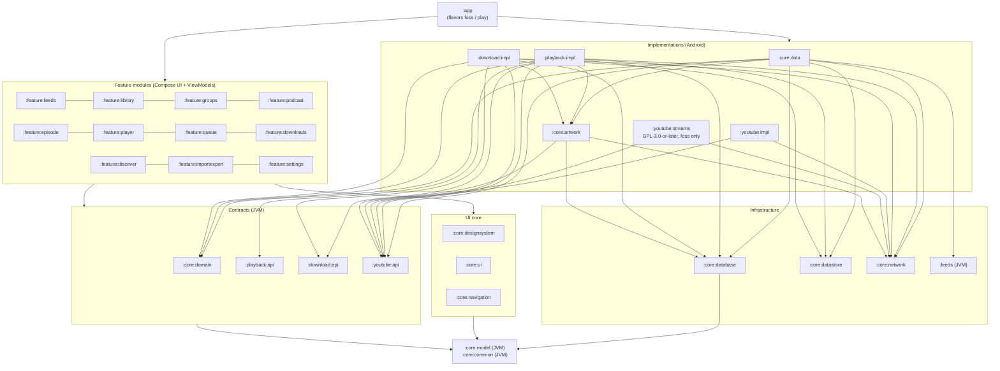
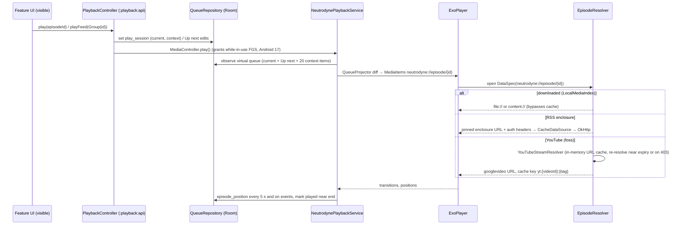
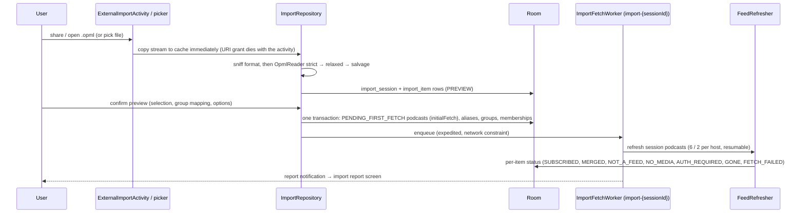
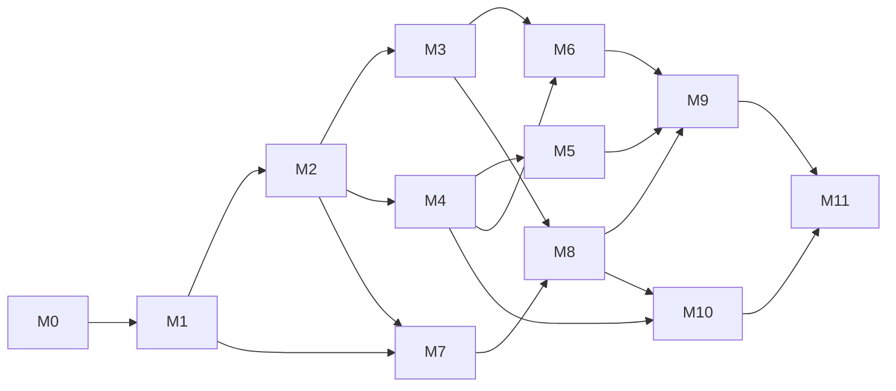

# Neutrodyne — Master plan

> Status: approved baseline for implementation, 2026-10-04. Audience: product owner (sections 1–4, 6–8) and engineers / AI coding sessions (all sections).
> This document is the single source of truth for scope, requirement IDs, decisions (D-ids), product-owner decisions (PO-ids), milestones (M-ids) and risks. The nine design documents in [`design/`](design/) elaborate it and must not contradict it. Where a design document and this plan disagree, this plan wins until it is amended.

Contents: [1. Vision and scope](#1-vision-and-scope) · [2. Requirements](#2-requirements) · [3. Key decisions](#3-key-decisions) · [4. Decisions needed from the product owner](#4-decisions-needed-from-the-product-owner) · [5. Architecture overview](#5-architecture-overview) · [6. Feature scope](#6-feature-scope) · [7. Roadmap](#7-roadmap) · [8. Risks and mitigations](#8-risks-and-mitigations) · [9. Design document index](#9-design-document-index) · [10. Glossary](#10-glossary) · [Appendix A. Key sources](#appendix-a-key-sources)

---

## 1. Vision and scope

**Neutrodyne is a server-less, open-source Android podcast player organised around groups.** A group ("tech", "news", "fiction") is a user-defined set of podcasts and YouTube channels, and every group is its own newest-first episode feed. Covers carry the visual identity of the app. Everything runs on the device: the phone polls feeds itself, there is no Neutrodyne backend, no account and no tracking.

The one place where every mainstream podcast app is weak is "a group as its own feed": AntennaPod's per-tag episode view has been an open request since 2021 ([#5222](https://github.com/AntennaPod/AntennaPod/issues/5222)), and Pocket Casts folders are paid, single-membership and cannot be used in Smart Playlists ([Pocket Casts docs](https://support.pocketcasts.com/knowledge-base/episode-filters/)). That is the product's differentiator; everything else must reach the table-stakes bar of AntennaPod and the polish bar of Pocket Casts.

### 1.1 Guiding principles

1. **Groups are first-class.** Many-to-many membership, a feed per group, per-group defaults, and groups that survive OPML and backup round trips.
2. **Cover-first.** Artwork is visible on every surface (grid, rows, player, lock screen, car) and drives colour; chrome stays quiet.
3. **Local-first and private.** The app talks only to hosts the user chose (feeds, enclosures, artwork, opted-in directories, YouTube when used). No analytics, no ads, no proprietary SDKs in the `foss` build.
4. **Never lose user data.** Subscriptions, groups, played state, positions and queue survive refreshes, crashes, migrations, reinstalls and phone changes.
5. **Built for Android 15–17 from day one.** Background-audio hardening, job quotas, user-initiated transfers, edge-to-edge, predictive back and large screens are design inputs, not retrofits.
6. **Honest flavors.** The `foss` build is the full product. The `play` build is everything Google Play policy allows and says so plainly.
7. **Public-domain code.** The repository stays under the Unlicense; GPL code is confined to one optional module (see [D3](#3-key-decisions), [PO-1](#po-1-licensing-of-shipped-binaries)).
8. **Testable by construction.** Pure-JVM parsers with golden corpora, fakes behind interfaces, exported Room schemas with migration tests, CI on every change.

### 1.2 Non-goals for v1.0

| Not in v1.0 | Why / when |
|---|---|
| Neutrodyne server, accounts, cross-device sync (gpodder, Nextcloud) | Distributed model ([D1](#3-key-decisions)); sync is "later" |
| Chromecast | Needs Google Play services, excluded from `foss` ([PO-6](#po-6-chromecast)); v1.x `play`-only at the earliest |
| Wear OS app, home-screen widgets, Quick Settings tile | v1.x (widgets) / later |
| Video-first experience | Video podcasts play as audio in v1.0; video surface and PiP in v1.x; YouTube is audio-only |
| Smart (rule-based) groups, nested groups, multiple queues | Schema reserved; later |
| Statistics, bookmarks, transcripts UI, value-for-value | Later (transcripts are ingested, not shown) |
| Volume boost, intro/outro skip, end-of-chapter timer, shake-to-extend | v1.x |
| Exact-time refresh, auto-play on Bluetooth connect, alarm wake-up podcasts | Impossible or silently muted under Android 15/17 rules ([D43](#3-key-decisions)) |
| Local-network (LAN) feeds, user-installed CAs | v1.x; clear error in v1.0 ([D28](#3-key-decisions)) |
| User-chosen (SAF) download folder | v1.x; v1.0 uses app-specific storage ([D48](#3-key-decisions)) |
| YouTube login, members-only, age-restricted content, YouTube Data API | Not supported ([D51](#3-key-decisions)) |
| Material 3 Expressive | Alpha-only today ([PO-4](#po-4-material-3-expressive)) |
| Spotify-exclusive shows, radio, news reader | Out of product scope |

---

## 2. Requirements

### 2.1 Functional requirements

Each sub-requirement is a testable statement. "Group feed" and the other terms are defined in the [Glossary](#10-glossary).

**R1 — Import and export of subscriptions**

| ID | Statement |
|---|---|
| R1.1 | The user can import an OPML 1.0/2.0 file chosen in the system file picker, shared from another app, or opened with "Open with". Malformed files (unescaped `&`, missing `/>`, undefined entities) still import every recoverable feed URL, and the user is told when folder structure was lost. |
| R1.2 | An import shows a preview (selectable items, duplicates, already-subscribed, invalid URLs, group mapping) before anything is written. Folder nesting and the `category` attribute both map to groups; known wrapper folders (`feeds`, Overcast `playlists`, a single root wrapper) do not become groups; already-subscribed podcasts receive the imported group memberships. |
| R1.3 | After confirming, all imported podcasts appear in the library within 2 s (as pending), are fetched in the background, and each item ends in a recorded status (subscribed, merged, not a feed, no media, auth required, gone, failed). Failures stay subscribed with Retry / Edit URL / Remove actions, and a final report is shown. Importing never posts new-episode notifications or queues auto-downloads for the imported back catalogue. |
| R1.4 | The user can export all subscriptions as OPML 2.0, either grouped (default: each feed exactly once, inside the folder of its first group, with a `category` attribute listing all its groups) or flat. Exporting and re-importing into an empty Neutrodyne reproduces every group, membership and group order. |
| R1.5 | The user can export or share a single group as OPML. |
| R1.6 | YouTube channel subscriptions export as `https://www.youtube.com/feeds/videos.xml?channel_id=UC…` outlines and re-import as YouTube podcasts. NewPipe JSON, LibreTube JSON (including channel groups) and Google Takeout `subscriptions.csv` (plain or inside a ZIP) can be imported; NewPipe JSON can be exported. |
| R1.7 | The user can create a full backup (a versioned ZIP containing library, groups, settings, per-episode user state, Up next and an OPML copy) and restore it in Merge (default) or Replace mode, including into a newer app version. |
| R1.8 | Without user action, Android Auto Backup carries a daily snapshot of the library to a new device; on first launch after reinstall the library, groups, played state, positions and queue are restored automatically. |
| R1.9 | Exports and backups never contain Basic-auth passwords unless the user opts in, and the user is warned when exported feed URLs look like private tokenised links. |

**R2 — Groups and group feeds**

| ID | Statement |
|---|---|
| R2.1 | The user can create, rename, recolour (12-colour palette), set an icon for, reorder and delete groups. Names are 1–40 characters after trimming, may contain emoji, and are unique case-insensitively after NFC normalisation. Deleting a group never deletes podcasts and can be undone for 10 s. |
| R2.2 | A podcast or YouTube channel can belong to zero, one or many groups. Memberships can be edited from the podcast screen, the group editor, a multi-select in the library, and during import or subscribe. |
| R2.3 | Each group is a separate feed: a paged list of all episodes of its member podcasts and channels, ordered by `sortDate` (newest first by default, per-group setting), with stable order across pages. Two virtual feeds exist: **All** (every podcast whose `includeInAll` is on) and **Ungrouped** (podcasts in no group). |
| R2.4 | The Feeds screen shows All, then user groups in user order, then optionally Ungrouped, as tabs; swiping switches feeds; the selected feed survives process death; deleting the selected group falls back to All. |
| R2.5 | Within a feed the user can filter by unplayed, downloaded, in progress and media type (audio / video), and can hide episodes older than N days (per group). |
| R2.6 | From a group the user can refresh only that group's podcasts, play the group (Up next first, then the group's unplayed episodes in the group's play order), mark all episodes as played (optionally only older than a date), download all unplayed (after a confirmation showing count and estimated size) and share the group as OPML. |
| R2.7 | Groups carry optional defaults: playback speed and skip silence (applied when playing from that group), auto-download policy, new-episode notifications (one system notification channel per group) and refresh interval. Every settings screen shows the effective value and where it comes from. |
| R2.8 | The groups list and tabs show per-group unplayed and new-since-last-visit counts, computed over a bounded time window. |
| R2.9 | With 300 podcasts, 50,000 episodes and 20 groups, a group feed's first page renders in ≤ 60 ms and the All feed in ≤ 100 ms of query time on the reference device (see N5). |

**R3 — YouTube channels as podcasts**

| ID | Statement |
|---|---|
| R3.1 | The user can subscribe to a YouTube channel by pasting or sharing any channel URL, handle (`@name`), legacy `/c/` or `/user/` URL, uploads-playlist URL or video URL. The channel ID (`UC…`) is resolved and stored, never the handle. In the `foss` build the user can also search channels by name. |
| R3.2 | A subscribed channel appears as a podcast with the channel avatar as cover, the channel banner on its detail screen and per-video thumbnails. By default only long-form uploads appear (no Shorts, no live streams, no members-only); per channel the user can opt into Shorts and past live streams. Premieres appear only once playable. |
| R3.3 | New uploads appear after a refresh. A YouTube-wide feed outage (all channels returning 404) never unsubscribes or marks channels dead; it shows one global notice and backs off. |
| R3.4 | YouTube channels behave like podcasts for groups, group feeds, counts, played state, positions, OPML export/import and backup. |
| R3.5 | **`foss` build:** YouTube episodes play as audio in the regular player (queue, background, lock screen, Bluetooth, sleep timer, chapters from description timestamps). Expired or IP-bound stream URLs are re-resolved transparently without losing position. |
| R3.6 | **`foss` build:** YouTube episodes can be downloaded as audio files (m4a by default) through the same download engine, policies and Downloads screen as podcasts, including auto-download (smaller default keep count). |
| R3.7 | **`play` build:** YouTube episodes are external episodes. They show title, date, description and thumbnail, and open in the YouTube app (or a browser). They cannot be queued, downloaded or played in the background, are skipped by "Play group", and do not count towards auto-download. |
| R3.8 | Stream-resolution failures are classified. Per-item "unavailable" reasons (age-restricted, members-only, upcoming, live, region, private, made-for-kids) are shown on the episode; repeated extractor failures open a circuit breaker and show "YouTube playback is temporarily broken — update Neutrodyne"; the queue continues with the next playable item. |

**R4 — Streaming and downloading**

| ID | Statement |
|---|---|
| R4.1 | Any audio episode can be streamed without downloading, with seeking, resume at the saved position, and a setting for streaming on metered networks (Allow / Ask / Never). |
| R4.2 | The user can download an episode with visible progress, pause, resume, cancel and retry. Downloads resume after network loss, process death and reboot from the bytes already received, and never store an HTML error page as an episode. |
| R4.3 | A downloaded episode plays from the local file in the same queue item as its stream would, fully offline, with artwork. |
| R4.4 | Auto-download can be enabled per podcast, per group or globally, with keep-latest-N, network policy (unmetered / any) and optional charging requirement. An episode the user deleted is never auto-downloaded again. |
| R4.5 | Played episodes are deleted automatically after a grace period (default 24 h); favourites, the playing episode, the next Up-next items and unplayed manual downloads are never auto-deleted; an optional storage cap stops auto-downloads when reached. |
| R4.6 | A Downloads screen shows in-progress items with their wait reason ("Waiting for Wi-Fi", "Retrying in 4 min", "Storage full"), completed items with storage usage, and failed items, with bulk delete. |
| R4.7 | Playback continues in the background with a media notification, lock-screen controls, Bluetooth and headset buttons, audio focus handling, pause on headphone unplug, and a System UI resumption card after reboot. |
| R4.8 | Up next supports add next / add last, drag reorder and swipe remove. Positions persist continuously; episodes are marked played automatically near the end; speed (0.5–3.0×), skip silence, configurable skip intervals, a sleep timer (duration, end of episode) and chapters (Podcasting 2.0 JSON, Podlove Simple Chapters, ID3/MP4 embedded) are available. |

**R5 — A nice UI showing podcasts' graphical covers**

| ID | Statement |
|---|---|
| R5.1 | The library is an adaptive cover grid (3 columns on 360–411 dp phones by default, density 72 / 100 / 152 dp selectable) with group filter chips and a Groups view of 2×2 cover mosaics. |
| R5.2 | Covers appear on every main surface: feed rows (56 dp), podcast header (160 dp), full player (≥ 280 dp), mini player (48 dp), notification, lock screen and Android Auto. |
| R5.3 | Artwork for every subscription and every downloaded episode is available offline from a pinned local store, which also feeds the lock screen and Auto. |
| R5.4 | Missing, broken or tiny artwork is replaced by a generated monogram cover (initials on a deterministic hue, ≥ 4.5:1 contrast); tiles show the artwork's average colour while loading, never a grey flash. |
| R5.5 | The app uses wallpaper dynamic colour on Android 12+ (brand scheme below); the full player, mini player tint and podcast header use a colour scheme derived from the artwork; light, dark and pure-black themes exist. |
| R5.6 | Groups have a colour, an optional icon and a 2×2 mosaic of member covers. |
| R5.7 | Covers animate between grid, podcast header and episode screens without flashing; layouts adapt to compact, medium, expanded and large widths and to tabletop posture. |
| R5.8 | YouTube thumbnails are shown 16:9-correct (never letterboxed bars), with a resolution fallback chain; system surfaces use the square channel avatar. |

### 2.2 Non-functional requirements

| ID | Area | Requirement (testable) |
|---|---|---|
| N1 | Reliability and data safety | No release may lose subscriptions, groups, played state, positions or queue: every schema change ships a tested Room migration; refreshes never delete user state; a stored non-zero position is never overwritten with 0 except by explicit reset or mark-played; at most 5 s of position is lost on a process kill. |
| N2 | Background and battery | Comply with Android 15–17 background rules: no exact alarms, no `REQUEST_IGNORE_BATTERY_OPTIMIZATIONS`, no FGS start from `BOOT_COMPLETED`; every background job is resumable and stops itself before 8 min; user-started downloads use user-initiated data transfer jobs on API 34+; playback is only started from user-visible or media-key paths. |
| N3 | Privacy | No analytics, advertising, Firebase or Google Play services in `foss`; network traffic only to user-initiated hosts and opted-in services listed in `PRIVACY.md`; private feed URLs and tokens never appear in logs, crash reports or directory queries; crash reports are sent only by the user's own email after per-crash consent. |
| N4 | Accessibility | Target WCAG 2.2 AA: every interactive element ≥ 48 dp, one TalkBack focus stop per row with custom actions for every swipe/drag/long-press action, readable at 200 % font scale, text contrast ≥ 4.5:1 (icons ≥ 3:1), honours "remove animations". Automated `ui-test-junit4-accessibility` checks run in instrumented UI tests. |
| N5 | Performance and scale | Targets on the reference device (PO-agreed mid-range phone): cold start p50 < 600 ms; frame jank < 1 % in cover-grid and feed scrolling; group-feed queries per R2.9; scale tested to 300 podcasts, 50,000 episodes, 50 groups; `foss` APK < 25 MB. |
| N6 | Offline | With no network the library, feeds, show notes, downloaded episodes and their artwork work; non-downloaded items are visibly unavailable; nothing blocks on a network call. |
| N7 | Platform compliance | targetSdk 37; edge-to-edge; predictive back; no orientation or resizability locks; 16 KB page alignment of native libraries; declared FGS types; contextual `POST_NOTIFICATIONS`; per-app language support. |
| N8 | Licensing and store policy | Licence allow-list enforced in CI; GPL code only in the `foss` binary with GPL obligations met; the `play` build follows Play policy guardrails ([D51](#3-key-decisions)); prior-art GPL/MPL code is never copied. |
| N9 | Security of untrusted input | Feeds, OPML, backups and import files are untrusted: no DTD/entity expansion, size/depth/count caps, zip-slip and zip-bomb protection, whitelisted backup entries; credentials encrypted with an Android Keystore key. |
| N10 | Localisation | All user-visible text externalised; RTL layouts verified; per-app language picker; pseudo-locale screenshot tests; translations via Weblate. |
| N11 | Maintainability | Module boundaries enforced by build checks; CI green on every merge; YouTube extractor hotfix from tag to signed GitHub release in < 30 min; design docs updated with every deviation. |

### 2.3 Traceability

Design-doc section links point at the mandatory headings defined for each document. Milestones are defined in [7. Roadmap](#7-roadmap).

| Req. | Design doc sections | Milestones |
|---|---|---|
| R1.1–R1.3 | [05 OPML import](design/05-groups-opml-backup.md#opml-import), [05 Receiving files](design/05-groups-opml-backup.md#receiving-files), [02 Tables](design/02-data-model.md#tables) | M3 |
| R1.4–R1.5 | [05 OPML export](design/05-groups-opml-backup.md#opml-export) | M3 |
| R1.6 | [04 Import and export formats](design/04-youtube.md#import-and-export-formats), [05 OPML import](design/05-groups-opml-backup.md#opml-import) | M8 |
| R1.7 | [05 Full backup and restore](design/05-groups-opml-backup.md#full-backup-and-restore) | M3 |
| R1.8 | [05 Auto Backup](design/05-groups-opml-backup.md#auto-backup), [07 Storage layout](design/07-downloads.md#storage-layout) | M3, M6 |
| R1.9 | [05 OPML export](design/05-groups-opml-backup.md#opml-export), [03 Feed moves, auth and paging](design/03-feeds-and-discovery.md#feed-moves-auth-and-paging) | M3 |
| R2.1–R2.2 | [05 Group model and lifecycle](design/05-groups-opml-backup.md#group-model-and-lifecycle), [08 Screens](design/08-ui-ux.md#screens) | M2 |
| R2.3–R2.5 | [05 Group feeds](design/05-groups-opml-backup.md#group-feeds), [02 Key queries](design/02-data-model.md#key-queries), [08 Group feed pager](design/08-ui-ux.md#group-feed-pager) | M2 |
| R2.6 | [05 Playing a group](design/05-groups-opml-backup.md#playing-a-group), [06 Queue and play context](design/06-playback.md#queue-and-play-context), [07 Auto-download policy](design/07-downloads.md#auto-download-policy) | M2, M3, M4, M6 |
| R2.7 | [05 Effective settings resolution](design/05-groups-opml-backup.md#effective-settings-resolution), [03 New-episode notifications](design/03-feeds-and-discovery.md#new-episode-notifications) | M2, M4, M6 |
| R2.8–R2.9 | [02 Key queries](design/02-data-model.md#key-queries), [02 Invalidation hygiene](design/02-data-model.md#invalidation-hygiene), [09 Performance budgets](design/09-quality-and-release.md#performance-budgets) | M2 |
| R3.1 | [04 Channel resolution](design/04-youtube.md#channel-resolution), [03 Add podcast flow](design/03-feeds-and-discovery.md#add-podcast-flow) | M8, M9 |
| R3.2–R3.3 | [04 Atom feed ingestion](design/04-youtube.md#atom-feed-ingestion), [04 Content flags and filtering](design/04-youtube.md#content-flags-and-filtering), [04 Artwork and thumbnails](design/04-youtube.md#artwork-and-thumbnails) | M8 |
| R3.4 | [05 Group feeds](design/05-groups-opml-backup.md#group-feeds), [04 Import and export formats](design/04-youtube.md#import-and-export-formats) | M8 |
| R3.5 | [04 Stream resolution](design/04-youtube.md#stream-resolution), [04 Playback integration](design/04-youtube.md#playback-integration), [06 Media items and URI resolution](design/06-playback.md#media-items-and-uri-resolution) | M9 |
| R3.6 | [04 Download integration](design/04-youtube.md#download-integration), [07 YouTube transfers](design/07-downloads.md#youtube-transfers) | M9 |
| R3.7 | [04 Flavor matrix](design/04-youtube.md#flavor-matrix), [08 Flavor differences in UI](design/08-ui-ux.md#flavor-differences-in-ui) | M8 |
| R3.8 | [04 Error handling and circuit breaker](design/04-youtube.md#error-handling-and-circuit-breaker) | M9 |
| R4.1 | [06 Media items and URI resolution](design/06-playback.md#media-items-and-uri-resolution), [06 Streaming cache](design/06-playback.md#streaming-cache) | M4 |
| R4.2 | [07 Runners and scheduling](design/07-downloads.md#runners-and-scheduling), [07 Transfer core](design/07-downloads.md#transfer-core), [07 State machine](design/07-downloads.md#state-machine) | M6 |
| R4.3 | [06 Media items and URI resolution](design/06-playback.md#media-items-and-uri-resolution), [07 Storage layout](design/07-downloads.md#storage-layout) | M6 |
| R4.4–R4.5 | [07 Auto-download policy](design/07-downloads.md#auto-download-policy), [07 Cleanup and quota](design/07-downloads.md#cleanup-and-quota), [05 Effective settings resolution](design/05-groups-opml-backup.md#effective-settings-resolution) | M6 |
| R4.6 | [07 Progress and notifications](design/07-downloads.md#progress-and-notifications), [08 Screens](design/08-ui-ux.md#screens) | M6 |
| R4.7 | [06 Service architecture](design/06-playback.md#service-architecture), [06 Notification and media buttons](design/06-playback.md#notification-and-media-buttons), [06 System surfaces](design/06-playback.md#system-surfaces), [06 Background restrictions](design/06-playback.md#background-restrictions) | M4, M5 |
| R4.8 | [06 Queue and play context](design/06-playback.md#queue-and-play-context), [06 Positions and played state](design/06-playback.md#positions-and-played-state), [06 Sleep timer](design/06-playback.md#sleep-timer), [06 Chapters](design/06-playback.md#chapters) | M4, M5 |
| R5.1 | [08 Screens](design/08-ui-ux.md#screens), [08 Components](design/08-ui-ux.md#components) | M1, M10 |
| R5.2–R5.4 | [08 Artwork pipeline](design/08-ui-ux.md#artwork-pipeline), [06 System surfaces](design/06-playback.md#system-surfaces) | M1, M4, M10 |
| R5.5 | [08 Theming and colour](design/08-ui-ux.md#theming-and-colour) | M10 |
| R5.6 | [08 Components](design/08-ui-ux.md#components), [05 Group model and lifecycle](design/05-groups-opml-backup.md#group-model-and-lifecycle) | M2, M10 |
| R5.7 | [08 Adaptive layouts](design/08-ui-ux.md#adaptive-layouts), [08 Navigation](design/08-ui-ux.md#navigation) | M10 |
| R5.8 | [08 Artwork pipeline](design/08-ui-ux.md#artwork-pipeline), [04 Artwork and thumbnails](design/04-youtube.md#artwork-and-thumbnails) | M8 |
| N1 | [02 Migrations and schema testing](design/02-data-model.md#migrations-and-schema-testing), [06 Positions and played state](design/06-playback.md#positions-and-played-state), [05 Full backup and restore](design/05-groups-opml-backup.md#full-backup-and-restore) | all |
| N2 | [01 Platform compliance](design/01-foundation.md#platform-compliance), [03 Refresh scheduling](design/03-feeds-and-discovery.md#refresh-scheduling), [06 Background restrictions](design/06-playback.md#background-restrictions), [07 Runners and scheduling](design/07-downloads.md#runners-and-scheduling) | M1, M4, M6 |
| N3 | [09 Privacy](design/09-quality-and-release.md#privacy), [09 Crash reporting and diagnostics](design/09-quality-and-release.md#crash-reporting-and-diagnostics) | M0, M11 |
| N4 | [08 Accessibility](design/08-ui-ux.md#accessibility) | every UI milestone, audit in M10 |
| N5 | [09 Performance budgets](design/09-quality-and-release.md#performance-budgets), [02 Indices](design/02-data-model.md#indices) | M2, M10, M11 |
| N6 | [08 Artwork pipeline](design/08-ui-ux.md#artwork-pipeline), [07 Storage layout](design/07-downloads.md#storage-layout) | M1, M4, M6 |
| N7 | [01 Platform compliance](design/01-foundation.md#platform-compliance), [01 Manifest and permissions](design/01-foundation.md#manifest-and-permissions) | M0, M11 |
| N8 | [01 Licensing and dependency policy](design/01-foundation.md#licensing-and-dependency-policy), [04 Licensing and legal](design/04-youtube.md#licensing-and-legal), [09 Distribution channels](design/09-quality-and-release.md#distribution-channels) | M0, M9, M11 |
| N9 | [05 OPML import](design/05-groups-opml-backup.md#opml-import), [03 Parser](design/03-feeds-and-discovery.md#parser), [09 Test strategy](design/09-quality-and-release.md#test-strategy) | M1, M3 |
| N10 | [09 Localisation](design/09-quality-and-release.md#localisation) | M0, M10, M11 |
| N11 | [01 Dependency rules](design/01-foundation.md#dependency-rules), [09 CI pipelines](design/09-quality-and-release.md#ci-pipelines) | M0 onward |

---

## 3. Key decisions

ADR-style register. "Conflict" marks a decision that resolves contradictory research recommendations. The owning design document records the detail; changing a decision requires amending this table.

| ID | Decision | Choice | Rationale | Alternatives rejected | Owner |
|---|---|---|---|---|---|
| D1 | System architecture | Distributed: the device polls feeds; no Neutrodyne server | No backend to run or trust; private feeds stay private; works with authenticated feeds (AntennaPod model) | Central poller (Pocket Casts model) | PLAN, [03](design/03-feeds-and-discovery.md) |
| D2 | Build flavors | One dimension `distribution`: `foss` (full app, GitHub/IzzyOnDroid/F-Droid) and `play` (Google Play, policy-compliant) | YouTube playback/download and Play policy are incompatible; one codebase, two binaries | Single build; separate repos | [01](design/01-foundation.md#build-flavors) |
| D3 | Licensing structure (subject to PO-1) | Repository stays Unlicense; only `:youtube:streams` (NewPipe Extractor) is GPL-3.0-or-later and is a `foss`-only dependency; the `foss` APK is distributed under GPL-3.0-or-later; the `play` APK contains no GPL-3.0 code (Unlicense code plus permissively licensed dependencies) | Keeps ~95 % of code public domain; FSF lists the Unlicense as GPL-compatible | Relicense all to GPL; YouTube.js clean-room route; official-only YouTube | [04](design/04-youtube.md#licensing-and-legal), [01](design/01-foundation.md#licensing-and-dependency-policy) |
| D4 | Toolchain | Kotlin 2.4.20, AGP 9.4.1 with built-in Kotlin (fallback 9.3.3), **Gradle 9.7.1**, KSP 2.3.12, JDK 21 runs Gradle, bytecode 17; no kapt | Only current AGP line; Compose 1.12 needs AGP ≥ 9.2. Conflict: Gradle 9.8.0 is current, but Kotlin 2.4.20 is tested only to Gradle 9.7.0, so stay on 9.7.1 | AGP 8.x; Gradle 9.8 | [01](design/01-foundation.md#toolchain-and-versions) |
| D5 | SDK levels (subject to PO-7) | minSdk 26, compileSdk 37, targetSdk 37 | ~96.1 % reach; removes pre-O branches; Android 17 rules designed in | minSdk 24 / 29 / 31 | [01](design/01-foundation.md#toolchain-and-versions) |
| D6 | Design system (subject to PO-4) | Compose BOM 2026.09.00, Material 3 **1.4.0 stable**; all components wrapped in `:core:designsystem` | Conflict: `stack.md` treated Expressive as an isolated alpha; `material3:1.5.0-alpha29` actually pulls Compose core `1.13.0-alpha01` into the whole app | Expressive at launch; Views | [08](design/08-ui-ux.md#theming-and-colour) |
| D7 | Navigation | Navigation 3 1.2.0, one back stack per top-level tab, `ListDetailSceneStrategy`; keys named `*Key` in `:core:navigation`; cross-feature sheets are Nav3 entries | Nav2 is in maintenance mode; adaptive panes. Conflict: research used both `*Route` and `*Key` names | Navigation Compose 2.x | [08](design/08-ui-ux.md#navigation), [01](design/01-foundation.md#architecture-patterns) |
| D8 | Dependency injection | Hilt 2.60.1 + androidx.hilt 1.4.0 (KSP) | First-party integrations for services, workers, Nav3 ViewModels; compile-time graph | Metro, Koin, manual | [01](design/01-foundation.md#dependency-injection) |
| D9 | Persistence | Room 3.0.3 (`androidx.room3`) with `BundledSQLiteDriver` in production; driver is a Hilt binding so JVM/Robolectric tests use `AndroidSQLiteDriver` | Modern SQLite on every API level (window functions, row values); bundled `.so` likely won't load under Robolectric | Room 2.8, SQLDelight, framework driver in production | [02](design/02-data-model.md#conventions) |
| D10 | HTTP stack | One `OkHttpClient` (OkHttp 5.5.0) shared via `newBuilder()`; **no OkHttp `Cache` anywhere in v1** | Conflict: `stack.md` proposed a 64 MB OkHttp cache for feed conditional GET; `feeds.md` showed it duplicates bodies, honours `max-age` (stale pull-to-refresh) and stores validators for failed parses. Feeds use own validators, Coil its own disk cache, media its `SimpleCache`, search an in-memory LRU | OkHttp `Cache`; Ktor; Retrofit | [01](design/01-foundation.md#networking-baseline), [03](design/03-feeds-and-discovery.md#fetch-pipeline) |
| D11 | Feed parser | Hand-written streaming `XmlPullParser` in pure-JVM `:feeds`, namespace-URI matching, relaxed mode, HTML entities predefined; golden corpus | RSS-Parser has no Podcasting 2.0, one enclosure, prefix matching | RSS-Parser, ROME, xmlutil, porting GPL AntennaPod code | [03](design/03-feeds-and-discovery.md#parser) |
| D12 | Layering | UDF/MVVM. Repository **interfaces** and cross-repository use cases live in pure-JVM `:core:domain`; implementations in `:core:data` and `*:impl`; features depend only on `:core:domain` and `*:api`, never on `:core:data`/`:core:database` | `stack.md` left this rule open; this makes features testable with fakes and keeps Room out of feature classpaths | Features reading `:core:data` directly; mandatory use case per action | [01](design/01-foundation.md#dependency-rules) |
| D13 | Module names | The canonical module list in [5.1](#51-module-graph) | Conflict: research proposed `:feature:add` vs `:feature:discover`, `:core:download` vs `:download:impl`, `:youtube-streams` vs `:youtube:impl-streams`, `:core:work`, `:feature:importexport` | — | [01](design/01-foundation.md#module-layout) |
| D14 | Source of truth | Room is the single source of truth; UI observes flows; deferrable work runs in WorkManager | Offline by construction | In-memory caches as truth | [01](design/01-foundation.md#architecture-patterns) |
| D15 | Feed data vs user state | `episode` holds feed-derived columns only and is written only by ingestion; low-churn user state in `episode_state`; high-churn position in `episode_position` | Conflict: `downloads.md` put `downloadDismissedAt`/`isFavorite`/`playedAt` on `episode`; `playback.md` kept position with played state. Refreshes must never clobber user state, and list queries must not join 5-s writes | User columns on `episode`; one state table | [02](design/02-data-model.md#tables) |
| D16 | List invalidation hygiene | Paged list queries join only low-churn tables (`episode`, `podcast`, `podcast_group_member`, `episode_state`, `download`, `artwork`); positions, live download bytes and now-playing reach rows through `EpisodeLiveStateSource` keyed by visible IDs | Conflict: `stack.md`'s group-feed SQL joined position and download progress; Room re-runs `COUNT(*)` + page on every write to any observed table (`opml-groups.md`, `ui.md`) | Join everything; custom throttled `PagingSource` | [02](design/02-data-model.md#invalidation-hygiene), [08](design/08-ui-ux.md#live-row-state) |
| D17 | Download progress persistence | `download` row is low-churn: `downloadedBytes` persisted only on state transitions; the `.part` file length is the authoritative resume offset; live bytes via in-memory `DownloadProgressSource` (≤ 4 Hz) | Conflict: `downloads.md` persisted bytes every ~2 s into a table that list queries join | Separate `download_progress` table | [07](design/07-downloads.md#progress-and-notifications) |
| D18 | Episode identity | Key ladder guid → normalised enclosure URL → hash(title + day) → hash(link), with fallback matching for GUID rewrites; key algorithm carries a version (`kv`) because backups depend on it | Prevents duplicates on host migrations; backups match by key | Row IDs in backups; guid only | [03](design/03-feeds-and-discovery.md#ingestion-and-diff), [02](design/02-data-model.md#identity-keys) |
| D19 | Feed ordering | `sortDate = min(pubDate ?: firstSeenAt, firstSeenAt + 24h)`, tiebreak `feedOrder`, list order `(sortDate, id)` | Future-dated and undated items cannot pin to the top of group feeds | Raw pubDate | [03](design/03-feeds-and-discovery.md#ingestion-and-diff) |
| D20 | Per-scope settings | Typed tables `podcast_settings` and `podcast_group_settings` (nullable = inherit), globals in DataStore; **no per-episode overrides in v1** | Conflict: `playback.md` proposed one scope-keyed `PlaybackOverrides` table (no FKs, orphans) | Scope-keyed table | [05](design/05-groups-opml-backup.md#effective-settings-resolution), [02](design/02-data-model.md#tables) |
| D21 | UUID storage | UUIDs stored as `TEXT` | Conflict: `stack.md` claims built-in `kotlin.uuid.Uuid` support in Room 3; `opml-groups.md` found it only in 3.1.0-alpha01. `TEXT` works either way | `Uuid` column type | [02](design/02-data-model.md#conventions) |
| D22 | Schema baseline | The complete v1 schema (every canonical table) is created in M1; every later change ships a migration with a `MigrationTestHelper` test from the first tester build on | Testers' data matters; avoids churn while features land | Destructive migrations until 1.0 | [02](design/02-data-model.md#migrations-and-schema-testing) |
| D23 | Episode retention | Episodes absent from the feed (`inFeed = 0`) are deleted after 90 days unless downloaded, queued, favourited, in progress or played in the last 30 days; newest item per feed kept | Conflict: `feeds.md` left it open; `prior-art.md` documents 80–364 MB AntennaPod databases | Keep forever | [02](design/02-data-model.md#retention-and-maintenance) |
| D24 | Unsubscribe and preview | Previews are parsed in memory and never persisted; unsubscribing deletes the podcast and its episodes, state and downloads (with confirmation) | No orphan "preview" rows to clean; simpler queries (no `isSubscribed` predicate) | AntennaPod-style persisted previews | [03](design/03-feeds-and-discovery.md#add-podcast-flow) |
| D25 | Refresh scheduling | One periodic WorkManager tick (`refresh-periodic`) whose interval is the smallest effective refresh interval (default 4 h, never < 1 h) + per-feed `nextRefreshAt` with backoff; manual refresh is expedited `refresh-now`; 6 parallel fetches, 2 per host; 8-min soft deadline with continuation | Conflict: `prior-art.md` proposed an hourly tick and 4 threads; `feeds.md` a user-interval tick and 6/2. Per-group intervals require the min rule | Per-feed periodic work; AlarmManager | [03](design/03-feeds-and-discovery.md#refresh-scheduling) |
| D26 | Discovery (subject to PO-3) | Apple iTunes Search (default), fyyd, Podcast Index only when a key is present (build secret after written permission, or bring-your-own-key); no gpodder.net | Keyless coverage; PI ToS forbids embedding credentials in open-source projects | gpodder.net (stale), commercial directories | [03](design/03-feeds-and-discovery.md#search-and-discovery) |
| D27 | Show notes | Sanitise with jsoup 1.23.2 at display time into a block model (`:feeds`), render with a custom Compose renderer; timestamps become seek links; remote images optional | `AnnotatedString.fromHtml` is too limited; WebView too heavy | WebView; `fromHtml` only | [03](design/03-feeds-and-discovery.md#show-notes), [08](design/08-ui-ux.md#components) |
| D28 | Network policy (subject to PO-13) | Cleartext `http://` allowed via network security config; `https://` tried first only for scheme-less user input; user CAs not trusted; LAN feeds unsupported in v1 with a specific error | Many feeds, enclosures and covers are still `http://`; Android 17 LAN permission is a v1.x feature | Block cleartext; upgrade-or-fail | [01](design/01-foundation.md#networking-baseline), [03](design/03-feeds-and-discovery.md#fetch-pipeline) |
| D29 | Group model | Many-to-many via `podcast_group_member`; groups have local `id`, stable `uuid`, unique `nameKey`; All and Ungrouped are virtual `FeedSource`s; smart-group columns reserved | Overlapping groups are natural; UUIDs survive rename, backup and future sync | One group per podcast; tag string | [05](design/05-groups-opml-backup.md#group-model-and-lifecycle) |
| D30 | Group feed paging | One `FeedQueryBuilder` → `RoomRawQuery` → `@RawQuery` returning `PagingSource` (Room LimitOffset); fallback: generated `@Query` per (source × order) if the spike fails | One builder for every feed, Auto browse and future smart groups | Denormalised feed table; custom keyset source (fallback only for All) | [05](design/05-groups-opml-backup.md#group-feeds), [02](design/02-data-model.md#key-queries) |
| D31 | OPML export format | Hybrid by default: each feed once, nested under its primary (first) group, `category` lists all groups (percent-encoded `, / %`); "Flat list" option; YouTube included by default; Neutrodyne extras in namespace prefix `nd` | Conflict: `prior-art.md` preferred flat + `category` by default; `opml-groups.md` showed FreshRSS turns a flat `category="tech,news"` into one category named "tech, news" while folder-aware importers recreate the primary group | Flat default; repeated feeds per folder | [05](design/05-groups-opml-backup.md#opml-export) |
| D32 | OPML import | Streaming parser cascade strict → relaxed → regex salvage; preview; commit creates `PENDING_FIRST_FETCH` podcasts; the refresh engine fetches them with `initialFetch` suppression; per-item status in `import_item` | Library fills instantly; resumable; dead feeds kept (AntennaPod 3.1 lesson) | Validate before subscribe; DOM parsing | [05](design/05-groups-opml-backup.md#opml-import) |
| D33 | Backup format | Versioned ZIP: `manifest.json`, `library.json`, `episodes.jsonl`, `queue.json`, `settings.json`, `subscriptions.opml`, keyed by stable identities (feed key, `podcastGuid`, episode `identityKey`); Merge/Replace restore; raw DB copy only as a diagnostics export | Conflict: `prior-art.md` suggested periodic full-DB export (AntennaPod); raw copies are schema-bound, replace-only and large | DB file copy; OPML only | [05](design/05-groups-opml-backup.md#full-backup-and-restore) |
| D34 | Android Auto Backup | Include-only rules: `files/backup/auto-snapshot.zip` + `datastore/settings.preferences_pb`; never the Room DB, downloads, Coil cache, credentials or `device_settings` | Conflict: `downloads.md` only excluded download folders (DB still backed up); the 25 MB cap silently cancels the whole backup | Exclude-only rules; `allowBackup=false` | [05](design/05-groups-opml-backup.md#auto-backup) |
| D35 | DataStore split | `settings` (portable, backed up) and `device_settings` (SAF grants, volume UUIDs, prompts; never backed up) | Restored device-bound values lie on a new phone | One file | [01](design/01-foundation.md#architecture-patterns), [05](design/05-groups-opml-backup.md#auto-backup) |
| D36 | New-episode notification channels | One channel per notifying group (`new_episodes_<groupUuid>`) in channel group `grp_new_episodes`, plus `new_episodes` default; off by default | Conflict: `stack.md` had one `new_episodes` channel; per-group channels give per-group sound/importance in system settings | Single channel | [03](design/03-feeds-and-discovery.md#new-episode-notifications) |
| D37 | Playback service | `MediaLibraryService` (class `NeutrodynePlaybackService`, name stable forever) with a small browse tree | Conflict: `stack.md` used `MediaSessionService`; only the library variant shows the System UI resumption card after reboot, and it enables Auto/AVRCP browsing | `MediaSessionService` | [06](design/06-playback.md#service-architecture) |
| D38 | Queue model | DB owns Up next (`queue_entry`) and the play context (`play_session`); the player holds a projection window: current + Up next + K = 20 context items, diffed by `QueueProjector` | Conflict: `prior-art.md` proposed mirroring the whole queue into ExoPlayer; a 2,000-episode group would serialise to every controller. The window keeps a continuous playlist (no FGS restarts between items) | Full mirror; one item at a time | [06](design/06-playback.md#queue-and-play-context) |
| D39 | Media URI | Every playable episode's `MediaItem` URI is `neutrodyne://episode/{episodeId}` (mediaId `episode:{episodeId}`), resolved per connection by a `ResolvingDataSource` to a local file, a pinned remote enclosure, or (foss) a fresh YouTube stream URL. No `yt://` media URIs | Conflict: `youtube.md` proposed `yt://<videoId>`, `playback.md` `neutrodyne://yt/{videoId}`. One scheme makes downloads, YouTube and queue diffing uniform | Per-source schemes; resolve at item build | [06](design/06-playback.md#media-items-and-uri-resolution), [04](design/04-youtube.md#playback-integration) |
| D40 | Streaming cache | Media3 `SimpleCache` with LRU 500 MB (user-adjustable) in `filesDir/media-cache`, separate from downloads | Robust rewind and short gaps; downloads must never be LRU-evicted | No cache; Media3 downloads as store | [06](design/06-playback.md#streaming-cache) |
| D41 | Position persistence | Save every 5 s while playing, plus on pause, seek, item transition (outgoing item first) and service destroy, into `episode_position`; never overwrite non-zero with 0 unless reset or played | Conflict: `playback.md` proposed 10 s, `prior-art.md` 5 s plus the guard (AntennaPod 3.12 position-loss bug class). Cheap because the table is not joined by lists | 10 s | [06](design/06-playback.md#positions-and-played-state) |
| D42 | Artwork for system surfaces | Pinned `ArtworkStore` (`filesDir/artwork`, ≤ 1024 px) is served by `ArtworkProvider` (`content://${applicationId}.artwork/…`) to notification, lock screen, Auto, resumption card and (later) widgets; Coil reads the same files first | Conflict: `playback.md` proposed serving from Coil's disk cache; that cache is purgeable, LRU and URL-keyed | Coil disk cache; embedded ID3 art | [08](design/08-ui-ux.md#artwork-pipeline), [06](design/06-playback.md#system-surfaces) |
| D43 | Android 17 background audio | Playback starts only via `MediaController.play()` from visible UI, notification, media key or widget tap; no auto-play-on-connect, alarm or "play when download finishes"; after FGS demotion post "Tap to resume" | Silent muting otherwise ([Android 17 bg audio](https://developer.android.com/about/versions/17/changes/bg-audio)) | Background-started playback | [06](design/06-playback.md#background-restrictions) |
| D44 | Play group semantics (subject to PO-11) | "Play group" keeps Up next and plays it first, then the group's unplayed episodes in the group's `playOrder` (Spotify model) | Least destructive; Up next stays user-owned | Replace Up next; ask every time | [06](design/06-playback.md#queue-and-play-context), [05](design/05-groups-opml-backup.md#playing-a-group) |
| D45 | Effective settings | Playback (speed, skip silence, later boost): podcast override → group of the current play context → global. Auto-download: podcast explicit → merge over member groups (`enabled = any`, `keepLatest = max`, network = most restrictive, delete-after = least aggressive) → global. Notifications: podcast → any group → global (off). Refresh interval: podcast → min over groups → global | One `EffectiveSettingsResolver` used by playback, downloads, refresh and notifications | Per-module ad-hoc rules | [05](design/05-groups-opml-backup.md#effective-settings-resolution) |
| D46 | Download engine | Own engine on OkHttp writing real files (`.part` → verify → rename/copy), `Range`/`If-Range` resume, `Accept-Encoding: identity`, DB as the only state | Users can copy files; per-download network rules; Media3 `DownloadService` cannot restart from background and stores opaque spans; system `DownloadManager` is opaque and quota-bound | Media3 downloads; system DownloadManager | [07](design/07-downloads.md#engine-architecture) |
| D47 | Download runners | Manual: user-initiated data transfer job (API 34+); WorkManager expedited work promoted to a `dataSync` FGS only when started while visible (API 26–33). Auto: regular WorkManager lane worker with constraints and an 8-min soft deadline. One unique worker per lane | Android 16 quotas apply to jobs running beside the playback FGS; UIDT is exempt but user-initiated only. `dataSync` runs only where the Android 15 cap does not apply | WorkManager-only; long `dataSync` FGS | [07](design/07-downloads.md#runners-and-scheduling) |
| D48 | Download storage | Default `getExternalFilesDir(DIRECTORY_PODCASTS)` (no permission, visible over USB), internal option; SAF custom folder in v1.x; no MediaStore; `hasFragileUserData = true` | Simple, resumable; MediaStore loses ownership after reinstall | MediaStore; SAF in v1.0 | [07](design/07-downloads.md#storage-layout) |
| D49 | File layout | One layout for RSS and YouTube: `<root>/<Podcast Title> [p<id>]/<yyyy-MM-dd> <Episode Title> [e<id>].<ext>`, `.part` files in `<root>/.partial/` | Conflict: `youtube.md` proposed a separate `Neutrodyne/YouTube/<channel>/` tree | Per-source trees | [07](design/07-downloads.md#storage-layout) |
| D50 | Stream URLs are never persisted | Resolved googlevideo and post-redirect CDN URLs live only in memory (`ResolvedUrlCache`, TTL ≤ min(expire − 10 min, 5 h)) | Conflict: `downloads.md` stored `resolvedUrl`/`resolvedExpiresAt` in `download`; `youtube.md` showed URLs are IP-bound and expire (~6 h) | Persisted URLs | [04](design/04-youtube.md#stream-resolution), [07](design/07-downloads.md#youtube-transfers) |
| D51 | YouTube layers | Layer A (all builds, Unlicense): channel ID resolution, Atom feed of the long-form uploads playlist (`playlist_id=UULF…`), avatars, thumbnails. Layer B (`foss` only, GPL): NewPipe Extractor v0.26.5 for audio streams, downloads, enrichment and channel search. `play` treats YouTube items as external episodes. No YouTube Data API in v1 (durations unknown in `play`) | Play policy forbids apps that use a service "in a manner that violates its terms of service"; YouTube API policies forbid background play, audio separation and downloads | Data API everywhere; extraction in `play`; companion app | [04](design/04-youtube.md#flavor-matrix) |
| D52 | YouTube audio format | itag 140 (AAC m4a) default, ranks 140 > 251 > 250 > 139 > 249; original audio track; non-DRC; Opus / data-saver as settings | Plays everywhere, best "copy the file" story | Opus default | [04](design/04-youtube.md#stream-resolution) |
| D53 | YouTube playlists | `PL…` playlists not subscribable in v1 (`SourceType.YOUTUBE_PLAYLIST` reserved) | Atom returns the first 15 in playlist order, so new items may never appear | Support with Atom only | [04](design/04-youtube.md#channel-resolution) |
| D54 | Top-level destinations | Feeds · Library · Up next · Downloads · Discover; Settings is a gear in top bars and the rail footer | Conflict: `stack.md` listed Library, Groups, Downloads/Queue, Settings; M3 caps a bar at 5 and Settings is not a peer | Settings tab; drawer | [08](design/08-ui-ux.md#information-architecture) |
| D55 | Switching group feeds | `PrimaryScrollableTabRow` + `HorizontalPager`, "All groups" sheet for many groups; filter chips only filter within a feed; row swipe actions off in Feeds (on elsewhere) | Tabs are places, chips are filters; pager swipe and row swipe conflict | Chips as group selector; drawer | [08](design/08-ui-ux.md#group-feed-pager) |
| D56 | Player presentation | One root-level `PlayerSheet` (mini ↔ full via `AnchoredDraggableState`), not a navigation destination; side panel on ≥ 840 dp | Conflict: `stack.md` proposed a `PlayerKey` entry; a nav entry cannot follow the finger and pollutes every tab's back stack | Nav destination; `BottomSheetScaffold` | [08](design/08-ui-ux.md#player-sheet) |
| D57 | Colour extraction | `com.materialkolor:material-color-utilities` 5.0.1 (pure Kotlin MCU) computes a seed and average colour once per artwork in a worker, persisted in `artwork`; schemes built from seeds | Conflict: `stack.md` offered MaterialKolor or `androidx.palette`; palette gives no M3 roles and the `material-kolor` Compose artifact is compiled against M3 1.5 alpha | Palette; extraction in composition | [08](design/08-ui-ux.md#theming-and-colour) |
| D58 | Image loading | Coil 3.6.3 singleton: OkHttp client without cache, memory 20 % (25 % of that in background), disk 256 MB in `cacheDir/coil`, `ArtworkRef` mapper (pinned file first), YouTube thumbnail interceptor, explicit two-tier memory keys | Conflict: `stack.md`'s loader double-cached via OkHttp and used a different cache path; two-tier keys prevent shared-element flashes | Glide; default Coil config | [08](design/08-ui-ux.md#artwork-pipeline) |
| D59 | Testing stack | JUnit 4 + TestParameterInjector, Truth, Turbine, coroutines-test, hand-written fakes in `:core:testing`, MockWebServer 5.5.0, Robolectric 4.17, Roborazzi 1.76.0, Media3 test utils, GMD instrumented tests | Conflict: `ui.md` suggested Compose Preview Screenshot Testing (alpha); Roborazzi is the stable option compatible with AGP 9 | JUnit 6, MockK-first, Paparazzi | [09](design/09-quality-and-release.md#test-strategy) |
| D60 | CI and tooling | GitHub Actions (SHA-pinned), Gradle Managed Devices, Lint + Spotless/ktlint/compose-rules (blocking), detekt 2.0 alpha (non-blocking), Licensee, module-graph assertion, Renovate with a NewPipe Extractor fast lane | Free for public repos; parity between local and CI | Dependabot; emulator-runner as primary | [09](design/09-quality-and-release.md#ci-pipelines) |
| D61 | Signing and IDs (subject to PO-8) | One developer-held signing key for every channel (own key uploaded to Play before first release); same `applicationId` for both flavors; reproducible `fossRelease` so F-Droid ships our signature | Users can move between channels without data loss; only one key to register for developer verification | Per-store keys; Google-generated Play key | [09](design/09-quality-and-release.md#versioning-and-signing) |
| D62 | Privacy and crash reporting (subject to PO-10) | No analytics, ads, Firebase or Play services in `foss`; ACRA 5.14.2 with mail sender + dialog (per-crash consent), no logcat, URL redaction | Zero network traffic from the reporter; accepted by F-Droid (NewPipe precedent) | Crashlytics, Sentry, HTTP ACRA | [09](design/09-quality-and-release.md#crash-reporting-and-diagnostics) |
| D63 | Versioning | SemVer `versionName`; `versionCode = MAJOR·1 000 000 + MINOR·10 000 + PATCH·100 + 95` (betas 01–94); single source in `gradle.properties`; tags `vX.Y.Z` | Deterministic from source (F-Droid, reproducibility) | Git commit counts | [09](design/09-quality-and-release.md#versioning-and-signing) |
| D64 | Deferred surfaces | Android Auto: basic browse tree in v1.0 (needed by `MediaLibraryService`), polish and Play car review in v1.x; widgets, Chromecast, video surface/PiP in v1.x | Conflict: `ui.md` put the Now-playing widget in v1, `prior-art.md` put widgets later; widget-started playback under Android 17 is unverified | All in v1.0 | PLAN, [06](design/06-playback.md#system-surfaces), [08](design/08-ui-ux.md#scope) |
| D65 | Listening extras split | v1.0: speed, skip silence (Media3 built-in), sleep timer (duration, end of episode), chapters. v1.x: volume boost (custom limiter processor), intro/outro skip, end-of-chapter timer, shake-to-extend | Conflict: `playback.md` specified all in the first cut, `prior-art.md` marked boost/skip-intro "later"; the audio chain is designed for boost from day one, columns reserved | All in v1.0 | [06](design/06-playback.md#per-scope-playback-settings) |
| D66 | Import back catalogue | Imported and restored podcasts fetch with `initialFetch = true`: no `isNew`, no notifications, no auto-download; existing episodes default to unplayed with a preview toggle "treat existing episodes as played except the newest per podcast" | Prevents 300-notification storms and gigabyte auto-downloads | Treat imports as new | [05](design/05-groups-opml-backup.md#opml-import), [03](design/03-feeds-and-discovery.md#ingestion-and-diff) |
| D67 | Auto-download on subscribe | No back-catalogue auto-download: only episodes first seen after subscribing are candidates | Avoids surprise data use | Backfill newest N | [07](design/07-downloads.md#auto-download-policy) |

---

## 4. Decisions needed from the product owner

Each decision has a **default**: implementation proceeds with the default unless the product owner answers before the blocked milestone starts. Defaults are already reflected in D-ids above. The first seven are the major decisions; the rest are listed compactly in [4.8](#48-further-product-owner-decisions).

### PO-1: Licensing of shipped binaries

Context: YouTube in-app audio playback and download (R3.5, R3.6) needs a stream extractor. The only mature Java/Kotlin option is NewPipe Extractor (GPL-3.0-or-later, [repo](https://github.com/TeamNewPipe/NewPipeExtractor)). Shipping it inside an APK makes that APK a combined GPL work. The FSF lists the Unlicense as GPL-compatible ([Unlicense](https://en.wikipedia.org/wiki/Unlicense)), so the combination is legal.

| Option | Consequences |
|---|---|
| **A (recommended).** Repository stays Unlicense; only `:youtube:streams` is GPL-3.0-or-later (SPDX headers), linked only into `foss`. The `foss` APK is distributed under GPL-3.0-or-later with corresponding source = the public git tag; the `play` APK contains no GPL-3.0 code. | ~95 % of code stays public domain. README, About and licences screen state which licence applies to which artefact. F-Droid `License:` field is GPL-3.0-or-later. Contributors must not copy GPL module code into Unlicense modules (CI SPDX check). |
| B. Relicense the whole repository to GPL-3.0-or-later. | Simplest legal story; GPL code (NewPipe, LibreTube) could be reused. Gives up the public-domain stance permanently for contributions. |
| C. No GPL anywhere: build YouTube extraction on MIT YouTube.js + googlevideo + BgUtils inside an embedded JS engine or WebView. | Keeps everything permissive, and is ahead on SABR, but costs an estimated 2–3 additional milestones plus permanent maintenance of a JS bridge. |
| D. Official-only YouTube everywhere (Atom feeds + "Open in YouTube"). | No GPL, no legal exposure, but **R3.5 and R3.6 are not delivered** in any build. |

- **Recommendation and default:** A.
- **Blocks:** M9 (the `:youtube:streams` module may not be merged without an answer or the default being accepted in writing). M0–M8 are unaffected.

### PO-2: Distribution channels and YouTube per flavor

Context: Google Play prohibits "Apps that access or use a service or API in a manner that violates its terms of service" ([Device and Network Abuse](https://support.google.com/googleplay/android-developer/answer/9888379)); YouTube's API policies forbid background players, separating audio and downloading ([Developer Policies](https://developers.google.com/youtube/terms/developer-policies)); YouTube's terms forbid downloading except where expressly authorised ([ToS](https://www.youtube.com/static?template=terms)). NewPipe's README states that putting NewPipe or any fork on Play violates Play's terms ([README](https://github.com/TeamNewPipe/NewPipe/blob/dev/README.md)). Every app that extracts YouTube streams (NewPipe, LibreTube, Tubular) lives outside Play; Podcini stopped YouTube work in January 2025 over legal concerns ([README](https://github.com/XilinJia/Podcini)).

What each build does with YouTube:

| Capability | `foss` (GitHub Releases + Obtainium, IzzyOnDroid, F-Droid) | `play` (Google Play) |
|---|---|---|
| Subscribe by URL / share / OPML / NewPipe / LibreTube / Takeout import | Yes | Yes |
| Subscribe by typing a channel name | Yes (extractor search) | No (paste or share a link instead) |
| Listing, covers, banners, thumbnails, groups, group feeds, played state, backup | Yes | Yes |
| Durations, live/upcoming/members flags | Yes (enrichment) | No ("—" shown; unknown) |
| In-app audio playback, background, lock screen, queue, sleep timer | **Yes** | **No** — "Watch on YouTube" opens the YouTube app |
| Downloads and auto-download of YouTube episodes | **Yes** | **No** |
| Back catalogue beyond the newest 15 | Yes ("load older") | No |
| SponsorBlock (v1.x, opt-in) | Yes | No |

**R3 is fully delivered by the `foss` build.** The `play` build delivers R3.1 (links only), R3.2–R3.4 and R3.7, and **cannot deliver R3.5, R3.6 or R3.8 under any design compatible with Play policy**. The `play` build must also never link to, mention or self-update to the `foss` APK. A companion "YouTube bridge" app talking to the Play app over IPC was considered (youtube research option c) and is not planned: Play reviewers may still treat the main app as facilitating the violation.

| Option | Consequences |
|---|---|
| **A (recommended).** v1.0 ships `foss` on GitHub Releases (with Obtainium badge), IzzyOnDroid and F-Droid main; `play` is built and tested in CI from M0 and published on Google Play when the PO approves (at v1.0 or later). | Full R3 for the main audience; YouTube hotfixes reach GitHub/IzzyOnDroid users within hours; Play adds reach for podcast-only users. Two feature sets to test and explain. F-Droid will likely tag `NonFreeNet`. |
| B. `foss` channels only. | Smallest policy surface; no Play reach, no Play Console declarations. |
| C. Play only. | Largest reach but R3 is reduced to "subscribe and open in YouTube"; contradicts the product's YouTube promise. |

- **Recommendation and default:** A, with Play publication deferred until the PO approves.
- **Blocks:** M11 (store setup, Play declarations, listings). No earlier milestone is blocked because both flavors are always built.

### PO-3: Podcast Index API key handling

Context: Podcast Index's terms say "Developer credentials may not be embedded in open source projects." ([ToS §4.2.1](https://github.com/Podcastindex-org/legal/blob/main/TermsOfService.md)). F-Droid builds from source and has none of our secrets. Apple search needs no key; fyyd needs none.

| Option | Consequences |
|---|---|
| **A (recommended).** Register a key, ask Podcast Index for written permission to inject it at build time (CI secret → `BuildConfig`) into GitHub and Play builds; plus a "Use my own Podcast Index key" setting (Keystore-encrypted). | PI search and trending in official builds; F-Droid builds have PI only with a user key unless the permission also covers F-Droid's source build. |
| B. Bring-your-own-key only. | No dependency on permission; PI is an expert feature. |
| C. Commit a key in the repository (AntennaPod does). | Violates the ToS; rejected. |

- **Default (until permission is granted):** B — Apple + fyyd for everyone, Podcast Index hidden unless a key is configured. Switch to A when written permission arrives.
- **Blocks:** nothing (M7 proceeds with the default).

### PO-4: Material 3 Expressive

Context: Expressive components exist only in `material3:1.5.0-alpha29`, whose POM depends on Compose `foundation`/`ui`/`runtime` `1.13.0-alpha01` ([POM](https://dl.google.com/android/maven2/androidx/compose/material3/material3-android/1.5.0-alpha29/material3-android-1.5.0-alpha29.pom)); alpha29 itself made source-breaking changes (`Slider`).

| Option | Consequences |
|---|---|
| **A (recommended).** Ship on stable Material 3 1.4.0; wrap components in `:core:designsystem` (`NdButton`, `NdProgress`, `NdTopBar`, …); adopt Expressive when 1.5.0 reaches RC, in one module, verified by screenshot tests. | Stable stack; cover-first look comes from artwork size, artwork colour and motion, which stable M3 supports. |
| B. Expressive at launch. | The entire Compose stack becomes alpha; expect API churn every few weeks; BOM strategy changes. |

- **Default:** A. **Blocks:** M10 (only if B is chosen).

### PO-5: Google developer verification

Context: Since 2026-09-30, apps installed on certified devices in Brazil, Indonesia, Singapore and Thailand must come from a verified developer; Google says enforcement goes global in 2027 ([developer verification](https://developer.android.com/developer-verification)). Registration needs a named person or organisation with government ID, a $25 "Full Distribution" account, and registration of the package name and signing key. Unregistered sideloaded apps need Google's "advanced flow" (Developer Options toggle and a 24-hour wait, [XDA](https://www.xda-developers.com/googles-controversial-advanced-flow-sideloading-rolling-out-ahead-of-stricter-developer-verification/)); users who later turn that flow off cannot update.

| Option | Consequences |
|---|---|
| **A (recommended).** A named person or organisation registers before the first public release (and in any case before the 2027 global rollout), registering `applicationId` and the single signing key ([D61](#3-key-decisions)). | Frictionless installs from GitHub, IzzyOnDroid and F-Droid (if F-Droid publishes our signature). A legal identity is tied to an app that extracts YouTube streams — see PO-1/PO-2 risk appetite and risk L1. |
| B. Do not register. | Every sideloaded install needs the advanced flow in affected countries now and globally from 2027; serious adoption barrier. |
| C. Play-only distribution (auto-registered). | See PO-2 option C. |

- **Default:** A is assumed for planning; the identity must be named before M11. **Blocks:** M11 (public release).

### PO-6: Chromecast

Context: Media3 Cast pulls `play-services-cast-framework`, which is proprietary and excluded from `foss`/F-Droid. Cast cannot play local downloads and probably not YouTube streams (Unverified), and loses skip silence and boost while casting.

| Option | Consequences |
|---|---|
| **A (recommended).** Not in v1.0. If `play` is published, add a `play`-only `:playback:cast` module in v1.x using `CastPlayer.Builder().setLocalPlayer()` and the system Output Switcher. | No proprietary code in `foss`; Cast only where Play services exist anyway. |
| B. Cast in v1.0 (`play` only). | Extra milestone work and a Play-services dependency before the core is stable. |
| C. Never. | Simplest; a common user request stays open. |

- **Default:** A. **Blocks:** nothing in v1.0.

### PO-7: minSdk

| Option | Reach (Statcounter, [apilevels.com](https://apilevels.com/)) | Consequences |
|---|---|---|
| 24 | ≈ 96.6 % | AndroidX floor; pre-O branches (optional channels, no adaptive icons, `java.time` desugaring) |
| **26 (recommended)** | ≈ 96.1 % | Channels, adaptive icons, `java.time`, `startForegroundService`; NewPipe Extractor needs NIO desugaring below 33 (applies either way); 12 API levels to QA |
| 29 | ≈ 91.1 % | Scoped storage only; smaller QA matrix; ~5 points of reach lost |
| 31 | ≈ 78.8 % | Dynamic colour everywhere; too much reach lost |

- **Default:** 26. **Blocks:** M0.

### 4.8 Further product-owner decisions

| ID | Question | Options | Recommendation = default | Blocks |
|---|---|---|---|---|
| PO-8 | Application ID, one ID for both flavors, signing-key custody | `app.neutrodyne` (working ID) or another; same ID for `foss`/`play` (cross-grade keeps data) vs `.play` suffix; key held by whom, backup by whom | Same ID `app.neutrodyne` for both flavors; one RSA-4096 key, held by the maintainer with an offline encrypted backup held by a second person. Unverified: Play "update ownership" prompts when sideloading over a Play install — test before 1.0 | M11 (ID permanent once published) |
| PO-9 | YouTube defaults | Shorts/live/members on or off; premieres; audio-only vs video; auto-download for YouTube; "prefer the show's real RSS feed" suggestion on subscribe | Hide Shorts, live and members-only; hold premieres; audio-only (video v1.x); auto-download off unless enabled (keep 2 when on); suggest the RSS feed when Podcast Index/Apple find the same show (when a search provider is available) | M8, M9 |
| PO-10 | Crash reporting | None; ACRA by email with per-crash consent; hosted crash service | ACRA by email to a project mailbox named by the PO; disabled in builds without a configured address | M11 (mailbox) |
| PO-11 | Group and queue semantics | Play group: keep Up next first (Spotify) / replace / ask; default group order; Ungrouped tab; group can hide its podcasts from All | Keep Up next first; newest-first everywhere (oldest-first offered when a group name looks like "fiction"/"audiobooks"); Ungrouped tab off; per-podcast `includeInAll` switch only | M2, M4 |
| PO-12 | Auto-download and cleanup defaults | Auto-download off / on for new subscriptions; keep N; delete after played immediately / 24 h / never; cap | Off globally; when enabled keep newest 3 unplayed on unmetered networks; delete played after 24 h (auto and manual downloads); no cap; manual downloads ask before mobile data | M6 |
| PO-13 | Cleartext and local feeds | Allow `http://`; LAN feeds and user CAs | Allow cleartext; no LAN feeds or user CAs in v1.0 (clear error) | M1 |
| PO-14 | Launch languages and translation | Languages; public Weblate project | English at 1.0 plus any language ≥ 90 % translated on Hosted Weblate (Libre plan) | M11 |
| PO-15 | Cloud backup privacy | Auto Backup on/off; back up on devices without screen-lock encryption | On; `disableIfNoEncryptionCapabilities="true"` because snapshots contain feed URLs that can embed private tokens | M3 |
| PO-16 | Third-party media controllers | Media3 1.11 default (untrusted controllers read-only) vs full control for all | Keep read-only for untrusted apps (own UI, System UI, Auto, Wear stay full) | M4 |
| PO-17 | Brand | Brand seed colour, app icon with monochrome layer, typeface | Placeholder seed and icon in M0; final assets before M10; platform font | M10 |
| PO-18 | Repository hosting | GitHub (public from day one) vs Codeberg | Public GitHub (free 4-vCPU runners, Weblate Libre, IzzyOnDroid/F-Droid friendly) | M0 |
| PO-19 | Tablets and large screens | "Not broken" vs designed two-pane layouts and a player side panel | Designed list-detail layouts and a side-panel player on ≥ 840 dp (Android 16/17 force resizability anyway) | M10 |
| PO-20 | Sleep timer and hardware buttons | Count down only while playing vs wall clock; hardware "next" = next episode vs skip forward; skip intervals | Count only while playing with a 10 s fade; "next" = next episode (setting to skip forward); back 10 s / forward 30 s | M4, M5 |

---

## 5. Architecture overview

Detailed design lives in the design documents; this section shows the shape and the main runtime flows.

### 5.1 Module graph

Kotlin base package `app.neutrodyne`; module `:a:b` uses package `app.neutrodyne.a.b`. JVM = pure Kotlin/JVM module (no Android). `foss`-only and v1.x modules are marked.

Rules enforced by the module-graph assertion (details in [01 Dependency rules](design/01-foundation.md#dependency-rules)):

1. `:app` is the only composition root; nothing depends on it. Only `:app` has product flavors; `foss`/`play` DI bindings live in `:app/src/foss` and `:app/src/play`.
2. Features depend on `:core:{domain, model, common, designsystem, ui, navigation}` and `:*:api` only — never on another feature, `:core:data`, `:core:database`, `:core:datastore`, `:core:network`, `:core:artwork` or any implementation module. Cross-feature navigation uses Nav3 keys in `:core:navigation`.
3. `:core:domain`, `:core:model`, `:core:common`, `:feeds` and `:*:api` are pure JVM and unit-test without Robolectric.
4. Implementation modules (`:core:data`, `:core:artwork`, `*:impl`, `:youtube:streams`) never depend on features or on each other — `*:impl` modules use `:core:database`/`:core:datastore`/`:core:network` directly and meet `:core:data` only through `:core:domain` interfaces bound by Hilt. The one exception is `:core:artwork`, an infrastructure service that `:core:data` and `*:impl` may use.
5. `:youtube:streams` is referenced only by `fossImplementation` in `:app`; CI fails if it appears in any `play` classpath.

Layering per screen: Compose screen → ViewModel (`StateFlow<UiState>`) → `:core:domain` interfaces/use cases → implementations (`:core:data`, `*:impl`) → Room / DataStore / OkHttp / Media3 / WorkManager / JobScheduler.

### 5.2 Runtime flows

**Feed refresh** ([03 Refresh scheduling](design/03-feeds-and-discovery.md#refresh-scheduling))
1. `refresh-periodic` (or `refresh-now` from pull-to-refresh, app foreground, group action, import) starts `RefreshWorker`; a process-wide mutex ensures one engine run.
2. `FeedRefresher` selects feeds that are due (`nextRefreshAt ≤ now`, not `gone`, or forced), oldest success first, and fans out 6 globally / 2 per host.
3. `FeedFetcher` sends `If-None-Match`/`If-Modified-Since` from stored validators. 304 → reschedule only. 200 → stream body to a temp file with SHA-256; unchanged hash → reschedule only.
4. `:feeds` parses the file into `ParsedFeed`; ingestion diffs it against stored episodes in one transaction per feed (identity ladder, `sortDate`, `inFeed`, `isNew` unless `initialFetch`), then stores validators.
5. The diff emits `NewEpisodes(podcastId, ids)` on `IngestionEvents`; `AutoDownloadPlanner` (downloads), `NewEpisodeNotifier` and `ArtworkSyncWorker` (if the artwork URL changed) react.
6. At the 8-min soft deadline the worker enqueues `refresh-continuation` and exits; each feed's transaction is independent, so a quota stop loses at most in-flight feeds.

**Add podcast** ([03 Add podcast flow](design/03-feeds-and-discovery.md#add-podcast-flow))
1. Input (typed URL, share, `feed:`/`pcast:`/`podcast:`/`itpc:` link, search hit) is normalised and classified: YouTube → [04](design/04-youtube.md#channel-resolution); Apple/Overcast/pod.link IDs → iTunes lookup; otherwise fetch and sniff.
2. A feed body is parsed **in memory** into a preview; an HTML page runs autodiscovery (`<link rel=alternate>`, Apple Podcasts links, common paths) and may show a chooser.
3. Dedupe against `podcast.feedKey`, `podcast_url_alias` and real `podcastGuid` ("Already subscribed").
4. The user confirms (optionally choosing groups); `SubscribeUseCase` writes the podcast, episodes (from the preview, `initialFetch` semantics), memberships and alias rows, then pins artwork and schedules paging of older pages if present.

**Play an episode, including URI resolution** ([06 Media items and URI resolution](design/06-playback.md#media-items-and-uri-resolution))

The `play` build never enqueues YouTube items, so the YouTube branch is unreachable there; its `YouTubeStreamResolver` binding returns `Unsupported`.

**Download** ([07 Runners and scheduling](design/07-downloads.md#runners-and-scheduling))
1. `DownloadController.request()` inserts a `download` row `QUEUED` in lane `MANUAL` or `AUTO` and calls `DownloadScheduler.ensureScheduled(lane)`.
2. MANUAL on API 34+: schedule (or keep running) the single UIDT job in JobScheduler namespace `downloads`; on API 26–33 or if UIDT scheduling fails: unique work `download-lane-MANUAL` (expedited; `dataSync` FGS only if started while visible). AUTO: unique work `download-lane-AUTO` with policy constraints.
3. The engine atomically claims the next eligible row → `RESOLVING` (redirect chain, or YouTube resolve in `foss`) → `DOWNLOADING` into `<root>/.partial/<episodeId>.part` with `Range`/`If-Range` (YouTube: 10 MiB chunks) → `VERIFYING` (size, magic bytes, fsync, rename) → `COMPLETED` with `finalUri`.
4. `LocalMediaIndex` updates in memory; the next playback connection for that episode resolves to the file (the currently playing item stays pinned to its stream until the next transition, because dynamic-ad-insertion hosts serve different bytes per request).
5. Stops (quota, constraint loss, process death, soft deadline) return rows to `QUEUED` with a `waitReason`; `DownloadReconciler` repairs state at app start.

**YouTube resolution** ([04 Flavor matrix](design/04-youtube.md#flavor-matrix))
1. Subscription (all builds): `YouTubeUrlClassifier` parses input into a `YtRef`; `YouTubeChannelResolver` turns handles/legacy URLs into `UC…` (HTML autodiscovery with the EU consent cookie in all builds; InnerTube `resolve_url` in `foss`); video URLs go through oEmbed.
2. The podcast row stores the canonical channel feed URL and `youtubeChannelId`; refresh polls `feeds/videos.xml?playlist_id=UULF<id>` (plus `UUSH`/`UULV` if opted in), max-age 900 s, no validators, diff by video ID; 404 is transient; > 50 % of YouTube feeds failing shows one global notice.
3. `foss` only: when a refresh finds new video IDs, `YouTubeEnricher` fetches durations and availability; at play or download time `YouTubeStreamResolver` (NewPipe Extractor) returns an audio-only URL (itag preference D52), cached in memory until shortly before `expire`; a circuit breaker stops retries after repeated extractor failures.

**OPML import** ([05 OPML import](design/05-groups-opml-backup.md#opml-import))

---

## 6. Feature scope

Informed by the table-stakes comparison of AntennaPod, Pocket Casts, Podcast Addict and Escapepod. "Later" items exist in at least one competitor and will be requested.

| Area | v1.0 (MVP) | v1.x | Later |
|---|---|---|---|
| Subscribe | Search (Apple, fyyd, Podcast Index with key), charts by category, add by URL with autodiscovery, share target and `feed:`/`pcast:`/`podcast:`/`itpc:` links, Basic-auth private feeds, suggested groups from categories | Spotify-link helper (search by title) | gpodder / Nextcloud sync |
| Import / export (R1) | OPML import (tolerant, preview, report) and export (hybrid/flat, per group), NewPipe/LibreTube/Takeout import, NewPipe export, full backup/restore, Auto Backup snapshot | Scheduled backup to a user folder; Overcast listening-history import | — |
| Groups (R2) | Many-to-many groups, group feeds with tabs and filters, All / Ungrouped, counts, play group, refresh group, mark played, download all, per-group defaults (speed, skip silence, auto-download, notifications, refresh), group OPML share | Keyword include/exclude filters per podcast | Smart (rule) groups, nested groups, multiple queues |
| YouTube (R3) | Channels as podcasts in both flavors; `foss`: audio streaming, downloads, enrichment, channel search, back catalogue; `play`: external episodes | SponsorBlock (opt-in, `foss`), YouTube video mode, playlists | Data API enrichment for `play` (quota-bound) |
| Playback (R4) | Streaming with cache, Up next, play context, speed, skip silence, skip intervals, sleep timer (duration, end of episode), chapters (P2.0 JSON, PSC, ID3/MP4, YouTube description), smart mark-played, resume, notification, lock screen, Bluetooth/headset, audio focus, resumption card, basic Android Auto browse | Volume boost, intro/outro skip, end-of-chapter timer, shake-to-extend, Android Auto polish + car review, video surface + PiP, Chromecast (`play` only, PO-6), transcripts UI | Wear OS, statistics, bookmarks |
| Downloads (R4) | Manual and auto downloads, resume, Wi-Fi rules, cleanup, storage cap, Downloads screen, move between app storage roots | User-chosen SAF folder, HLS enclosure download | MediaStore export |
| UI (R5) | Cover grid, mosaics, artwork store, monograms, dynamic + artwork colour, shared elements, adaptive layouts, onboarding empty states, accessibility | Now-playing and group widgets, Quick Settings tile, Material 3 Expressive (PO-4) | Starter packs |
| Platform | Per-app language, diagnostics screen, ACRA email reports | Local-network feeds (`ACCESS_LOCAL_NETWORK`), local library search (FTS) | Local folder as podcast |

---

## 7. Roadmap

### 7.1 Milestone overview

| ID | Goal (one line) | Requirements advanced |
|---|---|---|
| M0 | Scaffold and CI: every module, both flavors, green CI, empty five-tab app | N7, N8, N10, N11 |
| M1 | Subscribe and ingest RSS: complete schema, parser, refresh, library grid, podcast and episode screens | R5.1, R5.2, R5.4, N1, N2, N6, N9 |
| M2 | Groups and group feeds: many-to-many groups, Feeds pager, filters, counts, per-group notifications | R2.1–R2.5, R2.6, R2.7, R2.8, R2.9, R5.6, N4, N5 |
| M3 | Import, export and backup: tolerant OPML import, hybrid export, backup/restore, Auto Backup | R1.1–R1.5, R1.7–R1.9, R2.6, N1, N9 |
| M4 | Playback core: Media3 library service, DB queue, player sheet, positions, artwork store | R4.1, R4.7, R4.8, R2.6, R2.7, R5.2, R5.3, N2, N6 |
| M5 | Playback features and system surfaces: sleep timer, chapters, resumption, Auto, video-as-audio | R4.7, R4.8, N2 |
| M6 | Downloads: engine, UIDT/WorkManager runners, auto-download, cleanup, offline playback | R4.2–R4.6, R1.8, R2.6, R2.7, R5.3, N1, N2, N6 |
| M7 | Discovery: search providers, charts, autodiscovery, share/deep links | R1/R2 onboarding, N3 |
| M8 | YouTube subscriptions in all builds: channel resolution, Atom feeds, art, external episodes, YouTube imports | R3.1–R3.4, R3.7, R1.6, R5.8 |
| M9 | YouTube playback and downloads in `foss`: extractor module, resolver, transfers, circuit breaker | R3.1, R3.5, R3.6, R3.8, N8 |
| M10 | Covers, theming, adaptive layouts and accessibility to release quality | R5.1–R5.8, N4, N5, N10 |
| M11 | Release hardening and v1.0: performance, retention, reproducible signed releases, store setup | N1–N11 |

M7 (Discovery) and M3 (Import) can run in parallel with the playback track if two engineers are available.

### 7.2 Definition of done (every milestone)

- CI green: `static`, `unit` and `assemble` for `fossDebug`, `playDebug`, `fossRelease` and `playRelease`; instrumented suite green on `main`.
- Any schema change: version bump, exported schema JSON committed, migration + `MigrationTestHelper` test (from M1 on).
- New UI: strings externalised, accessibility checks enabled in its instrumented/Robolectric tests, screenshot tests for new components, both flavors checked against the [flavor matrix](design/04-youtube.md#flavor-matrix).
- New settings: classified as portable (`settings`, added to the backup whitelist) or device-bound (`device_settings`).
- No new Lint baseline entries; Licensee and module-graph checks pass.
- The design documents match what was built (deviations recorded in the owning document and, for D-ids, in this plan).
- A tester build is published as a GitHub pre-release (`vX.Y.Z-beta.N`).

### 7.3 Milestones

#### M0: Scaffold and CI

- **Goal:** a correctly structured, empty app that lints, tests and assembles both flavors on CI, so every later milestone lands on a green build.
- **Deliverables:**
  - Gradle wrapper 9.7.1, `gradle/libs.versions.toml` per [01](design/01-foundation.md#toolchain-and-versions), included build `build-logic` with the `neutrodyne.*` convention plugins.
  - Every module of [5.1](#51-module-graph) created with its package, build plugin and one placeholder test; module-graph assertion rules.
  - `:app` with flavors `foss`/`play`, `@HiltAndroidApp`, `MainActivity` (`AppCompatActivity`, splash, edge-to-edge), `NavigationSuiteScaffold` with the five destinations showing empty states, Settings (gear) with About (version, flavor, licence statement) and Licences (AboutLibraries).
  - `NeutrodyneTheme` (dynamic colour on API 31+, placeholder brand scheme otherwise, light/dark).
  - `:core:common` (Clock, dispatchers, `@ApplicationScope`, `suspendRunCatching`, redacting logger), `:core:datastore` (`settings`, `device_settings`), `:core:network` (shared client, User-Agent interceptor, network security config), `:core:testing` (MainDispatcherRule, TestClock).
  - CI workflows (`ci.yml`: static, unit, assemble), Renovate config, PR template, ACRA mail+dialog wired to a Gradle property (disabled when empty).
  - Spikes, results recorded in [01 Spikes](design/01-foundation.md#spikes): KGP 2.4.20 resolution under AGP 9.4.1 (fallback AGP 9.3.3); Room 3 `@RawQuery` returning `PagingSource`; `foreign_keys` with the bundled driver; Robolectric with `AndroidSQLiteDriver`; Nav3 1.2 scene/decorator API names and a bottom-sheet scene; 16 KB alignment of `sqlite-bundled`.
- **Acceptance criteria:**
  1. `./gradlew check assembleFossDebug assemblePlayDebug assembleFossRelease assemblePlayRelease` passes on CI in < 15 min.
  2. A deliberately added `:feature:feeds → :feature:library` dependency and a GPL test dependency outside `foss` each fail the build (verified once, recorded in 01).
  3. `./gradlew buildEnvironment` in CI asserts `kotlin-gradle-plugin:2.4.20`.
  4. The app installs on API 26 and API 36 Gradle Managed Devices, shows five destinations with labels, survives rotation and dark-mode switch, and predictive back from Settings animates.
  5. Licences screen lists every runtime dependency with its licence.
  6. Spike outcomes (go / fallback) are written into 01.
- **Dependencies:** PO-7, PO-18 (defaults acceptable).
- **Design refs:** [01](design/01-foundation.md), [09 CI pipelines](design/09-quality-and-release.md#ci-pipelines), [08 Navigation](design/08-ui-ux.md#navigation).
- **Advances:** N7, N8, N10, N11.

#### M1: Subscribe and ingest RSS

- **Goal:** a tester can add RSS feeds by URL, browse them as a cover grid with episode lists and show notes, and receive new episodes from background refresh.
- **Deliverables:**
  - Complete v1 schema (every table in [02 Tables](design/02-data-model.md#tables)), exported as schema version 1, with DAOs needed so far and the migration-test harness.
  - `:feeds`: `FeedParser` (RSS 2.0, Atom, iTunes, Podcasting 2.0 v1 tiers, Podlove Simple Chapters), `FeedDates`, durations, enclosure type inference, `EpisodeKeys`, `UrlNormalizer`, `PodcastGuid`, `ShowNotesSanitizer`; golden corpus ≥ 40 fixtures.
  - `:core:data`: `FeedFetcher` (conditional GET, temp file, SHA-256, 32 MB cap, response-code policy), ingestion diff, `FeedRefresher`, `RefreshWorker` + `RefreshScheduler` (`refresh-periodic`, `refresh-now`, `refresh-continuation`), `CredentialStore` (Basic auth, Keystore AES-GCM), feed moves (301/308 chains, `new-feed-url`), aliases.
  - Add by URL for direct feed URLs and `feed:`/`pcast:`/`podcast:`/`itpc:` normalisation, in-memory preview, subscribe, unsubscribe (HTML autodiscovery arrives in M7).
  - UI: Library cover grid (Coil singleton per D58 without the artwork store yet; monogram fallback), Podcast detail (header with cover, paged episodes), Episode detail (show notes renderer), Feeds destination showing the All feed (paged, newest first), pull-to-refresh, per-podcast error badges, refresh settings.
- **Acceptance criteria:**
  1. `:feeds:test` passes ≥ 40 golden fixtures including: undeclared `itunes:` prefix, Podcasting 2.0 GitHub-alias namespace, `&nbsp;` outside CDATA, windows-1252 body declared UTF-8, UTF-16 BOM, duplicate and missing GUIDs, multiple enclosures, `media:content`-only, RFC 5005 pages, `psc:chapters`, every date variant of [03 Parser](design/03-feeds-and-discovery.md#parser); the 831-item, 3.5 MB fixture parses in < 1 s on the JVM.
  2. MockWebServer suite: 304 → no write to `episode`; identical SHA-256 → no diff; 301 chain updates `feedUrl` only after a successful parse; 302 never updates it; 410 → `gone`; 401 Basic → `needsCredentials`; `Retry-After` honoured; HTML 200 → error with existing episodes untouched.
  3. Diff scenario "subscribe → v2 with rewritten GUIDs → v3 with removed items" yields no duplicates, keeps `episode_state` rows, and flags removed items `inFeed = 0`.
  4. WorkManager test driver: only due feeds are fetched; the 8-min deadline enqueues `refresh-continuation`; cancelling mid-run leaves no partially ingested feed.
  5. Manually adding 20 real feeds shows covers or monograms in the grid; the podcast screen opens in < 300 ms on the reference device.
- **Dependencies:** M0; PO-13 default.
- **Design refs:** [02](design/02-data-model.md), [03 Parser](design/03-feeds-and-discovery.md#parser) through [03 Refresh scheduling](design/03-feeds-and-discovery.md#refresh-scheduling), [03 Show notes](design/03-feeds-and-discovery.md#show-notes), [08 Screens](design/08-ui-ux.md#screens).
- **Advances:** R5.1, R5.2, R5.4, N1, N2, N6, N9.

#### M2: Groups and group feeds

- **Goal:** users organise podcasts into many-to-many groups and read each group as its own paged episode feed.
- **Deliverables:**
  - `GroupRepository` and group lifecycle (create, rename, colour, icon, reorder, delete with 10 s undo); `includeInAll` per podcast.
  - `FeedQueryBuilder` + `FeedDao` paging for All / Ungrouped / Group / Podcast with filters, per-group order and `hideOlderThanDays` (or the fallback from the M0 spike).
  - Feeds destination: tabs + pager (All, groups, optional Ungrouped), "All groups" sheet, filter chips, group pull-to-refresh (`refreshNow(Group)`), selected-group persistence.
  - Library group chips, Podcasts | Groups segmented view with mosaic tiles, multi-select "Add to group…"; podcast group chips + add-to-groups sheet; group editor (name, palette, icon set, cover-grid member picker); manage groups (drag reorder).
  - Mark played / unplayed, bulk "mark all played (older than…)"; group counts (unplayed, new since last visit).
  - `EffectiveSettingsResolver` (refresh interval, notifications), podcast and group settings screens for those values.
  - New-episode notifications: per-group channels, default channel, contextual `POST_NOTIFICATIONS` request, `initialFetch` suppression.
  - `EpisodeLiveStateSource` (played state now; position, download and now-playing inputs wired later).
- **Acceptance criteria:**
  1. A JVM test enumerates every `FeedSource` × filter × order: correct rows, deterministic `(sortDate, id)` order across page boundaries, and `EXPLAIN QUERY PLAN` shows no full scan of `episode` for group feeds and no temp B-tree for All.
  2. Seeded benchmark (300 podcasts, 50k episodes, 20 groups) meets R2.9 on the reference device; CI records the numbers on GMD.
  3. 100 writes to `episode_position` cause zero invalidations of an open group-feed `PagingSource`.
  4. A podcast in "tech" and "news" appears in both feeds and once in All; deleting "tech" removes memberships and its notification channel and keeps the podcast.
  5. "Tech" is rejected when "tech" exists; 41 characters rejected; emoji accepted; two NFC forms of "Café" collide.
  6. After process death the previously selected group is shown; deleting it from another screen falls back to All with a snackbar.
  7. A refresh posts at most one notification per notifying group channel and none for an initial fetch.
  8. TalkBack can reach every tab and the pager's "Next group" custom action.
- **Dependencies:** M1; PO-11 default.
- **Design refs:** [05 Group model and lifecycle](design/05-groups-opml-backup.md#group-model-and-lifecycle), [05 Group feeds](design/05-groups-opml-backup.md#group-feeds), [05 Effective settings resolution](design/05-groups-opml-backup.md#effective-settings-resolution), [02 Key queries](design/02-data-model.md#key-queries), [02 Invalidation hygiene](design/02-data-model.md#invalidation-hygiene), [03 New-episode notifications](design/03-feeds-and-discovery.md#new-episode-notifications), [08 Group feed pager](design/08-ui-ux.md#group-feed-pager).
- **Advances:** R2.1–R2.5, R2.6 (refresh, mark played), R2.7 (refresh, notifications), R2.8, R2.9, R5.6, N4, N5.

#### M3: Import, export and backup

- **Goal:** users move their subscriptions, with groups, in and out of Neutrodyne and never lose their library.
- **Deliverables:**
  - `:feeds`: `OpmlReader` (strict → relaxed → salvage, hostile-input caps), `OpmlWriter` (hybrid, flat, `nd` namespace), `ImportSourceSniffer`, `BackupCodec` (manifest and entry DTOs, JSONL).
  - `:core:data`: `ImportRepository` (`import_session`/`import_item`), `ImportFetchWorker` (`import-<sessionId>`), `BackupRepository`, `RestoreWorker`, `AutoSnapshotWorker` (`backup-auto-snapshot`, `backup-auto-snapshot-now`), first-launch restore from the snapshot.
  - `:feature:importexport`: picker → preview (selection, duplicates, group mapping, wrapper detection, "treat existing as played" toggle) → progress → report (Retry, Edit URL, Remove, Enter password); export options (grouped/flat, include YouTube, include passwords) via SAF and share sheet; "Share group as OPML"; backup create and restore (Merge / Replace).
  - `ExternalImportActivity` with narrow VIEW/SEND filters, copy-on-receipt.
  - `data_extraction_rules.xml` and `backup_rules.xml` with include-only rules (D34).
  - YouTube URLs found in imports are classified with `YouTubeUrlClassifier` (`:youtube:api`) and reported as "YouTube channel — supported in a later build" until M8.
- **Acceptance criteria:**
  1. Golden fixtures (AntennaPod flat with `type="atom"`, Pocket Casts `feeds` wrapper, Overcast basic and extended, gPodder sections, FreshRSS nested folders, Google-broken export, our hybrid and flat output) produce the expected preview models.
  2. Property test: random groups (names with `, / %` and emoji) and multi-memberships → export → import into an empty database → identical memberships and group order.
  3. Hostile inputs (entity expansion DOCTYPE, 10k nesting, 100k outlines, 10 MB attribute, zip bomb, zip-slip names) are rejected within caps without crash or OOM.
  4. Importing a 300-feed OPML shows 300 pending podcasts in the library within 2 s; all fetches complete through the refresh engine; zero new-episode notifications and zero auto-download rows result.
  5. Backup → clear data → restore (Replace) reproduces groups, memberships, played state, positions, Up next and portable settings; a Merge restore follows the merge rules (played = OR, newer position wins, favourites OR).
  6. Local-transport `bmgr` test: uninstall, reinstall → library restored from the snapshot on first launch; the Room database file is not in the backup set.
  7. Importing an OPML into an existing library adds group memberships to already-subscribed podcasts.
- **Dependencies:** M1, M2; PO-15 default.
- **Design refs:** [05 OPML export](design/05-groups-opml-backup.md#opml-export), [05 OPML import](design/05-groups-opml-backup.md#opml-import), [05 Receiving files](design/05-groups-opml-backup.md#receiving-files), [05 Full backup and restore](design/05-groups-opml-backup.md#full-backup-and-restore), [05 Auto Backup](design/05-groups-opml-backup.md#auto-backup), [08 Screens](design/08-ui-ux.md#screens).
- **Advances:** R1.1–R1.5, R1.7–R1.9, R2.6 (share group), N1, N9.

#### M4: Playback core

- **Goal:** stream any RSS episode with a reliable background player, a database-owned queue and a cover-first player UI.
- **Deliverables:**
  - `:playback:impl`: `NeutrodynePlaybackService` (`MediaLibraryService`, minimal browse tree), `PlayerFactory` (speech audio attributes, focus, noisy, wake modes, Sonic speed, skip silence), `EpisodeResolver` (local branch via `LocalMediaIndex` returns nothing until M6; YouTube branch returns an error until M9), `SimpleCache` 500 MB, `QueueProjector` (K = 20), `PositionTracker` (D41), mark-played rule, effective speed/skip-silence applier, notification buttons (skip back/forward in slots 2–3, speed and next in overflow), `onForegroundServiceStartNotAllowedException` → "Tap to resume" notification on channel `alerts`, `PlayerConnection` and `PlaybackController` implementation.
  - `:core:artwork`: `ArtworkStore` (pin subscription covers ≤ 1024 px), `ArtworkSyncWorker` (`artwork-sync`), `ArtworkProvider` (`content://${applicationId}.artwork/…`), monogram rasterisation; Coil `ArtworkRef` mapper reads pinned files first.
  - `:feature:player`: `PlayerSheet` (64 dp mini ↔ full: cover, scrubber, skip, speed sheet), predictive-back collapse, nav suite hide/show.
  - `:feature:queue`: Up next (drag reorder, swipe remove, clear, context header "Then: tech, newest first"); "Play next / Play last" actions in all episode lists.
  - Play episode, play feed (group, podcast, All) with context; stream-on-metered setting; playback settings (skip intervals, speech mode, speed presets).
- **Acceptance criteria:**
  1. Robolectric/Media3 tests: the projector never modifies the playing index; reordering the next item uses `moveMediaItem`; the DB → player → DB loop converges without repeated `setMediaItems`.
  2. Positions persist on the 5 s tick, pause, seek, transition (outgoing item) and destroy; a non-zero position is never replaced with 0 except by reset or mark-played.
  3. On an API 34+ emulator, auto-advance between two streamed items with the app backgrounded and the screen off for 30 min raises no `ForegroundServiceStartNotAllowedException` and keeps the notification.
  4. With `adb shell cmd audio set-enable-hardening throw` on an API 37 image, every start path (UI, notification, media key) plays audio.
  5. In airplane mode, the notification and lock screen show the cover from `content://…artwork/…`.
  6. "Play group tech" with two items in Up next plays those two first, then tech's unplayed episodes newest first, skipping played ones.
  7. A group-scoped speed applies only when playing from that group's context, and the player shows "1.5× (from group 'news')".
  8. Unplugging headphones pauses; a simulated call pauses and resumes; a navigation prompt pauses (speech mode) by default.
- **Dependencies:** M1, M2; PO-16, PO-20 defaults.
- **Design refs:** [06](design/06-playback.md) (service, player, media items, cache, queue, positions, settings, notification, background restrictions, UI boundary), [08 Player sheet](design/08-ui-ux.md#player-sheet), [08 Artwork pipeline](design/08-ui-ux.md#artwork-pipeline), [05 Playing a group](design/05-groups-opml-backup.md#playing-a-group).
- **Advances:** R4.1, R4.7, R4.8 (queue, positions, played, speed, skip silence), R2.6 (play group), R2.7 (playback defaults), R5.2, R5.3, N2, N6.

#### M5: Playback features and system surfaces

- **Goal:** complete the table-stakes listening features and system integrations.
- **Deliverables:**
  - Sleep timer (duration with 10 s fade, end of episode) via `nd.SLEEP_SET` / `nd.SLEEP_EXTEND`.
  - Chapters: Podcasting 2.0 JSON (fetched and cached in `chapter`), PSC (from ingestion), ID3 `CHAP` and MP4/M4B chapters from Media3 track metadata; chapter list in the full player; `nd.CHAPTER_NEXT/PREV`.
  - Show-notes timestamps seek the player.
  - Playback resumption: `MediaButtonReceiver`, `onPlaybackResumption` (boot card with local artwork and no network).
  - Hardware next/previous setting, smart-resume rewind, measured-duration write-back to `episode_state`.
  - Android Auto / AAOS browse tree (root → Up next, Groups → group feeds, Downloads, Podcasts) with completion and download extras; basic Assistant search.
  - Video enclosures play audio-only (video track disabled) with a video badge.
- **Acceptance criteria:**
  1. Sleep timer (FakeClock): counts only while playing, fades over the last 10 s, pauses, restores volume; end-of-episode pauses at the item end, marks it played and clears the flag.
  2. Chapter fixtures (JSON with `toc:false`, PSC, ID3 MP3, M4B) produce the expected lists; the first non-empty source wins.
  3. After an emulator reboot the System UI resumption card shows the last episode with artwork without network; tapping it resumes at the saved position.
  4. Desktop Head Unit: the browse tree shows Up next, Groups, Downloads and Podcasts; playing from a group sets the group context. (Non-Play installs require Auto's "Unknown sources" developer setting.)
  5. Tapping "12:34" in show notes seeks to 754 s.
  6. A video enclosure plays with the screen off and decodes no video while no surface is attached.
- **Dependencies:** M4.
- **Design refs:** [06 Sleep timer](design/06-playback.md#sleep-timer), [06 Chapters](design/06-playback.md#chapters), [06 System surfaces](design/06-playback.md#system-surfaces), [06 Video](design/06-playback.md#video), [03 Show notes](design/03-feeds-and-discovery.md#show-notes).
- **Advances:** R4.7, R4.8 (sleep timer, chapters), N2.

#### M6: Downloads

- **Goal:** reliable manual and automatic downloads that play offline transparently.
- **Deliverables:**
  - `:download:impl`: `DownloadEngine` (slots 3 / 2 per host / 1 YouTube, claim transaction, in-runner retries, backoff), `DownloadScheduler`, `ManualDownloadJobService` (UIDT, namespace `downloads`), `DownloadLaneWorker` (`download-lane-MANUAL`, `download-lane-AUTO`), `RssTransferSource`, `StorageRoots` (external `Podcasts/` default, internal option), `DownloadNotifications` (channels `downloads`, `download_errors`; aggregated progress), `DownloadActionReceiver`, `DownloadReconciler` (`download-reconcile`), `CleanupWorker` (`download-cleanup`), `AutoDownloadPlanner`, quota, tombstones (`episode_state.downloadDismissedAt`), moving files between roots (`download-move`).
  - `LocalMediaIndex` → resolver local branch; `ArtworkStore.pin` for episode art of downloads.
  - UI: download buttons and badges via `EpisodeLiveStateSource` + `DownloadProgressSource`; Downloads screen (storage bar, wait reasons, completed, failed, bulk delete); "Download all unplayed in group" with count and size confirmation; auto-download and cleanup settings at global, group and podcast scope; metered-network prompt.
- **Acceptance criteria:**
  1. MockWebServer: resume with `Range`/`If-Range` after a cut at 50 %; a server that ignores `Range` restarts from 0; 416 on a completed file handled; weak ETag falls back to `Last-Modified`; requests always send `Accept-Encoding: identity`; a `text/html` 200 ends `FAILED(NOT_MEDIA)` after writing ≤ 64 KB.
  2. Killing the process mid-download → reconcile → `QUEUED(SYSTEM)` → resume from the `.part` length; reboot resumes (persisted UIDT job or WorkManager).
  3. API 34+ emulator: a manual download keeps running with the app backgrounded beside an active playback FGS for 20 min; API 33 emulator: a manual download started while visible runs as a `dataSync` foreground worker.
  4. Enabling auto-download for a group with keep 3 queues exactly the newest 3 unplayed episodes first seen after enabling, unmetered only; a user-deleted episode is never re-queued; a podcast in two groups follows the D45 merge.
  5. Cleanup deletes played episodes 24 h after `playedAt` and never favourites, the playing episode, the next 3 Up-next items or unplayed manual downloads.
  6. A downloaded episode plays in airplane mode with its artwork; deleting it while it plays is deferred until the next transition.
  7. A `bmgr` backup contains nothing under `Podcasts/`.
  8. The Downloads screen shows the correct wait-reason text for every `waitReason`.
- **Dependencies:** M3 (backup rules), M4 (resolver, artwork store); PO-12 default.
- **Design refs:** [07](design/07-downloads.md), [06 Media items and URI resolution](design/06-playback.md#media-items-and-uri-resolution), [05 Effective settings resolution](design/05-groups-opml-backup.md#effective-settings-resolution), [08 Live row state](design/08-ui-ux.md#live-row-state).
- **Advances:** R4.2–R4.6, R1.8, R2.6 (download all), R2.7 (auto-download), R5.3, N1, N2, N6.

#### M7: Discovery

- **Goal:** find and add podcasts without knowing a feed URL.
- **Deliverables:**
  - `SearchRepository` with `PodcastSearchProvider`s: Apple (token bucket 20/min, debounce, 30-min in-memory LRU), fyyd, Podcast Index (key-gated, BYOK setting with Keystore storage); parallel query with 8 s per-provider timeout, merge and dedupe.
  - Apple charts (top 100, genre lists) and "Popular in <group name>" when a group name matches a genre.
  - Discover screen, `DirectoryKey` results, `PodcastPreviewKey` (unsubscribed podcast detail from an in-memory parse).
  - Full add pipeline: host recognition (Apple, Overcast, pod.link, Podcast Index, fyyd, Spotify explanation), HTML autodiscovery, Apple-link fallback, common-path probes, chooser; share target (`ACTION_SEND text/plain`); VIEW filters for `feed`, `pcast`, `podcast`, `itpc`; `neutrodyne://subscribe?url=`; unwrapping of known subscribe-page URLs; group selection on subscribe; onboarding "suggested groups" card from `itunes:category`.
- **Acceptance criteria:**
  1. Searching "news" returns merged, de-duplicated Apple + fyyd results; a failing provider still yields partial results; hits without a feed URL are dropped.
  2. Unit test: no more than 20 Apple requests per minute; search fires after 600 ms debounce with ≥ 3 characters or on IME search.
  3. Autodiscovery fixtures: `<link rel=alternate>` page, page with only an Apple Podcasts link, WordPress `/feed/podcast`, page with several candidates → chooser.
  4. Sharing a podcasts.apple.com URL from a browser opens the add sheet with a preview and a subscribe button.
  5. Without a key Podcast Index is hidden; with a user key its results appear; the key is stored encrypted.
  6. Discover shows which providers receive queries.
- **Dependencies:** M1, M2; PO-3 default.
- **Design refs:** [03 Add podcast flow](design/03-feeds-and-discovery.md#add-podcast-flow), [03 Search and discovery](design/03-feeds-and-discovery.md#search-and-discovery), [03 Deep links and share targets](design/03-feeds-and-discovery.md#deep-links-and-share-targets), [08 Screens](design/08-ui-ux.md#screens).
- **Advances:** onboarding for R1/R2/R5, N3.

#### M8: YouTube subscriptions in all builds

- **Goal:** YouTube channels become podcasts in every build (layer A).
- **Deliverables:**
  - `:youtube:api` (`YtRef`, `YouTubeUrlClassifier`, `YouTubeChannelResolver`, `YouTubeStreamResolver`, `YouTubeEnricher`, `YouTubeCapabilities`); `:youtube:impl` (HTML autodiscovery resolver with `SOCS=CAE=` cookie and head-only parsing, oEmbed client, feed URL builder for `UULF`/`UUSH`/`UULV`, avatar and banner extraction, `ExternalOnlyYouTubeStreamResolver` bound in `play`).
  - Ingestion of YouTube Atom entries (`guid = yt:video:<id>`, `externalMediaId`, `isShort`, `availability`, title from `author/name`, `<updated>` ignored), refresh policy (max-age 900 s, transient 404, global outage notice when > 50 % fail).
  - Per-channel settings (include Shorts, include past live streams).
  - Coil `YouTubeThumbnailInterceptor` and 16:9 handling; square avatar for system surfaces.
  - External episodes: "Watch on YouTube" action; not queueable or downloadable; skipped by Play group and auto-download (in `foss` this is the temporary behaviour until M9).
  - Import/export: NewPipe JSON (import and export), LibreTube JSON (with groups), Takeout CSV and ZIP; OPML import recognition and export of canonical channel feed URLs with `nd:source`/`nd:ytVariants`.
- **Acceptance criteria:**
  1. `YouTubeUrlClassifier` tests cover channel URLs, feed URLs, `UU`/`UULF` playlists, handles with dots and non-ASCII characters, `/c/`, `/user/`, `watch?v=`, `youtu.be`, `/shorts/`, `/live/`, tracking parameters, and reject invalid `UC` IDs.
  2. Recorded-response tests (no live YouTube in CI) resolve a handle page and an oEmbed response to the expected `UC` ID and avatar.
  3. Atom fixtures: entries ingest with `yt:video:<id>` GUIDs; the podcast title comes from `author/name`, not "Videos"; Shorts are filtered in the `channel_id` fallback; `<updated>` changes do not mark episodes new or changed.
  4. Simulated outage (every YouTube feed 404) → no unsubscribe, no "dead" flags, one global notice, backoff.
  5. `playDebug` instrumented test: YouTube rows show "Watch on YouTube" and no download or queue actions; "Play group" skips them; TalkBack labels are correct.
  6. A LibreTube backup imports its channel groups losslessly; a Takeout CSV with commas and quotes in titles parses (RFC 4180).
- **Dependencies:** M3, M7; PO-9 default.
- **Design refs:** [04 Flavor matrix](design/04-youtube.md#flavor-matrix), [04 Channel resolution](design/04-youtube.md#channel-resolution), [04 Atom feed ingestion](design/04-youtube.md#atom-feed-ingestion), [04 Artwork and thumbnails](design/04-youtube.md#artwork-and-thumbnails), [04 Content flags and filtering](design/04-youtube.md#content-flags-and-filtering), [04 Import and export formats](design/04-youtube.md#import-and-export-formats), [08 Flavor differences in UI](design/08-ui-ux.md#flavor-differences-in-ui).
- **Advances:** R3.1 (links), R3.2, R3.3, R3.4, R3.7, R1.6, R5.8.

#### M9: YouTube playback and downloads in foss

- **Goal:** in the `foss` build, YouTube episodes play and download as audio exactly like podcasts (layer B).
- **Deliverables:**
  - `:youtube:streams` (GPL-3.0-or-later, SPDX headers): NewPipe Extractor v0.26.5 via a content-filtered JitPack repository, `OkHttpNpeDownloader` (shared connection pool, user locale), `NpeYouTubeStreamResolver` (D52 selection), `InnertubeChannelResolver`, channel search, `NpeEnricher` (durations and availability only for new IDs), back-catalogue paging; Rhino pinned below 1.9 by a strict constraint; NIO desugaring; R8 keep rules.
  - In-memory `ResolvedUrlCache`; `EpisodeResolver` YouTube branch with re-resolve near expiry and on 403/410; pre-resolve of the next item 60 s before the end; chapters from description timestamps.
  - `YouTubeTransferSource` in downloads (resolve at start, 10 MiB chunks, clen check, concurrency 1 with 0.5–2 s jitter, 429 backoff ≥ 30 min).
  - Error classification (Transient / Unavailable(reason) / Unsupported), circuit breaker (no YouTube resolves for 6–12 h after N parse failures in 1 h) and the "update Neutrodyne" notice.
  - GPL obligations: About/Licences statements, NewPipe Extractor notice, F-Droid metadata licence field prepared; CI job asserting no `:youtube:streams`/NewPipe/Rhino classes in `play` outputs.
- **Acceptance criteria:**
  1. Recorded-response tests map age-restricted, members-only, made-for-kids, upcoming, live, region-blocked and private videos to the right `Unavailable` reasons.
  2. Resolver tests: a simulated expiry triggers re-resolution; a 403 invalidates the cached URL and one retry continues at the same byte offset.
  3. Documented device checklist passes: a 2-hour YouTube episode plays with the screen off; a Wi-Fi → mobile switch mid-episode recovers; a 60-minute audio download completes in 10 MiB chunks and the m4a plays in another app.
  4. CI: the `playRelease` dependency report and dex contain no NewPipe Extractor, Rhino or `:youtube:streams` classes; the minified `fossRelease` passes an instrumented YouTube smoke test with recorded responses.
  5. After N simulated parse failures within an hour, the breaker opens, YouTube auto-downloads pause and the notice appears.
  6. In `foss`, About states "This build is distributed under GPL-3.0-or-later" and the Licences screen shows the NewPipe Extractor notice.
- **Dependencies:** M5, M6, M8; **PO-1** answered or default accepted.
- **Design refs:** [04 Stream resolution](design/04-youtube.md#stream-resolution), [04 Playback integration](design/04-youtube.md#playback-integration), [04 Download integration](design/04-youtube.md#download-integration), [04 Error handling and circuit breaker](design/04-youtube.md#error-handling-and-circuit-breaker), [04 Licensing and legal](design/04-youtube.md#licensing-and-legal), [07 YouTube transfers](design/07-downloads.md#youtube-transfers).
- **Advances:** R3.1 (search), R3.5, R3.6, R3.8, N8.

#### M10: Covers, theming, adaptive layouts and accessibility

- **Goal:** bring R5 to release quality: artwork-driven colour, flicker-free transitions, tablets and foldables, full accessibility.
- **Deliverables:**
  - Seed and average colour extraction in `ArtworkSyncWorker` (D57), artwork-scoped schemes for the full player, mini player tint and podcast header with tone clamps; pure-black dark option; average-colour placeholders in every grid and row.
  - Two-tier Coil memory keys and shared-element transitions (grid → podcast header, row → episode).
  - Adaptive layouts: list-detail on ≥ 600 dp, side-panel player on ≥ 840 dp, tabletop player, landscape phone player; library density setting.
  - Group mosaics rendered to files for system surfaces; status-bar icon appearance over artwork headers.
  - Onboarding empty states for every destination; brand assets (PO-17).
  - Accessibility audit fixes; Roborazzi matrix (episode row states × light/dark/black × font 1.0/1.5/2.0, cover tile, monogram, players with three reference artworks); pseudo-locale and RTL screenshots.
- **Acceptance criteria:**
  1. Roborazzi matrix is green and reviewed.
  2. Accessibility checks enabled in every instrumented UI test with zero violations; every swipe, drag and long-press action is reachable as a TalkBack custom action (checklist test).
  3. At 200 % font scale rows stack, no control is clipped, navigation labels are verified.
  4. A monochrome cover yields no tint; a near-white cover in dark mode yields a container tone ≤ 40.
  5. The grid → podcast header transition shows no placeholder frame (frame-capture test or recorded video review).
  6. Screenshot tests cover compact, medium, expanded and large widths and tabletop posture.
  7. Cover-grid fling jank < 1 % of frames on the reference device (Macrobenchmark).
- **Dependencies:** M4, M8; PO-4, PO-17, PO-19 defaults.
- **Design refs:** [08 Theming and colour](design/08-ui-ux.md#theming-and-colour), [08 Artwork pipeline](design/08-ui-ux.md#artwork-pipeline), [08 Adaptive layouts](design/08-ui-ux.md#adaptive-layouts), [08 Accessibility](design/08-ui-ux.md#accessibility), [08 Onboarding and empty states](design/08-ui-ux.md#onboarding-and-empty-states).
- **Advances:** R5.1–R5.8, N4, N5, N10.

#### M11: Release hardening and v1.0

- **Goal:** ship v1.0 through the chosen channels with reproducible, signed, privacy-clean builds.
- **Deliverables:**
  - `:benchmark` module; baseline and startup profiles; Macrobenchmarks for cold start and grid scroll; APK/AAB size budgets in CI.
  - `db-maintenance` worker (D23 retention, `PRAGMA optimize`); diagnostics screen (last refresh, standby bucket, job stop reasons, parse warnings, link to battery-optimisation settings — never a direct exemption request).
  - ACRA final configuration (PO-10), `PRIVACY.md`, README licence statements, fastlane metadata, Hosted Weblate project and launch languages (PO-14).
  - `scripts/release.sh`, `release.yml` (tag → signed APK, `SHA256SUMS`, mapping, notes in < 30 min), nightly reproducibility job, F-Droid metadata merge request (`Binaries`, `AllowedAPKSigningKeys`, `NonFreeNet` declared), IzzyOnDroid inclusion request.
  - If PO-2 approves Play: AAB with own signing key (PEPK upload before first release), FGS declarations with demo videos (`mediaPlayback`, `dataSync`), Data safety form, store listing that follows the Play guardrails.
  - Developer verification registration (PO-5); beta period through GitHub pre-releases.
- **Acceptance criteria:**
  1. Cold start p50 < 600 ms on the reference device; `foss` APK < 25 MB.
  2. Two `fossRelease` builds from different paths and CPU counts are bit-identical (or the F-Droid fallback and key registration are decided and documented).
  3. Tagging `v1.0.0` produces a signed APK, `SHA256SUMS`, mapping and release notes on GitHub in < 30 min, and Obtainium installs it.
  4. The instrumented suite passes on minified `fossRelease` on API 26 and API 36 devices and on an API 37 16 KB-page image (alignment check passes).
  5. A network capture of a fresh-install session (subscribe, refresh, stream, download, search) shows only feed, enclosure, artwork, chosen directory and (in `foss`) YouTube hosts.
  6. Upgrading from the first tester build's schema to the 1.0 schema passes migration tests, and a device upgraded from the last beta keeps all data.
  7. PO-2, PO-5, PO-8, PO-10 and PO-14 are resolved.
- **Dependencies:** all previous milestones.
- **Design refs:** [09](design/09-quality-and-release.md), [01 Manifest and permissions](design/01-foundation.md#manifest-and-permissions), [02 Retention and maintenance](design/02-data-model.md#retention-and-maintenance).
- **Advances:** N1–N11.

### 7.4 After v1.0 (v1.x themes)

| ID | Goal |
|---|---|
| M12 | Listening extras: volume boost (limiter processor), intro/outro skip, end-of-chapter timer, shake-to-extend, transcripts UI, per-podcast keyword filters |
| M13 | Surfaces: Android Auto polish and car-quality review, Now-playing and group-feed Glance widgets, Quick Settings tile, Chromecast in `play` (PO-6) |
| M14 | Media: video surface and PiP for video podcasts, YouTube video mode, SponsorBlock (opt-in, `foss`), YouTube playlists |
| M15 | Library: FTS search, scheduled backup to a user folder, SAF download folder, local-network feeds, Overcast history import, Material 3 Expressive adoption when 1.5.0 is RC |

---

## 8. Risks and mitigations

| ID | Risk | Likelihood / impact | Mitigation | Owner |
|---|---|---|---|---|
| T1 | Room 3 is three months old; `@RawQuery` returning `PagingSource` and `foreign_keys` with the bundled driver are unverified; AI-generated code tends to emit Room 2 APIs | Medium / high | M0 spike; generated-`@Query` fallback; one reference DAO and migration test early; 02 lists Room 2 → 3 API mappings | [02](design/02-data-model.md) |
| T2 | Kotlin 2.4.20 is tested only to AGP 9.3.1 / Gradle 9.7.0 | Low / medium | Gradle 9.7.1 pinned; CI asserts KGP version; AGP 9.3.3 fallback | [01](design/01-foundation.md#spikes) |
| T3 | Android 16 job quotas stop refreshes and auto-downloads while playback runs | High / medium | Resumable work, 8-min soft deadlines, UIDT for manual downloads, charging option, diagnostics showing stop reasons | [03](design/03-feeds-and-discovery.md#refresh-scheduling), [07](design/07-downloads.md#runners-and-scheduling) |
| T4 | Android 17 background-audio hardening silently mutes playback started from the background | High / high | D43; hardening-throw test on API 37; "Tap to resume" after demotion | [06](design/06-playback.md#background-restrictions) |
| T5 | Paging invalidation storms make feeds re-query every 5 s during playback | High / medium | D15–D17 table split; invalidation-count tests in M2 | [02](design/02-data-model.md#invalidation-hygiene) |
| T6 | Performance at scale (50k episodes, 300 feeds) | Medium / medium | Budgets, seeded benchmarks, `PRAGMA optimize`, keyset fallback for All, retention (D23) | [09](design/09-quality-and-release.md#performance-budgets) |
| T7 | Dynamic-ad-insertion hosts change bytes per request; positions differ between stream and download | Medium / low | Pin source per playback; restart download on length change; `positionSource` recorded | [06](design/06-playback.md#positions-and-played-state) |
| T8 | Feed diversity breaks parsing | High / medium | Golden corpus, relaxed parsing, nightly non-blocking live-feed canary, parse-warning diagnostics | [03](design/03-feeds-and-discovery.md#testing) |
| P1 | Play rejects or removes the `play` build over YouTube | Low (with guardrails) / high | Layer A only, no YouTube background play, no download wording, no link to `foss` | [04](design/04-youtube.md#flavor-matrix), [09](design/09-quality-and-release.md#distribution-channels) |
| P2 | Play rejects the `dataSync` FGS declaration | Low / low | `dataSync` only on API 26–33 manual downloads; can be dropped (downloads then run in 10-min windows) | [07](design/07-downloads.md#runners-and-scheduling) |
| P3 | Developer verification makes sideloaded installs painful from 2027 | High / high | PO-5 registration; single key (D61) | [09](design/09-quality-and-release.md#developer-verification) |
| P4 | `fossRelease` not bit-for-bit reproducible, so F-Droid signs with its own key | Medium / medium | Nightly repro job from M11 (earlier if cheap), known workarounds (baseline.prof, R8 coroutine keeps, `crunchPngs=false`); fallback: register F-Droid's key too | [09](design/09-quality-and-release.md#reproducible-builds) |
| P5 | Battery-optimisation exemption requests violate Play policy | Low / medium | Never request; diagnostics links to settings only | [09](design/09-quality-and-release.md#crash-reporting-and-diagnostics) |
| L1 | Legal action or takedown demand over YouTube extraction (Invidious 2023; Podcini quit 2025) | Low / high | Extraction isolated in one `foss`-only module; a release without it can be cut within a day; no "download YouTube" marketing; PO-1/PO-2/PO-5 risk appetite recorded | [04](design/04-youtube.md#licensing-and-legal) |
| L2 | GPL obligations missed in `foss` | Low / medium | Source at tag, notices in app, SPDX headers, F-Droid licence field, CI checks | [04](design/04-youtube.md#licensing-and-legal) |
| L3 | Podcast Index or Apple terms | Medium / low | No embedded PI key without permission (PO-3); providers pluggable and fail soft; fyyd fallback | [03](design/03-feeds-and-discovery.md#search-and-discovery) |
| L4 | GPL/MPL code copied from prior art into Unlicense modules | Medium / high | Behaviour-only reuse rule in contribution guide and PR template; licence review in code review | [01](design/01-foundation.md#licensing-and-dependency-policy) |
| M1r | YouTube extractor breakage: NewPipe Extractor shipped 9 releases in 2026; streams depend on a single undocumented client (`VISIONOS`); outages of days a few times a year; important fixes sit unreleased on `dev` | High / high | Renovate fast lane; release pipeline < 30 min; JitPack commit pin allowed for hotfixes; circuit breaker; recorded-response tests; YouTube.js route kept as plan C behind `YouTubeStreamResolver` | [04](design/04-youtube.md#maintenance-and-hotfix-process) |
| M2r | YouTube Atom feed outages (hours of 404 since Dec 2025) | High / low | Transient 404 handling and global notice | [04](design/04-youtube.md#atom-feed-ingestion) |
| M3r | Media3 `@UnstableApi` churn on upgrades | Medium / medium | Pin version; playback code in one module; read release notes per bump; Media3 test utils | [06](design/06-playback.md#testing) |
| M4r | Signing-key loss or single maintainer | Low / high | Key ceremony with two holders and offline backup | [09](design/09-quality-and-release.md#versioning-and-signing) |
| M5r | Implementation drifts from the documents across many AI sessions | Medium / medium | Canonical names in the design docs, definition of done requires doc updates, D-ids amended explicitly | PLAN |
| U1 | Pager swipe vs row swipe gesture conflict | Medium / low | Row swipes off in Feeds by default, custom actions everywhere | [08](design/08-ui-ux.md#group-feed-pager) |
| U2 | Scope creep before v1.0 | Medium / medium | Feature scope table; v1.x themes; PO decisions with defaults | PLAN |

---

## 9. Design document index

| Document | Covers |
|---|---|
| [01-foundation.md](design/01-foundation.md) | Toolchain and full version catalog, modules and dependency rules, architecture patterns, DI, navigation wiring, build flavors, networking baseline, platform compliance, manifest, licensing policy, M0 scaffold and spikes |
| [02-data-model.md](design/02-data-model.md) | Canonical Room 3 schema, identity keys, indices, key queries, invalidation hygiene, retention, migrations and schema tests |
| [03-feeds-and-discovery.md](design/03-feeds-and-discovery.md) | Parser, fetch pipeline, ingestion diff, feed moves and auth, refresh scheduling, show notes, add-podcast flow, search providers, deep links, new-episode notifications |
| [04-youtube.md](design/04-youtube.md) | YouTube flavor matrix, channel resolution, Atom ingestion, artwork sources, content flags, stream resolution, playback and download integration, YouTube import formats, licensing and legal, hotfix process |
| [05-groups-opml-backup.md](design/05-groups-opml-backup.md) | Group model and lifecycle, group feeds, effective settings, playing a group, OPML export and import, other import formats, backup/restore, Auto Backup, receiving files |
| [06-playback.md](design/06-playback.md) | Media3 library service, player configuration, media items and URI resolution, streaming cache, queue and play context, positions, per-scope settings, sleep timer, chapters, notification, system surfaces, video, background restrictions, UI boundary |
| [07-downloads.md](design/07-downloads.md) | Download engine, state machine, runners and scheduling, transfer core, YouTube transfers, storage layout, progress and notifications, auto-download, cleanup and quota, lifecycle and reconciliation |
| [08-ui-ux.md](design/08-ui-ux.md) | Information architecture, navigation, screens and wireframes, components, player sheet, group feed pager, live row state, theming and colour, artwork pipeline, adaptive layouts, accessibility, onboarding, flavor UI differences |
| [09-quality-and-release.md](design/09-quality-and-release.md) | Test strategy and infrastructure, CI, static analysis, dependency updates, versioning and signing, distribution, reproducible builds, developer verification, privacy, crash reporting, localisation, performance budgets, release checklist |

---

## 10. Glossary

| Term | Meaning |
|---|---|
| All feed | Virtual feed of every episode of podcasts with `includeInAll = 1`. |
| Artwork store (`ArtworkStore`) | Pinned, normalised (≤ 1024 px) image files in `filesDir/artwork`, used by Coil first and by `ArtworkProvider` for system surfaces. |
| Artwork-scoped scheme | A Material colour scheme generated from an artwork's seed colour, used for the player and podcast header. |
| Atom feed (YouTube) | `https://www.youtube.com/feeds/videos.xml?…`: public, keyless, newest 15 entries, no validators. |
| Circuit breaker | State that suspends YouTube stream resolution for 6–12 h after repeated extractor failures. |
| Context tail | The next K (20) episodes of the play context after the anchor, excluding played and Up-next items. |
| DAI | Dynamic ad insertion: hosts serve different audio bytes per request. |
| Effective settings | The value of a setting after resolving podcast, group and global scopes (D45). |
| External episode | A YouTube episode in the `play` build: listed but opened in the YouTube app. |
| `foss` / `play` | The two product flavors (D2). |
| FGS / WIU | Foreground service / while-in-use capability required by Android 17 for background audio. |
| Group | User-defined, many-to-many set of podcasts and YouTube channels with its own feed and defaults. |
| Group feed | Paged list of episodes of a group's member podcasts, ordered by `sortDate`. |
| Hybrid OPML | Export format: each feed once, under its primary group's folder, with `category` listing all groups. |
| Identity key | Stable per-podcast episode key from the guid → enclosure URL → title+day → link ladder, versioned. |
| `initialFetch` | Flag on a podcast whose next ingest is its first (subscribe, import, restore): no "new", no notifications, no auto-download. |
| Lane | Download queue partition: `MANUAL` (user-started) or `AUTO` (policy-started). |
| Layer A / Layer B | YouTube subscriptions (all builds) / YouTube stream extraction (`foss` only). |
| Live row state | Position, download progress and now-playing overlaid on list rows from `EpisodeLiveStateSource`, outside paged queries. |
| Monogram | Generated placeholder cover with initials on a deterministic hue. |
| NewPipe Extractor | GPL-3.0-or-later Java library that extracts YouTube streams; used only in `:youtube:streams`. |
| NonFreeNet | F-Droid anti-feature for apps that depend on a proprietary network service. |
| Play context | What plays after Up next: a group, podcast or virtual feed with an order and an anchor (`play_session`). |
| Projection window | The ExoPlayer playlist: current item + Up next + context tail, maintained by `QueueProjector`. |
| SABR / PO token | YouTube's newer streaming protocol / proof-of-origin token; both make extraction fragile. |
| Snapshot | Daily backup ZIP at `files/backup/auto-snapshot.zip` carried by Android Auto Backup. |
| `sortDate` | Clamped publication date used to order feeds (D19). |
| UIDT | User-initiated data transfer job (API 34+): long-running, quota-exempt, user-started only. |
| Ungrouped feed | Virtual feed of podcasts that belong to no group. |
| Up next | The user's explicit queue (`queue_entry`), played before the play context. |
| `UULF` | Prefix of a channel's long-form uploads playlist ID: excludes Shorts and live streams. |
| VISIONOS client | The undocumented YouTube InnerTube client that NewPipe Extractor and yt-dlp use for streams in 2026. |

---

## Appendix A. Key sources

All checked 2026-10-04 by the research behind this plan. Design documents carry the detailed source lists for their areas.

- Platform: [Android 17 background audio](https://developer.android.com/about/versions/17/changes/bg-audio) · [Android 17 behaviour changes](https://developer.android.com/about/versions/17/behavior-changes-17) · [Android 16 behaviour changes (all apps)](https://developer.android.com/about/versions/16/behavior-changes-all) · [Android 15 behaviour changes](https://developer.android.com/about/versions/15/behavior-changes-15) · [User-initiated data transfer jobs](https://developer.android.com/develop/background-work/background-tasks/uidt) · [FGS service types](https://developer.android.com/develop/background-work/services/fgs/service-types) · [Auto Backup](https://developer.android.com/identity/data/autobackup) · [Play target API](https://developer.android.com/google/play/requirements/target-sdk) · [16 KB page sizes](https://developer.android.com/guide/practices/page-sizes) · [API distribution](https://apilevels.com/)
- Libraries: [Kotlin/AGP compatibility](https://kotlinlang.org/docs/gradle-configure-project.html) · [AGP releases](https://developer.android.com/build/releases/gradle-plugin) · [Compose Material 3 releases](https://developer.android.com/jetpack/androidx/releases/compose-material3) · [Room 3 releases](https://developer.android.com/jetpack/androidx/releases/room3) · [Media3 releases](https://developer.android.com/jetpack/androidx/releases/media3) · [Navigation 3 releases](https://developer.android.com/jetpack/androidx/releases/navigation3) · [WorkManager releases](https://developer.android.com/jetpack/androidx/releases/work) · [Coil changelog](https://coil-kt.github.io/coil/changelog/)
- Policy and legal: [Play Device and Network Abuse](https://support.google.com/googleplay/android-developer/answer/9888379) · [Play Intellectual Property](https://support.google.com/googleplay/android-developer/answer/9888072) · [Play FGS declarations](https://support.google.com/googleplay/android-developer/answer/13392821) · [YouTube API Developer Policies](https://developers.google.com/youtube/terms/developer-policies) · [YouTube Terms of Service](https://www.youtube.com/static?template=terms) · [Developer verification](https://developer.android.com/developer-verification) · [Podcast Index ToS](https://github.com/Podcastindex-org/legal/blob/main/TermsOfService.md) · [F-Droid Anti-Features](https://f-droid.org/docs/Anti-Features/) · [F-Droid Reproducible Builds](https://f-droid.org/docs/Reproducible_Builds/) · [Unlicense (FSF compatibility)](https://en.wikipedia.org/wiki/Unlicense)
- YouTube: [NewPipe Extractor](https://github.com/TeamNewPipe/NewPipeExtractor) · [NewPipe README](https://github.com/TeamNewPipe/NewPipe/blob/dev/README.md) · [yt-dlp PO Token Guide](https://github.com/yt-dlp/yt-dlp/wiki/PO-Token-Guide) · [Podcini README](https://github.com/XilinJia/Podcini) · [Feeder on YouTube feeds](https://feeder.co/help/rss/youtube-feeds/) · [YouTube RSS 404 reports](https://discuss.ai.google.dev/t/youtube-rss-feed-endpoint-returns-404-errors/113379)
- Prior art: [AntennaPod #5222](https://github.com/AntennaPod/AntennaPod/issues/5222) · [AntennaPod #4426](https://github.com/AntennaPod/AntennaPod/issues/4426) · [AntennaPod 3.12.0 release](https://github.com/AntennaPod/AntennaPod/releases/tag/3.12.0) · [Pocket Casts folders](https://support.pocketcasts.com/knowledge-base/folders/) · [Pocket Casts Smart Playlists](https://support.pocketcasts.com/knowledge-base/episode-filters/) · [OPML 2.0 spec](http://opml.org/spec2.opml)
