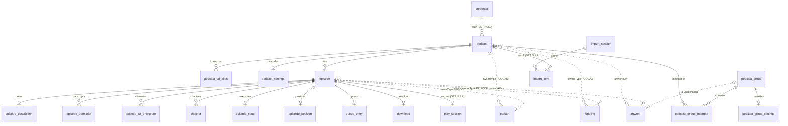
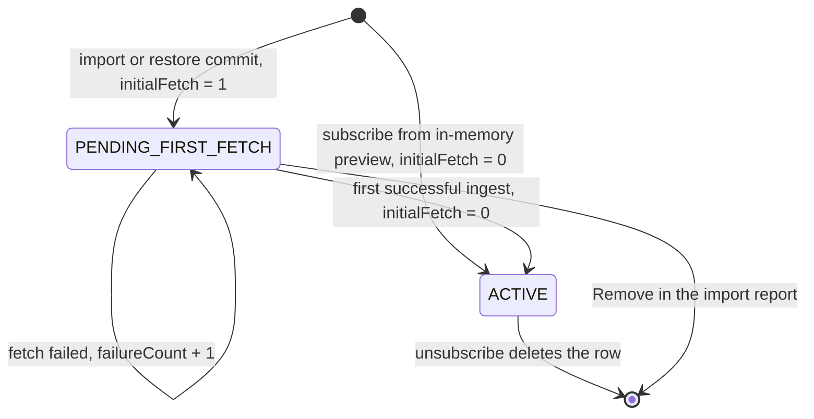
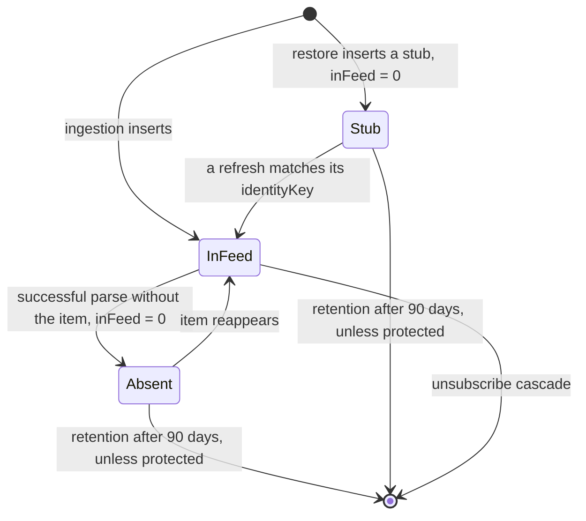
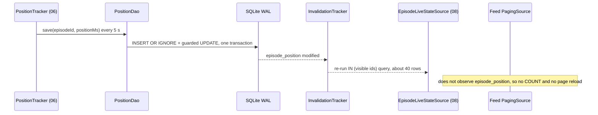
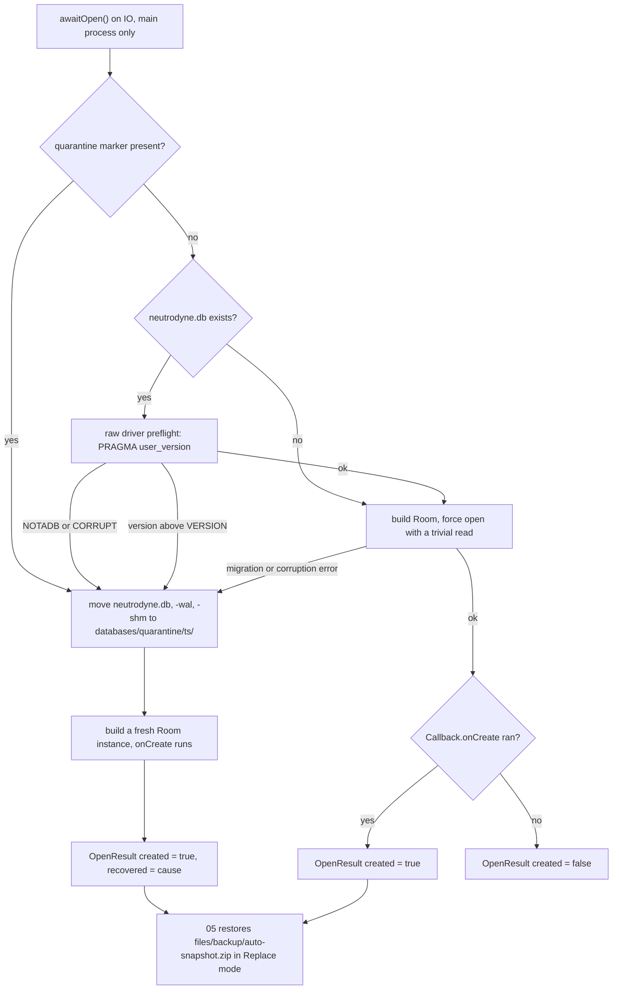

# 02 — Data model

> Status: Draft v1, 2026-10-04 · Implements: R1.3, R1.7, R1.8, R2.3, R2.5, R2.8, R2.9, R3.4, R4.2, R4.4, R4.5, R4.8 / N1, N5, N6, N9 · Milestones: M1, M2, M3, M4, M5, M6, M11 · Honours: D9, D15, D16, D17, D18, D19, D20, D21, D22, D23, D24, D29, D30, D33, D38, D41, D50 · Owns: the Room 3 schema (every entity, column, index and key SQL statement), identity-key storage, invalidation rules, retention, migrations and schema tests

Contents: [Scope](#scope) · [Conventions](#conventions) · [Entity relationship diagram](#entity-relationship-diagram) · [Tables](#tables) · [Identity keys](#identity-keys) · [Indices](#indices) · [Key queries](#key-queries) · [Invalidation hygiene](#invalidation-hygiene) · [Retention and maintenance](#retention-and-maintenance) · [Migrations and schema testing](#migrations-and-schema-testing) · [Error handling and recovery](#error-handling-and-recovery) · [Testing](#testing) · [Delivery by milestone](#delivery-by-milestone) · [Open questions](#open-questions) · [Sources](#sources)

---

## Scope

Serves N1, N5, R2.3, R2.8, R2.9. Delivered in [M1](../PLAN.md#m1-subscribe-and-ingest-rss) (complete schema v1) and extended by every later milestone ([Delivery by milestone](#delivery-by-milestone)).

Room is the single source of truth ([D14](../PLAN.md#3-key-decisions)). This document is the only place where entity definitions, column types, defaults, keys, indices and SQL are specified. Other documents show the subset of columns they read or write and link here.

| This document owns | It does not own (link instead) |
|---|---|
| Every `@Entity`, column, type, default, nullability, PK/FK/index | The ingestion diff algorithm and identity-key *computation* — [03 Ingestion and diff](03-feeds-and-discovery.md#ingestion-and-diff) |
| Type converters, JSON-column formats, bitmask values | Group behaviour, name validation, effective-settings rules — [05 Group model and lifecycle](05-groups-opml-backup.md#group-model-and-lifecycle), [05 Effective settings resolution](05-groups-opml-backup.md#effective-settings-resolution) |
| Identity-key *storage* format, versioning and uniqueness behaviour | Which episodes a play context contains (rules) — [05 Playing a group](05-groups-opml-backup.md#playing-a-group); queue projection — [06 Queue and play context](06-playback.md#queue-and-play-context) |
| All SQL of the key queries (feeds, counts, context tail, live state, refresh selection, download claim, auto-download, cleanup, retention, backup, restore) | Download state machine semantics and policies — [07 State machine](07-downloads.md#state-machine), [07 Auto-download policy](07-downloads.md#auto-download-policy) |
| Invalidation rules, `observedEntities`, churn classes | Artwork files, key derivation, pinning reasons — [08 Artwork pipeline](08-ui-ux.md#artwork-pipeline) |
| Retention (D23) and the `db-maintenance` worker | Backup archive format and merge rules — [05 Full backup and restore](05-groups-opml-backup.md#full-backup-and-restore) |
| Room 3 usage conventions, migration policy, schema tests | Hilt bindings and start-up order — [01 Dependency injection](01-foundation.md#dependency-injection); CI wiring — [09 CI pipelines](09-quality-and-release.md#ci-pipelines) |

### Module placement

| Module | Contents specified here |
|---|---|
| `:core:model` (JVM) | Enums of the canonical list plus [new enums](#new-names-introduced-here); `EpisodeRow`; bit constants `YouTubeVariantBits`, `FilterFlagBits` |
| `:core:database` (Android, `neutrodyne.room`) | `NeutrodyneDatabase`, all entities (`<Table>Entity`), DAOs, DAO projections, `FeedQueryBuilder`, `NeutrodyneConverters`, `EpisodeDescriptionCodec`, `DatabaseOpener`, migrations, `core/database/schemas/` |
| `:core:data` (Android) | `DbMaintenanceWorker`; entity ↔ `:core:model` mappers; JSON-column codecs (kotlinx.serialization) |

Only `:core:data`, `:core:artwork`, `:playback:impl` and `:download:impl` depend on `:core:database` ([PLAN 5.1](../PLAN.md#51-module-graph) rules 2 and 4). Features never see entities or DAOs; they receive `:core:model` types through `:core:domain` interfaces ([D12](../PLAN.md#3-key-decisions)).

### Table write ownership

"Churn" drives [Invalidation hygiene](#invalidation-hygiene). Every writer uses the column-scoped DAO methods named in [Key queries](#key-queries); no writer rewrites another owner's columns.

| Table | Churn | Writers (doc: class) | Main readers |
|---|---|---|---|
| `podcast` | low (fetch state batched) | 03: `FeedRefresher`, `SubscribeUseCase`; 04: YouTube columns via 03's engine; 05: `ImportRepository`, `RestoreWorker` (insert), `GroupRepository`/podcast settings (`includeInAll`, `customTitle`, `episodeOrder`); 07: `AutoDownloadPlanner` (`autoDownloadEligibleAfter`) | everyone |
| `podcast_url_alias`, `credential` | low | 03 (subscribe, moves, merge, `CredentialStore`); 05 (import, restore aliases) | 03, 05, 06, 07 |
| `podcast_settings`, `podcast_group_settings` | low | 05 settings screens; 05 restore | `EffectiveSettingsResolver` (05) |
| `podcast_group`, `podcast_group_member` | low | 05 `GroupRepository`, import, restore | 05, 06, 08 |
| `episode` and children (`episode_description`, `episode_transcript`, `episode_alt_enclosure`, `person`, `funding`) | low | 03 ingestion; 04 `YouTubeEnricher` (`durationMs`, `availability`) as part of the refresh pipeline; 05 restore (stub rows); 02 retention (delete) | everyone |
| `chapter` | low | 03 (PSC rows); 06 (other sources) | 06, 08 |
| `episode_state` | low | 06 (started, played, measured duration); 03/08 via `EpisodeRepository` (favourite, bulk played); 07 (tombstone); 05 (import "treat as played", restore) | lists, 05, 06, 07 |
| `episode_position` | **high** (every 5 s while playing) | 06 `PositionTracker`; 05 restore | `EpisodeLiveStateSource` (08), 06 |
| `queue_entry`, `play_session` | medium (every transition) | 06; 05 restore | 06 |
| `download` | low (transitions only, [D17](../PLAN.md#3-key-decisions)) | 07 | lists, 06 `LocalMediaIndex` (via 07), 07 |
| `artwork` | low (batched) | 08 `ArtworkSyncWorker`, `ArtworkStore` | lists, 08 |
| `import_session`, `import_item` | medium during an import | 05 | 05 |

Exception to [D15](../PLAN.md#3-key-decisions) "episode is written only by ingestion": restore inserts stub rows that ingestion completes later, and retention deletes rows. Neither ever writes feed-derived columns of an existing row.

### New names introduced here

| Name | Kind / location | Purpose | Consumers |
|---|---|---|---|
| `ShowType { EPISODIC, SERIAL }`, `EpisodeType { FULL, TRAILER, BONUS }` | enums, `:core:model` | `podcast.showType`, `episode.episodeType` | 03, 08 |
| `FeedErrorKind` | enum, `:core:model`; values owned by 03, must include `UNKNOWN` | `podcast.lastErrorKind` | 03, 08 |
| `OwnerType { PODCAST, EPISODE }` | enum, `:core:model` | `person.ownerType`, `funding.ownerType` | 03 |
| `ImportItemKind { RSS, YOUTUBE }` | enum, `:core:model` | `import_item.kind` | 05 |
| `AliasReason { SUBSCRIBE_INPUT, REDIRECT, NEW_FEED_URL, IMPORT, RESTORE, MERGE, RENORMALISED }` | enum, `:core:model` | `podcast_url_alias.reason` | 03, 05 |
| `YouTubeVariantBits { LONG_FORM = 1, SHORTS = 2, LIVE = 4 }`, `FilterFlagBits { UNPLAYED = 1, DOWNLOADED = 2, IN_PROGRESS = 4 }` | constant objects, `:core:model` | Values of `podcast.youtubeVariants`, `podcast_group.filterFlags`, `play_session.contextFilterFlags` | 04, 05, 06 |
| `podcast.episodeOrder` | column `FeedOrder?` | Order of the podcast screen; null = `OLDEST_FIRST` when `showType = SERIAL`, else `NEWEST_FIRST` | 05, 08 |
| `podcast.autoDownloadEligibleAfter` | column `Long?` | D67 watermark: episodes with `firstSeenAt` ≤ it are never auto-download candidates | 07 |
| `podcast.pendingNewFeedUrl`, `podcast.lastFullFetchAt` | columns | Lazy `itunes:new-feed-url` adoption; time of the last 200 response with a parsed body (weekly unconditional fetch rule) | 03 |
| `podcast_url_alias.reason`, `podcast_url_alias.addedAt` | columns | Why and when an alias was recorded | 03, 05 |
| `episode_alt_enclosure.codecs`, `episode_alt_enclosure.isDefault` | columns | Podcasting 2.0 `alternateEnclosure@codecs`, `@default` | 03, 06 |
| `play_session.contextMediaFilter`, `contextMinSortDate`, `contextAnchorSortDate` | columns | Full context filter set; keyset anchor that survives deletion of the anchor row | 05, 06 |
| `download.requireCharging` | column `Boolean` | Per-row charging requirement (AUTO policy) for the claim query | 07 |
| `import_session.finishedAt` | column `Long?` | Start of the 7-day cleanup window | 05 |
| `EpisodeKeys.candidates(item)`, `EpisodeKeys.keyFor(episode, version)`, `EpisodeKeys.versionOf(key)` | required members of the canonical `EpisodeKeys` (`:feeds`, implemented by 03) | Version-tolerant matching ([Key versions](#key-versions)) | 03, 05 |
| `ScopeOverrides` | `@Embedded` class, `:core:database` | Guarantees identical columns in both settings tables | 05 |
| `NeutrodyneConverters`, `EpisodeDescriptionCodec`, `DatabaseOpener`, `OpenResult`, `RecoveryCause`, `ForeignKeysDriver` (only if spike S2 needs it) | classes, `:core:database` | Converters, show-notes storage, open/recovery | 01, 03, 05 |
| `EpisodeRowProjection`, `ContextItem`, `MediaLookupRow`, `ExistingEpisodeKey`, `EpisodeFeedUpdate`, `PodcastFeedMetadata`, `PodcastFetchState`, `QueryPlanRow` | DAO projections, `:core:database` | Query results and partial-entity updates | 03, 06, 07 |
| `PodcastDao`, `EpisodeDao`, `IngestDao`, `FeedDao`, `GroupDao`, `ScopeSettingsDao`, `EpisodeStateDao`, `PositionDao`, `QueueDao`, `PlaySessionDao`, `DownloadDao`, `ArtworkDao`, `ChapterDao`, `CredentialDao`, `ImportDao`, `BackupDao`, `MaintenanceDao` | DAOs, `:core:database` | One DAO per area | impl modules |
| `diagnostics.db_quick_check_failed_at` | `device_settings` key, `Long` | Last failed `PRAGMA quick_check`, shown on the diagnostics screen | 09 |
| `MigrationInvariants`, `SeedDatabase`, `TestDb` | test utilities, `core/database/src/sharedTest/` | Migration invariants, seeded scale DB, in-memory DB factory | 09 |

---

## Conventions

Serves N1, N9, N11. Delivered in M1.

### Naming and types

| Item | Rule |
|---|---|
| Tables | `snake_case`, exactly the canonical names |
| Columns | `camelCase` = Kotlin property name (Room default); never `@ColumnInfo(name = …)` renames |
| Entity classes | `<PascalCaseTable>Entity` (`PodcastGroupMemberEntity`) |
| Indices | Room default names `index_<table>_<col>[_<col>]` (EXPLAIN tests refer to them) |
| Primary keys | `Long` `autoGenerate = true` (SQLite `AUTOINCREMENT`: deleted IDs are never reused, which keeps `episode:{id}` media IDs, notifications and `[e<id>]` file names unambiguous; verify `AUTOINCREMENT` in `1.json`); natural keys where canonical (`artwork.key`, `podcast_url_alias.url`) |
| Timestamps | `Long` epoch milliseconds UTC from the injected `Clock` (never `System.currentTimeMillis()` in DAOs) |
| Booleans | Kotlin `Boolean` → `INTEGER` 0/1 |
| Enums | `TEXT` holding `Enum.name` via explicit converters ([Type converters](#type-converters)) |
| UUIDs | `TEXT`, lowercase canonical 8-4-4-4-12 ([D21](../PLAN.md#3-key-decisions)) |
| Colours | `Int` ARGB (`INTEGER`) |
| Binary | `ByteArray` → `BLOB` |
| Large columns | Declared **last** in the entity so SQLite reads hot columns without walking overflow pages (`descriptionHtml`, `categoriesJson`, `snippet`) |
| Defaults | Every non-null column that has a Kotlin default also has `@ColumnInfo(defaultValue = …)`, so raw SQL inserts (stubs, migrations) and future `ALTER TABLE ADD COLUMN` are well-defined |

### Type converters

One class, registered on the database: `@ColumnTypeConverters(NeutrodyneConverters::class)`. Each enum has an explicit pair (`fromX`/`toX`). Reading an unknown name returns the fallback below instead of throwing, so a value written by a newer build never crashes list rendering.

| Enum (`:core:model`) | Column(s) | Fallback on unknown name |
|---|---|---|
| `SourceType` | `podcast.sourceType` | `RSS` |
| `PodcastStatus` | `podcast.status` | `ACTIVE` |
| `FeedOrder` | `podcast_group.feedOrder`, `.playOrder`, `podcast.episodeOrder`, `play_session.contextOrder` | `NEWEST_FIRST` |
| `MediaFilter` | `podcast_group.mediaFilter`, `play_session.contextMediaFilter` | `ALL` |
| `GroupKind`, `MemberSource` | `podcast_group.kind`, `podcast_group_member.source` | `MANUAL` |
| `Availability` | `episode.availability` | `UNAVAILABLE` |
| `ChapterSource` | `chapter.source` | `PSC` |
| `PositionSource` | `episode_position.positionSource` | `STREAM` |
| `ContextType` | `play_session.contextType` | `null` (no context) |
| `NetworkPolicy`, `DeleteAfter` | settings tables | `UNMETERED`, `NEVER` (most conservative) |
| `DownloadState`, `DownloadLane`, `WaitReason`, `DownloadError`, `SourceKind` | `download` | `FAILED`, `MANUAL`, `NONE`, `UNKNOWN`, `RSS_ENCLOSURE` |
| `ImportFormat`, `ImportState`, `ImportItemStatus`, `ImportItemKind` | import tables | `OPML`, `DONE`, `FETCH_FAILED`, `RSS` |
| `ShowType`, `EpisodeType`, `FeedErrorKind`, `OwnerType`, `AliasReason` | new columns | `null`, `null`, `UNKNOWN`, `EPISODE`, `IMPORT` |

```kotlin
class NeutrodyneConverters {
    @ColumnTypeConverter fun fromDownloadState(v: DownloadState?): String? = v?.name
    @ColumnTypeConverter fun toDownloadState(v: String?): DownloadState? = v?.let { enumOr(it, DownloadState.FAILED) }
    // … one pair per enum in the table above
}
inline fun <reified E : Enum<E>> enumOr(name: String, fallback: E): E =
    enumValues<E>().firstOrNull { it.name == name } ?: fallback
```

### JSON columns and bitmasks

JSON columns are typed `String` in entities. Encoding and decoding happen in `:core:data` mappers with one shared `Json { ignoreUnknownKeys = true; explicitNulls = false; encodeDefaults = false }`, so `:core:database` stays ignorant of DTOs owned by 03 and 05. No SQL ever reads inside JSON (no JSON1 functions; see [SQL dialect baseline](#sql-dialect-baseline)).

| Column | Shape | Owner of shape |
|---|---|---|
| `podcast.categoriesJson` | `List<List<String>>`: one path per `itunes:category`, outermost first (`[["Technology"],["Society & Culture","Documentary"]]`) | 02 (03 fills) |
| `episode_alt_enclosure.sourcesJson` | `List<{ "uri": String, "contentType": String? }>` | 03 |
| `import_item.groupNamesJson` | `List<String>` (trimmed, NFC) | 05 |
| `import_session.optionsJson`, `.warningsJson` | 05's `ImportOptions` / `List<ImportWarning>` DTOs | 05 |
| `podcast_group.ruleJson` | Reserved (smart groups), versioned `{ "v": 1, … }`; always `null` in v1 | 05 |

| Bitmask column | Bits | Notes |
|---|---|---|
| `podcast.youtubeVariants` | `LONG_FORM = 1`, `SHORTS = 2`, `LIVE = 4` | Default 1; meaningful only for `YOUTUBE_CHANNEL`; semantics in [04 Atom feed ingestion](04-youtube.md#atom-feed-ingestion) |
| `podcast_group.filterFlags`, `play_session.contextFilterFlags` | `UNPLAYED = 1`, `DOWNLOADED = 2`, `IN_PROGRESS = 4` | Media filter and minimum date are separate columns, never bits |

### Database builder and connections

`:core:database` exposes a factory; [01 Dependency injection](01-foundation.md#dependency-injection) binds the `SQLiteDriver` (`BundledSQLiteDriver` in production, `AndroidSQLiteDriver` in JVM/Robolectric tests, [D9](../PLAN.md#3-key-decisions)) and calls it through [`DatabaseOpener`](#error-handling-and-recovery).

```kotlin
@Database(entities = [/* the 22 entities of §Tables */], version = NeutrodyneDatabase.VERSION, exportSchema = true)
@ColumnTypeConverters(NeutrodyneConverters::class)
abstract class NeutrodyneDatabase : RoomDatabase() {
    abstract fun podcastDao(): PodcastDao
    abstract fun episodeDao(): EpisodeDao
    abstract fun ingestDao(): IngestDao
    abstract fun feedDao(): FeedDao
    // … one accessor per DAO listed in "New names introduced here"
    companion object {
        const val VERSION = 1
        const val FILE_NAME = "neutrodyne.db"
        fun build(ctx: Context, driver: SQLiteDriver, io: CoroutineContext, cb: RoomDatabase.Callback) =
            Room.databaseBuilder<NeutrodyneDatabase>(ctx, ctx.getDatabasePath(FILE_NAME).absolutePath)
                .setDriver(driver)                                  // wrapped by ForeignKeysDriver only if spike S2 says so
                .setQueryCoroutineContext(io)                       // @Dispatcher(IO)
                .setJournalMode(JournalMode.WRITE_AHEAD_LOGGING)    // Unverified: Room 3 name; WAL is mandatory
                .addMigrations(*ALL_MIGRATIONS)
                .addCallback(cb)                                    // onCreate → OpenResult.created, onOpen → PRAGMA optimize
                .build()                                            // never fallbackToDestructiveMigration*()
    }
}
```

- One database instance per process; only the main process opens it. The `:acra` process guard ([01](01-foundation.md#architecture-patterns)) must skip DB initialisation. Multi-instance invalidation stays off.
- WAL: one writer connection, a small reader pool; readers never block the writer and see a consistent snapshot.
- `foreign_keys` must be `ON` on the writer connection. Room 2 enabled it automatically for databases with FKs; Room 3 with the bundled driver is **Unverified** (spike S2 in [01 Spikes](01-foundation.md#spikes)). Fallback: `ForeignKeysDriver(delegate)`, a `SQLiteDriver` decorator whose `open()` runs `PRAGMA foreign_keys = ON` on every new connection. A test asserts the pragma ([Testing](#testing)).
- `onOpen`: `PRAGMA optimize=0x10002` with the bundled driver, plain `PRAGMA optimize` with the framework driver ([SQLite pragma optimize](https://www.sqlite.org/pragma.html#pragma_optimize)).

### Transactions and threading

| Rule | Detail |
|---|---|
| All DAO functions are `suspend`, return `Flow`, or return `PagingSource` | Room 3 requires coroutines; there are no blocking DAO calls and no main-thread queries. Synchronous lookups on the player loader thread use in-memory mirrors (`LocalMediaIndex`, 07; episode source index, 06) |
| Query context | `@Dispatcher(NeutrodyneDispatchers.IO)` via `setQueryCoroutineContext`; CPU-bound work (parsing, hashing, compression) happens **before** the transaction on `Default` |
| Multi-statement writes | `withWriteTransaction { }` (or `@Transaction` DAO functions). Write transactions are `IMMEDIATE`: they serialise all writers, so read-then-write logic inside them is race-free |
| Consistent multi-query reads | One read transaction (`useReaderConnection` + deferred transaction; exact Room 3 API recorded by spike S1) for backup export and snapshot |
| No I/O inside transactions | No network, no file copies, no `ContentResolver` calls inside a transaction |
| Batch sizes | Per-feed ingest: one transaction per feed (up to 5,000 items for paged feeds); import commit: 500 items per transaction; restore: 1,000 episode lines per transaction; retention: 500 episodes per transaction; cleanup: one transaction per deleted file's row; `IN (:ids)` lists chunked at 500 |
| Cancellation | A cancelled coroutine rolls back its open transaction. Callers use `suspendRunCatching` (rethrows `CancellationException`) |
| Expected write latency | ≤ 150 ms for an 831-item feed diff; the 5-s position write may wait behind it, which is harmless |

### DAO rules

1. **Column-scoped writes for shared tables.** `podcast`, `episode_state`, `download` and `play_session` have several writers. They are written only with targeted `UPDATE … SET <owned columns>` statements or partial-entity `@Update(entity = …)` classes, never by upserting a whole entity that another module may have changed (lost updates).
2. **Row creation for lazily created rows** (`episode_state`, `episode_position`, settings): `INSERT OR IGNORE` with neutral values, then a targeted `UPDATE`. An ignored insert and an `UPDATE` that matches zero rows fire no Room trigger, so they cause no invalidation.
3. **Never `OnConflictStrategy.REPLACE` / `INSERT OR REPLACE` on an FK parent table** (`podcast`, `episode`, `podcast_group`, `credential`, `import_session`). REPLACE deletes the existing row; with `ON DELETE CASCADE` children (episodes, user state) can be lost. (Unverified whether SQLite applies ON DELETE actions to REPLACE-deleted rows; forbidden regardless.) `@Upsert` (insert, then update on conflict) is allowed only for single-writer tables: `artwork`, `podcast_settings`, `podcast_group_settings`, `chapter`.
4. **Raw queries** (`@RawQuery`) are built only by `FeedQueryBuilder` from enumerated fragments; every value is bound, never concatenated. `observedEntities` must list every table the SQL references.
5. **Paged and observed list queries** follow [Invalidation hygiene](#invalidation-hygiene).
6. **Projections** are DAO-local data classes (`EpisodeRowProjection`); `:core:data` maps them to `:core:model` types (`PagingData.map`). Room never maps into `:core:model` classes directly.

### SQL dialect baseline

All SQL must run on **SQLite 3.18** (framework SQLite on API 26), even though production uses the bundled driver. Reasons: production must be able to fall back to `AndroidSQLiteDriver` if spike S4 finds the APK-size or 16 KB-alignment cost of `sqlite-bundled` unacceptable, and JVM/Robolectric tests run on the framework driver.

| Allowed | Forbidden |
|---|---|
| Row values `(a, b) < (?, ?)` (3.15) | Window functions (3.25) — use correlated `LIMIT 1` subqueries or Kotlin |
| `CROSS JOIN` to fix join order | SQL `UPSERT … ON CONFLICT DO UPDATE` (3.24) — Room `@Upsert` does not need it |
| `INSERT OR IGNORE`, `NOT EXISTS`, correlated subqueries with `LIMIT` | `NULLS FIRST/LAST` (3.30, Unverified version), `RETURNING` (3.35), JSON1 functions, generated columns |
| `PRAGMA optimize` (3.18) | `ALTER TABLE … RENAME COLUMN` / `DROP COLUMN` in hand-written migrations (3.25 / 3.35, Unverified versions) — use the table-rebuild procedure |

Framework SQLite versions by API (relevant only for the fallback driver): 26 → 3.18, 27 → 3.19, 28 → 3.22, 30 → 3.28, 31–33 → 3.32, 34 → 3.39/3.42, 35 → 3.44, 36.1/37 → 3.50 ([android.database.sqlite](https://developer.android.com/reference/android/database/sqlite/package-summary)). SQLite before 3.32 allows only 999 bound variables per statement, hence the 500-ID chunking rule (Unverified: limit value not re-checked).

### Room 2 to Room 3 mapping

AI sessions tend to emit Room 2 code (risk [T1](../PLAN.md#8-risks-and-mitigations)). Use the right-hand column. Rows marked Unverified are confirmed by spike S1 and the first DAO/migration written in M1; correct this table if they differ.

| Room 2.x | Room 3 (`androidx.room3`, 3.0.3) |
|---|---|
| `androidx.room.*`, kapt or KSP | `androidx.room3.*`, **KSP only** (`room3-compiler`), Gradle plugin `androidx.room3` with `room3 { schemaDirectory("$projectDir/schemas") }` |
| `@TypeConverter` / `@TypeConverters` | `@ColumnTypeConverter` / `@ColumnTypeConverters` (plural name Unverified) |
| `runInTransaction {}`, `withTransaction {}` | `withWriteTransaction {}` |
| `SupportSQLiteDatabase`, `Cursor`, `query(…)` | `SQLiteConnection` / `SQLiteStatement` via `useReaderConnection` / `useWriterConnection` / `usePrepared` |
| `Migration.migrate(SupportSQLiteDatabase)` | `Migration.migrate(connection: SQLiteConnection)` (suspend or not: Unverified) |
| `setQueryExecutor`, `allowMainThreadQueries()` | `setQueryCoroutineContext(…)`; no main-thread mode |
| `Room.databaseBuilder(ctx, Db::class.java, "name")` | `Room.databaseBuilder<Db>(ctx, absolutePath)` + `setDriver(…)` (driver mandatory) |
| `SimpleSQLiteQuery` for `@RawQuery` | `RoomRawQuery(sql) { stmt -> stmt.bindLong(1, …) }` |
| `room-paging` `PagingSource` return type | `room3-paging` + `@DaoReturnTypeConverters(PagingSourceDaoReturnTypeConverter::class)` on the DAO |
| `InvalidationTracker.Observer` | `invalidationTracker.createFlow(vararg tables)` |
| `MigrationTestHelper(instrumentation, Db::class.java)` | `MigrationTestHelper(instrumentation, databaseClass = Db::class, driver = …, file = …)` |
| `@Entity` has no rowid option | `@Entity(withoutRowId = true)` |
| `Callback.onCreate(db: SupportSQLiteDatabase)` | `Callback.onCreate(connection: SQLiteConnection)` (Unverified signature) |
| Built-in `UUID` converter | None in 3.0.x (`kotlin.uuid.Uuid` only from 3.1.0-alpha01): store `String` ([D21](../PLAN.md#3-key-decisions)) |
| `@AutoMigration` | Assumed unchanged (Unverified until the first auto-migration) |

### Platform constraints

| Constraint | Consequence | Source |
|---|---|---|
| `sqlite-bundled` ships native `.so` per ABI | 16 KB page alignment checked in CI (09); APK size budget includes it | [16 KB page sizes](https://developer.android.com/guide/practices/page-sizes), [SQLite drivers](https://developer.android.com/kotlin/multiplatform/sqlite) |
| The Android `sqlite-bundled` artifact ships `.so` files for Android ABIs only, so it is not expected to load under Robolectric on the host JVM (Unverified until spike S3) | JVM tests inject `AndroidSQLiteDriver`; the bundled driver is exercised by instrumented tests | [SQLite drivers](https://developer.android.com/kotlin/multiplatform/sqlite) |
| Auto Backup never includes `databases/` (include-only rules, [D34](../PLAN.md#3-key-decisions)) | A reinstall or new phone starts with an empty DB; `onCreate` triggers the snapshot restore of [05 Auto Backup](05-groups-opml-backup.md#auto-backup) | [Auto Backup](https://developer.android.com/identity/data/autobackup) |
| `hasFragileUserData = true` (07) | A "keep app data" uninstall leaves the DB; a later install may open **any** released schema version, so every released version must keep a migration path | [07 Lifecycle and reconciliation](07-downloads.md#lifecycle-and-reconciliation) |
| DB lives in credential-encrypted storage | No component touches it before first unlock; nothing is direct-boot aware | — |
| Android 16 job quotas apply to `db-maintenance` | The worker checkpoints in 500-row chunks and stops at an 8-min soft deadline ([N2](../PLAN.md#22-non-functional-requirements)) | [Android 16 behaviour changes](https://developer.android.com/about/versions/16/behavior-changes-all), [long-running workers](https://developer.android.com/develop/background-work/background-tasks/persistent/how-to/long-running) |

---

## Entity relationship diagram

Solid lines are foreign keys (cascade unless noted in [Tables](#tables)); dotted lines are logical references without FK.



---

## Tables

Serves N1, R2.3, R3.4, R4.2, R4.8. Delivered in M1: **every table below exists in schema version 1** ([D22](../PLAN.md#3-key-decisions)), even if its first writer arrives later. Each sketch is the complete column list; Room annotations are abbreviated (`CASCADE` = `ForeignKey(…, onDelete = ForeignKey.CASCADE)` on the named column).

### podcast

One row per subscription (RSS feed or YouTube channel). Previews are never persisted ([D24](../PLAN.md#3-key-decisions)): every row is subscribed. Low churn; the fetch-state columns are written in batches ([Refresh selection and fetch-state writes](#refresh-selection-and-fetch-state-writes)).

```kotlin
@Entity(tableName = "podcast",
    indices = [Index("feedKey", unique = true), Index("nextRefreshAt"), Index("podcastGuid"), Index("credentialId")],
    foreignKeys = [ForeignKey(CredentialEntity::class, ["id"], ["credentialId"], onDelete = ForeignKey.SET_NULL)])
data class PodcastEntity(
    @PrimaryKey(autoGenerate = true) val id: Long = 0,
    val sourceType: SourceType, val feedUrl: String, val feedKey: String,          // identity (03; YouTube 04)
    val youtubeChannelId: String? = null, @ColumnInfo(defaultValue = "1") val youtubeVariants: Int = 1,
    val podcastGuid: String? = null, @ColumnInfo(defaultValue = "0") val podcastGuidDerived: Boolean = false,
    val title: String, val author: String? = null, val link: String? = null,     // feed metadata (03)
    val language: String? = null, val explicit: Boolean? = null, val showType: ShowType? = null,
    val medium: String? = null, val locked: Boolean? = null, @ColumnInfo(defaultValue = "0") val complete: Boolean = false,
    val artworkUrl: String? = null, val artworkKey: String, val bannerUrl: String? = null,
    val customTitle: String? = null, @ColumnInfo(defaultValue = "1") val includeInAll: Boolean = true,   // user (05)
    val episodeOrder: FeedOrder? = null, val autoDownloadEligibleAfter: Long? = null,                     // 05, 07
    val status: PodcastStatus, val initialFetch: Boolean, val subscribedAt: Long, val latestEpisodeAt: Long? = null,
    val etag: String? = null, val lastModified: String? = null, val contentSha256: String? = null,       // validators (03)
    @ColumnInfo(defaultValue = "0") val parserVersion: Int = 0, @ColumnInfo(defaultValue = "0") val lastParseOk: Boolean = false,
    val lastAttemptAt: Long? = null, val lastSuccessAt: Long? = null, val lastFullFetchAt: Long? = null,  // scheduling (03)
    val nextRefreshAt: Long? = null, @ColumnInfo(defaultValue = "0") val failureCount: Int = 0,
    val lastErrorKind: FeedErrorKind? = null, val lastErrorDetail: String? = null,
    @ColumnInfo(defaultValue = "0") val gone: Boolean = false,
    @ColumnInfo(defaultValue = "0") val needsCredentials: Boolean = false,
    val ttlMinutes: Int? = null, val updateFrequencyRrule: String? = null,
    val pendingNewFeedUrl: String? = null, val pagingNextUrl: String? = null,                             // moves, paging (03)
    @ColumnInfo(defaultValue = "0") val pagingComplete: Boolean = false,
    val hubUrl: String? = null, @ColumnInfo(defaultValue = "0") val usesPodping: Boolean = false,
    val credentialId: Long? = null,
    val descriptionHtml: String? = null, val categoriesJson: String? = null,                             // large, last
)
```

| Column / rule | Detail |
|---|---|
| `feedUrl` | Current fetch URL without userinfo (credentials live in `credential`). For YouTube: `https://www.youtube.com/feeds/videos.xml?channel_id={UC…}` |
| `feedKey` | `UrlNormalizer.forIdentity(feedUrl)` ([Identity keys](#podcast-feedkey-and-aliases)); rewritten together with `feedUrl` |
| `title` | Never null. Before the first fetch: OPML/backup title, else the URL host. Display title = `COALESCE(customTitle, title)` |
| `artworkKey` | Never null: `u-{sha1hex(url)}` of `artworkUrl`, else monogram key `m-{sha1hex(feedKey)}` (key formats: [08](08-ui-ux.md#artwork-pipeline)). Written by ingestion whenever `artworkUrl` changes |
| `contentSha256` | Lowercase hex of the last parsed body (64 chars) |
| `status`, `initialFetch` | See the state diagram below; transitions are 03's |
| `latestEpisodeAt` | Max `sortDate` of the podcast's episodes, maintained by ingestion |
| `gone`, `needsCredentials`, `failureCount`, `lastErrorKind` | Error badges; "possibly dead" is derived (`failureCount ≥ 10 AND lastSuccessAt < now − 7 d`, thresholds owned by 03) — no column |
| `autoDownloadEligibleAfter` | Set by 07 to `now` when the effective auto-download policy of the podcast becomes enabled, cleared when disabled ([Auto-download candidates](#auto-download-candidates)) |



### podcast_url_alias

Every identity-normalised URL the podcast was known by: subscribe input, OPML URL, redirect sources, `new-feed-url` sources, merged podcasts.

```kotlin
@Entity(tableName = "podcast_url_alias", indices = [Index("podcastId")], foreignKeys = [/* podcastId CASCADE */])
data class PodcastUrlAliasEntity(
    @PrimaryKey val url: String,     // UrlNormalizer.forIdentity form; never equal to any podcast.feedKey
    val podcastId: Long,
    val reason: AliasReason,
    val addedAt: Long,
)
```

### credential

Basic-auth credentials and a user's Podcast Index key/secret, encrypted with an Android Keystore AES-256-GCM key (key alias and crypto: 03). Never exported, never in backups; the DB itself is never backed up.

```kotlin
@Entity(tableName = "credential", indices = [Index("origin")])
data class CredentialEntity(
    @PrimaryKey(autoGenerate = true) val id: Long = 0,
    val origin: String,          // "https://host[:port]" lowercase, default port omitted; or "podcastindex"
    val username: String,
    val secretCipher: ByteArray, // ciphertext + GCM tag
    val iv: ByteArray,           // 12 bytes
    val createdAt: Long,
)
```

### podcast_settings

Per-podcast overrides; `null` = inherit ([D20](../PLAN.md#3-key-decisions)). Resolution rules: [05 Effective settings resolution](05-groups-opml-backup.md#effective-settings-resolution). The row is deleted when every override is `null`.

```kotlin
data class ScopeOverrides(                                   // @Embedded in both settings tables
    val playbackSpeed: Float? = null, val skipSilence: Boolean? = null,
    val boostDb: Float? = null, val introSkipMs: Long? = null, val outroSkipMs: Long? = null,   // reserved v1.x (D65)
    val autoDownload: Boolean? = null, val autoDownloadKeepLatest: Int? = null,
    val autoDownloadNetwork: NetworkPolicy? = null, val autoDownloadRequireCharging: Boolean? = null,
    val deleteAfterPlayed: DeleteAfter? = null, val includeVideoInAutoDownload: Boolean? = null,
    val notifyNewEpisodes: Boolean? = null, val refreshIntervalMinutes: Int? = null,
)
@Entity(tableName = "podcast_settings", foreignKeys = [/* podcastId CASCADE */])
data class PodcastSettingsEntity(@PrimaryKey val podcastId: Long, @Embedded val o: ScopeOverrides)
```

### podcast_group

User-defined group ([D29](../PLAN.md#3-key-decisions)). All and Ungrouped are virtual `FeedSource`s, never rows.

```kotlin
@Entity(tableName = "podcast_group",
    indices = [Index("uuid", unique = true), Index("nameKey", unique = true), Index("sortOrder")])
data class PodcastGroupEntity(
    @PrimaryKey(autoGenerate = true) val id: Long = 0,
    val uuid: String,                    // random UUID, lowercase; never reused
    val name: String,                    // trimmed, NFC, 1–40 chars (05 validates)
    val nameKey: String,                 // NFC(name).lowercase(Locale.ROOT)
    val sortOrder: Int,                  // dense 0..n-1
    val colorArgb: Int? = null, val iconKey: String? = null,
    @ColumnInfo(defaultValue = "'MANUAL'") val kind: GroupKind = GroupKind.MANUAL,
    @ColumnInfo(defaultValue = "'NEWEST_FIRST'") val feedOrder: FeedOrder = FeedOrder.NEWEST_FIRST,
    @ColumnInfo(defaultValue = "'NEWEST_FIRST'") val playOrder: FeedOrder = FeedOrder.NEWEST_FIRST,
    @ColumnInfo(defaultValue = "0") val filterFlags: Int = 0,
    @ColumnInfo(defaultValue = "'ALL'") val mediaFilter: MediaFilter = MediaFilter.ALL,
    val hideOlderThanDays: Int? = null,
    @ColumnInfo(defaultValue = "1") val showAsTab: Boolean = true,
    val lastViewedAt: Long? = null,
    val createdAt: Long, val updatedAt: Long,
    val ruleJson: String? = null,        // reserved (smart groups); null in v1
)
```

### podcast_group_member

```kotlin
@Entity(tableName = "podcast_group_member", primaryKeys = ["groupId", "podcastId"], withoutRowId = true,
    indices = [Index("podcastId", "groupId")], foreignKeys = [/* groupId CASCADE, podcastId CASCADE */])
data class PodcastGroupMemberEntity(
    val groupId: Long, val podcastId: Long,
    @ColumnInfo(defaultValue = "0") val sortOrder: Int = 0,   // optional manual order inside the group grid
    val addedAt: Long,
    @ColumnInfo(defaultValue = "'MANUAL'") val source: MemberSource = MemberSource.MANUAL,  // RULE reserved
)
```

### podcast_group_settings

```kotlin
@Entity(tableName = "podcast_group_settings", foreignKeys = [/* groupId → podcast_group CASCADE */])
data class PodcastGroupSettingsEntity(@PrimaryKey val groupId: Long, @Embedded val o: ScopeOverrides)
```

### episode

Feed-derived data only ([D15](../PLAN.md#3-key-decisions)). No user state, no positions, no download progress.

```kotlin
@Entity(tableName = "episode",
    indices = [Index("podcastId", "identityKey", unique = true), Index("podcastId", "sortDate"),
               Index("sortDate"), Index("firstSeenAt")],
    foreignKeys = [/* podcastId CASCADE */])
data class EpisodeEntity(
    @PrimaryKey(autoGenerate = true) val id: Long = 0,
    val podcastId: Long, val identityKey: String, val guid: String? = null,
    val title: String, val pubDate: Long? = null, val rawPubDate: String? = null,
    val sortDate: Long, val feedOrder: Int, val firstSeenAt: Long, val lastSeenAt: Long,
    @ColumnInfo(defaultValue = "1") val inFeed: Boolean = true,
    @ColumnInfo(defaultValue = "0") val isNew: Boolean = false,
    val enclosureUrl: String? = null, val enclosureType: String? = null, val enclosureLength: Long? = null,
    val externalMediaId: String? = null, @ColumnInfo(defaultValue = "0") val isVideo: Boolean = false,
    val durationMs: Long? = null,                          // feed or enrichment hint; 06 measures the truth
    val season: Int? = null, val seasonName: String? = null,
    val episodeNumber: String? = null,                     // decimal as plain string ("12", "12.5")
    val episodeDisplay: String? = null, val episodeType: EpisodeType? = null, val explicit: Boolean? = null,
    val imageUrl: String? = null, val artworkKey: String? = null, val link: String? = null,
    val chaptersUrl: String? = null, val chaptersType: String? = null,
    val contentHash: Long,                                 // first 8 bytes of SHA-256 over 03's normalised fields
    @ColumnInfo(defaultValue = "'AVAILABLE'") val availability: Availability = Availability.AVAILABLE,
    @ColumnInfo(defaultValue = "0") val isShort: Boolean = false,
    val snippet: String? = null,                           // ≤ 200 chars plain text; last (large)
)
```

| Invariant | Enforced by |
|---|---|
| `enclosureUrl IS NOT NULL OR externalMediaId IS NOT NULL` (enclosure-less blog items are not stored) | 03 ingestion, 05 stub insertion (lines without either are skipped) |
| `imageUrl IS NULL` ⇔ `artworkKey IS NULL`; `imageUrl` is null when equal to the podcast artwork | 03 ingestion |
| `sortDate = min(pubDate ?: firstSeenAt, firstSeenAt + 24 h)` ([D19](../PLAN.md#3-key-decisions)) | 03 ingestion |
| List order is `(sortDate, id)`. Rows inserted in one parse are inserted in **descending `feedOrder`**, so that among equal `sortDate`s the item listed first in the document gets the highest `id` (feeds list newest first); `id` therefore encodes the D19 tiebreak | 03 ingestion |
| `isNew = 1` only for items inserted by a non-initial refresh and not part of a back-catalogue dump ([D66](../PLAN.md#3-key-decisions)); never cleared by user actions | 03 ingestion |
| `inFeed = 0` only after a successful parse with ≥ 1 item that lacked the row; stubs from restore start with `inFeed = 0` | 03, 05 |
| `title` non-empty (03 supplies a fallback such as the date) | 03 |



### episode_description

Show notes, kept out of the hot `episode` table. Read only by episode detail, chapter extraction from descriptions (04/06) and nothing that lists.

```kotlin
@Entity(tableName = "episode_description", foreignKeys = [/* episodeId CASCADE */])
data class EpisodeDescriptionEntity(@PrimaryKey val episodeId: Long, val html: ByteArray)

object EpisodeDescriptionCodec {             // the only way to read or write `html`
    fun encode(text: String): ByteArray      // UTF-8 ≥ 512 bytes → [0x01] + raw DEFLATE (nowrap, level 6); else [0x00] + UTF-8
    fun decode(bytes: ByteArray): String
}
```

The column holds raw HTML from the feed (or plain text for YouTube and Atom); sanitising happens at display time ([D27](../PLAN.md#3-key-decisions), [03 Show notes](03-feeds-and-discovery.md#show-notes)). Compression shrinks the largest table to roughly a third (see [Expected size](#expected-size)); encoding runs on `Default` before the ingest transaction.

### episode_transcript

```kotlin
@Entity(tableName = "episode_transcript", primaryKeys = ["episodeId", "url"], foreignKeys = [/* episodeId CASCADE */])
data class EpisodeTranscriptEntity(
    val episodeId: Long, val url: String, val type: String, val language: String? = null, val rel: String? = null,
)
```

### episode_alt_enclosure

```kotlin
@Entity(tableName = "episode_alt_enclosure", primaryKeys = ["episodeId", "ordinal"], foreignKeys = [/* CASCADE */])
data class EpisodeAltEnclosureEntity(
    val episodeId: Long, val ordinal: Int, val type: String, val length: Long? = null, val bitrate: Long? = null,
    val height: Int? = null, val lang: String? = null, val title: String? = null, val rel: String? = null,
    val codecs: String? = null, @ColumnInfo(defaultValue = "0") val isDefault: Boolean = false,
    val integrityType: String? = null, val integrityValue: String? = null,
    val sourcesJson: String,
)
```

### person

Polymorphic owner, therefore no FK. Rows are deleted explicitly with their owner (ingestion replace, [Unsubscribe and merge](#unsubscribe-and-merge), retention) and swept for orphans by `db-maintenance`.

```kotlin
@Entity(tableName = "person", indices = [Index("ownerType", "ownerId")])
data class PersonEntity(
    @PrimaryKey(autoGenerate = true) val id: Long = 0,
    val ownerType: OwnerType, val ownerId: Long, val name: String,
    @ColumnInfo(defaultValue = "'host'") val role: String = "host",
    @ColumnInfo(defaultValue = "'cast'") val grp: String = "cast",
    val imageUrl: String? = null, val href: String? = null,
)
```

### funding

```kotlin
@Entity(tableName = "funding", indices = [Index("ownerType", "ownerId")])
data class FundingEntity(
    @PrimaryKey(autoGenerate = true) val id: Long = 0,
    val ownerType: OwnerType, val ownerId: Long, val url: String, val label: String? = null,
)
```

### chapter

One table for every chapter source; the playback rule "first non-empty source wins" is 06's ([06 Chapters](06-playback.md#chapters)).

```kotlin
@Entity(tableName = "chapter", primaryKeys = ["episodeId", "source", "ordinal"], foreignKeys = [/* CASCADE */])
data class ChapterEntity(
    val episodeId: Long, val source: ChapterSource, val ordinal: Int,
    val startMs: Long, val endMs: Long? = null, val title: String? = null,
    val imageUrl: String? = null, val linkUrl: String? = null,
    @ColumnInfo(defaultValue = "0") val hidden: Boolean = false,      // P2.0 toc:false
)
```

Writers replace all rows of one `(episodeId, source)` pair in one transaction (`DELETE … WHERE episodeId = ? AND source = ?` then insert).

### episode_state

Low-churn user state ([D15](../PLAN.md#3-key-decisions)). Rows are created lazily on the first state change.

```kotlin
@Entity(tableName = "episode_state", indices = [Index("playedAt")], foreignKeys = [/* episodeId CASCADE */])
data class EpisodeStateEntity(
    @PrimaryKey val episodeId: Long,
    val startedAt: Long? = null,           // set once when the position first becomes > 0; cleared on reset
    val playedAt: Long? = null,
    @ColumnInfo(defaultValue = "0") val playCount: Int = 0,
    val lastPlayedAt: Long? = null,
    @ColumnInfo(defaultValue = "0") val isFavorite: Boolean = false,
    val downloadDismissedAt: Long? = null, // tombstone: user deleted the download (07)
    val measuredDurationMs: Long? = null,  // written back by 06
    val updatedAt: Long,                   // last user-state change (backup merge)
)
```

"In progress" everywhere means `startedAt IS NOT NULL AND playedAt IS NULL`; this is the low-churn proxy for `episode_position.positionMs > 0` and keeps lists free of `episode_position`. 06 maintains it inside the position-save transaction ([User-state writes](#user-state-writes)).

### episode_position

High churn ([D41](../PLAN.md#3-key-decisions)): written every 5 s while playing. **Never joined by paged or list queries**; read only through `IN (:ids)` queries and by 06.

```kotlin
@Entity(tableName = "episode_position", foreignKeys = [/* episodeId CASCADE */])
data class EpisodePositionEntity(
    @PrimaryKey val episodeId: Long,
    val positionMs: Long,
    val durationMs: Long? = null,
    val positionSource: PositionSource,    // STREAM or DOWNLOAD (DAI hosts serve different bytes, risk T7)
    val updatedAt: Long,
)
```

### queue_entry

Up next ([D38](../PLAN.md#3-key-decisions)). Ordering rules in [Up next ordering](#up-next-ordering).

```kotlin
@Entity(tableName = "queue_entry", indices = [Index("episodeId", unique = true), Index("ordinal")],
    foreignKeys = [/* episodeId CASCADE */])
data class QueueEntryEntity(
    @PrimaryKey(autoGenerate = true) val id: Long = 0,
    val episodeId: Long, val ordinal: Double, val addedAt: Long,
)
```

### play_session

Singleton (`id = 0`). No position column ([D41](../PLAN.md#3-key-decisions)); semantics in [06 Queue and play context](06-playback.md#queue-and-play-context).

```kotlin
@Entity(tableName = "play_session", indices = [Index("currentEpisodeId")],
    foreignKeys = [ForeignKey(EpisodeEntity::class, ["id"], ["currentEpisodeId"], onDelete = ForeignKey.SET_NULL)])
data class PlaySessionEntity(
    @PrimaryKey val id: Int = 0,
    val currentEpisodeId: Long? = null,
    val contextType: ContextType? = null,            // null = no context
    val contextId: Long? = null,                     // groupId or podcastId; no FK (polymorphic)
    @ColumnInfo(defaultValue = "'NEWEST_FIRST'") val contextOrder: FeedOrder = FeedOrder.NEWEST_FIRST,
    @ColumnInfo(defaultValue = "0") val contextFilterFlags: Int = 0,
    @ColumnInfo(defaultValue = "'ALL'") val contextMediaFilter: MediaFilter = MediaFilter.ALL,
    val contextMinSortDate: Long? = null,            // fixed when the context starts
    val contextAnchorEpisodeId: Long? = null,        // no FK: anchor may be deleted
    val contextAnchorSortDate: Long? = null,         // keyset needs (sortDate, id) even after deletion
    @ColumnInfo(defaultValue = "0") val generation: Long = 0,
    val updatedAt: Long,
)
```

Deleting a group or unsubscribing a podcast clears a context that points at it (`contextType = NULL`) in the same transaction ([Unsubscribe and merge](#unsubscribe-and-merge); group delete: 05).

### download

One row per episode with a download in any state. `downloadedBytes` is persisted only on state transitions ([D17](../PLAN.md#3-key-decisions)); no stream or CDN URL columns ([D50](../PLAN.md#3-key-decisions)). State semantics: [07 State machine](07-downloads.md#state-machine).

```kotlin
@Entity(tableName = "download", indices = [Index("state", "lane", "priority", "requestedAt")],
    foreignKeys = [/* episodeId CASCADE */])
data class DownloadEntity(
    @PrimaryKey val episodeId: Long,
    val lane: DownloadLane, val state: DownloadState,
    @ColumnInfo(defaultValue = "'NONE'") val waitReason: WaitReason = WaitReason.NONE,
    val priority: Int,                         // MANUAL 100, AUTO 0, "download next" 200
    val requestedAt: Long,
    val sourceKind: SourceKind, val sourceRef: String,   // enclosure URL as in the feed, or YouTube video ID
    val formatPref: String? = null, val resolvedItag: Int? = null,
    val rootId: String,                        // "ext:primary" | "ext:{volumeUuid}" | "int" (| "saf:…" v1.x)
    val tempPath: String? = null, val relativePath: String? = null, val finalUri: String? = null,
    val totalBytes: Long? = null, @ColumnInfo(defaultValue = "0") val downloadedBytes: Long = 0,
    val estimatedBytes: Long? = null,
    val etag: String? = null, val lastModified: String? = null, val mimeType: String? = null,
    val allowMetered: Boolean, @ColumnInfo(defaultValue = "0") val requireCharging: Boolean = false,
    @ColumnInfo(defaultValue = "0") val attempt: Int = 0,
    @ColumnInfo(defaultValue = "0") val integrityFailures: Int = 0,
    val nextAttemptAt: Long? = null, val lastError: DownloadError? = null, val lastHttpStatus: Int? = null,
    val lastStopReason: Int? = null, val completedAt: Long? = null, val runnerToken: String? = null,
)
```

Deleting an episode cascades its `download` row, but **not the file**: anything that deletes episodes (unsubscribe, retention) first asks 07 to delete files; retention never deletes episodes that have a `download` row.

### artwork

Pinned artwork metadata ([D42](../PLAN.md#3-key-decisions), [D57](../PLAN.md#3-key-decisions)); keys are deterministic, so `podcast.artworkKey`/`episode.artworkKey` reference it without FK and a row may be missing (nothing pinned yet).

```kotlin
@Entity(tableName = "artwork")
data class ArtworkEntity(
    @PrimaryKey val key: String,               // u-…, m-…, g-… (08)
    val url: String? = null,                   // null for generated monograms and mosaics
    val localPath: String? = null,             // relative to filesDir/artwork; null = not pinned
    val width: Int? = null, val height: Int? = null,
    val seedArgb: Int? = null, val avgArgb: Int? = null,   // M10 fills them
    @ColumnInfo(defaultValue = "0") val version: Int = 0,  // bumps when bytes change (memory-key busting)
    val fetchedAt: Long? = null,
    @ColumnInfo(defaultValue = "0") val pinCount: Int = 0, // cache of the reference count, see Artwork references
    val lastError: String? = null,
)
```

### import_session

```kotlin
@Entity(tableName = "import_session")
data class ImportSessionEntity(
    @PrimaryKey(autoGenerate = true) val id: Long = 0,
    val createdAt: Long, val finishedAt: Long? = null,
    val sourceName: String? = null,            // OpenableColumns.DISPLAY_NAME
    val sourceFormat: ImportFormat, val state: ImportState,
    @ColumnInfo(defaultValue = "0") val recoveredBySalvage: Boolean = false,
    val payloadPath: String? = null,           // relative to cacheDir: "import/{id}.bin"
    val optionsJson: String? = null, val warningsJson: String? = null,
)
```

### import_item

```kotlin
@Entity(tableName = "import_item", primaryKeys = ["sessionId", "ordinal"],
    indices = [Index("sessionId", "status"), Index("podcastId")],
    foreignKeys = [/* sessionId → import_session CASCADE */,
        ForeignKey(PodcastEntity::class, ["id"], ["podcastId"], onDelete = ForeignKey.SET_NULL)])
data class ImportItemEntity(
    val sessionId: Long, val ordinal: Int,
    val title: String? = null, val originalUrl: String, val normalizedUrl: String? = null,
    val kind: ImportItemKind, val groupNamesJson: String,
    val selected: Boolean, val status: ImportItemStatus,
    val podcastId: Long? = null, val errorDetail: String? = null,
)
```

### Reserved tables

Not created in v1 (each arrives with a migration): `podcast_group_exclusion` (smart groups), `episode_fts` (FTS4 search, M15; indexes `title` and `snippet` because `episode_description.html` is compressed — see [Open questions](#open-questions)), `sponsor_segment` (SponsorBlock, M14).

---

## Identity keys

Serves R1.7, R1.8, R3.4, N1 ([D18](../PLAN.md#3-key-decisions)). Delivered in M1; backup use in M3. 03 owns the computation (`EpisodeKeys`, `UrlNormalizer`, `PodcastGuid` in `:feeds`); this section owns stored formats, versioning and the database-side behaviour.

### Episode identityKey

Stored as `TEXT` in `episode.identityKey`, unique per podcast. Grammar: `key := [version] kind ":" payload`, where `version` is absent for version 1 and a decimal number (`2`, `3`, …) for later versions.

| Kind (v1) | Payload | Example |
|---|---|---|
| `g` | `guid.trim()`, verbatim, case-sensitive | `g:yt:video:3iRUwVzRDZQ`, `g:https://example.com/?p=123` |
| `u` | `UrlNormalizer.forIdentity(primaryEnclosureUrl)` | `u:` + normalised URL |
| `t` | lowercase hex SHA-1 of `title.trim().lowercase(Locale.ROOT)`, then `"\|"`, then `pubDate.truncatedTo(DAYS).toString()`, concatenated | `t:3f2a…` (40 hex) |
| `l` | lowercase hex SHA-1 of `link.trim()` | `l:9c1b…` |
| `h` | lowercase hex SHA-1 of `title.orEmpty() + description.orEmpty().take(500)` | `h:07de…` |

YouTube episodes always take the `g` branch (`guid = yt:video:{videoId}`). A GUID repeated inside one document falls back to `u` for the second occurrence (03).

### Key versions

- `EpisodeKeys.VERSION = 1`. Backups write `kv` per episode line ([D33](../PLAN.md#3-key-decisions)); in the DB the version is self-describing through the optional numeric prefix, so no column and no metadata table is needed.
- Mixed versions in one database are legal. The database is **never bulk re-keyed by a Room migration** (`:core:database` cannot call `:feeds`). Instead:
  1. 03's diff matches each parsed item against the stored keys using `EpisodeKeys.candidates(item)` — the current-version key first, then the keys of every older supported version — before falling back to enclosure and title+day matching. A match on an older-version key rewrites the row's key to the current version in place.
  2. Rows that never reappear in the feed keep their old key; that is harmless because restore matching (05) computes `EpisodeKeys.keyFor(localEpisode, kv)` for the backup line's `kv`.
  3. `EpisodeKeys` keeps the code of every released version forever; `versionOf(key)` parses the prefix.
- Changing `UrlNormalizer.forIdentity` output is a key-version change for `u` keys (and a `feedKey` change, below).

### Uniqueness and in-place re-keying

- `UNIQUE(podcastId, identityKey)`: inserting a second row with an existing key fails with `SQLITE_CONSTRAINT_UNIQUE` and aborts the feed's whole transaction (the feed is recorded as a parse failure and retried next refresh). 03 must therefore deduplicate keys within one parse before inserting.
- Fallback matches (GUID rewritten by a host, older key version) update `identityKey` and `guid` **in place** with `IngestDao.rekey(id, key, guid)`. The row ID and all user state (`episode_state`, `episode_position`, `download`, `queue_entry`, chapters) are preserved. The match order guarantees the target key is unused in that podcast; if it is not, the unique index aborts the transaction instead of silently merging.
- Ingestion never deletes an episode, so a refresh can never delete user state ([N1](../PLAN.md#22-non-functional-requirements)).

### Podcast feedKey and aliases

- `podcast.feedKey = UrlNormalizer.forIdentity(feedUrl)`, `UNIQUE`. It is the cross-device podcast key used by backups, OPML dedupe and "Already subscribed".
- `podcast_url_alias.url` holds identity-normalised URLs (same function), so `feedKey` and aliases compare directly. Lookup: [Restore matching](#restore-matching) (`feedKey IN … UNION alias`).
- When 03 accepts a move (301/308 chain, validated `new-feed-url`) it updates `feedUrl` and `feedKey` in one transaction and inserts the old `feedKey` as an alias (`REDIRECT` / `NEW_FEED_URL`). If the new `feedKey` exists as an alias of the same podcast, that alias row is deleted first (invariant: an alias never equals any `feedKey`). If it equals another podcast's `feedKey`, the two podcasts merge ([Unsubscribe and merge](#unsubscribe-and-merge)).
- 03 recomputes `feedKey` from `feedUrl` after every successful refresh. A difference (normaliser version change) is applied like a move with reason `RENORMALISED`. No Room migration ever recomputes keys.

### podcastGuid

`podcastGuid` holds the lowercase 8-4-4-4-12 form. `podcastGuidDerived = 1` marks a locally derived UUIDv5 ([podcast:guid spec](https://github.com/Podcastindex-org/podcast-namespace/blob/main/docs/tags/guid.md)); derived values are never exported as real and never used for dedupe. The index is **not unique**: an ad-free premium feed may legitimately share the public feed's `podcast:guid`, so a match only prompts "Already subscribed?" (03).

### Group uuid and nameKey

`uuid` is a random UUID (`Uuid.random().toString()`), `TEXT UNIQUE`, never reused: notification channel IDs `new_episodes_{groupUuid}` and artwork keys `g-{groupUuid}` depend on it. `nameKey = NFC(trim(name)).lowercase(Locale.ROOT)`, `UNIQUE`; a collision surfaces as `GroupNameTaken` (05).

### Local row IDs

Row IDs are device-local. They appear in media URIs (`neutrodyne://episode/{id}`), media IDs, content and deep-link URIs, notification extras and download file names (`[p<id>]`, `[e<id>]`), but **never** in backups, OPML or exports. After a restore on a new device every ID differs; restored download rows are not carried over (07 re-downloads on request). `AUTOINCREMENT` guarantees an ID is never reused after deletion (retention, unsubscribe).

---

## Indices

Serves R2.9, N5. Delivered in M1 (all indices exist in version 1); plans verified in M2.

| Table | Index (Room name) | Serves |
|---|---|---|
| `podcast` | PK `id`; `index_podcast_feedKey` (unique) | Subscribe/import/restore dedupe |
| | `index_podcast_nextRefreshAt` | Due selection |
| | `index_podcast_podcastGuid` | Dedupe and restore by real GUID |
| | `index_podcast_credentialId` | FK child index (credential delete) |
| `podcast_url_alias` | PK `url`; `index_podcast_url_alias_podcastId` | Alias lookup; FK |
| `credential` | `index_credential_origin` | Same-origin lookup |
| `podcast_group` | `uuid` (unique), `nameKey` (unique), `sortOrder` | Restore/OPML, name validation, ordered list |
| `podcast_group_member` | PK `(groupId, podcastId)` WITHOUT ROWID; `index_podcast_group_member_podcastId_groupId` | Group feed `IN (subquery)`; Ungrouped `NOT EXISTS`; "groups of podcast" |
| `episode` | `index_episode_podcastId_identityKey` (unique) | Ingest/restore matching; FK |
| | `index_episode_podcastId_sortDate` | Podcast feed, group feeds, counts, newest-per-podcast subqueries |
| | `index_episode_sortDate` | All feed ordered scan (the index ends with the rowid `id`, so `ORDER BY sortDate DESC, id DESC` needs no sort) |
| | `index_episode_firstSeenAt` | "New since" queries, notification digests |
| `episode_state` | PK; `index_episode_state_playedAt` | LEFT JOINs; history; retention |
| `queue_entry` | `episodeId` (unique), `ordinal` | Up next order |
| `play_session` | `currentEpisodeId` | FK child index |
| `download` | PK; `index_download_state_lane_priority_requestedAt` | Claim; quota; completed lists |
| `person`, `funding` | `(ownerType, ownerId)` | Owner lookup and deletes |
| `import_item` | PK; `(sessionId, status)`; `podcastId` | Progress counts; FK |
| other children | PKs starting with `episodeId` | FK cascades |

`EXPLAIN QUERY PLAN` expectations (asserted in [Testing](#testing); detail strings differ between SQLite versions, so assertions use tolerant regexes such as `SCAN (TABLE )?episode( AS e)?`):

| Query | Expected plan | Must not appear |
|---|---|---|
| Feed page, `All` | `SCAN e USING INDEX index_episode_sortDate` (outer), `SEARCH p USING INTEGER PRIMARY KEY` | `USE TEMP B-TREE FOR ORDER BY` |
| Feed page, `Group` | `SEARCH m USING PRIMARY KEY (groupId=?)` feeding `SEARCH e USING INDEX index_episode_podcastId_sortDate (podcastId=?)`; a temp B-tree sort of the group's rows is acceptable | `SCAN e` without an index |
| Feed page, `Podcast` | `SEARCH e USING INDEX index_episode_podcastId_sortDate (podcastId=?)` | Temp B-tree |
| Feed page, `Ungrouped` | Either per-podcast search or `SCAN e USING INDEX index_episode_sortDate` with a correlated `SEARCH m USING COVERING INDEX index_podcast_group_member_podcastId_groupId` | `SCAN e` without an index |
| Context tail | Same as the feed page, plus a range on the row value | `SCAN e` without an index |
| Group counts | `SEARCH e USING INDEX index_episode_podcastId_sortDate (podcastId=? AND sortDate>?)` per member | `SCAN e` |
| Download claim | `SEARCH download USING INDEX index_download_state_lane_priority_requestedAt (state=? AND lane=?)` | `SCAN download` |

`PRAGMA optimize` keeps statistics current so the planner can choose between "scan `sortDate`" and "IN-list + sort": `optimize=0x10002` on every open, plain `optimize` daily in `db-maintenance` and after any migration that adds an index ([SQLite](https://www.sqlite.org/pragma.html#pragma_optimize)).

---

## Key queries

Serves R2.3, R2.5, R2.6, R2.8, R2.9, R4.4, R4.5, R4.8, R1.3, R1.7. Each subsection names the DAO function, the milestone and the document that owns the semantics. `VISIBLE` below is this fragment (v1 implementation of PO-9 defaults; which flags hide an episode is owned by [04 Content flags and filtering](04-youtube.md#content-flags-and-filtering), and changing it is a code change, not a migration):

```sql
NOT (e.isShort = 1 AND (p.youtubeVariants & 2) = 0)
AND e.availability NOT IN ('UPCOMING', 'LIVE', 'MEMBERS_ONLY')
```

### Feed pages

`FeedDao.page(query: RoomRawQuery): PagingSource<Int, EpisodeRowProjection>` built by `FeedQueryBuilder.page(source, filters, order)` ([D30](../PLAN.md#3-key-decisions)). Contract and paging configuration: [05 Group feeds](05-groups-opml-backup.md#group-feeds). Delivered: All and Podcast in M1, everything in M2.

```kotlin
object FeedQueryBuilder {
    const val VISIBLE = "NOT (e.isShort = 1 AND (p.youtubeVariants & 2) = 0) " +
        "AND e.availability NOT IN ('UPCOMING', 'LIVE', 'MEMBERS_ONLY')"

    fun page(source: FeedSource, f: FeedFilters, order: FeedOrder): RoomRawQuery {
        val where = mutableListOf(VISIBLE); val args = mutableListOf<Long>()
        val from = if (source == FeedSource.All) {
            where += "p.id = e.podcastId"; where += "p.includeInAll = 1"
            "episode e CROSS JOIN podcast p"                 // forces the ordered scan of index_episode_sortDate
        } else "episode e JOIN podcast p ON p.id = e.podcastId"
        when (source) {
            FeedSource.All -> Unit
            FeedSource.Ungrouped -> where += "NOT EXISTS (SELECT 1 FROM podcast_group_member m WHERE m.podcastId = e.podcastId)"
            is FeedSource.Group -> { where += "e.podcastId IN (SELECT m.podcastId FROM podcast_group_member m WHERE m.groupId = ?)"; args += source.groupId }
            is FeedSource.Podcast -> { where += "e.podcastId = ?"; args += source.podcastId }
        }
        f.minSortDate?.let { where += "e.sortDate >= ?"; args += it }
        if (f.unplayedOnly) where += "s.playedAt IS NULL"
        if (f.inProgressOnly) where += "s.startedAt IS NOT NULL AND s.playedAt IS NULL"
        if (f.downloadedOnly) where += "d.state = 'COMPLETED'"
        when (f.media) { MediaFilter.AUDIO -> where += "e.isVideo = 0"; MediaFilter.VIDEO -> where += "e.isVideo = 1"; MediaFilter.ALL -> Unit }
        val dir = if (order == FeedOrder.NEWEST_FIRST) "DESC" else "ASC"
        val sql = "SELECT $ROW_COLUMNS FROM $from $ROW_JOINS WHERE ${where.joinToString(" AND ")} " +
            "ORDER BY e.sortDate $dir, e.id $dir"
        return RoomRawQuery(sql) { st -> args.forEachIndexed { i, v -> st.bindLong(i + 1, v) } }
    }
}
```

```sql
-- ROW_COLUMNS
e.id, e.podcastId, e.title, e.sortDate, e.pubDate,
COALESCE(s.measuredDurationMs, e.durationMs) AS durationMs,
e.isVideo, e.isShort, e.availability, e.episodeType, e.externalMediaId, e.isNew, e.firstSeenAt,
COALESCE(p.customTitle, p.title) AS podcastTitle, p.sourceType,
COALESCE(e.artworkKey, p.artworkKey) AS artworkKey, COALESCE(e.imageUrl, p.artworkUrl) AS artworkUrl,
COALESCE(a.version, 0) AS artworkVersion, a.avgArgb AS artworkAvgArgb,
s.playedAt, s.startedAt, COALESCE(s.isFavorite, 0) AS isFavorite, d.state AS downloadState
-- ROW_JOINS
LEFT JOIN episode_state s ON s.episodeId = e.id
LEFT JOIN download d ON d.episodeId = e.id
LEFT JOIN artwork a ON a.key = COALESCE(e.artworkKey, p.artworkKey)
```

- `includeInAll` applies to the All feed only; group, podcast and Ungrouped feeds ignore it.
- Room's `LimitOffsetPagingSource` runs `SELECT COUNT(*) FROM (<sql>)` and `SELECT * FROM (<sql>) LIMIT ? OFFSET ?`; EXPLAIN tests run on these wrapped forms ([room3-paging source](https://github.com/androidx/androidx/blob/androidx-main/room3/room3-paging/src/commonMain/kotlin/androidx/room3/paging/LimitOffsetPagingSource.kt)).
- The deterministic `(sortDate, id)` order makes pages stable across boundaries ([R2.3](../PLAN.md#21-functional-requirements)). Unverified in our setup: SQLite honours `CROSS JOIN` as a join-order hint (query-planner documentation, not re-checked); the EXPLAIN test is authoritative.
- `EpisodeRow` (`:core:model`, fields defined here, rendered by 08) is the mapped projection:

```kotlin
data class EpisodeRow(
    val id: Long, val podcastId: Long, val title: String, val podcastTitle: String,
    val sortDate: Long, val pubDate: Long?, val durationMs: Long?,
    val isVideo: Boolean, val isShort: Boolean, val availability: Availability,
    val episodeType: EpisodeType?, val sourceType: SourceType, val externalMediaId: String?,
    val isNew: Boolean, val firstSeenAt: Long,          // "new since last visit" = isNew && firstSeenAt > lastViewedAt
    val artwork: ArtworkRef, val artworkAvgArgb: Int?,  // ArtworkRef(key, url, version)
    val playedAt: Long?, val startedAt: Long?, val isFavorite: Boolean,
    val downloadState: DownloadState?,
)
```

### Fallback generated queries

Used only if spike S1 shows that Room 3 cannot return a `PagingSource` from `@RawQuery` ([D30](../PLAN.md#3-key-decisions)). Eight compile-time-checked functions, `{all, ungrouped, group, podcast} × {NewestFirst, OldestFirst}`, with filters as bound flags:

```kotlin
@Query("SELECT $ROW_COLUMNS FROM episode e JOIN podcast p ON p.id = e.podcastId $ROW_JOINS " +
    "WHERE e.podcastId IN (SELECT m.podcastId FROM podcast_group_member m WHERE m.groupId = :groupId) " +
    "AND ${FeedQueryBuilder.VISIBLE} AND e.sortDate >= :minSortDate " +
    "AND (:unplayedOnly = 0 OR s.playedAt IS NULL) AND (:downloadedOnly = 0 OR d.state = 'COMPLETED') " +
    "AND (:inProgressOnly = 0 OR (s.startedAt IS NOT NULL AND s.playedAt IS NULL)) " +
    "AND (:media = 'ALL' OR (:media = 'AUDIO' AND e.isVideo = 0) OR (:media = 'VIDEO' AND e.isVideo = 1)) " +
    "ORDER BY e.sortDate DESC, e.id DESC")
fun groupNewestFirst(groupId: Long, minSortDate: Long, unplayedOnly: Boolean, downloadedOnly: Boolean,
    inProgressOnly: Boolean, media: MediaFilter): PagingSource<Int, EpisodeRowProjection>
```

`minSortDate` is bound as `0` when absent. The `FeedRepository` implementation switches between builder and fallback behind one function, so callers do not change. If the All feed misses its R2.9 budget with LIMIT/OFFSET, only All switches to a keyset `PagingSource` keyed by `(sortDate, id)` (risk [T6](../PLAN.md#8-risks-and-mitigations)).

### Feed counts

`FeedDao.observeGroupCounts(sinceMs, nowMs, countYouTube)` backs `FeedRepository.observeGroupCounts(sinceMs)` ([R2.8](../PLAN.md#21-functional-requirements)); window and "new" semantics: [05 Group feeds](05-groups-opml-backup.md#group-feeds). Delivered in M2. Groups without counted episodes return no row (the repository fills zeros).

```sql
SELECT g.id AS groupId,
       SUM(CASE WHEN s.playedAt IS NULL THEN 1 ELSE 0 END) AS unplayed,
       SUM(CASE WHEN s.playedAt IS NULL AND e.isNew = 1
                 AND e.firstSeenAt > COALESCE(g.lastViewedAt, g.createdAt) THEN 1 ELSE 0 END) AS newSinceVisit
FROM podcast_group g
JOIN podcast_group_member m ON m.groupId = g.id
JOIN podcast p ON p.id = m.podcastId
JOIN episode e ON e.podcastId = m.podcastId
LEFT JOIN episode_state s ON s.episodeId = e.id
WHERE e.sortDate >= MAX(:sinceMs, CASE WHEN g.hideOlderThanDays IS NULL THEN 0
                                       ELSE :nowMs - g.hideOlderThanDays * 86400000 END)
  AND <VISIBLE>
  AND (:countYouTube = 1 OR p.sourceType != 'YOUTUBE_CHANNEL')
GROUP BY g.id
```

All and Ungrouped are computed separately (an episode in two groups is counted once in All), with `:lastViewedAt` from `device_settings` (05):

```sql
-- observeAllCounts; Ungrouped: replace the includeInAll predicate with the NOT EXISTS membership predicate
SELECT SUM(CASE WHEN s.playedAt IS NULL THEN 1 ELSE 0 END) AS unplayed,
       SUM(CASE WHEN s.playedAt IS NULL AND e.isNew = 1 AND e.firstSeenAt > :lastViewedAt THEN 1 ELSE 0 END) AS newSinceVisit
FROM episode e CROSS JOIN podcast p LEFT JOIN episode_state s ON s.episodeId = e.id
WHERE p.id = e.podcastId AND p.includeInAll = 1 AND e.sortDate >= :sinceMs AND <VISIBLE>
  AND (:countYouTube = 1 OR p.sourceType != 'YOUTUBE_CHANNEL')
```

Budget: all counts for 20 groups at the N5 scale in ≤ 50 ms (recorded, not gating). If missed, denormalise a per-podcast unplayed count maintained by the played-state and ingest transactions (would need a migration; see [Open questions](#open-questions)).

### Library tiles and mosaics

`PodcastDao.observeLibraryTiles(sinceMs, groupId: Long?)` (owner 03 `PodcastRepository`, 08 renders; M1, group filter in M2). Sorting by title uses `java.text.Collator` in Kotlin (locale-aware), so SQL returns unsorted rows.

```sql
SELECT p.id, COALESCE(p.customTitle, p.title) AS title, p.sourceType, p.status,
       p.artworkKey, p.artworkUrl, COALESCE(a.version, 0) AS artworkVersion, a.avgArgb AS artworkAvgArgb,
       p.gone, p.needsCredentials, p.failureCount, p.lastErrorKind, p.latestEpisodeAt, p.subscribedAt,
       (SELECT COUNT(*) FROM episode e LEFT JOIN episode_state s ON s.episodeId = e.id
         WHERE e.podcastId = p.id AND s.playedAt IS NULL AND e.sortDate >= :sinceMs AND <VISIBLE>) AS unplayedCount
FROM podcast p
LEFT JOIN artwork a ON a.key = p.artworkKey
WHERE :groupId IS NULL OR p.id IN (SELECT m.podcastId FROM podcast_group_member m WHERE m.groupId = :groupId)
```

Group mosaics (`GroupDao.observeMosaics()`, M2; four newest-active members per group, [R5.6](../PLAN.md#21-functional-requirements)):

```sql
SELECT m.groupId, p.id AS podcastId, p.artworkKey, p.artworkUrl, COALESCE(a.version, 0) AS artworkVersion,
       a.avgArgb AS artworkAvgArgb
FROM podcast_group_member m
JOIN podcast p ON p.id = m.podcastId
LEFT JOIN artwork a ON a.key = p.artworkKey
WHERE p.id IN (SELECT m2.podcastId FROM podcast_group_member m2 JOIN podcast p2 ON p2.id = m2.podcastId
               WHERE m2.groupId = m.groupId ORDER BY p2.latestEpisodeAt DESC, p2.id DESC LIMIT 4)
ORDER BY m.groupId, p.latestEpisodeAt DESC, p.id DESC
```

### Play context

Rules (which items, start item, exclusions): [05 Playing a group](05-groups-opml-backup.md#playing-a-group); consumption: [06 Queue and play context](06-playback.md#queue-and-play-context). Delivered in M4. `FeedQueryBuilder.contextTail(scope, filters, order, anchor, k, youtubePlayable)` reuses the feed-page source predicates; `ContextType` maps to `GROUP → Group`, `PODCAST → Podcast`, `ALL → All`, `UNGROUPED → Ungrouped`, `DOWNLOADS` → no source predicate plus `d.state = 'COMPLETED'` (all podcasts, ignoring `includeInAll`), `EXTERNAL` → no tail. The filters come from `contextFilterFlags`, `contextMediaFilter` and `contextMinSortDate`.

```sql
-- FeedDao.observeContext(q): Flow<List<ContextItem>>; NEWEST_FIRST shown, OLDEST_FIRST flips < and DESC
SELECT e.id, e.sortDate, e.podcastId
FROM episode e JOIN podcast p ON p.id = e.podcastId
LEFT JOIN episode_state s ON s.episodeId = e.id
LEFT JOIN download d ON d.episodeId = e.id
WHERE <source predicate> AND <filters> AND <VISIBLE>
  AND e.availability = 'AVAILABLE'
  AND s.playedAt IS NULL
  AND NOT EXISTS (SELECT 1 FROM queue_entry q WHERE q.episodeId = e.id)
  AND (:youtubePlayable = 1 OR p.sourceType != 'YOUTUBE_CHANNEL')
  AND e.sortDate >= :minSortDate
  AND (e.sortDate, e.id) < (:anchorSortDate, :anchorId)
ORDER BY e.sortDate DESC, e.id DESC
LIMIT :k
```

- `:anchorSortDate`/`:anchorId` come from `play_session.contextAnchorSortDate`/`contextAnchorEpisodeId`, so the tail works even if the anchor row was deleted. The anchor (the current item) is excluded by the strict comparison.
- `youtubePlayable` = `YouTubeCapabilities.inAppPlayback` (false in `play`, [R3.7](../PLAN.md#21-functional-requirements)).
- **Start item** ("Play group" without a chosen episode): the same query without the row-value predicate and `LIMIT 1`. For `OLDEST_FIRST`, 05 supplies `:minSortDate` (from `hideOlderThanDays`) and may add `AND e.sortDate >= p.subscribedAt`.
- **Media lookup** for building `MediaItem`s (06), `EpisodeDao.mediaInfo(ids)`:

```sql
SELECT e.id, e.podcastId, e.title, e.enclosureUrl, e.enclosureType, e.externalMediaId, e.isVideo, e.pubDate,
       COALESCE(s.measuredDurationMs, e.durationMs) AS durationMs, e.chaptersUrl, e.chaptersType,
       COALESCE(p.customTitle, p.title) AS podcastTitle, p.author, p.sourceType, p.credentialId,
       COALESCE(e.artworkKey, p.artworkKey) AS artworkKey, p.artworkKey AS podcastArtworkKey
FROM episode e JOIN podcast p ON p.id = e.podcastId LEFT JOIN episode_state s ON s.episodeId = e.id
WHERE e.id IN (:ids)
```

### Up next ordering

`QueueDao` (M4, semantics 06). `ordinal` is a `REAL`: reordering writes one row.

| Operation | SQL / rule |
|---|---|
| Observe | `SELECT q.id AS entryId, q.ordinal, q.episodeId, <row columns as in Feed pages> FROM queue_entry q JOIN episode e ON e.id = q.episodeId JOIN podcast p ON p.id = e.podcastId <ROW_JOINS> ORDER BY q.ordinal, q.id` |
| Add last | `INSERT OR IGNORE INTO queue_entry(episodeId, ordinal, addedAt) VALUES (:id, COALESCE((SELECT MAX(ordinal) FROM queue_entry), 0) + 1, :now)` |
| Add next (front) | Same with `COALESCE((SELECT MIN(ordinal) FROM queue_entry), 1) - 1` |
| Move between neighbours `a < b` | `ordinal = (a + b) / 2`; at the ends `first − 1` / `last + 1` |
| Renormalise | When `b − a < 1e-9`: in one write transaction read IDs ordered and set `ordinal = index + 1.0` |
| Remove | `DELETE FROM queue_entry WHERE episodeId IN (:ids)` |

Up next rows show positions through [Live row state](#live-row-state), never by joining `episode_position`.

### Live row state

`EpisodeLiveStateSource` (contract: [08 Live row state](08-ui-ux.md#live-row-state)) combines these observed `IN` queries for the visible IDs (≤ 200 per call; callers chunk) with in-memory sources from 06 and 07. Delivered: state in M2, positions in M4, downloads in M6.

```sql
-- PositionDao.observeFor(ids)
SELECT episodeId, positionMs, durationMs, positionSource, updatedAt FROM episode_position WHERE episodeId IN (:ids)
-- DownloadDao.observeLiveFor(ids)
SELECT episodeId, state, waitReason, downloadedBytes, totalBytes, estimatedBytes, nextAttemptAt, lastError
FROM download WHERE episodeId IN (:ids)
-- EpisodeStateDao.observeFor(ids)
SELECT episodeId, playedAt, startedAt, isFavorite, measuredDurationMs FROM episode_state WHERE episodeId IN (:ids)
```

### User-state writes

Column-scoped statements ([DAO rules](#dao-rules)); semantics owned by 06 (played, positions), 03/08 (favourite), 07 (tombstone), 05 (bulk import actions).

```kotlin
@Dao interface PositionDao {
    @Query("INSERT OR IGNORE INTO episode_position(episodeId, positionMs, durationMs, positionSource, updatedAt) " +
           "VALUES (:id, :pos, :dur, :src, :now)")
    suspend fun insertIfAbsent(id: Long, pos: Long, dur: Long?, src: PositionSource, now: Long)

    /** D41 guard: a non-zero position is never replaced by 0 here. */
    @Query("UPDATE episode_position SET positionMs = :pos, durationMs = COALESCE(:dur, durationMs), " +
           "positionSource = :src, updatedAt = :now WHERE episodeId = :id AND (:pos > 0 OR positionMs = 0)")
    suspend fun updateGuarded(id: Long, pos: Long, dur: Long?, src: PositionSource, now: Long): Int

    /** Only for explicit reset and mark-played (06). */
    @Query("UPDATE episode_position SET positionMs = 0, updatedAt = :now WHERE episodeId = :id")
    suspend fun reset(id: Long, now: Long)
}
// 06 PositionTracker saves in one write transaction per event:
// db.withWriteTransaction { insertIfAbsent(…); updateGuarded(…); if (pos > 0) { state.ensure(id, now); state.markStarted(id, now) } }

@Dao interface EpisodeStateDao {
    @Query("INSERT OR IGNORE INTO episode_state(episodeId, playCount, isFavorite, updatedAt) VALUES (:id, 0, 0, :now)")
    suspend fun ensure(id: Long, now: Long)
    @Query("UPDATE episode_state SET startedAt = :now, updatedAt = :now " +
           "WHERE episodeId = :id AND startedAt IS NULL AND playedAt IS NULL")
    suspend fun markStarted(id: Long, now: Long): Int                 // matches 0 rows after the first time
    @Query("UPDATE episode_state SET playedAt = :now, playCount = playCount + 1, startedAt = NULL, updatedAt = :now " +
           "WHERE episodeId IN (:ids) AND playedAt IS NULL")
    suspend fun markPlayed(ids: List<Long>, now: Long): Int           // after ensureAll(ids); ids chunked at 500
    @Query("INSERT OR IGNORE INTO episode_state(episodeId, playCount, isFavorite, updatedAt) " +
           "SELECT id, 0, 0, :now FROM episode WHERE id IN (:ids)")
    suspend fun ensureAll(ids: List<Long>, now: Long)
    @Query("UPDATE episode_state SET playedAt = NULL, updatedAt = :now WHERE episodeId IN (:ids)")
    suspend fun markUnplayed(ids: List<Long>, now: Long): Int
    // touchLastPlayed(id, now) once per play start; setFavorite(id, fav, now); setDismissed(id, at, now);
    // clearDismissed(id, now); setMeasuredDuration(id, ms)
}
```

Bulk group actions ([R2.6](../PLAN.md#21-functional-requirements), M2) run as two statements in one write transaction; the "older than" bound is optional:

```sql
INSERT OR IGNORE INTO episode_state(episodeId, playCount, isFavorite, updatedAt)
  SELECT e.id, 0, 0, :now FROM episode e
  WHERE e.podcastId IN (SELECT podcastId FROM podcast_group_member WHERE groupId = :groupId) AND e.sortDate < :before;
UPDATE episode_state SET playedAt = :now, startedAt = NULL, updatedAt = :now
  WHERE playedAt IS NULL AND episodeId IN (SELECT e.id FROM episode e
        WHERE e.podcastId IN (SELECT podcastId FROM podcast_group_member WHERE groupId = :groupId) AND e.sortDate < :before);
```

"Treat existing episodes as played except the newest per podcast" ([D66](../PLAN.md#3-key-decisions); run by 05 after a podcast's first fetch, M3) uses the same pair with `e.podcastId = :podcastId AND e.id <> (SELECT id FROM episode WHERE podcastId = :podcastId ORDER BY sortDate DESC, id DESC LIMIT 1)`.

### Refresh selection and fetch-state writes

`PodcastDao` (M1, semantics [03 Refresh scheduling](03-feeds-and-discovery.md#refresh-scheduling)). The podcast table has at most a few hundred rows; scans are acceptable.

```sql
-- dueForRefresh(force, now, ids); scope All passes an empty list with :scopeAll = 1; Group uses a membership subquery variant
SELECT id, feedUrl, sourceType, youtubeChannelId, youtubeVariants, etag, lastModified, contentSha256,
       parserVersion, lastParseOk, credentialId, failureCount, initialFetch, status, lastFullFetchAt, pendingNewFeedUrl
FROM podcast
WHERE gone = 0 AND needsCredentials = 0
  AND (:force = 1 OR nextRefreshAt IS NULL OR nextRefreshAt <= :now)
  AND (:scopeAll = 1 OR id IN (:ids))
ORDER BY COALESCE(lastSuccessAt, 0) ASC, id ASC
```

Outcomes that change no feed data (304, identical SHA-256, failures) only touch scheduling columns. They are written with `@Update(entity = PodcastEntity::class) suspend fun updateFetchStates(rows: List<PodcastFetchState>)` (partial entity: `id`, `lastAttemptAt`, `lastSuccessAt`, `nextRefreshAt`, `failureCount`, `lastErrorKind`, `lastErrorDetail`, `gone`, `needsCredentials`) in **batches of up to 20 outcomes or every 5 s**, so a 300-feed refresh invalidates open lists a few times instead of 300 times. Outcomes with a changed body write validators and scheduling inside the feed's ingest transaction (validators are stored only after a successful commit, 03).

### Ingestion support

The diff algorithm is 03's ([03 Ingestion and diff](03-feeds-and-discovery.md#ingestion-and-diff)); `IngestDao` offers the primitives it needs inside one `withWriteTransaction` per feed (M1):

| Function | SQL / behaviour |
|---|---|
| `existing(podcastId): List<ExistingEpisodeKey>` | `SELECT id, identityKey, guid, enclosureUrl, title, pubDate, contentHash, inFeed FROM episode WHERE podcastId = ?` (03 builds the in-memory maps) |
| `insertEpisodes(rows): List<Long>` | `@Insert` with ABORT; rows in descending `feedOrder` |
| `updateFeedFields(rows: List<EpisodeFeedUpdate>)` | Partial update of feed columns (everything except `id`, `podcastId`, `identityKey`, `firstSeenAt`, `isNew`); only for rows whose `contentHash` changed |
| `rekey(id, key, guid)` | `UPDATE episode SET identityKey = ?, guid = ? WHERE id = ?` |
| `setInFeed(ids, inFeed)` | Chunked `UPDATE episode SET inFeed = ? WHERE id IN (…)` for rows whose flag flips |
| `touchSeen(podcastId, now)` | `UPDATE episode SET lastSeenAt = ? WHERE podcastId = ? AND inFeed = 1` (after the flips) |
| `replaceChildren(episodeId, description, transcripts, altEnclosures, persons, funding, pscChapters)` | Delete-and-insert per child table, only for changed episodes; persons/funding by `(ownerType, ownerId)` |
| `applyFeedMetadata(PodcastFeedMetadata)` | Partial update of 03-owned metadata, validators and scheduling columns of `podcast`; never `customTitle`, `includeInAll`, `episodeOrder`, `autoDownloadEligibleAfter`, `youtubeVariants` |

### Downloads

`DownloadDao` (M6, semantics [07 State machine](07-downloads.md#state-machine)). Claiming is atomic because write transactions serialise ([D47](../PLAN.md#3-key-decisions) runners may race).

```kotlin
@Transaction suspend fun claimNext(lanes: List<DownloadLane>, now: Long, unmetered: Boolean, charging: Boolean,
                                   youtubeAllowed: Boolean, token: String, hostHasSlot: (DownloadEntity) -> Boolean): DownloadEntity? {
    val pick = candidates(lanes, now, unmetered, charging, youtubeAllowed).firstOrNull(hostHasSlot) ?: return null
    return if (claim(pick.episodeId, token) == 1) pick.copy(state = DownloadState.RESOLVING, runnerToken = token) else null
}
```

```sql
-- candidates(...): up to 20 rows; the engine picks the first whose host and YouTube slots are free
SELECT * FROM download
WHERE state = 'QUEUED' AND lane IN (:lanes)
  AND (nextAttemptAt IS NULL OR nextAttemptAt <= :now)
  AND (allowMetered = 1 OR :unmetered = 1)
  AND (requireCharging = 0 OR :charging = 1)
  AND (:youtubeAllowed = 1 OR sourceKind != 'YOUTUBE')
ORDER BY priority DESC, requestedAt ASC, episodeId ASC
LIMIT 20;
-- claim(id, token)
UPDATE download SET state = 'RESOLVING', waitReason = 'NONE', runnerToken = :token
WHERE episodeId = :id AND state = 'QUEUED';
```

| Purpose | SQL |
|---|---|
| Reconcile orphaned runners (07 `DownloadReconciler`) | `UPDATE download SET state = 'QUEUED', waitReason = 'SYSTEM', runnerToken = NULL WHERE state IN ('RESOLVING','DOWNLOADING','VERIFYING') AND (runnerToken IS NULL OR runnerToken NOT IN (:liveTokens))` |
| Completed rows to verify on disk | `SELECT episodeId, rootId, relativePath, finalUri, totalBytes FROM download WHERE state = 'COMPLETED'` |
| `LocalMediaIndex` load (07, mirrored in memory) | `SELECT episodeId, finalUri FROM download WHERE state = 'COMPLETED' AND finalUri IS NOT NULL` |
| Storage used (quota) | `SELECT COALESCE(SUM(totalBytes), 0) FROM download WHERE state = 'COMPLETED'` |

### Auto-download candidates

`DownloadDao.autoCandidates(...)` per podcast (M6). 07's `AutoDownloadPlanner` resolves the effective policy with `EffectiveSettingsResolver` (05) in Kotlin, then:

```sql
SELECT e.id, e.sortDate, e.enclosureLength, e.isVideo, e.externalMediaId, d.state AS downloadState, d.lane
FROM episode e
JOIN podcast p ON p.id = e.podcastId
LEFT JOIN episode_state s ON s.episodeId = e.id
LEFT JOIN download d ON d.episodeId = e.id
WHERE e.podcastId = :podcastId
  AND e.isNew = 1                                   -- never back catalogue (D66, D67)
  AND e.firstSeenAt > :eligibleAfter                -- podcast.autoDownloadEligibleAfter (D67)
  AND s.playedAt IS NULL AND s.downloadDismissedAt IS NULL
  AND <VISIBLE> AND e.availability = 'AVAILABLE'
  AND (:includeVideo = 1 OR e.isVideo = 0)
  AND (e.enclosureUrl IS NOT NULL OR (e.externalMediaId IS NOT NULL AND :youtubeDownloads = 1))
ORDER BY e.sortDate DESC, e.id DESC
LIMIT :keepLatest
```

Rows already downloaded or queued count towards `keepLatest`; the planner inserts `QUEUED(AUTO)` rows for returned episodes without a `download` row. Tombstoned episodes are skipped and do not occupy a slot (07 confirms this reading of R4.4).

### Cleanup candidates

`DownloadDao.cleanupCandidates(upNextProtected)` (M6; eligibility order and grace periods are 07's, [07 Cleanup and quota](07-downloads.md#cleanup-and-quota)). The protected set of [R4.5](../PLAN.md#21-functional-requirements) is enforced in SQL; per-podcast `deleteAfterPlayed` is applied in Kotlin.

```sql
-- played downloads, AUTO lane first, oldest played first
SELECT d.episodeId, d.lane, d.totalBytes, d.rootId, d.relativePath, d.finalUri, s.playedAt, e.podcastId
FROM download d
JOIN episode e ON e.id = d.episodeId
JOIN episode_state s ON s.episodeId = d.episodeId
WHERE d.state = 'COMPLETED' AND s.playedAt IS NOT NULL AND s.isFavorite = 0
  AND d.episodeId NOT IN (SELECT currentEpisodeId FROM play_session WHERE currentEpisodeId IS NOT NULL)
  AND d.episodeId NOT IN (SELECT q.episodeId FROM queue_entry q ORDER BY q.ordinal LIMIT :upNextProtected)
ORDER BY (d.lane = 'AUTO') DESC, s.playedAt ASC
```

Unplayed AUTO downloads beyond `keepLatest` (same protections, plus `s.playedAt IS NULL` via LEFT JOIN) are listed `ORDER BY e.podcastId, e.sortDate DESC, e.id DESC`; Kotlin skips the first `keepLatest` per podcast. Unplayed MANUAL downloads are never returned.

### Unsubscribe and merge

`PodcastDao.deleteCascade(podcastId)` ([D24](../PLAN.md#3-key-decisions), M1). The caller (03 `PodcastRepository.unsubscribe`) first asks 07 to delete the podcast's download files.

```sql
-- one write transaction
DELETE FROM person  WHERE (ownerType = 'PODCAST' AND ownerId = :pid)
                       OR (ownerType = 'EPISODE' AND ownerId IN (SELECT id FROM episode WHERE podcastId = :pid));
DELETE FROM funding WHERE (ownerType = 'PODCAST' AND ownerId = :pid)
                       OR (ownerType = 'EPISODE' AND ownerId IN (SELECT id FROM episode WHERE podcastId = :pid));
UPDATE play_session SET contextType = NULL, contextId = NULL, contextAnchorEpisodeId = NULL, contextAnchorSortDate = NULL,
       generation = generation + 1, updatedAt = :now WHERE contextType = 'PODCAST' AND contextId = :pid;
DELETE FROM podcast WHERE id = :pid;
-- FK cascades: episode (+ description, transcript, alt_enclosure, chapter, episode_state, episode_position,
-- queue_entry, download), podcast_url_alias, podcast_settings, podcast_group_member;
-- SET NULL: play_session.currentEpisodeId, import_item.podcastId
```

Merging a podcast `loser` into `winner` (03 decides when; 05 import reports `MERGED`) is one write transaction: `INSERT OR IGNORE INTO podcast_group_member SELECT groupId, :winner, sortOrder, addedAt, source FROM podcast_group_member WHERE podcastId = :loser`; `UPDATE podcast_url_alias SET podcastId = :winner WHERE podcastId = :loser`; insert the loser's `feedKey` as alias (`MERGE`); copy loser settings into empty winner settings; move user state of episodes whose `identityKey` exists in both podcasts (state, position, queue entries, download rows: winner keeps its own if present); `UPDATE import_item SET podcastId = :winner WHERE podcastId = :loser`; then `deleteCascade(loser)`.

### Import commit

`ImportDao.commitChunk(...)` (M3, pipeline [05 OPML import](05-groups-opml-backup.md#opml-import)). Each chunk of ≤ 500 items is one write transaction:

1. Create missing groups: `INSERT INTO podcast_group(...)` with `sortOrder = (SELECT COALESCE(MAX(sortOrder), -1) + 1 FROM podcast_group)`; a `nameKey` conflict means the group exists (reuse it).
2. For new items: `INSERT INTO podcast(sourceType, feedUrl, feedKey, title, artworkKey, status, initialFetch, subscribedAt, nextRefreshAt, includeInAll, youtubeChannelId, youtubeVariants) VALUES (…, 'PENDING_FIRST_FETCH', 1, :now, :now, 1, …)`. A `feedKey` conflict means it was subscribed meanwhile: look it up and continue as "already subscribed".
3. Aliases: `INSERT OR IGNORE INTO podcast_url_alias(url, podcastId, reason, addedAt) VALUES (:normalised, :pid, 'IMPORT', :now)` (skipped when equal to the podcast's `feedKey`).
4. Memberships, also for already-subscribed podcasts ([R1.2](../PLAN.md#21-functional-requirements)): `INSERT OR IGNORE INTO podcast_group_member(groupId, podcastId, sortOrder, addedAt, source) VALUES (…, 'MANUAL')`.
5. `UPDATE import_item SET status = 'QUEUED', podcastId = :pid WHERE sessionId = :sid AND ordinal = :ord`.

Progress: `SELECT status, COUNT(*) FROM import_item WHERE sessionId = :sid GROUP BY status` (observed).

### Backup export

`BackupDao` (M3, archive format [05 Full backup and restore](05-groups-opml-backup.md#full-backup-and-restore)). The whole export runs inside **one read transaction**, so the archive is a point-in-time snapshot (WAL readers are isolated from concurrent writes). Library rows (podcasts with aliases and settings, groups with settings, memberships, queue, session) are small and read in full. Episodes are streamed in keyset chunks of 1,000 and written line by line to `episodes.jsonl`:

```sql
SELECT p.feedKey, e.id, e.identityKey, e.guid, e.title, e.pubDate, e.enclosureUrl, e.enclosureType, e.durationMs,
       e.externalMediaId, e.link,
       s.playedAt, s.playCount, s.isFavorite, s.downloadDismissedAt, s.updatedAt AS stateUpdatedAt,
       pos.positionMs, pos.updatedAt AS positionUpdatedAt,
       COALESCE(d.state = 'COMPLETED', 0) AS downloaded
FROM episode e
JOIN podcast p ON p.id = e.podcastId
LEFT JOIN episode_state s ON s.episodeId = e.id
LEFT JOIN episode_position pos ON pos.episodeId = e.id
LEFT JOIN download d ON d.episodeId = e.id
WHERE e.id > :afterId
  AND (s.episodeId IS NOT NULL OR pos.positionMs > 0 OR d.episodeId IS NOT NULL
       OR EXISTS (SELECT 1 FROM queue_entry q WHERE q.episodeId = e.id)
       OR e.id = (SELECT currentEpisodeId FROM play_session WHERE id = 0))
ORDER BY e.id
LIMIT 1000
```

The `kv` of each line is `EpisodeKeys.versionOf(identityKey)`. When the Auto Backup snapshot exceeds its size guard, 05 drops or slims lines in Kotlin before writing them; the query itself does not change.

### Restore matching

`BackupDao` (M3; merge rules owned by 05). Podcasts, in order of precedence:

```sql
-- 1. backup key or any backup alias against local feedKey or local aliases (keys = [key] + aliases)
SELECT id, 0 AS rank FROM podcast WHERE feedKey = :key
UNION ALL SELECT id, 1 FROM podcast WHERE feedKey IN (:keys)
UNION ALL SELECT podcastId, 2 FROM podcast_url_alias WHERE url IN (:keys)
ORDER BY rank, id LIMIT 1;
-- 2. real podcast:guid
SELECT id FROM podcast WHERE podcastGuid = :guid AND podcastGuidDerived = 0 ORDER BY id LIMIT 1;
-- 3. otherwise insert as in Import commit (status PENDING_FIRST_FETCH, initialFetch = 1), aliases with reason RESTORE
```

Groups: `SELECT id FROM podcast_group WHERE uuid = :uuid`, else `WHERE nameKey = :nameKey`, else insert.

Episodes, per podcast, in chunks of 1,000 lines: load `SELECT id, identityKey, guid, enclosureUrl FROM episode WHERE podcastId = :pid` into maps; for each line match by key (computing local keys with the line's `kv` when it differs from the stored version), then normalised enclosure URL, then `guid`. Unmatched lines with an enclosure URL or YouTube ID become **stubs**:

```sql
INSERT INTO episode(podcastId, identityKey, guid, title, pubDate, sortDate, feedOrder, firstSeenAt, lastSeenAt,
                    inFeed, isNew, enclosureUrl, enclosureType, durationMs, externalMediaId, link, contentHash, availability, isShort)
VALUES (:pid, :k, :guid, :title, :pubDate, MIN(COALESCE(:pubDate, :now), :now + 86400000), 0, :now, :now,
        0, 0, :u, :ty, :dur, :yt, :link, 0, 'AVAILABLE', 0)
```

`contentHash = 0` guarantees that the next refresh's diff updates the stub's feed columns when it matches it. State merge statements are the column-scoped writes of [User-state writes](#user-state-writes) with 05's rules (played = OR with `playedAt = max`; position with the newer `updatedAt`, via `UPDATE episode_position … WHERE episodeId = ? AND updatedAt < :posAt`; favourite and tombstone = OR).

### Artwork references

`ArtworkDao` (M4; store semantics [08 Artwork pipeline](08-ui-ux.md#artwork-pipeline)). References are derived from data, so pins cannot leak:

```sql
-- keys referenced right now (podcast covers incl. monograms, artwork of completed downloads, group mosaics)
SELECT artworkKey AS key FROM podcast
UNION SELECT e.artworkKey FROM download d JOIN episode e ON e.id = d.episodeId
      WHERE d.state = 'COMPLETED' AND e.artworkKey IS NOT NULL
UNION SELECT 'g-' || uuid FROM podcast_group;
-- garbage: artwork rows (and files) no longer referenced
SELECT key, localPath FROM artwork WHERE key NOT IN (<referenced keys query>);
-- recount
UPDATE artwork SET pinCount =
    (SELECT COUNT(*) FROM podcast p WHERE p.artworkKey = artwork.key)
  + (SELECT COUNT(*) FROM download d JOIN episode e ON e.id = d.episodeId
       WHERE d.state = 'COMPLETED' AND e.artworkKey = artwork.key)
  + (CASE WHEN artwork.key IN (SELECT 'g-' || uuid FROM podcast_group) THEN 1 ELSE 0 END);
```

---

## Invalidation hygiene

Serves R2.9, N5 ([D16](../PLAN.md#3-key-decisions), [D17](../PLAN.md#3-key-decisions), risk [T5](../PLAN.md#8-risks-and-mitigations)). Delivered in M2 (tests), rules apply from M1.

### How Room invalidates

Room installs `AFTER INSERT/UPDATE/DELETE` row triggers per observed table and notifies observers per table after each committed transaction; observers re-run their query. `LimitOffsetPagingSource` invalidates on **any** change to any observed table and then re-runs `COUNT(*)` plus the page query ([room3-paging source](https://github.com/androidx/androidx/blob/androidx-main/room3/room3-paging/src/commonMain/kotlin/androidx/room3/paging/LimitOffsetPagingSource.kt)). Consequences:

- Invalidation is table-granular, not row- or column-granular. Joining a table written every 5 s makes every open feed re-query every 5 s.
- Statements that change zero rows (ignored inserts, guarded updates that do not match) fire no trigger and cause no invalidation.
- N writes in one transaction cause one notification; N transactions cause up to N.



### Observed tables per query

| Query | Kind | Observed tables | Notes |
|---|---|---|---|
| `FeedDao.page` | `PagingSource` (`@RawQuery observedEntities`) | `episode`, `podcast`, `episode_state`, `download`, `artwork`, `podcast_group_member` | Superset for every source; only low-churn tables |
| `FeedDao.observeContext` | `Flow` (`@RawQuery`) | `episode`, `podcast`, `episode_state`, `download`, `queue_entry`, `podcast_group_member` | `LIMIT 20` keyset query, cheap to re-run on transitions |
| `FeedDao.observeGroupCounts`, `observeAllCounts` | `Flow` | `podcast_group`, `podcast_group_member`, `podcast`, `episode`, `episode_state` | |
| `PodcastDao.observeLibraryTiles`, `GroupDao.observeMosaics` | `Flow` | `podcast`, `artwork`, `episode`, `episode_state`, `podcast_group_member` (+ `podcast_group`) | |
| `QueueDao.observeUpNext` | `Flow` | `queue_entry`, `episode`, `podcast`, `episode_state`, `download`, `artwork` | Not paged |
| `PositionDao.observeFor`, `DownloadDao.observeLiveFor`, `EpisodeStateDao.observeFor` | `Flow`, `IN (:ids)` | one table each | High churn by design; ≤ 200 IDs |
| `ImportDao.observeProgress` | `Flow` | `import_item` | |

### Write rules

1. `episode_position` is never referenced by a paged query, a count query, the library tiles or Up next.
2. Download byte progress is never persisted at progress cadence ([D17](../PLAN.md#3-key-decisions)); `download` changes only on transitions.
3. Fetch-state-only `podcast` writes are batched ([Refresh selection and fetch-state writes](#refresh-selection-and-fetch-state-writes)); ingestion of a changed feed is one transaction.
4. `ArtworkSyncWorker` writes artwork rows in one transaction per batch (8 images).
5. `episode_state.startedAt` is written once per episode (guarded update), not on every position tick.
6. Ingestion updates feed columns only for rows whose `contentHash` changed; a body with an unchanged SHA-256 writes nothing but fetch state.

### Rules for new tables

- Classify every new table: written more than once per 30 s in steady state = high churn; high-churn tables never appear in a paged query or in `observedEntities` of one.
- Adding a join to `FeedQueryBuilder` requires adding the table to `FeedDao.page`'s `observedEntities` (otherwise lists go stale) and to the hygiene test's churn matrix.
- A new high-churn column on a low-churn table is not allowed; put it in its own table keyed by the parent ID.

### Hygiene tests

`InvalidationHygieneTest` (Robolectric, M2; M2 acceptance criterion 3):

1. For each `FeedSource` (All, Ungrouped, Group, Podcast), create the `PagingSource`, load the first page and register `registerInvalidatedCallback` counting invalidations.
2. Perform 100 `PositionDao.save` calls (separate transactions, pos > 0, same and different episodes), 20 `PlaySessionDao` updates and 20 Up next reorders.
3. Assert zero invalidations. Positive control: one `EpisodeStateDao.markPlayed` causes exactly one invalidation.
4. `RefreshBatchingTest`: 300 simulated 304 outcomes through the batching writer cause ≤ 15 invalidations of an open All `PagingSource`.

---

## Retention and maintenance

Serves N1, N5 ([D23](../PLAN.md#3-key-decisions)). Delivered in M11 (`db-maintenance`); `PRAGMA optimize` on open from M1.

### Retention policy

An episode is deleted when it has been absent from its feed for 90 days (`inFeed = 0 AND lastSeenAt < now − 90 d`) and none of these protects it: a `download` row in any state; a `queue_entry`; being `play_session.currentEpisodeId`; favourite; in progress; played in the last 30 days; being the newest episode of its podcast (watermark, as NewPipe keeps one item per channel). Restore stubs (`inFeed = 0`, `lastSeenAt` = restore time) get the same 90 days to be matched by a refresh.

```sql
-- MaintenanceDao.retentionBatch(absentBefore = now - 90 d, playedSince = now - 30 d); inside withWriteTransaction
SELECT e.id FROM episode e
WHERE e.inFeed = 0 AND e.lastSeenAt < :absentBefore
  AND NOT EXISTS (SELECT 1 FROM download d WHERE d.episodeId = e.id)
  AND NOT EXISTS (SELECT 1 FROM queue_entry q WHERE q.episodeId = e.id)
  AND NOT EXISTS (SELECT 1 FROM play_session ps WHERE ps.currentEpisodeId = e.id)
  AND NOT EXISTS (SELECT 1 FROM episode_state s WHERE s.episodeId = e.id
                  AND (s.isFavorite = 1 OR (s.startedAt IS NOT NULL AND s.playedAt IS NULL) OR s.playedAt >= :playedSince))
  AND NOT EXISTS (SELECT 1 FROM episode_position pos WHERE pos.episodeId = e.id AND pos.positionMs > 0
                  AND NOT EXISTS (SELECT 1 FROM episode_state s2 WHERE s2.episodeId = e.id AND s2.playedAt IS NOT NULL))
  AND e.id <> (SELECT e2.id FROM episode e2 WHERE e2.podcastId = e.podcastId ORDER BY e2.sortDate DESC, e2.id DESC LIMIT 1)
ORDER BY e.id
LIMIT 500;
-- same transaction, for the selected ids
DELETE FROM person  WHERE ownerType = 'EPISODE' AND ownerId IN (:ids);
DELETE FROM funding WHERE ownerType = 'EPISODE' AND ownerId IN (:ids);
DELETE FROM episode WHERE id IN (:ids);   -- cascades description, transcripts, alt enclosures, chapters, state, position
```

Selecting and deleting in the same write transaction closes the race with a user who queues or favourites an episode meanwhile. The candidate scan reads the whole `episode` table once per batch (≈ 50k rows, tens of ms); no partial index is used (Room cannot declare one and would flag a manually created index during schema validation).

### db-maintenance worker

`DbMaintenanceWorker` (`:core:data`, `@HiltWorker`), unique periodic work `db-maintenance`, 24 h, constraints device idle and battery not low, policy `UPDATE`, tag `maintenance` (skeleton §2.8). It checks an 8-min soft deadline between steps and between batches and simply stops; the next run continues.

| Step | Action | Frequency |
|---|---|---|
| 1 | Retention batches until none left or deadline | daily |
| 2 | Orphan sweep: `DELETE FROM person WHERE (ownerType = 'EPISODE' AND ownerId NOT IN (SELECT id FROM episode)) OR (ownerType = 'PODCAST' AND ownerId NOT IN (SELECT id FROM podcast))`; same for `funding` | daily |
| 3 | Import-session cleanup (rule owned by 05): `SELECT id, payloadPath FROM import_session WHERE state IN ('DONE','CANCELLED','PREVIEW') AND COALESCE(finishedAt, createdAt) < :now - 7 d`; delete `cacheDir/{payloadPath}`, then the row (items cascade). 05 does not run a second cleanup | daily |
| 4 | Ask `ArtworkStore` (08) to collect garbage using [Artwork references](#artwork-references) | daily |
| 5 | `PRAGMA optimize` | daily |
| 6 | `PRAGMA quick_check` if at least 2 min remain before the deadline; on a result other than `ok`, write `diagnostics.db_quick_check_failed_at` and log (redacted) | daily |
| 7 | `VACUUM` when `freelist_count / page_count > 0.25` and freelist > 8 MB, free space > 2 × DB size + 100 MB, and no playback in the last 10 min (`play_session.updatedAt` and `MAX(episode_position.updatedAt)` older than 10 min). After a vacuum the freelist is empty, so it does not repeat until the threshold is reached again | when thresholds are met |
| 8 | Record row counts, `page_count × page_size` and step durations for the diagnostics screen (09) | daily |

`VACUUM INTO '<cacheDir>/diag.db'` (SQLite ≥ 3.27, bundled driver only) produces the diagnostics DB export of [D33](../PLAN.md#3-key-decisions); it is never importable ([SQLite VACUUM](https://www.sqlite.org/lang_vacuum.html)).

### Expected size

Planning estimate at the N5 scale (300 podcasts, 50,000 episodes, 20 groups). **Unverified:** the M2 seeded benchmark records the real numbers; budget ≤ 100 MB.

| Component | Rows | Bytes per row (incl. index entries) | Size |
|---|---|---|---|
| `episode` + 4 secondary indices | 50,000 | ≈ 800 (URLs, key, title, snippet) | ≈ 40 MB |
| `episode_description` (deflated) | 50,000 | ≈ 500 (from ≈ 1.5 KB raw) | ≈ 25 MB (≈ 75 MB uncompressed) |
| `episode_state` | ≈ 30,000 | ≈ 50 | ≈ 1.5 MB |
| chapters, persons, funding, transcripts, alternates | ≈ 60,000 | ≈ 60 | ≈ 3.5 MB |
| `podcast` (+ aliases, settings) | 300 | ≈ 3 KB (description) | ≈ 1 MB |
| everything else | — | — | < 1 MB |
| **Total** | | | **≈ 70 MB** |

Prior art: AntennaPod users report 52,000 items / 80 MB and 364 MB databases with battery symptoms, and AntennaPod never prunes removed episodes (issue #4426). Show notes are kept out of hot tables by three measures: the separate `episode_description` table (lists never load it), compression, and the 200-character `snippet` column for rows.

---

## Migrations and schema testing

Serves N1, N11 ([D22](../PLAN.md#3-key-decisions)). Harness delivered in M1; every later schema change follows it.

### Schema export and versioning

- `exportSchema = true`; the `neutrodyne.room` plugin sets `room3 { schemaDirectory("$projectDir/schemas") }`, producing `core/database/schemas/app.neutrodyne.core.database.NeutrodyneDatabase/<version>.json`. The files are committed and reviewed like code.
- Version 1 is the complete M1 schema. **A version is frozen once any tagged build (`vX.Y.Z-beta.N` or release) contains it**; afterwards its JSON never changes. Between tags, the next version number may be regenerated freely.
- Any change to an entity, index, `@Database` entity list or FTS/view definition bumps `VERSION` by one and adds a migration and its test in the same change.
- CI (09) runs KSP and fails on an uncommitted change under `schemas/` (drift check) and on any modification of a frozen version's JSON compared with the last tag.
- `fallbackToDestructiveMigration*` is never used, in any build type.

### Writing migrations

| Change | How |
|---|---|
| Add a table, an index, or a nullable/defaulted column | `@AutoMigration(from = N, to = N + 1)` allowed (still tested) |
| Rename/drop a column or table | `@AutoMigration` with `@RenameColumn`/`@DeleteColumn`/`@RenameTable` spec, or a manual migration using the table-rebuild procedure |
| Change a column type, nullability, PK or FK; move data between tables | Manual `Migration(N, N + 1)` in `core/database/src/main/kotlin/app/neutrodyne/core/database/migration/MigrationNToM.kt`, listed in `ALL_MIGRATIONS` |

Manual migration rules:

1. Pure SQL on the passed `SQLiteConnection`; no calls into `:feeds` or any other module, no network, no file I/O.
2. Table rebuild procedure: inside the migration transaction run `PRAGMA defer_foreign_keys = ON`; `CREATE TABLE new_x` with the exact DDL from the new schema JSON; `INSERT INTO new_x (…) SELECT … FROM x`; `DROP TABLE x`; `ALTER TABLE new_x RENAME TO x`; recreate every index of `x`; finish with `PRAGMA foreign_key_check` and fail the migration if it returns rows (SQLite's documented procedure for schema changes; [ALTER TABLE](https://www.sqlite.org/lang_altertable.html), not re-checked 2026-10-04). `PRAGMA foreign_keys` cannot be changed inside a transaction, hence `defer_foreign_keys`.
3. Never recompute identity keys or `feedKey` in a migration ([Key versions](#key-versions)); if a change requires re-ingestion, reset `podcast.parserVersion = 0` so 03 refetches without validators.
4. The migration must preserve every [invariant](#invariants); intended exceptions are declared in its test.

### Invariants

`MigrationInvariants` snapshots, before and after migrating, an ordered SHA-256 over these projections and compares them:

| Data | Projection |
|---|---|
| Subscriptions | `podcast(feedKey, feedUrl, customTitle, includeInAll, subscribedAt, credentialId)`, `podcast_url_alias(url, podcastId)` |
| Groups | `podcast_group(uuid, name, nameKey, sortOrder, colorArgb, iconKey, feedOrder, playOrder, filterFlags, mediaFilter, hideOlderThanDays, showAsTab)`, `podcast_group_member(groupId, podcastId)` |
| Settings | every column of `podcast_settings`, `podcast_group_settings` |
| Episode identity | `episode(id, podcastId, identityKey)` |
| User state | every column of `episode_state`; `episode_position(episodeId, positionMs)` |
| Queue | `queue_entry(episodeId)` in `ordinal` order; `play_session(currentEpisodeId, contextType, contextId)` |
| Downloads | `download(episodeId, rootId, relativePath, finalUri, totalBytes)` where `state = 'COMPLETED'` |
| Credentials | `credential(id, origin, username, secretCipher, iv)` |

### Tests

- `MigrationTestHelper(instrumentation, databaseClass = NeutrodyneDatabase::class, driver = …, file = …)`, with `core/database/schemas` added as assets of the `test` and `androidTest` source sets (09 configures).
- `MigrationNToMTest` per version pair: `createDatabase(N)` with fixture rows, `runMigrationsAndValidate(M, …)`, invariant comparison, plus assertions for the intended change.
- `MigrateAllTest`: create version 1 from `sharedTest/resources/db/v1-fixture.sql` (rows in **every** table, including edge values: null optionals, max lengths, emoji, a position of 1 ms), migrate to the current version, validate, compare invariants, then open with `NeutrodyneDatabase.build` and call one read function of every DAO.
- Drivers: JVM/Robolectric with `AndroidSQLiteDriver`; instrumented (GMD API 26 and API 36) with both `BundledSQLiteDriver` and `AndroidSQLiteDriver`.
- M11 acceptance criterion 6: migrate the frozen schema of the first tester build to the 1.0 schema with `MigrateAllTest`, and upgrade a device from the last beta keeping all data.

---

## Error handling and recovery

Serves N1. Delivered in M1.

`DatabaseOpener` (in `:core:database`) owns opening and recovery. The start-up sequence ([01 Architecture patterns](01-foundation.md#architecture-patterns)) calls `awaitOpen()` on IO before any repository is used; the splash screen holds until it completes. The Hilt provider of `NeutrodyneDatabase` returns `requireDatabase()`, which blocks a background caller (for example a worker constructed early) until the open finishes and throws on the main thread if called before.

```kotlin
class DatabaseOpener @Inject constructor(/* context, driver, @Dispatcher(IO) io, clock, files */) {
    suspend fun awaitOpen(): OpenResult            // idempotent; first call opens, later calls return the result
    fun requireDatabase(): NeutrodyneDatabase      // see above
}
data class OpenResult(val created: Boolean, val recovered: RecoveryCause?)
enum class RecoveryCause { CORRUPT, MIGRATION_FAILED, DOWNGRADE }
```



- `created = true` is the only fresh-install signal (never a DataStore flag); 05's first-launch restore consumes it ([05 Auto Backup](05-groups-opml-backup.md#auto-backup)). With `recovered != null`, the UI (08) shows "Your library database was damaged and has been restored from the latest snapshot" and offers a crash report (09). Data loss is bounded by the snapshot age (≤ 24 h).
- Quarantine keeps only the newest quarantined copy, for 14 days, for the diagnostics export; it is never backed up.
- Mid-session corruption (`SQLITE_CORRUPT` from any statement): log redacted, write the quarantine marker only if `PRAGMA quick_check` also fails; the next start recovers.
- Unverified: how `androidx.sqlite.SQLiteException` exposes SQLite result codes with each driver (spike S1 records it; detection falls back to message parsing confirmed by `PRAGMA quick_check`).

| Failure | Detection | Behaviour |
|---|---|---|
| Unique violation on `feedKey`, `nameKey`, `uuid`, `(podcastId, identityKey)` | `SQLITE_CONSTRAINT_UNIQUE` | Repositories map `feedKey` → `AlreadySubscribed`, `nameKey` → `GroupNameTaken`; identity-key violations abort the feed transaction (03 records a parse failure). Others are bugs: rolled back, logged, `Outcome.Failure` |
| FK violation | `SQLITE_CONSTRAINT_FOREIGNKEY` | Bug; transaction rolled back; crash in debug builds |
| Disk full | `SQLITE_FULL` | Write fails; refresh run ends with a storage error; a position save is retried on the next tick (at most 5 s lost, N1); 07 pauses lanes |
| Long writer transaction | — | Avoided by the batch sizes in [Transactions and threading](#transactions-and-threading); no network or file I/O inside transactions |
| Cancellation (worker stopped, quota) | `CancellationException` | Room rolls back the open transaction; per-feed and per-chunk transactions bound the lost work |
| Bound-variable limit | `SQLITE_ERROR` "too many SQL variables" | Prevented by chunking `IN` lists at 500 |
| Device clock wrong | — | Timestamps come from `Clock`; a far-future clock can pin undated episodes (`sortDate = firstSeenAt`); 03 clamps `firstSeenAt` to the HTTP `Date` header when they differ by more than 24 h (recommendation to 03) |

---

## Testing

Serves N1, N5, N9. Test infrastructure, runners and CI wiring are owned by [09 Test strategy](09-quality-and-release.md#test-strategy); this section lists what this area must test. JVM tests run under Robolectric with `AndroidSQLiteDriver` and an in-memory database (`TestDb.inMemory()`); instrumented tests run on GMD with both drivers.

| Test | Env | Asserts | Milestone |
|---|---|---|---|
| `SchemaSmokeTest` | JVM + GMD | DB opens, every DAO read works on an empty DB; `PRAGMA foreign_keys` = 1 on the writer connection (both drivers) | M1 |
| `ConverterTest` | JVM | Every enum round-trips; unknown names map to the documented fallback; bit constants | M1 |
| `DescriptionCodecTest` | JVM | Round trip of ASCII, emoji, 1 MB HTML; < 512 bytes stored raw; corrupt header handled | M1 |
| `IdentityStorageTest` | JVM | Duplicate `(podcastId, identityKey)` aborts the whole transaction; `rekey` keeps `episode_state`, `episode_position`, `download`, `queue_entry` rows | M1 |
| `UnsubscribeCascadeTest` | JVM + GMD | `deleteCascade` removes every dependent row incl. person/funding; `play_session.currentEpisodeId` → NULL; `import_item.podcastId` → NULL | M1 |
| `FeedQueryBuilderTest` (TestParameterInjector over source × filters × order) | JVM | Exact ID lists on the hand-built fixture (5 podcasts, 3 groups with overlaps, 60 episodes incl. equal `sortDate`s, YouTube Shorts/UPCOMING rows, `includeInAll = 0`); concatenating pages of 7 equals the full ordered list | M2 |
| `QueryPlanTest` | JVM and GMD (bundled) on the seeded DB | [Indices](#indices) expectations on the Room-wrapped COUNT and page SQL; the bundled-driver result is authoritative if they differ | M2 |
| `InvalidationHygieneTest`, `RefreshBatchingTest` | JVM | [Hygiene tests](#hygiene-tests) | M2 |
| `CountsTest` | JVM | Window and `hideOlderThanDays`; `isNew` + `lastViewedAt`; a podcast in two groups counted in each group and once in All; Ungrouped | M2 |
| `FeedQueryTimingTest` | GMD + reference device | Seeded DB: group first page (count + 80 rows) ≤ 60 ms, All ≤ 100 ms, page loads ≤ 20 ms (R2.9); median of 20 runs recorded by CI | M2 |
| `ImportCommitTest`, `BackupExportTest`, `RestoreMatchingTest` | JVM | Chunking; memberships for already-subscribed podcasts; export snapshot unaffected by a concurrent write; precedence key > alias > real GUID (derived GUID ignored); episode match by `k` (incl. older `kv`), enclosure, guid; stub fields and `contentHash = 0` | M3 |
| `PositionGuardTest` | JVM | `save(0)` after `save(1234)` keeps 1234; `reset` sets 0; `startedAt` written once | M4 |
| `ContextTailTest` | JVM | Keyset across equal `sortDate`s; excludes played, queued, current, unavailable, `play`-flavour YouTube; OLDEST_FIRST; anchor row deleted; DOWNLOADS scope | M4 |
| `UpNextOrdinalTest` | JVM | 60 inserts between the same neighbours trigger renormalisation and keep order | M4 |
| `DownloadClaimTest` | JVM + GMD | Two concurrent claimers: exactly one wins; priority/requestedAt order; metered, charging, YouTube, `nextAttemptAt` filters | M6 |
| `AutoDownloadCandidatesTest`, `CleanupCandidatesTest` | JVM | D67 watermark and `isNew`; tombstones; protected set (favourite, current, next 3 Up next, unplayed MANUAL) | M6 |
| `RetentionTest` | JVM | Each protection rule individually; newest-per-podcast watermark; 500-row batches; orphan sweep | M11 |
| Migration tests | JVM + GMD | [Tests](#tests) | M1 onward |

Fixtures (`core/database/src/sharedTest/`):

- `TestDb.inMemory(driver = AndroidSQLiteDriver())` and a `Clock` fake from `:core:testing`.
- `FeedFixture`: the 60-episode hand-built dataset above, expressed as Kotlin builders so expected orders are readable in tests.
- `SeedDatabase(seed = 42, podcasts = 300, episodes = 50_000, groups = 20, membershipsPerPodcast = 0..3, playedFraction = 0.6, favourites = 200, downloads = 300, inProgress = 50, youtubeChannels = 30)`: deterministic generator with realistic string lengths (titles 40–90 chars, enclosure URLs 90–180 chars, descriptions 0.2–6 KB) used by `QueryPlanTest`, `FeedQueryTimingTest` and the size measurement.
- `db/v1-fixture.sql` for `MigrateAllTest`.

---

## Delivery by milestone

| Milestone | Delivered in this area |
|---|---|
| [M0](../PLAN.md#m0-scaffold-and-ci) | `:core:database` compiling stub; spikes run and recorded in [01 Spikes](01-foundation.md#spikes): S1 Room 3 `@RawQuery` → `PagingSource` and exact transaction/connection API names, S2 `foreign_keys` with the bundled driver, S3 Robolectric with `AndroidSQLiteDriver`, S4 16 KB alignment and size of `sqlite-bundled` |
| [M1](../PLAN.md#m1-subscribe-and-ingest-rss) | Complete schema version 1 (all 22 tables, indices, converters), `1.json` exported; `EpisodeDescriptionCodec`; `DatabaseOpener` with recovery; builder and `PRAGMA optimize` on open; `PodcastDao`, `EpisodeDao`, `IngestDao`, `CredentialDao`, `ChapterDao` (PSC); `FeedDao.page` for All and Podcast; fetch-state batching; unsubscribe cascade; migration harness, invariants and `MigrateAllTest` |
| [M2](../PLAN.md#m2-groups-and-group-feeds) | `FeedQueryBuilder` for every source × filter × order (or the generated fallback); `GroupDao`, `ScopeSettingsDao`; counts, mosaics, library tiles with group filter; `EpisodeStateDao` (played, bulk, favourite); state live query; `SeedDatabase`, `QueryPlanTest`, `InvalidationHygieneTest`, `FeedQueryTimingTest` (R2.9) |
| [M3](../PLAN.md#m3-import-export-and-backup) | `ImportDao` (commit chunks, progress, cleanup queries), `BackupDao` (export, restore matching, stubs, merge writes), "played except newest" query |
| [M4](../PLAN.md#m4-playback-core) | `QueueDao`, `PlaySessionDao`, `PositionDao` with guard, context tail and start item, media lookup, position live query, `ArtworkDao` and reference queries |
| [M5](../PLAN.md#m5-playback-features-and-system-surfaces) | `ChapterDao` writes for P2.0 JSON, ID3, MP4 and YouTube-description sources; measured-duration write-back |
| [M6](../PLAN.md#m6-downloads) | `DownloadDao` (claim, transitions, reconcile, `LocalMediaIndex` load, quota), auto-download and cleanup candidate queries, tombstones, `autoDownloadEligibleAfter`, download live query |
| [M8](../PLAN.md#m8-youtube-subscriptions-in-all-builds) | No schema change expected: YouTube columns exist since version 1; the `VISIBLE` fragment and `countYouTube`/`youtubePlayable` parameters become active |
| [M9](../PLAN.md#m9-youtube-playback-and-downloads-in-foss) | No schema change ([D50](../PLAN.md#3-key-decisions)): YouTube download rows use `sourceKind = 'YOUTUBE'`, `formatPref`, `resolvedItag` |
| [M10](../PLAN.md#m10-covers-theming-adaptive-layouts-and-accessibility) | No schema change: `artwork.seedArgb`/`avgArgb` are populated |
| [M11](../PLAN.md#m11-release-hardening-and-v10) | `DbMaintenanceWorker` (retention, orphan sweeps, import cleanup, optimize, quick_check, vacuum, stats), `RetentionTest`, size measurement against the budget, migration test from the first tester schema to 1.0 |
| M12–M15 | Migrations for `episode_fts` (M15), `sponsor_segment` (M14), boost/intro/outro columns already reserved (M12) |

---

## Open questions

1. **Architect review:** `podcast` mixes low-churn metadata with refresh bookkeeping that changes on every fetch, and every paged feed joins `podcast` (D16 lists it as joinable). This document mitigates with batched fetch-state writes (≤ 15 invalidations per 300-feed refresh, `RefreshBatchingTest`). If that test or the R2.9 benchmark fails, move the fetch-state columns into a 1:1 table `podcast_fetch_state` that lists never join; that changes the canonical column placement and needs a PLAN/skeleton amendment.
2. **Architect review:** the SQL baseline is SQLite 3.18 so that the `AndroidSQLiteDriver` fallback and Robolectric stay viable. D9's rationale names window functions as a benefit of the bundled driver; none of the key queries needs them. Confirm that window functions stay banned.
3. **Architect review:** `episode_description.html` is a compressed `BLOB`, which rules out an FTS external-content table over descriptions in M15 (FTS would index `title` and `snippet`, or need an extra plain-text column). Accept, or store plain `TEXT` (≈ +50 MB at the N5 scale).
4. Owner 07: confirm `podcast.autoDownloadEligibleAfter` as the D67 watermark and that tombstoned episodes do not occupy a `keepLatest` slot.
5. Owner 04: confirm the v1 `VISIBLE` fragment (hide Shorts unless opted in, `UPCOMING`, `LIVE`, `MEMBERS_ONLY`) and whether `play`-flavour YouTube episodes count in unplayed badges (`countYouTube`).
6. Owner 05: restore stubs that never match a refresh are deleted by retention after 90 days, together with their played state. Acceptable, or keep played stubs longer?
7. Spike S1 results may change the [Room 2 to Room 3 mapping](#room-2-to-room-3-mapping) rows marked Unverified (`@ColumnTypeConverters`, `setJournalMode`, `Migration.migrate` signature, callback signature, read-transaction API, `@AutoMigration`).
8. Whether `QueryPlanTest` results on Robolectric's SQLite match the bundled driver's; if not, the JVM variant asserts only "no full scan" and the GMD variant asserts the full expectations.

---

## Sources

Checked 2026-10-04 unless marked otherwise.

- Room 3 releases (3.0.3; `@ColumnTypeConverter`, `withoutRowId`, custom DAO return types, Flow `InvalidationTracker`, `Uuid` converter only in 3.1.0-alpha01): https://developer.android.com/jetpack/androidx/releases/room3 · https://dl.google.com/android/maven2/androidx/room3/room3-runtime/maven-metadata.xml
- Room 3 sources (`Entity`, `Index`, `ForeignKey`, `RawQuery` in `room3/room3-common/src/commonMain/kotlin/androidx/room3/`; `LimitOffsetPagingSource` COUNT and LIMIT/OFFSET behaviour): https://github.com/androidx/androidx/blob/androidx-main/room3/room3-paging/src/commonMain/kotlin/androidx/room3/paging/LimitOffsetPagingSource.kt
- Room migrations and `MigrationTestHelper`: https://developer.android.com/training/data-storage/room/migrating-db-versions
- SQLite drivers (`BundledSQLiteDriver` recommended): https://developer.android.com/kotlin/multiplatform/sqlite · https://developer.android.com/jetpack/androidx/releases/sqlite · https://dl.google.com/android/maven2/androidx/sqlite/sqlite-bundled/maven-metadata.xml
- Framework SQLite versions per API level: https://developer.android.com/reference/android/database/sqlite/package-summary
- Paging 3.5.1: https://dl.google.com/android/maven2/androidx/paging/paging-runtime/maven-metadata.xml
- SQLite: `PRAGMA optimize` https://www.sqlite.org/pragma.html#pragma_optimize · row values (3.15) https://www.sqlite.org/rowvalue.html · `VACUUM INTO` https://www.sqlite.org/lang_vacuum.html · 3.27.0 release https://www.sqlite.org/releaselog/3_27_0.html
- SQLite, not re-checked 2026-10-04: table-rebuild procedure https://www.sqlite.org/lang_altertable.html · query planner and `CROSS JOIN` https://www.sqlite.org/optoverview.html · foreign keys https://www.sqlite.org/foreignkeys.html · `AUTOINCREMENT` https://www.sqlite.org/autoinc.html · limits https://www.sqlite.org/limits.html
- Auto Backup (25 MB cap, include-only rules): https://developer.android.com/identity/data/autobackup
- 16 KB page sizes: https://developer.android.com/guide/practices/page-sizes
- Android 16 job quotas: https://developer.android.com/about/versions/16/behavior-changes-all · long-running workers: https://developer.android.com/develop/background-work/background-tasks/persistent/how-to/long-running · WorkManager 2.12.0: https://developer.android.com/jetpack/androidx/releases/work
- kotlinx.serialization stream APIs are experimental (`encodeToStream`, `decodeToSequence`): https://github.com/Kotlin/kotlinx.serialization/blob/master/formats/json/jvmMain/src/kotlinx/serialization/json/JvmStreams.kt
- `podcast:guid` (UUIDv5 derivation): https://github.com/Podcastindex-org/podcast-namespace/blob/main/docs/tags/guid.md
- Apple: keep GUIDs stable when moving feeds: https://podcasters.apple.com/support/change-the-rss-feed-url
- Prior art on database growth and loss: AntennaPod 52,000 items / 80 MB https://forum.antennapod.org/t/cleanup-of-old-unlisted-episodes/5885 · 364 MB database https://forum.antennapod.org/t/massive-battery-drainage/2685 · no pruning of removed episodes https://github.com/AntennaPod/AntennaPod/issues/4426 · database error recovery https://antennapod.org/documentation/bugs-first-aid/database-error · position-reset fix in 3.12.2 https://github.com/AntennaPod/AntennaPod/releases/tag/3.12.2 · NewPipe keeps the newest item per channel (`database/feed/dao/FeedDAO.kt`) https://github.com/TeamNewPipe/NewPipe · Podcini's storage break https://github.com/XilinJia/Podcini/blob/main/migrationTo6.md
