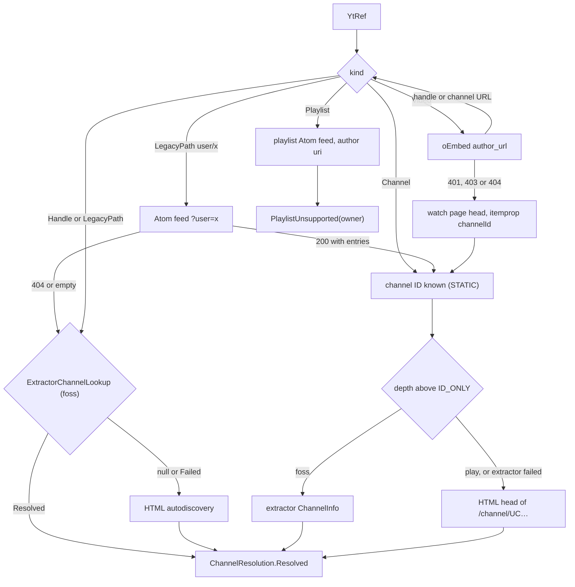
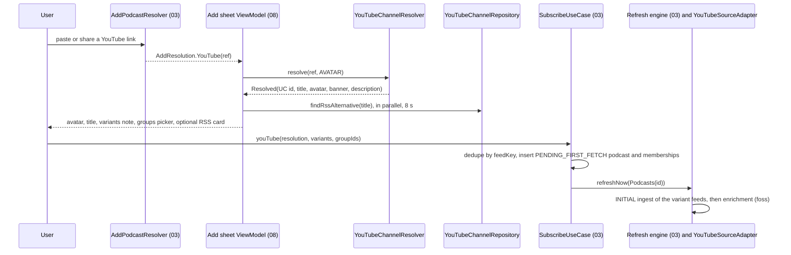
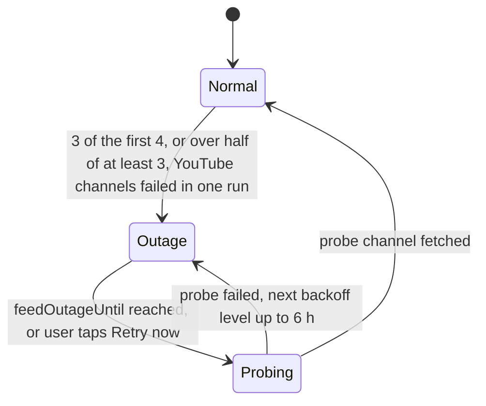
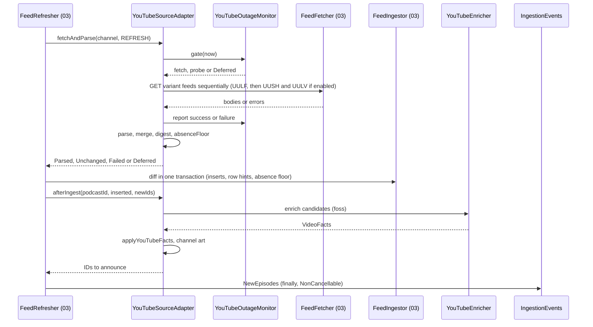
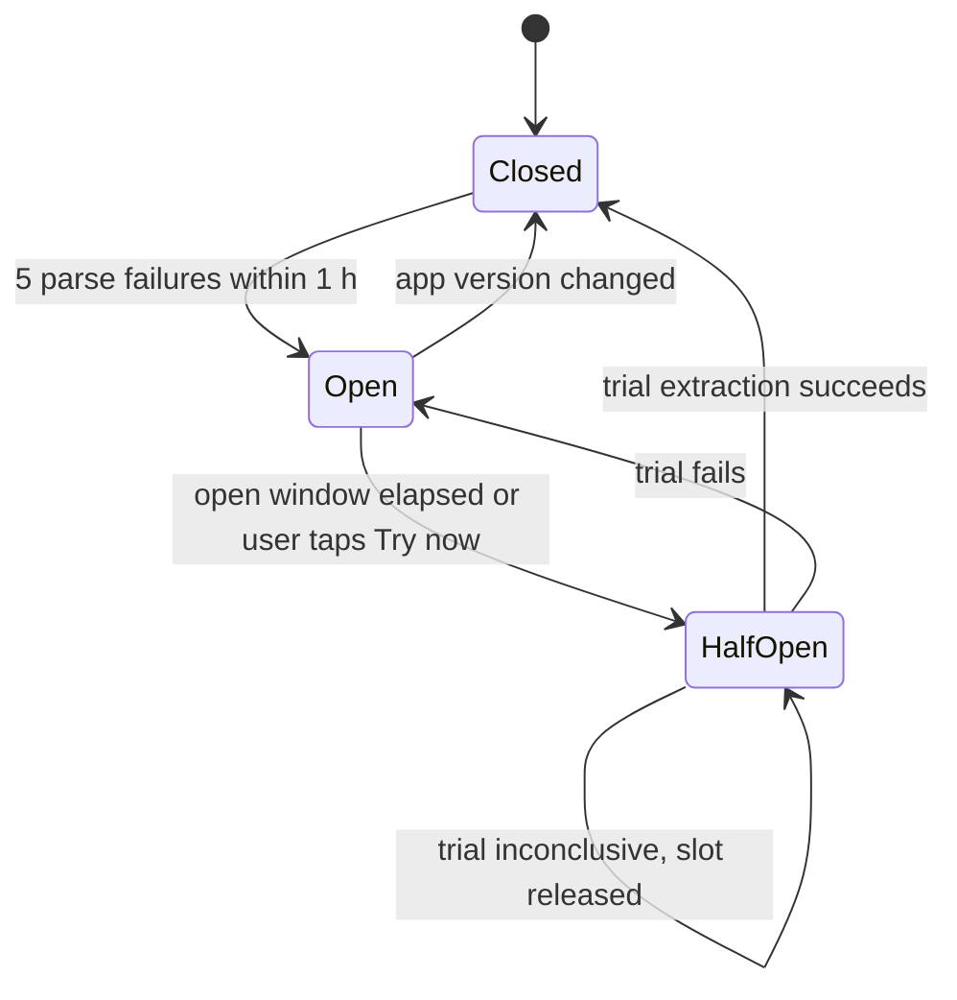

# 04 — YouTube channels as podcasts

> Status: Draft v1, 2026-10-04 · Implements: R3.1–R3.8, R1.6, R5.8 / N3, N8, N11 · Milestones: M3, M8, M9, M11 · Honours: D2, D3, D39, D45, D49, D50, D51, D52, D53, D64, D66, D67; PO-1, PO-2, PO-9 defaults · Owns: the YouTube flavor matrix and `YouTubeCapabilities`, the `:youtube:*` modules, channel resolution, YouTube Atom specifics, YouTube artwork sources, availability flags, enrichment and back catalogue, stream resolution and its contracts with playback and downloads, YouTube import formats, error handling and the circuit breaker, the GPL boundary and the extractor hotfix process

Contents: [Scope](#scope) · [Flavor matrix](#flavor-matrix) · [Channel resolution](#channel-resolution) · [Atom feed ingestion](#atom-feed-ingestion) · [Artwork and thumbnails](#artwork-and-thumbnails) · [Content flags and filtering](#content-flags-and-filtering) · [Stream resolution](#stream-resolution) · [Playback integration](#playback-integration) · [Download integration](#download-integration) · [Import and export formats](#import-and-export-formats) · [Error handling and circuit breaker](#error-handling-and-circuit-breaker) · [Licensing and legal](#licensing-and-legal) · [Maintenance and hotfix process](#maintenance-and-hotfix-process) · [Settings](#settings) · [Testing](#testing) · [Delivery by milestone](#delivery-by-milestone) · [Open questions](#open-questions) · [Sources](#sources)

---

## Scope

A YouTube channel is a `podcast` row with `sourceType = YOUTUBE_CHANNEL`. Everything that works on podcasts (groups, group feeds, counts, played state, positions, backup, OPML) works on channels unchanged ([R3.4](../PLAN.md#21-functional-requirements)). This document specifies only what is different. It is split along the two layers of [D51](../PLAN.md#3-key-decisions):

- **Layer A (all builds, Unlicense):** turn any user input into a `UC…` channel ID; poll YouTube's public Atom feeds of the uploads playlists; channel avatar, banner and video thumbnails; YouTube import and export formats.
- **Layer B (`foss` only, GPL-3.0-or-later, [PO-1](../PLAN.md#po-1-licensing-of-shipped-binaries) default A):** NewPipe Extractor for audio stream URLs (playback and downloads), enrichment (durations, availability), back catalogue and channel search.

### Responsibilities and boundaries

| This document owns | Owned elsewhere (link, do not restate) |
|---|---|
| `YouTubeCapabilities` and every per-flavor YouTube behaviour | Flavor mechanics, `FlavorModule` files, Gradle — [01 Build flavors](01-foundation.md#build-flavors), [01 Dependency injection](01-foundation.md#dependency-injection) |
| `YtRef` grammar, channel-ID resolution, subscribe-time YouTube branch | Add-podcast pipeline, `AddResolution`, `SubscribeUseCase` — [03 Add podcast flow](03-feeds-and-discovery.md#add-podcast-flow) |
| Variant URLs, Atom field mapping, merge, YouTube refresh policy, outage handling, enrichment | Generic Atom parsing, fetch pipeline, ingestion diff, refresh engine — [03 Parser](03-feeds-and-discovery.md#parser), [03 Ingestion and diff](03-feeds-and-discovery.md#ingestion-and-diff), [03 Refresh scheduling](03-feeds-and-discovery.md#refresh-scheduling) |
| Avatar, banner and thumbnail **sources and URL rules** | `ArtworkStore`, Coil, interceptor code, cropping — [08 Artwork pipeline](08-ui-ux.md#artwork-pipeline) |
| `Availability` semantics and which flags hide or exclude an episode | The `VISIBLE` SQL and every query — [02 Key queries](02-data-model.md#key-queries) |
| `YouTubeStreamResolver` contract, format selection, `ResolvedUrlCache`, error taxonomy, circuit breaker | Player, `EpisodeResolver`, `SimpleCache`, queue — [06 Media items and URI resolution](06-playback.md#media-items-and-uri-resolution); download engine and state machine — [07 YouTube transfers](07-downloads.md#youtube-transfers) |
| NewPipe JSON, LibreTube JSON, Takeout CSV/ZIP, URL-list specs; YouTube OPML attributes | Import pipeline, preview, statuses, OPML structure — [05 OPML import](05-groups-opml-backup.md#opml-import), [05 Other import formats](05-groups-opml-backup.md#other-import-formats) |
| GPL boundary, notices, Play guardrails, F-Droid anti-feature, hotfix runbook | Licensee and SPDX tasks — [01 Licensing and dependency policy](01-foundation.md#licensing-and-dependency-policy); CI, releases, store procedures — [09 CI pipelines](09-quality-and-release.md#ci-pipelines), [09 Distribution channels](09-quality-and-release.md#distribution-channels) |

### Modules and public API

| Module | Package | Licence | Contents |
|---|---|---|---|
| `:youtube:api` (JVM) | `app.neutrodyne.youtube.api` | Unlicense | `YtRef`, `YouTubeUrlClassifier`, all interfaces and data types below, pure helpers `YouTubeIds`, `YouTubeFeedUrls`, `YouTubeEntryRules`, `YouTubeThumbnails`, `YouTubeChapters`, `AudioStreamSelector`, `ResolvedUrlCache` |
| `:youtube:impl` (Android) | `app.neutrodyne.youtube.impl` | Unlicense | `DefaultYouTubeChannelResolver`, `HtmlAutodiscoveryChannelResolver`, `ChannelPageParser`, `OEmbedClient`, `ExternalOnlyYouTubeStreamResolver`, `NoOpYouTubeEnricher`, `UnsupportedYouTubeChannelSearch`, `NoExtractorChannelLookup` |
| `:youtube:streams` (Android, `foss`) | `app.neutrodyne.youtube.streams` | **GPL-3.0-or-later** | `NpeInitializer`, `OkHttpNpeDownloader`, `NpeYouTubeStreamResolver`, `InnertubeChannelResolver`, `NpeEnricher`, `NpeChannelSearch`, `NpeErrorClassifier`, `NpeAudioMapper` |
| `:core:data` | `app.neutrodyne.core.data.youtube` | Unlicense | `YouTubeSourceAdapter` (03's `SourceAdapter` for `YOUTUBE_CHANNEL`: variant fetch, merge, enrichment, channel art; rules in this document), `YouTubeOutageMonitor`, `DefaultYouTubeHealth`, `YouTubeAlertNotifier`, `YouTubeChannelRepositoryImpl`, `YouTubeAvailabilityRecorderImpl` |
| `:core:domain` | `app.neutrodyne.core.domain` | Unlicense | `YouTubeChannelRepository`, `YouTubeAvailabilityRecorder` |
| `:feeds` | `app.neutrodyne.feeds.youtube` | Unlicense | `NewPipeSubscriptions`, `LibreTubeBackupParser`, `TakeoutSubscriptionsParser`, `UrlListParser` (pure, raw strings out; classification happens in `:core:data`, rule 8 of [01 Dependency rules](01-foundation.md#dependency-rules)) |

YouTube Atom feeds are fetched and parsed by 03's generic engine in `:core:data`; no YouTube module parses Atom. `:youtube:streams` never binds `:youtube:api` interfaces itself; the `foss` `FlavorModule` does ([01 Dependency injection](01-foundation.md#dependency-injection) rule 6). `IpFamily` is declared in `:core:model` (not `:youtube:api`) so that `:core:network` can read it ([01 Interceptors](01-foundation.md#interceptors)).

```kotlin
// :youtube:api — channel side
sealed interface YtRef {
    data class Channel(val id: String, val variantsHint: Int? = null) : YtRef   // "UC…", validated; hint from UU-prefix
    data class Handle(val handle: String) : YtRef                                // "@name", percent-decoded, NFC
    data class LegacyPath(val path: String) : YtRef                              // "c/name", "user/name", "name"
    data class Video(val id: String) : YtRef                                     // 11 chars
    data class Playlist(val id: String) : YtRef                                  // PL…, OLAK5uy_…, RD…: not subscribable (D53)
    data class Query(val text: String) : YtRef                                   // foss channel search only
}
class YouTubeUrlClassifier @Inject constructor() {
    fun classify(input: String): YtRef?          // null = not a subscribable YouTube input; never returns Query
    fun classifyOrQuery(input: String): YtRef    // YouTube search field: classify(input) ?: Query(input.trim())
    fun isYouTubeHost(url: String): Boolean      // lets 03 say "not a channel or video link" instead of fetching HTML
}
enum class MetadataDepth { ID_ONLY, AVATAR, FULL /* + banner */ }
interface YouTubeChannelResolver { suspend fun resolve(ref: YtRef, depth: MetadataDepth = MetadataDepth.AVATAR): ChannelResolution }
sealed interface ChannelResolution {
    data class Resolved(val channelId: String, val title: String?, val avatarUrl: String?, val bannerUrl: String?,
                        val description: String?, val via: ResolvedVia) : ChannelResolution
    data class PlaylistUnsupported(val playlistId: String, val ownerChannelId: String?, val ownerTitle: String?) : ChannelResolution
    data object NotFound : ChannelResolution
    data class Failed(val retryable: Boolean, val reason: FailReason, val cause: Throwable?) : ChannelResolution
}
enum class ResolvedVia { STATIC, USER_FEED, EXTRACTOR, HTML, OEMBED }
enum class FailReason { NETWORK, RATE_LIMITED, CONSENT_WALL, PAGE_UNREADABLE, NOT_A_CHANNEL_LINK }
interface ExtractorChannelLookup { suspend fun lookup(ref: YtRef, depth: MetadataDepth): ChannelResolution? } // null = unavailable
interface YouTubeChannelSearch { suspend fun search(query: String, cursor: SearchCursor? = null): ChannelSearchResult }
data class ChannelHit(val channelId: String, val title: String, val avatarUrl: String?, val subscriberCount: Long?,
                      val description: String?, val verified: Boolean)
sealed interface ChannelSearchResult {
    data class Ok(val hits: List<ChannelHit>, val next: SearchCursor?) : ChannelSearchResult
    data object Unsupported : ChannelSearchResult
    data class Failed(val kind: TransientKind) : ChannelSearchResult
}
class SearchCursor(val opaque: Any)              // in-memory only; contents owned by the implementation
data class YouTubeCapabilities(val inAppPlayback: Boolean, val downloads: Boolean, val channelSearch: Boolean,
                               val enrichment: Boolean, val backCatalogue: Boolean)
```

```kotlin
// :youtube:api — stream side (canonical signatures kept; members added: invalidateAll, TransientKind)
interface YouTubeStreamResolver {
    suspend fun resolveAudio(videoId: String, pref: AudioPref): ResolveResult   // main-safe, cache-aware
    fun invalidate(videoId: String)
    fun invalidateAll()
}
sealed interface ResolveResult {
    data class Ok(val audio: ResolvedAudio) : ResolveResult
    data class Unavailable(val reason: Availability) : ResolveResult           // never AVAILABLE
    data class Transient(val cause: Throwable, val kind: TransientKind = TransientKind.NETWORK) : ResolveResult
    data object Unsupported : ResolveResult                                    // play flavor
}
enum class TransientKind { NETWORK, TIMEOUT, RATE_LIMITED, EXTRACTION, BREAKER_OPEN }
enum class AudioQuality(val ranks: List<Int>) {
    STANDARD(listOf(140, 251, 250, 139, 249)), DATA_SAVER(listOf(250, 249, 139, 140)), OPUS(listOf(251, 250, 140))
}
data class AudioPref(val quality: AudioQuality = AudioQuality.STANDARD, val preferDrc: Boolean = false,
                     val pinnedItag: Int? = null, val preferredLanguage: String? = null)
data class ResolvedAudio(
    val videoId: String, val url: String, val itag: Int, val formatId: String, val mimeType: String, val codecs: String?,
    val averageBitrate: Int?, val contentLength: Long?, val durationMs: Long?, val expiresAtMs: Long,
    val lastModifiedMicros: Long?, val isDrc: Boolean, val audioTrackId: String?, val trackLabel: String?,
    val ipFamily: IpFamily?,                                                   // enum in :core:model (01)
    val resolvedAtMs: Long,
) { override fun toString() = "ResolvedAudio($videoId, $formatId, expiresAt=$expiresAtMs)" } // url never printed
class YouTubeResolveException(val result: ResolveResult) : java.io.IOException(result::class.simpleName)
class YouTubeFormatChangedException(val videoId: String, val oldFormatId: String, val newFormatId: String) : java.io.IOException()
```

`formatId` identifies the bytes: `"{itag}"`, plus `-drc` for a DRC variant, plus `~{audioTrackId}` only when the response offers more than one audio track for that itag (YouTube reuses one itag for DRC and for every dubbed track; yt-dlp names them `251-drc`). A typical video therefore keeps the canonical cache key `yt:{videoId}:{itag}`; see [ResolvedUrlCache](#resolvedurlcache) and [Playback integration](#playback-integration).

```kotlin
// :youtube:api — enrichment, health
interface YouTubeEnricher {
    suspend fun enrich(channelId: String, videoIds: Set<String>, variants: Int): EnrichResult
    suspend fun uploadsPage(channelId: String, variant: Int, cursor: UploadsCursor?): UploadsPageResult
}
data class VideoFacts(val videoId: String, val title: String?, val publishedAtMs: Long?, val publishedApprox: Boolean,
                      val durationMs: Long?, val availability: Availability?, val isShort: Boolean?, val description: String?)
sealed interface EnrichResult {
    data class Ok(val facts: List<VideoFacts>) : EnrichResult
    data object Unsupported : EnrichResult
    data class Failed(val kind: TransientKind, val cause: Throwable?) : EnrichResult
}
class UploadsCursor(val opaque: Any)             // NewPipe Page in foss; in-memory only, never persisted
sealed interface UploadsPageResult {
    data class Ok(val items: List<VideoFacts>, val next: UploadsCursor?) : UploadsPageResult
    data object Unsupported : UploadsPageResult
    data class Failed(val kind: TransientKind) : UploadsPageResult
}
interface YouTubeHealth {
    val state: StateFlow<YouTubeHealthState>
    suspend fun awaitLoaded()                                      // persisted state read (AppInitializer); callers await once
    fun extractionGate(nowMs: Long): ExtractionGate               // non-suspending, in-memory
    fun reportExtraction(outcome: ExtractionOutcome)
    fun reportRateLimited(nowMs: Long)                             // extractor bot check or googlevideo 429
    fun reportFeedOutage(nowMs: Long)                              // YouTubeOutageMonitor: outage declared or probe failed
    fun reportFeedRecovered()                                      // probe or any feed fetch succeeded
    fun reportFeedRateLimited(nowMs: Long, retryAfterMs: Long?)    // Atom 429 / 403
    fun retryNow()                                                 // user action ("Try now", "Retry now")
}
data class YouTubeHealthState(val breaker: BreakerState, val breakerOpenUntil: Long?, val rateLimitedUntil: Long?,
                              val feedOutageUntil: Long?, val feedOutageLevel: Int, val feedRateLimitedUntil: Long?)
enum class BreakerState { CLOSED, OPEN, HALF_OPEN }
sealed interface ExtractionGate { data object Allow : ExtractionGate; data object AllowTrial : ExtractionGate
                                  data class Deny(val untilMs: Long, val kind: TransientKind) : ExtractionGate }
sealed interface ExtractionOutcome {
    data object Success : ExtractionOutcome
    data class ParseFailure(val videoId: String?) : ExtractionOutcome
    data class ForbiddenFreshUrl(val videoId: String) : ExtractionOutcome   // 403/410 on a URL resolved < 2 min ago
    data object Inconclusive : ExtractionOutcome                           // network, timeout, rate limit, cancelled
}
```

```kotlin
// :core:domain
interface YouTubeChannelRepository {
    suspend fun setVariants(podcastId: Long, variants: Int)              // writes podcast.youtubeVariants, refreshNow(Podcasts(id))
    suspend fun ensureChannelArt(podcastId: Long)                        // lazy banner, avatar older than 30 days
    suspend fun loadOlder(podcastId: Long): LoadOlderResult              // foss back catalogue
    suspend fun findRssAlternative(channelTitle: String): RssAlternative? // PO-9 "prefer the real RSS feed"
    suspend fun recheckAvailability(episodeId: Long): Availability?      // foss "Check again"; null = could not tell
}
sealed interface LoadOlderResult { data class Loaded(val inserted: Int, val hasMore: Boolean) : LoadOlderResult
    data object Unsupported : LoadOlderResult; data class Failed(val kind: TransientKind) : LoadOlderResult }
data class RssAlternative(val feedUrl: String, val title: String, val artworkUrl: String?, val provider: String)
interface YouTubeAvailabilityRecorder { suspend fun record(episodeId: Long, availability: Availability) }
```

### Threading and coroutines

| Component | Thread rules |
|---|---|
| `YouTubeUrlClassifier`, all `:youtube:api` helpers | Pure, synchronous, thread-safe; no I/O. Callable from the main thread |
| Every `suspend` API above | Main-safe. Network on `@Dispatcher(IO)`. Errors through `suspendRunCatching` (never swallows `CancellationException`) |
| Blocking NewPipe calls | `NpeCalls.blocking { … }` (`:youtube:streams`): runs the block on `@Dispatcher(IO)`; `OkHttpNpeDownloader` registers every `Call` it executes in the thread's active scope, and coroutine cancellation (timeout, skipped item, closed screen) calls `Call.cancel()` on them and then interrupts the thread. `Thread.interrupt()` alone does not abort a blocking socket read, so `runInterruptible` is not enough |
| Timeouts | `resolveAudio` 20 s; channel resolution 20 s overall; `enrich` 20 s per channel; `search` 10 s; `uploadsPage` 20 s (`withTimeout` → `Transient(TIMEOUT)`) |
| Single flight | Concurrent `resolveAudio` calls with the same cache key share one `Deferred` (pre-resolve and playback race), started on `@ApplicationScope` with a waiter count; it is cancelled (and its OkHttp calls with it) when the last waiter is cancelled, so one caller's cancellation never fails another |
| Concurrency caps | Enrichment: `Semaphore(2)` across channels. Downloads: 07's YouTube slot 1. Channel resolution during import: 2 concurrently (the same 2-per-host limit 03 applies to `www.youtube.com`, [D25](../PLAN.md#3-key-decisions)). Playback resolves: no cap beyond single flight. Search: latest wins (previous job cancelled) |
| `ResolvedUrlCache` | `ConcurrentHashMap`, read from Media3's loader thread |
| `YouTubeHealth` | `MutableStateFlow`; loaded from `device_settings` by an `AppInitializer` (01's initializer set; `awaitLoaded()` suspends until then); persistence launched on `@ApplicationScope`, conflated |
| `NewPipe.init` | Once, lazily, under a lock in `NpeInitializer.ensure()` (never in `Application.onCreate`) |

### New names introduced here

| Name | Kind / location | Purpose |
|---|---|---|
| `MetadataDepth`, `ResolvedVia`, `FailReason`, `ChannelResolution.{Resolved, PlaylistUnsupported, NotFound, Failed}` | `:youtube:api` | Shape of the canonical `ChannelResolution` |
| `ExtractorChannelLookup`, `YouTubeChannelSearch`, `ChannelHit`, `ChannelSearchResult`, `SearchCursor` | `:youtube:api`, flavor-bound | foss extractor channel lookup and search |
| `AudioQuality`, `AudioPref` fields, `ResolvedAudio` (incl. `formatId`), `TransientKind`, `YouTubeResolveException`, `YouTubeFormatChangedException` | `:youtube:api` | Stream contract |
| `IpFamily` | `:core:model` (placed by 01) | googlevideo IP family |
| `VideoFacts`, `EnrichResult`, `UploadsCursor`, `UploadsPageResult` | `:youtube:api` | Enrichment and back catalogue |
| `YouTubeHealth`, `YouTubeHealthState`, `BreakerState`, `ExtractionGate`, `ExtractionOutcome` | `:youtube:api`; impl `DefaultYouTubeHealth` in `:core:data` | Breaker, rate limit, feed outage |
| `YouTubeIds`, `YouTubeChapters`, `ChapterSpec`, `AudioCandidate`, `AudioStreamSelector`, `ResolvedUrlCache`, `YtEntry`, `VariantResult`, `VariantUrl`, `MergedChannel`, `ThumbVariant`, `BannerSource` | `:youtube:api` | Pure helpers and their data types |
| `RecordingDownloader`, `ReplayDownloader` | `:youtube:streams` test sources | Record and replay extractor HTTP traffic ([Recorded responses](#recorded-responses)) |
| `DefaultYouTubeChannelResolver`, `ChannelPageParser`, `NoOpYouTubeEnricher`, `UnsupportedYouTubeChannelSearch`, `NoExtractorChannelLookup` | `:youtube:impl` | Layer A and `play` no-ops |
| `NpeInitializer`, `NpeCalls`, `NpeChannelSearch`, `NpeErrorClassifier`, `NpeAudioMapper` | `:youtube:streams` | Layer B |
| `YouTubeChannelRepository`, `LoadOlderResult`, `RssAlternative`, `YouTubeAvailabilityRecorder` | `:core:domain` | Feature-facing YouTube operations |
| `YouTubeSourceAdapter`, `YouTubeOutageMonitor` | `:core:data` (names from 03) | YouTube rules on 03's engine |
| `YouTubeAlertNotifier`, `YouTubeChannelRepositoryImpl`, `YouTubeAvailabilityRecorderImpl` | `:core:data` | YouTube services |
| `AdapterResult.Parsed.absenceFloor`, `AdapterResult.Deferred`, `SourceAdapter.afterIngest` returning the IDs to announce | additions to 03's internal adapter contract (adopted by 03, [03 Source adapters](03-feeds-and-discovery.md#source-adapters)) | [Contract with 03's engine](#contract-with-03s-engine) |
| `UrlListParser`; DTOs `NewPipeSubscriptionsFile`, `LibreTubeBackupFile`, `TakeoutRow`, `YouTubeImportEntry` | `:feeds` | Import formats |
| `ImportFormat.URL_LIST` | enum constant appended to the canonical `ImportFormat` (defined in 02, pipeline in 05) | Plain list of URLs or IDs |
| `podcast.channelMetadataAt` | column `Long?` ([02 podcast](02-data-model.md#podcast)) | Last channel-page/extractor metadata fetch; null = never |
| `IngestDao.applyYouTubeFacts`, `EpisodeDao.youtubeEnrichmentCandidates`, `EpisodeDao.setAvailability`, `PodcastDao.applyYouTubeChannelMetadata` | DAO functions ([02 Ingestion support](02-data-model.md#ingestion-support)) | Writes described in [Atom feed ingestion](#atom-feed-ingestion) |
| `DnsFamilyHints` | `:core:network` (requested from 01) | googlevideo IP-family matching ([Stream resolution](#ip-family-matching)) |
| `NOTIF_ID_YT_BREAKER = 4100` | notification ID on channel `alerts` | Breaker notice |
| `youtube.*` keys | [Settings](#settings) | — |
| `PodcastDao.youtubeChannelIds()` | DAO function (requested from 02) | "Retry now" refresh scope |
| `scripts/emergency/no-youtube-streams.patch`, `scripts/youtube/record-responses.sh`; CI jobs `emergency-patch-check`, `youtube-canary` | repository files / 09 jobs | Legal emergency build, recorded responses, canary |

---

## Flavor matrix

Serves R3.1–R3.8, N8. Delivered in M8 (layer A, both flavors), M9 (layer B, `foss`). Honours [D2](../PLAN.md#3-key-decisions), [D51](../PLAN.md#3-key-decisions), [PO-2](../PLAN.md#po-2-distribution-channels-and-youtube-per-flavor).

| Capability | `foss` (M9+) | `play` | Mechanism |
|---|---|---|---|
| Subscribe by URL, share, `@handle`, OPML, NewPipe, LibreTube, Takeout, URL list | Yes | Yes | Layer A resolution |
| Subscribe by typing a channel name | Yes | No — "share it from the YouTube app or paste its link" | `YouTubeChannelSearch` |
| Listing, avatar, banner, thumbnails, groups, group feeds, counts, played state, positions, backup | Yes | Yes | Atom + 03/05 |
| Durations; live / upcoming / members flags; premiere hold-back | Yes (enrichment + resolve) | No: duration "—", items appear as soon as listed | `YouTubeEnricher` |
| In-app audio playback, background, lock screen, Bluetooth, queue, sleep timer, chapters | Yes | **No** — "Watch on YouTube" | `YouTubeStreamResolver` |
| Play group / context tail / Android Auto browse | Included (only `AVAILABLE`) | Excluded | `youtubePlayable` in [02 Play context](02-data-model.md#play-context) |
| Manual download, auto-download, "Download all" in a group | Yes (keep 2 default when on) | **No** | `YouTubeTransferSource` |
| Back catalogue beyond the newest 15 | "Load older" | No | `YouTubeEnricher.uploadsPage` |
| "Watch on YouTube" | Overflow action (with `&t=` position) | Primary action; marks played (setting) | `ACTION_VIEW` |
| NewPipe JSON export, OPML export of channels | Yes | Yes | [Import and export formats](#import-and-export-formats) |
| "Prefer the show's RSS feed" suggestion | Yes | Yes | Apple / fyyd search (03) |
| SponsorBlock, video mode, playlists | v1.x (M14) | No (playlists: v1.x both) | — |

**R3 is fully delivered by `foss`.** `play` delivers R3.1 (links only), R3.2 (without premiere hold-back and flags), R3.3, R3.4 and R3.7; it cannot deliver R3.5, R3.6, R3.8 (PLAN PO-2).

### DI bindings

Bound only in the two `FlavorModule`s of [01](01-foundation.md#flavor-modules); `YouTubeChannelResolver` (→ `DefaultYouTubeChannelResolver`, `:youtube:impl`), `YouTubeHealth` (→ `DefaultYouTubeHealth`, `:core:data`), `YouTubeChannelRepository` and `YouTubeAvailabilityRecorder` (`:core:data`) are flavor-independent `@Binds` in their modules.

| Interface | `foss` from M9 | `play`, and `foss` before M9 |
|---|---|---|
| `YouTubeStreamResolver` | `NpeYouTubeStreamResolver` | `ExternalOnlyYouTubeStreamResolver` (always `Unsupported`, `invalidate*` no-ops) |
| `YouTubeEnricher` | `NpeEnricher` | `NoOpYouTubeEnricher` (`Unsupported`) |
| `YouTubeChannelSearch` | `NpeChannelSearch` | `UnsupportedYouTubeChannelSearch` |
| `ExtractorChannelLookup` | `InnertubeChannelResolver` | `NoExtractorChannelLookup` (returns `null`) |
| `YouTubeCapabilities` | all five `true` | all five `false` |

Each binding exists from the milestone of its first consumer (`YouTubeCapabilities` M2, `YouTubeStreamResolver` → `ExternalOnlyYouTubeStreamResolver` M4, the other three M8), per 01's binding timeline ([01 Flavor modules](01-foundation.md#flavor-modules)).

### Capability consumers

| Flag | Consumers |
|---|---|
| `inAppPlayback` | 06 `EpisodeResolver` YouTube branch, `QueueProjector`, Auto browse tree; 05/02 context tail (`youtubePlayable`); `QueueRepository` rejects YouTube adds when false; 08 row primary action |
| `downloads` | 07 claim (`youtubeAllowed`) and planner (`youtubeDownloads`); `DownloadController.request` rejects YouTube IDs when false; 05 "Download all" count; 08 download buttons |
| `channelSearch` | 08/03 Discover "YouTube channels" search action |
| `enrichment` | `YouTubeSourceAdapter` enrichment step; `YouTubeChannelRepository.recheckAvailability` |
| `backCatalogue` | 08 "Load older" button; `YouTubeChannelRepository.loadOlder` |

### UI per flavor (hand-off to [08 Flavor differences in UI](08-ui-ux.md#flavor-differences-in-ui))

| Element | `foss` | `play` |
|---|---|---|
| YouTube episode row primary action | Play / Pause | "Watch on YouTube" (opens app or browser) |
| Play next, Play last, Add to Up next, Download, Mark for auto-download | Shown | Hidden |
| Duration | Enriched or measured, "—" while unknown | "—" |
| Unavailable reason line (age-restricted, region, private, kids, removed) | Shown, row greyed, action "Watch on YouTube"; overflow "Check again" (`recheckAvailability`) for `REGION_BLOCKED`, `PRIVATE`, `UNAVAILABLE` | Never set |
| YouTube channel with no visible episodes | Empty state "No long-form videos yet. This channel may post only Shorts or live streams." + "Podcast settings" (variants) | Same |
| Podcast detail "Load older" | Shown for YouTube channels | Hidden |
| Discover "Search YouTube channels" | Shown | Hidden; Add sheet hint "share from the YouTube app or paste a link" |
| Settings › YouTube | Variants info, audio quality, volume levelling, YouTube auto-download, suggest RSS, mark played on open (applies to unplayable episodes), extractor status line | Suggest RSS, mark played on open |
| Licences / About | NewPipe Extractor notice, GPL statement | No GPL text, **no mention of the other build** |

---

## Channel resolution

Serves R3.1, R1.6. Delivered in M3 (classifier), M8 (layer A), M9 (extractor lookup, search). The channel ID is the only identity ever stored; handles and custom URLs are inputs only (R3.1).

### Input grammar

`YouTubeUrlClassifier.classify(input)`:

1. Trim; strip a leading `feed:`/`view-source:`; if there is no scheme and the text starts with a YouTube host, prepend `https://`.
2. Bare forms: `^@[^\s/?#]{1,100}$` → `Handle`; `YouTubeIds.CHANNEL` → `Channel`; anything else without a host → `null`.
3. Accept only hosts `youtube.com`, `www.youtube.com`, `m.youtube.com`, `music.youtube.com`, `youtu.be`, `youtube-nocookie.com`, `www.youtube-nocookie.com` (case-insensitive, `http` or `https`). Other hosts → `null`.
4. Drop tracking parameters `si`, `pp`, `feature`, `app`, `ab_channel`, `utm_*`, `t`, `start`, `index`.
5. Match the path (percent-decoded, trailing `/` ignored, first match wins):

| Path / query | Result |
|---|---|
| `/channel/{id}[/…]` | `Channel(id)` |
| `/feeds/videos.xml?channel_id={id}` | `Channel(id)` |
| `/feeds/videos.xml?playlist_id={p}`, `/playlist?list={p}` | uploads prefix (below) → `Channel`; otherwise `Playlist(p)` |
| `/feeds/videos.xml?user={name}` | `LegacyPath("user/{name}")` |
| `/@{handle}[/…]` | `Handle("@{handle}")` |
| `/c/{name}[/…]`, `/user/{name}[/…]` | `LegacyPath("c/{name}")`, `LegacyPath("user/{name}")` |
| `/watch?v={id}` (any `list=` ignored), `/shorts/{id}`, `/live/{id}`, `/embed/{id}`, `/v/{id}`, `/e/{id}`, `youtu.be/{id}` | `Video(id)` |
| `/{name}` single segment matching `^[A-Za-z0-9_.-]{1,100}$` and not in `RESERVED` | `LegacyPath(name)` |
| anything else on a YouTube host | `null` (03 shows "not a channel or video link" via `isYouTubeHost`) |

`RESERVED` = `watch, shorts, live, playlist, playlists, feeds, feed, results, embed, channel, c, user, v, e, hashtag, post, premium, account, gaming, music, kids, about, redirect, attribution_link, signin, upload, studio, oembed, youtubei, api, t, s, browse, podcasts, trending, downloads, logout`.

```kotlin
object YouTubeIds {
    val CHANNEL = Regex("^UC[0-9A-Za-z_-]{21}[AQgw]$")   // 24 chars, 128 bits; last char carries padding
    val VIDEO = Regex("^[0-9A-Za-z_-]{11}$")            // lenient; the stricter last-char rule is Unverified, not enforced
    /** Prefix by LENGTH, never by text: 24 chars → "UU" (hint 7, all); 26 chars → 4-char prefix UULF→1, UUSH→2,
     *  UULV→4, UUMO/UUPS/UULP/UUPV→null hint. ("UULF…" with 24 chars is the plain uploads list of a channel
     *  "UCLF…".) Result = "UC" + rest; must match CHANNEL, else null. */
    fun uploadsToChannel(playlistId: String): Pair<String, Int?>?
    fun channelFromFeedLevel(id: String): String = if (id.length == 22) "UC$id" else id  // feed-level yt:channelId lacks "UC"
}
```

Handles are kept Unicode (handles may contain dots, underscores, hyphens and non-ASCII letters) and percent-encoded as UTF-8 only when building a URL. A `Video` ref resolves to the video's channel, never to a single-video subscription.

### Resolution order

`DefaultYouTubeChannelResolver.resolve(ref, depth)`; overall timeout 20 s.



- `Query` is rejected (`require`); search uses `YouTubeChannelSearch`.
- If metadata fetching fails after the ID is known, the result is still `Resolved(channelId, title = null, avatarUrl = null, …)`: subscribing never fails because art is missing. `channelMetadataAt` stays null and art is retried ([Channel metadata refresh](#channel-metadata-refresh)).

### HTML autodiscovery

`HtmlAutodiscoveryChannelResolver` (all builds; the only network path in `play` besides Atom and oEmbed):

1. URL: `Handle` → `https://www.youtube.com/@{enc}`; `LegacyPath` → `https://www.youtube.com/{path}`; `Channel` (metadata only) → `https://www.youtube.com/channel/{id}`.
2. `GET` with `@HttpClient(FEED)` (120 s call timeout; the API client's 8 s is too short for this page), headers `Cookie: SOCS=CAE=` (skips the EU consent interstitial, the value NewPipe Extractor sends), `Accept: text/html`, `Accept-Language: {app locale}, en;q=0.5`. User-Agent: ours ([01 Interceptors](01-foundation.md#interceptors)).
3. Status: 404 → `NotFound`; 429 → `Failed(RATE_LIMITED)`; 5xx / I/O → `Failed(NETWORK, retryable)`; final URL host `consent.youtube.com` → `Failed(CONSENT_WALL)`.
4. Read with Okio into a buffer until `</head>` (case-insensitive) or 1.5 MiB, then `Jsoup.parse(prefix, baseUri)` (`ChannelPageParser`, pure).
5. Channel ID, first match wins: `link[rel=alternate][type=application/rss+xml]` href `channel_id=`; `link[rel=canonical]` `/channel/UC…`; `meta[itemprop=identifier]`; regex `"externalId":"(UC[\w-]{22})"` over the prefix. If none and fewer than 1.5 MiB were read, keep streaming the body for `"externalId"` up to 3 MiB total. Validate with `YouTubeIds.CHANNEL`; otherwise `Failed(PAGE_UNREADABLE)`.
6. Title `meta[property=og:title]` (fallback `<title>` minus `" - YouTube"`); avatar `meta[property=og:image]`; description `meta[property=og:description]` (plain text).
7. Only for `depth = FULL`: continue streaming the body with a 64 KiB sliding window (2 KiB overlap) for `"imageBannerViewModel":{"image":{"sources":[`, capture up to the closing `]`, decode the array of `{url, width, height}` with kotlinx.serialization, stop at 3 MiB total. Close the response as soon as everything needed is found.

The page is about 2.5 MB; reading it fully for every subscribe is wasteful, hence head-first. Unverified: the byte size of `<head>`; M8 measures it on the recorded fixture. If the median head exceeds 512 KiB, imports fetch avatars only for the first 20 channels per refresh run on metered networks (rest on unmetered); the decision is recorded here.

### oEmbed, user feed and watch page

- **oEmbed** (`OEmbedClient`, `@HttpClient(API)`): `GET https://www.youtube.com/oembed?url={urlencoded https://www.youtube.com/watch?v={id}}&format=json` → `author_url` (a handle URL, sometimes `/channel/` or `/user/`) and `author_name`; the URL is classified and resolved again (one hop, no loops).
- **Legacy user feed:** `GET https://www.youtube.com/feeds/videos.xml?user={name}` (`@HttpClient(FEED)`); channel ID from the first entry's `yt:channelId`, else feed `author/uri`. Cheaper than the page and official.
- **Watch page fallback** (oEmbed 401/403/404, e.g. embedding disabled): watch page with the consent cookie, head-first; `meta[itemprop=channelId]` or `"channelId":"(UC…)"` within 1.5 MiB.
- **Playlist owner:** `GET …/feeds/videos.xml?playlist_id={PL…}` → `author/uri` → `PlaylistUnsupported(ownerChannelId, ownerTitle)` so the UI can offer the channel ([D53](../PLAN.md#3-key-decisions): `PL…` feeds return the first 15 items in playlist order, so new items may never appear).

### foss extractor lookup

`InnertubeChannelResolver : ExtractorChannelLookup` calls `ChannelInfo.getInfo(ServiceList.YouTube, url)` for `Handle`, `LegacyPath` and (for metadata) `Channel`; one InnerTube round trip returns ID, name, avatars, banners and description (NewPipe Extractor resolves handles through InnerTube `navigation/resolve_url`). It respects `YouTubeHealth.extractionGate` (deny → return `null`, falling back to HTML) and reports parse failures to the breaker. Any exception → `null` (fallback), never a user-visible failure.

### Subscribe flow

The YouTube branch of 03's add pipeline. 03's `AddPodcastResolver.resolve(input)` only classifies and returns `AddResolution.YouTube(ref)`; the add sheet's ViewModel (`:feature:discover`, 08) continues with the `:youtube:api` and `:core:domain` calls below; persistence is 03's `SubscribeUseCase.youTube` ([03 Subscribe transaction](03-feeds-and-discovery.md#subscribe-transaction)). There is **no in-memory Atom preview** for YouTube: the sheet shows channel metadata only, and the first episodes arrive through the normal refresh engine.



- Preview card: avatar, title, "Long-form uploads only — change in podcast settings" (08's wording), groups picker, the RSS suggestion card ([below](#prefer-the-shows-rss-feed)). `Resolved` with `title = null` (metadata failed) shows the channel ID as the title and a monogram.
- Dedupe key: `feedKey = UrlNormalizer.forIdentity(YouTubeFeedUrls.canonical(id))`, checked inside `SubscribeUseCase.youTube`; a hit returns `SubscribeError.AlreadySubscribed(podcastId)` and the sheet shows "Already subscribed" with "Open" (`PodcastKey`). No `podcast_url_alias` rows are written for YouTube inputs (every form maps statically or by resolution to the same canonical URL; handle URLs must not be stored).
- Columns written by `SubscribeUseCase.youTube` from `ChannelResolution.Resolved`: `sourceType = YOUTUBE_CHANNEL`, `feedUrl = YouTubeFeedUrls.canonical(id)`, `youtubeChannelId = id`, `youtubeVariants = ref.variantsHint ?: 1` (only `YtRef.Channel` carries a hint), `title = resolved.title ?: id` (replaced by Atom `author/name` at the first ingest), `author = title`, `link = YouTubeFeedUrls.channelPage(id)`, `artworkUrl = avatarUrl?.let { YouTubeThumbnails.avatar(it, 900) }` and its `artworkKey` (else the monogram key), `bannerUrl`, `descriptionHtml` = channel description (plain text), `channelMetadataAt = now` when `avatarUrl != null` else null; `status = PENDING_FIRST_FETCH`, `initialFetch = 1`, `nextRefreshAt = now`.
- The first ingest is 03's `INITIAL` mode ([D66](../PLAN.md#3-key-decisions)): no `isNew`, no notification, no auto-download ([D67](../PLAN.md#3-key-decisions)). A failing first fetch leaves the podcast `PENDING_FIRST_FETCH` with 03's "Fetching episodes…"/error banner; the subscription is never rolled back.
- Error UX (strings owned by 08):

| Result | Message | Actions |
|---|---|---|
| `NotFound` | "This YouTube channel doesn't exist or was removed." | Edit |
| `PlaylistUnsupported` | "YouTube playlists can't be subscribed to yet." | "Subscribe to {ownerTitle}" when known |
| `Failed(NETWORK)` | "Couldn't reach YouTube. Check your connection and try again." | Retry |
| `Failed(RATE_LIMITED)` | "YouTube is limiting requests from your network. Try again later." | Retry |
| `Failed(CONSENT_WALL or PAGE_UNREADABLE)` | "Couldn't read this YouTube page. Paste the channel's /channel/UC… link or a link to one of its videos." | Edit |
| Typed name in `play` | "To add a YouTube channel, share it from the YouTube app or paste its link." | — |

### Prefer the show's RSS feed

[PO-9](../PLAN.md#48-further-product-owner-decisions) default. When the preview opens and `youtube.suggest_rss` is on, `YouTubeChannelRepository.findRssAlternative(title)` queries 03's `SearchRepository` (enabled podcast directories only; never YouTube search) with an 8 s timeout. A hit matches when `norm(channelTitle)` equals `norm(collectionName)` or `norm(artistName)`, where `norm` = NFKC, lowercase, remove everything except letters and digits. The first match is shown as a card "This show also has a podcast feed — Subscribe to the podcast instead"; the preview is never blocked. The query only goes to directories the user already has enabled ([03 Search and discovery](03-feeds-and-discovery.md#search-and-discovery) privacy text applies).

### Channel search

`foss` only, M9. Discover offers an explicit "Search YouTube channels" action; YouTube is queried only on that action, never on every keystroke of the podcast search (N3: typed podcast searches never reach YouTube). `NpeChannelSearch` uses `SearchInfo` with the YouTube `channels` content filter; up to 3 pages on scroll. A hit opens `AddPodcastKey("https://www.youtube.com/channel/{id}")`, i.e. the normal subscribe flow. Breaker open or rate limited → `Failed`, shown as "YouTube search is temporarily unavailable".

### Channel metadata refresh

- Atom `author/name` updates the title on every refresh (via 03's metadata update).
- Avatar and description: in `afterIngest` (after a successful fetch, ingested or unchanged; after the enrichment step), `YouTubeSourceAdapter` re-resolves `Channel(id)` with `AVATAR` depth when `channelMetadataAt` is null or older than 30 days, under `withTimeoutOrNull(20 s)`. Budget (in-memory sliding window of 10 min, which covers one 8-min run): at most 100 never-fetched (`channelMetadataAt IS NULL`, typically fresh imports) plus 30 stale channels, 2 concurrently with 0.5–1.5 s jitter. In `foss` a denied extraction gate makes the resolver fall back to HTML ([foss extractor lookup](#foss-extractor-lookup)). Channels over budget keep their monogram until a later run. New avatar URL → new `artworkKey`. 03's pin on an `artworkUrl` change runs before `afterIngest` and never sees this write, so whenever `applyYouTubeChannelMetadata` changes `artworkKey` (first avatar after a monogram, or a new avatar URL; the caller compares the stored key), the caller (`YouTubeSourceAdapter.afterIngest` here, `YouTubeChannelRepository.ensureChannelArt` below) calls `ArtworkStore.pin(ArtworkRef(newKey, avatarUrl, 0), PinReason.SUBSCRIPTION, podcastId)`, which schedules `artwork-sync` ([08 ArtworkStore](08-ui-ux.md#artworkstore)).
- A failed lookup leaves `channelMetadataAt` unchanged (null stays null), so it is retried next run; `NotFound` sets `channelMetadataAt = now` (the Atom feed decides whether the channel still exists).
- Banner: `ensureChannelArt(podcastId)` is called by the podcast detail screen (08) on open; it fetches with `FULL` depth when `bannerUrl` is null and `channelMetadataAt` is null or older than 30 days, or when the avatar is older than 30 days; a changed avatar key is pinned as above. In-flight calls for the same podcast are coalesced.
- Writes go through `PodcastDao.applyYouTubeChannelMetadata(id, artworkUrl, artworkKey, bannerUrl, descriptionHtml, channelMetadataAt)` (null arguments keep the stored value); Atom ingestion never writes these columns (see mapping below).

---

## Atom feed ingestion

Serves R3.2, R3.3, R3.4. Delivered in M8 (enrichment in M9). 03's refresh engine runs YouTube channels like any podcast (due selection, 6 global / 2 per host, 8-min deadline, batched fetch-state writes, `FeedIngestor` diff); `YouTubeSourceAdapter` (03's `SourceAdapter` for `YOUTUBE_CHANNEL`, [03 Source adapters](03-feeds-and-discovery.md#source-adapters)) supplies the fetch, parse and merge, row hints, scheduling and the post-ingest steps defined here.

### Contract with 03's engine

| 03 hook | YouTube behaviour |
|---|---|
| `fetchAndParse(feed, REFRESH or FULL)` (identical for YouTube; `OLDER_PAGE` is never requested because YouTube rows have no paging columns) | Variant fetches ([Fetch policy](#fetch-policy)), [merge](#merge-algorithm), returns `Parsed(feed = merged ParsedFeed, partial = true, meta, rowHints, absenceFloor)`, or `Unchanged(meta)` when the merged digest equals `podcast.contentSha256`, or `Failed(kind, http, retryAfterMs, transient = true)`, or `Deferred(untilMs)` during a feed outage or feed rate limit |
| `rowHints` (`RowHint` per `externalMediaId`) | `isShort` (sticky: stored OR parsed), `availability = null` (keep stored), `isVideo = false` |
| `nextRefreshAt(feed, result, base)` | `max(base, lastAttemptAt + 15 min)`; gap pull-in ([Gap detection](#gap-detection)) |
| `afterIngest(podcastId, inserted, newIds): List<Long>` | [Enrichment step](#enrichment-step) and [channel art](#channel-metadata-refresh); returns the IDs to announce |
| `hostKey` | `www.youtube.com` (03's 2-per-host limit applies) |

Three additions to 03's internal contract, adopted by 03 ([03 Source adapters](03-feeds-and-discovery.md#source-adapters)):

1. `AdapterResult.Parsed.absenceFloor: Long?` — when non-null it replaces 03's partial-document rule "`sortDate ≥ min(sortDate of this document's rows)`" in diff step 8: absent rows flip to `inFeed = 0` only if `sortDate ≥ absenceFloor`. `Long.MAX_VALUE` flips nothing.
2. `AdapterResult.Deferred(untilMs)` — the feed was not attempted: `lastAttemptAt`, `failureCount`, `lastErrorKind` unchanged; `nextRefreshAt = untilMs`; not counted as remaining work (no continuation).
3. `afterIngest(podcastId, inserted, newIds): List<Long>` runs **before** 03 emits `NewEpisodes` and returns the IDs to emit (RSS returns `newIds` unchanged); it is also called after `Unchanged` with empty lists. The emission runs in a `finally` under `NonCancellable`, so a deadline cancellation of enrichment never loses the event.

### Variant URLs

```kotlin
object YouTubeFeedUrls {
    fun canonical(channelId: String) = "https://www.youtube.com/feeds/videos.xml?channel_id=$channelId"   // stored, exported
    fun channelPage(channelId: String) = "https://www.youtube.com/channel/$channelId"
    fun watch(videoId: String) = "https://www.youtube.com/watch?v=$videoId"
    /** Ordered LONG_FORM, SHORTS, LIVE; one URL per set bit. Never stored. */
    fun pollUrls(channelId: String, variants: Int): List<VariantUrl>
}
data class VariantUrl(val bit: Int, val url: String)  // …/feeds/videos.xml?playlist_id=UULF{id without UC}, UUSH…, UULV…
```

| Bit (`YouTubeVariantBits`) | Playlist prefix | Observed content (tested 2026-10-04) |
|---|---|---|
| `LONG_FORM = 1` (default) | `UULF` | Long-form uploads only: no Shorts, no live streams |
| `SHORTS = 2` | `UUSH` | Shorts only |
| `LIVE = 4` | `UULV` | Live streams (past broadcasts) |
| — | `UU` / `channel_id` | Everything (fallback only) |
| — | `UUMO` | Members-only uploads — not polled in v1 |

The prefixes are undocumented; if YouTube drops them, the `channel_id` fallback below keeps channels working.

### Fetch policy

| Rule | Value |
|---|---|
| Requests per refresh | One per set bit, **sequentially** in bit order inside the feed's 03 permit (so at most 2 concurrent requests to `www.youtube.com`, [D25](../PLAN.md#3-key-decisions)); plus one `channel_id` fallback when the primary (lowest set bit) returns 404 |
| Client and headers | 03's `FeedFetcher` (`@HttpClient(FEED)`) with a 2 MB body cap (a 15-entry feed is ~20 KB); `Accept: application/atom+xml, application/xml;q=0.9, */*;q=0.1`; no validators (YouTube sends no `ETag`/`Last-Modified`) |
| Minimum interval | `nextRefreshAt ≥ lastAttemptAt + 15 min` (server sends `max-age=900`). Manual refreshes are not throttled beyond 03's 20 s pull-to-refresh cooldown |
| Interval | The podcast's effective refresh interval ([D45](../PLAN.md#3-key-decisions)), never below 15 min |
| 404 on `UUSH`/`UULV` | Treated as `Empty` (Unverified: whether channels without such content answer 404 or an empty feed; both are handled) |
| 404 on the primary | Try `channel_id`; 200 → use it (fallback mode), mark Shorts by link and **drop** them unless `SHORTS` is set (live items cannot be told apart in this mode; known limitation, enrichment marks them in `foss`); 404, 5xx or I/O → channel failure (`Failed(HTTP_NOT_FOUND …, transient = true)`) and one failure for [YouTubeOutageMonitor](#errors-and-global-outage) |
| 410 | Same as 404. YouTube channels are **never** marked `gone`; a channel failing for 7 days gets 03's derived "possibly dead" badge (terminated channels), which clears on the next success |
| 429 or 403 on any feed | `health.reportFeedRateLimited(now, Retry-After)` → `feedRateLimitedUntil = now + max(Retry-After, 30 min)`, doubling per consecutive occurrence to 6 h; this channel and every YouTube channel fetched before that time return `Deferred(feedRateLimitedUntil)` without network (no failure counted). The next successful fetch resets the doubling |

### What 04 needs from the parser

03's `FeedParser` parses YouTube Atom generically (namespaces `http://www.w3.org/2005/Atom`, `yt` = `http://www.youtube.com/xml/schemas/2015`, `media` = `http://search.yahoo.com/mrss/`) and must expose: feed `title`, `author/name`, `author/uri`, `yt:channelId`, `yt:playlistId`; entry `id`, `yt:videoId`, `yt:channelId`, `title`, `link[rel=alternate]@href`, `published` (raw and parsed), `updated` (parsed, ignored by YouTube rules), `media:group/media:description`, `media:group/media:thumbnail@url`, `media:group/media:community/media:statistics@views`. Items with no enclosure but a `yt:videoId` are kept (03's "item without enclosure but with `externalMediaId`" path).

### Mapping

Podcast columns written by Atom ingestion for YouTube (everything else in the row is written by subscribe, the channel-metadata path, 03's scheduling or 05):

| Column | Value |
|---|---|
| `title`, `author` | Feed `author/name` (playlist feeds are titled "Videos" or "Live streams"; never use feed `<title>`) |
| `latestEpisodeAt`, scheduling and fetch-state columns | As 03 |
| `contentSha256` | `YouTubeEntryRules.digest(...)` of the merged entries (raw bodies change on every fetch because of view counts and `<updated>`) |
| `etag`, `lastModified` | Always null |
| **Never written by Atom** | `artworkUrl`, `artworkKey`, `bannerUrl`, `descriptionHtml`, `link`, `youtubeChannelId`, `youtubeVariants`, `channelMetadataAt` |

Episode columns (subset; full entity in [02 episode](02-data-model.md#episode)):

| Column | YouTube value |
|---|---|
| `guid` / `identityKey` | `yt:video:{id}` / `g:yt:video:{id}` |
| `externalMediaId` | `{id}` (`yt:videoId`) |
| `title` | Entry `title` (non-empty fallback: the date, as 03) |
| `pubDate`, `rawPubDate` | `published`; `sortDate` per [D19](../PLAN.md#3-key-decisions) |
| `enclosureUrl`, `enclosureType`, `enclosureLength` | null |
| `isVideo` | `false`: Neutrodyne delivers YouTube as audio in v1 ([D51](../PLAN.md#3-key-decisions)); rows are recognised by `sourceType`, not `isVideo` |
| `durationMs` | null from Atom; enrichment value carried over |
| `imageUrl` / `artworkKey` | `https://i.ytimg.com/vi/{id}/mqdefault.jpg` (true 16:9, always exists) / 08's `u-` key |
| `link` | `https://www.youtube.com/watch?v={id}` (also for Shorts) |
| `episode_description.html`, `snippet` | `media:description` plain text; snippet = first 200 chars |
| `isShort` | Link path starts with `/shorts/`, or the entry came from `UUSH`, or enrichment says so (sticky: never reset to false) |
| `availability` | `AVAILABLE` on insert; Atom never changes it afterwards (enrichment and resolve own it) |
| `chaptersUrl`, season, episode fields, `explicit` | null |
| `contentHash` | Over title, `published`, description, `isShort` (never views or `<updated>`) |

### Merge algorithm

`YouTubeEntryRules.merge(results, enabledBits): MergedChannel` (pure), called by `YouTubeSourceAdapter` with one `VariantResult` per polled URL (`Ok(bit, entries, authorName)`, `Empty(bit)`, `Failed(bit, httpCode, cause)`; the `channel_id` fallback reports under the primary's bit with `fallback = true`):

1. If the primary variant failed and its `channel_id` fallback failed too → channel failure; no ingest (see [Errors and global outage](#errors-and-global-outage)). A failed **secondary** variant (`UUSH`, `UULV`) does not fail the channel: the others are ingested and step 7 marks no absences.
2. Union entries by `videoId`; the first occurrence (lowest bit) supplies fields; `isShort = any(/shorts/ link, bit == SHORTS)`.
3. In fallback mode drop Shorts unless `SHORTS` is enabled (after step 7's floor is computed on the raw entries).
4. Order by `published` descending, ties by `videoId`; `feedOrder` = index (03 inserts in descending `feedOrder`).
5. Title = `authorName` of the first `Ok` result.
6. `digest` = lowercase SHA-256 hex over lines `videoId|title|published|isShort|sha1(description)` in order. Equal to the stored `contentSha256` → `AdapterResult.Unchanged` (reschedule only, no transaction; this replaces 03's body-hash shortcut, which never hits for YouTube because view counts and `<updated>` change every fetch).
7. `absenceFloor`: if any enabled variant `Failed` → `Long.MAX_VALUE` (mark no absences). Otherwise `max` over the `Ok` variants of `floorᵥ`, where `floorᵥ` = the smallest 03 `sortDate` of that variant's raw entries when it returned exactly 15 entries, else `Long.MIN_VALUE` (a short list is the complete list); `Empty` variants contribute `Long.MIN_VALUE`.
8. Return `Parsed(merged feed, partial = true, meta, rowHints, absenceFloor)`.

### Window-aware absence

YouTube feeds show only the newest 15 entries per variant, so "absent from this parse" does not mean "removed". With `absenceFloor`, 03's diff sets `inFeed = 0` only for a stored row that is absent from the merged set **and** has `sortDate ≥ absenceFloor`: such a row would have been inside the window of whichever variant it belongs to. Taking the **maximum** of the per-variant floors matters when Shorts or live streams are polled: `UUSH`'s 15 entries may span two days while `UULF`'s span a year, and a month-old Short that merely scrolled out of `UUSH` must not be flipped. Rows older than the window (normal history, back catalogue) keep `inFeed = 1`. Consequence: retention ([D23](../PLAN.md#3-key-decisions)) only removes YouTube videos that were deleted or made private while inside the window (see [Open questions](#open-questions) on growth). Rows of a variant the user switched off flip to `inFeed = 0` once they are newer than the floor; they are hidden by `VISIBLE` (Shorts) or simply age out.

### Carry-over on update

03's column rules ([03 Column rules on update](03-feeds-and-discovery.md#column-rules-on-update)) already keep a stored `durationMs` when the parsed value is null. Through the `RowHint`s the adapter adds: `availability` = stored (Atom never changes it), `isShort = stored || parsed`, `isVideo = false`. A title or description edit therefore never clobbers enrichment.

### Gap detection

On a non-initial refresh, if every entry of a 15-entry variant is unknown, items may have been missed between refreshes (high-volume channels, or the device was offline). Then: in `foss`, the enrichment step also requests `uploadsPage(channelId, bit, null)` (one page, ~30 items) and ingests unknown IDs through 03's `FeedIngestor` in `OLDER_PAGE` mode (never `isNew`, never flips absence; [D66](../PLAN.md#3-key-decisions)); in both flavors `nextRefreshAt` is pulled in to `now + max(15 min, interval / 2)` for the next three refreshes of that channel (in memory, best effort). The 15 newest unknown items of the triggering refresh stay `isNew = 1` subject to 03's dump guard.

### Errors and global outage

Since December 2025 the feed endpoint has repeatedly answered 404 for every feed for hours. A YouTube-wide outage must never mark channels dead or unsubscribe them (R3.3).

`YouTubeOutageMonitor` (`:core:data`, singleton, in-memory; persistence through `YouTubeHealth`):

1. **Gate.** Before fetching a channel the adapter calls `monitor.gate(now)`: `feedRateLimitedUntil > now` or `feedOutageUntil > now` → return `Deferred(until)` without network. `feedOutageLevel > 0` and `feedOutageUntil ≤ now` → **probe**: the first caller fetches; concurrent callers await its result (at most 20 s) and then re-evaluate the gate. Otherwise fetch.
2. **Count.** Each fetched channel reports success, or failure = primary and `channel_id` fallback both answered 404/410/5xx or I/O. 03's `OFFLINE` (no network) and cancellations count as neither.
3. **Declare.** Outage when ≥ 3 of the first 4 YouTube channels of a run failed (checked immediately, so the rest of the run is deferred), or at `monitor.onRunFinished()` (called by 03's engine at the end of every run, [03 Engine run](03-feeds-and-discovery.md#engine-run) step 10) when `attempted ≥ 3` and `failed / attempted > 0.5`. Declaring calls `health.reportFeedOutage(now)`.
4. **Backoff.** `DefaultYouTubeHealth` raises `feedOutageLevel` and sets `feedOutageUntil = now + [1 h, 2 h, 4 h, 6 h][min(level, 4) − 1]`, persisted as `youtube.feed_outage_until` / `youtube.feed_outage_level` in `device_settings`. Every YouTube channel attempted before that time returns `Deferred` (no `failureCount` change, no network).
5. **Probe.** Probe success → `health.reportFeedRecovered()` (level 0, until null); the remaining channels of the run fetch normally. Probe failure → `reportFeedOutage(now)` (next level).
6. The ≤ 3 channels that failed before the declaration keep their `failureCount + 1`; that is harmless because "possibly dead" needs 7 days without success. Outside an outage, a channel failure follows 03's per-feed backoff.



UI: one in-app banner on Feeds and Library while `feedOutageLevel > 0`, "YouTube feeds aren't responding. Your channels will update automatically when YouTube is back." with "Retry now" (`health.retryNow()`: `feedOutageUntil = now`, level kept, then `RefreshController.refreshNow(Podcasts(PodcastDao.youtubeChannelIds()))`, so the next fetch is the probe). No system notification and no per-podcast error badges during the outage (08 reads `YouTubeHealth.state`). Feed rate limiting (`feedRateLimitedUntil`) shows nothing beyond "last refreshed".

### Enrichment step

`foss`, M9. Runs in `YouTubeSourceAdapter.afterIngest`, i.e. inside the same `RefreshWorker` run, after the channel's ingest transaction (or after `Unchanged`, so pending premieres of quiet channels are still re-checked).

1. Skip when `capabilities.enrichment` is false or `extractionGate` denies. The whole step runs under `withTimeoutOrNull(20 s)`; the engine's 8-min deadline cancels it like any in-flight feed. Unfinished candidates are picked up next run.
2. Candidates (`EpisodeDao.youtubeEnrichmentCandidates(podcastId, now)`): episodes of the channel with (`durationMs IS NULL AND availability = 'AVAILABLE' AND firstSeenAt > now − 7 d`) or (`availability IN ('UPCOMING','LIVE') AND firstSeenAt > now − 30 d`). None → skip.
3. `enrich(channelId, ids, variantsOfCandidates)`: `NpeEnricher` requests the first page (~30 items) of the channel tab per needed bit (`LONG_FORM` → `ChannelTabs.VIDEOS`, `SHORTS` → `SHORTS`, `LIVE` → `LIVESTREAMS`; one InnerTube browse call per tab via `ChannelTabInfo`). `UPCOMING`/`LIVE` candidates not on the first page are checked one by one with `StreamInfo` (at most 5 per channel and 20 per 10-min window); other IDs missing from the page get no facts.
4. Fact mapping per item: `StreamInfoItem.getDuration()` > 0 → `durationMs`; `getContentAvailability()` `MEMBERSHIP`/`PAID` → `MEMBERS_ONLY`, `UPCOMING` → `UPCOMING`, `AVAILABLE` → `AVAILABLE`, `UNKNOWN` → unchanged; `getStreamType()` `LIVE_STREAM`/`AUDIO_LIVE_STREAM`/`POST_LIVE_STREAM` → `LIVE` (overrides `AVAILABLE`); `isShortFormContent()` → `isShort = true` (sticky). Per-video checks map through [Exception classification](#exception-classification) and the stream type.
5. Rate: 2 channels concurrently, 0.5–1.5 s jitter between channels, a 6–12 s pause after every 50 channels (NewPipe Extractor client precedent), at most 100 channels per 10-min window.
6. Write changed values only with `IngestDao.applyYouTubeFacts(rows)` (partial update of `durationMs`, `availability`, `isShort`) in one transaction per channel.
7. Return the IDs to announce (contract item 3 above): `newIds` (rows inserted with `isNew = 1` by this ingest) plus rows promoted from `UPCOMING`/`LIVE` to `AVAILABLE` that still have `isNew = 1`, filtered by one query to `VISIBLE` and `availability = 'AVAILABLE'`. When enrichment is skipped or fails, the same filter applies to `newIds` alone. Notifications therefore never announce a premiere `foss` already knows to be upcoming; auto-download relies on 02's candidate query, which requires `AVAILABLE` anyway.

### Refresh of one channel



### Back catalogue

`foss`, M9; `YouTubeChannelRepository.loadOlder(podcastId)` from the podcast screen's "Load older" (08):

- Pages the tab of the channel's lowest set variant bit (`videos` for `LONG_FORM`, else `shorts`, else `livestreams`) with an in-memory `UploadsCursor` per podcast held by a `@Singleton` (survives screen recreation, not process death; after process death paging restarts from page 1 and known IDs are skipped).
- Each call fetches one page (~30) and ingests it through 03's `FeedIngestor` in `OLDER_PAGE` mode (identity keys, `sortDate`, `feedOrder` as for Atom entries; `isNew = 0`, `inFeed = 1`, never flips absence, never updates existing rows' feed fields), then writes the page's facts with `applyYouTubeFacts`. Back-catalogue rows never emit `NewEpisodes` and are never auto-downloaded ([D66](../PLAN.md#3-key-decisions), [D67](../PLAN.md#3-key-decisions)).
- Tab items carry relative dates ("3 years ago"); `StreamInfoItem.getUploadDate()` returns a `DateWrapper` whose `isApproximation()` is then true, and `pubDate` is truncated to the UTC day with `rawPubDate = "approx"`. A missing date uses the previous item's date (keeps order).
- At most 20 pages per podcast per process; `hasMore = false` when the cursor ends. Gate denied → `Failed(BREAKER_OPEN or RATE_LIMITED)`; 08 shows the failure text.

---

## Artwork and thumbnails

Serves R3.2, R5.2, R5.3, R5.8. Delivered in M8. 08 owns rendering, `ArtworkStore`, Coil and the interceptor code; this section defines the sources.

```kotlin
object YouTubeThumbnails {
    val THUMB = Regex("""^https?://i\d?\.ytimg\.com/vi(?:_webp)?/([\w-]{11})/(\w+)\.(?:jpg|webp)$""")
    fun avatar(url: String, px: Int): String              // rewrites the "=s<digits>" size token to "=s$px"; no token → unchanged
    fun video(videoId: String, v: ThumbVariant): String   // https://i.ytimg.com/vi/{id}/{name}.jpg
    fun chainFor(widthPx: Int): List<ThumbVariant>         // ≤ 320 → [MQ]; else [MAXRES, HQ720, MQ]
    fun pickBanner(sources: List<BannerSource>): String?   // smallest width ≥ 1280, else the widest
}
enum class ThumbVariant(val fileName: String, val letterboxed: Boolean) {
    MAXRES("maxresdefault", false), HQ720("hq720", false), SD("sddefault", true),
    HQ("hqdefault", true), MQ("mqdefault", false), DEFAULT("default", true)
}
```

| Artwork | Source | Stored / used |
|---|---|---|
| Channel avatar (podcast cover, square) | HTML `og:image` `https://yt3.googleusercontent.com/{token}=s900-c-k-c0x00ffffff-no-rj` (also `yt3.ggpht.com`); `foss`: largest `ChannelInfo.getAvatars()` ≤ 1024 px | `podcast.artworkUrl` normalised to `=s900` (fits the ≤ 1024 px store); pinned by `ArtworkStore` like any cover; everything reads the pinned file first |
| Channel banner (~6:1) | HTML `imageBannerViewModel.image.sources` (widths 1060, 1138, 1707, …); `foss`: `ChannelInfo.getBanners()` | `podcast.bannerUrl` via `pickBanner`; not pinned (detail header only; offline the header falls back to the blurred avatar) |
| Video thumbnail (episode art) | Derived from the video ID; Atom's `hqdefault` is 4:3 letterboxed and is never stored | `episode.imageUrl = mqdefault` (320×180, true 16:9, always exists); downloads pin it like any episode art ([07 Storage layout](07-downloads.md#storage-layout)) |
| System surfaces (notification, lock screen, Auto, resumption card) | Channel avatar | 06 uses `podcastArtworkKey` from `EpisodeDao.mediaInfo` for `YOUTUBE_CHANNEL` episodes, never the 16:9 thumbnail |
| Group mosaics | Channel avatar | 08 crops to the rounded square used everywhere |

Interceptor contract for 08's `YouTubeThumbnailInterceptor` (M8): it acts on any request URL matching `YouTubeThumbnails.THUMB`, tries `chainFor(requestedWidthPx)` in order, treats a non-2xx as "next" (Coil caches eligible 404s since 3.4.0), and as a last resort loads `hqdefault` and crops the central 16:9 band (rows 45–315 of 360) before any square crop, so letterbox bars never show (R5.8). `maxresdefault`, `hq720` and `sddefault` return 404 for some older videos; `mqdefault` exists for every video tested.

---

## Content flags and filtering

Serves R3.2, R3.7, R3.8. Delivered in M8 (Shorts, `VISIBLE`), M9 (enrichment and resolve-time reasons). Honours [PO-9](../PLAN.md#48-further-product-owner-decisions) defaults: hide Shorts, live and members-only; hold premieres; audio only.

### Where each flag comes from

| `Availability` / flag | `foss` source | `play` source |
|---|---|---|
| `AVAILABLE` | Default on insert; enrichment; "Check again" with a successful resolve | Default (never changes) |
| `UPCOMING` (premiere, scheduled live) | Enrichment `ContentAvailability.UPCOMING`; resolve: playability `LIVE_STREAM_OFFLINE` ([classification](#exception-classification)) | — |
| `LIVE` (live now, or ended but not yet processed) | Enrichment and resolve: `StreamType.LIVE_STREAM`, `AUDIO_LIVE_STREAM`, `POST_LIVE_STREAM` | — |
| `MEMBERS_ONLY` (also paid content) | Enrichment `MEMBERSHIP`/`PAID`; resolve `PaidContentException`, `YoutubeMusicPremiumContentException` | — |
| `AGE_RESTRICTED`, `REGION_BLOCKED`, `PRIVATE`, `KIDS_ONLY`, `UNAVAILABLE` | Resolve only (playability status) | — |
| `isShort` | `/shorts/` link, `UUSH`, enrichment `isShortFormContent()` | `/shorts/` link, `UUSH` |

Enrichment re-checks `UPCOMING` and `LIVE` items for 30 days; a premiere or finished live stream becomes `AVAILABLE` (processed post-live recordings are ordinary videos) and is then announced ([Enrichment step](#enrichment-step)). Resolve-time reasons are persisted with `YouTubeAvailabilityRecorder.record(episodeId, reason)` (implemented in `:core:data` with `EpisodeDao.setAvailability`, which writes only `availability`), called by 06 and 07; this is a write to `episode` outside the refresh pipeline (exception to [D15](../PLAN.md#3-key-decisions), see [Open questions](#open-questions)).

**Check again** (`foss`, overflow of a greyed row with `REGION_BLOCKED`, `PRIVATE` or `UNAVAILABLE`, which can change): `YouTubeChannelRepository.recheckAvailability(episodeId)` calls `invalidate(videoId)`, then `resolveAudio`, and records `AVAILABLE` on `Ok` or the new reason on `Unavailable`; `Transient` records nothing and returns null (snackbar "Couldn't check — try again later"). This is also the recovery path for items wrongly marked during an extractor breakage.

### Participation matrix

| State | Feed lists (`VISIBLE`) | Unplayed / new counts | Context tail, Play group, Auto browse | Auto-download | New-episode notification | Row |
|---|---|---|---|---|---|---|
| `AVAILABLE` | shown | counted | `foss` yes, `play` no | `foss` per policy | yes | normal |
| `isShort` with `SHORTS` off | hidden | no | no | no | no | — |
| `UPCOMING`, `LIVE`, `MEMBERS_ONLY` | hidden | no | no | no | when it becomes `AVAILABLE` | — |
| `AGE_RESTRICTED`, `REGION_BLOCKED`, `PRIVATE`, `KIDS_ONLY`, `UNAVAILABLE` | shown greyed with reason | **no** (02 counts only `AVAILABLE`) | no | no | already sent, never retracted | "Watch on YouTube" |

This confirms 02's v1 `VISIBLE` fragment (`NOT (e.isShort = 1 AND (p.youtubeVariants & 2) = 0) AND e.availability NOT IN ('UPCOMING','LIVE','MEMBERS_ONLY')`). YouTube episodes count in unplayed badges in both flavors (in `play`, opening an item in YouTube marks it played by default, so counts stay meaningful), and 02's group/All counts and library `unplayedCount` add `AND e.availability = 'AVAILABLE'`, so greyed, unplayable items never inflate badges ([02 Feed counts](02-data-model.md#feed-counts)).

Reason strings (08 owns the final text): `AGE_RESTRICTED` "Age-restricted — sign-in required on YouTube"; `MEMBERS_ONLY` "Members only"; `REGION_BLOCKED` "Not available in your country"; `PRIVATE` "Private video"; `KIDS_ONLY` "Made for kids — can't be played here"; `UNAVAILABLE` "No longer available"; `UPCOMING` "Premieres soon"; `LIVE` "Live now".

`play` limitation: without enrichment, premieres, live streams and members-only uploads that appear in the polled playlists are listed as normal external episodes; opening them in YouTube shows YouTube's own state.

---

## Stream resolution

Serves R3.5, R3.6, R3.8. Delivered in M9, `foss` only. Honours [D50](../PLAN.md#3-key-decisions), [D52](../PLAN.md#3-key-decisions).

State of the extractor (source read 2026-10-05 at tag `v0.26.5`, commit `f9e6bb8`, 2026-08-15; JitPack `com.github.teamnewpipe:NewPipeExtractor:v0.26.5`): `YoutubeStreamExtractor.onFetchPage` requests the ANDROID (reel) player — whose `playabilityStatus` is what `checkPlayabilityStatus` turns into the exceptions below — then the `VISIONOS` player (failures ignored), optionally iOS (`setFetchIosClient`, off by default; we leave it off), the `WEB` player for metadata and thumbnails, and the `next` endpoint; audio streams are merged from all player responses. The PoToken provider is a no-op. Unreleased `dev` (commit `9ed62db3`) drops ANDROID and iOS and relies on `VISIONOS` alone, which yt-dlp also uses by default. A direct `VISIONOS` probe (2026-10-04) returned direct audio URLs for itags 139, 140, 249, 250, 251 with `expiresInSeconds = 21540` (about 6 h), no `n` parameter, and URLs bound to the requesting IP. Versions, JitPack filter, Rhino pin, desugaring and R8 rules: [01 Toolchain and versions](01-foundation.md#toolchain-and-versions), [01 Core library desugaring](01-foundation.md#core-library-desugaring).

### Initialisation and downloader

- `NpeInitializer.ensure()` calls `NewPipe.init(downloader, Localization(lang, country), ContentCountry(country))` with the app's effective locale (per-app language if set, else system; fallback `en`/`US`). The locale influences which audio track YouTube lists first on dubbed videos. A locale change calls `NewPipe.setupLocalization(localization, contentCountry)`. The consent mode stays at the extractor default (`SOCS=CAE=`, "reject all"); no PoToken provider is set.
- `OkHttpNpeDownloader : Downloader` overrides `execute(Request): Response` on `@HttpClient(YOUTUBE)` (shared connection pool and resolver chain, [01 One client family](01-foundation.md#one-client-family)). It copies NewPipe's request headers verbatim (NewPipe sets browser User-Agents per request; ours is added only when absent), maps HTTP 429 to `ReCaptchaException`, caps response bodies at 8 MB, returns `Response(code, message, headers, body, finalUrl)`, and registers each `Call` with `NpeCalls` for cancellation ([Threading and coroutines](#threading-and-coroutines)).

### Resolve algorithm

`NpeYouTubeStreamResolver.resolveAudio(videoId, pref)`:

1. `videoId` fails `YouTubeIds.VIDEO` → `Unavailable(UNAVAILABLE)`.
2. `ResolvedUrlCache.get(videoId, pref)` hit (pinned or unpinned, rules in [ResolvedUrlCache](#resolvedurlcache)) → `Ok`.
3. `health.awaitLoaded()`; `health.extractionGate(now)`: `Deny(until, kind)` → `Transient(kind)` (`BREAKER_OPEN` or `RATE_LIMITED`) without network; `AllowTrial` → this call is the half-open trial.
4. Single flight on the key; `withTimeout(20 s) { NpeCalls.blocking { StreamInfo.getInfo(ServiceList.YouTube, watchUrl) } }`.
5. Exceptions → `NpeErrorClassifier` ([table](#exception-classification)).
6. `info.streamType` `LIVE_STREAM`, `AUDIO_LIVE_STREAM` or `POST_LIVE_STREAM` (an ended stream not yet processed; the extractor marks its streams `isUrl = false`) → `Unavailable(LIVE)`.
7. `NpeAudioMapper` maps `info.audioStreams` to `AudioCandidate`s; `AudioStreamSelector.select(candidates, pref)`.
8. No candidate: if `info.videoStreams` (muxed) is non-empty → `Unavailable(KIDS_ONLY)` (since commit `82b7e410`, released in v0.26.3, made-for-kids videos only get the 360p muxed stream; `dev` makes them unplayable altogether, so no muxed fallback is built); else (SABR-only or empty response) → `Transient(EXTRACTION)`.
9. Build `ResolvedAudio` from the chosen stream and its URL query: `expire` (epoch s) → `expiresAtMs` (missing → `now + 5 h`), `clen` → `contentLength`, `lmt` → `lastModifiedMicros`, `ip` → `ipFamily` (`:` in the value → `V6`), `formatId` ([Scope](#modules-and-public-api)); `durationMs = info.duration × 1000`.
10. `health.reportExtraction(Success)`; cache; set the googlevideo IP-family hint ([below](#ip-family-matching)); return `Ok`. Cancellation of a trial call reports `Inconclusive`.

### Format selection

`AudioStreamSelector` is pure Unlicense code in `:youtube:api`, so a future non-GPL resolver (plan C) reuses it; `:youtube:streams` only maps NewPipe objects to `AudioCandidate(itag, mimeType, codecs, averageBitrate, delivery, hasUrl, trackType, trackLanguage, audioTrackId, isDrc)` (from `AudioStream.getItag()`, `getFormat()`, `getCodec()`, `getAverageBitrate()`, `getDeliveryMethod()`, `isUrl()`, `getAudioTrackType()`, `getAudioLocale()`, `getAudioTrackId()`, `getItagItem().isDrc()`).

1. Keep candidates with `hasUrl` and progressive HTTP delivery (no DASH, HLS or SABR).
2. Audio track: if any candidate has `trackType = ORIGINAL`, keep only those. Otherwise drop `DUBBED` (v0.26.5 maps both `dubbed` and `dubbed-auto` xtags to it) and `DESCRIPTIVE` while other tracks remain; then prefer `trackLanguage == pref.preferredLanguage`, then `trackType == null`, then `SECONDARY`. Dubbed and AI-dubbed tracks are never chosen while any other track exists.
3. DRC ("stable volume"): drop DRC variants unless `pref.preferDrc` (`youtube.volume_levelling`); if only DRC variants remain, keep them. (YouTube serves DRC variants under the same itag.)
4. If `pref.pinnedItag` is present and a remaining candidate has it, return that candidate.
5. Sort by the index of the itag in `pref.quality.ranks` (unknown itags last), then `averageBitrate` descending, then itag ascending; return the first.

| `AudioQuality` | Ranks ([D52](../PLAN.md#3-key-decisions)) | Typical result |
|---|---|---|
| `STANDARD` (default) | 140 > 251 > 250 > 139 > 249 | AAC-LC m4a, ~130 kbps; plays in every app and car stereo |
| `DATA_SAVER` | 250 > 249 > 139 > 140 | Opus ~70 kbps |
| `OPUS` | 251 > 250 > 140 | Opus ~140 kbps WebM |

Media3 plays AAC in MP4 on all API levels and Opus in WebM through the platform decoder; YouTube's adaptive audio files carry index ranges, so progressive seeking works (standard behaviour, not re-tested). No MIME type is set on the `MediaItem`; the extractor sniffs mp4 or webm.

### ResolvedUrlCache

- Key `"$videoId|$quality|$preferDrc|$preferredLanguage"`; `pinnedItag` is **not** part of the key, because 06's `EpisodeResolver` and 07's YouTube transfers resolve unpinned first and pinned on every later connection or chunk. Lookup: a valid entry is a hit when `pref.pinnedItag == null || entry.itag == pref.pinnedItag`; only an itag mismatch resolves anew, and its result replaces the entry. So a pinned call after an unpinned one for the same video and preferences costs no extractor call, which keeps the [Costs](#costs) below. LRU of 64 entries; memory only ([D50](../PLAN.md#3-key-decisions)): never written to the database, a backup, logs, crash reports or the restored queue.
- An entry is valid until `min(expiresAtMs − 10 min, resolvedAtMs + 5 h)`.
- `invalidate(videoId)` removes every key of that video. If a removed entry was resolved less than 2 min earlier, the resolver reports `ExtractionOutcome.ForbiddenFreshUrl(videoId)` (06 and 07 call `invalidate` only after a 403/410, so a fresh URL being refused signals a PoToken requirement or an IP mismatch; [Circuit breaker](#circuit-breaker)).
- `invalidateAll()` runs on a change of the default network (`NetworkMonitor`, because the client IP changes) and when the breaker opens; neither reports anything.

### Exception classification

`NpeErrorClassifier`, **first matching row wins** (several classes are subclasses of `ParsingException`; names checked against the v0.26.5 sources, `org.schabi.newpipe.extractor.exceptions`):

| NewPipe Extractor exception / condition | Result | Breaker |
|---|---|---|
| `SignInConfirmNotBotException` ("Sign in to confirm you're not a bot"; a `ParsingException` subclass), `ReCaptchaException` (incl. our mapped HTTP 429) | `Transient(RATE_LIMITED)`; `health.reportRateLimited(now)` | no (`Inconclusive`) |
| `AgeRestrictedContentException` | `Unavailable(AGE_RESTRICTED)` | no |
| `PaidContentException`, `YoutubeMusicPremiumContentException` | `Unavailable(MEMBERS_ONLY)` | no |
| `PrivateContentException` | `Unavailable(PRIVATE)` | no |
| `GeographicRestrictionException`, `UnsupportedContentInCountryException` | `Unavailable(REGION_BLOCKED)` | no |
| `AccountTerminatedException` | `Unavailable(UNAVAILABLE)` | no |
| other `ContentNotAvailableException` whose message contains `LIVE_STREAM_OFFLINE` (scheduled premiere or stream; the extractor throws it with the raw playability status) | `Unavailable(UPCOMING)` | no |
| other `ContentNotAvailableException` | `Unavailable(UNAVAILABLE)`; but when 2 **other** videos already failed this way within 10 min, `Transient(EXTRACTION)` and `ParseFailure(videoId)` instead (a broken client looks like "every video unavailable", and nothing wrong is persisted) | only in the cluster case |
| `ContentNotSupportedException` (not thrown by the YouTube service in v0.26.5; defensive) | `Unavailable(UNAVAILABLE)` | no |
| `ParsingException`, other `ExtractionException` (incl. `StreamInfo.StreamExtractException` "Could not get any stream"), no usable audio (SABR-only) | `Transient(EXTRACTION)`; `ParseFailure(videoId)` | yes |
| `IOException`, `InterruptedIOException` | `Transient(NETWORK)` | no (`Inconclusive`) |
| `TimeoutCancellationException` | `Transient(TIMEOUT)` | no (`Inconclusive`) |

Unverified: that premieres report `LIVE_STREAM_OFFLINE` on the ANDROID player (recorded fixture in M9 decides; fallback: classify via enrichment only).

### Bot checks and rate limiting

A rate-limit report (extractor bot check, or a googlevideo 429 from 07) pauses all extractor calls (resolve, enrichment, search, back catalogue, extractor channel lookup) for 30 min, doubling per consecutive report to 6 h, reset by the next `Success` (`youtube.rate_limited_until`, `youtube.rate_limit_level` in `device_settings`). Layer A (Atom, HTML, oEmbed) is unaffected; Atom has its own [feed rate limit](#fetch-policy). No captcha solver and no PoToken generator are shipped (bot checks hit VPN, Tor and data-centre IPs most). UI: a status line in Settings › YouTube, the player banner "YouTube is limiting requests from your network. Try again later." and 07's wait text; no system notification. "Try now" (`retryNow()`) clears the pause but keeps the level.

### IP-family matching

Googlevideo URLs are bound to the IP that requested them (`ip=` parameter). If the InnerTube request left over IPv4 and the media request goes over IPv6 (Happy Eyeballs, VPN, CGNAT), expect 403. Unverified hypothesis (reproduced once from a sandbox whose proxy mixed families); M9's device checklist verifies it on IPv6 Wi-Fi and IPv4-only mobile networks.

Design: after every `Ok`, the resolver sets `DnsFamilyHints.set("googlevideo.com", audio.ipFamily)`; 01's `FamilyHintDns` (in every derived client's resolver chain) returns only A records (V4) or only AAAA records (V6) for hosts ending in `.googlevideo.com`, and all records when that family has none, so MEDIA and DOWNLOAD clients connect over the family that YouTube saw ([01 Interceptors](01-foundation.md#interceptors)). On a default-network change the resolver clears the hint (`set("googlevideo.com", null)`) together with `invalidateAll()`, so a stale V6 hint never strands an IPv4-only network. A constant `IP_FAMILY_MATCHING_ENABLED` in `:youtube:streams` turns the hint off.

### Costs

| Operation | `foss` network cost | `play` |
|---|---|---|
| Subscribe by handle | 1 InnerTube `ChannelInfo` + 1 Atom per variant | ~1 channel page head + 1 Atom per variant |
| Refresh one channel | 1 Atom per variant (+1 fallback); enrichment 1 browse per needed tab only when candidates exist (+ ≤ 5 per-video checks); avatar lookup every 30 days | Atom; channel page head every 30 days |
| Play one episode | 1 `StreamInfo` resolve per 5 h per video (v0.26.5: ANDROID player, `VISIONOS` player, `WEB` player, `next` = 4 InnerTube requests) | — |
| Download one episode | 1 resolve + ⌈size / 10 MiB⌉ ranged GETs (60 min ≈ 58 MB ≈ 6 chunks at itag 140) | — |
| Search | 1 InnerTube search per page | — |

---

## Playback integration

Serves R3.5, R3.8. Delivered in M9 (06's YouTube branch returns an error until then). Honours [D39](../PLAN.md#3-key-decisions), [D50](../PLAN.md#3-key-decisions). 06 owns `EpisodeResolver`, the cache data source and error recovery; this is the contract.

| Aspect | Contract |
|---|---|
| Branch | `EpisodeResolver` takes the YouTube branch when `mediaInfo.sourceType == YOUTUBE_CHANNEL`, `externalMediaId != null` and `LocalMediaIndex.localUriOrNull(id) == null` (a completed download always wins) |
| URI and IDs | `neutrodyne://episode/{id}`, mediaId `episode:{id}`; there is no `yt://` scheme |
| Resolve | On Media3's loader thread (`ResolvingDataSource.Resolver.resolveDataSpec` may block): `runBlocking { resolver.resolveAudio(videoId, pref) }` (06 wraps it in a 25 s timeout) with `pref = AudioPref(youtube.audio_quality, youtube.volume_levelling, pinnedItag = pin.itag, app language)` |
| `DataSpec` | `uri = audio.url`, `key = "yt:{videoId}:{formatId}"` — the canonical `yt:{videoId}:{itag}` for every single-track non-DRC format (stable across re-resolution, so `SimpleCache` entries are reused), no extra headers, position and length untouched |
| Format pinning | The first `Ok` pins `(formatId, contentLength, lastModifiedMicros)` for this episode's playback (in memory, cleared on item transition). A later `Ok` that differs in any of the three throws `YouTubeFormatChangedException(videoId, old, new formatId)` (same `formatId` with a new `clen`/`lmt` means the video was re-encoded) |
| Cross-session cache check | On the first `Ok` of a pin, if `ContentMetadata.getContentLength(cache.getContentMetadata(key))` is known and differs from `contentLength`, 06 removes the resource for `key` before opening (old bytes of a re-encoded or different variant must never be mixed in) |
| Expiry | Handled by the cache TTL: any new connection after `expire − 10 min` gets a fresh URL; bytes of one pinned format are identical across URLs, so continuing mid-file is safe |
| 403 / 410 from googlevideo | The wrapping data source calls `resolver.invalidate(videoId)` and rethrows; `DefaultLoadErrorHandlingPolicy` retries (backoff `min((n−1)·1 s, 5 s)`) and the retry re-enters `resolveDataSpec`, which resolves a fresh URL at the same byte offset. At most 2 invalidations per item per 60 s; a third 403 within that window is rethrown without invalidating and surfaces through Media3's retry limit as a playback error (`YOUTUBE` stream, "YouTube playback failed — try again later"). A refused fresh URL is reported to the breaker by `invalidate` ([ResolvedUrlCache](#resolvedurlcache)) |
| Pre-resolve | 60 s before the current item ends, if the next projected item is YouTube without a local file, 06 calls `resolveAudio` on `@ApplicationScope` and ignores the result (hides 0.5–2 s of extraction latency) |
| Network change | `invalidateAll()` and IP-hint reset (resolver-internal); open connections fail over through the 403 path |
| Throttling | Plain HTTP `Range` requests. Unverified whether googlevideo still throttles them (NewPipe adds `range`/`rn` query parameters); if the M9 checklist measures sustained < 1.5× real-time, 06 and 07 switch to query-parameter ranges |
| Duration | `ResolvedAudio.durationMs` is not written; 06 measures and writes `episode_state.measuredDurationMs` |
| Artwork | `MediaMetadata.artworkUri = ArtworkStore.contentUri(podcastArtworkKey, version)` (square avatar) |
| Positions | Stream and download of the same format are byte-identical; positions are time-based in any case, so no DAI caveat applies |
| `play` | Never reached (YouTube items are never projected). `ExternalOnlyYouTubeStreamResolver` returns `Unsupported` |

### Error mapping

| Resolver outcome | Thrown to Media3 | 06 behaviour | Persisted |
|---|---|---|---|
| `Unavailable(r)` | `YouTubeResolveException` | Skip to the next playable item; snackbar "Skipped “{title}”: {reason}"; if nothing is left, stop in an error state | `YouTubeAvailabilityRecorder.record(id, r)` |
| `Transient(EXTRACTION)` | same | Skip to the next item | Breaker bookkeeping (resolver) |
| `Transient(BREAKER_OPEN)` | same | Skip every YouTube item in the projection; show the breaker banner | — |
| `Transient(RATE_LIMITED)` | same | Pause with "YouTube is limiting requests from your network. Try again later." | — |
| `Transient(NETWORK, TIMEOUT)` | same | As an RSS network error (Media3 retries, then pause with Retry) | — |
| `YouTubeFormatChangedException` | itself | Once per item: remove the `SimpleCache` resource `yt:{videoId}:{oldFormatId}` when only `clen`/`lmt` changed, then unpin the item and `prepare()` at the current position, so the next open re-resolves and pins the new format (an identical `replaceMediaItem` would be a no-op, [06 Error recovery](06-playback.md#error-recovery)); a second one for the same item → treat as `Transient(EXTRACTION)` | — |
| `Unsupported` | same | Skip (defensive) | — |

The queue continues with the next playable item in every skip case (R3.8). Unavailable reasons recorded during playback remove the item from the projection window at the next diff (06's window skips `availability != AVAILABLE`).

### Chapters from the description

`YouTubeChapters.parse(description: String, durationMs: Long?): List<ChapterSpec>` (pure); 06 stores the result with `ChapterSource.YOUTUBE_DESC` when the item becomes current and no higher-priority chapters exist ([06 Chapters](06-playback.md#chapters)). Rules: a line whose first token is a timestamp (`m:ss`, `mm:ss`, `h:mm:ss`, token grammar as 03's timestamp linkifier) followed by an optional separator (`-`, `–`, `—`, `|`, `:`) and a title; at least 3 such lines; the first is `0:00`; strictly ascending; each chapter ≥ 10 s; the last start before `durationMs` when known. Otherwise no chapters (timestamps still become seek links via 03). Unverified: these mirror YouTube's own chapter rules as commonly documented, not re-checked.

### Watch on YouTube

`Intent(ACTION_VIEW, "https://www.youtube.com/watch?v={id}".toUri()).addCategory(CATEGORY_BROWSABLE)` without a package (Android routes it to the YouTube app as the verified link handler, else a browser; no `<queries>` needed, `ActivityNotFoundException` → snackbar). In `foss`, for a playable episode, it is an overflow action that appends `&t={seconds}s` from the saved position and never changes played state. For an external episode (`play`) or a greyed, unavailable episode (`foss`) it is the primary action and, when `youtube.mark_played_on_open` is on (default), marks the episode played with a 5 s Undo snackbar.

---

## Download integration

Serves R3.6, R4.4. Delivered in M9. Honours [D49](../PLAN.md#3-key-decisions), [D50](../PLAN.md#3-key-decisions), [D67](../PLAN.md#3-key-decisions). 07 owns `YouTubeTransferSource`, the state machine, runners and storage; these are the YouTube rules it implements.

| Step | Rule |
|---|---|
| Row | `download.sourceKind = YOUTUBE`, `sourceRef = videoId`, `formatPref = AudioQuality.name` (from `youtube.audio_quality` at request time); no URL columns ([D50](../PLAN.md#3-key-decisions)) |
| `RESOLVING` | `resolveAudio(videoId, AudioPref(quality = formatPref, preferDrc = youtube.volume_levelling, pinnedItag = resolvedItag, preferredLanguage = app language))`. `Ok` → persist `resolvedItag = itag`, `totalBytes = contentLength`, `mimeType`, and `lastModified = lmt` (decimal string; the column's YouTube meaning). When resuming a `.part`, an `itag`, `clen` or `lmt` different from the stored values deletes the `.part` and restarts at 0 (one itag can carry DRC or dubbed variants, so the itag alone does not identify the bytes) |
| `DOWNLOADING` | Chunks `[offset, min(offset + 10 MiB, clen) − 1]` with `Range` on 01's DOWNLOAD client (`Accept-Encoding: identity`; no `If-Range`, no auth). yt-dlp uses the same 10 MiB chunk size because unchunked requests are throttled. Before each chunk call `resolveAudio` again (cache-aware; re-resolves within 10 min of expiry) and re-check the itag/`clen`/`lmt` invariant. Expect 206 with a `Content-Range` starting at `offset` and total `== clen`; a 200 is accepted only for offset 0 and `Content-Length == clen`. Unknown `clen`: take the total from the first `Content-Range` |
| Pacing | 07's YouTube slot of 1; random 0.5–2 s pause between chunks; `AUTO`-lane YouTube transfers start at most 20 times per rolling hour (07's `YouTubeAutoPacer`; excess rows wait with `waitReason = BACKOFF`, not counted as an attempt; Unverified: YouTube's real thresholds, value tunable) |
| 403 / 410 on a chunk | `invalidate(videoId)`, re-resolve, retry the same chunk; ≤ 2 re-resolutions per attempt, then `QUEUED(BACKOFF)` with `lastError = YT_FORBIDDEN` and 07's backoff, `FAILED(YT_FORBIDDEN)` at 07's attempt limit |
| HTTP 429 on a chunk | `QUEUED(BACKOFF)`, `lastError = HTTP_RATE_LIMITED`, `nextAttemptAt = max(now + 30 min, rateLimitedUntil)`, not counted as an attempt; `health.reportRateLimited(now)` (which doubles the pause up to 6 h) |
| `Unavailable(r)` | `MANUAL` row: `FAILED(YT_UNAVAILABLE)`, no retries. `AUTO` row with `r` = `UPCOMING` or `LIVE`: row deleted without tombstone (`delete(byUser = false)`), so the planner re-admits the episode once enrichment promotes it to `AVAILABLE`; other `AUTO` rows: `FAILED(YT_UNAVAILABLE)`. Always `YouTubeAvailabilityRecorder.record(episodeId, r)` |
| `Transient(EXTRACTION)` | `QUEUED(BACKOFF)`, `lastError = YT_EXTRACTION`, 07's backoff; `FAILED(YT_EXTRACTION)` at the attempt limit |
| `Transient(BREAKER_OPEN or RATE_LIMITED)` | `QUEUED(BACKOFF)`, `nextAttemptAt` = the gate's `untilMs`; not counted as an attempt (07's claim query also skips YouTube rows while the gate denies) |
| `Transient(NETWORK or TIMEOUT)` | 07's in-runner retries, then `QUEUED(BACKOFF)` with `lastError = NETWORK_IO` |
| `Unsupported` | `FAILED(UNSUPPORTED_STREAM)` (defensive; never queued in `play`) |
| `VERIFYING` | Size equals `clen`; magic bytes: `ftyp` at offset 4 for `audio/mp4`, EBML `1A 45 DF A3` at offset 0 for `audio/webm`; else `FAILED(NOT_MEDIA)` |
| Extension | `audio/mp4` → `.m4a`; `audio/webm` → `.webm`; anything else → `FAILED(UNSUPPORTED_STREAM)`. Path per [D49](../PLAN.md#3-key-decisions) (same layout as RSS) |
| Tags | No ID3/MP4 tagging in v1 |

### Auto-download for YouTube

- [D45](../PLAN.md#3-key-decisions) resolution for a `YOUTUBE_CHANNEL` podcast: podcast explicit value → merged member-group values → **YouTube globals** `youtube.auto_download` (off) and `youtube.auto_download_keep_latest` (2) instead of the `downloads.*` enabled/keep globals; network, charging and delete-after use the shared `downloads.*` globals. Attribution text: "Off (YouTube default)". This realises PO-9 ("auto-download off unless enabled, keep 2 when on") while a group with auto-download on enables its YouTube members explicitly. 05's `EffectiveSettingsResolver` implements it.
- Candidates are the [02 Auto-download candidates](02-data-model.md#auto-download-candidates) query with `:youtubeDownloads = capabilities.downloads`; it already requires `VISIBLE` and `availability = 'AVAILABLE'` and excludes the back catalogue ([D67](../PLAN.md#3-key-decisions)). Live, upcoming and members-only items are therefore never auto-downloaded.
- Breaker open: the planner still inserts rows; they wait as above.

### play flavor and cross-grades

`play` never queues YouTube downloads (`DownloadController.request` rejects them; the claim query excludes them via `youtubeAllowed = false`; the UI hides the actions). A user who moves from `foss` to `play` (same `applicationId`, [D61](../PLAN.md#3-key-decisions)) keeps completed YouTube files; 07's reconcile turns non-completed YouTube rows into `FAILED(UNSUPPORTED_STREAM)` and deletes their `.part` files; `play` never plays the completed files (YouTube items are never projected) and the Downloads screen lists them with Delete only, without naming the other build ([Play guardrails](#play-guardrails)). The same rules keep YouTube rows inert in `foss` between M8 and M9.

---

## Import and export formats

Serves R1.6, R3.4. Delivered in M3 (classification and "supported in a later build" reporting), M8 (everything else). Parsers live in `:feeds` and return raw strings; 05's pipeline classifies each entry with `YouTubeUrlClassifier`. Sniffing, caps for archives, preview, statuses and report: [05 Other import formats](05-groups-opml-backup.md#other-import-formats).

### OPML

Import recognition, per outline: classify `xmlUrl`, then `htmlUrl`. Any `YtRef` except `Query` makes the item `kind = YOUTUBE`.

| Found | Item |
|---|---|
| `…/feeds/videos.xml?channel_id=UC…`, `/channel/UC…` | Channel, statically known |
| `…?playlist_id=UU…/UULF…/UUSH…/UULV…`, `/playlist?list=UU…` | Channel with variant hint (`UU` = 7, `UULF` = 1, `UUSH` = 2, `UULV` = 4) |
| `/@handle`, `/c/…`, `/user/…`, `?user=`, bare custom URL, video URL | Needs resolution (below) |
| `PL…` and other playlists | `YOUTUBE_UNSUPPORTED_YET`, `errorDetail = "playlist"` (playlists arrive in M14) |

`nd:source="youtube"` with a canonical `xmlUrl` takes the static path directly. `nd:ytVariants` is a comma-separated list of `UULF`, `UUSH`, `UULV` mapped to bits; unknown tokens are ignored; empty or absent → hint or default 1. Precedence: `nd:ytVariants` > URL prefix hint > 1.

Export (05 writes the XML, [D31](../PLAN.md#3-key-decisions)): each channel as `type="rss"`, `text`/`title` = display title, `xmlUrl = https://www.youtube.com/feeds/videos.xml?channel_id={id}`, `htmlUrl = https://www.youtube.com/channel/{id}`, `nd:source="youtube"`, `nd:ytVariants` = set bits in the fixed order `UULF,UUSH,UULV`. The canonical `channel_id` URL is what other readers (AntennaPod documents this form) understand.

### NewPipe subscriptions JSON (import and export)

```json
{"app_version":"0.29.1","app_version_int":1015,
 "subscriptions":[{"service_id":0,"url":"https://www.youtube.com/channel/UC…","name":"…"}]}
```

- Import (`NewPipeSubscriptions.parse`): kotlinx.serialization, `ignoreUnknownKeys`; ≤ 10 MB, ≤ 10,000 entries. `service_id == 0` (YouTube) only; other services (1 SoundCloud, 2 media.ccc.de, 3 PeerTube, 4 Bandcamp) become `INVALID_URL` items with `errorDetail = "newpipe_service:{id}"`. Old exports contain `/user/` and `/c/` URLs, which take the resolution path.
- Export (`NewPipeSubscriptions.write`), from 05's export dialog "NewPipe JSON (YouTube channels only)", offered for the full export only (08), i.e. every `YOUTUBE_CHANNEL` podcast: `app_version` = Neutrodyne `versionName`, `app_version_int` = `versionCode`, one entry per channel with `url = https://www.youtube.com/channel/{id}` and `name` = display title. File `neutrodyne-youtube-{yyyy-MM-dd}.json`. It is the de facto interchange format of NewPipe, LibreTube and Tubular. Unverified: whether NewPipe or LibreTube check `app_version*`; M8 imports our export into both apps manually.

### LibreTube backup JSON (import)

```json
{"format":"Piped","version":1,
 "localSubscriptions":[{"channelId":"UC…","url":"https://www.youtube.com/channel/UC…","name":"…","avatar":"…","verified":false}],
 "groups":[{"groupName":"tech","channels":["UC…","UC…"],"index":0}]}
```

- Alternate keys via `@JsonNames`: `subscriptions` for `localSubscriptions`, `channelGroups` for `groups`, `name` for `groupName`. Piped web exports (`subscriptions[{url, name}]`) parse with the same DTOs; a missing `channelId` is derived from `url`.
- Groups map losslessly: group order = `index`; names go through 05's validation (trim, NFC, ≤ 40 chars with a truncation warning, case-insensitive merge with existing groups); channels listed in a group but missing from the subscriptions are imported too. `avatar` is ignored (often a proxy URL); art is fetched ourselves. Every other key (playlists, history, preferences) is ignored.

### Google Takeout subscriptions CSV and ZIP (import)

- File `Takeout/YouTube and YouTube Music/subscriptions/subscriptions.csv`; folder names are localised, so a ZIP is scanned for entries ending in `.csv` (case-insensitive, ≤ 50 entries, each ≤ 5 MB uncompressed, streamed with 05's zip-slip and zip-bomb caps, never extracted to disk) and the first one yielding ≥ 1 valid row wins.
- Always 3 columns `Channel Id,Channel Url,Channel Title`; the header line is localised and skipped; column order is fixed. Parsed by RFC 4180 rules (quoted fields, `""` escapes, CRLF or LF, BOM stripped), because titles contain commas and quotes. Column 0 must match `YouTubeIds.CHANNEL`; otherwise column 1 is classified; otherwise `INVALID_URL`.
- `.tgz` Takeout archives (gzip magic `1F 8B`) are not supported in v1: "Takeout .tgz archives aren't supported. In Google Takeout, choose the .zip file type." The pre-2020 `subscriptions.json` is not supported.
- Unverified: the current Takeout output was not checked with a real account; the fixture follows NewPipe Extractor's parser documentation.

### URL list (import)

`ImportFormat.URL_LIST` (02's constant, 05's pipeline; stored as TEXT, no migration): UTF-8 text ≤ 1 MB, ≤ 5,000 lines; lines trimmed; empty and `#` lines skipped; each line is an http(s) URL (RSS or YouTube), a `UC…` ID or an `@handle`. Sniffed when ≥ 80 % of the remaining lines are such tokens. Covers LibreTube's "list of URLs/IDs" export and hand-made lists.

### Pipeline rules for YouTube items (05 implements)

1. Before M8: YouTube items get `YOUTUBE_UNSUPPORTED_YET` and are not selectable.
2. Statically known channels: commit inserts `PENDING_FIRST_FETCH` podcasts with the canonical feed URL, `youtubeChannelId`, `youtubeVariants`, title from the file, `initialFetch = 1`, `channelMetadataAt = null`. Dedupe by `feedKey`; duplicates within one file merge with the union of group names.
3. Items needing resolution (handle, legacy path, video URL) are not inserted by the commit transaction; their `import_item` stays `QUEUED`. `ImportFetchWorker` resolves them (`ID_ONLY` depth, 2 concurrently, 0.5–1.5 s jitter), then inserts each podcast in its own transaction with the same semantics, then lets the refresh engine fetch it. Resolution failure → `FETCH_FAILED` with "Couldn't find this YouTube channel" and the usual Edit URL / Remove actions. These rare items may miss R1.3's 2-second library appearance; no handle is ever stored.
4. Art for imported channels arrives through [Channel metadata refresh](#channel-metadata-refresh) (monogram until then).
5. Suggested group: for `NEWPIPE_JSON`, `TAKEOUT_CSV` and `URL_LIST` files whose items are all YouTube, the preview's "Put all into group" option is pre-filled with a group named "YouTube" (localised; matched by `nameKey`) and enabled; for LibreTube files with groups and for OPML it is off.

---

## Error handling and circuit breaker

Serves R3.3, R3.8, N2. Delivered in M8 (feed outage), M9 (breaker, rate limit).

### Taxonomy

| Area | Condition | Classification | User sees |
|---|---|---|---|
| Channel resolution | 404 / not a channel / page unreadable / network / 429 | `ChannelResolution` variants | Add-sheet messages ([Subscribe flow](#subscribe-flow)) |
| Atom feeds | One channel 404/410/5xx/I/O (after the `channel_id` fallback) | 03 per-feed backoff, `failureCount`, never `gone` | "Possibly dead" badge after 7 days without success; for YouTube 08 words it "This YouTube channel hasn't been reachable since {date} — it may have been deleted" with Try again / Unsubscribe (no Edit URL) |
| Atom feeds | 3 of the first 4, or over half of ≥ 3, channels fail in a run | Global outage, `Deferred` fetches, 1–6 h backoff with probe | One in-app banner with "Retry now" |
| Atom feeds | 429 / 403 | YouTube-wide feed pause ≥ 30 min (`Deferred`) | Nothing beyond "last refreshed" |
| Stream / enrichment / search / back catalogue | Per-video reason | `Unavailable(reason)` | Reason line, row greyed, skipped in the queue |
| same | Extractor parsing failure, SABR-only response | `Transient(EXTRACTION)` → breaker | Skip; breaker notice when it opens |
| same | Bot check / 429 | `Transient(RATE_LIMITED)` | Status line, playback error |
| same | Network, timeout | `Transient(NETWORK or TIMEOUT)` | As RSS |
| googlevideo | 403/410 persisting after 2 re-resolutions | Download `YT_FORBIDDEN`; playback error after retries; `ForbiddenFreshUrl` to the breaker | Retry |
| googlevideo | 429 | Download `BACKOFF` ≥ 30 min; extractor rate-limit pause | 07's wait text |

### Circuit breaker



| Rule | Value |
|---|---|
| Counted | `ExtractionOutcome.ParseFailure` from resolve, enrichment, search, back catalogue and `InnertubeChannelResolver` (including the "content not available" cluster rule of [Exception classification](#exception-classification)); at most one per `videoId` per 10 min (Media3 retries must not trip it alone). `ForbiddenFreshUrl` outcomes count like parse failures once 3 distinct videos produced one within 1 h (a new PoToken requirement looks like this; one or two are treated as per-video glitches). Never counted: `Unavailable`, `Inconclusive` (network, timeout, rate limit, cancellation) |
| Open duration | 6 h; 12 h when the previous opening was less than 24 h earlier (PLAN glossary "Circuit breaker": 6–12 h) |
| While open | `extractionGate` returns `Deny(breakerOpenUntil, BREAKER_OPEN)` to resolve, enrichment, search, back catalogue and `InnertubeChannelResolver` (which then returns `null`, so the HTML fallback keeps subscribing working); `ResolvedUrlCache.invalidateAll()` on opening |
| Half-open | Entered lazily: the first `extractionGate` call with `now ≥ breakerOpenUntil`, or `retryNow()`. Exactly one caller gets `AllowTrial` (any purpose); every other call gets `Deny(now + 60 s, BREAKER_OPEN)` until the trial reports. `Success` → CLOSED (failure history cleared); `ParseFailure`/counted `ForbiddenFreshUrl` → OPEN again (12 h rule); `Inconclusive` → the trial slot is released and the next call becomes the trial |
| Persisted (`device_settings`) | `youtube.breaker_open_until`, `youtube.breaker_last_opened_at`, `youtube.breaker_version_code`; failure timestamps are memory-only |
| Reset | A different `versionCode` at start (the fix is "update Neutrodyne") closes the breaker |

Notice (`YouTubeAlertNotifier`, `foss` only): when the breaker opens, one notification on channel `alerts` (the notifier first creates the channel idempotently with exactly 06's ID, name "App alerts" and importance DEFAULT, [06 Open questions](06-playback.md#open-questions) item 9), ID `NOTIF_ID_YT_BREAKER = 4100`, content intent: explicit `MainActivity` with `neutrodyne://open/settings/youtube` ([01 Intent routing](01-foundation.md#intent-routing)): title "YouTube playback is temporarily broken", text "Neutrodyne can't read YouTube streams right now. Update Neutrodyne from where you installed it. It retries automatically at {time}." Actions: "Try now" (`retryNow()`) and "Releases" (opens `BuildInfo.repoUrl + "/releases/latest"`). Cancelled when the breaker closes; posted only if `POST_NOTIFICATIONS` is granted, otherwise in-app only. In-app banners: player sheet when a YouTube item is current, Downloads screen above YouTube rows, Settings › YouTube status line.

Interactions: downloads wait (`BACKOFF` until the gate reopens); auto-download planning continues but transfers wait; enrichment is skipped (items keep Atom values and are re-tried as candidates); playback skips YouTube items; channel search shows "temporarily unavailable"; Atom refresh is unaffected (layer A).

---

## Licensing and legal

Serves N8, N3; mitigates risks L1, L2, P1. Delivered in M0 (SPDX stub), M8 (Play guardrails), M9 (GPL obligations), M11 (store metadata). Honours [D3](../PLAN.md#3-key-decisions), [D51](../PLAN.md#3-key-decisions), [PO-1](../PLAN.md#po-1-licensing-of-shipped-binaries), [PO-2](../PLAN.md#po-2-distribution-channels-and-youtube-per-flavor). Not legal advice; items marked for the PO need confirmation.

### GPL boundary

- Only `youtube/streams/` is GPL-3.0-or-later (its own `LICENSE`; every source file starts with `// SPDX-License-Identifier: GPL-3.0-or-later`). NewPipe Extractor is GPL-3.0-or-later; the FSF lists the Unlicense as GPL-compatible, so the `foss` APK is a combined work distributed under GPL-3.0-or-later.
- `:youtube:streams` exposes nothing beyond `:youtube:api` interfaces; only the `foss` `FlavorModule` references its classes. Pure logic that is not extractor glue (format selection, cache, chapters, rules) stays in Unlicense `:youtube:api`.
- CI ([01 Licensing and dependency policy](01-foundation.md#licensing-and-dependency-policy), [09 CI pipelines](09-quality-and-release.md#ci-pipelines)): `checkSpdxHeaders`; `verifyDependencyPolicy` (no `:youtube:streams`, NewPipe or Rhino on `playReleaseRuntimeClasspath`); Licensee scoped exceptions; plus a dex check on the `playRelease` APK: no class in `org.schabi.newpipe`, `org.mozilla.javascript` or `app.neutrodyne.youtube.streams`.
- No code may be copied from NewPipe, LibreTube or Podcini into Unlicense modules (behaviour-only reuse rule of 01).

### Notices

- About: 01's statements per flavor (from M9 the `foss` text names NewPipe Extractor and GPL-3.0-or-later and links the source tag).
- Licences screen, `foss` only, entry "NewPipe Extractor {version}": "Copyright © the NewPipe Extractor contributors (TeamNewPipe). Licensed under the GNU General Public License, version 3 or later. Neutrodyne uses it unmodified in this build to read YouTube audio streams. Source: https://github.com/TeamNewPipe/NewPipeExtractor/tree/{version}. Corresponding source of this build: {repoUrl}/tree/v{versionName}." plus the full GPL text. When a JitPack commit is pinned, `{version}` is the commit hash. The extractor's runtime dependencies (v0.26.5 POM: nanojson, jsoup, jsr305, protobuf-javalite 4.35.1, Rhino and rhino-engine 1.8.1, MPL-2.0) appear through AboutLibraries; 01's Licensee allow-list must cover protobuf-javalite (BSD-3-Clause) and jsr305 in `fossReleaseRuntimeClasspath`.

### Corresponding source

GPLv3 §6(d) allows the Corresponding Source to sit on a different server "provided you maintain clear directions next to the object code", but "you remain obligated to ensure that it is available for as long as needed". Each `foss` GitHub release therefore attaches `neutrodyne-{version}-foss-corresponding-source.tar.gz`: `git archive` of the tag plus `third_party/` with the `-sources` artifacts of NewPipe Extractor and nanojson (JitPack) and Rhino (Maven Central), filled by the Gradle `Copy` task `:youtube:streams:collectGplSources`, and `third_party/DEPENDENCIES.txt` listing every artifact of `fossReleaseRuntimeClasspath` with version, licence and source URL (generated by the same task; wrapper script `scripts/release/corresponding-source.sh`, [09 release.yml](09-quality-and-release.md#releaseyml)). The release notes carry the line "Corresponding source: {asset name}". `release.yml` builds it (09). Unverified (PO to confirm with counsel, [PO-22](../PLAN.md#48-further-product-owner-decisions)): that this satisfies §6 for GitHub, IzzyOnDroid and Obtainium users; F-Droid publishes source itself.

### F-Droid and IzzyOnDroid

`License: GPL-3.0-or-later`; anti-feature declared pre-emptively (F-Droid's maintainers decide; NewPipe carries `NonFreeNet: "Depends on Youtube for videos."`):

```yaml
AntiFeatures:
  NonFreeNet:
    en-US: Subscribing to and playing YouTube channels depends on YouTube, a proprietary network service.
```

Store descriptions may say "subscribe to YouTube channels and listen to them as audio"; no channel ever advertises "download YouTube videos".

### Play guardrails

`play` follows these rules (Play forbids apps that use a service "in a manner that violates its terms of service"; YouTube's API policies forbid background players, separating audio and downloading; YouTube's terms forbid downloading unless expressly authorised):

1. No extraction code in the binary (dex check above); YouTube is layer A only.
2. No background playback of YouTube, no audio-only YouTube, no in-app YouTube player in v1.0.
3. No download wording, buttons or screenshots for YouTube; Play's IP policy also lists apps that "download a local copy of copyrighted content without authorization".
4. No mention of, link to, or self-update towards the `foss` build; no "Open in NewPipe/LibreTube" actions; no `<queries>` for helper apps.
5. "Watch on YouTube" uses a plain `ACTION_VIEW` web intent.
6. No YouTube Data API key in any build ([D51](../PLAN.md#3-key-decisions)): its 10,000 units/day per project is shared by all users, its policies forbid the `foss` feature set, and an APK key is extractable. `play` accepts "duration unknown".

### Posture and emergency build

Layer A uses public Atom feeds, oEmbed and a head-first read of the channel page at subscribe time and every 30 days, as RSS readers do; no login, no cookies other than the consent `SOCS=CAE=` value. Residual risk recorded for the PO (P1, L1): YouTube's Terms forbid accessing the Service "using any automated means (such as robots, botnets or scrapers)" except public search engines following robots.txt or with written permission, and `www.youtube.com/robots.txt` (read 2026-10-05) disallows `/feeds/videos.xml` and `/youtubei/` for all user agents. Neutrodyne is not a crawler — it fetches only the feeds a user subscribed to, at most every 15 min — which is the position every feed reader takes; the channel-page path (`/@handle`, `/channel/…`) is not disallowed. If Play review objects, the fallback for `play` is to drop HTML autodiscovery and accept only inputs that need no page read (`/channel/UC…`, uploads playlists, OPML/NewPipe/LibreTube/Takeout with IDs), with monogram covers. Layer B is the NewPipe model: an unofficial client, outside Google Play. Precedents: YouTube's legal team demanded Invidious shut down within 7 days (June 2023); Podcini stopped development on 2025-01-13 over legal concerns. Risk appetite and the publishing identity are PO decisions (PO-1, PO-2, PO-5).

Emergency build without extraction (risk L1, target: release the same day): `scripts/emergency/no-youtube-streams.patch` removes `fossImplementation(project(":youtube:streams"))` from `:app`, switches the `foss` `FlavorModule` to the `play` bindings (keeping `Distribution.FOSS`) and restores the Unlicense About text. The nightly `emergency-patch-check` job (09, from M9) applies it and assembles `fossRelease`, so it never rots. To cut: apply on a branch, bump the patch version, tag, release; subscriptions remain, YouTube episodes become external episodes, queued YouTube downloads turn inert as after a cross-grade ([play flavor and cross-grades](#play-flavor-and-cross-grades)), and completed files stay with Delete only.

### Later

- SponsorBlock (M14, `foss`, opt-in): the privacy-preserving `GET https://sponsor.ajay.app/api/skipSegments/{first 4 hex of sha256(videoId)}` lookup; the database is CC BY-NC-SA 4.0, so Settings and About show attribution and the app stays non-commercial; schema `sponsor_segment` is reserved.
- Optional `play` IFrame player (`android-youtube-player` 13.0.0, MIT, v1.x): foreground activity only, ≥ 200×200 px, no overlays, at most one autoplaying player, no Media3 session, no PiP; its README states background play is not allowed on the Play Store.

---

## Maintenance and hotfix process

Serves N11, risk M1r. Delivered in M9 (runbook, recorded responses, fast lane, nightly jobs), M11 (release pipeline timing proven, 09).

### Signals that extraction broke

- The breaker opens for users (issue reports, ACRA emails with `YouTubeHealth` state in custom data, no URLs).
- `Transient(EXTRACTION)` with "no usable audio" (SABR-only responses), the same `ContentNotAvailableException` for unrelated videos, or fresh-URL 403s everywhere (new PoToken requirement).
- Upstream: NewPipe Extractor releases and issues, NewPipe app hotfix releases (2026 brought about monthly releases, several of them YouTube hotfixes), yt-dlp issues about the `VISIONOS` client, LibreTube's SABR client commits. yt-dlp and the extractor's `dev` branch depend on that single client for stream URLs (v0.26.5 additionally still asks the ANDROID player); when it goes, extraction breaks until a SABR client ships.
- The nightly `youtube-canary` ([Testing](#testing)) fails.

### Renovate fast lane

Configured by 09 ([09 Dependency updates](09-quality-and-release.md#dependency-updates)): `com.github.teamnewpipe:NewPipeExtractor` is its own package rule, scheduled at any time, `minimumReleaseAge` 0, high PR priority, label `youtube-hotfix`. The PR checklist: `scripts/youtube/bump-extractor.sh` regenerates the JitPack verification metadata and bumps the Licensee `allowDependency` version ([01](01-foundation.md#licensing-and-dependency-policy)); `:youtube:streams:test` (recorded responses) green; quick device check with the PR's `foss` debug APK (play one video, download one chunked file).

### Hotfix runbook

N11's clock is **tag → signed GitHub release < 30 min**; the whole path from an upstream release is about one hour. Steps follow 09's hotfix procedure ([09 Hotfix (YouTube fast lane)](09-quality-and-release.md#hotfix-youtube-fast-lane)).

| t (min) | Step |
|---|---|
| 0 | Renovate PR appears (or a maintainer runs `bump-extractor.sh` by hand) |
| 0–15 | PR CI (`static`, `unit` incl. recorded-response tests, `assemble`); a failing recorded-response test means requests changed → re-record (below). Device check in parallel |
| 15–27 | Merge; dispatch `nightly.yml` with `scope: youtube-smoke` on `main` (minified `fossRelease` smoke, ≈ 12 min) |
| 27–30 | `scripts/release.sh patch --hotfix` (requires the green `youtube-smoke` run) bumps `versionName`/`versionCode` and tags `vX.Y.Z`. While `main` carries a pre-release of the next minor, the fix is cherry-picked onto `release/X.Y` (created from the latest stable tag on first need), `youtube-smoke` is dispatched there and `release.sh patch --hotfix` runs on that branch ([09 scripts/release.sh](09-quality-and-release.md#scriptsreleasesh)) |
| 30–60 | `release.yml` (N11: < 30 min) builds, signs and publishes APK, `SHA256SUMS`, mapping, corresponding-source bundle and notes; Obtainium users update immediately |
| later | IzzyOnDroid picks up the GitHub release; F-Droid builds the tag (typically days; Unverified exact lag); reproducible builds let F-Droid users update from GitHub with the same signature |

**Unreleased upstream fix:** pin a JitPack commit (`com.github.teamnewpipe:NewPipeExtractor:{10-char sha}`), after checking the JitPack build log for that commit, running the full device checklist and updating the Licences notice `{version}`; return to a tag at the next upstream release. Unverified: how long JitPack takes to build a new commit on first request. The extractor's Maven Central snapshots (`net.newpipe:extractor:{hash}-SNAPSHOT`, kept 90 days per its README) are never used: they are mutable and expire, so a tag could no longer be rebuilt (F-Droid, reproducibility).

### Recorded responses

`scripts/youtube/record-responses.sh` (developer machine, never CI; GitHub runners are often bot-challenged) runs the scenarios of [Testing](#testing) with a `RecordingDownloader` that wraps `OkHttpNpeDownloader` and writes request/response pairs to `youtube/streams/src/test/resources/recorded/{scenario}/`. Scrubbing before commit: `ip=` values → `0.0.0.0`, `sig`/`lsig` → `X`, visitor data and cookies removed, URLs' `expire` rewritten to a fixed far-future value. Tests replay through `ReplayDownloader`, which fails on any unrecorded request (that failure is the signal to re-record).

### Plan C

YouTube.js 18.1.0 + googlevideo 4.1.1 + BgUtils 4.0.3 (all MIT, ahead on SABR and PoToken) in an embedded JS engine stays a fallback behind `YouTubeStreamResolver`; it reuses `AudioStreamSelector` and `ResolvedUrlCache`. Not scheduled; estimated 2–3 milestones (PLAN PO-1 option C).

---

## Settings

| Key | Type | Default | File | UI location | Milestone |
|---|---|---|---|---|---|
| (column) `podcast.youtubeVariants` | bitmask | 1 (`LONG_FORM`) | Room | Podcast settings (YouTube): "Include Shorts", "Include past live streams" | M8 |
| `youtube.suggest_rss` | Boolean | `true` | `settings` | Settings › YouTube | M8 |
| `youtube.mark_played_on_open` | Boolean | `true` | `settings` | Settings › YouTube (applies to external and unplayable episodes only) | M8 |
| `youtube.audio_quality` | enum `STANDARD`/`DATA_SAVER`/`OPUS` | `STANDARD` | `settings` | Settings › YouTube (`foss`) | M9 |
| `youtube.volume_levelling` | Boolean (prefer DRC) | `false` | `settings` | Settings › YouTube (`foss`) | M9 |
| `youtube.auto_download` | Boolean | `false` | `settings` | Settings › Downloads › YouTube channels (`foss`) | M9 |
| `youtube.auto_download_keep_latest` | Int 1–10 | 2 | `settings` | same | M9 |
| `youtube.feed_outage_until`, `youtube.feed_outage_level` | Long?, Int | null, 0 | `device_settings` | none (state; banner on Feeds and Library) | M8 |
| `youtube.feed_rate_limited_until`, `youtube.feed_rate_limit_level` | Long?, Int | null, 0 | `device_settings` | none (state) | M8 |
| `youtube.breaker_open_until`, `youtube.breaker_last_opened_at`, `youtube.breaker_version_code` | Long?, Long?, Int | null, null, 0 | `device_settings` | Settings › YouTube status line | M9 |
| `youtube.rate_limited_until`, `youtube.rate_limit_level` | Long?, Int | null, 0 | `device_settings` | same | M9 |

Changing variants calls `YouTubeChannelRepository.setVariants`, which refreshes that channel. Turning `SHORTS` off hides existing Shorts at once (`VISIBLE`); turning `LIVE` off does not hide past-live items already ingested (no per-row variant is stored). `youtube.audio_quality` and `youtube.volume_levelling` apply from the next resolve: the current playback keeps its pinned format, queued downloads keep their `formatPref` and `.part` invariants. All `device_settings` keys above are device-bound state, never backed up ([01 DataStore files and typed setting keys](01-foundation.md#datastore-files-and-typed-setting-keys)).

---

## Testing

Serves N11. No test in PR CI touches live YouTube (runners use data-centre IPs that YouTube bot-challenges; NewPipe Extractor itself tests against recorded mocks). Strategy and infrastructure: [09 Test strategy](09-quality-and-release.md#test-strategy).

| Test class | Module, runner | Cases | Milestone |
|---|---|---|---|
| `YouTubeUrlClassifierTest` (TestParameterInjector table) | `:youtube:api`, JVM | Every row of [Input grammar](#input-grammar): channel, feed, `UU`/`UULF`/`UUSH`/`UULV`/`UUMO` playlists (hint bits), `PL`/`OLAK` playlists, handles with dots, underscores, hyphens, Cyrillic, CJK and percent-encoding, `/c/`, `/user/`, `?user=`, bare custom URL vs `RESERVED`, `watch?v=` with `list=`, `youtu.be`, `/shorts/`, `/live/`, `/embed/`, `m.`/`music.`/`nocookie` hosts, `si`/`pp`/`feature`/`t` stripping, scheme-less input, bare `@handle` and `UC…`, invalid `UC` (wrong length, last char not in `AQgw`), non-YouTube host → null, `/results?` → null with `isYouTubeHost`; `uploadsToChannel` by length: 24-char `UULF…` (channel `UCLF…`) → hint 7, 26-char `UULF…` → hint 1 | M3 (classifier), M8 |
| `YouTubeEntryRulesTest`, `YouTubeFeedUrlsTest`, `YouTubeThumbnailsTest`, `YouTubeChaptersTest` | `:youtube:api`, JVM | Merge union and first-wins; Shorts drop in fallback (floor computed before the drop); title from `author/name`; digest stable under view-count and `<updated>` changes; `absenceFloor` (15 entries vs short list vs `Empty` vs failed variant → `MAX_VALUE`; `UULF` spanning a year + `UUSH` spanning two days → the `UUSH` floor); avatar `=s` rewrite; chain per width; banner pick; chapter grammar (needs ≥ 3, first 0:00, ascending, 10 s) | M8, M9 |
| `ChannelPageParserTest`, `HtmlAutodiscoveryChannelResolverTest` | `:youtube:impl`, JVM + MockWebServer | Recorded handle page (full 2.5 MB, gzip fixture): ID, title, avatar, banner only at `FULL`, bytes read for `AVATAR` < head cap; page with only canonical; only `externalId`; consent redirect → `CONSENT_WALL`; 404; 429; `SOCS=CAE=` cookie sent; response closed early | M8 |
| `OEmbedClientTest`, `DefaultYouTubeChannelResolverTest` | `:youtube:impl` | oEmbed → handle → page; 401 → watch-page fallback; `?user=` feed path; playlist owner; extractor lookup returns null → HTML (fake `ExtractorChannelLookup`) | M8 |
| `YouTubeSourceAdapterTest` | `:core:data`, Robolectric + `TestDb`, real `FeedIngestor`, MockWebServer | Atom fixtures: `yt:video:` GUIDs; `UULF` + `UUSH` merge, variants fetched sequentially; `<updated>`-only change → `Unchanged`, no transaction; title edit keeps enriched `durationMs`/`availability`/`isShort`; window-aware `inFeed` (item older than floor kept, item inside floor removed, failed secondary variant marks nothing); scrolled-out videos and back-catalogue rows survive 10 refreshes (PLAN M8 AC); the INITIAL first ingest after subscribe sets no `isNew`; `afterIngest` returns new IDs minus upcoming/hidden ones and adds promoted `UPCOMING → AVAILABLE` rows once; a deadline cancellation during enrichment still emits `NewEpisodes`; `Unchanged` still enriches pending premieres; avatar budget 100 new + 30 stale per window; gap detection pulls `nextRefreshAt` in | M8, M9 |
| `YouTubeOutageMonitorTest`, `DefaultYouTubeHealthTest` (`TestClock`) | `:core:data`, JVM | Every feed 404 → outage after 3 of the first 4, remaining channels `Deferred` (no `failureCount` change, no network), never `gone`, one banner state; end-of-run rule (> 50 % of ≥ 3); backoff 1/2/4/6 h; probe: one fetch while concurrent callers wait, success clears, failure raises the level; `retryNow` makes the next fetch the probe; Atom 429/403 → `feedRateLimitedUntil` with `Retry-After` and doubling; offline counts as neither; breaker opens at 5 in 1 h, 6 h then 12 h, lazy half-open with a single trial, `Inconclusive` releases the slot, version reset, dedupe per video, `ForbiddenFreshUrl` counts only from 3 distinct videos per hour | M8, M9 |
| `AudioStreamSelectorTest`, `ResolvedUrlCacheTest` | `:youtube:api`, JVM | Original track preferred over dubbed; no original → dubbed and descriptive dropped, language fallback, then untyped; DRC dropped unless preferred; same itag in DRC and non-DRC → distinct `formatId`s (`140` vs `140-drc`), multi-track itag → `~{trackId}` suffix, single-track non-DRC → plain itag; pinned itag; ranks per `AudioQuality`; SABR-only → none; TTL = min(expire − 10 min, 5 h); key includes language and excludes `pinnedItag`: a pinned call after an unpinned call for the same video and preferences is a hit (no second resolve), a pinned call with a different itag re-resolves and replaces the entry; invalidate by video; `invalidate` of an entry < 2 min old reports `ForbiddenFreshUrl`, `invalidateAll` reports nothing; LRU size; `toString` hides URLs | M9 |
| `NpeYouTubeStreamResolverTest`, `NpeErrorClassifierTest`, `NpeEnricherTest`, `NpeChannelSearchTest` | `:youtube:streams`, JVM with `ReplayDownloader` | Recorded scenarios: normal video (140 chosen), dubbed video, DRC variants, age-restricted, members-only, made-for-kids (muxed only → `KIDS_ONLY`), upcoming premiere (`LIVE_STREAM_OFFLINE` → `UPCOMING`), live, post-live (`POST_LIVE_STREAM` → `LIVE`), region-blocked, private, terminated channel, bot check (429 and `SignInConfirmNotBotException` → `RATE_LIMITED`, **not** a breaker failure), SABR-only; generic `ContentNotAvailableException` on a third video within 10 min → `Transient(EXTRACTION)`; classifier row order (subclass before `ParsingException`); expiry → re-resolve; single flight; gate deny without network; cancellation cancels the in-flight OkHttp `Call` within 1 s; enrichment facts for videos/shorts/livestreams tabs and per-video checks of off-page premieres; search page 1 and 2 | M9 |
| `YouTubeImportParsersTest` | `:feeds`, JVM | NewPipe (services 0–4, legacy URLs), LibreTube (both key spellings, groups with `index`, Piped web export), Takeout CSV (commas, quotes, CRLF, BOM, localised header) and ZIP (nested localised folders, multiple CSVs, zip-slip names), `.tgz` detection, URL list sniffing threshold; size and count caps | M8 |
| OPML round trip with YouTube (in 05's property test) | `:feeds` + `:core:data` | `nd:source`/`nd:ytVariants` survive export → import; foreign `UULF` and `channel_id` outlines map to bits 1 | M8 |
| `YouTubeChannelRepositoryImplTest` | `:core:data`, Robolectric + fakes | `loadOlder` ingests through `OLDER_PAGE` (no `isNew`, no events), approximate dates truncated, 20-page cap, gate deny → `Failed`; `recheckAvailability` records `AVAILABLE`/new reason and records nothing on `Transient`; `ensureChannelArt` coalesces and respects the 30-day rule; `findRssAlternative` normalised title match and 8 s timeout | M8, M9 |
| `playDebug` instrumented (GMD) | `:app` | YouTube rows show "Watch on YouTube", no queue/download actions, "Play group" skips them, TalkBack labels; intent fires `ACTION_VIEW` | M8 |
| Minified `fossRelease` smoke (GMD, recorded responses) | `:app` | R8 keeps Rhino and extractor paths; one resolve and one chunked download against `ReplayDownloader` + MockWebServer googlevideo stand-in | M9 |
| CI dex and classpath checks | 09 | `playRelease` contains no `org.schabi.newpipe`, `org.mozilla.javascript`, `app.neutrodyne.youtube.streams` | M9 |

Fixtures: `feeds/src/test/resources/corpus/youtube/` (`uulf_mkbhd.xml`, `channel_id_mkbhd.xml` with 3 Shorts, `uush_mkbhd.xml`, `uulv_nasa.xml`, `user_marquesbrownlee.xml`, `playlist_pl_oldest_first.xml`, `empty_channel.xml`); `youtube/impl/src/test/resources/youtube/` (`handle_mkbhd.html.gz`, `channel_canonical_only.html`, `consent_redirect.txt`, `oembed_3iRUwVzRDZQ.json`); `youtube/streams/src/test/resources/recorded/`; `feeds/src/test/resources/import/{newpipe,libretube,takeout,urllist}/`.

**Nightly `youtube-canary`** (09, non-blocking): from a scheduled workflow, subscribe to two well-known channels by handle, fetch `UULF`, resolve one video and fetch its first 10 MiB chunk; a failure opens or updates one GitHub issue. Bot challenges on runner IPs make it noisy by design.

**M9 device checklist** (manual, recorded in the PR): a 2-hour YouTube episode plays with the screen off; Wi-Fi → mobile switch mid-episode recovers without position loss; IPv6-only Wi-Fi and IPv4-only mobile both play (IP-family matching); a 60-minute audio download completes in 10 MiB chunks and the `.m4a` plays in another app; `OPUS` quality produces a playable `.webm`; airplane mode shows the avatar on the lock screen; a dubbed video plays its original track; toggling volume levelling, then replaying a cached episode, never mixes audio; the breaker notice appears after simulated failures and "Try now" recovers; our NewPipe JSON export imports into NewPipe and LibreTube; sustained streaming and download throughput ≥ 1.5× real time with plain `Range` requests ([Playback integration](#playback-integration) throttling row).

---

## Delivery by milestone

| Milestone | Delivered here |
|---|---|
| [M0](../PLAN.md#m0-scaffold-and-ci) | `:youtube:api`, `:youtube:impl`, `:youtube:streams` stubs (GPL `LICENSE` and SPDX header in the latter) |
| [M2](../PLAN.md#m2-groups-and-group-feeds) | `YouTubeCapabilities` (bound all-`false` in both flavors, first consumer 05's resolver) |
| [M3](../PLAN.md#m3-import-export-and-backup) | `YtRef`, `YouTubeUrlClassifier`, `YouTubeIds`; imports report YouTube items as `YOUTUBE_UNSUPPORTED_YET` |
| [M4](../PLAN.md#m4-playback-core) | `YouTubeStreamResolver`, `AudioPref`, `ResolveResult` contracts and `ExternalOnlyYouTubeStreamResolver` (ahead of the rest of `:youtube:impl`, for 06's branch) |
| [M8](../PLAN.md#m8-youtube-subscriptions-in-all-builds) | Layer A in both flavors: `DefaultYouTubeChannelResolver` (HTML, oEmbed, user feed), subscribe branch, prefer-RSS card; `YouTubeFeedUrls`, `YouTubeEntryRules`, `YouTubeSourceAdapter` (variants, merge, digest, absence floor, gap detection, channel art) with 03's three contract additions, `YouTubeOutageMonitor`, feed rate limit and banner; per-channel variants; `YouTubeThumbnails` and 08's interceptor; channel metadata refresh; external episodes and "Watch on YouTube" in both flavors (capabilities all false); NewPipe/LibreTube/Takeout/URL-list parsers, NewPipe export, OPML YouTube attributes; `youtube.suggest_rss`, `youtube.mark_played_on_open` |
| [M9](../PLAN.md#m9-youtube-playback-and-downloads-in-foss) | Layer B (`foss`, after PO-1): `NpeInitializer`, `OkHttpNpeDownloader`, `NpeYouTubeStreamResolver`, `AudioStreamSelector`, `ResolvedUrlCache`, IP-family matching, `InnertubeChannelResolver`, `NpeEnricher` and enrichment step, back catalogue, `NpeChannelSearch`; 06 YouTube branch and description chapters; 07 `YouTubeTransferSource` rules; YouTube auto-download globals; `YouTubeHealth` breaker and rate limit, notice; "Check again"; GPL notices, source bundle, dex check, recorded-response tooling, Renovate fast lane, `emergency-patch-check` and `youtube-canary` nightly jobs (09), runbook, device checklist |
| [M10](../PLAN.md#m10-covers-theming-adaptive-layouts-and-accessibility) | 08 polishes YouTube rows, banners and avatar mosaics on the sources defined here |
| [M11](../PLAN.md#m11-release-hardening-and-v10) | F-Droid/IzzyOnDroid metadata (licence, `NonFreeNet`), Play guardrail review of the listing, hotfix path timing proven on a release candidate |
| [M14](../PLAN.md#74-after-v10-v1x-themes) | SponsorBlock, YouTube video mode, `PL…` playlists (`SourceType.YOUTUBE_PLAYLIST`), optional `play` IFrame player |

---

## Open questions

1. Resolved by the [D23](../PLAN.md#3-key-decisions) amendment: accepted for v1; growth is measured in M11 with `SeedDatabase(youtubeChannels = 30)`.
2. Resolved: [D15](../PLAN.md#3-key-decisions) names `YouTubeAvailabilityRecorder` as an exception.
3. Resolved: [D52](../PLAN.md#3-key-decisions) and PLAN 5.2 use `yt:{videoId}:{formatId}`; 06 keys and removes cache resources by `formatId`.
4. Resolved: 03 adopted `Parsed.absenceFloor`, `Deferred` and `afterIngest` ([03 Source adapters](03-feeds-and-discovery.md#source-adapters)).
5. Resolved: 02 defines `PodcastDao.youtubeChannelIds()` ([02 Ingestion support](02-data-model.md#ingestion-support)).
6. Resolved in 07 ([07 YouTube transfers](07-downloads.md#youtube-transfers)): `lmt` is stored in `download.lastModified` and part of the resume invariant; `AUTO` rows whose resolve says `UPCOMING`/`LIVE` are deleted, not failed.
7. Resolved in 03: `SubscribeUseCase.youTube` writes `channelMetadataAt` and the provisional title; YouTube 404s are never `gone` and the derived badge follows [Fetch policy](#fetch-policy).
8. Unverified: whether premieres appear in `UULF` before air time, whether members-only uploads appear in `UULF`, and whether `UULF`/`UUSH`/`UULV` return 404 or an empty feed for channels without such content. A daily `UUMO` poll to flag members-only items is deferred.
9. Unverified: that premieres report `LIVE_STREAM_OFFLINE` through v0.26.5's ANDROID player (M9 recorded fixture); the channel-tab item fields (`getDuration()`, `getContentAvailability()`) on current YouTube responses.
10. Unverified: the `views == 0` Atom signal as an "upcoming" heuristic for `play`. Not used in v1 because a false positive hides real new videos until the next refresh; revisit with recorded feeds of scheduled premieres.
11. Unverified: googlevideo throttling of plain `Range` requests (NewPipe's `range`/`rn` query parameters) and the IPv4/IPv6 mismatch hypothesis; both are checked by the M9 device checklist with defined fallbacks.
12. Unverified: the byte size of a channel page's `<head>`; decides the metered-network rule for imported channels' avatars (M8 measurement).
13. Moved to [PO-22](../PLAN.md#48-further-product-owner-decisions) (default: the source bundle suffices, confirmed with counsel before the first M9 release).
14. Moved to [PO-23](../PLAN.md#48-further-product-owner-decisions) (default: accept the channel-page read; the ID-only variant stays the emergency build).
15. Resolved: PLAN [PO-2](../PLAN.md#po-2-distribution-channels-and-youtube-per-flavor) now states that `play` delivers R3.2 without holding back premieres, live streams and members-only uploads.
16. Moved to [PO-24](../PLAN.md#48-further-product-owner-decisions) (default: global setting only in v1).

---

## Sources

All checked 2026-10-04 unless noted. Endpoints marked "tested" were exercised live by the research behind this document. NewPipe Extractor facts marked "v0.26.5 source" were read on 2026-10-05 in a clone of tag `v0.26.5` (commit `f9e6bb8`).

- YouTube endpoints (tested): channel feed `https://www.youtube.com/feeds/videos.xml?channel_id=UCBJycsmduvYEL83R_U4JriQ` (15 entries, Shorts with `/shorts/` links, live included, `cache-control: public, max-age=900`, no `ETag`/`Last-Modified`, feed-level `yt:channelId` without `UC`); `…/feeds/videos.xml?playlist_id=UULF…` (and `UU`, `UUSH`, `UULV`, `UUMO`, `UUPS`, `UULP`, `UUPV` 200; `UUMF`, `UUMS`, `UUML`, `UUPP` 404; tested on MKBHD and NASA `UCLA_DiR1FfKNvjuUpBHmylQ`); `…?user=marquesbrownlee`; `PL6566A39B68523E18` playlist feed (first 15 in playlist order); channel page `https://www.youtube.com/@mkbhd` (RSS link, canonical, `itemprop=identifier`, `og:image` `=s900`, banner JSON, ~2.5 MB); InnerTube `https://www.youtube.com/youtubei/v1/navigation/resolve_url`; oEmbed `https://www.youtube.com/oembed?url=…&format=json`; thumbnails `https://i.ytimg.com/vi/3iRUwVzRDZQ/{maxresdefault,hq720,sddefault,hqdefault,mqdefault,default}.jpg`; VISIONOS player response (`expiresInSeconds` 21540, itags 139/140/249/250/251, IP-bound URLs, tested once).
- Atom feed outages: https://discuss.ai.google.dev/t/youtube-rss-feed-endpoint-returns-404-errors/113379 · https://feeder.co/help/rss/youtube-feeds/
- Shorts definition (≤ 3 min, square or vertical, from 2024-10-15): https://support.google.com/youtube/answer/15424877
- NewPipe Extractor (licence, releases, v0.26.5, VISIONOS client, SABR workaround `82b7e410`, unreleased `9ed62db3` and `676dd716`, channel tabs): https://github.com/TeamNewPipe/NewPipeExtractor · https://github.com/TeamNewPipe/NewPipeExtractor/releases · https://jitpack.io/com/github/teamnewpipe/NewPipeExtractor/v0.26.5/NewPipeExtractor-v0.26.5.pom · https://jitpack.io/api/builds/com.github.teamnewpipe/NewPipeExtractor/latest
- NewPipe Extractor v0.26.5 source (client sequence in `YoutubeStreamExtractor.onFetchPage`, `checkPlayabilityStatus` exception mapping incl. `SignInConfirmNotBotException` and the raw-status `ContentNotAvailableException`, `POST_LIVE_STREAM` streams with `isUrl = false`, `ItagItem.isDrc()`, `AudioTrackType` mapping of `dubbed-auto`, `ChannelTabs` constants, `StreamInfoItem.getContentAvailability()`/`isShortFormContent()`, `DateWrapper.isApproximation()`, `SOCS=CAE=` consent cookie, `navigation/resolve_url` in `YoutubeChannelHelper`, runtime dependencies in `extractor/build.gradle.kts`, Maven Central snapshot note in `README.md`): https://github.com/TeamNewPipe/NewPipeExtractor/tree/v0.26.5
- NewPipe Takeout parser documentation (`YoutubeSubscriptionExtractor.java`) and subscription JSON (`SubscriptionData.kt`, `ImportExportJsonHelper.kt`): https://github.com/TeamNewPipe/NewPipeExtractor · https://github.com/TeamNewPipe/NewPipe
- NewPipe on Play and F-Droid: https://github.com/TeamNewPipe/NewPipe/blob/dev/README.md · https://gitlab.com/fdroid/fdroiddata/-/raw/master/metadata/org.schabi.newpipe.yml · https://f-droid.org/packages/org.schabi.newpipe/
- LibreTube (backup format with groups, SABR client, PoToken WebView): https://github.com/libre-tube/LibreTube
- Podcini discontinuation: https://github.com/XilinJia/Podcini
- AntennaPod YouTube stance: https://antennapod.org/documentation/getting-started/subscribe · https://forum.antennapod.org/t/cant-add-youtube-entries-to-queue/5937/7
- Podcast Addict uses YouTube API Services: https://podcastaddict.com/privacy
- yt-dlp (default clients `visionos`, `web`; `CHUNK_SIZE = 10 << 20`; DRC formats share the itag and get format ID `{itag}-drc`): https://github.com/yt-dlp/yt-dlp · https://github.com/yt-dlp/yt-dlp/blob/master/yt_dlp/extractor/youtube/_video.py · PO-Token guide https://github.com/yt-dlp/yt-dlp/wiki/PO-Token-Guide · android_vr SABR test https://github.com/yt-dlp/yt-dlp/issues/16150
- Plan C libraries: https://github.com/LuanRT/YouTube.js · https://github.com/LuanRT/googlevideo · https://github.com/LuanRT/BgUtils
- android-youtube-player 13.0.0: https://github.com/PierfrancescoSoffritti/android-youtube-player
- Media3 1.11.1, supported formats, `ResolvingDataSource` may block, `DefaultLoadErrorHandlingPolicy` backoff, `Cache.getContentMetadata`/`removeResource` and `ContentMetadata.getContentLength` (read 2026-10-05): https://developer.android.com/jetpack/androidx/releases/media3 · https://developer.android.com/media/media3/exoplayer/supported-formats · https://github.com/androidx/media · https://github.com/androidx/media/blob/release/libraries/datasource/src/main/java/androidx/media3/datasource/cache/Cache.java
- Coil 404 caching (3.4.0+): https://coil-kt.github.io/coil/changelog/
- YouTube Data API (quotas, channels, videos): https://developers.google.com/youtube/v3/determine_quota_cost · https://developers.google.com/youtube/v3/revision_history · https://developers.google.com/youtube/v3/docs/channels/list · https://developers.google.com/youtube/v3/docs/videos
- YouTube API Developer Policies (III.E.1.a, III.E.1.b, III.I.7, III.I.9, III.E.4.d): https://developers.google.com/youtube/terms/developer-policies · Required Minimum Functionality: https://developers.google.com/youtube/terms/required-minimum-functionality · YouTube Terms of Service (effective 2023-12-15; download and "automated means" clauses re-read 2026-10-05): https://www.youtube.com/static?template=terms · robots.txt (read 2026-10-05; disallows `/feeds/videos.xml`, `/youtubei/`): https://www.youtube.com/robots.txt
- Google Play policies: Device and Network Abuse https://support.google.com/googleplay/android-developer/answer/9888379 · Intellectual Property https://support.google.com/googleplay/android-developer/answer/9888072
- F-Droid Anti-Features: https://f-droid.org/docs/Anti-Features/
- Invidious instances and takedown demand: https://docs.invidious.io/instances/ · https://alternativeto.net/news/2023/6/youtube-legal-team-asked-invidious-developers-to-take-down-the-service-within-7-days
- SponsorBlock API and licence: https://sponsor.ajay.app/api/skipSegments · https://github.com/ajayyy/SponsorBlockServer
- Licensing: Unlicense GPL compatibility https://en.wikipedia.org/wiki/Unlicense · combined works https://en.wikipedia.org/wiki/GNU_General_Public_License · GPLv3 §6(d) text (read 2026-10-05 from the copy in NewPipe Extractor's `LICENSE`; gnu.org itself was unreachable) https://www.gnu.org/licenses/gpl-3.0.html · https://github.com/TeamNewPipe/NewPipeExtractor/blob/v0.26.5/LICENSE
- Developer verification: https://developer.android.com/developer-verification
- CSV format: RFC 4180 https://www.rfc-editor.org/rfc/rfc4180 (not re-checked)
