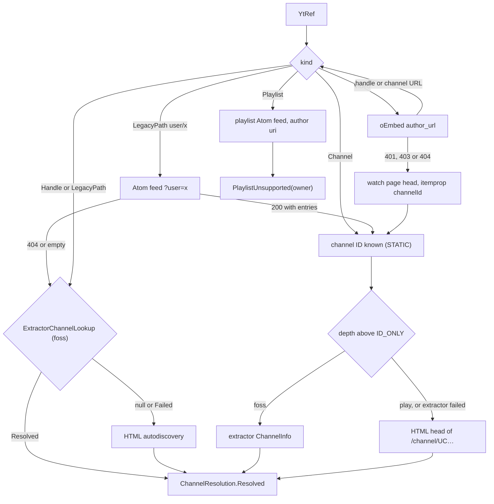
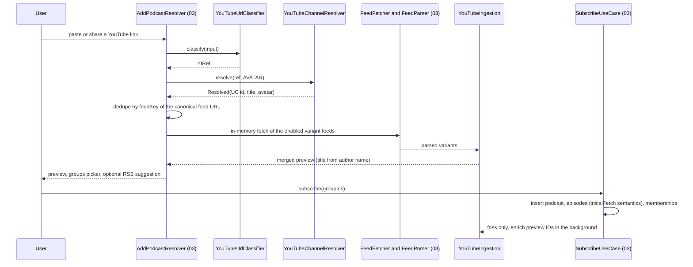
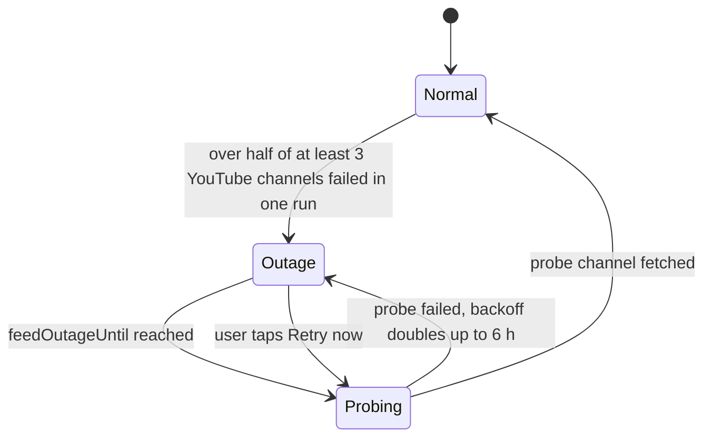
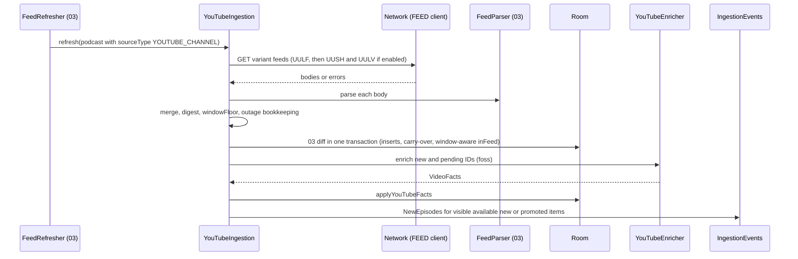
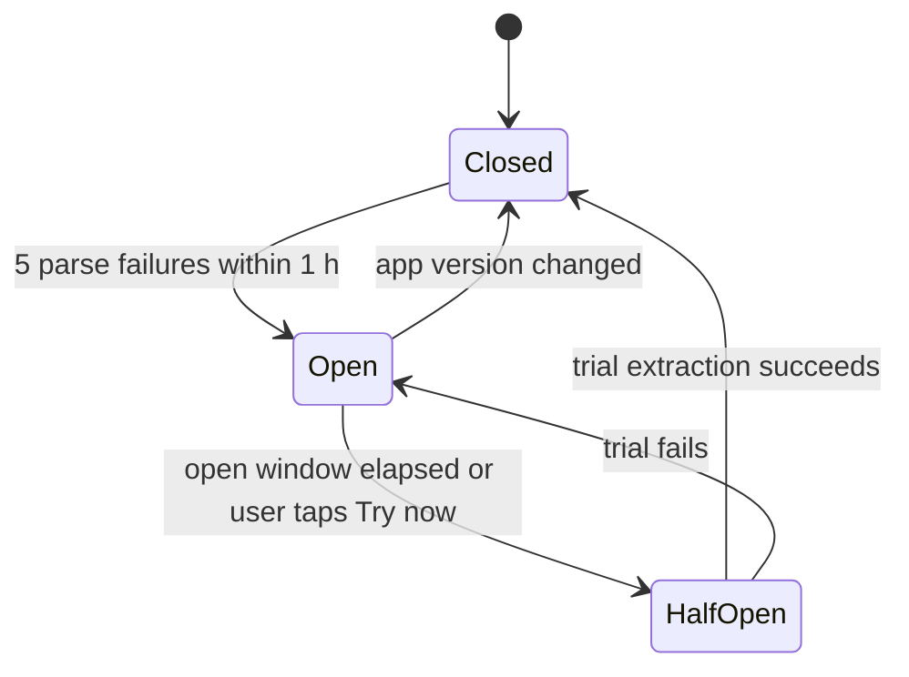

# 04 — YouTube channels as podcasts

> Status: Draft v1, 2026-10-04 · Implements: R3.1–R3.8, R1.6, R5.8 / N3, N8, N11 · Milestones: M3, M8, M9, M11 · Honours: D2, D3, D39, D45, D49, D50, D51, D52, D53, D64, D66, D67; PO-1, PO-2, PO-9 defaults · Owns: the YouTube flavor matrix and `YouTubeCapabilities`, the `:youtube:*` modules, channel resolution, YouTube Atom specifics, YouTube artwork sources, availability flags, enrichment and back catalogue, stream resolution and its contracts with playback and downloads, YouTube import formats, error handling and the circuit breaker, the GPL boundary and the extractor hotfix process

Contents: [Scope](#scope) · [Flavor matrix](#flavor-matrix) · [Channel resolution](#channel-resolution) · [Atom feed ingestion](#atom-feed-ingestion) · [Artwork and thumbnails](#artwork-and-thumbnails) · [Content flags and filtering](#content-flags-and-filtering) · [Stream resolution](#stream-resolution) · [Playback integration](#playback-integration) · [Download integration](#download-integration) · [Import and export formats](#import-and-export-formats) · [Error handling and circuit breaker](#error-handling-and-circuit-breaker) · [Licensing and legal](#licensing-and-legal) · [Maintenance and hotfix process](#maintenance-and-hotfix-process) · [Settings](#settings) · [Testing](#testing) · [Delivery by milestone](#delivery-by-milestone) · [Open questions](#open-questions) · [Sources](#sources)

---

## Scope

A YouTube channel is a `podcast` row with `sourceType = YOUTUBE_CHANNEL`. Everything that works on podcasts (groups, group feeds, counts, played state, positions, backup, OPML) works on channels unchanged ([R3.4](../PLAN.md#21-functional-requirements)). This document specifies only what is different. It is split along the two layers of [D51](../PLAN.md#3-key-decisions):

- **Layer A (all builds, Unlicense):** turn any user input into a `UC…` channel ID; poll YouTube's public Atom feeds of the uploads playlists; channel avatar, banner and video thumbnails; YouTube import and export formats.
- **Layer B (`foss` only, GPL-3.0-or-later, [PO-1](../PLAN.md#po-1-licensing-of-shipped-binaries) default A):** NewPipe Extractor for audio stream URLs (playback and downloads), enrichment (durations, availability), back catalogue and channel search.

### Responsibilities and boundaries

| This document owns | Owned elsewhere (link, do not restate) |
|---|---|
| `YouTubeCapabilities` and every per-flavor YouTube behaviour | Flavor mechanics, `FlavorModule` files, Gradle — [01 Build flavors](01-foundation.md#build-flavors), [01 Dependency injection](01-foundation.md#dependency-injection) |
| `YtRef` grammar, channel-ID resolution, subscribe-time YouTube branch | Add-podcast pipeline, `AddResolution`, `SubscribeUseCase` — [03 Add podcast flow](03-feeds-and-discovery.md#add-podcast-flow) |
| Variant URLs, Atom field mapping, merge, YouTube refresh policy, outage handling, enrichment | Generic Atom parsing, fetch pipeline, ingestion diff, refresh engine — [03 Parser](03-feeds-and-discovery.md#parser), [03 Ingestion and diff](03-feeds-and-discovery.md#ingestion-and-diff), [03 Refresh scheduling](03-feeds-and-discovery.md#refresh-scheduling) |
| Avatar, banner and thumbnail **sources and URL rules** | `ArtworkStore`, Coil, interceptor code, cropping — [08 Artwork pipeline](08-ui-ux.md#artwork-pipeline) |
| `Availability` semantics and which flags hide or exclude an episode | The `VISIBLE` SQL and every query — [02 Key queries](02-data-model.md#key-queries) |
| `YouTubeStreamResolver` contract, format selection, `ResolvedUrlCache`, error taxonomy, circuit breaker | Player, `EpisodeResolver`, `SimpleCache`, queue — [06 Media items and URI resolution](06-playback.md#media-items-and-uri-resolution); download engine and state machine — [07 YouTube transfers](07-downloads.md#youtube-transfers) |
| NewPipe JSON, LibreTube JSON, Takeout CSV/ZIP, URL-list specs; YouTube OPML attributes | Import pipeline, preview, statuses, OPML structure — [05 OPML import](05-groups-opml-backup.md#opml-import), [05 Other import formats](05-groups-opml-backup.md#other-import-formats) |
| GPL boundary, notices, Play guardrails, F-Droid anti-feature, hotfix runbook | Licensee and SPDX tasks — [01 Licensing and dependency policy](01-foundation.md#licensing-and-dependency-policy); CI, releases, store procedures — [09 CI pipelines](09-quality-and-release.md#ci-pipelines), [09 Distribution channels](09-quality-and-release.md#distribution-channels) |

### Modules and public API

| Module | Package | Licence | Contents |
|---|---|---|---|
| `:youtube:api` (JVM) | `app.neutrodyne.youtube.api` | Unlicense | `YtRef`, `YouTubeUrlClassifier`, all interfaces and data types below, pure helpers `YouTubeIds`, `YouTubeFeedUrls`, `YouTubeEntryRules`, `YouTubeThumbnails`, `YouTubeChapters`, `AudioStreamSelector`, `ResolvedUrlCache` |
| `:youtube:impl` (Android) | `app.neutrodyne.youtube.impl` | Unlicense | `DefaultYouTubeChannelResolver`, `HtmlAutodiscoveryChannelResolver`, `ChannelPageParser`, `OEmbedClient`, `ExternalOnlyYouTubeStreamResolver`, `NoOpYouTubeEnricher`, `UnsupportedYouTubeChannelSearch`, `NoExtractorChannelLookup` |
| `:youtube:streams` (Android, `foss`) | `app.neutrodyne.youtube.streams` | **GPL-3.0-or-later** | `NpeInitializer`, `OkHttpNpeDownloader`, `NpeYouTubeStreamResolver`, `InnertubeChannelResolver`, `NpeEnricher`, `NpeChannelSearch`, `NpeErrorClassifier`, `NpeAudioMapper` |
| `:core:data` | `app.neutrodyne.core.data.youtube` | Unlicense | `YouTubeIngestion` (variant fetch, merge, enrichment step), `YouTubeOutageDetector`, `DefaultYouTubeHealth`, `YouTubeAlertNotifier`, `YouTubeChannelRepositoryImpl`, `YouTubeAvailabilityRecorderImpl` |
| `:core:domain` | `app.neutrodyne.core.domain` | Unlicense | `YouTubeChannelRepository`, `YouTubeAvailabilityRecorder` |
| `:feeds` | `app.neutrodyne.feeds.youtube` | Unlicense | `NewPipeSubscriptions`, `LibreTubeBackupParser`, `TakeoutSubscriptionsParser`, `UrlListParser` (pure, raw strings out; classification happens in `:core:data`, rule 8 of [01 Dependency rules](01-foundation.md#dependency-rules)) |

YouTube Atom feeds are fetched and parsed by 03's generic engine in `:core:data`; no YouTube module parses Atom. `:youtube:streams` never binds `:youtube:api` interfaces itself; the `foss` `FlavorModule` does ([01 Dependency injection](01-foundation.md#dependency-injection) rule 6).

```kotlin
// :youtube:api — channel side
sealed interface YtRef {
    data class Channel(val id: String, val variantsHint: Int? = null) : YtRef   // "UC…", validated; hint from UU-prefix
    data class Handle(val handle: String) : YtRef                                // "@name", percent-decoded, NFC
    data class LegacyPath(val path: String) : YtRef                              // "c/name", "user/name", "name"
    data class Video(val id: String) : YtRef                                     // 11 chars
    data class Playlist(val id: String) : YtRef                                  // PL…, OLAK5uy_…, RD…: not subscribable (D53)
    data class Query(val text: String) : YtRef                                   // foss channel search only
}
class YouTubeUrlClassifier @Inject constructor() {
    fun classify(input: String): YtRef?          // null = not a subscribable YouTube input; never returns Query
    fun classifyOrQuery(input: String): YtRef    // YouTube search field: classify(input) ?: Query(input.trim())
    fun isYouTubeHost(url: String): Boolean      // lets 03 say "not a channel or video link" instead of fetching HTML
}
enum class MetadataDepth { ID_ONLY, AVATAR, FULL /* + banner */ }
interface YouTubeChannelResolver { suspend fun resolve(ref: YtRef, depth: MetadataDepth = MetadataDepth.AVATAR): ChannelResolution }
sealed interface ChannelResolution {
    data class Resolved(val channelId: String, val title: String?, val avatarUrl: String?, val bannerUrl: String?,
                        val description: String?, val via: ResolvedVia) : ChannelResolution
    data class PlaylistUnsupported(val playlistId: String, val ownerChannelId: String?, val ownerTitle: String?) : ChannelResolution
    data object NotFound : ChannelResolution
    data class Failed(val retryable: Boolean, val reason: FailReason, val cause: Throwable?) : ChannelResolution
}
enum class ResolvedVia { STATIC, USER_FEED, EXTRACTOR, HTML, OEMBED }
enum class FailReason { NETWORK, RATE_LIMITED, CONSENT_WALL, PAGE_UNREADABLE, NOT_A_CHANNEL_LINK }
interface ExtractorChannelLookup { suspend fun lookup(ref: YtRef, depth: MetadataDepth): ChannelResolution? } // null = unavailable
interface YouTubeChannelSearch { suspend fun search(query: String, cursor: SearchCursor? = null): ChannelSearchResult }
data class ChannelHit(val channelId: String, val title: String, val avatarUrl: String?, val subscriberCount: Long?,
                      val description: String?, val verified: Boolean)
sealed interface ChannelSearchResult {
    data class Ok(val hits: List<ChannelHit>, val next: SearchCursor?) : ChannelSearchResult
    data object Unsupported : ChannelSearchResult
    data class Failed(val kind: TransientKind) : ChannelSearchResult
}
class SearchCursor(internal val opaque: Any)     // in-memory only
data class YouTubeCapabilities(val inAppPlayback: Boolean, val downloads: Boolean, val channelSearch: Boolean,
                               val enrichment: Boolean, val backCatalogue: Boolean)
```

```kotlin
// :youtube:api — stream side (canonical signatures kept; members added: invalidateAll, TransientKind)
interface YouTubeStreamResolver {
    suspend fun resolveAudio(videoId: String, pref: AudioPref): ResolveResult   // main-safe, cache-aware
    fun invalidate(videoId: String)
    fun invalidateAll()
}
sealed interface ResolveResult {
    data class Ok(val audio: ResolvedAudio) : ResolveResult
    data class Unavailable(val reason: Availability) : ResolveResult           // never AVAILABLE
    data class Transient(val cause: Throwable, val kind: TransientKind = TransientKind.NETWORK) : ResolveResult
    data object Unsupported : ResolveResult                                    // play flavor
}
enum class TransientKind { NETWORK, TIMEOUT, RATE_LIMITED, EXTRACTION, BREAKER_OPEN }
enum class AudioQuality(val ranks: List<Int>) {
    STANDARD(listOf(140, 251, 250, 139, 249)), DATA_SAVER(listOf(250, 249, 139, 140)), OPUS(listOf(251, 250, 140))
}
data class AudioPref(val quality: AudioQuality = AudioQuality.STANDARD, val preferDrc: Boolean = false,
                     val pinnedItag: Int? = null, val preferredLanguage: String? = null)
data class ResolvedAudio(
    val videoId: String, val url: String, val itag: Int, val mimeType: String, val codecs: String?,
    val averageBitrate: Int?, val contentLength: Long?, val durationMs: Long?, val expiresAtMs: Long,
    val lastModifiedMicros: Long?, val isDrc: Boolean, val trackLabel: String?, val ipFamily: IpFamily?,
    val resolvedAtMs: Long,
) { override fun toString() = "ResolvedAudio($videoId, itag=$itag, expiresAt=$expiresAtMs)" } // url never printed
enum class IpFamily { V4, V6 }
class YouTubeResolveException(val result: ResolveResult) : java.io.IOException(result::class.simpleName)
class YouTubeFormatChangedException(val videoId: String, val oldItag: Int, val newItag: Int) : java.io.IOException()
```

```kotlin
// :youtube:api — enrichment, health
interface YouTubeEnricher {
    suspend fun enrich(channelId: String, videoIds: Set<String>, variants: Int): EnrichResult
    suspend fun uploadsPage(channelId: String, variant: Int, cursor: UploadsCursor?): UploadsPageResult
}
data class VideoFacts(val videoId: String, val title: String?, val publishedAtMs: Long?, val publishedApprox: Boolean,
                      val durationMs: Long?, val availability: Availability?, val isShort: Boolean?, val description: String?)
sealed interface EnrichResult {
    data class Ok(val facts: List<VideoFacts>) : EnrichResult
    data object Unsupported : EnrichResult
    data class Failed(val kind: TransientKind, val cause: Throwable?) : EnrichResult
}
class UploadsCursor(internal val opaque: Any)    // NewPipe Page; in-memory only, never persisted
sealed interface UploadsPageResult {
    data class Ok(val items: List<VideoFacts>, val next: UploadsCursor?) : UploadsPageResult
    data object Unsupported : UploadsPageResult
    data class Failed(val kind: TransientKind) : UploadsPageResult
}
interface YouTubeHealth {
    val state: StateFlow<YouTubeHealthState>
    fun extractionGate(nowMs: Long): ExtractionGate               // non-suspending, in-memory
    fun reportExtraction(outcome: ExtractionOutcome)
    fun reportRateLimited(nowMs: Long)
    fun reportFeedCycle(attempted: Int, failed: Int, nowMs: Long)
    fun retryNow()                                                 // user action
}
data class YouTubeHealthState(val breaker: BreakerState, val breakerOpenUntil: Long?, val rateLimitedUntil: Long?,
                              val feedOutageUntil: Long?)
enum class BreakerState { CLOSED, OPEN, HALF_OPEN }
sealed interface ExtractionGate { data object Allow : ExtractionGate; data object AllowTrial : ExtractionGate
                                  data class Deny(val untilMs: Long, val kind: TransientKind) : ExtractionGate }
sealed interface ExtractionOutcome { data object Success : ExtractionOutcome
                                     data class ParseFailure(val videoId: String?) : ExtractionOutcome }
```

```kotlin
// :core:domain
interface YouTubeChannelRepository {
    suspend fun setVariants(podcastId: Long, variants: Int)              // writes podcast.youtubeVariants, refreshNow(Podcasts(id))
    suspend fun ensureChannelArt(podcastId: Long)                        // lazy banner, avatar older than 30 days
    suspend fun loadOlder(podcastId: Long): LoadOlderResult              // foss back catalogue
    suspend fun findRssAlternative(channelTitle: String): RssAlternative? // PO-9 "prefer the real RSS feed"
}
sealed interface LoadOlderResult { data class Loaded(val inserted: Int, val hasMore: Boolean) : LoadOlderResult
    data object Unsupported : LoadOlderResult; data class Failed(val kind: TransientKind) : LoadOlderResult }
data class RssAlternative(val feedUrl: String, val title: String, val artworkUrl: String?, val provider: String)
interface YouTubeAvailabilityRecorder { suspend fun record(episodeId: Long, availability: Availability) }
```

### Threading and coroutines

| Component | Thread rules |
|---|---|
| `YouTubeUrlClassifier`, all `:youtube:api` helpers | Pure, synchronous, thread-safe; no I/O. Callable from the main thread |
| Every `suspend` API above | Main-safe. Network on `@Dispatcher(IO)`. Blocking NewPipe calls run in `runInterruptible(io) { … }` so cancellation interrupts the OkHttp call. Errors through `suspendRunCatching` (never swallows `CancellationException`) |
| Timeouts | `resolveAudio` 20 s; channel resolution 20 s overall; `enrich` 20 s per channel; `search` 10 s; `uploadsPage` 20 s (`withTimeout` → `Transient(TIMEOUT)`) |
| Single flight | Concurrent `resolveAudio` calls with the same cache key share one `Deferred` (pre-resolve and playback race) |
| Concurrency caps | Enrichment: `Semaphore(2)` across channels. Downloads: 07's YouTube slot 1. Channel resolution during import: 2 per host (C44 of 03's per-host rule). Playback resolves: no cap beyond single flight. Search: latest wins (previous job cancelled) |
| `ResolvedUrlCache` | `ConcurrentHashMap`, read from Media3's loader thread |
| `YouTubeHealth` | `MutableStateFlow`; persistence to `device_settings` launched on `@ApplicationScope`, conflated |
| `NewPipe.init` | Once, lazily, under a lock in `NpeInitializer.ensure()` (never in `Application.onCreate`) |

### New names introduced here

| Name | Kind / location | Purpose |
|---|---|---|
| `MetadataDepth`, `ResolvedVia`, `FailReason`, `ChannelResolution.{Resolved, PlaylistUnsupported, NotFound, Failed}` | `:youtube:api` | Shape of the canonical `ChannelResolution` |
| `ExtractorChannelLookup`, `YouTubeChannelSearch`, `ChannelHit`, `ChannelSearchResult`, `SearchCursor` | `:youtube:api`, flavor-bound | foss extractor channel lookup and search |
| `AudioQuality`, `AudioPref` fields, `ResolvedAudio`, `IpFamily`, `TransientKind`, `YouTubeResolveException`, `YouTubeFormatChangedException` | `:youtube:api` | Stream contract |
| `VideoFacts`, `EnrichResult`, `UploadsCursor`, `UploadsPageResult` | `:youtube:api` | Enrichment and back catalogue |
| `YouTubeHealth`, `YouTubeHealthState`, `BreakerState`, `ExtractionGate`, `ExtractionOutcome` | `:youtube:api`; impl `DefaultYouTubeHealth` in `:core:data` | Breaker, rate limit, feed outage |
| `YouTubeIds`, `YouTubeChapters`, `AudioCandidate`, `AudioStreamSelector`, `ResolvedUrlCache`, `YtEntry`, `VariantResult`, `MergedChannel`, `ThumbVariant` | `:youtube:api` | Pure helpers |
| `DefaultYouTubeChannelResolver`, `ChannelPageParser`, `NoOpYouTubeEnricher`, `UnsupportedYouTubeChannelSearch`, `NoExtractorChannelLookup` | `:youtube:impl` | Layer A and `play` no-ops |
| `NpeInitializer`, `NpeChannelSearch`, `NpeErrorClassifier`, `NpeAudioMapper` | `:youtube:streams` | Layer B |
| `YouTubeChannelRepository`, `LoadOlderResult`, `RssAlternative`, `YouTubeAvailabilityRecorder` | `:core:domain` | Feature-facing YouTube operations |
| `YouTubeIngestion`, `YouTubeOutageDetector`, `YouTubeAlertNotifier`, `YouTubeChannelRepositoryImpl`, `YouTubeAvailabilityRecorderImpl` | `:core:data` | YouTube layer on 03's engine |
| `UrlListParser`; DTOs `NewPipeSubscriptionsFile`, `LibreTubeBackupFile`, `TakeoutRow`, `YouTubeImportEntry` | `:feeds` | Import formats |
| `ImportFormat.URL_LIST` | enum constant appended to the canonical `ImportFormat` (requested from 02/05) | Plain list of URLs or IDs |
| `podcast.channelMetadataAt` | column `Long?` (requested from 02) | Last channel-page/extractor metadata fetch; null = never |
| `IngestDao.applyYouTubeFacts`, `EpisodeDao.youtubeEnrichmentCandidates`, `EpisodeDao.setAvailability`, `PodcastDao.applyYouTubeChannelMetadata` | DAO functions (requested from 02) | Writes described in [Atom feed ingestion](#atom-feed-ingestion) |
| `DnsFamilyHints` | `:core:network` (requested from 01) | googlevideo IP-family matching ([Stream resolution](#ip-family-matching)) |
| `NOTIF_ID_YT_BREAKER = 4100` | notification ID on channel `alerts` | Breaker notice |
| `youtube.*` keys | [Settings](#settings) | — |
| `scripts/emergency/no-youtube-streams.patch`, `scripts/youtube/record-responses.sh`; CI jobs `emergency-patch-check`, `youtube-canary` | repository files / 09 jobs | Legal emergency build, recorded responses, canary |

---

## Flavor matrix

Serves R3.1–R3.8, N8. Delivered in M8 (layer A, both flavors), M9 (layer B, `foss`). Honours [D2](../PLAN.md#3-key-decisions), [D51](../PLAN.md#3-key-decisions), [PO-2](../PLAN.md#po-2-distribution-channels-and-youtube-per-flavor).

| Capability | `foss` (M9+) | `play` | Mechanism |
|---|---|---|---|
| Subscribe by URL, share, `@handle`, OPML, NewPipe, LibreTube, Takeout, URL list | Yes | Yes | Layer A resolution |
| Subscribe by typing a channel name | Yes | No — "share it from the YouTube app or paste its link" | `YouTubeChannelSearch` |
| Listing, avatar, banner, thumbnails, groups, group feeds, counts, played state, positions, backup | Yes | Yes | Atom + 03/05 |
| Durations; live / upcoming / members flags; premiere hold-back | Yes (enrichment + resolve) | No: duration "—", items appear as soon as listed | `YouTubeEnricher` |
| In-app audio playback, background, lock screen, Bluetooth, queue, sleep timer, chapters | Yes | **No** — "Watch on YouTube" | `YouTubeStreamResolver` |
| Play group / context tail / Android Auto browse | Included (only `AVAILABLE`) | Excluded | `youtubePlayable` in [02 Play context](02-data-model.md#play-context) |
| Manual download, auto-download, "Download all" in a group | Yes (keep 2 default when on) | **No** | `YouTubeTransferSource` |
| Back catalogue beyond the newest 15 | "Load older" | No | `YouTubeEnricher.uploadsPage` |
| "Watch on YouTube" | Overflow action (with `&t=` position) | Primary action; marks played (setting) | `ACTION_VIEW` |
| NewPipe JSON export, OPML export of channels | Yes | Yes | [Import and export formats](#import-and-export-formats) |
| "Prefer the show's RSS feed" suggestion | Yes | Yes | Apple / fyyd search (03) |
| SponsorBlock, video mode, playlists | v1.x (M14) | No (playlists: v1.x both) | — |

**R3 is fully delivered by `foss`.** `play` delivers R3.1 (links only), R3.2 (without premiere hold-back and flags), R3.3, R3.4 and R3.7; it cannot deliver R3.5, R3.6, R3.8 (PLAN PO-2).

### DI bindings

Bound only in the two `FlavorModule`s of [01](01-foundation.md#flavor-modules); `YouTubeChannelResolver` (→ `DefaultYouTubeChannelResolver`, `:youtube:impl`), `YouTubeHealth` (→ `DefaultYouTubeHealth`, `:core:data`), `YouTubeChannelRepository` and `YouTubeAvailabilityRecorder` (`:core:data`) are flavor-independent `@Binds` in their modules.

| Interface | `foss` from M9 | `play`, and `foss` in M8 |
|---|---|---|
| `YouTubeStreamResolver` | `NpeYouTubeStreamResolver` | `ExternalOnlyYouTubeStreamResolver` (always `Unsupported`, `invalidate*` no-ops) |
| `YouTubeEnricher` | `NpeEnricher` | `NoOpYouTubeEnricher` (`Unsupported`) |
| `YouTubeChannelSearch` | `NpeChannelSearch` | `UnsupportedYouTubeChannelSearch` |
| `ExtractorChannelLookup` | `InnertubeChannelResolver` | `NoExtractorChannelLookup` (returns `null`) |
| `YouTubeCapabilities` | all five `true` | all five `false` |

### Capability consumers

| Flag | Consumers |
|---|---|
| `inAppPlayback` | 06 `EpisodeResolver` YouTube branch, `QueueProjector`, Auto browse tree; 05/02 context tail (`youtubePlayable`); `QueueRepository` rejects YouTube adds when false; 08 row primary action |
| `downloads` | 07 claim (`youtubeAllowed`) and planner (`youtubeDownloads`); `DownloadController.request` rejects YouTube IDs when false; 05 "Download all" count; 08 download buttons |
| `channelSearch` | 08/03 Discover "YouTube channels" search action |
| `enrichment` | `YouTubeIngestion` enrichment step |
| `backCatalogue` | 08 "Load older" button; `YouTubeChannelRepository.loadOlder` |

### UI per flavor (hand-off to [08 Flavor differences in UI](08-ui-ux.md#flavor-differences-in-ui))

| Element | `foss` | `play` |
|---|---|---|
| YouTube episode row primary action | Play / Pause | "Watch on YouTube" (opens app or browser) |
| Play next, Play last, Add to Up next, Download, Mark for auto-download | Shown | Hidden |
| Duration | Enriched or measured, "—" while unknown | "—" |
| Unavailable reason line (age-restricted, region, private, kids, removed) | Shown, row greyed, action "Watch on YouTube" | Never set |
| Podcast detail "Load older" | Shown for YouTube channels | Hidden |
| Discover "Search YouTube channels" | Shown | Hidden; Add sheet hint "share from the YouTube app or paste a link" |
| Settings › YouTube | Variants info, audio quality, volume levelling, YouTube auto-download, suggest RSS, extractor status line | Suggest RSS, mark played on open |
| Licences / About | NewPipe Extractor notice, GPL statement | No GPL text, **no mention of the other build** |

---

## Channel resolution

Serves R3.1, R1.6. Delivered in M3 (classifier), M8 (layer A), M9 (extractor lookup, search). The channel ID is the only identity ever stored; handles and custom URLs are inputs only (R3.1).

### Input grammar

`YouTubeUrlClassifier.classify(input)`:

1. Trim; strip a leading `feed:`/`view-source:`; if there is no scheme and the text starts with a YouTube host, prepend `https://`.
2. Bare forms: `^@[^\s/?#]{1,100}$` → `Handle`; `YouTubeIds.CHANNEL` → `Channel`; anything else without a host → `null`.
3. Accept only hosts `youtube.com`, `www.youtube.com`, `m.youtube.com`, `music.youtube.com`, `youtu.be`, `youtube-nocookie.com`, `www.youtube-nocookie.com` (case-insensitive, `http` or `https`). Other hosts → `null`.
4. Drop tracking parameters `si`, `pp`, `feature`, `app`, `ab_channel`, `utm_*`, `t`, `start`, `index`.
5. Match the path (percent-decoded, trailing `/` ignored, first match wins):

| Path / query | Result |
|---|---|
| `/channel/{id}[/…]` | `Channel(id)` |
| `/feeds/videos.xml?channel_id={id}` | `Channel(id)` |
| `/feeds/videos.xml?playlist_id={p}`, `/playlist?list={p}` | uploads prefix (below) → `Channel`; otherwise `Playlist(p)` |
| `/feeds/videos.xml?user={name}` | `LegacyPath("user/{name}")` |
| `/@{handle}[/…]` | `Handle("@{handle}")` |
| `/c/{name}[/…]`, `/user/{name}[/…]` | `LegacyPath("c/{name}")`, `LegacyPath("user/{name}")` |
| `/watch?v={id}` (any `list=` ignored), `/shorts/{id}`, `/live/{id}`, `/embed/{id}`, `/v/{id}`, `/e/{id}`, `youtu.be/{id}` | `Video(id)` |
| `/{name}` single segment matching `^[A-Za-z0-9_.-]{1,100}$` and not in `RESERVED` | `LegacyPath(name)` |
| anything else on a YouTube host | `null` (03 shows "not a channel or video link" via `isYouTubeHost`) |

`RESERVED` = `watch, shorts, live, playlist, playlists, feeds, feed, results, embed, channel, c, user, v, e, hashtag, post, premium, account, gaming, music, kids, about, redirect, attribution_link, signin, upload, studio, oembed, youtubei, api, t, s, browse, podcasts, trending, downloads, logout`.

```kotlin
object YouTubeIds {
    val CHANNEL = Regex("^UC[0-9A-Za-z_-]{21}[AQgw]$")   // 24 chars, 128 bits; last char carries padding
    val VIDEO = Regex("^[0-9A-Za-z_-]{11}$")            // lenient; the stricter last-char rule is Unverified, not enforced
    /** UU→all (7), UULF→1, UUSH→2, UULV→4; UUMO/UUPS/UULP/UUPV→null hint. Result must match CHANNEL. */
    fun uploadsToChannel(playlistId: String): Pair<String, Int?>?
    fun channelFromFeedLevel(id: String): String = if (id.length == 22) "UC$id" else id  // feed-level yt:channelId lacks "UC"
}
```

Handles are kept Unicode (handles may contain dots, underscores, hyphens and non-ASCII letters) and percent-encoded as UTF-8 only when building a URL. A `Video` ref resolves to the video's channel, never to a single-video subscription.

### Resolution order

`DefaultYouTubeChannelResolver.resolve(ref, depth)`; overall timeout 20 s.



- `Query` is rejected (`require`); search uses `YouTubeChannelSearch`.
- If metadata fetching fails after the ID is known, the result is still `Resolved(channelId, title = null, avatarUrl = null, …)`: subscribing never fails because art is missing. `channelMetadataAt` stays null and art is retried ([Channel metadata refresh](#channel-metadata-refresh)).

### HTML autodiscovery

`HtmlAutodiscoveryChannelResolver` (all builds; the only network path in `play` besides Atom and oEmbed):

1. URL: `Handle` → `https://www.youtube.com/@{enc}`; `LegacyPath` → `https://www.youtube.com/{path}`; `Channel` (metadata only) → `https://www.youtube.com/channel/{id}`.
2. `GET` with `@HttpClient(FEED)` (120 s call timeout; the API client's 8 s is too short for this page), headers `Cookie: SOCS=CAE=` (skips the EU consent interstitial, the value NewPipe Extractor sends), `Accept: text/html`, `Accept-Language: {app locale}, en;q=0.5`. User-Agent: ours ([01 Interceptors](01-foundation.md#interceptors)).
3. Status: 404 → `NotFound`; 429 → `Failed(RATE_LIMITED)`; 5xx / I/O → `Failed(NETWORK, retryable)`; final URL host `consent.youtube.com` → `Failed(CONSENT_WALL)`.
4. Read with Okio into a buffer until `</head>` (case-insensitive) or 1.5 MiB, then `Jsoup.parse(prefix, baseUri)` (`ChannelPageParser`, pure).
5. Channel ID, first match wins: `link[rel=alternate][type=application/rss+xml]` href `channel_id=`; `link[rel=canonical]` `/channel/UC…`; `meta[itemprop=identifier]`; regex `"externalId":"(UC[\w-]{22})"` over the prefix. If none and fewer than 1.5 MiB were read, keep streaming the body for `"externalId"` up to 3 MiB total. Validate with `YouTubeIds.CHANNEL`; otherwise `Failed(PAGE_UNREADABLE)`.
6. Title `meta[property=og:title]` (fallback `<title>` minus `" - YouTube"`); avatar `meta[property=og:image]`; description `meta[property=og:description]` (plain text).
7. Only for `depth = FULL`: continue streaming the body with a 64 KiB sliding window (2 KiB overlap) for `"imageBannerViewModel":{"image":{"sources":[`, capture up to the closing `]`, decode the array of `{url, width, height}` with kotlinx.serialization, stop at 3 MiB total. Close the response as soon as everything needed is found.

The page is about 2.5 MB; reading it fully for every subscribe is wasteful, hence head-first. Unverified: the byte size of `<head>`; M8 measures it on the recorded fixture. If the median head exceeds 512 KiB, imports fetch avatars only for the first 20 channels per refresh run on metered networks (rest on unmetered); the decision is recorded here.

### oEmbed, user feed and watch page

- **oEmbed** (`OEmbedClient`, `@HttpClient(API)`): `GET https://www.youtube.com/oembed?url={urlencoded https://www.youtube.com/watch?v={id}}&format=json` → `author_url` (a handle URL, sometimes `/channel/` or `/user/`) and `author_name`; the URL is classified and resolved again (one hop, no loops).
- **Legacy user feed:** `GET https://www.youtube.com/feeds/videos.xml?user={name}` (`@HttpClient(FEED)`); channel ID from the first entry's `yt:channelId`, else feed `author/uri`. Cheaper than the page and official.
- **Watch page fallback** (oEmbed 401/403/404, e.g. embedding disabled): watch page with the consent cookie, head-first; `meta[itemprop=channelId]` or `"channelId":"(UC…)"` within 1.5 MiB.
- **Playlist owner:** `GET …/feeds/videos.xml?playlist_id={PL…}` → `author/uri` → `PlaylistUnsupported(ownerChannelId, ownerTitle)` so the UI can offer the channel ([D53](../PLAN.md#3-key-decisions): `PL…` feeds return the first 15 items in playlist order, so new items may never appear).

### foss extractor lookup

`InnertubeChannelResolver : ExtractorChannelLookup` calls `ChannelInfo.getInfo(ServiceList.YouTube, url)` for `Handle`, `LegacyPath` and (for metadata) `Channel`; one InnerTube round trip returns ID, name, avatars, banners and description (NewPipe Extractor resolves handles through InnerTube `navigation/resolve_url`). It respects `YouTubeHealth.extractionGate` (deny → return `null`, falling back to HTML) and reports parse failures to the breaker. Any exception → `null` (fallback), never a user-visible failure.

### Subscribe flow

The YouTube branch of 03's `AddPodcastResolver`:



- Dedupe key: `feedKey = UrlNormalizer.forIdentity(YouTubeFeedUrls.canonical(id))`. No `podcast_url_alias` rows are written for YouTube inputs (every form maps statically or by resolution to the same canonical URL; handle URLs must not be stored).
- Persisted podcast: `sourceType = YOUTUBE_CHANNEL`, `feedUrl = https://www.youtube.com/feeds/videos.xml?channel_id={id}`, `youtubeChannelId = id`, `youtubeVariants = variantsHint ?: 1`, `title` from Atom `author/name` (fallback resolution title), `author = title`, `link = https://www.youtube.com/channel/{id}`, `artworkUrl = YouTubeThumbnails.avatar(og:image, 900)`, `bannerUrl` if known, `descriptionHtml` = channel description (plain text), `channelMetadataAt = now` when art was fetched.
- Episodes come from the preview with `initialFetch` semantics ([D66](../PLAN.md#3-key-decisions)): no `isNew`, no notification, no auto-download ([D67](../PLAN.md#3-key-decisions)).
- Error UX (strings owned by 08):

| Result | Message | Actions |
|---|---|---|
| `NotFound` | "This YouTube channel doesn't exist or was removed." | Edit |
| `PlaylistUnsupported` | "YouTube playlists can't be subscribed to yet." | "Subscribe to {ownerTitle}" when known |
| `Failed(NETWORK)` | "Couldn't reach YouTube. Check your connection and try again." | Retry |
| `Failed(RATE_LIMITED)` | "YouTube is limiting requests from your network. Try again later." | Retry |
| `Failed(CONSENT_WALL or PAGE_UNREADABLE)` | "Couldn't read this YouTube page. Paste the channel's /channel/UC… link or a link to one of its videos." | Edit |
| Typed name in `play` | "To add a YouTube channel, share it from the YouTube app or paste its link." | — |

### Prefer the show's RSS feed

[PO-9](../PLAN.md#48-further-product-owner-decisions) default. When the preview opens and `youtube.suggest_rss` is on, `YouTubeChannelRepository.findRssAlternative(title)` queries 03's `SearchRepository` (enabled podcast directories only; never YouTube search) with an 8 s timeout. A hit matches when `norm(channelTitle)` equals `norm(collectionName)` or `norm(artistName)`, where `norm` = NFKC, lowercase, remove everything except letters and digits. The first match is shown as a card "This show also has a podcast feed — Subscribe to the podcast instead"; the preview is never blocked. The query only goes to directories the user already has enabled ([03 Search and discovery](03-feeds-and-discovery.md#search-and-discovery) privacy text applies).

### Channel search

`foss` only, M9. Discover offers an explicit "Search YouTube channels" action; YouTube is queried only on that action, never on every keystroke of the podcast search (N3: typed podcast searches never reach YouTube). `NpeChannelSearch` uses `SearchInfo` with the YouTube `channels` content filter; up to 3 pages on scroll. A hit opens `AddPodcastKey("https://www.youtube.com/channel/{id}")`, i.e. the normal subscribe flow. Breaker open or rate limited → `Failed`, shown as "YouTube search is temporarily unavailable".

### Channel metadata refresh

- Atom `author/name` updates the title on every refresh (via 03's metadata update).
- Avatar and description: `YouTubeIngestion` re-resolves `Channel(id)` with `AVATAR` depth when `channelMetadataAt` is null or older than 30 days, at most 30 channels per refresh run, 2 concurrently. New avatar URL → new `artworkKey` → 03's `artwork-sync` trigger.
- Banner: `ensureChannelArt(podcastId)` is called by the podcast detail screen (08) on open; it fetches with `FULL` depth when `bannerUrl` is null and `channelMetadataAt` is null or older than 30 days.
- Writes go through `PodcastDao.applyYouTubeChannelMetadata(id, artworkUrl, artworkKey, bannerUrl, descriptionHtml, channelMetadataAt)`; Atom ingestion never writes these columns (see mapping below).

---

## Atom feed ingestion

Serves R3.2, R3.3, R3.4. Delivered in M8 (enrichment in M9). 03's refresh engine runs YouTube channels like any podcast (due selection, 6 global / 2 per host, 8-min deadline, batched fetch-state writes); `YouTubeIngestion` replaces only the fetch-parse-diff inputs for `sourceType = YOUTUBE_CHANNEL`.

### Variant URLs

```kotlin
object YouTubeFeedUrls {
    fun canonical(channelId: String) = "https://www.youtube.com/feeds/videos.xml?channel_id=$channelId"   // stored, exported
    fun channelPage(channelId: String) = "https://www.youtube.com/channel/$channelId"
    fun watch(videoId: String) = "https://www.youtube.com/watch?v=$videoId"
    /** Ordered LONG_FORM, SHORTS, LIVE; one URL per set bit. Never stored. */
    fun pollUrls(channelId: String, variants: Int): List<VariantUrl>
}
data class VariantUrl(val bit: Int, val url: String)  // …/feeds/videos.xml?playlist_id=UULF{id without UC}, UUSH…, UULV…
```

| Bit (`YouTubeVariantBits`) | Playlist prefix | Observed content (tested 2026-10-04) |
|---|---|---|
| `LONG_FORM = 1` (default) | `UULF` | Long-form uploads only: no Shorts, no live streams |
| `SHORTS = 2` | `UUSH` | Shorts only |
| `LIVE = 4` | `UULV` | Live streams (past broadcasts) |
| — | `UU` / `channel_id` | Everything (fallback only) |
| — | `UUMO` | Members-only uploads — not polled in v1 |

The prefixes are undocumented; if YouTube drops them, the `channel_id` fallback below keeps channels working.

### Fetch policy

| Rule | Value |
|---|---|
| Requests per refresh | One per set bit; plus one `channel_id` fallback when the primary (lowest set bit) returns 404 outside an outage |
| Client and headers | `@HttpClient(FEED)`; `Accept: application/atom+xml, application/xml;q=0.9, */*;q=0.1`; no validators (YouTube sends no `ETag`/`Last-Modified`) |
| Minimum interval | Scheduled: `nextRefreshAt ≥ lastAttemptAt + 15 min` (server sends `max-age=900`). Manual: skip a channel whose last success is < 2 min old |
| Interval | The podcast's effective refresh interval ([D45](../PLAN.md#3-key-decisions)), never below 15 min |
| Per host | 03's 2-per-host semaphore on `www.youtube.com`, each variant request takes a permit (C44) |
| Body cap | 2 MB (a 15-entry feed is ~20 KB) |
| 404 on `UUSH`/`UULV` | Treated as empty (channel has none), unless the run is an outage |
| 404 on the primary | Try `channel_id`; 200 → use it, mark Shorts by link and **drop** them unless `SHORTS` is set (live items cannot be told apart in this mode; known limitation); 404 → channel failure |
| 410 | Same as 404. YouTube channels are **never** marked `gone` |
| 429 or 403 on any feed | Stop YouTube fetches for the rest of the run; all YouTube channels get `nextRefreshAt = now + max(Retry-After, 30 min)` |

### What 04 needs from the parser

03's `FeedParser` parses YouTube Atom generically (namespaces `http://www.w3.org/2005/Atom`, `yt` = `http://www.youtube.com/xml/schemas/2015`, `media` = `http://search.yahoo.com/mrss/`) and must expose: feed `title`, `author/name`, `author/uri`, `yt:channelId`, `yt:playlistId`; entry `id`, `yt:videoId`, `yt:channelId`, `title`, `link[rel=alternate]@href`, `published` (raw and parsed), `updated` (parsed, ignored by YouTube rules), `media:group/media:description`, `media:group/media:thumbnail@url`, `media:group/media:community/media:statistics@views`. Items with no enclosure but a `yt:videoId` are kept (03's "item without enclosure but with `externalMediaId`" path).

### Mapping

Podcast columns written by Atom ingestion for YouTube (everything else in the row is written by subscribe, the channel-metadata path, 03's scheduling or 05):

| Column | Value |
|---|---|
| `title`, `author` | Feed `author/name` (playlist feeds are titled "Videos" or "Live streams"; never use feed `<title>`) |
| `latestEpisodeAt`, scheduling and fetch-state columns | As 03 |
| `contentSha256` | `YouTubeEntryRules.digest(...)` of the merged entries (raw bodies change on every fetch because of view counts and `<updated>`) |
| `etag`, `lastModified` | Always null |
| **Never written by Atom** | `artworkUrl`, `artworkKey`, `bannerUrl`, `descriptionHtml`, `link`, `youtubeChannelId`, `youtubeVariants`, `channelMetadataAt` |

Episode columns (subset; full entity in [02 episode](02-data-model.md#episode)):

| Column | YouTube value |
|---|---|
| `guid` / `identityKey` | `yt:video:{id}` / `g:yt:video:{id}` |
| `externalMediaId` | `{id}` (`yt:videoId`) |
| `title` | Entry `title` (non-empty fallback: the date, as 03) |
| `pubDate`, `rawPubDate` | `published`; `sortDate` per [D19](../PLAN.md#3-key-decisions) |
| `enclosureUrl`, `enclosureType`, `enclosureLength` | null |
| `isVideo` | `false`: Neutrodyne delivers YouTube as audio in v1 ([D51](../PLAN.md#3-key-decisions)); rows are recognised by `sourceType`, not `isVideo` |
| `durationMs` | null from Atom; enrichment value carried over |
| `imageUrl` / `artworkKey` | `https://i.ytimg.com/vi/{id}/mqdefault.jpg` (true 16:9, always exists) / 08's `u-` key |
| `link` | `https://www.youtube.com/watch?v={id}` (also for Shorts) |
| `episode_description.html`, `snippet` | `media:description` plain text; snippet = first 200 chars |
| `isShort` | Link path starts with `/shorts/`, or the entry came from `UUSH`, or enrichment says so (sticky: never reset to false) |
| `availability` | `AVAILABLE` on insert; Atom never changes it afterwards (enrichment and resolve own it) |
| `chaptersUrl`, season, episode fields, `explicit` | null |
| `contentHash` | Over title, `published`, description, `isShort` (never views or `<updated>`) |

### Merge algorithm

`YouTubeEntryRules.merge(results, enabledBits): MergedChannel`, called by `YouTubeIngestion` with one `VariantResult` per polled URL (`Ok(bit, entries, authorName)`, `Empty(bit)`, `Failed(bit, httpCode, cause)`):

1. If the primary variant failed and its `channel_id` fallback failed too → channel failure; no ingest (error handling below).
2. Union entries by `videoId`; the first occurrence (lowest bit) supplies fields; `isShort = any(/shorts/ link, bit == SHORTS)`.
3. In fallback mode drop Shorts unless `SHORTS` is enabled.
4. Order by `published` descending, ties by `videoId`; `feedOrder` = index (03 inserts in descending `feedOrder`).
5. Title = `authorName` of the first `Ok` result.
6. `digest` = lowercase SHA-256 hex over lines `videoId|title|published|isShort|sha1(description)` in order. Equal to the stored `contentSha256` → "unchanged": reschedule only, no transaction (this replaces 03's body-hash shortcut, which never hits for YouTube).
7. `windowFloor`: if any enabled variant `Failed` → `null` (mark no absences). Otherwise `max` over `Ok` variants of `floorᵥ`, where `floorᵥ` = oldest `published` when the variant returned exactly 15 entries, else `Long.MIN_VALUE` (a short list is complete).
8. Hand the merged entries plus `windowFloor` and the carry-over rules to 03's diff.

### Window-aware absence

YouTube feeds show only the newest 15 entries per variant, so "absent from this parse" does not mean "removed". For `YOUTUBE_CHANNEL`, 03's diff sets `inFeed = 0` only for an existing row that is absent from the merged set **and** has `pubDate ≥ windowFloor` (it would have been inside every fetched window) **and** `windowFloor != null`. Rows older than the window (normal history, back catalogue) keep `inFeed = 1`. Consequence: retention ([D23](../PLAN.md#3-key-decisions)) only removes YouTube videos that were actually deleted or made private (see [Open questions](#open-questions) on growth).

### Carry-over on update

When a row's `contentHash` changes (title or description edited), 03's `updateFeedFields` must apply `durationMs = parsed ?: stored`, `availability = stored`, `isShort = stored || parsed`, so Atom never clobbers enrichment.

### Gap detection

On a non-initial refresh, if every entry of a 15-entry variant is unknown, items may have been missed between refreshes (high-volume channels). Then: in `foss`, the enrichment step also requests `uploadsPage(channelId, bit, null)` (one page, ~30 items) and inserts unknown IDs with back-catalogue semantics (`isNew = 0`); in both flavors the channel's next refresh is pulled in to `now + max(15 min, interval / 2)` for the next three refreshes (in memory, best effort).

### Errors and global outage

Since December 2025 the feed endpoint has repeatedly answered 404 for every feed for hours. A YouTube-wide outage must never mark channels dead or unsubscribe them (R3.3).

`YouTubeOutageDetector` (per refresh run, in memory):

1. Counts YouTube channels attempted and failed (primary variant 404, 5xx or I/O after fallback), remembering each failed channel's prior `failureCount` and `lastErrorKind`.
2. After the first 4 YouTube channels of a run: if ≥ 3 failed → outage. Otherwise at the end of the run: outage if `attempted ≥ 3` and `failed / attempted > 0.5`.
3. On outage: stop YouTube fetches for the rest of the run; restore the failed channels' prior `failureCount`/`lastErrorKind`; set every YouTube channel's `nextRefreshAt` to `feedOutageUntil`; call `YouTubeHealth.reportFeedCycle(attempted, failed, now)`.
4. `DefaultYouTubeHealth` keeps `youtube.feed_outage_until` and `youtube.feed_outage_level` in `device_settings`: backoff 1 h, 2 h, 4 h, 6 h (cap). When `feedOutageUntil` passes, the next run fetches **one** probe channel (most recent `lastSuccessAt`) first: success clears the outage and lets all YouTube channels run; failure doubles the backoff.
5. Outside an outage, a channel failure follows 03's per-feed backoff and increments `failureCount`; 03's derived "possibly dead" badge (failures over 7 days) appears, but nothing is deleted or set `gone`.



UI: one in-app banner on Feeds and Library, "YouTube feeds aren't responding. Your channels will update automatically when YouTube is back." with "Retry now"; no system notification, no per-podcast error badges during the outage (08 reads `YouTubeHealth.state`).

### Enrichment step

`foss`, M9. Runs inside the same `RefreshWorker` run, after each channel's ingest transaction.

1. Skip when `capabilities.enrichment` is false, the extraction gate denies, or < 60 s remain to the 8-min soft deadline.
2. Candidates (`EpisodeDao.youtubeEnrichmentCandidates(podcastId, now)`): episodes of the channel with (`durationMs IS NULL AND availability = 'AVAILABLE' AND firstSeenAt > now − 7 d`) or (`availability IN ('UPCOMING','LIVE') AND firstSeenAt > now − 30 d`).
3. `enrich(channelId, ids, variantsOfCandidates)`: `NpeEnricher` requests the first page (~30 items) of the channel tab per needed bit (`LONG_FORM` → `videos`, `SHORTS` → `shorts`, `LIVE` → `livestreams`); one InnerTube browse call per tab. IDs not on the first page get no facts.
4. Rate: 2 channels concurrently, 0.5–1.5 s jitter between channels, a 6–12 s pause after every 50 channels (NewPipe Extractor client precedent), at most 100 channels per run. Unfinished candidates are picked up next run.
5. Write changed values only with `IngestDao.applyYouTubeFacts(rows)` (partial update of `durationMs`, `availability`, `isShort`) in one transaction per channel.
6. Events: `YouTubeIngestion` emits `NewEpisodes(podcastId, ids, initialFetch = false)` for a YouTube channel **after** the enrichment attempt (immediately when enrichment is skipped or fails), with `ids` = newly inserted `isNew` rows plus rows promoted from `UPCOMING`/`LIVE` to `AVAILABLE` that still have `isNew = 1`, filtered to visible (`VISIBLE`) and `AVAILABLE`. Notifications and auto-download therefore never see a premiere before it is playable.

### Refresh of one channel



### Back catalogue

`foss`, M9; `YouTubeChannelRepository.loadOlder(podcastId)` from the podcast screen's "Load older" (08):

- Pages the `videos` tab (the `shorts` tab when `LONG_FORM` is off) with an in-memory `UploadsCursor` per podcast held by a `@Singleton` (survives screen recreation, not process death; after process death paging restarts and skips known IDs).
- Each call fetches one page (~30), inserts unknown IDs with `isNew = 0`, `firstSeenAt = now`, `inFeed = 1`, facts from `VideoFacts`, in descending `feedOrder`; never updates existing rows, never emits `NewEpisodes`, never auto-downloads ([D66](../PLAN.md#3-key-decisions), [D67](../PLAN.md#3-key-decisions)).
- Unverified: channel-tab items carry relative dates ("3 years ago"); when `publishedApprox` is true, `pubDate` is truncated to the day and `rawPubDate = "approx"`.
- At most 20 pages per process; `hasMore = false` when the cursor ends.

---

## Artwork and thumbnails

Serves R3.2, R5.2, R5.3, R5.8. Delivered in M8. 08 owns rendering, `ArtworkStore`, Coil and the interceptor code; this section defines the sources.

```kotlin
object YouTubeThumbnails {
    val THUMB = Regex("""^https?://i\d?\.ytimg\.com/vi(?:_webp)?/([\w-]{11})/(\w+)\.(?:jpg|webp)$""")
    fun avatar(url: String, px: Int): String              // rewrites the "=s<digits>" size token to "=s$px"
    fun video(videoId: String, v: ThumbVariant): String   // https://i.ytimg.com/vi/{id}/{name}.jpg
    fun chainFor(widthPx: Int): List<ThumbVariant>         // ≤ 320 → [MQ]; else [MAXRES, HQ720, MQ]
    fun pickBanner(sources: List<BannerSource>): String?   // smallest width ≥ 1280, else the widest
}
enum class ThumbVariant(val fileName: String, val letterboxed: Boolean) {
    MAXRES("maxresdefault", false), HQ720("hq720", false), SD("sddefault", true),
    HQ("hqdefault", true), MQ("mqdefault", false), DEFAULT("default", true)
}
```

| Artwork | Source | Stored / used |
|---|---|---|
| Channel avatar (podcast cover, square) | HTML `og:image` `https://yt3.googleusercontent.com/{token}=s900-c-k-c0x00ffffff-no-rj` (also `yt3.ggpht.com`); `foss`: largest `ChannelInfo.getAvatars()` ≤ 1024 px | `podcast.artworkUrl` normalised to `=s900` (fits the ≤ 1024 px store); pinned by `ArtworkStore` like any cover; everything reads the pinned file first |
| Channel banner (~6:1) | HTML `imageBannerViewModel.image.sources` (widths 1060, 1138, 1707, …); `foss`: `ChannelInfo.getBanners()` | `podcast.bannerUrl` via `pickBanner`; not pinned (detail header only; offline the header falls back to the blurred avatar) |
| Video thumbnail (episode art) | Derived from the video ID; Atom's `hqdefault` is 4:3 letterboxed and is never stored | `episode.imageUrl = mqdefault` (320×180, true 16:9, always exists); downloads pin it like any episode art ([07 Storage layout](07-downloads.md#storage-layout)) |
| System surfaces (notification, lock screen, Auto, resumption card) | Channel avatar | 06 uses `podcastArtworkKey` from `EpisodeDao.mediaInfo` for `YOUTUBE_CHANNEL` episodes, never the 16:9 thumbnail |
| Group mosaics | Channel avatar | 08 crops to the rounded square used everywhere |

Interceptor contract for 08's `YouTubeThumbnailInterceptor` (M8): it acts on any request URL matching `YouTubeThumbnails.THUMB`, tries `chainFor(requestedWidthPx)` in order, treats a non-2xx as "next" (Coil caches eligible 404s since 3.4.0), and as a last resort loads `hqdefault` and crops the central 16:9 band (rows 45–315 of 360) before any square crop, so letterbox bars never show (R5.8). `maxresdefault`, `hq720` and `sddefault` return 404 for some older videos; `mqdefault` exists for every video tested.

---

## Content flags and filtering

Serves R3.2, R3.7, R3.8. Delivered in M8 (Shorts, `VISIBLE`), M9 (enrichment and resolve-time reasons). Honours [PO-9](../PLAN.md#48-further-product-owner-decisions) defaults: hide Shorts, live and members-only; hold premieres; audio only.

### Where each flag comes from

| `Availability` / flag | `foss` source | `play` source |
|---|---|---|
| `AVAILABLE` | Default on insert; enrichment; successful resolve | Default (never changes) |
| `UPCOMING` (premiere, scheduled live) | Enrichment `ContentAvailability.UPCOMING`; resolve "upcoming"/offline playability | — |
| `LIVE` (live now) | Enrichment `StreamType.LIVE_STREAM`/`AUDIO_LIVE_STREAM`; resolve | — |
| `MEMBERS_ONLY` (also paid content) | Enrichment `MEMBERSHIP`/`PAID`; resolve paid/premium exceptions | — |
| `AGE_RESTRICTED`, `REGION_BLOCKED`, `PRIVATE`, `KIDS_ONLY`, `UNAVAILABLE` | Resolve only (playability status) | — |
| `isShort` | `/shorts/` link, `UUSH`, enrichment `isShortFormContent()` | `/shorts/` link, `UUSH` |

Enrichment re-checks `UPCOMING` and `LIVE` items for 30 days; a premiere or finished live stream becomes `AVAILABLE` (post-live recordings are ordinary videos) and is then announced ([Enrichment step](#enrichment-step)). Resolve-time reasons are persisted with `YouTubeAvailabilityRecorder.record(episodeId, reason)` (implemented in `:core:data` with `EpisodeDao.setAvailability`), called by 06 and 07.

### Participation matrix

| State | Feed lists (`VISIBLE`) | Unplayed / new counts | Context tail, Play group, Auto browse | Auto-download | New-episode notification | Row |
|---|---|---|---|---|---|---|
| `AVAILABLE` | shown | counted | `foss` yes, `play` no | `foss` per policy | yes | normal |
| `isShort` with `SHORTS` off | hidden | no | no | no | no | — |
| `UPCOMING`, `LIVE`, `MEMBERS_ONLY` | hidden | no | no | no | when it becomes `AVAILABLE` | — |
| `AGE_RESTRICTED`, `REGION_BLOCKED`, `PRIVATE`, `KIDS_ONLY`, `UNAVAILABLE` | shown greyed with reason | **no** (requested change, below) | no | no | already sent, never retracted | "Watch on YouTube" |

This confirms 02's v1 `VISIBLE` fragment (`NOT (e.isShort = 1 AND (p.youtubeVariants & 2) = 0) AND e.availability NOT IN ('UPCOMING','LIVE','MEMBERS_ONLY')`) and answers [02 Open questions](02-data-model.md#open-questions) item 5: `countYouTube = 1` in both flavors (in `play`, opening an item in YouTube marks it played by default, so counts stay meaningful). Requested change for 02: the group/All counts and the library `unplayedCount` add `AND e.availability = 'AVAILABLE'`, so greyed, unplayable items never inflate badges.

Reason strings (08 owns the final text): `AGE_RESTRICTED` "Age-restricted — sign-in required on YouTube"; `MEMBERS_ONLY` "Members only"; `REGION_BLOCKED` "Not available in your country"; `PRIVATE` "Private video"; `KIDS_ONLY` "Made for kids — can't be played here"; `UNAVAILABLE` "No longer available"; `UPCOMING` "Premieres soon"; `LIVE` "Live now".

`play` limitation: without enrichment, premieres, live streams and members-only uploads that appear in the polled playlists are listed as normal external episodes; opening them in YouTube shows YouTube's own state.

---

## Stream resolution

Serves R3.5, R3.6, R3.8. Delivered in M9, `foss` only. Honours [D50](../PLAN.md#3-key-decisions), [D52](../PLAN.md#3-key-decisions).

State of the extractor (read 2026-10-04): NewPipe Extractor v0.26.5 (2026-08-15, JitPack `com.github.teamnewpipe:NewPipeExtractor:v0.26.5`) fetches stream data only through the undocumented InnerTube `VISIONOS` client (metadata through `WEB`); its PoToken provider is a no-op; a probe returned direct audio URLs for itags 139, 140, 249, 250, 251 with `expiresInSeconds = 21540` (about 6 h), no `n` parameter, and URLs bound to the requesting IP. Versions, JitPack filter, Rhino pin, desugaring and R8 rules: [01 Toolchain and versions](01-foundation.md#toolchain-and-versions), [01 Build flavors](01-foundation.md#core-library-desugaring).

### Initialisation and downloader

- `NpeInitializer.ensure()` calls `NewPipe.init(downloader, Localization(lang, country), ContentCountry(country))` with the app's effective locale (per-app language if set, else system; fallback `en`/`US`). The locale decides which audio track is "default" on dubbed videos. A locale change calls `NewPipe.setupLocalization(...)`.
- `OkHttpNpeDownloader : Downloader` uses `@HttpClient(YOUTUBE)` (shared connection pool, [01 One client family](01-foundation.md#one-client-family)). It copies NewPipe's request headers verbatim (NewPipe sets browser User-Agents per request; ours is added only when absent), maps HTTP 429 to `ReCaptchaException`, caps response bodies at 8 MB, and returns `Response(code, message, headers, body, finalUrl)`. Calls run inside `runInterruptible`, so coroutine cancellation interrupts them.

### Resolve algorithm

`NpeYouTubeStreamResolver.resolveAudio(videoId, pref)`:

1. `videoId` fails `YouTubeIds.VIDEO` → `Unavailable(UNAVAILABLE)`.
2. Cache hit in `ResolvedUrlCache` for `key(videoId, pref)` → `Ok`.
3. `health.extractionGate(now)`: `Deny(until, kind)` → `Transient(kind)` (`BREAKER_OPEN` or `RATE_LIMITED`) without network; `AllowTrial` → this call is the half-open trial.
4. Single flight on the key; `withTimeout(20 s) { runInterruptible(io) { StreamInfo.getInfo(YouTube, watchUrl) } }`.
5. Exceptions → `NpeErrorClassifier` ([table](#exception-classification)).
6. Stream type live → `Unavailable(LIVE)`; upcoming/offline → `Unavailable(UPCOMING)`.
7. `NpeAudioMapper` maps `info.audioStreams` to `AudioCandidate`s; `AudioStreamSelector.select(candidates, pref)`.
8. No candidate: if muxed video streams exist (the made-for-kids signature since the extractor's 2026 SABR workaround) → `Unavailable(KIDS_ONLY)`; else (SABR-only or empty response) → `Transient(EXTRACTION)`.
9. Build `ResolvedAudio` from the chosen stream and its URL query: `expire` (epoch s) → `expiresAtMs` (missing → `now + 5 h`), `clen` → `contentLength`, `lmt` → `lastModifiedMicros`, `ip` → `ipFamily`; `durationMs = info.duration × 1000`.
10. `health.reportExtraction(Success)`; cache; set the googlevideo IP-family hint ([below](#ip-family-matching)); return `Ok`.

### Format selection

`AudioStreamSelector` is pure Unlicense code in `:youtube:api`, so a future non-GPL resolver (plan C) reuses it; `:youtube:streams` only maps NewPipe objects to `AudioCandidate(itag, mimeType, codecs, averageBitrate, delivery, hasUrl, trackType, trackLanguage, isDrc)`.

1. Keep candidates with a direct URL and progressive HTTP delivery (no DASH, HLS or SABR).
2. Audio track: if any candidate carries a track type, keep `ORIGINAL` tracks; if none is marked original, keep tracks whose language equals `pref.preferredLanguage`, else the default track. Dubbed and AI-dubbed tracks are never chosen while an original exists.
3. DRC ("stable volume"): drop DRC variants unless `pref.preferDrc` (`youtube.volume_levelling`); if only DRC variants remain, keep them.
4. If `pref.pinnedItag` is present, return it.
5. Sort by the index of the itag in `pref.quality.ranks` (unknown itags last), then `averageBitrate` descending, then itag ascending; return the first.

| `AudioQuality` | Ranks ([D52](../PLAN.md#3-key-decisions)) | Typical result |
|---|---|---|
| `STANDARD` (default) | 140 > 251 > 250 > 139 > 249 | AAC-LC m4a, ~130 kbps; plays in every app and car stereo |
| `DATA_SAVER` | 250 > 249 > 139 > 140 | Opus ~70 kbps |
| `OPUS` | 251 > 250 > 140 | Opus ~140 kbps WebM |

Media3 plays AAC in MP4 on all API levels and Opus in WebM through the platform decoder; YouTube's adaptive audio files carry index ranges, so progressive seeking works (standard behaviour, not re-tested). No MIME type is set on the `MediaItem`; the extractor sniffs mp4 or webm.

### ResolvedUrlCache

- Key `"$videoId|${quality}|${preferDrc}|${pinnedItag}"`; LRU of 64 entries; memory only ([D50](../PLAN.md#3-key-decisions)): never written to the database, a backup, logs, crash reports or the restored queue.
- An entry is valid until `min(expiresAtMs − 10 min, resolvedAtMs + 5 h)`.
- `invalidate(videoId)` removes every key of that video; `invalidateAll()` runs on a change of the default network (`NetworkMonitor`, because the client IP changes) and when the breaker opens.

### Exception classification

`NpeErrorClassifier` (Unverified: exception class names against the v0.26.5 sources; M9 confirms when compiling):

| NewPipe Extractor exception / condition | Result | Breaker |
|---|---|---|
| `AgeRestrictedContentException` | `Unavailable(AGE_RESTRICTED)` | no |
| `PaidContentException`, `YoutubeMusicPremiumContentException` | `Unavailable(MEMBERS_ONLY)` | no |
| `PrivateContentException` | `Unavailable(PRIVATE)` | no |
| `GeographicRestrictionException` | `Unavailable(REGION_BLOCKED)` | no |
| `AccountTerminatedException`, other `ContentNotAvailableException` | `Unavailable(UNAVAILABLE)` | no, unless 3 different videos fail this way within 10 min (then counted as one `ParseFailure`) |
| `ContentNotSupportedException` | `Unavailable(LIVE)` | no |
| `ReCaptchaException` (our 429 or "confirm you're not a bot") | `Transient(RATE_LIMITED)`; `health.reportRateLimited(now)` | no |
| `ParsingException`, other `ExtractionException`, no usable audio (SABR-only) | `Transient(EXTRACTION)`; `ParseFailure(videoId)` | yes |
| `IOException`, `InterruptedIOException` | `Transient(NETWORK)` | no |
| `TimeoutCancellationException` | `Transient(TIMEOUT)` | no |

### Bot checks and rate limiting

A rate-limit report pauses all extractor calls for 30 min, doubling per consecutive report to 6 h, reset by the next success (`youtube.rate_limited_until`, `youtube.rate_limit_level` in `device_settings`). No captcha solver and no PoToken generator are shipped (bot checks hit VPN, Tor and data-centre IPs most). UI: a status line in Settings › YouTube and a playback error message; no system notification.

### IP-family matching

Googlevideo URLs are bound to the IP that requested them (`ip=` parameter). If the InnerTube request left over IPv4 and the media request goes over IPv6 (Happy Eyeballs, VPN, CGNAT), expect 403. Unverified hypothesis (reproduced once from a sandbox whose proxy mixed families); M9's device checklist verifies it on IPv6 Wi-Fi and IPv4-only mobile networks.

Design: after every `Ok`, the resolver sets `DnsFamilyHints.set("googlevideo.com", audio.ipFamily)`; `:core:network`'s base `Dns` returns only A records (V4) or only AAAA records (V6, falling back to all addresses if none) for hosts ending in a hinted suffix, so MEDIA and DOWNLOAD clients connect over the family that YouTube saw. A constant `IP_FAMILY_MATCHING_ENABLED` turns this off. 01 implements `DnsFamilyHints` (requested).

### Costs

| Operation | `foss` network cost | `play` |
|---|---|---|
| Subscribe by handle | 1 InnerTube `ChannelInfo` + 1 Atom per variant | ~1 channel page head + 1 Atom per variant |
| Refresh one channel | 1 Atom per variant (+1 fallback); enrichment 1 browse per needed tab only when new or pending IDs exist | Atom only |
| Play one episode | 1 player resolve (≈ 2 InnerTube calls) per 5 h per video | — |
| Download one episode | 1 resolve + ⌈size / 10 MiB⌉ ranged GETs (60 min ≈ 58 MB ≈ 6 chunks at itag 140) | — |
| Search | 1 InnerTube search per page | — |

---

## Playback integration

Serves R3.5, R3.8. Delivered in M9 (06's YouTube branch returns an error until then). Honours [D39](../PLAN.md#3-key-decisions), [D50](../PLAN.md#3-key-decisions). 06 owns `EpisodeResolver`, the cache data source and error recovery; this is the contract.

| Aspect | Contract |
|---|---|
| Branch | `EpisodeResolver` takes the YouTube branch when `mediaInfo.sourceType == YOUTUBE_CHANNEL`, `externalMediaId != null` and `LocalMediaIndex.localUriOrNull(id) == null` (a completed download always wins) |
| URI and IDs | `neutrodyne://episode/{id}`, mediaId `episode:{id}`; there is no `yt://` scheme |
| Resolve | On Media3's loader thread (blocking is allowed in `resolveDataSpec`): `runBlocking { resolver.resolveAudio(videoId, pref) }` with `pref = AudioPref(settings quality, volume levelling, pinnedItag = pinned[episodeId], app language)` |
| `DataSpec` | `uri = audio.url`, `key = "yt:{videoId}:{itag}"` (stable across re-resolution, so `SimpleCache` entries are reused), no extra headers, position and length untouched |
| Format pinning | The first `Ok` pins the itag for this episode's playback (in memory, cleared on item transition). A later `Ok` with a different itag throws `YouTubeFormatChangedException` |
| Expiry | Handled by the cache TTL: any new connection after `expire − 10 min` gets a fresh URL; bytes of one itag are identical across URLs, so continuing mid-file is safe |
| 403 / 410 from googlevideo | The wrapping data source calls `resolver.invalidate(videoId)` and rethrows; `DefaultLoadErrorHandlingPolicy` retries (backoff `min((n−1)·1 s, 5 s)`) and the retry re-enters `resolveDataSpec`, which resolves a fresh URL at the same byte offset. At most 2 invalidations per item per 60 s; then the error surfaces |
| Pre-resolve | 60 s before the current item ends, if the next projected item is YouTube without a local file, 06 calls `resolveAudio` on `@ApplicationScope` and ignores the result (hides 0.5–2 s of extraction latency) |
| Network change | `invalidateAll()` (resolver-internal); open connections fail over through the 403 path |
| Throttling | Plain HTTP `Range` requests. Unverified whether googlevideo still throttles them (NewPipe adds `range`/`rn` query parameters); if the M9 checklist measures sustained < 1.5× real-time, 06 and 07 switch to query-parameter ranges |
| Duration | `ResolvedAudio.durationMs` is not written; 06 measures and writes `episode_state.measuredDurationMs` |
| Artwork | `MediaMetadata.artworkUri = ArtworkStore.contentUri(podcastArtworkKey, version)` (square avatar) |
| Positions | Stream and download of the same itag are byte-identical; positions are time-based in any case, so no DAI caveat applies |
| `play` | Never reached (YouTube items are never projected). `ExternalOnlyYouTubeStreamResolver` returns `Unsupported` |

### Error mapping

| Resolver outcome | Thrown to Media3 | 06 behaviour | Persisted |
|---|---|---|---|
| `Unavailable(r)` | `YouTubeResolveException` | Skip to the next playable item; snackbar "Skipped “{title}”: {reason}"; if nothing is left, stop in an error state | `YouTubeAvailabilityRecorder.record(id, r)` |
| `Transient(EXTRACTION)` | same | Skip to the next item | Breaker bookkeeping (resolver) |
| `Transient(BREAKER_OPEN)` | same | Skip every YouTube item in the projection; show the breaker banner | — |
| `Transient(RATE_LIMITED)` | same | Pause with "YouTube is limiting requests from your network. Try again later." | — |
| `Transient(NETWORK, TIMEOUT)` | same | As an RSS network error (Media3 retries, then pause with Retry) | — |
| `YouTubeFormatChangedException` | itself | Once per item: `replaceMediaItem` (same mediaId), seek to the last position, `prepare()` | — |
| `Unsupported` | same | Skip (defensive) | — |

The queue continues with the next playable item in every skip case (R3.8). If the itag's `clen` changed (video re-encoded) and Media3 reports a length mismatch, 06 removes the `SimpleCache` resource for the key before re-preparing.

### Chapters from the description

`YouTubeChapters.parse(description: String, durationMs: Long?): List<ChapterSpec>` (pure); 06 stores the result with `ChapterSource.YOUTUBE_DESC` when the item becomes current and no higher-priority chapters exist ([06 Chapters](06-playback.md#chapters)). Rules: a line whose first token is a timestamp (`m:ss`, `mm:ss`, `h:mm:ss`, token grammar as 03's timestamp linkifier) followed by an optional separator (`-`, `–`, `—`, `|`, `:`) and a title; at least 3 such lines; the first is `0:00`; strictly ascending; each chapter ≥ 10 s; the last start before `durationMs` when known. Otherwise no chapters (timestamps still become seek links via 03). Unverified: these mirror YouTube's own chapter rules as commonly documented, not re-checked.

### Watch on YouTube

`Intent(ACTION_VIEW, "https://www.youtube.com/watch?v={id}".toUri()).addCategory(CATEGORY_BROWSABLE)` without a package (Android routes it to the YouTube app as the verified link handler, else a browser; no `<queries>` needed, `ActivityNotFoundException` → snackbar). In `foss` it appends `&t={seconds}s` from the saved position and never changes played state. In `play` it is the primary action and, when `youtube.mark_played_on_open` is on (default), marks the episode played with a 5 s Undo snackbar.

---

## Download integration

Serves R3.6, R4.4. Delivered in M9. Honours [D49](../PLAN.md#3-key-decisions), [D50](../PLAN.md#3-key-decisions), [D67](../PLAN.md#3-key-decisions). 07 owns `YouTubeTransferSource`, the state machine, runners and storage; these are the YouTube rules it implements.

| Step | Rule |
|---|---|
| Row | `download.sourceKind = YOUTUBE`, `sourceRef = videoId`, `formatPref = AudioQuality.name`; no URL columns |
| `RESOLVING` | `resolveAudio(videoId, AudioPref(quality = formatPref, pinnedItag = resolvedItag))`. `Ok` → `resolvedItag = itag`, `totalBytes = contentLength`, `mimeType`. When resuming a `.part`, an itag or `clen` different from the stored values deletes the `.part` and restarts at 0 |
| `DOWNLOADING` | Chunks `[offset, min(offset + 10 MiB, clen) − 1]` with `Range` and `Accept-Encoding: identity` (yt-dlp uses the same 10 MiB chunk size because unchunked requests are throttled). Before each chunk call `resolveAudio` again (cache-aware; re-resolves within 10 min of expiry) and re-check the itag/`clen` invariant. Expect 206 with a matching `Content-Range`; a 200 is accepted only for offset 0 and `Content-Length == clen` |
| Pacing | 07's YouTube slot of 1; random 0.5–2 s pause between chunks; AUTO-lane YouTube transfers start at most 20 times per rolling hour (excess rows wait with `waitReason = BACKOFF`; Unverified: YouTube's real thresholds, value tunable) |
| 403 / 410 on a chunk | `invalidate(videoId)`, re-resolve, retry the same chunk; ≤ 2 re-resolutions per attempt (`DOWNLOADING → RESOLVING`), then `FAILED(YT_FORBIDDEN)` with 07's backoff |
| 429 | Back to `QUEUED`, `waitReason = BACKOFF`, `nextAttemptAt ≥ now + 30 min` (doubling to 6 h), `lastError = HTTP_RATE_LIMITED`, `health.reportRateLimited` |
| `Unavailable(r)` | `FAILED(YT_UNAVAILABLE)`, no retries; `YouTubeAvailabilityRecorder.record` |
| `Transient(EXTRACTION)` | `FAILED(YT_EXTRACTION)` with 07's backoff |
| `Transient(BREAKER_OPEN or RATE_LIMITED)` | `QUEUED`, `waitReason = BACKOFF`, `nextAttemptAt` = the gate's `untilMs`; not counted as an attempt |
| `Unsupported` | `FAILED(UNSUPPORTED_STREAM)` (defensive; never queued in `play`) |
| `VERIFYING` | Size equals `clen`; magic bytes: `ftyp` at offset 4 for `audio/mp4`, `1A 45 DF A3` at offset 0 for `audio/webm`; else `FAILED(NOT_MEDIA)` |
| Extension | `audio/mp4` → `.m4a`; `audio/webm` → `.webm`; anything else → `FAILED(UNSUPPORTED_STREAM)`. Path per [D49](../PLAN.md#3-key-decisions) (same layout as RSS) |
| Tags | No ID3/MP4 tagging in v1 |

### Auto-download for YouTube

- [D45](../PLAN.md#3-key-decisions) resolution for a `YOUTUBE_CHANNEL` podcast: podcast explicit value → merged member-group values → **YouTube globals** `youtube.auto_download` (off) and `youtube.auto_download_keep_latest` (2) instead of the `downloads.*` enabled/keep globals; network, charging and delete-after use the shared `downloads.*` globals. Attribution text: "Off (YouTube default)". This realises PO-9 ("auto-download off unless enabled, keep 2 when on") while a group with auto-download on enables its YouTube members explicitly. 05's `EffectiveSettingsResolver` implements it.
- Candidates are the [02 Auto-download candidates](02-data-model.md#auto-download-candidates) query with `:youtubeDownloads = capabilities.downloads`; it already requires `VISIBLE` and `availability = 'AVAILABLE'` and excludes the back catalogue ([D67](../PLAN.md#3-key-decisions)). Live, upcoming and members-only items are therefore never auto-downloaded.
- Breaker open: the planner still inserts rows; they wait as above.

### play flavor and cross-grades

`play` never queues YouTube downloads (`DownloadController.request` rejects them; the UI hides the actions). A user who moves from `foss` to `play` keeps completed YouTube files; `play` never plays them (YouTube items are never projected) and the Downloads screen lists them with Delete only.

---

## Import and export formats

Serves R1.6, R3.4. Delivered in M3 (classification and "supported in a later build" reporting), M8 (everything else). Parsers live in `:feeds` and return raw strings; 05's pipeline classifies each entry with `YouTubeUrlClassifier`. Sniffing, caps for archives, preview, statuses and report: [05 Other import formats](05-groups-opml-backup.md#other-import-formats).

### OPML

Import recognition, per outline: classify `xmlUrl`, then `htmlUrl`. Any `YtRef` except `Query` makes the item `kind = YOUTUBE`.

| Found | Item |
|---|---|
| `…/feeds/videos.xml?channel_id=UC…`, `/channel/UC…` | Channel, statically known |
| `…?playlist_id=UU…/UULF…/UUSH…/UULV…`, `/playlist?list=UU…` | Channel with variant hint (`UU` = 7, `UULF` = 1, `UUSH` = 2, `UULV` = 4) |
| `/@handle`, `/c/…`, `/user/…`, `?user=`, bare custom URL, video URL | Needs resolution (below) |
| `PL…` and other playlists | `YOUTUBE_UNSUPPORTED_YET`, `errorDetail = "playlist"` (playlists arrive in M14) |

`nd:source="youtube"` with a canonical `xmlUrl` takes the static path directly. `nd:ytVariants` is a comma-separated list of `UULF`, `UUSH`, `UULV` mapped to bits; unknown tokens are ignored; empty or absent → hint or default 1. Precedence: `nd:ytVariants` > URL prefix hint > 1.

Export (05 writes the XML, [D31](../PLAN.md#3-key-decisions)): each channel as `type="rss"`, `text`/`title` = display title, `xmlUrl = https://www.youtube.com/feeds/videos.xml?channel_id={id}`, `htmlUrl = https://www.youtube.com/channel/{id}`, `nd:source="youtube"`, `nd:ytVariants` = set bits in the fixed order `UULF,UUSH,UULV`. The canonical `channel_id` URL is what other readers (AntennaPod documents this form) understand.

### NewPipe subscriptions JSON (import and export)

```json
{"app_version":"0.29.1","app_version_int":1015,
 "subscriptions":[{"service_id":0,"url":"https://www.youtube.com/channel/UC…","name":"…"}]}
```

- Import (`NewPipeSubscriptions.parse`): kotlinx.serialization, `ignoreUnknownKeys`; ≤ 10 MB, ≤ 10,000 entries. `service_id == 0` (YouTube) only; other services (1 SoundCloud, 2 media.ccc.de, 3 PeerTube, 4 Bandcamp) become `INVALID_URL` items with `errorDetail = "newpipe_service:{id}"`. Old exports contain `/user/` and `/c/` URLs, which take the resolution path.
- Export (`NewPipeSubscriptions.write`), from 05's export dialog "NewPipe JSON (YouTube channels only)", whole library or one group: `app_version` = Neutrodyne `versionName`, `app_version_int` = `versionCode`, one entry per channel with `url = https://www.youtube.com/channel/{id}` and `name` = display title. File `neutrodyne-youtube-{yyyy-MM-dd}.json`. It is the de facto interchange format of NewPipe, LibreTube and Tubular. Unverified: whether NewPipe or LibreTube check `app_version*`; M8 imports our export into both apps manually.

### LibreTube backup JSON (import)

```json
{"format":"Piped","version":1,
 "localSubscriptions":[{"channelId":"UC…","url":"https://www.youtube.com/channel/UC…","name":"…","avatar":"…","verified":false}],
 "groups":[{"groupName":"tech","channels":["UC…","UC…"],"index":0}]}
```

- Alternate keys via `@JsonNames`: `subscriptions` for `localSubscriptions`, `channelGroups` for `groups`, `name` for `groupName`. Piped web exports (`subscriptions[{url, name}]`) parse with the same DTOs; a missing `channelId` is derived from `url`.
- Groups map losslessly: group order = `index`; names go through 05's validation (trim, NFC, ≤ 40 chars with a truncation warning, case-insensitive merge with existing groups); channels listed in a group but missing from the subscriptions are imported too. `avatar` is ignored (often a proxy URL); art is fetched ourselves. Every other key (playlists, history, preferences) is ignored.

### Google Takeout subscriptions CSV and ZIP (import)

- File `Takeout/YouTube and YouTube Music/subscriptions/subscriptions.csv`; folder names are localised, so a ZIP is scanned for entries ending in `.csv` (case-insensitive, ≤ 50 entries, each ≤ 5 MB uncompressed, streamed with 05's zip-slip and zip-bomb caps, never extracted to disk) and the first one yielding ≥ 1 valid row wins.
- Always 3 columns `Channel Id,Channel Url,Channel Title`; the header line is localised and skipped; column order is fixed. Parsed by RFC 4180 rules (quoted fields, `""` escapes, CRLF or LF, BOM stripped), because titles contain commas and quotes. Column 0 must match `YouTubeIds.CHANNEL`; otherwise column 1 is classified; otherwise `INVALID_URL`.
- `.tgz` Takeout archives (gzip magic `1F 8B`) are not supported in v1: "Takeout .tgz archives aren't supported. In Google Takeout, choose the .zip file type." The pre-2020 `subscriptions.json` is not supported.
- Unverified: the current Takeout output was not checked with a real account; the fixture follows NewPipe Extractor's parser documentation.

### URL list (import)

`ImportFormat.URL_LIST` (requested enum constant; stored as TEXT, no migration): UTF-8 text ≤ 1 MB, ≤ 5,000 lines; lines trimmed; empty and `#` lines skipped; each line is an http(s) URL (RSS or YouTube), a `UC…` ID or an `@handle`. Sniffed when ≥ 80 % of the remaining lines are such tokens. Covers LibreTube's "list of URLs/IDs" export and hand-made lists.

### Pipeline rules for YouTube items (05 implements)

1. Before M8: YouTube items get `YOUTUBE_UNSUPPORTED_YET` and are not selectable.
2. Statically known channels: commit inserts `PENDING_FIRST_FETCH` podcasts with the canonical feed URL, `youtubeChannelId`, `youtubeVariants`, title from the file, `initialFetch = 1`, `channelMetadataAt = null`. Dedupe by `feedKey`; duplicates within one file merge with the union of group names.
3. Items needing resolution (handle, legacy path, video URL) are not inserted by the commit transaction; their `import_item` stays `QUEUED`. `ImportFetchWorker` resolves them (`ID_ONLY` depth, 2 concurrently, 0.5–1.5 s jitter), then inserts each podcast in its own transaction with the same semantics, then lets the refresh engine fetch it. Resolution failure → `FETCH_FAILED` with "Couldn't find this YouTube channel" and the usual Edit URL / Remove actions. These rare items may miss R1.3's 2-second library appearance; no handle is ever stored.
4. Art for imported channels arrives through [Channel metadata refresh](#channel-metadata-refresh) (monogram until then).
5. Suggested group: for `NEWPIPE_JSON`, `TAKEOUT_CSV` and `URL_LIST` files whose items are all YouTube, the preview's "Put all into group" option is pre-filled with a group named "YouTube" (localised; matched by `nameKey`) and enabled; for LibreTube files with groups and for OPML it is off.

---

## Error handling and circuit breaker

Serves R3.3, R3.8, N2. Delivered in M8 (feed outage), M9 (breaker, rate limit).

### Taxonomy

| Area | Condition | Classification | User sees |
|---|---|---|---|
| Channel resolution | 404 / not a channel / page unreadable / network / 429 | `ChannelResolution` variants | Add-sheet messages ([Subscribe flow](#subscribe-flow)) |
| Atom feeds | One channel 404/5xx/I/O | 03 per-feed backoff, `failureCount`, never `gone` | "Possibly dead" badge after 7 days of failures |
| Atom feeds | Over half of ≥ 3 channels fail | Global outage | One in-app banner |
| Atom feeds | 429 / 403 | YouTube-wide feed pause ≥ 30 min | Nothing beyond "last refreshed" |
| Stream / enrichment / search / back catalogue | Per-video reason | `Unavailable(reason)` | Reason line, row greyed, skipped in the queue |
| same | Extractor parsing failure, SABR-only response | `Transient(EXTRACTION)` → breaker | Skip; breaker notice when it opens |
| same | Bot check / 429 | `Transient(RATE_LIMITED)` | Status line, playback error |
| same | Network, timeout | `Transient(NETWORK or TIMEOUT)` | As RSS |
| googlevideo | 403/410 after fresh URL, twice | Download `YT_FORBIDDEN`; playback error after retries | Retry |

### Circuit breaker



| Rule | Value |
|---|---|
| Counted | `ExtractionOutcome.ParseFailure` from resolve, enrichment, search, back catalogue and `InnertubeChannelResolver`; at most one per `videoId` per 10 min (Media3 retries must not trip it alone); a cluster of 3 different videos with "content not available" within 10 min counts once; fresh-URL 403 twice on 3 different videos within 1 h counts once each (a new PoToken requirement looks like this). Never counted: `Unavailable`, network, timeout, rate limit |
| Open duration | 6 h; 12 h when the previous opening was less than 24 h earlier ([canonical default](../PLAN.md#3-key-decisions)) |
| While open | `extractionGate` denies resolve, enrichment, search and back catalogue; `InnertubeChannelResolver` returns `null` (HTML fallback keeps subscribing working); `ResolvedUrlCache.invalidateAll()` |
| Half-open | Exactly one trial: the next user-initiated resolve, or an enrichment call if no resolve happens within 10 min; other calls are denied meanwhile |
| Persisted (`device_settings`) | `youtube.breaker_open_until`, `youtube.breaker_last_opened_at`, `youtube.breaker_version_code`; failure timestamps are memory-only |
| Reset | A different `versionCode` at start (the fix is "update Neutrodyne") closes the breaker |

Notice (`YouTubeAlertNotifier`, `foss` only): when the breaker opens, one notification on channel `alerts`, ID `NOTIF_ID_YT_BREAKER = 4100`: title "YouTube playback is temporarily broken", text "Neutrodyne can't read YouTube streams right now. Update Neutrodyne from where you installed it. It retries automatically at {time}." Actions: "Try now" (`retryNow()`) and "Releases" (opens `BuildInfo.repoUrl + "/releases/latest"`). Cancelled when the breaker closes; posted only if `POST_NOTIFICATIONS` is granted, otherwise in-app only. In-app banners: player sheet when a YouTube item is current, Downloads screen above YouTube rows, Settings › YouTube status line.

Interactions: downloads wait (`BACKOFF` until the gate reopens); auto-download planning continues but transfers wait; enrichment is skipped (items keep Atom values and are re-tried as candidates); playback skips YouTube items; channel search shows "temporarily unavailable"; Atom refresh is unaffected (layer A).

---

## Licensing and legal

Serves N8, N3; mitigates risks L1, L2, P1. Delivered in M0 (SPDX stub), M8 (Play guardrails), M9 (GPL obligations), M11 (store metadata). Honours [D3](../PLAN.md#3-key-decisions), [D51](../PLAN.md#3-key-decisions), [PO-1](../PLAN.md#po-1-licensing-of-shipped-binaries), [PO-2](../PLAN.md#po-2-distribution-channels-and-youtube-per-flavor). Not legal advice; items marked for the PO need confirmation.

### GPL boundary

- Only `youtube/streams/` is GPL-3.0-or-later (its own `LICENSE`; every source file starts with `// SPDX-License-Identifier: GPL-3.0-or-later`). NewPipe Extractor is GPL-3.0-or-later; the FSF lists the Unlicense as GPL-compatible, so the `foss` APK is a combined work distributed under GPL-3.0-or-later.
- `:youtube:streams` exposes nothing beyond `:youtube:api` interfaces; only the `foss` `FlavorModule` references its classes. Pure logic that is not extractor glue (format selection, cache, chapters, rules) stays in Unlicense `:youtube:api`.
- CI ([01 Licensing and dependency policy](01-foundation.md#licensing-and-dependency-policy), [09 CI pipelines](09-quality-and-release.md#ci-pipelines)): `checkSpdxHeaders`; `verifyDependencyPolicy` (no `:youtube:streams`, NewPipe or Rhino on `playReleaseRuntimeClasspath`); Licensee scoped exceptions; plus a dex check on the `playRelease` APK: no class in `org.schabi.newpipe`, `org.mozilla.javascript` or `app.neutrodyne.youtube.streams`.
- No code may be copied from NewPipe, LibreTube or Podcini into Unlicense modules (behaviour-only reuse rule of 01).

### Notices

- About: 01's statements per flavor (from M9 the `foss` text names NewPipe Extractor and GPL-3.0-or-later and links the source tag).
- Licences screen, `foss` only, entry "NewPipe Extractor {version}": "Copyright © the NewPipe Extractor contributors (TeamNewPipe). Licensed under the GNU General Public License, version 3 or later. Neutrodyne uses it unmodified in this build to read YouTube audio streams. Source: https://github.com/TeamNewPipe/NewPipeExtractor/tree/{version}. Corresponding source of this build: {repoUrl}/tree/v{versionName}." plus the full GPL text. When a JitPack commit is pinned, `{version}` is the commit hash. Rhino (MPL-2.0) and nanojson appear through AboutLibraries.

### Corresponding source

GPLv3 §6(d) lets us point to a server, but we stay responsible for availability. Each `foss` GitHub release therefore attaches `neutrodyne-{version}-foss-corresponding-source.tar.gz`: `git archive` of the tag plus `third_party/` with the `-sources` artifacts of NewPipe Extractor and nanojson (JitPack) and Rhino (Maven Central). `release.yml` builds it (09). Unverified (PO to confirm with counsel): that this satisfies §6 for GitHub, IzzyOnDroid and Obtainium users; F-Droid publishes source itself.

### F-Droid and IzzyOnDroid

`License: GPL-3.0-or-later`; anti-feature declared pre-emptively (F-Droid's maintainers decide; NewPipe carries `NonFreeNet: "Depends on Youtube for videos."`):

```yaml
AntiFeatures:
  NonFreeNet:
    en-US: Subscribing to and playing YouTube channels depends on YouTube, a proprietary network service.
```

Store descriptions may say "subscribe to YouTube channels and listen to them as audio"; no channel ever advertises "download YouTube videos".

### Play guardrails

`play` follows these rules (Play forbids apps that use a service "in a manner that violates its terms of service"; YouTube's API policies forbid background players, separating audio and downloading; YouTube's terms forbid downloading unless expressly authorised):

1. No extraction code in the binary (dex check above); YouTube is layer A only.
2. No background playback of YouTube, no audio-only YouTube, no in-app YouTube player in v1.0.
3. No download wording, buttons or screenshots for YouTube; Play's IP policy also lists apps that "download a local copy of copyrighted content without authorization".
4. No mention of, link to, or self-update towards the `foss` build; no "Open in NewPipe/LibreTube" actions; no `<queries>` for helper apps.
5. "Watch on YouTube" uses a plain `ACTION_VIEW` web intent.
6. No YouTube Data API key in any build ([D51](../PLAN.md#3-key-decisions)): its 10,000 units/day per project is shared by all users, its policies forbid the `foss` feature set, and an APK key is extractable. `play` accepts "duration unknown".

### Posture and emergency build

Layer A uses public Atom feeds, oEmbed and a one-time head-first read of the channel page, as RSS readers do; no login, no cookies other than the consent `SOCS=CAE=` value. Layer B is the NewPipe model: an unofficial client, outside Google Play. Precedents: YouTube's legal team demanded Invidious shut down within 7 days (June 2023); Podcini stopped development on 2025-01-13 over legal concerns. Risk appetite and the publishing identity are PO decisions (PO-1, PO-2, PO-5).

Emergency build without extraction (risk L1, target: release the same day): `scripts/emergency/no-youtube-streams.patch` removes `fossImplementation(project(":youtube:streams"))` from `:app`, switches the `foss` `FlavorModule` to the `play` bindings (keeping `Distribution.FOSS`) and restores the Unlicense About text. The nightly `emergency-patch-check` job (09) applies it and assembles `fossRelease`, so it never rots. To cut: apply on a branch, bump the patch version, tag, release; subscriptions remain and YouTube episodes become external episodes.

### Later

- SponsorBlock (M14, `foss`, opt-in): the privacy-preserving `GET https://sponsor.ajay.app/api/skipSegments/{first 4 hex of sha256(videoId)}` lookup; the database is CC BY-NC-SA 4.0, so Settings and About show attribution and the app stays non-commercial; schema `sponsor_segment` is reserved.
- Optional `play` IFrame player (`android-youtube-player` 13.0.0, MIT, v1.x): foreground activity only, ≥ 200×200 px, no overlays, at most one autoplaying player, no Media3 session, no PiP; its README states background play is not allowed on the Play Store.

---

## Maintenance and hotfix process

Serves N11, risk M1r. Delivered in M9 (runbook, recorded responses), M11 (release pipeline < 30 min, 09).

### Signals that extraction broke

- The breaker opens for users (issue reports, ACRA emails with `YouTubeHealth` state in custom data, no URLs).
- `Transient(EXTRACTION)` with "no usable audio" (SABR-only responses), the same `ContentNotAvailableException` for unrelated videos, or fresh-URL 403s everywhere (new PoToken requirement).
- Upstream: NewPipe Extractor releases and issues, NewPipe app hotfix releases (2026 brought about monthly releases, several of them YouTube hotfixes), yt-dlp issues about the `VISIONOS` client, LibreTube's SABR client commits. Both NewPipe Extractor and yt-dlp currently depend on that single client; when it goes, extraction breaks until a SABR client ships.

### Renovate fast lane

Configured by 09: `com.github.teamnewpipe:NewPipeExtractor` is its own group, scheduled at any time, `minimumReleaseAge` 0, high PR priority, label `youtube-hotfix`. The PR template checklist: regenerate JitPack verification metadata and bump the Licensee `allowDependency` version ([01](01-foundation.md#licensing-and-dependency-policy)); `:youtube:streams:test` (recorded responses) green; minified `fossRelease` smoke test green; quick device check (play one video, download one chunked file).

### Hotfix runbook

Target: < 30 min from upstream release to a signed GitHub release (N11).

| t (min) | Step |
|---|---|
| 0 | Renovate PR appears (or a maintainer bumps the version by hand) |
| 0–15 | CI: unit, recorded-response tests, `fossRelease` assemble and smoke test; failures of recorded tests mean requests changed → re-record (below) |
| 15–20 | Merge; `scripts/release.sh patch` bumps `versionName`/`versionCode` and tags `vX.Y.Z` |
| 20–30 | `release.yml` builds, signs and publishes APK, `SHA256SUMS`, corresponding-source bundle and notes; Obtainium users update immediately |
| later | IzzyOnDroid picks up the GitHub release; F-Droid builds the tag (typically days; Unverified exact lag); reproducible builds let F-Droid users update from GitHub with the same signature |

**Unreleased upstream fix:** pin a JitPack commit (`com.github.teamnewpipe:NewPipeExtractor:{10-char sha}`), after checking the JitPack build log for that commit, running the full device checklist and updating the Licences notice `{version}`; return to a tag at the next upstream release. Unverified: how long JitPack takes to build a new commit on first request.

### Recorded responses

`scripts/youtube/record-responses.sh` (developer machine, never CI; GitHub runners are often bot-challenged) runs the scenarios of [Testing](#testing) with a `RecordingDownloader` that wraps `OkHttpNpeDownloader` and writes request/response pairs to `youtube/streams/src/test/resources/recorded/{scenario}/`. Scrubbing before commit: `ip=` values → `0.0.0.0`, `sig`/`lsig` → `X`, visitor data and cookies removed, URLs' `expire` rewritten to a fixed far-future value. Tests replay through `ReplayDownloader`, which fails on any unrecorded request (that failure is the signal to re-record).

### Plan C

YouTube.js 18.1.0 + googlevideo 4.1.1 + BgUtils 4.0.3 (all MIT, ahead on SABR and PoToken) in an embedded JS engine stays a fallback behind `YouTubeStreamResolver`; it reuses `AudioStreamSelector` and `ResolvedUrlCache`. Not scheduled; estimated 2–3 milestones (PLAN PO-1 option C).

---

## Settings

| Key | Type | Default | File | UI location | Milestone |
|---|---|---|---|---|---|
| (column) `podcast.youtubeVariants` | bitmask | 1 (`LONG_FORM`) | Room | Podcast settings (YouTube): "Include Shorts", "Include past live streams" | M8 |
| `youtube.suggest_rss` | Boolean | `true` | `settings` | Settings › YouTube | M8 |
| `youtube.mark_played_on_open` | Boolean | `true` | `settings` | Settings › YouTube (applies to external and unplayable episodes only) | M8 |
| `youtube.audio_quality` | enum `STANDARD`/`DATA_SAVER`/`OPUS` | `STANDARD` | `settings` | Settings › YouTube (`foss`) | M9 |
| `youtube.volume_levelling` | Boolean (prefer DRC) | `false` | `settings` | Settings › YouTube (`foss`) | M9 |
| `youtube.auto_download` | Boolean | `false` | `settings` | Settings › Downloads › YouTube channels (`foss`) | M9 |
| `youtube.auto_download_keep_latest` | Int 1–10 | 2 | `settings` | same | M9 |
| `youtube.feed_outage_until`, `youtube.feed_outage_level` | Long?, Int | null, 0 | `device_settings` | none (state) | M8 |
| `youtube.breaker_open_until`, `youtube.breaker_last_opened_at`, `youtube.breaker_version_code` | Long?, Long?, Int | null, null, 0 | `device_settings` | Settings › YouTube status line | M9 |
| `youtube.rate_limited_until`, `youtube.rate_limit_level` | Long?, Int | null, 0 | `device_settings` | same | M9 |

Changing variants calls `YouTubeChannelRepository.setVariants`, which refreshes that channel. Turning `SHORTS` off hides existing Shorts at once (`VISIBLE`); turning `LIVE` off does not hide past-live items already ingested (no per-row variant is stored).

---

## Testing

Serves N11. No test in PR CI touches live YouTube (runners use data-centre IPs that YouTube bot-challenges; NewPipe Extractor itself tests against recorded mocks). Strategy and infrastructure: [09 Test strategy](09-quality-and-release.md#test-strategy).

| Test class | Module, runner | Cases | Milestone |
|---|---|---|---|
| `YouTubeUrlClassifierTest` (TestParameterInjector table) | `:youtube:api`, JVM | Every row of [Input grammar](#input-grammar): channel, feed, `UU`/`UULF`/`UUSH`/`UULV`/`UUMO` playlists (hint bits), `PL`/`OLAK` playlists, handles with dots, underscores, hyphens, Cyrillic, CJK and percent-encoding, `/c/`, `/user/`, `?user=`, bare custom URL vs `RESERVED`, `watch?v=` with `list=`, `youtu.be`, `/shorts/`, `/live/`, `/embed/`, `m.`/`music.`/`nocookie` hosts, `si`/`pp`/`feature`/`t` stripping, scheme-less input, bare `@handle` and `UC…`, invalid `UC` (wrong length, last char not in `AQgw`), non-YouTube host → null, `/results?` → null with `isYouTubeHost` | M3 (classifier), M8 |
| `YouTubeEntryRulesTest`, `YouTubeFeedUrlsTest`, `YouTubeThumbnailsTest`, `YouTubeChaptersTest` | `:youtube:api`, JVM | Merge union and first-wins; Shorts drop in fallback; title from `author/name`; digest stable under view-count and `<updated>` changes; `windowFloor` (15 entries vs short list vs failed variant); avatar `=s` rewrite; chain per width; banner pick; chapter grammar (needs ≥ 3, first 0:00, ascending, 10 s) | M8, M9 |
| `ChannelPageParserTest`, `HtmlAutodiscoveryChannelResolverTest` | `:youtube:impl`, JVM + MockWebServer | Recorded handle page (full 2.5 MB, gzip fixture): ID, title, avatar, banner only at `FULL`, bytes read for `AVATAR` < head cap; page with only canonical; only `externalId`; consent redirect → `CONSENT_WALL`; 404; 429; `SOCS=CAE=` cookie sent; response closed early | M8 |
| `OEmbedClientTest`, `DefaultYouTubeChannelResolverTest` | `:youtube:impl` | oEmbed → handle → page; 401 → watch-page fallback; `?user=` feed path; playlist owner; extractor lookup returns null → HTML (fake `ExtractorChannelLookup`) | M8 |
| `YouTubeIngestionTest` | `:core:data`, Robolectric + `AndroidSQLiteDriver` | Atom fixtures: `yt:video:` GUIDs; `UULF` + `UUSH` merge; `<updated>`-only change → no transaction; title edit keeps enriched `durationMs`/`availability`; window-aware `inFeed` (item older than floor kept, item inside floor removed, failed variant marks nothing); back-catalogue rows survive refreshes; `NewEpisodes` deferred until after enrichment and excludes hidden/unavailable; promotion `UPCOMING → AVAILABLE` emits once | M8, M9 |
| `YouTubeOutageDetectorTest`, `DefaultYouTubeHealthTest` (`TestClock`) | `:core:data`, JVM | Every feed 404 → no failure increments kept, no `gone`, one outage, backoff 1/2/4/6 h, probe success clears; early abort after 3 of 4; single-channel 404 is per-channel; breaker opens at 5 in 1 h, 6 h then 12 h, half-open single trial, version reset, dedupe per video | M8, M9 |
| `AudioStreamSelectorTest`, `ResolvedUrlCacheTest` | `:youtube:api`, JVM | Original track preferred over dubbed; language fallback; DRC dropped unless preferred; pinned itag; ranks per `AudioQuality`; SABR-only → none; TTL = min(expire − 10 min, 5 h); invalidate by video; LRU size; `toString` hides URLs | M9 |
| `NpeYouTubeStreamResolverTest`, `NpeErrorClassifierTest`, `NpeEnricherTest`, `NpeChannelSearchTest` | `:youtube:streams`, JVM with `ReplayDownloader` | Recorded scenarios: normal video (140 chosen), dubbed video, DRC variants, age-restricted, members-only, made-for-kids (muxed only), upcoming premiere, live, region-blocked, private, terminated channel, bot check (429), SABR-only; expiry → re-resolve; single flight; gate deny without network; enrichment facts for videos/shorts/livestreams tabs; search page 1 and 2 | M9 |
| `YouTubeImportParsersTest` | `:feeds`, JVM | NewPipe (services 0–4, legacy URLs), LibreTube (both key spellings, groups with `index`, Piped web export), Takeout CSV (commas, quotes, CRLF, BOM, localised header) and ZIP (nested localised folders, multiple CSVs, zip-slip names), `.tgz` detection, URL list sniffing threshold; size and count caps | M8 |
| OPML round trip with YouTube (in 05's property test) | `:feeds` + `:core:data` | `nd:source`/`nd:ytVariants` survive export → import; foreign `UULF` and `channel_id` outlines map to bits 1 | M8 |
| `playDebug` instrumented (GMD) | `:app` | YouTube rows show "Watch on YouTube", no queue/download actions, "Play group" skips them, TalkBack labels; intent fires `ACTION_VIEW` | M8 |
| Minified `fossRelease` smoke (GMD, recorded responses) | `:app` | R8 keeps Rhino and extractor paths; one resolve and one chunked download against `ReplayDownloader` + MockWebServer googlevideo stand-in | M9 |
| CI dex and classpath checks | 09 | `playRelease` contains no `org.schabi.newpipe`, `org.mozilla.javascript`, `app.neutrodyne.youtube.streams` | M9 |

Fixtures: `feeds/src/test/resources/corpus/youtube/` (`uulf_mkbhd.xml`, `channel_id_mkbhd.xml` with 3 Shorts, `uush_mkbhd.xml`, `uulv_nasa.xml`, `user_marquesbrownlee.xml`, `playlist_pl_oldest_first.xml`, `empty_channel.xml`); `youtube/impl/src/test/resources/youtube/` (`handle_mkbhd.html.gz`, `channel_canonical_only.html`, `consent_redirect.txt`, `oembed_3iRUwVzRDZQ.json`); `youtube/streams/src/test/resources/recorded/`; `feeds/src/test/resources/import/{newpipe,libretube,takeout,urllist}/`.

**Nightly `youtube-canary`** (09, non-blocking): from a scheduled workflow, subscribe to two well-known channels by handle, fetch `UULF`, resolve one video and fetch its first 10 MiB chunk; a failure opens or updates one GitHub issue. Bot challenges on runner IPs make it noisy by design.

**M9 device checklist** (manual, recorded in the PR): a 2-hour YouTube episode plays with the screen off; Wi-Fi → mobile switch mid-episode recovers without position loss; IPv6-only Wi-Fi and IPv4-only mobile both play (IP-family matching); a 60-minute audio download completes in 10 MiB chunks and the `.m4a` plays in another app; `OPUS` quality produces a playable `.webm`; airplane mode shows the avatar on the lock screen; the breaker notice appears after simulated failures and "Try now" recovers; our NewPipe JSON export imports into NewPipe and LibreTube.

---

## Delivery by milestone

| Milestone | Delivered here |
|---|---|
| [M0](../PLAN.md#m0-scaffold-and-ci) | `:youtube:api`, `:youtube:impl`, `:youtube:streams` stubs (GPL SPDX header in the latter) |
| [M3](../PLAN.md#m3-import-export-and-backup) | `YtRef`, `YouTubeUrlClassifier`, `YouTubeIds`; imports report YouTube items as `YOUTUBE_UNSUPPORTED_YET` |
| [M8](../PLAN.md#m8-youtube-subscriptions-in-all-builds) | Layer A in both flavors: `DefaultYouTubeChannelResolver` (HTML, oEmbed, user feed), subscribe branch, prefer-RSS card; `YouTubeFeedUrls`, `YouTubeEntryRules`, `YouTubeIngestion` (variants, merge, digest, window-aware absence, gap detection), outage detector and banner; per-channel variants; `YouTubeThumbnails` and 08's interceptor; channel metadata refresh; external episodes and "Watch on YouTube" in both flavors (capabilities all false); NewPipe/LibreTube/Takeout/URL-list parsers, NewPipe export, OPML YouTube attributes; `youtube.suggest_rss`, `youtube.mark_played_on_open` |
| [M9](../PLAN.md#m9-youtube-playback-and-downloads-in-foss) | Layer B (`foss`, after PO-1): `NpeInitializer`, `OkHttpNpeDownloader`, `NpeYouTubeStreamResolver`, `AudioStreamSelector`, `ResolvedUrlCache`, IP-family matching, `InnertubeChannelResolver`, `NpeEnricher` and enrichment step, back catalogue, `NpeChannelSearch`; 06 YouTube branch and description chapters; 07 `YouTubeTransferSource` rules; YouTube auto-download globals; `YouTubeHealth` breaker and rate limit, notice; GPL notices, source bundle, dex check, recorded-response tooling, runbook, device checklist |
| [M10](../PLAN.md#m10-covers-theming-adaptive-layouts-and-accessibility) | 08 polishes YouTube rows, banners and avatar mosaics on the sources defined here |
| [M11](../PLAN.md#m11-release-hardening-and-v10) | F-Droid/IzzyOnDroid metadata (licence, `NonFreeNet`), Play guardrail review of the listing, `emergency-patch-check` and `youtube-canary` nightly jobs, release pipeline timing proven |
| [M14](../PLAN.md#74-after-v10-v1x-themes) | SponsorBlock, YouTube video mode, `PL…` playlists (`SourceType.YOUTUBE_PLAYLIST`), optional `play` IFrame player |

---

## Open questions

1. **Architect review:** the window-aware `inFeed` rule means YouTube videos that merely scroll out of the 15-entry window are never retention-deleted ([D23](../PLAN.md#3-key-decisions)). A news channel at 20 uploads a day adds ~7,000 rows a year. Options: accept (rows are small; description is compressed), or extend D23 with "YouTube episodes older than 365 days that are unprotected". Proposed: accept for v1, measure in M11 with `SeedDatabase(youtubeChannels = 30)`.
2. **Architect review:** new column `podcast.channelMetadataAt` (Long?) must be added to 02's v1 schema before M1 ships; without it the 30-day avatar refresh and lazy banner cannot be scheduled.
3. **Architect review:** `ImportFormat.URL_LIST` appended to the canonical enum (TEXT storage, no migration). Fallback if rejected: drop URL-list import to M15.
4. **Architect review:** `YouTubeAvailabilityRecorder` writes `episode.availability` from playback and downloads, outside the refresh pipeline. It lives in `:core:data`'s YouTube ingestion code and writes only that column, but it is a second D15 exception next to restore stubs and retention.
5. **Architect review:** two more flavor-bound interfaces (`YouTubeChannelSearch`, `ExtractorChannelLookup`) must be added to 01's `FlavorModule` sketches, and `DnsFamilyHints` to `:core:network`.
6. Owner 02: add `AND e.availability = 'AVAILABLE'` to group/All counts and the library `unplayedCount`; provide `IngestDao.applyYouTubeFacts`, `EpisodeDao.youtubeEnrichmentCandidates`, `EpisodeDao.setAvailability`, `PodcastDao.applyYouTubeChannelMetadata`; exclude `channelMetadataAt` from `applyFeedMetadata`.
7. Owner 05: implement the YouTube globals (`youtube.auto_download`, `youtube.auto_download_keep_latest`) in D45's auto-download resolution with the attribution "YouTube default".
8. Unverified: NewPipe Extractor v0.26.5 API names used here (`ChannelTabInfo`, channel tab constants, `StreamInfoItem.isShortFormContent()`, content-availability accessor, DRC flag accessor, exception class names). M9 adapts names, not behaviour.
9. Unverified: whether premieres appear in `UULF` before air time, whether members-only uploads appear in `UULF`, and whether `UULF`/`UUSH`/`UULV` return 404 for channels without such content. A daily `UUMO` poll to flag members-only items is deferred.
10. Unverified: the `views == 0` Atom signal as an "upcoming" heuristic for `play`. Not used in v1 because a false positive hides real new videos until the next refresh; revisit with recorded feeds of scheduled premieres.
11. Unverified: googlevideo throttling of plain `Range` requests (NewPipe's `range`/`rn` query parameters) and the IPv4/IPv6 mismatch hypothesis; both are checked by the M9 device checklist with defined fallbacks.
12. Unverified: the byte size of a channel page's `<head>`; decides the metered-network rule for imported channels' avatars (M8 measurement).
13. PO (with counsel): is the corresponding-source bundle on GitHub releases sufficient for GPLv3 §6 across GitHub, IzzyOnDroid and Obtainium distribution?
14. PO-9 follow-up: in `play`, premieres and live streams cannot be held back (no flags), so R3.2's "premieres appear only once playable" is `foss`-only. Accept, or add the Data API later (D51 says no for v1).
15. Should a per-channel audio-quality override exist (research question)? v1 has the global setting only.

---

## Sources

All checked 2026-10-04 unless noted. Endpoints marked "tested" were exercised live by the research behind this document.

- YouTube endpoints (tested): channel feed `https://www.youtube.com/feeds/videos.xml?channel_id=UCBJycsmduvYEL83R_U4JriQ` (15 entries, Shorts with `/shorts/` links, live included, `cache-control: public, max-age=900`, no `ETag`/`Last-Modified`, feed-level `yt:channelId` without `UC`); `…/feeds/videos.xml?playlist_id=UULF…` (and `UU`, `UUSH`, `UULV`, `UUMO`, `UUPS`, `UULP`, `UUPV` 200; `UUMF`, `UUMS`, `UUML`, `UUPP` 404; tested on MKBHD and NASA `UCLA_DiR1FfKNvjuUpBHmylQ`); `…?user=marquesbrownlee`; `PL6566A39B68523E18` playlist feed (first 15 in playlist order); channel page `https://www.youtube.com/@mkbhd` (RSS link, canonical, `itemprop=identifier`, `og:image` `=s900`, banner JSON, ~2.5 MB); InnerTube `https://www.youtube.com/youtubei/v1/navigation/resolve_url`; oEmbed `https://www.youtube.com/oembed?url=…&format=json`; thumbnails `https://i.ytimg.com/vi/3iRUwVzRDZQ/{maxresdefault,hq720,sddefault,hqdefault,mqdefault,default}.jpg`; VISIONOS player response (`expiresInSeconds` 21540, itags 139/140/249/250/251, IP-bound URLs, tested once).
- Atom feed outages: https://discuss.ai.google.dev/t/youtube-rss-feed-endpoint-returns-404-errors/113379 · https://feeder.co/help/rss/youtube-feeds/
- Shorts definition (≤ 3 min, square or vertical, from 2024-10-15): https://support.google.com/youtube/answer/15424877
- NewPipe Extractor (licence, releases, v0.26.5, VISIONOS client, SABR workaround `82b7e410`, unreleased `9ed62db3` and `676dd716`, channel tabs): https://github.com/TeamNewPipe/NewPipeExtractor · https://github.com/TeamNewPipe/NewPipeExtractor/releases · https://jitpack.io/com/github/teamnewpipe/NewPipeExtractor/v0.26.5/NewPipeExtractor-v0.26.5.pom · https://jitpack.io/api/builds/com.github.teamnewpipe/NewPipeExtractor/latest
- NewPipe Takeout parser documentation (`YoutubeSubscriptionExtractor.java`) and subscription JSON (`SubscriptionData.kt`, `ImportExportJsonHelper.kt`): https://github.com/TeamNewPipe/NewPipeExtractor · https://github.com/TeamNewPipe/NewPipe
- NewPipe on Play and F-Droid: https://github.com/TeamNewPipe/NewPipe/blob/dev/README.md · https://gitlab.com/fdroid/fdroiddata/-/raw/master/metadata/org.schabi.newpipe.yml · https://f-droid.org/packages/org.schabi.newpipe/
- LibreTube (backup format with groups, SABR client, PoToken WebView): https://github.com/libre-tube/LibreTube
- Podcini discontinuation: https://github.com/XilinJia/Podcini
- AntennaPod YouTube stance: https://antennapod.org/documentation/getting-started/subscribe · https://forum.antennapod.org/t/cant-add-youtube-entries-to-queue/5937/7
- Podcast Addict uses YouTube API Services: https://podcastaddict.com/privacy
- yt-dlp (default clients `visionos`, `web`; `CHUNK_SIZE = 10 << 20`): https://github.com/yt-dlp/yt-dlp · https://github.com/yt-dlp/yt-dlp/blob/master/yt_dlp/extractor/youtube/_video.py · PO-Token guide https://github.com/yt-dlp/yt-dlp/wiki/PO-Token-Guide · android_vr SABR test https://github.com/yt-dlp/yt-dlp/issues/16150
- Plan C libraries: https://github.com/LuanRT/YouTube.js · https://github.com/LuanRT/googlevideo · https://github.com/LuanRT/BgUtils
- android-youtube-player 13.0.0: https://github.com/PierfrancescoSoffritti/android-youtube-player
- Media3 1.11.1, supported formats, `ResolvingDataSource` may block, `DefaultLoadErrorHandlingPolicy` backoff: https://developer.android.com/jetpack/androidx/releases/media3 · https://developer.android.com/media/media3/exoplayer/supported-formats · https://github.com/androidx/media
- Coil 404 caching (3.4.0+): https://coil-kt.github.io/coil/changelog/
- YouTube Data API (quotas, channels, videos): https://developers.google.com/youtube/v3/determine_quota_cost · https://developers.google.com/youtube/v3/revision_history · https://developers.google.com/youtube/v3/docs/channels/list · https://developers.google.com/youtube/v3/docs/videos
- YouTube API Developer Policies (III.E.1.a, III.E.1.b, III.I.7, III.I.9, III.E.4.d): https://developers.google.com/youtube/terms/developer-policies · Required Minimum Functionality: https://developers.google.com/youtube/terms/required-minimum-functionality · YouTube Terms of Service: https://www.youtube.com/static?template=terms
- Google Play policies: Device and Network Abuse https://support.google.com/googleplay/android-developer/answer/9888379 · Intellectual Property https://support.google.com/googleplay/android-developer/answer/9888072
- F-Droid Anti-Features: https://f-droid.org/docs/Anti-Features/
- Invidious instances and takedown demand: https://docs.invidious.io/instances/ · https://alternativeto.net/news/2023/6/youtube-legal-team-asked-invidious-developers-to-take-down-the-service-within-7-days
- SponsorBlock API and licence: https://sponsor.ajay.app/api/skipSegments · https://github.com/ajayyy/SponsorBlockServer
- Licensing: Unlicense GPL compatibility https://en.wikipedia.org/wiki/Unlicense · combined works https://en.wikipedia.org/wiki/GNU_General_Public_License · GPLv3 text (not fetched on 2026-10-04) https://www.gnu.org/licenses/gpl-3.0.html
- Developer verification: https://developer.android.com/developer-verification
- CSV format: RFC 4180 https://www.rfc-editor.org/rfc/rfc4180 (not re-checked)
