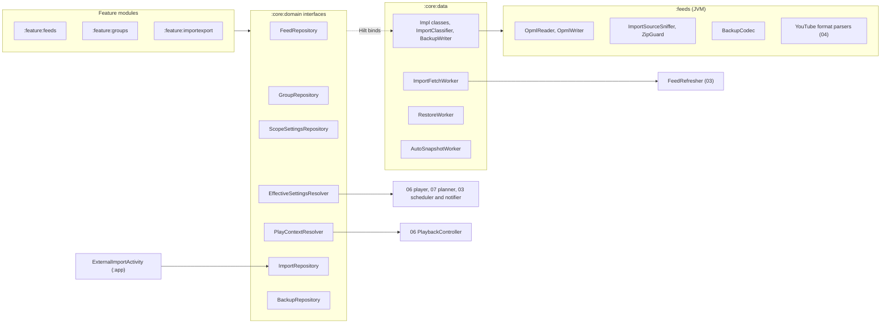
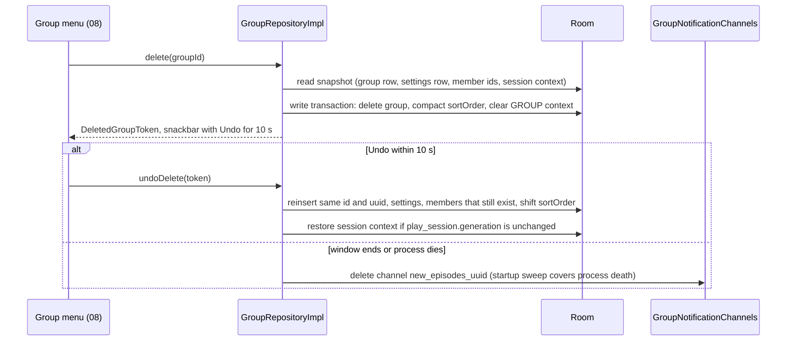

# 05 — Groups, OPML and backup

> Status: Draft v1, 2026-10-04 · Implements: R1.1–R1.9, R2.1–R2.9, R3.4, R4.4–R4.5 (policy resolution), R5.6 / N1, N3, N5, N9 · Milestones: M1, M2, M3, M4, M6, M8, M9, M11, M15 · Honours: D16, D20, D24, D29, D30, D31, D32, D33, D34, D35, D36, D44, D45, D66, D67; PO-11, PO-15 defaults · Owns: group semantics and lifecycle, group feeds and counts, effective-settings resolution, play-context membership, OPML export and import, the import pipeline for every file format, backup and restore, Auto Backup and file intents

Contents: [Scope](#scope) · [Group model and lifecycle](#group-model-and-lifecycle) · [Group feeds](#group-feeds) · [Effective settings resolution](#effective-settings-resolution) · [Playing a group](#playing-a-group) · [OPML export](#opml-export) · [OPML import](#opml-import) · [Other import formats](#other-import-formats) · [Full backup and restore](#full-backup-and-restore) · [Auto Backup](#auto-backup) · [Receiving files](#receiving-files) · [Settings](#settings) · [Testing](#testing) · [Error handling and failure modes](#error-handling-and-failure-modes) · [Delivery by milestone](#delivery-by-milestone) · [New names introduced here](#new-names-introduced-here) · [Open questions](#open-questions) · [Sources](#sources)

---

## Scope

Serves R1, R2, R3.4, N1, N9. Delivered in M1 (All and Podcast feeds), M2 (groups), M3 (files and backup), M4 (play contexts, playback settings), M6 (auto-download resolution), M8 (YouTube formats); see [Delivery by milestone](#delivery-by-milestone).

A group is a user-defined, many-to-many set of podcasts and YouTube channels with its own episode feed and defaults ([D29](../PLAN.md#3-key-decisions)); it is the product's differentiator. This document also owns every way subscriptions enter or leave the app as a file: OPML, the YouTube interchange formats (parsers specified by 04), the backup archive and the Auto Backup snapshot.

| Owned here | Not here (link instead) |
|---|---|
| Group semantics: name rules, palette, icon keys, order, membership edits, delete with undo, notification-channel lifecycle | Tables, columns, indices and every SQL statement — [02 podcast_group](02-data-model.md#podcast_group), [02 Key queries](02-data-model.md#key-queries) |
| `FeedSource`/`FeedFilters`/`FeedOrder` behaviour, the `FeedRepository` contract, counts window, "new since last visit", `includeInAll` | Tabs, pager and screen visuals — [08 Group feed pager](08-ui-ux.md#group-feed-pager), [08 Screens](08-ui-ux.md#screens); row overlay — [08 Live row state](08-ui-ux.md#live-row-state) |
| `EffectiveSettingsResolver` rules and attribution; `ScopeSettingsRepository` | Applying values to the player — [06 Per-scope playback settings](06-playback.md#per-scope-playback-settings); planner — [07 Auto-download policy](07-downloads.md#auto-download-policy); posting notifications — [03 New-episode notifications](03-feeds-and-discovery.md#new-episode-notifications) |
| Which episodes a play context contains and where "Play" starts (`PlayContextResolver`) | Projection, transitions, positions — [06 Queue and play context](06-playback.md#queue-and-play-context) |
| OPML writer and reader; the import pipeline (acquire, sniff, parse, classify, preview, commit, fetch, report) for every format | Refresh engine — [03 Refresh scheduling](03-feeds-and-discovery.md#refresh-scheduling); YouTube classification and NewPipe/LibreTube/Takeout/URL-list specs — [04 Import and export formats](04-youtube.md#import-and-export-formats) |
| Backup archive format, writer, validation, Merge/Replace restore | Identity-key computation — [03 Ingestion and diff](03-feeds-and-discovery.md#ingestion-and-diff); key storage and versions — [02 Identity keys](02-data-model.md#identity-keys) |
| Auto Backup rules XML, `AutoSnapshotWorker`, first-launch restore | Fresh-install detection — [02 Error handling and recovery](02-data-model.md#error-handling-and-recovery); start-up order — [01 Application start-up](01-foundation.md#application-start-up) |
| `ExternalImportActivity` filters, copy-on-receipt, `FileProvider` path `cache/export/` | `MainActivity` subscribe filters — [03 Deep links and share targets](03-feeds-and-discovery.md#deep-links-and-share-targets); merged manifest — [01 Manifest and permissions](01-foundation.md#manifest-and-permissions) |
| The portable-settings whitelist used by backups | `SettingKey` registry and DataStore files — [01 DataStore files and typed setting keys](01-foundation.md#datastore-files-and-typed-setting-keys) |

### Modules and public API

| Module | Contents from this document |
|---|---|
| `:core:model` | `Group`, `GroupDraft`, `GroupEdit`, `GroupNames`, `GroupPalette`, `GroupIcons`, `FeedTab`, `FeedCounts`, `VirtualCounts`, `FeedPrefs`, `DownloadAllEstimate`, `PlayContextSpec`, `SettingOverrides`, `SettingSource`, `Effective`, `EffectivePlayback`, `EffectiveAutoDownload`, `ImportOptions`, `ImportSessionView`, `ImportItemView`, `GroupProposal`, `BackupPreview`, `RestoreRequest`, `RestoreProgress`, `SnapshotStatus` |
| `:core:domain` | Interfaces `FeedRepository`, `GroupRepository`, `ScopeSettingsRepository`, `EffectiveSettingsResolver`, `PlayContextResolver`, `ImportRepository`, `BackupRepository`; errors `GroupError`, `ImportError`, `BackupError`, `ExportError` |
| `:feeds` (JVM) | `OpmlReader`, `OpmlWriter`, `ImportSourceSniffer`, `BackupCodec`, `ZipGuard` and their DTOs (packages `app.neutrodyne.feeds.opml`, `.backup`); 04's YouTube parsers sit beside them |
| `:core:data` | All implementations; `ImportClassifier`, `PayloadStore`, `OpmlExporter`, `BackupWriter`, `ImportFetchWorker`, `RestoreWorker`, `AutoSnapshotWorker`, `SnapshotScheduler`, `GroupNotificationChannels`, `FirstLaunchRestoreInitializer`, `ExportFilesCleaner` |
| `:feature:feeds`, `:feature:groups`, `:feature:importexport`, `:feature:podcast` | ViewModels and screens for `FeedsKey`, `GroupEditKey`, `GroupsManageKey`, `GroupSettingsKey`, `AddToGroupsKey`, `AllGroupsKey`, `ImportKey`, `BackupKey`, `ExportKey`, `PodcastSettingsKey` (visuals: 08) |
| `:app` | `ExternalImportActivity`, its manifest entries, `res/xml/data_extraction_rules.xml`, `res/xml/backup_rules.xml`, `res/xml-v28/backup_rules.xml`, the `cache/export/` entry of `res/xml/file_paths.xml` |



### Threading and coroutines

All repository functions are main-safe (`suspend` or `Flow`), follow [01 Coroutines and threading](01-foundation.md#coroutines-and-threading) and never call `runCatching` in suspend code.

| Work | Context | Rule |
|---|---|---|
| DAO calls | Room query context (`@Dispatcher(IO)`) | Batch sizes and transaction rules of [02 Conventions](02-data-model.md#conventions): import commit 500 items, restore 1,000 lines per transaction |
| Copying payloads, OPML/JSON/CSV parsing, ZIP reading and writing | `@Dispatcher(IO)` (blocking streams) | Caps enforced while streaming; no `ContentResolver` call inside a transaction |
| Group proposals of a 10,000-item preview, OPML document building | `@Dispatcher(Default)` | Debounced 100 ms on item changes |
| Manual OPML and backup export | `@ApplicationScope` | Leaving the dialog does not cancel; result reported as a `UserMessage` |
| Delete-group undo window | `@ApplicationScope`, `delay(10_000)` | Process death within the window makes the delete final |
| `ImportFetchWorker`, `RestoreWorker`, `AutoSnapshotWorker` | `CoroutineWorker` (`@HiltWorker`) | Idempotent, resumable, 8-min soft deadline ([N2](../PLAN.md#22-non-functional-requirements)) |
| `ExternalImportActivity` copy | retained `ViewModel` scope | Survives rotation; must finish before the activity finishes (grant lifetime) |
| Backup and snapshot writing | one process-wide `Mutex` in `BackupWriter` | A manual backup waits for a running snapshot and vice versa |

### Platform constraints

| Constraint | Consequence here | Source |
|---|---|---|
| URI grants of VIEW/SEND intents "remain in effect while the stack of the receiving Activity is active" | Copy the payload before `finish()`; workers never read the original URI | [FileProvider](https://developer.android.com/reference/androidx/core/content/FileProvider) |
| `ContentResolver.openOutputStream(uri)` uses mode `"w"`, which "may or may not truncate" | Every SAF write uses `"wt"` | [ContentResolver](https://developer.android.com/reference/android/content/ContentResolver) |
| Neither Android MIME table maps `.opml`; file-system providers keep the requested display name only when the MIME type matches or has no mapping | `CreateDocument("text/x-opml")` (with `text/xml` the file becomes `x.opml.xml`) | [mime.types](https://android.googlesource.com/platform/external/mime-support/+/refs/heads/main/mime.types), [android.mime.types](https://android.googlesource.com/platform/frameworks/base/+/refs/heads/main/mime/java-res/android.mime.types), [FileUtils](https://android.googlesource.com/platform/frameworks/base/+/refs/heads/main/core/java/android/os/FileUtils.java) |
| `<data>` path attributes need scheme and host; `pathSuffix` exists from API 31; MIME and scheme matching is case-sensitive | `pathSuffix=".opml"` only on an alias enabled on API 31+ | [data element](https://developer.android.com/guide/topics/manifest/data-element) |
| Android 16 Safer Intents is opt-in and planned to become default | Our filters are fully specified; adoption is 01's decision (P27) | [Android 16 behaviour changes](https://developer.android.com/about/versions/16/behavior-changes-16) |
| Auto Backup: 25 MB per app, over quota "doesn't back up data to the cloud"; `<include>` disables the defaults; restore happens at install; a `BackupAgent` runs in restricted mode | Include-only rules for a small snapshot; no custom `BackupAgent` | [Auto Backup](https://developer.android.com/identity/data/autobackup) |
| `disableIfNoEncryptionCapabilities` (Android 12+ rules); `requireFlags="clientSideEncryption"` (Android 9+) "prevents backups from working" on 8.1 and lower; a missing section in `data-extraction-rules` means that mode is "fully enabled for all content" | PO-15 rules per API level ([Auto Backup](#auto-backup)) | [Auto Backup](https://developer.android.com/identity/data/autobackup) |
| The local backup transport must be marked encrypted (`backup_local_transport_parameters 'is_encrypted=true'`) | Test procedure | [Test backup and restore](https://developer.android.com/identity/data/testingbackup) |
| Expedited work before API 31 runs as a foreground service and needs `getForegroundInfo()`; Android 16 applies job quotas to work running beside an FGS | `import-{sessionId}` is expedited only on API 31+; every worker is resumable | [Define work](https://developer.android.com/develop/background-work/background-tasks/persistent/getting-started/define-work), [Android 16 behaviour changes (all apps)](https://developer.android.com/about/versions/16/behavior-changes-all) |
| `dataSync` FGS covers "Import or export operations" but carries the Play declaration and the 6 h/24 h cap | Not used for imports or backups | [FGS service types](https://developer.android.com/develop/background-work/services/fgs/service-types) |
| Deleting a notification channel and recreating the same ID "un-deletes" it with its old settings; `createNotificationChannel` renames an existing channel | Channel IDs use the never-reused group `uuid` | [NotificationManager](https://developer.android.com/reference/android/app/NotificationManager) |

---

## Group model and lifecycle

Serves R2.1, R2.2, R5.6. Delivered in [M2](../PLAN.md#m2-groups-and-group-feeds). Honours [D29](../PLAN.md#3-key-decisions), [D36](../PLAN.md#3-key-decisions). Storage: [02 podcast_group](02-data-model.md#podcast_group), [02 podcast_group_member](02-data-model.md#podcast_group_member).

```kotlin
// :core:model — canonical type Group; shape owned here
data class Group(
    val id: Long, val uuid: String, val name: String, val sortOrder: Int,
    val colorArgb: Int?, val iconKey: String?,
    val feedOrder: FeedOrder, val playOrder: FeedOrder,
    val filterFlags: Int, val mediaFilter: MediaFilter, val hideOlderThanDays: Int?,
    val showAsTab: Boolean, val lastViewedAt: Long?, val createdAt: Long, val memberCount: Int,
)
data class GroupDraft(val name: String, val colorArgb: Int? = null, val iconKey: String? = null,
                      val playOrder: FeedOrder = FeedOrder.NEWEST_FIRST)  // colour null → next free palette colour
sealed interface GroupEdit {
    data class Rename(val name: String) : GroupEdit
    data class Look(val colorArgb: Int?, val iconKey: String?) : GroupEdit
    data class Orders(val feedOrder: FeedOrder, val playOrder: FeedOrder) : GroupEdit
    data class View(val filterFlags: Int, val mediaFilter: MediaFilter, val hideOlderThanDays: Int?) : GroupEdit
    data class ShowAsTab(val show: Boolean) : GroupEdit
}
```

`kind` is always `MANUAL` and `ruleJson` always `null` in v1 (smart groups reserved, [02 Reserved tables](02-data-model.md#reserved-tables)). `uuid` = `java.util.UUID.randomUUID().toString()` (lowercase), generated once and never reused ([02 Group uuid and nameKey](02-data-model.md#group-uuid-and-namekey)); notification channels and the mosaic artwork key `g-{groupUuid}` depend on it.

### Names

`GroupNames` (`:core:model`, pure) is the single implementation, used by the editor, import, restore and LibreTube group mapping.

1. Normalise to NFC.
2. Replace tabs, line and paragraph separators and every other `Cc` character with U+0020; delete the bidi controls U+202A–U+202E and U+2066–U+2069. Other format characters stay (ZWJ U+200D and variation selector U+FE0F build emoji).
3. Collapse runs of whitespace (`Char.isWhitespace` plus U+00A0, U+2007, U+202F) to one U+0020 and trim.
4. Length = `codePointCount`: 0 → `GroupError.NameEmpty`; > 40 → `GroupError.NameTooLong(40)` (code points, not graphemes, so JVM tests and every Android version agree).
5. `nameKey = NFC(normalized.lowercase(Locale.ROOT))`; a `nameKey` held by another group → `GroupError.NameTaken(groupId)`. The final NFC pass only matters where lowercasing decomposes (`İ` → `i̇`).

Examples (M2 acceptance 5): "Tech" is rejected when "tech" exists; a 41-code-point name is rejected; "🎧 Commute" is accepted; "Café" typed as `e + U+0301` collides with precomposed "Café". `GroupNames.suggestsOldestFirst(name)` is true when `nameKey` contains `fiction`, `audiobook`, `audio book`, `drama`, `serial`, `story`, `stories`, `novel`, `hörbuch` or `hörspiel`; the editor then offers "Play oldest first" ([PO-11](../PLAN.md#48-further-product-owner-decisions)), it never switches silently.

### Palette

`colorArgb` stores a seed colour; 08 maps it through HCT tones per theme, never rendering it raw ([08 Theming and colour](08-ui-ux.md#theming-and-colour)). `GroupPalette.COLORS` (order and values are stable forever):

| # | Key (content description) | ARGB | # | Key | ARGB |
|---|---|---|---|---|---|
| 0 | `red` | `0xFFF44336` | 6 | `blue` | `0xFF2196F3` |
| 1 | `deep_orange` | `0xFFFF5722` | 7 | `indigo` | `0xFF3F51B5` |
| 2 | `amber` | `0xFFFFC107` | 8 | `deep_purple` | `0xFF673AB7` |
| 3 | `green` | `0xFF4CAF50` | 9 | `pink` | `0xFFE91E63` |
| 4 | `teal` | `0xFF009688` | 10 | `brown` | `0xFF795548` |
| 5 | `cyan` | `0xFF00BCD4` | 11 | `blue_grey` | `0xFF607D8B` |

- A new group (editor, import, suggested groups) without a colour gets the first palette entry no existing group uses, in palette order; if all 12 are used, `COLORS[groupCount % 12]`.
- Colours from OPML (`nd:groupColor`) or backups that are not in the palette are kept (alpha forced to `0xFF`); the editor shows them as a "Custom" swatch. `null` (legacy) renders with the theme's primary colour.

### Icons

`iconKey` is a stable string (a Material Symbols name rendered by `:core:designsystem`), never a resource ID. Unknown keys from newer versions are stored and exported unchanged and render without an icon. Valid format `^[a-z0-9_]{1,40}$`; `null` = no icon. `GroupIcons.KEYS` (v1, 32 keys, new keys may be appended):

| Theme | Keys |
|---|---|
| News and society | `newspaper`, `public`, `account_balance`, `gavel` |
| Tech and science | `memory`, `computer`, `science`, `rocket_launch`, `psychology` |
| Stories and learning | `auto_stories`, `menu_book`, `history_edu`, `school`, `theater_comedy` |
| Culture and play | `music_note`, `movie`, `palette`, `sports_esports`, `sports_soccer` |
| Daily life | `fitness_center`, `restaurant`, `travel_explore`, `child_care`, `self_improvement`, `bedtime`, `directions_car`, `work` |
| General | `podcasts`, `smart_display`, `favorite`, `star` |

### Order

`sortOrder` is dense `0..n-1` and defines tab order, the Library groups view, OPML folder order and the "primary group" of hybrid OPML. Create appends `max + 1`; `reorder(ids)` rewrites every row in one write transaction (n ≤ a few dozen; drag reorder with `reorderable`, 08); delete compacts the remaining rows in the delete transaction. Tested to 50 groups ([N5](../PLAN.md#22-non-functional-requirements)); there is no cap.

### Membership

Many-to-many ([R2.2](../PLAN.md#21-functional-requirements)); rows are `source = MANUAL`, `addedAt = now`, member `sortOrder = 0` (manual order inside a group is reserved; group grids sort by title).

| Entry point | Navigation key | Call |
|---|---|---|
| Podcast screen group chips | `AddToGroupsKey(listOf(podcastId))` | `applyMembership(podcastIds, add, remove)` |
| Group editor cover-grid picker | `GroupEditKey(groupId)` (`null` = new) | `create(draft, memberIds)` / `setMembers(groupId, memberIds)` |
| Library multi-select "Add to group…" | `AddToGroupsKey(ids)` | `applyMembership` with tri-state chips: checked for all → `add`, cleared → `remove`, indeterminate untouched |
| Subscribe and import | — | 03's `SubscribeUseCase(groupIds)`; [Commit](#7-commit) |

Every membership write is one write transaction (`INSERT OR IGNORE` / `DELETE … WHERE groupId = ? AND podcastId IN (…)`), then: `RefreshController.reschedulePeriodic()` (the minimum refresh interval over groups may change, [03 Periodic tick](03-feeds-and-discovery.md#periodic-tick)) and `SnapshotScheduler.requestSoon()`. Auto-download and notification policies follow automatically through the resolver flows ([Effective settings resolution](#effective-settings-resolution)).

```kotlin
// :core:domain
interface GroupRepository {
    fun observeGroups(): Flow<List<Group>>                                   // ordered by sortOrder
    fun observeGroup(groupId: Long): Flow<Group?>
    fun observeGroupsOf(podcastId: Long): Flow<List<Group>>
    fun observeMemberIds(groupId: Long): Flow<Set<Long>>
    fun observeMosaics(): Flow<Map<Long, List<ArtworkRef>>>                   // 02 GroupDao.observeMosaics
    suspend fun checkName(name: String, excludingGroupId: Long? = null): Outcome<String, GroupError>
    suspend fun create(draft: GroupDraft, memberIds: Set<Long> = emptySet()): Outcome<Long, GroupError>
    suspend fun update(groupId: Long, edit: GroupEdit): Outcome<Unit, GroupError>
    suspend fun reorder(groupIdsInOrder: List<Long>): Outcome<Unit, GroupError>
    suspend fun setMembers(groupId: Long, podcastIds: Set<Long>): Outcome<Unit, GroupError>
    suspend fun applyMembership(podcastIds: Set<Long>, add: Set<Long>, remove: Set<Long>): Outcome<Unit, GroupError>
    suspend fun delete(groupId: Long): Outcome<DeletedGroupToken, GroupError>
    suspend fun undoDelete(token: DeletedGroupToken): Outcome<Long, GroupError>
}
@JvmInline value class DeletedGroupToken(val value: String)
sealed interface GroupError {
    data object NameEmpty : GroupError
    data class NameTooLong(val max: Int) : GroupError
    data class NameTaken(val groupId: Long) : GroupError
    data object NotFound : GroupError
    data object UndoExpired : GroupError
}
```

`create` and `Rename` validate with `GroupNames`; a `nameKey` unique violation inside the transaction (race) maps to `NameTaken` ([02 Error handling and recovery](02-data-model.md#error-handling-and-recovery)). `reorder` with a list that is not a permutation of the current IDs returns `NotFound` and writes nothing.

### Delete and undo

Deleting never deletes podcasts and can be undone for 10 s ([R2.1](../PLAN.md#21-functional-requirements)).



1. Snapshot in memory: the `podcast_group` row, its `podcast_group_settings` row, member IDs, and whether `play_session` has `contextType = GROUP AND contextId = groupId` (plus its `generation`).
2. One write transaction: `DELETE FROM podcast_group WHERE id = ?` (cascades members and settings), compact `sortOrder`, `UPDATE play_session SET contextType = NULL, contextId = NULL, contextAnchorEpisodeId = NULL, contextAnchorSortDate = NULL, generation = generation + 1` when it pointed at the group (06 keeps the current item and plays Up next, then stops).
3. Keep the snapshot under a random token for 10 s; a second delete creates a second token (independent snackbars, 08).
4. Undo: one write transaction re-inserting the row with its original `id` and `uuid` (`AUTOINCREMENT` never reused the ID), shifting `sortOrder ≥ old` by +1, re-inserting settings and memberships for podcasts that still exist, and restoring the session context only if `generation` still equals the post-delete value.
5. After the window: cancel the channel's active notification (`tag = channelId`, `id = 5000`) and delete the channel ([Notification channels](#notification-channels)); 08's `ArtworkStore` garbage collection drops `g-{uuid}` ([02 Artwork references](02-data-model.md#artwork-references)).

| Effect of deleting a group | Mechanism |
|---|---|
| Memberships, group settings | FK `ON DELETE CASCADE` |
| Podcasts, episodes, user state, downloads | untouched |
| Playing from the group | context cleared in the same transaction; current item continues |
| Feeds tab selected | 08 falls back to All with a snackbar (M2 acceptance 6) |
| Effective settings of former members | resolver flows re-emit; refresh tick rescheduled; 07's planner reacts |
| Notification channel `new_episodes_{uuid}` | deleted after the undo window |
| Mosaic artwork `g-{uuid}` | unreferenced → collected |
| Import history (`import_item.groupNamesJson`) | unaffected (names, not IDs) |

### Notification channels

Channel posting is 03's ([03 New-episode notifications](03-feeds-and-discovery.md#new-episode-notifications)); the lifecycle is here, in `GroupNotificationChannels` (`:core:data`).

| Event | Action |
|---|---|
| A group's `notifyNewEpisodes` becomes `true` | `createNotificationChannel(new_episodes_{uuid}, name = group name, importance DEFAULT, group grp_new_episodes)` |
| Group renamed | `createNotificationChannel` with the same ID and the new name (supported for user renames) |
| `notifyNewEpisodes` set to `false` or `null` | delete the channel; switching it back on "un-deletes" it with the user's sound and importance |
| Group deleted | delete after the undo window |
| Start-up (`AppInitializer` order 10, [01](01-foundation.md#application-start-up)) and `sync()` after settings writes | create missing channels for groups whose own setting is `true`; delete every `new_episodes_*` channel whose UUID is not such a group |

The channel group `grp_new_episodes` and the default channel `new_episodes` are created by 03's `ensureChannels()`. The AOSP per-app limit of 5,000 channels is irrelevant at our scale ([PreferencesHelper](https://android.googlesource.com/platform/frameworks/base/+/refs/heads/main/services/core/java/com/android/server/notification/PreferencesHelper.java)).

---
