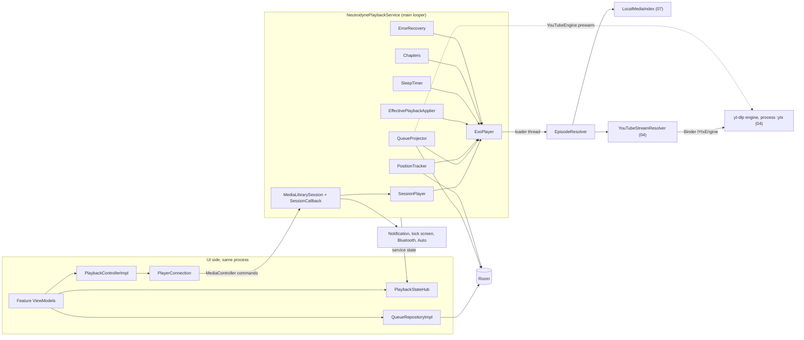
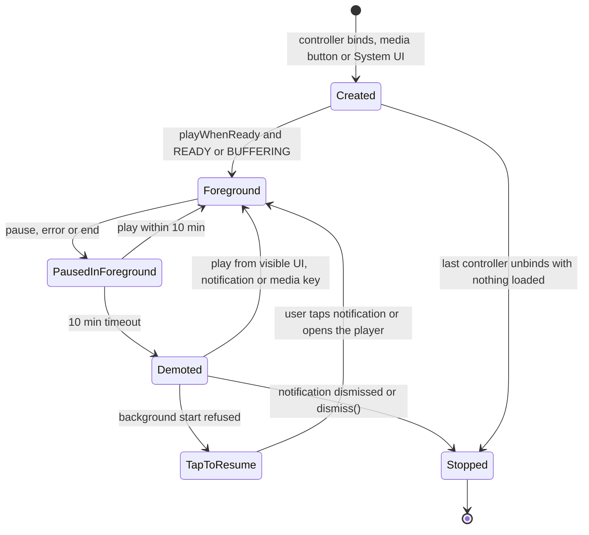
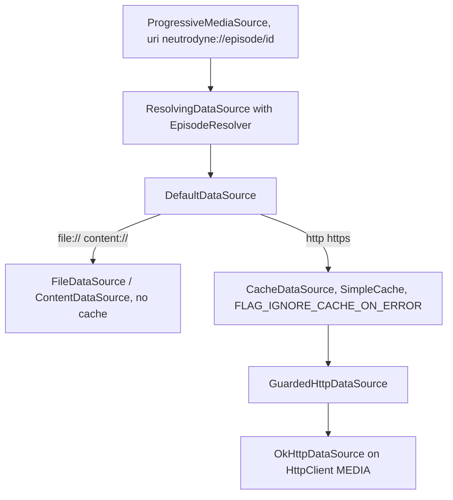
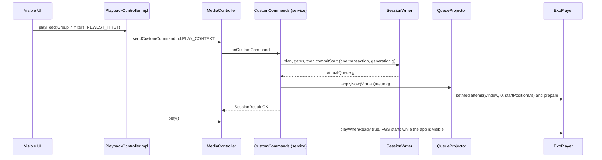
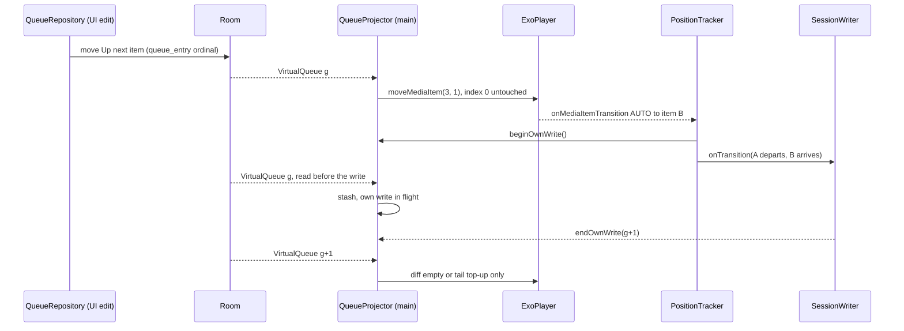
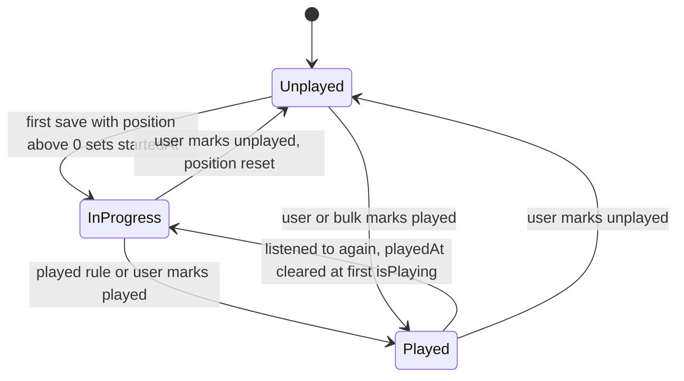
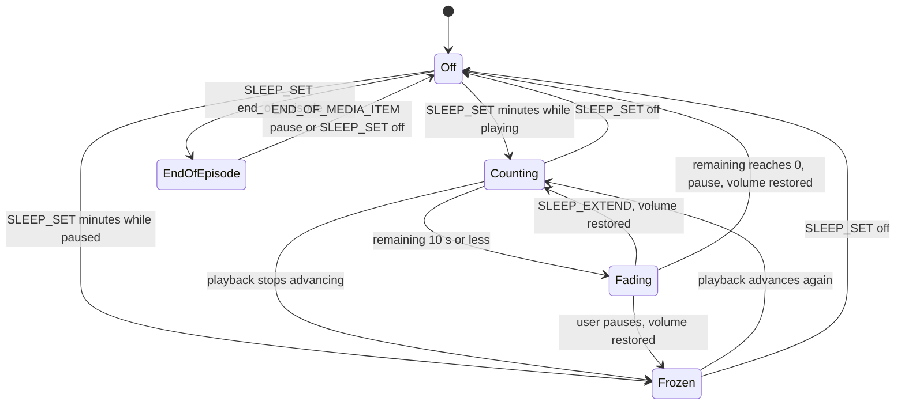

# 06 — Playback

> Status: Draft v1, 2026-10-04; revised 2026-10-05 for the product owner's decisions (embedded yt-dlp engine, external mode as a runtime capability, GitHub Releases only, in-app updater) · Implements: R4.1, R4.3, R4.7, R4.8, R2.6 (play group), R2.7 (playback defaults), R3.5, R3.7 (playback side), R3.8, R5.2, R5.3, R6.2 (playback side of "never installs while audio plays") / N1, N2, N5 (YouTube start latency), N6, N7 · Milestones: M0, M4, M5, M6, M8, M9 (M9a), M11 (M11a, M11b), M12–M14 · Honours: D20, D37, D38, D39, D40, D41, D42, D43, D44, D45, D64, D65, D72, D73, D76, D77, D78, D79; PO-16, PO-20 defaults; PO-6 (Chromecast not planned) · Owns: `:playback:api` and `:playback:impl` — the Media3 library service and session policy, ExoPlayer configuration, `MediaItem` shape and `EpisodeResolver` (including its YouTube branch, pre-warm and pre-resolve), the streaming cache, Up next and play-session semantics with `QueueProjector` (including YouTube capability flips at runtime), positions and played state, applying effective playback settings, sleep timer, chapters, notification and media buttons, system surfaces, video-as-audio, Android 15–17 playback restrictions, the playback-busy signal the in-app updater waits on, and the UI ↔ service boundary

Contents: [Scope](#scope) · [Service architecture](#service-architecture) · [Player configuration](#player-configuration) · [Media items and URI resolution](#media-items-and-uri-resolution) · [Streaming cache](#streaming-cache) · [Queue and play context](#queue-and-play-context) · [Positions and played state](#positions-and-played-state) · [Per-scope playback settings](#per-scope-playback-settings) · [Sleep timer](#sleep-timer) · [Chapters](#chapters) · [Notification and media buttons](#notification-and-media-buttons) · [System surfaces](#system-surfaces) · [Video](#video) · [Background restrictions](#background-restrictions) · [UI boundary](#ui-boundary) · [Settings](#settings) · [Testing](#testing) · [Delivery by milestone](#delivery-by-milestone) · [Open questions](#open-questions) · [Sources](#sources)

---

## Scope

Serves R4.1, R4.3, R4.7, R4.8, N1, N2. Delivered in M4 (core), M5 (features and system surfaces), M6 (local files), M8 (external-mode exclusions), M9a (YouTube branch through the engine), M11a (playback side of the updater's idle gate); see [Delivery by milestone](#delivery-by-milestone).

One `MediaLibraryService` ([D37](../PLAN.md#3-key-decisions)) owns one `ExoPlayer`. The database owns *what* plays — Up next (`queue_entry`) and the play context (`play_session`) — and the player holds only a projection window of current + Up next + K = 20 context items ([D38](../PLAN.md#3-key-decisions)). Every playable episode is the URI `neutrodyne://episode/{episodeId}` ([D39](../PLAN.md#3-key-decisions)), resolved on each connection to a local file, a pinned remote enclosure or — where the YouTube engine is available ([D77](../PLAN.md#3-key-decisions)) — a fresh YouTube stream URL that yt-dlp resolves in the separate `:ytx` process ([D72](../PLAN.md#3-key-decisions), [D73](../PLAN.md#3-key-decisions)). Whether YouTube items play in-app is a runtime capability (`YouTubeCapabilitiesSource`), never a build property: in external mode they are never queued or projected ([R3.7](../PLAN.md#21-functional-requirements)). Starting playback is only ever a user-visible or media-key action ([D43](../PLAN.md#3-key-decisions)), and neither a YouTube-engine update nor an app update ever interrupts it ([App updates and playback](#app-updates-and-playback)).

### Responsibilities and boundaries

| This document owns | Owned elsewhere (link, do not restate) |
|---|---|
| `NeutrodynePlaybackService`, session and controller policy, `PlayerConnection` | Merged manifest and permissions — [01 Manifest and permissions](01-foundation.md#manifest-and-permissions) (06 lists its own entries) |
| ExoPlayer, audio chain, load control, extractor flags | Library versions — [01 Toolchain and versions](01-foundation.md#toolchain-and-versions) |
| `MediaItem` shape, `EpisodeResolver`, pins, error recovery | YouTube extraction, `ResolvedUrlCache`, breaker — [04 Stream resolution](04-youtube.md#stream-resolution), [04 Playback integration](04-youtube.md#playback-integration); the engine, `:ytx`, pre-warm semantics and deadlines — [04 YouTube engine](04-youtube.md#youtube-engine); capability flags and `ExternalReason` — [04 Capability matrix](04-youtube.md#capability-matrix) |
| Playback-busy signal for app updates ([App updates and playback](#app-updates-and-playback)) | The in-app updater, `InstallIdleGate`, `PackageInstaller` sessions — [09 In-app updater](09-quality-and-release.md#in-app-updater) |
| `SimpleCache` for streaming | Downloads, `LocalMediaIndex` implementation, file deletion — [07 Storage layout](07-downloads.md#storage-layout) |
| Up next and `play_session` semantics, `QueueProjector`, transitions | Which episodes a context contains and where "Play" starts — [05 Playing a group](05-groups-opml-backup.md#playing-a-group); context-tail SQL — [02 Play context](02-data-model.md#play-context) |
| Positions, played state, measured duration, start position | Table DDL and DAO SQL — [02 episode_position](02-data-model.md#episode_position), [02 User-state writes](02-data-model.md#user-state-writes) |
| Applying speed and skip silence; scope writes from the player | Resolution rules and attribution — [05 Effective settings resolution](05-groups-opml-backup.md#effective-settings-resolution) |
| Sleep timer; chapter sources, fetch, priority, current chapter | PSC chapter ingestion — [03 Ingestion and diff](03-feeds-and-discovery.md#ingestion-and-diff); timestamp grammar — [03 Show notes](03-feeds-and-discovery.md#show-notes) |
| Notification buttons, Auto browse tree, Assistant, resumption, Bluetooth | Artwork files, `ArtworkProvider`, monograms — [08 Artwork pipeline](08-ui-ux.md#artwork-pipeline) (06 consumes `ArtworkStore.contentUri`) |
| `PlaybackController`, `PlaybackStateSource`, threading | Player sheet layout, speed/sleep sheets, row overlay — [08 Player sheet](08-ui-ux.md#player-sheet), [08 Live row state](08-ui-ux.md#live-row-state) |

### Modules and public API

| Module | Contents from this document |
|---|---|
| `:playback:api` (JVM, `ch.lkmc.neutrodyne.playback.api`) | `PlaybackController`, `PlaybackStateSource`, `PlaybackMaintenance` and their data types (below) |
| `:core:domain` | `QueueRepository`, `ChapterRepository` (interfaces owned here) |
| `:core:model` | `UpNextItem`, `VirtualQueue`, `QueueItem`, `QueueOrigin`, `PlaySessionInfo`, `PlayContextInfo`, `AddResult`, `EpisodeChapter` |
| `:playback:impl` (Android, `ch.lkmc.neutrodyne.playback.impl`) | Everything else ([package layout](#package-layout)); `@UnstableApi` opt-in module-wide ([01 Convention plugins](01-foundation.md#convention-plugins)) |
| `:core:testing` | `FakePlaybackController`, `FakePlaybackStateSource`, `FakeQueueRepository`, `FakeChapterRepository` (M0) |

```kotlin
// :playback:api — commands. play* functions are UI-only (D43): they return ServiceUnavailable when the
// process is not STARTED. Transport functions are fire-and-forget on the main thread.
interface PlaybackController {
    suspend fun playEpisode(episodeId: Long): PlayResult                        // Up next item: context kept; else EXTERNAL
    suspend fun playEpisodeAt(episodeId: Long, positionMs: Long): PlayResult    // timestamps, chapters of non-current items
    suspend fun playFeed(source: FeedSource, filters: FeedFilters, order: FeedOrder,
                         startEpisodeId: Long? = null): PlayResult
    suspend fun play(): PlayResult                                              // resume current, else start Up next
    suspend fun playDownloads(startEpisodeId: Long? = null): PlayResult        // nd.PLAY_CONTEXT, contextType = DOWNLOADS (08's "Play all")
    fun pause()
    fun seekTo(positionMs: Long)                                                // current item
    fun skipBack()
    fun skipForward()
    fun skipToNext()                                                            // always next episode (ignores playback.hardware_buttons)
    fun skipToPrevious()                                                        // > 3 s: restart, else previous episode (same)
    suspend fun setSpeed(speed: Float, scope: SettingScope): ScopeWriteResult
    suspend fun setSkipSilence(enabled: Boolean, scope: SettingScope): ScopeWriteResult
    fun setSleepTimer(mode: SleepTimerMode)
    fun extendSleepTimer(minutes: Int)
    fun nextChapter()
    fun previousChapter()
    fun grantMeteredStreaming()                                                 // answer to NeedsMeteredConsent
    suspend fun dismiss()                                                       // stop, clear current, drop notification
}
sealed interface PlayResult {
    data object Started : PlayResult
    data class NothingToPlay(val externalOnly: Boolean = false) : PlayResult   // true: only external-mode YouTube items left
    data class NeedsMeteredConsent(val episodeId: Long) : PlayResult
    data object MeteredBlocked : PlayResult
    data object Offline : PlayResult
    data class NotPlayable(val episodeId: Long, val reason: UnplayableReason) : PlayResult
    data object ServiceUnavailable : PlayResult
}
enum class ScopeWriteResult { APPLIED, NO_CONTEXT_GROUP, NOTHING_PLAYING }
sealed interface SleepTimerMode {
    data object Off : SleepTimerMode
    data class Minutes(val minutes: Int) : SleepTimerMode                       // 1..240
    data object EndOfEpisode : SleepTimerMode                                   // EndOfChapter: v1.x (M12)
}
```

```kotlin
// :playback:api — state (implemented by PlaybackStateHub; all flows are main-safe)
interface PlaybackStateSource {
    val nowPlaying: StateFlow<NowPlaying?>
    val positionTicks: Flow<PositionSnapshot>       // 1 Hz while advancing, plus one emission per state change
    val sleepTimer: StateFlow<SleepTimerState>
    val currentChapter: StateFlow<CurrentChapter?>
    val effectivePlayback: StateFlow<EffectivePlayback?>   // 05's :core:model type: value + source per setting
    val events: Flow<PlaybackEvent>                 // one-shot, not replayed
    val busy: StateFlow<Boolean>                    // M11a: app updates must wait (App updates and playback)
}
data class NowPlaying(
    val episodeId: Long, val podcastId: Long, val title: String, val podcastTitle: String,
    val artwork: ArtworkRef,          // in-app art: episode art, else podcast art; YouTube: the episode's 16:9 thumbnail ref
    val sourceType: SourceType, val isVideo: Boolean,
    val phase: PlayerPhase, val isPlaying: Boolean, val playWhenReady: Boolean,
    val position: PositionSnapshot, val hasNext: Boolean, val stream: StreamKind?,  // null until first open
    val issue: PlaybackIssue?, val context: PlayContextInfo?,
)
data class PositionSnapshot(val episodeId: Long, val positionMs: Long, val bufferedMs: Long, val durationMs: Long?,
                            val speed: Float, val advancing: Boolean, val sampledAtElapsedMs: Long) {
    fun positionAt(elapsedMs: Long): Long = if (!advancing) positionMs else
        (positionMs + ((elapsedMs - sampledAtElapsedMs) * speed).toLong()).let { p -> durationMs?.let { minOf(p, it) } ?: p }
}
enum class PlayerPhase { NOT_LOADED, BUFFERING, READY, ENDED, ERROR }
enum class StreamKind { LOCAL, STREAM, YOUTUBE }
enum class PlaybackIssue { NETWORK_LOST, METERED_PAUSE, METERED_BLOCKED, LOCAL_FILE_MISSING,
                           YOUTUBE_RATE_LIMITED, YOUTUBE_BREAKER_OPEN, PLAYER_ERROR }
sealed interface UnplayableReason {
    data class Http(val status: Int) : UnplayableReason          // 404, 410
    data object AuthRequired : UnplayableReason                   // 401, 403 on an RSS enclosure
    data object UnsupportedFormat : UnplayableReason
    data object NoMedia : UnplayableReason                        // no enclosure and no video ID
    data class YouTube(val availability: Availability) : UnplayableReason
    data object YouTubeExtraction : UnplayableReason
    data class YouTubeExternal(val reason: ExternalReason) : UnplayableReason  // YouTube item in external mode (R3.7); 04's enum
}
```

`UnplayableReason.YouTubeExternal` replaces the former `NotInThisBuild`. `ExternalReason` (`NOT_YET_AVAILABLE`, `NOT_IN_THIS_APK`, `DISABLED_BY_USER`, `ENGINE_FAILED`) is owned by 04 ([04 Capability matrix](04-youtube.md#capability-matrix)); because `:playback:api` may depend only on `:core:{model, common}` ([01 Dependency rules](01-foundation.md#dependency-rules) rule 10), the enum is declared in `:core:model`, as `IpFamily` is ([Open questions](#open-questions) 14, resolved). 08 maps each reason to its external-mode text ([08 Capability differences in UI](08-ui-ux.md#capability-differences-in-ui)).

```kotlin
// :playback:api — continued
sealed interface SleepTimerState {
    data object Off : SleepTimerState
    data class Running(val remainingMs: Long, val totalMs: Long, val counting: Boolean, val fading: Boolean) : SleepTimerState
    data class EndOfEpisode(val episodeId: Long) : SleepTimerState
}
data class CurrentChapter(val episodeId: Long, val index: Int, val count: Int, val chapter: EpisodeChapter)
sealed interface PlaybackEvent {
    data class Skipped(val episodeId: Long, val title: String, val reason: UnplayableReason) : PlaybackEvent
    data class MarkedPlayed(val episodeId: Long) : PlaybackEvent
    data object SleepTimerFired : PlaybackEvent
}
interface PlaybackMaintenance {                     // Settings › Playback › Storage
    suspend fun streamingCacheBytes(): Long
    suspend fun clearStreamingCache()
}

// :core:domain
interface QueueRepository {
    fun observeUpNext(): Flow<List<UpNextItem>>
    fun observeSession(): Flow<PlaySessionInfo?>
    fun observeVirtualQueue(k: Int): Flow<VirtualQueue>
    suspend fun addNext(episodeIds: List<Long>): AddResult      // "Play next"
    suspend fun addLast(episodeIds: List<Long>): AddResult      // "Play last"
    suspend fun move(episodeId: Long, toIndex: Int)
    suspend fun remove(episodeIds: List<Long>)
    suspend fun clearUpNext()
    suspend fun clearContext()                                  // "Stop after Up next"
}
interface ChapterRepository {
    fun observe(episodeId: Long): Flow<List<EpisodeChapter>>    // winning source only, hidden chapters excluded
    suspend fun ensureLoaded(episodeId: Long, localFileUri: String? = null)   // 07 calls after COMPLETED
}
```

```kotlin
// :core:model
data class UpNextItem(val entryId: Long, val row: EpisodeRow)
enum class QueueOrigin { CURRENT, UP_NEXT, CONTEXT }
data class QueueItem(val episodeId: Long, val origin: QueueOrigin)
data class VirtualQueue(val generation: Long, val current: QueueItem?, val upNext: List<QueueItem>,
                        val contextTail: List<QueueItem>)
data class PlayContextInfo(val type: ContextType, val id: Long?, val title: String, val order: FeedOrder,
                           val filterFlags: Int, val mediaFilter: MediaFilter)
data class PlaySessionInfo(val currentEpisodeId: Long?, val context: PlayContextInfo?, val generation: Long)
sealed interface AddResult {
    data class Added(val count: Int) : AddResult                // includes moves of already-queued items
    data class Rejected(val reason: RejectReason) : AddResult
}
enum class RejectReason { ALREADY_PLAYING, YOUTUBE_EXTERNAL, UNAVAILABLE }
data class EpisodeChapter(val startMs: Long, val endMs: Long?, val title: String?, val imageUrl: String?,
                          val linkUrl: String?, val source: ChapterSource, val hidden: Boolean)
```

### Package layout

```
playback/impl/src/main/kotlin/ch/lkmc/neutrodyne/playback/impl/
  NeutrodynePlaybackService.kt  PlaybackModule.kt (Hilt bindings, SimpleCache, initializers)
  player/   PlayerFactory  SessionPlayer  NdMediaSourceFactory  NdLoadErrorHandlingPolicy
            BoostLimiterProcessor  EndOfItemPauseArbiter
  media/    MediaItemFactory  EpisodeResolver  EpisodeSourceIndex  GuardedHttpDataSource
            StreamingCache  AdjustableLruCacheEvictor  EnclosureFingerprint  ErrorRecovery
  queue/    QueueRepositoryImpl  SessionWriter  QueueProjector  WindowDiff  PlaybackHistory
  state/    PositionTracker  PositionWriter  PlayedRule  StartPositionRule  PlaybackStateHub  ServiceBridge
            EffectivePlaybackApplier  MeteredStreamingGate  PlaybackPrefs
  features/ SleepTimer  Chapters  ChapterRepositoryImpl  Podcasting20ChaptersParser  PreResolver
  session/  SessionCallback  CustomCommands  MediaButtons  MediaLibraryTree  ResumptionProvider
            PlaybackChannels  TapToResumeNotifier
  ui/       PlayerConnection  PlaybackControllerImpl
```

Hilt (`PlaybackModule`, `SingletonComponent`): binds `PlaybackController` → `PlaybackControllerImpl`, `PlaybackStateSource` → `PlaybackStateHub`, `PlaybackMaintenance` → `StreamingCache`, `QueueRepository` → `QueueRepositoryImpl`, `ChapterRepository` → `ChapterRepositoryImpl`; provides `SimpleCache` (`@Singleton`); declares `@BindsOptionalOf LocalMediaIndex` and `@BindsOptionalOf DownloadController` (absent until M6: no local files, no missing-file reports) and `@BindsOptionalOf YouTubeEngine` (bound by `:app`'s `YouTubeBindingsModule` from M9a, [01 YouTube bindings](01-foundation.md#youtube-bindings); absent before, so pre-warm is skipped); injects `YouTubeCapabilitiesSource` (bound from M2) into `EpisodeResolver`, `QueueProjector`, `QueueRepositoryImpl` and the start gates, which read `capabilities.value` at each use and never cache a snapshot; contributes `@IntoSet AppInitializer`s `PlaybackChannels` (order 10) and, at order 300, `PlaybackPrefs` warm-up and `PlayerConnection` registration. Service-side components (`QueueProjector`, `PositionTracker`, `SleepTimer`, `Chapters`, `EffectivePlaybackApplier`, `ErrorRecovery`, `PreResolver`, `MediaButtons`, `SessionCallback`) are unscoped and injected into the service, so each service instance gets fresh ones; `EpisodeResolver`, `EpisodeSourceIndex`, `StreamingCache`, `MeteredStreamingGate`, `PlaybackHistory`, `PlaybackPrefs`, `PlaybackStateHub` and `PlayerConnection` are `@Singleton`.

**Database laziness ([01 Application start-up](01-foundation.md#application-start-up), DI rule 7).** The system can create `NeutrodynePlaybackService` (resumption card at boot, media key) while the database is still opening, and Hilt injects it on the main thread. Every class above that reaches `NeutrodyneDatabase` (DAOs, `QueueRepositoryImpl`, `SessionWriter`, `PositionWriter`, `ChapterRepositoryImpl`, `PlayContextResolver`, `EffectiveSettingsResolver`) is injected as `dagger.Lazy<…>` and dereferenced only inside a coroutine on IO after `DatabaseOpener.awaitOpen()`; constructors never touch the database. 01's start-up ordering test constructs the service while the open is pending.

### New names introduced here

| Name | Kind / location | Purpose |
|---|---|---|
| `PlayResult`, `ScopeWriteResult`, `SleepTimerMode`, `SleepTimerState`, `NowPlaying`, `PositionSnapshot`, `PlayerPhase`, `StreamKind`, `PlaybackIssue`, `UnplayableReason`, `CurrentChapter`, `PlaybackEvent`, `PlaybackMaintenance` | `:playback:api` | Public playback contract |
| `UnplayableReason.YouTubeExternal(reason: ExternalReason)` (replaces `NotInThisBuild`); `nd.reason` value `YouTubeExternal:{ExternalReason}` | `:playback:api`; session result extra | A start refused because YouTube is in external mode, with 04's reason |
| `Pin.YouTube.availableAtMs` | `:playback:impl` (`EpisodeResolver`) | Preroll wait of the pinned URL; `GuardedHttpDataSource` does not invalidate on a 403 before it |
| `PlaybackStateSource.busy` (M11a) | member added to a canonical interface | What the in-app updater's `InstallIdleGate` waits on ([App updates and playback](#app-updates-and-playback)) |
| `PlaybackController.playEpisodeAt`, `play`, `playDownloads`, `grantMeteredStreaming`, `dismiss`, `extendSleepTimer`; `PlaybackStateSource.events` | members added to canonical interfaces | Timestamp seeks, resume, Downloads context (`FeedSource` has no Downloads value), metered consent, stop |
| `QueueRepository` members above; `ChapterRepository` | `:core:domain` | Up next edits; chapter reads and download-time loading |
| `UpNextItem`, `QueueOrigin`, `QueueItem`, `VirtualQueue`, `PlayContextInfo`, `PlaySessionInfo`, `AddResult`, `RejectReason`, `EpisodeChapter` | `:core:model` | Queue and chapter models |
| `nd.PLAY_CONTEXT` args `mediaFilter`, `minSortDate`, `startPositionMs`; command `nd.DISMISS` | session commands | Full `FeedFilters`; timestamp start; stop |
| `nd.result`, `nd.episodeId`, `nd.reason` | `SessionResult.extras` keys of `nd.PLAY_CONTEXT` | Carry the [start outcome](#starting-playback) back to `PlaybackControllerImpl` |
| `episode:{id}@{parentId}` | browse-tree playable media ID | Carries the Auto context (`@group:7`, `@upnext`, `@downloads`, `@podcast:3`) |
| `nd.local` | `MediaItem.RequestMetadata.extras` key (Boolean) | Extractor flags for local files |
| `NOTIF_ID_PLAYBACK = 1001`, `NOTIF_ID_TAP_TO_RESUME = 4001` | notification IDs | Media notification; "Tap to resume" on `alerts` |
| Classes in [Package layout](#package-layout) | `:playback:impl` | — |
| `playback.*` keys | [Settings](#settings) | — |
| `FakePlaybackController`, `FakePlaybackStateSource`, `FakeQueueRepository`, `FakeChapterRepository` | `:core:testing` | Feature tests |

---

## Service architecture

Serves R4.7, N2. Delivered in M4 (service, session, notification), M5 (browse tree, resumption). Honours [D37](../PLAN.md#3-key-decisions), [D43](../PLAN.md#3-key-decisions), [PO-16](../PLAN.md#48-further-product-owner-decisions).



### Creation and destruction

`NeutrodynePlaybackService : MediaLibraryService` is `@AndroidEntryPoint`; Media3 services are `LifecycleService`s since 1.10, so `lifecycleScope` (main) is the service scope. `onCreate`, all on the main looper:

1. `super.onCreate()` (Hilt field injection).
2. `resolver.clearPins()`; `exo = playerFactory.create()`; `playerFactory.bindPrefs(exo, lifecycleScope)` ([Player configuration](#player-configuration)).
3. `sessionPlayer = SessionPlayer(exo, …)` ([Notification and media buttons](#hardware-buttons-and-sessionplayer)).
4. `setMediaNotificationProvider(…)` and `setListener(tapToResumeListener)` ([Notification and media buttons](#notification-and-media-buttons)).
5. `session = MediaLibrarySession.Builder(this, sessionPlayer, sessionCallback).setId("neutrodyne").setSessionActivity(openPlayerPendingIntent).setMediaButtonPreferences(mediaButtons.current()).build()`. The session activity is an explicit `MainActivity` intent with data `neutrodyne://open/player`, `FLAG_IMMUTABLE` (route `ExpandPlayer`, [01 Intent routing](01-foundation.md#intent-routing)).
6. Attach listeners in this order (`ExoPlayer`'s listener set notifies in registration order, and the outgoing position must be saved first): `positionTracker`, `queueProjector`, `applier`, `sleepTimer`, `chapters`, `meteredGate`, `errorRecovery`, `preResolver`, `mediaButtons`. The projector's collection is launched in `lifecycleScope` and first suspends on `DatabaseOpener.awaitOpen()` (IO); its first emission loads the window **without** `prepare()`.
7. `stateHub.attach(ServiceBridge(exo, …))`.

`onGetSession(controllerInfo)` returns `session` for every controller. `onDestroy`: `positionTracker.flush()` (captures the snapshot on main, writes it on `@ApplicationScope` with `NonCancellable`), `stateHub.detach()`, `session.release()`, `sessionPlayer.release()` (its `handleRelease()` releases `exo`), `resolver.clearPins()`, `super.onDestroy()`. `onTaskRemoved` keeps Media3's default (keep running while playing, otherwise `pauseAllPlayersAndStopSelf()`); the service can only stop once every bound controller has unbound, which is why [PlayerConnection](#playerconnection) releases at process `onStop`.

### Connection policy

`SessionCallback.onConnectAsync` (Media3 1.11 adds it; `onConnect` is a deprecation candidate) returns `immediateFuture(…)` built with `ConnectionResult.AcceptedResultBuilder(session, controller)`, whose defaults are full commands for trusted controllers and read-only commands for untrusted ones (1.11). "Full" below means `DEFAULT_PLAYER_COMMANDS` + `DEFAULT_SESSION_AND_LIBRARY_COMMANDS` + every `nd.*` command, set explicitly:

| Controller | Detection | Player commands | Session commands |
|---|---|---|---|
| Media notification | `session.isMediaNotificationController(c)` | `DEFAULT_PLAYER_COMMANDS`, **including** `COMMAND_SEEK_TO_PREVIOUS`/`NEXT`; `setMediaButtonPreferences(mediaButtons.current())` | full |
| Own app, System UI, Bluetooth, Wear (via notification listener) | `c.isTrusted` (own UID, system UID, `MEDIA_CONTENT_CONTROL`, `STATUS_BAR_SERVICE` or an enabled notification listener) | full | full |
| Android Auto / AAOS | `session.isAutoCompanionController(c)` or `session.isAutomotiveController(c)` (both exist in 1.11.1; package-name based, "not a security validation") | full, set explicitly: Auto is not necessarily `isTrusted`, and the builder's untrusted default would make the car read-only | full |
| Anything else | — | builder default for untrusted controllers: read-only ([PO-16](../PLAN.md#48-further-product-owner-decisions)) | builder default (no `nd.*`) |

**Why the notification controller keeps previous/next.** In Media3 1.11.1 the media notification controller is more than the notification: (1) its available player commands, intersected with the player's, become the platform session's `PlaybackState` actions (what Bluetooth/AVRCP, Wear and the lock screen see); (2) every media key event (`MediaButtonReceiver`, headset, AVRCP passthrough delivered as a key) is executed *as* the notification controller (`MediaSessionImpl.applyMediaButtonKeyEvent` → `seekToNextForControllerInfo(notificationController)`), and a command it lacks is answered `ERROR_PERMISSION_DENIED`. Removing `COMMAND_SEEK_TO_NEXT`/`PREVIOUS` there (as some samples do to free notification slots) would silently disable headset next/previous and therefore [PO-20](../PLAN.md#48-further-product-owner-decisions)'s setting. Slot placement needs no command removal: when the media button preferences contain `SLOT_BACK`/`SLOT_FORWARD` buttons, `DefaultMediaNotificationProvider` puts them in the previous/next positions and `MediaSessionLegacyStub` drops `ACTION_SKIP_TO_PREVIOUS`/`NEXT` from the platform `PlaybackState` itself, so System UI shows seek back/forward there.

### Lifecycle and foreground state

Media3 runs the service in the foreground while `playWhenReady && (READY || BUFFERING)`, keeps it there for `DEFAULT_FOREGROUND_SERVICE_TIMEOUT_MS = 600_000` after a pause, stop, error or end, then demotes it and keeps the notification. We keep the default timeout. A transient focus loss (phone call) does not start the timer: ExoPlayer keeps `playWhenReady = true` with `playbackSuppressionReason = TRANSIENT_AUDIO_FOCUS_LOSS` and the state stays `READY`, which `MediaNotificationManager` counts as user-engaged, so the FGS survives a call of any length and resumes in it.

**Notification dismissed** (swipe while paused): Media3 sends `KEYCODE_MEDIA_STOP` as the notification controller and hides the notification. `SessionPlayer.handleStop()` saves the position first, then `exo.stop()`; `play_session` is untouched (the mini player still offers the episode, `phase = NOT_LOADED` once the service is gone), and the service calls `pauseAllPlayersAndStopSelf()`. This differs from the mini player's swipe-to-dismiss, which is `nd.DISMISS` ([PlaybackControllerImpl](#playbackcontrollerimpl)) and clears the current episode.



**Tap to resume.** `MediaSessionService.Listener.onForegroundServiceStartNotAllowedException()` (API 31+; a controller asked to play after demotion while the app is in the background and the request carried no FGS-start exemption, e.g. a Wear or car "play" via a controller binding rather than a media key) → on main: `positionTracker.flush()`, `exo.pause()` (on API 33+ Media3 has already let the player start; without the FGS it would play unprotected and, on Android 17, silently muted), then `TapToResumeNotifier` posts `NOTIF_ID_TAP_TO_RESUME = 4001` on channel `alerts` (only if `POST_NOTIFICATIONS` is granted; otherwise only `NowPlaying.issue = PLAYER_ERROR` in-app): title "Playback paused", text "Android didn't let Neutrodyne resume in the background. Tap to continue." Content intent: explicit `MainActivity`, `neutrodyne://open/player` (routes only navigate, so the user presses Play in the visible player). One action "Resume": `PlaybackPendingIntentBuilder(ctx, Player.COMMAND_PLAY_PAUSE, NeutrodynePlaybackService::class.java).setStartAsForegroundService(true).setSessionId("neutrodyne").build()` (public `@UnstableApi` since Media3 1.10; it builds the same `ACTION_MEDIA_BUTTON` + `KEYCODE_MEDIA_PLAY_PAUSE` intent, via `PendingIntent.getForegroundService` on API 26+, that Media3's own notification uses; the player is paused, so play-pause plays). A notification action tap is an FGS-start exemption and a while-in-use source. The notification auto-cancels and is cancelled when playback starts.

### App updates and playback

Serves R6.2, R3.9. Delivered in M9a (engine side) and M11a (`busy`). Honours [D73](../PLAN.md#3-key-decisions), [D76](../PLAN.md#3-key-decisions), [D78](../PLAN.md#3-key-decisions).

Installing an APK update stops the app: "By default, all installs will result in the package's running processes being killed before the install completes" ([`SessionParams.setDontKillApp`](https://developer.android.com/reference/android/content/pm/PackageInstaller.SessionParams)). The service, the notification and every pre-buffered byte would go with it, so 09's `InstallIdleGate` commits an install session only while `PlaybackStateSource.busy` is `false` ([09 In-app updater](09-quality-and-release.md#in-app-updater)):

| `busy` | When |
|---|---|
| `true` | engaged: `playWhenReady` and phase `READY` or `BUFFERING` (Media3's own rule for keeping the foreground service) — playing, buffering, waiting out a call's transient focus loss (the state stays `READY`, [Lifecycle](#lifecycle-and-foreground-state)), a sleep-timer fade |
| `true` | for 10 min after the player stopped being engaged (pause, error, end) while the service still runs — the window in which Media3 keeps the service in the foreground, [Error recovery](#error-recovery) may resume after a network drop, and the user resumes from the notification or a headset |
| `false` | otherwise: the service is stopped (notification dismissed, `nd.DISMISS`, session ended) or 10 min have passed |

`PlaybackStateHub` computes it on main from `ServiceBridge` events with `elapsedRealtime` (no persistence; a process that just started reports `false` until the service plays). The gate re-checks `busy` immediately before `commit`, because a play can start while an update waits. On API 34+ the platform's own `GENTLE_UPDATE` constraint adds "the app in question is not interacting with the user", which includes "playing or recording audio/video" ([`InstallConstraints.Builder`](https://developer.android.com/reference/android/content/pm/PackageInstaller.InstallConstraints.Builder)); it does not cover the paused 10-min window, so `busy` stays authoritative on every API level. After an update, nothing plays by itself ([D43](../PLAN.md#3-key-decisions)): positions were saved at the pause (N1), `play_session` is intact, and the next Play, media key or resumption-card tap resumes through [Resumption](#resumption).

**YouTube-engine updates** ([D76](../PLAN.md#3-key-decisions)) never touch the main process: activation, rollback and "Reset to bundled" restart only `:ytx`, and only while it has no call in flight ([04 Process and lifecycle](04-youtube.md#process-and-lifecycle)). The playing YouTube item keeps streaming from its resolved URL (`ResolvedUrlCache` lives in the main process); its next resolve starts the new version cold.

### Manifest entries (declared by `:playback:impl`)

```xml
<uses-permission android:name="android.permission.FOREGROUND_SERVICE" />
<uses-permission android:name="android.permission.FOREGROUND_SERVICE_MEDIA_PLAYBACK" />
<uses-permission android:name="android.permission.WAKE_LOCK" />
<application>
  <service android:name="ch.lkmc.neutrodyne.playback.impl.NeutrodynePlaybackService"
      android:exported="true" android:foregroundServiceType="mediaPlayback">          <!-- M4 -->
    <intent-filter>
      <action android:name="androidx.media3.session.MediaLibraryService" />
      <action android:name="android.media.browse.MediaBrowserService" />
      <action android:name="android.media.action.MEDIA_PLAY_FROM_SEARCH" />            <!-- M5 -->
    </intent-filter>
  </service>
  <receiver android:name="androidx.media3.session.MediaButtonReceiver" android:exported="true">   <!-- M5 -->
    <intent-filter><action android:name="android.intent.action.MEDIA_BUTTON" /></intent-filter>
  </receiver>
  <meta-data android:name="com.google.android.gms.car.application"
      android:resource="@xml/automotive_app_desc" />   <!-- M5; <automotiveApp><uses name="media"/></automotiveApp> -->
</application>
```

`POST_NOTIFICATIONS` is not needed for the media notification (media sessions are exempt). The session AAR merges `BluetoothValidationActivity` (`BLUETOOTH_PRIVILEGED`-protected AVRCP workaround on API 36/37); keep it.

---

## Player configuration

Serves R4.1, R4.7, R4.8. Delivered in M4. Defaults follow [PO-20](../PLAN.md#48-further-product-owner-decisions) and [Settings](#settings).

```kotlin
internal class PlayerFactory @Inject constructor(
    @ApplicationContext private val ctx: Context,
    private val mediaSourceFactory: NdMediaSourceFactory,     // DataSource stack: Media items and URI resolution
    private val boost: BoostLimiterProcessor,                  // pass-through (inactive) until M12
    private val prefs: PlaybackPrefs,                          // hot StateFlow of playback.* values
) {
    fun create(): ExoPlayer {
        val s = prefs.current.value                            // defaults until the first DataStore read lands
        val silence = SilenceSkippingAudioProcessor(250_000, 0.2f, 400_000, 10, 1024)  // Unverified tuning; verify by ear
        val renderers = object : DefaultRenderersFactory(ctx) {
            override fun buildAudioSink(c: Context, float: Boolean, params: Boolean): AudioSink =
                DefaultAudioSink.Builder(c).setEnableFloatOutput(float)
                    .setEnableAudioOutputPlaybackParameters(false)                  // Sonic speed, pitch preserved
                    .setAudioProcessorChain(DefaultAudioSink.DefaultAudioProcessorChain(
                        arrayOf<AudioProcessor>(boost), silence, SonicAudioProcessor()))
                    .build()
        }
        return ExoPlayer.Builder(ctx, renderers)
            .setMediaSourceFactory(mediaSourceFactory)
            .setAudioAttributes(audioAttributes(s.pauseForNavigation), /* handleAudioFocus = */ true)
            .setHandleAudioBecomingNoisy(true)
            .setWakeMode(C.WAKE_MODE_NETWORK)                                     // switched per item
            .setSeekBackIncrementMs(s.skipBackMs).setSeekForwardIncrementMs(s.skipForwardMs)
            .setLoadControl(DefaultLoadControl.Builder()
                .setBufferDurationsMs(60_000, 600_000, 1_500, 3_000)
                .setBackBuffer(60_000, /* retainBackBufferFromKeyframe = */ true).build())
            .setName("neutrodyne").build()
            .apply { trackSelectionParameters = trackSelectionParameters.buildUpon()
                .setTrackTypeDisabled(C.TRACK_TYPE_VIDEO, true)                   // v1.0: audio only (Video)
                .setTrackTypeDisabled(C.TRACK_TYPE_TEXT, true).build() }
    }
    fun audioAttributes(pauseForNav: Boolean) = AudioAttributes.Builder().setUsage(C.USAGE_MEDIA)
        .setContentType(if (pauseForNav) C.AUDIO_CONTENT_TYPE_SPEECH else C.AUDIO_CONTENT_TYPE_MUSIC).build()
}
```

| Aspect | Rule | Why |
|---|---|---|
| Audio focus | `handleAudioFocus = true`; `USAGE_MEDIA`; content type SPEECH when `playback.pause_for_navigation` (default on), else MUSIC | With SPEECH, ExoPlayer pauses instead of ducking for navigation prompts; transient loss (call) auto-resumes, permanent loss (other media app) does not |
| Becoming noisy | `setHandleAudioBecomingNoisy(true)` | Pause on headphone unplug (R4.7) |
| Wake mode | `WAKE_MODE_LOCAL` for `StreamKind.LOCAL`, `WAKE_MODE_NETWORK` otherwise, set in `onMediaItemTransition` and before the first `prepare()` | NETWORK adds a Wi-Fi lock for screen-off streaming |
| Load control | min 60 s, max 600 s, start 1.5 s, after rebuffer 3 s, back buffer 60 s (`setBufferDurationsMs` sets the streaming and local profiles alike; `DefaultLoadControl` treats every item as streaming anyway, because `neutrodyne` is not in `LOCAL_PLAYBACK_SCHEMES`) | Instant "back 10 s"; the default audio byte cap (200 × 64 KiB ≈ 12.8 MB) still bounds memory (≈ 13 min at 128 kbps) — do **not** prioritise time over size (Android 17 memory limits) |
| Audio chain | `[BoostLimiterProcessor] → SilenceSkippingAudioProcessor → SonicAudioProcessor` | Custom processors run before silence skipping and speed; boost slot exists from day one ([D65](../PLAN.md#3-key-decisions)); `GainProcessor` only attenuates |
| Audio offload | Off in v1 | Processors are bypassed in offload mode |
| Seek increments | From `playback.skip_back_ms` / `playback.skip_forward_ms`; updated at runtime with `setSeekBackIncrementMs`/`setSeekForwardIncrementMs` (1.9+) **and** `session.setMediaButtonPreferences` | Notification icons follow the interval |
| Seek parameters | `SeekParameters.DEFAULT` (exact) | Chapters and resume positions land where expected |
| Repeat / shuffle | `REPEAT_MODE_OFF`, shuffle off; `COMMAND_SET_REPEAT_MODE` and `COMMAND_SET_SHUFFLE_MODE` removed in `SessionPlayer` | The database defines order |
| Video | Video and text track types disabled ([Video](#video)) | No decoding without a surface |

`PlaybackPrefs` (`@Singleton`) collects the `playback.*` keys into `current: StateFlow<PlaybackPrefsSnapshot>`, started eagerly on `@ApplicationScope` by the order-300 initializer, so `create()` never blocks. `PlayerFactory.bindPrefs(exo, lifecycleScope)` (called right after `create()`) applies later changes at runtime: `setAudioAttributes(…, true)` for `pause_for_navigation`, `setSeekBack/ForwardIncrementMs` for the skip intervals.

Extractors: `NdMediaSourceFactory` delegates to two `DefaultMediaSourceFactory` instances sharing the DataSource stack. Remote: `DefaultExtractorsFactory().setConstantBitrateSeekingEnabled(true).setDisableArtworkMetadata(true)` (seekable header-less CBR MP3; embedded APIC/`covr` art dropped — OOM risk; chapters kept). Local (`requestMetadata.extras["nd.local"] == true`): same plus `setMp3ExtractorFlags(Mp3Extractor.FLAG_ENABLE_INDEX_SEEKING)` (accurate VBR seeks on files without a precise TOC; Media3 1.9+ still prefers Xing/VBRI when present). The hint is set by the projector from `LocalMediaIndex` at item build; a stale hint only affects seek accuracy.

`NdLoadErrorHandlingPolicy : DefaultLoadErrorHandlingPolicy`: for `InvalidResponseCodeException` 401/403/404/410 on a DataSpec whose key starts with `ep:`, retry once after 1 s (the retry falls back from a stale pinned final URL, [EpisodeResolver](#episoderesolver)), then `C.TIME_UNSET` (fatal). Everything else (including `yt:` 403/410, [04 Playback integration](04-youtube.md#playback-integration)) keeps the default backoff `min((n − 1) · 1 s, 5 s)`.

---

## Media items and URI resolution

Serves R4.1, R4.3, R3.5, R3.7, R5.2. Delivered in M4 (remote), M6 (local), M8 (external-mode exclusion), M9a (YouTube through the engine). Honours [D39](../PLAN.md#3-key-decisions), [D42](../PLAN.md#3-key-decisions).

### MediaItem shape

`MediaItemFactory.build(row: MediaLookupRow, positionMs: Long?, isLocal: Boolean): MediaItem` from a row of 02's `EpisodeDao.observeMediaInfo(ids)` / `mediaInfo(ids)` ([02 Media lookup](02-data-model.md#media-lookup)); `positionMs` feeds the completion extras, `isLocal` the `nd.local` hint.

| Field | Value |
|---|---|
| `mediaId` | `episode:{episodeId}` (queue diffing, Auto, resumption) |
| `uri` | `neutrodyne://episode/{episodeId}` |
| `mimeType` | never set — extractors sniff (wrong feed MIME types are common; `application/x-mpegURL` would select an absent HLS module) |
| `customCacheKey` | RSS: `ep:{episodeId}:{EnclosureFingerprint}`; YouTube: `yt:{videoId}` (fixed per item; the resolver replaces it with `yt:{videoId}:{formatId}` on each `DataSpec`, [04](04-youtube.md#playback-integration)) |
| `requestMetadata` | `mediaUri` = the same URI (external controllers can re-request); `extras` = `nd.local` hint |
| `mediaMetadata.title` / `displayTitle` | episode title |
| `artist`, `albumTitle` | podcast title (`customTitle` first); `albumArtist` = podcast author. Many Bluetooth head units show only title and artist |
| `artworkUri` | [Artwork rule](#artwork-rule) |
| `durationMs` | `measuredDurationMs ?: feed durationMs` when > 0 (System UI shows no progress without it) |
| `releaseYear/Month/Day` | from `pubDate` (UTC) |
| `mediaType` | `MEDIA_TYPE_PODCAST_EPISODE` for every item in v1.0 (video plays as audio) |
| `isPlayable` / `isBrowsable` | true / false |
| `mediaMetadata.extras` | `MediaConstants.EXTRAS_KEY_COMPLETION_STATUS` (Int: `EXTRAS_VALUE_COMPLETION_STATUS_NOT_PLAYED` / `_PARTIALLY_PLAYED` / `_FULLY_PLAYED` from `playedAt` and the position), `EXTRAS_KEY_COMPLETION_PERCENTAGE` (Double 0.0–1.0, only when partially played), `EXTRAS_KEY_DOWNLOAD_STATUS` (Long: `EXTRAS_VALUE_STATUS_NOT_DOWNLOADED` / `_DOWNLOADING` / `_DOWNLOADED` from `downloadState`; M6). Names verified in the 1.11.1 `MediaConstants.java`. The position comes from a one-shot `PositionDao.observeFor(ids).first()` at build time (never observed: a stale percentage in Auto is acceptable, a 5-s re-projection is not) |

**Immutable `LocalConfiguration`.** `uri`, `customCacheKey`, `mimeType` and the tag never change for a given item instance, so metadata refreshes use `replaceMediaItem` without re-preparing (`ProgressiveMediaSource.canUpdateMediaItem` compares URI, `customCacheKey` and image duration). If an RSS enclosure URL or length changes in the feed, the fingerprint changes: the projector replaces non-current items (re-prepare is harmless) and leaves the current item untouched until it is no longer current.

`EnclosureFingerprint.of(url, length) = sha1Hex("$url|${length ?: -1}").take(16)` over the raw stored `enclosureUrl`, so a new token or re-upload never shares cache bytes with the old file.

### Artwork rule

`artworkUri = ArtworkStore.contentUri(key, version)` — always a local `content://${applicationId}.artwork/…` URI, never `http(s)` (Auto requires `content://` or `android.resource://`; boot-time resumption has no network):

1. `YOUTUBE_CHANNEL`: `podcastArtworkKey` (square channel avatar, [04 Artwork and thumbnails](04-youtube.md#artwork-and-thumbnails)), never the 16:9 thumbnail.
2. RSS with its own art: the episode `artworkKey` only if `ArtworkStore.pinnedFile(key) != null` (episode art is pinned for downloads, [R5.3](../PLAN.md#21-functional-requirements)); otherwise the podcast key.
3. 08's `ArtworkProvider` serves the monogram when the file for a key is missing ([08 Artwork pipeline](08-ui-ux.md#artwork-pipeline)), so 06 never needs a fallback branch.

This rule is for system surfaces only. `NowPlaying.artwork` (in-app player, rendered by 08 through Coil) is `ArtworkRef(mediaInfo.artworkKey, …)` — the episode's own art when present, for YouTube the 16:9 video thumbnail — because the full player draws a 16:9 box for YouTube items.

The session keeps Media3's default bitmap loader (`DataSourceBitmapLoader` behind `CacheBitmapLoader`), which reads `content://` URIs through `DefaultDataSource`; no Coil dependency in the service. `pinnedFile` touches the disk, so `MediaItemFactory` runs on `@Dispatcher(IO)`.

### DataSource stack



`OkHttpDataSource` uses `@HttpClient(HttpClientKind.MEDIA)` ([01 One client family](01-foundation.md#one-client-family)): shared pool, User-Agent, `Accept-Encoding: identity` (byte-exact ranges) and the same-origin `AuthInterceptor`, so Basic-auth private feeds need no per-item headers. OkHttp follows http→https redirects (tracking prefixes such as Podtrac/OP3 do this; `DefaultHttpDataSource` would refuse cross-protocol redirects).

### EpisodeSourceIndex

`resolveDataSpec` runs on Media3's loader thread for every new connection and may block, but must not hit the database on the common path. `EpisodeSourceIndex` (`@Singleton`, `ConcurrentHashMap<Long, EpisodeSource>`) is filled by the projector for every window item **before** the item is handed to the player, and entries are removed when items leave the window.

```kotlin
internal data class EpisodeSource(
    val episodeId: Long, val podcastId: Long, val sourceType: SourceType,
    val enclosureUrl: String?, val enclosureLength: Long?, val videoId: String?,   // externalMediaId
    val isVideo: Boolean, val audioAlternateUrl: String?,                          // first audio/* alternate (M5)
    val audioAlternateLength: Long?, val availability: Availability,
) {
    val streamUrl: String? get() = if (isVideo && audioAlternateUrl != null) audioAlternateUrl else enclosureUrl
}
```

`MediaItemFactory` computes `customCacheKey` from the same `streamUrl` choice, so item and resolver agree on the fingerprint.

Miss (an item set by an external controller or by Media3 before the projector indexed it): `runBlocking { withTimeout(5_000) { opener.awaitOpen(); episodeDao.get().mediaInfo(listOf(id)) } }` — the only `runBlocking` DB call, allowed on the loader thread ([01 Coroutines and threading](01-foundation.md#coroutines-and-threading)); the result is put into the index. [Resumption](#resumption) and `onSetMediaItems` call `EpisodeSourceIndex.putAll` before returning items, so the miss is a safety net, not a path.

### EpisodeResolver

`EpisodeResolver : ResolvingDataSource.Resolver` (`@Singleton`). A **pin** fixes, per episode and for the life of one playback of it, where the bytes come from:

```kotlin
internal sealed interface Pin {
    data class Local(val uri: String) : Pin
    data class Remote(val originalUrl: String, val cacheKey: String,
                      @Volatile var finalUrl: String? = null, @Volatile var totalLength: Long? = null) : Pin
    data class YouTube(val videoId: String, @Volatile var format: PinnedFormat? = null,
                       @Volatile var availableAtMs: Long? = null) : Pin              // preroll wait of the current URL
}
internal data class PinnedFormat(val itag: Int, val formatId: String, val contentLength: Long?, val lastModifiedMicros: Long?)
```

`resolveDataSpec(spec)`:

1. `spec.uri.scheme != "neutrodyne"` → return `spec` unchanged.
2. `id` from the path; `source = index[id] ?: dbFallback(id) ?: throw EpisodeGoneException` (→ skip, [Error recovery](#error-recovery)).
3. `pin = pins.getOrPut(id)`:
   1. `localMediaIndex.localUriOrNull(id)` non-null → `Local` (a completed download always wins, also for YouTube).
   2. `sourceType == YOUTUBE_CHANNEL && videoId != null` → if `!capabilitiesSource.capabilities.value.inAppPlayback` (external mode) throw `YouTubeResolveException(Unsupported)`; else `YouTube(videoId)`.
   3. Else `url = streamUrl ?: throw NoMediaException`; `Remote(url, "ep:$id:${EnclosureFingerprint.of(url, length)}")` (length of the chosen URL), and `streamingCache.resetResource(cacheKey)` (DAI rule below).
4. By pin:
   - `Local` → `spec.withUri(uri)` (DefaultDataSource routes it past the cache).
   - `Remote` → `spec.buildUpon().setUri(finalUrl ?: originalUrl).setKey(cacheKey).build()`.
   - `YouTube` → `runBlocking { withTimeout(25_000) { yt.resolveAudio(videoId, audioPref(pinnedItag = pin.format?.itag)) } }`. `Ok(audio)`: if `pin.format != null` and any of `formatId`, `contentLength`, `lastModifiedMicros` differs → throw `YouTubeFormatChangedException(videoId, old.formatId, audio.formatId)`. On the first `Ok` of the pin, the **cross-session cache check**: if `ContentMetadata.getContentLength(cache.getContentMetadata(key))` is known and differs from `audio.contentLength`, `removeResource(key)` before opening; then `pin.format = PinnedFormat(…)`. Then the **preroll wait**: `pin.availableAtMs = audio.availableAtMs`; if it lies in the future by ≤ 30 s, sleep on the loader thread until then (interruptible, step 5), if by more, throw `YouTubeResolveException(Transient(NETWORK))` — Media3's retries re-enter here and wait once the remainder is ≤ 30 s; if they run out first, the item pauses per [Error recovery](#error-recovery) and Play retries ([Open questions](#open-questions) 15) (yt-dlp derives `available_at` from preroll ad placements, and googlevideo may refuse the URL before it; [yt-dlp `_get_available_at_timestamp`](https://github.com/yt-dlp/yt-dlp/blob/2026.08.19/yt_dlp/extractor/youtube/_video.py), [04 Resolve algorithm](04-youtube.md#resolve-algorithm)). Return `uri = audio.url`, `key = "yt:$videoId:${audio.formatId}"` (the canonical `yt:{videoId}:{itag}` for every single-track non-DRC format; `-drc` / `~{trackId}` suffixes otherwise, per 04). Any other result → throw `YouTubeResolveException(result)`; the 25 s wrap expiring → `YouTubeResolveException(Transient(TIMEOUT))` (cancelling this waiter; 04's single flight cancels the `:ytx` call through `IYtxEngine.cancel` when no other waiter, such as a pre-resolve, remains). The wrap matches 04's resolve deadlines — 25 s for the first resolve after a cold `:ytx` start, 20 s warm with a hang kill 5 s later — so 06 never cuts an engine call short; a hung or dead `:ytx` answers `Transient(TIMEOUT)` or `Transient(ENGINE_UNAVAILABLE)` before or at the wrap ([04 Threading and coroutines](04-youtube.md#threading-and-coroutines), [04 Process and lifecycle](04-youtube.md#process-and-lifecycle)). Contract, `AudioPref` (from `youtube.audio_quality`, `youtube.volume_levelling` and the app language) and `formatId`: [04 Playback integration](04-youtube.md#playback-integration).
5. Thread interruption (Media3 cancelling a load) surfaces from `runBlocking` as `InterruptedException` → rethrown as `InterruptedIOException`.

**Pin lifetime.** Created at the first open of the item (often while pre-buffering it as the next item); released by `unpin(id)` when the item leaves the window, when it stops being current after having been current, on [error recovery](#error-recovery), and by `clearPins()` at service start and destroy.

**Dynamic ad insertion (risk [T7](../PLAN.md#8-risks-and-mitigations)).** DAI hosts (Megaphone, Acast, Art19, …) serve different bytes and lengths per request, so bytes from two responses must never be stitched:

- The source (local vs remote) never switches during a pin.
- `GuardedHttpDataSource` records the post-redirect URL of the first successful response (`OkHttpDataSource.getUri()`, which returns `response.request().url()`, i.e. the last hop OkHttp followed) into `pin.finalUrl`; later range requests of the same pin go straight to it, which keeps them on the same stitched rendition. It also records the total length (`Content-Range` total or `Content-Length` of a 200 at offset 0); a later response with a different total throws `ContentChangedException` (an `IOException` the policy treats as fatal) → [Error recovery](#error-recovery).
- A 401/403/404/410 on a request that used `finalUrl` clears `finalUrl` (signed CDN URLs expire) and rethrows; the single policy retry goes through the original URL. Final URLs live only in memory ([D50](../PLAN.md#3-key-decisions)).
- Each new `Remote` pin starts with an empty cache resource for its key (`resetResource`), so cached bytes are reused only within one pin. Positions are time-based; `episode_position.positionSource` records STREAM vs DOWNLOAD (risk T7). v1.0 shows no "position may differ" hint (08 has no data path for it); the column keeps the option open for v1.x.

**Downloads during playback** (M6):

| Event | Behaviour |
|---|---|
| Download completes for the **current** item | Pin stays `Remote` until the item is no longer current (DAI) |
| Download completes for a **non-current** window item | Projector sees the download state change (`observeMediaInfo`); if the item is pinned `Remote` it calls `resolver.unpin(id)` and removes and re-adds that item (drops its pre-buffer, so the next open resolves locally) |
| Download deleted for a **non-current** window item | 07 removes the `LocalMediaIndex` entry before the row and deletes the file at once (only the current episode is deferred). The projector sees the state change; if the item is pinned `Local` it unpins and re-adds it (the next open resolves to the stream). A pre-buffered read that loses the file first takes the missing-file path below |
| File of the current item deleted or missing | 07 defers every deletion of `play_session.currentEpisodeId`'s file (user, cleanup, unsubscribe, move) until `currentEpisodeId` changes ([07 Deferral while playing](07-downloads.md#deferral-while-playing)); if the file still disappears, the next re-open fails with `ERROR_CODE_IO_FILE_NOT_FOUND` → [Error recovery](#error-recovery) re-pins to remote at the same position and calls `DownloadController.reportFileMissing(id)` (07 re-checks the file before marking `MISSING`) |
| Removable volume unmounted mid-play | Same as missing file |

### YouTube branch

Owned by [04 Playback integration](04-youtube.md#playback-integration): branch condition, `DataSpec` key, format pinning, expiry through the cache TTL, 403/410 self-heal, pre-warm and pre-resolve triggers, preroll wait and error mapping. The engine behind `YouTubeStreamResolver` — yt-dlp in CPython in the `:ytx` process, reached over Binder — is 04's ([04 YouTube engine](04-youtube.md#youtube-engine)); 06 only ever sees `resolveAudio` results. 06 implements:

- `GuardedHttpDataSource` for keys starting `yt:`: on `InvalidResponseCodeException` 403 or 410, `yt.invalidate(videoId)` (videoId parsed from the key) at most twice per item per 60 s, then rethrow; Media3's retry re-enters `resolveDataSpec` at the same byte offset. A 403 that arrives before the pin's `availableAtMs` is rethrown without invalidating, so it is never reported to the breaker.
- **Pre-warm** (`PROJECTION`): `QueueProjector` calls `youTubeEngine.prewarm(PrewarmReason.PROJECTION)` (main thread, non-blocking, a no-op in external mode or without a binding) when a YouTube item without a local file enters the window, and again when such an item becomes the next item (window index 1). The second call matters because `:ytx` stops 3 min after its last call or pre-warm ([04 Process and lifecycle](04-youtube.md#process-and-lifecycle)): an item that entered the window behind a 50-min episode would otherwise find `:ytx` stopped. Other triggers belong to 08 (`SCREEN`), 07 (`DOWNLOAD`) and Discover (`SEARCH`) ([04 Capability consumers](04-youtube.md#capability-consumers)).
- `PreResolver`: on `PositionTracker`'s 5-s tick, when the current item has ≤ 60 s of media left and the next window item is YouTube without a local file, `appScope.launch { yt.resolveAudio(videoId, pref) }` once per item; the result is ignored (it warms `ResolvedUrlCache` and starts `:ytx` if needed — a cold resolve, PB18 p50 ≤ 3 s, fits easily into the 60 s lead).
- **Preroll wait** and the **25 s wrap**: [EpisodeResolver](#episoderesolver) step 4.
- `Transient(ENGINE_UNAVAILABLE)` (`:ytx` died or could not start) is handled exactly like `Transient(TIMEOUT)` ([Error recovery](#error-recovery)); Media3's retry calls the engine again, which starts a fresh `:ytx`. Engine trouble never stops the player itself: the bytes of a pinned item come from googlevideo through the main process's MEDIA client, so killing `:ytx` mid-item affects only the next resolve (PLAN M9 acceptance 5, 04's `YtxIsolationTest`).
- `YouTubeFormatChangedException` (once per item): when only `clen`/`lmt` changed, `streamingCache.removeResource("yt:$videoId:${e.oldFormatId}")`; then `unpin(id)` and `prepare()` at the current position (after a player error, `prepare()` re-creates the media period, so the next open re-enters `resolveDataSpec` and pins the new format; an identical `replaceMediaItem` would be a no-op because `canUpdateMediaItem` keeps the source); a second one for the same item is handled as `Transient(EXTRACTION)` ([04 Error mapping](04-youtube.md#error-mapping)).

**Start latency** (budgets N5 and PB18–PB19 in [09 Budgets](09-quality-and-release.md#budgets); measured in the M9a spike, PLAN M9 acceptance 4). The player shows `BUFFERING` while `resolveDataSpec` blocks.

| Situation | Resolve cost | What hides it |
|---|---|---|
| Auto-advance to a YouTube item | none: `ResolvedUrlCache` hit | `PreResolver` 60 s ahead |
| User starts a YouTube episode, `:ytx` running | warm resolve, p50 ≤ 1.5 s | — (pre-warm cannot pre-resolve an item the user has not chosen) |
| User starts a YouTube episode, `:ytx` stopped | cold resolve, p50 ≤ 3 s (interpreter start + resolve) | `SCREEN` pre-warm when the episode or podcast screen opened (08), `PROJECTION` when the item entered the window as next |
| Seek, rebuffer or reconnect within a pinned item | none while the URL is valid (until `expire − 10 min`, ≤ 5 h) | — |
| After a default-network change (`invalidateAll()`) or a 403/410 | one warm or cold resolve | — |

**External mode** (`inAppPlayback == false`: the `armeabi-v7a` APK, the engine turned off, `ENGINE_FAILED`, every APK before M9a; [04 Capability matrix](04-youtube.md#capability-matrix)). YouTube items are never projected (context tail `youtubePlayable = false`, `QueueRepository` rejects adds, starts are refused with `NotPlayable(YouTubeExternal(reason))`), so the branch is not reached; `ExternalOnlyYouTubeStreamResolver` and `YtDlpStreamResolver` in external mode return `Unsupported` defensively. Completed YouTube downloads are not played either (local files win only for projected items; 04's open question, default no in v1); 07 lists them with Delete and Share.

**Capability flips at runtime.** `capabilities` changes while the app runs (the "Play YouTube in the app" switch, a third failed `:ytx` start, "Try again"), so 06 observes it and never caches a snapshot:

- `QueueRepositoryImpl.observeVirtualQueue(k)` re-runs the context-tail query with the new `youtubePlayable` ([02 Play context](02-data-model.md#play-context)), and `QueueProjector` re-diffs: YouTube items that became external leave the window (their pins and index entries are dropped as for any removed item); Up next rows stay in the database, greyed by 08 with the reason; a flip back re-adds them. A flip does not bump `play_session.generation`, so the snapshot is applied normally.
- The **current** item is never removed by a flip (it is `play_session`'s, [Definitions](#definitions)): it plays on from buffered and cached bytes until it needs a new connection (a seek beyond the buffer, a dropped connection, a URL refresh); that connection resolves `Unsupported` (04's engine-backed implementations check capabilities before the cache) and [Error recovery](#error-recovery) skips it ([04 Capability computation](04-youtube.md#capability-computation)).
- A paused current YouTube item after a flip is refused at the next own-UI `play()` with `NotPlayable(YouTubeExternal(reason))` ([Starting playback](#starting-playback)); a play from a notification or media key reaches the player and ends in the same `Unsupported` skip.

### Metered and offline gate

R4.1 setting `playback.stream_on_metered` = `ALLOW` (default) / `ASK` / `NEVER`. `MeteredStreamingGate` (`@Singleton`) holds an in-memory grant that is cleared when `NetworkMonitor.status.isMetered` becomes false or the process dies. An item "needs network" when it would not pin `Local`.

| Situation | Behaviour |
|---|---|
| UI starts an item (`play*`), network metered, `ASK`, no grant | No state change; `PlayResult.NeedsMeteredConsent(episodeId)`. UI dialog (08): "Stream on mobile data?" [Once] → `grantMeteredStreaming()` and retry · [Always] → set `ALLOW` and retry · [Cancel] |
| Same with `NEVER` | `PlayResult.MeteredBlocked` ("Streaming on mobile data is off" + Settings link) |
| No connected network and the item needs network | `PlayResult.Offline` ("You're offline — downloaded episodes still play") |
| Network becomes metered during an item | The current item continues |
| The next window item needs network, metered, no grant, policy ≠ `ALLOW` | `EndOfItemPauseArbiter` sets `pauseAtEndOfMediaItems`; at the pause `NowPlaying.issue = METERED_PAUSE` (UI banner "Continue on mobile data?"). A play from notification, media key or Auto counts as consent under `ASK` (grant) and is refused under `NEVER` (`issue = METERED_BLOCKED`) |

`EndOfItemPauseArbiter` owns the single `pauseAtEndOfMediaItems` flag: `flag = sleepTimer.endOfEpisodeArmed || meteredGate.blockBeforeNext`, recomputed whenever either input, the network or the window changes.

### Error recovery

`ErrorRecovery.onPlayerError(error)` on the main looper. Classification walks the cause chain.

| Condition | Action | `NowPlaying.issue` / event |
|---|---|---|
| `YouTubeResolveException` with `Transient(NETWORK)`, `Transient(TIMEOUT)` or `Transient(ENGINE_UNAVAILABLE)`, after Media3's retries (each re-enters `resolveDataSpec`, so each calls the engine again and may start a fresh `:ytx`) | Keep the item; without a validated network as in the network row below (auto-resume within the foreground window); with one (an engine timeout or a dead `:ytx`), pause — Play retries | `NETWORK_LOST` without a validated network, else `PLAYER_ERROR` |
| Other `YouTubeResolveException`, `YouTubeFormatChangedException` | [04 Error mapping](04-youtube.md#error-mapping) (skip, pause, or one re-prepare); `Unsupported` (external mode reached while the item was current) skips | per 04 |
| `ERROR_CODE_IO_FILE_NOT_FOUND` on a `Local` pin | `unpin`, `reportFileMissing(id)`, `prepare()` at the current position (re-pins `Remote`, or `Offline` → pause) | `LOCAL_FILE_MISSING` until playing |
| HTTP 404/410 on an RSS pin (after the stale-final-URL retry) | Skip to next | `Skipped(Http(status))` |
| HTTP 401/403 on an RSS pin | Skip to next | `Skipped(AuthRequired)` |
| HTTP 416, or `ContentChangedException` (DAI length change) | Once per item: `unpin`, `resetResource`, `prepare()` at the current position; second time: skip | — |
| `ERROR_CODE_IO_NETWORK_CONNECTION_FAILED`, `_TIMEOUT`, other network `IOException` | Keep the item; when `NetworkMonitor` reports a validated network **within the foreground window (≤ 10 min after the error)** and the user has not paused since, `prepare()` and resume; later, wait for the user | `NETWORK_LOST` |
| `ERROR_CODE_PARSING_*`, `ERROR_CODE_DECODING_*`, `ERROR_CODE_DECODER_INIT_FAILED`, `UnrecognizedInputFormatException` (also HLS enclosures) | Skip to next | `Skipped(UnsupportedFormat)` |
| `EpisodeGoneException`, `NoMediaException` | Skip to next | `Skipped(NoMedia)` |
| `ERROR_CODE_AUDIO_TRACK_*` | `prepare()` once, then pause | `PLAYER_ERROR` |
| Anything else | Pause, keep position | `PLAYER_ERROR` |

Limits: at most 3 automatic re-prepares per item per 2 min; at most 5 consecutive skips, then pause with `PLAYER_ERROR` (prevents spinning through a queue while offline). "Skip" = `exo.seekToNextMediaItem(); exo.prepare()` with `playWhenReady` unchanged; the resulting `SEEK` transition is handled like any other ([Transitions](#transitions)) and never marks the failed item played. With no next item: `exo.stop()`, phase `ERROR`. Every skip emits `PlaybackEvent.Skipped` (08 shows "Skipped “{title}”: {reason}").

Other failure modes:

| Failure | Behaviour |
|---|---|
| `SessionWriter.commitStart` fails (SQLite error, e.g. disk full) | Nothing changes; command result `SessionError.ERROR_UNKNOWN` → `PlayResult.ServiceUnavailable` (08: "Couldn't start playback"); logged redacted |
| `SessionWriter.onTransition` fails | Retried once on the next main-loop turn, then logged; the player keeps playing and the next transition rewrites `play_session` (positions are saved separately) |
| Controller cannot connect (service crashed, 5 s timeout) | `PlayResult.ServiceUnavailable`; the next call reconnects |
| Process killed while playing | ≤ 5 s of position lost (N1); media key or the resumption card restarts from the database ([Resumption](#resumption)) |
| `SimpleCache` write error | Ignored (`FLAG_IGNORE_CACHE_ON_ERROR`) |
| Chapter JSON fetch fails | No chapters from that source; retried at most once per 24 h ([Chapters](#chapters)) |

---

## Streaming cache

Serves R4.1, N6. Delivered in M4. Honours [D40](../PLAN.md#3-key-decisions).

| Aspect | Rule |
|---|---|
| Instance | One process-wide `SimpleCache(File(filesDir, "media-cache"), AdjustableLruCacheEvictor(maxBytes), StandaloneDatabaseProvider(ctx))`, `@Singleton`, created lazily on first player creation (its index initialises on Media3's own thread). A second instance on the same folder throws |
| Location | `filesDir/media-cache/` (not `cacheDir`: the OS may purge files under the index). Never in Auto Backup (include-only rules, [D34](../PLAN.md#3-key-decisions)); Media3's `StandaloneDatabaseProvider` keeps its index in its own database file, also not backed up |
| Size | `playback.stream_cache_mb` (100, 250, **500**, 1000, 2000). `AdjustableLruCacheEvictor` is our `CacheEvictor` with a `@Volatile maxBytes` (LRU by last touch, like Media3's `LeastRecentlyUsedCacheEvictor`, which is final); a change applies immediately and evicts down to the new size on IO |
| Keys | RSS `ep:{episodeId}:{fingerprint}` — reset at each new pin (DAI); YouTube `yt:{videoId}:{formatId}` — kept across sessions (one format's bytes are identical across URLs; the first `Ok` of a pin drops the resource when `clen` differs, [EpisodeResolver](#episoderesolver)) |
| Flags | `FLAG_IGNORE_CACHE_ON_ERROR`; default `CacheDataSink` fragment size |
| Separation | Downloads never read or write it; local files bypass it; downloads are never LRU-evicted ([D46](../PLAN.md#3-key-decisions)) |
| Clear | `PlaybackMaintenance.clearStreamingCache()`: `cache.keys` minus keys of current pins → `removeResource` on IO. Never `SimpleCache.delete()` or file deletion while the cache is open |
| Usage | `streamingCacheBytes()` = `cache.cacheSpace`; shown in Settings › Playback beside the clear action |
| Disk full | A failed cache write is ignored (`FLAG_IGNORE_CACHE_ON_ERROR`); playback continues from the network |

---

## Queue and play context

Serves R4.8, R2.6, R3.7. Delivered in M4; M8 (external-mode exclusions), M9a (runtime capability flips, pre-warm). Honours [D38](../PLAN.md#3-key-decisions), [D44](../PLAN.md#3-key-decisions), [D77](../PLAN.md#3-key-decisions), [PO-11](../PLAN.md#48-further-product-owner-decisions). Tables: [02 queue_entry](02-data-model.md#queue_entry), [02 play_session](02-data-model.md#play_session).

### Definitions

- **Current** = `play_session.currentEpisodeId`. An item that becomes current is **removed from `queue_entry`** in the same transaction, so Up next never contains the playing item and played items leave Up next automatically.
- **Up next** = `queue_entry` ordered by `(ordinal, id)`; user-owned.
- **Play context** = `contextType`/`contextId` + order + filters + anchor (05's `PlayContextSpec` persisted in `play_session`); the **context tail** is the next items after the anchor that are unplayed, `AVAILABLE`, visible, playable with the current YouTube capabilities (`youtubePlayable`) and not in Up next ([02 Play context](02-data-model.md#play-context)); which episodes a context contains and where "Play" starts are 05's rules ([05 Playing a group](05-groups-opml-backup.md#playing-a-group)).
- **Virtual queue** = `[current] ++ upNext ++ contextTail`. `QueueRepository.observeVirtualQueue(k)` emits current, at most `UP_NEXT_PROJECTION_CAP = 100` Up next items and `k` context items (queried as `k + 1`, the current item removed). Anchor `null` means "before the first item" (`(+∞, +∞)` for `NEWEST_FIRST`, `(−∞, −∞)` for `OLDEST_FIRST`).
- **Window** = the virtual queue minus non-current items that cannot play: `availability != AVAILABLE`, YouTube when `!capabilities.inAppPlayback` (external mode, read from `YouTubeCapabilitiesSource` at each diff). Up next keeps such items in the database (08 greys them); the window skips them. The current item is `play_session`'s and is never filtered out — the start gates, [Error recovery](#error-recovery) and the [capability-flip rule](#youtube-branch) deal with it.

### Starting playback

All UI starts go through the session command `nd.PLAY_CONTEXT` so the database write, the projection and `prepare()` happen in the service, atomically with respect to the projector; the client then calls `MediaController.play()` from the visible UI ([D43](../PLAN.md#3-key-decisions)).



`nd.PLAY_CONTEXT` args: `contextType` (absent for `playEpisode`), `contextId`, `order`, `filterFlags`, `mediaFilter`, `minSortDate`, `startEpisodeId?`, `startPositionMs?`. The handler turns them back into `FeedSource`/`FeedFilters` and asks 05's `PlayContextResolver` for the context ([05 Playing a group](05-groups-opml-backup.md#playing-a-group) owns membership and start rules; 06 applies them):

1. **Plan** (read-only): `spec = playContextResolver.spec(source, filters, order)` (`downloadsSpec()` for `DOWNLOADS`).
   - `startEpisodeId` given (a row's play button, Auto pick) → current = it, anchor = it (05 start rule 1).
   - "Play" without a start, Up next non-empty → current = Up next head, anchor `null` (the tail starts at the beginning of the order after Up next — [D44](../PLAN.md#3-key-decisions), M4 acceptance 6).
   - "Play" without a start, Up next empty → current = `playContextResolver.startItem(spec)`, anchor = it; `null` → `nd.result = NOTHING_TO_PLAY`, or `NOTHING_TO_PLAY_EXTERNAL` when `!capabilities.inAppPlayback` and 02's start-item query with `youtubePlayable = 1` finds an item — 08 shows "Nothing unplayed in 'tech'" or "Episodes in 'tech' open in YouTube".
   - `playEpisode`/`playEpisodeAt` (no `contextType`): if the episode is already current → no commit, `seekTo(startPositionMs)` when given, result `STARTED`; if it is in Up next, it becomes current and the existing context and anchor are kept (Up next screen taps); otherwise context `EXTERNAL` (no tail — 05's entry-point table): it plays, then Up next, then playback stops.
2. **Gates** on the planned current, in this order: no enclosure and no playable video ID → `NotPlayable(NoMedia)`; YouTube in external mode (`!inAppPlayback`) → `NotPlayable(YouTubeExternal(caps.externalReason))` (non-null whenever `inAppPlayback` is false, 04), also when the episode has a completed download; `availability != AVAILABLE` → `NotPlayable(YouTube(availability))`; [metered and offline gate](#metered-and-offline-gate).
3. **Commit** (`SessionWriter.commitStart`, one write transaction that, like every `SessionWriter` transaction, starts with `PlaySessionDao.ensure(now)`, [02 play_session](02-data-model.md#play_session)): `play_session` current, context columns from `spec`, anchor (`contextAnchorEpisodeId`, `contextAnchorSortDate`), `contextMinSortDate`, `generation + 1`, `updatedAt`; delete the new current from `queue_entry`; `EpisodeStateDao.touchLastPlayed`.
4. **Project now**: read the virtual queue once (not waiting for the Flow), build items, `applier.applyFor(current)` (speed and skip silence before the first `prepare()`), `setMediaItems(window, 0, startPositionMs ?: StartPositionRule(...))`, `prepare()`; `appliedGeneration = g`, so the Flow's own emission of `g` diffs to nothing.
5. **Result**: `SessionResult(RESULT_SUCCESS, extras)` with `nd.result` ∈ `STARTED`, `NOTHING_TO_PLAY`, `NOTHING_TO_PLAY_EXTERNAL`, `NEEDS_METERED_CONSENT`, `METERED_BLOCKED`, `OFFLINE`, `NOT_PLAYABLE` (+ `nd.episodeId`, and `nd.reason` = the `UnplayableReason` name, with the `Availability` name for `YouTube` and the `ExternalReason` name for `YouTubeExternal`, e.g. `YouTubeExternal:DISABLED_BY_USER`); a failed commit returns `SessionResult(SessionError.ERROR_UNKNOWN)`, a timeout or disconnect is caught by the client. `PlaybackControllerImpl` maps these 1:1 to `PlayResult` (`ERROR_UNKNOWN`/timeout → `ServiceUnavailable`) and calls `controller.play()` only for `STARTED`.

`play()` (resume): the external-mode gate of step 2 and the [metered and offline gate](#metered-and-offline-gate) on `play_session.currentEpisodeId` (or the Up next head when there is none), then `controller.play()`. Media3 does the rest in the session: an `IDLE` player is prepared and an `ENDED` one seeks to its default position (`Util.handlePlayButtonAction`), and a play request on an **empty** player calls `onPlaybackResumption(controller, isForPlayback = true)` and applies the returned items before playing — so [Resumption](#resumption) is the one empty-player path for every controller (own UI, notification, media key, Auto), delivered in M4. The previously current item that a new start interrupts is not re-queued; it stays "in progress" in its feeds.

### Up next operations

| Operation | Rule |
|---|---|
| Play next / Play last | `addNext` / `addLast` (02 SQL: `ordinal = min − 1` / `max + 1`); an already-queued item moves; inserts chunked at 500 |
| Reject | the current item (`ALREADY_PLAYING`); YouTube when `!inAppPlayback`, i.e. in external mode at the time of the add (`YOUTUBE_EXTERNAL`, [04 Capability consumers](04-youtube.md#capability-consumers)); `availability != AVAILABLE` (`UNAVAILABLE`). YouTube items already in Up next stay when the mode later flips to external ([capability flips](#youtube-branch)) |
| Reorder | `move(episodeId, toIndex)`: one write; ordinal = midpoint of the new neighbours, renormalise when the gap < 1e-9 ([02 Up next ordering](02-data-model.md#up-next-ordering)) |
| Remove / Clear | `remove(ids)`, `clearUpNext()`; the current item is unaffected |
| Stop after Up next | `clearContext()`: `contextType = NULL`, `generation + 1` |
| Played anywhere | Every path that marks episodes played (06 transitions, `EpisodeRepository.setPlayed`/`markFeedPlayed` (03), import "treat as played" (05)) deletes those episodes from `queue_entry` in the same transaction |
| Context header | `observeSession()` → `PlayContextInfo` with a display title (group name, podcast title, "All", "Ungrouped", "Downloads") for "Then: tech, newest first" (08) |

### Transitions

`PositionTracker` hands every item change to `SessionWriter.onTransition(departure, arrival, reason)` (one write transaction, `generation + 1`):

| Player reason | Departing item | Arriving item |
|---|---|---|
| `MEDIA_ITEM_TRANSITION_REASON_AUTO` | Position saved; marked played ([played rule](#played-state)) | Becomes current; removed from `queue_entry`; if its origin is `CONTEXT`, anchor = it |
| `…_SEEK` (next/previous, Auto queue pick, skip after error) | Position saved; marked played only if within the threshold and it was playing at least once since it became current | Same as AUTO |
| `…_PLAYLIST_CHANGED` | Our own `setMediaItems` (or Media3 applying `onSetMediaItems`/resumption items): no session write, the database already describes it. The outgoing item's position is still saved from the `DISCONTINUITY_REASON_REMOVE` discontinuity, and a start that interrupts it applies the [played rule](#played-state) | — |
| `…_REPEAT` | Never (repeat off) | — |

The window keeps a side map `mediaId → QueueOrigin` so the writer knows whether the arriving item came from Up next or the context. When the last item ends (`STATE_ENDED`, nothing next): mark it played, `SessionWriter.endSession()` (current and context cleared), the projector clears the player and the service calls `pauseAllPlayersAndStopSelf()`; the notification disappears and a later Play starts Up next if it has items.

**Previous episode.** `PlaybackHistory` (`@Singleton`, in memory, last 20 episode IDs that were current in this process). `skipToPrevious()` and hardware/Bluetooth "previous" ([SessionPlayer](#hardware-buttons-and-sessionplayer)): position > 3 s → seek to 0 (an explicit reset, [positions](#positions)); else if history is non-empty → `SessionWriter.goBack(prevId)`: the current item is re-inserted at the front of Up next, `prevId` becomes current (its context origin restores the anchor to it); else seek to 0.

### QueueProjector

Runs on the main looper (`lifecycleScope`); collects `observeVirtualQueue(20)` combined with `YouTubeCapabilitiesSource.capabilities` (keyed on `inAppPlayback`; `distinctUntilChanged`, `conflate()`), then loads `MediaLookupRow`s for the window (one `EpisodeDao.observeMediaInfo(ids)` query, low-churn tables only) and builds items on IO. After each applied diff it issues the YouTube pre-warm calls of [YouTube branch](#youtube-branch) (an item without a local file that entered the window or became index 1).



**Generation guard.** `appliedGeneration` and `ownWritesInFlight` live on main. A snapshot is applied only if `ownWritesInFlight == 0` and `snapshot.generation ≥ appliedGeneration`; otherwise it is stashed (latest wins) and re-evaluated when the write completes. UI edits of `queue_entry` do not bump the generation, so they never look stale.

**Diff (`WindowDiff`, pure Kotlin).** `have` = player `mediaId`s, `want` = window `mediaId`s.

1. `want` empty → `exo.stop(); exo.clearMediaItems()` (if not already empty).
2. `have` empty or `want[0] != have[currentIndex]` → current changed through the database: `setMediaItems(window, 0, StartPositionRule(...))`; `prepare()` only if `playWhenReady` or a play is pending.
3. Otherwise: remove items before the current index (`removeMediaItems(0, cur)`; history lives in `PlaybackHistory`, not the player). Tail: compute the LCS of `haveTail` and `wantTail`; remove non-LCS items (descending index), then walk `wantTail` placing each item with `moveMediaItem` or `addMediaItem` — so reordering only the next item is one `moveMediaItem` and its pre-buffer survives. If the edit script exceeds 30 operations, `replaceMediaItems(1, size, wantTailItems)` instead. **Index 0 (current) is never touched** by steps 3–4.
4. Same IDs, changed metadata (title, artwork version, completion, download state) → `replaceMediaItem(i, item)` (no re-prepare; [immutable LocalConfiguration](#mediaitem-shape)).
5. Changed `LocalConfiguration` (fingerprint) on a non-current item, or a newly local item pinned `Remote` → `unpin` + remove + add at the same index.
6. Before handing items over: `EpisodeSourceIndex.putAll(window)`; after removals: `index.remove` and `resolver.unpin` for items that left.

**External controllers.** `onSetMediaItems` (Auto, Assistant, Bluetooth browse) and `onAddMediaItems` write the database **first**, then return items, so the next database emission never reverts the user's choice in the car ([System surfaces](#android-auto-and-assistant)). Because Media3 applies the returned items asynchronously (after the future completes), the callback brackets the write with `projector.beginOwnWrite()` and registers `expectExternalApply(generation, mediaIds)`; the own write ends when the player's media IDs equal `mediaIds` (checked in `onTimelineChanged`, reason `PLAYLIST_CHANGED`) or after 2 s, so the projector never issues a second `setMediaItems` for the same start. `onSetMediaItems` also fills `EpisodeSourceIndex` and applies effective settings before returning. Player-level playlist edits that bypass these callbacks (a trusted controller calling `moveMediaItem`/`removeMediaItems`) are not persisted; the next projector diff restores the database order.

**Edge cases.**

- Current episode deleted (unsubscribe cascade sets `currentEpisodeId` NULL): window becomes empty → player cleared; 03 pauses first ([03 Unsubscribe](03-feeds-and-discovery.md#unsubscribe-and-other-podcast-operations)).
- Context group deleted (05 clears the context, `generation + 1`): the current item continues, then Up next, then stop.
- Current item marked played after it became current (`mediaInfo(current).playedAt ≥ currentSince`, where `currentSince` is the `Clock.now()` at which `SessionWriter` made it current; an older `playedAt` belongs to a replay and is ignored): if playing → `seekToNextMediaItem()` (a `SEEK` transition that does not mark again); if paused → the same, leaving the next item current and paused. This covers 03's `setPlayed`/`markFeedPlayed`, the user's "Mark played" on the playing row and 06's own `END_OF_MEDIA_ITEM` marking. Callers must therefore not add their own skip: 08's "Mark played and skip" is `setPlayed(listOf(id), true)` alone ([Open questions](#open-questions) 12). With nothing after it, the player is cleared as at `STATE_ENDED` ([Transitions](#transitions)).
- YouTube capabilities flip (switch, third failed `:ytx` start, "Try again"): re-diff without a generation bump; external YouTube items leave or re-enter the window, the current item is untouched ([capability flips](#youtube-branch)).
- Up next with > 100 items: the window holds the first 100 and no tail; it tops up as items are consumed.
- A 2,000-episode group never materialises more than K = 20 context items in the player (timeline serialisation to System UI, Auto and Wear stays small).
- `play_session` rewritten outside the service (05's Replace restore, or a Merge restore into a session without a current item): the new current item is loaded with `playWhenReady = false` and never starts on its own ([D43](../PLAN.md#3-key-decisions)).

---

## Positions and played state

Serves R4.1, R4.8, N1. Delivered in M4 (positions, played rule), M5 (measured duration, smart resume). Honours [D41](../PLAN.md#3-key-decisions). SQL: [02 User-state writes](02-data-model.md#user-state-writes).

### Positions

`PositionTracker : Player.Listener` (service, main looper). Each save is one write transaction through `PositionWriter`: `insertIfAbsent` + `updateGuarded` + (if position > 0) `ensure` + `markStarted` ([02](02-data-model.md#user-state-writes)), with `positionSource` = DOWNLOAD for `Local` pins, STREAM otherwise, and `durationMs` from the player.

| Trigger | Saved |
|---|---|
| Every 5 s while `isPlaying` (`delay(5_000)` loop in `lifecycleScope`) | current item, `exo.currentPosition` |
| `onIsPlayingChanged(false)` (pause, buffering stall, focus loss) | current item |
| `onPositionDiscontinuity(old, new, reason)` with a different `mediaId` | the **outgoing** item at `old.positionMs` — before anything else reacts (registered first) — via `SessionWriter.onTransition` |
| `onPositionDiscontinuity(…, DISCONTINUITY_REASON_SEEK)` same item | new position; a user seek to < 1 s is an explicit reset (`PositionDao.reset`) |
| `onDestroy` | snapshot captured on main, written on `@ApplicationScope` (`NonCancellable`) |

Guards (N1: at most 5 s lost on a process kill; never 0 over non-zero):

1. `updateGuarded` never replaces a non-zero position with 0; only `reset` (explicit reset, mark played) does.
2. The start position is applied before playback of an item proceeds (`setMediaItems(…, startPositionMs)` or `seekTo` inside `onMediaItemTransition`, both on main before the next tick), so a tick never records a few hundred milliseconds over a saved 45 minutes.
3. Played-after-start guard: inside the save transaction, if `episode_state.playedAt ≥ pinStartedAt` (the episode was marked played by another path after this playback began) the position is not written. 02's `updateGuarded` parameter `pinStartedAt` is bound to the item's `currentSince` ([edge cases](#queueprojector)), not to the resolver pin's creation time (a pin can be created while pre-buffering).
4. A failed write (`SQLITE_FULL`) is retried on the next tick.

### Start position

`StartPositionRule(saved, savedAt, durationMs, played, now, smartResume)`:

```kotlin
fun startPositionMs(saved: Long?, savedAt: Long?, durationMs: Long?, played: Boolean, now: Long, smartResume: Boolean): Long {
    if (played || saved == null || saved <= 5_000) return 0
    if (durationMs != null && saved >= durationMs - 30_000) return 0
    val rewind = if (smartResume && savedAt != null && now - savedAt > 5 * 60_000) 5_000 else 0
    return (saved - rewind).coerceAtLeast(0)
}
```

Applied to the first item of `setMediaItems` and in `onMediaItemTransition` (AUTO and SEEK) for the arriving item. **Smart resume** within a live session: `SessionPlayer` records the elapsed-realtime of the last user pause; a play after > 5 min rewinds 5 s (`playback.smart_resume`, default on). Playing an episode that is marked played starts at 0 and, at its first `isPlaying = true`, `markUnplayed` (it is being listened to again).

### Played state

`PlayedRule`: an item is finished when `durationMs − positionMs ≤ max(30_000, durationMs · 3 / 100)`; `durationMs` = player duration if known, else `measuredDurationMs`, else the feed hint; unknown → only end-of-media counts.

Marked played (one transaction: `EpisodeStateDao.markPlayed`, `PositionDao.reset`, delete from `queue_entry`; emits `PlaybackEvent.MarkedPlayed`) when:

- an AUTO transition leaves an item, or `STATE_ENDED`;
- `onPlayWhenReadyChanged(false, PLAY_WHEN_READY_CHANGE_REASON_END_OF_MEDIA_ITEM)` (sleep "end of episode" or the metered pause);
- a SEEK transition or a new start leaves an item within the threshold **and** the item was playing at least once since it became current (skipping a never-started item does not mark it).

Pausing near the end never marks played (pressing Play would otherwise restart from 0). `EpisodeRepository.setPlayed(ids, false)` (03) = 02's `markUnplayed` (clears `playedAt` and `startedAt`) + `PositionDao.reset` (fully unplayed).



### Measured duration

When the timeline reports a duration for the current item (`onPlaybackStateChanged(READY)`, not `C.TIME_UNSET`) and it differs from the stored `measuredDurationMs` by > 1 s (or none is stored): `EpisodeStateDao.ensure` + `setMeasuredDuration` once per time the item becomes current (`itunes:duration` is often wrong; YouTube Atom feeds carry none). Lists read `COALESCE(s.measuredDurationMs, e.durationMs)` ([02 Feed pages](02-data-model.md#feed-pages)). Delivered in M5.

---

## Per-scope playback settings

Serves R2.7, R4.8. Delivered in M4 (speed, skip silence), M12 (boost, intro/outro). Honours [D20](../PLAN.md#3-key-decisions), [D45](../PLAN.md#3-key-decisions), [D65](../PLAN.md#3-key-decisions).

05's `EffectiveSettingsResolver` decides values and attribution ([05 Effective settings resolution](05-groups-opml-backup.md#effective-settings-resolution)); 06 supplies the inputs and applies the result.

- **Inputs.** `podcastId` of the item and `contextGroupId` = `play_session.contextId` when `contextType == GROUP`, else null. 05's resolver checks membership itself, so an Up next item from a podcast outside the group does not inherit the group's speed. Globals are `playback.speed` and `playback.skip_silence` ([Settings](#settings)), read by the resolver.
- **When.** `EffectivePlaybackApplier` keeps `EffectiveSettingsResolver.playback(podcastId, contextGroupId)` results for every window item (re-resolved when the window changes, and kept current for the playing item with `observePlayback(…)`), so application is synchronous: before the first `prepare()` of a start, in `onMediaItemTransition`, and on every emission for the current item. It calls `exo.playbackParameters = PlaybackParameters(effective.speed.value)` and `exo.skipSilenceEnabled = effective.skipSilence.value`, and publishes 05's `EffectivePlayback` (values with `SettingSource`) as `PlaybackStateSource.effectivePlayback`; 08 renders "1.5× (from group 'news')" (M4 acceptance 7). Audio already processed at the old speed (≈ 0.5 s) may play after a transition — accepted. `boostDb` is ignored until M12.
- **Writes from the player.** `setSpeed(speed, scope)` → `nd.SPEED_SET_SCOPE(speed, scope)`: clamp to 0.5–3.0, round to 0.05, apply to the player immediately, then write through 05's `ScopeSettingsRepository` ([05 Writing overrides](05-groups-opml-backup.md#writing-overrides)): `PODCAST` → `updatePodcast(podcastId) { it.copy(playbackSpeed = s) }`; `GROUP` → `updateGroup(contextGroupId) { … }` only when the context is a group containing the podcast, else `ScopeWriteResult.NO_CONTEXT_GROUP`; `GLOBAL` → `SettingsRepository.set(playback.speed, s)`. Writing a scope also clears the same setting at the more specific scopes on the current chain (GLOBAL clears the podcast's and the context group's override; GROUP clears the podcast's), so the chosen value takes effect now; 08's sheet says so. `setSkipSilence` / `nd.SKIP_SILENCE` work the same way.
- **Speed cycle** (`nd.SPEED_CYCLE`, notification): next value of `playback.speed_presets` above the current speed (wrapping), written at the scope the current value comes from (`SettingSource.Podcast` → `PODCAST`, `Group` → `GROUP`, `AppDefault` → `GLOBAL`).
- **External `Player.setPlaybackSpeed`** from a trusted controller: applied for the current item only, not persisted; the next transition restores the effective value.
- **v1.x hooks (M12).** `BoostLimiterProcessor` reads a `@Volatile gainDb` (0 = inactive); `IntroOutroSkipper` will seek past `introSkipMs` at item start and schedule `exo.createMessage { … seekToNextMediaItem() }.setPosition(duration − outroSkipMs)`. Columns are reserved in [02 podcast_settings](02-data-model.md#podcast_settings); `nd.BOOST` is reserved.

---

## Sleep timer

Serves R4.8. Delivered in M5. Honours [PO-20](../PLAN.md#48-further-product-owner-decisions) (counts only while playing, 10 s fade).

`SleepTimer` (service, main looper) is driven by `nd.SLEEP_SET` (`mode` = `minutes` / `end_of_episode` / `off`, `minutes` 1–240) and `nd.SLEEP_EXTEND` (`minutes`), and publishes `SleepTimerState` to the hub. In-memory only: it dies with the service.



- **Minutes.** `remainingMs` decreases by `Clock.elapsedRealtime()` deltas only while `exo.isPlaying` (a loop waking every second, or at the fade start if that is sooner). In the last 10 s, `exo.volume` (player volume, not a stream volume, so Android 17's volume hardening does not apply) ramps 1 → 0 in 20 steps of 500 ms that also advance only while playing (a buffering stall holds the current step), then `pause()`, then `volume = 1`, state `Off`, event `SleepTimerFired`. A pause during the fade restores the volume immediately. Extend adds minutes and restores the volume. `playback.sleep_last_minutes` remembers the last choice for 08's sheet.
- **End of episode.** Arms `EndOfItemPauseArbiter` (`pauseAtEndOfMediaItems = true`): the player pauses at the end of the current item without transitioning; `PositionTracker` marks it played (the `END_OF_MEDIA_ITEM` reason); the timer goes `Off`, which clears the flag (forgetting it would pause every later episode). Switching items while armed keeps it armed for the new current item.
- **After firing.** Media3 keeps the FGS for 10 min, then demotes; resuming needs a user action, which satisfies [D43](../PLAN.md#3-key-decisions).
- **v1.x (M12).** End of chapter: `exo.createMessage { _, _ -> exo.pause() }.setPosition(index, chapter.endMs).setDeleteAfterDelivery(true)`, re-armed on seeks and chapter changes. Shake to extend: accelerometer registered only in the last 60 s and for 5 min after firing; no permission needed.

---

## Chapters

Serves R4.8, R3.5. Delivered in M5 (P2.0 JSON, PSC, ID3, MP4), M6 (download-time extraction), M9a (YouTube descriptions). Table: [02 chapter](02-data-model.md#chapter).

### Sources and priority

The first source with at least one visible (non-hidden) chapter wins; sources are never merged (M5 acceptance 2).

| Priority | `ChapterSource` | Written by | When |
|---|---|---|---|
| 1 | `PODCASTING20_JSON` | 06 `Chapters` | When an item with `chaptersUrl` becomes current, and on `ChapterRepository.ensureLoaded` after a download completes |
| 2 | `PSC` | 03 ingestion | At ingest ([03 Ingestion and diff](03-feeds-and-discovery.md#ingestion-and-diff)) |
| 3 | `ID3` (MP3 `CHAP`) | 06 | `onTracksChanged` of the current item; `ensureLoaded` with a local file |
| 4 | `MP4` (Nero/QuickTime in M4A/M4B/MP4; Media3 1.11) | 06 | same |
| 5 | `YOUTUBE_DESC` | 06 via 04's `YouTubeChapters.parse(description, durationMs)` | When a YouTube item becomes current and no rows of priorities 1–4 exist ([04 Chapters from the description](04-youtube.md#chapters-from-the-description)) |

Writers replace all rows of one `(episodeId, source)` pair per transaction ([02 chapter](02-data-model.md#chapter)). Each source is written at most once each time the item becomes current (ID3/MP4 rows only when the extracted list differs from the stored one).

### Podcasting 2.0 JSON

`Podcasting20ChaptersParser` (`:playback:impl`, `Json.parseToJsonElement`, no generated serializers): fetch `chaptersUrl` with `@HttpClient(HttpClientKind.API)` (8 s call timeout), body cap 1 MiB, accept `application/json+chapters` and `application/json` (and anything that parses). Rules: `version` must be a string and `chapters` an array, else reject; each chapter needs a numeric `startTime` ≥ 0 (seconds, float) else that chapter is dropped; `title`, `img`, `url` optional (`img`/`url` resolved against the chapters URL, only `http(s)` kept); `toc: false` → `hidden = true`; `endTime` → `endMs`; `location` ignored. Sort by start, drop duplicate starts (keep first), `endMs` defaults to the next start; cap 1,000 chapters. Failure → no rows; retried the next time the item becomes current, at most once per 24 h per episode (in-memory). When ingestion sees `chaptersUrl` change it deletes that episode's `PODCASTING20_JSON` rows, so the next time the item becomes current they are fetched again ([03 Diff algorithm](03-feeds-and-discovery.md#diff-algorithm)). The fetch needs a connected network and is skipped offline (no failure is recorded).

### Embedded chapters

In `onTracksChanged(tracks)` for the current item: iterate `tracks.groups` → `getTrackFormat(i).metadata` entries that implement Media3's `androidx.media3.extractor.metadata.Chapter` (`@UnstableApi`; `ChapterFrame` for ID3 → `ID3`; MP4 Nero/QuickTime entries → `MP4`) and map `getStartTimeMs()` (`C.TIME_UNSET` → entry dropped), `getEndTimeMs()` (`C.TIME_UNSET` → null), `getTitle()?.value` (a `Label`, not a `String`) and `isHidden()`. Times are offsets from the period start; for progressive media the window offset (`Timeline.Window.positionInFirstPeriodUs`) is 0, so they are used as-is. For downloads, `ChapterRepository.ensureLoaded(episodeId, localFileUri)` (M6, `@ApplicationScope`, IO) reads the same metadata without a player: `MetadataRetriever.Builder(ctx, MediaItem.fromUri(localFileUri)).build().use { it.retrieveTrackGroups().await() }` (`androidx.media3.inspector.MetadataRetriever`, moved to `media3-inspector` in 1.11; `AutoCloseable`), so chapters exist offline before first play. A call with `localFileUri == null` only fetches the Podcasting 2.0 JSON.

### Current chapter and commands

`Chapters` observes `ChapterRepository.observe(currentId)`, finds the chapter containing the position by binary search, and schedules the next evaluation at `(nextStartMs − positionMs) / speed` while playing; it re-evaluates on discontinuities, speed changes and chapter-list changes, and publishes `CurrentChapter` (no per-second ticker). `nd.CHAPTER_NEXT` → seek to the next visible chapter start (none → no-op); `nd.CHAPTER_PREV` → position − current start > 3 s ? current start : previous visible start. Chapter list taps and show-notes timestamps ([03 Timestamp linkifier](03-feeds-and-discovery.md#timestamp-linkifier)) call `seekTo` when the episode is current, else `playEpisodeAt(episodeId, positionMs)` (M5 acceptance 5). Chapter titles in the notification and Auto (wrapping `MediaMetadata.subtitle`) are v1.x (M13).

---

## Notification and media buttons

Serves R4.7, R5.2. Delivered in M4 (notification), M5 (hardware button setting). Honours [PO-20](../PLAN.md#48-further-product-owner-decisions).

`DefaultMediaNotificationProvider.Builder(this).setChannelId("playback").setChannelName(R.string.channel_playback).setNotificationId(NOTIF_ID_PLAYBACK).build()` with `setSmallIcon(R.drawable.ic_stat_neutrodyne)` (monochrome vector in `:playback:impl`, replaced by the brand asset in M10). `PlaybackChannels` (initializer order 10) creates `playback` (IMPORTANCE_LOW) and `alerts` (IMPORTANCE_DEFAULT, "App alerts").

`MediaButtons.current()` (media button preferences; on API 33+ System UI builds controls from the session):

| Order | Slot | Command | Icon | Label |
|---|---|---|---|---|
| 1 | `SLOT_BACK` | `COMMAND_SEEK_BACK` | `ICON_SKIP_BACK_{5,10,15,30}` matching the interval, else `ICON_SKIP_BACK` + custom icon | "Back {n} seconds" |
| 2 | `SLOT_FORWARD` | `COMMAND_SEEK_FORWARD` | `ICON_SKIP_FORWARD_{5,10,15,30}`, else `ICON_SKIP_FORWARD` + custom icon | "Forward {n} seconds" |
| 3 | `SLOT_OVERFLOW` | session command `nd.SPEED_CYCLE` | `ICON_PLAYBACK_SPEED_{0_5,0_8,1_0,1_2,1_5,1_8,2_0}` matching the speed, else `ICON_PLAYBACK_SPEED` + custom icon | "Speed {x}×" |
| 4 | `SLOT_OVERFLOW` | `COMMAND_SEEK_TO_NEXT_MEDIA_ITEM` | `ICON_NEXT` | "Next episode" |

System UI (API 33+) shows play/pause, then `SLOT_BACK`, `SLOT_FORWARD`, then overflow buttons; the compact layout (lock screen, Wear, partly Auto) shows the first three — hence seek back/forward in slots 2–3. Changes of skip intervals or effective speed call `session.setMediaButtonPreferences(MediaButtons.current())` on main.

### Hardware buttons and SessionPlayer

`SessionPlayer : ForwardingSimpleBasePlayer(exo)` (Media3 ≥ 1.5.0) is the player given to the session (own UI, notification, media keys, Bluetooth, Auto all go through it); 06's components keep using `exo` directly, and `ForwardingSimpleBasePlayer` re-reads `exo`'s state on every change. Its default `handleSeek` forwards each seek command to the matching `exo` method; the overrides below replace that for four commands. `BasePlayer.seekToNext()` with no next item still calls `handleSeek(C.INDEX_UNSET, C.TIME_UNSET, COMMAND_SEEK_TO_NEXT)`, so the hardware mapping also works on a one-item window.

| Override | Behaviour |
|---|---|
| `handleSeek(…, COMMAND_SEEK_TO_NEXT)` — media keys (`KEYCODE_MEDIA_NEXT`, headset double-click), AVRCP and steering-wheel "next", platform `skipToNext` | `playback.hardware_buttons` (read live from `PlaybackPrefs`) `= EPISODE` (default): next episode (`exo.seekToNextMediaItem()`, no-op without one); `SKIP`: `exo.seekForward()` |
| `handleSeek(…, COMMAND_SEEK_TO_PREVIOUS)` — the same sources for "previous" | `EPISODE`: [previous-episode rule](#transitions); `SKIP`: `exo.seekBack()` |
| `handleSeek(…, COMMAND_SEEK_TO_NEXT_MEDIA_ITEM)` — own UI `skipToNext()`, notification "Next episode" | Always next episode, independent of the setting |
| `handleSeek(…, COMMAND_SEEK_TO_PREVIOUS_MEDIA_ITEM)` — own UI `skipToPrevious()` | Always the [previous-episode rule](#transitions), independent of the setting |
| `getState()` | Advertises `COMMAND_SEEK_TO_NEXT`/`PREVIOUS` and `…_MEDIA_ITEM` whenever an item is loaded (Media3 intersects controller and player commands, so a missing command would deny media keys); removes `COMMAND_SET_REPEAT_MODE` and `COMMAND_SET_SHUFFLE_MODE` |
| `handleSetPlayWhenReady(true)` | Smart resume (rewind 5 s after > 5 min paused, [Start position](#start-position)) and, when `session.controllerForCurrentRequest` is not this app's own controller, the [metered gate](#metered-and-offline-gate) for an item that needs network: `ASK` → grant and play; `NEVER` → stay paused with `issue = METERED_BLOCKED`. The own UI has already passed the gate in `PlaybackControllerImpl` |
| `handleStop()` | Position flush, then `exo.stop()` (notification dismissal, [Lifecycle](#lifecycle-and-foreground-state)) |

Empty-player play requests never reach `SessionPlayer`: Media3 routes them to `onPlaybackResumption(isForPlayback = true)` first ([Resumption](#resumption)).

Headset clicks: Media3 turns a double-click of `KEYCODE_HEADSETHOOK`/`PLAY_PAUSE` from an external source into `KEYCODE_MEDIA_NEXT`; other multi-clicks are not interpreted. Unverified for every head unit: some AVRCP passthroughs arrive as platform transport controls rather than key events — both paths end in `SessionPlayer.handleSeek(COMMAND_SEEK_TO_NEXT)`, so the setting applies either way (M5 device matrix).

---

## System surfaces

Serves R4.7, R5.2. Delivered in M4 (lock screen, System UI, Bluetooth metadata), M5 (resumption, Auto, Assistant), M9a (external-mode YouTube omitted from the Auto tree). Honours [D42](../PLAN.md#3-key-decisions), [D64](../PLAN.md#3-key-decisions), [PO-6](../PLAN.md#po-6-chromecast).

| Surface | Mechanism | Our work |
|---|---|---|
| Lock screen, quick-settings media carousel (API 33+ builds controls from the session) | Session metadata + media button preferences | `durationMs` and `content://` artwork in metadata; airplane-mode cover from the artwork store (M4 acceptance 5) |
| Bluetooth / AVRCP | Session (transport, metadata); AVRCP browsing needs `MediaLibraryService` (fixed for API 36/37 in 1.11.0) | Title + artist set; browse tree as below |
| Wear OS phone-media controls | Automatic from the session | none |
| Android Auto | Browse tree, search, completion/download extras; listed only after the user enables Auto's "Unknown sources" developer setting, because every install is sideloaded | Below |
| AAOS | The same `MediaLibraryService`, tree and connection policy (`isAutomotiveController`) | No AAOS-specific work or testing in v1.0. Unverified: cars with Google built-in install apps only from their store, so a GitHub-only Neutrodyne reaches AAOS only on developer setups ([D64](../PLAN.md#3-key-decisions), polish in M13) |
| Chromecast | — | Not planned ([PO-6](../PLAN.md#po-6-chromecast), [D64](../PLAN.md#3-key-decisions)): Media3's Cast integration needs the proprietary `play-services-cast-framework`, which would land in every APK; nothing in 06 depends on a remote player |
| Resumption card after reboot | `MediaLibraryService` recent root → `onPlaybackResumption(isForPlayback = false)` | Below |
| Assistant "play X on Neutrodyne" | `MEDIA_PLAY_FROM_SEARCH`, `onSetMediaItems` with `requestMetadata.searchQuery` | Below |

### Android Auto and Assistant

`MediaLibraryTree` (`onGetLibraryRoot`, `onGetChildren`, `onGetItem`, `onSearch`, `onGetSearchResult`) reads the database through DAOs on IO and builds items with `MediaItemFactory`. Browse items carry `EXTRAS_KEY_CONTENT_STYLE_*` hints (lists for episodes, grid for podcasts).

| Media ID | Children (≤ 100 playable items per node, paged by `page`/`pageSize`) |
|---|---|
| `root` | `upnext`, `groups`, `downloads`, `podcasts` (if `EXTRAS_KEY_ROOT_CHILDREN_LIMIT` < 4, drop `podcasts`, then `downloads`) |
| `upnext` | current + Up next as `episode:{id}@upnext` |
| `groups` | browsable `group:{groupId}` in `sortOrder` (artwork: the group mosaic `g-{groupUuid}` from M10, before that the first member's cover) |
| `group:{groupId}` | the group's context-eligible episodes (05's Play-group set: unplayed, available, playable, group filters and `hideOlderThanDays`) in `playOrder`, as `episode:{id}@group:{groupId}` |
| `downloads` | completed downloads, newest first, `episode:{id}@downloads` (empty until M6) |
| `podcasts` | browsable `podcast:{podcastId}` by title |
| `podcast:{podcastId}` | unplayed and in-progress episodes in the podcast's `episodeOrder`, `episode:{id}@podcast:{podcastId}` |

`onSetMediaItems(items, startIndex, startPositionMs)` (Auto `playFromMediaId`, Assistant `playFromSearch`, Bluetooth browse; Media3 passes `C.INDEX_UNSET`/`C.TIME_UNSET` for platform requests): parse `episode:{id}@{parent}`; parent `group:`/`podcast:`/`downloads` → start that context at `id` (`GROUP`/`PODCAST`/`DOWNLOADS`; spec from `PlayContextResolver`, 05 start rule 1) — M5 acceptance 4; parent `upnext` or none → `playEpisode` semantics (an Up next item keeps the context, anything else is `EXTERNAL`). Several items without a parent → first becomes current, the rest are added to the front of Up next, context `EXTERNAL` (no tail). The same [gates](#starting-playback) apply (a refused start returns a failed future; the car shows Media3's error state). The returned `MediaItemsWithStartPosition` is the projected window with start index 0 and, when `startPositionMs == C.TIME_UNSET`, the `StartPositionRule` position. `requestMetadata.searchQuery` (Assistant "play X on Neutrodyne"): empty → resume (same as [Resumption](#resumption) with `isForPlayback = true`); else, case-insensitively, an exact group name → play the group; else the first podcast whose title contains the query → play the podcast; else the newest episode from 02's `EpisodeDao.searchTitles(pattern, 1)` → `playEpisode` semantics; else a failed future. `onSearch`/`onGetSearchResult` return matching groups and podcasts (≤ 20 each, browsable) and episodes (≤ 20, `searchTitles`, playable as `episode:{id}`). Browse actions (download, mark played, add to Up next) are v1.x (M13). In external mode the tree omits YouTube: YouTube channels under `podcasts`, YouTube items under `upnext`, `downloads` and in search results (the `group:` nodes already list only playable items, 02's `youtubePlayable`); on a capability flip `MediaLibraryTree` calls `session.notifyChildrenChanged` for `upnext`, `downloads` and `podcasts`, and a request for a YouTube item from a stale car list after a capability flip fails the [gates](#starting-playback) like any refused start.

**Sideloaded installs and Android Auto.** Neutrodyne ships only through GitHub Releases ([D79](../PLAN.md#3-key-decisions)), so every install counts as "not installed from a trusted source": Android Auto shows a media app like Neutrodyne only after the user enables Auto's developer mode (Android Auto settings → About → tap "Version and permission info" 10 times) and then "Unknown sources" in its developer settings ([Android for Cars testing](https://developer.android.com/training/cars/testing): the option "lets you run apps that aren't installed from a trusted source" and applies to media apps; [Android Authority, 2026-07-05](https://www.androidauthority.com/sideload-apps-on-android-auto-3681820/)). There is no store car review to pass ([D64](../PLAN.md#3-key-decisions)). The README's "Install and update" section and 08's [Install and updates help](08-ui-ux.md#install-and-updates-help) carry these steps (PLAN M5 acceptance 4); the Desktop Head Unit needs the same setting.

### Resumption

`ResumptionProvider.onPlaybackResumption(session, controller, isForPlayback)`, from the database only — never the network. Every call first awaits `DatabaseOpener.awaitOpen()` (which runs migrations) — never a raw query on an unmigrated file.

- `isForPlayback = true` (M4): Media3 calls it for **any** play request on an empty player — the own UI's `play()` after `dismiss()` or session end, a fresh service whose projector has not loaded yet, a media key or Bluetooth play while the service is dead, a tap on the resumption card. If `currentEpisodeId == null` and Up next is non-empty, `SessionWriter.commitStart` makes the Up next head current (context unchanged). Returns the projected window (`QueueProjector.buildWindow()`, which also fills `EpisodeSourceIndex` and sets `appliedGeneration`), start index 0, `StartPositionRule` position; effective settings are applied before Media3 prepares.
- `isForPlayback = false` (M5, System UI card at boot through the `MediaLibraryService` recent root): one item for `currentEpisodeId` with metadata, `content://` artwork and completion extras, start position from `episode_position`.
- Nothing to resume → failed future (`UnsupportedOperationException`); Media3 logs and ignores the request (the own UI shows `NothingToPlay` from its gate check first).
- A current YouTube item in external mode (the engine was turned off or failed after the item became current) is not resumable: `isForPlayback = true` → failed future (the own UI has already shown `NotPlayable(YouTubeExternal(reason))`), `isForPlayback = false` → no card.

`MediaButtonReceiver` (declared in M5) starts the service for media keys when it is not running (Media3 requires `onPlaybackResumption` for it, which exists from M4); its default `onForegroundServiceStartNotAllowedException(Context, Intent, e)` only logs, which is kept (nothing was playing, so there is nothing to tap-resume). Nothing is ever started from `BOOT_COMPLETED`.

---

## Video

Serves R4.7. Delivered in M5 (audio-only), M14 (video surface, PiP, YouTube video). Honours [D64](../PLAN.md#3-key-decisions), PO-9 (YouTube audio-only).

**v1.0: video plays as audio.** Video and text track types are disabled in `trackSelectionParameters` for the whole session, so no video decoder runs and the screen can be off (M5 acceptance 6). Muxed MP4 bytes are still downloaded; to save bandwidth the resolver prefers the first `episode_alt_enclosure` with an `audio/*` type and an `http(s)` source for `isVideo` episodes (Podcasting 2.0 `alternateEnclosure`; columns in [02 Media lookup](02-data-model.md#media-lookup); 07 downloads the same alternate). 08 shows a video badge from `episode.isVideo`. YouTube is always audio-only (itags per [D52](../PLAN.md#3-key-decisions)).

**v1.x plan (M14).** `:feature:player` adds `media3-ui-compose` `PlayerSurface` and receives the session `Player` under a qualifier declared in `:playback:api` ([01 Dependency injection](01-foundation.md#components-and-scopes) rule 4); the video track is enabled while a surface is attached or in PiP and disabled otherwise (short catch-up stall accepted); PiP via `setPictureInPictureParams(autoEnterEnabled = true, aspectRatio)` on API 31+ and `onUserLeaveHint` → `enterPictureInPictureMode()` on 26–30 (`core-pip` is alpha and not used); `MainActivity` `configChanges` revisited ([01 Attribute decisions](01-foundation.md#application-element-and-components)). YouTube video mode needs adaptive video + audio streams merged by a custom lazy `MediaSource` (`MergingMediaSource`); muxed progressive is often only 360p. Auto stays audio-only.

---

## Background restrictions

Serves N2, N7. Delivered in M4, verified in M5 and M11. Honours [D43](../PLAN.md#3-key-decisions); risk [T4](../PLAN.md#8-risks-and-mitigations). Compliance table rows P5, P6, P11–P13 of [01 Platform compliance](01-foundation.md#platform-compliance) point here.

| Rule (version, scope) | Our mechanism | Source |
|---|---|---|
| Android 12+: background FGS starts are restricted; the documented exemptions include user interaction with a notification, widget or activity (media buttons are not on that page; the platform's media-key dispatch to the active session is relied on, and the Android 17 page lists media key events among the while-in-use sources) | Playback starts only from visible UI, the notification, media keys; continuous playlist so auto-advance never restarts the FGS; `onForegroundServiceStartNotAllowedException` → Tap to resume | [Background FGS start restrictions](https://developer.android.com/develop/background-work/services/fgs/restrictions-bg-start) |
| Android 14: FGS type `mediaPlayback` with `FOREGROUND_SERVICE_MEDIA_PLAYBACK` | Declared in the service manifest entry | [FGS service types](https://developer.android.com/develop/background-work/services/fgs/service-types) |
| Android 15 (target 35): `mediaPlayback` FGS cannot start from `BOOT_COMPLETED` | No boot receiver in playback; the resumption card is passive until tapped | [Android 15 behaviour changes](https://developer.android.com/about/versions/15/behavior-changes-15) |
| Android 15 (target 35): audio focus only for the top app or an app running an FGS | Focus is requested by ExoPlayer at `play()`, which happens in visible UI, in a running FGS (auto-advance) or from a media key | [Android 15 behaviour changes](https://developer.android.com/about/versions/15/behavior-changes-15) |
| Android 16: job quotas apply to jobs running beside an FGS | Not a playback concern; refresh and downloads are resumable (03, 07) | [Android 16 behaviour changes](https://developer.android.com/about/versions/16/behavior-changes-all) |
| Android 17 (all apps): playback, focus and volume need a visible activity or a non-`shortService` FGS; target 37: the FGS needs while-in-use capability; violations: playback **silently muted**, `requestAudioFocus` returns `AUDIOFOCUS_REQUEST_FAILED`, volume calls silently ignored | Start paths below; never start audio from workers, alarms, receivers (except media buttons) or "download finished"; no auto-play on Bluetooth connect | [Android 17 background audio](https://developer.android.com/about/versions/17/changes/bg-audio), [Android 17 changes (all apps)](https://developer.android.com/about/versions/17/behavior-changes-all) |
| Media-session notifications are exempt from `POST_NOTIFICATIONS` | No permission prompt for playback; "Tap to resume" needs it and degrades to in-app state | [Notification permission](https://developer.android.com/develop/ui/views/notifications/notification-permission) |

**Allowed start paths:** (1) `MediaController.play()` from visible UI (`PlaybackController.play*`, guarded by `PlayerConnection` refusing to connect unless the process is STARTED); (2) notification buttons and the Tap-to-resume action; (3) media keys, headset and Bluetooth/AVRCP (`MediaButtonReceiver` when the service is dead); (4) Android Auto and the System UI resumption card (platform media surfaces; Unverified: their while-in-use grant under Android 17 — covered by the M5 device checklist); (5) auto-advance, resume after transient focus loss (the FGS never lapses during a call, [Lifecycle](#lifecycle-and-foreground-state)) and resume after a network drop **while the FGS is still running** (≤ 10 min after the error). Everything else waits for the user. Out of scope: alarm wake-up podcasts (needs `USAGE_ALARM` and exact alarms), auto-play on connect, play-when-downloaded.

**Demotion.** 10 min after a pause, error or end Media3 demotes the service (notification stays). A later background play request is refused by the platform and lands in Tap to resume.

**Testing hooks.** `adb shell cmd audio set-enable-hardening throw` on an API 37 image turns silent muting into exceptions (M4 acceptance 4); a reboot test on an API 35+ image for the resumption card (M5; at targetSdk 37 the `BOOT_COMPLETED` FGS restriction is always in force, and `adb shell am compat enable FGS_BOOT_COMPLETED_RESTRICTIONS ch.lkmc.neutrodyne` forces it on a build with a lower target). While-in-use sources per the Android 17 page: a service started while the app is visible, notification clicks, widget interactions and media key events from an external device; a `BOOT_COMPLETED`-started FGS never qualifies.

---

## UI boundary

Serves R4.7, R4.8, N4. Delivered in M4. Fixes the Media3 placement for features that 01's catalog notes (`media3-ui-compose` unused until M14).

### PlayerConnection

```kotlin
@Singleton
class PlayerConnection @Inject constructor(@ApplicationContext private val ctx: Context) : DefaultLifecycleObserver {
    val controller: StateFlow<MediaController?>                     // main thread only
    @MainThread suspend fun awaitController(timeoutMs: Long = 5_000): MediaController?  // connects lazily
    override fun onStop(owner: LifecycleOwner)                      // MediaController.releaseFuture(f), value = null
}
```

Registered on `ProcessLifecycleOwner` by an `AppInitializer` (order 300, switches to main). The controller is built (`MediaController.Builder(ctx, SessionToken(ctx, ComponentName(ctx, NeutrodynePlaybackService::class.java))).buildAsync().await()`) on the first `awaitController()` while the process is STARTED — not at app start, so opening the app does not create the service (cold start, N5); UI state never needs it because `PlaybackStateHub` is in-process. `awaitController` returns null when `ProcessLifecycleOwner.get().lifecycle.currentState` is below STARTED (read directly, so it also works before the order-300 registration has run; enforcing [D43](../PLAN.md#3-key-decisions)) or after 5 s. Releasing at process `onStop` matters: a leaked controller keeps the service bound, so it could never stop after the user pauses and leaves. Uses `lifecycle-process` (in 01's `:playback:impl` dependency list).

### PlaybackControllerImpl

| Call | Path |
|---|---|
| `playEpisode`, `playEpisodeAt`, `playFeed` | `sendCustomCommand(nd.PLAY_CONTEXT)` (10 s timeout), then `controller.play()` ([Starting playback](#starting-playback)) |
| `play()` | The external-mode gate ([Starting playback](#starting-playback) step 2) and the [metered and offline gate](#metered-and-offline-gate) for the current (or Up next head) item, then `controller.play()`; Media3 prepares an idle player and resumes an empty one through [Resumption](#resumption). `NothingToPlay` when there is no current item and Up next is empty |
| `pause`, `seekTo`, `skipBack`, `skipForward`, `skipToNext`, `skipToPrevious` | `MediaController` methods (`pause`, `seekTo`, `seekBack`, `seekForward`, `seekToNextMediaItem`, `seekToPreviousMediaItem` — the `…_MEDIA_ITEM` commands, so the in-app buttons ignore `playback.hardware_buttons`, [SessionPlayer](#hardware-buttons-and-sessionplayer)); if no controller is connected (background caller such as 03's unsubscribe), `pause` goes to `ServiceBridge` (in-process handle; pausing never starts an FGS); other transport calls are dropped |
| `setSpeed`, `setSkipSilence`, `setSleepTimer`, `extendSleepTimer`, `nextChapter`, `previousChapter`, `dismiss` | `nd.SPEED_SET_SCOPE`, `nd.SKIP_SILENCE`, `nd.SLEEP_SET`, `nd.SLEEP_EXTEND`, `nd.CHAPTER_NEXT`/`PREV`, `nd.DISMISS` |
| `grantMeteredStreaming` | `MeteredStreamingGate.grant()` (same process) |

`nd.DISMISS`: save position, `SessionWriter.clearCurrent()` (current and context NULL), clear the player, `pauseAllPlayersAndStopSelf()`. Used by the mini player's swipe-to-dismiss (08).

### PlaybackStateHub

`PlaybackStateSource` is served in-process by `PlaybackStateHub`, written by the service's components (`ServiceBridge`) on main and read by any collector:

| Flow | Source | Rate |
|---|---|---|
| `nowPlaying` | Service running: rebuilt in `onEvents` for is-playing, playback-state, play-when-ready, discontinuity, parameters, item-transition, timeline and error events. Service not running: derived from `observeSession()` + media lookup + `PositionDao.observeFor(listOf(current))` with `phase = NOT_LOADED` (the mini player shows the last episode, ready to resume) | event-driven; `stateIn(@ApplicationScope, WhileSubscribed(5_000))` |
| `positionTicks` | `nowPlaying.position.positionAt(now)` — computed from the snapshot, no player access | 1 Hz while `advancing`, plus one emission per state change |
| `sleepTimer`, `currentChapter`, `effectivePlayback` | `SleepTimer`, `Chapters`, `EffectivePlaybackApplier` | event-driven |
| `events` | `ErrorRecovery`, `PositionTracker`, `SleepTimer` | `MutableSharedFlow(extraBufferCapacity = 8)` |
| `busy` (M11a) | `ServiceBridge` engaged/not-engaged events and service start/stop ([App updates and playback](#app-updates-and-playback)) | event-driven; `false` while the service is not running |

The full player's scrubber interpolates every frame with `PositionSnapshot.positionAt(SystemClock.elapsedRealtime())`, read inside the frame loop (no 60 Hz flow; the Choreographer frame time is not on the `elapsedRealtime` clock). 08's `EpisodeLiveStateSource` combines `nowPlaying` (is-now-playing, is-playing) and `positionTicks` for the playing row with 02's `IN (:ids)` position query for the others ([08 Live row state](08-ui-ux.md#live-row-state)).

### No Media3 in features (v1.0)

`:feature:player` and `:feature:queue` depend only on `:playback:api` and `:core:domain` ([D12](../PLAN.md#3-key-decisions)); they are tested with `:core:testing` fakes and need no Robolectric `Player`. `media3-ui-compose` state holders are replaced as follows; the library enters `:feature:player` only in M14 for `PlayerSurface`.

| `media3-ui-compose` holder | Neutrodyne equivalent |
|---|---|
| `rememberPlayPauseButtonState` | `NowPlaying.isPlaying` / `playWhenReady` / `phase` + `play()` / `pause()` |
| `rememberProgressStateWithTickInterval` | `NowPlaying.position.positionAt(…)` + `positionTicks` |
| `rememberPlaybackSpeedState` | `effectivePlayback` + `setSpeed` |
| `rememberNextButtonState`, previous | `NowPlaying.hasNext` + `skipToNext` / `skipToPrevious` |
| seek back / forward states | `skipBack` / `skipForward`; labels from `playback.skip_back_ms` / `skip_forward_ms` via `SettingsRepository` |

### Threading rules

| Code | Thread | Rule |
|---|---|---|
| Player, session, `SessionPlayer`, projector diffs, listeners, `SleepTimer`, `Chapters` | Application main looper (Media3 1.11 makes session getters throw elsewhere) | Never block; DB and network via `withContext(IO)` and back |
| `MediaController` calls | Main (`PlaybackControllerImpl` switches with `withContext(Dispatchers.Main.immediate)`) | — |
| DB reads and writes | Room's IO context | One write transaction per transition, start or save; no I/O inside |
| `MediaItemFactory`, `ArtworkStore.pinnedFile`, chapter fetch and parse | `@Dispatcher(IO)` | — |
| `EpisodeResolver.resolveDataSpec`, `GuardedHttpDataSource` | Media3 loader threads | Blocking allowed; in-memory index; `runBlocking` only for the DB fallback (5 s) and YouTube resolve (25 s), plus the interruptible preroll sleep (≤ 30 s) |
| `YouTubeEngine.prewarm` from `QueueProjector`; `YouTubeCapabilitiesSource.capabilities` reads | Main | Non-blocking (04 binds `:ytx` asynchronously); no Binder call on main |
| `PlaybackStateSource.busy` | Main (`PlaybackStateHub`) | Event-driven, 10-min timer on `elapsedRealtime` |
| `BoostLimiterProcessor`, `SilenceSkippingAudioProcessor` | Playback thread | Parameters are `@Volatile`, applied at buffer boundaries |
| Final position write in `onDestroy`, pre-resolve | `@ApplicationScope` | Survive service teardown |

---

## Settings

Serves R4.1, R4.8, R2.7. Keys follow [01 DataStore files and typed setting keys](01-foundation.md#datastore-files-and-typed-setting-keys) (`object PlaybackSettingKeys`). All are portable (`settings`, included in the backup whitelist); playback has no device-bound keys.

| Key | Type | Default | File | UI location | Milestone |
|---|---|---|---|---|---|
| `playback.speed` | Float32, 0.5–3.0 step 0.05 | 1.0 | `settings` | Settings › Playback › Default speed; speed sheet (GLOBAL scope) | M4 |
| `playback.skip_silence` | Bool | false | `settings` | Settings › Playback; speed sheet | M4 |
| `playback.speed_presets` | Text (comma-separated) | `0.8,1.0,1.2,1.5,1.8,2.0` | `settings` | Speed sheet › Edit presets | M4 |
| `playback.skip_back_ms` | Int64, one of 5/10/15/20/30/45/60 s | 10 000 | `settings` | Settings › Playback | M4 |
| `playback.skip_forward_ms` | Int64, one of 10/15/20/30/45/60/90 s | 30 000 | `settings` | Settings › Playback | M4 |
| `playback.pause_for_navigation` | Bool | true | `settings` | Settings › Playback ("Pause for navigation prompts") | M4 |
| `playback.stream_on_metered` | Choice `ALLOW`/`ASK`/`NEVER` | `ALLOW` | `settings` | Settings › Playback ("Streaming on mobile data") | M4 |
| `playback.stream_cache_mb` | Int32, one of 100/250/500/1000/2000 | 500 | `settings` | Settings › Playback › Storage (+ usage and "Clear streaming cache") | M4 |
| `playback.hardware_buttons` | Choice `EPISODE`/`SKIP` | `EPISODE` | `settings` | Settings › Playback ("Headset next/previous") | M5 |
| `playback.smart_resume` | Bool | true | `settings` | Settings › Playback ("Rewind 5 s after long pauses") | M5 |
| `playback.sleep_last_minutes` | Int32, 1–240 | 30 | `settings` | Sleep sheet (last choice) | M5 |

Per-podcast and per-group overrides (`podcast_settings.playbackSpeed`, `.skipSilence`; same in `podcast_group_settings`; `boostDb`, `introSkipMs`, `outroSkipMs` reserved for M12) are edited on 05's settings screens and from the player ([Per-scope playback settings](#per-scope-playback-settings)). YouTube audio preferences are 04's (`youtube.audio_quality`, `youtube.volume_levelling`; they take effect only where the engine runs), and so is `youtube.engine_enabled` ("Play YouTube in the app"), whose changes 06 sees only through `YouTubeCapabilitiesSource` ([capability flips](#youtube-branch)). The updater's `updates.*` keys are 09's.

---

## Testing

Serves N1, N2, N11; risk [M3r](../PLAN.md#8-risks-and-mitigations) (Media3 `@UnstableApi` churn). Runners and CI wiring: [09 Test strategy](09-quality-and-release.md#test-strategy). Robolectric tests use `media3-test-utils(-robolectric)` (`TestExoPlayerBuilder`, `FakeClock`, `TestPlayerRunHelper`, `FakeMediaSource`) and an in-memory `TestDb` with `AndroidSQLiteDriver`.

| Test class | Runner | Cases | Milestone |
|---|---|---|---|
| `WindowDiffTest` | JVM, TestParameterInjector | equal lists → no ops; current changed → one `setMediaItems`; next item reordered → exactly one `moveMediaItem`, index 0 untouched; insert/remove in the tail; > 30 ops → `replaceMediaItems(1, …)`; metadata-only → `replaceMediaItem`; fingerprint change on current deferred, on non-current re-added | M4 |
| `QueueProjectorTest` | Robolectric | M4 acceptance 1: DB → player → DB loop converges with one `setMediaItems` per start; stale-generation snapshot during an own write dropped; YouTube items filtered when `inAppPlayback = false`; Up next cap 100; unavailable Up next items skipped; `onSetMediaItems` writes the DB first and the projector issues no second `setMediaItems`; current marked played while playing → exactly one advance, while paused → next item current and paused, an older `playedAt` (replay) → no advance; a deleted download of a non-current `Local`-pinned item is re-added; M9a with `FakeYouTubeCapabilitiesSource` and `FakeYouTubeEngine`: a flip to external mid-session removes the non-current YouTube items (and unpins them) while the current YouTube item stays at index 0, a flip back re-adds them, neither bumps the generation; `prewarm(PROJECTION)` is called when a YouTube item without a local file enters the window and again when it becomes index 1, never for a local file, never in external mode, and not at all without a `YouTubeEngine` binding | M4, M6, M8, M9 |
| `QueueRepositoryImplTest`, `SessionWriterTest` | Robolectric + `TestDb` | Play group with two Up next items → current = first, anchor null, then group tail newest first, played ones skipped (M4 acceptance 6); start with `startEpisodeId`; nothing to play (`NOTHING_TO_PLAY_EXTERNAL` when only external-mode YouTube items remain); a YouTube start in external mode → `NotPlayable(YouTubeExternal(reason))` for each `ExternalReason`, also with a completed download; `addNext`/`addLast` move duplicates; reject current, YouTube in external mode (`YOUTUBE_EXTERNAL`), unavailable; a capability flip re-runs the context tail with the new `youtubePlayable`; `move` + renormalise; AUTO marks played and moves the anchor; SEEK below threshold does not mark; marking played removes from Up next; previous re-queues current; `generation` increments; `endSession` | M4, M8, M9 |
| `PositionTrackerTest` | Robolectric + `FakeClock` + `TestDb` | M4 acceptance 2: saves on 5 s tick, pause, seek, transition (outgoing value), destroy; non-zero never replaced by 0 except reset/played; start seek never leaves a small value; played-after-start guard; `positionSource`; `startedAt` once; seek to < 1 s resets | M4 |
| `PlayedRuleTest`, `StartPositionRuleTest` | JVM table | durations unknown / 20 s / 20 min / 3 h; threshold max(30 s, 3 %); never-started item; saved ≤ 5 s, ≥ duration − 30 s, played, smart-resume rewind | M4, M5 |
| `EpisodeResolverTest` | Robolectric, fakes for `LocalMediaIndex`, `YouTubeStreamResolver` and `YouTubeCapabilitiesSource`; `FakeClock` | local wins; remote pin survives a download completing; new pin resets the cache resource; final URL reused and cleared on 404; YouTube key `yt:{videoId}:{formatId}` (`140`, `140-drc`); a change of `formatId`, `clen` or `lmt` → `YouTubeFormatChangedException`; cached content length ≠ `clen` on the first `Ok` → resource removed; external mode → `Unsupported` before any resolve; `Transient(ENGINE_UNAVAILABLE)` and `Transient(TIMEOUT)` → `YouTubeResolveException` with that result; the 25 s wrap expiring → `Transient(TIMEOUT)` and the fake resolver sees its call cancelled; `availableAtMs` 10 s ahead → the `DataSpec` is returned only after the wait, 40 s ahead → `Transient(NETWORK)`, then (clock advanced) a retry waits the remaining ≤ 30 s and opens; interrupt during the preroll sleep → `InterruptedIOException`; index miss → DB fallback after `awaitOpen()`; interrupt → `InterruptedIOException` | M4, M6, M9 |
| `GuardedHttpDataSourceTest` | Robolectric + MockWebServer | `Accept-Encoding: identity` sent; total-length change → `ContentChangedException`; googlevideo 403 → `invalidate` + rethrow, ≤ 2 per 60 s; a 403 before the pin's `availableAtMs` → rethrow without `invalidate`; redirect chain → final URL recorded | M4, M9 |
| `ErrorRecoveryTest` | Robolectric, `FakeMediaSource` errors | every row of [Error recovery](#error-recovery), including `Transient(ENGINE_UNAVAILABLE)` with and without a validated network (`PLAYER_ERROR` vs `NETWORK_LOST`) and `Unsupported` for a current item after a capability flip (skip); 3 re-prepares per 2 min; 5 consecutive skips → pause; `Skipped` events | M4, M6, M9 |
| `MeteredStreamingGateTest` | JVM | ASK → consent result; grant cleared on unmetered; NEVER blocks; local bypass; arbiter flag combines sleep EOE and metered | M4 |
| `EffectivePlaybackApplierTest` | Robolectric, fake resolver | applied before first `prepare`; on transition; group value only when the podcast is a member (M4 acceptance 7 attribution); scope write clears more specific overrides; external speed not persisted | M4 |
| `SessionCallbackConnectTest`, `SessionPlayerTest` | Robolectric (`MediaController` against the session) | notification controller **has** `COMMAND_SEEK_TO_NEXT`/`PREVIOUS` and a `KEYCODE_MEDIA_NEXT` intent reaches `SessionPlayer.handleSeek` (not `ERROR_PERMISSION_DENIED`); platform `PlaybackState` lacks `ACTION_SKIP_TO_PREVIOUS`/`NEXT` while `SLOT_BACK`/`SLOT_FORWARD` buttons exist; untrusted controller read-only; Auto/AAOS package gets full commands; hardware next/previous per setting for key events and the platform `skipToNext`/`skipToPrevious` transport controls, while `seekToNextMediaItem`/`seekToPreviousMediaItem` ignore the setting; one-item window still honours `SKIP`; changing `playback.skip_back_ms`/`skip_forward_ms` updates the seek increments and the `SLOT_BACK`/`SLOT_FORWARD` button preferences without interrupting playback (M4 acceptance 15); external play under `ASK` grants, under `NEVER` stays paused; smart resume; notification-dismiss STOP saves the position | M4, M5 |
| `SleepTimerTest` | Robolectric + `FakeClock` | M5 acceptance 1: counts only while playing; 20-step fade over 10 s; pause restores volume; extend; EOE pauses at the end, marks played, clears the flag | M5 |
| `Podcasting20ChaptersParserTest`, `ChaptersTest` | JVM; Robolectric with media fixtures | M5 acceptance 2: JSON with `toc: false`, relative `img`, unsorted, missing `version` rejected; PSC; ID3 MP3; M4B; first non-empty source wins; current-chapter boundaries; next/prev; M6: `ensureLoaded(id, fileUri)` on the fixtures yields the same lists through `MetadataRetriever` | M5, M6 |
| `MediaLibraryTreeTest`, `ResumptionTest` | Robolectric (`MediaBrowser`) | M4: `play()` on an empty player (after `dismiss()`, after session end with Up next items, on a fresh service before the projector loaded) calls `onPlaybackResumption(true)` and plays the Up next head or the stored current, with no second `setMediaItems` from the projector; M5: root ≤ limit; children IDs and paging; `episode:{id}@group:7` sets the group context and `onSetMediaItems` with `C.TIME_UNSET` uses `StartPositionRule`; search cascade group → podcast → episode; resumption at boot returns one item with `content://` art and MockWebServer records zero requests; M8/M9: in external mode the tree has no YouTube channel under `podcasts` and no YouTube item under `upnext`, `downloads` or search, a capability flip calls `notifyChildrenChanged` for those nodes, a stale `episode:{id}@upnext` YouTube request fails, and a current external YouTube item yields a failed resumption future and no boot card | M4, M5, M8, M9 |
| `PlaybackStateHubTest` (`busy`) | Robolectric + `FakeClock` | M11a: `busy` is true while playing, buffering and during a simulated call (transient focus loss), stays true for 10 min after a pause or an error and turns false at 10 min, at `nd.DISMISS`, at notification dismissal and at service destroy; `false` before the service ever ran. 09's `InstallIdleGateTest` drives `FakePlaybackStateSource.busy` | M11 |
| `PlaybackServiceTest` (instrumented; GMD `api26`, `api34`, `api36`; API 37 in 09's `api37-16k` emulator-runner job) | `MediaController` against the real service with a MockWebServer enclosure | play/pause/seek; headphone-unplug and focus-loss simulation (M4 acceptance 8); 30 min background auto-advance with screen off, no FGS exception (M4 acceptance 3, nightly on `api34`); hardening `throw` on API 37 for UI, notification and media-key starts (M4 acceptance 4, `api37-16k`); Tap to resume: a background play after a shortened foreground timeout (`setForegroundServiceTimeoutMs` in a debug build) pauses the player and posts `NOTIF_ID_TAP_TO_RESUME`, and its action resumes | M4 |

Fixtures in `playback/impl/src/test/resources/media/`, generated by `scripts/fixtures/make-playback-fixtures.sh` with ffmpeg from synthetic tones (no third-party audio): `cbr_128k_60s.mp3` (no Xing header), `vbr_xing_60s.mp3`, `id3_chap_3.mp3`, `m4b_nero_3.m4b`, `video_10s.mp4` (H.264 + AAC), `silence_gaps_30s.mp3`; `chapters_pc20_full.json`, `chapters_pc20_invalid.json`. Unverified: ffmpeg's ID3 `CHAP` writing for MP3; fall back to a hand-built ID3 tag in the script.

**Manual device matrix** (M5, repeated before M11; recorded in the PR): Bluetooth headset (play, next, double-tap) with both `hardware_buttons` values; an AVRCP car head unit and the Android Auto Desktop Head Unit (the GitHub-installed release APK, which Auto lists only after "Unknown sources" is on — confirm that it is hidden before); Wear watch; lock screen; phone call; navigation prompt (SPEECH pause vs MUSIC duck); wired-headphone unplug; airplane mode mid-stream; deleting a download while it plays; reboot → resumption card with art and no network; on an Android 17 image with `set-enable-hardening throw`: play from the Desktop Head Unit and from the resumption card with the app in the background (resolves [Open questions](#open-questions) 10).

**YouTube additions** (M9a, on the `arm64-v8a` release APK with the engine, joining 04's M9 device checklist): a 7-hour pause on a YouTube item (URL expiry); start a YouTube episode with `:ytx` stopped and with it running and record the `BUFFERING` time against PB18/PB19; kill `:ytx` (`adb shell kill` of the `ch.lkmc.neutrodyne:ytx` PID) mid-item → playback continues, the next resolve starts a fresh `:ytx`; turn "Play YouTube in the app" off while a YouTube item plays → it plays on until a seek beyond the buffer, which skips it; later YouTube items leave the window and the Auto tree, their Up next rows stay greyed; an engine-update activation (M9b) while a YouTube item plays → no audible interruption. **Updater additions** (M11a): an app update that becomes ready while audio plays, during a call and within 10 min of a pause waits, and installs once `busy` is false (PLAN M11 acceptance 4).

---

## Delivery by milestone

| Milestone | Delivered in this area |
|---|---|
| [M0](../PLAN.md#m0-scaffold-and-ci) | `:playback:api` interfaces and data types; `QueueRepository`/`ChapterRepository` interfaces and `:core:model` types; `:core:testing` fakes; `:playback:impl` compiling stub |
| [M4](../PLAN.md#m4-playback-core) | `NeutrodynePlaybackService` with `MediaLibrarySession` (root + `upnext` only), connection policy, `PlayerFactory`, `NdMediaSourceFactory`, `EpisodeResolver` (remote branch; local returns nothing until M6; YouTube throws `Unsupported` until M9a, because `YouTubeCapabilitiesSource` is static with `NOT_YET_AVAILABLE`), the external-mode start gate and `YOUTUBE_EXTERNAL` reject, `GuardedHttpDataSource`, `SimpleCache` + `AdjustableLruCacheEvictor`, `QueueRepositoryImpl`, `SessionWriter`, `QueueProjector`, `PositionTracker`, played rule, `StartPositionRule`, `EffectivePlaybackApplier` (speed, skip silence), `MeteredStreamingGate`, `ErrorRecovery`, `MediaButtons`, `SessionPlayer` (previous-episode rule with `PlaybackHistory`, metered gate, stop; `EPISODE` mapping only until M5), `ResumptionProvider` with `isForPlayback = true` (the empty-player play path), `PlaybackChannels`, Tap to resume, `PlayerConnection`, `PlaybackControllerImpl`, `PlaybackStateHub`; settings `playback.speed` … `stream_cache_mb` |
| [M5](../PLAN.md#m5-playback-features-and-system-surfaces) | `SleepTimer`; `Chapters` (P2.0 JSON, PSC, ID3, MP4), chapter commands, timestamp seeks; `MediaButtonReceiver`, `ResumptionProvider` boot card (`isForPlayback = false`); `playback.hardware_buttons` (`SKIP` mapping); smart resume; measured duration; full `MediaLibraryTree` with extras, `MEDIA_PLAY_FROM_SEARCH`; video-as-audio and audio alternates |
| [M6](../PLAN.md#m6-downloads) | `PlaybackController.playDownloads` (context `DOWNLOADS`); local branch through `LocalMediaIndex`, re-pin of newly local window items, missing-file recovery and `reportFileMissing`, `ChapterRepository.ensureLoaded` with `MetadataRetriever`, Auto download extras and `downloads` node content |
| [M8](../PLAN.md#m8-youtube-subscriptions-in-all-builds) | YouTube items excluded from projection, Up next and Auto in external mode (every APK until M9, reason `NOT_YET_AVAILABLE`; afterwards the `armeabi-v7a` APK and the engine off or failed); `NotPlayable(YouTubeExternal(reason))`; avatar artwork for YouTube items |
| [M9](../PLAN.md#m9-youtube-playback-and-downloads-via-the-embedded-yt-dlp-engine) | M9a: YouTube branch per 04 through the engine (`YtDlpStreamResolver` bound by `:app`), 403/410 self-heal, pre-warm (`PROJECTION`, window entry and index 1), `PreResolver`, preroll wait (`availableAtMs`), `ENGINE_UNAVAILABLE`/`TIMEOUT` handling, capability flips at runtime (projector re-diff, Auto `notifyChildrenChanged`, resumption rule), error mapping, description chapters; the YouTube additions of the device matrix. M9b: nothing new in 06 — engine updates restart only `:ytx` ([App updates and playback](#app-updates-and-playback)); the device check that an activation does not interrupt a playing YouTube item |
| [M10](../PLAN.md#m10-covers-theming-adaptive-layouts-and-accessibility) | Group mosaics as Auto group artwork; brand small icon |
| [M11](../PLAN.md#m11-release-hardening-and-v10) | M11a: `PlaybackStateSource.busy` and `FakePlaybackStateSource.busy` for 09's `InstallIdleGate`; the updater additions of the device matrix. M11b: device matrix re-run, hardening and boot tests on the minified `release` APKs (`x86_64` on emulators, `arm64-v8a` on devices; the `armeabi-v7a` APK on one 32-bit device for external mode) |
| M12 / M13 / M14 | Boost, intro/outro skip, end-of-chapter timer, shake (M12); Auto polish, browse actions, chapter subtitle, widgets (M13); video surface, PiP, YouTube video mode (M14). Chromecast is not planned ([PO-6](../PLAN.md#po-6-chromecast)) |

---

## Open questions

Numbering is stable (04 and 08 cite items 3 and 9); resolved items stay listed with their resolution.

1. Resolved: [D45](../PLAN.md#3-key-decisions) now says the context group's playback values apply only when the item's podcast is a member of that group.
2. Resolved: [D40](../PLAN.md#3-key-decisions)'s rationale states that every new RSS pin starts with an empty cache resource; cross-session reuse remains for YouTube keys only.
3. Resolved: PLAN [5.2](../PLAN.md#52-runtime-flows)'s "Play an episode" sequence now shows the service writing `play_session` on `nd.PLAY_CONTEXT`, and [D44](../PLAN.md#3-key-decisions) states that "Play group" with a non-empty Up next interrupts the playing item for the Up next head; 08 uses `playFeed(source, filters, playOrder, startEpisodeId)` from feed rows and `playEpisode` elsewhere.
4. Resolved: a scope write from the player clears the same setting at more specific scopes on the current chain; 05 [Writing overrides](05-groups-opml-backup.md#writing-overrides) adopts the rule and 08's speed sheet warns before it happens.
5. Resolved: 02 defines `EpisodeDao.observeMediaInfo`, the extended `mediaInfo` columns ([02 Media lookup](02-data-model.md#media-lookup)), the Auto list and search queries ([02 Play context](02-data-model.md#play-context)), `markUnplayed` clearing `startedAt` and the mark-played chain removing Up next entries ([02 User-state writes](02-data-model.md#user-state-writes)).
6. Resolved: 03's `setPlayed`/`markFeedPlayed` run 02's chains (Up next removal, position reset), and ingestion deletes `PODCASTING20_JSON` rows when `chaptersUrl` changes ([03 Diff algorithm](03-feeds-and-discovery.md#diff-algorithm)).
7. Resolved, and 07's open question 8 confirmed: 07 defers file deletion only for `play_session.currentEpisodeId`; other window items rely on this document's re-add and `LOCAL_FILE_MISSING` recovery ([Downloads during playback](#episoderesolver)); `reportFileMissing` re-checks the file before marking `MISSING`; 07 calls `ChapterRepository.ensureLoaded(id, finalUri)` after `COMPLETED`; downloads of `isVideo` episodes prefer the first audio alternate, as streaming does ([Video](#video)).
8. Resolved: 01 lists `lifecycle-process`, `kotlinx-serialization-json` and `kotlinx-coroutines-guava` for `:playback:impl`; `:feature:player` has no Media3 artifact in v1.0 and `media3-ui-compose` stays unused until M14.
9. Resolved: channel `alerts` is created by `PlaybackChannels` (initializer order 10); 04's `YouTubeAlertNotifier` creates it idempotently with the identical ID, name and importance before posting ([04 Circuit breaker](04-youtube.md#circuit-breaker)).
10. Unverified (resolved during M4/M5 by tests or the device matrix): Android 17 while-in-use for plays from Android Auto and from the resumption card (not media keys, not notification taps); whether every AVRCP head unit delivers next/previous as key events or transport controls (both are handled); the tuned `SilenceSkippingAudioProcessor` parameters; MP3 seek accuracy on VBR files with coarse Xing TOCs; whether Android Auto highlights the playing item in browse lists when browse IDs carry the `@{parent}` suffix (item 13); that the current Android Auto release still lists a GitHub-installed media app once "Unknown sources" is on, on the Desktop Head Unit and on a real head unit (M5 acceptance 4).
11. Moved to [PO-20](../PLAN.md#48-further-product-owner-decisions)'s follow-ups (defaults: replaying a played episode marks it unplayed at its first `isPlaying`; an external play under "Ask" counts as consent to stream on mobile data).
12. **Owner 08:** "Mark played and skip" in the full player's overflow must call only `EpisodeRepository.setPlayed(listOf(id), true)`; the projector already advances when the current item is marked played ([QueueProjector](#queueprojector) edge cases), so an extra `skipToNext()` skips two episodes.
13. Resolved: (a) Auto playable children use `episode:{id}@{parent}` (`@upnext`, `@group:7`, `@downloads`, `@podcast:3`) so the context survives a tap in the car; player items keep the canonical `episode:{id}`. (b) YouTube cache keys are `yt:{videoId}:{formatId}` in [D52](../PLAN.md#3-key-decisions) and PLAN 5.2. (c) `nd.PLAY_CONTEXT` gains `mediaFilter`, `minSortDate`, `startPositionMs` and result extras; `nd.DISMISS` is new (both listed in [New names introduced here](#new-names-introduced-here)).
14. Resolved (PLAN [5.1](../PLAN.md#51-module-graph)): `ExternalReason` is declared in `:core:model` (04 keeps ownership of its values, `:youtube:api` uses it), as `IpFamily` is, so `UnplayableReason.YouTubeExternal(reason: ExternalReason)` in `:playback:api` needs no mirror enum.
15. Unverified: whether `visionos` player responses ever carry preroll placements, i.e. whether `availableAtMs` is ever in the future on the JS-free path ([04 Open questions](04-youtube.md#open-questions) 17). The ≤ 30 s wait ships either way; if M9a fixtures show waits above 30 s, raise the limit rather than looping through `Transient(NETWORK)` retries.
16. **Owner 09:** `InstallIdleGate` waits on `PlaybackStateSource.busy`, which stays true for 10 min after a pause (Media3's foreground window, [App updates and playback](#app-updates-and-playback)). Default: 10 min. A shorter window installs sooner but can remove the notification of a user who paused only briefly; the platform's `GENTLE_UPDATE` does not cover that case.
17. **Owner 08:** (a) the `NotPlayable` snackbar mapping replaces `NotInThisBuild` with `YouTubeExternal(reason)` and uses the external-reason texts of [08 Capability differences in UI](08-ui-ux.md#capability-differences-in-ui); (b) Settings › YouTube copy for the "Play YouTube in the app" switch must not promise an immediate stop: a playing YouTube episode continues until it needs a new connection ([capability flips](#youtube-branch)).
18. Unverified: whether Android Automotive OS cars with Google built-in can run an app that is not from their store outside developer setups ([System surfaces](#system-surfaces)); nothing in v1.0 depends on it (AAOS polish is M13).

---

## Sources

Checked 2026-10-04; the YouTube-engine, updater and Android Auto sideloading items 2026-10-05.

- Media3 releases and source: https://developer.android.com/jetpack/androidx/releases/media3 · https://github.com/androidx/media/blob/release/RELEASENOTES.md · https://github.com/androidx/media/tree/release (`MediaSessionService.java`, `MediaLibrarySessionImpl.java` recent-root resumption, `MediaNotificationManager.java` 10-min foreground timeout, `ProgressiveMediaPeriod.java`/`ProgressiveMediaSource.java` cache key and `canUpdateMediaItem`, `ResolvingDataSource.java` "allowed to block", `DefaultLoadErrorHandlingPolicy.java` backoff, `DefaultLoadControl.java` byte cap, `SilenceSkippingAudioProcessor.java`, `DefaultAudioSink.java` processor chain and offload bypass, `GainProcessor.java`, `AudioFocusManager.java` speech pauses, `SimpleCache.java` one instance per folder, `Mp3Extractor.java`, `CommandButton.java` icons and slots, `extractor/metadata/Chapter.java`, `id3/ChapterFrame.java`, `demos/session/src/main/AndroidManifest.xml`, `demos/session_service/DemoPlaybackService.kt`) · re-checked 2026-10-05 on the `release` branch (= 1.11.1): `MediaSessionImpl.java` (`applyMediaButtonKeyEvent` runs media keys as the notification controller; play on an empty player → `onPlaybackResumption(…, true)`), `MediaSessionStub.java` (`ERROR_PERMISSION_DENIED` for unavailable commands), `MediaSessionLegacyStub.java` (`SLOT_BACK`/`SLOT_FORWARD` remove `ACTION_SKIP_TO_PREVIOUS`/`NEXT`), `MediaSession.java` (`isTrusted`, `isAutomotiveController`, `isAutoCompanionController`, `AcceptedResultBuilder`), `MediaNotificationManager.java` (user-engaged rule, dismissal), `DefaultMediaNotificationProvider.java` (slot placement), `PlaybackPendingIntentBuilder.java`, `MediaButtonReceiver.java`, `MediaConstants.java`, `ForwardingSimpleBasePlayer.java`, `BasePlayer.java`, `SimpleBasePlayer.java`, `DefaultLoadControl.java` (`LOCAL_PLAYBACK_SCHEMES`), `DefaultExtractorsFactory.java`, `OkHttpDataSource.java` (`getUri`), `extractor/metadata/Chapter.java`, `inspector/MetadataRetriever.java` — all under https://github.com/androidx/media/tree/release/libraries · Google Maven metadata https://dl.google.com/android/maven2/androidx/media3/media3-exoplayer/maven-metadata.xml
- Session API: https://developer.android.com/reference/androidx/media3/session/MediaSession.Callback · background playback and resumption https://developer.android.com/media/media3/session/background-playback · System UI media controls https://developer.android.com/media/implement/surfaces/mobile
- Platform: https://developer.android.com/develop/background-work/services/fgs/service-types · https://developer.android.com/develop/background-work/services/fgs/restrictions-bg-start · https://developer.android.com/about/versions/15/behavior-changes-15 · https://developer.android.com/about/versions/16/behavior-changes-all · https://developer.android.com/about/versions/17/changes/bg-audio · https://developer.android.com/about/versions/17/behavior-changes-all · https://developer.android.com/about/versions/17/behavior-changes-17 · https://developer.android.com/develop/ui/views/notifications/notification-permission
- App updates: `PackageInstaller.SessionParams.setDontKillApp` ("By default, all installs will result in the package's running processes being killed") https://developer.android.com/reference/android/content/pm/PackageInstaller.SessionParams · `InstallConstraints.Builder.setAppNotInteractingRequired` (interaction includes "playing or recording audio/video") https://developer.android.com/reference/android/content/pm/PackageInstaller.InstallConstraints.Builder · `GENTLE_UPDATE` https://developer.android.com/reference/android/content/pm/PackageInstaller.InstallConstraints
- YouTube engine: yt-dlp 2026.08.19 `available_at` from preroll ad placements (`_get_available_at_timestamp`) https://github.com/yt-dlp/yt-dlp/blob/2026.08.19/yt_dlp/extractor/youtube/_video.py and the downloader's wait for it https://github.com/yt-dlp/yt-dlp/blob/2026.08.19/yt_dlp/downloader/common.py; process model, deadlines and budgets per [04 YouTube engine](04-youtube.md#youtube-engine) and PLAN N5
- Android Auto: artwork URIs https://developer.android.com/training/cars/media/create-media-browser/media-artwork · testing, developer mode and "Unknown sources" ("run apps that aren't installed from a trusted source"; media apps included) https://developer.android.com/training/cars/testing · sideloading in practice (2026-07-05) https://www.androidauthority.com/sideload-apps-on-android-auto-3681820/
- Podcasting 2.0 chapters: https://github.com/Podcastindex-org/podcast-namespace/blob/main/docs/tags/chapters.md · https://github.com/Podcastindex-org/podcast-namespace/blob/main/docs/examples/chapters/jsonChapters.md
- Prior art (behaviour only, no code copied): AntennaPod `ExoPlayerWrapper` (boost via `LoudnessEnhancer`, 100 MB `SimpleCache`, CBR seeking) https://github.com/AntennaPod/AntennaPod/blob/develop/playback/service/src/main/java/de/danoeh/antennapod/playback/service/internal/ExoPlayerWrapper.java · AntennaPod 3.12.0 playback rewrite https://github.com/AntennaPod/AntennaPod/releases/tag/3.12.0 and 3.12.2 position-reset fix https://github.com/AntennaPod/AntennaPod/releases/tag/3.12.2 · 3.12 beta regressions https://forum.antennapod.org/t/3-12-0-beta-bugs-in-playback-service-rewrite/8588 · Podcini FGS start failure on auto-next https://github.com/XilinJia/Podcini/issues/88 · NewPipe lazy YouTube sources https://github.com/TeamNewPipe/NewPipe/tree/dev/app/src/main/java/org/schabi/newpipe/player
- `core-pip` status: https://dl.google.com/android/maven2/androidx/core/core-pip/maven-metadata.xml
