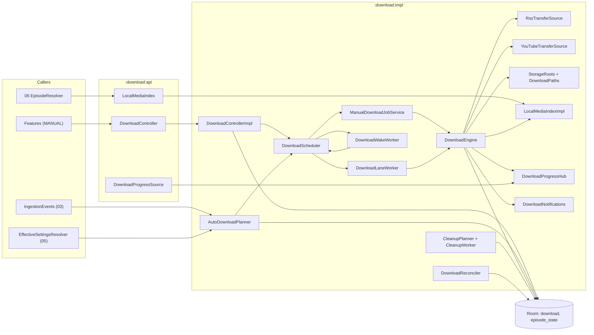
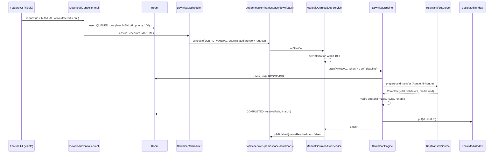
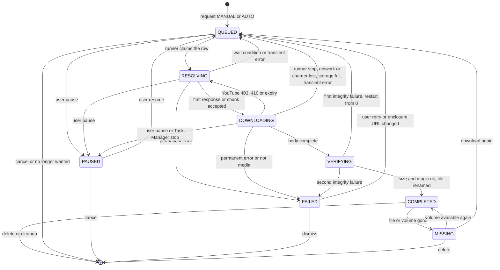
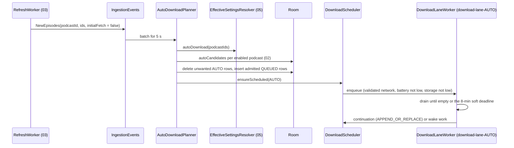

# 07 — Downloads

> Status: Draft v1, 2026-10-04 · Implements: R4.2, R4.3 (local files), R4.4, R4.5, R4.6, R3.6, R2.6 (download all), R2.7 (auto-download defaults), R1.8 (download exclusion), R5.3 (episode art of downloads) / N1, N2, N3, N6, N7 · Milestones: M0, M6, M8, M9, M11, M15 · Honours: D15, D17, D45, D46, D47, D48, D49, D50, D66, D67; PO-12 default · Owns: `:download:api` and `:download:impl` — the download engine and its state machine, runner selection (UIDT job, WorkManager lanes, `dataSync`), HTTP transfer rules, YouTube transfer mechanics, storage roots, naming and integrity, live progress and download notifications, auto-download planning, cleanup and quota, reconciliation and lifecycle, moving downloads between roots, download manifest entries

Contents: [Scope](#scope) · [Engine architecture](#engine-architecture) · [State machine](#state-machine) · [Runners and scheduling](#runners-and-scheduling) · [Transfer core](#transfer-core) · [YouTube transfers](#youtube-transfers) · [Storage layout](#storage-layout) · [Progress and notifications](#progress-and-notifications) · [Auto-download policy](#auto-download-policy) · [Cleanup and quota](#cleanup-and-quota) · [Lifecycle and reconciliation](#lifecycle-and-reconciliation) · [Backup exclusion](#backup-exclusion) · [Settings](#settings) · [Testing](#testing) · [Manifest and Play declaration](#manifest-and-play-declaration) · [Error handling and failure modes](#error-handling-and-failure-modes) · [Delivery by milestone](#delivery-by-milestone) · [Open questions](#open-questions) · [Sources](#sources)

---

## Scope

Serves R4.2–R4.6, R3.6, N1, N2, N6. Delivered in [M6](../PLAN.md#m6-downloads) (engine, runners, RSS transfers, storage, auto-download, cleanup, reconciliation) and [M9](../PLAN.md#m9-youtube-playback-and-downloads-in-foss) (YouTube transfers in `foss`), with API stubs in M0 and the YouTube rejection rule in M8 ([Delivery by milestone](#delivery-by-milestone)).

Neutrodyne downloads episodes with its **own small engine on OkHttp** that writes real, user-copyable audio files ([D46](../PLAN.md#3-key-decisions)). The `download` row in Room is the only record of download state; there is no Media3 `DownloadManager`, no system `DownloadManager` and no `WorkInfo`-based progress. Two **lanes** partition the queue: `MANUAL` (the user asked) and `AUTO` (a policy asked). The runner that drains a lane depends on the lane and the API level ([D47](../PLAN.md#3-key-decisions)): a user-initiated data transfer (UIDT) job on API 34+ for `MANUAL`, WorkManager expedited work (promoted to a `dataSync` foreground service only when started while the app is visible) on API 26–33 for `MANUAL`, and a regular WorkManager worker with an 8-minute soft deadline for `AUTO` everywhere. Files live in app-specific storage ([D48](../PLAN.md#3-key-decisions)) in one layout for RSS and YouTube ([D49](../PLAN.md#3-key-decisions)). Live byte counts never touch the database between state transitions ([D17](../PLAN.md#3-key-decisions)), and resolved stream or CDN URLs never touch it at all ([D50](../PLAN.md#3-key-decisions)).

### Responsibilities and boundaries

| This document owns | Owned elsewhere (link, do not restate) |
|---|---|
| `:download:api` (`DownloadController`, `LocalMediaIndex`, `DownloadProgressSource`) and `:download:impl` | `download` entity, DAO SQL, indices — [02 download](02-data-model.md#download), [02 Downloads](02-data-model.md#downloads) |
| State machine, `waitReason` meanings and their UI strings, transition persistence rules | Downloads screen layout, row visuals, dialogs — [08 Screens](08-ui-ux.md#screens), [08 Components](08-ui-ux.md#components) |
| Runner selection, JobScheduler and WorkManager requests, soft deadlines, stop reasons | Merged manifest and the DOWNLOAD `OkHttpClient` — [01 Manifest and permissions](01-foundation.md#manifest-and-permissions), [01 One client family](01-foundation.md#one-client-family) |
| HTTP transfer rules, sniffing, retries, integrity, rename | How playback resolves `neutrodyne://episode/{id}` to a local file — [06 Media items and URI resolution](06-playback.md#media-items-and-uri-resolution) |
| YouTube transfer mechanics (chunking, re-resolve loop, pacing) | YouTube resolution, `ResolvedUrlCache`, breaker, the YouTube download rules — [04 Download integration](04-youtube.md#download-integration), [04 Error handling and circuit breaker](04-youtube.md#error-handling-and-circuit-breaker) |
| Storage roots, file naming, free-space checks, `LocalMediaIndex` | Effective auto-download policy merge (D45) — [05 Effective settings resolution](05-groups-opml-backup.md#effective-settings-resolution) |
| `AutoDownloadPlanner`, `CleanupPlanner`, quota, tombstone writes | Which episodes "Download all unplayed" offers and its confirmation — [05 Group actions](05-groups-opml-backup.md#group-actions) |
| Reconciliation, Task Manager stops, reboot, update, uninstall, moving roots | Auto Backup XML — [05 Auto Backup](05-groups-opml-backup.md#auto-backup) (07 only states what must stay out) |
| Download notifications (`downloads`, `download_errors`), `DownloadActionReceiver` | `EpisodeLiveStateSource` implementation — [08 Live row state](08-ui-ux.md#live-row-state) (07 supplies inputs) |
| `downloads.*` settings keys | Artwork pinning internals — [08 Artwork pipeline](08-ui-ux.md#artwork-pipeline) (07 calls `ArtworkStore.pin`) |

### Modules and public API

| Module | Package | Contents |
|---|---|---|
| `:download:api` (JVM, Unlicense) | `app.neutrodyne.download.api` | `DownloadController`, `LocalMediaIndex`, `DownloadProgressSource` and the data types below; depends on `:core:{model, common}` only ([01 Dependency rules](01-foundation.md#dependency-rules)) |
| `:download:impl` (Android) | `app.neutrodyne.download.impl` | `DownloadControllerImpl`, `DownloadEngine`, `DownloadScheduler`, `ManualDownloadJobService`, `DownloadLaneWorker`, `DownloadWakeWorker`, `RssTransferSource`, `YouTubeTransferSource`, `StorageRoots`, `DownloadPaths`, `MediaSniffer`, `LocalMediaIndexImpl`, `DownloadProgressHub`, `AutoDownloadPlanner`, `CleanupPlanner`, `CleanupWorker`, `DownloadReconciler`, `DownloadReconcileWorker`, `DownloadMoveWorker`, `DeferredDeletes`, `DownloadNotifications`, `DownloadActionReceiver`, `DownloadDiagnostics` |
| `:core:model` | `app.neutrodyne.core.model` | Canonical enums `DownloadState`, `DownloadLane`, `WaitReason`, `DownloadError`, `SourceKind`, `NetworkPolicy`, `DeleteAfter`; new `ManualMeteredPolicy`; `DownloadSettingKeys` (package `…core.model.settings`) |

```kotlin
// :download:api — canonical members kept; additions marked "+"
interface DownloadController {
    suspend fun request(episodeIds: List<Long>, trigger: DownloadLane, allowMetered: Boolean?): RequestResult
    suspend fun pause(episodeIds: Collection<Long>)
    suspend fun resume(episodeIds: Collection<Long>)
    suspend fun cancel(episodeIds: Collection<Long>)                    // user: drops row and .part, writes tombstone
    suspend fun retry(episodeIds: Collection<Long>)
    suspend fun promote(episodeId: Long): RequestResult                 // "Download now": AUTO → MANUAL, priority 200
    suspend fun delete(episodeIds: Collection<Long>, byUser: Boolean)   // any state; tombstone only when byUser
    suspend fun setAllowMetered(episodeIds: Collection<Long>, allowed: Boolean)  // + "Use mobile data"
    suspend fun pauseAll()                                              // +
    suspend fun resumeAll()                                             // +
    suspend fun reportFileMissing(episodeId: Long)                      // + called by 06 on FILE_NOT_FOUND
    fun observe(episodeId: Long): Flow<DownloadStatus?>                 // row merged with live progress
    fun observeAll(): Flow<DownloadsOverview>                           // Downloads screen
    fun observeStorage(): Flow<StorageUsage>
    suspend fun storageRoots(): List<StorageRootInfo>                   // +
    suspend fun changeRoot(rootId: String, moveExisting: Boolean)       // + settings, enqueues download-move
    suspend fun deleteOrphanFiles(): Long                               // + bytes freed
}
fun interface LocalMediaIndex { fun localUriOrNull(episodeId: Long): String? }   // canonical, synchronous
interface DownloadProgressSource { fun observe(ids: Set<Long>): Flow<Map<Long, LiveProgress>> }  // ≤ 4 Hz
```

```kotlin
// :download:api — data types (all immutable, JVM-only)
sealed interface RequestResult {
    data class Queued(val queued: Int, val alreadyPresent: Int, val rejected: Map<Long, RejectReason>,
                      val askNotificationPermission: Boolean) : RequestResult
    data class NeedsMeteredDecision(val count: Int, val knownBytes: Long, val unknownSizeCount: Int) : RequestResult
}
enum class RejectReason { EPISODE_GONE, NOT_DOWNLOADABLE, UNSUPPORTED_STREAM, YOUTUBE_NOT_SUPPORTED, UNAVAILABLE }
data class LiveProgress(val state: DownloadState, val downloadedBytes: Long, val totalBytes: Long?,
                        val bytesPerSecond: Long?)
data class DownloadStatus(
    val episodeId: Long, val lane: DownloadLane, val state: DownloadState, val waitReason: WaitReason,
    val downloadedBytes: Long, val totalBytes: Long?, val estimatedBytes: Long?, val bytesPerSecond: Long?,
    val nextAttemptAt: Long?, val lastError: DownloadError?, val lastHttpStatus: Int?,
    val allowMetered: Boolean, val requireCharging: Boolean, val sourceKind: SourceKind, val completedAt: Long?)
data class DownloadEntry(val status: DownloadStatus, val podcastId: Long, val podcastTitle: String,
                         val episodeTitle: String, val artwork: ArtworkRef, val sortDate: Long,
                         val played: Boolean, val favorite: Boolean)
data class DownloadsOverview(val inProgress: List<DownloadEntry>, val completed: List<DownloadEntry>,
                             val failed: List<DownloadEntry>, val storage: StorageUsage, val notices: Set<DownloadNotice>)
data class StorageUsage(val rootId: String, val usedBytes: Long, val partialBytes: Long, val orphanBytes: Long,
                        val freeBytes: Long?, val capBytes: Long?, val autoBlockedByCap: Boolean)
data class StorageRootInfo(val rootId: String, val kind: RootKind, val label: String?, val freeBytes: Long?,
                           val available: Boolean)
enum class RootKind { PRIMARY_EXTERNAL, REMOVABLE, INTERNAL }
enum class DownloadNotice { DATA_SAVER, BACKGROUND_RESTRICTED, NOTIFICATIONS_OFF, CAP_REACHED, STORAGE_LOW,
                            ROOT_UNAVAILABLE, YOUTUBE_PAUSED, MOVE_IN_PROGRESS, ORPHAN_FILES }
```

Callers: features (`:feature:downloads`, `:feature:episode`, `:feature:podcast`, `:feature:feeds`) call `DownloadController` with `trigger = MANUAL` only; `AUTO` is used by `AutoDownloadPlanner` inside `:download:impl`. 03's unsubscribe and merge, and 06's error recovery, inject `Optional<DownloadController>` (absent before M6). `DownloadController`, `LocalMediaIndex` and `DownloadProgressSource` are `@Singleton` bindings in `:download:impl` ([01 Dependency injection](01-foundation.md#dependency-injection)).

### Threading and coroutines

| Component | Runs on | Rules |
|---|---|---|
| `DownloadControllerImpl` | caller's coroutine; main-safe | DAO calls on Room's query context; scheduling on `@Dispatcher(IO)`; never blocks the caller beyond one write transaction per call |
| `DownloadEngine.drain(...)` | the runner's coroutine (UIDT service scope or `CoroutineWorker.doWork`) | transfers are **children** of the runner, so stopping a runner cancels exactly its transfers; shared state (slots, active registry, progress) is thread-safe |
| One transfer | `@Dispatcher(IO)` | `executeAsync()` from `okhttp-coroutines` (cancellation cancels the `Call`); body reads in `runInterruptible`; 256 KiB buffer; `ensureActive()` per buffer |
| State writes on stop | `withContext(NonCancellable)` in `finally` | at most one write transaction; never network or file I/O inside it |
| `LocalMediaIndexImpl` | any thread, including Media3's loader thread and the main thread | `ConcurrentHashMap`; on the main thread it never blocks; elsewhere it waits ≤ 2 s for the initial load |
| `DownloadProgressHub` | ticker on `@Dispatcher(Default)` | publishes a snapshot every 250 ms while any transfer is active, idle otherwise |
| `AutoDownloadPlanner`, `CleanupPlanner`, `DownloadReconciler` | `@ApplicationScope` or the calling worker | each guarded by its own `Mutex` (single flight) |
| `ManualDownloadJobService` callbacks | main thread | return within milliseconds (Android 14 ANR rule); work runs in a service scope (`SupervisorJob() + Default`) |
| `DownloadActionReceiver` | `goAsync()` + `@ApplicationScope` | `finish()` within 10 s ([01 Coroutines and threading](01-foundation.md#coroutines-and-threading)) |
| Time | `Clock` | deadlines, in-runner waits and speed use `Clock.elapsedRealtime()`; persisted `nextAttemptAt`, `requestedAt`, `completedAt` use `Clock.now()` |

**Single-process assumption.** Engine, runners, receivers and planners run in the main process (the WorkManager and JobScheduler default; `:acra` runs none of them). In-memory registries (active transfers, lane phases, `LocalMediaIndex`, deferred deletes) are therefore authoritative for the life of the process, and everything persistent is re-derived from the database at the next process start ([Lifecycle and reconciliation](#lifecycle-and-reconciliation)).

### New names introduced here

| Name | Kind / location | Purpose |
|---|---|---|
| `RequestResult`, `RejectReason`, `DownloadStatus`, `DownloadEntry`, `DownloadsOverview`, `StorageUsage`, `StorageRootInfo`, `RootKind`, `DownloadNotice`, `LiveProgress` | data types, `:download:api` | Public API shapes |
| `ManualMeteredPolicy { ASK, ALWAYS, NEVER }` | enum, `:core:model` | `downloads.manual_metered` |
| `DownloadSettingKeys` | object, `:core:model` (`…core.model.settings`) | The `downloads.*` keys of [Settings](#settings) |
| `DownloadControllerImpl`, `LocalMediaIndexImpl`, `DownloadProgressHub`, `DownloadPaths`, `MediaSniffer`, `ContentRange`, `DeferredDeletes`, `LaneRegistry`, `DownloadSlots`, `ActiveTransfers`, `StopIntent`, `TransferSource`, `TransferPlan`, `TransferResult`, `YouTubeAutoPacer`, `ChargingMonitor`, `AppVisibility`, `ExitReasonProbe`, `JobSchedulerFacade`, `DownloadDiagnostics`, `DownloadInitializers` | classes, `:download:impl` (internal) | Engine internals |
| `DownloadWakeWorker`; unique work `download-wake-MANUAL`, `download-wake-AUTO` (one-time, policy `REPLACE`, tag `download`) | worker and work names, `:download:impl` | Delayed or condition-bound re-arming of a lane ([Wake work](#wake-work)) |
| `NOTIF_ID_DOWNLOAD_ERRORS = 2002`, `NOTIF_ID_STORAGE_FULL = 2003`, `NOTIF_ID_DOWNLOADS_WAITING = 2004` | notification IDs (range 2000–2999) | Error summary, storage full, "open the app to continue" |
| Actions `app.neutrodyne.download.action.PAUSE_ALL`, `…RETRY_FAILED`, `…DISMISS_ERRORS` | explicit intents to `DownloadActionReceiver` | Notification actions |
| `STOP_PROCESS_DEATH = -1`, `STOP_SOFT_DEADLINE = -2`, `STOP_USER_PAUSE = -3`, `STOP_USER_TASK_MANAGER = -4` | `download.lastStopReason` values below 0 (≥ 0 are platform `STOP_REASON_*`) | Diagnostics and the torn-tail rule |
| `DownloadDao.observeEntries()`, `observePlayedCompletedIds()`, `queuedNeeds(lane, now)`, `markWait(ids, reason, nextAttemptAt)`, `clearStorageWaits()`, `requeueChangedEnclosures(now)`, `rowsOnOtherRoots(target, limit)`, `pathsByRoot()`; `EpisodeDao.downloadSources(ids)`; `PlaySessionDao.observeCurrentEpisodeId()` | DAO functions requested from 02 | SQL owned by 02 ([Open questions](#open-questions)) |

---

## Engine architecture

Serves R4.2, R4.6, N1, N2. Delivered in M6 (RSS), M9 (YouTube). Honours [D46](../PLAN.md#3-key-decisions), [D17](../PLAN.md#3-key-decisions).



| Component | Responsibility |
|---|---|
| `DownloadControllerImpl` | Validates requests, inserts and updates rows, applies the metered rule, translates user actions into DB updates or `StopIntent`s, calls `DownloadScheduler.ensureScheduled(lane)` |
| `DownloadScheduler` | Chooses and arms the runner for a lane ([Runners and scheduling](#runners-and-scheduling)); owns `LaneRegistry` and the per-lane `Mutex` |
| `DownloadEngine` | `drain(request)`: claims rows, admits them against `DownloadSlots`, runs transfers through a `TransferSource`, verifies and finalises files, writes transitions, feeds `DownloadProgressHub` |
| `RssTransferSource`, `YouTubeTransferSource` | One attempt of one row: prepare (source refresh, invariants) and transfer (bytes into the `.part`) ([Transfer core](#transfer-core), [YouTube transfers](#youtube-transfers)) |
| `DownloadSlots` | Global `Semaphore(3)`, per-host `Semaphore(2)` keyed by the enclosure URL's host, YouTube `Semaphore(1)`; `AUTO` may hold at most 2 global slots so one slot is always free for `MANUAL` |
| `ActiveTransfers` | `episodeId → (Job, lane, runnerToken, AtomicReference<StopIntent?>)`; the cancel registry |
| `StorageRoots`, `DownloadPaths` | Root resolution, naming, free-space checks ([Storage layout](#storage-layout)) |
| `LocalMediaIndexImpl` | In-memory mirror `episodeId → finalUri` of `COMPLETED` rows for 06 |
| `DownloadProgressHub` | `DownloadProgressSource` implementation and notification feed |
| `AutoDownloadPlanner`, `CleanupPlanner` | Policy-driven inserts and deletions ([Auto-download policy](#auto-download-policy), [Cleanup and quota](#cleanup-and-quota)) |
| `DownloadReconciler` | Start-up and daily repair ([Lifecycle and reconciliation](#lifecycle-and-reconciliation)) |
| `DownloadNotifications` | Channels, aggregated progress, error and storage notifications |

### Claiming and slots

Every runner claims through one critical section so that two runners (the UIDT job draining `MANUAL` and the `AUTO` worker) never take the same row and never overshoot a slot limit:

```kotlin
// DownloadEngine (sketch)
private val claimMutex = Mutex()
private suspend fun claimOne(lanes: List<DownloadLane>, token: String, c: Conditions): DownloadEntity? =
    claimMutex.withLock {
        val skipped = mutableListOf<Long>()
        val row = dao.claimNext(lanes, c.now, c.unmetered, c.charging, c.youtubeAllowed, token) { r ->
            slots.canStart(r).also { ok -> if (!ok) skipped += r.episodeId }   // host, YouTube, AUTO cap, pacing
        }
        row?.let { slots.acquire(it) }
        if (skipped.isNotEmpty()) dao.markWait(skipped, WaitReason.SLOT, null)   // writes only rows not already SLOT
        row
    }
```

`claimNext` is 02's transaction (candidates ordered `priority DESC, requestedAt ASC, episodeId ASC`, then `claim` sets `RESOLVING`, `waitReason = NONE`, `runnerToken`; [02 Downloads](02-data-model.md#downloads)). `Conditions` comes from `NetworkMonitor.status` (`unmetered = isConnected && !isMetered`), `ChargingMonitor.isCharging`, and `youtubeAllowed = YouTubeCapabilities.downloads && YouTubeHealth.extractionGate(now) !is Deny`. Slots are released in the transfer's `finally`. `pause`, `cancel` and `delete` of queued rows also take `claimMutex`, so a row is never paused in the database while a runner is claiming it.

### Drain loop

`suspend fun drain(req: DrainRequest): DrainOutcome` where `DrainRequest(lanes, runnerToken, softDeadlineElapsed: Long?, reporter)`:

1. Once per process: `DownloadReconciler.resetOrphanedRunners()` (cheap, idempotent; [Lifecycle and reconciliation](#lifecycle-and-reconciliation)) and `CredentialLookup.awaitLoaded()` (requested from 01/03, so a private enclosure is never fetched before its Basic-auth credential is in memory).
2. Register the token in `LaneRegistry` (phase `ACTIVE`).
3. Loop:
   1. If `softDeadlineElapsed` has passed: stop accepting, set `StopIntent.Requeue(SYSTEM, STOP_SOFT_DEADLINE)` on every own transfer, await them, return `DeadlineReached`.
   2. While a global slot is free: `claimOne(...)`; for each row launch a child coroutine running [the transfer lifecycle](#transfer-lifecycle).
   3. If nothing is active and nothing was claimed: enter the [exit protocol](#lane-registry-and-the-exit-protocol); return `Empty`, `Waiting(earliest)` or `Blocked(reason)`.
   4. Otherwise suspend until one of: a transfer ended; `wake(lane)` was signalled (new request, resume, freed slot, network or charging change, freed storage); the soft deadline; the earliest due `nextAttemptAt` within the next 60 s.
4. `finally`: unregister the token.

The engine also collects `NetworkMonitor.status` and `ChargingMonitor` while any transfer is active: on "metered", transfers whose row has `allowMetered = false` get `StopIntent.Requeue(UNMETERED_NETWORK)`; on "disconnected", every transfer gets `Requeue(NETWORK)` (no attempt is counted); on "unplugged", `AUTO` transfers with `requireCharging` get `Requeue(CHARGING)`.

### Transfer lifecycle

```kotlin
// one child coroutine per claimed row (sketch)
suspend fun runTransfer(row: DownloadEntity, source: TransferSource) {
    val active = activeTransfers.register(row, coroutineContext.job)
    var end: TransferEnd = TransferEnd.Unknown
    try {
        end = withInRunnerRetries(row) { attemptOnce(row, source) }   // prepare → DOWNLOADING → transfer → verify
    } catch (c: CancellationException) {
        end = TransferEnd.Stopped(active.intent.get() ?: StopIntent.RunnerStopped(runnerStopReason()))
        throw c
    } finally {
        withContext(NonCancellable) { finish(row, end); activeTransfers.remove(row.episodeId); slots.release(row) }
    }
}
```

`StopIntent` is `Pause`, `Cancel(tombstone)`, `Delete(byUser)`, `Requeue(waitReason, stopReason)` or `RunnerStopped(platformStopReason)`. `finish` maps the end to exactly one persisted transition ([State machine](#state-machine)).

### Persisted transitions

The `download` table is low-churn: paged feeds join it ([D16](../PLAN.md#3-key-decisions)). The engine writes only these transitions; byte progress lives in `DownloadProgressHub`, and the `.part` length is the authoritative resume offset.

| Transition | Columns written (besides `state`) |
|---|---|
| insert `QUEUED` | everything known at request time ([Requests](#requests)) |
| `QUEUED → RESOLVING` (claim) | `waitReason = NONE`, `runnerToken` |
| `RESOLVING → DOWNLOADING` (first accepted response or chunk) | `totalBytes`, `etag`, `lastModified`, `mimeType`, `resolvedItag`, `sourceRef` (if refreshed), `rootId`/`tempPath` (if reassigned), `downloadedBytes = offset` |
| `→ COMPLETED` | `relativePath`, `finalUri`, `totalBytes`, `downloadedBytes`, `completedAt`, `tempPath = NULL`, `runnerToken = NULL`, `lastError = NULL`, `attempt = 0` |
| `→ QUEUED(waitReason)`, `→ PAUSED`, `→ FAILED` | `waitReason`, `nextAttemptAt`, `attempt`, `integrityFailures`, `lastError`, `lastHttpStatus`, `lastStopReason`, `downloadedBytes = .part length`, `runnerToken = NULL` |
| `COMPLETED ↔ MISSING` | `lastError` (`STORAGE_UNAVAILABLE` or `NULL`) |

Not persisted in v1 (in-memory sub-states visible through `LiveProgress.state`): `VERIFYING` (a same-volume rename takes milliseconds; a crash there is recovered by the [completed-file adoption](#transfer-lifecycle-recovery) rule) and the YouTube `DOWNLOADING → RESOLVING → DOWNLOADING` re-resolve loop. `VERIFYING` becomes persisted when verification includes a copy (SAF roots, v1.x). Waiting rows' `waitReason`/`nextAttemptAt` updates are written only when the value changes.

#### Transfer lifecycle recovery

At `RESOLVING`, before any network request: if the row has no usable `.part` but the deterministic final file for this row exists on its root and its length equals the stored `totalBytes`, the engine skips straight to verification and completes the row (a process death between rename and the `COMPLETED` write). If the row's `lastStopReason == STOP_PROCESS_DEATH`, the `.part` is truncated by `min(64 KiB, length)` before resuming, which drops a possibly torn tail (Unverified necessity on ext4/f2fs; cheap insurance).

### Requests

`request(episodeIds, trigger, allowMetered)`:

1. Load `EpisodeDao.downloadSources(ids)` (chunks of 500): episode, podcast and first audio alternate enclosure.
2. Per episode, reject with a `RejectReason`: row gone → `EPISODE_GONE`; no enclosure and no YouTube video ID → `NOT_DOWNLOADABLE`; effective type `application/x-mpegurl` or a `.m3u8` path ([03 Enclosure types](03-feeds-and-discovery.md#enclosure-types-and-media-acceptance)) → `UNSUPPORTED_STREAM`; YouTube while `!YouTubeCapabilities.downloads` (`play`, and `foss` before M9) → `YOUTUBE_NOT_SUPPORTED`; `availability != AVAILABLE` → `UNAVAILABLE`.
3. Metered rule for `MANUAL` with `allowMetered == null`: `downloads.manual_metered` `ALWAYS` → `true`; `NEVER` → `false`; `ASK` → if the network is connected and metered, return `NeedsMeteredDecision(count, knownBytes, unknownSizeCount)` **without writing anything**; otherwise `false` (the row waits for Wi-Fi if the network changes and offers "Use mobile data"). 08's dialog answers with `request(ids, MANUAL, true)` ("Download now"), `request(ids, MANUAL, false)` ("Wait for Wi-Fi"), or sets `ALWAYS` and retries ("Always use mobile data").
4. Existing rows: `COMPLETED` → `alreadyPresent`; in flight or `QUEUED` → for `MANUAL` over an `AUTO` row: `lane = MANUAL`, `priority = max(priority, 100)`, `requireCharging = false`, `allowMetered` per step 3; `PAUSED` → resume; `FAILED` → retry semantics; `MISSING` → back to `QUEUED` (file fields cleared).
5. New rows in one write transaction: `lane = trigger`, `priority` (`MANUAL` 100, `AUTO` 0), `requestedAt = now + index` (keeps the caller's order, e.g. newest first for "Download all"), `sourceKind`, `sourceRef` (enclosure URL — the first audio alternate for `isVideo` episodes, same rule as 06's streaming; YouTube video ID), `formatPref` (YouTube: `youtube.audio_quality` name; RSS: null), `rootId = downloads.root_id`, `allowMetered`, `requireCharging` (`AUTO`: from policy), `estimatedBytes` ([Estimates](#estimates)).
6. `MANUAL` requests clear the episode's tombstone (`EpisodeStateDao.clearDismissed`): the user changed their mind ([R4.4](../PLAN.md#21-functional-requirements)).
7. `ensureScheduled(trigger)`; return `Queued(…, askNotificationPermission)` where the flag is true when API ≥ 33, `POST_NOTIFICATIONS` is not granted and `downloads.notification_prompted` is false (08 shows the contextual prompt and sets the flag; [01 Platform compliance](01-foundation.md#platform-compliance) P22).

#### Estimates

`estimatedBytes` = `enclosureLength` when ≥ 100 KB (smaller values are bogus placeholders, never used for integrity); else `durationMs × 16 000` (128 kbit/s) when a duration is known; else `null`. The free-space check then falls back to 150 MB ([Free space](#free-space-and-allocation)). 05's "Download all" confirmation uses the same rule.

### Other controller operations

| Call | Effect |
|---|---|
| `pause(ids)` | Under `claimMutex`: `QUEUED → PAUSED` in the DB; in-flight rows get `StopIntent.Pause` (→ `PAUSED`, `lastStopReason = STOP_USER_PAUSE`). `PAUSED` rows never resume by themselves |
| `resume(ids)` | `PAUSED` and `QUEUED(NEEDS_FOREGROUND)` → `QUEUED(NONE)`, `nextAttemptAt = NULL`; `ensureScheduled` (from visible UI, so `MANUAL` gets a UIDT job) |
| `retry(ids)` | `FAILED` → `QUEUED(NONE)` with `attempt = 0`, `integrityFailures = 0`, `lastError = NULL`; `QUEUED(BACKOFF)` → `nextAttemptAt = NULL` ("Retry now") |
| `promote(id)` | An `AUTO` row becomes `MANUAL` with `priority = 200`, `requireCharging = false`, metered rule of step 3 (may return `NeedsMeteredDecision`); a `PAUSED` row is also resumed. An `AUTO` row already in flight keeps transferring; if its runner stops, the UIDT job resumes it |
| `cancel(ids)` | Non-`COMPLETED` rows: in-flight → `StopIntent.Cancel(tombstone = true)`; otherwise delete row and `.part`; tombstone (`downloadDismissedAt = now`) in the same transaction. `COMPLETED` rows are untouched (use `delete`) |
| `delete(ids, byUser)` | [Deleting a download](#deleting-a-download) |
| `setAllowMetered(ids, allowed)` | Updates `allowMetered` of non-`COMPLETED` rows; `ensureScheduled` |
| `pauseAll()`, `resumeAll()` | All lanes; `pauseAll` is also the notification action |
| `reportFileMissing(id)` | Re-checks the file: gone → `MISSING`, index entry removed; present → no-op |

### Deleting a download

`delete(ids, byUser)` for each row, in this order:

1. In flight → `StopIntent.Delete(byUser)` and wait for the transfer's `finally`.
2. `LocalMediaIndex.remove(id)` (before the row disappears, so 06 never resolves a file that is about to vanish).
3. One write transaction: delete the `download` row; if `byUser`, `EpisodeStateDao.ensure` + `setDismissed(id, now)` (tombstone, [02 User-state writes](02-data-model.md#user-state-writes)).
4. `ArtworkStore.unpin(episodeArtworkKey, PinReason.DOWNLOAD, ownerId = id)` if it was pinned.
5. Delete the `.part` and the final file — unless the episode is `play_session.currentEpisodeId` or its root is unavailable, in which case the file goes to `DeferredDeletes` ([Deferral while playing](#deferral-while-playing)).

`byUser = true`: Downloads screen, episode and podcast actions, bulk delete, `cancel`. `byUser = false`: cleanup, unsubscribe and merge (03), policy changes. Tombstones are written only for user deletions so that automatic cleanup never blocks a later automatic download ([R4.4](../PLAN.md#21-functional-requirements)).



---
## State machine

Serves R4.2, R4.6, N1. Delivered in M6. The persisted states are the canonical `DownloadState`; `waitReason` refines `QUEUED`; `lastError` explains `FAILED` (and informs `QUEUED(BACKOFF)` and `MISSING`).



### Transitions

| From → to | Trigger | Notes |
|---|---|---|
| — → `QUEUED` | `request` (UI, "Download all", re-download offer of 05) or `AutoDownloadPlanner` | [Requests](#requests) |
| `QUEUED → RESOLVING` | `claimNext` by a runner | only rows with `nextAttemptAt ≤ now` whose network and charging needs are met |
| `RESOLVING → QUEUED` | storage short, root unavailable, YouTube gate or pacing, offline, transient error | `waitReason` per [Wait reasons](#wait-reasons); gates and pacing do not count as an attempt |
| `RESOLVING → DOWNLOADING` | first accepted 200/206 (RSS) or first chunk (YouTube) | persisted with validators |
| `DOWNLOADING → VERIFYING` | end of body (RSS) or offset == `clen` (YouTube) | in memory in v1 |
| `DOWNLOADING → RESOLVING` | YouTube 403/410, URL within 10 min of expiry | in memory; ≤ 2 re-resolutions per attempt ([YouTube transfers](#youtube-transfers)) |
| `DOWNLOADING → QUEUED` | runner stop (`onStopJob`, worker stopped, soft deadline, process death via reconcile), network/charger loss, ENOSPC, transient error after in-runner retries | `.part` kept; `downloadedBytes` = `.part` length |
| `* → FAILED` | permanent HTTP status, `NOT_MEDIA` on a validated network, second integrity failure, YouTube `Unavailable`, `attempt` reaching 8 | user can retry or dismiss |
| `VERIFYING → QUEUED` | size or magic mismatch, `integrityFailures` becomes 1 | `.part` deleted, restart from 0 immediately |
| `QUEUED/RESOLVING/DOWNLOADING → PAUSED` | user pause, `pauseAll`, Task Manager stop detected at the next start | never resumed automatically |
| `PAUSED → QUEUED` | `resume`, `resumeAll`, `request` of a paused row | `ensureScheduled` |
| `FAILED → QUEUED` | `retry`; `requeueChangedEnclosures` after a refresh changed the episode's enclosure URL | `attempt = 0` |
| `COMPLETED → MISSING` | reconcile finds the file gone or its root unavailable; 06 `reportFileMissing` | `LocalMediaIndex` entry removed |
| `MISSING → COMPLETED` | reconcile finds the root mounted again and the file intact | only for `lastError = STORAGE_UNAVAILABLE` |
| `MISSING → QUEUED` | user "Download again", planner still wants it | file fields cleared |
| row deleted | `delete`, `cancel`, cleanup, planner "no longer wanted", unsubscribe cascade | [Deleting a download](#deleting-a-download) |

**Cancellation is a transition, not a state**: the row and its `.part` disappear in one step (with a tombstone when the user cancelled).

### Wait reasons

UI strings are the English source strings (08 renders them, translators localise them). `{…}` are placeholders; relative times use `DateUtils`-style formatting in 08.

| `waitReason` | Meaning | Set when | Cleared when | Row text | Row action |
|---|---|---|---|---|---|
| `NONE` | Eligible, waiting for its turn | insert, resume, retry | claim | "Queued" | Pause · Cancel |
| `NETWORK` | No validated network | offline at claim; connection lost mid-transfer; job stopped for connectivity; HTML received on an unvalidated network | a runner claims it again | "Waiting for a network connection" | — |
| `UNMETERED_NETWORK` | Row may not use the current metered network | network is metered and `allowMetered = false` | unmetered network | "Waiting for Wi-Fi" | `MANUAL`: "Use mobile data" (`setAllowMetered`); `AUTO`: "Download now" (`promote`) |
| `CHARGING` | `AUTO` row requires a charger | not charging at claim or unplugged mid-transfer | charging | "Waiting for charger" | "Download now" |
| `STORAGE` | Not enough free space (`lastError = STORAGE_FULL`) or root unavailable (`STORAGE_UNAVAILABLE`) | free-space check failed, ENOSPC, root unmounted | space freed (delete, cleanup), root back, 30 min re-check | "Not enough storage" / "Storage not available" | "Manage storage" |
| `BACKOFF` | Waiting until `nextAttemptAt` | transient error, `Retry-After`, YouTube gate or pacing | `nextAttemptAt` passes, "Retry now" | "Retrying {in 4 min}" (≥ 1 h: "Retrying at {14:30}"); YouTube gate: "YouTube downloads paused until {18:00}" | "Retry now" |
| `SYSTEM` | Runner stopped by Android (quota, job stop, process death) | runner stop without user intent | a runner claims it again | "Paused by Android — continues automatically" | `MANUAL`: "Resume now"; `AUTO`: "Download now" |
| `NEEDS_FOREGROUND` | `MANUAL` row cannot progress in the background (UIDT not schedulable and background work restricted) | [Fallbacks](#fallbacks-and-mixed-networks) | app opened, `resume` | "Open Neutrodyne to continue" | "Resume" |
| `SLOT` | Eligible but its host or YouTube slot is busy | skipped by `DownloadSlots` during a claim | claim | "Waiting for another download from this site" / YouTube: "Waiting for the current YouTube download" | — |

Other states: `RESOLVING` "Preparing…"; `DOWNLOADING` "{12.3} MB of {48.0} MB · {1.2} MB/s" (total unknown: "{12.3} MB"); `VERIFYING` "Finishing…"; `PAUSED` "Paused"; `MISSING` "File missing" (`lastError = STORAGE_UNAVAILABLE`: "Storage not available — insert the SD card"); `COMPLETED` "{48.0} MB".

### Errors

`lastError` values (canonical `DownloadError`), their class and text. "Transient" means in-runner retries, then `QUEUED(BACKOFF)` until `attempt` reaches 8, then `FAILED` with the same error.

| `DownloadError` | Cause | Class | `FAILED` text |
|---|---|---|---|
| `HTTP_NOT_FOUND` | 404 | permanent (re-queued if the feed changes the enclosure URL) | "The episode file was not found on the server (404)" |
| `HTTP_GONE` | 410 | permanent (same) | "The publisher removed this file (410)" |
| `HTTP_AUTH` | 401; 403 after the final-URL fallback | permanent | "Access denied — check this feed's password" |
| `HTTP_CLIENT` | other 4xx, 416 that cannot be resolved, redirect loop | permanent | "The server refused the download ({status})" |
| `HTTP_SERVER` | 5xx, 408 | transient | "The server had a problem ({status})" |
| `HTTP_RATE_LIMITED` | 429 (RSS); YouTube 429 | transient | "The server is limiting downloads" |
| `NETWORK_IO` | `IOException` classified by 01's `NetErrorClassifier` (timeout, reset, DNS, TLS handshake) | transient; `Tls(UNTRUSTED_CERTIFICATE / CERTIFICATE_TRANSPARENCY)` and `LocalNetworkUnsupported` are permanent | "Network problem" / "The server's certificate is not trusted" / "Local-network addresses are not supported" |
| `NOT_MEDIA` | HTML, XML, JSON or `text/*` without a media signature; empty body | permanent on a validated network | "The server sent a web page instead of audio" |
| `SIZE_MISMATCH` | file length ≠ expected total, twice | permanent after the second | "The download was incomplete" |
| `STORAGE_FULL` | free-space check or ENOSPC | wait (`STORAGE`) | — |
| `STORAGE_UNAVAILABLE` | root unmounted, EROFS/EIO; `EFBIG` (FAT32 4 GB limit) is permanent | wait, or permanent for `EFBIG` | "This file is too large for the selected storage" |
| `YT_UNAVAILABLE` | `ResolveResult.Unavailable(reason)` | permanent | 04's reason string ([04 Content flags and filtering](04-youtube.md#content-flags-and-filtering)) |
| `YT_EXTRACTION` | `Transient(EXTRACTION)` | transient | "YouTube downloads are temporarily broken — update Neutrodyne" |
| `YT_FORBIDDEN` | googlevideo 403/410 after 2 re-resolutions | transient | "YouTube refused the download" |
| `UNSUPPORTED_STREAM` | HLS playlist received, unknown YouTube MIME, `Unsupported` | permanent | "This episode can only be streamed" |
| `CANCELLED_BY_SYSTEM` | informational on rows reset after a runner stop or process death | — (row is `QUEUED(SYSTEM)`) | — |
| `UNKNOWN` | defensive default when reconcile finds an inconsistent row | permanent | "Download failed" |

### Pause, cancel and Task Manager stops

- **User pause** is persistent: `PAUSED` rows are never claimed, never auto-resumed after a reboot or an app update, and are not removed by the planner (the user touched them).
- **Runner stops** (job stopped, quota, soft deadline, process death) are not user intent: rows return to `QUEUED(SYSTEM)` and resume automatically.
- **Task Manager stop** (API 34+ "Stop" on the UIDT entry): the platform kills the process without `onStopJob` and does not reschedule the job ([UIDT](https://developer.android.com/develop/background-work/background-tasks/uidt)). At the next start, `DownloadReconciler` reads `ActivityManager.getHistoricalProcessExitReasons()` (API 30+); if the latest exit after the rows' last update is a user stop, the `MANUAL` rows found in flight become `PAUSED` with `lastStopReason = STOP_USER_TASK_MANAGER` instead of `QUEUED(SYSTEM)`. Unverified: the exact `ApplicationExitInfo` reason a Task Manager stop records (`REASON_USER_REQUESTED`, and on API 35+ possibly `REASON_USER_STOPPED`); the M6 device checklist records it. A Settings "Force stop" is treated the same way.

---

## Runners and scheduling

Serves R4.2, N2. Delivered in M6. Honours [D47](../PLAN.md#3-key-decisions). Mitigates risks [T3](../PLAN.md#8-risks-and-mitigations) and [P2](../PLAN.md#8-risks-and-mitigations).

### Runner matrix

| Lane | API 34+ | API 31–33 | API 26–30 |
|---|---|---|---|
| `MANUAL` | **UIDT job** `JOB_ID_MANUAL = 1001` in namespace `downloads` (`ManualDownloadJobService`); fallback: `download-lane-MANUAL` | `download-lane-MANUAL`, expedited (`RUN_AS_NON_EXPEDITED_WORK_REQUEST`); `setForeground(dataSync)` when the app is visible at worker start, else runs as a plain job | same as 31–33; expedited work is itself run by WorkManager as a foreground service via `getForegroundInfo()` |
| `AUTO` | `download-lane-AUTO`: regular one-time work, never expedited, never foreground, 8-min soft deadline | same | same |
| Re-arming | `download-wake-MANUAL`, `download-wake-AUTO` ([Wake work](#wake-work)) | same | same |

Why: UIDT jobs are quota-exempt and recommended for user-started transfers but may only be scheduled while the app is visible and must not serve automatic features; Android 16 counts jobs running beside a foreground service (our playback) against the quota; Android 15 caps `dataSync` at 6 h per 24 h, which never applies because `dataSync` only runs on API ≤ 33 ([Platform constraints](#platform-constraints)).

### ensureScheduled

```kotlin
// DownloadScheduler (sketch)
suspend fun ensureScheduled(lane: DownloadLane) = laneMutex(lane).withLock {
    val needs = dao.queuedNeeds(lane, clock.now())        // counts, metered/charging needs, earliest due, remaining bytes
    if (needs.queued == 0) { cancelWake(lane); return@withLock }
    when (registry.phase(lane)) {
        Phase.ACTIVE -> { engine.wake(lane); return@withLock }        // the running drain loop rescans
        Phase.CLOSING -> { registry.requestReopen(lane); return@withLock }
        Phase.IDLE -> Unit
    }
    if (lane == MANUAL && sdk >= 34 && uidt.schedule(needs) == SCHEDULED) { cancelWake(lane); return@withLock }
    if (needs.runnableNow(conditions())) enqueueLaneWorker(lane)     // KEEP, or APPEND_OR_REPLACE (see below)
    armWake(lane, needs)                                             // rows not runnable now
    if (lane == MANUAL && sdk >= 34 && !visibility.isVisible() && backgroundLimited()) markNeedsForeground()
}
```

Callers: every controller write, the planner, `resumeAll`, the wake worker, the reconcile worker, runner exits, `NetworkMonitor` transitions to connected/unmetered, charger connected, storage freed, and app foreground (`ProcessLifecycleOwner` `ON_START`, registered by an initializer). `runnableNow` = some `QUEUED` row of the lane is due (`nextAttemptAt ≤ now`) and its network and charging needs are met by the current conditions. `backgroundLimited()` = `ActivityManager.isBackgroundRestricted()` (API 28) or standby bucket `RESTRICTED` (`UsageStatsManager.getAppStandbyBucket()`, API 28).

### Lane registry and the exit protocol

`LaneRegistry` tracks one `Phase` per lane (`IDLE`, `ACTIVE`, `CLOSING`) and whether a WorkManager runner of the lane has already started in this process. The exit protocol closes the race between "the queue is empty, finish" and "a row was just inserted":

1. The drain loop finds nothing to claim and nothing active → takes the lane mutex → re-checks `queuedNeeds.runnableNow`; if runnable, continue draining.
2. Otherwise phase = `CLOSING`, release the mutex, compute the outcome.
3. Take the mutex again: if `ensureScheduled` requested a reopen meanwhile → phase = `ACTIVE`, continue draining. Else, for UIDT: `jobFinished(params, false)` **inside** the mutex, then phase = `IDLE`; for a lane worker: phase = `IDLE`, arm the wake work, return `Result.success()`.

WorkManager cannot report synchronously that a returning worker is gone, so a `KEEP` enqueue right after step 3 could be swallowed by the still-`RUNNING` unique work. Therefore: the **first** enqueue of a lane in a process uses `ExistingWorkPolicy.KEEP` (canonical; it keeps a pending request from an earlier process), and every enqueue after a runner of that lane has started in this process uses `APPEND_OR_REPLACE` (canonical continuation semantics: it runs after the finishing worker, or starts a new chain if none exists). Lane workers are only enqueued when something is runnable now and carry only static constraints, so a pending lane request can never be stuck on stale constraints; everything conditional goes to the wake work.

**Never reschedule a running UIDT job**: `JobScheduler.schedule()` with the ID of a running job stops it ([JobScheduler](https://developer.android.com/reference/android/app/job/JobScheduler)). The registry's `ACTIVE`/`CLOSING` phases guard this; while the UIDT job is only pending (scheduled, constraints unmet), `schedule()` replaces it, which is how changed network needs reach a pending job.

### UIDT job (API 34+)

```kotlin
// JobSchedulerFacade.scheduleManual (sketch); JobScheduler = context.getSystemService(JobScheduler::class.java).forNamespace("downloads")
val network = NetworkRequest.Builder()
    .addCapability(NetworkCapabilities.NET_CAPABILITY_INTERNET)
    .addCapability(NetworkCapabilities.NET_CAPABILITY_VALIDATED)                // captive portals (Unverified: implicit)
    .apply { if (!needs.anyMeteredAllowed) addCapability(NetworkCapabilities.NET_CAPABILITY_NOT_METERED) }
    .build()
val info = JobInfo.Builder(JOB_ID_MANUAL, ComponentName(context, ManualDownloadJobService::class.java))
    .setUserInitiated(true)
    .setRequiredNetwork(network)
    .setEstimatedNetworkBytes(needs.remainingBytes, 0)
    .setPersisted(true)                                                          // RECEIVE_BOOT_COMPLETED
    .setBackoffCriteria(30_000, JobInfo.BACKOFF_POLICY_EXPONENTIAL)
    .build()
if (!js.canRunUserInitiatedJobs()) return NOT_ALLOWED
return if (js.schedule(info) == JobScheduler.RESULT_SUCCESS) SCHEDULED else FAILED   // RESULT_FAILURE when not visible
```

No storage-not-low constraint on the `MANUAL` job: the engine's own free-space check gives the user a precise "Not enough storage" with a "Manage storage" action instead of an opaque pending job.

```kotlin
@AndroidEntryPoint
class ManualDownloadJobService : JobService() {          // app.neutrodyne.download.impl — name stable forever
    @Inject lateinit var engine: DownloadEngine
    @Inject lateinit var notifications: DownloadNotifications
    @Inject lateinit var scheduler: DownloadScheduler
    private val scope = CoroutineScope(SupervisorJob() + Dispatchers.Default)
    private var current: JobParameters? = null             // strong ref: Android 16 abandoned-job stop reason

    override fun onStartJob(params: JobParameters): Boolean {
        current = params
        notifications.ensureChannels()
        setNotification(params, NOTIF_ID_MANUAL_DOWNLOAD, notifications.manualInitial(), JOB_END_NOTIFICATION_POLICY_REMOVE)
        scope.launch {
            engine.drain(DrainRequest(listOf(MANUAL), RunnerToken.uidt(), softDeadlineElapsed = null,
                                      reporter = UidtReporter(this@ManualDownloadJobService, params)))
            // jobFinished is called inside the exit protocol (lane mutex), then current = null
        }
        return true
    }
    override fun onStopJob(params: JobParameters): Boolean {
        engine.stopRunner(RunnerToken.uidt(), params.stopReason)      // rows → QUEUED(NETWORK or SYSTEM), or PAUSED
        scope.coroutineContext.cancelChildren()
        return params.stopReason != JobParameters.STOP_REASON_USER    // reschedule unless the user stopped it
    }
}
```

- `setNotification` is called synchronously in `onStartJob`, well inside the 10-second limit ([JobService](https://developer.android.com/reference/android/app/job/JobService)); `onStartJob`/`onStopJob` return immediately (Android 14 ANR rule).
- `UidtReporter` calls `updateEstimatedNetworkBytes(params, remaining, 0)` when the `MANUAL` queue changes and `updateTransferredNetworkBytes(params, transferredThisJob, 0)`, both at most once per second.
- Progress updates go through `NotificationManagerCompat.notify(NOTIF_ID_MANUAL_DOWNLOAD, …)`. Unverified: whether `notify` updates a job's notification or `setNotification` must be called again; M6 tests both on API 34 and 36 and keeps the one that works.
- `onStopJob` maps `STOP_REASON_CONSTRAINT_CONNECTIVITY` → `NETWORK`, `STOP_REASON_USER` → `PAUSED`, anything else → `SYSTEM`; the reason is stored in `lastStopReason`.
- **One job, many episodes**: the single job drains the database queue, giving one Task Manager entry and one notification. `JobScheduler.enqueue(JobWorkItem)` is not used (its interplay with UIDT and persisted jobs is unverified).

### Lane worker

```kotlin
@HiltWorker
class DownloadLaneWorker @AssistedInject constructor(@Assisted ctx: Context, @Assisted params: WorkerParameters,
    private val engine: DownloadEngine, private val notifications: DownloadNotifications,
    private val visibility: AppVisibility, private val clock: Clock) : CoroutineWorker(ctx, params) {

    override suspend fun doWork(): Result {
        val lane = DownloadLane.valueOf(inputData.getString(KEY_LANE)!!)
        val foreground = lane == MANUAL && Build.VERSION.SDK_INT < 34 && visibility.isVisible() &&
            suspendRunCatching { setForeground(notifications.manualForegroundInfo()) }.isSuccess  // FGS start may be denied 31–33
        val deadline = if (foreground) null else clock.elapsedRealtime() + 8.minutes.inWholeMilliseconds
        engine.drain(DrainRequest(listOf(lane), RunnerToken.worker(id), deadline, NotificationReporter(lane, foreground)))
        return Result.success()          // re-arming (continuation or wake work) happened in the exit protocol
    }
    override suspend fun getForegroundInfo() = notifications.manualForegroundInfo()   // expedited on API < 31
}
```

- `manualForegroundInfo()` = `ForegroundInfo(NOTIF_ID_MANUAL_DOWNLOAD, notification, FOREGROUND_SERVICE_TYPE_DATA_SYNC)` (the type argument only on API 29+).
- `AppVisibility.isVisible()` = `ProcessLifecycleOwner` at least `STARTED` (`lifecycle-process`, requested for `:download:impl` from 01).
- On `DrainOutcome.DeadlineReached`, the exit protocol enqueues the lane worker again with `APPEND_OR_REPLACE` (a continuation), so the system never times the worker out (frequent timeouts can push the app into the restricted bucket, [optimize battery](https://developer.android.com/develop/background-work/background-tasks/optimize-battery)).
- A worker stopped by WorkManager (quota, constraints, `STOP_REASON_*`) delivers `CancellationException` to the engine; its rows return to `QUEUED(SYSTEM)` with `lastStopReason = stopReason` (`ListenableWorker.getStopReason()`, WorkManager ≥ 2.9; Unverified exact version), and WorkManager reruns the work by itself.
- A `MANUAL` worker running with `setForeground` has no soft deadline (it is a long-running worker on API ≤ 33, where neither the Android 15 `dataSync` cap nor the Android 16 quota rule exists).

### Wake work

`download-wake-{lane}` (`DownloadWakeWorker`, one-time, policy `REPLACE`, tag `download`) re-arms a lane when rows wait for a time or a condition. Its `doWork()` only calls `ensureScheduled(lane)`; from the background, `MANUAL` on API 34+ then falls back to `download-lane-MANUAL` because UIDT scheduling fails while invisible.

`armWake(lane, needs)` over the waiting rows W (those not runnable now):

1. Network constraint = `CONNECTED` if any row in W allows metered, else `UNMETERED`; charging required only if every row in W requires it (`AUTO` also gets `setRequiresBatteryNotLow(true)`).
2. Covered rows = rows of W whose needs are guaranteed by those constraints. `initialDelay = max(0, min(nextAttemptAt of covered rows) − now)`; rows whose `nextAttemptAt` is null count as due.
3. Network constraint set with `Constraints.Builder.setRequiredNetworkRequest(request, NetworkType)` including `NET_CAPABILITY_VALIDATED` (API 28+; `NetworkType` fallback below, [Constraints.Builder](https://developer.android.com/reference/kotlin/androidx/work/Constraints.Builder)).
4. W empty → cancel the wake work.

Because the delay only considers rows whose needs the request already guarantees, a wake always finds at least one runnable row or rows whose `nextAttemptAt` moved (gates, storage re-check), so wakes never spin. Rows with stricter needs than the request (e.g. Wi-Fi-only rows when another row allows mobile data) are picked up by any later runner, by the in-process `NetworkMonitor` trigger, or by the next wake; the worst case while the process is dead is the covered rows' backoff (≤ 6 h).

### Work requests

| Unique name | Request | Constraints | Policy | Enqueued by |
|---|---|---|---|---|
| `download-lane-MANUAL` | one-time, `setExpedited(RUN_AS_NON_EXPEDITED_WORK_REQUEST)`, input `lane=MANUAL`, tag `download`, backoff exponential 30 s | validated network (`CONNECTED`); expedited work accepts only network and storage constraints | first enqueue in a process `KEEP`, then `APPEND_OR_REPLACE` | `ensureScheduled` on API < 34 or UIDT fallback |
| `download-lane-AUTO` | one-time, never expedited, input `lane=AUTO`, tag `download` | validated network, `setRequiresBatteryNotLow(true)`, `setRequiresStorageNotLow(true)` | same | `ensureScheduled(AUTO)` |
| `download-wake-MANUAL`, `download-wake-AUTO` | one-time, `initialDelay` per [Wake work](#wake-work) | per [Wake work](#wake-work) | `REPLACE` | exit protocol, `ensureScheduled` |
| `download-cleanup` | periodic 24 h, flex 6 h | `setRequiresBatteryNotLow(true)` | `UPDATE` | initializer (order 200) |
| `download-reconcile` | one-time | none | `KEEP` | initializer (order 210) at every process start |
| `download-move` | one-time, input `targetRootId` | `setRequiresStorageNotLow(true)` | `APPEND_OR_REPLACE` | `changeRoot(…, moveExisting = true)`, its own continuations |

`AUTO` rows that require unmetered networks or charging are not expressed as lane-worker constraints (the engine enforces them per row through the claim query); the wake work carries them. Expedited requests never set charging or battery constraints (they throw `IllegalArgumentException`, [setExpedited](https://developer.android.com/reference/android/app/job/JobInfo.Builder#setExpedited(boolean))).

### Fallbacks and mixed networks

- **Mixed-network `MANUAL` queue.** A UIDT job scheduled for "any network" (some rows allow mobile data) drains what the current network allows; rows waiting for Wi-Fi stay `QUEUED(UNMETERED_NETWORK)`. At exit the job is not rescheduled from the background (not visible); `download-wake-MANUAL` with `UNMETERED` re-arms the lane when Wi-Fi arrives (then `download-lane-MANUAL`, quota-bound), and the next app foreground upgrades the lane back to a UIDT job. Rows keep `lane = MANUAL`, so cleanup still treats them as manual downloads.
- **UIDT scheduling fails** (`RESULT_FAILURE` because the app is not visible — e.g. a notification "Retry" tap, Unverified whether that counts as visible — or `canRunUserInitiatedJobs() == false`): use `download-lane-MANUAL`.
- **`NEEDS_FOREGROUND`**: only when the fallback cannot be expected to progress — the app is background-restricted or in the `RESTRICTED` standby bucket while invisible. Those `MANUAL` rows get `QUEUED(NEEDS_FOREGROUND)` and one `NOTIF_ID_DOWNLOADS_WAITING` notification ("Downloads paused — open Neutrodyne to continue"); the next foreground clears the reason and schedules UIDT.
- **Promote** ("Download now" on an `AUTO` row) is a visible action, so it always reaches a UIDT job on API 34+.
- **Data Saver** on and the network metered: background metered traffic is restricted for the app; `DownloadNotice.DATA_SAVER` explains it ([Progress and notifications](#progress-and-notifications)). Unverified: how JobScheduler treats UIDT jobs under Data Saver.

### Stop reasons and diagnostics

Each runner stop writes `lastStopReason` on the affected rows (platform `STOP_REASON_*` from `JobParameters.getStopReason()` (API 31) or `WorkInfo`, or the negative internal codes). `DownloadDiagnostics` (M11, shown by 09's diagnostics screen) keeps a 50-entry in-memory ring of runner stops (time, runner, reason, rows), plus `UsageStatsManager.getAppStandbyBucket()`, `ActivityManager.isBackgroundRestricted()`, `ConnectivityManager.getRestrictBackgroundStatus()`, and on API 36+ `JobScheduler.getPendingJobReasons(JOB_ID_MANUAL)` (API 37 adds `getPendingJobReasonStats()`, Unverified signature).

### Reboot and persistence

- The UIDT job is persisted (`setPersisted(true)`, `RECEIVE_BOOT_COMPLETED`); the system reschedules it after boot and it may start in the background because it was scheduled while visible. WorkManager reschedules its own work after boot. No foreground service is ever started from `BOOT_COMPLETED` (forbidden for `dataSync` from Android 15, [FGS types](https://developer.android.com/develop/background-work/services/fgs/service-types)).
- Rows left `RESOLVING`/`DOWNLOADING` by the shutdown are reset at the first `drain` of the new process, before any claim, so the post-boot job resumes them from their `.part` files.
- `ManualDownloadJobService`'s class name, namespace `downloads` and `JOB_ID_MANUAL` are stable forever (persisted jobs reference them across updates).

### Without notification permission

`POST_NOTIFICATIONS` (API 33+) is requested contextually on the first manual download ([Requests](#requests) step 7). If denied, UIDT and foreground-worker notifications are not shown in the shade but the work still runs (the job remains visible in Task Manager; Unverified for UIDT), error and storage notifications are skipped, and the Downloads screen carries every state on its own (`DownloadNotice.NOTIFICATIONS_OFF` with an "Allow" action). Media notifications (06) are exempt and unaffected.

### Platform constraints

| Rule | Consequence here | Source |
|---|---|---|
| UIDT (API 34): `RUN_USER_INITIATED_JOBS`; schedulable only while visible or allowed to start activities; must specify a network; `setNotification` within 10 s; not subject to quotas; "should not be used for automatic features"; a Task Manager stop prevents rescheduling; no Jetpack wrapper | `MANUAL` only; own `JobService`; fallbacks above | [UIDT](https://developer.android.com/develop/background-work/background-tasks/uidt), [setUserInitiated](https://developer.android.com/reference/android/app/job/JobInfo.Builder#setUserInitiated(boolean)), [JobService](https://developer.android.com/reference/android/app/job/JobService) |
| `schedule()` stops a running job with the same ID; `forNamespace`, `canRunUserInitiatedJobs` (API 34); `getPendingJobReasons` (API 36) | registry guard; diagnostics | [JobScheduler](https://developer.android.com/reference/android/app/job/JobScheduler) |
| Android 14 (target 34): JobScheduler network constraints need `ACCESS_NETWORK_STATE`; slow `onStartJob`/`onStopJob` → ANR | permission declared by `:core:network`; callbacks return immediately | [Android 14 changes](https://developer.android.com/about/versions/14/behavior-changes-14) |
| Android 15: `dataSync` FGS limited to 6 h per 24 h (`onTimeout`); no `dataSync` FGS from `BOOT_COMPLETED` | `dataSync` only on API 26–33, never from boot | [FGS timeout](https://developer.android.com/develop/background-work/services/fgs/timeout), [FGS types](https://developer.android.com/develop/background-work/services/fgs/service-types) |
| Android 16: job runtime quota also applies to jobs started while visible and to jobs running beside an FGS; long-running (foreground) workers can exhaust it; `STOP_REASON_TIMEOUT_ABANDONED` | UIDT for `MANUAL`; 8-min soft deadline for workers; strong `JobParameters` reference and `jobFinished` always called | [Android 16 changes](https://developer.android.com/about/versions/16/behavior-changes-all), [long-running workers](https://developer.android.com/develop/background-work/background-tasks/persistent/how-to/long-running) |
| Quotas: regular jobs Active 20 min/60 min, Working set 10 min/4 h, Frequent 10 min/12 h, Rare 10 min/24 h, Restricted once a day; expedited 30/15/10/10/5 min per 24 h ("subject to change") | `AUTO` progress on slow networks is quota-bound; "only while charging" and "Download now" are the escape hatches | [Power details](https://developer.android.com/topic/performance/power/power-details), [App Standby](https://developer.android.com/topic/performance/appstandby) |
| Android 12+ background FGS starts: running a job is not an exemption | `setForeground` only when visible; failure caught | [Background FGS restrictions](https://developer.android.com/develop/background-work/services/fgs/restrictions-bg-start) |
| Expedited work: only network, storage-not-low and persistence constraints; ≥ 1 min of execution; needs `getForegroundInfo()` before Android 12; WorkManager backoff ≥ 10 s, default exponential 30 s | `MANUAL` worker has no charging constraint | [setExpedited](https://developer.android.com/reference/android/app/job/JobInfo.Builder#setExpedited(boolean)), [Define work](https://developer.android.com/develop/background-work/background-tasks/persistent/getting-started/define-work) |
| Android 17: no JobScheduler or FGS quota change; RAM-based memory limits | fixed 256 KiB buffers, never whole bodies in memory | [Android 17 changes](https://developer.android.com/about/versions/17/behavior-changes-all) |
| Google's transfer guidance: WorkManager for background or automatic transfers, UIDT for user-initiated transfers needing progress | matches D47 | [Data transfer options](https://developer.android.com/develop/background-work/background-tasks/data-transfer-options), [dataSync migration](https://developer.android.com/about/versions/15/changes/datasync-migration) |

---

## Transfer core

Serves R4.2, N1, N3, N9. Delivered in M6. Honours [D46](../PLAN.md#3-key-decisions), [D50](../PLAN.md#3-key-decisions). Mitigates risk [T7](../PLAN.md#8-risks-and-mitigations) (dynamic ad insertion).

```kotlin
// :download:impl (internal)
interface TransferSource {
    val kind: SourceKind
    suspend fun prepare(row: DownloadEntity, part: PartFile): Prepared                         // RESOLVING
    suspend fun transfer(plan: TransferPlan, part: PartFile, sink: ProgressSink): TransferResult // DOWNLOADING
}
data class TransferPlan(val episodeId: Long, val url: String, val offset: Long, val expectedTotal: Long?,
                        val ifRange: String?, val itag: Int? = null, val mimeType: String? = null)
sealed interface Prepared {
    data class Go(val plan: TransferPlan) : Prepared
    data class Wait(val reason: WaitReason, val error: DownloadError?, val untilMs: Long?, val countsAsAttempt: Boolean) : Prepared
    data class Fail(val error: DownloadError, val httpStatus: Int?) : Prepared
}
sealed interface TransferResult {
    data class Complete(val total: Long, val mimeType: String?, val etag: String?, val lastModified: String?,
                        val media: MediaKind) : TransferResult
    data class Restart(val reason: String) : TransferResult                    // truncate .part, start at 0
    data class Transient(val error: DownloadError, val httpStatus: Int?, val retryAfterMs: Long?) : TransferResult
    data class Permanent(val error: DownloadError, val httpStatus: Int?) : TransferResult
    data class Wait(val reason: WaitReason, val error: DownloadError?, val untilMs: Long?) : TransferResult
}
```

`PartFile` wraps `<root>/.partial/{episodeId}.part` (`length()`, `appendSink()`, `truncate(n)`, `sync()`, `delete()`); file I/O goes through a `DownloadFileSystem` interface so tests inject faults (ENOSPC, EIO, unmounted root).

### RSS prepare

1. Refresh the source from the episode: `sourceRef` = current `episode.enclosureUrl` (or its first audio alternate for `isVideo` episodes). A changed URL is accepted silently — tracking prefixes rotate ([03 Column rules on update](03-feeds-and-discovery.md#column-rules-on-update)) — and the existing `.part` is kept; `If-Range` and the `Content-Range` total check below protect against splicing different files.
2. Resolve the root ([Roots](#roots)); unavailable and the row has no `.part` → reassign `rootId` to `downloads.root_id` if that root is available, else `Wait(STORAGE, STORAGE_UNAVAILABLE, now + 30 min)`.
3. [Completed-file adoption and torn-tail rule](#transfer-lifecycle-recovery).
4. Free space ([Free space and allocation](#free-space-and-allocation)); short → `Wait(STORAGE, STORAGE_FULL, now + 30 min)` (not an attempt).
5. `offset = part.length()`; `ifRange` = stored `etag` if it does not start with `W/`, else stored `lastModified`, else null; `expectedTotal = totalBytes`.

### Request

| Header | Value |
|---|---|
| `Range` | `bytes={offset}-` when `offset > 0` |
| `If-Range` | strong validator from prepare, only with `Range`; weak ETags are invalid in `If-Range` |
| `Accept-Encoding` | `identity`, forced by the DOWNLOAD client's `IdentityEncodingInterceptor` ([01 One client family](01-foundation.md#one-client-family)): with gzip, OkHttp strips `Content-Length` and decompresses, so byte offsets no longer match the file |
| `User-Agent` | 01's `UserAgentInterceptor` (stable, honest; hosts' analytics recognise the app) |
| `Authorization` | added by 01's `AuthInterceptor` only for the credential's own origin (Basic auth of private feeds); never across hosts or downgrades |

Client: `@HttpClient(HttpClientKind.DOWNLOAD)` (connect 15 s, read 60 s, no call timeout, redirects followed, no OkHttp `Cache`, [D10](../PLAN.md#3-key-decisions)). Calls use `executeAsync()`. URLs (original and final) are never logged unredacted (01's `Redactor`); notification and UI text never contain URLs ([N3](../PLAN.md#22-non-functional-requirements)).

### Response handling

| Response | Handling |
|---|---|
| `200`, offset 0 | accept; `total = Content-Length` (absent → unknown) |
| `200`, offset > 0 | server ignored `Range` or the validator changed: truncate `.part` to 0, drop stored validators, accept as a fresh download (sniffing applies) |
| `206` | parse `Content-Range: bytes a-b/total`; require `a == offset`; if `total` is known and the row's `totalBytes` is known and they differ → `Restart` (DAI re-stitch or new file); missing or unparseable `Content-Range` (incl. `*/n`) → `Restart` |
| `416` | `offset == totalBytes` (known) → complete; otherwise `Restart` once per attempt, then `Permanent(HTTP_CLIENT)` |
| `401`, `403` | if the request went to a cached final URL, retry once with the original URL; then `Permanent(HTTP_AUTH)` |
| `404`, `410` | same final-URL fallback; then `Permanent(HTTP_NOT_FOUND / HTTP_GONE)` |
| `408`, `500`–`599` | `Transient(HTTP_SERVER)`; `Retry-After` honoured |
| `429` | `Transient(HTTP_RATE_LIMITED)`; `Retry-After` honoured |
| other `4xx`, unfollowed `3xx`, redirect loop (OkHttp "Too many follow-up requests") | `Permanent(HTTP_CLIENT)` |

`Retry-After` (delta seconds or HTTP date): ≤ 30 s → wait in the runner and retry (counts as one in-runner retry); longer → `Wait(BACKOFF)` with `nextAttemptAt = now + min(Retry-After, 6 h)`, counted as an attempt.

### Sniffing

Before writing the first byte at offset 0, the engine peeks up to 512 bytes (Okio `peek()`; nothing is written while deciding, which satisfies "≤ 64 KB written" of the M6 acceptance criteria) and `MediaSniffer.classify(bytes, contentType)` returns a `MediaKind`:

| Signature | `MediaKind` → extension |
|---|---|
| `ID3`, or `0xFF` followed by a byte with the top 3 bits set (MPEG frame sync) | `MP3` → `mp3` |
| `ftyp` at offset 4; brand `M4B ` | `M4B` → `m4b`; other brands → `MP4` → `m4a` unless the episode is video or `Content-Type` is `video/*` (`mp4`) |
| `OggS` (`OpusHead` at offset 28 → `opus`) | `OGG` → `ogg` / `opus` |
| `fLaC` | `FLAC` → `flac` |
| `RIFF` … `WAVE` | `WAV` → `wav` |
| `1A 45 DF A3` (EBML) | `WEBM` → `webm` |
| `0xFFF` ADTS sync | `AAC` → `aac` |
| `#EXTM3U` | `HLS` → `Permanent(UNSUPPORTED_STREAM)` |
| starts (after BOM/whitespace) with `<`, or `{`/`[` with `Content-Type` JSON, or `text/*` / `application/xhtml+xml` without any signature above, or empty body | `NOT_MEDIA` |
| anything else | `UNKNOWN_BINARY` (accepted; extension from `Content-Type`, then the URL path, then `bin`) |

A media signature wins over a wrong `Content-Type` (servers sending MP3 as `text/plain` still work). `NOT_MEDIA` on a validated network → `Permanent(NOT_MEDIA)`; on an unvalidated network (captive portal) → `Wait(NETWORK)`, not counted. Content-Type extension map: `audio/mpeg` mp3, `audio/mp4`/`audio/x-m4a`/`audio/m4a` m4a, `audio/aac` aac, `audio/ogg` ogg, `audio/opus` opus, `audio/webm` webm, `audio/flac` flac, `audio/wav` wav, `video/mp4` mp4, `video/quicktime` mov, `video/webm` webm.

### Redirects and final URLs

Tracking-prefix chains (Podtrac, OP3, Chartable and similar; often 3–5 hops) are followed by OkHttp; only the final response counts. Every **new attempt** starts from the original enclosure URL (prefixes are part of the publisher's measurement and the final CDN URL may be signed and short-lived). **Within** an attempt, in-runner retries go straight to the final URL of the first successful response (`response.request.url`), which keeps a DAI host on the same rendition; a 401/403/404/410 from that URL falls back to the original once. Final URLs live only in memory ([D50](../PLAN.md#3-key-decisions)).

### Streaming the body

```kotlin
// RssTransferSource.transfer, body part (sketch)
response.body.source().use { src ->
    part.appendSink().use { out ->                             // FileOutputStream(append = true) under Okio
        val buf = ByteArray(256 * 1024)
        var offset = plan.offset
        while (true) {
            currentCoroutineContext().ensureActive()
            val n = runInterruptible { src.read(buf) }; if (n == -1) break
            out.write(buf, 0, n); offset += n
            sink.bytes(offset, total)                          // AtomicLong update, no DB write
        }
        out.flush(); part.sync()                               // fd.sync() before verification
        if (total != null && offset != total) return TransferResult.Transient(DownloadError.NETWORK_IO, null, null)
    }
}
```

Never `ResponseBody.bytes()`/`string()` for media ([Android 17 memory limits](https://developer.android.com/about/versions/17/behavior-changes-all)). A premature end of a length-delimited body throws (`ProtocolException`) and is retried; a body without `Content-Length` that ends cleanly is accepted (no further check is possible). `StorageManager.allocateBytes(FileDescriptor, …)` is **not** used: it extends the file and breaks "file length = resume offset" ([StorageManager](https://developer.android.com/reference/android/os/storage/StorageManager)).

### Retries and backoff

1. **In-runner retries** for `Transient` results and `IOException`s: up to 3, after 2 s, 8 s and 30 s (`Clock.elapsedRealtime()` delays; a pending soft deadline wins), each resuming at the current `.part` length. If `NetworkMonitor` reports disconnected, the transfer stops as `Wait(NETWORK)` without using retries.
2. After the third failure: `attempt += 1`; if `attempt ≥ 8` → `FAILED(lastError)`; else `QUEUED(BACKOFF)` with `nextAttemptAt = now + min(30 s · 2^attempt, 6 h) × U(0.8, 1.2)`.
3. `Restart` truncates the `.part` and starts again at 0 within the same attempt, at most twice per attempt (a third → `Transient(SIZE_MISMATCH)`).
4. Waits (`Wait` results, storage, gates, pacing, network loss, runner stops, user actions) never increment `attempt`.
5. A persisted `nextAttemptAt` more than 7.2 h in the future (clock moved backwards) is treated as `now + 6 h`.

### Verification and finalisation

`VERIFYING` (in memory) after the body completes:

1. Length: if a total is known, `part.length() == total`; else adopt `part.length()` as `totalBytes` (needed for the quota sum). Mismatch → `integrityFailures += 1`; first time `QUEUED(NONE)` with the `.part` deleted (restart from 0 now); second time `FAILED(SIZE_MISMATCH)`.
2. Magic: re-run `MediaSniffer` on the file's first 512 bytes (a resumed `.part` was sniffed at its own start; this catches a `.part` whose start was replaced). `NOT_MEDIA` → `FAILED(NOT_MEDIA)`.
3. Optional SRI: when the downloaded URL is an alternate enclosure with `integrityType = "sri"` ([Podcasting 2.0 integrity](https://podcasting2.org/docs/podcast-namespace/tags/integrity)), hash the file (`MessageDigest`, SHA-256/384/512 per the prefix) and compare; mismatch counts as an integrity failure. PGP integrity is ignored.
4. Final path from [Naming](#directory-layout-and-naming); create the podcast directory if needed.
5. `part.sync()` already ran; `Os.rename(part, final)` (same volume, atomic, replaces a stale file of the same name). Unverified: directory fsync is not available from Java; journaling file systems make the rename durable in practice.
6. One write transaction: `COMPLETED` columns ([Persisted transitions](#persisted-transitions)).
7. After the commit: `LocalMediaIndex.put(id, finalUri)`; `ArtworkStore.pin(episodeArtworkRef, PinReason.DOWNLOAD, ownerId = id)` when the episode has its own `imageUrl` (podcast art is already pinned for the subscription; [R5.3](../PLAN.md#21-functional-requirements)); `ChapterRepository.ensureLoaded(id, finalUri)` on `@ApplicationScope`, best effort ([06 Chapters](06-playback.md#chapters)); progress hub and notification update; if `DeferredDeletes` held an entry for the same path (re-download of the current item), the entry is dropped because the path now belongs to the new file.

`finalUri = Uri.fromFile(final).toString()` (`file://…`, percent-encoded). Files are never renamed after completion (a podcast rename does not move files).

---

## YouTube transfers

Serves R3.6, R3.8. Delivered in M9, `foss` only. Implements 04's rules ([04 Download integration](04-youtube.md#download-integration)); the resolver, `ResolvedUrlCache`, the breaker and `YouTubeHealth` are 04's. Honours [D49](../PLAN.md#3-key-decisions), [D50](../PLAN.md#3-key-decisions), [D52](../PLAN.md#3-key-decisions).

Row shape: `sourceKind = YOUTUBE`, `sourceRef = videoId`, `formatPref = AudioQuality.name` (from `youtube.audio_quality` at request time), `resolvedItag` and `totalBytes` set at the first resolve. No URL column exists.

### Algorithm

`YouTubeTransferSource`:

1. **Gate and pacing (prepare).** `AUTO` rows: `YouTubeAutoPacer` allows at most 20 `AUTO` YouTube transfer starts per rolling hour (in-memory window; a process restart resets it, the 429 path still protects); over the limit → `Wait(BACKOFF, untilMs = oldest start + 1 h)`, not counted. Claims already exclude YouTube rows while `YouTubeHealth.extractionGate(now)` denies; the engine then writes `QUEUED(BACKOFF)` with `nextAttemptAt = Deny.untilMs` on those rows once (not counted).
2. **Resolve.** `resolveAudio(videoId, AudioPref(quality = formatPref, preferDrc = youtube.volume_levelling, pinnedItag = resolvedItag, preferredLanguage = app language))`. With a `.part` present, an `itag` or `contentLength` different from the stored `resolvedItag`/`totalBytes` deletes the `.part` and restarts at 0. Persist `resolvedItag`, `totalBytes = contentLength`, `mimeType` with the `DOWNLOADING` transition.
3. **Chunks.** While `offset < total`: before each chunk call `resolveAudio` again (cache-aware: re-resolves only within 10 min of expiry or after `invalidate`) and re-check the itag/`clen` invariant; request `Range: bytes={offset}-{min(offset + 10 MiB, total) − 1}` on the DOWNLOAD client (no `If-Range`, no auth); accept `206` whose `Content-Range` starts at `offset` with total `== clen`, or `200` only at offset 0 with `Content-Length == clen`; append; then pause a random 0.5–2 s (cancellable). Unknown `contentLength`: take the total from the first `Content-Range`.
4. **403/410 on a chunk.** `invalidate(videoId)`, re-resolve (in-memory `RESOLVING`), retry the same chunk; at most 2 re-resolutions per attempt, then `Transient(YT_FORBIDDEN)`. The IP-family hint of [04 IP-family matching](04-youtube.md#ip-family-matching) applies to the DOWNLOAD client automatically.
5. **Verify.** Size `== clen`; magic `ftyp` at offset 4 for `audio/mp4`, EBML at 0 for `audio/webm`; extension `.m4a` / `.webm`; any other MIME → `FAILED(UNSUPPORTED_STREAM)`. No ID3/MP4 tagging in v1. Same naming and folder as RSS ([D49](../PLAN.md#3-key-decisions)).

| Outcome | Row result | Attempt? | Side effect |
|---|---|---|---|
| `Ok` | continue | — | — |
| `Unavailable(reason)` | `FAILED(YT_UNAVAILABLE)` | — | `YouTubeAvailabilityRecorder.record(id, reason)` |
| `Transient(EXTRACTION)` | `QUEUED(BACKOFF)`, `lastError = YT_EXTRACTION` → `FAILED` at attempt 8 | yes | breaker bookkeeping (resolver) |
| `Transient(BREAKER_OPEN)`, `Transient(RATE_LIMITED)` | `QUEUED(BACKOFF)`, `nextAttemptAt` = the gate's `untilMs` | no | — |
| `Transient(NETWORK)`, `Transient(TIMEOUT)` | in-runner retries, then `BACKOFF` with `NETWORK_IO` | yes | — |
| `Unsupported` | `FAILED(UNSUPPORTED_STREAM)` | — | defensive |
| HTTP 429 on a chunk | `QUEUED(BACKOFF)`, `lastError = HTTP_RATE_LIMITED`, `nextAttemptAt = max(now + 30 min, rateLimitedUntil)` | no | `YouTubeHealth.reportRateLimited(now)` (doubling to 6 h is 04's) |
| 403/410 after 2 re-resolutions | `QUEUED(BACKOFF)`, `lastError = YT_FORBIDDEN` → `FAILED` at attempt 8 | yes | — |

04 writes "FAILED(X) with 07's backoff" for `YT_EXTRACTION` and `YT_FORBIDDEN`; this document implements that as `QUEUED(BACKOFF)` with `lastError = X` until the attempt limit, then `FAILED(X)`.

### Slots, priority and breaker

- YouTube rows take the YouTube slot (1) in addition to a global slot; `MANUAL` YouTube rows still win over `AUTO` ones through `priority`.
- While the breaker is open, YouTube rows wait in `BACKOFF` until the gate reopens, auto-download planning still inserts rows ([04 Circuit breaker](04-youtube.md#circuit-breaker)), and `DownloadNotice.YOUTUBE_PAUSED` puts 04's banner above YouTube rows in the Downloads screen. RSS transfers are unaffected.
- Cost per 60-minute episode at itag 140: one resolve plus about 6 ranged GETs ([04 Costs](04-youtube.md#costs)).

### play flavor and cross-grades

`play` never queues YouTube downloads: `request` rejects them (`YOUTUBE_NOT_SUPPORTED`) and the claim query excludes them (`youtubeAllowed = false`). After a `foss` → `play` cross-grade (same `applicationId`, [D61](../PLAN.md#3-key-decisions)), reconcile turns non-completed YouTube rows into `FAILED(UNSUPPORTED_STREAM)` and deletes their `.part`; completed YouTube files stay, are listed with Delete only, and are never played ([04 play flavor and cross-grades](04-youtube.md#play-flavor-and-cross-grades)). The same rule makes YouTube rows inert in `foss` between M8 and M9.

---

## Storage layout

Serves R4.3, R1.8, N6. Delivered in M6; SAF roots in v1.x (M15). Honours [D48](../PLAN.md#3-key-decisions), [D49](../PLAN.md#3-key-decisions).

### Roots

| `rootId` | Directory | Permission | Visible to the user | Survives uninstall | Default |
|---|---|---|---|---|---|
| `ext:primary` | `getExternalFilesDir(DIRECTORY_PODCASTS)` = `Android/data/{applicationId}/files/Podcasts/` | none | over USB (MTP) and in the system Files app; third-party file managers cannot open `Android/data` on Android 11+ ([third-party analysis](https://ghisler.com/androidspecialfolders.htm)) | no (unless "keep app data", [Uninstall](#uninstall-clear-storage-and-reinstall)) | **yes** |
| `ext:{volumeUuid}` | the removable volume's entry of `ContextCompat.getExternalFilesDirs(context, DIRECTORY_PODCASTS)`; `{volumeUuid}` = `StorageVolume.getUuid()` (e.g. `ext:1A2B-3C4D`) | none | USB, card reader | no | — |
| `int` | `filesDir/downloads/` | none | no ("private") | no | fallback when external storage is unavailable |
| `saf:{treeKey}` | user-chosen tree (v1.x) | persisted URI grant | any file manager | yes | — |

`StorageRoots.resolve(rootId): RootDir?` returns null when the volume is not `MEDIA_MOUNTED` (`Environment.getExternalStorageState(dir)`), the UUID is unknown, or the directory cannot be created. `storageRoots()` lists primary, mounted removable volumes (label from `StorageVolume.getDescription`) and `int`, each with free bytes. The chosen root is `downloads.root_id` in `device_settings` (volume UUIDs and paths are device-bound, [D35](../PLAN.md#3-key-decisions)); default `ext:primary`, or `int` when `getExternalFilesDir` returns null. Every root contains a `.nomedia` file so podcast files never appear in music libraries on devices whose media scanner indexes app-specific directories (Unverified per API level; harmless where not needed). MediaStore is not used in v1 ([D48](../PLAN.md#3-key-decisions); after a reinstall the app loses ownership of its MediaStore files, [MediaStore](https://developer.android.com/training/data-storage/shared/media)).

### Directory layout and naming

```
<root>/
  .nomedia
  .partial/{episodeId}.part                              in-progress downloads (same volume → atomic rename)
  .partial/{episodeId}.move                              copy in progress (download-move)
  <Podcast Title> [p<podcastId>]/
      <yyyy-MM-dd> <Episode Title> [e<episodeId>].<ext>  completed (RSS and YouTube, D49)
```

`DownloadPaths.component(text, suffix)`:

1. NFC-normalise.
2. Replace `/ \ : * ? " < > |`, code points below U+0020, U+007F, U+2028 and U+2029 with a space.
3. Collapse whitespace runs; trim spaces and dots at both ends (repeat until stable); empty → `Untitled`.
4. Budget = 100 − UTF-8 length of `" " + suffix` bytes; truncate the text to the budget at a code-point boundary (never splitting a surrogate pair; drop a dangling ZWJ, variation selector or combining mark), trim again.
5. Return `text + " " + suffix`.

Folder: `component(customTitle ?: title, "[p$podcastId]")`; before creating it, reuse an existing directory of the root whose name ends with ` [p$podcastId]` (cached per root), so a renamed podcast keeps one folder. File: `component("$date $title", "[e$episodeId].$ext")` with `date = yyyy-MM-dd` of `pubDate ?: firstSeenAt` in the device time zone at download time, digits in `Locale.ROOT`; the date prefix is never truncated. The `[p…]`/`[e…]` suffixes make names unique even on case-insensitive FAT/exFAT volumes and rule out DOS device names (`CON`, `NUL`) because no name consists of a bare title. Components stay far below the 255-byte (ext4/f2fs) and 255-UTF-16-unit (FAT/exFAT) limits. Extension precedence: sniffed signature → `Content-Type` → URL path suffix (query stripped) → `bin`.

### Free space and allocation

Before `DOWNLOADING` (and before each YouTube chunk sequence): `required = (totalBytes ?: estimatedBytes ?: 150 MB) + 200 MB − part.length()`. `available = StorageManager.getAllocatableBytes(getUuidForPath(rootDir))` (API 26); if `available < required`, call `allocateBytes(uuid, required)` (lets the system clear other apps' caches); if still short, run `CleanupPlanner` for that root synchronously when a cleanup would free space, then re-check; else `Wait(STORAGE, STORAGE_FULL)` with `nextAttemptAt = now + 30 min`. Removable public volumes where `getUuidForPath` or `getAllocatableBytes` throws fall back to `StatFs(rootDir).availableBytes` without allocation (Unverified which volumes throw). Freed storage (user delete, cleanup) runs `DownloadDao.clearStorageWaits()` and `ensureScheduled` for both lanes. Sources: [App-specific storage](https://developer.android.com/training/data-storage/app-specific), [StorageManager](https://developer.android.com/reference/android/os/storage/StorageManager).

Runtime ENOSPC (`ErrnoException.errno == OsConstants.ENOSPC` in the cause chain): the transfer stops as `QUEUED(STORAGE)`, `lastError = STORAGE_FULL`, the `.part` is kept, every other transfer on the same root is stopped the same way, and `NOTIF_ID_STORAGE_FULL` is posted on `download_errors` with a "Manage storage" action (`StorageManager.ACTION_MANAGE_STORAGE`, optionally `EXTRA_UUID` and `EXTRA_REQUESTED_BYTES`). `EFBIG` (FAT32 4 GB file limit) is `FAILED(STORAGE_UNAVAILABLE)`. `EROFS`, `EIO` or a vanished root → `QUEUED(STORAGE)` with `STORAGE_UNAVAILABLE`.

### Removable volumes

A removed or unmounted card never deletes rows: `COMPLETED` rows on it become `MISSING` with `lastError = STORAGE_UNAVAILABLE` (index entries removed); `QUEUED` rows wait in `STORAGE`. When the volume is mounted again, reconcile restores `MISSING → COMPLETED` for intact files and the waits clear. Volume checks run at every process start, when the Downloads screen subscribes to `observeAll()`, and through `StorageManager.registerStorageVolumeCallback` (API 30+) while the process lives; no manifest broadcast receiver is used.

### Sharing a file

"Share file" (episode and Downloads screen overflow) hands `content://${applicationId}.fileprovider/…` to the share sheet ([01 Application element and components](01-foundation.md#application-element-and-components) declares the provider). Paths contributed to `file_paths.xml`: `<external-files-path name="podcasts" path="Podcasts/" />` and `<files-path name="downloads" path="downloads/" />`. Files on removable volumes are not shareable in v1 (no supported FileProvider path type), so the action is hidden for `ext:{uuid}` roots.

### LocalMediaIndex

`LocalMediaIndexImpl` mirrors `episodeId → finalUri` for `COMPLETED` rows (02's load query).

- Loaded by an `AppInitializer` (order 130, after the database open at 100) and fully reloaded by reconcile.
- `localUriOrNull(id)`: on the main thread returns the current map value without waiting (06 uses it only as a seek-accuracy hint there); on any other thread (Media3's loader thread) waits up to 2 s for the initial load, then falls back to a single-row `runBlocking` query with a 2 s timeout ([01 Coroutines and threading](01-foundation.md#coroutines-and-threading)).
- Ordering rules: `put` only after the `COMPLETED` commit; `remove` before a row is deleted or set `MISSING`; a root change (`download-move`) updates the entry after the row update.

### SAF folder (v1.x design notes)

For M15: `rootId = "saf:{treeKey}"`, the tree URI and its persisted grant stored in `device_settings`; `.part` files stay in app-specific storage on the primary volume; `VERIFYING` (persisted) copies the file into the tree with `DocumentsContract.createDocument` (which may rename to "… (1)") and stores the document URI as `finalUri`; `LocalMediaIndex` then returns `content://` URIs, which 06's `DefaultDataSource` opens. A lost grant or moved folder makes rows `MISSING(STORAGE_UNAVAILABLE)`. The DB is the index (DocumentFile listing is slow); an optional `neutrodyne-index.json` sidecar (episode identity key, feed key, file name) lets a reinstall re-attach files. Android 11+ forbids choosing the storage root, an SD-card root or `Download/` itself as a tree, so the picker guides users to a sub-folder ([Documents and files](https://developer.android.com/training/data-storage/shared/documents-files)).

---

## Progress and notifications

Serves R4.2, R4.6, N2, N4. Delivered in M6. Honours [D17](../PLAN.md#3-key-decisions), [D16](../PLAN.md#3-key-decisions).

### DownloadProgressSource

`DownloadProgressHub` keeps, per active transfer, an `AtomicLong` byte offset, the known total, the in-memory state (`RESOLVING`, `DOWNLOADING`, `VERIFYING`) and an exponentially weighted speed over about 3 s. A ticker on `@Dispatcher(Default)` publishes a `StateFlow<Map<Long, LiveProgress>>` snapshot every 250 ms while at least one transfer is active (≤ 4 Hz, canonical) and stops when none is. `observe(ids)` maps the snapshot to the requested IDs with `distinctUntilChanged()`. An entry is removed only **after** the transfer's final state is committed, so a consumer merging row and live value never sees the row's stale state in between.

Persistence ([D17](../PLAN.md#3-key-decisions)): bytes are never written per buffer or per second; `downloadedBytes` reaches the row only at [persisted transitions](#persisted-transitions). The Downloads screen and rows therefore cost zero Room invalidations while bytes flow ([02 Invalidation hygiene](02-data-model.md#invalidation-hygiene)).

### Inputs to live row state

08's `EpisodeLiveStateSource` ([08 Live row state](08-ui-ux.md#live-row-state)) builds `RowLive.downloadState`, `waitReason`, `downloadedBytes` and `totalBytes` for visible IDs from two inputs: `DownloadDao.observeLiveFor(ids)` ([02 Live row state](02-data-model.md#live-row-state)) and `DownloadProgressSource.observe(ids)`. Merge rule: a live entry wins (state and bytes); otherwise the row (`downloadedBytes`; `totalBytes ?: estimatedBytes` for display, marked approximate). `DownloadController.observe(id)` applies the same rule for a single episode.

### Notifications

| Channel (importance) | ID | Posted when | Content | Actions | Rate |
|---|---|---|---|---|---|
| `downloads` (LOW) | `NOTIF_ID_MANUAL_DOWNLOAD = 2001` | UIDT job running; `MANUAL` worker in the foreground (API ≤ 33) | one episode: "Downloading “{title}”", "{12.3 MB of 48.0 MB}"; several: "Downloading {n} episodes", "{45 %} · {k} waiting"; determinate progress when every total is known, else indeterminate; `CATEGORY_PROGRESS`, ongoing, `setOnlyAlertOnce(true)`, silent | "Pause all"; tap → `neutrodyne://open/downloads` | ≤ 1 Hz |
| `downloads` (LOW) | `NOTIF_ID_DOWNLOADS_WAITING = 2004` | `MANUAL` rows set to `NEEDS_FOREGROUND` | "Downloads paused", "Open Neutrodyne to continue" | tap → Downloads | once per episode of waiting |
| `download_errors` (DEFAULT) | `NOTIF_ID_DOWNLOAD_ERRORS = 2002` | a `MANUAL` row became `FAILED` | "{n} downloads failed", first failed title and error text | "Retry", dismiss | summary updated, never one per row |
| `download_errors` (DEFAULT) | `NOTIF_ID_STORAGE_FULL = 2003` | storage wait or ENOSPC | "Not enough storage for downloads", "{n} episodes are waiting" | "Manage storage" | once until the wait clears |

- `AUTO` downloads post nothing (no progress, no completion, no failures); new-episode notifications (03) already tell the user about new content, and the Downloads screen shows auto rows and failures.
- No Live Update promotion: downloads are not a documented use case ([Live Updates](https://developer.android.com/develop/ui/views/notifications/live-update)).
- Channels are created by `DownloadNotifications.ensureChannels()` from an initializer (order 10) and again before posting; `PendingIntent`s are `FLAG_IMMUTABLE` with explicit components ([01 Platform compliance](01-foundation.md#platform-compliance) P24).
- `DownloadActionReceiver` (`exported = false`, `@AndroidEntryPoint`, stable name) handles `…PAUSE_ALL` → `pauseAll()`, `…RETRY_FAILED` → `retry(failed MANUAL ids)` (UIDT scheduling from a receiver may fail → WorkManager fallback), `…DISMISS_ERRORS` → forget the summary until the next failure. It uses `goAsync()` and finishes within 10 s.

### Notices

`DownloadsOverview.notices` drives banners on the Downloads screen (texts here, layout 08):

| Notice | Condition | Text | Action |
|---|---|---|---|
| `DATA_SAVER` | `ConnectivityManager.getRestrictBackgroundStatus() == RESTRICT_BACKGROUND_STATUS_ENABLED` and the network is metered | "Data Saver is on. Downloads over mobile data may pause while Neutrodyne is in the background." | open `Settings.ACTION_IGNORE_BACKGROUND_DATA_RESTRICTIONS_SETTINGS` for the package |
| `BACKGROUND_RESTRICTED` | `ActivityManager.isBackgroundRestricted()` | "Background activity is restricted for Neutrodyne. Automatic downloads only run while the app is open." | open the app's details settings |
| `NOTIFICATIONS_OFF` | API 33+, permission denied, `MANUAL` rows active | "Allow notifications to see download progress outside the app." | permission prompt (08) |
| `CAP_REACHED` | `capBytes != null && usedBytes ≥ capBytes` | "Storage limit of {5 GB} reached. Automatic downloads are paused." | open Settings › Downloads |
| `STORAGE_LOW` | rows waiting in `STORAGE` with `STORAGE_FULL` | "Not enough storage. {n} downloads are waiting." | "Manage storage" |
| `ROOT_UNAVAILABLE` | `downloads.root_id` unavailable, or `MISSING(STORAGE_UNAVAILABLE)` rows | "The SD card is not available." | — |
| `YOUTUBE_PAUSED` | YouTube rows waiting on the breaker or rate limit | 04's breaker banner text | 04's "Try now" |
| `MOVE_IN_PROGRESS` | `download-move` running | "Moving downloads… {k} of {n}" | — |
| `ORPHAN_FILES` | `orphanBytes ≥ 10 MB` | "{1.2 GB} of files Neutrodyne no longer tracks." | "Delete" (`deleteOrphanFiles()`, after confirmation) |

---

## Auto-download policy

Serves R4.4, R2.7, R3.6, R1.3 (no import storm). Delivered in M6; YouTube in M9. Honours [D45](../PLAN.md#3-key-decisions), [D66](../PLAN.md#3-key-decisions), [D67](../PLAN.md#3-key-decisions); [PO-12](../PLAN.md#48-further-product-owner-decisions) default (off; keep newest 3 unplayed on unmetered networks when on).

### Policy and resolution

The planner never merges scopes itself: `EffectiveSettingsResolver.autoDownload(podcastIds)` and `observeAutoDownload()` ([05 Effective settings resolution](05-groups-opml-backup.md#effective-settings-resolution)) return `EffectiveAutoDownload(enabled, keepLatest, network, requireCharging, includeVideo, deleteAfterPlayed)` per podcast with attribution, merging podcast → member groups → globals. The globals are this document's `downloads.*` keys ([Settings](#settings)); for `YOUTUBE_CHANNEL` podcasts `enabled` and `keepLatest` fall back to 04's `youtube.auto_download` (off) and `youtube.auto_download_keep_latest` (2), and resolve to `false` (`NotSupported`) when `YouTubeCapabilities.downloads` is false ([04 Auto-download for YouTube](04-youtube.md#auto-download-for-youtube)).

### No backfill watermark

`podcast.autoDownloadEligibleAfter` ([02 podcast](02-data-model.md#podcast)) is the [D67](../PLAN.md#3-key-decisions) watermark, written only by the planner: set to `now` when a podcast's effective `enabled` becomes true while the column is null, cleared to null when it becomes false. 02's candidate query requires `e.isNew = 1` and `e.firstSeenAt > autoDownloadEligibleAfter`, so:

- enabling auto-download (for a podcast, a group or globally) never downloads episodes that already existed — only those first seen by a later refresh;
- subscribing, importing and restoring never auto-download, because `INITIAL` ingests never set `isNew` ([D66](../PLAN.md#3-key-decisions), [03 isNew and back-catalogue guard](03-feeds-and-discovery.md#isnew-and-back-catalogue-guard));
- a back-catalogue dump in one refresh yields at most the 3 items 03's dump guard leaves new.

This confirms 02's reading: a **tombstoned episode does not occupy a `keepLatest` slot**. If the user deletes one of three auto-downloaded episodes without playing it, the planner may admit the next eligible episode — necessarily one that arrived after enabling — and never the deleted one again ([R4.4](../PLAN.md#21-functional-requirements)). Played episodes do not occupy slots either ("keep newest N **unplayed**").

### Triggers

| Trigger | Scope | Notes |
|---|---|---|
| `IngestionEvents.newEpisodes` with `initialFetch = false` | the event's podcasts | collected by an initializer-launched coroutine on `@ApplicationScope`; events are batched for 5 s (a refresh run emits many). `initialFetch = true` events are ignored |
| `RefreshController.observeStatus()` running → idle | every podcast with effective `enabled` | catches events lost while no collector existed (the bus has no replay, [03 Events](03-feeds-and-discovery.md#events)) |
| `observeAutoDownload()` emission, debounced 2 s | podcasts whose effective policy changed | flips the watermark; re-plans; updates `allowMetered`/`requireCharging` of their queued `AUTO` rows |
| `CleanupWorker` daily run, after cleanup | every enabled podcast | also catches slots freed by playing |
| `DownloadReconcileWorker` at process start | every enabled podcast | — |
| `requeueChangedEnclosures` after a refresh run | `FAILED` rows whose `sourceRef` differs from the episode's enclosure URL and whose error is `HTTP_NOT_FOUND`, `HTTP_GONE`, `HTTP_CLIENT` or `NOT_MEDIA` | both lanes; `attempt = 0`; `COMPLETED` rows are never re-downloaded because of a URL change ([03 Column rules on update](03-feeds-and-discovery.md#column-rules-on-update)) |

### Planner algorithm

`AutoDownloadPlanner.plan(podcastIds)` (single flight; `@Dispatcher(IO)`):

1. `eff = resolver.autoDownload(podcastIds)`.
2. Podcasts with `enabled = false`: clear the watermark; delete their non-`COMPLETED`, non-`PAUSED` `AUTO` rows (in-flight → `StopIntent.Delete(byUser = false)`; `.part` deleted; no tombstone). Completed files stay and follow cleanup.
3. Podcasts with `enabled = true`: set the watermark if null (nothing is eligible yet), then `wanted = DownloadDao.autoCandidates(podcastId, eligibleAfter, keepLatest, includeVideo, youtubeDownloads = capabilities.downloads)` ([02 Auto-download candidates](02-data-model.md#auto-download-candidates)): the newest `keepLatest` eligible, unplayed, untombstoned, `VISIBLE` and `AVAILABLE` episodes with their download state.
4. Existing `AUTO` rows of the podcast in `QUEUED` or `FAILED` that are not in `wanted` (played elsewhere, pushed out of the newest N, policy narrowed) are deleted (no tombstone). In-flight rows not wanted are stopped and deleted too. `PAUSED` rows are left alone (the user touched them).
5. `wanted` episodes whose row is `QUEUED` get `allowMetered = (network == ANY)` and `requireCharging` updated if changed; `MISSING` rows (not `STORAGE_UNAVAILABLE`) go back to `QUEUED`.
6. `wanted` episodes without a row become insert candidates with their estimate ([Estimates](#estimates)).
7. **Admission**, round-robin across podcasts: podcasts ordered by their newest candidate's `sortDate` descending, one candidate per podcast per round, newest first within a podcast. With a cap (`downloads.storage_cap_mb > 0`), a candidate is admitted only while `usedBytes + remaining bytes of queued and in-flight AUTO rows + its estimate (150 MB when unknown) ≤ cap`; the first refusal stops admission for this run and sets `StorageUsage.autoBlockedByCap`. Free space is not checked here (the engine checks it per row).
8. Insert the admitted rows `QUEUED(AUTO)`, `priority = 0`, `allowMetered = (network == ANY)`, `requireCharging`, in one write transaction (02's batch sizes); `ensureScheduled(AUTO)` if any `AUTO` row is queued.

Two groups that both enable auto-download for the same podcast still produce one row per episode (primary key `episodeId`), so nothing is downloaded twice.



### Manual bulk requests

"Download all unplayed" in a group ([05 Group actions](05-groups-opml-backup.md#group-actions)) and the restore report's re-download offer ([05 After restore](05-groups-opml-backup.md#after-restore)) are `MANUAL` requests from visible UI, not planner work: they bypass `keepLatest` and the cap, use the manual metered rule, run in the UIDT job on API 34+, and their rows are never removed by the planner.

---

## Cleanup and quota

Serves R4.5, N6. Delivered in M6. [PO-12](../PLAN.md#48-further-product-owner-decisions) default: delete played episodes 24 h after `playedAt`, for manual and auto downloads; no cap.

### Triggers

`CleanupPlanner.run(reason)` (single flight) is called by `CleanupWorker` (`download-cleanup`, daily), by the played-downloads observer (`DownloadDao.observePlayedCompletedIds()`, debounced 30 s, so "delete immediately" happens shortly after an episode is marked played), when `play_session.currentEpisodeId` changes (deferred deletes, outgoing item), when `downloads.delete_after_played` or a scope override changes, and synchronously by the engine before a `STORAGE` wait for that root.

### Eligibility

In this order, each with the protected set excluded:

1. **Played downloads past their grace period**, `AUTO` lane first, oldest `playedAt` first ([02 Cleanup candidates](02-data-model.md#cleanup-candidates)), using the podcast's effective `deleteAfterPlayed`: `IMMEDIATELY` → eligible at the next run after `playedAt`; `AFTER_24H` → when `playedAt + 24 h ≤ now`; `NEVER` → never. Applies to `MANUAL` and `AUTO` rows.
2. **Unplayed `AUTO` downloads beyond `keepLatest`** of podcasts whose effective auto-download is on: per podcast, keep the newest `keepLatest` by `(sortDate, id)` and delete older unplayed `AUTO` downloads that are not in progress. This is the rolling "keep newest N" window; turning auto-download off stops it.
3. Nothing else. The cap never deletes unplayed episodes; it only stops admission.

### Protected set

Never auto-deleted (canonical, enforced in 02's SQL plus Kotlin): favourites (`isFavorite`), the playing episode (`play_session.currentEpisodeId`), the next 3 Up-next items (`:upNextProtected = 3`), unplayed `MANUAL` downloads, and — added here — unplayed `AUTO` downloads that are in progress (`startedAt IS NOT NULL`; 02 is asked to add the predicate). Deleting files of the current episode is additionally deferred ([below](#deferral-while-playing)).

### Tombstones

Cleanup deletes with `byUser = false`: no `downloadDismissedAt`, so an episode removed by cleanup can be downloaded automatically again if it becomes wanted (for example after "Mark unplayed"). Only user deletions and cancellations write tombstones; a later manual `request` clears them.

### Deferral while playing

06 may hold an open `Local` pin on the current item's file and re-open it on every seek ([06 EpisodeResolver](06-playback.md#episoderesolver)). Therefore any deletion (user, cleanup, unsubscribe, move source) of a file whose episode is `play_session.currentEpisodeId` — read through `PlaySessionDao.observeCurrentEpisodeId()` (02; `:download:impl` may not depend on `:playback:api`, [01 Dependency rules](01-foundation.md#dependency-rules)) — removes the row and the index entry at once but hands the file to `DeferredDeletes`:

- `DeferredDeletes` persists `"{rootId}|{relativePath}"` entries in `downloads.deferred_deletes` (`device_settings`) and deletes a file when `currentEpisodeId` changes away from its episode.
- At process start no pin can exist, so reconcile deletes every listed file whose root is available.
- Files on unavailable roots are deferred the same way until the root returns.
- If the file disappears anyway, 06's recovery re-pins to the stream at the same position and calls `reportFileMissing` ([06 Error recovery](06-playback.md#error-recovery)).

### Quota

`StorageUsage.usedBytes` = `SUM(totalBytes)` of `COMPLETED` rows ([02 Downloads](02-data-model.md#downloads)), never a file-system walk; `partialBytes` = sum of `.part` lengths of rows with a `tempPath` (cheap `stat` calls, refreshed on observation). The cap (`downloads.storage_cap_mb`: unlimited, 1 / 2 / 5 / 10 / 20 GB) only gates `AUTO` admission ([Planner algorithm](#planner-algorithm) step 7); manual downloads ignore it; reaching it shows `CAP_REACHED`.

### Orphans and stale partial files

During reconcile and the daily cleanup:

- `.part` files in `<root>/.partial/` that no row references → deleted.
- `.part` files untouched for 14 days → deleted; a referencing `PAUSED`, `QUEUED` or `FAILED` row keeps its state with `downloadedBytes = 0` and cleared validators (it restarts from 0).
- Completed-looking files under `<root>/* [p…]/` that no row references (DB recovered from a snapshot, failed deletes) are **never deleted automatically**: their size is reported as `orphanBytes` (`ORPHAN_FILES` notice) and `deleteOrphanFiles()` removes them after the user confirms. Re-attaching orphans to episodes is not attempted in v1 (row IDs differ after a recovery).

---

## Lifecycle and reconciliation

Serves N1, N2, R4.2. Delivered in M6. Lessons applied: DB/file drift after restores and storage changes (Pocket Casts ships a `FixDownloadsWorker` for it, [pocket-casts-android](https://github.com/Automattic/pocket-casts-android)).

### DownloadReconciler

`resetOrphanedRunners()` runs once per process at the first `drain` and in `DownloadReconcileWorker`, before any claim:

1. API 30+: `ExitReasonProbe` reads the latest `ApplicationExitInfo`; a user stop newer than the affected rows' last runner start marks this process start as "after a user stop".
2. Under the `LaneRegistry` lock (live runner tokens are registered under the same lock): rows in `RESOLVING`, `DOWNLOADING` or `VERIFYING` whose `runnerToken` is not live → `QUEUED(SYSTEM)`, `lastError = CANCELLED_BY_SYSTEM`, `lastStopReason = STOP_PROCESS_DEATH` (02's reconcile statement); after a user stop, `MANUAL` rows go to `PAUSED` with `STOP_USER_TASK_MANAGER` instead.

`DownloadReconcileWorker` (`download-reconcile`, every process start, initializer order 210) then:

3. Verifies `COMPLETED` and `MISSING` rows in batches of 200: root unavailable → `MISSING(STORAGE_UNAVAILABLE)`; file absent or length ≠ `totalBytes` → `MISSING` (`lastError = NULL`); `MISSING(STORAGE_UNAVAILABLE)` with an intact file → `COMPLETED`.
4. Executes `DeferredDeletes` for available roots.
5. Sweeps `.partial/` ([Orphans and stale partial files](#orphans-and-stale-partial-files)) and recounts orphan bytes.
6. `play` flavor (`!YouTubeCapabilities.downloads`): non-completed YouTube rows → `FAILED(UNSUPPORTED_STREAM)`, `.part` deleted.
7. Reloads `LocalMediaIndex` if anything changed.
8. `ensureScheduled(MANUAL)` and `ensureScheduled(AUTO)` (the app is usually visible at start, so `MANUAL` gets a UIDT job; this also re-arms jobs lost to a force stop), then a planner pass over enabled podcasts.

`CleanupWorker` repeats steps 3–5 daily. A full pass over 1,000 completed files is about 1,000 `stat` calls (well under a second on IO).

### Process death

Rows keep their last persisted transition; the `.part` length is the resume offset; the next `drain` or reconcile resets stale runners as above, and the torn-tail rule trims the last 64 KiB ([Transfer lifecycle recovery](#transfer-lifecycle-recovery)). WorkManager reruns interrupted work by itself; a stopped UIDT job is rescheduled with backoff when `onStopJob` returned true, or re-armed by reconcile.

### App update

The update kills the process; WorkManager work and the persisted job survive (Unverified for UIDT across updates; reconcile re-arms in any case). Stable forever: `ManualDownloadJobService` and `DownloadActionReceiver` class names, namespace `downloads`, `JOB_ID_MANUAL`, unique work names, `rootId` formats and `relativePath` semantics (schema migrations must preserve them, [02 Migrations and schema testing](02-data-model.md#migrations-and-schema-testing)).

### Uninstall, clear storage and reinstall

- Uninstall removes app-specific internal and external files. With `android:hasFragileUserData="true"` ([application element](https://developer.android.com/guide/topics/manifest/application-element)) the uninstall dialog offers to keep app data; if kept, the database survives and a reinstall reconciles it (files that did not survive become `MISSING`; Unverified whether `Android/data/…/files/Podcasts` is kept). Because a kept database may be opened by any later version, every released schema keeps a migration path ([02 Platform constraints](02-data-model.md#platform-constraints)).
- "Clear storage" wipes database and files together; nothing to reconcile.
- SAF folders (v1.x) survive both; the sidecar index re-attaches them.

### Restore onto a new phone

`download` rows are never part of a backup or the Auto Backup snapshot (row IDs are device-local, [02 Local row IDs](02-data-model.md#local-row-ids)), so a restore creates no `MISSING` rows: the restored library starts with no downloads, the planner downloads only episodes that arrive after its policies resolve to enabled (watermark set at restore time), and 05's restore report offers "Re-download {n} episodes" from the backup's per-episode download flag ([05 After restore](05-groups-opml-backup.md#after-restore)), which calls `request(ids, MANUAL, null)` from the visible report screen. `downloads.root_id` and `downloads.deferred_deletes` are device-bound and never restored.

### Moving between roots

`changeRoot(rootId, moveExisting)` writes `downloads.root_id`; new rows use the new root at once. With `moveExisting = true` (the settings dialog "Move {n} downloads ({2.3 GB}) to {SD card}?") it enqueues `download-move` with `targetRootId`. `DownloadMoveWorker` (8-min soft deadline, continuation `APPEND_OR_REPLACE`):

1. `engine.beginMove(target)`: claims only admit rows already on the target root while the move runs.
2. For each row on another root that is not in flight (batches of 20, `rowsOnOtherRoots`): skip if its source root is unavailable (counted, reported); check target free space (`file length + 200 MB`); copy the final file or `.part` to `<target>/.partial/{id}.move` (256 KiB buffer), `sync()`, verify the length.
3. `COMPLETED`: rename `.move` to its final path on the target (same naming and folder reuse); one transaction updates `rootId`, `relativePath`, `finalUri` (re-checking that the row still exists, else the copy is deleted); `LocalMediaIndex.put`; delete the source (deferred if it is the current episode). Rows with a `.part`: rename to `<target>/.partial/{id}.part`, update `rootId`, `tempPath`. Rows without files: update `rootId` only.
4. Rows in flight on other roots: re-enqueue `download-move` with a 1-minute initial delay until none remain.
5. `engine.endMove()`; notice `MOVE_IN_PROGRESS` while running.

Playback keeps using the row's current `finalUri`; an open `Local` pin keeps reading the source, which is not deleted while current.

### Unsubscribe, merge and retention

03's `UnsubscribeUseCase` and podcast merge call `delete(ids, byUser = false)` before 02's cascade ([03 Unsubscribe and other podcast operations](03-feeds-and-discovery.md#unsubscribe-and-other-podcast-operations)); the current episode's file is deferred and deleted when the cascade clears `currentEpisodeId`. Retention never deletes episodes that have a `download` row ([02 Retention and maintenance](02-data-model.md#retention-and-maintenance)), so an episode that left its feed stays playable offline until its download is deleted.

---

## Backup exclusion

Serves R1.8, N1, N3. Delivered by 05's rules in M3; verified in M6 ([PLAN M6](../PLAN.md#m6-downloads) acceptance 7).

Must never be in cloud backup or device-to-device transfer:

| Path | Domain / location | Why |
|---|---|---|
| `Android/data/{applicationId}/files/Podcasts/**` (incl. `.partial/`, `.nomedia`) | `external`, path `Podcasts/` | one episode exceeds the 25 MB Auto Backup quota, after which the system backs up **nothing** for the app (`onQuotaExceeded`), silently ([Auto Backup](https://developer.android.com/identity/data/autobackup)) |
| `files/downloads/**` | `file`, path `downloads/` | same |
| removable roots (`ext:{uuid}`), SAF trees (v1.x) | outside the app's backup domains | never backed up by the platform; listed for completeness |
| `downloads.root_id`, `downloads.deferred_deletes`, `downloads.notification_prompted` | `device_settings` | device-bound ([D35](../PLAN.md#3-key-decisions)) |
| `download` rows | inside `databases/neutrodyne.db` | the database is never backed up ([D34](../PLAN.md#3-key-decisions)); downloads are reflected only as a per-episode flag in 05's snapshot |

Auto Backup includes `getExternalFilesDir()` by default. 05's include-only rules ([05 Rules XML](05-groups-opml-backup.md#rules-xml)) back up only `files/backup/auto-snapshot.zip` and `files/datastore/settings.preferences_pb`, so every download path is excluded by construction and 07 adds no rules. Constraint on 05 and future changes: never switch to exclude-only rules, and never add an `include` for the `external` or `root` domain or a prefix of `downloads/`. `BackupRulesTest` (JVM) parses the three rule files and fails if any include could cover a download path; the M6 `bmgr` procedure asserts that a backup contains nothing under `Podcasts/` ([Testing](#testing)).

---

