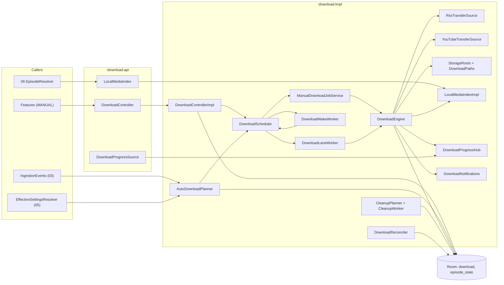
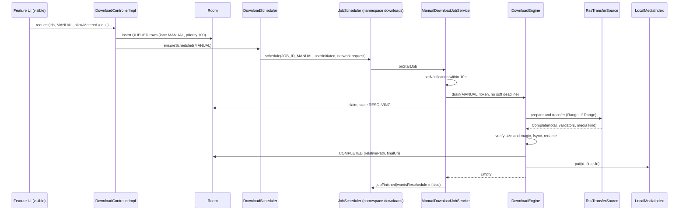

# 07 — Downloads

> Status: Draft v1, 2026-10-04 · Implements: R4.2, R4.3 (local files), R4.4, R4.5, R4.6, R3.6, R2.6 (download all), R2.7 (auto-download defaults), R1.8 (download exclusion), R5.3 (episode art of downloads) / N1, N2, N3, N6, N7 · Milestones: M0, M6, M8, M9, M11, M15 · Honours: D15, D17, D45, D46, D47, D48, D49, D50, D66, D67; PO-12 default · Owns: `:download:api` and `:download:impl` — the download engine and its state machine, runner selection (UIDT job, WorkManager lanes, `dataSync`), HTTP transfer rules, YouTube transfer mechanics, storage roots, naming and integrity, live progress and download notifications, auto-download planning, cleanup and quota, reconciliation and lifecycle, moving downloads between roots, download manifest entries

Contents: [Scope](#scope) · [Engine architecture](#engine-architecture) · [State machine](#state-machine) · [Runners and scheduling](#runners-and-scheduling) · [Transfer core](#transfer-core) · [YouTube transfers](#youtube-transfers) · [Storage layout](#storage-layout) · [Progress and notifications](#progress-and-notifications) · [Auto-download policy](#auto-download-policy) · [Cleanup and quota](#cleanup-and-quota) · [Lifecycle and reconciliation](#lifecycle-and-reconciliation) · [Backup exclusion](#backup-exclusion) · [Settings](#settings) · [Testing](#testing) · [Manifest and Play declaration](#manifest-and-play-declaration) · [Error handling and failure modes](#error-handling-and-failure-modes) · [Delivery by milestone](#delivery-by-milestone) · [Open questions](#open-questions) · [Sources](#sources)

---

## Scope

Serves R4.2–R4.6, R3.6, N1, N2, N6. Delivered in [M6](../PLAN.md#m6-downloads) (engine, runners, RSS transfers, storage, auto-download, cleanup, reconciliation) and [M9](../PLAN.md#m9-youtube-playback-and-downloads-in-foss) (YouTube transfers in `foss`), with API stubs in M0 and the YouTube rejection rule in M8 ([Delivery by milestone](#delivery-by-milestone)).

Neutrodyne downloads episodes with its **own small engine on OkHttp** that writes real, user-copyable audio files ([D46](../PLAN.md#3-key-decisions)). The `download` row in Room is the only record of download state; there is no Media3 `DownloadManager`, no system `DownloadManager` and no `WorkInfo`-based progress. Two **lanes** partition the queue: `MANUAL` (the user asked) and `AUTO` (a policy asked). The runner that drains a lane depends on the lane and the API level ([D47](../PLAN.md#3-key-decisions)): a user-initiated data transfer (UIDT) job on API 34+ for `MANUAL`, WorkManager expedited work (promoted to a `dataSync` foreground service only when started while the app is visible) on API 26–33 for `MANUAL`, and a regular WorkManager worker with an 8-minute soft deadline for `AUTO` everywhere. Files live in app-specific storage ([D48](../PLAN.md#3-key-decisions)) in one layout for RSS and YouTube ([D49](../PLAN.md#3-key-decisions)). Live byte counts never touch the database between state transitions ([D17](../PLAN.md#3-key-decisions)), and resolved stream or CDN URLs never touch it at all ([D50](../PLAN.md#3-key-decisions)).

### Responsibilities and boundaries

| This document owns | Owned elsewhere (link, do not restate) |
|---|---|
| `:download:api` (`DownloadController`, `LocalMediaIndex`, `DownloadProgressSource`) and `:download:impl` | `download` entity, DAO SQL, indices — [02 download](02-data-model.md#download), [02 Downloads](02-data-model.md#downloads) |
| State machine, `waitReason` meanings and their UI strings, transition persistence rules | Downloads screen layout, row visuals, dialogs — [08 Screens](08-ui-ux.md#screens), [08 Components](08-ui-ux.md#components) |
| Runner selection, JobScheduler and WorkManager requests, soft deadlines, stop reasons | Merged manifest and the DOWNLOAD `OkHttpClient` — [01 Manifest and permissions](01-foundation.md#manifest-and-permissions), [01 One client family](01-foundation.md#one-client-family) |
| HTTP transfer rules, sniffing, retries, integrity, rename | How playback resolves `neutrodyne://episode/{id}` to a local file — [06 Media items and URI resolution](06-playback.md#media-items-and-uri-resolution) |
| YouTube transfer mechanics (chunking, re-resolve loop, pacing) | YouTube resolution, `ResolvedUrlCache`, breaker, the YouTube download rules — [04 Download integration](04-youtube.md#download-integration), [04 Error handling and circuit breaker](04-youtube.md#error-handling-and-circuit-breaker) |
| Storage roots, file naming, free-space checks, `LocalMediaIndex` | Effective auto-download policy merge (D45) — [05 Effective settings resolution](05-groups-opml-backup.md#effective-settings-resolution) |
| `AutoDownloadPlanner`, `CleanupPlanner`, quota, tombstone writes | Which episodes "Download all unplayed" offers and its confirmation — [05 Group actions](05-groups-opml-backup.md#group-actions) |
| Reconciliation, Task Manager stops, reboot, update, uninstall, moving roots | Auto Backup XML — [05 Auto Backup](05-groups-opml-backup.md#auto-backup) (07 only states what must stay out) |
| Download notifications (`downloads`, `download_errors`), `DownloadActionReceiver` | `EpisodeLiveStateSource` implementation — [08 Live row state](08-ui-ux.md#live-row-state) (07 supplies inputs) |
| `downloads.*` settings keys | Artwork pinning internals — [08 Artwork pipeline](08-ui-ux.md#artwork-pipeline) (07 calls `ArtworkStore.pin`) |

### Modules and public API

| Module | Package | Contents |
|---|---|---|
| `:download:api` (JVM, Unlicense) | `app.neutrodyne.download.api` | `DownloadController`, `LocalMediaIndex`, `DownloadProgressSource` and the data types below; depends on `:core:{model, common}` only ([01 Dependency rules](01-foundation.md#dependency-rules)) |
| `:download:impl` (Android) | `app.neutrodyne.download.impl` | `DownloadControllerImpl`, `DownloadEngine`, `DownloadScheduler`, `ManualDownloadJobService`, `DownloadLaneWorker`, `DownloadWakeWorker`, `RssTransferSource`, `YouTubeTransferSource`, `StorageRoots`, `DownloadPaths`, `MediaSniffer`, `LocalMediaIndexImpl`, `DownloadProgressHub`, `AutoDownloadPlanner`, `CleanupPlanner`, `CleanupWorker`, `DownloadReconciler`, `DownloadReconcileWorker`, `DownloadMoveWorker`, `DeferredDeletes`, `DownloadNotifications`, `DownloadActionReceiver`, `DownloadDiagnostics` |
| `:core:model` | `app.neutrodyne.core.model` | Canonical enums `DownloadState`, `DownloadLane`, `WaitReason`, `DownloadError`, `SourceKind`, `NetworkPolicy`, `DeleteAfter`; new `ManualMeteredPolicy`; `DownloadSettingKeys` (package `…core.model.settings`) |

```kotlin
// :download:api — canonical members kept; additions marked "+"
interface DownloadController {
    suspend fun request(episodeIds: List<Long>, trigger: DownloadLane, allowMetered: Boolean?): RequestResult
    suspend fun pause(episodeIds: Collection<Long>)
    suspend fun resume(episodeIds: Collection<Long>)
    suspend fun cancel(episodeIds: Collection<Long>)                    // user: drops row and .part, writes tombstone
    suspend fun retry(episodeIds: Collection<Long>)
    suspend fun promote(episodeId: Long): RequestResult                 // "Download now": AUTO → MANUAL, priority 200
    suspend fun delete(episodeIds: Collection<Long>, byUser: Boolean)   // any state; tombstone only when byUser
    suspend fun setAllowMetered(episodeIds: Collection<Long>, allowed: Boolean)  // + "Use mobile data"
    suspend fun pauseAll()                                              // +
    suspend fun resumeAll()                                             // +
    suspend fun reportFileMissing(episodeId: Long)                      // + called by 06 on FILE_NOT_FOUND
    fun observe(episodeId: Long): Flow<DownloadStatus?>                 // row merged with live progress
    fun observeAll(): Flow<DownloadsOverview>                           // Downloads screen
    fun observeStorage(): Flow<StorageUsage>
    suspend fun storageRoots(): List<StorageRootInfo>                   // +
    suspend fun changeRoot(rootId: String, moveExisting: Boolean)       // + settings, enqueues download-move
    suspend fun deleteOrphanFiles(): Long                               // + bytes freed
}
fun interface LocalMediaIndex { fun localUriOrNull(episodeId: Long): String? }   // canonical, synchronous
interface DownloadProgressSource { fun observe(ids: Set<Long>): Flow<Map<Long, LiveProgress>> }  // ≤ 4 Hz
```

```kotlin
// :download:api — data types (all immutable, JVM-only)
sealed interface RequestResult {
    data class Queued(val queued: Int, val alreadyPresent: Int, val rejected: Map<Long, RejectReason>,
                      val askNotificationPermission: Boolean) : RequestResult
    data class NeedsMeteredDecision(val count: Int, val knownBytes: Long, val unknownSizeCount: Int) : RequestResult
}
enum class RejectReason { EPISODE_GONE, NOT_DOWNLOADABLE, UNSUPPORTED_STREAM, YOUTUBE_NOT_SUPPORTED, UNAVAILABLE }
data class LiveProgress(val state: DownloadState, val downloadedBytes: Long, val totalBytes: Long?,
                        val bytesPerSecond: Long?)
data class DownloadStatus(
    val episodeId: Long, val lane: DownloadLane, val state: DownloadState, val waitReason: WaitReason,
    val downloadedBytes: Long, val totalBytes: Long?, val estimatedBytes: Long?, val bytesPerSecond: Long?,
    val nextAttemptAt: Long?, val lastError: DownloadError?, val lastHttpStatus: Int?,
    val allowMetered: Boolean, val requireCharging: Boolean, val sourceKind: SourceKind, val completedAt: Long?)
data class DownloadEntry(val status: DownloadStatus, val podcastId: Long, val podcastTitle: String,
                         val episodeTitle: String, val artwork: ArtworkRef, val sortDate: Long,
                         val played: Boolean, val favorite: Boolean)
data class DownloadsOverview(val inProgress: List<DownloadEntry>, val completed: List<DownloadEntry>,
                             val failed: List<DownloadEntry>, val storage: StorageUsage, val notices: Set<DownloadNotice>)
data class StorageUsage(val rootId: String, val usedBytes: Long, val partialBytes: Long, val orphanBytes: Long,
                        val freeBytes: Long?, val capBytes: Long?, val autoBlockedByCap: Boolean)
data class StorageRootInfo(val rootId: String, val kind: RootKind, val label: String?, val freeBytes: Long?,
                           val available: Boolean)
enum class RootKind { PRIMARY_EXTERNAL, REMOVABLE, INTERNAL }
enum class DownloadNotice { DATA_SAVER, BACKGROUND_RESTRICTED, NOTIFICATIONS_OFF, CAP_REACHED, STORAGE_LOW,
                            ROOT_UNAVAILABLE, YOUTUBE_PAUSED, MOVE_IN_PROGRESS, ORPHAN_FILES }
```

Callers: features (`:feature:downloads`, `:feature:episode`, `:feature:podcast`, `:feature:feeds`) call `DownloadController` with `trigger = MANUAL` only; `AUTO` is used by `AutoDownloadPlanner` inside `:download:impl`. 03's unsubscribe and merge, and 06's error recovery, inject `Optional<DownloadController>` (absent before M6). `DownloadController`, `LocalMediaIndex` and `DownloadProgressSource` are `@Singleton` bindings in `:download:impl` ([01 Dependency injection](01-foundation.md#dependency-injection)).

### Threading and coroutines

| Component | Runs on | Rules |
|---|---|---|
| `DownloadControllerImpl` | caller's coroutine; main-safe | DAO calls on Room's query context; scheduling on `@Dispatcher(IO)`; never blocks the caller beyond one write transaction per call |
| `DownloadEngine.drain(...)` | the runner's coroutine (UIDT service scope or `CoroutineWorker.doWork`) | transfers are **children** of the runner, so stopping a runner cancels exactly its transfers; shared state (slots, active registry, progress) is thread-safe |
| One transfer | `@Dispatcher(IO)` | `executeAsync()` from `okhttp-coroutines` (cancellation cancels the `Call`); body reads in `runInterruptible`; 256 KiB buffer; `ensureActive()` per buffer |
| State writes on stop | `withContext(NonCancellable)` in `finally` | at most one write transaction; never network or file I/O inside it |
| `LocalMediaIndexImpl` | any thread, including Media3's loader thread and the main thread | `ConcurrentHashMap`; on the main thread it never blocks; elsewhere it waits ≤ 2 s for the initial load |
| `DownloadProgressHub` | ticker on `@Dispatcher(Default)` | publishes a snapshot every 250 ms while any transfer is active, idle otherwise |
| `AutoDownloadPlanner`, `CleanupPlanner`, `DownloadReconciler` | `@ApplicationScope` or the calling worker | each guarded by its own `Mutex` (single flight) |
| `ManualDownloadJobService` callbacks | main thread | return within milliseconds (Android 14 ANR rule); work runs in a service scope (`SupervisorJob() + Default`) |
| `DownloadActionReceiver` | `goAsync()` + `@ApplicationScope` | `finish()` within 10 s ([01 Coroutines and threading](01-foundation.md#coroutines-and-threading)) |
| Time | `Clock` | deadlines, in-runner waits and speed use `Clock.elapsedRealtime()`; persisted `nextAttemptAt`, `requestedAt`, `completedAt` use `Clock.now()` |

**Single-process assumption.** Engine, runners, receivers and planners run in the main process (the WorkManager and JobScheduler default; `:acra` runs none of them). In-memory registries (active transfers, lane phases, `LocalMediaIndex`, deferred deletes) are therefore authoritative for the life of the process, and everything persistent is re-derived from the database at the next process start ([Lifecycle and reconciliation](#lifecycle-and-reconciliation)).

### New names introduced here

| Name | Kind / location | Purpose |
|---|---|---|
| `RequestResult`, `RejectReason`, `DownloadStatus`, `DownloadEntry`, `DownloadsOverview`, `StorageUsage`, `StorageRootInfo`, `RootKind`, `DownloadNotice`, `LiveProgress` | data types, `:download:api` | Public API shapes |
| `ManualMeteredPolicy { ASK, ALWAYS, NEVER }` | enum, `:core:model` | `downloads.manual_metered` |
| `DownloadSettingKeys` | object, `:core:model` (`…core.model.settings`) | The `downloads.*` keys of [Settings](#settings) |
| `DownloadControllerImpl`, `LocalMediaIndexImpl`, `DownloadProgressHub`, `DownloadPaths`, `MediaSniffer`, `ContentRange`, `DeferredDeletes`, `LaneRegistry`, `DownloadSlots`, `ActiveTransfers`, `StopIntent`, `TransferSource`, `TransferPlan`, `TransferResult`, `YouTubeAutoPacer`, `ChargingMonitor`, `AppVisibility`, `ExitReasonProbe`, `JobSchedulerFacade`, `DownloadDiagnostics`, `DownloadInitializers` | classes, `:download:impl` (internal) | Engine internals |
| `DownloadWakeWorker`; unique work `download-wake-MANUAL`, `download-wake-AUTO` (one-time, policy `REPLACE`, tag `download`) | worker and work names, `:download:impl` | Delayed or condition-bound re-arming of a lane ([Wake work](#wake-work)) |
| `NOTIF_ID_DOWNLOAD_ERRORS = 2002`, `NOTIF_ID_STORAGE_FULL = 2003`, `NOTIF_ID_DOWNLOADS_WAITING = 2004` | notification IDs (range 2000–2999) | Error summary, storage full, "open the app to continue" |
| Actions `app.neutrodyne.download.action.PAUSE_ALL`, `…RETRY_FAILED`, `…DISMISS_ERRORS` | explicit intents to `DownloadActionReceiver` | Notification actions |
| `STOP_PROCESS_DEATH = -1`, `STOP_SOFT_DEADLINE = -2`, `STOP_USER_PAUSE = -3`, `STOP_USER_TASK_MANAGER = -4` | `download.lastStopReason` values below 0 (≥ 0 are platform `STOP_REASON_*`) | Diagnostics and the torn-tail rule |
| `DownloadDao.observeEntries()`, `observePlayedCompletedIds()`, `queuedNeeds(lane, now)`, `markWait(ids, reason, nextAttemptAt)`, `clearStorageWaits()`, `requeueChangedEnclosures(now)`, `rowsOnOtherRoots(target, limit)`, `pathsByRoot()`; `EpisodeDao.downloadSources(ids)`; `PlaySessionDao.observeCurrentEpisodeId()` | DAO functions requested from 02 | SQL owned by 02 ([Open questions](#open-questions)) |

---

## Engine architecture

Serves R4.2, R4.6, N1, N2. Delivered in M6 (RSS), M9 (YouTube). Honours [D46](../PLAN.md#3-key-decisions), [D17](../PLAN.md#3-key-decisions).



| Component | Responsibility |
|---|---|
| `DownloadControllerImpl` | Validates requests, inserts and updates rows, applies the metered rule, translates user actions into DB updates or `StopIntent`s, calls `DownloadScheduler.ensureScheduled(lane)` |
| `DownloadScheduler` | Chooses and arms the runner for a lane ([Runners and scheduling](#runners-and-scheduling)); owns `LaneRegistry` and the per-lane `Mutex` |
| `DownloadEngine` | `drain(request)`: claims rows, admits them against `DownloadSlots`, runs transfers through a `TransferSource`, verifies and finalises files, writes transitions, feeds `DownloadProgressHub` |
| `RssTransferSource`, `YouTubeTransferSource` | One attempt of one row: prepare (source refresh, invariants) and transfer (bytes into the `.part`) ([Transfer core](#transfer-core), [YouTube transfers](#youtube-transfers)) |
| `DownloadSlots` | Global `Semaphore(3)`, per-host `Semaphore(2)` keyed by the enclosure URL's host, YouTube `Semaphore(1)`; `AUTO` may hold at most 2 global slots so one slot is always free for `MANUAL` |
| `ActiveTransfers` | `episodeId → (Job, lane, runnerToken, AtomicReference<StopIntent?>)`; the cancel registry |
| `StorageRoots`, `DownloadPaths` | Root resolution, naming, free-space checks ([Storage layout](#storage-layout)) |
| `LocalMediaIndexImpl` | In-memory mirror `episodeId → finalUri` of `COMPLETED` rows for 06 |
| `DownloadProgressHub` | `DownloadProgressSource` implementation and notification feed |
| `AutoDownloadPlanner`, `CleanupPlanner` | Policy-driven inserts and deletions ([Auto-download policy](#auto-download-policy), [Cleanup and quota](#cleanup-and-quota)) |
| `DownloadReconciler` | Start-up and daily repair ([Lifecycle and reconciliation](#lifecycle-and-reconciliation)) |
| `DownloadNotifications` | Channels, aggregated progress, error and storage notifications |

### Claiming and slots

Every runner claims through one critical section so that two runners (the UIDT job draining `MANUAL` and the `AUTO` worker) never take the same row and never overshoot a slot limit:

```kotlin
// DownloadEngine (sketch)
private val claimMutex = Mutex()
private suspend fun claimOne(lanes: List<DownloadLane>, token: String, c: Conditions): DownloadEntity? =
    claimMutex.withLock {
        val skipped = mutableListOf<Long>()
        val row = dao.claimNext(lanes, c.now, c.unmetered, c.charging, c.youtubeAllowed, token) { r ->
            slots.canStart(r).also { ok -> if (!ok) skipped += r.episodeId }   // host, YouTube, AUTO cap, pacing
        }
        row?.let { slots.acquire(it) }
        if (skipped.isNotEmpty()) dao.markWait(skipped, WaitReason.SLOT, null)   // writes only rows not already SLOT
        row
    }
```

`claimNext` is 02's transaction (candidates ordered `priority DESC, requestedAt ASC, episodeId ASC`, then `claim` sets `RESOLVING`, `waitReason = NONE`, `runnerToken`; [02 Downloads](02-data-model.md#downloads)). `Conditions` comes from `NetworkMonitor.status` (`unmetered = isConnected && !isMetered`), `ChargingMonitor.isCharging`, and `youtubeAllowed = YouTubeCapabilities.downloads && YouTubeHealth.extractionGate(now) !is Deny`. Slots are released in the transfer's `finally`. `pause`, `cancel` and `delete` of queued rows also take `claimMutex`, so a row is never paused in the database while a runner is claiming it.

### Drain loop

`suspend fun drain(req: DrainRequest): DrainOutcome` where `DrainRequest(lanes, runnerToken, softDeadlineElapsed: Long?, reporter)`:

1. Once per process: `DownloadReconciler.resetOrphanedRunners()` (cheap, idempotent; [Lifecycle and reconciliation](#lifecycle-and-reconciliation)) and `CredentialLookup.awaitLoaded()` (requested from 01/03, so a private enclosure is never fetched before its Basic-auth credential is in memory).
2. Register the token in `LaneRegistry` (phase `ACTIVE`).
3. Loop:
   1. If `softDeadlineElapsed` has passed: stop accepting, set `StopIntent.Requeue(SYSTEM, STOP_SOFT_DEADLINE)` on every own transfer, await them, return `DeadlineReached`.
   2. While a global slot is free: `claimOne(...)`; for each row launch a child coroutine running [the transfer lifecycle](#transfer-lifecycle).
   3. If nothing is active and nothing was claimed: enter the [exit protocol](#lane-registry-and-the-exit-protocol); return `Empty`, `Waiting(earliest)` or `Blocked(reason)`.
   4. Otherwise suspend until one of: a transfer ended; `wake(lane)` was signalled (new request, resume, freed slot, network or charging change, freed storage); the soft deadline; the earliest due `nextAttemptAt` within the next 60 s.
4. `finally`: unregister the token.

The engine also collects `NetworkMonitor.status` and `ChargingMonitor` while any transfer is active: on "metered", transfers whose row has `allowMetered = false` get `StopIntent.Requeue(UNMETERED_NETWORK)`; on "disconnected", every transfer gets `Requeue(NETWORK)` (no attempt is counted); on "unplugged", `AUTO` transfers with `requireCharging` get `Requeue(CHARGING)`.

### Transfer lifecycle

```kotlin
// one child coroutine per claimed row (sketch)
suspend fun runTransfer(row: DownloadEntity, source: TransferSource) {
    val active = activeTransfers.register(row, coroutineContext.job)
    var end: TransferEnd = TransferEnd.Unknown
    try {
        end = withInRunnerRetries(row) { attemptOnce(row, source) }   // prepare → DOWNLOADING → transfer → verify
    } catch (c: CancellationException) {
        end = TransferEnd.Stopped(active.intent.get() ?: StopIntent.RunnerStopped(runnerStopReason()))
        throw c
    } finally {
        withContext(NonCancellable) { finish(row, end); activeTransfers.remove(row.episodeId); slots.release(row) }
    }
}
```

`StopIntent` is `Pause`, `Cancel(tombstone)`, `Delete(byUser)`, `Requeue(waitReason, stopReason)` or `RunnerStopped(platformStopReason)`. `finish` maps the end to exactly one persisted transition ([State machine](#state-machine)).

### Persisted transitions (D17)

The `download` table is low-churn: paged feeds join it ([D16](../PLAN.md#3-key-decisions)). The engine writes only these transitions; byte progress lives in `DownloadProgressHub`, and the `.part` length is the authoritative resume offset.

| Transition | Columns written (besides `state`) |
|---|---|
| insert `QUEUED` | everything known at request time ([Requests](#requests)) |
| `QUEUED → RESOLVING` (claim) | `waitReason = NONE`, `runnerToken` |
| `RESOLVING → DOWNLOADING` (first accepted response or chunk) | `totalBytes`, `etag`, `lastModified`, `mimeType`, `resolvedItag`, `sourceRef` (if refreshed), `rootId`/`tempPath` (if reassigned), `downloadedBytes = offset` |
| `→ COMPLETED` | `relativePath`, `finalUri`, `totalBytes`, `downloadedBytes`, `completedAt`, `tempPath = NULL`, `runnerToken = NULL`, `lastError = NULL`, `attempt = 0` |
| `→ QUEUED(waitReason)`, `→ PAUSED`, `→ FAILED` | `waitReason`, `nextAttemptAt`, `attempt`, `integrityFailures`, `lastError`, `lastHttpStatus`, `lastStopReason`, `downloadedBytes = .part length`, `runnerToken = NULL` |
| `COMPLETED ↔ MISSING` | `lastError` (`STORAGE_UNAVAILABLE` or `NULL`) |

Not persisted in v1 (in-memory sub-states visible through `LiveProgress.state`): `VERIFYING` (a same-volume rename takes milliseconds; a crash there is recovered by the [completed-file adoption](#transfer-lifecycle-recovery) rule) and the YouTube `DOWNLOADING → RESOLVING → DOWNLOADING` re-resolve loop. `VERIFYING` becomes persisted when verification includes a copy (SAF roots, v1.x). Waiting rows' `waitReason`/`nextAttemptAt` updates are written only when the value changes.

#### Transfer lifecycle recovery

At `RESOLVING`, before any network request: if the row has no usable `.part` but the deterministic final file for this row exists on its root and its length equals the stored `totalBytes`, the engine skips straight to verification and completes the row (a process death between rename and the `COMPLETED` write). If the row's `lastStopReason == STOP_PROCESS_DEATH`, the `.part` is truncated by `min(64 KiB, length)` before resuming, which drops a possibly torn tail (Unverified necessity on ext4/f2fs; cheap insurance).

### Requests

`request(episodeIds, trigger, allowMetered)`:

1. Load `EpisodeDao.downloadSources(ids)` (chunks of 500): episode, podcast and first audio alternate enclosure.
2. Per episode, reject with a `RejectReason`: row gone → `EPISODE_GONE`; no enclosure and no YouTube video ID → `NOT_DOWNLOADABLE`; effective type `application/x-mpegurl` or a `.m3u8` path ([03 Enclosure types](03-feeds-and-discovery.md#enclosure-types-and-media-acceptance)) → `UNSUPPORTED_STREAM`; YouTube while `!YouTubeCapabilities.downloads` (`play`, and `foss` before M9) → `YOUTUBE_NOT_SUPPORTED`; `availability != AVAILABLE` → `UNAVAILABLE`.
3. Metered rule for `MANUAL` with `allowMetered == null`: `downloads.manual_metered` `ALWAYS` → `true`; `NEVER` → `false`; `ASK` → if the network is connected and metered, return `NeedsMeteredDecision(count, knownBytes, unknownSizeCount)` **without writing anything**; otherwise `false` (the row waits for Wi-Fi if the network changes and offers "Use mobile data"). 08's dialog answers with `request(ids, MANUAL, true)` ("Download now"), `request(ids, MANUAL, false)` ("Wait for Wi-Fi"), or sets `ALWAYS` and retries ("Always use mobile data").
4. Existing rows: `COMPLETED` → `alreadyPresent`; in flight or `QUEUED` → for `MANUAL` over an `AUTO` row: `lane = MANUAL`, `priority = max(priority, 100)`, `requireCharging = false`, `allowMetered` per step 3; `PAUSED` → resume; `FAILED` → retry semantics; `MISSING` → back to `QUEUED` (file fields cleared).
5. New rows in one write transaction: `lane = trigger`, `priority` (`MANUAL` 100, `AUTO` 0), `requestedAt = now + index` (keeps the caller's order, e.g. newest first for "Download all"), `sourceKind`, `sourceRef` (enclosure URL — the first audio alternate for `isVideo` episodes, same rule as 06's streaming; YouTube video ID), `formatPref` (YouTube: `youtube.audio_quality` name; RSS: null), `rootId = downloads.root_id`, `allowMetered`, `requireCharging` (`AUTO`: from policy), `estimatedBytes` ([Estimates](#estimates)).
6. `MANUAL` requests clear the episode's tombstone (`EpisodeStateDao.clearDismissed`): the user changed their mind ([R4.4](../PLAN.md#21-functional-requirements)).
7. `ensureScheduled(trigger)`; return `Queued(…, askNotificationPermission)` where the flag is true when API ≥ 33, `POST_NOTIFICATIONS` is not granted and `downloads.notification_prompted` is false (08 shows the contextual prompt and sets the flag; [01 Platform compliance](01-foundation.md#platform-compliance) P22).

#### Estimates

`estimatedBytes` = `enclosureLength` when ≥ 100 KB (smaller values are bogus placeholders, never used for integrity); else `durationMs × 16 000` (128 kbit/s) when a duration is known; else `null`. The free-space check then falls back to 150 MB ([Free space](#free-space-and-allocation)). 05's "Download all" confirmation uses the same rule.

### Other controller operations

| Call | Effect |
|---|---|
| `pause(ids)` | Under `claimMutex`: `QUEUED → PAUSED` in the DB; in-flight rows get `StopIntent.Pause` (→ `PAUSED`, `lastStopReason = STOP_USER_PAUSE`). `PAUSED` rows never resume by themselves |
| `resume(ids)` | `PAUSED` and `QUEUED(NEEDS_FOREGROUND)` → `QUEUED(NONE)`, `nextAttemptAt = NULL`; `ensureScheduled` (from visible UI, so `MANUAL` gets a UIDT job) |
| `retry(ids)` | `FAILED` → `QUEUED(NONE)` with `attempt = 0`, `integrityFailures = 0`, `lastError = NULL`; `QUEUED(BACKOFF)` → `nextAttemptAt = NULL` ("Retry now") |
| `promote(id)` | An `AUTO` row becomes `MANUAL` with `priority = 200`, `requireCharging = false`, metered rule of step 3 (may return `NeedsMeteredDecision`); a `PAUSED` row is also resumed. An `AUTO` row already in flight keeps transferring; if its runner stops, the UIDT job resumes it |
| `cancel(ids)` | Non-`COMPLETED` rows: in-flight → `StopIntent.Cancel(tombstone = true)`; otherwise delete row and `.part`; tombstone (`downloadDismissedAt = now`) in the same transaction. `COMPLETED` rows are untouched (use `delete`) |
| `delete(ids, byUser)` | [Deleting a download](#deleting-a-download) |
| `setAllowMetered(ids, allowed)` | Updates `allowMetered` of non-`COMPLETED` rows; `ensureScheduled` |
| `pauseAll()`, `resumeAll()` | All lanes; `pauseAll` is also the notification action |
| `reportFileMissing(id)` | Re-checks the file: gone → `MISSING`, index entry removed; present → no-op |

### Deleting a download

`delete(ids, byUser)` for each row, in this order:

1. In flight → `StopIntent.Delete(byUser)` and wait for the transfer's `finally`.
2. `LocalMediaIndex.remove(id)` (before the row disappears, so 06 never resolves a file that is about to vanish).
3. One write transaction: delete the `download` row; if `byUser`, `EpisodeStateDao.ensure` + `setDismissed(id, now)` (tombstone, [02 User-state writes](02-data-model.md#user-state-writes)).
4. `ArtworkStore.unpin(episodeArtworkKey, PinReason.DOWNLOAD, ownerId = id)` if it was pinned.
5. Delete the `.part` and the final file — unless the episode is `play_session.currentEpisodeId` or its root is unavailable, in which case the file goes to `DeferredDeletes` ([Deferral while playing](#deferral-while-playing)).

`byUser = true`: Downloads screen, episode and podcast actions, bulk delete, `cancel`. `byUser = false`: cleanup, unsubscribe and merge (03), policy changes. Tombstones are written only for user deletions so that automatic cleanup never blocks a later automatic download ([R4.4](../PLAN.md#21-functional-requirements)).



---
