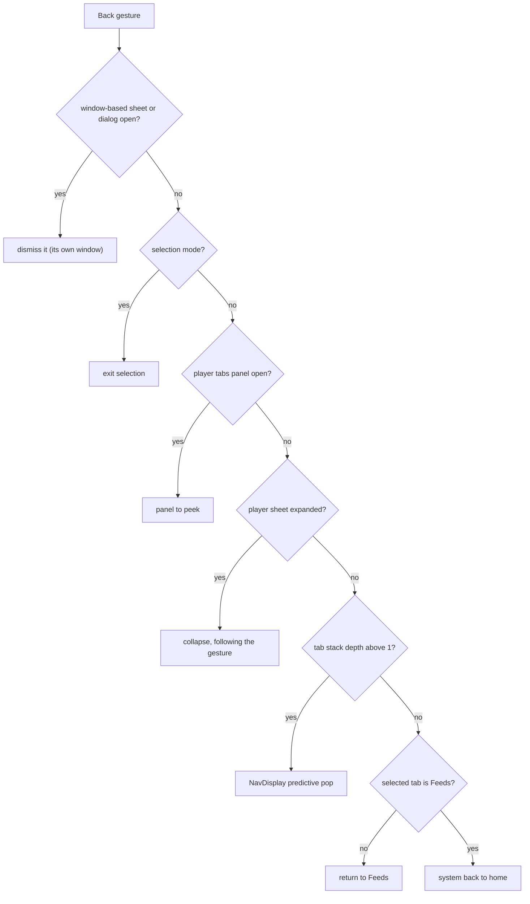
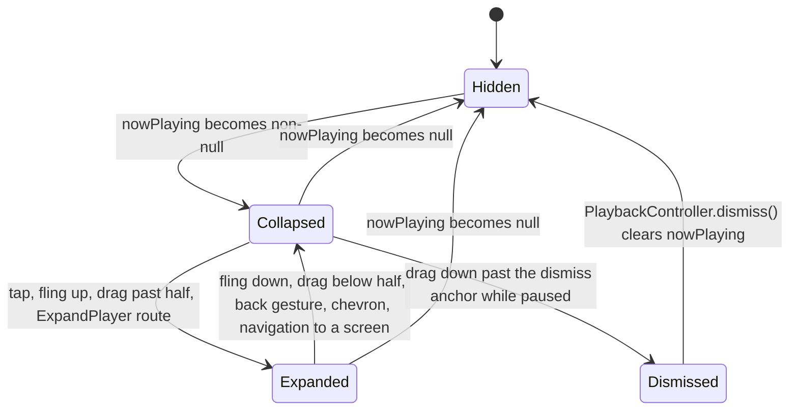

# 08 — UI and UX

> Status: Draft v1, 2026-10-04 · Implements: R2.4, R2.5, R2.8 (display), R3.7 (display), R4.6, R5.1–R5.8 / N4, N5 (UI), N6, N7 (edge-to-edge, predictive back, resizability), N10 (RTL, text expansion) · Milestones: M0, M1, M2, M3, M4, M5, M6, M7, M8, M9, M10, M11, M13 · Honours: D6, D7, D16, D42, D54, D55, D56, D57, D58, D64; PO-4, PO-17, PO-19 defaults · Owns: information architecture and screen inventory, navigation behaviour, every screen's layout and states, shared components, the root `PlayerSheet`, the Feeds pager, `EpisodeLiveStateSource`, theming and colour, the artwork pipeline (`ArtworkStore`, `ArtworkSyncWorker`, `ArtworkProvider`, Coil, monograms, mosaics), adaptive layouts, accessibility, onboarding, flavor UI differences and the Settings structure

## Scope

Serves R5.1–R5.8, R2.4, R2.5, R4.6, N4, N6, N7. Delivered from [M0](../PLAN.md#m0-scaffold-and-ci) (shell, theme, five destinations) to [M10](../PLAN.md#m10-covers-theming-adaptive-layouts-and-accessibility) (release-quality covers, colour, adaptive layouts and accessibility); see [Delivery by milestone](#delivery-by-milestone).

Neutrodyne is cover-first: artwork is shown at a size where it reads on every surface (grid tiles 72–152 dp, feed rows 56 dp, podcast header 160 dp, full player ≥ 280 dp, mini player 48 dp, notification, lock screen, Auto), and artwork drives colour while the chrome stays quiet. Groups are places: each group is a tab and a page of the Feeds pager ([D55](../PLAN.md#3-key-decisions)). The player is one root sheet that follows the finger ([D56](../PLAN.md#3-key-decisions)). Everything is stable Material 3 1.4.0 wrapped in `:core:designsystem` ([D6](../PLAN.md#3-key-decisions), [PO-4](../PLAN.md#po-4-material-3-expressive)).

### Responsibilities and boundaries

| This document owns | Owned elsewhere (link, do not restate) |
|---|---|
| Destinations, screen inventory, pane roles, re-tap and back behaviour, `AppNavigator` semantics | Nav3 mechanics (installers, per-tab stacks, decorators, scene strategies, intent router) — [01 Navigation](01-foundation.md#navigation) |
| Every screen's layout, states, actions and user-visible strings (final wording) | What the actions do: feeds and add flow [03](03-feeds-and-discovery.md), YouTube [04](04-youtube.md), groups/import/backup [05](05-groups-opml-backup.md), playback [06](06-playback.md), downloads [07](07-downloads.md) |
| `EpisodeRow`, `CoverTile`, `GroupMosaic`, `CoverArt`, `MonogramPainter`, show-notes renderer, banners, selection mode | Show-notes sanitising and block model — [03 Show notes](03-feeds-and-discovery.md#show-notes) |
| `PlayerSheet`, mini/full player, side panel, speed and sleep sheets | Player behaviour, `PlaybackController`/`PlaybackStateSource` — [06 UI boundary](06-playback.md#ui-boundary) |
| Feeds pager, tabs, chips, selection persistence, visits | `FeedRepository`, counts window, "new since last visit" rule — [05 Group feeds](05-groups-opml-backup.md#group-feeds) |
| `EpisodeLiveStateSource` contract and implementation | Its `IN (:ids)` SQL — [02 Live row state](02-data-model.md#live-row-state) |
| Colour schemes, tones, tokens, `Nd*` wrappers, icons | Group palette values and icon keys — [05 Palette](05-groups-opml-backup.md#palette), [05 Icons](05-groups-opml-backup.md#icons) |
| `ArtworkStore`, `ArtworkSyncWorker`, `ArtworkProvider`, Coil `ImageLoader`, artwork keys, monograms, mosaics, the YouTube thumbnail interceptor | `artwork` table and reference SQL — [02 artwork](02-data-model.md#artwork), [02 Artwork references](02-data-model.md#artwork-references); YouTube URL sources — [04 Artwork and thumbnails](04-youtube.md#artwork-and-thumbnails); system-surface consumption — [06 Artwork rule](06-playback.md#artwork-rule) |
| Settings screen structure, `appearance.*` and `ui.*` keys | Each area's keys and semantics (03–07, 09) |
| UI test cases (screenshot matrix, accessibility checks, journeys) | Test infrastructure, Roborazzi/GMD wiring, budgets — [09 Test strategy](09-quality-and-release.md#test-strategy), [09 Performance budgets](09-quality-and-release.md#performance-budgets) |

### Modules

| Module | Contents from this document |
|---|---|
| `:core:designsystem` | `NeutrodyneTheme`, `ArtworkTheme`, `ArtworkSchemeCache` (M10), `GroupTones`, `NeutrodyneShapes`, `NeutrodyneType`, `NeutrodyneMotion`, `CoverArt`, `Covers`, `MonogramPainter`, `StatusBarAppearance`, `NdIcons` and Material Symbols vectors, every `Nd*` wrapper ([Nd wrappers and icons](#nd-wrappers-and-icons)) |
| `:core:ui` | `EpisodeRow`, `CoverTile`, `GroupMosaic`, `GroupTabLabel`, `PodcastHeader`, `ShowNotes` (renderer), `ChapterList`, `UpNextList`, `EmptyState`, `NdBanner`, `SelectionTopBar`, `FeedFilterChips`, `LiveRowState` helpers, string mappers (`PlaybackMessages`, `DownloadStatusText`, `AttributionText`, `FeedErrorText`, `AvailabilityText`), `LocalMiniPlayerInset`, `LocalSnackbarHost`, `SharedKeys` |
| `:core:model` | `RowLive` additions, `ArtColors`, `Monogram`, `MonogramSpec`, `ArtworkColors` |
| `:core:domain` | `ArtworkRepository`; `EpisodeLiveStateSource` (canonical, contract here) |
| `:core:data` | `EpisodeLiveStateSourceImpl`, `ArtworkRepositoryImpl` |
| `:core:artwork` | `DefaultArtworkStore` (`ArtworkStore`), `ArtworkKeys`, `ArtworkSyncScheduler`, `ArtworkSyncWorker`, `ArtworkColorExtractor` (M10), `MonogramRenderer`, `MosaicRenderer`, `ArtworkProvider`, `ArtworkRefMapper`, `YouTubeThumbnailInterceptor` (M8), `TinyImageInterceptor`, `NeutrodyneImageLoaderFactory` |
| `:core:navigation` | `AppNavigator.pushDetail`, `SettingsHomeKey`, `LocalNavTab`, `LocalPaneLayout`, `PaneLayout` |
| `:feature:*` | Screens and ViewModels per [Screen inventory](#screen-inventory) |
| `:app` | `NeutrodyneRoot` (root scaffold, `PlayerSheet` host, banners, snackbar host), `NdPaneDirective`, `StartupGate` visuals |

### Threading model

| Work | Thread / context | Rule |
|---|---|---|
| Composition, ViewModel state, navigation | Main | ViewModels use `viewModelScope` (Main.immediate); repositories are main-safe ([01 Coroutines and threading](01-foundation.md#coroutines-and-threading)) |
| Paging transforms (`insertSeparators` day headers, row mapping) | `@Dispatcher(Default)` via `flowOn` before `cachedIn` | No I/O |
| Artwork scheme generation (MCU `SchemeContent`, M10) | `@Dispatcher(Default)` inside `ArtworkSchemeCache` | Never in composition; the previous scheme stays until the new one is ready |
| Coil decode and fetch | Coil's own dispatchers (IO-limited) | Interceptors and mappers do no disk I/O ([Coil ImageLoader](#coil-imageloader)) |
| `EpisodeLiveStateSourceImpl` merging | `@Dispatcher(Default)`; DAO flows on Room's IO context | Output conflated |
| `ArtworkSyncWorker` | `CoroutineWorker`; files on IO, quantisation on Default | 8-min soft deadline |
| `ArtworkProvider.openFile` | Binder thread | Blocking allowed; fallback DB read with a 2 s timeout ([01](01-foundation.md#coroutines-and-threading)) |

### Platform constraints

| Constraint | Consequence here | Source |
|---|---|---|
| Edge-to-edge enforced for target 35; opt-out removed for target 36 | Every screen handles insets ([Insets and edge-to-edge](#insets-and-edge-to-edge)) | [Android 15 changes](https://developer.android.com/about/versions/15/behavior-changes-15), [Android 16 changes](https://developer.android.com/about/versions/16/behavior-changes-16) |
| Predictive back on by default for target 36; `onBackPressed` not called | Back via Nav3 and `PredictiveBackHandler`; never intercept back at a tab root | [Android 16 changes](https://developer.android.com/about/versions/16/behavior-changes-16) |
| Orientation, resizability and aspect locks ignored on sw ≥ 600 dp (target 36); opt-out removed for target 37 | No locks anywhere; designed layouts per width class | [Android 16 changes](https://developer.android.com/about/versions/16/behavior-changes-16), [Android 17 changes](https://developer.android.com/about/versions/17/behavior-changes-17) |
| Android 14 non-linear font scaling to 200 %; `fontScale` informational | `sp` everywhere; layouts switch on `fontScale ≥ 1.5`, never compute sizes from it | [Android 14 features](https://developer.android.com/about/versions/14/features#non-linear-font-scaling) |
| Dynamic colour only on API 31+; `UiModeManager.getContrast()` only on API 34+ | Brand scheme below 31; contrast 0.0 below 34 | [Compose dynamic colour](https://dl.google.com/android/maven2/androidx/compose/material3/material3-android/1.4.0/material3-android-1.4.0-sources.jar), [UiModeManager](https://developer.android.com/reference/android/app/UiModeManager) |
| `Modifier.blur` only effective on API 31+ | YouTube banner fallback uses a gradient below 31 | [blur KDoc mirror](https://composables.com/jetpack-compose/androidx.compose.ui/ui/modifiers/blur) |
| `POST_NOTIFICATIONS` runtime permission on API 33+ | Requested contextually only ([Permission prompts](#permission-prompts)) | [Notification permission](https://developer.android.com/develop/ui/views/notifications/notification-permission) |
| Android 17 RAM-based memory limits; widget `RemoteViews` bitmap cap for target 37 | Bounded Coil caches; widgets (v1.x) use content-URI icons | [Android 17 changes](https://developer.android.com/about/versions/17/behavior-changes-17) |
| Themed app icons need a `<monochrome>` layer (Android 13); Android 16 QPR2 auto-themes icons without one | Brand icon ships a monochrome layer (PO-17, M10) | [Adaptive icons](https://developer.android.com/develop/ui/views/launch/icon_design_adaptive) |

---

## Information architecture

Serves R2.4, R5.1, R4.6. Delivered in M0 (shell) and per screen milestone. Honours [D54](../PLAN.md#3-key-decisions).

### Destinations

Five top-level destinations in a `NavigationSuiteScaffold` (bar on compact, collapsed wide rail otherwise): **Feeds · Library · Up next · Downloads · Discover**. Settings is a gear action in every top-level top app bar and the rail's footer item. Icons are Material Symbols Rounded (outlined when unselected, filled when selected): `dynamic_feed`, `grid_view`, `queue_music`, `download`, `explore`; gear `settings`.

| Destination | Purpose | Badge |
|---|---|---|
| Feeds | The All feed and one page per group ([Group feed pager](#group-feed-pager)) | none |
| Library | Cover grid of subscriptions, Groups view, selection mode | none |
| Up next | The user's queue and the play context ([06 Queue and play context](06-playback.md#queue-and-play-context)) | none |
| Downloads | In-progress, completed and failed downloads with storage | count of `FAILED` downloads (M6) |
| Discover | Search, charts, add by URL, YouTube channels, import | none |

### Screen inventory

Pane roles apply when the [pane directive](#pane-directive) allows two or more panes; on one pane every key pushes full-screen. "Sheet" keys render as modal bottom sheets and "dialog" keys as dialogs through 01's overlay scene strategies.

| Screen | `NavKey` | Feature module | Pane role | Milestone |
|---|---|---|---|---|
| [Feeds](#feeds) | `FeedsKey` | `:feature:feeds` | list (placeholder detail: group mosaic) | M1 (All), M2 |
| [All groups sheet](#all-groups-sheet) | `AllGroupsKey` | `:feature:feeds` | sheet | M2 |
| [Library](#library) | `LibraryKey` | `:feature:library` | list | M1, M2, M10 |
| [Podcast detail](#podcast-detail) | `PodcastKey(podcastId)` | `:feature:podcast` | detail | M1 |
| Podcast preview (same screen, preview mode) | `PodcastPreviewKey(feedUrl)` | `:feature:podcast` | detail | M7 |
| [Podcast settings](#podcast-settings) | `PodcastSettingsKey(podcastId)` | `:feature:podcast` | detail | M1, M2, M4, M6, M8 |
| [Episode detail](#episode-detail) | `EpisodeKey(episodeId)` | `:feature:episode` | extra | M1 |
| [Group editor](#group-editor) | `GroupEditKey(groupId)` | `:feature:groups` | detail | M2 |
| [Manage groups](#manage-groups) | `GroupsManageKey` | `:feature:groups` | list | M2 |
| [Group settings](#group-settings) | `GroupSettingsKey(groupId)` | `:feature:groups` | detail | M2, M4, M6 |
| [Add to groups sheet](#add-to-groups-sheet) | `AddToGroupsKey(podcastIds)` | `:feature:groups` | sheet | M2 |
| [Up next](#up-next) | `UpNextKey` | `:feature:queue` | list | M0 (empty), M4 |
| [Downloads](#downloads) | `DownloadsKey` | `:feature:downloads` | list | M0 (empty), M6 |
| [Discover](#discover) | `DiscoverKey` | `:feature:discover` | list | M0 (empty), M1, M7 |
| [Directory results](#directory-results) | `DirectoryKey(query, genreId)` | `:feature:discover` | list | M7 |
| [Add podcast sheet](#add-podcast-sheet) | `AddPodcastKey(input)` | `:feature:discover` | sheet | M1, M7, M8 |
| [Import](#import) (preview, progress, report, restore preview) | `ImportKey(sessionId)` | `:feature:importexport` | detail | M3 |
| [Backup and restore](#backup-and-restore) | `BackupKey` | `:feature:importexport` | detail | M3 |
| [Export dialog](#export-dialog) | `ExportKey(groupId)` | `:feature:importexport` | dialog | M3 |
| [Settings](#settings-screens) home | `SettingsHomeKey` (new) | `:feature:settings` | list | M0 |
| Settings page | `SettingsKey(page)` | `:feature:settings` | detail | M0 (About), per owner |
| Licences | `LicencesKey` | `:feature:settings` | detail | M0 |
| [Diagnostics](#diagnostics) | `DiagnosticsKey` | `:feature:settings` | detail | M11 |
| [Speed sheet](#speed-and-sleep-sheets) | `SpeedKey` | `:feature:player` | sheet | M4 |
| [Sleep timer sheet](#speed-and-sleep-sheets) | `SleepTimerKey` | `:feature:player` | sheet | M5 |
| [Player](#player-sheet) (mini, full, side panel) | none (`PlayerSheet`, D56) | `:feature:player`, hosted by `:app` | root overlay / side panel | M4, M10 |
| [Startup gate](#banners-and-the-startup-gate) | none | `:app` | full window | M1 |


---

## Navigation

Serves R2.4, R5.7, N7. Delivered in M0 (tabs, gear, back), M2 (feed selection routes), M4 (player back order), M10 (panes, shared elements). Honours [D7](../PLAN.md#3-key-decisions), [D56](../PLAN.md#3-key-decisions). Mechanics (per-tab `NavBackStack`s, decorators, overlay scene strategies, `IntentRouter`) are 01's ([01 Navigation](01-foundation.md#navigation)); this section defines behaviour.

### Tabs and back stacks

1. Each `TopLevelKey` has its own back stack, saved across tab switches and process death (01). Selecting another tab never clears a stack.
2. Any screen may push any non-top-level key onto the **selected** tab's stack (`AppNavigator.push`). Cross-tab jumps use `selectTab` and, for deep links, `open(tab, stack)`. Rules: podcast name tapped in Feeds, Up next, Downloads or the player → `PodcastKey` on the current tab (or, from the player, the tab underneath it); a group tile in Library → [select that group in Feeds](#selection-persistence-and-fallback) (`selectTab(FeedsKey)` after writing the selection).
3. Back from a non-start tab's root returns to Feeds; back from the Feeds root leaves the app with the system back-to-home animation (01's `visibleStacks()` default, kept).
4. `pushDetail(key)` (member added to the canonical `AppNavigator`, implemented by 01's `NavigationState`): when the [pane layout](#pane-directive) has ≥ 2 partitions and the top entry has the same key class as `key` (for example `EpisodeKey` → `EpisodeKey`), the top entry is replaced instead of stacked, so tapping ten rows on a tablet does not build ten back entries. On one pane it equals `push`. Every list → detail tap uses `pushDetail`.

```kotlin
// :core:navigation — additions (owner 08; canonical members of AppNavigator unchanged)
interface AppNavigator {
    fun push(key: NavKey); fun selectTab(key: TopLevelKey); fun pop(): Boolean    // canonical
    fun resetTab(key: TopLevelKey); fun open(tab: TopLevelKey, stack: List<NavKey>) // 01
    fun pushDetail(key: NavKey)                                                    // replace same-type top entry on ≥ 2 panes
}
@Serializable data object SettingsHomeKey : NavKey                                 // new: the gear's target
data class PaneLayout(val partitions: Int, val playerPanel: Boolean, val contentWidthDp: Int)
val LocalPaneLayout = staticCompositionLocalOf { PaneLayout(1, false, 360) }       // provided by :app per frame
val LocalNavTab = staticCompositionLocalOf<TopLevelKey> { FeedsKey }               // provided per entry by :app
```

### Re-tap behaviour

| Situation | Re-tap on the selected destination |
|---|---|
| Stack depth > 1 | `resetTab` (pop to the root); the root's scroll position is kept |
| At the root, list not at the top | Animate the visible list to item 0 (Feeds: the current page's list) |
| Feeds root, already at the top, page ≠ All | Select the All page |
| Player expanded | Collapse the sheet first; a second tap applies the rows above |

### Pane roles and detail placeholders

Metadata (01's `ListDetailSceneStrategy.listPane()/detailPane()/extraPane()`) per key is the "Pane role" column of the [Screen inventory](#screen-inventory). Detail placeholders when a list key is alone on ≥ 2 partitions: Feeds — the selected group's mosaic at 240 dp with "Select an episode"; Library — "Select a podcast" with the four most recently updated covers; Settings home — the Appearance page is opened automatically (no empty detail); other lists — none (the list takes the full width). `EpisodeKey` is an extra pane so that Library → Podcast → Episode shows three panes on ≥ 1,200 dp of content. Unverified (spike S5): that `ListDetailSceneStrategy` in `adaptive-navigation3` 1.3.0 places an extra-pane entry directly after a list entry (Feeds → Episode) beside the list; fallback: register `EpisodeKey` as `detailPane()`, accepting Podcast → Episode replacing the podcast in the detail pane.

### Sheets and dialogs

Sheet keys (`AddPodcastKey`, `AddToGroupsKey`, `AllGroupsKey`, `SpeedKey`, `SleepTimerKey`) and the dialog key (`ExportKey`) are pushed on the selected tab's stack and rendered by 01's overlay scene strategies, which must use window-based `NdModalBottomSheet`/`NdDialog` so they draw above the root `PlayerSheet` (a sheet opened from the expanded player would otherwise sit under it). Small confirmations (unsubscribe, mark all played, metered prompts, Replace restore) are plain `NdDialog`s owned by the screen, not keys. Sheets have a drag handle, 28 dp top corners, and close on back, scrim tap or swipe down.

### Deep links

01's [Intent routing](01-foundation.md#intent-routing) targets are confirmed with these behaviours:

| Route | Behaviour |
|---|---|
| `Push(AddPodcastKey(input))` | The sheet opens over the current tab with `input` pre-filled and resolution started; nothing is written until Subscribe |
| `Push(EpisodeKey(id))` | Pushed on the current tab; a missing episode shows "This episode is no longer available" with Back |
| `Navigate(LibraryKey, [PodcastKey(id)])` | Library tab, its stack replaced by `[LibraryKey, PodcastKey]` |
| `SelectFeed(groupUuid)` | Root writes `ui.feeds_selected_source = group:{uuid}`, then `selectTab(FeedsKey)` and `resetTab(FeedsKey)`; unknown UUID → All with a snackbar "That group no longer exists" |
| `Navigate(DownloadsKey, [])` | Downloads root |
| `ExpandPlayer` | Expands the sheet (or reveals the side panel); no-op when nothing is loaded |
| `Navigate(LibraryKey, [ImportKey(id)])` | Import screen in the state of that session |
| `Push(SettingsKey(page))`, `Push(DiagnosticsKey)` | Pushed on the current tab (back returns to where the user was) |

### Back handling order

`PlayerSheet` is composed after `NavDisplay` in `NeutrodyneRoot`, so its handler wins while enabled ([Navigation suite, insets and back](#navigation-suite-insets-and-back)). Order of consumers for one back gesture:



Selection mode registers its handler inside the screen's entry (composed inside `NavDisplay`, before the player) but is only enabled while selecting, and selection is impossible while the player is expanded, so the order above holds. Unverified (S5): how activity-compose 1.13.0's `PredictiveBackHandler` and Nav3 1.2.0's `NavigationBackHandler` (navigationevent 1.1.2) interleave; S5 picks one API for both `NavDisplay`-external handlers.

### Transitions and shared elements

- Screens use Nav3's default slide-and-fade push/pop and `predictivePopTransitionSpec`; with "Remove animations" on, every transition is a 0 ms snap ([Motion](#tokens)).
- Shared elements (M10, `SharedTransitionLayout` around `NavDisplay`, 01): Library tile cover ↔ podcast header cover (`SharedKeys.cover(tab, podcastId)`); feed, Up next and Downloads row thumbnail ↔ episode detail art (`SharedKeys.episodeArt(tab, episodeId)`). Keys include `LocalNavTab` because the same podcast can be visible in two tab stacks. Shared elements run only when `LocalPaneLayout.partitions == 1` (on multi-pane layouts source and target are visible together; the detail pane cross-fades instead).
- The mini ↔ full player morph is not a shared element; it is geometry inside `PlayerSheet` driven by drag progress ([Morph mapping](#morph-mapping)).

---
## Screens

Serves R1.1–R1.9 (screens), R2.1–R2.8, R3.1, R3.7, R4.6, R5.1–R5.6, N4, N6. Wireframes are compact phone portrait (360–411 dp). Legend: `( )` = 48 dp touch target, `[>]` play, `[v]` download state, `(:)` overflow, `(gear)` settings.

**Conventions for every screen.**

- Top-level screens: `NdTopAppBar` (pinned, small) with the destination title, screen actions and `(gear)` last. Pushed screens: back arrow, title, actions. The bar's container switches to `surfaceContainer` when the content is scrolled (`elevated = listState.canScrollBackward`).
- State shape follows 01 ([ViewModels and UI state](01-foundation.md#viewmodels-and-ui-state)): `Loading` (skeleton rows in `surfaceContainer`, no shimmer), `Ready`, `Failed(error, retryable)` (an [`EmptyState`](#banners-snackbars-and-undo) with the message and "Try again"). Paged lists show `LoadState.Error` as a footer row with "Retry".
- **Offline** ([N6](../PLAN.md#22-non-functional-requirements)): `NetworkMonitor.status.isConnected == false` → Feeds, Library and Up next show the offline banner; rows that are not downloaded dim their play button to `cloud_off` (tap → "You're offline — downloaded episodes still play"); nothing blocks on the network.
- Lists reserve bottom padding `LocalMiniPlayerInset.current` (80 dp while the mini player is shown) plus navigation insets.
- All strings are resources; numbers and dates use the per-app locale ([09 Localisation](09-quality-and-release.md#localisation)).

### Feeds

`FeedsKey`, `:feature:feeds`, M1 (All only, no tabs), M2 (tabs and groups). Behaviour: [Group feed pager](#group-feed-pager).

```
+--------------------------------------------------+
| Feeds                                     (gear) |  NdTopAppBar, pinned
|  All 12  *tech 5 (3)  *news 9  *fiction    (:::) |  tabs: dot, name, unplayed, (new badge); (:::) All groups
+--------------------------------------------------+
| (>) Play      [Unplayed] [In progress] [Newest v](:)|  page header item: Play + chips + overflow (scrolls away)
| TODAY                                            |  day header item
| +------+ Episode title that can wrap onto    (v) |
| |cover | a second line, then ellipsis             |
| | 56dp | Podcast name · 45 min               (>) |
| +------+ ======------------ 20 min left          |  only when started
| +----------+ [video] Video title             (v) |  YouTube row: 100x56 dp 16:9 thumbnail
| |  thumb   | Channel name · Today            (>) |
| +----------+                                     |
| YESTERDAY                                        |
| ...                                              |
+--------------------------------------------------+
| +----+ Now playing episode title   (>||) (+30)   |  mini player, 64 dp, floating
+--------------------------------------------------+
|  Feeds   Library   Up next   Downloads  Discover |
+--------------------------------------------------+
```

| State | Content |
|---|---|
| Loading | tabs from the persisted selection immediately; page shows 6 skeleton rows |
| No subscriptions | [onboarding empty state](#empty-states) instead of tabs and pager |
| Subscriptions, no groups | tab row hidden (only All exists); the [suggested groups card](#suggested-groups-card) above the list |
| Empty group | "No podcasts in 'tech' yet" + "Add podcasts" → `GroupEditKey(id)` (member picker) |
| Filters exclude everything | "You're all caught up" + "Show played episodes" (clears Unplayed) or "Clear filters" |
| Offline | offline banner; list works from the database |
| Error (paging) | footer "Couldn't load episodes" + Retry |

Actions: page header Play → `PlaybackController.playFeed(source, prefs.filters, prefs.playOrder, null)` (results: [Results and events](#issues-results-and-events)); row tap → `pushDetail(EpisodeKey)`; row play → `playFeed(source, prefs.filters, prefs.playOrder, startEpisodeId = row.id)` (06 open question 3); long-press → [selection mode](#selection-mode) (Mark played/unplayed, Play next, Play last, Download, Delete download); page overflow (group pages): Refresh this group, Mark all as played…, Download all unplayed… (M6), Share as OPML (M3), Import OPML into this group (M3), Edit group, Group settings, Delete group (05 [Group actions](05-groups-opml-backup.md#group-actions)); All/Ungrouped overflow: Refresh, Mark all as played…, Hide older than…; top bar overflow: Manage groups, Show Ungrouped tab (toggle `groups.show_ungrouped_tab`).

### All groups sheet

`AllGroupsKey`, `:feature:feeds`, M2. A three-column grid of [`GroupMosaic`](#groupmosaic-and-group-tab-label) tiles: section "Recent" (up to 4 groups by `lastViewedAt`) then "All groups" A–Z (Collator), including groups with `showAsTab = false` (marked with `visibility_off`). Tap → select that group in Feeds (hidden groups become a [transient tab](#selection-persistence-and-fallback)) and close. Buttons: "New group" → `GroupEditKey(null)`, "Manage groups" → `GroupsManageKey`. Empty: "No groups yet" + "New group".

### Library

`LibraryKey`, `:feature:library`, M1 (grid), M2 (groups, chips, selection), M10 (density, shared elements).

```
+--------------------------------------------------+
| Library                  (sort) (:)       (gear) |
|        [ Podcasts | Groups ]                     |  segmented button, M2
| [All] [Ungrouped] [*tech] [*news] [*fiction] [+] |  single-select chips; [+] new group
+--------------------------------------------------+
| +----------+  +----------+  +----------+         |
| |        12|  |          |  |       3  |         |  unplayed badge top-end (99+)
| |  COVER   |  |  COVER   |  | (avatar) |         |
| |          |  |       (!)|  |[yt]      |         |  status badge bottom-end; YouTube glyph bottom-start
| +----------+  +----------+  +----------+         |
| +----------+  +----------+                       |
| |   AB     |  | (ring)   |                       |  monogram tile shows the title inside; pending ring
| | Show tit.|  |          |                       |
+--------------------------------------------------+
  long-press -> | (x) 3 selected   (add to group) (unsubscribe) (:) |
```

Groups segment: a grid of [`GroupMosaic`](#groupmosaic-and-group-tab-label) tiles ("tech · 14 unplayed · 3 new"), then a "New group" tile. Tap a group → select it in Feeds; long-press → menu with the group actions of the Feeds overflow.

- Grid: `LazyVerticalGrid(GridCells.Adaptive(minCell))`, `minCell` = 72 / 100 / 152 dp from `appearance.library_density` (M1 fixed 100 dp, which gives 3 columns at 360–411 dp), 16 dp edge padding, 12 dp spacing, `key = podcastId`. Titles below tiles only when `appearance.library_titles` is on.
- Sort (`appearance.library_sort`): Title (A–Z, `java.text.Collator` of the per-app locale, as 02 requires), Recently updated (`latestEpisodeAt` desc), Most unplayed, Recently added (`subscribedAt` desc).
- Chips: All, Ungrouped, then groups in `sortOrder`; selection persisted in `ui.library_group_filter`. Data: `PodcastRepository.observeLibraryTiles(groupId)` ([03](03-feeds-and-discovery.md#unsubscribe-and-other-podcast-operations)); Ungrouped = all tiles minus podcasts with any membership (from `GroupRepository.observeMemberships()`, requested from 05).
- Selection mode actions: Add to group… (`AddToGroupsKey(ids)`), Unsubscribe (confirmation "Unsubscribe from 3 podcasts? 12 downloaded episodes will be deleted." → `UnsubscribeUseCase`), Refresh (`refreshNow(Podcasts(ids))`), Mark all played (per podcast `markFeedPlayed(Podcast(id), null)`, confirmation with count), Select all.
- Overflow: Grid size, Show titles, Manage groups, Import subscriptions… (picker, 05), Export subscriptions… (`ExportKey(null)`), Backup and restore (`BackupKey`).
- States: empty library → onboarding empty state; filter chip with no members → "No podcasts in 'tech'" + "Add podcasts"; restore running → restore banner.

### Podcast detail

`PodcastKey(podcastId)` (subscribed) and `PodcastPreviewKey(feedUrl)` (in-memory preview, 03), `:feature:podcast`, M1 (M7 preview, M8 YouTube banner, M10 tint and shared cover).

```
+--------------------------------------------------+
| (<-)                       (refresh) (gear) (:)  |  transparent bar; surface + title after the header scrolls
|  ..artwork-scheme primaryContainer gradient..    |  (YouTube: 6:1 banner, bottom scrim)
|            +----------------------+              |
|            |    COVER 160 dp      |              |  shared element from the Library tile (M10)
|            +----------------------+              |
|  Podcast Title In headlineSmall, two lines max   |
|  Author / publisher                              |
|  [ Subscribed v ]  [*tech x] [*news x] [+ Group] |  preview: [ Subscribe ] + group picker chips
|  Description, first three lines of plain text … |
|  More                                            |
|  214 episodes · Updated 2 days ago · [Private]   |
| [!] This feed needs a password   (Enter password)|  feed-state banner when applicable
+--------------------------------------------------+
| [Unplayed] [Downloaded] [Video]        Newest v  |
| 12 OCT  S2 E14 · Episode title             (v)   |  date block instead of a thumbnail
|         52 min                             (>)   |
| ...                                              |
| (Load older episodes)                            |  RSS paging pending or YouTube back catalogue (foss)
+--------------------------------------------------+
```

- Header: [`PodcastHeader`](#podcast-header); colours from [`ArtworkTheme`](#artwork-scoped-schemes) with the podcast cover seed (M10); status bar icons per [System bars](#status-bar-and-system-bars).
- Feed-state banner (03 [Per-feed states](03-feeds-and-discovery.md#per-feed-states)): Pending "Fetching episodes…" (spinner); NeedsCredentials "This feed needs a password" → credentials dialog (`PodcastRepository.setCredentials`); Gone "This feed no longer exists" → Edit URL / Unsubscribe; PossiblyDead "This feed hasn't updated since {date} — it may have moved" → Edit URL / Try again (`retry`); a failing feed shows `FeedErrorText(lastErrorKind)` only on this screen, never as a toast.
- List: `FeedRepository.pagedFeed(FeedSource.Podcast(id), transientFilters, order)`; `EpisodeRow` style `PODCAST` (no thumbnail unless the episode has its own art, date block 48 dp, season/episode overline from `episodeDisplay`). Row play → `playFeed(Podcast(id), filters, order, startEpisodeId)`.
- "Load older episodes": RSS when older pages exist → `RefreshController.loadOlderEpisodes(id)`; YouTube when `YouTubeCapabilities.backCatalogue` → `YouTubeChannelRepository.loadOlder(id)` with result "Loaded 30 more" / "No more episodes" / failure text. YouTube channels call `YouTubeChannelRepository.ensureChannelArt(id)` on open (04).
- Overflow: Podcast settings, Share (website link `link`; the feed URL only through "Copy feed address" with the private-URL warning when `isPrivate`), Watch on YouTube (channel page, YouTube only), Open website, Mark all as played…, Unsubscribe (confirmation with downloaded count).
- Preview mode: Subscribe button + group chips (multi-select, "+ New group" inline), episode rows without play or download buttons ("Subscribe to play"), "Already subscribed — Open" when `alreadySubscribed.exact`, "You may already be subscribed to this show. Subscribe anyway?" otherwise; failures as in the [Add podcast sheet](#add-podcast-sheet).
- Data needed from 03's `PodcastDetail` (fields requested in [Open questions](#open-questions)): display title, author, description (`ShowNotes`), `ArtworkRef`, `bannerUrl`, `sourceType`, `link`, episode count, `latestEpisodeAt`, status and error fields (`gone`, `needsCredentials`, `failureCount`, `lastSuccessAt`, `lastErrorKind`), `isPrivate`, `episodeOrder`/`showType`, older-pages flag.

### Podcast settings

`PodcastSettingsKey(podcastId)`, `:feature:podcast`. Sections (rows appear in the milestone that delivers their semantics):

| Section | Rows | Owner of semantics |
|---|---|---|
| General | Custom title (text field, empty = feed title); Show in All (`setIncludeInAll`); Episode order (Newest/Oldest; default from `showType`) | 03, 05 |
| Playback (M4) | Speed, Skip silence — each row shows the effective value and attribution ("Set for this podcast", "App default"); a hint "While playing from 'news': 1.5×" for member groups with their own value | 05 [Effective settings resolution](05-groups-opml-backup.md#effective-settings-resolution) |
| Downloads (M6) | Auto-download, Keep latest, Network, Require charging, Include video, Delete after played | 05, 07 |
| Notifications (M2) | New episodes (permission prompt per [Permission prompts](#permission-prompts)) | 03, 05 |
| Refresh (M2) | Refresh interval (Inherit / 1 h … 24 h) | 03, 05 |
| YouTube (M8) | Include Shorts, Include past live streams (`YouTubeChannelRepository.setVariants`) | 04 |
| Feed (M1) | Feed address (redacted, `FeedInfo`), aliases, last refresh and last error, Edit URL, Username and password, Remove password | 03 |

Each override row opens a chooser whose first option is "Use default ({effective inherited value}, {source})" ([`AttributionText`](#attribution-text)). Data: 05's `ScopeSettingsRepository.observePodcast` (`ScopedSettingsView`).

### Episode detail

`EpisodeKey(episodeId)`, `:feature:episode`, M1 (M4 actions, M5 chapters and timestamp seeks, M6 downloads, M8 YouTube).

```
+--------------------------------------------------+
| (<-)                                  (share)(:) |
|  +------------+  Episode title in titleLarge,    |
|  |  ART 120dp |  up to three lines               |  YouTube: 16:9 art full width above the title
|  +------------+  Podcast name  >                 |  tap -> PodcastKey
|  12 Oct 2026 · 52 min · S2 E14 · [video]         |
|  ======================----------  20 min left   |  when started
| [ (>) Resume ]  (v) Download  (+) Up next  (ok)  |  primary + icon buttons with labels
+--------------------------------------------------+
| [Load images]  Images are off to protect privacy |  when feeds.show_notes_images = TAP_TO_LOAD
| Show notes rendered as blocks; 12:34 is a link   |
| ...                                              |
| Chapters (12)                                    |  M5: ChapterList with images and start times
|  00:00  Intro                                    |
|  03:15  The interview                            |
+--------------------------------------------------+
```

- Primary button: Play / Pause / Resume (`playEpisode(id)`, 06 open question 3); YouTube in `play` or unavailable: "Watch on YouTube" (04 [Watch on YouTube](04-youtube.md#watch-on-youtube), with the 5 s Undo snackbar for mark-played-on-open).
- Icon buttons with labels: Download state (same states as the [row](#episoderow)), Up next (menu: Play next / Play last; `QueueRepository.addNext/addLast`), Mark played/unplayed (`EpisodeRepository.setPlayed`), Favourite (`setFavorite`, in overflow).
- Overflow: Go to podcast, Open episode web page (`link`), Watch on YouTube (YouTube, foss, with `&t=` per 04), Copy link, Delete download.
- Show notes: [`ShowNotes`](#show-notes-renderer) renderer from `EpisodeRepository.observeShowNotes`. Chapters: `ChapterRepository.observe(id)` (06); tap → seek per 06 [Current chapter and commands](06-playback.md#current-chapter-and-commands).
- Unavailable YouTube episode: a reason line under the meta (`AvailabilityText`, [Flavor differences in UI](#flavor-differences-in-ui)).
- States: missing episode (deleted by retention or unsubscribe) → "This episode is no longer available"; notes loading → 3 skeleton paragraphs; notes empty → "No show notes".

### Group editor

`GroupEditKey(groupId?)` (null = new), `:feature:groups`, M2.

```
+--------------------------------------------------+
| (x)  New group                            (Save) |
|  Name [ tech____________________ ]  4/40         |  error text under the field
|  Colour (o)(o)(o)(o)(o)(o)(o)(o)(o)(o)(o)(o)     |  12 palette swatches (+ "Custom" if imported)
|  Icon   (none) [newspaper] [memory] [science] .. |  32 keys of GroupIcons, grid in a sheet
|  Play order (Newest first | Oldest first)        |  "Play oldest first?" hint when suggested (05)
|  Show as a tab in Feeds              [on]        |
|  Members (14)                  (search)          |
|  +----+ +----+ +----+ +----+                     |  cover grid 72 dp with check overlays
|  | v  | |    | | v  | |    |                     |
+--------------------------------------------------+
| Group settings >          Delete group           |  existing groups only
+--------------------------------------------------+
```

- Name validation through `GroupRepository.checkName` as the user types (debounced 300 ms): `NameEmpty` "Enter a name", `NameTooLong(40)` "Use at most 40 characters", `NameTaken` "A group named 'Tech' already exists". The counter counts code points (05 [Names](05-groups-opml-backup.md#names)).
- Colour swatches render the palette seed through [group tones](#artcolors-tones-for-monograms-and-groups), content descriptions are the palette keys ("blue"). New groups preselect the first free colour (05).
- Save: `create(draft, memberIds)` or `update` + `setMembers`; result errors shown inline; success pops the screen.
- Delete: `GroupRepository.delete` → pop, snackbar "Deleted 'tech'" with Undo for 10 s (`undoDelete(token)`), no confirmation dialog (undo instead, R2.1).

### Manage groups

`GroupsManageKey`, `:feature:groups`, M2. A reorderable list (`sh.calvin.reorderable` 3.1.0): drag handle, 48 dp mosaic, name, "14 unplayed · 3 new", "Hidden from Feeds" label when `showAsTab = false`, overflow (Edit, Group settings, Show in Feeds toggle, Delete). FAB "New group". Drop → `GroupRepository.reorder(idsInOrder)`; failure (`NotFound`, list changed meanwhile) → reload and snackbar "Groups changed, try again". Accessibility: custom actions "Move up", "Move down", "Move to top" ([Custom actions catalogue](#custom-actions-catalogue)). Empty: "No groups yet" + "New group" + the [suggested groups card](#suggested-groups-card) when it has suggestions.

### Group settings

`GroupSettingsKey(groupId)`, `:feature:groups`, M2 (refresh, notifications), M4 (speed, skip silence), M6 (auto-download, delete after played). Layout as [Podcast settings](#podcast-settings) without General/Feed/YouTube; the view settings (filters, order, hide older than) are edited from the Feeds page, not here. Auto-download's dependent rows are disabled with "Turn on auto-download for this group first" until the group's own auto-download is on (05 rule 1). A YouTube-only consequence line appears when the group contains YouTube channels and downloads are unsupported in this build: "YouTube channels in this group are not downloaded in this version" (`play`) — never naming the other build.

### Add to groups sheet

`AddToGroupsKey(podcastIds)`, `:feature:groups`, M2. Title "Add 3 podcasts to groups". Tri-state `NdFilterChip`s per group in `sortOrder` (checked: all selected podcasts are members; indeterminate: some; unchecked: none); tapping cycles checked ↔ unchecked (indeterminate is never re-entered). "+ New group" opens an inline name field (validated as the editor) that creates the group checked. Done → `applyMembership(podcastIds, add, remove)` with only the chips the user changed (05 [Membership](05-groups-opml-backup.md#membership)); snackbar "Updated groups for 3 podcasts".

### Up next

`UpNextKey`, `:feature:queue`, M4.

```
+--------------------------------------------------+
| Up next                          (clear)(:)(gear)|
| NOW PLAYING                                      |
| +----+ Current episode title          (>||)      |  not draggable
| UP NEXT · 3                                      |
| = +----+ Episode A                        (v)    |  drag handle; swipe start-to-end removes
| = +----+ Episode B (greyed: Opens in YouTube)    |  play-flavor YouTube / unavailable items stay greyed
| = +----+ Episode C                        (v)    |
| THEN: tech, newest first            (Stop after) |  context header from observeSession()
| +----+ Context item 1                            |  first 5 context-tail items, read-only, dimmed
| ...                                              |
+--------------------------------------------------+
```

- Data: `QueueRepository.observeUpNext()`, `observeSession()`, `observeVirtualQueue(5)` for the "Then" preview; rows via [`UpNextList`](#episoderow) (`:core:ui`, shared with the player's tab).
- Reorder: drag → `move(episodeId, toIndex)` on drop; swipe (on by default here, D55) start→end removes with Undo (re-add + move to the old index); Clear → `clearUpNext()` with Undo (re-adds in order); "Stop after Up next" → `clearContext()`.
- Tap a row → `playEpisode(id)` keeps the context (06); tap the row's title area → `pushDetail(EpisodeKey)`.
- Empty: "Nothing up next. Long-press any episode, then Play next." + chips "Play tech", "Play news", "Play fiction" (the first three groups by `sortOrder`, each `playFeed(Group)`); nothing playing and no groups: Discover link.
- `AddResult.Rejected` texts: `ALREADY_PLAYING` "This episode is already playing", `YOUTUBE_EXTERNAL` "YouTube episodes open in YouTube", `UNAVAILABLE` "This episode isn't available".

### Downloads

`DownloadsKey`, `:feature:downloads`, M6 (empty state from M0). Data and actions from 07's `DownloadController` observe-all and storage-usage flows ([07 Progress and notifications](07-downloads.md#progress-and-notifications)); the wait-reason and error texts are [`DownloadStatusText`](#download-status-text).

```
+--------------------------------------------------+
| Downloads                        (select)(:)(gear)|
| [##########------------] 3.2 GB used · 12 GB free|  storage bar; cap marker when a cap is set
| Data Saver is on: downloads wait for Wi-Fi  (Fix)|  hint banner (07)
| IN PROGRESS · 2                    (Pause all)   |
| +----+ Episode A  ====------ 34 MB of 52 MB  (||)|
| +----+ Episode B  Waiting for Wi-Fi          (:) |
| FAILED · 1                         (Retry all)   |
| +----+ Episode C  Server error (503)       (retry)|
| COMPLETED · 41 · 2.9 GB             (Play all)   |
| +----+ Episode D  52 MB · 12 Oct            (x)  |  swipe start-to-end deletes
+--------------------------------------------------+
```

- Row actions: in progress → Pause / Resume / Cancel / "Download now" (promote) / "Use mobile data" (`UNMETERED_NETWORK` wait, re-request with `allowMetered = true`); failed → Retry / Dismiss; completed → tap opens the episode, swipe or (x) deletes (`delete(ids, byUser = true)`; no undo, the file is gone), Play from row.
- "Play all" → `playFeed` with the Downloads context ([05 Context per entry point](05-groups-opml-backup.md#context-per-entry-point)). Selection mode: Delete (confirmation "Delete 12 downloads (640 MB)?"), Select all completed / played.
- YouTube breaker open (foss): a banner above YouTube rows "YouTube downloads are paused until {time}" with "Try now" (`YouTubeHealth.retryNow()`). `play` cross-grade leftovers: completed YouTube files are listed with Delete only (04).
- Notification permission row when `POST_NOTIFICATIONS` is denied on API 33+: "Download progress is only shown in the app" + Allow ([Permission prompts](#permission-prompts)).
- Empty: "Downloaded episodes play offline" + storage summary + "Auto-download settings" (`SettingsKey(DOWNLOADS)`).

### Discover

`DiscoverKey`, `:feature:discover`, M1 (add by URL and import entry points), M7 (search, charts), M9 (YouTube channel search in `foss`).

```
+--------------------------------------------------+
| Discover                                  (gear) |
| [ (search) Search podcasts or paste a link    ]  |  NdSearchBar; keyboard only on tap
| Searches are sent to Apple and fyyd              |  provider disclosure (03)
| (+ Add by URL) (Add YouTube channel) (Import)    |  assist chips; YouTube search chip in foss
| TOP PODCASTS                              (more) |
| [cov][cov][cov][cov][cov] ->                     |  horizontal list of 120 dp tiles
| POPULAR IN TECH                           (more) |  for group names that map to a genre
| [cov][cov][cov] ->                               |
| CATEGORIES                                       |
| [Technology] [News] [Comedy] [Fiction] ...       |
+--------------------------------------------------+
```

- Typing: results update in place below the field (`SearchRepository.search`, debounce and minimum length are 03's); a pasted URL shows a chip "Add this link" → `AddPodcastKey(text)`; IME search → `DirectoryKey(query, null)` when results exceed the inline 10.
- Provider status: a provider in `Failed`/`RateLimited` shows "Apple search is busy, showing fyyd results"; all failed → "Search isn't available right now" + Retry.
- "Search YouTube channels" (`foss`, `YouTubeCapabilities.channelSearch`, M9): runs only on that explicit action (04); hits open `AddPodcastKey("https://www.youtube.com/channel/{id}")`.
- Offline: chips and import still work; search shows "You're offline".

### Directory results

`DirectoryKey(query, genreId)`, `:feature:discover`, M7. A list of `DirectoryHit` cards: 64 dp cover, title, author, "120 episodes · updated 3 days ago", providers line ("Apple, fyyd"), "Subscribed" chip when `subscribedPodcastId != null`. Tap → `PodcastKey(subscribedPodcastId)` or `pushDetail(PodcastPreviewKey(feedUrl))`. Partial results banner per provider status; empty: "No podcasts found for 'xyz'" + "Add by URL".

### Add podcast sheet

`AddPodcastKey(input)`, `:feature:discover`, M1 (direct feed URLs), M7 (autodiscovery, chooser, intents), M8 (YouTube). Calls 03's `AddPodcastResolver` and `SubscribeUseCase`; the YouTube branch is 04's ([04 Subscribe flow](04-youtube.md#subscribe-flow)).

```
+--------------------------------------------------+
| ----                                             |  drag handle
| Add a podcast                                    |
| [ https://example.com/feed.xml_______ ] (paste)  |
|                                                  |
| +------+ Show title                              |  preview card
| |cover | Author · 214 episodes · last 2 Oct      |
| +------+ [Private feed]                          |
| Add to groups: [*tech] [*news] [+ New group]     |
| This show also has a podcast feed (Use it)       |  YouTube + suggest_rss card (04)
|                       (Cancel)    ( Subscribe )  |
+--------------------------------------------------+
```

| `AddResolution` / result | Sheet shows |
|---|---|
| resolving | progress line "Looking up…" (cancellable) |
| `Feed(preview)` | preview card; Subscribe disabled for `NoMedia`; "Already subscribed — Open" for exact duplicates |
| `Choose(candidates)` | "This page has several feeds" list (title, episodes, source) |
| `YouTube(ref)` | channel avatar, title, "Long-form uploads only — change in podcast settings" note, RSS suggestion card |
| `Failure(NotAUrl(q))` | "Search for 'q'" → `DirectoryKey(q, null)` |
| `Failure(AuthRequired)` | username/password fields → `resolve(input, credentials)` |
| `Failure(SubscriptionList(url))` | "This is a subscription list" + "Import it" (05 `ImportRepository.create`) |
| other failures | [`AddPodcastErrorText`](#error-handling-and-failure-modes) message + Retry/Edit |
| subscribed | sheet closes; snackbar "Subscribed to {title}" + "Open" → `PodcastKey` |

### Import

`ImportKey(sessionId)`, `:feature:importexport`, M3 (M8 YouTube formats). One screen whose body follows `ImportSessionView.state` and `format` (05 [Preview contract](05-groups-opml-backup.md#5-preview-contract)).

```
PREVIEW                                         FETCHING / DONE
+-------------------------------------------+   +-------------------------------------------+
| (x) Import                                |   | (<-) Import                                |
| 142 podcasts and 3 YouTube channels in    |   | Fetched 87 of 139   [=======-----]         |
| antennapod-feeds.opml                     |   | DONE · 131                                 |
| [!] This file is damaged; folders could   |   |  +--+ Show A  (cover pops in when fetched) |
|     not be read                           |   | NEED ATTENTION · 5                         |
| GROUPS (6)                   [Import on]  |   |  +--+ Show B  Not a podcast feed           |
|  tech (12)          [on]  (rename)        |   |       (Retry) (Edit URL) (Remove)          |
|  feeds (142) [off] looks like a container |   |  +--+ Show C  Needs a password (Enter)     |
| OPTIONS                                   |   | ALREADY SUBSCRIBED (GROUPS UPDATED) · 3    |
|  Treat existing episodes as played [off]  |   | NO AUDIO OR VIDEO FOUND · 2  (Remove all)  |
|  Notify me about new episodes      [off]  |   | NOT IMPORTED · 4                           |
| [All] [Only new] [Not imported]  (search) |   | Re-download 23 episodes (1.1 GB)  (M6)     |
| [v] AB  Show title    host.com  [Private] |   +-------------------------------------------+
| [ ] CD  Show title    host.com  [Already] |
|            ( Subscribe to 139 )           |   sticky bottom button
+-------------------------------------------+
```

- Preview rows show monograms only (05: covers never load in the preview), title and host (never the full URL), chips YouTube / Already subscribed / Duplicate / Invalid / Private feed. Group proposals: switch, rename (validated with `GroupNames` rules), excluded reason text.
- Progress and report rows show covers as each feed resolves (`podcastId` present → `CoverArt` of the podcast). Actions call `ImportRepository.retry/editUrl/enterPassword/remove` (05 [Report and fix-ups](05-groups-opml-backup.md#8-report-and-fix-ups)).
- Backup sessions (`format = NEUTRODYNE_BACKUP`) show the **restore preview** instead: 05's preview sentence, checkboxes Listening history / Up next / Settings, mode Merge (default) / Replace, and for Replace a confirmation dialog naming its effect; confirming Replace first calls `PlaybackController.pause()`. After restore the same screen shows the report. Restore progress comes from `BackupRepository.observeRestore()`.
- Errors before a session exists (picker): [`ImportError` texts](#error-handling-and-failure-modes) in a dialog. Cancel in PREVIEW → `cancel(sessionId)` and pop.

### Backup and restore

`BackupKey`, `:feature:importexport`, M3; also reachable as Settings › Backup.

| Section | Rows |
|---|---|
| Export | "Export subscriptions (OPML)" → `ExportKey(null)`; "Export YouTube channels (NewPipe)" (M8, via the same dialog) |
| Backup | "Create backup" → `CreateDocument("application/zip")` named `neutrodyne-backup-{yyyy-MM-dd-HHmm}.zip` → `BackupRepository.createBackup(uri, includePasswords)`; "Include passwords" switch (off each time) with "Passwords are stored unencrypted in the file"; "Last backup: 3 days ago" |
| Restore | "Restore from file…" → picker → `ImportKey(sessionId)` (restore preview) |
| Android backup | Switch "Include your library in Android backup" (`backup.auto_snapshot_enabled`) with "Requires a screen lock"; status line from `observeSnapshotStatus()` ("Updated today, 1.2 MB", or 05's failure texts); "Android backup needs a screen lock" when `KeyguardManager.isDeviceSecure` is false |
| Debug builds only | "Write snapshot now" (05's `bmgr` procedure; needs a debug member on `BackupRepository`, requested from 05) |

### Export dialog

`ExportKey(groupId)`, `:feature:importexport`, M3. Title "Export subscriptions" or "Share 'tech' as OPML". Options and warnings are 05's ([05 Options and warnings](05-groups-opml-backup.md#options-and-warnings)): Format (Grouped / Flat list) radio, Include YouTube channels switch (subtitle "Other podcast apps may not be able to play these"), Include passwords switch (off each time), NewPipe JSON radio (M8, full export only). Buttons: "Save to file" (SAF `CreateDocument("text/x-opml")`) and "Share". The private-URL warning is a second dialog (Continue / Cancel). Result: snackbar "Saved" with "Share", or 05's `ExportError` text.

### Settings screens

`SettingsHomeKey` (list) and `SettingsKey(page)` (detail), `:feature:settings`, M0. The home list shows one row per `SettingsPage` with an icon and a summary; pages are described in [Settings screen structure](#settings-screen-structure). `LicencesKey` renders AboutLibraries data with `Nd*` components (01 [AboutLibraries and the Licences screen](01-foundation.md#aboutlibraries-and-the-licences-screen)): a searchable list (name, version, licence) → detail with the full licence text; `foss` from M9 adds the NewPipe Extractor notice at the top (04 [Notices](04-youtube.md#notices)).

### Diagnostics

`DiagnosticsKey`, `:feature:settings`, M11. Visual shell only; contents are 09's ([09 Crash reporting and diagnostics](09-quality-and-release.md#crash-reporting-and-diagnostics)). Cards in a single scrolling column: Refresh (last run, summary, stop reason), Background (standby bucket, battery-optimisation state with "Open battery settings" → `ACTION_IGNORE_BATTERY_OPTIMIZATION_SETTINGS`, never a direct exemption request), Jobs (stop reasons), Downloads, YouTube (`foss`: breaker, rate limit, feed outage), Database (`diagnostics.db_quick_check_failed_at`), Parse warnings (expandable list), Log (last 500 lines, monospace, redacted). Bottom bar: "Copy diagnostics", "Report a problem" (opens the issue tracker), "Export database copy" (09). All text selectable.

---
## Components

Serves R5.1, R5.2, R5.4, R5.6, R5.8, R4.6, N4. Delivered in M1 (`CoverArt`, `CoverTile`, `EpisodeRow` basics, show notes), M2 (mosaics, tabs, chips, selection, swipe), M4 (player-related row states), M6 (download states), M8 (YouTube states), M10 (polish). Every component lives in `:core:ui` (model-aware) or `:core:designsystem` (model-agnostic, `Nd*`), has `@Preview`s and a Roborazzi test ([Screenshot matrix](#screenshot-matrix)).

### EpisodeRow

`@Composable fun EpisodeRow(...)` in `:core:ui` renders 02's `EpisodeRow` model (same simple name, different package; Kotlin resolves the composable call and the type separately, like `kotlin.collections.List`).

```kotlin
// :core:ui
enum class EpisodeRowStyle { FEED, PODCAST, QUEUE, DOWNLOADS }
@Immutable data class RowCaps(val inAppPlayback: Boolean, val downloads: Boolean,  // from YouTubeCapabilities for YouTube rows
                              val swipe: SwipeConfig?, val offline: Boolean)
@Immutable data class SwipeConfig(val startToEnd: SwipeAction, val endToStart: SwipeAction)
enum class SwipeAction { ADD_UP_NEXT, MARK_PLAYED, DOWNLOAD, REMOVE_FROM_UP_NEXT, DELETE_DOWNLOAD, NONE }
sealed interface EpisodeAction {
    val episodeId: Long
    data class Open(override val episodeId: Long) : EpisodeAction
    data class PlayToggle(override val episodeId: Long) : EpisodeAction
    data class PlayNext(override val episodeId: Long) : EpisodeAction
    data class PlayLast(override val episodeId: Long) : EpisodeAction
    data class DownloadToggle(override val episodeId: Long) : EpisodeAction     // per download state (table below)
    data class SetPlayed(override val episodeId: Long, val played: Boolean) : EpisodeAction
    data class OpenPodcast(override val episodeId: Long, val podcastId: Long) : EpisodeAction
    data class WatchOnYouTube(override val episodeId: Long, val videoId: String) : EpisodeAction
    data class Select(override val episodeId: Long) : EpisodeAction             // long-press / toggle in selection mode
}
@Composable fun EpisodeRow(
    row: EpisodeRow, live: RowLive?, style: EpisodeRowStyle, caps: RowCaps,
    highlightNew: Boolean, selected: Boolean?,          // null = not in selection mode
    onAction: (EpisodeAction) -> Unit, modifier: Modifier = Modifier,
)
```

**Anatomy** (min height 72 dp, grows with font scale; 16 dp horizontal and 8 dp vertical padding):

| Slot | `FEED`, `QUEUE`, `DOWNLOADS` | `PODCAST` |
|---|---|---|
| Leading | 56 dp square [`CoverArt`](#coverart-and-covertile) (8 dp corners) of `row.artwork` (episode art when it differs, else the cover); YouTube rows: 100 × 56 dp 16:9 thumbnail, or the square avatar when `appearance.youtube_row_art = CHANNEL_AVATAR` | 48 dp date block (day `titleMedium`, month `labelSmall`); the episode's own art (if any) replaces it at 56 dp |
| Overline | — | `episodeDisplay` ("S2 E14", "Trailer", "Bonus") in `labelSmall` when present |
| Title | `titleSmall`, max 2 lines; 8 dp `primary` dot before it when `highlightNew` | same |
| Meta | `bodySmall`, 1 line: "{podcastTitle} · {date} · {duration}" (`QUEUE`/`DOWNLOADS` add the size) | "{duration}" plus badges |
| Badges (inline 16 dp) | `check` when played; `videocam` when `isVideo`; `smart_display` when YouTube; `favorite` when favourite | same |
| Progress | 3 dp `NdProgress.Linear` plus "{n} min left" (`labelSmall`) when `startedAt != null && playedAt == null` and a position is known | same |
| Status line | first of: unavailable reason; download failure or wait text; nothing | same |
| Trailing | download button then play button, each 48 dp with 24 dp icons | same |

Dates: Today / Yesterday / weekday name within 6 days / "d MMM" this year / "d MMM yyyy" otherwise (`DateFormat.getBestDateTimePattern(locale, "dMMM")`), computed from `pubDate ?: sortDate` in the device zone. Durations: "45 min", "1 h 5 min"; unknown (YouTube from Atom, `play` always) → omitted in rows, "—" in episode detail (04 [UI per flavor](04-youtube.md#ui-per-flavor-hand-off-to-08-flavor-differences-in-ui)). Remaining = duration − position in content time.

**Playback states** (from `row` plus `live`):

| State | Visual | Play button |
|---|---|---|
| Unplayed | normal | `play_arrow` "Play" |
| New since last visit | 8 dp `primary` dot before the title | as unplayed |
| In progress | progress bar + "20 min left" | `play_arrow` "Resume" |
| Now playing, playing | container `secondaryContainer`; equaliser glyph after the title (static when animations are off) | `pause` "Pause" |
| Now playing, paused | container `secondaryContainer` | `play_arrow` "Resume" |
| Played | title and meta `onSurfaceVariant`, check badge, no progress | `play_arrow` "Play again" |
| Offline and not downloaded | play icon `cloud_off`, 60 % alpha | tap → offline snackbar |
| Unavailable (`availability` not `AVAILABLE`, foss) | row at 60 % alpha, reason in the status line | `open_in_new` "Watch on YouTube" |
| External (YouTube, `!caps.inAppPlayback`) | normal; status "Opens in YouTube" | `open_in_new` replaces both buttons |

**Download states** (`live.downloadState ?: row.downloadState`, `live.waitReason`; hidden for YouTube when `!caps.downloads`):

| `DownloadState` (+ `WaitReason`) | Trailing icon | Status line | Tap |
|---|---|---|---|
| none | `download` outline | — | request (metered prompt per [Dialogs](#dialogs)) |
| `QUEUED` + `NONE`/`SLOT` | `schedule` inside an indeterminate ring | "Queued" | menu: Download now, Cancel |
| `QUEUED` + other reasons | `schedule` | [`DownloadStatusText`](#download-status-text) ("Waiting for Wi-Fi", "Retrying in 4 min", "Tap to resume") | menu: Download now, Cancel (`NEEDS_FOREGROUND`: tap resumes) |
| `RESOLVING`, `VERIFYING` | indeterminate ring | — | Cancel (`RESOLVING` only) |
| `DOWNLOADING` | determinate ring (`downloadedBytes / totalBytes`, indeterminate when total unknown) around `stop` | "34 %" | Pause |
| `PAUSED` | `pause_circle` | "Paused" | Resume |
| `COMPLETED` | `download_done` filled, `primary` | — | menu: Delete download |
| `FAILED` | `error`, `error` colour | short error text | Retry |
| `MISSING` | `error` outline | "File missing" | Re-download |

**Interaction.** Tap row → `Open`; tap play → `PlayToggle` (the screen decides between `playFeed` with a start item, `playEpisode`, `pause()` or `play()`; [Feeds](#feeds)); long-press or right-click → `Select` (enters [selection mode](#selection-mode)); swipe per `caps.swipe` (null in Feeds unless `appearance.feeds_row_swipe`), backgrounds `primaryContainer` (add) / `tertiaryContainer` (played) / `errorContainer` (delete) with icon and label; a swipe past 40 % commits on release.

**Accessibility.** One merged node: `semantics(mergeDescendants = true)` with `contentDescription` = [row summary](#row-summary), `stateDescription` = "40 percent played" or "Downloading, 34 percent", custom actions per the [catalogue](#custom-actions-catalogue); inner buttons use `clearAndSetSemantics {}` so TalkBack stops once per row; the cover is decorative. At `fontScale ≥ 1.5` the row stacks: leading art and title on the first line, meta and status below, the two buttons right-aligned on a third line.

`UpNextList` (`:core:ui`) renders `List<UpNextItem>` with drag handles (`reorderable`), `Modifier.animateItem()` and the `QUEUE` style; it is used by Up next and the player's Up next tab.

### CoverArt and CoverTile

```kotlin
// :core:designsystem
enum class CoverTier { THUMB, HERO }                     // memory-key tiers, see Request tiers and memory keys
enum class CoverAspect { SQUARE, WIDE_16_9 }
@Composable fun CoverArt(
    ref: ArtworkRef?, fallbackTitle: String, modifier: Modifier,
    tier: CoverTier = CoverTier.THUMB, aspect: CoverAspect = CoverAspect.SQUARE,
    shape: Shape = NeutrodyneShapes.thumb, avgArgb: Int? = null, contentDescription: String? = null,
)
```

- `AsyncImage(model = Covers.request(ref, tier, px), placeholder = ColorPainter(avg), error = MonogramPainter(spec), fallback = MonogramPainter(spec), contentScale = Crop)`; `avg` = `avgArgb` (M10) or the monogram background tone (never grey, R5.4); `spec = Monogram.spec(fallbackTitle)`. `ref == null` or a monogram key (`m-…`) draws `MonogramPainter` directly (crisper and theme-aware than the raster file).
- Transparent images draw on `surfaceContainerHighest`. Non-square images are centre-cropped. `AsyncImage` only, never `SubcomposeAsyncImage` in lazy lists ([Coil README](https://github.com/coil-kt/coil/blob/main/coil-compose/README.md)).

`CoverTile` (`:core:ui`): square `CoverArt` with 12 dp corners; badges: unplayed count (`NdBadge`, "99+" cap) top-end; status badge bottom-end (pending: 16 dp ring; `needsCredentials`: `lock`; `gone`: `link_off`; possibly dead: `error_outline`; failing below the possibly-dead threshold: none); YouTube glyph `smart_display` bottom-start (never the YouTube logo). Monogram tiles of ≥ 96 dp draw the title (2 lines, `labelMedium`) inside the monogram under the initials, so titles are never ambiguous when titles are hidden. Selection: scrim, check circle and a 0.92× scale (animated with `NeutrodyneMotion.spatial`). Content description: "{title}, {n} unplayed{, needs a password}" when titles are hidden; otherwise the cover is decorative and the merged tile reads the title text.

### GroupMosaic and group tab label

`GroupMosaic` (`:core:ui`): a square with 12 dp corners; a 2 × 2 grid of `CoverArt` (THUMB) with 2 dp gaps from `GroupRepository.observeMosaics()` (four most recently updated members, 02); empty slots filled with the group's container tone ([group tones](#artcolors-tones-for-monograms-and-groups)) and the group icon in the first empty slot; zero members → full container tone with the icon (or the name's first grapheme); a 4 dp stripe in the dot tone along the top edge. YouTube avatars are cropped to the same rounded square. Below (in grids): name `titleSmall` 1 line, "14 unplayed · 3 new" `bodySmall` (R2.8). Content description: "{name}, {n} podcasts, {u} unplayed, {k} new".

`GroupTabLabel` (`:core:ui`): an 8 dp dot in the dot tone (or the 18 dp group icon tinted with it), the name (`maxLines = 1`, ellipsis, tab max width 200 dp), the unplayed count in `labelSmall onSurfaceVariant` when > 0, and an `NdBadge` with the new count when > 0. Virtual tabs: "All" (no dot), "Ungrouped" (outline dot). Tab semantics: `Role.Tab`, selected state, "{name}, {u} unplayed, {k} new".

### Podcast header

`PodcastHeader` (`:core:ui`) is the first item of the podcast screen's `LazyColumn` and scrolls away; a pinned transparent `NdTopAppBar` overlays it and fades its container and title in as `firstVisibleItemScrollOffset` passes the cover's bottom (simpler and more robust than nested-scroll large app bars with a 300 dp header). Background: vertical gradient from the artwork scheme's `primaryContainer` (top) to `surface` at 70 % of the header height. Cover 160 dp, 24 dp corners, `dropShadow` in the seed colour at 30 % (M10). YouTube: the banner (`podcast.bannerUrl`, never pinned, 04) fills the top 6:1 strip behind the avatar with a 40 % bottom scrim; without a banner (offline, missing): the avatar blurred (`Modifier.blur(24.dp)`, API 31+) or the artwork gradient below 31. Group chips are `NdInputChip`s with the group dot; the trailing "x" removes the membership (snackbar with Undo) and "+ Group" opens `AddToGroupsKey(listOf(id))`.

### Show notes renderer

`@Composable fun LazyListScope.showNotes(notes: ShowNotes, ...)` (`:core:ui`) emits one lazy item per block of 03's `:core:model` mirror (`ShowNotes`, `ShowNoteBlock`, `ShowNoteSpan`, [03 Sanitiser and block model](03-feeds-and-discovery.md#sanitiser-and-block-model)), so a 2,000-block note never composes at once.

| Block / span | Rendering |
|---|---|
| Paragraph | `Text(AnnotatedString)` in `bodyLarge`, 12 dp after; inside `SelectionContainer` |
| Heading level 1–2 / 3–6 | `titleMedium` / `titleSmall`, 16 dp before |
| ListBlock | bullet "•" or "1." in a 24 dp gutter per nesting level (≤ 4) |
| Quote | 4 dp start border in `outlineVariant`, 12 dp indent |
| Image | `CoverArt`-like `AsyncImage` at the intrinsic aspect (max width, max height 480 dp), loaded per `feeds.show_notes_images` (`ALWAYS`; `WIFI_ONLY` when `!isMetered`; `TAP_TO_LOAD` after the episode's "Load images" tap, remembered per episode for the screen's lifetime); not loaded → a 48 dp row "Image: {alt}" |
| Rule | `HorizontalDivider` |
| Text styles BOLD/ITALIC/UNDERLINE/CODE | `SpanStyle` weight, style, decoration, monospace |
| Link | `LinkAnnotation.Url` with `TextLinkStyles(primary, underline)`; opens via `ACTION_VIEW` + `CATEGORY_BROWSABLE` (no Custom Tabs dependency); `mailto:` via `ACTION_SENDTO`; `ActivityNotFoundException` → "No app can open this link" with "Copy link" |
| Timestamp | `LinkAnnotation.Clickable("seek:{ms}")` styled as a link; plain text when beyond the known duration; tap → `seekTo(ms)` if this episode is current, else `playEpisodeAt(episodeId, ms)` (06) |

### Filter chips

`FeedFilterChips` (`:core:ui`) in a horizontally scrolling row: Unplayed, Downloaded (M6), In progress (M4) as toggle `NdFilterChip`s with a leading check when selected; Media as a dropdown chip (All / Audio only / Video only); Sort as a dropdown chip (Newest first / Oldest first; hidden for All and Ungrouped, whose order is fixed in v1, 05); "Last 30 days" dropdown chip shown only while `hideOlderThanDays` is set (set from the page overflow); "Clear" chip when anything is active. Each change calls 05's `FeedRepository.setFilters/setFeedOrder/setHideOlderThanDays` immediately. Chips filter only; they never choose the group ([D55](../PLAN.md#3-key-decisions)).

### Banners, snackbars and undo

- `NdBanner` (`:core:designsystem`): a `surfaceContainerHigh` card at the top of a screen's list with icon, one or two lines and up to two text buttons; `liveRegion = Polite` when it appears due to a state change. Screens show at most two banners; [priorities](#banners-and-the-startup-gate).
- `EmptyState` (`:core:ui`): 96 dp Material Symbol in `primary`, title `titleMedium`, body `bodyMedium`, one primary and up to two secondary buttons; centred, max width 400 dp.
- Snackbars: one `SnackbarHostState` at the root (`LocalSnackbarHost`), positioned above the mini player. ViewModels emit `UserMessage`s (01); screens show them and acknowledge. Duration `Short` for confirmations, `Long` (10 s) for anything with Undo. Undo catalogue: group delete (05 token, 10 s), membership chip removal (re-add), Up next remove and clear (re-add at the old indices), swipe "Mark played" (`setPlayed(false)`; the position is not restored because marking played resets it, 06), mark-played-on-open for YouTube (04, 5 s).

### Selection mode

Entered by long-press, right-click or the "Select" overflow action; the top app bar is replaced by `SelectionTopBar` ("(x) 3 selected", actions, overflow with Select all). Taps toggle selection; back exits. Available in Feeds (episodes), Podcast detail (episodes), Library (podcasts), Downloads (downloads) and Up next (episodes: Remove, Play next). Episode actions: Mark played, Mark unplayed, Play next, Play last, Download, Delete download. Selections survive rotation (`rememberSaveable` of the ID set) but not leaving the screen.

### Dialogs

| Dialog | Trigger | Buttons → effect |
|---|---|---|
| Stream on mobile data? | `PlayResult.NeedsMeteredConsent` (06) | Once → `grantMeteredStreaming()` + retry · Always → set `playback.stream_on_metered = ALLOW` + retry · Cancel |
| Download on mobile data? | Manual download while 07's manual-metered policy is Ask and `NetworkMonitor.status.isMetered` | Download now → `request(ids, MANUAL, allowMetered = true)` · Wait for Wi-Fi → `allowMetered = false` · Always → set the 07 policy to Always + `true` |
| Unsubscribe | Unsubscribe actions | Unsubscribe (destructive) · Cancel; text names the number of downloads that will be deleted |
| Mark all as played | Feed/Library actions | options "All", "Older than 1 week / 1 month / 3 months"; shows `countUnplayed` (05) |
| Download all unplayed | Group action (M6) | text from `DownloadAllEstimate` ("Download 37 episodes (about 1.9 GB, 3 sizes unknown)?"; "200 newest of 1,234" when capped) |
| Enter password | Credentials needed | username, password (masked, show toggle) → `setCredentials` / `enterPassword` |
| Edit feed address | Podcast settings, import report | URL field → `editFeedUrl` / `ImportRepository.editUrl`; inline error text |

### String mappers

All in `:core:ui`, returning `UiText` (01) so ViewModels stay resource-free; each has a unit test that covers every enum value.

#### Row summary

`EpisodeRowSummary.describe(row, live)`: "{title}. {podcast}. {date}. {duration}[, {n} minutes left][. Played][. New][. Downloaded | Downloading, {p} percent | {wait text} | Download failed][. Video][. Opens in YouTube][. Unavailable: {reason}][. Now playing]".

#### Download status text

07 owns the meaning of each state; the wording below is the v1 text (07 may refine it in [07 State machine](07-downloads.md#state-machine)).

| `WaitReason` | Text |
|---|---|
| `NONE`, `SLOT` | "Queued" |
| `NETWORK` | "Waiting for a connection" |
| `UNMETERED_NETWORK` | "Waiting for Wi-Fi" |
| `CHARGING` | "Waiting for charging" |
| `STORAGE` | "Waiting for storage space" |
| `BACKOFF` | "Retrying in {relative time}" from `nextAttemptAt` ("Retrying soon" when null or past) |
| `SYSTEM` | "Paused by Android, resumes automatically" |
| `NEEDS_FOREGROUND` | "Tap to resume" |

| `DownloadError` | Text |
|---|---|
| `HTTP_NOT_FOUND`, `HTTP_GONE` | "The file is no longer on the server" |
| `HTTP_AUTH` | "The server asked for a password" |
| `HTTP_CLIENT`, `HTTP_SERVER` | "Server error ({lastHttpStatus})" |
| `HTTP_RATE_LIMITED` | "The server is busy, try later" |
| `NETWORK_IO` | "Connection lost" |
| `NOT_MEDIA` | "The server sent a web page instead of audio" |
| `SIZE_MISMATCH` | "The file was incomplete" |
| `STORAGE_FULL` | "Not enough storage space" |
| `STORAGE_UNAVAILABLE` | "Storage isn't available" |
| `YT_UNAVAILABLE` | the episode's [availability text](#availability-text) |
| `YT_EXTRACTION`, `YT_FORBIDDEN` | "YouTube download failed" |
| `UNSUPPORTED_STREAM` | "This format isn't supported" |
| `CANCELLED_BY_SYSTEM`, `UNKNOWN` | "Download failed" |

#### Availability text

04's reason strings are adopted verbatim: `AGE_RESTRICTED` "Age-restricted — sign-in required on YouTube"; `MEMBERS_ONLY` "Members only"; `REGION_BLOCKED` "Not available in your country"; `PRIVATE` "Private video"; `KIDS_ONLY` "Made for kids — can't be played here"; `UNAVAILABLE` "No longer available"; `UPCOMING` "Premieres soon"; `LIVE` "Live now" ([04 Participation matrix](04-youtube.md#participation-matrix)).

#### Attribution text

05's `SettingSource` strings ([05 Attribution](05-groups-opml-backup.md#attribution)) rendered as a row subtitle; the player renders "{value} (from group '{name}')" for `Group` and nothing for `AppDefault`.

#### Feed error text

`FeedErrorKind` → "You're offline" (`OFFLINE`), "The server didn't answer in time" (`TIMEOUT`), "Couldn't find the server" (`DNS`), "Couldn't connect" (`CONNECTION`), "Feeds on your local network aren't supported yet" (`LOCAL_NETWORK_UNSUPPORTED`, 03), "The server's certificate isn't trusted" (`TLS_UNTRUSTED`, `TLS_CERTIFICATE_TRANSPARENCY`), "Secure connection failed" (`TLS_HANDSHAKE`), "Needs a password" (`HTTP_AUTH`), "Access denied" (`HTTP_FORBIDDEN`), "Feed not found" (`HTTP_NOT_FOUND`), "This feed was removed" (`HTTP_GONE`), "The server is busy" (`HTTP_RATE_LIMITED`), "Server error" (`HTTP_SERVER`, `HTTP_CLIENT`), "Too many redirects" (`REDIRECT_LOOP`), "The feed is too large" (`TOO_LARGE`), "This isn't a podcast feed" (`NOT_A_FEED`, `PARSE_ERROR`, `UNSUPPORTED_LIST_FEED`), "No audio or video in this feed" (`NO_MEDIA`), "Not enough storage space" (`STORAGE`), "Something went wrong" (`IDENTITY_CONFLICT`, `UNKNOWN`) ([03 Error kinds](03-feeds-and-discovery.md#error-kinds)).

---
## Player sheet

Serves R4.7, R4.8, R5.2, R5.5, R5.7, N4. Delivered in M4 (sheet, mini and full player, speed sheet), M5 (sleep sheet, chapters tab, timestamp seeks), M9 (YouTube issue banners), M10 (artwork tint, side panel, tabletop, landscape). Honours [D56](../PLAN.md#3-key-decisions), [D43](../PLAN.md#3-key-decisions). Behaviour behind every button is 06's ([06 UI boundary](06-playback.md#ui-boundary)); no Media3 type enters `:feature:player` in v1.0 (06 [No Media3 in features](06-playback.md#no-media3-in-features-v10)).

### Structure and states

`NeutrodyneRoot` (`:app`) composes `Box { NdNavigationSuiteScaffold { NavDisplay(…) }; PlayerSheet(…) }`: the sheet overlays the whole window, including the navigation bar, so it can grow over it without resizing the scaffold. When `LocalPaneLayout.playerPanel` is true the sheet is not composed; `PlayerSidePanel` is laid out beside the content instead ([Side panel, medium widths and tabletop](#side-panel-medium-widths-and-tabletop)). With `nowPlaying == null` neither exists and `LocalMiniPlayerInset` is 0.



```kotlin
// :feature:player
enum class PlayerSheetValue { Collapsed, Expanded, Dismissed }
@Stable class PlayerSheetState(initial: PlayerSheetValue) {
    val drag = AnchoredDraggableState(initialValue = initial)          // foundation 1.12 API
    val progress: Float get() = drag.progress(PlayerSheetValue.Collapsed, PlayerSheetValue.Expanded)
    val isExpanded: Boolean get() = drag.currentValue == PlayerSheetValue.Expanded
    suspend fun expand() = drag.animateTo(PlayerSheetValue.Expanded)
    suspend fun collapse() = drag.animateTo(PlayerSheetValue.Collapsed)
    companion object { val Saver: Saver<PlayerSheetState, String> }    // saves Collapsed/Expanded (Dismissed → Collapsed)
}
@Composable fun rememberPlayerSheetState(): PlayerSheetState      // rememberSaveable(saver = Saver)
@Composable fun PlayerSheet(state: PlayerSheetState, layout: PaneLayout, onNavigate: (NavKey) -> Unit,
                            vm: PlayerViewModel = hiltViewModel())
```

`PlayerViewModel` (activity-scoped, created by `:app` outside `NavDisplay`) combines `PlaybackStateSource` (`nowPlaying`, `sleepTimer`, `currentChapter`, `effectivePlayback`, `events`), `QueueRepository.observeUpNext()` (count and tab), `ChapterRepository.observe(current)`, `EpisodeRepository.observeShowNotes(current)` (only while the Notes tab is open), `ArtworkRepository.observeColors(now.artwork.key)` ([Artwork pipeline](#artwork-pipeline)), `YouTubeHealth.state` and the `playback.*`/`appearance.*` settings it displays, into one `PlayerUiState`. `positionTicks` (1 Hz) drive the mini player's progress line; the expanded scrubber reads `now.position.positionAt(frameTimeMillis)` inside `withFrameMillis` only while the full player is visible and `advancing` (06), so no 60 Hz flow exists.

### Anchors and gestures

- Anchors (px, measured in `BoxWithConstraints` over the full window): `Expanded = 0`; `Collapsed = contentBottom − 64 dp − 8 dp`, where `contentBottom` is the bottom edge of the `NavDisplay` container measured while the navigation suite is shown (frozen while it is hidden, so anchors never jump); `Dismissed = Collapsed + 96 dp`, present only while `!now.isPlaying`.
- `Modifier.anchoredDraggable(state.drag, Orientation.Vertical)` on the sheet surface (mini player: whole surface; full player: the top bar and artwork area, not the scrubber or the tabs panel). Positional threshold 50 %, velocity threshold 125 dp/s, settle spec `NeutrodyneMotion.spatial`.
- Settling at `Dismissed` calls `PlaybackController.dismiss()` (06 `nd.DISMISS`), then snaps back to `Collapsed` (the sheet disappears when `nowPlaying` becomes null).
- No horizontal swipe-to-skip on the mini player (it would fight the Feeds pager).
- Starting playback from the sheet is always `PlaybackController.play*` from visible UI ([D43](../PLAN.md#3-key-decisions)).

### Morph mapping

One composable owns both layouts; every property is a pure function of `p = state.progress` (`PlayerMorph.at(p, geometry)`, unit-tested), so drags, flings and predictive back all animate identically.

| Property | `p = 0` (mini) | `p = 1` (full) | Curve |
|---|---|---|---|
| Sheet top | `Collapsed` anchor | 0 | follows the drag |
| Horizontal inset | 8 dp | 0 | linear |
| Corner radius | 16 dp | 0 | linear |
| Background | `surfaceContainerHigh` blended 12 % toward the artwork `primaryContainer` | gradient artwork `primaryContainer` (0–35 % height) → `surface` | crossfade over `p` 0–0.3 |
| Artwork size | 48 dp | `A = min(width − 48 dp, height × 0.45, 480 dp)` (16:9 width-limited box for YouTube episode art) | lerp |
| Artwork position | start 8 dp, vertically centred in 64 dp | horizontally centred, top = status bar + 56 dp | lerp |
| Artwork corners | 10 dp | 24 dp | lerp |
| Artwork shadow (`Modifier.dropShadow`, ui 1.12) | none | radius 32 dp, seed colour at 45 % | alpha = `p` |
| Mini texts, buttons, 2 dp progress line | alpha 1 | 0 | `1 − p / 0.2` |
| Full controls | alpha 0, +24 dp offset | alpha 1, 0 | `(p − 0.6) / 0.4` |
| Navigation suite | shown | hidden | events ([below](#navigation-suite-insets-and-back)) |

With "Remove animations" on, flings settle instantly (snap spec) and the colour crossfade is skipped; dragging still follows the finger.

### Mini player

64 dp high, 8 dp side insets, 8 dp above the navigation bar (or the window bottom inset when a rail is used), `MaterialTheme.shapes` 16 dp corners. Contents: 48 dp `CoverArt` (10 dp corners; YouTube: centre crop of the 16:9 art), episode title `titleSmall` and podcast title `bodySmall` (one line each, ellipsis, no marquee), play/pause 48 dp, skip forward 48 dp (hidden when `appearance.mini_player_skip` is off), 2 dp `primary` progress line on the bottom edge. Phases: `BUFFERING` → a 2 dp ring around the play button; `ERROR` or a non-null `issue` → an 8 dp `error` dot on the art; `NOT_LOADED` (service stopped, 06) → play resumes via `play()`. TalkBack: one node "Now playing: {title}, {podcast}. {Playing|Paused}." with actions Play/Pause, Skip forward {n} seconds, Expand player, Dismiss (paused only).

### Full player

Compact portrait layout; other layouts in [Side panel, medium widths and tabletop](#side-panel-medium-widths-and-tabletop).

```
+--------------------------------------------------+
| (v)   Now playing                          (:)   |  (v) collapse; status bar icons follow the scheme
|       Playing from tech · newest first           |  NowPlaying.context; absent for EXTERNAL
|      +------------------------------------+      |
|      |                                    |      |
|      |      ARTWORK  A x A, 24 dp corners |      |  chapter image crossfades over the cover
|      |      tinted glow                   |      |
|      +------------------------------------+      |
|  Episode title in titleLarge, two lines max      |
|  Podcast name  >                                 |  tap: collapse, then PodcastKey on the current tab
|  Ch. 3 · The interview                  (list)   |  current chapter (M5)
|  |------o------|----|---------|--------------|   |  NdSlider with chapter ticks
|  12:04                                  -33:10   |  tap right label: remaining <-> total
|   (-10)   (|<)   ((  >||  ))   (>|)   (+30)      |  72 dp play; |< >| = chapter, else episode
|  (1.2x)      (sleep 23m)      (Up next 3)  (share)|
|  1.5x from group 'news'                          |  attribution when not the app default
+--------------------------------------------------+
| ---- Up next (3) | Chapters (12) | Notes ----    |  tabs panel peek, 56 dp
+--------------------------------------------------+
```

- Transport: skip back/forward labels and a11y use `playback.skip_back_ms`/`skip_forward_ms` ("Back 10 seconds"); `|<`/`>|` are `previousChapter`/`nextChapter` when the episode has chapters, else `skipToPrevious`/`skipToNext` (`>|` disabled when `!hasNext`). The play button morphs between a rounded square and a circle (`graphics-shapes` 1.1.0) only when animations are enabled.
- Scrubber: `NdSlider`, chapter start ticks drawn in `drawBehind`; dragging shows the target time in a bubble and seeks on release (`seekTo`); `stateDescription` "12 minutes 4 seconds of 45 minutes"; custom actions Back/Forward {n} seconds; no live-region announcements of the position.
- Secondary row: speed (label "1.2×" → `SpeedKey`), sleep (icon, or "23 min" while running → `SleepTimerKey`), Up next (count → opens the tabs panel), share (episode web link or YouTube watch URL). `play` flavor v1.x adds the Output Switcher here (PO-6).
- Overflow: Go to episode (`EpisodeKey`), Go to podcast, Mark played (then 06 advances), Download / Delete download, Watch on YouTube (YouTube in `foss`), Stop and close (`dismiss()`).
- Colours: the whole sheet is wrapped in `ArtworkTheme(colors?.seedArgb)` (M10; app scheme before).

### Tabs panel

A nested panel at the bottom of the full player with its own `AnchoredDraggableState` (Peek 56 dp ↔ Open = just below the top bar). Tabs: **Up next** (`UpNextList` with reorder, swipe-remove and the "Then: …" context header, same behaviour as the [Up next screen](#up-next)), **Chapters** (`ChapterList`: image 40 dp, title, start time, current chapter highlighted; tap seeks; hidden chapters excluded by 06), **Notes** ([show notes renderer](#show-notes-renderer) of the current episode). Tabs without content are hidden (no chapters → no Chapters tab). Back while Open → Peek. On the side panel the tabs are a regular `PrimaryTabRow` below the controls.

### Speed and sleep sheets

`SpeedKey` (M4):

```
| ----                                             |
| Playback speed                     1.20x         |
| [0.8] [1.0] [*1.2*] [1.5] [1.8] [2.0]   (edit)   |  playback.speed_presets
| (-)  |=========o----------------------|  (+)     |  0.5-3.0, step 0.05
| Skip silence                              [on]   |
| Apply to: (This podcast) (Group 'news') (All)    |  segmented; group option only for a group context
| Set for this podcast                             |  AttributionText of effectivePlayback.speed
```

Chips and the slider (on release) call `setSpeed(value, scope)`; the switch calls `setSkipSilence(enabled, scope)`. The scope selector defaults to the current source (`Podcast` → This podcast, `Group` → Group, otherwise All). "Group 'news'" is enabled only when `NowPlaying.context.type == GROUP` (06 returns `NO_CONTEXT_GROUP` otherwise; then the option shows "Only when playing from a group"). Choosing a broader scope while a narrower override exists shows "This also removes this podcast's own speed (1.5×)" (06/05 rule). "Edit presets" opens a dialog editing the comma-separated list (validated to 2–8 values in range).

`SleepTimerKey` (M5): Off → chips 5, 10, 15, 30, 45, 60, 90 min, "Custom…" (1–240), "End of episode"; the last choice (`playback.sleep_last_minutes`) is preselected. `Running` → large remaining time ("23:41"), "Waiting while paused" when `!counting`, buttons "+5 min", "+15 min" (`extendSleepTimer`), "Turn off". `EndOfEpisode` → "Stops at the end of this episode" + "Turn off". Calls: `setSleepTimer(SleepTimerMode…)`.

### Issues, results and events

| Source | Value | UI |
|---|---|---|
| `NowPlaying.issue` | `NETWORK_LOST` | banner in the full player "Connection lost — playback resumes when you're back online" |
| | `METERED_PAUSE` | banner "Continue on mobile data?" → Continue (`grantMeteredStreaming()` + `play()`) · Not now |
| | `METERED_BLOCKED` | banner "Streaming on mobile data is off" → Settings (`SettingsKey(PLAYBACK)`) |
| | `LOCAL_FILE_MISSING` | banner "The downloaded file is missing — streaming instead" |
| | `YOUTUBE_RATE_LIMITED` | banner "YouTube is limiting requests from your network. Try again later." |
| | `YOUTUBE_BREAKER_OPEN` | banner "YouTube playback is temporarily broken — update Neutrodyne" → Try now (`YouTubeHealth.retryNow()`) |
| | `PLAYER_ERROR` | banner "Playback stopped because of an error" → Retry (`play()`) |
| `PlayResult` | `Started` | nothing (the sheet appears or updates) |
| | `NothingToPlay(false)` / `(true)` | snackbar "Nothing unplayed in '{context}'" / "Episodes in '{context}' open in YouTube" |
| | `NeedsMeteredConsent` | "Stream on mobile data?" [dialog](#dialogs) |
| | `MeteredBlocked` | snackbar "Streaming on mobile data is off" + Settings |
| | `Offline` | snackbar "You're offline — downloaded episodes still play" |
| | `NotPlayable(id, reason)` | snackbar: `Http(404/410)` "This episode's audio file is gone"; `AuthRequired` "This feed needs a password" + Enter; `UnsupportedFormat` "This file format can't be played"; `NoMedia` "This episode has no audio"; `YouTube(a)` availability text; `YouTubeExtraction` "YouTube playback failed — try again later"; `NotInThisBuild` → the row opens YouTube instead (never reached from the UI) |
| | `ServiceUnavailable` | snackbar "Couldn't start playback" + Retry |
| `PlaybackStateSource.events` | `Skipped(id, title, reason)` | snackbar "Skipped “{title}”: {reason}" |
| | `MarkedPlayed`, `SleepTimerFired` | nothing |

### Navigation suite, insets and back

- `NdNavigationSuiteScaffold` exposes 1.4.0's `NavigationSuiteScaffoldState`. When the sheet's `targetValue` becomes `Expanded` and the drag settles, `suiteState.hide()` runs (the bar slides out underneath the opaque sheet, invisible, and leaves the accessibility tree); as soon as a drag starts from `Expanded` or `targetValue` becomes `Collapsed`, `suiteState.show()` runs, so the bar is back before the sheet uncovers it. Neither happens mid-drag, avoiding the double inset animation.
- Insets: the collapsed sheet sits above the navigation bar (bar on compact) or above `WindowInsets.navigationBars` (rail); the expanded sheet pads `WindowInsets.safeDrawing` itself. Lists pad `LocalMiniPlayerInset` (80 dp when the mini player shows).
- Back: `PredictiveBackHandler(enabled = state.isExpanded || state.drag.targetValue == Expanded)` composed after `NavDisplay`; the gesture drags the sheet toward 20 % of the collapse distance with `progress`, commits by animating to `Collapsed`, and on cancel animates back to `Expanded` and rethrows the `CancellationException`. The handler is called unconditionally with `enabled`, never inside an `if` (activity-compose KDoc). Order with other consumers: [Back handling order](#back-handling-order).
- Process death and rotation: `rememberSaveable` keeps Collapsed/Expanded; the tabs panel restores to Peek.

### Side panel, medium widths and tabletop

| Layout | Condition | Player |
|---|---|---|
| Compact portrait | width < 600 dp, height ≥ 480 dp | sheet as above |
| Compact landscape | height < 480 dp | sheet; expanded = two columns: artwork (height-limited) start, controls end; tabs panel replaced by an Up next button |
| Medium | 600 ≤ width < 840 dp | sheet; expanded in two columns when width > height |
| Expanded and larger | width ≥ 840 dp and the panel is not hidden | `PlayerSidePanel` at the end edge: 360 dp (412 dp from 1,200 dp), full height, compact full player (artwork ≤ 320 dp, controls, secondary row) above the tabs; close button hides the panel (`ui.player_panel_hidden`) and shows a 64 dp player bar at the bottom of the content area that reopens it |
| Tabletop posture | `windowPosture.isTabletop` and the full player or panel is visible | artwork above the hinge (from `windowPosture.hingeList` bounds), title, scrubber and transport below it on the "table" |

The side panel is part of the pane computation ([Pane directive](#pane-directive)); it has no back behaviour and no drag.

### Video (v1.x)

v1.0 plays video enclosures as audio with a `videocam` badge (06 [Video](06-playback.md#video)). M14 replaces the artwork box with a `PlayerSurface` when the item is video and the surface toggle is on; the morph table is unchanged (the box keeps the video's aspect ratio). Nothing in v1.0 depends on it.

---
