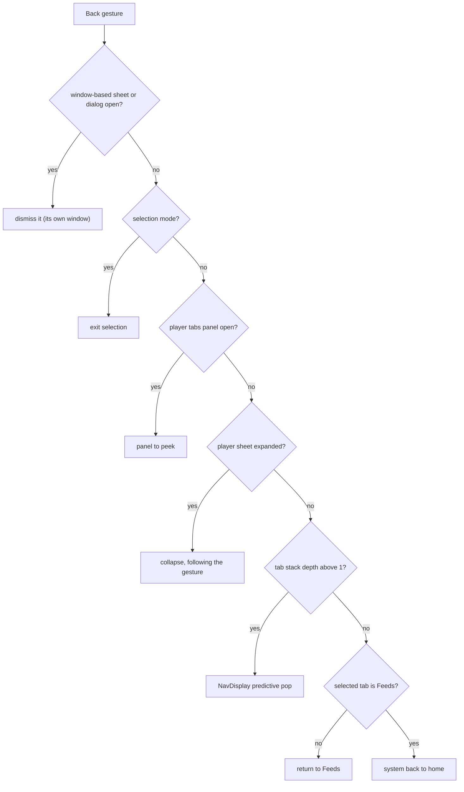
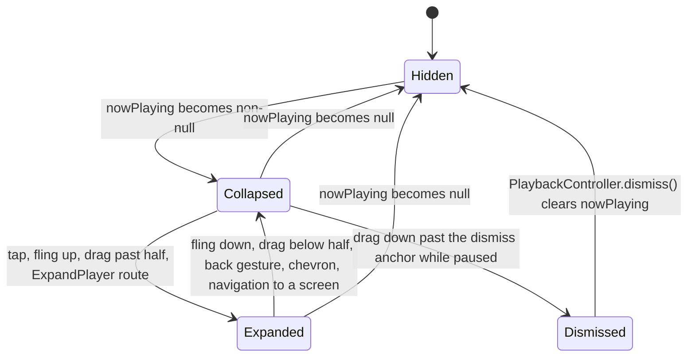
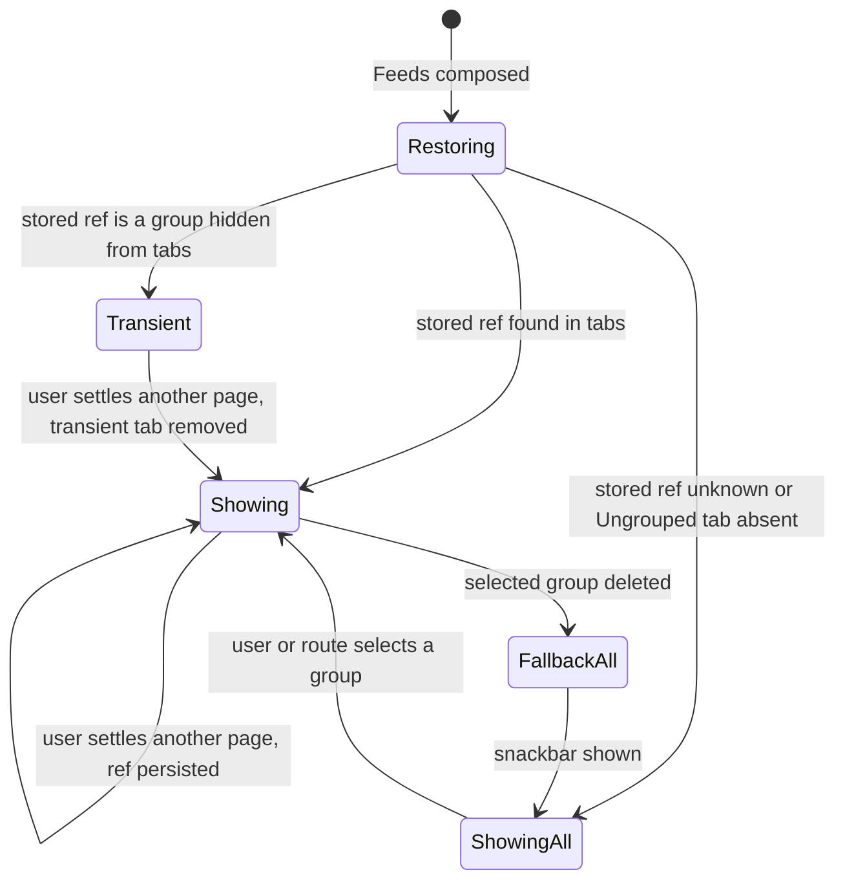
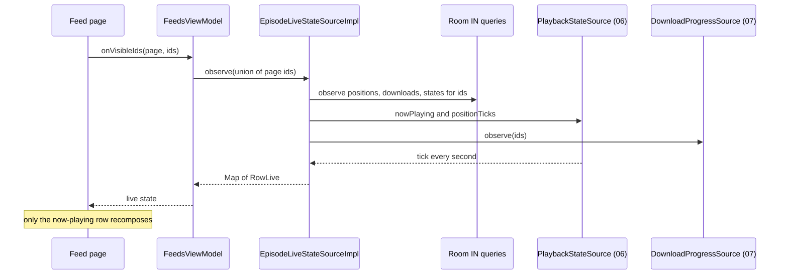
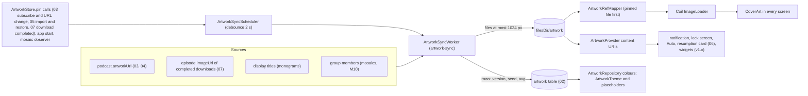

# 08 — UI and UX

> Status: Draft v1, 2026-10-04 · Implements: R2.4, R2.5, R2.8 (display), R3.7 (display), R4.6, R5.1–R5.8, and the screens of R1.1–R1.9, R2.1–R2.7, R3.1, R4.8 / N4, N5 (UI), N6, N7 (edge-to-edge, predictive back, resizability), N10 (RTL, text expansion) · Milestones: M0, M1, M2, M3, M4, M5, M6, M7, M8, M9, M10, M11, M13 · Honours: D6, D7, D16, D42, D54, D55, D56, D57, D58, D64; PO-4, PO-17, PO-19 defaults · Owns: information architecture and screen inventory, navigation behaviour, every screen's layout and states, shared components, the root `PlayerSheet`, the Feeds pager, `EpisodeLiveStateSource`, theming and colour, the artwork pipeline (`ArtworkStore`, `ArtworkSyncWorker`, `ArtworkProvider`, Coil, monograms, mosaics), adaptive layouts, accessibility, onboarding, flavor UI differences and the Settings structure

## Scope

Serves R5.1–R5.8, R2.4, R2.5, R4.6, N4, N6, N7. Delivered from [M0](../PLAN.md#m0-scaffold-and-ci) (shell, theme, five destinations) to [M10](../PLAN.md#m10-covers-theming-adaptive-layouts-and-accessibility) (release-quality covers, colour, adaptive layouts and accessibility); see [Delivery by milestone](#delivery-by-milestone).

Neutrodyne is cover-first: artwork is shown at a size where it reads on every surface (grid tiles 72–152 dp, feed rows 56 dp, podcast header 160 dp, full player ≥ 280 dp, mini player 48 dp, notification, lock screen, Auto), and artwork drives colour while the chrome stays quiet. Groups are places: each group is a tab and a page of the Feeds pager ([D55](../PLAN.md#3-key-decisions)). The player is one root sheet that follows the finger ([D56](../PLAN.md#3-key-decisions)). Everything is stable Material 3 1.4.0 wrapped in `:core:designsystem` ([D6](../PLAN.md#3-key-decisions), [PO-4](../PLAN.md#po-4-material-3-expressive)).

### Responsibilities and boundaries

| This document owns | Owned elsewhere (link, do not restate) |
|---|---|
| Destinations, screen inventory, pane roles, re-tap and back behaviour, `AppNavigator` semantics | Nav3 mechanics (installers, per-tab stacks, decorators, scene strategies, intent router) — [01 Navigation](01-foundation.md#navigation) |
| Every screen's layout, states, actions and user-visible strings (final wording) | What the actions do: feeds and add flow [03](03-feeds-and-discovery.md), YouTube [04](04-youtube.md), groups/import/backup [05](05-groups-opml-backup.md), playback [06](06-playback.md), downloads [07](07-downloads.md) |
| `EpisodeRow`, `CoverTile`, `GroupMosaic`, `CoverArt`, `MonogramPainter`, show-notes renderer, banners, selection mode | Show-notes sanitising and block model — [03 Show notes](03-feeds-and-discovery.md#show-notes) |
| `PlayerSheet`, mini/full player, side panel, speed and sleep sheets | Player behaviour, `PlaybackController`/`PlaybackStateSource` — [06 UI boundary](06-playback.md#ui-boundary) |
| Feeds pager, tabs, chips, selection persistence, visits | `FeedRepository`, counts window, "new since last visit" rule — [05 Group feeds](05-groups-opml-backup.md#group-feeds) |
| `EpisodeLiveStateSource` contract and implementation | Its `IN (:ids)` SQL — [02 Live row state](02-data-model.md#live-row-state) |
| Colour schemes, tones, tokens, `Nd*` wrappers, icons | Group palette values and icon keys — [05 Palette](05-groups-opml-backup.md#palette), [05 Icons](05-groups-opml-backup.md#icons) |
| `ArtworkStore`, `ArtworkSyncWorker`, `ArtworkProvider`, Coil `ImageLoader`, artwork keys, monograms, mosaics, the YouTube thumbnail interceptor | `artwork` table and reference SQL — [02 artwork](02-data-model.md#artwork), [02 Artwork references](02-data-model.md#artwork-references); YouTube URL sources — [04 Artwork and thumbnails](04-youtube.md#artwork-and-thumbnails); system-surface consumption — [06 Artwork rule](06-playback.md#artwork-rule) |
| Settings screen structure, `appearance.*` and `ui.*` keys | Each area's keys and semantics (03–07, 09) |
| UI test cases (screenshot matrix, accessibility checks, journeys) | Test infrastructure, Roborazzi/GMD wiring, budgets — [09 Test strategy](09-quality-and-release.md#test-strategy), [09 Performance budgets](09-quality-and-release.md#performance-budgets) |

### Modules

| Module | Contents from this document |
|---|---|
| `:core:designsystem` | `NeutrodyneTheme`, `ArtworkTheme`, `ArtworkSchemeCache` (M10), `GroupTones`, `NeutrodyneShapes`, `NeutrodyneType`, `NeutrodyneMotion`, `CoverArt`, `Covers`, `MonogramPainter`, `StatusBarAppearance`, `NdIcons` and Material Symbols vectors, every `Nd*` wrapper including `NdBanner` ([Nd wrappers and icons](#nd-wrappers-and-icons)) |
| `:core:ui` | `EpisodeRow`, `DownloadStateButton`, `DownloadRequestHandler`, `CoverTile`, `GroupMosaic`, `GroupTabLabel`, `PodcastHeader`, `ShowNotes` (renderer), `ChapterList`, `UpNextList`, `EmptyState`, `SelectionTopBar`, `FeedFilterChips`, `LiveRowState` helpers, string mappers (`PlaybackMessages`, `DownloadStatusText`, `AttributionText`, `FeedErrorText`, `AvailabilityText`), `LocalMiniPlayerInset`, `LocalSnackbarHost`, `SharedKeys` |
| `:core:model` | `RowLive` additions, `ArtColors`, `Monogram`, `MonogramSpec`, `ArtworkColors` |
| `:core:domain` | `ArtworkRepository`; `EpisodeLiveStateSource` (canonical, contract here) |
| `:core:data` | `EpisodeLiveStateSourceImpl`, `ArtworkRepositoryImpl` |
| `:core:artwork` | `DefaultArtworkStore` (`ArtworkStore`), `ArtworkKeys`, `ArtworkSyncScheduler`, `ArtworkSyncWorker`, `ArtworkColorExtractor` (M10), `MonogramRenderer`, `MosaicRenderer`, `ArtworkProvider`, `ArtworkRefMapper`, `YouTubeThumbnailInterceptor` (M8), `TinyImageInterceptor`, `NeutrodyneImageLoaderFactory` |
| `:core:navigation` | `AppNavigator.pushDetail`, `SettingsHomeKey`, `LocalNavTab`, `LocalPaneLayout`, `PaneLayout` |
| `:feature:*` | Screens and ViewModels per [Screen inventory](#screen-inventory) |
| `:app` | `NeutrodyneRoot` (root scaffold, `PlayerSheet` host, banners, snackbar host), `ndPaneLayout` (pane directive), `StartupGate` visuals |

### Threading model

| Work | Thread / context | Rule |
|---|---|---|
| Composition, ViewModel state, navigation | Main | ViewModels use `viewModelScope` (Main.immediate); repositories are main-safe ([01 Coroutines and threading](01-foundation.md#coroutines-and-threading)) |
| Paging transforms (`insertSeparators` day headers, row mapping) | `@Dispatcher(Default)` via `flowOn` before `cachedIn` | No I/O |
| Artwork scheme generation (MCU `SchemeContent`, M10) | `@Dispatcher(Default)` inside `ArtworkSchemeCache` | Never in composition; the previous scheme stays until the new one is ready |
| Coil decode and fetch | Coil's own dispatchers (IO-limited) | Interceptors and mappers do no disk I/O ([Coil ImageLoader](#coil-imageloader)) |
| `EpisodeLiveStateSourceImpl` merging | `@Dispatcher(Default)`; DAO flows on Room's IO context | Output conflated |
| `ArtworkSyncWorker` | `CoroutineWorker`; files on IO, quantisation on Default | 8-min soft deadline |
| `ArtworkProvider.openFile` | Binder thread | Blocking allowed; fallback DB read with a 2 s timeout ([01](01-foundation.md#coroutines-and-threading)) |

### Platform constraints

| Constraint | Consequence here | Source |
|---|---|---|
| Edge-to-edge enforced for target 35; opt-out removed for target 36 | Every screen handles insets ([Insets and edge-to-edge](#insets-and-edge-to-edge)) | [Android 15 changes](https://developer.android.com/about/versions/15/behavior-changes-15), [Android 16 changes](https://developer.android.com/about/versions/16/behavior-changes-16) |
| Predictive back on by default for target 36; `onBackPressed` not called | Back via Nav3 and `PredictiveBackHandler`; never intercept back at a tab root | [Android 16 changes](https://developer.android.com/about/versions/16/behavior-changes-16) |
| Orientation, resizability and aspect locks ignored on sw ≥ 600 dp (target 36); opt-out removed for target 37 | No locks anywhere; designed layouts per width class | [Android 16 changes](https://developer.android.com/about/versions/16/behavior-changes-16), [Android 17 changes](https://developer.android.com/about/versions/17/behavior-changes-17) |
| Android 14 non-linear font scaling to 200 %; `fontScale` informational | `sp` everywhere; layouts switch on `fontScale ≥ 1.5`, never compute sizes from it | [Android 14 features](https://developer.android.com/about/versions/14/features#non-linear-font-scaling) |
| Dynamic colour only on API 31+; `UiModeManager.getContrast()` only on API 34+ | Brand scheme below 31; contrast 0.0 below 34 | [Compose dynamic colour](https://dl.google.com/android/maven2/androidx/compose/material3/material3-android/1.4.0/material3-android-1.4.0-sources.jar), [UiModeManager](https://developer.android.com/reference/android/app/UiModeManager) |
| `Modifier.blur` only effective on API 31+ | YouTube banner fallback uses a gradient below 31 | [blur KDoc mirror](https://composables.com/jetpack-compose/androidx.compose.ui/ui/modifiers/blur) |
| `POST_NOTIFICATIONS` runtime permission on API 33+ | Requested contextually only ([Permission prompts](#permission-prompts)) | [Notification permission](https://developer.android.com/develop/ui/views/notifications/notification-permission) |
| Android 17 RAM-based memory limits; widget `RemoteViews` bitmap cap for target 37 | Bounded Coil caches; widgets (v1.x) use content-URI icons | [Android 17 changes](https://developer.android.com/about/versions/17/behavior-changes-17) |
| Themed app icons need a `<monochrome>` layer (Android 13); Android 16 QPR2 auto-themes icons without one | Brand icon ships a monochrome layer (PO-17, M10) | [Adaptive icons](https://developer.android.com/develop/ui/views/launch/icon_design_adaptive) |

---

## Information architecture

Serves R2.4, R5.1, R4.6. Delivered in M0 (shell) and per screen milestone. Honours [D54](../PLAN.md#3-key-decisions).

### Destinations

Five top-level destinations in a `NavigationSuiteScaffold` whose type is navigation-suite 1.4.0's default `NavigationSuiteScaffoldDefaults.navigationSuiteType(adaptiveInfo)`: `ShortNavigationBarCompact` for compact width, `ShortNavigationBarMedium` for tabletop posture or compact height (landscape phones), `WideNavigationRailCollapsed` (96 dp wide) otherwise ([navigation-suite 1.4.0 sources](https://dl.google.com/android/maven2/androidx/compose/material3/material3-adaptive-navigation-suite-android/1.4.0/material3-adaptive-navigation-suite-android-1.4.0-sources.jar)). Destinations: **Feeds · Library · Up next · Downloads · Discover**. Settings is a gear action in every top-level top app bar and, while a rail is shown, the rail's footer item ([D54](../PLAN.md#3-key-decisions)). `WideNavigationRail` 1.4.0 has a `header` slot but no footer slot, so `NdNavigationSuiteScaffold` uses `NavigationSuiteScaffoldLayout` with its own `navigationSuite` for the rail types: a `Box(fillMaxHeight)` containing the stock `WideNavigationRail(header = null, arrangement = Arrangement.Top)` with the five items, plus an `NdTooltipIconButton(settings)` with the label "Settings" aligned `BottomCenter`, 16 dp above `WindowInsets.navigationBars`; its `traversalIndex` places it after Discover. Bars (compact, short windows) show no gear item: the top app bar's gear is enough. Icons are Material Symbols Rounded (outlined when unselected, filled when selected): `dynamic_feed`, `grid_view`, `queue_music`, `download`, `explore`; gear `settings`.

| Destination | Purpose | Badge |
|---|---|---|
| Feeds | The All feed and one page per group ([Group feed pager](#group-feed-pager)) | none |
| Library | Cover grid of subscriptions, Groups view, selection mode | none |
| Up next | The user's queue and the play context ([06 Queue and play context](06-playback.md#queue-and-play-context)) | none |
| Downloads | In-progress, completed and failed downloads with storage | count of `FAILED` downloads (M6) |
| Discover | Search, charts, add by URL, YouTube channels, import | none |

### Screen inventory

Pane roles apply when the [pane directive](#pane-directive) allows two or more panes; on one pane every key pushes full-screen. "Sheet" keys render as modal bottom sheets and "dialog" keys as dialogs through 01's overlay scene strategies.

| Screen | `NavKey` | Feature module | Pane role | Milestone |
|---|---|---|---|---|
| [Feeds](#feeds) | `FeedsKey` | `:feature:feeds` | list (placeholder detail: group mosaic) | M1 (All), M2 |
| [All groups sheet](#all-groups-sheet) | `AllGroupsKey` | `:feature:feeds` | sheet | M2 |
| [Library](#library) | `LibraryKey` | `:feature:library` | list | M1, M2, M10 |
| [Podcast detail](#podcast-detail) | `PodcastKey(podcastId)` | `:feature:podcast` | detail | M1 |
| Podcast preview (same screen, preview mode) | `PodcastPreviewKey(feedUrl)` | `:feature:podcast` | detail | M7 |
| [Podcast settings](#podcast-settings) | `PodcastSettingsKey(podcastId)` | `:feature:podcast` | detail | M1, M2, M4, M6, M8 |
| [Episode detail](#episode-detail) | `EpisodeKey(episodeId)` | `:feature:episode` | extra | M1 |
| [Group editor](#group-editor) | `GroupEditKey(groupId)` | `:feature:groups` | detail | M2 |
| [Manage groups](#manage-groups) | `GroupsManageKey` | `:feature:groups` | list | M2 |
| [Group settings](#group-settings) | `GroupSettingsKey(groupId)` | `:feature:groups` | detail | M2, M4, M6 |
| [Add to groups sheet](#add-to-groups-sheet) | `AddToGroupsKey(podcastIds)` | `:feature:groups` | sheet | M2 |
| [Up next](#up-next) | `UpNextKey` | `:feature:queue` | list | M0 (empty), M4 |
| [Downloads](#downloads) | `DownloadsKey` | `:feature:downloads` | list | M0 (empty), M6 |
| [Discover](#discover) | `DiscoverKey` | `:feature:discover` | list | M0 (empty), M1, M7 |
| [Directory results](#directory-results) | `DirectoryKey(query, genreId)` | `:feature:discover` | list | M7 |
| [Add podcast sheet](#add-podcast-sheet) | `AddPodcastKey(input)` | `:feature:discover` | sheet | M1, M7, M8 |
| [Import](#import) (preview, progress, report, restore preview) | `ImportKey(sessionId)` | `:feature:importexport` | detail | M3 |
| [Backup and restore](#backup-and-restore) | `BackupKey` | `:feature:importexport` | detail | M3 |
| [Export dialog](#export-dialog) | `ExportKey(groupId)` | `:feature:importexport` | dialog | M3 |
| [Settings](#settings-screens) home | `SettingsHomeKey` (new) | `:feature:settings` | list | M0 |
| Settings page | `SettingsKey(page)` | `:feature:settings` | detail | M0 (About), per owner |
| Licences | `LicencesKey` | `:feature:settings` | detail | M0 |
| [Diagnostics](#diagnostics) | `DiagnosticsKey` | `:feature:settings` | detail | M11 |
| [Speed sheet](#speed-and-sleep-sheets) | `SpeedKey` | `:feature:player` | sheet | M4 |
| [Sleep timer sheet](#speed-and-sleep-sheets) | `SleepTimerKey` | `:feature:player` | sheet | M5 |
| [Player](#player-sheet) (mini, full, side panel) | none (`PlayerSheet`, D56) | `:feature:player`, hosted by `:app` | root overlay / side panel | M4, M10 |
| [Startup gate](#banners-and-the-startup-gate) | none | `:app` | full window | M1 |


---

## Navigation

Serves R2.4, R5.7, N7. Delivered in M0 (tabs, gear, back), M2 (feed selection routes), M4 (player back order), M10 (panes, shared elements). Honours [D7](../PLAN.md#3-key-decisions), [D56](../PLAN.md#3-key-decisions). Mechanics (per-tab `NavBackStack`s, decorators, overlay scene strategies, `IntentRouter`) are 01's ([01 Navigation](01-foundation.md#navigation)); this section defines behaviour.

### Tabs and back stacks

1. Each `TopLevelKey` has its own back stack, saved across tab switches and process death (01). Selecting another tab never clears a stack.
2. Any screen may push any non-top-level key onto the **selected** tab's stack (`AppNavigator.push`). Cross-tab jumps use `selectTab` and, for deep links, `open(tab, stack)`. Rules: podcast name tapped in Feeds, Up next, Downloads or the player → `PodcastKey` on the current tab (or, from the player, the tab underneath it); a group tile in Library → [select that group in Feeds](#selection-persistence-and-fallback) (`selectTab(FeedsKey)` after writing the selection).
3. Back from a non-start tab's root returns to Feeds; back from the Feeds root leaves the app with the system back-to-home animation (01's `visibleTabs()` rule, kept).
4. `pushDetail(key)` (member added to the canonical `AppNavigator`, implemented by 01's `NavigationState`): when the [pane layout](#pane-directive) has ≥ 2 partitions and the top entry has the same key class as `key` (for example `EpisodeKey` → `EpisodeKey`), the top entry is replaced instead of stacked, so tapping ten rows on a tablet does not build ten back entries. On one pane it equals `push`. Every list → detail tap uses `pushDetail`.

```kotlin
// :core:navigation — additions (owner 08; canonical members of AppNavigator unchanged)
interface AppNavigator {
    fun push(key: NavKey); fun selectTab(key: TopLevelKey); fun pop(): Boolean    // canonical
    fun resetTab(key: TopLevelKey); fun open(tab: TopLevelKey, stack: List<NavKey>) // 01
    fun pushDetail(key: NavKey)                                                    // replace same-type top entry on ≥ 2 panes
}
@Serializable data object SettingsHomeKey : NavKey                                 // new: the gear's target
data class PaneLayout(val partitions: Int, val playerPanel: Boolean, val contentWidthDp: Int)
val LocalPaneLayout = staticCompositionLocalOf { PaneLayout(1, false, 360) }       // provided by :app; changes only on resize/panel
val LocalNavTab = staticCompositionLocalOf<TopLevelKey> { FeedsKey }               // provided per entry by :app
```

### Re-tap behaviour

| Situation | Re-tap on the selected destination |
|---|---|
| Stack depth > 1 | `resetTab` (pop to the root); the root's scroll position is kept |
| At the root, list not at the top | Animate the visible list to item 0 (Feeds: the current page's list) |
| Feeds root, already at the top, page ≠ All | Select the All page |
| Player expanded | Collapse the sheet first; a second tap applies the rows above |

### Pane roles and detail placeholders

Metadata (01's `ListDetailSceneStrategy.listPane()/detailPane()/extraPane()`) per key is the "Pane role" column of the [Screen inventory](#screen-inventory). Detail placeholders when a list key is alone on ≥ 2 partitions: Feeds — the selected group's mosaic at 240 dp with "Select an episode"; Library — "Select a podcast" with the four most recently updated covers; Settings home — the Appearance page's content rendered as the placeholder (not a back-stack entry, so back never re-opens it in a loop; tapping a page row then uses `pushDetail(SettingsKey(page))`); other lists — none (the list takes the full width). `EpisodeKey` is an extra pane so that Library → Podcast → Episode shows three panes on ≥ 1,200 dp of content. Unverified (spike S5): that `ListDetailSceneStrategy` in `adaptive-navigation3` 1.3.0 places an extra-pane entry directly after a list entry (Feeds → Episode) beside the list; fallback: register `EpisodeKey` as `detailPane()`, accepting Podcast → Episode replacing the podcast in the detail pane.

### Sheets and dialogs

Sheet keys (`AddPodcastKey`, `AddToGroupsKey`, `AllGroupsKey`, `SpeedKey`, `SleepTimerKey`) and the dialog key (`ExportKey`) are pushed on the selected tab's stack and rendered by 01's overlay scene strategies, which must use window-based `NdModalBottomSheet`/`NdDialog` so they draw above the root `PlayerSheet` (a sheet opened from the expanded player would otherwise sit under it). Small confirmations (unsubscribe, mark all played, metered prompts, Replace restore) are plain `NdDialog`s owned by the screen, not keys. Sheets have a drag handle, 28 dp top corners, and close on back, scrim tap or swipe down.

### Deep links

01's [Intent routing](01-foundation.md#intent-routing) targets are confirmed with these behaviours:

| Route | Behaviour |
|---|---|
| `Push(AddPodcastKey(input))` | The sheet opens over the current tab with `input` pre-filled and resolution started; nothing is written until Subscribe |
| `Push(EpisodeKey(id))` | Pushed on the current tab; a missing episode shows "This episode is no longer available" with Back |
| `Navigate(LibraryKey, [PodcastKey(id)])` | Library tab, its stack replaced by `[LibraryKey, PodcastKey]` |
| `SelectFeed(groupUuid)` | Root writes `ui.feeds_selected_source = group:{uuid}` (`all` when `groupUuid == null`), then `selectTab(FeedsKey)` and `resetTab(FeedsKey)`; unknown UUID → All with a snackbar "That group no longer exists" |
| `Navigate(DownloadsKey, [])` | Downloads root |
| `ExpandPlayer` | Expands the sheet (or reveals the side panel); no-op when nothing is loaded |
| `Navigate(LibraryKey, [ImportKey(id)])` | Import screen in the state of that session |
| `Push(SettingsKey(page))`, `Push(DiagnosticsKey)` | Pushed on the current tab (back returns to where the user was) |

A route that arrives while the [startup gate](#banners-and-the-startup-gate) is shown is held by the root and applied once `NavDisplay` exists (01's start-up test). Routes only navigate; every write still needs a tap on the destination (01 security rule).

### Back handling order

`PlayerSheet` is composed after `NavDisplay` in `NeutrodyneRoot`, so its handler wins while enabled ([Navigation suite, insets and back](#navigation-suite-insets-and-back)). Order of consumers for one back gesture:



Selection mode registers its handler inside the screen's entry (composed inside `NavDisplay`, before the player) but is only enabled while selecting, and selection is impossible while the player is expanded, so the order above holds. Unverified (S5): how activity-compose 1.13.0's `PredictiveBackHandler` and Nav3 1.2.0's `NavigationBackHandler` (navigationevent 1.1.2) interleave; S5 picks one API for both `NavDisplay`-external handlers.

### Transitions and shared elements

- Screens use Nav3's default slide-and-fade push/pop and `predictivePopTransitionSpec`; with "Remove animations" on, every transition is a 0 ms snap ([Motion](#tokens)).
- Shared elements (M10, `SharedTransitionLayout` around `NavDisplay`, 01): Library tile cover ↔ podcast header cover (`SharedKeys.cover(tab, podcastId)`); feed, Up next and Downloads row thumbnail ↔ episode detail art (`SharedKeys.episodeArt(tab, episodeId)`). Keys include `LocalNavTab` because the same podcast can be visible in two tab stacks. Shared elements run only when `LocalPaneLayout.partitions == 1` (on multi-pane layouts source and target are visible together; the detail pane cross-fades instead).
- The mini ↔ full player morph is not a shared element; it is geometry inside `PlayerSheet` driven by drag progress ([Morph mapping](#morph-mapping)).

---

## Screens

Serves R1.1–R1.9 (screens), R2.1–R2.8, R3.1, R3.7, R4.6, R5.1–R5.6, N4, N6. Wireframes are compact phone portrait (360–411 dp). Legend: `( )` = 48 dp touch target, `[>]` play, `[v]` download state, `(:)` overflow, `(gear)` settings.

**Conventions for every screen.**

- Top-level screens: `NdTopAppBar` (pinned, small) with the destination title, screen actions and `(gear)` last. Pushed screens: back arrow, title, actions. The bar's container switches to `surfaceContainer` when the content is scrolled (`elevated = listState.canScrollBackward`).
- State shape follows 01 ([ViewModels and UI state](01-foundation.md#viewmodels-and-ui-state)): `Loading` (skeleton rows in `surfaceContainer`, no shimmer), `Ready`, `Failed(error, retryable)` (an [`EmptyState`](#banners-snackbars-and-undo) with the message and "Try again"). Paged lists show `LoadState.Error` as a footer row with "Retry".
- **Offline** ([N6](../PLAN.md#22-non-functional-requirements)): `NetworkMonitor.status.isConnected == false` → Feeds, Library and Up next show the offline banner; rows that are not downloaded dim their play button to `cloud_off` (tap → "You're offline — downloaded episodes still play"); nothing blocks on the network.
- Lists reserve bottom padding `LocalMiniPlayerInset.current` (80 dp while the mini player is shown) plus navigation insets.
- All strings are resources; numbers and dates use the per-app locale ([09 Localisation](09-quality-and-release.md#localisation)).

### Feeds

`FeedsKey`, `:feature:feeds`, M1 (All only, no tabs), M2 (tabs and groups). Behaviour: [Group feed pager](#group-feed-pager).

```
+--------------------------------------------------+
| Feeds                                     (gear) |  NdTopAppBar, pinned
|  All 12  *tech 5 (3)  *news 9  *fiction    (:::) |  tabs: dot, name, unplayed, (new badge); (:::) All groups
+--------------------------------------------------+
| (>) Play      [Unplayed] [In progress] [Newest v](:)|  page header item: Play + chips + overflow (scrolls away)
| TODAY                                            |  day header item
| +------+ Episode title that can wrap onto    (v) |
| |cover | a second line, then ellipsis             |
| | 56dp | Podcast name · 45 min               (>) |
| +------+ ======------------ 20 min left          |  only when started
| +----------+ [video] Video title             (v) |  YouTube row: 100x56 dp 16:9 thumbnail
| |  thumb   | Channel name · Today            (>) |
| +----------+                                     |
| YESTERDAY                                        |
| ...                                              |
+--------------------------------------------------+
| +----+ Now playing episode title   (>||) (+30)   |  mini player, 64 dp, floating
+--------------------------------------------------+
|  Feeds   Library   Up next   Downloads  Discover |
+--------------------------------------------------+
```

| State | Content |
|---|---|
| Loading | tabs from the persisted selection immediately; page shows 6 skeleton rows |
| No subscriptions | [onboarding empty state](#empty-states) instead of tabs and pager |
| Subscriptions, no groups | tab row hidden (only All exists); the [suggested groups card](#suggested-groups-card) above the list |
| Empty group | "No podcasts in 'tech' yet" + "Add podcasts" → `GroupEditKey(id)` (member picker) |
| Filters exclude everything | "You're all caught up" + "Show played episodes" (clears Unplayed) or "Clear filters" |
| Offline | offline banner; list works from the database |
| Error (paging) | footer "Couldn't load episodes" + Retry |

Actions: page header Play → `PlaybackController.playFeed(source, prefs.filters, prefs.playOrder, null)` (results: [Results and events](#issues-results-and-events)); row tap → `pushDetail(EpisodeKey)`; row play → `playFeed(source, prefs.filters, prefs.playOrder, startEpisodeId = row.id)` (06 open question 3); long-press → [selection mode](#selection-mode) (Mark played/unplayed, Play next, Play last, Download, Delete download); page overflow (group pages): Refresh this group, Mark all as played…, Download all unplayed… (M6), Hide older than… (`setHideOlderThanDays`, values 05's {off, 1, 3, 7, 14, 30, 90, 365} days), Share as OPML (M3), Import OPML into this group (M3), Edit group, Group settings, Delete group (05 [Group actions](05-groups-opml-backup.md#group-actions)); All/Ungrouped overflow: Refresh, Mark all as played…, Hide older than…; top bar overflow: Manage groups, Show Ungrouped tab (toggle `groups.show_ungrouped_tab`).

Startup metric: the Feeds route calls `ReportDrawnWhen { selectedPage.loadState.refresh is LoadState.NotLoading }` (activity-compose), so 09's `ColdStartToFeeds` journey also records time to full display.

### All groups sheet

`AllGroupsKey`, `:feature:feeds`, M2.

```
| ----                                             |  drag handle; sheet opens half height, drags to full
| All groups              (+ New group) (Manage)   |
| RECENT                                           |
| [mosaic] [mosaic] [mosaic]                       |  up to 4 by lastViewedAt
|  tech      news    fiction                       |
| ALL GROUPS                                       |
| [mosaic] [mosaic] [mosaic(eye-off)]              |  A-Z; hidden-from-tabs groups marked
|  comedy    fiction   science                     |
```

A three-column grid of [`GroupMosaic`](#groupmosaic-and-group-tab-label) tiles: section "Recent" (up to 4 groups by `lastViewedAt`) then "All groups" A–Z (Collator), including groups with `showAsTab = false` (marked with `visibility_off`). Tap → select that group in Feeds (hidden groups become a [transient tab](#selection-persistence-and-fallback)) and close. Buttons: "New group" → `GroupEditKey(null)`, "Manage groups" → `GroupsManageKey`. Empty: "No groups yet" + "New group".

### Library

`LibraryKey`, `:feature:library`, M1 (grid), M2 (groups, chips, selection), M10 (density, shared elements).

```
+--------------------------------------------------+
| Library                  (sort) (:)       (gear) |
|        [ Podcasts | Groups ]                     |  segmented button, M2
| [All] [Ungrouped] [*tech] [*news] [*fiction] [+] |  single-select chips; [+] new group
+--------------------------------------------------+
| +----------+  +----------+  +----------+         |
| |        12|  |          |  |       3  |         |  unplayed badge top-end (99+)
| |  COVER   |  |  COVER   |  | (avatar) |         |
| |          |  |       (!)|  |[yt]      |         |  status badge bottom-end; YouTube glyph bottom-start
| +----------+  +----------+  +----------+         |
| +----------+  +----------+                       |
| |   AB     |  | (ring)   |                       |  monogram tile shows the title inside; pending ring
| | Show tit.|  |          |                       |
+--------------------------------------------------+
  long-press -> | (x) 3 selected   (add to group) (unsubscribe) (:) |
```

Groups segment: a grid of [`GroupMosaic`](#groupmosaic-and-group-tab-label) tiles ("tech · 14 unplayed · 3 new"), then a "New group" tile. Tap a group → select it in Feeds; long-press → menu with the group actions of the Feeds overflow.

- Grid: `LazyVerticalGrid(GridCells.Adaptive(minCell))`, `minCell` = 72 / 100 / 152 dp from `appearance.library_density` (M1 fixed 100 dp, which gives 3 columns at 360–411 dp), 16 dp edge padding, 12 dp spacing, `key = podcastId`. Titles below tiles only when `appearance.library_titles` is on.
- Sort (`appearance.library_sort`): Title (A–Z, `java.text.Collator` of the per-app locale, as 02 requires), Recently updated (`latestEpisodeAt` desc), Most unplayed, Recently added (`subscribedAt` desc).
- Chips: All, Ungrouped, then groups in `sortOrder`; selection persisted in `ui.library_group_filter`. Data: `PodcastRepository.observeLibraryTiles(groupId)` ([03](03-feeds-and-discovery.md#unsubscribe-and-other-podcast-operations)); Ungrouped = all tiles minus podcasts with any membership (from 05's `GroupRepository.observeMemberships()`).
- Selection mode actions: Add to group… (`AddToGroupsKey(ids)`), Unsubscribe (confirmation "Unsubscribe from 3 podcasts? 12 downloaded episodes will be deleted." → `UnsubscribeUseCase`), Refresh (`refreshNow(Podcasts(ids))`), Mark all played (per podcast `markFeedPlayed(Podcast(id), null)`, confirmation with count), Select all.
- Overflow: Grid size, Show titles, Manage groups, Import subscriptions… (picker, 05), Export subscriptions… (`ExportKey(null)`), Backup and restore (`BackupKey`).
- States: loading → 12 skeleton tiles in `surfaceContainer`; empty library → onboarding empty state; filter chip with no members → "No podcasts in 'tech'" + "Add podcasts"; a selected group chip whose group was deleted → chip filter falls back to All silently; banners per [Banners and the startup gate](#banners-and-the-startup-gate) (restore running, foreign Android-backup snapshot, import in progress, offline). Library needs no network: offline only adds the banner.

### Podcast detail

`PodcastKey(podcastId)` (subscribed) and `PodcastPreviewKey(feedUrl)` (in-memory preview, 03), `:feature:podcast`, M1 (M7 preview, M8 YouTube banner, M10 tint and shared cover).

```
+--------------------------------------------------+
| (<-)                       (refresh) (gear) (:)  |  transparent bar; surface + title after the header scrolls
|  ..artwork-scheme primaryContainer gradient..    |  (YouTube: 6:1 banner, bottom scrim)
|            +----------------------+              |
|            |    COVER 160 dp      |              |  shared element from the Library tile (M10)
|            +----------------------+              |
|  Podcast Title In headlineSmall, two lines max   |
|  Author / publisher                              |
|  [ Subscribed v ]  [*tech x] [*news x] [+ Group] |  preview: [ Subscribe ] + group picker chips
|  Description, first three lines of plain text … |
|  More                                            |
|  214 episodes · Updated 2 days ago · [Private]   |
| [!] This feed needs a password   (Enter password)|  feed-state banner when applicable
+--------------------------------------------------+
| [Unplayed] [Downloaded] [Video]        Newest v  |
| 12 OCT  S2 E14 · Episode title             (v)   |  date block instead of a thumbnail
|         52 min                             (>)   |
| ...                                              |
| (Load older episodes)                            |  RSS paging pending or YouTube back catalogue (foss)
+--------------------------------------------------+
```

- Top bar: refresh (`refreshNow(Podcasts([id]))`), gear → `PodcastSettingsKey(id)`, overflow. Header: [`PodcastHeader`](#podcast-header); colours from [`ArtworkTheme`](#artwork-scoped-schemes) with the podcast cover seed (M10); status bar icons per [System bars](#status-bar-and-system-bars).
- Feed-state banner (03 [Per-feed states](03-feeds-and-discovery.md#per-feed-states)): Pending "Fetching episodes…" (spinner); NeedsCredentials "This feed needs a password" → credentials dialog (`PodcastRepository.setCredentials`); Gone "This feed no longer exists" → Edit URL / Unsubscribe; PossiblyDead "This feed hasn't updated since {date} — it may have moved" → Edit URL / Try again (`retry`); a failing feed shows `FeedErrorText(lastErrorKind)` only on this screen, never as a toast.
- List: `FeedRepository.pagedFeed(FeedSource.Podcast(id), transientFilters, order)`; `EpisodeRow` style `PODCAST` (no thumbnail unless the episode has its own art, date block 48 dp, season/episode overline from `EpisodeRow.episodeDisplay`, else `episodeType` "Trailer"/"Bonus"). Row play → `playFeed(Podcast(id), filters, order, startEpisodeId)`. The "Newest v" chip calls `FeedRepository.setFeedOrder(FeedSource.Podcast(id), order)` (persisted in `podcast.episodeOrder`, 05); the filter chips are transient ViewModel state (05 throws on `setFilters` for podcasts). Row swipes follow `appearance.swipe_*` (on by default outside Feeds, D55).
- "Load older episodes": RSS when older pages exist → `RefreshController.loadOlderEpisodes(id)`; YouTube when `YouTubeCapabilities.backCatalogue` → `YouTubeChannelRepository.loadOlder(id)` with result "Loaded 30 more" / "No more episodes" / failure text. YouTube channels call `YouTubeChannelRepository.ensureChannelArt(id)` on open (04).
- Overflow: Podcast settings, Share (website link `link`; the feed URL only through "Copy feed address" with the private-URL warning when `isPrivate`), Watch on YouTube (channel page, YouTube only), Open website, Mark all as played…, Unsubscribe (confirmation with downloaded count).
- Preview mode: Subscribe button + group chips (multi-select, "+ New group" inline), episode rows without play or download buttons ("Subscribe to play"), "Already subscribed — Open" when `alreadySubscribed.exact`, "You may already be subscribed to this show. Subscribe anyway?" otherwise; failures as in the [Add podcast sheet](#add-podcast-sheet).
- Data: 03's `PodcastDetail` (display title, author, description as `ShowNotes`, `artwork`, `bannerUrl`, `sourceType`, `link`, `episodeCount`, `latestEpisodeAt`, `status`, `health: FeedHealth` with the derived `possiblyDead`, `isPrivate`, `episodeOrder`, `showType`, `hasOlderPages`) and `ArtworkRepository.observeColors(detail.artwork.key)` for the header scheme.
- States: loading → header skeleton (cover box in the monogram tone) + 6 skeleton rows; `observePodcast` emits null (unsubscribed elsewhere, merged into another podcast) → pop with snackbar "This podcast was removed"; offline → offline banner, list from the database, refresh disabled with a tooltip; feed with no episodes → "No episodes yet" (`emptyFeed`, new show); YouTube channel with no visible episodes → "No long-form videos yet. This channel may post only Shorts or live streams." + "Podcast settings" (variants, 04 [UI per flavor](04-youtube.md#ui-per-flavor-hand-off-to-08-flavor-differences-in-ui)); preview resolution failure → the [Add podcast sheet](#add-podcast-sheet) failure texts with Retry.

### Podcast settings

`PodcastSettingsKey(podcastId)`, `:feature:podcast`. Sections (rows appear in the milestone that delivers their semantics):

```
+--------------------------------------------------+
| (<-) Settings · Show title                       |
| GENERAL                                          |
|  Custom title          The Daily (feed title)    |
|  Show in All                              [on]   |
|  Episode order                   Newest first    |
| PLAYBACK                                         |
|  Speed           1.0x · App default              |  attribution subtitle
|  While playing from 'news': 1.5x                 |  group hint
|  Skip silence    Off · App default               |
| DOWNLOADS ... NOTIFICATIONS ... REFRESH ...      |
| FEED                                             |
|  Feed address    https://ex…/feed (tap to show)  |  redacted until tapped
|  Last refresh    2 h ago · OK                    |
|  Edit feed address · Username and password       |
+--------------------------------------------------+
```

| Section | Rows | Owner of semantics |
|---|---|---|
| General | Custom title (text field, empty = feed title); Show in All (`setIncludeInAll`); Episode order (Newest/Oldest; default from `showType`) | 03, 05 |
| Playback (M4) | Speed, Skip silence — each row shows the effective value and attribution ("Set for this podcast", "App default"); a hint "While playing from 'news': 1.5×" for member groups with their own value | 05 [Effective settings resolution](05-groups-opml-backup.md#effective-settings-resolution) |
| Downloads (M6) | Auto-download, Keep latest, Network, Require charging, Include video, Delete after played | 05, 07 |
| Notifications (M2) | New episodes (permission prompt per [Permission prompts](#permission-prompts)) | 03, 05 |
| Refresh (M2) | Refresh interval (Inherit / Manual only / 1 h … 24 h; Manual only writes 0, [05 Rules](05-groups-opml-backup.md#rules)) | 03, 05 |
| YouTube (M8) | Include Shorts, Include past live streams (`YouTubeChannelRepository.setVariants`) | 04 |
| Feed (M1) | Feed address (`FeedInfo.redactedUrl`; the full `feedUrl` only after a tap, with "Copy feed address" and the private-URL warning when `isPrivate`), moves (`FeedInfo.moves`), last refresh and last error ([`FeedErrorText`](#feed-error-text)), Edit feed address ([dialog](#dialogs), RSS only), Username and password (`setCredentials`). There is no "remove password" in v1 (03 has no API for it) | 03 |

Each override row opens a chooser whose first option is "Use default ({effective inherited value}, {source})" ([`AttributionText`](#attribution-text)); choosing it writes `null` through `updatePodcast { it.copy(field = null) }`. Data: 05's `ScopeSettingsRepository.observePodcast` (`ScopedSettingsView`: `own`, `effective`, `sources`, `groupHints`) and 03's `observeFeedInfo`; `observePodcast` emitting null pops the screen. Rows a YouTube channel cannot use in this build (`SettingSource.NotSupported`, e.g. auto-download in `play`) are hidden, not disabled. Writes that return 01's `SettingsError.OutOfRange` show the field's inline error (cannot happen from the fixed choosers; defensive).

### Episode detail

`EpisodeKey(episodeId)`, `:feature:episode`, M1 (M4 actions, M5 chapters and timestamp seeks, M6 downloads, M8 YouTube).

```
+--------------------------------------------------+
| (<-)                                  (share)(:) |
|  +------------+  Episode title in titleLarge,    |
|  |  ART 120dp |  up to three lines               |  YouTube: 16:9 art full width above the title
|  +------------+  Podcast name  >                 |  tap -> PodcastKey
|  12 Oct 2026 · 52 min · S2 E14 · [video]         |
|  ======================----------  20 min left   |  when started
| [ (>) Resume ]  (v) Download  (+) Up next  (ok)  |  primary + icon buttons with labels
+--------------------------------------------------+
| [Load images]  Images are off to protect privacy |  when feeds.show_notes_images = TAP_TO_LOAD
| Show notes rendered as blocks; 12:34 is a link   |
| ...                                              |
| Chapters (12)                                    |  M5: ChapterList with images and start times
|  00:00  Intro                                    |
|  03:15  The interview                            |
+--------------------------------------------------+
```

- Primary button: Play / Pause / Resume (`playEpisode(id)`, 06 open question 3); YouTube in `play` or unavailable: "Watch on YouTube" (04 [Watch on YouTube](04-youtube.md#watch-on-youtube), with the 5 s Undo snackbar for mark-played-on-open).
- Icon buttons with labels: Download state (same states as the [row](#episoderow)), Up next (menu: Play next / Play last; `QueueRepository.addNext/addLast`), Mark played/unplayed (`EpisodeRepository.setPlayed`), Favourite (`setFavorite`, in overflow).
- Overflow: Go to podcast, Open episode web page (`link`), Watch on YouTube (YouTube, foss, with `&t=` per 04), Check again (`foss`, greyed YouTube episode with `REGION_BLOCKED`, `PRIVATE` or `UNAVAILABLE`: `YouTubeChannelRepository.recheckAvailability(id)`; null result → snackbar "Couldn't check — try again later", 04 [Content flags and filtering](04-youtube.md#content-flags-and-filtering)), Copy link, Share file (M6; shown when `DownloadController.shareableFile(id)` is non-null, i.e. a `COMPLETED` download not on an `ext:{uuid}` root, [07 Sharing a file](07-downloads.md#sharing-a-file)), Delete download.
- Show notes: [`ShowNotes`](#show-notes-renderer) renderer from `EpisodeRepository.observeShowNotes`. Chapters: `ChapterRepository.observe(id)` (06); tap → seek per 06 [Current chapter and commands](06-playback.md#current-chapter-and-commands).
- Unavailable YouTube episode: a reason line under the meta (`AvailabilityText`, [Flavor differences in UI](#flavor-differences-in-ui)).
- States: missing episode (deleted by retention or unsubscribe) → "This episode is no longer available"; notes loading → 3 skeleton paragraphs; notes empty → "No show notes"; offline and not downloaded → primary button shows `cloud_off` "Offline" and taps give the offline snackbar; images in notes stay unloaded offline (no error).

### Group editor

`GroupEditKey(groupId?)` (null = new), `:feature:groups`, M2.

```
+--------------------------------------------------+
| (x)  New group                            (Save) |
|  Name [ tech____________________ ]  4/40         |  error text under the field
|  Colour (o)(o)(o)(o)(o)(o)(o)(o)(o)(o)(o)(o)     |  12 palette swatches (+ "Custom" if imported)
|  Icon   (none) [newspaper] [memory] [science] .. |  32 keys of GroupIcons, grid in a sheet
|  Play order (Newest first | Oldest first)        |  "Play oldest first?" hint when suggested (05)
|  Show as a tab in Feeds              [on]        |
|  Members (14)                  (search)          |
|  +----+ +----+ +----+ +----+                     |  cover grid 72 dp with check overlays
|  | v  | |    | | v  | |    |                     |
+--------------------------------------------------+
| Group settings >          Delete group           |  existing groups only
+--------------------------------------------------+
```

- Name validation through `GroupRepository.checkName` as the user types (debounced 300 ms): `NameEmpty` "Enter a name", `NameTooLong(40)` "Use at most 40 characters", `NameTaken` "A group named 'Tech' already exists". The counter counts code points (05 [Names](05-groups-opml-backup.md#names)).
- Colour swatches render the palette seed through [group tones](#artcolors-tones-for-monograms-and-groups), content descriptions are the palette keys ("blue"). New groups preselect the first free colour (05).
- Members: the picker is a 72 dp `CoverTile` grid over `PodcastRepository.observeLibraryTiles(null)` (title order) with a search field filtering by display title; initial checks from `GroupRepository.observeMemberIds(groupId)`. The draft (name, colour, icon, play order, tab flag, checked IDs) is held in the ViewModel's `SavedStateHandle`, so rotation and process death keep unsaved edits; back with unsaved changes asks "Discard changes?".
- Save: `create(draft, memberIds)` or `update` + `setMembers`; result errors shown inline; success pops the screen.
- Delete: `GroupRepository.delete` → pop, snackbar "Deleted 'tech'" with Undo for 10 s (`undoDelete(token)`), no confirmation dialog (undo instead, R2.1).

### Manage groups

`GroupsManageKey`, `:feature:groups`, M2.

```
+--------------------------------------------------+
| (<-) Manage groups                        (gear) |
| = [mos] tech        14 unplayed · 3 new      (:) |  drag handle "=" starts the drag
| = [mos] news         9 unplayed              (:) |
| = [mos] fiction     Hidden from Feeds        (:) |
|                                  ( + New group ) |  extended FAB above the mini player
+--------------------------------------------------+
```

A reorderable list (`sh.calvin.reorderable` 3.1.0): drag handle, 48 dp mosaic, name, "14 unplayed · 3 new", "Hidden from Feeds" label when `showAsTab = false`, overflow (Edit, Group settings, Show in Feeds toggle, Delete). FAB "New group". Drop → `GroupRepository.reorder(idsInOrder)`; failure (`NotFound`, list changed meanwhile) → reload and snackbar "Groups changed, try again". Accessibility: custom actions "Move up", "Move down", "Move to top" ([Custom actions catalogue](#custom-actions-catalogue)). Empty: "No groups yet" + "New group" + the [suggested groups card](#suggested-groups-card) when it has suggestions.

### Group settings

`GroupSettingsKey(groupId)`, `:feature:groups`, M2 (refresh, notifications), M4 (speed, skip silence), M6 (auto-download, delete after played). Layout as [Podcast settings](#podcast-settings) without General/Feed/YouTube; the view settings (filters, order, hide older than) are edited from the Feeds page, not here. Auto-download's dependent rows are disabled with "Turn on auto-download for this group first" until the group's own auto-download is on (05 rule 1). When the group contains YouTube channels and `YouTubeCapabilities.downloads` is false, the auto-download section shows no YouTube-specific line at all (04's Play guardrail 3 forbids any download wording about YouTube in `play`); the resolver silently excludes those channels (`SettingSource.NotSupported`, 05). In `foss` from M9 the section adds "YouTube channels keep {n} (YouTube default)" when the group does not set its own keep count (04 [Auto-download for YouTube](04-youtube.md#auto-download-for-youtube)).

### Add to groups sheet

`AddToGroupsKey(podcastIds)`, `:feature:groups`, M2.

```
| ----                                             |
| Add 3 podcasts to groups                         |
| [v *tech] [- *news] [ *fiction] [ *science]      |  v checked, - indeterminate, blank unchecked
| [+ New group]                                    |
|                              (Cancel)  ( Done )  |
```

Title "Add 3 podcasts to groups" ("Groups for {title}" for one podcast). Tri-state `NdFilterChip`s per group in `sortOrder` (checked: all selected podcasts are members; indeterminate: some; unchecked: none); tapping cycles checked ↔ unchecked (indeterminate is never re-entered). "+ New group" opens an inline name field (validated as the editor) that creates the group checked. Done → `applyMembership(podcastIds, add, remove)` with only the chips the user changed (05 [Membership](05-groups-opml-backup.md#membership)); snackbar "Updated groups for 3 podcasts". Initial chip states come from one `GroupRepository.observeMemberships()` collection (05); a podcast unsubscribed while the sheet is open is dropped from `podcastIds` before Done; `GroupError.NotFound` (a group deleted meanwhile) → reload and snackbar "Groups changed, try again".

### Up next

`UpNextKey`, `:feature:queue`, M4.

```
+--------------------------------------------------+
| Up next                          (clear)(:)(gear)|
| NOW PLAYING                                      |
| +----+ Current episode title          (>||)      |  not draggable
| UP NEXT · 3                                      |
| = +----+ Episode A                        (v)    |  drag handle; swipe start-to-end removes
| = +----+ Episode B (greyed: Opens in YouTube)    |  play-flavor YouTube / unavailable items stay greyed
| = +----+ Episode C                        (v)    |
| THEN: tech, newest first            (Stop after) |  context header from observeSession()
+--------------------------------------------------+
```

- Data: `QueueRepository.observeUpNext()` and `observeSession()` (the "Then: {title}, {order}" line from `PlayContextInfo`; absent for `EXTERNAL` or no context); rows via [`UpNextList`](#episoderow) (`:core:ui`, shared with the player's tab).
- Reorder: drag → `move(episodeId, toIndex)` on drop; swipe (on by default here, D55) start→end removes with Undo (re-add + move to the old index); Clear → `clearUpNext()` with Undo (re-adds in order); "Stop after Up next" → `clearContext()`.
- Row tap → `pushDetail(EpisodeKey)`; the row's play button → `playEpisode(id)`, which keeps the current context for Up next items (06).
- Empty: "Nothing up next. Long-press any episode, then Play next." + chips "Play tech", "Play news", "Play fiction" (the first three groups by `sortOrder`, each `playFeed(Group)`); nothing playing and no groups: Discover link.
- `AddResult.Rejected` texts: `ALREADY_PLAYING` "This episode is already playing", `YOUTUBE_EXTERNAL` "YouTube episodes open in YouTube", `UNAVAILABLE` "This episode isn't available".

### Downloads

`DownloadsKey`, `:feature:downloads`, M6 (empty state from M0). Data: 07's `DownloadController.observeAll(): Flow<DownloadsOverview>` (in progress, completed and failed `DownloadEntry` lists, `StorageUsage`, `notices`) with live bytes from `DownloadProgressSource` for the visible in-progress rows ([07 Engine architecture](07-downloads.md#engine-architecture), [07 Notices](07-downloads.md#notices)); texts are [`DownloadStatusText`](#download-status-text).

```
+--------------------------------------------------+
| Downloads                        (select)(:)(gear)|
| [##########------------] 3.2 GB used · 12 GB free|  storage bar; cap marker when a cap is set
| Data Saver is on. Downloads may pause  (Settings)|  DownloadsOverview.notices (07)
| IN PROGRESS · 2                    (Pause all)   |
| +----+ Episode A  ====------ 34 MB of 52 MB  (||)|
| +----+ Episode B  Waiting for Wi-Fi          (:) |
| FAILED · 1                         (Retry all)   |
| +----+ Episode C  Server error (503)       (retry)|
| COMPLETED · 41 · 2.9 GB             (Play all)   |
| +----+ Episode D  52 MB · 12 Oct            (x)  |  swipe start-to-end deletes
+--------------------------------------------------+
```

- Rows are `DownloadEntryRow` (`:feature:downloads`), not `EpisodeRow`: they render 07's `DownloadEntry` (title, podcast, `artwork`, `DownloadStatus`, `played`, `favorite`), which lacks the feed fields `EpisodeRow` needs. They share `CoverArt` (THUMB, 56 dp), [`DownloadStateButton`](#episoderow) and [`DownloadStatusText`](#download-status-text) with `EpisodeRow`; live bytes for visible in-progress rows come from `DownloadProgressSource.observe(visibleIds)` with 07's merge rule ([07 Inputs to live row state](07-downloads.md#inputs-to-live-row-state)). One TalkBack stop per row with the [custom actions](#custom-actions-catalogue) of a Downloads row.
- Row actions follow 07's [Wait reasons](07-downloads.md#wait-reasons) table: `QUEUED` with `NONE`/`SLOT`/`CHARGING`/`SYSTEM` → "Download now" (`promote`; a `NeedsMeteredDecision` result opens the [metered dialog](#dialogs)) and Cancel (`cancel`); `UNMETERED_NETWORK` → "Use mobile data" (`setAllowMetered(ids, true)`, manual lane) or "Download now" (`promote`, auto lane); `STORAGE` → "Manage storage" (`ACTION_MANAGE_STORAGE`); `BACKOFF` → "Retry now" (`retry`); `NEEDS_FOREGROUND` → tap resumes (`resume`); `DOWNLOADING` → Pause (`pause`), bytes "12.3 MB of 48.0 MB · 1.2 MB/s"; `PAUSED` → Resume; `FAILED` → Retry (`retry`) and Dismiss (`cancel`); `COMPLETED` → tap opens the episode, swipe or (x) deletes (`delete(ids, byUser = true)`, no undo: the file is gone), play button plays it, overflow (:) offers Share file under the same rule as [Episode detail](#episode-detail) and Delete. Section buttons: "Pause all"/"Resume all" (`pauseAll`/`resumeAll`), "Retry all" (`retry(failed ids)`).
- "Play all" and a completed row's play button start the `DOWNLOADS` context ([05 Context per entry point](05-groups-opml-backup.md#context-per-entry-point)): 06's `nd.PLAY_CONTEXT` handles `DOWNLOADS`, but `PlaybackController.playFeed` takes a `FeedSource`, which has no Downloads value, so 08 calls `PlaybackController.playDownloads(startEpisodeId: Long? = null): PlayResult` ([06 Modules and public API](06-playback.md#modules-and-public-api), M6). Selection mode: Delete (confirmation "Delete 12 downloads (640 MB)?"), Select all completed / played.
- States: loading → skeleton rows; storage bar shows "—" while `observeStorage()` has not emitted; the screen is fully usable offline (rows show "Waiting for a connection").
- `DownloadsOverview.notices` render as `NdBanner`s above the lists (at most two, in 07's table order) with 07's texts adopted as the final wording ([07 Notices](07-downloads.md#notices)): `DATA_SAVER` (open the data-restriction settings), `BACKGROUND_RESTRICTED`, `NOTIFICATIONS_OFF` (Allow → the contextual prompt, [Permission prompts](#permission-prompts)), `CAP_REACHED`, `STORAGE_LOW` (Manage storage), `ROOT_UNAVAILABLE`, `YOUTUBE_PAUSED` (04's breaker text with "Try now" → `YouTubeHealth.retryNow()`; shown above the YouTube rows), `MOVE_IN_PROGRESS`, `ORPHAN_FILES` (Delete → confirmation → `deleteOrphanFiles()`). `play` cross-grade leftovers: completed YouTube files are listed with Delete only (04, 07).
- Empty: "Downloaded episodes play offline" + storage summary + "Auto-download settings" (`SettingsKey(DOWNLOADS)`).

### Discover

`DiscoverKey`, `:feature:discover`, M1 (add by URL and import entry points), M7 (search, charts), M9 (YouTube channel search in `foss`).

```
+--------------------------------------------------+
| Discover                                  (gear) |
| [ (search) Search podcasts or paste a link    ]  |  NdSearchBar; keyboard only on tap
| Searches are sent to Apple and fyyd              |  provider disclosure (03)
| (+ Add by URL) (Add YouTube channel) (Import)    |  assist chips; YouTube search chip in foss
| TOP PODCASTS                              (more) |
| [cov][cov][cov][cov][cov] ->                     |  horizontal list of 120 dp tiles
| POPULAR IN TECH                           (more) |  for group names that map to a genre
| [cov][cov][cov] ->                               |
| CATEGORIES                                       |
| [Technology] [News] [Comedy] [Fiction] ...       |
+--------------------------------------------------+
```

- Typing: results update in place below the field (`SearchRepository.search`, debounce and minimum length are 03's); a pasted URL shows a chip "Add this link" → `AddPodcastKey(text)`; from M8, text that `YouTubeUrlClassifier.classify` accepts (an `@handle` such as `@mkbhd`, a `UC…` ID or a YouTube link; both flavors) shows "Add YouTube channel {text}" instead → `AddPodcastKey(text)`, whose resolver takes 03's YouTube pre-check ([03 Input normalisation](03-feeds-and-discovery.md#input-normalisation)); IME search → `DirectoryKey(query, null)` when results exceed the inline 10.
- Provider status: a provider in `Failed`/`RateLimited` shows "Apple search is busy, showing fyyd results"; all failed → "Search isn't available right now" + Retry.
- "Search YouTube channels" (`foss`, `YouTubeCapabilities.channelSearch`, M9): runs only on that explicit action (04); hits open `AddPodcastKey("https://www.youtube.com/channel/{id}")`.
- Offline: chips and import still work; search shows "You're offline".
- Loading: charts show 5 skeleton tiles per row; inline search results show a 2 dp indeterminate `NdProgress.Linear` under the field (results of the previous query stay visible). Charts failing → the section is hidden (no error card); "Popular in {group}" appears only for groups whose name matches a genre (03 [Charts and genres](03-feeds-and-discovery.md#charts-and-genres)).

### Directory results

`DirectoryKey(query, genreId)`, `:feature:discover`, M7.

```
+--------------------------------------------------+
| (<-) "history"                            (gear) |  or the genre name
| [!] fyyd didn't answer, showing Apple results    |  partial-results banner
| +-----+ Show title                   [Subscribed]|
| | 64dp| Author                                   |
| +-----+ 120 episodes · updated 3 days ago        |
|         Apple, fyyd                              |
| ...                                              |
+--------------------------------------------------+
```

A list of `DirectoryHit` cards: 64 dp cover, title, author, "120 episodes · updated 3 days ago", providers line ("Apple, fyyd"), "Subscribed" chip when `subscribedPodcastId != null`. Tap → `PodcastKey(subscribedPodcastId)` or `pushDetail(PodcastPreviewKey(feedUrl))`. Partial results banner per provider status; loading: 6 skeleton cards; empty: "No podcasts found for 'xyz'" + "Add by URL"; all providers failed: "Search isn't available right now" + Retry; offline: "You're offline" + Retry. Results are not persisted: after process death the query re-runs.

### Add podcast sheet

`AddPodcastKey(input)`, `:feature:discover`, M1 (direct feed URLs), M7 (autodiscovery, chooser, intents), M8 (YouTube). Calls 03's `AddPodcastResolver` and `SubscribeUseCase`; the YouTube branch is 04's ([04 Subscribe flow](04-youtube.md#subscribe-flow)).

```
+--------------------------------------------------+
| ----                                             |  drag handle
| Add a podcast                                    |
| [ https://example.com/feed.xml_______ ] (paste)  |
|                                                  |
| +------+ Show title                              |  preview card
| |cover | Author · 214 episodes · last 2 Oct      |
| +------+ [Private feed]                          |
| Add to groups: [*tech] [*news] [+ New group]     |
| This show also has a podcast feed  (Use podcast) |  YouTube + suggest_rss card (04)
|                       (Cancel)    ( Subscribe )  |
+--------------------------------------------------+
```

| `AddResolution` / result | Sheet shows |
|---|---|
| resolving | progress line "Looking up…" (cancellable) |
| `Feed(preview)` | preview card; Subscribe disabled for `NoMedia`; "Already subscribed — Open" for exact duplicates |
| `Choose(candidates)` | "This page has several feeds" list (title, episodes, source) |
| `YouTube(ref)` (M8) | the ViewModel continues with 04's [Subscribe flow](04-youtube.md#subscribe-flow): `YouTubeChannelResolver.resolve(ref, AVATAR)` and, in parallel, `findRssAlternative(title)` (8 s); the card shows avatar (monogram while loading or when `title == null`, then the channel ID as title), title, "Long-form uploads only — change in podcast settings"; the RSS card "This show also has a podcast feed — Subscribe to the podcast instead" appears only when a match arrives, and "Use podcast" re-runs `resolve(hit.feedUrl)` in the same sheet; resolution failures use 04's error table (Edit / Retry); Subscribe → `SubscribeUseCase.youTube(resolved, variants, groupIds)` |
| `Failure(NotAUrl(q))` | "Search for 'q'" → `DirectoryKey(q, null)` (M7; before M7: "Enter a feed address") |
| `Failure(AuthRequired)` | username/password fields → `resolve(input, credentials)` |
| `Failure(SubscriptionList(url))` | "This is a subscription list" + "Import it" (05 `ImportRepository.create(ImportSource(url, null))` → `ImportKey(sessionId)`) |
| other failures | [`AddPodcastError` text](#error-handling-and-failure-modes) + Retry / Edit |
| `SubscribeError` | `AlreadySubscribed(id)` → "Already subscribed" + "Open"; `Fetch(e)` → the `AddPodcastError` text of `e` + Retry; `NoMedia` → "This feed has no audio or video episodes"; `Storage` → "Not enough storage space" |
| subscribed | sheet closes; snackbar "Subscribed to {title}" + "Open" → `PodcastKey` |

The empty field's helper text is "Paste a podcast feed, website, Apple Podcasts or YouTube link, or a YouTube @handle" (`play` and `foss` alike; before M8 without "or a YouTube @handle"); a bare `@handle` resolves through 03's YouTube pre-check and never reaches `NotAUrl`; every "Add a YouTube channel" and "Add by URL" entry point opens this same sheet with `AddPodcastKey(null)`. The sheet's state (input, preview id, chosen groups) is `rememberSaveable`; after process death the preview is re-resolved from the saved input (previews are memory-only, D24).

### Import

`ImportKey(sessionId)`, `:feature:importexport`, M3 (M8 YouTube formats). One screen whose body follows `ImportSessionView.state` and `format` (05 [Preview contract](05-groups-opml-backup.md#5-preview-contract)).

```
PREVIEW                                         FETCHING / DONE
+-------------------------------------------+   +-------------------------------------------+
| (x) Import                                |   | (<-) Import                                |
| 142 podcasts and 3 YouTube channels in    |   | Fetched 87 of 139   [=======-----]         |
| antennapod-feeds.opml                     |   | DONE · 131                                 |
| [!] This file is damaged; folders could   |   |  +--+ Show A  (cover pops in when fetched) |
|     not be read                           |   | NEED ATTENTION · 5                         |
| GROUPS (6)                   [Import on]  |   |  +--+ Show B  Not a podcast feed           |
|  tech (12)          [on]  (rename)        |   |       (Retry) (Edit URL) (Remove)          |
|  feeds (142) [off] looks like a container |   |  +--+ Show C  Needs a password (Enter)     |
| OPTIONS                                   |   | ALREADY SUBSCRIBED (GROUPS UPDATED) · 3    |
|  Treat existing episodes as played [off]  |   | NO AUDIO OR VIDEO FOUND · 2  (Remove all)  |
|  Notify me about new episodes      [off]  |   | MERGED WITH EXISTING · 1                   |
| [All] [Only new] [Not imported]  (search) |   | WILL LOAD LATER · 2                        |
| [v] AB  Show title    host.com  [Private] |   | NOT IMPORTED · 4                           |
| [ ] CD  Show title    host.com  [Already] |   | Re-download 23 episodes (1.1 GB)  (M6)     |
|            ( Subscribe to 139 )           |   +-------------------------------------------+
+-------------------------------------------+   sticky bottom button on the left
```

- Preview rows show monograms only (05: covers never load in the preview), title and host (never the full URL), chips YouTube / Already subscribed / Duplicate / Invalid / Private feed. Group proposals: switch, rename (validated with `GroupNames` rules), excluded reason text. Header warnings map 05's codes: `SALVAGED` "This file is damaged; folders could not be read", `IGNORED_OUTLINES` "{n} entries were ignored: episode lists" (05's wording), `TRUNCATED_NAMES` "{n} group names were shortened to 40 characters", `LINKED_LISTS` "{n} linked subscription lists were not opened" (`include`/`link` outlines are never fetched, 05). Filter chips map to `ImportItemFilter` (`ALL`, `NEW_ONLY`, `NOT_IMPORTED`; `NEEDS_ATTENTION` in the report); the search box narrows on title and host. Turning on "Notify me about new episodes" runs the [notification permission prompt](#permission-prompts).
- Progress and report sections follow 05's item-status table ([05 Session and item states](05-groups-opml-backup.md#session-and-item-states)): Done (`SUBSCRIBED`), Need attention (`NOT_A_FEED`, `AUTH_REQUIRED`, `GONE`, `FETCH_FAILED` except `DEFERRED`), Already subscribed (groups updated), Merged with existing, No audio or video found (with "Remove all"), Will load later (`FETCH_FAILED` with `errorDetail = DEFERRED`: "YouTube isn't responding; this channel loads with a later refresh", no actions), Not imported. Rows show covers as each feed resolves (`podcastId` present → `CoverArt` of the podcast); need-attention rows show [`FeedErrorText`](#feed-error-text) of `errorDetail`. Actions call `ImportRepository.retry/editUrl/enterPassword/remove` (05 [Report and fix-ups](05-groups-opml-backup.md#8-report-and-fix-ups)); Remove is offered only for items this session created. Cancel during FETCHING → confirmation "Stop importing? Podcasts added so far stay in your library and load later." → `cancel(sessionId)`.
- Backup sessions (`format = NEUTRODYNE_BACKUP`) show the **restore preview** instead: 05's preview sentence from `BackupRepository.inspect(sessionId)` (`BackupPreview`), checkboxes Listening history / Up next / Settings (Merge preselects history and Up next; switching to Replace checks all three), mode Merge (default) / Replace, and for Replace a confirmation dialog naming its effect ("Removes 9 podcasts and 2 groups that are not in the backup, and replaces your listening history"); confirming Replace first calls `PlaybackController.pause()`, then `restore(sessionId, RestoreRequest(mode, categories))`. `inspect` errors show 05's `BackupError` texts with "Choose another file". Restore progress comes from `BackupRepository.observeRestore()` ("Restoring… {phase} {done} of {total}"); `RestoreRunning` → "A restore is already running". After restore the same screen shows the report, including the M6 re-download offer, whose tap calls `DownloadController.request(ids, MANUAL, null)` from this visible screen (05 [After restore](05-groups-opml-backup.md#after-restore)).
- Errors before a session exists (picker): [`ImportError` texts](#error-handling-and-failure-modes) in a dialog. Cancel in PREVIEW → `cancel(sessionId)` and pop. `observeSession` emitting null (session cleaned up after 7 days, or cancelled elsewhere) → "This import is no longer available" + Back.

### Backup and restore

`BackupKey`, `:feature:importexport`, M3; also reachable as Settings › Backup.

```
+--------------------------------------------------+
| (<-) Backup and restore                          |
| EXPORT                                           |
|  Export subscriptions (OPML)                     |
|  Export YouTube channels (NewPipe)         (M8)  |
| BACKUP                                           |
|  Include passwords for private feeds      [off]  |
|  ( Create backup )      Last backup: 3 days ago  |
| RESTORE                                          |
|  Restore from file…                              |
| ANDROID BACKUP                                   |
|  Include your library in Android backup   [on]   |
|  Updated today · 1.2 MB                          |
+--------------------------------------------------+
```

| Section | Rows |
|---|---|
| Export | "Export subscriptions (OPML)" → `ExportKey(null)`; "Export YouTube channels (NewPipe)" (M8, the same dialog with NewPipe JSON preselected) |
| Backup | "Include passwords for private feeds" switch (off each time, never remembered) with "Passwords are stored unencrypted in the file"; "Create backup" → `BackupRepository.preflight(includePasswords)`; when `privateLinks > 0` or `passwords > 0` the [private-links warning](#dialogs) ("This backup contains private access links for N feeds. Anyone with the file can listen to them." / "…and N passwords in plain text.", Continue / Cancel); then `CreateDocument("application/zip")` named `neutrodyne-backup-{yyyy-MM-dd-HHmm}.zip`; then `createBackup(uri, includePasswords)` (runs on `@ApplicationScope`, so leaving the screen does not cancel it; a spinner row "Creating backup…" while running); result snackbar "Backup saved (2.4 MB)" or 05's `BackupError` text; "Last backup: 3 days ago" from `backup.last_manual_backup_at` |
| Restore | "Restore from file…" → `OpenDocument(arrayOf("*/*"))` picker → `ImportRepository.create` → `ImportKey(sessionId)` (restore preview, [Import](#import)) |
| Android backup | Switch "Include your library in Android backup" (`backup.auto_snapshot_enabled`, written through `BackupRepository.setSnapshotEnabled`) with "Requires a screen lock" and the static helper "Works only when your phone's backup service (for example Google backup or Seedvault) is on. Otherwise use Create backup." (an app cannot query the transport, [05 Auto Backup](05-groups-opml-backup.md#auto-backup)); status line from `observeSnapshotStatus()` ("Updated today, 1.2 MB"; `lastError = "too_large"` → "Android backup couldn't be updated: library too large"); "Android backup needs a screen lock" when `KeyguardManager.isDeviceSecure` is false; when `foreignPending` the row "A backup from another installation is waiting" with Restore (`restoreAndroidBackup()` → `ImportKey(sessionId)`) and Discard (`discardAndroidBackup()`, confirmation) |
| Debug builds only | "Write snapshot now" → `BackupRepository.writeSnapshotNow()` (05's `bmgr` procedure) |

### Export dialog

`ExportKey(groupId)`, `:feature:importexport`, M3.

```
+------------------------------------------+
| Export subscriptions                     |  or "Share 'tech' as OPML"
| (o) Grouped (recommended)                |  backup.opml_layout
| ( ) Flat list                            |
| ( ) NewPipe JSON (YouTube channels)      |  M8, full export only
| Include YouTube channels          [on]   |  "Other podcast apps may not be able to play these"
| Include passwords for private feeds [off]|
|               (Share)   (Save to file)   |
+------------------------------------------+
```

Options and warnings are 05's ([05 Options and warnings](05-groups-opml-backup.md#options-and-warnings), [05 Destinations](05-groups-opml-backup.md#destinations)); the layout and YouTube switch start from `backup.opml_layout` / `backup.opml_include_youtube` and write them back on export; passwords start off every time. Both buttons run the same flow: `ExportRepository.prepare(ExportRequest(groupId, format, layout, includeYouTube, includePasswords))` → if `privateLinks > 0` or `passwords > 0`, the [private-links warning](#dialogs) (Continue / Cancel) **before** the file leaves the app → "Save to file": `CreateDocument(export.mimeType)` launched with `export.fileName`, then `saveTo(export, uri)`; "Share": `ACTION_SEND` of `export.shareUri` wrapped in `Intent.createChooser` (with `ClipData` and `FLAG_GRANT_READ_URI_PERMISSION`, 05). Result: snackbar "Saved" with "Share", or 05's `ExportError` text; a cancelled document picker shows nothing.

### Settings screens

`SettingsHomeKey` (list) and `SettingsKey(page)` (detail), `:feature:settings`, M0.

```
+--------------------------------------------------+
| (<-) Settings                                    |
| (palette)  Appearance    System theme, wallpaper |
| (feed)     Feeds         Every 4 hours           |
| (explore)  Discover      Apple, fyyd             |
| (play)     Playback      1.0x, skip silence off  |
| (download) Downloads     Wi-Fi only, 1.2 GB      |
| (yt)       YouTube       Long-form only          |  shown when YouTube subscriptions exist or M8+
| (backup)   Backup        Android backup on       |
| (shield)   Privacy                               |
| (info)     About         1.0.0 (foss)            |
+--------------------------------------------------+
```

The home list shows one row per `SettingsPage` with an icon and a summary of its most relevant current values; pages are described in [Settings screen structure](#settings-screen-structure). A page row is shown from the milestone that delivers its first setting (M0: Appearance, About; the YouTube row from M8). On ≥ 2 partitions the home list is the list pane and the Appearance page is shown beside it as the detail placeholder ([Pane roles and detail placeholders](#pane-roles-and-detail-placeholders)). `LicencesKey` renders AboutLibraries data with `Nd*` components (01 [AboutLibraries and the Licences screen](01-foundation.md#aboutlibraries-and-the-licences-screen)): a searchable list (name, version, licence) → detail with the full licence text; `foss` from M9 adds the NewPipe Extractor notice at the top (04 [Notices](04-youtube.md#notices)).

### Diagnostics

`DiagnosticsKey`, `:feature:settings`, M11. Visual shell only; contents and actions are 09's ([09 Crash reporting and diagnostics](09-quality-and-release.md#crash-reporting-and-diagnostics)).

```
+--------------------------------------------------+
| (<-) Diagnostics                       (refresh) |
| Detailed log for 24 hours                 [off]  |  diagnostics.verbose_log_until
| APP         1.0.0 (1000095) foss · Android 16    |
| REFRESH     last run 10:42 · 212 ok, 3 failed    |
| BACKGROUND  bucket ACTIVE · (!) Data Saver on    |  WARNING / PROBLEM lines tinted
|             (Open battery settings)              |
| JOBS ... DOWNLOADS ... YOUTUBE ... DATABASE ...  |
| NOTIFICATIONS ... PARSE WARNINGS (12) v          |  expandable
| LOG (500 lines, monospace)                     v |
|------------------------------------------------- |
| (Copy diagnostics) (Report a problem) (Export DB)|  bottom bar
+--------------------------------------------------+
```

One card per `DiagnosticsSection` of `DiagnosticsRepository.snapshot()`, in 09's `DiagnosticsSectionId` order (`APP`, `REFRESH`, `BACKGROUND`, `JOBS`, `DOWNLOADS`, `YOUTUBE`, `DATABASE`, `NOTIFICATIONS`, `PARSE_WARNINGS`, `LOG`); each `DiagnosticsLine` is a key/value row, `WARNING` in `tertiary`, `PROBLEM` in `error` with an icon (never colour alone). `PARSE_WARNINGS` and `LOG` are collapsed by default; the log reads `observeLogLines()`. The Background card has "Open battery settings" → `ACTION_IGNORE_BATTERY_OPTIMIZATION_SETTINGS` (fallback `ACTION_APPLICATION_DETAILS_SETTINGS`), never a direct exemption request. Bottom bar: "Copy diagnostics" (`toPlainText`, snackbar "Copied"), "Report a problem" (09's issue URL), "Export database copy" (confirmation that subscriptions, titles and history are included, then share; `DiagnosticsError.NOT_ENOUGH_SPACE` → "Not enough storage space"). Loading: skeleton cards while `snapshot()` runs (≤ 2 s per section, 09); an unavailable section shows 09's "unavailable" line. All text selectable.

---

## Components

Serves R5.1, R5.2, R5.4, R5.6, R5.8, R4.6, N4. Delivered in M1 (`CoverArt`, `CoverTile`, `EpisodeRow` basics, show notes), M2 (mosaics, tabs, chips, selection, swipe), M4 (player-related row states), M6 (download states), M8 (YouTube states), M10 (polish). Every shared component lives in `:core:ui` (model-aware) or `:core:designsystem` (model-agnostic, `Nd*`); screen-specific rows (`DownloadEntryRow`) live in their feature. Each has `@Preview`s and a Roborazzi test ([Screenshot matrix](#screenshot-matrix)).

### EpisodeRow

`@Composable fun EpisodeRow(...)` in `:core:ui` renders 02's `EpisodeRow` model (same simple name, different package; Kotlin resolves the composable call and the type separately, like `kotlin.collections.List`).

```kotlin
// :core:ui
enum class EpisodeRowStyle { FEED, PODCAST, QUEUE }            // Downloads uses DownloadEntryRow (:feature:downloads)
@Immutable data class RowCaps(val inAppPlayback: Boolean, val downloads: Boolean,  // from YouTubeCapabilities for YouTube rows
                              val swipe: SwipeConfig?, val offline: Boolean)
@Immutable data class SwipeConfig(val startToEnd: SwipeAction, val endToStart: SwipeAction)
// SwipeAction lives in :core:model (it is also the type of the appearance.swipe_* keys):
// enum class SwipeAction { ADD_UP_NEXT, MARK_PLAYED, DOWNLOAD, REMOVE_FROM_UP_NEXT, DELETE_DOWNLOAD, NONE }
sealed interface EpisodeAction {
    val episodeId: Long
    data class Open(override val episodeId: Long) : EpisodeAction
    data class PlayToggle(override val episodeId: Long) : EpisodeAction
    data class PlayNext(override val episodeId: Long) : EpisodeAction
    data class PlayLast(override val episodeId: Long) : EpisodeAction
    data class DownloadToggle(override val episodeId: Long) : EpisodeAction     // per download state (table below)
    data class SetPlayed(override val episodeId: Long, val played: Boolean) : EpisodeAction
    data class OpenPodcast(override val episodeId: Long, val podcastId: Long) : EpisodeAction
    data class WatchOnYouTube(override val episodeId: Long, val videoId: String) : EpisodeAction
    data class Select(override val episodeId: Long) : EpisodeAction             // long-press / toggle in selection mode
    data class CheckAvailability(override val episodeId: Long) : EpisodeAction  // foss greyed YouTube rows (04 "Check again")
}
@Composable fun DownloadStateButton(state: DownloadState?, waitReason: WaitReason?, progress: Float?, // null = indeterminate
                                    onClick: () -> Unit, modifier: Modifier = Modifier)            // shared with DownloadEntryRow
@Composable fun EpisodeRow(
    row: EpisodeRow, live: RowLive?, style: EpisodeRowStyle, caps: RowCaps,
    highlightNew: Boolean, selected: Boolean?,          // null = not in selection mode
    onAction: (EpisodeAction) -> Unit, modifier: Modifier = Modifier,
)
```

**Anatomy** (min height 72 dp, grows with font scale; 16 dp horizontal and 8 dp vertical padding):

| Slot | `FEED`, `QUEUE` | `PODCAST` |
|---|---|---|
| Leading | 56 dp square [`CoverArt`](#coverart-and-covertile) (8 dp corners) of `row.artwork` (episode art when it differs, else the cover); YouTube rows: 100 × 56 dp 16:9 thumbnail (`row.artwork`), or the square channel avatar `row.podcastArtwork` when `appearance.youtube_row_art = CHANNEL_AVATAR`; "differs" means `row.artwork.key != row.podcastArtwork.key` ([02 Feed pages](02-data-model.md#feed-pages)) | 48 dp date block (day `titleMedium`, month `labelSmall`); the episode's own art (if any) replaces it at 56 dp |
| Overline | — | `episodeDisplay` ("S2 E14", "Trailer", "Bonus") in `labelSmall` when present |
| Title | `titleSmall`, max 2 lines; 8 dp `primary` dot before it when `highlightNew` | same |
| Meta | `bodySmall`, 1 line: "{podcastTitle} · {date} · {duration}" | "{duration}" plus badges |
| Badges (inline 16 dp) | `check` when played; `videocam` when `isVideo`; `smart_display` when YouTube; `favorite` when favourite | same |
| Progress | 3 dp `NdProgress.Linear` plus "{n} min left" (`labelSmall`) when `startedAt != null && playedAt == null` and a position is known | same |
| Status line | first of: unavailable reason; download failure or wait text; nothing | same |
| Trailing | download button then play button, each 48 dp with 24 dp icons | same |

Dates: Today / Yesterday / weekday name within 6 days / "d MMM" this year / "d MMM yyyy" otherwise (`DateFormat.getBestDateTimePattern(locale, "dMMM")`), computed from `pubDate ?: sortDate` in the device zone. Durations (`live.durationMs ?: row.durationMs`): "45 min", "1 h 5 min"; unknown (YouTube from Atom, `play` always) → omitted in rows, "—" in episode detail (04 [UI per flavor](04-youtube.md#ui-per-flavor-hand-off-to-08-flavor-differences-in-ui)). Remaining = duration − position in content time (not divided by speed), rounded up to whole minutes; hidden when the duration is unknown.

**Playback states** (from `row` plus `live`):

| State | Visual | Play button |
|---|---|---|
| Unplayed | normal | `play_arrow` "Play" |
| New since last visit | 8 dp `primary` dot before the title | as unplayed |
| In progress | progress bar + "20 min left" | `play_arrow` "Resume" |
| Now playing, playing | container `secondaryContainer`; equaliser glyph after the title (static when animations are off) | `pause` "Pause" |
| Now playing, paused | container `secondaryContainer` | `play_arrow` "Resume" |
| Played | title and meta `onSurfaceVariant`, check badge, no progress | `play_arrow` "Play again" |
| Offline and not downloaded | play icon `cloud_off`, 60 % alpha | tap → offline snackbar |
| Unavailable (`availability` not `AVAILABLE`, foss) | row at 60 % alpha, reason in the status line; custom action "Check again" for `REGION_BLOCKED`, `PRIVATE`, `UNAVAILABLE` (`CheckAvailability`) | `open_in_new` "Watch on YouTube" |
| External (YouTube, `!caps.inAppPlayback`) | normal; status "Opens in YouTube" | `open_in_new` replaces both buttons |

**Download states** (`live.downloadState ?: row.downloadState`, `live.waitReason`; hidden for YouTube when `!caps.downloads`):

| `DownloadState` (+ `WaitReason`) | Trailing icon | Status line | Tap |
|---|---|---|---|
| none | `download` outline | — | `request(ids, MANUAL, null)` (metered prompt per [Dialogs](#dialogs)) |
| `QUEUED` + `NONE`/`SLOT` | `schedule` inside an indeterminate ring | "Queued" | menu: Download now, Cancel |
| `QUEUED` + other reasons | `schedule` | [`DownloadStatusText`](#download-status-text) ("Waiting for Wi-Fi", "Retrying in 4 min", "Tap to resume") | menu: the reason's action from 07's [Wait reasons](07-downloads.md#wait-reasons) (Use mobile data, Download now, Retry now, Manage storage) and Cancel; `NEEDS_FOREGROUND`: tap resumes |
| `RESOLVING`, `VERIFYING` | indeterminate ring | — | Cancel (`RESOLVING` only) |
| `DOWNLOADING` | determinate ring (`downloadedBytes / totalBytes`, indeterminate when total unknown) around `stop` | "34 %" | Pause |
| `PAUSED` | `pause_circle` | "Paused" | Resume |
| `COMPLETED` | `download_done` filled, `primary` | — | menu: Delete download |
| `FAILED` | `error`, `error` colour | short error text | Retry |
| `MISSING` | `error` outline | "File missing" | Re-download (`request(ids, MANUAL, null)`) |

Every `request`/`promote` call from a row, episode detail, selection mode or "Download all" handles 07's `RequestResult` the same way (`DownloadRequestHandler`, `:core:ui`): `NeedsMeteredDecision` → the [metered dialog](#dialogs); `Queued(askNotificationPermission = true)` → the [notification prompt](#permission-prompts); `Queued.rejected` non-empty → one snackbar for the first reason: `EPISODE_GONE` "This episode is no longer available", `NOT_DOWNLOADABLE` "This episode has no file to download", `UNSUPPORTED_STREAM` "This episode can only be streamed", `YOUTUBE_NOT_SUPPORTED` "YouTube episodes open in YouTube", `UNAVAILABLE` "This episode isn't available" (prefixed "{n} episodes skipped: " when several were requested); `Queued(queued = 0, alreadyPresent > 0)` → nothing. Requests always come from visible UI, so 07 can schedule its user-initiated job (D47).

**Interaction.** Tap row → `Open`; tap play → `PlayToggle` (the screen decides between `playFeed` with a start item, `playEpisode`, `pause()` or `play()`; [Feeds](#feeds)); long-press or right-click → `Select` (enters [selection mode](#selection-mode)); swipe per `caps.swipe` (null in Feeds unless `appearance.feeds_row_swipe`), backgrounds `primaryContainer` (add) / `tertiaryContainer` (played) / `errorContainer` (delete) with icon and label; a swipe past 40 % commits on release.

**Accessibility.** One merged node: `semantics(mergeDescendants = true)` with `contentDescription` = [row summary](#row-summary), `stateDescription` = "40 percent played" or "Downloading, 34 percent", custom actions per the [catalogue](#custom-actions-catalogue); inner buttons use `clearAndSetSemantics {}` so TalkBack stops once per row; the cover is decorative. At `fontScale ≥ 1.5` the row stacks: leading art and title on the first line, meta and status below, the two buttons end-aligned on a third line.

`UpNextList` (`:core:ui`) renders `List<UpNextItem>` with drag handles (`reorderable`), `Modifier.animateItem()` and the `QUEUE` style; it is used by Up next and the player's Up next tab.

### CoverArt and CoverTile

```kotlin
// :core:designsystem
enum class CoverTier { THUMB, HERO }                     // memory-key tiers, see Request tiers and memory keys
enum class CoverAspect { SQUARE, WIDE_16_9 }
@Composable fun CoverArt(
    ref: ArtworkRef?, fallbackTitle: String, modifier: Modifier,
    tier: CoverTier = CoverTier.THUMB, aspect: CoverAspect = CoverAspect.SQUARE,
    shape: Shape = NeutrodyneShapes.thumb, avgArgb: Int? = null, contentDescription: String? = null,
)
```

- `AsyncImage(model = remember(ref, tier) { Covers.request(context, ref, tier, density, aspect, crossfade = !LocalReducedMotion.current) }, placeholder = ColorPainter(avg), error = MonogramPainter(spec), fallback = MonogramPainter(spec), contentScale = Crop)` ([Request tiers and memory keys](#request-tiers-and-memory-keys)); `avg` = `avgArgb` (M10) or the monogram background tone (never grey, R5.4); `spec = Monogram.spec(fallbackTitle)`. `ref == null` or a monogram key (`m-…`) draws `MonogramPainter` directly (crisper and theme-aware than the raster file).
- Transparent images draw on `surfaceContainerHighest`. Non-square images are centre-cropped. `AsyncImage` only, never `SubcomposeAsyncImage` in lazy lists ([Coil README](https://github.com/coil-kt/coil/blob/main/coil-compose/README.md)).

`CoverTile` (`:core:ui`): square `CoverArt` with 12 dp corners; badges: unplayed count (`NdBadge`, "99+" cap) top-end; status badge bottom-end (pending: 16 dp ring; `needsCredentials`: `lock`; `gone`: `link_off`; possibly dead: `error_outline`; failing below the possibly-dead threshold: none); YouTube glyph `smart_display` bottom-start (never the YouTube logo). Monogram tiles of ≥ 96 dp draw the title (2 lines, `labelMedium`) inside the monogram under the initials, so titles are never ambiguous when titles are hidden. Selection: scrim, check circle and a 0.92× scale (animated with `NeutrodyneMotion.spatial`). Content description: "{title}, {n} unplayed{, needs a password}" when titles are hidden; otherwise the cover is decorative and the merged tile reads the title text.

### GroupMosaic and group tab label

`GroupMosaic` (`:core:ui`): a square with 12 dp corners; a 2 × 2 grid of `CoverArt` (THUMB) with 2 dp gaps from `GroupRepository.observeMosaics()` (four most recently updated members, 02); empty slots filled with the group's container tone ([group tones](#artcolors-tones-for-monograms-and-groups)) and the group icon in the first empty slot; zero members → full container tone with the icon (or the name's first grapheme); a 4 dp stripe in the dot tone along the top edge. YouTube avatars are cropped to the same rounded square. Below (in grids): name `titleSmall` 1 line, "14 unplayed · 3 new" `bodySmall` (R2.8). Content description: "{name}, {n} podcasts, {u} unplayed, {k} new".

`GroupTabLabel` (`:core:ui`): an 8 dp dot in the dot tone (or the 18 dp group icon tinted with it), the name (`maxLines = 1`, ellipsis, tab max width 200 dp), the unplayed count in `labelSmall onSurfaceVariant` when > 0, and an `NdBadge` with the new count when > 0. Virtual tabs: "All" (no dot), "Ungrouped" (outline dot). Tab semantics: `Role.Tab`, selected state, "{name}, {u} unplayed, {k} new".

### Podcast header

`PodcastHeader` (`:core:ui`) is the first item of the podcast screen's `LazyColumn` and scrolls away; a pinned transparent `NdTopAppBar` overlays it and fades its container and title in as `firstVisibleItemScrollOffset` passes the cover's bottom (simpler and more robust than nested-scroll large app bars with a 300 dp header). Background: vertical gradient from the artwork scheme's `primaryContainer` (top) to `surface` at 70 % of the header height. Cover 160 dp, 24 dp corners, `dropShadow` in the seed colour at 30 % (M10). YouTube: the banner (`podcast.bannerUrl`, never pinned, 04) fills the top 6:1 strip behind the avatar with a 40 % bottom scrim; without a banner (offline, missing): the avatar blurred (`Modifier.blur(24.dp)`, API 31+) or the artwork gradient below 31. Group chips are `NdInputChip`s with the group dot; the trailing "x" removes the membership (snackbar with Undo) and "+ Group" opens `AddToGroupsKey(listOf(id))`.

### Show notes renderer

`@Composable fun LazyListScope.showNotes(notes: ShowNotes, ...)` (`:core:ui`) emits one lazy item per block of 03's `:core:model` mirror (`ShowNotes`, `ShowNoteBlock`, `ShowNoteSpan`, [03 Sanitiser and block model](03-feeds-and-discovery.md#sanitiser-and-block-model)), so a 2,000-block note never composes at once.

| Block / span | Rendering |
|---|---|
| Paragraph | `Text(AnnotatedString)` in `bodyLarge`, 12 dp after; inside `SelectionContainer` |
| Heading level 1–2 / 3–6 | `titleMedium` / `titleSmall`, 16 dp before |
| ListBlock | bullet "•" or "1." in a 24 dp gutter per nesting level (≤ 4) |
| Quote | 4 dp start border in `outlineVariant`, 12 dp indent |
| Image | `AsyncImage` with a plain URL `String` (so the cover-only `ArtworkRefMapper` and `TinyImageInterceptor` do not apply), `contentDescription = alt`, at the intrinsic aspect (max width, max height 480 dp; the box is pre-sized from `width`/`height` when present so text does not jump), loaded per `feeds.show_notes_images` (`ALWAYS`; `WIFI_ONLY` when `!NetworkMonitor.status.isMetered`; `TAP_TO_LOAD` after the episode's "Load images" tap, remembered per episode for the screen's lifetime); not loaded or failed → a 48 dp row "Image: {alt}" |
| Rule | `HorizontalDivider` |
| Text styles BOLD/ITALIC/UNDERLINE/CODE | `SpanStyle` weight, style, decoration, monospace |
| Link | `LinkAnnotation.Url` with `TextLinkStyles(primary, underline)`; opens via `ACTION_VIEW` + `CATEGORY_BROWSABLE` (no Custom Tabs dependency); `mailto:` via `ACTION_SENDTO`; `ActivityNotFoundException` → "No app can open this link" with "Copy link" |
| Timestamp | `LinkAnnotation.Clickable("seek:{ms}")` styled as a link; plain text when beyond the known duration; tap → `seekTo(ms)` if this episode is current, else `playEpisodeAt(episodeId, ms)` (06) |

### Filter chips

`FeedFilterChips` (`:core:ui`) in a horizontally scrolling row: Unplayed, Downloaded (M6), In progress (M4) as toggle `NdFilterChip`s with a leading check when selected; Media as a dropdown chip (All / Audio only / Video only); Sort as a dropdown chip (Newest first / Oldest first; hidden for All and Ungrouped, whose order is fixed in v1, 05); "Last 30 days" dropdown chip shown only while `hideOlderThanDays` is set (set from the page overflow); "Clear" chip when anything is active. Each change calls 05's `FeedRepository.setFilters/setFeedOrder/setHideOlderThanDays` immediately. Chips filter only; they never choose the group ([D55](../PLAN.md#3-key-decisions)).

### Banners, snackbars and undo

- `NdBanner` (`:core:designsystem`): a `surfaceContainerHigh` card at the top of a screen's list with icon, one or two lines and up to two text buttons; `liveRegion = Polite` when it appears due to a state change. Screens show at most two banners; [priorities](#banners-and-the-startup-gate).
- `EmptyState` (`:core:ui`): 96 dp Material Symbol in `primary`, title `titleMedium`, body `bodyMedium`, one primary and up to two secondary buttons; centred, max width 400 dp.
- Snackbars: one `SnackbarHostState` at the root (`LocalSnackbarHost`), positioned above the mini player. ViewModels emit `UserMessage`s (01); screens show them and acknowledge. Duration `Short` for confirmations, `Long` (10 s) for anything with Undo. Undo catalogue: group delete (05 token, 10 s; `GroupError.UndoExpired` → snackbar "Too late to undo"), membership chip removal (re-add), Up next remove and clear (re-add at the old indices with `addLast` + `move`), swipe "Mark played" (`setPlayed(false)`; neither the position nor an Up next entry comes back, because 03's mark-played chain resets the position and removes the episode from Up next — [Open questions](#open-questions)), mark-played-on-open for YouTube (04, 5 s). "Mark all as played" and download deletes have no undo (confirmation dialogs instead).

### Selection mode

Entered by long-press, right-click or the "Select" overflow action; the top app bar is replaced by `SelectionTopBar` ("(x) 3 selected", actions, overflow with Select all). Taps toggle selection; back exits. Available in Feeds (episodes), Podcast detail (episodes), Library (podcasts), Downloads (downloads) and Up next (episodes: Remove, Play next). Episode actions: Mark played, Mark unplayed, Play next, Play last, Download, Delete download. Selections survive rotation (`rememberSaveable` of the ID set) but not leaving the screen.

### Dialogs

| Dialog | Trigger | Buttons → effect |
|---|---|---|
| Stream on mobile data? | `PlayResult.NeedsMeteredConsent` (06) | Once → `grantMeteredStreaming()` + retry · Always → set `playback.stream_on_metered = ALLOW` + retry · Cancel |
| Download on mobile data? | `request(ids, MANUAL, null)` returned 07's `NeedsMeteredDecision(count, knownBytes, unknownSizeCount)` (policy `downloads.manual_metered = ASK` on a metered network) | text "Download 3 episodes (about 140 MB) on mobile data?" · Download now → `request(ids, MANUAL, true)` · Wait for Wi-Fi → `request(ids, MANUAL, false)` · Always use mobile data → set `downloads.manual_metered = ALWAYS`, then `request(ids, MANUAL, true)` |
| Unsubscribe | Unsubscribe actions | Unsubscribe (destructive) · Cancel; text names the number of downloads that will be deleted |
| Mark all as played | Feed/Library actions | options "All", "Older than 1 week / 1 month / 3 months"; shows `countUnplayed` (05) |
| Download all unplayed | Group action (M6) | text from `DownloadAllEstimate` ("Download 37 episodes (about 1.9 GB, 3 sizes unknown)?"; "200 newest of 1,234" when capped) |
| Enter password | Credentials needed | username, password (masked, show toggle) → `setCredentials` / `enterPassword` |
| Edit feed address | Podcast settings, import report | URL field → `editFeedUrl` / `ImportRepository.editUrl`; inline error text |
| Private links warning ([R1.9](../PLAN.md#21-functional-requirements)) | `PreparedExport` or `BackupRepository.preflight` with `privateLinks > 0` or `passwords > 0` | "This file contains private access links for {n} feeds. Anyone with the file can listen to them." (backup: "This backup contains…") plus, with passwords, "It also contains {n} passwords in plain text." · Continue → save or share · Cancel |
| Stop importing? | Cancel while FETCHING | Stop (→ `ImportRepository.cancel`) · Keep importing |
| Discard Android backup? | `foreignPending` banner or Backup page | Discard (→ `discardAndroidBackup()`) · Cancel |

All dialogs are `NdDialog` (window-based), keep their input in `rememberSaveable`, and close on back. Destructive confirm buttons use the `error` colour role.

### String mappers

All in `:core:ui`, returning `UiText` (01) so ViewModels stay resource-free; each has a unit test that covers every enum value.

#### Row summary

`EpisodeRowSummary.describe(row, live)`: "{title}. {podcast}. {date}. {duration}[, {n} minutes left][. Played][. New][. Downloaded | Downloading, {p} percent | {wait text} | Download failed][. Video][. Opens in YouTube][. Unavailable: {reason}][. Now playing]".

#### Download status text

07 owns the meaning of each state ([07 Wait reasons](07-downloads.md#wait-reasons), [07 Errors](07-downloads.md#errors)); this is the final wording, including 07's refinements (marked ‡). Context needed beyond the enum value: `lastError` (for `STORAGE` and `MISSING`), `nextAttemptAt` (both in `RowLive` and `DownloadStatus`), the row's `sourceType` and `YouTubeHealth.state` (YouTube gate). Texts naming YouTube together with downloads come from `YouTubeFlavorTexts` ([Flavor differences in UI](#flavor-differences-in-ui)); they can only appear in `foss`.

| `WaitReason` | Text |
|---|---|
| `NONE`, `SLOT` | "Queued" |
| `NETWORK` | "Waiting for a connection" |
| `UNMETERED_NETWORK` | "Waiting for Wi-Fi" |
| `CHARGING` | "Waiting for charging" |
| `STORAGE` | "Waiting for storage space"; ‡ with `lastError = STORAGE_UNAVAILABLE`: "Waiting for the SD card" |
| `BACKOFF` | "Retrying in {relative time}" from `nextAttemptAt` ("Retrying soon" when null or past); ‡ YouTube row while `YouTubeHealth.state` has the breaker open or a rate limit: "YouTube downloads paused until {time}" |
| `SYSTEM` | "Paused by Android, resumes automatically" |
| `NEEDS_FOREGROUND` | "Tap to resume" |

Other states: `DOWNLOADING` "{p} %" in rows and "{12.3 MB} of {48.0 MB} · {1.2 MB/s}" on the Downloads screen (sizes from `totalBytes ?: estimatedBytes`, prefixed "about" when estimated); `PAUSED` "Paused"; `MISSING` "File missing" (‡ with `lastError = STORAGE_UNAVAILABLE`: "Storage isn't available"); `RESOLVING`, `VERIFYING` no text.

| `DownloadError` | Text |
|---|---|
| `HTTP_NOT_FOUND`, `HTTP_GONE` | "The file is no longer on the server" |
| `HTTP_AUTH` | "The server asked for a password" |
| `HTTP_CLIENT`, `HTTP_SERVER` | "Server error ({lastHttpStatus})" |
| `HTTP_RATE_LIMITED` | "The server is busy, try later" |
| `NETWORK_IO` | "Connection lost" |
| `NOT_MEDIA` | "The server sent a web page instead of audio" |
| `SIZE_MISMATCH` | "The file was incomplete" |
| `STORAGE_FULL` | "Not enough storage space" |
| `STORAGE_UNAVAILABLE` | "Storage isn't available"; ‡ on a `FAILED` row (only the permanent `EFBIG` case fails): "This file is too large for the selected storage" |
| `YT_UNAVAILABLE` | the episode's [availability text](#availability-text) |
| `YT_EXTRACTION`, `YT_FORBIDDEN` | "YouTube download failed" |
| `UNSUPPORTED_STREAM` | "This format isn't supported" |
| `CANCELLED_BY_SYSTEM`, `UNKNOWN` | "Download failed" |

#### Availability text

04's reason strings are adopted verbatim: `AGE_RESTRICTED` "Age-restricted — sign-in required on YouTube"; `MEMBERS_ONLY` "Members only"; `REGION_BLOCKED` "Not available in your country"; `PRIVATE` "Private video"; `KIDS_ONLY` "Made for kids — can't be played here"; `UNAVAILABLE` "No longer available"; `UPCOMING` "Premieres soon"; `LIVE` "Live now" ([04 Participation matrix](04-youtube.md#participation-matrix)).

#### Attribution text

05's `SettingSource` strings ([05 Attribution](05-groups-opml-backup.md#attribution)) rendered as a row subtitle; the player renders "{value} (from group '{name}')" for `Group` and nothing for `AppDefault`.

#### Feed error text

`FeedErrorKind` → "You're offline" (`OFFLINE`), "The server didn't answer in time" (`TIMEOUT`), "Couldn't find the server" (`DNS`), "Couldn't connect" (`CONNECTION`), "Feeds on your local network aren't supported yet" (`LOCAL_NETWORK_UNSUPPORTED`, 03), "The server's certificate isn't trusted" (`TLS_UNTRUSTED`, `TLS_CERTIFICATE_TRANSPARENCY`), "Secure connection failed" (`TLS_HANDSHAKE`), "Needs a password" (`HTTP_AUTH`), "Access denied" (`HTTP_FORBIDDEN`), "Feed not found" (`HTTP_NOT_FOUND`), "This feed was removed" (`HTTP_GONE`), "The server is busy" (`HTTP_RATE_LIMITED`), "Server error" (`HTTP_SERVER`, `HTTP_CLIENT`), "Too many redirects" (`REDIRECT_LOOP`), "The feed is too large" (`TOO_LARGE`), "This isn't a podcast feed" (`NOT_A_FEED`, `PARSE_ERROR`, `UNSUPPORTED_LIST_FEED`), "No audio or video in this feed" (`NO_MEDIA`), "Not enough storage space" (`STORAGE`), "Something went wrong" (`IDENTITY_CONFLICT`, `UNKNOWN`) ([03 Error kinds](03-feeds-and-discovery.md#error-kinds)).

---

## Player sheet

Serves R4.7, R4.8, R5.2, R5.5, R5.7, N4. Delivered in M4 (sheet, mini and full player, speed sheet), M5 (sleep sheet, chapters tab, timestamp seeks), M9 (YouTube issue banners), M10 (artwork tint, side panel, tabletop, landscape). Honours [D56](../PLAN.md#3-key-decisions), [D43](../PLAN.md#3-key-decisions). Behaviour behind every button is 06's ([06 UI boundary](06-playback.md#ui-boundary)); no Media3 type enters `:feature:player` in v1.0 (06 [No Media3 in features](06-playback.md#no-media3-in-features-v10)).

### Structure and states

`NeutrodyneRoot` (`:app`) composes `Box(Modifier.semantics { testTagsAsResourceId = true }) { NdNavigationSuiteScaffold { Row { Box(Modifier.weight(1f)) { NeutrodyneNavHost(…) }; if (layout.playerPanel) PlayerSidePanel(…) } }; if (!layout.playerPanel) PlayerSheet(…) }` (`testTagsAsResourceId` lets 09's UI Automator journeys find Compose nodes by resource ID): the sheet overlays the whole window, including the navigation bar, so it can grow over it without resizing the scaffold. When `LocalPaneLayout.playerPanel` is true the sheet is not composed and `PlayerSidePanel` takes its fixed width at the end of the content row ([Side panel, medium widths and tabletop](#side-panel-medium-widths-and-tabletop)). With `nowPlaying == null` neither exists and `LocalMiniPlayerInset` is 0. Switching between the two (unfolding, resizing a window) never carries the sheet's value: a sheet created after the panel starts `Collapsed`.



```kotlin
// :feature:player
enum class PlayerSheetValue { Collapsed, Expanded, Dismissed }
@Stable class PlayerSheetState(initial: PlayerSheetValue) {
    val drag = AnchoredDraggableState(initialValue = initial)          // foundation 1.12: anchors set later via updateAnchors
    val progress: Float get() = drag.progress(PlayerSheetValue.Collapsed, PlayerSheetValue.Expanded)
    val isExpanded: Boolean get() = drag.currentValue == PlayerSheetValue.Expanded
    fun setAnchors(collapsedPx: Float, dismissible: Boolean) = drag.updateAnchors(DraggableAnchors {
        PlayerSheetValue.Expanded at 0f; PlayerSheetValue.Collapsed at collapsedPx
        if (dismissible) PlayerSheetValue.Dismissed at collapsedPx + dismissDistancePx })
    suspend fun expand() = drag.animateTo(PlayerSheetValue.Expanded, NeutrodyneMotion.spatial)
    suspend fun collapse() = drag.animateTo(PlayerSheetValue.Collapsed, NeutrodyneMotion.spatial)
    companion object { val Saver: Saver<PlayerSheetState, String> }    // saves Collapsed/Expanded (Dismissed → Collapsed)
}
@Composable fun rememberPlayerSheetState(): PlayerSheetState      // rememberSaveable(saver = Saver)
@Composable fun PlayerSheet(state: PlayerSheetState, layout: PaneLayout, onNavigate: (NavKey) -> Unit,
                            vm: PlayerViewModel = hiltViewModel())
```

`PlayerViewModel` (activity-scoped, created by `:app` outside `NavDisplay`) combines `PlaybackStateSource` (`nowPlaying`, `sleepTimer`, `currentChapter`, `effectivePlayback`, `events`), `QueueRepository.observeUpNext()` (count and tab), `ChapterRepository.observe(current)`, `EpisodeRepository.observeShowNotes(current)` (only while the Notes tab is open), `ArtworkRepository.observeColors(now.artwork.key, fallbackPodcastId = now.podcastId)` (the episode art's colours, else the podcast cover's — a streamed episode's own art and a YouTube thumbnail are usually not in the store, [Colour extraction](#colour-extraction)), `YouTubeHealth.state` and the `playback.*`/`appearance.*` settings it displays, into one `PlayerUiState`. `positionTicks` (1 Hz) drive the mini player's progress line; the expanded scrubber runs a `withFrameMillis` loop only while the full player is visible and `now.position.advancing` (06), and on each frame reads `now.position.positionAt(SystemClock.elapsedRealtime())` — never the frame time itself: Choreographer frame times are in the `System.nanoTime()` (uptime) base, `PositionSnapshot.sampledAtElapsedMs` is elapsed realtime, and the two differ by the device's total deep-sleep time ([Choreographer.FrameCallback](https://developer.android.com/reference/android/view/Choreographer.FrameCallback#doFrame(long)), [SystemClock](https://developer.android.com/reference/android/os/SystemClock)). So no 60 Hz flow exists.

### Anchors and gestures

- Anchors (px, measured in `BoxWithConstraints` over the full window, applied with `state.setAnchors` from a `LaunchedEffect` keyed on the measured values and `now.isPlaying`): `Expanded = 0`; `Collapsed = contentBottom − 64 dp − 8 dp`, where `contentBottom` is the bottom edge of the `NavDisplay` container measured while the navigation suite is shown (frozen while it is hidden, so anchors never jump); `Dismissed = Collapsed + 96 dp`, present only while `!now.isPlaying` (when playback starts while the sheet sits on `Dismissed`, `updateAnchors` moves it to the closest anchor, `Collapsed`).
- `Modifier.anchoredDraggable(state.drag, Orientation.Vertical, flingBehavior = AnchoredDraggableDefaults.flingBehavior(state.drag, positionalThreshold = { it * 0.5f }, animationSpec = NeutrodyneMotion.spatial))` on the sheet surface (mini player: whole surface; full player: the top bar and artwork area, not the scrubber or the tabs panel). In foundation 1.12 thresholds live on the fling behaviour, not the state (the state constructor with thresholds is deprecated); the velocity threshold is the built-in 125 dp/s (`AnchoredDraggableMinFlingVelocity`, not configurable) ([foundation 1.12.1 sources](https://dl.google.com/android/maven2/androidx/compose/foundation/foundation-android/1.12.1/foundation-android-1.12.1-sources.jar)).
- Settling at `Dismissed` calls `PlaybackController.dismiss()` (06 `nd.DISMISS`), then snaps back to `Collapsed` (the sheet disappears when `nowPlaying` becomes null).
- No horizontal swipe-to-skip on the mini player (it would fight the Feeds pager).
- Starting playback from the sheet is always `PlaybackController.play*` from visible UI ([D43](../PLAN.md#3-key-decisions)).

### Morph mapping

One composable owns both layouts; every property is a pure function of `p = state.progress` (`PlayerMorph.at(p, geometry)`, unit-tested), so drags, flings and predictive back all animate identically.

| Property | `p = 0` (mini) | `p = 1` (full) | Curve |
|---|---|---|---|
| Sheet top | `Collapsed` anchor | 0 | follows the drag |
| Horizontal inset | 8 dp | 0 | linear |
| Corner radius | 16 dp | 0 | linear |
| Background | `surfaceContainerHigh` blended 12 % toward the artwork `primaryContainer` | gradient artwork `primaryContainer` (0–35 % height) → `surface` | crossfade over `p` 0–0.3 |
| Artwork size | 48 dp | `A = min(width − 48 dp, height × 0.45, 480 dp)` (16:9 width-limited box for YouTube episode art) | lerp |
| Artwork position | start 8 dp, vertically centred in 64 dp | horizontally centred, top = status bar + 56 dp | lerp |
| Artwork corners | 10 dp | 24 dp | lerp |
| Artwork shadow (`Modifier.dropShadow`, ui 1.12) | none | radius 32 dp, seed colour at 45 % | alpha = `p` |
| Mini texts, buttons, 2 dp progress line | alpha 1 | 0 | `1 − p / 0.2` |
| Full controls | alpha 0, +24 dp offset | alpha 1, 0 | `(p − 0.6) / 0.4` |
| Navigation suite | shown | hidden | events ([below](#navigation-suite-insets-and-back)) |

With "Remove animations" on, flings settle instantly (snap spec) and the colour crossfade is skipped; dragging still follows the finger.

### Mini player

64 dp high, 8 dp side insets, 8 dp above the navigation bar (or the window bottom inset when a rail is used), 16 dp corners (`NeutrodyneShapes`). Contents: 48 dp `CoverArt` (10 dp corners; YouTube: centre crop of the 16:9 art), episode title `titleSmall` and podcast title `bodySmall` (one line each, ellipsis, no marquee), play/pause 48 dp, skip forward 48 dp (hidden when `appearance.mini_player_skip` is off), 2 dp `primary` progress line on the bottom edge. Phases: `BUFFERING` → a 2 dp ring around the play button; `ERROR` or a non-null `issue` → an 8 dp `error` dot on the art; `NOT_LOADED` (service stopped, 06) → play resumes via `play()`. TalkBack: one node "Now playing: {title}, {podcast}. {Playing|Paused}." with actions Play/Pause, Skip forward {n} seconds, Expand player, Dismiss (paused only).

### Full player

Compact portrait layout; other layouts in [Side panel, medium widths and tabletop](#side-panel-medium-widths-and-tabletop).

```
+--------------------------------------------------+
| (v)   Now playing                          (:)   |  (v) collapse; status bar icons follow the scheme
|       Playing from tech · newest first           |  NowPlaying.context; absent for EXTERNAL
|      +------------------------------------+      |
|      |                                    |      |
|      |      ARTWORK  A x A, 24 dp corners |      |  chapter image crossfades over the cover
|      |      tinted glow                   |      |
|      +------------------------------------+      |
|  Episode title in titleLarge, two lines max      |
|  Podcast name  >                                 |  tap: collapse, then PodcastKey on the current tab
|  Ch. 3 · The interview                  (list)   |  current chapter (M5)
|  |------o------|----|---------|--------------|   |  NdSlider with chapter ticks
|  12:04                                  -33:10   |  tap right label: remaining <-> total
|   (-10)   (|<)   ((  >||  ))   (>|)   (+30)      |  72 dp play; |< >| = chapter, else episode
|  (1.2x)      (sleep 23m)      (Up next 3)  (share)|
|  1.5x from group 'news'                          |  attribution when not the app default
+--------------------------------------------------+
| ---- Up next (3) | Chapters (12) | Notes ----    |  tabs panel peek, 56 dp
+--------------------------------------------------+
```

- Transport: skip back/forward labels and a11y use `playback.skip_back_ms`/`skip_forward_ms` ("Back 10 seconds"); `|<`/`>|` are `previousChapter`/`nextChapter` when the episode has chapters (labels "Previous chapter"/"Next chapter"), else `skipToPrevious`/`skipToNext` ("Previous episode"/"Next episode"; `>|` disabled when `!hasNext`); with chapters, the overflow's "Next episode" (`skipToNext()`) keeps episode skipping one tap away. The play button morphs between a rounded square and a circle (`graphics-shapes` 1.1.0) only when animations are enabled.
- Scrubber: `NdSlider`, chapter start ticks drawn in `drawBehind`; dragging shows the target time in a bubble and seeks on release (`seekTo`); `stateDescription` "12 minutes 4 seconds of 45 minutes"; custom actions Back/Forward {n} seconds; no live-region announcements of the position.
- Secondary row: speed (label "1.2×" → `SpeedKey`), sleep (icon, or "23 min" while running → `SleepTimerKey`), Up next (count → opens the tabs panel), share (episode web link or YouTube watch URL). `play` flavor v1.x adds the Output Switcher here (PO-6).
- Overflow: Go to episode (`EpisodeKey`), Go to podcast, Next episode (only when chapters own `>|`), Mark played and skip (`EpisodeRepository.setPlayed(listOf(id), true)` **only**: 06's projector advances when the current item is marked played, so an extra `skipToNext()` would skip two episodes, 06 open question 12), Download / Delete download (per [`RowCaps`](#episoderow); results through `DownloadRequestHandler`), Watch on YouTube (YouTube in `foss`), Stop and close (`dismiss()`).
- Colours: the whole sheet is wrapped in `ArtworkTheme(colors?.seedArgb)` (M10; app scheme before).

### Tabs panel

A nested panel at the bottom of the full player with its own `AnchoredDraggableState` (Peek 56 dp ↔ Open = just below the top bar). Tabs: **Up next** (`UpNextList` with reorder, swipe-remove and the "Then: …" context header, same behaviour as the [Up next screen](#up-next)), **Chapters** (`ChapterList`: image 40 dp, title, start time, current chapter highlighted; tap seeks; hidden chapters excluded by 06), **Notes** ([show notes renderer](#show-notes-renderer) of the current episode). Tabs without content are hidden (no chapters → no Chapters tab). Back while Open → Peek. On the side panel the tabs are a regular `PrimaryTabRow` below the controls.

### Speed and sleep sheets

`SpeedKey` (M4):

```
| ----                                             |
| Playback speed                     1.20x         |
| [0.8] [1.0] [*1.2*] [1.5] [1.8] [2.0]   (edit)   |  playback.speed_presets
| (-)  |=========o----------------------|  (+)     |  0.5-3.0, step 0.05
| Skip silence                              [on]   |
| Apply to: (This podcast) (Group 'news') (All)    |  segmented; group option only for a group context
| Set for this podcast                             |  AttributionText of effectivePlayback.speed
```

Chips and the slider (on release) call `setSpeed(value, scope)`; the switch calls `setSkipSilence(enabled, scope)`. `ScopeWriteResult.NO_CONTEXT_GROUP` (the context changed meanwhile) → snackbar "Only possible while playing from a group" and the selector falls back to This podcast; `NOTHING_PLAYING` → the sheet closes. The scope selector defaults to the current source (`Podcast` → This podcast, `Group` → Group, otherwise All). "Group 'news'" is enabled only when `NowPlaying.context.type == GROUP` (06 returns `NO_CONTEXT_GROUP` otherwise; then the option shows "Only when playing from a group"). Choosing a broader scope while a narrower override exists shows "This also removes this podcast's own speed (1.5×)" (06/05 rule). "Edit presets" opens a dialog editing the comma-separated list (validated to 2–8 values in range).

`SleepTimerKey` (M5): Off → chips 5, 10, 15, 30, 45, 60, 90 min, "Custom…" (1–240), "End of episode"; the last minutes choice (`playback.sleep_last_minutes`, written by the sheet through `SettingsRepository` when a duration is picked) is preselected. `Running` → large remaining time ("23:41"), "Waiting while paused" when `!counting`, buttons "+5 min", "+15 min" (`extendSleepTimer`), "Turn off". `EndOfEpisode` → "Stops at the end of this episode" + "Turn off". Calls: `setSleepTimer(SleepTimerMode…)`.

### Issues, results and events

| Source | Value | UI |
|---|---|---|
| `NowPlaying.issue` | `NETWORK_LOST` | banner in the full player "Connection lost — playback resumes when you're back online" |
| | `METERED_PAUSE` | banner "Continue on mobile data?" → Continue (`grantMeteredStreaming()` + `play()`) · Not now |
| | `METERED_BLOCKED` | banner "Streaming on mobile data is off" → Settings (`SettingsKey(PLAYBACK)`) |
| | `LOCAL_FILE_MISSING` | banner "The downloaded file is missing — streaming instead" |
| | `YOUTUBE_RATE_LIMITED` | banner "YouTube is limiting requests from your network. Try again later." |
| | `YOUTUBE_BREAKER_OPEN` | banner "YouTube playback is temporarily broken — update Neutrodyne" → Try now (`YouTubeHealth.retryNow()`) |
| | `PLAYER_ERROR` | banner "Playback stopped because of an error" → Retry (`play()`) |
| `PlayResult` | `Started` | nothing (the sheet appears or updates) |
| | `NothingToPlay(false)` / `(true)` | snackbar "Nothing unplayed in '{context}'" / "Episodes in '{context}' open in YouTube" |
| | `NeedsMeteredConsent` | "Stream on mobile data?" [dialog](#dialogs) |
| | `MeteredBlocked` | snackbar "Streaming on mobile data is off" + Settings |
| | `Offline` | snackbar "You're offline — downloaded episodes still play" |
| | `NotPlayable(id, reason)` | snackbar: `Http(404/410)` "This episode's audio file is gone"; `AuthRequired` "This feed needs a password" + Enter (opens the Enter password [dialog](#dialogs) for the episode's podcast, `PodcastRepository.setCredentials`); `UnsupportedFormat` "This file format can't be played"; `NoMedia` "This episode has no audio"; `YouTube(a)` availability text; `YouTubeExtraction` "YouTube playback failed — try again later"; `NotInThisBuild` → the row opens YouTube instead (never reached from the UI) |
| | `ServiceUnavailable` | snackbar "Couldn't start playback" + Retry |
| `PlaybackStateSource.events` | `Skipped(id, title, reason)` | snackbar "Skipped “{title}”: {reason}" |
| | `MarkedPlayed`, `SleepTimerFired` | nothing |

### Navigation suite, insets and back

- `NdNavigationSuiteScaffold` exposes 1.4.0's `NavigationSuiteScaffoldState`. When the sheet's `targetValue` becomes `Expanded` and the drag settles, `suiteState.hide()` runs (the bar slides out underneath the opaque sheet, invisible, and leaves the accessibility tree); as soon as a drag starts from `Expanded` or `targetValue` becomes `Collapsed`, `suiteState.show()` runs, so the bar is back before the sheet uncovers it. Neither happens mid-drag, avoiding the double inset animation.
- Insets: the collapsed sheet sits above the navigation bar (bar on compact) or above `WindowInsets.navigationBars` (rail); the expanded sheet pads `WindowInsets.safeDrawing` itself. Lists pad `LocalMiniPlayerInset` (80 dp when the mini player shows).
- Back: `PredictiveBackHandler(enabled = state.isExpanded || state.drag.targetValue == Expanded)` composed after `NavDisplay`; the gesture drags the sheet toward 20 % of the collapse distance with `progress`, commits by animating to `Collapsed`, and on cancel animates back to `Expanded` and rethrows the `CancellationException`. The handler is called unconditionally with `enabled`, never inside an `if` (activity-compose KDoc). Order with other consumers: [Back handling order](#back-handling-order).
- Process death and rotation: `rememberSaveable` keeps Collapsed/Expanded; the tabs panel restores to Peek.

### Side panel, medium widths and tabletop

| Layout | Condition | Player |
|---|---|---|
| Compact portrait | width < 600 dp, height ≥ 480 dp | sheet as above |
| Compact landscape | height < 480 dp | sheet; expanded = two columns: artwork (height-limited) start, controls end; tabs panel replaced by an Up next button |
| Medium | 600 ≤ width < 840 dp | sheet; expanded in two columns when width > height |
| Expanded and larger | width ≥ 840 dp and the panel is not hidden | `PlayerSidePanel` at the end edge: 360 dp (412 dp from 1,200 dp), full height, compact full player (artwork ≤ 320 dp, controls, secondary row) above the tabs; close button hides the panel (`ui.player_panel_hidden = true`); `ndPaneLayout` then reports `playerPanel = false`, so the ordinary `PlayerSheet` mini player appears at the bottom of the content area, and on ≥ 840 dp a tap or upward drag on it clears `ui.player_panel_hidden` (reopening the panel) instead of expanding the full-screen sheet. A new `nowPlaying` after a dismiss does not reset the flag |
| Tabletop posture | `windowPosture.isTabletop` and the full player or panel is visible | artwork above the hinge (from `windowPosture.hingeList` bounds), title, scrubber and transport below it on the "table" |

The side panel is part of the pane computation ([Pane directive](#pane-directive)); it has no back behaviour and no drag.

### Video (v1.x)

v1.0 plays video enclosures as audio with a `videocam` badge (06 [Video](06-playback.md#video)). M14 replaces the artwork box with a `PlayerSurface` when the item is video and the surface toggle is on; the morph table is unchanged (the box keeps the video's aspect ratio). Nothing in v1.0 depends on it.

---

## Group feed pager

Serves R2.3 (display), R2.4, R2.5, R2.8, R2.6 (entry points). Delivered in M1 (All feed, one page) and M2 (tabs, pager, chips, counts, selection persistence). Honours [D55](../PLAN.md#3-key-decisions), [D16](../PLAN.md#3-key-decisions). Data contracts are 05's ([05 Group feeds](05-groups-opml-backup.md#group-feeds)): `observeTabs()`, `observePrefs(source)`, `pagedFeed`, counts, `markVisited`.

### Data and state

```kotlin
// :feature:feeds
@Immutable data class FeedsUiState(
    val tabs: ImmutableList<FeedTabUi>,            // 05's FeedTab + counts + transient flag
    val selected: FeedSourceRef,                   // persisted selection, see below
    val prefs: FeedPrefs?,                         // of the selected page (chips)
    val rowSwipe: Boolean, val offline: Boolean, val banners: ImmutableList<BannerUi>,
    val messages: ImmutableList<UserMessage> = persistentListOf(),
)
@Immutable data class FeedTabUi(val tab: FeedTab, val ref: FeedSourceRef, val unplayed: Int, val newCount: Int,
                                val transient: Boolean)
sealed interface FeedSourceRef {                   // encoded in ui.feeds_selected_source
    data object All : FeedSourceRef; data object Ungrouped : FeedSourceRef
    data class Group(val uuid: String) : FeedSourceRef
    companion object { fun decode(s: String): FeedSourceRef; fun encode(r: FeedSourceRef): String } // "all" | "ungrouped" | "group:{uuid}"
}
class FeedsViewModel /* @HiltViewModel */ {
    val uiState: StateFlow<FeedsUiState>
    fun pagingFor(source: FeedSource): Flow<PagingData<FeedItem>>        // LRU of 3, see Pages
    val live: StateFlow<Map<Long, RowLive>>                               // EpisodeLiveStateSource over reported ids
    fun onPageSettled(ref: FeedSourceRef); fun onVisibleIds(page: FeedSourceRef, ids: Set<Long>)
    fun onVisitStart(source: FeedSource); fun onVisitEnd(source: FeedSource)
    fun onRefresh(source: FeedSource); fun onFilters(source: FeedSource, f: FeedFilters) /* … */
}
sealed interface FeedItem { data class Day(val label: UiText, val key: String) : FeedItem
                            data class Episode(val row: EpisodeRow) : FeedItem }
```

Groups are keyed by `uuid` (stable across Replace restores and undo), sources by `FeedSource` for queries; `FeedTab.groupUuid` maps one to the other.

### Selection persistence and fallback



1. The selected source is `ui.feeds_selected_source` (`device_settings`, R2.4 "survives process death"); 01's splash waits for the first `device_settings` emission, so the first frame already shows the right tab.
2. The ViewModel **observes** the key; writers are the pager (on settle), the [All groups sheet](#all-groups-sheet), Library group tiles, and the root for `SelectFeed` routes. A changed value scrolls the pager with `scrollToPage(indexOf(ref))` (animated when the Feeds destination is visible).
3. Tabs = `observeTabs()`, plus a **transient** tab appended at the end when the selected group exists but has `showAsTab = false` (shown with a `visibility_off` glyph, removed when another page settles).
4. When an emission of tabs no longer contains the selected group and the group does not exist any more: select All, persist, snackbar "'tech' was deleted — showing All" (M2 acceptance 6). A group that reappears by undo is not re-selected. An Ungrouped selection whose tab disappears falls back to All silently.
5. Never index-based: pages use `key = { tabs[it].ref }`; reordering, adding or deleting groups keeps the selected group.

### Pages, paging and scroll memory

- `HorizontalPager(beyondViewportPageCount = 1, key = { tabs[it].ref.encode() }, userScrollEnabled = !rowSwipe)` — the key is the encoded `String`, never the `FeedSourceRef` object: pages hold saveable state, and Compose's `SaveableStateHolder` requires keys that can be stored in a `Bundle` (a sealed-interface key crashes on the first page); `PrimaryScrollableTabRow` (`NdTabRow`, edge padding 12 dp) above it with [`GroupTabLabel`](#groupmosaic-and-group-tab-label)s and, outside the scrolling row, the "All groups" `NdIconButton` (`grid_view`) → `AllGroupsKey`. With one tab (no groups) the tab row is not composed.
- `pagingFor(source)`: an LRU of 3 entries (current ± 1, matching 05's paging hand-off) keyed by `FeedSource`; each entry owns a child `CoroutineScope` of `viewModelScope` in which the flow is built as `observePrefs(source).flatMapLatest { feedRepository.pagedFeed(source, it.filters, it.feedOrder) }.map { it.insertDayHeaders(clock, zone) }.flowOn(Default).cachedIn(entryScope)`; eviction cancels that scope (no leaked `cachedIn` collectors).
- Day headers: `insertSeparators` between rows whose local dates (from `sortDate`) differ; labels as the row dates ("Today", "Yesterday", weekday, date). Headers are ordinary items (`contentType = 0`), not sticky: `stickyHeader` would require declaring every header in the `LazyColumn` DSL, which with placeholders means looping over tens of thousands of items per composition.
- Scroll memory per page: one `rememberSaveableStateHolder()` hoisted to the Feeds route (outside the pager); each page is wrapped in `holder.SaveableStateProvider(ref.encode())` and uses `rememberLazyListState()`, so a page keeps its position after being disposed by the pager, across tab switches and process death. When a group disappears from the tabs, `holder.removeState(ref.encode())` drops its state. A page composes its `LazyColumn` only once its `LazyPagingItems` has a non-empty snapshot or `loadState.refresh` is `NotLoading` (skeleton rows before), so a restored `LazyListState` index is not clamped to 0 by an empty first measure; with placeholders enabled (05's `PagingConfig`) the restored index then shows placeholders until Paging loads around it.
- Lists: `items(count, key = itemKey { … }, contentType = itemContentType { … })` with keys `"d:{epochDay}"` for day headers and the episode `id` (`Long`) for rows, and content types Day 0, RSS row 1, YouTube row 2 (05 asks for distinct types for 16:9 thumbnails); placeholders render skeleton rows.

### Header, chips and actions

The first list item of every page is the header: `NdTonalButton` "Play" (subtitle "oldest first" when `playOrder = OLDEST_FIRST`), [`FeedFilterChips`](#filter-chips) and the page overflow ([Feeds](#feeds)). It scrolls away, so the pinned chrome is the top bar plus the tab row (112 dp). Play results are shown per [Issues, results and events](#issues-results-and-events).

### Pull to refresh

Each page is wrapped in `NdPullToRefresh` (`PullToRefreshBox`); a pull calls `RefreshController.refreshFeed(source)` (03: All → all, group → its podcasts, Ungrouped → its podcasts; 03 applies a 20 s cooldown). The indicator stays while `observeStatus().running` is true, at most 30 s; afterwards the refresh continues silently. Refresh failures are not toasted: they surface as feed-state badges and banners.

### Gestures

| Setting `appearance.feeds_row_swipe` | Pager swipe | Row swipe in Feeds | Group switching without swipe |
|---|---|---|---|
| off (default, D55, canonical default) | on | off | tabs, All groups sheet, a11y actions, keyboard |
| on | off | on (actions from `appearance.swipe_start_action` / `swipe_end_action`) | same |

Both gestures never coexist half-working (`SwipeToDismissBox` would capture horizontal drags inside pages, risk U1). The pager node exposes custom accessibility actions "Next group" and "Previous group" (M2 acceptance 8); with a hardware keyboard Ctrl+Tab / Ctrl+Shift+Tab switch pages.

### Visits and new episodes

05's visit rule is implemented here: `LifecycleResumeEffect` plus `pagerState.settledPage` call `onVisitStart(source)` when a page settles while Feeds is resumed and `onVisitEnd(source)` when another page settles, Feeds leaves composition or the app pauses; the ViewModel calls `markVisited(source, leftAt = now)` for visits ≥ 1 s. The ViewModel keeps the `lastViewedAt` read at visit start as the highlight baseline: `highlightNew = row.isNew && row.firstSeenAt > baseline` (05 [Counts and new since last visit](05-groups-opml-backup.md#counts-and-new-since-last-visit)). Tab counts come from `observeGroupCounts(sinceMs)` and `observeVirtualCounts(sinceMs)`.

---

## Live row state

Serves R4.6, R4.8 (row progress), R2.9, N5. Delivered in M2 (pipeline and visible-ID plumbing), M4 (positions and now playing), M6 (downloads). Honours [D16](../PLAN.md#3-key-decisions), [D17](../PLAN.md#3-key-decisions). Paged rows contain only low-churn columns (02's `EpisodeRow`, including `playedAt`, `startedAt` and `downloadState`, which change on transitions only); positions, live download bytes and now-playing reach rows only through this overlay, so `episode_position` writes never invalidate a feed ([02 Invalidation hygiene](02-data-model.md#invalidation-hygiene)).

### Contract

```kotlin
// :core:domain (canonical)
interface EpisodeLiveStateSource {
    /** Live overlay for the IDs currently on screen (plus margin). Emits a map containing only IDs with live data;
     *  absent = use the paged row. Conflated, main-safe; at most ~4 emissions per second in steady state. */
    fun observe(visibleIds: Flow<Set<Long>>): Flow<Map<Long, RowLive>>
}
// :core:model — canonical RowLive; the last two properties are added by this document
data class RowLive(val positionMs: Long?, val durationMs: Long?, val downloadState: DownloadState?,
    val waitReason: WaitReason?, val downloadedBytes: Long?, val totalBytes: Long?,
    val isNowPlaying: Boolean, val isPlaying: Boolean,
    val nextAttemptAt: Long? = null, val lastError: DownloadError? = null)   // added: "Retrying in 4 min", failure text
```

### Implementation

`EpisodeLiveStateSourceImpl` (`:core:data`, `@Singleton`) combines 02's three `IN (:ids)` flows ([02 Live row state](02-data-model.md#live-row-state)) with `Optional<PlaybackStateSource>` (present from M4) and `Optional<DownloadProgressSource>` (present from M6), declared with `@BindsOptionalOf` once in `:core:data`'s optional-bindings module (shared with 03's optional `PlaybackController`/`DownloadController`).

```kotlin
override fun observe(visibleIds: Flow<Set<Long>>): Flow<Map<Long, RowLive>> =
    visibleIds.distinctUntilChanged().debounceAfterFirst(100.milliseconds).flatMapLatest { ids ->
        if (ids.isEmpty()) return@flatMapLatest flowOf(emptyMap())
        val chunks = ids.chunked(200)                                   // 02: ≤ 200 IDs per IN query
        val db = combine(
            chunks.map(positionDao::observeFor).combineAll(),          // episode_position
            chunks.map(downloadDao::observeLiveFor).combineAll(),      // download (transitions)
            chunks.map(episodeStateDao::observeFor).combineAll(),      // measuredDurationMs fallback
            ::Triple)                                                   // combineAll: List<Flow<List<T>>> -> Flow<List<T>>
        combine(
            db,
            progress?.observe(ids) ?: flowOf(emptyMap()),               // 07, ≤ 4 Hz
            playback?.nowPlaying ?: flowOf(null),
            playback?.positionTicks?.map<PositionSnapshot, PositionSnapshot?> { it }?.onStart { emit(null) } ?: flowOf(null),
        ) { (pos, dl, st), live, now, tick -> merge(ids, pos, dl, st, live, now, tick) }
    }.distinctUntilChanged().flowOn(default).conflate()
```

Merge rules per ID:

| Field | Rule |
|---|---|
| `isNowPlaying`, `isPlaying` | `now?.episodeId == id`; `now.isPlaying` |
| `positionMs` | now-playing row: `tick.positionMs` when `tick?.episodeId == id`, else `now.position.positionMs` (a tick can still belong to the previous item right after a transition); others: `episode_position.positionMs` |
| `durationMs` | now-playing: player duration; else `episode_position.durationMs ?: episode_state.measuredDurationMs` |
| `downloadState` | the live entry's state when `DownloadProgressSource` has one (`RESOLVING`, `DOWNLOADING`, `VERIFYING`), else the `download` row (07 [Inputs to live row state](07-downloads.md#inputs-to-live-row-state)) |
| `waitReason`, `nextAttemptAt`, `lastError` | `download` row |
| `downloadedBytes` | the live entry's `downloadedBytes` when present, else the row's persisted value (transitions only, D17) |
| `totalBytes` | live `totalBytes` ?: row `totalBytes` ?: `estimatedBytes` (shown as approximate) |

An ID gets a map entry only if any field is non-null or it is now playing. `debounceAfterFirst` emits the first ID set immediately and debounces later changes by 100 ms (scrolling), so a list's first frame is not delayed.

### Visible-ID strategy

```kotlin
// :core:ui
@Composable fun ReportVisibleEpisodeIds(listState: LazyListState, items: LazyPagingItems<FeedItem>,
                                         margin: Int = 10, onIds: (Set<Long>) -> Unit) {
    LaunchedEffect(listState, items) {
        snapshotFlow {                                    // re-runs on scroll and on paging updates (both are snapshot state)
            val visible = listState.layoutInfo.visibleItemsInfo
            val first = max(0, (visible.firstOrNull()?.index ?: 0) - margin)
            val last = min(items.itemCount - 1, (visible.lastOrNull()?.index ?: -1) + margin)
            (first..last).mapNotNullTo(HashSet()) { (items.peek(it) as? FeedItem.Episode)?.row?.id }  // peek: no loads
        }.distinctUntilChanged().collect(onIds)
    }
}
```

The Feeds ViewModel keeps one set per composed page (at most 3) and feeds their union (≤ ~120 IDs) to `observe`; non-paged lists (Up next, Downloads, player tab) use an overload taking `List<Long>` of the list's item IDs and report their visible IDs the same way. The play-state of rows outside the window is never observed.

### Rendering rules

The screen collects `live` once (`collectAsStateWithLifecycle`) and passes the `State` down; each row reads its own slot with `val rowLive by remember(id) { derivedStateOf { liveState.value[id] } }`, so a 1 Hz tick recomposes only the now-playing row and a download emission only its row (`RowLive` is a data class, equality-checked by `derivedStateOf`).



---

## Theming and colour

Serves R5.5, R5.6, R5.4, N4. Delivered in M0 (app scheme, light/dark, tokens, `Nd*` wrappers), M1 (`ArtColors`, monograms), M2 (group tones), M10 (artwork-scoped schemes, pure black, brand assets per [PO-17](../PLAN.md#48-further-product-owner-decisions)). Honours [D6](../PLAN.md#3-key-decisions), [D57](../PLAN.md#3-key-decisions), [PO-4](../PLAN.md#po-4-material-3-expressive).

### Layers

| Layer | Used by | Source |
|---|---|---|
| 1. App scheme | everything by default | wallpaper dynamic colour on API 31+ (`appearance.dynamic_color`), else the brand scheme |
| 2. Artwork-scoped scheme | full player and side panel, mini player tint (12 % blend), podcast header, episode detail header | the artwork's `seedArgb` (persisted, [Colour extraction](#colour-extraction)) through MCU `SchemeContent` |
| 3. Pure black | dark theme when `appearance.pure_black` | surfaces of layers 1 and 2 replaced; containers keep their tint |
| Tones (not schemes) | monograms, group dots, stripes, containers | [`ArtColors`](#artcolors-tones-for-monograms-and-groups) |

### App scheme

```kotlin
// :core:designsystem
@Composable fun NeutrodyneTheme(prefs: AppearancePrefs, content: @Composable () -> Unit) {
    val dark = when (prefs.theme) { ThemeMode.SYSTEM -> isSystemInDarkTheme(); ThemeMode.LIGHT -> false; ThemeMode.DARK -> true }
    val contrast = rememberSystemContrast()          // UiModeManager.getContrast() on API 34+, listener-updated; else 0.0
    val ctx = LocalContext.current
    val base = when {
        prefs.dynamicColor && Build.VERSION.SDK_INT >= 31 -> if (dark) dynamicDarkColorScheme(ctx) else dynamicLightColorScheme(ctx)
        else -> rememberBrandScheme(dark, contrast)  // M0: M3 baseline light/dark; M10: SchemeTonalSpot(BRAND_SEED) via MCU
    }
    val scheme = if (dark && prefs.pureBlack) base.toPureBlack() else base
    CompositionLocalProvider(LocalArtworkTintEnabled provides prefs.artworkTint, LocalReducedMotion provides rememberReducedMotion()) {
        MaterialTheme(colorScheme = scheme, typography = NeutrodyneType, shapes = NeutrodyneShapes, content = content)
    }
}
```

- `AppearancePrefs` is collected by `MainActivity` from the `appearance.*` keys (`SettingsRepository`, `collectAsStateWithLifecycle`) and passed in, so a change applies immediately; the theme itself never touches repositories. To avoid a light-to-dark flash on cold start, the first frame must not render before the first emission of the portable `settings` file: 01's splash keep-condition waits for `device_settings` only, so it must also wait for `settings` within the same 1 s cap (requested from 01, [Open questions](#open-questions)); after the cap the keys' defaults are used.
- `BRAND_SEED` is a placeholder until PO-17 delivers brand assets (M10); until M10 the brand scheme is the M3 baseline `lightColorScheme()`/`darkColorScheme()`, so M0 needs no colour library.
- MCU → Compose mapping (M10): start from `lightColorScheme()`/`darkColorScheme()` and `copy(…)` every role from `MaterialDynamicColors` (named arguments, so roles added by later M3 versions keep their defaults). `ColorScheme.copy` exists in 1.4.0 ([sources jar](https://dl.google.com/android/maven2/androidx/compose/material3/material3-android/1.4.0/material3-android-1.4.0-sources.jar)).
- Pure black: `background`, `surface`, `surfaceContainerLowest`, `surfaceDim` = `#000000`; `surfaceContainerLow` `#0B0B0C`, `surfaceContainer` `#111113`, `surfaceContainerHigh` `#18181A`, `surfaceContainerHighest` `#1F1F22`.
- Dynamic schemes on API 34+ already follow the system contrast setting; Unverified for every OEM. Our MCU schemes pass `contrast` as `contrastLevel`.

### Artwork-scoped schemes

```kotlin
// :core:designsystem (M10)
@Composable fun ArtworkTheme(seedArgb: Int?, content: @Composable () -> Unit) {
    val app = MaterialTheme.colorScheme
    val enabled = LocalArtworkTintEnabled.current && seedArgb != null
    val dark = app.surface.luminance() < 0.5f
    val target by ArtworkSchemeCache.produce(if (enabled) seedArgb else null, dark, rememberSystemContrast(), app) // Default dispatcher
    val animated = target.animateRoles(ArtworkRoles, if (LocalReducedMotion.current) snap() else tween(400))
    MaterialTheme(colorScheme = animated, content = content)
}
```

Algorithm of `ArtworkSchemeCache.build(seed, dark, contrast)` (LRU 16 entries, computed on `@Dispatcher(Default)`; until ready the previous scheme stays):

1. `seed == null` (no artwork, not yet extracted, near-monochrome art) → the app scheme (no tint; M10 acceptance 4).
2. `hct = Hct.fromInt(seed)`; `hct.chroma < 8` → app scheme (second monochrome guard).
3. `scheme = SchemeContent(hct, dark, contrast).toComposeColorScheme(dark)` (the seed stays recognisable in `primaryContainer`).
4. **Tone clamp:** in dark mode, if the tone of `primaryContainer` is > 40, replace `primaryContainer`/`onPrimaryContainer` with tones 30/90 of `TonalPalette.fromHueAndChroma(hct.hue, max(hct.chroma, 16.0))` (a near-white cover yields a container tone ≤ 40, M10 acceptance 4). Light mode keeps the seed tone.
5. Pure black applies afterwards to surfaces only.

`ArtworkRoles` (animated; the other roles snap): `primary`, `onPrimary`, `primaryContainer`, `onPrimaryContainer`, `secondaryContainer`, `onSecondaryContainer`, `surface`, `onSurface`, `onSurfaceVariant`, `surfaceContainerHigh`, `surfaceContainerHighest`, `outlineVariant`. Text is never drawn on raw artwork: it sits on scheme surfaces or behind a ≥ 60 % scrim. Unverified (M10 day one): the exact `com.materialkolor` package names and constructor signatures of `SchemeContent`, `TonalPalette` and `MaterialDynamicColors` in 5.0.1 (the port may add a spec-version parameter).

### ArtColors tones for monograms and groups

Monograms and group colours need guaranteed contrast from M1/M2, before the colour library arrives in M10, in both `:core:designsystem` and `:core:artwork` (which cannot see each other). `ArtColors` in `:core:model` is a pure-Kotlin CIELAB/LCh(ab) implementation: CIE L\* is the same quantity as HCT tone and alone determines relative luminance, so fixing L\* fixes WCAG contrast whatever the hue.

```kotlin
// :core:model — package ch.lkmc.neutrodyne.core.model.art (pure Kotlin, no dependencies)
object ArtColors {
    fun lch(l: Double, c: Double, hDeg: Double): Int    // ARGB; reduces chroma by 12-step bisection until in sRGB gamut
    fun hueOf(argb: Int): Double; fun chromaOf(argb: Int): Double; fun toneOf(argb: Int): Double
    fun tone(argb: Int, tone: Double, maxChroma: Double = 48.0): Int = lch(tone, min(chromaOf(argb), maxChroma), hueOf(argb))
    fun contrast(a: Int, b: Int): Double                 // WCAG 2 ratio from relative luminance
}
data class MonogramSpec(val initials: String, val hue: Double)
object Monogram {
    fun spec(displayTitle: String): MonogramSpec         // initials + hue; same input -> same output on every device
    fun colors(spec: MonogramSpec, mode: MonogramMode): Pair<Int, Int>   // background, foreground
}
enum class MonogramMode { LIGHT, DARK, RASTER }
```

- Conversion: LCh → Lab (`a = C cos h`, `b = C sin h`) → XYZ (D65 white 0.95047, 1.0, 1.08883; ε = 216/24389, κ = 24389/27) → linear sRGB (IEC 61966-2-1 matrix) → gamma-encoded sRGB; out-of-gamut channels reduce chroma, never L\*.
- **Monogram tones** (contrast checked for every hue by `ArtColorsTest`): LIGHT background L\* 85, C 30 / text L\* 25, C 20 (≈ 7.5:1); DARK background L\* 30, C 30 / text L\* 90, C 20 (≈ 7.2:1); RASTER (files for system surfaces, theme-independent) background L\* 45, C 36 / text white (≈ 5.4:1). All exceed the 4.5:1 of R5.4.
- **Initials** (`Monogram.spec`): NFC the display title (`COALESCE(customTitle, title)`); split into words on whitespace and `-_/:|·•,`; keep words whose first grapheme cluster (`java.text.BreakIterator.getCharacterInstance`) is a letter, digit or emoji; if the first kept word starts with a Han, Hiragana, Katakana or Hangul character, the initials are that one grapheme; otherwise the first grapheme of the first two kept words, upper-cased with `Locale.ROOT`; none → "#". Examples: "The Daily" → "TD", "99% Invisible" → "9I", "🎧 Commute" → "🎧C", "日本語ポッドキャスト" → "日", "Ärzte Talk" → "ÄT", "בוקר טוב" → "בט".
- **Hue**: `floorMod(nfc(displayTitle).lowercase(Locale.ROOT).hashCode(), 360)` (Java `String.hashCode` is specified, so stable across devices). The raster file and the in-app painter therefore agree.
- **Group tones** (`GroupTones`, `:core:designsystem`): 05's palette seeds ([05 Palette](05-groups-opml-backup.md#palette)) are never rendered raw. Dot and stripe: tone 40 (light) / 80 (dark); container: 90 / 30; on-container: 10 / 90; `maxChroma` 48. A `null` colour uses the theme `primary` and its container roles. Dots and stripes are graphical objects (≥ 3:1 against `surface`: tone 40 on a light surface ≈ 6:1, tone 80 on a dark surface ≈ 10:1).

`MonogramPainter` (`:core:designsystem`) draws the background and centred initials (`TextMeasurer`, `FontWeight.Medium`, size 38 % of the shorter side, at least 12 sp equivalent) with LIGHT or DARK colours; at ≥ 96 dp it adds the title in two lines of `labelMedium` below the initials ([CoverTile](#coverart-and-covertile)). `MonogramRenderer` (`:core:artwork`) draws the RASTER variant with `android.graphics.Canvas` at 512 px.

### Tokens

| Token | Value |
|---|---|
| Typography `NeutrodyneType` | M3 default type scale with the platform font (Roboto / device font); `sp` sizes and `sp` line heights; brand typeface only if PO-17 asks (variable downloadable font) |
| Shapes `NeutrodyneShapes` | thumbnails 8 dp; tiles 12 dp; mini player 16 dp; podcast and player art 24 dp; sheets 28 dp (top corners) |
| Motion `NeutrodyneMotion` | `spatial = spring(dampingRatio = 0.8f, stiffness = 380f)`; `effects = tween(200)`; `emphasized = tween(400)`; when `LocalReducedMotion` (system animator duration scale 0, read from `Settings.Global.ANIMATOR_DURATION_SCALE` and kept current by a `ContentObserver` on `Settings.Global.getUriFor(ANIMATOR_DURATION_SCALE)` in `rememberReducedMotion()`) every spec becomes `snap()` and Coil crossfade is off (per request, [Request tiers and memory keys](#request-tiers-and-memory-keys)). Expressive's `MotionScheme` replaces it in one place when adopted (PO-4). Unverified: that every Compose animation already honours the animator scale; wrapping all specs makes it explicit |
| Elevation | tonal only (surface containers); `dropShadow` only for player and header artwork |
| Spacing | 4 dp grid; screen edge 16 dp; list item vertical 8 dp |

### Nd wrappers and icons

Every Material 3 component used by features is wrapped in `:core:designsystem` so that the experimental opt-in stays in one module (01's `checkBannedApis`) and Expressive can be adopted in one place (PO-4). Wrappers never expose experimental M3 types in their signatures (01 [Convention plugins](01-foundation.md#convention-plugins)).

| Wrapper | Wraps | Notes |
|---|---|---|
| `NdTopAppBar` | `TopAppBar` (experimental) | parameters `title`, `navigation`, `actions`, `elevated: Boolean`; no `TopAppBarScrollBehavior` |
| `NdModalBottomSheet`, `NdDialog` | `ModalBottomSheet` (experimental), `AlertDialog` | used by 01's overlay scene strategies and screens |
| `NdSearchBar` | `SearchBar` (experimental) | Discover |
| `NdTooltipIconButton`, `NdIconButton` | `TooltipBox` (experimental), `IconButton` | every icon-only button has a tooltip and a content description |
| `NdButton`, `NdTonalButton`, `NdOutlinedButton`, `NdTextButton` | buttons | |
| `NdFilterChip`, `NdInputChip`, `NdAssistChip` | chips | tri-state variant for `AddToGroupsKey` |
| `NdTabRow` | `PrimaryScrollableTabRow` (stable) | |
| `NdNavigationSuiteScaffold` | `NavigationSuiteScaffoldLayout` + `NavigationSuite` 1.4.0 (own rail composition for the gear footer, [Destinations](#destinations)) | exposes `NavigationSuiteScaffoldState`; the content wrapper re-implements the stock scaffold's private inset consumption (`consumeWindowInsets` of `ShortNavigationBarDefaults.windowInsets.only(Bottom)` for bars, `WideNavigationRailDefaults.windowInsets.only(Start)` for rails, none while hidden) |
| `NdPullToRefresh` | `PullToRefreshBox` | |
| `NdSwipeActions` | `SwipeToDismissBox` | backgrounds, icons, a11y actions |
| `NdSlider`, `NdProgress` (`Linear`, `Circular`, `Ring`), `NdLoading` | sliders and progress | `NdLoading` is the place Expressive's `LoadingIndicator` would go |
| `NdBadge`, `NdSegmentedButtons`, `NdSwitchRow`, `NdDropdownMenu`, `NdBanner`, `NdSnackbarHost` | misc | |

Icons: Material **Symbols** Rounded, weight 400, as vector drawables in `:core:designsystem/res/drawable/` (`ic_{name}` outlined, `ic_{name}_fill` filled), exposed through `NdIcons`; never `material-icons-extended` ([Material icons guidance](https://developer.android.com/develop/ui/compose/graphics/images/material)). All 32 keys of 05's `GroupIcons.KEYS` ship as drawables; `NdIcons.group(key)` returns null for unknown keys (rendered without an icon, 05). Material Symbols are Apache-2.0 and listed on the Licences screen.

### Status bar and system bars

`StatusBarAppearance(lightIcons: Boolean)` (`:core:designsystem`) sets `WindowInsetsControllerCompat(window, view).isAppearanceLightStatusBars` while composed and restores the previous value on dispose (including a cancelled predictive back). The podcast header and the full player compute `lightIcons = luminance(topColour) > 0.5` from the artwork scheme's top colour and add a 48 dp top scrim (`verticalGradient(scrim 40 % → transparent)`) for busy banners. Navigation-bar icons follow the theme (edge-to-edge, transparent bars).

---

## Artwork pipeline

Serves R5.2, R5.3, R5.4, R5.8, N6, N5. Delivered in M1 (Coil loader, `ArtworkRefMapper`, monogram painter, keys), M4 (`ArtworkStore`, `ArtworkSyncWorker`, `ArtworkProvider`, monogram rasters), M8 (YouTube thumbnail interceptor), M10 (colour extraction, two-tier keys, mosaic files). Honours [D42](../PLAN.md#3-key-decisions), [D57](../PLAN.md#3-key-decisions), [D58](../PLAN.md#3-key-decisions), [D10](../PLAN.md#3-key-decisions). Storage: [02 artwork](02-data-model.md#artwork); references: [02 Artwork references](02-data-model.md#artwork-references); YouTube sources: [04 Artwork and thumbnails](04-youtube.md#artwork-and-thumbnails).

### Overview



### Keys and versions

Key formats are owned here (02 stores them; 03, 04 and 05 compute them with `ArtworkKeys`):

```kotlin
// :core:artwork
object ArtworkKeys {
    fun forUrl(url: String): String = "u-" + sha1Hex(normalize(url))      // fetched images
    fun monogram(feedKey: String): String = "m-" + sha1Hex(feedKey)        // podcast without artwork
    fun mosaic(groupUuid: String): String = "g-$groupUuid"                 // group mosaic (M10)
    val VALID = Regex("^(u-[0-9a-f]{40}|m-[0-9a-f]{40}|g-[0-9a-f-]{36})$") // provider and mapper input check
    internal fun normalize(url: String): String  // trim; drop userinfo and fragment; lowercase scheme and host;
                                                  // drop :80 for http and :443 for https; keep path and query verbatim
}
```

- `podcast.artworkKey` = `forUrl(artworkUrl)` or `monogram(feedKey)`; `episode.artworkKey` = `forUrl(imageUrl)` or null; restore and import use the same functions (05 writes `m-{sha1hex(feedKey)}`, identical).
- `ArtworkRef(key, url, version)`: `version` = `artwork.version` (0 when no row) — every byte change bumps it, which changes every memory key and content URI, so an updated cover can never be shown stale from memory (pitfall: artwork URL changes).
- `artwork.url` holds the **source descriptor** of the stored bytes: the image URL for fetched art, `nd:monogram:v1:{initials}:{hue}` for monograms, `nd:mosaic:v1:{sha1 of member keys, versions and colour}` for mosaics. A key needs work when its row is missing, has no `localPath`, or its descriptor differs from the current one (02's [artwork](02-data-model.md#artwork) column comment documents it).

### ArtworkStore

```kotlin
// :core:artwork — canonical members first; DefaultArtworkStore is the @Singleton binding
interface ArtworkStore {
    fun pinnedFile(key: String): File?                          // file if present on disk (call on IO)
    fun pin(ref: ArtworkRef, reason: PinReason, ownerId: Long)  // request: make sure this key is stored; idempotent
    fun unpin(key: String, reason: PinReason, ownerId: Long)    // hint: delete the key if nothing references it any more
    fun contentUri(key: String, version: Int): String           // "content://${applicationId}.artwork/$key?v=$version"
    fun isPinned(key: String): Boolean                          // added: in-memory index, any thread
    fun pinnedPath(key: String): File?                          // added: index lookup without exists(), for Coil's mapper
    suspend fun collectGarbage(): Int                           // added: 02's garbage query; called by db-maintenance (02 step 4)
}
```

- **References are data**, not counters (02): a key is referenced while a podcast uses it, a completed download's episode uses it, or a group exists for a `g-` key. `pin`/`unpin` never write reference state; `pin` schedules a sync (priority by `PinReason`: `SUBSCRIPTION` and `DOWNLOAD` before `MONOGRAM` and `GROUP_MOSAIC`), `unpin` schedules a garbage pass for that key in `@ApplicationScope`. `artwork.pinCount` is refreshed by 02's recount query at the end of each sync and garbage pass.
- Files: `filesDir/artwork/{key}.jpg` or `.png` (or the provider's interim `{key}.fallback.png`, [ArtworkProvider](#artworkprovider)), written as `{key}.tmp`, `fsync`, then renamed; a key never has two files once a write completes.
- Index: `ConcurrentHashMap<String, String>` key → file name, loaded from `ArtworkDao` rows with `localPath != null` on first use (IO) and updated by the worker; until loaded, lookups return null and Coil uses the URL.

### ArtworkSyncWorker

Unique work `artwork-sync` (one-time, `NetworkType.CONNECTED` + storage not low, `APPEND_OR_REPLACE`, tag `artwork`, `@HiltWorker` in `:core:artwork`). `ArtworkSyncScheduler.request()` debounces calls for 2 s on `@ApplicationScope` and enqueues one request, so 300 `pin` calls during an import produce one or two runs; `enqueueNow()` skips the debounce (used for the worker's own continuation, which must not be lost if the process dies within the debounce window).

```
doWork():
  deadline = elapsedRealtime + 8 min
  candidates = ArtworkDao.syncCandidates()     // 02: every referenced key with its source columns
                                               // (artworkUrl, imageUrl, display title, feedKey) and its artwork row
  wanted = candidates.map { it to descriptorFor(it) }
           .filter { (c, d) -> c.row == null || c.row.localPath == null || c.row.url != d
                               || c.row.fetchedAt < now - 30 d }          // monthly refresh of fetched art
           .filterNot { backoffActive(it.row?.lastError, it.row?.fetchedAt) }
           .sortedWith(nowPlaying podcast first, SUBSCRIPTION by latestEpisodeAt desc, DOWNLOAD, MONOGRAM, MOSAIC)
  for batch in wanted.chunked(8):
    if elapsedRealtime > deadline: scheduler.enqueueNow(); return success  // continuation: immediate APPEND_OR_REPLACE, no debounce
    results = batch.mapParallel(4) { produce(it) }                        // fetch or render
    ArtworkDao.applyBatch(results)                                        // one transaction per batch (02 write rule 4)
    index.update(results)
  ArtworkDao.recountPins(); store.collectGarbage()                        // GC here until db-maintenance (M11)
  return success
```

`produce` for fetched art:

1. `imageLoader.execute(ImageRequest(url).size(1024).precision(INEXACT).allowHardware(false).memoryCachePolicy(DISABLED))` (the app's singleton loader, so Coil's disk cache and the YouTube interceptor apply; a monthly refresh uses `diskCachePolicy(WRITE_ONLY)` to bypass the stale disk entry).
2. Failure → `lastError = "{code}:{attempt}"` with code `HTTP_{status}`, `DECODE`, `TOO_SMALL` or `NETWORK`; the old file, if any, is kept. Backoff by attempt: 1 h, 6 h, 24 h, then 7 days.
3. Decoded image smaller than 128 px on both sides (a 144 px RSS `image/url` logo is accepted, a 100 px one is not) → `TOO_SMALL`, not pinned; the monogram is used everywhere (pitfall: tiny logos).
4. Encode: alpha → PNG; otherwise JPEG quality 88 (canonical default). When the new encoded bytes equal the old file's SHA-256, only `fetchedAt` changes (no version bump, no recomposition).
5. M10: [colour extraction](#colour-extraction) on the decoded bitmap.
6. Row: `url` = descriptor, `localPath`, `width`, `height`, `seedArgb`, `avgArgb`, `version + 1`, `fetchedAt = now`, `lastError = null`.

Triggers: 03 (subscribe; `artworkUrl` changed), 04 (`YouTubeSourceAdapter.afterIngest` and `ensureChannelArt` when a channel avatar changes `artworkKey`, [04 Channel metadata refresh](04-youtube.md#channel-metadata-refresh)), 05 (import commit and restore for inserted podcasts), 07 (`COMPLETED` with episode art), an `AppInitializer` at order 300 (one request per process start, M4), and from M10 an observer of 02's `GroupDao.observeMosaics()` (debounced 10 s). Title changes of monogram podcasts are picked up by the next run because the descriptor contains the initials and hue.

### Colour extraction

`ArtworkColorExtractor` (`:core:artwork`, M10, `@Dispatcher(Default)`): scale the decoded bitmap to 112 × 112, read pixels, `QuantizerCelebi.quantize(pixels, 128)`, `Score.score(result, desired = 1, fallbackColorArgb = null).firstOrNull()` → `seedArgb` (an empty result means near-monochrome art: `seedArgb = null`, so the UI keeps the app scheme instead of MCU's default blue); `avgArgb` = mean of pixels with alpha ≥ 128 in sRGB. Values are computed once per stored version and persisted, never in composition ([D57](../PLAN.md#3-key-decisions); MCU behaviour per [MaterialKolor MCU sources](https://github.com/jordond/MaterialKolor/tree/main/material-color-utilities/src/commonMain/kotlin/com/materialkolor)). Monogram rasters store the RASTER background as both seed and average (a monogram podcast gets a matching tint); mosaics store no seed.

Features read colours through a domain interface, because they cannot see `:core:artwork`:

```kotlin
// :core:domain (new); implemented by ArtworkRepositoryImpl in :core:data over 02's ArtworkDao.observe(key)
interface ArtworkRepository {
    /** Colours of [key]; when that row has no seed (not stored: streamed episode art, YouTube thumbnails) and
     *  [fallbackPodcastId] is given, the colours of that podcast's artworkKey (looked up once per call). */
    fun observeColors(key: String, fallbackPodcastId: Long? = null): Flow<ArtworkColors?>
}
// :core:model (new)
data class ArtworkColors(val key: String, val version: Int, val seedArgb: Int?, val avgArgb: Int?)
```

### Monograms and mosaics

- In-app monograms are painted live by `MonogramPainter` (crisp, light/dark aware); rows and tiles never load monogram files.
- `MonogramRenderer.render(spec, 512)`: RASTER colours, initials at 38 % of the side, JPEG; stored under the podcast's `m-` key with descriptor `nd:monogram:v1:{initials}:{hue}`; used by system surfaces through `ArtworkProvider`.
- `MosaicRenderer.render(members, groupColor, 512)` (M10): 2 × 2 cells of 254 px with 4 px gaps; each cell is the member's pinned file (decoded with `inSampleSize`), else the member's monogram raster, else the group container tone; JPEG under `g-{uuid}`. Consumers: Auto's `groups` node (06) and v1.x widgets; the in-app [`GroupMosaic`](#groupmosaic-and-group-tab-label) composes four `CoverArt`s instead.

### ArtworkProvider

`ch.lkmc.neutrodyne.core.artwork.ArtworkProvider`, authority `${applicationId}.artwork`, exported, read-only (manifest: [01 Application element and components](01-foundation.md#application-element-and-components)). Contract for 06 and v1.x widgets:

| Call | Behaviour |
|---|---|
| `openFile(uri, mode)` | `mode != "r"` → `SecurityException`; key = last path segment, must match `ArtworkKeys.VALID` else `FileNotFoundException`; `pinnedFile(key)` → `ParcelFileDescriptor.open(file, MODE_READ_ONLY)`; missing → fallback below. Never touches the network |
| Fallback | `ArtworkDao.fallbackFor(key)` (02: display title and `feedKey` of the podcast that uses the key directly or through an episode), after `DatabaseOpener.awaitOpen()`, inside `runBlocking(withTimeout(2 s))` (binder thread, allowed by 01); render the podcast's monogram raster synchronously (≈ 10 ms) and write it under the **requested** key, which 02's [Artwork references](02-data-model.md#artwork-references) reference, so garbage collection keeps it: an `m-` key gets its normal `{key}.png`; a `u-` key whose fetch failed or was `TOO_SMALL` gets `{key}.fallback.png` with descriptor `nd:monogram:v1:{initials}:{hue}` and its `lastError`/`fetchedAt` untouched, so the worker's backoff is unchanged and its next successful fetch (the descriptor differs from the URL) writes `{key}.jpg`/`.png` and deletes the fallback file. The row is recorded in `@ApplicationScope`, then the file is served. `ArtworkRefMapper` ignores index entries ending in `.fallback.png`, so in-app Coil keeps trying the URL. Unknown key, `g-` key not rendered yet, or timeout → `nd-placeholder.png` (a neutral raster rendered once from a vector) |
| `getType` | `image/jpeg` or `image/png` from the index; default `image/jpeg` |
| `query` | for a valid key: one row with `OpenableColumns.DISPLAY_NAME` (`{key}.jpg`) and `SIZE`; otherwise null. No listing of keys |
| `insert`, `update`, `delete`, `call` | `UnsupportedOperationException` |

`onCreate` returns true without touching Hilt; dependencies come lazily from 01's `ArtworkProviderEntryPoint`. The `?v=` query is ignored by the provider; it only busts System UI and launcher caches. Artwork is public data and keys are SHA-1 hashes, so an exported read-only provider without a permission is acceptable (System UI, Auto and launchers need to read it); it cannot write, list or traverse paths.

### Coil ImageLoader

`NeutrodyneImageLoaderFactory` (`:core:artwork`, installed by `NeutrodyneApplication` through 01's `ImageEntryPoint`), [D58](../PLAN.md#3-key-decisions):

```kotlin
class NeutrodyneImageLoaderFactory @Inject constructor(
    @HttpClient(HttpClientKind.IMAGE) private val client: OkHttpClient,   // no OkHttp Cache (D10), 01
    private val store: ArtworkStore,
) {
    fun create(context: PlatformContext): ImageLoader = ImageLoader.Builder(context)
        .components {
            add(OkHttpNetworkFetcherFactory(callFactory = { client }))
            add(ArtworkRefMapper(store))               // ArtworkRef -> pinned File | url | null (m- keys -> null)
            add(YouTubeThumbnailInterceptor(store))    // M8
            add(TinyImageInterceptor())
        }
        .memoryCache { MemoryCache.Builder().maxSizePercent(context, 0.20).build() }
        .memoryCacheMaxSizePercentWhileInBackground(0.25)   // non-experimental since Coil 3.5
        .diskCache { DiskCache.Builder().directory(context.cacheDir.resolve("coil")).maxSizeBytes(256L * 1024 * 1024).build() }
        .build()
}
```

- `ArtworkRefMapper` uses `store.pinnedPath(key)` (in-memory, no `exists()`), so mapping on the main thread does no disk I/O; a vanished file fails the request and the monogram shows until the next sync repairs the index.
- `TinyImageInterceptor`: only for requests whose data is an `ArtworkRef` (covers and episode art; never show-notes or chapter images, which are plain URLs): a successful result whose decoded size is below the requested size on both axes **and** below 128 px on the longer side becomes an error result (monogram).
- Crossfade (150 ms, off with reduced motion) is set per request by `Covers.request`, not on the loader, so a change of the system animator scale applies without rebuilding the singleton.
- Coil ignores `Cache-Control` by default ([coil-network-core README](https://github.com/coil-kt/coil/blob/main/coil-network-core/README.md)); freshness of covers is handled by the store's monthly refresh, not by HTTP caching. Cleartext `http://` covers load because cleartext is allowed app-wide ([D28](../PLAN.md#3-key-decisions)).
- Tests use `coil-test`'s `FakeImageLoaderEngine` via `:core:testing`'s `fakeImageLoader`.

### Request tiers and memory keys

```kotlin
// :core:designsystem
object Covers {
    fun thumbPx(d: Density) = with(d) { 128.dp.roundToPx() }.coerceAtMost(384)           // rows, tiles, mini player
    fun request(ctx: Context, ref: ArtworkRef, tier: CoverTier, d: Density,
                aspect: CoverAspect = CoverAspect.SQUARE, crossfade: Boolean = true): ImageRequest =
        ImageRequest.Builder(ctx).data(ref)
            .apply { when {
                tier == CoverTier.HERO -> size(1024)
                aspect == CoverAspect.WIDE_16_9 -> size(320, 180)   // 16:9 row thumbs: keeps 04's chain on mqdefault
                else -> size(thumbPx(d))
            } }
            .memoryCacheKey("art:${ref.key}:v${ref.version}:${if (tier == CoverTier.THUMB) "t" else "h"}")
            .apply { if (tier == CoverTier.HERO) placeholderMemoryCacheKey("art:${ref.key}:v${ref.version}:t") }
            .crossfade(if (crossfade) 150 else 0)
            .build()
}
```

Coil 3's computed memory key omits the size unless transformations are set, so without explicit keys a hero request reuses (or misses) the thumb bitmap unpredictably; explicit keys let both tiers live in memory and the hero land on the thumb instantly, so shared-element transitions show no placeholder frame (M10 acceptance 5; [Coil MemoryCacheService](https://github.com/coil-kt/coil/blob/main/coil-core/src/commonMain/kotlin/coil3/memory/MemoryCacheService.kt)). THUMB is used by rows, tiles, mosaics and the mini player; HERO by the podcast header, episode detail and the full player. Hardware bitmaps stay enabled in Compose (Unverified: that Compose shared elements need no `allowHardware(false)`, which Coil documents only for View transitions; M10 spike).

### YouTube thumbnails

`YouTubeThumbnailInterceptor` (M8) implements 04's contract ([04 Artwork and thumbnails](04-youtube.md#artwork-and-thumbnails)):

1. Skip unless the request data is an `ArtworkRef` that is not pinned (or a `String`) whose URL matches `YouTubeThumbnails.THUMB`.
2. Try `YouTubeThumbnails.chainFor(requestedWidthPx)` in order (≤ 320 px → `mqdefault`; otherwise `maxresdefault`, `hq720`, `mqdefault`), each as `chain.withRequest(…).proceed()`; the first success wins. Non-2xx responses are failures; Coil caches eligible 404s since 3.4.0, so a missing `maxresdefault` is not re-fetched on every bind ([Coil changelog](https://coil-kt.github.io/coil/changelog/)).
3. Last resort: `hqdefault` with `LetterboxCrop169` (crops the central 16:9 band, rows 45–315 of 360) applied before any square crop, so letterbox bars never show (R5.8).

Row thumbnails are 100 × 56 dp and are requested at 320 × 180 px (`Covers.request` with `WIDE_16_9`), so `chainFor(320)` stays on `mqdefault` (320 × 180, 04's `episode.imageUrl`) and rows never download 1280 px images; the episode-detail hero requests 1024 px and gets `maxresdefault`/`hq720` when they exist. The square avatar is used for system surfaces and, by setting, for rows (06 [Artwork rule](06-playback.md#artwork-rule)).

### Failure and fallback rules

| Situation | In the app | System surfaces |
|---|---|---|
| No artwork URL | live monogram | monogram raster under the `m-` key |
| 404, 410, decode error, SVG or other unsupported format | monogram (error painter); sync records `lastError` and backs off | provider renders the monogram fallback |
| Image < 128 px | monogram | monogram |
| Offline, not in Coil's disk cache | pinned file (all subscriptions and downloaded episodes once fetched, R5.3); else average-colour placeholder, then monogram | pinned file or monogram |
| Transparent PNG | drawn on `surfaceContainerHighest` | served as PNG |
| Non-square cover | centre crop | centre crop by the consumer |
| 5,000 px / 15 MB cover | decoded at request size | stored at ≤ 1024 px |
| URL changed | new `u-` key, new pin; old key collected | new content URI |
| Same URL, new bytes | picked up by the monthly refresh (version bump) | same |
| Storage low or full | worker constrained to storage-not-low; write failure leaves the old file | old file |

### Memory and storage budgets

A 384 px ARGB thumb is ≈ 590 KB, 20 visible tiles ≈ 12 MB; a 1024 px hero ≈ 4 MB, at most two alive. Coil's memory cache is 20 % of the app's memory class and shrinks to 25 % of that while backgrounded (an audio app spends hours in the background with an FGS; Android 17 adds RAM-based limits, 01 P18). Hero bitmaps are never held in ViewModels. Disk: Coil 256 MB in `cacheDir/coil` (purgeable); `ArtworkStore`: Unverified estimate 100–250 KB per 1024 px JPEG q88 cover (graphic podcast art compresses well, photos less), so ≈ 30–75 MB for 300 podcasts, plus ≈ 30–80 KB per downloaded episode with its own art (YouTube `mqdefault` 320 × 180 is ≈ 20 KB) and ≈ 60 KB per 512 px mosaic; measured on the seeded library in M10.

---

## Adaptive layouts

Serves R5.7, N7. Delivered in M0 (no locks, edge-to-edge, navigation suite), M10 (panes, side panel, tabletop, landscape player; [PO-19](../PLAN.md#48-further-product-owner-decisions) default). Window classes come from `currentWindowAdaptiveInfo(supportLargeAndXLargeWidth = true)`; breakpoints (dp): compact < 600 ≤ medium < 840 ≤ expanded < 1,200 ≤ large < 1,600 ≤ extra-large; height compact < 480 ([window size classes](https://developer.android.com/develop/ui/compose/layouts/adaptive/use-window-size-classes)).

### Layout per width class

| Width class | Navigation (suite default) | Feeds | Library | Podcast, episode | Player |
|---|---|---|---|---|---|
| Compact (< 600) | `ShortNavigationBarCompact` | pager, one column | grid, 3 columns at 100 dp | push navigation | mini + full sheet |
| Medium (600–839) | `WideNavigationRailCollapsed` (96 dp) with the gear footer; `ShortNavigationBarMedium` when the height is compact (< 480) or in tabletop posture | pager; rows max width 720 dp, centred | grid 4–5 columns | list-detail when the [pane directive](#pane-directive) gives 2 partitions (window ≥ ≈ 696 dp with the rail), else push | mini + sheet; two-column full player when width > height |
| Expanded (840–1199) | rail | list-detail feed ↔ episode, one pane while the side panel shows | grid ↔ podcast, one pane while the side panel shows | list-detail per the pane directive | side panel 360 dp |
| Large, extra-large (≥ 1200) | rail | list-detail, episode as extra pane | grid ↔ podcast ↔ episode | three panes from 1,200 dp of content | side panel 412 dp |

The navigation suite type is always the 1.4.0 default for the current `WindowAdaptiveInfo`, never forced; `navChromeDp` in the pane directive is 96 for the rail types and 0 for bars.

### Pane directive

```kotlin
// :app — recomputed (remember keys) when the window size, suite type or player state changes; published as LocalPaneLayout
fun ndPaneLayout(windowWidthDp: Int, navChromeDp: Int, hasNowPlaying: Boolean, panelHidden: Boolean): PaneLayout {
    val panel = windowWidthDp >= 840 && hasNowPlaying && !panelHidden
    val panelDp = if (!panel) 0 else if (windowWidthDp >= 1200) 412 else 360
    val content = windowWidthDp - navChromeDp - panelDp
    val partitions = when { content >= 1200 -> 3; content >= 600 -> 2; else -> 1 }
    return PaneLayout(partitions, panel, content)
}
```

`partitions` becomes the `maxHorizontalPartitions` of the `PaneScaffoldDirective` handed to 01's `ListDetailSceneStrategy`: start from `calculatePaneScaffoldDirective(windowAdaptiveInfo, verticalHingePolicy = HingePolicy.AvoidSeparating)` (which supplies spacing and the hinge's `excludedBounds`) and replace only `maxHorizontalPartitions` (default pane width 360 dp). Unverified (spike S5): that `rememberListDetailSceneStrategy` in `adaptive-navigation3` 1.3.0 accepts a directive and that `PaneScaffoldDirective` offers a `copy`; fallback: the strategy's own directive (two panes from 840 dp of window) and the side panel only from 1,200 dp. Two panes therefore start at about 696 dp of window width with a 96 dp rail (tablets in portrait, large foldables), not at 600 dp, because two 252 dp panes cannot hold an episode row; a phone-sized inner foldable display keeps single-pane push navigation.

### Posture

- Tabletop (`windowPosture.isTabletop`, half-opened with a horizontal hinge): the full player or side panel splits at the hinge from `windowPosture.hingeList` — artwork above, title, scrubber and transport below ([Side panel, medium widths and tabletop](#side-panel-medium-widths-and-tabletop)).
- Book posture with a separating vertical hinge: `HingePolicy.AvoidSeparating` puts the hinge in `excludedBounds`, so the list and detail panes sit on either side of it and no pane straddles it.
- No `screenOrientation`, `resizeableActivity="false"` or aspect-ratio limits anywhere; a video full screen in v1.x must not rely on `setRequestedOrientation` ([Android 17 changes](https://developer.android.com/about/versions/17/behavior-changes-17)).

### Keyboard and mouse

| Input | Action |
|---|---|
| Space | play/pause (`play()`/`pause()`), only when no focused element consumed it (buttons, chips and text fields use Space themselves) |
| Ctrl+← / Ctrl+→ | skip back / forward (plain arrows stay focus traversal) |
| Ctrl+Tab, Ctrl+Shift+Tab | next / previous Feeds page (while Feeds is the selected tab) |
| Esc | back: collapse the player, exit selection, close sheets ([Back handling order](#back-handling-order)) through `OnBackPressedDispatcher.onBackPressed()` |
| Tab, arrow keys | focus traversal; tabs and chips are focusable |
| Media keys | handled by the media session (06), not by the UI |
| Right click | long-press behaviour, detected with `pointerInput` and `event.buttons.isSecondaryPressed` (the `onClick(matcher)` helper is Compose Desktop only) |
| Hover | M3 hover states; tooltips on icon buttons |

Shortcuts are handled in `NeutrodyneRoot` with `Modifier.onKeyEvent` (the bubbling phase, after the focused element had its chance), never `onPreviewKeyEvent`, so a focused button still clicks on Space and arrow keys still move focus. `MainActivity` overrides `Activity.onProvideKeyboardShortcuts` (an Activity callback, independent of Compose) to list them in the system shortcut helper (Meta+/).

### Insets and edge-to-edge

`enableEdgeToEdge()` in `MainActivity` (01). Screens use `Scaffold` insets or `WindowInsets.safeDrawing`; list content pads `navigationBars` + `LocalMiniPlayerInset`; the expanded player pads `safeDrawing` itself; the IME pads text-field sheets (`imePadding()`; `adjustResize` is set by 01). Display cutouts are respected in landscape (`displayCutout` in `safeDrawing`).

---

## Accessibility

Serves N4, R5 (all). Delivered with every UI milestone; audit and the full automated matrix in [M10](../PLAN.md#m10-covers-theming-adaptive-layouts-and-accessibility). Target WCAG 2.2 AA ([N4](../PLAN.md#22-non-functional-requirements)).

### Checklist

| Area | Rule | Implementation |
|---|---|---|
| Touch targets | ≥ 48 × 48 dp | M3 components pad automatically; custom clickables use `Modifier.minimumInteractiveComponentSize()` ([Compose defaults](https://developer.android.com/develop/ui/compose/accessibility/api-defaults)) |
| Rows and tiles | one focus stop each | `semantics(mergeDescendants = true)`, composed `contentDescription`, `stateDescription`, custom actions; inner buttons `clearAndSetSemantics {}` |
| Swipe, drag, long-press | every such action has a custom action | [Custom actions catalogue](#custom-actions-catalogue) |
| Tabs and pager | switch groups without swiping | `Tab` (`Role.Tab`, selected state); pager actions "Next group"/"Previous group"; All groups sheet |
| Covers | no noise | decorative (`null`) when a title is adjacent; full-player art says "Chapter image: {title}" only when a chapter image replaces the cover |
| Text scaling | readable at 200 % | `sp` with `sp` line heights; no fixed heights; rows stack at `fontScale ≥ 1.5`; tabs ellipsize; navigation labels verified at 200 % (inactive labels may be dropped only if truncated, M3 allows icon-only for 4–5 destinations) |
| Contrast | text ≥ 4.5:1, icons and graphics ≥ 3:1 | no text on raw artwork; scheme pairs from MCU contrast curves with the system contrast level; monogram and group tones by construction ([ArtColors](#artcolors-tones-for-monograms-and-groups)) |
| Motion | honour "Remove animations" | all specs from `NeutrodyneMotion`; no auto-marquee; Coil crossfade off; equaliser glyph static |
| Live updates | no chatter | the position tick is never announced; `liveRegion = Polite` only for state changes such as "Download failed" and banners |
| Seek bar | operable | `stateDescription` "12 minutes 4 seconds of 45 minutes"; custom actions back/forward |
| Player sheet | operable without dragging | actions Expand player, Collapse player, Dismiss (paused) |
| Focus order | logical | top bar → tabs → header → list → mini player → navigation; `traversalIndex` only where layout order differs |
| Errors and validation | announced | text-field errors via `isError` + `error(…)` semantics |
| Language | correct pronunciation | `LocaleSpan` not used; per-app language set (09) |
| RTL | mirrored layouts | everything mirrors except transport icons and the scrubber, which keep LTR direction (Material bidirectionality guidance for media; Unverified wording, M10 review) |

### Custom actions catalogue

| Element | Custom actions |
|---|---|
| Episode row | Play / Pause / Resume / Watch on YouTube; Play next; Play last; Download / Pause download / Resume download / Cancel download / Retry download / Delete download (plus the wait reason's action: Use mobile data, Download now, Retry now); Mark played / Mark unplayed; Open podcast; Check again (`foss`, greyed YouTube rows); Select |
| Swipe-enabled rows | the configured swipe actions appear in the list above (no extra action) |
| Up next row | Move up; Move down; Move to top; Remove from Up next |
| Manage groups row | Move up; Move down; Move to top; Edit; Delete |
| Cover tile | Open; Select; Add to groups; Unsubscribe |
| Group tile and tab | Open feed; Play; Refresh; Edit |
| Feeds pager | Next group; Previous group |
| Mini player | Play/Pause; Skip forward {n} seconds; Expand player; Dismiss (paused) |
| Full player | Collapse player; chapter next/previous when chapters exist |
| Downloads row | Play; Pause/Resume; Download now; Use mobile data; Cancel; Retry; Delete; Share file (`COMPLETED`, shareable root); Open episode (only the actions valid for the row's state) |

### Automated checks

- `androidx.compose.ui:ui-test-junit4-accessibility` (BOM 1.12.1): every instrumented and Robolectric Compose test calls `enableAccessibilityChecks()` (Accessibility Test Framework: labels, contrast, touch-target size, traversal; checks run on every `perform*` action or `tryPerformAccessibilityChecks()`), from the milestone that introduces the screen; the instrumented suite is the gate for N4 and M10 acceptance 2 (zero violations) ([Compose accessibility testing](https://developer.android.com/develop/ui/compose/accessibility/testing)). Unverified (M2 check): that ATF's contrast check, which needs rendered pixels, works under Robolectric's native graphics; if not, Robolectric tests suppress only that check (09's test configuration) and keep the others.
- A `CustomActionsTest` per list component asserts the catalogue above per state (M10 checklist test).
- Screenshot tests at font scale 1.0, 1.5 and 2.0 ([Screenshot matrix](#screenshot-matrix)).
- Manual before each release (09 checklist): TalkBack pass over every destination, Switch Access on the player, 200 % font, RTL (Arabic), keyboard only.

---

## Onboarding and empty states

Serves R1.1, R2.1, R3.1, R5.4, N4. Delivered in M1 (Feeds/Library empty states), M2 (group states), M3 (import banners), M7 (Discover onboarding, suggested groups), M10 (illustrations, brand assets). No multi-step wizard: the empty states are the onboarding.

### Empty states

| Where | Condition | Content and actions |
|---|---|---|
| Feeds, Library | no subscriptions | "Your feeds live here" · Primary: Search podcasts (→ Discover) · Secondary: Import subscriptions (picker, 05), Add by URL or YouTube link (`AddPodcastKey(null)`; the sheet's helper text names both, [Add podcast sheet](#add-podcast-sheet)) |
| Feeds | subscriptions, no groups | All feed plus the [suggested groups card](#suggested-groups-card) |
| Feeds page | empty group | "No podcasts in 'tech' yet" · Add podcasts (`GroupEditKey(id)`) |
| Feeds page | filters exclude all | "You're all caught up" · Show played episodes / Clear filters |
| Library chip | group without members | "No podcasts in 'tech'" · Add podcasts |
| Up next | empty | "Nothing up next. Long-press any episode, then Play next." · chips "Play {group}" for the first three groups |
| Downloads | empty | "Downloaded episodes play offline" · storage summary · Auto-download settings |
| Discover | first open | search field not focused (no keyboard pop); chips Top charts, Categories, Add YouTube channel, Import |
| Podcast detail | feed without episodes | "No episodes yet" (new show, `emptyFeed`); YouTube channel without visible episodes: "No long-form videos yet. This channel may post only Shorts or live streams." · Podcast settings (04) |
| Directory results | no hits | "No podcasts found for '{q}'" · Add by URL |
| Manage groups, All groups sheet | no groups | "No groups yet" · New group (+ suggested groups card when it has suggestions) |
| Import | after picking a file | preview first, then the progress list where covers pop in as feeds resolve |

Illustrations are single-colour Material Symbols at 96 dp in `primary` until PO-17 brand illustrations exist.

### Suggested groups card

Shown at the top of Feeds and Manage groups when `PodcastRepository.observeCategoryCounts()` (03, M7) returns suggestions and `discover.suggested_groups_dismissed` is false: "Group podcasts into feeds" + chips "Technology (5)", "News (3)", "Fiction (2)" (each toggles) + "Create groups" → `GroupRepository.create(draft, memberIds)` for each selected suggestion (colours per 05) → snackbar "Created 3 groups" with "Open" (selects the first in Feeds); "Not now" sets the dismiss flag. Before M7 the card shows only "Create your first group" → `GroupEditKey(null)`.

### Banners and the startup gate

`NeutrodyneRoot` and Feeds/Library show at most two `NdBanner`s, in this priority order:

| Priority | Banner | Source | Actions |
|---|---|---|---|
| 1 | "Restoring your library… {done} of {total}" | `BackupRepository.observeRestore()` `Running` (05) | — |
| 2 | `CORRUPT`/`MIGRATION_FAILED` with an automatic restore started: "Your library database was damaged and has been restored from the latest snapshot"; without one (no snapshot, snapshot off): "Your library database was damaged and had to be reset. You can restore a backup file."; `DOWNGRADE`: "This version can't read the library of a newer Neutrodyne version; it was set aside. Update the app or restore a backup." | `StartupState.database = Recovered(cause)` (01, 02), shown once per recovery; "automatic restore started" = `observeRestore()` emitted `Running` or `Finished(auto = true)` in this process | Report (09; "Copy diagnostics" when ACRA is unavailable), Backup and restore (`BackupKey`, reset variants), Dismiss |
| 3 | "Restore your library from Android backup?" (Library only) | `BackupRepository.observeSnapshotStatus().foreignPending` (05) | Restore (`restoreAndroidBackup()` → `ImportKey(sessionId)`), Discard (confirmation → `discardAndroidBackup()`) |
| 4 | "You're offline — downloaded episodes still play" | `NetworkMonitor` | — |
| 5 | "Finish importing 142 podcasts" / "Importing… 87 of 139" | `ImportRepository.observeOpenSessions()` (05) | Review / View, Discard (PREVIEW only) |
| 6 | "YouTube feeds aren't responding. Your channels will update automatically when YouTube is back." | `YouTubeHealth.state.feedOutageUntil` in the future (04) | Retry now (`retryNow()`) |

`StartupGate` (`:app`, 01 [Application start-up](01-foundation.md#application-start-up)): the system splash covers the first 400 ms; if the database is still `Pending`, a full-window surface shows the app icon, "Updating your library…" and an indeterminate `NdLoading`. `Failed` keeps the gate: for 02's `DatabaseOpenException.Reason.DISK_FULL`, "Not enough storage to open your library" with "Manage storage" (`ACTION_MANAGE_STORAGE`) and "Try again"; otherwise "Neutrodyne couldn't open its library" with "Send report" (09's `reportNonFatal`; "Copy diagnostics" when ACRA is unavailable) and "Try again". "Try again" calls `StartupViewModel.retry()`, which calls `DatabaseOpener.awaitOpen()` again (02: a failed result is not cached); it does not restart the activity, because the activity-retained `StartupViewModel` would keep the failed state. Nothing is deleted. The gate uses only `:core:designsystem` and string resources (no repository, 01).

### Permission prompts

`POST_NOTIFICATIONS` (API 33+) is never requested at launch ([01 P22](01-foundation.md#platform-compliance)). `rememberNotificationPermissionRequester()` (`:core:ui`) wraps `rememberLauncherForActivityResult(RequestPermission())` and is invoked only:

1. when the user switches a new-episode notification setting on (global, group, podcast, or the import preview's "Notify me about new episodes"; 03's permission rule), and
2. after a manual download request whose result is 07's `RequestResult.Queued(askNotificationPermission = true)` (API 33+, not granted, `downloads.notification_prompted` false); the screen then sets `downloads.notification_prompted = true`, so the system dialog appears at most once per install for downloads ([07 Requests](07-downloads.md#requests)).

Denied → no repeated system dialog; the relevant screen shows an inline row "Notifications are blocked" with "Open settings" (`Settings.ACTION_APP_NOTIFICATION_SETTINGS`). Media-session notifications need no permission (06).

---

## Flavor differences in UI

Serves R3.7, R3.5, R3.6, N8. Delivered in M8 (both flavors show external YouTube episodes) and M9 (`foss` playback and downloads). Honours [D2](../PLAN.md#3-key-decisions), [D51](../PLAN.md#3-key-decisions), [PO-2](../PLAN.md#po-2-distribution-channels-and-youtube-per-flavor). The UI never checks the flavor name: every difference is driven by 04's `YouTubeCapabilities` (injected into ViewModels from `:youtube:api`) so `foss` before M9 behaves exactly like `play` ([04 Capability consumers](04-youtube.md#capability-consumers)).

| Element | all five `YouTubeCapabilities` flags true (`foss` from M9) | all false (`play`; `foss` before M9) |
|---|---|---|
| YouTube row primary action | Play / Pause | "Watch on YouTube" (`open_in_new`); status "Opens in YouTube" |
| Play next / Play last / Download / swipe actions on YouTube rows | shown | hidden (also from selection mode, custom actions and the player overflow); auto-download rows of YouTube podcasts hidden (`SettingSource.NotSupported`, 05) |
| Duration | measured or enriched, omitted while unknown | omitted in rows, "—" in episode detail |
| Unavailable reason line | shown, row greyed, primary "Watch on YouTube"; "Check again" (custom action, episode overflow) for `REGION_BLOCKED`, `PRIVATE`, `UNAVAILABLE` | never present (no enrichment) |
| Channel without visible episodes | "No long-form videos yet…" + Podcast settings | same |
| "Play group" / Up next | YouTube items play | skipped; "Episodes in 'tech' open in YouTube" when nothing else is left |
| Podcast detail "Load older episodes" for channels | shown | hidden |
| Discover "Search YouTube channels" | shown | hidden; the Add sheet's helper text adds 04's "To add a YouTube channel, share it from the YouTube app or paste its link." |
| Settings › YouTube | variants info, audio quality, volume levelling, YouTube auto-download, suggest RSS, mark played on open (greyed episodes only), extractor status line | suggest RSS, mark played on open |
| Player banners | breaker and rate-limit banners | never |
| Downloads screen | YouTube rows and breaker banner | leftover YouTube files (cross-grade) listed with Delete only |
| About and Licences | GPL statement and NewPipe Extractor notice (01 [About statements](01-foundation.md#about-statements), 04 [Notices](04-youtube.md#notices)) | Unlicense statement; no GPL text |

Wording rules for `play` (risk P1, 04 [Play guardrails](04-youtube.md#play-guardrails)): no string in the `play` build mentions downloading YouTube content, background YouTube play, or the existence of another build. Only `:app` has flavors, and feature modules' strings ship in both builds, so every string that pairs YouTube with download or background wording ("YouTube downloads paused until {time}", "YouTube download failed", Settings › Downloads › YouTube channels, the `foss` About text) is declared only in `:app/src/foss/res/values/strings_youtube.xml` and reaches feature code as a `UiText` through `YouTubeFlavorTexts` (interface in `:core:ui`, bound in each flavor's `FlavorModule`; the `play` binding returns a neutral "Not available" text, unreachable because the capability flags hide those paths). `PlayStringsPolicyTest` (`:app`, `playDebug` unit test) loads every string of the merged `play` resources (all locales) and fails when a value containing "YouTube" also contains "download", "background", "F-Droid", "IzzyOnDroid" or "GitHub" (case-insensitive), or when any value contains "F-Droid", "IzzyOnDroid" or "NewPipe". The YouTube logo is never used (trademark); YouTube items carry the `smart_display` glyph.

---

## Settings

Serves R2.7 (settings screens), R5.5, N10. Delivered in M0 (home, Appearance basics, About, Licences) and by each owning milestone. Keys follow 01's registry ([01 DataStore files and typed setting keys](01-foundation.md#datastore-files-and-typed-setting-keys)); enums used as key types (`ThemeMode`, `LibraryDensity`, `LibrarySort`, `SwipeAction`, `PlayerTimeDisplay`, `YouTubeRowArt`, `LibrarySegment`) live in `:core:model` (`ch.lkmc.neutrodyne.core.model.settings`).

### Settings screen structure

`SettingsHomeKey` lists the pages; each page is `SettingsKey(page)`. Rows are `NdSwitchRow`/choice rows with the current value as subtitle; owning documents define semantics and defaults.

| `SettingsPage` | Sections and rows | Keys owned by |
|---|---|---|
| `APPEARANCE` | Theme; Use wallpaper colours (API 31+ only; hidden below); Tint with artwork colours (M10); Pure black (M10, enabled only when the theme can be dark); Language (per-app picker listing `BuildInfo.shippedLocales` plus "System default", applied with `AppCompatDelegate.setApplicationLocales`, [09 Localisation](09-quality-and-release.md#localisation)); Library: grid size (M10), show titles; Gestures: swipe episodes in Feeds, swipe toward the end action (`appearance.swipe_start_action`), swipe toward the start action (`appearance.swipe_end_action`) — labelled "Swipe right"/"Swipe left" in LTR and mirrored in RTL; Mini player skip button; YouTube rows: video thumbnail or channel picture (M8) | 08, 09 |
| `FEEDS` | Refresh interval, Wi-Fi only, refresh on open, load older episodes when subscribing, show-notes images; Notifications: new episodes (with the blocked-permission row); Groups: show Ungrouped tab, Manage groups | 03, 05 |
| `DISCOVER` | Country; Apple; fyyd; Podcast Index and "Use my own Podcast Index key"; provider disclosure | 03 |
| `PLAYBACK` | Default speed, skip silence, speed presets, skip back, skip forward, pause for navigation prompts, streaming on mobile data, headset next/previous, rewind after long pauses; Storage: streaming cache size, usage, Clear streaming cache (`PlaybackMaintenance`) | 06 |
| `DOWNLOADS` | 07's [Settings](07-downloads.md#settings): mobile data for manual downloads, automatic downloads (enabled, keep latest, network, charging, include video), delete played episodes, storage limit; Storage location (`storageRoots()` as radio rows with free space; choosing another root asks "Move {n} downloads ({2.3 GB}) to {SD card}?" → `changeRoot(rootId, moveExisting)`); usage line from `observeStorage()`; "Clean up unknown files" ({1.2 GB}, confirmation → `deleteOrphanFiles()`); YouTube channels auto-download (`foss`, M9, 04) | 07, 04 |
| `YOUTUBE` | 04's [Settings](04-youtube.md#settings), filtered by `YouTubeCapabilities`; extractor status line (`foss`) | 04 |
| `BACKUP` | the [Backup and restore](#backup-and-restore) body | 05 |
| `PRIVACY` | crash reports (ACRA), network inventory ("What Neutrodyne connects to"), link to Discover providers and show-notes images | 09 |
| `ABOUT` | version and flavor, licence statement (01), source code, Licences (`LicencesKey`), privacy policy, Diagnostics (`DiagnosticsKey`, M11) | 01, 09 |

Every effective-value row on podcast and group settings uses [Attribution text](#attribution-text); global rows show the plain value.

### Keys owned here

Portable keys are added to the backup whitelist automatically (05); `ui.*` keys are device-bound by 01's rule.

| Key | Type | Default | File | UI location | Milestone |
|---|---|---|---|---|---|
| `appearance.theme` | Choice `ThemeMode` {SYSTEM, LIGHT, DARK} | SYSTEM | `settings` | Appearance › Theme | M0 |
| `appearance.dynamic_color` | Bool | true | `settings` | Appearance › Use wallpaper colours (API 31+) | M0 |
| `appearance.artwork_tint` | Bool | true | `settings` | Appearance › Tint with artwork colours | M10 |
| `appearance.pure_black` | Bool | false | `settings` | Appearance › Pure black dark theme | M10 |
| `appearance.library_density` | Choice `LibraryDensity` {SMALL = 72 dp, MEDIUM = 100 dp, LARGE = 152 dp} | MEDIUM | `settings` | Library overflow › Grid size | M10 |
| `appearance.library_titles` | Bool | false | `settings` | Library overflow › Show titles | M1 |
| `appearance.library_sort` | Choice `LibrarySort` {TITLE, RECENTLY_UPDATED, MOST_UNPLAYED, RECENTLY_ADDED} | TITLE | `settings` | Library › Sort | M1 |
| `appearance.feeds_row_swipe` | Bool | false | `settings` | Appearance › Gestures › Swipe episodes in Feeds | M2 |
| `appearance.swipe_start_action` | Choice `SwipeAction` {ADD_UP_NEXT, MARK_PLAYED, DOWNLOAD, NONE}: action of a start-to-end swipe | ADD_UP_NEXT | `settings` | Appearance › Gestures | M2 |
| `appearance.swipe_end_action` | Choice `SwipeAction` (same values): action of an end-to-start swipe | MARK_PLAYED | `settings` | Appearance › Gestures | M2 |
| `appearance.mini_player_skip` | Bool | true | `settings` | Appearance › Mini player skip button | M4 |
| `appearance.player_time` | Choice `PlayerTimeDisplay` {REMAINING, TOTAL} | REMAINING | `settings` | tap on the player's time label | M4 |
| `appearance.youtube_row_art` | Choice `YouTubeRowArt` {VIDEO_THUMBNAIL, CHANNEL_AVATAR} | VIDEO_THUMBNAIL | `settings` | Appearance (shown when YouTube subscriptions exist) | M8 |
| `ui.feeds_selected_source` | Text (`all`, `ungrouped`, `group:{uuid}`) | `all` | `device_settings` | internal | M2 |
| `ui.library_segment` | Choice `LibrarySegment` {PODCASTS, GROUPS} | PODCASTS | `device_settings` | internal | M2 |
| `ui.library_group_filter` | Text (`""` = All, `ungrouped`, group uuid) | `""` | `device_settings` | internal | M2 |
| `ui.player_panel_hidden` | Bool | false | `device_settings` | side panel close button | M10 |

Swipe actions `REMOVE_FROM_UP_NEXT` and `DELETE_DOWNLOAD` are fixed on Up next and Downloads and are not offered in the setting.

### Widgets (v1.x)

Outline for M13 (`:feature:widgets`, [D64](../PLAN.md#3-key-decisions)): Glance 1.2.0 (`glance-appwidget`, `glance-material3`), `GlanceTheme` with system dynamic colours. **Now playing** (`SizeMode.Responsive` 2×1, 4×1, 4×2): cover, title and podcast (4×1+), play/pause, −10/+30, progress on 4×2 updated on state changes only; data from a small widget state that 06's service writes with throttled `updateAll`; artwork as `ImageProvider(Icon.createWithContentUri(contentUri))` from `ArtworkProvider`, so no bitmaps travel in the `RemoteViews` parcel (Android 17's cap of `1.5 × width × height × 4` bytes throws for target 37); fallback to ≤ 10 bitmaps of 192 px if a launcher fails to load URI icons. Taps: body opens the app with the player expanded; play/pause uses the media-button path; Unverified whether a widget tap grants the FGS while-in-use capability under Android 17 — if not, play opens the app. **Group feed**: newest 5–10 unplayed episodes of a chosen group (configuration activity), row tap → `neutrodyne://open/episode/{id}`. Generated previews (`providePreview` + `setWidgetPreviews`, Android 15+) set once after the first subscription and on app update (the API is rate-limited to about 2 calls per hour). Sources: [Glance releases](https://developer.android.com/jetpack/androidx/releases/glance), [generated previews](https://developer.android.com/develop/ui/compose/glance/generated-previews), [Android 17 changes](https://developer.android.com/about/versions/17/behavior-changes-17).

---

## Testing

Serves N4, N5, N10, N11 and every R5 acceptance criterion. Infrastructure (Roborazzi 1.76.0, Robolectric 4.17 with `sdk = 36`, GMD devices, the golden-update switch, Macrobenchmark wiring and budgets) is 09's ([09 Test strategy](09-quality-and-release.md#test-strategy), [09 Test infrastructure](09-quality-and-release.md#test-infrastructure), [09 Performance budgets](09-quality-and-release.md#performance-budgets)); this section lists what this area tests.

### Unit tests (JVM)

| Test | Module | Cases | Milestone |
|---|---|---|---|
| `ArtColorsTest` (TestParameterInjector) | `:core:model` | every hue 0–359 × LIGHT/DARK/RASTER: monogram contrast ≥ 7.0 (LIGHT, DARK) and ≥ 5.3 (RASTER); group dot tones ≥ 3:1 on M3 baseline surfaces; in-gamut output; pinned ARGB values for 6 hues (regression) | M1, M2 |
| `MonogramTest` | `:core:model` | initials: "The Daily" → TD, "99% Invisible" → 9I, "🎧 Commute" → 🎧C, "日本語ポッドキャスト" → 日, "Ärzte Talk" → ÄT, "בוקר טוב" → בט, "" and "  - " → #, ZWJ family emoji as one grapheme; hue identical for NFC and NFD input and case variants | M1 |
| `ArtworkKeysTest` | `:core:artwork` (local unit test) | scheme/host case, default ports, fragment and userinfo dropped, query kept; `m-`/`g-` formats; `VALID` rejects `../x`, upper-case hex, empty | M1 |
| `PlayerMorphTest` | `:feature:player` | property table values at p = 0, 0.2, 0.6, 1; reduced motion; 16:9 art box | M4 |
| `PaneLayoutTest` | `:app` | widths 360, 600, 696, 840, 1,200, 1,600 × panel shown/hidden/no playback → partitions and panel width | M10 |
| `FeedSourceRefTest` | `:feature:feeds` | encode/decode round trip; garbage → All; unknown group → fallback rule | M2 |
| String mapper tests | `:core:ui` | every `WaitReason`, `DownloadError`, `Availability`, `FeedErrorKind`, `PlayResult`, `UnplayableReason`, `PlaybackIssue`, `SettingSource`, `AddPodcastError` value maps to a non-empty `UiText`; `EpisodeRowSummary` for 12 representative states | M1–M9 |
| `PlayStringsPolicyTest` | `:app` (`playDebug` unit test) | merged `play` resources, all locales: no value containing "YouTube" also contains "download", "background", "F-Droid", "IzzyOnDroid" or "GitHub"; no value mentions "F-Droid", "IzzyOnDroid" or "NewPipe" ([Flavor differences in UI](#flavor-differences-in-ui)) | M8 |
| `DayHeaderTest` | `:feature:feeds` | Today/Yesterday/weekday/date boundaries across a DST change and in `America/St_Johns` (09's test zone) | M2 |
| `ScrubberClockTest` | `:feature:player` | interpolation uses `elapsedRealtime` (fake clock with a deep-sleep offset between uptime and elapsed realtime yields the right position); stops when `advancing` is false | M4 |
| `DownloadRequestHandlerTest` | `:core:ui` | every `RequestResult` shape → metered dialog, notification prompt, snackbar text per `RejectReason`, nothing for `alreadyPresent` only | M6 |
| `CoversRequestTest` | `:core:designsystem` | THUMB/HERO memory keys and `placeholderMemoryCacheKey`; `WIDE_16_9` THUMB requests 320 × 180; crossfade 0 with reduced motion | M1, M8 |

### Robolectric and Compose UI tests

All use the Compose v2 test rule with `enableAccessibilityChecks()` and `:core:testing` fakes.

| Test | Cases | Milestone |
|---|---|---|
| `EpisodeLiveStateSourceTest` (`TestDb`, fake `PlaybackStateSource`, fake `DownloadProgressSource`) | first ID set emitted without debounce; later sets debounced 100 ms; 450 IDs → 3 chunks; now-playing row follows ticks, others the DB; absent optionals (M2 setup) still emit positions; no emission when nothing changed; download live bytes win only while `DOWNLOADING` | M2, M4, M6 |
| `FeedsScreenTest` | selection restored after `StateRestorationTester` (pager keys are `String`s, so saving state does not crash); scroll position of a page restored after process death and after the page left the pager's LRU; reorder keeps the selected group; deleting the selected group → All + snackbar (M2 acceptance 6); hidden group from the sheet → transient tab; "Next group" action (M2 acceptance 8); row swipe setting disables pager swipe; pull-to-refresh calls `refreshFeed(source)`; visit ≥ 1 s calls `markVisited` | M2 |
| `EpisodeRowTest` | custom actions per playback, download and flavor state; external YouTube row has no download or queue actions (M8 acceptance 5); stacked layout at font scale 1.5 | M2, M6, M8 |
| `LibraryScreenTest` | density columns at 360 dp; chip filter including Ungrouped; selection → `AddToGroupsKey`; unsubscribe confirmation text | M1, M2 |
| `AddToGroupsSheetTest` | tri-state chips from memberships; only changed chips sent to `applyMembership`; inline group creation | M2 |
| `PlayerSheetTest` | anchors from measured content bottom; expand/collapse by tap and fling; dismiss only while paused (the `Dismissed` anchor disappears when playback starts); suite hidden only after settle; back collapses the sheet before `NavDisplay` pops (fake `NavigationState`); saveable state; "Mark played and skip" calls only `setPlayed` (fake controller records no `skipToNext`) | M4 |
| `ExportAndBackupFlowTest` | `prepare` → private-links warning shown only when `privateLinks`/`passwords` > 0 → save via `CreateDocument(export.mimeType)` with `export.fileName` or share chooser; Cancel leaves no destination write; backup `preflight` → warning → `CreateDocument` → `createBackup`; `foreignPending` banner Restore/Discard | M3 |
| `ImportReportTest` | every `ImportItemStatus` lands in 05's report section; `FETCH_FAILED(DEFERRED)` under "Will load later" without actions; Remove hidden for `ALREADY_SUBSCRIBED`/`MERGED`; restore preview defaults (Merge: history + Up next; Replace: all) | M3 |
| `StartupGateTest` | `Pending` → "Updating your library…"; `Failed(DISK_FULL)` → storage text + Manage storage; other failures → Send report or Copy diagnostics; Try again calls `retry()` | M1 |
| `KeyboardShortcutsTest` | Space toggles play only when unconsumed; Ctrl+arrows skip; plain arrows move focus; Ctrl+Tab switches pages; Esc collapses the expanded player | M10 |
| `SpeedSheetTest` | scope options per context; `setSpeed` on release with the chosen scope; group option disabled outside a group context; attribution text | M4 |
| `UpNextScreenTest` | drag-and-drop calls `move` once on drop; Move up/down actions call `move`; swipe remove with undo (M4 acceptance 14); "Stop after Up next"; empty-state chips | M4 |
| `ShowNotesTest` | every block type; timestamp beyond duration is plain; tap timestamp → `seekTo` for the current episode, `playEpisodeAt` otherwise; images per `feeds.show_notes_images` and metered state | M1, M5 |
| `ArtworkSyncWorkerTest` (WorkManager `TestDriver`, MockWebServer, real Coil loader) | 3000 px JPEG → ≤ 1024 px JPEG q88; PNG with alpha kept; version + 1 per byte change, unchanged bytes keep the version; 404 → `lastError` + backoff; 100 px image → not pinned; monogram descriptor change re-renders; 8 rows per transaction; deadline → continuation; GC removes unreferenced keys | M4 |
| `ColorExtractionTest` | colourful → seed; monochrome → null (M10 acceptance 4); near-white in dark mode → container tone ≤ 40 after `ArtworkSchemeCache`; transparent logo → average of opaque pixels | M10 |
| `ArtworkProviderTest` | `r` ok, `w` → `SecurityException`; invalid key → `FileNotFoundException`; missing file → monogram served (an `m-` key as `{key}.png`, a failed `u-` key as `{key}.fallback.png` under the requested key, which a garbage pass keeps); MockWebServer records zero requests | M4 |
| `YouTubeThumbnailInterceptorTest` (MockWebServer) | maxres 404 → hq720 → mq; width ≤ 320 → mq only; pinned ref → no rewrite; all variants failing → hqdefault cropped to 480 × 270 | M8 |
| `ArtworkRefMapperTest`, `TinyImageInterceptorTest` | pinned path first; `.fallback.png` entries skipped (URL used); `m-` → null; tiny detection only when the decode is smaller than requested | M1, M4 |

### Screenshot matrix

Roborazzi on Robolectric, reviewed in PRs. 09 owns the record/verify switch, storage and the tiers: `ScreenshotTier.PR` captures every subject in light and dark at font scale 1.0 LTR plus one stress variant (dark, 2.0, `ar-XB`); `ScreenshotTier.FULL` (nightly) adds the remaining columns below ([09 Compose UI and screenshot tests](09-quality-and-release.md#compose-ui-and-screenshot-tests)). Determinism: `dynamicColor = false`, `fakeImageLoader`, `TestClock`, animations frozen.

| Subject | Variants |
|---|---|
| `EpisodeRow` | unplayed, new, in progress, now playing/paused, played, offline, every `DownloadState` and each `WaitReason`, failed, missing, video, YouTube (16:9 and avatar), external (`play`), unavailable (added by M9, whichever of M9 and M10 lands later, [PLAN 7.1](../PLAN.md#71-milestone-overview)) × light/dark/pure black × font scale 1.0/1.5/2.0 × LTR/RTL (`ar-XB` pseudo-locale) |
| `DownloadEntryRow` | every `DownloadState`/`WaitReason`, failed with each error text, completed played/unplayed × light/dark × font 1.0/2.0 |
| `CoverTile`, `GroupMosaic`, `GroupTabLabel`, monograms | 0–4 members, badges, long names, emoji names, pseudo-locale `en-XA` |
| Mini and full player, side panel, tabletop | three synthetic reference artworks (colourful, monochrome, very light) × light/dark |
| Screens | Feeds, Library (both segments), Podcast detail (RSS, YouTube with and without banner), Episode detail, Up next, Downloads, Discover, Import (preview, report), Settings home × compact, medium, expanded, large widths and tabletop posture (M10 acceptance 6) |

### Performance journeys

Defined here, run by 09's `:benchmark` module against a seeded database (02's `SeedDatabase`, 300 podcasts, 50,000 episodes, 20 groups; budgets PB1–PB5 and PB9 are 09's): `ColdStartToFeeds` (cold start to the first Feeds page; `ReportDrawnWhen` marks full display), `CoverGridFling` (3 flings over the 300-tile Library grid; jank < 1 %, M10 acceptance 7, from M10), `AllFeedFling` (flings through the All feed with day headers), `GroupPagerSwipe` (10 pager swipes across groups), `PlayerExpandCollapse` (5 expand/collapse cycles with a seeded current episode), `PodcastOpen` (Library tile → podcast screen content, M11, PB9). UI Automator finds nodes through the root's `testTagsAsResourceId`; test tags: `feeds_pager`, `feed_list`, `library_grid`, `mini_player`, `player_sheet`, `podcast_list`. The same journeys generate the baseline and startup profiles.

### Manual checks

Per release (09 checklist): TalkBack and Switch Access pass; 200 % font; Arabic RTL; keyboard-only navigation on a ChromeOS or desktop-mode device; foldable emulator in tabletop and book posture; grid → podcast transition frame review (M10 acceptance 5); airplane mode with downloaded episodes (artwork present everywhere, N6).

### Fixtures

Synthetic only (no third-party artwork): `ArtworkFixtures` in `core/artwork/src/test/` generates at test time a colourful 1400 px gradient JPEG, a monochrome 1400 px PNG, a near-white 1400 px JPEG, a transparent 512 px logo PNG, a 100 px PNG, a 5000 px JPEG and a letterboxed 480 × 360 "hqdefault" JPEG; `not_an_image.html` is a committed 1 KB text file. The three Roborazzi reference artworks are drawn by the same generator.

---

## Error handling and failure modes

Serves N1, N4, N6. Expected failures arrive as values (01 [Errors](01-foundation.md#errors)) and are shown as `UiText` through the string mappers; screens never show exception messages or URLs.

| Failure | Where | Behaviour |
|---|---|---|
| Repository flow throws | any screen | `UiState.Failed(text, retryable)` with "Try again" re-subscribing; logged redacted |
| Paging load error | feeds, podcast, import lists | footer row "Couldn't load episodes" + Retry (`LazyPagingItems.retry()`) |
| `PlayResult` / `AddResult` / `PlaybackEvent` | player, rows | [Issues, results and events](#issues-results-and-events), [Up next](#up-next) |
| `AddPodcastError` | Add sheet, preview | `InvalidUrl` "That doesn't look like a web address"; `Network(e)` the `NetError` text ("You're offline", "Couldn't connect", "Feeds on your local network aren't supported yet", certificate texts); `Http(code)` "The server answered {code}"; `AuthRequired` credential fields; `NotAFeed` "No podcast feed found on this page"; `NoMedia` "This feed has no audio or video episodes"; `TooLarge` "This feed is too large"; `Malformed` "This feed is damaged and can't be read"; `UnsupportedListFeed` "This is a list of feeds, not a podcast"; `AppleOnlyShow` "This show is only available in Apple Podcasts"; `SpotifyShow` "Spotify shows have no public RSS feed; search for the show by name instead"; `SubscriptionList` "Import it"; `DirectoryBusy` "Search is busy, try again in a minute"; `YouTubeNotYetSupported` "YouTube channels are supported in a later version"; YouTube `ChannelResolution` texts adopted from 04 [Subscribe flow](04-youtube.md#subscribe-flow) |
| `ImportError`, `BackupError`, `ExportError`, `GroupError` | import, backup, export, editor | 05's user texts adopted verbatim ([05 Error handling and failure modes](05-groups-opml-backup.md#error-handling-and-failure-modes)); `GroupError` per [Group editor](#group-editor) |
| Link has no handler | show notes, About | "No app can open this link" + Copy link |
| Image fails | everywhere | monogram; never an error message ([Failure and fallback rules](#failure-and-fallback-rules)) |
| Offline | everywhere | banner and dimmed play buttons; no spinner waits on the network |
| Process death | everywhere | navigation stacks (01), feed selection (device settings), pager pages and list positions (saveable state holder), player sheet value, selections, sheet inputs (`rememberSaveable`) survive; transient previews re-resolve |
| Artwork worker stopped by quota | background | `APPEND_OR_REPLACE` continuation; partial batches are complete transactions |
| `ArtworkProvider` called before the database opens | resumption card at boot | waits ≤ 2 s for `awaitOpen()`, else serves the placeholder |
| Download request rejected or needs a decision | rows, episode detail, player, Downloads | `DownloadRequestHandler` ([EpisodeRow](#episoderow)): metered dialog, notification prompt or one snackbar per request |
| Database cannot be opened | start-up | `StartupGate` failure variants with "Try again" re-running `awaitOpen()` ([Banners and the startup gate](#banners-and-the-startup-gate)) |
| Export or backup contains private links | export dialog, backup | warning dialog before anything leaves the app; Cancel writes nothing ([Dialogs](#dialogs)) |
| A screen's subject disappears (podcast unsubscribed, group deleted, import session cleaned up) | podcast detail, group editor and settings, import | pop with a snackbar ("This podcast was removed", "This group was deleted") or "no longer available" with Back; never a crash on a null flow value |

---

## Delivery by milestone

| Milestone | Delivered in this area |
|---|---|
| [M0](../PLAN.md#m0-scaffold-and-ci) | `NeutrodyneTheme` (dynamic colour, M3 baseline brand scheme, light/dark), tokens, `NeutrodyneMotion`, core `Nd*` wrappers, `NdIcons` for destinations and gear; `NeutrodyneRoot` with five destinations, the rail's gear footer, `testTagsAsResourceId` and empty states; `SettingsHomeKey`, Appearance (theme, dynamic colour), About, Licences; `AppNavigator.pushDetail`, `LocalNavTab`, `LocalPaneLayout` (1 pane) |
| [M1](../PLAN.md#m1-subscribe-and-ingest-rss) | `ArtColors`, `Monogram`, `MonogramPainter`, `CoverArt`, `Covers` (THUMB), `CoverTile`; `ArtworkKeys`, `NeutrodyneImageLoaderFactory`, `ArtworkRefMapper`; Library grid (100 dp, sort, titles); Podcast detail (header without tint, paged episodes, feed-state banners); Podcast settings (general, feed); Episode detail with the show-notes renderer; Feeds showing the All feed with day headers, pull-to-refresh and `ReportDrawnWhen`; Add podcast sheet (direct feed URLs); `StartupGate` with its failure variants; offline banner |
| [M2](../PLAN.md#m2-groups-and-group-feeds) | Feeds pager, tabs, counts, chips, selection persistence and fallback, visits, All groups sheet; Library chips, Groups segment, selection mode; `GroupMosaic`, `GroupTabLabel`, group tones; Group editor, Manage groups, Group settings, Add to groups sheet; `EpisodeLiveStateSource` pipeline; swipe settings; suggested-groups card (basic) |
| [M3](../PLAN.md#m3-import-export-and-backup) | Import screen (preview, progress, report incl. "Will load later", restore preview), Backup and restore (preflight warning, Android-backup row), Export dialog (`ExportRepository.prepare` → warning → save or share), restore, import and foreign-snapshot banners |
| [M4](../PLAN.md#m4-playback-core) | `PlayerSheet` (mini, full, tabs panel with Up next and Notes), Speed sheet, metered dialog, result and issue texts; Up next screen; `ArtworkStore`, `ArtworkSyncWorker`, `ArtworkProvider`, `MonogramRenderer`, `TinyImageInterceptor`; positions and now playing in rows |
| [M5](../PLAN.md#m5-playback-features-and-system-surfaces) | Sleep timer sheet, chapters tab and chapter line, chapter list on episode detail, timestamp seeks, video badge |
| [M6](../PLAN.md#m6-downloads) | Download states in rows and episode detail (`DownloadStateButton`, `DownloadRequestHandler`), Downloads screen (`DownloadEntryRow`, notices, "Play all" through `playDownloads`), "Download all unplayed" dialog, metered download dialog, notification prompt for downloads, Downloads tab badge, restore re-download offer, "Share file" in episode detail and Downloads overflows |
| [M7](../PLAN.md#m7-discovery) | Discover, Directory results, Podcast preview mode, full Add podcast sheet (chooser, credentials, subscription lists), suggested groups from categories |
| [M8](../PLAN.md#m8-youtube-subscriptions-in-all-builds) | YouTube rows (16:9 thumbnails, external episodes), `YouTubeThumbnailInterceptor`, banner header, YouTube podcast settings, outage banner, capability-driven flavor UI, `appearance.youtube_row_art` |
| [M9](../PLAN.md#m9-youtube-playback-and-downloads-in-foss) | YouTube playback and download UI in `foss`, breaker and rate-limit banners, channel search, Load older for channels, unavailable reason lines and "Check again" |
| [M10](../PLAN.md#m10-covers-theming-adaptive-layouts-and-accessibility) | `ArtworkColorExtractor`, `ArtworkSchemeCache`, `ArtworkTheme` (player, mini tint, headers), MCU brand scheme (PO-17), pure black, average-colour placeholders, HERO tier and shared elements, `MosaicRenderer`, pane directive and list-detail, side panel, tabletop and landscape player, library density, status-bar handling, keyboard shortcuts, illustrations, accessibility audit, screenshot matrix (`FULL` tier) |
| [M11](../PLAN.md#m11-release-hardening-and-v10) | Diagnostics screen, performance journeys (incl. `PodcastOpen`) and baseline profile with 09 |
| [M13](../PLAN.md#74-after-v10-v1x-themes) | Glance widgets ([Widgets (v1.x)](#widgets-v1x)) |

---

## New names introduced here

| Name | Kind | Module |
|---|---|---|
| `SettingsHomeKey` | `NavKey` (data object), the gear's target | `:core:navigation` |
| `AppNavigator.pushDetail`, `PaneLayout`, `LocalPaneLayout`, `LocalNavTab` | navigation additions (implemented and provided by `:app`) | `:core:navigation` |
| `RowLive.nextAttemptAt`, `RowLive.lastError` | properties added to the canonical `RowLive` | `:core:model` |
| `ArtColors`, `Monogram`, `MonogramSpec`, `MonogramMode`, `ArtworkColors` | colour and artwork model | `:core:model` |
| `ThemeMode`, `LibraryDensity`, `LibrarySort`, `SwipeAction`, `PlayerTimeDisplay`, `YouTubeRowArt`, `LibrarySegment` | setting value enums | `:core:model` |
| `ArtworkRepository` | interface (`observeColors`) | `:core:domain` |
| `EpisodeLiveStateSourceImpl`, `ArtworkRepositoryImpl` | implementations | `:core:data` |
| `DefaultArtworkStore`, `ArtworkStore.isPinned/pinnedPath/collectGarbage`, `ArtworkKeys`, `ArtworkSyncScheduler`, `MosaicRenderer`, `TinyImageInterceptor`, `LetterboxCrop169` | artwork pipeline | `:core:artwork` |
| `ArtworkTheme`, `ArtworkSchemeCache`, `ArtworkRoles`, `GroupTones`, `NeutrodyneShapes`, `NeutrodyneType`, `NeutrodyneMotion`, `Covers`, `CoverTier`, `CoverAspect`, `StatusBarAppearance`, `NdIcons`, `LocalArtworkTintEnabled`, `LocalReducedMotion`, `AppearancePrefs`, all `Nd*` wrappers of [Nd wrappers and icons](#nd-wrappers-and-icons) | design system | `:core:designsystem` |
| `EpisodeRowStyle`, `RowCaps`, `SwipeConfig`, `EpisodeAction` (incl. `CheckAvailability`), `DownloadStateButton`, `DownloadRequestHandler`, `GroupTabLabel`, `PodcastHeader`, `ChapterList`, `UpNextList`, `SelectionTopBar`, `FeedFilterChips`, `ReportVisibleEpisodeIds`, `EpisodeRowSummary`, `PlaybackMessages`, `DownloadStatusText`, `AvailabilityText`, `AttributionText`, `FeedErrorText`, `SharedKeys`, `LocalMiniPlayerInset`, `LocalSnackbarHost`, `rememberNotificationPermissionRequester` | shared UI | `:core:ui` |
| `PlayerSheetState`, `PlayerSheetValue`, `PlayerViewModel`, `PlayerUiState`, `PlayerMorph`, `PlayerSidePanel`, `MiniPlayer`, `FullPlayer` | player UI | `:feature:player` |
| `FeedsUiState`, `FeedTabUi`, `FeedSourceRef`, `FeedItem`, `FeedsViewModel` | Feeds UI | `:feature:feeds` |
| `DownloadEntryRow` | Downloads screen row over 07's `DownloadEntry` | `:feature:downloads` |
| `YouTubeFlavorTexts` | flavor-bound `UiText`s for YouTube download/background wording (`foss` strings only) | `:core:ui` (bindings in `:app` `FlavorModule`s) |
| `ArtworkSyncScheduler.enqueueNow`, `ArtworkRepository.observeColors(key, fallbackPodcastId)` | artwork scheduling and colours | `:core:artwork`, `:core:domain` |
| Test tags `feeds_pager`, `feed_list`, `library_grid`, `mini_player`, `player_sheet`, `podcast_list` | UI Automator handles for 09's journeys | `:feature:*` |
| `NeutrodyneRoot`, `ndPaneLayout` | root scaffold and pane computation | `:app` |
| `appearance.*` and `ui.*` keys of [Keys owned here](#keys-owned-here) | setting keys | `:core:model` registry |
| `nd:monogram:v1:…`, `nd:mosaic:v1:…` | `artwork.url` descriptors for generated art | `:core:artwork` |
| `filesDir/artwork/nd-placeholder.png` | provider fallback image | `:core:artwork` |

---

## Open questions

Numbering is new in this revision; items settled by other documents are listed once as resolved.

1. Resolved: PLAN M10 now says "list-detail when the content area is ≥ 600 dp wide" (≈ 696 dp of window with the 96 dp rail, [Pane directive](#pane-directive)).
2. Resolved: `SettingsHomeKey`, `AppNavigator.pushDetail`, `PaneLayout`/`LocalPaneLayout`/`LocalNavTab` and `RowLive.nextAttemptAt`/`lastError` are defined in [New names introduced here](#new-names-introduced-here) and 01/02.
3. Resolved: PLAN M2's deliverable now reads "`EpisodeLiveStateSource` pipeline and visible-ID plumbing"; played state reaches rows through the paged `EpisodeRow` (D16), positions arrive in M4 and download state in M6.
4. Accepted: monograms (M1) and group colours (M2) use `ArtColors` (pure-Kotlin CIELAB in `:core:model`); MCU stays limited to artwork colour extraction ([D57](../PLAN.md#3-key-decisions), M10). CIE L\* equals HCT tone, so the contrast guarantee is identical.
5. Moved to [PO-27](../PLAN.md#48-further-product-owner-decisions) (defaults: undo restores only the unplayed state; library titles hidden; YouTube rows with video thumbnails; brand assets before M10, PO-17).
6. Resolved in 06: `PlaybackController.playDownloads(startEpisodeId)` exists (M6), and the UI-boundary note reads `positionAt(SystemClock.elapsedRealtime())`. Applied from 06: `NowPlaying.artwork` is the in-app art; "Mark played and skip" calls only `setPlayed` (06 open question 12); `playFeed` with a start item from feed rows, `playEpisode` elsewhere (06 open question 3).
7. Resolved in 02: `episodeDisplay` is in the paged `EpisodeRow` projection, and `PodcastDao.observeArtworkKey(podcastId)` feeds `ArtworkRepository.observeColors(key, fallbackPodcastId)` ([02 Artwork references](02-data-model.md#artwork-references)); `ArtworkDao.syncCandidates/applyBatch/fallbackFor/observe/pinnedIndex/recountPins`, the `artwork.url` source descriptor and `lastSuccessAt` in the library tiles query were already there.
8. Resolved in 01 ([01 Application start-up](01-foundation.md#application-start-up), [01 Flavor modules](01-foundation.md#flavor-modules), [01 S5](01-foundation.md#s5-nav3-12-api-names-and-scenes)): `StartupState.database = Failed(reason)`, "Try again" calls `StartupViewModel.retry()`; the splash also waits for the first `settings` emission within the 1 s cap; S5 checks a `HingePolicy.AvoidSeparating` directive; both `FlavorModule`s bind `YouTubeFlavorTexts` from M8. Also resolved there: `pushDetail`, `LocalNavTab` decorator, window-based overlay strategies, activity-scoped `PlayerViewModel`, `SettingsHomeKey` in M0.
9. Resolved in 04: its "UI per flavor" table lists "mark played on open" in both flavors.
10. **Owner 07 (optional):** a cheap `observeFailedCount(): Flow<Int>` for the Downloads tab badge; otherwise the root maps `observeAll()` (full lists, fine up to 07's ≈ 2,000 rows) and so triggers 07's volume check whenever the app is open.
11. Resolved: 03's `LibraryTile`/`PodcastDetail`/`EpisodeDetail` (with `FeedHealth.possiblyDead`) carry every field 08 renders; 05's `observeMemberships()`, `writeSnapshotNow()`, `preflight`, `ExportRepository` and foreign-snapshot flow are applied here (05 open question 11); 09 decided the screenshot tiers and requested `testTagsAsResourceId` and `ReportDrawnWhen` (applied).
12. **Unverified** (checked in their milestone): Nav3/adaptive APIs (custom directive, extra pane after a list pane, `PredictiveBackHandler` versus Nav3's back handling: S5, M0/M10); `com.materialkolor` 5.0.1 class names and signatures (M10); dynamic colour following the system contrast on every OEM (M10); Compose shared elements with hardware bitmaps (M10); every Compose animation honouring "Remove animations" (M10); ATF contrast checks under Robolectric (M2); Material bidirectionality guidance for media icons and the scrubber (M10 review); artwork store size per cover (M10); widget taps and while-in-use under Android 17 and launcher support for `content://` icons (M13).

## Sources

Checked 2026-10-04 by the research behind this plan unless marked as a reference.

- Compose and Material 3: Compose BOM mapping https://developer.android.com/develop/ui/compose/bom/bom-mapping · BOM metadata https://dl.google.com/android/maven2/androidx/compose/compose-bom/maven-metadata.xml · Material 3 releases https://developer.android.com/jetpack/androidx/releases/compose-material3 · material3 1.4.0 sources (stable components, `ColorScheme.copy`, dynamic colour `@RequiresApi(S)`, Expressive APIs internal) https://dl.google.com/android/maven2/androidx/compose/material3/material3-android/1.4.0/material3-android-1.4.0-sources.jar · material3 1.5.0-alpha29 POM (Compose 1.13.0-alpha01) https://dl.google.com/android/maven2/androidx/compose/material3/material3-android/1.5.0-alpha29/material3-android-1.5.0-alpha29.pom and sources https://dl.google.com/android/maven2/androidx/compose/material3/material3-android/1.5.0-alpha29/material3-android-1.5.0-alpha29-sources.jar · navigation-suite 1.4.0 sources https://dl.google.com/android/maven2/androidx/compose/material3/material3-adaptive-navigation-suite-android/1.4.0/material3-adaptive-navigation-suite-android-1.4.0-sources.jar · Material 3 Adaptive releases https://developer.android.com/jetpack/androidx/releases/compose-material3-adaptive · window size classes https://developer.android.com/develop/ui/compose/layouts/adaptive/use-window-size-classes
- Foundation, UI, animation: foundation 1.12.1 sources (`AnchoredDraggableState`, `HorizontalPager`, `LazyVerticalGrid`) https://dl.google.com/android/maven2/androidx/compose/foundation/foundation-android/1.12.1/foundation-android-1.12.1-sources.jar · ui 1.12.1 sources (`Modifier.dropShadow`) https://dl.google.com/android/maven2/androidx/compose/ui/ui-android/1.12.1/ui-android-1.12.1-sources.jar · `Modifier.blur` API 31+ https://composables.com/jetpack-compose/androidx.compose.ui/ui/modifiers/blur · shared elements stable since animation 1.10 https://developer.android.com/jetpack/androidx/releases/compose-animation
- Navigation: Navigation 3 releases https://developer.android.com/jetpack/androidx/releases/navigation3 · animate destinations https://developer.android.com/guide/navigation/navigation-3/animate-destinations · custom layouts and scenes https://developer.android.com/guide/navigation/navigation-3/custom-layouts · navigationevent metadata https://dl.google.com/android/maven2/androidx/navigationevent/navigationevent-compose/maven-metadata.xml
- Coil: versions https://repo1.maven.org/maven2/io/coil-kt/coil3/coil-compose/maven-metadata.xml · changelog (3.4.0 caches 404s, 3.5.0 background memory percent) https://coil-kt.github.io/coil/changelog/ · defaults https://github.com/coil-kt/coil/blob/main/coil-core/src/androidMain/kotlin/coil3/util/contexts.kt · memory keys https://github.com/coil-kt/coil/blob/main/coil-core/src/commonMain/kotlin/coil3/memory/MemoryCacheService.kt · network caching https://github.com/coil-kt/coil/blob/main/coil-network-core/README.md · recipes (hardware bitmaps) https://coil-kt.github.io/coil/recipes/ · `SubcomposeAsyncImage` in lists https://github.com/coil-kt/coil/blob/main/coil-compose/README.md
- Colour: MaterialKolor https://github.com/jordond/MaterialKolor and artifacts https://repo1.maven.org/maven2/com/materialkolor/ · MCU sources (scheme, `ContrastCurve`, `Score` with null fallback) https://github.com/jordond/MaterialKolor/tree/main/material-color-utilities/src/commonMain/kotlin/com/materialkolor · `material-kolor` 5.0.1 POM coupling to M3 alpha https://repo1.maven.org/maven2/com/materialkolor/material-kolor-android/5.0.1/material-kolor-android-5.0.1.pom · `UiModeManager.getContrast` https://developer.android.com/reference/android/app/UiModeManager · palette releases https://developer.android.com/jetpack/androidx/releases/palette · MDC content-based colour https://github.com/material-components/material-components-android/blob/master/docs/theming/Color.md · reference: CIELAB/sRGB conversion https://www.w3.org/TR/css-color-4/#color-conversion-code · reference: WCAG 2.2 contrast https://www.w3.org/TR/WCAG22/#contrast-minimum
- Platform: Android 17 behaviour changes (widget bitmap cap, resizability, memory limits) https://developer.android.com/about/versions/17/behavior-changes-17 · Android 16 behaviour changes (edge-to-edge, predictive back, orientation) https://developer.android.com/about/versions/16/behavior-changes-16 · Android 15 behaviour changes https://developer.android.com/about/versions/15/behavior-changes-15 · Play target API https://developer.android.com/google/play/requirements/target-sdk · non-linear font scaling https://developer.android.com/about/versions/14/features#non-linear-font-scaling · notification permission https://developer.android.com/develop/ui/views/notifications/notification-permission · adaptive and themed icons https://developer.android.com/develop/ui/views/launch/icon_design_adaptive · Material icons guidance https://developer.android.com/develop/ui/compose/graphics/images/material
- Accessibility: Compose touch-target defaults https://developer.android.com/develop/ui/compose/accessibility/api-defaults · Compose accessibility testing https://developer.android.com/develop/ui/compose/accessibility/testing · M3 navigation bar guidance https://m3.material.io/components/navigation-bar/guidelines (read via https://www.sap.com/design-system/fiori-design-android/v25-8/components/m3-standard-components/navigation-bar/usage)
- Added in review (2026-10-05): navigation-suite 1.4.0 default types, `NavigationSuiteScaffoldLayout` and `WideNavigationRail` (96 dp collapsed, `header` slot only) from the navigation-suite and material3 1.4.0 sources jars above · `AnchoredDraggableDefaults.flingBehavior` and the fixed 125 dp/s fling velocity from the foundation 1.12.1 sources jar above · Choreographer frame time base https://developer.android.com/reference/android/view/Choreographer.FrameCallback#doFrame(long) · elapsed realtime vs uptime https://developer.android.com/reference/android/os/SystemClock · Bundle-saveable keys for `SaveableStateHolder` https://developer.android.com/reference/kotlin/androidx/compose/runtime/saveable/SaveableStateHolder · `ReportDrawnWhen` https://developer.android.com/reference/kotlin/androidx/activity/compose/package-summary · pane directive and `HingePolicy` https://developer.android.com/reference/kotlin/androidx/compose/material3/adaptive/layout/package-summary · keyboard shortcut helper https://developer.android.com/reference/android/app/Activity#onProvideKeyboardShortcuts(java.util.List%3Candroid.view.KeyboardShortcutGroup%3E,android.view.Menu,int)
- Widgets: Glance releases https://developer.android.com/jetpack/androidx/releases/glance · generated previews https://developer.android.com/develop/ui/compose/glance/generated-previews
- Media and artwork sources: Media3 releases (`media3-ui-compose` state holders, used only from M14) https://developer.android.com/jetpack/androidx/releases/media3 · Apple show cover template https://podcasters.apple.com/support/5514-show-cover-template · `podcast:image` https://podcasting2.org/docs/podcast-namespace/tags/image · YouTube thumbnail sizes and letterboxing (tested with `https://www.youtube.com/feeds/videos.xml?channel_id=UC_x5XG1OV2P6uZZ5FSM9Ttw` and `https://i.ytimg.com/vi/{id}/{name}.jpg`) https://www.binarymoon.co.uk/2014/03/using-youtube-thumbnails/
