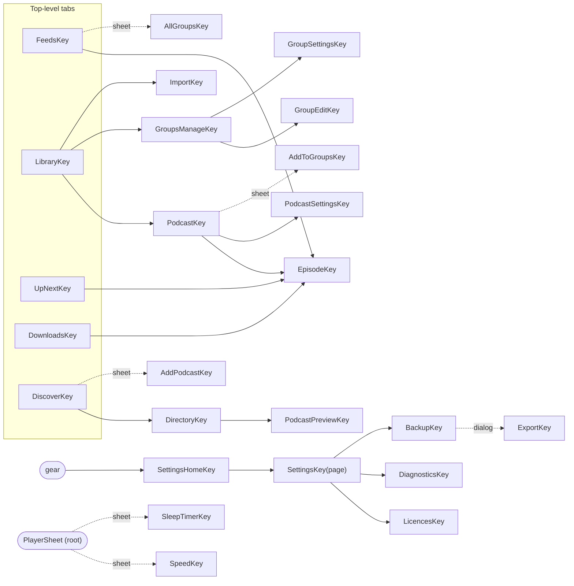
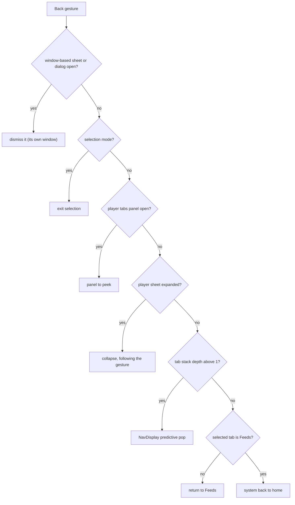

# 08 — UI and UX

> Status: Draft v1, 2026-10-04 · Implements: R2.4, R2.5, R2.8 (display), R3.7 (display), R4.6, R5.1–R5.8 / N4, N5 (UI), N6, N7 (edge-to-edge, predictive back, resizability), N10 (RTL, text expansion) · Milestones: M0, M1, M2, M3, M4, M5, M6, M7, M8, M9, M10, M11, M13 · Honours: D6, D7, D16, D42, D54, D55, D56, D57, D58, D64; PO-4, PO-17, PO-19 defaults · Owns: information architecture and screen inventory, navigation behaviour, every screen's layout and states, shared components, the root `PlayerSheet`, the Feeds pager, `EpisodeLiveStateSource`, theming and colour, the artwork pipeline (`ArtworkStore`, `ArtworkSyncWorker`, `ArtworkProvider`, Coil, monograms, mosaics), adaptive layouts, accessibility, onboarding, flavor UI differences and the Settings structure

## Scope

Serves R5.1–R5.8, R2.4, R2.5, R4.6, N4, N6, N7. Delivered from [M0](../PLAN.md#m0-scaffold-and-ci) (shell, theme, five destinations) to [M10](../PLAN.md#m10-covers-theming-adaptive-layouts-and-accessibility) (release-quality covers, colour, adaptive layouts and accessibility); see [Delivery by milestone](#delivery-by-milestone).

Neutrodyne is cover-first: artwork is shown at a size where it reads on every surface (grid tiles 72–152 dp, feed rows 56 dp, podcast header 160 dp, full player ≥ 280 dp, mini player 48 dp, notification, lock screen, Auto), and artwork drives colour while the chrome stays quiet. Groups are places: each group is a tab and a page of the Feeds pager ([D55](../PLAN.md#3-key-decisions)). The player is one root sheet that follows the finger ([D56](../PLAN.md#3-key-decisions)). Everything is stable Material 3 1.4.0 wrapped in `:core:designsystem` ([D6](../PLAN.md#3-key-decisions), [PO-4](../PLAN.md#po-4-material-3-expressive)).

### Responsibilities and boundaries

| This document owns | Owned elsewhere (link, do not restate) |
|---|---|
| Destinations, screen inventory, pane roles, re-tap and back behaviour, `AppNavigator` semantics | Nav3 mechanics (installers, per-tab stacks, decorators, scene strategies, intent router) — [01 Navigation](01-foundation.md#navigation) |
| Every screen's layout, states, actions and user-visible strings (final wording) | What the actions do: feeds and add flow [03](03-feeds-and-discovery.md), YouTube [04](04-youtube.md), groups/import/backup [05](05-groups-opml-backup.md), playback [06](06-playback.md), downloads [07](07-downloads.md) |
| `EpisodeRow`, `CoverTile`, `GroupMosaic`, `CoverArt`, `MonogramPainter`, show-notes renderer, banners, selection mode | Show-notes sanitising and block model — [03 Show notes](03-feeds-and-discovery.md#show-notes) |
| `PlayerSheet`, mini/full player, side panel, speed and sleep sheets | Player behaviour, `PlaybackController`/`PlaybackStateSource` — [06 UI boundary](06-playback.md#ui-boundary) |
| Feeds pager, tabs, chips, selection persistence, visits | `FeedRepository`, counts window, "new since last visit" rule — [05 Group feeds](05-groups-opml-backup.md#group-feeds) |
| `EpisodeLiveStateSource` contract and implementation | Its `IN (:ids)` SQL — [02 Live row state](02-data-model.md#live-row-state) |
| Colour schemes, tones, tokens, `Nd*` wrappers, icons | Group palette values and icon keys — [05 Palette](05-groups-opml-backup.md#palette), [05 Icons](05-groups-opml-backup.md#icons) |
| `ArtworkStore`, `ArtworkSyncWorker`, `ArtworkProvider`, Coil `ImageLoader`, artwork keys, monograms, mosaics, the YouTube thumbnail interceptor | `artwork` table and reference SQL — [02 artwork](02-data-model.md#artwork), [02 Artwork references](02-data-model.md#artwork-references); YouTube URL sources — [04 Artwork and thumbnails](04-youtube.md#artwork-and-thumbnails); system-surface consumption — [06 Artwork rule](06-playback.md#artwork-rule) |
| Settings screen structure, `appearance.*` and `ui.*` keys | Each area's keys and semantics (03–07, 09) |
| UI test cases (screenshot matrix, accessibility checks, journeys) | Test infrastructure, Roborazzi/GMD wiring, budgets — [09 Test strategy](09-quality-and-release.md#test-strategy), [09 Performance budgets](09-quality-and-release.md#performance-budgets) |

### Modules

| Module | Contents from this document |
|---|---|
| `:core:designsystem` | `NeutrodyneTheme`, `ArtworkTheme`, `ArtworkSchemeCache` (M10), `GroupTones`, `NeutrodyneShapes`, `NeutrodyneType`, `NeutrodyneMotion`, `CoverArt`, `Covers`, `MonogramPainter`, `StatusBarAppearance`, `NdIcons` and Material Symbols vectors, every `Nd*` wrapper ([Nd wrappers and icons](#nd-wrappers-and-icons)) |
| `:core:ui` | `EpisodeRow`, `CoverTile`, `GroupMosaic`, `GroupTabLabel`, `PodcastHeader`, `ShowNotes` (renderer), `ChapterList`, `UpNextList`, `EmptyState`, `NdBanner`, `SelectionTopBar`, `FeedFilterChips`, `LiveRowState` helpers, string mappers (`PlaybackMessages`, `DownloadStatusText`, `AttributionText`, `FeedErrorText`, `AvailabilityText`), `LocalMiniPlayerInset`, `LocalSnackbarHost`, `SharedKeys` |
| `:core:model` | `RowLive` additions, `ArtColors`, `Monogram`, `MonogramSpec`, `ArtworkColors` |
| `:core:domain` | `ArtworkRepository`; `EpisodeLiveStateSource` (canonical, contract here) |
| `:core:data` | `EpisodeLiveStateSourceImpl`, `ArtworkRepositoryImpl` |
| `:core:artwork` | `DefaultArtworkStore` (`ArtworkStore`), `ArtworkKeys`, `ArtworkSyncScheduler`, `ArtworkSyncWorker`, `ArtworkColorExtractor` (M10), `MonogramRenderer`, `MosaicRenderer`, `ArtworkProvider`, `ArtworkRefMapper`, `YouTubeThumbnailInterceptor` (M8), `TinyImageInterceptor`, `NeutrodyneImageLoaderFactory` |
| `:core:navigation` | `AppNavigator.pushDetail`, `SettingsHomeKey`, `LocalNavTab`, `LocalPaneLayout`, `PaneLayout` |
| `:feature:*` | Screens and ViewModels per [Screen inventory](#screen-inventory) |
| `:app` | `NeutrodyneRoot` (root scaffold, `PlayerSheet` host, banners, snackbar host), `NdPaneDirective`, `StartupGate` visuals |

### Threading model

| Work | Thread / context | Rule |
|---|---|---|
| Composition, ViewModel state, navigation | Main | ViewModels use `viewModelScope` (Main.immediate); repositories are main-safe ([01 Coroutines and threading](01-foundation.md#coroutines-and-threading)) |
| Paging transforms (`insertSeparators` day headers, row mapping) | `@Dispatcher(Default)` via `flowOn` before `cachedIn` | No I/O |
| Artwork scheme generation (MCU `SchemeContent`, M10) | `@Dispatcher(Default)` inside `ArtworkSchemeCache` | Never in composition; the previous scheme stays until the new one is ready |
| Coil decode and fetch | Coil's own dispatchers (IO-limited) | Interceptors and mappers do no disk I/O ([Coil ImageLoader](#coil-imageloader)) |
| `EpisodeLiveStateSourceImpl` merging | `@Dispatcher(Default)`; DAO flows on Room's IO context | Output conflated |
| `ArtworkSyncWorker` | `CoroutineWorker`; files on IO, quantisation on Default | 8-min soft deadline |
| `ArtworkProvider.openFile` | Binder thread | Blocking allowed; fallback DB read with a 2 s timeout ([01](01-foundation.md#coroutines-and-threading)) |

### Platform constraints

| Constraint | Consequence here | Source |
|---|---|---|
| Edge-to-edge enforced for target 35; opt-out removed for target 36 | Every screen handles insets ([Insets and edge-to-edge](#insets-and-edge-to-edge)) | [Android 15 changes](https://developer.android.com/about/versions/15/behavior-changes-15), [Android 16 changes](https://developer.android.com/about/versions/16/behavior-changes-16) |
| Predictive back on by default for target 36; `onBackPressed` not called | Back via Nav3 and `PredictiveBackHandler`; never intercept back at a tab root | [Android 16 changes](https://developer.android.com/about/versions/16/behavior-changes-16) |
| Orientation, resizability and aspect locks ignored on sw ≥ 600 dp (target 36); opt-out removed for target 37 | No locks anywhere; designed layouts per width class | [Android 16 changes](https://developer.android.com/about/versions/16/behavior-changes-16), [Android 17 changes](https://developer.android.com/about/versions/17/behavior-changes-17) |
| Android 14 non-linear font scaling to 200 %; `fontScale` informational | `sp` everywhere; layouts switch on `fontScale ≥ 1.5`, never compute sizes from it | [Android 14 features](https://developer.android.com/about/versions/14/features#non-linear-font-scaling) |
| Dynamic colour only on API 31+; `UiModeManager.getContrast()` only on API 34+ | Brand scheme below 31; contrast 0.0 below 34 | [Compose dynamic colour](https://dl.google.com/android/maven2/androidx/compose/material3/material3-android/1.4.0/material3-android-1.4.0-sources.jar), [UiModeManager](https://developer.android.com/reference/android/app/UiModeManager) |
| `Modifier.blur` only effective on API 31+ | YouTube banner fallback uses a gradient below 31 | [blur KDoc mirror](https://composables.com/jetpack-compose/androidx.compose.ui/ui/modifiers/blur) |
| `POST_NOTIFICATIONS` runtime permission on API 33+ | Requested contextually only ([Permission prompts](#permission-prompts)) | [Notification permission](https://developer.android.com/develop/ui/views/notifications/notification-permission) |
| Android 17 RAM-based memory limits; widget `RemoteViews` bitmap cap for target 37 | Bounded Coil caches; widgets (v1.x) use content-URI icons | [Android 17 changes](https://developer.android.com/about/versions/17/behavior-changes-17) |
| Themed app icons need a `<monochrome>` layer (Android 13); Android 16 QPR2 auto-themes icons without one | Brand icon ships a monochrome layer (PO-17, M10) | [Adaptive icons](https://developer.android.com/develop/ui/views/launch/icon_design_adaptive) |

---

## Information architecture

Serves R2.4, R5.1, R4.6. Delivered in M0 (shell) and per screen milestone. Honours [D54](../PLAN.md#3-key-decisions).

### Destinations

Five top-level destinations in a `NavigationSuiteScaffold` (bar on compact, collapsed wide rail otherwise): **Feeds · Library · Up next · Downloads · Discover**. Settings is a gear action in every top-level top app bar and the rail's footer item. Icons are Material Symbols Rounded (outlined when unselected, filled when selected): `dynamic_feed`, `grid_view`, `queue_music`, `download`, `explore`; gear `settings`.

| Destination | Purpose | Badge |
|---|---|---|
| Feeds | The All feed and one page per group ([Group feed pager](#group-feed-pager)) | none |
| Library | Cover grid of subscriptions, Groups view, selection mode | none |
| Up next | The user's queue and the play context ([06 Queue and play context](06-playback.md#queue-and-play-context)) | none |
| Downloads | In-progress, completed and failed downloads with storage | count of `FAILED` downloads (M6) |
| Discover | Search, charts, add by URL, YouTube channels, import | none |

### Screen inventory

Pane roles apply when the [pane directive](#pane-directive) allows two or more panes; on one pane every key pushes full-screen. "Sheet" keys render as modal bottom sheets and "dialog" keys as dialogs through 01's overlay scene strategies.

| Screen | `NavKey` | Feature module | Pane role | Milestone |
|---|---|---|---|---|
| [Feeds](#feeds) | `FeedsKey` | `:feature:feeds` | list (placeholder detail: group mosaic) | M1 (All), M2 |
| [All groups sheet](#all-groups-sheet) | `AllGroupsKey` | `:feature:feeds` | sheet | M2 |
| [Library](#library) | `LibraryKey` | `:feature:library` | list | M1, M2, M10 |
| [Podcast detail](#podcast-detail) | `PodcastKey(podcastId)` | `:feature:podcast` | detail | M1 |
| Podcast preview (same screen, preview mode) | `PodcastPreviewKey(feedUrl)` | `:feature:podcast` | detail | M7 |
| [Podcast settings](#podcast-settings) | `PodcastSettingsKey(podcastId)` | `:feature:podcast` | detail | M1, M2, M4, M6, M8 |
| [Episode detail](#episode-detail) | `EpisodeKey(episodeId)` | `:feature:episode` | extra | M1 |
| [Group editor](#group-editor) | `GroupEditKey(groupId)` | `:feature:groups` | detail | M2 |
| [Manage groups](#manage-groups) | `GroupsManageKey` | `:feature:groups` | list | M2 |
| [Group settings](#group-settings) | `GroupSettingsKey(groupId)` | `:feature:groups` | detail | M2, M4, M6 |
| [Add to groups sheet](#add-to-groups-sheet) | `AddToGroupsKey(podcastIds)` | `:feature:groups` | sheet | M2 |
| [Up next](#up-next) | `UpNextKey` | `:feature:queue` | list | M0 (empty), M4 |
| [Downloads](#downloads) | `DownloadsKey` | `:feature:downloads` | list | M0 (empty), M6 |
| [Discover](#discover) | `DiscoverKey` | `:feature:discover` | list | M0 (empty), M1, M7 |
| [Directory results](#directory-results) | `DirectoryKey(query, genreId)` | `:feature:discover` | list | M7 |
| [Add podcast sheet](#add-podcast-sheet) | `AddPodcastKey(input)` | `:feature:discover` | sheet | M1, M7, M8 |
| [Import](#import) (preview, progress, report, restore preview) | `ImportKey(sessionId)` | `:feature:importexport` | detail | M3 |
| [Backup and restore](#backup-and-restore) | `BackupKey` | `:feature:importexport` | detail | M3 |
| [Export dialog](#export-dialog) | `ExportKey(groupId)` | `:feature:importexport` | dialog | M3 |
| [Settings](#settings-screens) home | `SettingsHomeKey` (new) | `:feature:settings` | list | M0 |
| Settings page | `SettingsKey(page)` | `:feature:settings` | detail | M0 (About), per owner |
| Licences | `LicencesKey` | `:feature:settings` | detail | M0 |
| [Diagnostics](#diagnostics) | `DiagnosticsKey` | `:feature:settings` | detail | M11 |
| [Speed sheet](#speed-and-sleep-sheets) | `SpeedKey` | `:feature:player` | sheet | M4 |
| [Sleep timer sheet](#speed-and-sleep-sheets) | `SleepTimerKey` | `:feature:player` | sheet | M5 |
| [Player](#player-sheet) (mini, full, side panel) | none (`PlayerSheet`, D56) | `:feature:player`, hosted by `:app` | root overlay / side panel | M4, M10 |
| [Startup gate](#banners-and-the-startup-gate) | none | `:app` | full window | M1 |



---

## Navigation

Serves R2.4, R5.7, N7. Delivered in M0 (tabs, gear, back), M2 (feed selection routes), M4 (player back order), M10 (panes, shared elements). Honours [D7](../PLAN.md#3-key-decisions), [D56](../PLAN.md#3-key-decisions). Mechanics (per-tab `NavBackStack`s, decorators, overlay scene strategies, `IntentRouter`) are 01's ([01 Navigation](01-foundation.md#navigation)); this section defines behaviour.

### Tabs and back stacks

1. Each `TopLevelKey` has its own back stack, saved across tab switches and process death (01). Selecting another tab never clears a stack.
2. Any screen may push any non-top-level key onto the **selected** tab's stack (`AppNavigator.push`). Cross-tab jumps use `selectTab` and, for deep links, `open(tab, stack)`. Rules: podcast name tapped in Feeds, Up next, Downloads or the player → `PodcastKey` on the current tab (or, from the player, the tab underneath it); a group tile in Library → [select that group in Feeds](#selection-persistence-and-fallback) (`selectTab(FeedsKey)` after writing the selection).
3. Back from a non-start tab's root returns to Feeds; back from the Feeds root leaves the app with the system back-to-home animation (01's `visibleStacks()` default, kept).
4. `pushDetail(key)` (member added to the canonical `AppNavigator`, implemented by 01's `NavigationState`): when the [pane layout](#pane-directive) has ≥ 2 partitions and the top entry has the same key class as `key` (for example `EpisodeKey` → `EpisodeKey`), the top entry is replaced instead of stacked, so tapping ten rows on a tablet does not build ten back entries. On one pane it equals `push`. Every list → detail tap uses `pushDetail`.

```kotlin
// :core:navigation — additions (owner 08; canonical members of AppNavigator unchanged)
interface AppNavigator {
    fun push(key: NavKey); fun selectTab(key: TopLevelKey); fun pop(): Boolean    // canonical
    fun resetTab(key: TopLevelKey); fun open(tab: TopLevelKey, stack: List<NavKey>) // 01
    fun pushDetail(key: NavKey)                                                    // replace same-type top entry on ≥ 2 panes
}
@Serializable data object SettingsHomeKey : NavKey                                 // new: the gear's target
data class PaneLayout(val partitions: Int, val playerPanel: Boolean, val contentWidthDp: Int)
val LocalPaneLayout = staticCompositionLocalOf { PaneLayout(1, false, 360) }       // provided by :app per frame
val LocalNavTab = staticCompositionLocalOf<TopLevelKey> { FeedsKey }               // provided per entry by :app
```

### Re-tap behaviour

| Situation | Re-tap on the selected destination |
|---|---|
| Stack depth > 1 | `resetTab` (pop to the root); the root's scroll position is kept |
| At the root, list not at the top | Animate the visible list to item 0 (Feeds: the current page's list) |
| Feeds root, already at the top, page ≠ All | Select the All page |
| Player expanded | Collapse the sheet first; a second tap applies the rows above |

### Pane roles and detail placeholders

Metadata (01's `ListDetailSceneStrategy.listPane()/detailPane()/extraPane()`) per key is the "Pane role" column of the [Screen inventory](#screen-inventory). Detail placeholders when a list key is alone on ≥ 2 partitions: Feeds — the selected group's mosaic at 240 dp with "Select an episode"; Library — "Select a podcast" with the four most recently updated covers; Settings home — the Appearance page is opened automatically (no empty detail); other lists — none (the list takes the full width). `EpisodeKey` is an extra pane so that Library → Podcast → Episode shows three panes on ≥ 1,200 dp of content. Unverified (spike S5): that `ListDetailSceneStrategy` in `adaptive-navigation3` 1.3.0 places an extra-pane entry directly after a list entry (Feeds → Episode) beside the list; fallback: register `EpisodeKey` as `detailPane()`, accepting Podcast → Episode replacing the podcast in the detail pane.

### Sheets and dialogs

Sheet keys (`AddPodcastKey`, `AddToGroupsKey`, `AllGroupsKey`, `SpeedKey`, `SleepTimerKey`) and the dialog key (`ExportKey`) are pushed on the selected tab's stack and rendered by 01's overlay scene strategies, which must use window-based `NdModalBottomSheet`/`NdDialog` so they draw above the root `PlayerSheet` (a sheet opened from the expanded player would otherwise sit under it). Small confirmations (unsubscribe, mark all played, metered prompts, Replace restore) are plain `NdDialog`s owned by the screen, not keys. Sheets have a drag handle, 28 dp top corners, and close on back, scrim tap or swipe down.

### Deep links

01's [Intent routing](01-foundation.md#intent-routing) targets are confirmed with these behaviours:

| Route | Behaviour |
|---|---|
| `Push(AddPodcastKey(input))` | The sheet opens over the current tab with `input` pre-filled and resolution started; nothing is written until Subscribe |
| `Push(EpisodeKey(id))` | Pushed on the current tab; a missing episode shows "This episode is no longer available" with Back |
| `Navigate(LibraryKey, [PodcastKey(id)])` | Library tab, its stack replaced by `[LibraryKey, PodcastKey]` |
| `SelectFeed(groupUuid)` | Root writes `ui.feeds_selected_source = group:{uuid}`, then `selectTab(FeedsKey)` and `resetTab(FeedsKey)`; unknown UUID → All with a snackbar "That group no longer exists" |
| `Navigate(DownloadsKey, [])` | Downloads root |
| `ExpandPlayer` | Expands the sheet (or reveals the side panel); no-op when nothing is loaded |
| `Navigate(LibraryKey, [ImportKey(id)])` | Import screen in the state of that session |
| `Push(SettingsKey(page))`, `Push(DiagnosticsKey)` | Pushed on the current tab (back returns to where the user was) |

### Back handling order

`PlayerSheet` is composed after `NavDisplay` in `NeutrodyneRoot`, so its handler wins while enabled ([Navigation suite, insets and back](#navigation-suite-insets-and-back)). Order of consumers for one back gesture:



Selection mode registers its handler inside the screen's entry (composed inside `NavDisplay`, before the player) but is only enabled while selecting, and selection is impossible while the player is expanded, so the order above holds. Unverified (S5): how activity-compose 1.13.0's `PredictiveBackHandler` and Nav3 1.2.0's `NavigationBackHandler` (navigationevent 1.1.2) interleave; S5 picks one API for both `NavDisplay`-external handlers.

### Transitions and shared elements

- Screens use Nav3's default slide-and-fade push/pop and `predictivePopTransitionSpec`; with "Remove animations" on, every transition is a 0 ms snap ([Motion](#tokens)).
- Shared elements (M10, `SharedTransitionLayout` around `NavDisplay`, 01): Library tile cover ↔ podcast header cover (`SharedKeys.cover(tab, podcastId)`); feed, Up next and Downloads row thumbnail ↔ episode detail art (`SharedKeys.episodeArt(tab, episodeId)`). Keys include `LocalNavTab` because the same podcast can be visible in two tab stacks. Shared elements run only when `LocalPaneLayout.partitions == 1` (on multi-pane layouts source and target are visible together; the detail pane cross-fades instead).
- The mini ↔ full player morph is not a shared element; it is geometry inside `PlayerSheet` driven by drag progress ([Morph mapping](#morph-mapping)).

---
