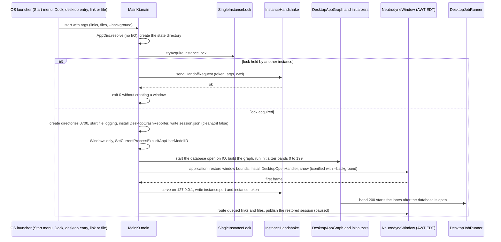
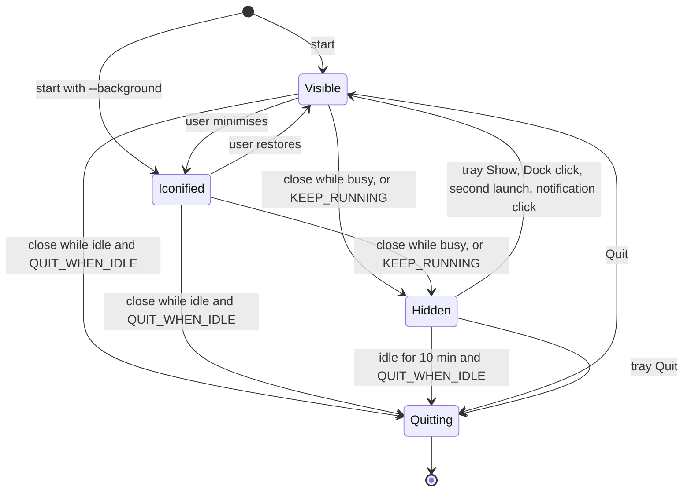
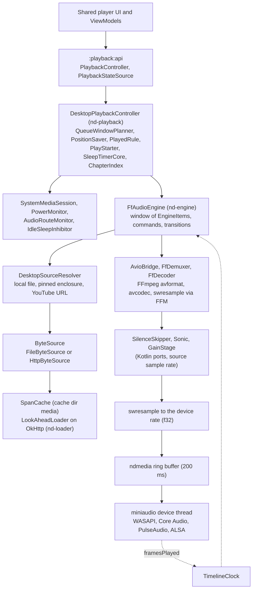
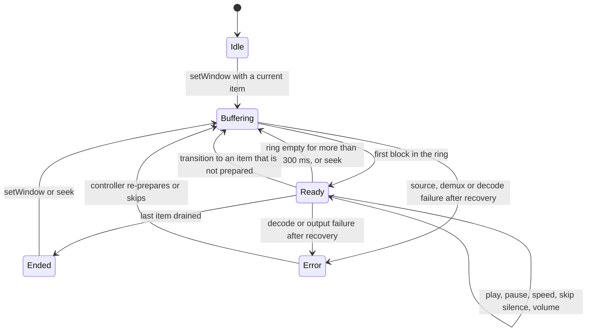

# 11 — Desktop app

> Status: Draft v1, 2026-10-05 · scope revision 2026-10-05 (S0–S13): new document — the desktop app for Windows, macOS and Linux, built from the shared Kotlin Multiplatform code, with its own shell, in-process background runner, OS media integration, FFmpeg-based audio engine, CPython-hosted YouTube engine and jpackage installers under the runtime exception · Implements: R8.1–R8.11, R6.5, R6.6 (desktop behaviour), R1.1 (desktop file opening), R3.5, R3.6, R3.8, R3.9 (desktop host), R4.1, R4.2, R4.3, R4.8 (desktop), R5.2, R5.3, R5.7 (desktop surfaces) / N1, N2, N3, N4, N5, N6, N7, N8, N9, N11, N12 (desktop parts) · Milestones: M0b, MD0, M1a, M3, M6 (M6a, M6b), MD1 (MD1a, MD1b), MD2, MD3, M10, MD4, M11a, MD5, M11b; desktop parts of MS2 and MS3 · Honours: D2, D3, D4, D14, D25, D38–D45, D47–D49, D52, D57, D61–D64, D72–D84, D91–D93, D97; PO-2, PO-5, PO-10, PO-19, PO-27, PO-39, PO-40, PO-42, PO-43, PO-44 · Owns: D85–D90, R8, R6.5; spikes S13 and S18 (= MD0); the measurement procedure of budgets PB24–PB29 (09 owns the table); the modules `:desktopApp`, `:playback:engine`, `:playback:native`, `:playback:desktop`, `:desktop:system`, `:youtube:ytdlp-desktop`; the `AppDirs` table, the frozen desktop identifiers (including the MSI `upgradeUuid`), the desktop install and update guidance text, `DesktopJobRunner` and its lane contract, the desktop crash files

Contents: [Scope](#scope) · [Platform matrix](#platform-matrix) · [Desktop shell](#desktop-shell) ([Window and tray behaviour](#window-and-tray-behaviour)) · [Background work](#background-work) · [OS integration](#os-integration) · [Desktop playback engine](#desktop-playback-engine) · [Desktop downloads and storage](#desktop-downloads-and-storage) · [Desktop YouTube engine host](#desktop-youtube-engine-host) · [Packaging and the runtime exception](#packaging-and-the-runtime-exception) · [Install and update](#install-and-update) · [Desktop UX](#desktop-ux) · [Accessibility](#accessibility) · [Desktop diagnostics and crash files](#desktop-diagnostics-and-crash-files) · [Testing](#testing) · [Delivery by milestone](#delivery-by-milestone) · [New names introduced here](#new-names-introduced-here) · [Open questions](#open-questions) · [Sources](#sources)

---

## Scope

Serves R8, R6.5, R6.6 and the desktop halves of R1, R3, R4 and R5. Delivered across M0b (shell and packaging), MD0 (engine spike), M1a/M3/M6 (shared features on the desktop), MD1–MD5 (playback, OS integration, YouTube, UX, release) and M11b; see [Delivery by milestone](#delivery-by-milestone).

The desktop app is the same Kotlin Multiplatform product as the Android app ([D81](../PLAN.md#3-key-decisions)): every screen, ViewModel, repository, rule, the database schema and the sync client are `commonMain` code shared with Android ([01 Source sets and JVM islands](01-foundation.md#source-sets-and-jvm-islands)). This document owns only what is desktop-specific: a JVM process with one Compose window ([D85](../PLAN.md#3-key-decisions)); an in-process scheduler instead of WorkManager; our own audio engine instead of Media3 ([D86](../PLAN.md#3-key-decisions)); the OS media sessions of Windows, macOS and Linux ([D87](../PLAN.md#3-key-decisions)); the YouTube engine in a CPython child process instead of Chaquopy's `:ytx` ([D90](../PLAN.md#3-key-decisions)); per-OS installers that bundle an unmodified OpenJDK runtime under the runtime exception ([D88](../PLAN.md#3-key-decisions), [D89](../PLAN.md#3-key-decisions), [D3](../PLAN.md#3-key-decisions)). Everything a user can do on Android in R1–R5 they can do on the desktop, except what [Behaviour differences from Android](#behaviour-differences-from-android) lists.

### Responsibilities and boundaries

| This document owns | Owned elsewhere (link, do not restate) |
|---|---|
| `main()`, start-up and shutdown order, `DesktopAppGraph` contents specific to the desktop, single instance, `AppDirs`, OS link and file registration, smoke mode | Shared start-up bands and `AppInitializer` — [01 Application start-up](01-foundation.md#application-start-up); Metro graphs — [01 Dependency injection](01-foundation.md#dependency-injection); route table — [01 Intent routing](01-foundation.md#intent-routing) |
| Window, close behaviour, tray, start at login, window state | Screens, navigation suite, adaptive layouts — [08 Navigation](08-ui-ux.md#navigation), [08 Adaptive layouts](08-ui-ux.md#adaptive-layouts) |
| `DesktopJobRunner`, the `JobLane` contract, wake and restart catch-up | What each lane does — [03 Desktop refresh](03-feeds-and-discovery.md#desktop-refresh), [07 Desktop runners](07-downloads.md#desktop-runners), [08 Artwork pipeline](08-ui-ux.md#artwork-pipeline), [09 Update check](09-quality-and-release.md#update-check), [04 Engine updates](04-youtube.md#engine-updates), [10 Client sync engine](10-sync.md#client-sync-engine), [02 Retention and maintenance](02-data-model.md#retention-and-maintenance) |
| SMTC, Now Playing, MPRIS, power, audio-route monitoring, `DesktopNotifier`, `ndmedia`'s OS shims | Artwork files the sessions read — [08 Artwork pipeline](08-ui-ux.md#artwork-pipeline); notification texts — [03 New-episode notifications](03-feeds-and-discovery.md#new-episode-notifications), [07 Progress and notifications](07-downloads.md#progress-and-notifications) |
| `AudioEngine`, sources, `SpanCache`, the FFmpeg build and FFM bindings, DSP ports, output and clock, `DesktopPlaybackController` | Queue window, position, played, start, sleep-timer and chapter rules — [06 Shared playback core](06-playback.md#shared-playback-core); cache rules — [06 Streaming cache](06-playback.md#streaming-cache) ([D40](../PLAN.md#3-key-decisions)); player UI — [08 Player sheet](08-ui-ux.md#player-sheet) |
| Default and chosen download folders, moves on the desktop, Windows path rules beyond 07's names, "Show in folder", desktop disk-full and removable-drive handling | Transfer core, state machine, naming algorithm, move algorithm — [07 Transfer core](07-downloads.md#transfer-core), [07 State machine](07-downloads.md#state-machine), [07 Storage layout](07-downloads.md#storage-layout), [07 Moving between roots](07-downloads.md#moving-between-roots) |
| CPython selection, trim, child process, stdio framing, desktop engine paths, JS bridge over stdio | Engine methods, shim, trust chain, update policy, capability rules — [04 Shared engine module](04-youtube.md#shared-engine-module), [04 Engine updates](04-youtube.md#engine-updates), [04 Capability matrix](04-youtube.md#capability-matrix) |
| `nativeDistributions` per target, jlink modules, JVM options, AOT cache, resources layout, macOS ad-hoc signing and the 0.x ZIP, MSI `upgradeUuid`, runtime-exception and FFmpeg-LGPL obligations, `check-desktop-image.sh` rules | Release workflow and jobs — [09 release.yml](09-quality-and-release.md#releaseyml); licence policy, locks and allow-lists — [01 Licensing and dependency policy](01-foundation.md#licensing-and-dependency-policy), [01 Python and native components](01-foundation.md#python-and-native-components) |
| Install, update and uninstall guidance per OS (the README source text), desktop asset selection | Update-check logic and manifest — [09 Update check](09-quality-and-release.md#update-check); UI of the update card and help page — [08 Updates settings](08-ui-ux.md#updates-settings), [08 Install and updates help](08-ui-ux.md#install-and-updates-help) |
| Menus, global shortcut list, tray menu, drag and drop, window sizing, Settings › Desktop | Per-screen keyboard, mouse and context-menu behaviour — [08 Keyboard and mouse](08-ui-ux.md#keyboard-and-mouse) |
| VoiceOver and Java Access Bridge support, the Linux gap, the MD4 checklist | Shared accessibility rules and the custom-actions catalogue — [08 Accessibility](08-ui-ux.md#accessibility) |
| Desktop log files, crash files and their dialog, desktop diagnostics rows | Diagnostics API and redaction — [09 Crash reporting and diagnostics](09-quality-and-release.md#crash-reporting-and-diagnostics), [01 Logging and redaction](01-foundation.md#logging-and-redaction) |
| `DesktopSecretStore` file format ([PO-44](../PLAN.md#48-further-product-owner-decisions)) | `SecretStore` contract and its users — [03 Basic auth and CredentialStore](03-feeds-and-discovery.md#basic-auth-and-credentialstore), [10 Client sync engine](10-sync.md#client-sync-engine) |

### Modules

Packages follow `ch.lkmc.neutrodyne` + module path; `:desktopApp` uses `ch.lkmc.neutrodyne.desktop` ([PLAN 5.1](../PLAN.md#51-module-graph)).

| Module | Kind | Contents owned here | Depends on (project) |
|---|---|---|---|
| `:desktopApp` | `neutrodyne.desktop.application` (kotlin("jvm"), Compose application, Metro) | `MainKt`, `DesktopAppGraph`, `DesktopYouTubeBindingsModule`, `NeutrodyneWindow`, `DesktopMenuBar`, `SingleInstanceLock`, `InstanceHandshake`, `DesktopOpenHandler`, `UrlSchemeRegistrar`, `DesktopCrashReporter`, `ShutdownCoordinator`, `SmokeMode`, `BuildInfo`, `nativeDistributions` configuration, AOT training | features, shared implementations, the desktop-only modules (composition root, [PLAN 5.1](../PLAN.md#51-module-graph) rule 1) |
| `:playback:engine` | `neutrodyne.desktop.library` (JVM, `jvmTarget` 25) | `AudioEngine`, `FfAudioEngine`, `EngineItem`, `EngineState`, `EngineEvent`, `DesktopSourceResolver`, `ResolvedSource`, `ByteSource`, `FileByteSource`, `HttpByteSource`, `SpanCache`, `AvioBridge`, `DemuxerFactory`, `FfDemuxer`, `DecoderFactory`, `FfDecoder`, `FfmpegLibrary`, `SilenceSkipper`, `Sonic`, `GainStage`, `TimelineClock`, `LookAheadLoader`; `MpvAudioEngine` only if MD0 chooses the fallback | `:playback:native`, `:core:network:okhttp`, `:core:{model, common}`, `:playback:api` |
| `:playback:native` | `neutrodyne.desktop.library` + `neutrodyne.desktop.native` | `ndmedia` C/C++/Objective-C sources and CMake project, `NdmediaLibrary`, `NdOutput`, the OS-shim bindings, `playback/native/ffmpeg/build.sh`, `ffoffsets.c`, `native-components.lock` | — |
| `:playback:desktop` | `neutrodyne.desktop.library` | `DesktopPlaybackController`, `DesktopQueueProjector`, `DesktopPlaybackModule` | `:playback:core`, `:playback:engine`, `:desktop:system`, `:download:api`, `:youtube:api`, `:core:artwork`, `:core:database`, `:core:datastore` |
| `:desktop:system` | `neutrodyne.desktop.library` | `SystemMediaSession`, `WindowsSmtcSession`, `MacNowPlayingSession`, `LinuxMprisSession`, `PowerMonitor`, `IdleSleepInhibitor`, `AudioRouteMonitor`, `TrayController`, `LoginItemRegistrar` (`WindowsRunKeyRegistrar`, `MacLoginItemRegistrar`, `XdgAutostartRegistrar`), `DesktopNotifier` | `:playback:native` (shims), `:core:{model, common}` |
| `:youtube:ytdlp-desktop` | `neutrodyne.desktop.library` | `YtxProcess`, `StdioYtxTransport`, `PythonRuntimeLocator`, `DesktopEngineStorePaths`, `DesktopEngineUpdateLane`, `QuickJsBridge` (only with the JS provider); PBS bundling; `python-components.lock` | `:youtube:engine`, `:youtube:api`, `:core:datastore` |

Desktop code that lives in other owners' modules and follows this document's rules: `AppDirs` and `JobLane` (`:core:common` `desktopMain`); `DesktopJobRunner`, `DesktopRefreshLane`, `DesktopUpdateCheckLane`, `DesktopUpdateNotifier`, `DesktopSecretStore`, `DesktopMaintenanceLane` (`:core:data` `desktopMain`); `DesktopDownloadLane`, `DesktopMoveLane` (`:download:impl` `desktopMain`, 07); `DesktopArtworkLane` (`:core:artwork`, 08); `DesktopSyncLane` (`:sync:impl`, 10); `DesktopNetworkMonitor` (`:core:network`, 01); the `PlatformActions` implementations (`:core:ui` `desktopMain`, 08). Only `:youtube:ytdlp-desktop` may start a process; only `:playback:native` and `:desktop:system` make FFM downcalls into our own native code; `:playback:engine` makes FFM downcalls into FFmpeg only ([PLAN 5.1](../PLAN.md#51-module-graph) rule 6; `checkBannedApis`, [01 Dependency rules](01-foundation.md#dependency-rules)).

### Threading model

| Thread | Owner | Runs | Never |
|---|---|---|---|
| AWT event dispatch thread (`Dispatchers.Main` via `kotlinx-coroutines-swing`) | Compose, window, menus, tray, `java.awt.Desktop` handlers | Composition, ViewModel state collection, window and tray events, file dialogs | Disk or network I/O, database access, waiting on the engine thread |
| AppKit main thread (macOS) | the AWT toolkit | `MPRemoteCommandCenter` handlers, `NSWorkspace` notifications through the Objective-C shim | JVM work beyond enqueueing (one FFM upcall that posts to a queue) |
| `nd-playback` (one coroutine dispatcher: `Dispatchers.Default.limitedParallelism(1)`) | `DesktopPlaybackController` | All controller state: command handling, engine events, `PositionSaver`, sleep timer, session publishing | Blocking I/O (database writes are `suspend` calls on `Dispatchers.IO`) |
| `nd-engine` (one platform thread) | `FfAudioEngine` | Demux, decode, DSP, ring-buffer writes, AVIO read and seek upcalls (inside the `av_read_frame` downcall), transitions | Database access, network waits longer than the read timeout, Compose |
| `nd-prepare` (one platform thread) | `FfAudioEngine` | Opening the next item's source, demuxer and decoder (AVIO upcalls during the open), then handing the pipeline to `nd-engine` | Writing to the ring buffer |
| `nd-loader` (one platform thread per open HTTP resource, at most 2) | `LookAheadLoader` | OkHttp `Range` reads into `SpanCache` | Decoding |
| miniaudio device thread (native) | `ndmedia` | Copies PCM from the ring buffer, advances `framesPlayed` | Any JVM code (no upcalls on the audio path, [D87](../PLAN.md#3-key-decisions)) |
| `nd-win-shim` (Windows, native, owned by `ndmedia`) | hidden top-level window | SMTC, `WM_POWERBROADCAST`, `IMMNotificationClient` callbacks, toasts; one upcall per event that only enqueues | JVM work beyond enqueueing |
| dbus-java worker threads (Linux) | `LinuxMprisSession`, logind and portal clients | D-Bus method calls and signals; posts commands to `nd-playback` | Long work |
| `nd-ytx-out`, `nd-ytx-err` (two platform threads per child) | `StdioYtxTransport` | Reading the child's stdout (protocol) and stderr (log) | Writes to the database |
| `Dispatchers.IO` / `Dispatchers.Default` | lanes of `DesktopJobRunner`, repositories, Room (`setQueryCoroutineContext(Dispatchers.IO)`) | Refresh, downloads, artwork, sync, update checks, maintenance | Touching Compose state directly |
| `nd-handshake` (virtual thread) | `InstanceHandshake` | Accepting loopback connections from a second launch | Anything but parsing and posting the hand-off |

### Processes and files at run time

One JVM process per user ([Single instance](#single-instance-and-handshake)) and, while YouTube is in use, one CPython child ([Process model](#process-model)). No other process is ever started: links and folders open through `java.awt.Desktop`, OS APIs or D-Bus, never through a shell ([01 Platform compliance](01-foundation.md#platform-compliance)). Files live only in the directories of [AppDirs](#appdirs) and in the user's chosen download folder.

---

## Platform matrix

Serves R8.1, R8.2, N7. Delivered in M0b (matrix and CI runners), MD5 (final). Honours [D88](../PLAN.md#3-key-decisions), [PO-40](../PLAN.md#48-further-product-owner-decisions).

### Supported targets

| Target ID | OS versions | CPU | CI runner | Bundled runtime | Formats | Notes |
|---|---|---|---|---|---|---|
| `windows-x64` | Windows 10 22H2 and Windows 11 | x64; also Windows 11 on Arm under Prism emulation | `windows-2025` | Temurin 25 x64 | MSI (per user), ZIP | Windows 10 on Arm is unsupported (it emulates only 32-bit x86, [Windows on Arm emulation](https://learn.microsoft.com/en-us/windows/arm/apps-on-arm-x86-emulation)) |
| `macos-arm64` | macOS 13 or later | Apple silicon | `macos-15` | Temurin 25 aarch64 | DMG from `1.0.0`; ZIP of the app before ([PO-39](../PLAN.md#48-further-product-owner-decisions)) | No Intel Macs ([D88](../PLAN.md#3-key-decisions)); see [macOS floor](#macos-floor) |
| `linux-x64` | glibc ≥ 2.31 (Ubuntu 20.04 class), PulseAudio or PipeWire with `pipewire-pulse` (ALSA as last resort), X11 or XWayland | x64 | `ubuntu-24.04` | Temurin 25 x64 | DEB, RPM, tar.gz | Natives built in `manylinux_2_28` containers |
| `linux-arm64` | as `linux-x64` | AArch64 | `ubuntu-24.04-arm` | Temurin 25 aarch64 | DEB, RPM, tar.gz | — |

Compose Multiplatform 1.12.1 supports macOS 13 arm64, Windows 10 x64 and arm64, and Ubuntu 20.04 x64 and arm64 ([CMP compatibility](https://kotlinlang.org/docs/multiplatform/compose-compatibility-and-versioning.html)). There is no universal (fat) desktop build and no 32-bit build ([D77](../PLAN.md#3-key-decisions)). jpackage cannot cross-package, so each target is built on its own runner ([native distributions](https://kotlinlang.org/docs/multiplatform/compose-native-distribution.html)).

### Native-library coverage

Every native library in the image must exist for every target before it is accepted; a library without a target blocks that target or moves it to emulation.

| Library | Source | windows-x64 | macos-arm64 | linux-x64 | linux-arm64 | windows-arm64 (not built) |
|---|---|---|---|---|---|---|
| Skiko (Compose rendering) | JetBrains | yes | yes | yes | yes | yes |
| `sqlite-bundled-jvm` 2.7.1 (Room's `BundledSQLiteDriver`) | androidx | `windows_x64` | `osx_arm64` | `linux_x64` | `linux_arm64` | **missing** ([jar contents](https://dl.google.com/android/maven2/androidx/sqlite/sqlite-bundled-jvm/2.7.1/sqlite-bundled-jvm-2.7.1.jar)) |
| quickjs-kt-jvm 1.0.15 (JS provider, only if it ships) | dokar3 | `windows_x64` | `macos_aarch64` | `linux_x64` | `linux_aarch64` | **missing** ([artefacts](https://repo1.maven.org/maven2/io/github/dokar3/quickjs-kt-jvm/1.0.15/)) |
| JNA 5.19.1 (DPAPI, Run key, shell calls) | JNA | yes | yes | yes | yes | yes |
| python-build-standalone CPython 3.14 | Astral | `x86_64-pc-windows-msvc` | `aarch64-apple-darwin` | `x86_64-unknown-linux-gnu` | `aarch64-unknown-linux-gnu` | `aarch64-pc-windows-msvc` |
| FFmpeg 9.0.x minimal (`avutil`, `swresample`, `avcodec`, `avformat`) | built by us | MSYS2 + MSVC | Apple clang | gcc in `manylinux_2_28` | gcc in `manylinux_2_28` aarch64 | not built |
| `ndmedia` (miniaudio, ring buffer, OS shims) | built by us | MSVC, static CRT | Apple clang | gcc | gcc | not built |
| dbus-java 5.2.2 (MPRIS, logind, portals, notifications) | pure Java | — | — | yes | yes | — |

Temurin 25 publishes no Windows AArch64 build ([D88](../PLAN.md#3-key-decisions)); together with the two missing natives this is why Windows 11 on Arm runs the x64 build ([PO-40](../PLAN.md#48-further-product-owner-decisions)). An arm64 JVM cannot load x64 JNI libraries, so a Windows arm64 build would have to be arm64 throughout.

### Windows on Arm

The x64 MSI or ZIP runs under Prism on Windows 11 on Arm ([Windows on Arm emulation](https://learn.microsoft.com/en-us/windows/arm/apps-on-arm-x86-emulation)): the JVM, Skiko, SQLite, FFmpeg, `ndmedia` and the x64 CPython child all run emulated (user-mode code only). The update check offers the x64 asset ([Desktop update check](#desktop-update-check)). Unverified: start-up time and audio-engine CPU load under emulation; S13 records them on one Arm laptop if available ([Open questions](#open-questions) 4). A native build becomes possible when `sqlite-bundled` (and quickjs-kt, if the JS provider ships) publish `windows_arm64` natives and a single runtime vendor covers all targets ([D88](../PLAN.md#3-key-decisions)).

### macOS floor

The JDK 25 runtime is built with a macOS deployment target of 11.0 (`MACOSX_VERSION_MIN=11.00.00` in [`make/autoconf/flags.m4`](https://raw.githubusercontent.com/openjdk/jdk25u/master/make/autoconf/flags.m4)), and Compose Multiplatform supports macOS 13, so macOS 13 runs the app technically. Oracle's certification list for JDK 25 names macOS 26, 15 and 14 (14 marked "No Longer Supported") and not macOS 13; it also lists Windows 11 but not Windows 10 ([Oracle JDK 25 certified configurations](https://www.oracle.com/java/technologies/javase/products-doc-jdk25certconfig.html), read 2026-10-05). Temurin follows its own support matrix (Unverified for macOS 13 and Windows 10). The floor therefore stays macOS 13 and Windows 10 22H2 as [D88](../PLAN.md#3-key-decisions) says, S13 runs the packaged app once on each, and the PO may raise the floors ([Open questions](#open-questions) 1). `LSMinimumSystemVersion` is `13.0` (`macOS.minimumSystemVersion`), so older macOS versions refuse to open the app with the system's own message.

### Behaviour differences from Android

R8.1 requires every difference to be listed here. Everything not in this table behaves as on Android.

| Area | Android | Desktop | Where |
|---|---|---|---|
| Automatic backup | Auto Backup snapshot (R1.8) | None; manual backup ZIP and sync; Settings › Backup says so | [05 Auto Backup](05-groups-opml-backup.md#auto-backup) |
| Background work | WorkManager, UIDT jobs, quotas, 8-min soft deadlines | `DesktopJobRunner` while the app runs; nothing while it is quit; no soft deadlines | [Background work](#background-work) |
| Network policy | Metered detection, Wi-Fi-only policies, `playback.stream_on_metered` | Every network is unmetered in v1.0; metered and Wi-Fi-only rows show "Not used on computers" | [D85](../PLAN.md#3-key-decisions) |
| Charging | Optional "only while charging" | Ignored (rows hidden) | [07 Desktop runners](07-downloads.md#desktop-runners) |
| Audio focus | Pause or duck on calls, navigation and other media apps; `playback.pause_for_navigation` | None: the desktop mixes audio; the setting is hidden | [06 Player configuration](06-playback.md#player-configuration) |
| Becoming noisy | Pause on headphone unplug | Pause when the output device in use disappears (Windows, macOS; Linux best effort) | [Audio-route monitoring](#audio-route-monitoring) |
| Media controls | Media notification, lock screen, Bluetooth, Android Auto | SMTC, Now Playing, MPRIS, media keys and headset buttons through them; no car surface | [OS integration](#os-integration) |
| Resumption after reboot | System UI resumption card | The last session is restored paused at start; never auto-play | [Device loss, sleep and session restore](#device-loss-sleep-and-session-restore) |
| System sleep | Android doze | Pause and save on suspend, idle-sleep inhibited only while playing, nothing resumes on wake | [Power](#power-suspend-wake-and-idle-sleep) |
| Notifications | Channels per type and per group, permission prompt (API 33+) | One notification per event through the OS notification centre; per-group new-episode switches still apply; no channel UI; macOS asks for permission at the first notification | [Notifications](#notifications) |
| Process model | Main process, `:ytx`, `:acra` | One JVM process, one CPython child while YouTube is used | [Processes and files at run time](#processes-and-files-at-run-time) |
| YouTube engine | Chaquopy in `:ytx`; none on `armeabi-v7a` | python-build-standalone child process on every build | [Desktop YouTube engine host](#desktop-youtube-engine-host) |
| Downloads location | App-specific storage; SAF folder v1.x | `<data>/Downloads` or any folder the user chooses | [Desktop downloads and storage](#desktop-downloads-and-storage) |
| Local-network feeds | Blocked by the LAN guard (sync server excepted) | Allowed (no LAN guard on the desktop); macOS may show its Local Network prompt | [01 Networking baseline](01-foundation.md#networking-baseline) |
| Credentials | Android Keystore AES-GCM | DPAPI file on Windows, `0600` file on macOS and Linux ([PO-44](../PLAN.md#48-further-product-owner-decisions)) | [Secrets](#secrets) |
| Crash reports | ACRA dialog and email | Crash file and a dialog at the next start that offers an email | [Desktop diagnostics and crash files](#desktop-diagnostics-and-crash-files) |
| Colour | Dynamic colour on Android 12+ | Brand scheme seeded from amber; follows the OS light or dark setting | [08 Theming and colour](08-ui-ux.md#theming-and-colour) |
| Language | Per-app language (AppCompat) | Settings › Desktop › Language (`desktop.language`) | [Desktop settings](#desktop-settings) |
| Input | Touch, swipe, long-press, predictive back | Keyboard shortcuts, context menus, hover, scrollbars, Esc as back, drag and drop | [Desktop UX](#desktop-ux) |
| Sharing | Android share sheet, `FileProvider` | "Copy link", "Show in folder"; no share sheet | [Show in folder](#show-in-folder) |
| Updates | APK for `Build.SUPPORTED_ABIS[0]` | Asset for OS, architecture and install kind | [Desktop update check](#desktop-update-check) |
| Developer verification | Google's verification gate from 2027 | Gatekeeper "Open Anyway", SmartScreen, Smart App Control | [Install and update](#install-and-update) |
| Screen readers | TalkBack | VoiceOver; NVDA through Java Access Bridge; none on Linux | [Accessibility](#accessibility) |
| Video podcasts | Played as audio in v1.0 (video surface v1.x) | Played as audio; video through libmpv in v1.x (M17) | [D64](../PLAN.md#3-key-decisions) |
| Widgets, mini-player window, Quick Settings | v1.x / later | None | [PLAN 1.2](../PLAN.md#12-non-goals-for-v10) |
| Hardware next/previous (`playback.hardware_buttons`) | Headset and Bluetooth keys | The same setting maps media-key next/previous from the OS sessions | [Remote commands](#remote-commands) |

---

## Desktop shell

Serves R8.2, R8.3, R8.11, R1.1 (desktop file opening), N7. Delivered in M0b (window, menu bar, tray stub, single instance, `AppDirs`, crash files, smoke mode), M1a (database and screens), MD2 (URL schemes, file associations, close behaviour, start at login), MD4 (menus and shortcuts), MD5 (final installer integration). Honours [D85](../PLAN.md#3-key-decisions), [D61](../PLAN.md#3-key-decisions), [D62](../PLAN.md#3-key-decisions), [PO-44](../PLAN.md#48-further-product-owner-decisions).

### Start-up sequence

The shared parts — the `AppInitializer` bands, the database open at band 100, the graph rules — follow [01 Application start-up](01-foundation.md#application-start-up). The desktop order is: `AppDirs` → `SingleInstanceLock` → database open (`DesktopDatabaseFactory`) → `DesktopAppGraph` → window → `DesktopJobRunner`.



Steps in detail:

1. **`main(args)`** records `System.nanoTime()` for PB24, reads `-Dneutrodyne.smoke` ([Smoke mode](#smoke-mode)) and splits the arguments into `--background` (start at login) and inputs (links and paths). Unknown flags are ignored and logged.
2. **`AppDirs.resolve()`** computes every path from the environment without touching the disk ([AppDirs](#appdirs)); only `state` is created before the lock.
3. **Lock** ([Single instance and handshake](#single-instance-and-handshake)). A second launch hands its inputs to the first instance and exits before AWT is initialised, so no window or Dock icon appears.
4. **Process set-up** in the instance that holds the lock: create the other directories with mode `0700` on macOS and Linux; open the rolling log ([Logs and rotation](#logs-and-rotation)); install `DesktopCrashReporter` and read the previous `session.json` ([Crash files and the email dialog](#crash-files-and-the-email-dialog)); on Windows call `SetCurrentProcessExplicitAppUserModelID("ch.lkmc.neutrodyne")` through `ndmedia` before any window exists, because the media flyout and toasts attribute the process by that ID ([AppUserModelIDs](https://learn.microsoft.com/en-us/windows/win32/shell/appids), [SetCurrentProcessExplicitAppUserModelID](https://learn.microsoft.com/en-us/windows/win32/api/shobjidl_core/nf-shobjidl_core-setcurrentprocessexplicitappusermodelid)); apply `desktop.language` with `Locale.setDefault` ([D83](../PLAN.md#3-key-decisions)).
5. **Database and graph.** `DesktopDatabaseFactory` opens `<data>/neutrodyne.db` with `BundledSQLiteDriver` on `Dispatchers.IO` while `DesktopAppGraph` is built; band 100 awaits the open as on Android, so the window never blocks on migrations ([02 Error handling and recovery](02-data-model.md#error-handling-and-recovery) for a damaged database). The desktop contributes its own initializers: band 0–99 `UrlSchemeRegistrar` (Windows, [Links and files from the OS](#links-and-files-from-the-os)), `WindowsShortcutIdentity` (MSI installs, [Windows MSI and ZIP](#windows-msi-and-zip)); band 100–199 `DesktopSecretStore` load and the `LocalMediaIndex` load; band 200 `DesktopJobRunner.start()` in place of WorkManager scheduling; band 300 `DesktopPlaybackController` session restore and `SystemMediaSession` start.
6. **Window.** `application { NeutrodyneWindow(…) }` on the EDT restores `desktop.window_bounds` ([Window and tray behaviour](#window-and-tray-behaviour)), installs `DesktopOpenHandler` (macOS `Desktop.setOpenURIHandler` and `setOpenFileHandler` must be installed before the first event is delivered) and renders the shared navigation suite ([08 Navigation](08-ui-ux.md#navigation)). With `--background` the window starts iconified.
7. **After the first frame:** start the hand-off server, process the queued inputs through `IntentRouter`, publish the restored session (paused) to the OS media session so media keys work at once, and show the tray icon only if the state requires it.

### DesktopAppGraph

`DesktopAppGraph` (Metro, [D82](../PLAN.md#3-key-decisions)) is the desktop composition root. It contributes the desktop implementations of the shared interfaces and nothing that Android has: `AppDirs`, `BuildInfo`, `PlatformInfo`, `DesktopNetworkMonitor`, `DesktopSecretStore`, `DesktopJobRunner` with the `Set<JobLane>` multibinding, `DesktopPlaybackController` bound as `PlaybackController` and `PlaybackStateSource`, `SystemMediaSession` (the per-OS implementation chosen at graph creation by `BuildInfo.os`), `PowerMonitor`, `IdleSleepInhibitor`, `AudioRouteMonitor`, `TrayController`, `LoginItemRegistrar`, `DesktopNotifier` (bound as the shared notifier interfaces of 03, 07 and 09), the `PlatformActions` of `:core:ui`, and `DesktopYouTubeBindingsModule` (external-only implementations until MD3, then `:youtube:ytdlp-desktop`; external-only in the `-Pneutrodyne.youtubeEngine=false` build, [01 YouTube bindings](01-foundation.md#youtube-bindings)). One graph test checks that every `NavKey` has an entry installer and every lane is bound ([01 Dependency injection](01-foundation.md#dependency-injection)).

```kotlin
// :desktopApp — build-time identity of this image (a resource written by the packaging pipeline)
object BuildInfo {
    val versionName: String; val versionCode: Int
    val os: DesktopOs                    // WINDOWS, MACOS, LINUX  (wire: windows, macos, linux)
    val arch: DesktopArch                // X64, ARM64             (wire: x64, arm64)
    val installKind: InstallKind         // from <resources>/install-kind
    val youtubeEngine: Boolean           // false in the -Pneutrodyne.youtubeEngine=false build
    val runtime: String                  // "Temurin-25.0.4.1+1" from the bundled runtime's release file
}
enum class InstallKind(val wire: String) { MSI("msi"), ZIP("zip"), DMG("dmg"), MAC_ZIP("mac-zip"),
    DEB("deb"), RPM("rpm"), TAR_GZ("tar.gz"), DEV("dev") }   // DEV: gradle run, tests; never in a published image
```

### Single instance and handshake

Room has no multi-instance invalidation off Android ([Room KMP](https://developer.android.com/kotlin/multiplatform/room)), so exactly one process may open the database, run lanes and sync (risk [T26](../PLAN.md#8-risks-and-mitigations)).

```kotlin
// :desktopApp
class SingleInstanceLock(private val dirs: AppDirs) : AutoCloseable {
    fun tryAcquire(): Acquire                       // FileChannel.tryLock() on <state>/instance.lock; never blocks
    sealed interface Acquire { data object Acquired : Acquire; data object HeldByOther : Acquire }
}
class InstanceHandshake(private val dirs: AppDirs, private val random: SecureRandom) {
    suspend fun serve(onHandoff: suspend (HandoffRequest) -> Unit)   // owner; loopback only
    fun send(request: HandoffRequest, timeout: Duration = 3.seconds): HandoffOutcome   // second launch
}
@Serializable data class HandoffRequest(val v: Int = 1, val token: String, val args: List<String>,
                                        val cwd: String, val activate: Boolean = true)
@Serializable data class HandoffResponse(val ok: Boolean, val pid: Long, val versionName: String)
sealed interface HandoffOutcome { data object Delivered : HandoffOutcome; data object NoAnswer : HandoffOutcome }
```

| Step | Rule |
|---|---|
| Lock | `FileChannel.open(<state>/instance.lock, CREATE, WRITE).tryLock()`. The OS releases the lock when the process ends, also after a crash, so a stale file never blocks a start. The owner writes `{pid, startedAt, versionName}` into the file for diagnostics; the content is never trusted for decisions. `AppDirs` are local paths, so network-filesystem lock semantics do not apply (a home directory on NFS is unsupported, Unverified behaviour) |
| Server | After the first frame the owner binds `ServerSocketChannel` to `InetAddress.getLoopbackAddress()` port 0, then writes `instance.port` (decimal) and `instance.token` (32 bytes from `SecureRandom`, base64url) atomically (temp file + rename), mode `0600` on macOS and Linux; on Windows the files inherit the user-only ACL of `%LOCALAPPDATA%`. Each connection: read one JSON line ≤ 64 KiB within 2 s, compare the token in constant time, reply `HandoffResponse`, close. Wrong token, oversize or timeout → close without a reply, logged at WARN |
| Client | The second launch reads port and token, connects with a 1-s timeout, sends one line and waits ≤ 3 s. On Windows it first calls `AllowSetForegroundWindow(ownerPid)` through JNA, because only the foreground process may bring another window to the front (Unverified that the first instance's `toFront()` then succeeds; MD2 checks) |
| Retry | Lock held but no port file, a refused connection or no answer: retry 5 × 200 ms (the owner may still be starting; the server binds after the first frame). Still nothing: a small AWT dialog "Neutrodyne is already running but is not responding. Wait a moment and try again, or end it in Task Manager / Activity Monitor / your system monitor." and exit code 2. The lock is never broken |
| Hand-off | The owner resolves relative paths against `cwd`, passes the inputs to `DesktopOpenHandler`, and, with `activate`, shows the window (from the tray if hidden), de-iconifies it and calls `toFront()` |
| macOS | LaunchServices activates a running app instead of starting a second one and delivers links and files through the `java.awt.Desktop` handlers; the lock still guards `open -n` and direct launches of the binary |

### AppDirs

R8.11. `AppDirs` (`:core:common` `desktopMain`) is a small resolver of environment variables and documented defaults; `dev.dirs:directories` is banned (MPL-2.0 code, [D3](../PLAN.md#3-key-decisions)).

```kotlin
// :core:common desktopMain
data class AppDirs(val data: Path, val config: Path, val cache: Path, val state: Path,
                   val logs: Path, val downloadsDefault: Path) {
    fun ensureCreated()                              // createDirectories; 0700 on POSIX
    companion object { fun resolve(os: DesktopOs, env: Map<String, String> = System.getenv(),
                                   home: Path = Path.of(System.getProperty("user.home"))): AppDirs }
}
```

| Purpose | Windows | macOS | Linux |
|---|---|---|---|
| Data: `neutrodyne.db` (+ `-wal`, `-shm`), `artwork/`, `ytdlp/` (engine store), default `Downloads/`, secrets | `%LOCALAPPDATA%\Neutrodyne\` | `~/Library/Application Support/ch.lkmc.neutrodyne/` | `$XDG_DATA_HOME/neutrodyne/` (default `~/.local/share/neutrodyne/`) |
| Config: `settings.preferences_pb`, `device_settings.preferences_pb` | data directory | data directory | `$XDG_CONFIG_HOME/neutrodyne/` (default `~/.config/neutrodyne/`) |
| Cache: `coil/`, `media/` (`SpanCache`), `engine-cache/` (yt-dlp `cachedir`), `native/` | `%LOCALAPPDATA%\Neutrodyne\Cache\` | `~/Library/Caches/ch.lkmc.neutrodyne/` | `$XDG_CACHE_HOME/neutrodyne/` (default `~/.cache/neutrodyne/`) |
| State and logs: `instance.lock`, `instance.port`, `instance.token`, `session.json`, `crash-*.txt`, `logs/` | `%LOCALAPPDATA%\Neutrodyne\Logs\` | `~/Library/Logs/Neutrodyne/` | `$XDG_STATE_HOME/neutrodyne/` (default `~/.local/state/neutrodyne/`) |
| Secrets ([PO-44](../PLAN.md#48-further-product-owner-decisions)) | DPAPI blob `secrets.bin` in the data directory | `secrets.json` (`0600`) in the data directory | `secrets.json` (`0600`) in the data directory |

Rules:

- **Windows:** `%LOCALAPPDATA%` from the environment; if it is unset or relative, `SHGetKnownFolderPath(FOLDERID_LocalAppData)` through JNA ([KNOWNFOLDERID](https://learn.microsoft.com/en-us/windows/win32/shell/knownfolderid)). Never `%APPDATA%` (roaming profiles would copy a large database between machines).
- **Linux:** an `XDG_*` variable is used only when it is an absolute path; otherwise the default applies ([XDG Base Directory](https://specifications.freedesktop.org/basedir/latest/)).
- **macOS:** fixed paths under `user.home`; the data directory is named by the frozen bundle ID.
- **Ownership:** the app creates the directories; it never writes outside them except to the user's chosen download folder ([Desktop downloads and storage](#desktop-downloads-and-storage)), the per-user OS registrations of [Links and files from the OS](#links-and-files-from-the-os) and [Start at login](#start-at-login), and the OS caches of the toolkit (Skiko may unpack natives, [Native libraries](#native-libraries-and-native-access)).
- **Uninstall** never touches these directories ([Uninstall and data retention](#uninstall-and-data-retention)).
- **Tests** create `AppDirs` under a temporary directory through the test graph; packaged images have no directory override other than smoke mode's.

### Secrets

`DesktopSecretStore` (`:core:data` `desktopMain`) implements 03's `SecretStore` ([PO-44](../PLAN.md#48-further-product-owner-decisions)). It holds Basic-auth credentials per feed origin and the sync token under the origin `sync:<host>` (10).

| Aspect | Windows | macOS and Linux |
|---|---|---|
| File | `<data>/secrets.bin` | `<data>/secrets.json` |
| Protection | `CryptProtectData` for the current user with `CRYPTPROTECT_UI_FORBIDDEN` and the constant entropy `ch.lkmc.neutrodyne/secrets/v1`, through JNA under its Apache-2.0 option ([CryptProtectData](https://learn.microsoft.com/en-us/windows/win32/api/dpapi/nf-dpapi-cryptprotectdata), [JNA licence](https://github.com/java-native-access/jna/blob/master/LICENSE)) | File mode `0600` set at creation (`PosixFilePermissions`), directory `0700`; no encryption (anything running as the user can read it; disclosed in the help) |
| Content (plaintext form) | `{"v":1,"entries":{"https://feeds.example.com":{"user":"…","secret":"…"},"sync:sync.example.net":{"secret":"nds_…"}}}` | same |
| Writes | Whole file, atomically: temp file in the same directory with the same protection, then `ATOMIC_MOVE`; serialised by a mutex | same |
| Never | In logs, crash files, diagnostics (counts only), backups or sync payloads (except opted-in passwords per R1.9 and R7.3) | same |

Keychain and Secret Service are v1.x: Keychain items of an ad-hoc-signed app prompt again after every update ([TN3127](https://developer.apple.com/documentation/technotes/tn3127-inside-code-signing-requirements)), and Secret Service is not present on every Linux desktop.

### Links and files from the OS

R8.3, R1.1. The OS hands Neutrodyne `.opml` files and `feed:`, `podcast:`, `pcast:`, `itpc:` and `neutrodyne:` links. Registration differs per OS and format:

| Input | Windows MSI | Windows ZIP | macOS (DMG, ZIP) | Linux DEB and RPM | Linux tar.gz |
|---|---|---|---|---|---|
| `.opml` (MIME `text/x-opml`) | MSI file association (Compose `fileAssociation`, per-user ProgID) | none — drag and drop or Import | `CFBundleDocumentTypes` from `fileAssociation` | our desktop entry `MimeType=text/x-opml;…` | Settings › Desktop › "Add to applications menu" writes `~/.local/share/applications/ch.lkmc.neutrodyne.desktop` |
| `neutrodyne:` | `UrlSchemeRegistrar` at every start (HKCU) | same | `CFBundleURLTypes` (`infoPlist.extraKeysRawXml`) | `x-scheme-handler/neutrodyne` in our desktop entry | the user desktop entry above |
| `feed:`, `podcast:`, `pcast:`, `itpc:` | `UrlSchemeRegistrar`, only if unclaimed or already ours | same | `CFBundleURLTypes` | `x-scheme-handler/feed;…` in our desktop entry | the user desktop entry above |

- **Compose DSL.** The Compose Gradle plugin 1.12.1 has `nativeDistributions.fileAssociation(mimeType, extension, description, linuxIconFile, windowsIconFile, macOSIconFile)` and `macOS.infoPlist { extraKeysRawXml }`, which is how custom URL schemes reach `Info.plist` ([native distributions](https://kotlinlang.org/docs/multiplatform/compose-native-distribution.html); DSL classes checked in [compose-gradle-plugin 1.12.1](https://repo1.maven.org/maven2/org/jetbrains/compose/compose-gradle-plugin/1.12.1/)). On macOS, `Desktop.setOpenURIHandler` and `setOpenFileHandler` deliver events only to a bundled app whose `Info.plist` has `CFBundleDocumentTypes` ([java.awt.Desktop](https://docs.oracle.com/en/java/javase/25/docs/api/java.desktop/java/awt/Desktop.html)), which the `.opml` association provides.
- **Windows URL schemes at run time.** jpackage has no URL-scheme option, and adding registry components to the MSI would need a changed `main.wxs`, a template of the JDK under GPL-2.0 with the Classpath Exception that must not be copied into this repository ([D3](../PLAN.md#3-key-decisions); jpackage resources: [jpackage](https://docs.oracle.com/en/java/javase/25/docs/specs/man/jpackage.html)). `UrlSchemeRegistrar` therefore writes per-user keys under `HKCU\Software\Classes\<scheme>` at every start of a packaged build (`URL Protocol` = "", `DefaultIcon`, `shell\open\command` = `"<launcher>" "%1"`; [registering an application to a URL scheme](https://learn.microsoft.com/en-us/previous-versions/windows/internet-explorer/ie-developer/platform-apis/aa767914(v=vs.85))). `neutrodyne` is always (re)written. The four podcast schemes are written only when the key is absent or its command already names a `Neutrodyne.exe`, so another podcast app's registration is never taken over silently; Settings › Desktop › "Open podcast links with Neutrodyne" takes them over on request. Unverified: whether Windows 10/11 asks the user to confirm a protocol handler that has a user choice; MD2 AC4 records it. The keys survive an uninstall ([Uninstall and data retention](#uninstall-and-data-retention)).
- **Linux desktop entry.** DEB and RPM install our own desktop entry `ch.lkmc.neutrodyne.desktop` and hicolor icons through maintainer scripts we write ourselves (DEB `postinstall` and `postrm`, the RPM spec) and pass through jpackage's resource directory; jpackage's own desktop integration stays off (no Linux icon, shortcut or file association options), because jpackage names its entry `<package>-<launcher>.desktop` ([`DesktopIntegration.java`](https://raw.githubusercontent.com/openjdk/jdk25u/master/src/jdk.jpackage/linux/classes/jdk/jpackage/internal/DesktopIntegration.java)), here `neutrodyne-Neutrodyne.desktop`, and the frozen name is `ch.lkmc.neutrodyne.desktop` ([D61](../PLAN.md#3-key-decisions)). The scripts are written from the Desktop Entry specification ([desktop entry spec](https://specifications.freedesktop.org/desktop-entry-spec/latest/)), never copied from jpackage's GPL-2.0+CE templates. Unverified: that jpackage 25 accepts a complete replacement RPM spec and DEB scripts from the resource directory; S13 checks. Fallback: jpackage's entry with a `Neutrodyne.desktop` template override carrying our `MimeType` line, and D61's Linux entry name amended to `neutrodyne-Neutrodyne.desktop` ([Open questions](#open-questions) 2).

```ini
# ch.lkmc.neutrodyne.desktop (DEB/RPM: /usr/share/applications; tar.gz: ~/.local/share/applications)
[Desktop Entry]
Type=Application
Name=Neutrodyne
GenericName=Podcast player
Comment=Podcasts organised in groups
Exec=/opt/neutrodyne/bin/Neutrodyne %U
TryExec=/opt/neutrodyne/bin/Neutrodyne
Icon=neutrodyne
Terminal=false
Categories=AudioVideo;Audio;Player;
MimeType=text/x-opml;x-scheme-handler/neutrodyne;x-scheme-handler/feed;x-scheme-handler/podcast;x-scheme-handler/pcast;x-scheme-handler/itpc;
StartupWMClass=ch-lkmc-neutrodyne-desktop-MainKt
```

`StartupWMClass` is AWT's default `WM_CLASS` derived from the main class (Unverified exact string; S13 reads it with `xprop` and fixes the entry).

**Routing.** `DesktopOpenHandler` turns every input — first-launch arguments, hand-offs, macOS open events, drag and drop onto the window — into the inputs of the shared `IntentRouter` ([01 Intent routing](01-foundation.md#intent-routing)); routes only navigate:

| Input | Route |
|---|---|
| `feed:`, `podcast:`, `pcast:`, `itpc:`, `neutrodyne://subscribe?url=…`, `https://podcasts.apple.com/…` | Add sheet with the input ([03 Deep links and share targets](03-feeds-and-discovery.md#deep-links-and-share-targets)); nothing subscribes until the user confirms |
| `neutrodyne://open/…` | The internal routes of 01 (notification clicks use them in-process; from outside they only navigate) |
| A file ending in `.opml` or `.xml` | OPML import preview ([05 Receiving files](05-groups-opml-backup.md#receiving-files)) |
| A file ending in `.zip` | 05's detection: Neutrodyne backup → restore preview; Takeout ZIP → import preview |
| A directory, another file type, an unreadable path | Snackbar "Neutrodyne can't open this file"; logged without the path |

Caps: ≤ 20 inputs per hand-off, each ≤ 4 KiB; files must be regular files ≤ 64 MiB before 05's own caps apply. Inputs that arrive before navigation is ready are queued in order and applied after the first frame.

### Smoke mode

`-Dneutrodyne.smoke=true` is the only test entry point in a published image ([PLAN 7.2](../PLAN.md#72-definition-of-done-every-milestone)). It is used by CI on every packaged image ([09 release.yml](09-quality-and-release.md#releaseyml)) and by S13.

1. `AppDirs` under a new temporary directory (never the user's directories); no URL-scheme, file-association or login-item registration; no tray; no network access.
2. Open the database (migrations from an empty file), build the graph, show the window, record the first frame.
3. Open the five destinations through `AppNavigator`, one frame each.
4. Load FFmpeg, check the library majors against the build's layout file and that `avcodec_license()` reports "LGPL version 2.1 or later"; demux and decode a 1-s WAV that the smoke code generates in memory, through the AVIO bridge.
5. Open `ndmedia` with miniaudio's null back-end and play 200 ms of that PCM; `framesPlayed` must advance.
6. With the engine bundled: start the CPython child, `ping`, `version`, `selftest`, stop it.
7. Print one line `SMOKE {json}` (versions, runtime vendor and version, `installKind`, first-frame ms, Linux RSS, step timings) and exit 0, or exit 1 naming the failed step; a watchdog exits 1 after 60 s.

### Shutdown

`ShutdownCoordinator` runs on "Quit" (menu, tray, Cmd+Q), on the idle quit of [Window and tray behaviour](#window-and-tray-behaviour), on an OS logout or shutdown (AWT `QuitHandler` on macOS, `WM_QUERYENDSESSION` through the window on Windows, the JVM shutdown hook on Linux) and on a hand-off failure that ends the process. Budget 5 s; a watchdog calls `Runtime.halt(0)` after 10 s.

1. Pause playback and flush `PositionSaver` (≤ 1 s, N1).
2. `DesktopJobRunner.stop(grace = 3 s)`: lanes are cancelled; transfers keep their `.part` files and rows ([07 Desktop runners](07-downloads.md#desktop-runners)).
3. One best-effort sync push with a 2-s budget when sync is enabled and the outbox is non-empty ([10 Client sync engine](10-sync.md#client-sync-engine)).
4. `YtxTransport.shutdown()` (close stdin; kill after 2 s).
5. Close the OS media session, release the idle-sleep inhibitor, remove the tray icon.
6. Close the database, write `session.json` with `cleanExit = true`, release the lock, exit 0.

### Window and tray behaviour

R8.3. Delivered in M0b (window, idle close quits, tray stub), MD2 (busy close, tray menu, start at login), MD4 (minimum size, menus). Honours [D85](../PLAN.md#3-key-decisions).



| Rule | Detail |
|---|---|
| Busy | `nowPlaying.isPlaying`, or a transfer in `DOWNLOADING` or runnable `QUEUED` ([07 State machine](07-downloads.md#state-machine)), or a download move in progress. Paused playback, refresh, sync and engine updates do not count |
| Close request | Window close button, Ctrl+W / Cmd+W, Alt+F4. `desktop.close_behaviour` = `QUIT_WHEN_IDLE` (default): hide to the tray while busy, quit while idle (MD2 AC3: the process ends within 2 s). `KEEP_RUNNING`: always hide |
| Hidden | The window is hidden (`visible = false`; composition kept so reopening is instant), lanes keep running (R8.7). With `QUIT_WHEN_IDLE`, a hidden app that has been idle for 10 continuous minutes quits through `ShutdownCoordinator`; the grace lets a media-key pause be undone |
| No tray available | When `SystemTray.isSupported()` is false (for example GNOME without a tray extension, Unverified), a busy close iconifies the window instead of hiding it, so the app stays reachable from the taskbar, and a one-time hint explains why |
| Tray icon | Shown only in `Hidden`. Menu: Show Neutrodyne · Play / Pause (label follows the state; disabled with nothing loaded) · Next · separator · Quit. Windows: left click shows the window. Tooltip "Neutrodyne — {episode title}", truncated to 60 characters. Icons: `tray/neutrodyne-tray-{16,22,32}.png`; on macOS the monochrome template image `tray/neutrodyne-template.png` ([08 Brand assets](08-ui-ux.md#brand-assets)). Compose `Tray` on AWT `SystemTray` ([tray docs](https://kotlinlang.org/docs/multiplatform/compose-desktop-tray.html)) |
| macOS conventions | Cmd+Q quits; clicking the Dock icon while hidden shows the window (`AppReopenedListener`, [java.awt.Desktop](https://docs.oracle.com/en/java/javase/25/docs/api/java.desktop/java/awt/Desktop.html)); the Dock icon stays while the app runs |
| Window state | `desktop.window_bounds` = `{"screen":"<GraphicsDevice id>","x":…,"y":…,"width":…,"height":…,"maximised":false}` in AWT user-space pixels, written 1 s after the last move or resize and at quit. Restore on the same screen when it exists and the rectangle overlaps its usable bounds by ≥ 50 %; otherwise 1200 × 800 dp clamped to 90 % of the primary screen, centred |
| Minimum size | 600 × 480 dp ([PO-19](../PLAN.md#48-further-product-owner-decisions)), converted with the window's density; width classes follow [08 Adaptive layouts](08-ui-ux.md#adaptive-layouts) |
| Title | "Neutrodyne"; while playing "{episode title} — Neutrodyne" (the taskbar and window switchers show it) |

#### Start at login

`desktop.start_at_login` (off by default, R8.3). `LoginItemRegistrar` registers the launcher with `--background`, which starts the app iconified; close behaviour is unchanged afterwards, so a background start that stays idle and is closed quits. Settings › Desktop shows the OS state read back from the registrar; the OS entry is the truth (a user who removed it in the OS sees the switch off).

| OS | Mechanism | Notes |
|---|---|---|
| Windows | `WindowsRunKeyRegistrar`: value `Neutrodyne` = `"<launcher>" --background` under `HKCU\Software\Microsoft\Windows\CurrentVersion\Run`, written with JNA's `Advapi32Util` ([Run keys](https://learn.microsoft.com/en-us/windows/win32/setupapi/run-and-runonce-registry-keys)) | Task Manager can disable the entry without removing it; Unverified how to read that state, so the row says "Enabled in Neutrodyne" only |
| macOS | `MacLoginItemRegistrar`: `SMAppService.mainApp.register()` / `unregister()` through the Objective-C shim ([SMAppService](https://developer.apple.com/documentation/servicemanagement/smappservice)); status `requiresApproval` shows "Allow Neutrodyne in System Settings › General › Login Items" with a button that opens that pane | Unverified for an ad-hoc-signed app and across updates (new identity each build); MD2 AC5 records the result; if it fails, the row is hidden on macOS ([Open questions](#open-questions) 5) |
| Linux | `XdgAutostartRegistrar`: `$XDG_CONFIG_HOME/autostart/ch.lkmc.neutrodyne.desktop` with `Exec=<launcher> --background`, `TryExec=<launcher>` and `X-GNOME-Autostart-enabled=true` ([XDG autostart](https://specifications.freedesktop.org/autostart/latest/)) | `TryExec` makes desktops skip the entry once the app is uninstalled |

`<launcher>` is the path of the running jpackage launcher, read from the system property `jpackage.app-path` that jpackage launchers set (Unverified; fallback: derived from `compose.application.resources.dir`). Registration is skipped for `InstallKind.DEV`.

### Shell failure modes

| Failure | Behaviour |
|---|---|
| A data directory cannot be created or written (permissions, full disk) | AWT dialog naming the directory and the error, exit 3; nothing is written elsewhere |
| Database damaged or newer than the app | 02's recovery path ([02 Error handling and recovery](02-data-model.md#error-handling-and-recovery)); a newer schema shows "This library was written by a newer Neutrodyne" and offers the release page |
| Second instance cannot reach the first | Retry, then the dialog of [Single instance and handshake](#single-instance-and-handshake); the lock is never broken |
| FFmpeg or `ndmedia` fails to load (missing, wrong major, blocked by security software) | The app runs; playback reports `PLAYER_ERROR` with "Audio engine unavailable — see Diagnostics"; diagnostics show the loader error ([Desktop diagnostics and crash files](#desktop-diagnostics-and-crash-files)) |
| Skiko cannot create a GPU context | Skiko falls back to software rendering; first frame and scrolling are slower (recorded in diagnostics) |
| Uncaught exception on the EDT or a lane | Crash file and the next-start dialog for the EDT and the main thread; lanes catch, log and continue ([Background work](#background-work)) |
| JVM out of memory | `-XX:+ExitOnOutOfMemoryError`, then the unclean-exit path of [Crash files and the email dialog](#crash-files-and-the-email-dialog) |

### Security rules for the desktop process

- **Native access.** The launcher passes `--enable-native-access=ALL-UNNAMED` ([JEP 454](https://openjdk.org/jeps/454)); our native libraries (`ndmedia`, FFmpeg) are opened only by absolute path from the image's resources directory with `SymbolLookup.libraryLookup`, never from the data, cache or temp directories and never through `java.library.path` ([Native libraries and native access](#native-libraries-and-native-access)).
- **No processes** except the CPython child; no shell; links open through `Desktop.browse`, folders through `Desktop`/OS APIs ([Show in folder](#show-in-folder)).
- **Hand-off channel:** loopback only, a 256-bit token readable only by the user, size and time caps, inputs routed through the navigation-only router.
- **Files:** directories `0700`, secrets `0600` or DPAPI; downloads and caches are not executable content.
- **Untrusted input** (feeds, OPML, backups, sync data, media files) follows N9 in shared code; the native parser surface is the minimal FFmpeg build with seven demuxers and no network code ([FFmpeg build](#ffmpeg-build)), updated with every FFmpeg point release that fixes a security issue in an enabled component.
- **Engine child** runs with the user's privileges; the trust chain is its boundary ([Engine security](#engine-security)).

---

## Background work

Serves R8.7, R4.2 (desktop), N2. Delivered in M1a (runner with the refresh lane), M6a/M6b (download lanes), MD2 (wake catch-up, fairness, diagnostics), M11a (update check), MD3 (engine updates), MS2 (sync), M11b (maintenance). Honours [D14](../PLAN.md#3-key-decisions), [D85](../PLAN.md#3-key-decisions).

The desktop has no OS scheduler integration ([D85](../PLAN.md#3-key-decisions) rejects Task Scheduler, launchd and systemd timers): all deferrable work runs in-process in `DesktopJobRunner` while the app runs, and nothing runs while it is quit. The persisted rows and timestamps of the shared code (`nextRefreshAt`, download rows, the sync outbox, `updates.last_check_at`, the engine store's state) are the only schedule, so a quit, crash or sleep loses nothing: the next tick finds the overdue work.

### Runner contract

```kotlin
// :core:common desktopMain
interface JobLane {
    val name: String                      // refresh, downloads-manual, … (table below)
    suspend fun run(now: Instant)         // does what is due, then returns; cancellable; reads its own persisted state
}

// :core:data desktopMain
class DesktopJobRunner(
    private val lanes: Set<JobLane>,                 // Metro multibinding (@ContributesIntoSet)
    private val clock: Clock, private val power: PowerMonitor, private val network: NetworkMonitor,
    @ApplicationScope private val scope: CoroutineScope,
) {
    val status: StateFlow<Map<String, LaneStatus>>
    fun start()                                      // AppInitializer band 200
    fun poke(name: String)                           // run soon; coalesced; unknown names are a programming error
    suspend fun stop(grace: Duration)                // ShutdownCoordinator
}
data class LaneStatus(val running: Boolean, val lastStartAt: Instant?, val lastEndAt: Instant?,
                      val lastError: String?, val runs: Long, val failures: Long, val backoffUntil: Instant?)
```

### Tick algorithm

1. `start()` waits until the database is open (band 100 has completed), then 5 s more so the first frame and the session restore are not competing with I/O.
2. **Tick** every 60 s on `@ApplicationScope`, or earlier when `poke(name)` arrives or `PowerMonitor` emits `Resumed`.
3. Per tick, for each lane in the fixed order `sync`, `refresh`, `downloads-manual`, `downloads-auto`, `downloads-move`, `artwork`, `app-update-check`, `engine-update`, `maintenance`:
   - running already → if poked, set `rerun = true` and continue;
   - in backoff (`backoffUntil > now`) and not poked → skip;
   - otherwise launch `lane.run(now)` as a supervised child coroutine on the lane's dispatcher (`Dispatchers.IO` for I/O lanes; `Dispatchers.Default.limitedParallelism(2)` for `artwork`'s colour extraction).
4. **Completion:** success clears the backoff; an exception other than cancellation is logged (redacted), counted, and sets `backoffUntil = now + min(2^(failures−1) min, 30 min)`; `rerun = true` starts the lane once more immediately.
5. **Fairness:** lanes never wait for each other; a long-running lane (a download drain) only blocks its own reruns. Concurrency limits live inside the lanes (refresh fan-out 6 global and 2 per host, [03 Desktop refresh](03-feeds-and-discovery.md#desktop-refresh); download slots 3 / 2 per host / 1 YouTube, [07 Desktop runners](07-downloads.md#desktop-runners)); the shared OkHttp dispatcher bounds connections ([01 Networking baseline](01-foundation.md#networking-baseline)).
6. **Network:** lanes that need the network check `NetworkMonitor` first and return when offline; `DesktopNetworkMonitor` reporting "online" pokes `refresh`, both download lanes and `sync`.

### Lanes

| Lane | Class (module) | Owner of the work | Due when | Pokes |
|---|---|---|---|---|
| `refresh` | `DesktopRefreshLane` (`:core:data`) | [03 Desktop refresh](03-feeds-and-discovery.md#desktop-refresh) | feeds with `nextRefreshAt ≤ now` | start, window focus, manual refresh, network regained, wake |
| `downloads-manual` | `DesktopDownloadLane` (`:download:impl`, lane `MANUAL`) | [07 Desktop runners](07-downloads.md#desktop-runners) | runnable `MANUAL` rows | download request, network regained, storage freed, wake |
| `downloads-auto` | `DesktopDownloadLane` (lane `AUTO`) | [07 Desktop runners](07-downloads.md#desktop-runners) | runnable `AUTO` rows, planner output | refresh ingested new episodes, cleanup, wake |
| `downloads-move` | `DesktopMoveLane` (`:download:impl`) | [07 Moving between roots](07-downloads.md#moving-between-roots), [Change folder](#change-folder) | a pending folder move | "Change folder…" |
| `artwork` | `DesktopArtworkLane` (`:core:artwork`) | [08 Artwork pipeline](08-ui-ux.md#artwork-pipeline) | missing or stale pinned artwork | new podcasts or episodes ingested |
| `app-update-check` | `DesktopUpdateCheckLane` (`:core:data`) | [09 Update check](09-quality-and-release.md#update-check) | 24 h (jittered ± 1 h) after `updates.last_check_at` while `updates.check_enabled` is on | "Check now" |
| `engine-update` | `DesktopEngineUpdateLane` (`:youtube:ytdlp-desktop`) | [04 Engine updates](04-youtube.md#engine-updates), [Engine updates on the desktop](#engine-updates-on-the-desktop) | 04's cadence and policy | circuit breaker opening, "Check for engine update" |
| `sync` | `DesktopSyncLane` (`:sync:impl`) | [10 Client sync engine](10-sync.md#client-sync-engine) | push 2 s after the last local change; pull every 15 min; SSE while running | local change, SSE `changed`, "Sync now", wake, network regained |
| `maintenance` | `DesktopMaintenanceLane` (`:core:data`) | [02 Retention and maintenance](02-data-model.md#retention-and-maintenance) | once per 24 h, not earlier than 10 min after start | — |

`downloads-move` is the lane name of `DesktopMoveLane`, which PLAN's lane list does not show separately; it is idle unless a move is pending.

### Wake and restart catch-up

R8.7 requires overdue work to start within 2 min after a wake or restart.

- **Restart:** the first tick runs ≤ 5 s after the database opens and every lane finds its overdue work from persisted state.
- **Wake:** `PowerMonitor.Resumed` ([Power](#power-suspend-wake-and-idle-sleep)), or a tick that sees the wall clock advance more than 90 s beyond the monotonic clock (a missed or late suspend notice), marks a wake: evict the OkHttp connection pools (sockets do not survive sleep), wait until `NetworkMonitor` reports online or 60 s pass, then poke every lane. Lanes then work through backlogs at their normal limits.
- **Suspend:** nothing is cancelled; the OS freezes the process. Transfers that fail on resume retry with 07's backoff from their `.part` files; refreshes in flight fail and are retried at their next due time.
- **Clock changes:** due times are wall-clock instants; a manual clock change behaves like a wake (catch-up) or a delay (work waits for its time).

### Quitting with pending work

Closing the window while downloads run keeps the app running hidden ([Window and tray behaviour](#window-and-tray-behaviour)). An explicit Quit stops lanes through `ShutdownCoordinator`: transfers keep their `.part` files and resume from them at the next start ([07 Desktop runners](07-downloads.md#desktop-runners)), refresh and sync simply run again later. There is no "finish in the background" mode and no background agent ([D85](../PLAN.md#3-key-decisions)).

### Runner diagnostics

Settings › About › Diagnostics lists each lane's `LaneStatus` (last start and end, duration, last error code, runs, failures, backoff) and the last wake time ([Diagnostics screen additions](#diagnostics-screen-additions)).

---

## OS integration

Serves R8.4, R5.2, R5.3 (desktop surfaces), N2. Delivered in MD0 (prototypes), MD2 (complete). Honours [D87](../PLAN.md#3-key-decisions), [D42](../PLAN.md#3-key-decisions), [D43](../PLAN.md#3-key-decisions) (its principle: playback starts only from user action). Shared rules about what plays and when positions are saved stay in [06 Shared playback core](06-playback.md#shared-playback-core).

### Contracts

```kotlin
// :desktop:system
interface SystemMediaSession : AutoCloseable {
    fun publish(nowPlaying: NowPlaying?, skipBackMs: Long, skipForwardMs: Long, speedPresets: List<Float>)
    val commands: Flow<RemoteCommand>
}
sealed interface RemoteCommand {
    data object Play : RemoteCommand; data object Pause : RemoteCommand; data object Toggle : RemoteCommand
    data object Next : RemoteCommand; data object Previous : RemoteCommand
    data object SkipForward : RemoteCommand; data object SkipBack : RemoteCommand
    data class SeekTo(val positionMs: Long) : RemoteCommand
    data class SetRate(val rate: Float) : RemoteCommand
}
interface PowerMonitor { val events: Flow<PowerEvent> }                    // Suspending, Resumed
enum class PowerEvent { Suspending, Resumed }
interface IdleSleepInhibitor { fun acquire(reason: String); fun release() } // idempotent
interface AudioRouteMonitor { val events: Flow<RouteEvent> }
sealed interface RouteEvent { data class DeviceRemoved(val deviceId: String) : RouteEvent; data object DefaultChanged : RouteEvent }
interface TrayController { fun show(); fun hide(); val actions: Flow<TrayAction> }   // Show, PlayPause, Next, Quit
interface LoginItemRegistrar { fun state(): LoginItemState; fun register(); fun unregister() }
interface DesktopNotifier { suspend fun post(n: DesktopNotification); fun cancel(id: String) }
data class DesktopNotification(val id: String, val kind: NotificationKind, val title: String,
                               val body: String, val route: String?)   // route = neutrodyne://open/…
enum class NotificationKind { NEW_EPISODES, DOWNLOAD_FAILED, STORAGE_FULL, APP_UPDATE, ENGINE_ALERT, SYNC_HELD }
```

`DesktopPlaybackController` publishes on every state, rate, seek and transition change and every 5 s while playing, and consumes `commands`; command handling is posted to `nd-playback`, never run on the OS thread that delivered it.

### Remote commands

| `RemoteCommand` | Windows SMTC | macOS `MPRemoteCommandCenter` | MPRIS `org.mpris.MediaPlayer2.Player` | Controller action |
|---|---|---|---|---|
| `Play` | `ButtonPressed(Play)` | `playCommand` | `Play()` | `play()` — resume, else start Up next (06) |
| `Pause` | `ButtonPressed(Pause)`, `Stop` | `pauseCommand`, `stopCommand` | `Pause()`, `Stop()` | `pause()` (stop keeps the session, like Android) |
| `Toggle` | — | `togglePlayPauseCommand` | `PlayPause()` | play or pause |
| `Next` | `ButtonPressed(Next)` | `nextTrackCommand` | `Next()` | `playback.hardware_buttons` = `EPISODE`: `skipToNext()`; `SKIP`: `skipForward()` ([06 Hardware buttons and SessionPlayer](06-playback.md#hardware-buttons-and-sessionplayer)) |
| `Previous` | `ButtonPressed(Previous)` | `previousTrackCommand` | `Previous()` | `EPISODE`: `skipToPrevious()`; `SKIP`: `skipBack()` |
| `SkipForward` / `SkipBack` | `ButtonPressed(FastForward / Rewind)` | `skipForwardCommand` / `skipBackwardCommand` (`preferredIntervals` = the skip settings in seconds) | `Seek(offset)` with a positive or negative offset → `SeekTo(position + offset)` | `skipForward()` / `skipBack()` |
| `SeekTo(ms)` | `PlaybackPositionChangeRequested` | `changePlaybackPositionCommand` | `SetPosition(trackId, position)` (ignored unless `trackId` is the current track) | `seekTo(ms)` |
| `SetRate(x)` | `PlaybackRateChangeRequested` | `changePlaybackRateCommand` (`supportedPlaybackRates` = speed presets) | setting `Rate` (clamped to 0.5–3.0) | speed for the current item, not persisted — 06's rule for external controllers ([06 Per-scope playback settings](06-playback.md#per-scope-playback-settings)) |

Commands are coalesced on `nd-playback`; seeks are rate-limited to 10 per second. Media keys and headset or Bluetooth buttons arrive only through these sessions: there are no global keyboard hooks ([D87](../PLAN.md#3-key-decisions); JNativeHook is GPL/LGPL).

**Metadata.** Title = episode title; artist = podcast title (custom title if set); album = the context group's name when playing from a group, else the podcast title; duration and position from the controller; artwork = the pinned `ArtworkStore` file of the episode (podcast art fallback; YouTube items use the square channel avatar, R5.8) — never a remote URL ([08 Artwork pipeline](08-ui-ux.md#artwork-pipeline)).

### Windows SMTC

- **Window.** SMTC for desktop apps is obtained per top-level window with `ISystemMediaTransportControlsInterop::GetForWindow(HWND, IID, void**)` ([interop](https://learn.microsoft.com/en-us/windows/win32/api/systemmediatransportcontrolsinterop/nn-systemmediatransportcontrolsinterop-isystemmediatransportcontrolsinterop)). `ndmedia` creates its own never-shown top-level window on thread `nd-win-shim` (with a message loop), so the session survives the main window being hidden to the tray. Unverified: that SMTC accepts a window that is never shown (MD0 AC4).
- **Calls** (C++/WinRT, MIT headers; `ndmedia` links the static CRT): enable Play, Pause, Next, Previous, FastForward and Rewind; `DisplayUpdater().Type(MediaPlaybackType::Music)`, `MusicProperties()` title, artist and album; `Thumbnail` from the artwork file (`RandomAccessStreamReference::CreateFromFile`; Unverified for unpackaged apps — fallback: no thumbnail); `UpdateTimelineProperties` with start 0, end = duration, min seek 0, max seek = duration and the position.
- **Identity.** The flyout shows the name and icon of the AppUserModelID's Start-menu shortcut; MSI installs get it from `WindowsShortcutIdentity` ([Windows MSI and ZIP](#windows-msi-and-zip)); the portable ZIP has no shortcut and the flyout may show the executable name (Unverified).

### macOS Now Playing

- `MPNowPlayingInfoCenter.default().nowPlayingInfo` ([docs](https://developer.apple.com/documentation/mediaplayer/mpnowplayinginfocenter)) with title, artist, album title, `PlaybackDuration`, `ElapsedPlaybackTime`, `PlaybackRate` (0 while paused), `DefaultPlaybackRate` (the effective speed), media type audio and `MPMediaItemArtwork` whose request handler loads the artwork file at the requested size. `playbackState` is set every time playback begins or halts, as Apple requires on macOS.
- `MPRemoteCommandCenter` ([docs](https://developer.apple.com/documentation/mediaplayer/mpremotecommandcenter)): the commands of the table; seek-forward and seek-backward (continuous scrubbing), like, dislike and bookmark are disabled.
- **Threading:** handlers are registered on the main thread by the Objective-C shim; each calls one C function pointer (the FFM upcall), which only enqueues, and returns success.
- Unverified: that macOS routes media keys to a JVM app whose audio goes through miniaudio's Core Audio back-end (MD0 AC4).

### Linux MPRIS

`LinuxMprisSession` exports MPRIS 2 ([Player interface](https://specifications.freedesktop.org/mpris/latest/Player_Interface.html)) on the session bus with dbus-java 5.2.2 (MIT, `dbus-java-transport-native-unixsocket`, [dbus-java](https://github.com/hypfvieh/dbus-java)) under the bus name `org.mpris.MediaPlayer2.neutrodyne` at `/org/mpris/MediaPlayer2`.

| Interface | Members |
|---|---|
| `org.mpris.MediaPlayer2` | `Identity` = "Neutrodyne"; `DesktopEntry` = `ch.lkmc.neutrodyne`; `CanRaise` = true (`Raise()` shows the window); `CanQuit` = true (`Quit()` → `ShutdownCoordinator`); `HasTrackList` = false; `SupportedUriSchemes` and `SupportedMimeTypes` empty |
| `org.mpris.MediaPlayer2.Player` | `PlaybackStatus` (`Playing`, `Paused`, `Stopped` when nothing is loaded); `Rate`, `MinimumRate` 0.5, `MaximumRate` 3.0; `Metadata` = `mpris:trackid` (`/ch/lkmc/neutrodyne/episode/{id}`), `mpris:length` (µs), `mpris:artUrl` (`file://` URI of the pinned artwork), `xesam:title`, `xesam:artist` (array with the podcast), `xesam:album`; `Position` (µs, read on demand, never signalled, as the spec requires); `Volume` reports and sets `GainStage` (0.0–1.0); `CanGoNext`, `CanGoPrevious`, `CanPlay`, `CanPause`, `CanSeek`, `CanControl` = true; `OpenUri` answers `org.freedesktop.DBus.Error.NotSupported` |
| Signals | `PropertiesChanged` on every change; `Seeked(position)` on every discontinuity, including silence skips, at most once per second |

No session bus (some minimal window managers) → MPRIS is disabled and diagnostics say so.

### Power: suspend, wake and idle sleep

| | Windows | macOS | Linux |
|---|---|---|---|
| Suspend and resume notices | `RegisterSuspendResumeNotification(hwnd, DEVICE_NOTIFY_WINDOW_HANDLE)` on the shim window; `PBT_APMSUSPEND` → `Suspending`, `PBT_APMRESUMEAUTOMATIC` → `Resumed` ([docs](https://learn.microsoft.com/en-us/windows/win32/api/winuser/nf-winuser-registersuspendresumenotification)) | `java.awt.desktop.SystemSleepListener` (`systemAboutToSleep`, `systemAwoke`; [docs](https://docs.oracle.com/en/java/javase/25/docs/api/java.desktop/java/awt/desktop/SystemSleepListener.html)); the shim's `NSWorkspaceWillSleepNotification` / `DidWake` if the AWT listener is not delivered | logind `PrepareForSleep(true / false)` on the system bus ([inhibitor locks](https://systemd.io/INHIBITOR_LOCKS/)); no delay inhibitor, because holding one needs file-descriptor passing, which dbus-java's native-unixsocket transport lacks ([dbus-java](https://github.com/hypfvieh/dbus-java)) |
| Keep the computer awake while playing | `SetThreadExecutionState(ES_CONTINUOUS \| ES_SYSTEM_REQUIRED)` on the shim thread; `ES_CONTINUOUS` alone on release; never `ES_DISPLAY_REQUIRED` ([docs](https://learn.microsoft.com/en-us/windows/win32/api/winbase/nf-winbase-setthreadexecutionstate)) | `IOPMAssertionCreateWithName(kIOPMAssertionTypeNoIdleSleep, …)`, released on pause ([QA1340](https://developer.apple.com/library/archive/qa/qa1340/_index.html)) | portal `org.freedesktop.portal.Inhibit.Inhibit` with flag 4 (suspend), released with `Request.Close` ([portal Inhibit](https://flatpak.github.io/xdg-desktop-portal/docs/doc-org.freedesktop.portal.Inhibit.html)); no portal → no inhibition, logged |
| Unverified | Modern Standby (S0ix) notice timing; MD0 AC4 records it on a Modern Standby laptop | notice before audio stops; MD0 | portal behaviour per desktop environment |

Policy (R8.4, N2):

1. `IdleSleepInhibitor.acquire` exactly while `isPlaying`; release on pause, end, error, sleep-timer stop and quit. A user-initiated sleep or a closed lid is never blocked (none of these mechanisms can block it).
2. `Suspending` → pause, save the position (`PositionSaver` event save), close open HTTP sources. The 5-s periodic save bounds the loss when the notice comes late.
3. `Resumed` → evict pooled connections, poke the lanes ([Wake and restart catch-up](#wake-and-restart-catch-up)); the output device is re-opened only at the next play; **nothing resumes by itself**; a YouTube URL that answers 403 after an IP change is re-resolved by the normal path ([06 Error recovery](06-playback.md#error-recovery), [04 Playback integration](04-youtube.md#playback-integration)).

### Audio-route monitoring

R8.4's "pause when the output device in use disappears", the desktop form of Android's becoming-noisy rule.

| OS | Mechanism | Removed device | Default changed |
|---|---|---|---|
| Windows | `IMMNotificationClient` registered with the device enumerator in the shim ([docs](https://learn.microsoft.com/en-us/windows/win32/api/mmdeviceapi/nn-mmdeviceapi-immnotificationclient)) | `OnDeviceStateChanged` for the endpoint miniaudio opened, new state not `ACTIVE` | `OnDefaultDeviceChanged(eRender, …)`; miniaudio reroutes by itself (automatic stream routing on WASAPI, [miniaudio](https://github.com/mackron/miniaudio)) |
| macOS | `AudioObjectAddPropertyListener` in the shim | `kAudioDevicePropertyDeviceIsAlive` false on the device in use (USB, Bluetooth); `kAudioDevicePropertyDataSource` of the built-in output changing from headphones to speakers (jack unplugged) | `kAudioHardwarePropertyDefaultOutputDevice`; miniaudio reroutes |
| Linux | miniaudio's device notifications only | `stopped` with an error | `rerouted` |

Policy: `DeviceRemoved` for the device in use → pause and save; `DefaultChanged` alone → keep playing on the new default; a device that stops with an error → `DeviceLost`, pause, save, and re-create the device at the next play. Linux is best effort: PulseAudio and PipeWire move a stream to another sink when its sink disappears, so playback may continue on the speakers (recorded by MD0; a sink-removal subscription is v1.x). Unverified per OS and per Mac model; MD0 AC4.

### Notifications

`DesktopNotifier` implements the shared notifier interfaces of 03 (new episodes), 07 (download failures, storage full), 09 (app update), 04 (YouTube engine alert) and 10 (held mass change). Content, grouping and per-kind switches are the owners'; the desktop has no notification channels, so channel-level controls do not exist ([Behaviour differences from Android](#behaviour-differences-from-android)).

| OS | Back end | Click | Fallback |
|---|---|---|---|
| Windows | WinRT toast through the C++/WinRT shim (`ToastNotificationManager::CreateToastNotifier(L"ch.lkmc.neutrodyne")`, generic template with two text lines); unpackaged apps need the AppUserModelID on their Start-menu shortcut ([toasts from unpackaged apps](https://learn.microsoft.com/en-us/windows/apps/design/shell/tiles-and-notifications/send-local-toast-desktop-cpp-wrl)) | `Activated` event in-process → show the window and apply `route` | ZIP installs and toast failures: AWT `TrayIcon.displayMessage` on a tray icon shown for 10 s |
| macOS | `UNUserNotificationCenter` through the Objective-C shim ([docs](https://developer.apple.com/documentation/usernotifications/unusernotificationcenter)); authorisation (alert, no sound) requested at the first notification | delegate `didReceive` → upcall → route | Denied or not authorised: in-app banners only; Unverified that the grant survives updates of an ad-hoc-signed app (risk [P12](../PLAN.md#8-risks-and-mitigations)) |
| Linux | `org.freedesktop.Notifications.Notify` on the session bus: app name "Neutrodyne", icon `neutrodyne`, `replaces_id` per notification ID, action `default`, hint `desktop-entry` = `ch.lkmc.neutrodyne` ([notification spec](https://specifications.freedesktop.org/notification-spec/latest/)) | `ActionInvoked` → route | No notification server: in-app banners only |

Notification clicks after the app has quit start the app (Windows and macOS) or do nothing (Linux); no route is applied then. Unverified: Windows toast behaviour without a registered activator CLSID (MD2 records it).

### ndmedia interface

`ndmedia` exposes a flat C ABI with opaque handles; Kotlin binds it with hand-written FFM downcalls in `NdmediaLibrary` and `NdOutput`. All functions return immediately; only `nd_events_init`'s callback is an upcall, and its Java body catches everything and only enqueues (an exception escaping an upcall crashes the JVM, [JEP 454](https://openjdk.org/jeps/454)).

```c
/* ndmedia.h (sketch) — UTF-8 strings, int return codes (0 = ok, < 0 = ND_E_*), opaque handles */
typedef struct nd_out nd_out;
typedef struct { const char* backend; /* NULL = default order, "null" = tests */ int sample_rate; /* 0 = device native */
                 int channels; /* 2 */ int ring_ms; /* 200 */ } nd_out_config;
int     nd_out_open(const nd_out_config* cfg, nd_out** out);   /* miniaudio device (shared mode, f32) + SPSC ring */
int     nd_out_write(nd_out* o, const float* interleaved, int frames);   /* frames accepted; never blocks */
int     nd_out_free_frames(nd_out* o);
int64_t nd_out_frames_played(nd_out* o);                      /* advanced by the device callback only */
int     nd_out_start(nd_out* o); int nd_out_stop(nd_out* o); void nd_out_close(nd_out* o);  /* 5-ms ramps */
int     nd_out_clear(nd_out* o);                              /* drop queued frames (seek); returns frames dropped */
int     nd_out_describe(nd_out* o, char* json, int cap);      /* rate, backend, device name and id, period frames */

typedef void (*nd_event_cb)(int kind, int64_t a, int64_t b, const char* text, void* user);
int     nd_events_init(nd_event_cb cb, void* user);           /* COMMAND, POWER, ROUTE, DEVICE, NOTIFY_CLICK, LOGIN */

typedef struct { const char* title; const char* artist; const char* album; const char* art_path;
                 int64_t duration_ms; int64_t position_ms; float rate; int playing; } nd_media_info;
int nd_session_publish(const nd_media_info* m);              /* SMTC (Windows) or Now Playing (macOS) */
int nd_power_keep_awake(int on);                              /* Windows ES_SYSTEM_REQUIRED, macOS NoIdleSleep */
int nd_notify_post(const char* id, const char* title, const char* body);   /* toast or UNUserNotification */
int nd_win_set_process_aumid(const char* aumid);              /* Windows only */
int nd_win_shortcut_set_aumid(const char* lnk_path, const char* aumid);    /* Windows only */
int nd_mac_login_item(int op);                                /* 0 status, 1 register, 2 unregister (SMAppService) */
```

Linux has no OS shim in `ndmedia`: MPRIS, logind, portals and notifications are Kotlin over D-Bus.

### OS-integration failure modes

| Failure | Behaviour |
|---|---|
| Media session cannot be created (SMTC refuses the hidden window, no session bus) | Playback works; media keys do not; diagnostics show the reason; the in-app player and the tray remain |
| A remote command arrives with nothing loaded | `Play` starts Up next or the restored session (a user action); others are ignored |
| Artwork file missing | Published without artwork; the next publish after `ArtworkStore` pins it adds it |
| Suspend notice missing or late | The ≤ 5-s periodic save bounds the position loss (N1); the wall-clock check of the runner detects the wake |
| Device removal not reported (Linux, some Macs) | Playback continues on the new default device; documented |
| Notification back end unavailable or denied | In-app banners and the Downloads screen show the same events |
| An upcall body throws | Caught, logged, the event is dropped; the JVM keeps running |

---

## Desktop playback engine

Serves R8.5, R4.1, R4.3, R4.8 (desktop), N1, N6, N8. Delivered in MD0 (spike S18), MD1a (engine, sources, cache, decode, DSP, clock, controller), MD1b (native build matrix, FFmpeg source bundle, transitions, chapters, sleep timer, error recovery, device loss). Honours [D86](../PLAN.md#3-key-decisions), [D84](../PLAN.md#3-key-decisions), [D38](../PLAN.md#3-key-decisions)–[D41](../PLAN.md#3-key-decisions), [D44](../PLAN.md#3-key-decisions), [D45](../PLAN.md#3-key-decisions), [D52](../PLAN.md#3-key-decisions), [D64](../PLAN.md#3-key-decisions), [D65](../PLAN.md#3-key-decisions).

Media3 does not exist off Android, so the desktop has its own engine behind the common Player API. It keeps Android's semantics where users can hear or see them: the same projection window, position and played rules (`:playback:core`), the same cache rules ([D40](../PLAN.md#3-key-decisions)), the same speed algorithm (Sonic) and skip-silence algorithm (Media3's processor, ported), so an episode resumed on the other platform after a sync sounds and behaves the same (R8.5). Demuxing and decoding use a minimal LGPL-2.1 FFmpeg build loaded as separate shared libraries; output uses miniaudio inside `ndmedia`. Desktop v1.0 is audio-only: video podcasts play as audio.

### Architecture



### Engine contracts

```kotlin
// :playback:engine
interface AudioEngine : AutoCloseable {
    val state: StateFlow<EngineState>
    val events: SharedFlow<EngineEvent>
    fun setWindow(items: List<EngineItem>, currentIndex: Int, startPositionMs: Long?)
    fun updateWindow(diff: WindowDiff)          // :playback:core's diff; the current item is never re-prepared
    fun play(); fun pause(); fun seekTo(positionMs: Long)
    fun setSpeed(speed: Float)                  // 0.5..3.0, Sonic, pitch kept
    fun setSkipSilence(enabled: Boolean)
    fun setVolume(linear: Float)                // GainStage: user volume × fade factor
    fun setFade(factor: Float)                  // sleep-timer fade, 0..1
    fun positionMs(): Long                      // any thread; lock-free (TimelineClock)
}
data class EngineItem(val episodeId: Long, val cacheKey: String, val localHint: Boolean)   // ep:{id}:{fp} or yt:{videoId}:{formatId}
sealed interface EngineState {
    data object Idle : EngineState
    data class Buffering(val episodeId: Long) : EngineState
    data class Ready(val episodeId: Long, val playing: Boolean) : EngineState
    data object Ended : EngineState
    data class Error(val episodeId: Long, val error: EngineError) : EngineState
}
sealed interface EngineEvent {
    data class ItemTransition(val fromEpisodeId: Long?, val toEpisodeId: Long, val reason: TransitionReason) : EngineEvent // AUTO, SEEK_TO_ITEM, SKIP
    data class Discontinuity(val episodeId: Long, val reason: DiscontinuityReason, val fromMs: Long, val toMs: Long) : EngineEvent // SEEK, SILENCE_SKIP
    data class TracksKnown(val episodeId: Long, val durationMs: Long?, val chapters: List<EpisodeChapter>, val gapless: Gapless) : EngineEvent
    data class DeviceRerouted(val deviceName: String) : EngineEvent
    data object DeviceLost : EngineEvent
}
sealed interface EngineError {               // mapped to :playback:api's UnplayableReason / PlaybackIssue by the controller
    data class Http(val status: Int) : EngineError; data object AuthRequired : EngineError
    data object UnsupportedFormat : EngineError; data object NoMedia : EngineError
    data object Network : EngineError; data object LocalFileMissing : EngineError
    data class YouTube(val result: String) : EngineError        // 04's Transient/Unavailable mapping
    data class Output(val message: String) : EngineError; data class Engine(val message: String) : EngineError
}

interface DesktopSourceResolver { suspend fun resolve(item: EngineItem, attempt: Int): ResolvedSource }
sealed interface ResolvedSource {
    data class File(val path: Path) : ResolvedSource
    data class Http(val url: String, val headers: Map<String, String>, val cacheKey: String) : ResolvedSource
    data class YouTube(val url: String, val formatId: String, val cacheKey: String,
                       val contentLength: Long?, val availableAtMs: Long?) : ResolvedSource
}
interface ByteSource : AutoCloseable {
    val length: Long?                                        // null = unknown (no Content-Range total yet)
    fun read(position: Long, dst: MemorySegment, maxBytes: Int): Int   // blocking, engine or prepare thread; -1 at EOF
    fun abort()                                              // any thread; makes a blocked read return
}
fun interface DemuxerFactory { fun open(source: ByteSource, hint: SourceHint): Demuxer }
fun interface DecoderFactory { fun create(track: AudioTrackInfo): Decoder }
```

`FfDemuxer` and `FfDecoder` are the v1.0 implementations; the seams exist so that an LGPL libmpv build ([MD0 spike and the libmpv fallback](#md0-spike-and-the-libmpv-fallback)) or OS decoders (risk [L7](../PLAN.md#8-risks-and-mitigations)) can replace them without touching the controller.

### DesktopPlaybackController

`DesktopPlaybackController` (`:playback:desktop`) implements `PlaybackController` and `PlaybackStateSource` ([06 Shared playback core](06-playback.md#shared-playback-core)); every method and every engine event runs on `nd-playback`.

| Concern | Desktop behaviour |
|---|---|
| Starting playback | `PlayStarter` writes `play_session` and returns the `PlayResult` exactly as on Android; with sync linked, UI-started plays first run "pull before play" with a 1.5-s budget ([10 Client sync engine](10-sync.md#client-sync-engine)). There is no metered gate (`NeedsMeteredConsent` never occurs) and no `ServiceUnavailable` (the engine lives in the process) |
| Window | `DesktopQueueProjector` feeds `QueueWindowPlanner`'s window (current + Up next + 20 context items) and its `WindowDiff`s to `setWindow` / `updateWindow`; external-mode YouTube items are never projected ([04 Capability matrix](04-youtube.md#capability-matrix)) |
| Positions | `PositionSaver`: every 5 s while advancing and on pause, seek, transition (outgoing item first), quit, `Suspending` and device loss; a stored non-zero position is never replaced by 0 except by reset or mark-played (N1, [06 Positions and played state](06-playback.md#positions-and-played-state)) |
| Played and measured duration | `PlayedRule` on transitions and near the end; the demuxer's duration is written as measured duration by 06's rule |
| Effective settings | Speed and skip silence from `EffectivePlaybackSettings` (podcast → group → global, [D45](../PLAN.md#3-key-decisions)); applied before the first output of an item and at transitions |
| Sleep timer | `SleepTimerCore` counts only while playing; its 10-s fade drives `setFade` in 20 steps; end-of-episode pauses at the end and marks played ([06 Sleep timer](06-playback.md#sleep-timer)) |
| Chapters | Container chapters from `TracksKnown` merged with Podcasting 2.0 JSON and PSC by `ChapterIndex` ([06 Chapters](06-playback.md#chapters)); `DesktopChapterExtractor` implements `ChapterRepository.ensureLoaded(id, localFile)` with `FfDemuxer` for downloads |
| OS surfaces | Publishes `NowPlaying` to `SystemMediaSession`; acquires and releases `IdleSleepInhibitor`; reacts to `PowerMonitor` and `AudioRouteMonitor` ([OS integration](#os-integration)) |
| Remote sessions (MS3) | A playing controller ignores remote sessions; an idle one shows "Continue on this device" when `SessionAdopter` writes a newer session; resuming goes through `play()` ([06 Shared playback core](06-playback.md#shared-playback-core), [10 Conflict resolution](10-sync.md#conflict-resolution)) |

`EngineState` maps to `:playback:api`'s `PlayerPhase`: `Idle` → `NOT_LOADED`, `Buffering` → `BUFFERING`, `Ready` → `READY`, `Ended` → `ENDED`, `Error` → `ERROR` with `PlaybackIssue` per [Engine errors and recovery](#engine-errors-and-recovery). `StreamKind` is `LOCAL`, `STREAM` or `YOUTUBE` from the `ResolvedSource`.

### Engine thread and commands

`FfAudioEngine` owns one platform thread, `nd-engine`, and a second, `nd-prepare`, that opens the next item's source, demuxer and decoder so a slow network open never stalls output. Commands from `nd-playback` go into a lock-free queue; the engine thread drains it between blocks.



Loop of `nd-engine`, per iteration (one block ≈ 1,024 output frames):

1. Drain commands: `setWindow`, `updateWindow`, `play` (`nd_out_start`), `pause` (`nd_out_stop`; the ring keeps its content, so resuming is seamless and `framesPlayed` stops while paused), `seekTo`, speed, skip silence, volume and fade (applied at the next block boundary).
2. If no current pipeline exists, take the prepared one or ask `nd-prepare` to open it and report `Buffering`.
3. If the ring has room for a block, produce one: read packets → decode → trim → convert to s16 at the source rate → `SilenceSkipper` → `Sonic` → `GainStage` (to f32) → resample to the device rate → `nd_out_write`, and push a timeline marker.
4. If the ring is full, park 5 ms. If the current item's remaining media time is below 10 s and the next window item is not prepared, request it from `nd-prepare`.
5. At the current item's end, continue with the prepared next item in the same ring ([Transitions](#transitions)).

### Sources and SpanCache

`DesktopSourceResolver` applies 06's resolution rules without Media3 types ([06 EpisodeResolver](06-playback.md#episoderesolver)): a downloaded file from `LocalMediaIndex` wins; otherwise the pinned enclosure (`ep:{episodeId}:{fingerprint}`, a new pin at each connection, the stale final URL dropped on retry); otherwise, for YouTube with the engine available, `YouTubeStreamResolver` ([04 Stream resolution](04-youtube.md#stream-resolution)) and the key `yt:{videoId}:{formatId}`, waiting for `availableAtMs` up to 30 s as 06 does. In external mode a YouTube item is `Unsupported` before any resolve.

| Component | Rules |
|---|---|
| `FileByteSource` | `FileChannel` positional reads; `NoSuchFileException` → `LocalFileMissing` (07's `reportFileMissing`, then re-resolution to the stream) |
| `HttpByteSource` | Reads through its `SpanCache` resource; a read at a position not covered asks the loader for that range and waits in 1-s slices (abortable) for at most 30 s |
| `LookAheadLoader` (`nd-loader`) | OkHttp `YOUTUBE`/`MEDIA` client of the island (01): `Range: bytes={p}-`, `If-Range` with the stored strong ETag or Last-Modified, `Accept-Encoding: identity`, 01's `AuthInterceptor` and User-Agent; keeps 60–600 s of audio ahead of the read position (Android's load-control numbers, [06 Player configuration](06-playback.md#player-configuration)), converted to bytes by the stream's bit rate and capped at 32 MiB ahead; a read outside [fetch position, fetch position + 256 KiB] cancels the call and reopens at the new offset; retries network errors with `min((n − 1) · 1 s, 5 s)` |
| `SpanCache` | `<cache>/media/<sha256(key)[0..31]>/` with `index.json` (`key`, `length`, validator, spans, `lastAccess`) and one file per contiguous span, named by its start offset and extended by appends; LRU by `lastAccess` over all resources with the limit `playback.stream_cache_mb` (default 500 MB, device-local); open resources are pinned and never evicted; eviction runs on the loader thread |
| D40 rules | Every new RSS pin calls `remove(key)` first, so streamed bytes are reused only within one playback (DAI safety, risk T7); only `yt:` keys are reused across sessions; the first successful YouTube response whose `clen` differs from the cached length drops the resource; downloads never read or write the cache ([06 Streaming cache](06-playback.md#streaming-cache)) |
| Content change | A 200 answer to a ranged `If-Range` request or a changed `Content-Range` total → `ContentChangedException` → the resource is dropped and the item re-resolved once at the same position |
| Write failure | Disk full or permission error → the resource continues uncached (reads stream from the network through an 8-MiB in-memory window), as `FLAG_IGNORE_CACHE_ON_ERROR` does on Android |
| Maintenance | `PlaybackMaintenance.streamingCacheBytes()` and `clearStreamingCache()` (all keys except the current pins) back Settings › Playback › Storage on the desktop |

### FFmpeg build

One script, `playback/native/ffmpeg/build.sh <target>`, run by the `buildFfmpeg` task on each target's runner, builds FFmpeg 9.0.x (pinned with its SHA-256 and upstream signature in `native-components.lock`) as four shared libraries. The configure line is the one measured in the research build (2.83 MB stripped on Linux x64, "License: LGPL version 2.1 or later"), with assembly enabled on targets where the assembler is available:

```sh
./configure --prefix="$OUT" --disable-everything --disable-programs --disable-doc \
  --disable-network --disable-autodetect --enable-shared --disable-static \
  --disable-avdevice --disable-avfilter --disable-swscale --enable-swresample \
  --enable-demuxer=mov,matroska,ogg,mp3,flac,wav,aac \
  --enable-decoder=aac,aac_fixed,mp3float,mp3,opus,vorbis,flac,alac,pcm_s16le,pcm_s24le,pcm_f32le,pcm_u8 \
  --enable-parser=aac,mpegaudio,opus,vorbis,flac --enable-bsf=aac_adtstoasc \
  $TARGET_FLAGS   # never --enable-gpl, --enable-version3 or --enable-nonfree
```

| Target | `$TARGET_FLAGS` and toolchain | Library names (FFmpeg 9.0 majors as measured: avcodec 63, avformat 63, avutil 61, swresample 7) |
|---|---|---|
| `windows-x64` | MSYS2 shell with MSVC (`--toolchain=msvc --target-os=win64 --arch=x86_64`), NASM | `avcodec-63.dll`, `avformat-63.dll`, `avutil-61.dll`, `swresample-7.dll` |
| `macos-arm64` | Apple clang, `--arch=arm64 --extra-cflags=-mmacosx-version-min=13.0 --extra-ldflags=-mmacosx-version-min=13.0`, install names `@rpath/…` with `@loader_path` | `libavcodec.63.dylib`, … |
| `linux-x64`, `linux-arm64` | gcc in `manylinux_2_28` containers (glibc 2.28 baseline, below our 2.31 floor), `-Wl,-rpath,'$ORIGIN'`, NASM on x64 | `libavcodec.so.63`, … |

Rules: the libraries keep their upstream names and are never linked into `ndmedia` or renamed, so a user can replace them (LGPL-2.1 §6(b), [FFmpeg legal](https://ffmpeg.org/legal.html)); `checkNativeLicences` fails the build unless `config.h` has `CONFIG_GPL 0`, `CONFIG_VERSION3 0` and `CONFIG_NONFREE 0`, and smoke mode checks `avcodec_license()` at run time ([Smoke mode](#smoke-mode)); the four libraries total ≤ 4 MB per target (MD0 AC2); `assembleFfmpegSource` produces the source bundle ([FFmpeg LGPL obligations](#ffmpeg-lgpl-obligations)). FFmpeg updates (point releases with security fixes, a new major) go through Renovate's dashboard approval and the corpus suite on every target (risk [T20](../PLAN.md#8-risks-and-mitigations)).

### FFM bindings

- **Hand-written** downcall handles in `FfmpegLibrary` for about 30 functions: version and licence queries; `avformat_alloc_context`, `avio_alloc_context`, `avio_context_free`, `av_malloc`, `av_free`, `avformat_open_input`, `avformat_find_stream_info`, `av_find_best_stream`, `av_read_frame`, `avformat_seek_file`, `avformat_close_input`; `avcodec_find_decoder`, `avcodec_alloc_context3`, `avcodec_parameters_to_context`, `avcodec_open2`, `avcodec_send_packet`, `avcodec_receive_frame`, `avcodec_flush_buffers`, `avcodec_free_context`; packet and frame alloc, unref and free; `swr_alloc_set_opts2`, `swr_init`, `swr_convert_frame`, `swr_free`; `av_dict_get`, `av_dict_set`, `av_strerror`, `av_log_set_level`. jextract is never used (GPL-2.0, [jextract licence](https://github.com/openjdk/jextract/blob/master/LICENSE); banned by `verifyDependencyPolicy`).
- **Struct fields.** FFmpeg functions and `AVOptions` are used wherever they exist (`swr_convert_frame` instead of reading frame data pointers, `av_dict_get` for titles, `av_opt_set_*` for resampler options). The remaining fields — `AVFormatContext` `pb`, `flags`, `nb_streams`, `streams`, `nb_chapters`, `chapters`, `duration`; `AVStream` `codecpar`, `time_base`, `discard`; `AVCodecParameters` `codec_type`, `codec_id`, `sample_rate`, `ch_layout`, `initial_padding`, `trailing_padding`, `seek_preroll`; `AVPacket` `stream_index`, `pts`; `AVFrame` `nb_samples`, `format`, `sample_rate`, `ch_layout`, `pts`; `AVChapter` `time_base`, `start`, `end`, `metadata` — are read through offsets that `ffoffsets.c` prints from the very headers of each build into `ffmpeg-layout.json` (shipped next to the libraries). `FfmpegLibrary` refuses to bind when the loaded libraries' majors differ from the layout's, so a replacement library of the same major works and a different major fails with a clear error. This refines [D86](../PLAN.md#3-key-decisions)'s "accessor functions only": FFmpeg has no accessors for these fields since 4.0 (Unverified that layouts are stable within a major for every field above; the major check enforces the assumption).
- **Threads and upcalls.** Decoders run with `thread_count = 1`, so FFmpeg starts no threads; AVIO read and seek callbacks and the `AVIOInterruptCB` are FFM upcalls that run on `nd-engine` or `nd-prepare` inside the calling downcall, never on the audio thread. Upcall bodies catch everything and return `AVERROR(EIO)`. FFmpeg logging is off (`AV_LOG_QUIET`); errors come from return codes through `av_strerror`.
- **Memory.** Native objects are created and freed by FFmpeg's own functions; Java handles live in a confined `Arena` per pipeline, owned by one thread at a time (handed from `nd-prepare` to `nd-engine` once).

### Demux and decode

Open (on `nd-prepare`, or `nd-engine` for the first item):

1. Resolve the item (`attempt` 0) and open its `ByteSource`.
2. `AvioBridge`: `avio_alloc_context` with a 64-KiB buffer and the read and seek upcalls (`SEEK_SET`, `SEEK_CUR`, `SEEK_END`, `AVSEEK_SIZE` → `length` or −1); `AVFMT_FLAG_CUSTOM_IO`; interrupt callback bound to the pipeline's abort flag.
3. `avformat_open_input` with `probesize` 1 MiB; `avformat_find_stream_info` only when the best audio stream lacks its sample rate or channel layout.
4. `av_find_best_stream(AUDIO)`; every other stream gets `discard = AVDISCARD_ALL` (video plays as audio; attached pictures are ignored).
5. Open the decoder from `codecpar`; create the input resampler (decoder format → interleaved s16 stereo at the source rate; mono duplicated, more channels downmixed with swresample's default matrix).
6. Emit `TracksKnown`: duration (stream, else container), chapters, gapless data (`initial_padding`, `trailing_padding`, skip-samples side data present).

Read loop: `av_read_frame` → packets of the audio stream → `avcodec_send_packet` → `avcodec_receive_frame` until `EAGAIN` → trim → DSP. At end of file: send a null packet, drain, flush the resampler, apply trailing trimming.

Gapless trimming: FFmpeg's decoders apply the skip-samples side data from LAME and iTunes headers and MP4 edit lists, which gave exact sample counts for MP3, M4A, WebM Opus and Ogg in the research corpus. Fragmented MP4 without an edit list (DASH audio such as YouTube itag 140) carries no priming information; for AAC-LC there the first 1,024 decoded samples are dropped (the standard AAC priming). Unverified for HE-AAC and for real itag-140 files; MD0 AC1 checks both.

Seek (`seekTo(ms)`, on `nd-engine`):

1. Abort pending reads, `nd_out_clear` (drop queued PCM), push a marker at the current `framesPlayed`.
2. Target in the stream time base; for Opus and Vorbis subtract `seek_preroll` (Opus 80 ms).
3. `avformat_seek_file(ctx, stream, INT64_MIN, ts, ts, 0)`; `avcodec_flush_buffers`; recreate the input resampler; flush `SilenceSkipper` and `Sonic`.
4. Decode and discard until a frame ends after the target; cut the first frame at the target sample.
5. Emit `Discontinuity(SEEK)`.

Accuracy goal ±50 ms at the first audible sample (MD0 AC1). Unverified: FFmpeg's accuracy on VBR MP3 files without a usable TOC (Android uses Media3's index seeking for local files); if MD0 misses the goal, `FfDemuxer` builds a frame-offset index of local MP3 files on first open, as Media3's index seeking does.

### DSP chain

Order as on Android ([06 Player configuration](06-playback.md#player-configuration)): `[boost slot, v1.x] → SilenceSkipper → Sonic → GainStage`, at the source sample rate on interleaved 16-bit PCM, followed by the output resampler (s16 → f32 at the device rate), so the device never restarts between items with different sample rates.

| Stage | Implementation | Parameters |
|---|---|---|
| `SilenceSkipper` | Kotlin port of Media3 1.11's `SilenceSkippingAudioProcessor` (Apache-2.0; its only Media3 dependencies are `BaseAudioProcessor` and `Util`) | Android's values `(250_000, 0.2f, 400_000, 10, 1024)`; emits `Discontinuity(SILENCE_SKIP)` (throttled for MPRIS `Seeked`) |
| `Sonic` | Kotlin port of Media3's `Sonic`, itself a port of Bill Cox's Apache-2.0 Sonic ([Sonic](https://github.com/waywardgeek/sonic)) | speed 0.5–3.0, pitch 1.0 |
| `GainStage` | Linear gain = user volume × fade factor, s16 → f32 | volume 0–1 (MPRIS `Volume`, in-app volume); fade from `SleepTimerCore` |

The ports are clean-room ports of Apache-2.0 code with its NOTICE kept; the GPL mpv skip-silence script is never consulted ([D3](../PLAN.md#3-key-decisions), [mpv-skipsilence](https://codeberg.org/ferreum/mpv-skipsilence)). Parity test: golden outputs that Media3's own processors produce in an Android unit test from the same input PCM must match the ports sample for sample ([Testing](#testing)).

### Output, clock and position accuracy

- **Device:** one miniaudio playback device ([miniaudio](https://github.com/mackron/miniaudio)), shared mode, f32 stereo at the device's native rate; back-end order WASAPI (Windows), Core Audio (macOS), PulseAudio then ALSA then JACK (Linux; PipeWire through `pipewire-pulse`). The engine writes into a single-producer single-consumer ring of 200 ms; the device callback only copies from the ring and adds to a 64-bit `framesPlayed` counter. `ndmedia` ramps 5 ms on start and stop to avoid clicks.
- **Underrun:** the callback plays silence; the engine reports `Buffering` when the ring stays empty for more than 300 ms (Unverified threshold).
- **`TimelineClock`:** for every block the engine pushes a marker `(outFrame, episodeId, mediaTimeUs, speed)` into a bounded lock-free array. `positionMs()` takes the latest marker with `outFrame ≤ framesPlayed − latencyFrames` and returns `mediaTimeUs / 1000 + (framesPlayed − latencyFrames − outFrame) × speed × 1000 / deviceRate`. Markers make the position correct across speed changes, silence skips, seeks and transitions.
- **Latency:** `latencyFrames` = one device period reported by `nd_out_describe` (about 10 ms on WASAPI); Bluetooth adds latency that no back-end reports (Unverified, cosmetic for the position display).
- **Accuracy budget:** with the null back-end the reported position stays within 50 ms of the reference timeline at 0.5×, 1×, 2× and 3× with skip silence on (MD0 AC3, MD1 AC1).

### Transitions

1. When the current item's remaining media time drops below 10 s (or the demuxer reaches end of file for an unknown duration), `nd-prepare` opens the next window item: source, demuxer, decoder, input resampler.
2. At the current item's end the engine trims the outgoing padding and the incoming delay and keeps writing the next item's PCM into the same ring; the device never stops.
3. `ItemTransition(from, to, AUTO)` is emitted when `framesPlayed` passes the first marker of the new item, so the UI, the OS session and the position save follow what is audible.
4. A next item that is remote and not yet prepared plays silence and reports `Buffering` for its time to first byte. A next item that fails to prepare is skipped with 06's rules (`Skipped` event) and the following one is tried.
5. Goal: no gap longer than 50 ms and no device restart (MD1 AC4).

The controller then marks the outgoing item played when `PlayedRule` says so, saves the outgoing position first and advances Up next ([06 Queue and play context](06-playback.md#queue-and-play-context)).

### Chapters and metadata

`AVFormatContext.chapters` yields ID3 `CHAP` chapters of MP3 files and Nero/QuickTime chapters of M4A/M4B files with their titles (`av_dict_get(metadata, "title")`); the research build extracted three chapters from each test file. They enter `ChapterIndex` as the embedded source with 06's priority against Podcasting 2.0 JSON and PSC ([06 Chapters](06-playback.md#chapters)); YouTube description chapters come from 04. Embedded cover art is ignored (artwork comes from the feed and `ArtworkStore`).

### Engine errors and recovery

The controller applies 06's recovery rules ([06 Error recovery](06-playback.md#error-recovery)): re-prepare at the same position at most 3 times per 2 min, skip an unplayable item with a `Skipped` event, pause after 5 consecutive skips.

| Condition | Detection | Engine action | Controller result |
|---|---|---|---|
| HTTP 401, 403, 404, 410 on an `ep:` key | loader response | `attempt` 1: re-resolve (drops a stale final URL) and reopen at the position | second failure: `NotPlayable(Http)` or `AuthRequired`, skip |
| HTTP 403 or 410 on a `yt:` key | loader response | invalidate the resolved URL, re-resolve through the engine (≤ 2 per 60 s), reopen | 04's mapping; breaker rules of [04 Error handling and circuit breaker](04-youtube.md#error-handling-and-circuit-breaker) |
| Content changed | `ContentChangedException` | drop the cache resource, re-resolve once | as above |
| No network or timeouts | loader retries for 30 s without progress | `Error(Network)` | issue `NETWORK_LOST`; re-prepare when `NetworkMonitor` reports online |
| No audio stream, unknown container, `AVERROR_INVALIDDATA` at open | demuxer | `Error(UnsupportedFormat)` or `Error(NoMedia)` | skip |
| Packet decode errors | `avcodec_send_packet` < 0 | drop the packet; 50 consecutive → `Error(UnsupportedFormat)` | skip |
| Downloaded file missing | `FileByteSource` | `Error(LocalFileMissing)` | `LOCAL_FILE_MISSING`, `reportFileMissing`, re-resolve to the stream |
| Cache write fails | `SpanCache` | continue uncached | — |
| FFmpeg or `ndmedia` not loadable | `FfmpegLibrary`, `NdmediaLibrary` | engine unavailable | every start fails with `PLAYER_ERROR`; diagnostics name the loader error |
| Output device cannot open, or stops with an error | `nd_out_open`, DEVICE event | `DeviceLost` | pause, save; the device is re-created at the next play; a second failure shows "No audio output device" |
| A native crash inside FFmpeg | — | the process dies | unclean-exit report at the next start ([Crash files and the email dialog](#crash-files-and-the-email-dialog)); nothing plays by itself afterwards |

### Device loss, sleep and session restore

- **Device removed** ([Audio-route monitoring](#audio-route-monitoring)) or **device lost:** pause, save, keep the window; the next Play re-opens the default device.
- **System sleep** ([Power](#power-suspend-wake-and-idle-sleep)): pause and save on `Suspending`; nothing resumes on wake.
- **Start-up:** the controller loads `play_session` and the saved position and publishes `NowPlaying` with phase `NOT_LOADED` and `isPlaying = false`; nothing is resolved, fetched or decoded until the user presses Play, a media key or the tray's Play (R8.4).

### MD0 spike and the libmpv fallback

Spike S18 = milestone MD0 ([PLAN MD0](../PLAN.md#md0-desktop-audio-engine-spike)), before any desktop playback work (risk [T19](../PLAN.md#8-risks-and-mitigations)).

| Item | Content |
|---|---|
| Question | Does our engine core — minimal LGPL FFmpeg through FFM, miniaudio output, the timeline clock, the DSP ports — play every podcast format with an accurate clock on all four targets, and do the hardest OS integrations work? |
| Procedure | `build.sh` on the four runners with the `avcodec_license()` check; the FFM bindings and `ffoffsets.c`; a custom AVIO over a JVM `ByteSource`; an `ndmedia` prototype (device, ring, `framesPlayed`); the engine thread with the `SilenceSkipper` and `Sonic` ports; the corpus (CBR and VBR MP3, MP3 with ID3 `CHAP`, M4A, M4A with chapters, fragmented M4A like itag 140, WebM Opus like itag 251, Ogg Opus, Ogg Vorbis, FLAC, WAV, HE-AAC v1 and v2); prototypes of SMTC with the hidden window and AppUserModelID, Now Playing and remote commands from the ad-hoc-signed app, MPRIS over dbus-java, device removal per OS, suspend notices including a Windows Modern Standby laptop |
| Pass criteria | PLAN MD0 AC1–AC4: corpus demux and decode with reference sample counts, chapters and ±50-ms seeks on all targets; LGPL-2.1+ separate libraries ≤ 4 MB with no network protocol; clock within 50 ms at 0.5×–3× with skip silence and a 30-min underrun-free run per OS; media keys through all three sessions with the main window hidden, headphone removal pauses on Windows and macOS, suspend notice before audio stops |
| Results | Pending (MD0). Recorded here per item: sizes per target, sample counts, seek errors, clock error, CPU at 3× on the slowest reference laptop, OS-integration outcomes, Modern Standby behaviour, macOS media-key routing, Linux device-removal behaviour |
| Fallback | `MpvAudioEngine` behind the same `AudioEngine` seam: an LGPL libmpv build (`-Dgpl=false`) with an LGPL FFmpeg, our `ByteSource` through `mpv_stream_cb_add_ro`, speed through `scaletempo2`, positions from `time-pos`, the queue window mapped to mpv's playlist with `prefetch-playlist`. Costs recorded in [D86](../PLAN.md#3-key-decisions): different time-stretch quality and skip-silence feel than Android (skip silence would need our own detection, never the GPL script), about seven native libraries per target (libplacebo, libass, FreeType, HarfBuzz, FriBidi, libavfilter, libswscale are hard dependencies of mpv 0.41, [mpv meson.build](https://raw.githubusercontent.com/mpv-player/mpv/v0.41.0/meson.build)) and their source bundles. The decision is written into this section and D86 (MD0 AC5) |
