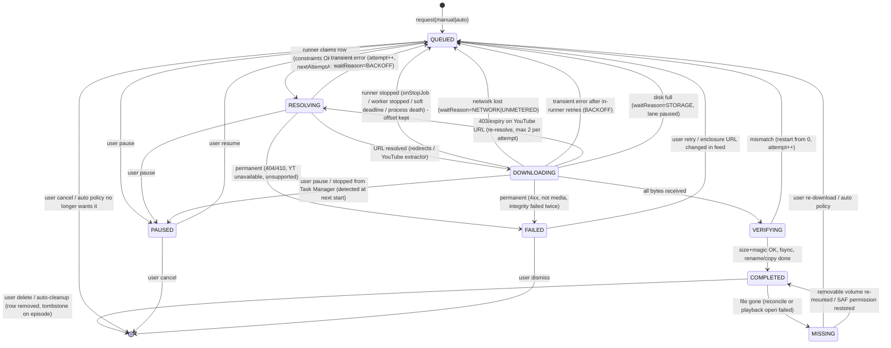

# Research: Episode downloads and storage (Neutrodyne)

Checked on 2026-10-04. Every version number and non-obvious platform claim cites a source in the section "Verified versions & facts". Claims marked **UNVERIFIED** come from memory or from secondary sources I could not confirm. Validate them on a device before relying on them.

These notes assume the same baseline as the sibling notes in `research/stack.md`: minSdk 26, targetSdk/compileSdk 37, Room 3 (`androidx.room3`), Hilt, one shared OkHttp 5 client, and DataStore for scalar settings. Playback (`research/playback.md`) only needs this subsystem to answer one question: "is there a local `file://` or `content://` URI for episode X?" Its streaming cache (a Media3 `SimpleCache` with an LRU evictor) stays separate from downloads.

---

## Recommendation

**Write our own small download engine on OkHttp. It writes real audio files, and the app database is the only record of download state. Two runners drive the engine, chosen by trigger and API level:**

| Trigger | Android 14+ (API 34+) | Android 8–13 (API 26–33) |
|---|---|---|
| **Manual** (user taps Download, "Download all in group", "Download now" on an auto-queued item) | **User-initiated data transfer (UIDT) job.** Our own `JobService`, in a JobScheduler namespace `"downloads"` | **WorkManager expedited work** (`RUN_AS_NON_EXPEDITED_WORK_REQUEST`) that calls `setForeground(dataSync)` when it starts while the app is visible |
| **Auto** (after a feed refresh, per-podcast or per-group policy) | **WorkManager regular work**, one unique "lane" worker with policy constraints (unmetered, optionally charging, storage-not-low) | Same |
| **Cleanup / reconcile** (auto-delete, quota, orphan files, stuck rows) | WorkManager periodic work, also run at app start | Same |

Why this design:

1. **Users must be able to copy files.** That rules out Media3's `DownloadManager`/`DownloadService` as the store, because it keeps media as opaque `SimpleCache` span files. It also means no per-download network rules and no clean background restarts (details below). Real `.mp3`/`.m4a` files can be shared, exported, moved to a user-chosen folder and played by any app.
2. **Background rules now favour UIDT for user-started downloads and WorkManager for automatic ones.**
   - Android 15 caps `dataSync` foreground services at 6 h per 24 h.
   - Android 16 applies the job runtime quota even to jobs that run alongside a foreground service. Google's WorkManager docs now warn that long-running workers "can exhaust your app's job quota".
   - UIDT jobs are exempt from standby-bucket quotas and are what the platform recommends for "downloading a file" the user asked for.
   - UIDT jobs may **not** be used for automatic features and can only be scheduled while the app is visible. So auto-downloads must use ordinary WorkManager jobs.
   - With this split, the `dataSync` foreground service only ever runs on API ≤ 33 devices, where the Android 15 timeout and Android 16 FGS-quota rules do not apply.
3. **Ordinary jobs get about 10 minutes per run and a per-bucket quota**, so every transfer must be resumable. The engine uses `Range`/`If-Range` with a `.part` file whose length is the resume offset.
   - Workers stop themselves at a soft deadline (about 8 min) and re-enqueue a continuation, rather than letting the system time them out. On Android 14+, frequent task timeouts can put the app in the *restricted* bucket.
4. **The database is the single source of truth for the UI.** Each `download` row holds state, bytes and error. A throttled in-memory progress bus smooths progress bars. `WorkInfo` progress is not used for UI, because the UIDT runner has no `WorkInfo` and `WorkInfo` disappears with the work.
5. **Storage.** The default is app-specific external storage: `getExternalFilesDir(DIRECTORY_PODCASTS)` on the primary volume, with an optional removable-volume variant. It needs no permissions and is visible over USB (MTP), but is deleted on uninstall.
   - An opt-in **"Custom folder" (SAF tree)** keeps files outside the app, survives uninstall and is browsable by other apps.
   - Downloads always land in app-specific `.part` files first. When finished they are verified, then renamed (same volume) or copied (SAF).
   - **Do not use MediaStore in v1.** After a reinstall the app loses ownership of its files, and podcasts would mix into music libraries.
   - **Exclude the download directories from Auto Backup.** Otherwise the 25 MB cap is exceeded and the whole cloud backup is skipped.
6. **YouTube audio uses the same engine with a "resolver" step:**
   - Resolve just before downloading.
   - Pick itag **140** (AAC-LC m4a, about 128 kbps) by default for compatibility. Itag **251** (Opus/WebM, about 160 kbps) is an option.
   - Fetch in **10 MiB `Range` chunks** (the yt-dlp default).
   - Re-resolve when the URL is close to its `expire` time or on 403.
   - Run at most one YouTube transfer at a time.
   - Restart from 0 if the re-resolved stream's content length differs.

Concrete defaults to put in the plan:

- At most 3 transfers at once globally, 2 per host, and 1 for YouTube.
- Auto-download is off globally until enabled per podcast or group. When on, it uses unmetered networks only and keeps the newest 3.
- Manual downloads ask before using mobile data.
- Delete played episodes 24 h after completion. Never auto-delete favourites/pinned items or the current or next queue item.
- Storage cap: unlimited by default, with presets.

### Download state machine (recommended)

The persisted `DownloadState` enum, plus a `waitReason` sub-state for `QUEUED`:



`waitReason` values for `QUEUED`: `NONE`, `NETWORK`, `UNMETERED_NETWORK`, `CHARGING`, `STORAGE`, `BACKOFF` (with `nextAttemptAt`), `SYSTEM` (job stopped or quota), `NEEDS_FOREGROUND` (a manual UIDT job could not be scheduled; the user must open the app or tap Resume), `SLOT` (another transfer holds the slot). The UI shows these as "Waiting for Wi-Fi", "Waiting for storage", "Retrying in 4 min" and so on.

Cancellation is a transition, not a state. The engine sets an in-memory "cancel" flag, cancels the coroutine, deletes the `.part` file and removes the row in one transaction.

---

## Options considered

### A. Media3 `DownloadManager` + `DownloadService` (cache-based)

How it works: you add `DownloadRequest`s to a Media3 `DownloadManager`. It writes into a `SimpleCache` (usually with `NoOpCacheEvictor`) and tracks state in a `DownloadIndex` (SQLite via `StandaloneDatabaseProvider`). `DownloadService` is a `dataSync` foreground service that keeps the process alive and posts notifications through `DownloadNotificationHelper`. A `Scheduler` (`PlatformScheduler` or `WorkManagerScheduler`) restarts the service when its `Requirements` become true again. Playback reads the bytes through `CacheDataSource` using the same cache key.

Pros:
- Tight ExoPlayer integration.
- Built-in parallelism (default 3), retries (`DEFAULT_MIN_RETRY_COUNT = 5`) and a requirements watcher.
- `onTimeout()` is already implemented. It just calls `stopSelf()`, see the source.
- Supports DASH/HLS/SmoothStreaming segment downloads, which we would only need for exotic HLS enclosures.
- For YouTube, `DownloadRequest.Builder.setCustomCacheKey()` plus a `ResolvingDataSource` can refresh expired URLs transparently.

Cons, several of them decisive for Neutrodyne:
- **Files are not user-copyable.** Content lives as cache span files, cannot be exported, cannot be played by other apps and cannot live in a user-chosen SAF folder. This conflicts with the "users who want to copy files" requirement.
- **Requirements are global per `DownloadManager`** (`setRequirements`), not per download. "Manual downloads may use mobile data, auto-downloads Wi-Fi only" therefore needs two managers and two caches, or custom hacks.
- **Restarting from the background is blocked.** Its scheduler restarts the service with `startForegroundService()` from a job. Jobs are **not** an exemption from Android 12+ background FGS-start restrictions. Media3's own code catches the `IllegalStateException` and logs "Failed to restart (foreground launch restriction)". So queued auto-downloads may silently not resume until the user opens the app.
- **Android 15 timeout.** The service is a `dataSync` FGS, so on Android 15+ it hits the 6 h / 24 h cap. `onTimeout` stops the service, and remaining downloads wait for the next app foregrounding.
- **Android 15 boot restriction.** A `dataSync` FGS cannot be started from `BOOT_COMPLETED` on Android 15+.
- **No cache sharing.** The streaming cache (LRU) and the download cache (no-op evictor) must be separate `SimpleCache` instances in separate folders. The touted "partially streamed bytes become the download" benefit therefore does not materialise.
- Any streamed byte range would need its own `CacheDataSource` wiring per instance.

Verdict: **reject** as the download store. Media3 stays for playback and the streaming cache. Its `OkHttpDataSource`/`ResolvingDataSource` could optionally provide the HTTP layer (see E).

### B. WorkManager + OkHttp writing real files (only WorkManager)

How it works: a `CoroutineWorker` per lane or per episode streams the HTTP body into a file. `setForeground(ForegroundInfo(..., FOREGROUND_SERVICE_TYPE_DATA_SYNC))` makes it long-running, constraints handle network, charging and storage, and retries use backoff.

Pros:
- Jetpack-supported and persisted across reboots and app updates.
- Per-request constraints, so manual and auto downloads can differ.
- `@HiltWorker` integration.
- AntennaPod ships essentially this design: one `EpisodeDownloadWorker` per episode, expedited with `RUN_AS_NON_EXPEDITED_WORK_REQUEST` for manual downloads, and `UNMETERED` vs `CONNECTED` constraints from a user setting.

Cons:
- **Background limits.** Without `setForeground` a job is limited to about 10 minutes per run and to bucket quotas. With `setForeground` it is a `dataSync` FGS, which has the 6 h / 24 h cap on Android 15+.
- **Android 16 quota.** "Long running workers (which use foreground services) can exhaust your app's job quota."
- **FGS start rules.** `setForeground` from a worker that started in the background throws `ForegroundServiceStartNotAllowedException` on API 31+, because jobs are not an FGS-start exemption.
- **Play Console burden.** The `dataSync` type requires a Play Console declaration and a demo video.

Verdict: **use it for auto-downloads (without FGS) on all API levels, and for manual downloads on API 26–33.**

### C. Android system `DownloadManager`

Pros:
- Almost no code.
- Survives process death and reboots, retries across connectivity changes, and shows a system notification.
- Supports `setAllowedOverMetered`, `setRequiresCharging` (API 24) and `setDestinationInExternalFilesDir`.

Cons:
- **Limited destinations.** Targeting Q+, it can only write under the app's external files dir or the public `Download/`. It cannot write to internal storage or a SAF tree.
- **Opaque behaviour.** Retry and resume logic cannot be controlled (no `If-Range` policy, no Retry-After handling, no content sniffing).
- **Progress only by polling** its cursor or observing `content://downloads/my_downloads`, which gives coarse `COLUMN_REASON` codes.
- **Fixed notifications.** Hiding them needs `DOWNLOAD_WITHOUT_NOTIFICATION`.
- **Cannot re-resolve an expiring YouTube URL** mid-transfer.
- **Varies by OEM.** Behaviour differs across manufacturers (UNVERIFIED anecdotal, widely reported).
- **Same quotas.** Android 16 explicitly lists `DownloadManager` among the APIs subject to the new job runtime quotas, so it no longer escapes background limits.

Verdict: **reject.**

### D. JobScheduler user-initiated data transfer (UIDT) jobs (Android 14+)

How it works: `JobInfo.Builder.setUserInitiated(true)` plus a required network, with `RUN_USER_INITIATED_JOBS` declared. The job must call `JobService.setNotification()` within 10 s of `onStartJob`, or the system raises an ANR. Progress is reported with `updateEstimatedNetworkBytes` and `updateTransferredNetworkBytes`.

Pros:
- **"Not subject to quotas."** Starts immediately when constraints are met.
- Can run long. The system only stops it for constraint loss, thermal pressure, memory, or "ran longer than necessary".
- Shown in Task Manager.
- Allowed constraints include unmetered network, charging, battery-not-low and storage-not-low.
- No FGS, so no `dataSync` timeout and no FGS-start exemption needed at run time.

Cons:
- API 34+ only.
- **No Jetpack wrapper.** Google states "there is currently no Jetpack library that supports UIDT jobs", so we write a `JobService` ourselves.
- **Can only be scheduled while the app is visible** (or allowed to start activities), otherwise `RESULT_FAILURE`.
- **Must NOT be used for automatic features.** The platform docs say so, and Play policy restricts UIDT to user-initiated network transfers.
- **Task Manager stops are final.** If the user stops the job from Task Manager, the process is killed, `onStopJob` is not called and the job is not rescheduled.
- **Rescheduling a running job stops it.** `JobScheduler.schedule()` with the ID of a running job stops it.

Verdict: **use it for manual downloads on API 34+.**

### E. HTTP layer: raw OkHttp vs Media3 `DataSource`

You could implement the engine on Media3's `OkHttpDataSource`, because `DataSpec(position, length)` issues `Range` requests, and wrap YouTube with `ResolvingDataSource`. That shares headers and the client with playback.

I recommend **raw OkHttp** (the same shared client via `newBuilder()`, so the connection pool is shared). We need explicit control over:
- `If-Range` validators;
- 200-vs-206 handling;
- `Retry-After`;
- `Accept-Encoding: identity`;
- content sniffing.

This is about 300 lines and easy to unit-test with `MockWebServer`.

### Storage location options

| Option | Permission | User can copy files? | Survives uninstall | Other apps can play | Resume / partial-write friendly | Notes |
|---|---|---|---|---|---|---|
| **App-specific external** `getExternalFilesDir(DIRECTORY_PODCASTS)` (primary volume) | none | Yes via USB/MTP. On 11+, only the system Files app and PC/Mac can open `Android/data` (third-party file managers cannot) | No (removed). `hasFragileUserData` lets the user choose to keep data | Only via our share/export (FileProvider) | Yes (plain `File`, append, atomic rename) | **Default.** Exclude from Auto Backup |
| App-specific on a removable volume (`ContextCompat.getExternalFilesDirs()[1]`) | none | Yes (USB, card reader) | No | Via export | Yes | Card can be unmounted, so rows become "unavailable" rather than deleted. FAT/exFAT naming limits |
| Internal `filesDir/downloads` | none | No | No | No | Yes | "Private" option. Counts against the often-smaller `/data` partition |
| **User-chosen SAF tree** (`ACTION_OPEN_DOCUMENT_TREE` + `takePersistableUriPermission`) | user grant | **Yes, from any file manager** | **Yes** | Yes | Poor: download to app-specific `.part`, then **copy** into the tree on completion | Android 11+ will not let the user pick the storage root, the SD root or `Download/` itself (a sub-folder like `Download/Podcasts` is fine). `DocumentFile` I/O is slow, so keep our own index |
| MediaStore (`Audio`, `RELATIVE_PATH="Podcasts/Neutrodyne/…"`, `IS_PENDING`) | none to write own files (API 29+) | Yes | Yes | Yes (and they show up in music apps) | OK (`openFileDescriptor("rw")`) | After reinstall the app no longer owns the files (needs a read permission, and user consent to delete). Pending items expire after about 7 days. API 26–28 would need `WRITE_EXTERNAL_STORAGE`. **Not in v1**; possibly an "Export to Music/Podcasts" action later |

---

## Technical detail

### 1. Components (module `:core:download`)

```
DownloadRepository          // public API used by UI, feed refresh, playback, import/export
  ├─ request(episodeId, trigger: MANUAL|AUTO, allowMetered: Boolean?)
  ├─ pause(id) / resume(id) / cancel(id) / delete(id) / retry(id) / promote(id)
  ├─ observe(episodeId): Flow<DownloadUi>        // DB row ⨝ live progress
  ├─ observeAll(filter): Flow<List<DownloadUi>>
  └─ localUriFor(episodeId): Uri?                 // for playback (file:// or content://)
DownloadEngine (@Singleton)  // drains a lane; owns OkHttp client, slots, progress bus, cancel registry
  ├─ RssTransferSource       // plain HTTP enclosure
  └─ YouTubeTransferSource   // resolve → chunked range download → re-resolve
DownloadScheduler           // decides runner (UIDT vs WorkManager), ensures lane is scheduled
ManualDownloadJobService    // UIDT JobService (API 34+)
DownloadLaneWorker          // WorkManager CoroutineWorker (lanes MANUAL on <34, AUTO everywhere)
AutoDownloadPlanner         // after refresh: compute candidates from podcast/group/global policy
CleanupWorker               // periodic: auto-delete, quota, orphans, reconcile
StorageRoots                // resolves rootId → File / DocumentFile; volume mount monitoring
DownloadNotifications       // channels, aggregated progress, errors, actions → BroadcastReceiver
```

All of these run in the main app process. That is the WorkManager and JobScheduler default, which lets the in-memory progress bus and cancel registry be shared with the UI.

### 2. Data model (Room 3)

```kotlin
enum class DownloadState { QUEUED, RESOLVING, DOWNLOADING, PAUSED, VERIFYING, COMPLETED, MISSING, FAILED }
enum class DownloadLane { MANUAL, AUTO }
enum class WaitReason { NONE, NETWORK, UNMETERED_NETWORK, CHARGING, STORAGE, BACKOFF, SYSTEM, NEEDS_FOREGROUND, SLOT }
enum class DownloadError {
  HTTP_NOT_FOUND, HTTP_GONE, HTTP_AUTH, HTTP_CLIENT, HTTP_SERVER, HTTP_RATE_LIMITED, NETWORK_IO,
  NOT_MEDIA /* HTML/captive portal */, SIZE_MISMATCH, STORAGE_FULL, STORAGE_UNAVAILABLE,
  YT_UNAVAILABLE, YT_EXTRACTION, YT_FORBIDDEN, UNSUPPORTED_STREAM /* HLS etc. */, CANCELLED_BY_SYSTEM, UNKNOWN
}

@Entity(tableName = "download", indices = [Index("state", "lane", "priority", "requestedAt")])
data class DownloadEntity(
  @PrimaryKey val episodeId: Long,
  val lane: DownloadLane,
  val state: DownloadState,
  val waitReason: WaitReason = WaitReason.NONE,
  val priority: Int,                 // MANUAL=100, AUTO=0, "download next"=200
  val requestedAt: Long,
  val sourceKind: SourceKind,        // RSS_ENCLOSURE | YOUTUBE
  val sourceRef: String,             // enclosure URL as in feed, or YouTube videoId
  val formatPref: String? = null,    // e.g. "yt:140" / "yt:251"; null for RSS
  val resolvedUrl: String? = null,   // post-redirect / googlevideo URL (never logged: may hold tokens)
  val resolvedExpiresAt: Long? = null,
  val rootId: String,                // "ext:primary" | "ext:<volumeUuid>" | "int" | "saf:<treeKey>"
  val tempPath: String,              // absolute path of the .part file (always app-specific, same volume when possible)
  val relativePath: String? = null,  // final path under root, set at VERIFYING
  val finalUri: String? = null,      // file:// or content:// set at COMPLETED
  val totalBytes: Long? = null,      // from Content-Range / Content-Length / YouTube clen; null = unknown
  val downloadedBytes: Long = 0,     // last persisted offset (the .part length is authoritative)
  val estimatedBytes: Long? = null,  // RSS <enclosure length> (often wrong) – for estimates only
  val etag: String? = null,
  val lastModified: String? = null,
  val mimeType: String? = null,
  val allowMetered: Boolean,
  val attempt: Int = 0,
  val integrityFailures: Int = 0,
  val nextAttemptAt: Long? = null,
  val lastError: DownloadError? = null,
  val lastHttpStatus: Int? = null,
  val completedAt: Long? = null,
  val runnerToken: String? = null,   // which runner owns RESOLVING/DOWNLOADING rows
)
```

Columns on `episode` that the download system reads and writes:
- `downloadDismissedAt`, a tombstone so auto-download never re-fetches what the user deleted;
- `isFavorite` / `keepDownloaded`;
- `playedAt` / `playState`, owned by playback.

Per-podcast and per-group policy is described in section 9.

Atomic claim, so two runners (UIDT + AUTO worker) never take the same row:

```kotlin
@Dao interface DownloadDao {
  @Query("""
    SELECT * FROM download
    WHERE state = 'QUEUED' AND lane IN (:lanes)
      AND (nextAttemptAt IS NULL OR nextAttemptAt <= :now)
      AND (allowMetered = 1 OR :onUnmetered = 1)
      AND (:allowYouTube = 1 OR sourceKind != 'YOUTUBE')
    ORDER BY priority DESC, requestedAt ASC LIMIT 1""")
  suspend fun nextCandidate(lanes: List<DownloadLane>, now: Long, onUnmetered: Boolean, allowYouTube: Boolean): DownloadEntity?

  @Query("UPDATE download SET state='RESOLVING', runnerToken=:token WHERE episodeId=:id AND state='QUEUED'")
  suspend fun claim(id: Long, token: String): Int   // 1 = won the race
}
```

Wrap `nextCandidate` and `claim` in one write transaction (`withWriteTransaction` in Room 3).

### 3. The transfer core (RSS enclosures)

Rules:

- **`Accept-Encoding: identity`.** Otherwise OkHttp transparently requests gzip and strips `Content-Length`, so byte offsets no longer match the bytes on disk.
- **Resume offset = `.part` file length**, not the DB value. The DB lags by design, because it is written every ~2 s. After a crash, rewind 64 KiB (`truncate`) to drop a possibly torn tail. **UNVERIFIED** necessity, but cheap insurance.
- **Don't preallocate with `StorageManager.allocateBytes(fd, n)`.** It *extends the file* to `n`, which breaks the file-length-equals-offset invariant. Use `allocateBytes(volumeUuid, n)` to make the system clear caches, and `getAllocatableBytes(uuid)` to check space.
- **The `If-Range` validator must be strong.** Use the ETag only if it is not `W/…`, else `Last-Modified`, else omit `If-Range` and validate `Content-Range` instead.
- Response handling:
  - `206`: parse `Content-Range: bytes a-b/total`; require `a == offset` and that `total` matches the stored `totalBytes`, else restart.
  - `200` when `offset > 0`: the server ignored the range or the validator changed. Truncate to 0 and continue from this response.
  - `416`: if `offset == totalBytes`, the download is complete; otherwise restart.
  - `429`/`503`: honour `Retry-After`.
  - `404`/`410`: permanent.
  - `401`/`403`: auth failure for RSS (for YouTube, see section 8).
- **Sniff the first bytes before committing.** Expected signatures:
  - `ID3`, or MPEG frame sync (`0xFF` then `0xE0` mask) for MP3;
  - `ftyp` at offset 4 for MP4/M4A;
  - `OggS`, `fLaC`, `RIFF`;
  - EBML `1A 45 DF A3` for WebM;
  - ADTS sync `0xFFF` for AAC.

  If `Content-Type` is `text/html` or the bytes look like HTML (captive portal or error page), mark `NOT_MEDIA` and retry later (max 3), then fail.
- Buffer 128–256 KiB and write with `FileOutputStream(append = true)`, or Okio `sink.appendingSink().buffer()`.
- Check `ensureActive()` per buffer. Cancelling the coroutine cancels the OkHttp `Call`.
- Progress: update the in-memory bus at most every 250 ms. Persist `downloadedBytes` at most every 2 s, at least every 4 MiB, and on every state change.
- On completion:
  - `fd.sync()`;
  - verify `length == totalBytes` when known;
  - rename `.part` to its final name (same directory, so the rename is atomic), or copy into SAF then delete the `.part`;
  - set `COMPLETED`;
  - optionally read the duration with `MediaMetadataRetriever` to correct feed durations.

```kotlin
// Sketch – error classes and helpers elided.
suspend fun transfer(row: DownloadEntity, url: String, part: File, onBytes: (Long, Long?) -> Unit): Outcome =
  withContext(Dispatchers.IO) {
    var offset = part.length()
    val req = Request.Builder().url(url)
      .header("User-Agent", USER_AGENT)          // "Neutrodyne/1.2 (Android; +https://…)"
      .header("Accept-Encoding", "identity")
      .apply {
        if (offset > 0) {
          header("Range", "bytes=$offset-")
          strongValidator(row)?.let { header("If-Range", it) }
        }
      }.build()
    val call = downloadClient.newCall(req)
    currentCoroutineContext().job.invokeOnCompletion { call.cancel() }
    call.execute().use { resp ->
      when (resp.code) {
        206 -> {
          val cr = ContentRange.parse(resp.header("Content-Range")) ?: return@use Outcome.Restart
          if (cr.start != offset || (row.totalBytes != null && cr.total != null && cr.total != row.totalBytes))
            return@use Outcome.Restart
        }
        200 -> if (offset > 0) { RandomAccessFile(part, "rw").use { it.setLength(0) }; offset = 0 }
        416 -> return@use if (row.totalBytes == offset) Outcome.Done(resp.validators()) else Outcome.Restart
        else -> return@use Outcome.Http(resp.code, resp.header("Retry-After"))
      }
      val total = resp.totalLength(offset)               // from Content-Range or Content-Length (+offset)
      val body = resp.body.source()
      FileOutputStream(part, true).use { fos ->
        val buf = ByteArray(256 * 1024)
        if (offset == 0L && !looksLikeMedia(body.peek(), resp.header("Content-Type"))) return@use Outcome.NotMedia
        while (true) {
          currentCoroutineContext().ensureActive()
          val n = body.read(buf); if (n == -1) break
          fos.write(buf, 0, n); offset += n
          onBytes(offset, total)
        }
        fos.fd.sync()
      }
      if (total != null && offset != total) Outcome.Truncated(offset) else Outcome.Done(resp.validators())
    }
  }
```

The `downloadClient` is `sharedClient.newBuilder()` with:
- `connectTimeout(15 s)`, `readTimeout(30 s)`, `callTimeout(0)`;
- `followRedirects(true)`;
- **no `Cache`**, because media must not go through the HTTP cache.

Redirect handling:
- **Do not rewrite** tracking-prefix chains (podtrac, op3, etc.). Request the original enclosure URL for each new attempt.
- Within one attempt, cache `resp.request.url` (the final CDN URL) for subsequent `Range` requests. On 403/404 from that cached URL, fall back to the original.
- Dynamic ad insertion (DAI) hosts can serve *different bytes* per request. `If-Range` and the `Content-Range` total check protect against splicing two different ad stitches. With no validators and a changed total, restart.

### 4. Lanes, runners and the scheduler

```kotlin
class DownloadScheduler @Inject constructor(...) {
  private val laneMutex = Mutex()

  suspend fun ensureScheduled(lane: DownloadLane) = laneMutex.withLock {
    when {
      lane == DownloadLane.MANUAL && Build.VERSION.SDK_INT >= 34 && scheduleUidt() -> Unit
      lane == DownloadLane.MANUAL -> enqueueLane(lane, expedited = true)
      else -> enqueueLane(lane, expedited = false)
    }
  }

  @RequiresApi(34)
  private fun scheduleUidt(): Boolean {
    val js = context.getSystemService(JobScheduler::class.java).forNamespace("downloads")
    if (!js.canRunUserInitiatedJobs()) return false
    if (engine.isUidtRunning) return true            // NEVER schedule() a running job – it would be stopped
    val anyMetered = dao.anyQueued(DownloadLane.MANUAL, allowMetered = true)
    val net = NetworkRequest.Builder()
      .addCapability(NetworkCapabilities.NET_CAPABILITY_INTERNET)
      .addCapability(NetworkCapabilities.NET_CAPABILITY_VALIDATED)     // avoid captive portals (UNVERIFIED whether JS adds it implicitly)
      .apply { if (!anyMetered) addCapability(NetworkCapabilities.NET_CAPABILITY_NOT_METERED) }
      .build()
    val info = JobInfo.Builder(JOB_ID_MANUAL, ComponentName(context, ManualDownloadJobService::class.java))
      .setUserInitiated(true)
      .setRequiredNetwork(net)
      .setEstimatedNetworkBytes(dao.remainingBytes(DownloadLane.MANUAL), 0)
      .setRequiresStorageNotLow(true)
      .setPersisted(true)                               // needs RECEIVE_BOOT_COMPLETED
      .setBackoffCriteria(30_000, JobInfo.BACKOFF_POLICY_EXPONENTIAL)
      .build()
    return js.schedule(info) == JobScheduler.RESULT_SUCCESS   // RESULT_FAILURE when app not visible
  }

  private fun enqueueLane(lane: DownloadLane, expedited: Boolean) {
    val req = OneTimeWorkRequestBuilder<DownloadLaneWorker>()
      .setInputData(workDataOf("lane" to lane.name))
      .setConstraints(constraintsFor(lane))
      .setBackoffCriteria(BackoffPolicy.EXPONENTIAL, 30, TimeUnit.SECONDS)
      .apply { if (expedited) setExpedited(OutOfQuotaPolicy.RUN_AS_NON_EXPEDITED_WORK_REQUEST) }
      .addTag("download")
      .build()
    workManager.enqueueUniqueWork("download-lane-${lane.name}", ExistingWorkPolicy.KEEP, req)
  }
}
```

Points to note:

- **Expedited work accepts only network and storage constraints.** Charging or battery constraints throw `IllegalArgumentException`. The manual lane therefore never sets charging. The auto lane is never expedited.
- **Race between "queue empty, return" and a new insert under `KEEP`.** The worker takes `laneMutex` to decide "queue empty → finish", and `ensureScheduled` takes it to enqueue. Everything runs in one process, so a Kotlin `Mutex` is enough.
  - An alternative is `APPEND_OR_REPLACE`, which chains a no-op successor per request. It is simpler but grows chains when the user taps quickly.
- **Mixed-network manual queue.** If the UIDT job is running on a metered network and only Wi-Fi-only manual items remain, they cannot be satisfied. Rescheduling the UIDT job from the background is impossible because the app is not visible. Instead, **demote** those rows to the AUTO lane (WorkManager, `UNMETERED`) and finish the job.
- **Promote.** Tapping "Download now" on an AUTO-queued row sets `lane=MANUAL, priority=200` and calls `ensureScheduled(MANUAL)`. This works because the user is in the app.
- **UIDT scheduling failure** (permission revoked, or called from the background): fall back to WorkManager expedited, and set `waitReason=NEEDS_FOREGROUND` only if that also cannot run.

#### UIDT JobService (API 34+)

```kotlin
@RequiresApi(34)
@AndroidEntryPoint
class ManualDownloadJobService : JobService() {
  @Inject lateinit var engine: DownloadEngine
  @Inject lateinit var notifications: DownloadNotifications
  private val scope = CoroutineScope(SupervisorJob() + Dispatchers.Default)
  private var current: JobParameters? = null       // keep a strong ref: Android 16 "abandoned job" stop reason

  override fun onStartJob(params: JobParameters): Boolean {
    current = params
    // MUST happen within 10 s or the system ANRs the app and stops the job.
    setNotification(params, NOTIF_ID_MANUAL, notifications.manualInitial(), JOB_END_NOTIFICATION_POLICY_REMOVE)
    scope.launch {
      val outcome = engine.drain(
        lanes = listOf(DownloadLane.MANUAL), runnerToken = "uidt", softDeadline = null,
        onEstimate = { remaining -> updateEstimatedNetworkBytes(params, remaining, 0) },
        onTransferred = { bytes -> updateTransferredNetworkBytes(params, bytes, 0) },
        onNotification = { n -> setNotification(params, NOTIF_ID_MANUAL, n, JOB_END_NOTIFICATION_POLICY_REMOVE) },
      )
      jobFinished(params, /* wantsReschedule = */ outcome is DrainOutcome.BackingOff)
      current = null
    }
    return true // work continues asynchronously; onStartJob must return fast (Android 14 ANR rule)
  }

  override fun onStopJob(params: JobParameters): Boolean {
    Log.i(TAG, "UIDT stopped: reason=${params.stopReason}")  // persist for diagnostics
    scope.coroutineContext.cancelChildren()                  // engine's finally{} puts rows back to QUEUED(SYSTEM)
    return true                                              // reschedule with backoff
  }
}
```

**UNVERIFIED:** whether calling `setNotification()` repeatedly is the intended way to update progress, or whether `NotificationManager.notify(sameId, …)` is. Test both on Android 14 and 16.

Use **one** manual UIDT job (fixed ID) that drains the DB queue, not one job per episode. This gives one aggregated notification and one Task Manager entry. `JobScheduler.enqueue(JobInfo, JobWorkItem)` can add work to a running job without stopping it. It is an alternative, but its interaction with `setPersisted`/UIDT is **UNVERIFIED**. The DB-drain approach avoids the question.

#### Lane worker (WorkManager)

```kotlin
@HiltWorker
class DownloadLaneWorker @AssistedInject constructor(
  @Assisted ctx: Context, @Assisted params: WorkerParameters,
  private val engine: DownloadEngine, private val scheduler: DownloadScheduler,
  private val notifications: DownloadNotifications,
) : CoroutineWorker(ctx, params) {

  override suspend fun doWork(): Result {
    val lane = DownloadLane.valueOf(inputData.getString("lane")!!)
    var foreground = false
    if (lane == DownloadLane.MANUAL && Build.VERSION.SDK_INT < 34) {
      foreground = runCatching {
        setForeground(ForegroundInfo(NOTIF_ID_MANUAL, notifications.manualInitial(),
          if (Build.VERSION.SDK_INT >= 29) ServiceInfo.FOREGROUND_SERVICE_TYPE_DATA_SYNC else 0))
      }.isSuccess    // fails with ForegroundServiceStartNotAllowedException if we started in background on 31–33
    }
    // Stop voluntarily before JobScheduler's ~10 min limit: frequent timeouts → restricted bucket (Android 14+).
    val deadline = if (foreground) null else SystemClock.elapsedRealtime() + 8.minutes.inWholeMilliseconds
    return when (val o = engine.drain(listOf(lane), runnerToken = id.toString(), softDeadline = deadline)) {
      DrainOutcome.Empty -> Result.success()
      DrainOutcome.DeadlineReached -> { scheduler.enqueueContinuation(lane); Result.success() }
      is DrainOutcome.BackingOff -> { scheduler.enqueueAt(lane, o.earliest); Result.success() }
      DrainOutcome.LaneBlocked /* storage full etc. */ -> Result.success()
    }
  }

  override suspend fun getForegroundInfo() =  // required for setExpedited() on API < 31
    ForegroundInfo(NOTIF_ID_MANUAL, notifications.manualInitial())
}
```

`enqueueContinuation(lane)` uses `ExistingWorkPolicy.APPEND_OR_REPLACE`, so the follow-up runs after this worker succeeds. If the system stops the worker (quota, constraints, `STOP_REASON_*`), `CancellationException` reaches the engine. The engine's `finally` puts rows back to `QUEUED(waitReason=SYSTEM)`, and WorkManager reschedules the work by itself. Log `WorkInfo.stopReason` for diagnostics.

#### Engine drain loop (shared)

- **Slots.** Global `Semaphore(maxParallel)` (default 3). The MANUAL lane gets priority: a priority-aware semaphore, or a reserved slot. Per-host `Semaphore(2)`. YouTube `Semaphore(1)`.
- **Loop:**
  1. While the deadline has not passed, claim the next eligible row for the lane.
  2. Check `getAllocatableBytes(volumeUuid) ≥ (totalBytes ?: estimate ?: 150 MB) + 200 MB margin`. If the check fails, try `allocateBytes(uuid, n)`. If space is still short, run `CleanupPlanner` when auto-delete is enabled, else set the lane to `STORAGE`.
  3. Launch the transfer in a child coroutine.
- **In-runner quick retries** for transient I/O: 3 tries at 2 s, 8 s and 30 s, each resuming from the current offset. If they fail, set the row to `QUEUED(BACKOFF)` with `nextAttemptAt = now + min(30 s · 2^attempt, 6 h)` plus jitter. After `attempt > 8` (about 1 day), set `FAILED`.
- **Exit:** when nothing is claimable, return `Empty`, or `BackingOff(earliest nextAttemptAt)`.
- **Network changes.** On a network change mid-transfer (`ConnectivityManager` callback), re-evaluate `allowMetered` for rows in flight. If the network became metered and a row is unmetered-only, stop that row and set it to `QUEUED(UNMETERED_NETWORK)`.

### 5. Progress reporting

**Source of truth: the DB.**
- `DownloadDao.observe…()` returns a Flow.
- In-memory `DownloadProgressBus` is a `MutableStateFlow<Map<Long, LiveProgress(bytes, total, bytesPerSec)>>`, updated every 250 ms or less often.
- The UI combines them: `dao.observe(id).combine(bus.flow.map { it[id] }) { row, live -> … }`. The live value wins while the state is `DOWNLOADING`, else the row value.

Why not `WorkInfo.progress`:
- the UIDT runner has none;
- `WorkInfo` is per *work request* (a lane), not per episode;
- `Data` is limited to 10 KB;
- progress vanishes when the work finishes;
- each `setProgress` is itself a DB write in WorkManager's database.

Notifications:
- One aggregated "Downloading 3 episodes · 45 %" notification with Pause all / Cancel all actions. The actions use a `PendingIntent` to a `BroadcastReceiver` that updates the DB and pokes the engine.
- Update at most about once per second. NotificationManager throttles faster updates (exact limit **UNVERIFIED**).
- Use `setOnlyAlertOnce(true)`.
- Do **not** request Live Update promotion. Downloads are not among the documented use cases.

### 6. Constraints, network and power

| Setting | Manual lane | Auto lane |
|---|---|---|
| Network | "Mobile data for manual downloads": Ask (default) / Always / Never. "Ask" shows a dialog at tap time | Unmetered only (default). "Any network" allowed with a warning |
| Charging | — (expedited forbids it; UIDT allows it but users expect immediacy) | Optional "Only while charging" (off by default). Charging lifts App Standby restrictions for non-restricted buckets, so on slow Wi-Fi it is also the most reliable setting |
| Battery not low | — | On |
| Storage not low | `setRequiresStorageNotLow(true)` on UIDT and plus own `getAllocatableBytes` check | On |
| Roaming | Treated as metered | Never |

**Data Saver.** When Data Saver is on (`ConnectivityManager.getRestrictBackgroundStatus()`), background metered traffic is blocked. Show a hint in the Downloads screen instead of a silent stall. How JobScheduler treats Data Saver for metered-network jobs is **UNVERIFIED**.

### 7. Storage layout, naming and integrity

Directory layout for app-managed roots:

```
<root>/                                    root = getExternalFilesDir(DIRECTORY_PODCASTS) | filesDir/downloads
  .partial/<episodeId>.part                (same volume → atomic rename)
  <Podcast Title> [p<podcastId>]/
      2026-10-01 <Episode Title> [e<episodeId>].mp3
```

For a SAF tree: `<tree>/<Podcast Title>/<yyyy-MM-dd> <Episode Title>.<ext>`. Create the file with `DocumentsContract.createDocument`, which may rename to "… (1)". Store the returned document URI in `finalUri`. Optionally write a small `neutrodyne-index.json` sidecar (episode GUID, feed URL, file name) so downloads can be re-attached after reinstall or an OPML import on a new phone.

Naming rules:
- NFC-normalise.
- Strip `/ \ : * ? " < > |` and control characters.
- Trim leading and trailing dots and spaces.
- Cap each component at about 100 UTF-8 bytes (ext4/F2FS allow 255 bytes; FAT/exFAT on SD cards allow 255 UTF-16 units and forbid the same characters).
- Avoid DOS device names (`CON`, `NUL`…) on removable volumes.
- The `[e<id>]` suffix guarantees uniqueness even if titles collide case-insensitively on FAT.
- **Never rename after completion.** Store `relativePath` and `finalUri`.

Extension precedence:
1. Sniffed magic.
2. `Content-Type`: `audio/mpeg`→mp3, `audio/mp4|audio/x-m4a|audio/m4a`→m4a, `audio/aac`→aac, `audio/ogg`→ogg/opus, `audio/webm`→webm, `video/mp4`→mp4, `audio/flac`→flac.
3. URL path suffix with the query stripped.

Integrity:
- The byte count equals `totalBytes`, which comes from `Content-Range`/`Content-Length`, **never** from the RSS `<enclosure length>`. That attribute is often 0 or wrong; use it only for estimates.
- Magic sniff (above).
- `fsync` before rename.
- If `<podcast:alternateEnclosure>` has `<podcast:integrity type="sri" value="sha384-…">` **and** we download that source, verify the SRI hash while streaming (`MessageDigest`). This is rare in practice. It is cheap to support only if the feed parser already exposes it.
- If integrity fails twice, mark `FAILED(SIZE_MISMATCH)`.

### 8. YouTube audio downloads

YouTube support depends on the extractor chosen by the YouTube research area. NewPipeExtractor is the obvious candidate; latest tag v0.26.5, 2026-08-15. The download side needs a resolver interface:

```kotlin
interface YouTubeResolver {
  /** Fresh stream URL for videoId + itag. Throws Unavailable / ExtractionFailed / RateLimited. */
  suspend fun resolve(videoId: String, preferredItags: List<Int>): ResolvedStream
}
data class ResolvedStream(val url: String, val itag: Int, val mime: String, val contentLength: Long?, // `clen`
                          val expiresAt: Long?,                                                     // `expire` (epoch s)
                          val isDrc: Boolean, val audioTrackKind: String?)                          // original/dubbed
```

Format choice:

| itag | Container/codec | ~Bitrate | Use |
|---|---|---|---|
| **140** | M4A / AAC-LC | 128 kbps | **Default.** Plays everywhere: other apps, car stereos, iOS. Gives the best "copy the file" story |
| 251 | WebM / Opus | ~160 kbps VBR | "Prefer Opus" setting. Better quality per bit; plays in ExoPlayer and VLC but in fewer car or OS players |
| 250 / 249 | WebM / Opus | ~70 / ~50 kbps | "Save space" setting |
| 139 | M4A / HE-AAC | 48 kbps | "Save space" with m4a; not always offered |

Prefer non-DRC variants (yt-dlp tags DRC audio separately) and the *original* audio track on multi-language videos. NewPipeExtractor 0.26.3 started reading the audio-track type from `xtags`.

Download procedure:
1. **Resolve immediately before transfer** (state `RESOLVING`). Do not resolve when queuing: URLs expire (the `expire` parameter, reportedly about 6 h) and are reportedly bound to the requesting IP. A queued auto-download may wait for hours, and the phone may move from mobile data to Wi-Fi. Persist `resolvedUrl`, `expiresAt` and `totalBytes = clen`.
2. **Fetch in 10 MiB ranges**: `Range: bytes=a-(a+10MiB-1)`. yt-dlp applies `http_chunk_size = 10 MiB` to all YouTube HTTPS formats, because unchunked requests are throttled. Append each 206 to the `.part`.
3. Before each chunk, if `expiresAt - now < 10 min`, re-resolve. On `403`/`410` mid-download, re-resolve once or twice; it may be a new IP after a network switch. If the new `clen` differs from the stored `totalBytes`, the encode differs, so restart from 0. Otherwise continue at the current offset.
4. **Concurrency 1** for YouTube, with randomised 0.5–2 s gaps between chunk requests. On `429`, back off hard (≥ 30 min). After several extractor failures in a row, open a circuit breaker: `YT_EXTRACTION`, no retries for 6–12 h, and a UI hint to "update the app".
5. Live streams, premieres, members-only, age-restricted and region-blocked videos → `FAILED(YT_UNAVAILABLE)`. Shorts are filtered out by the auto policy.
6. Auto-download for YouTube "podcasts":
   - Smaller default `keepLatest` (e.g. 2).
   - Optional min/max duration filter.
   - Cap resolutions per refresh (e.g. 5), spaced out, to avoid bot detection.
7. **Moving target.**
   - Per the yt-dlp PO-Token guide, the `web`, `mweb`, `android` and `ios` clients now need GVS PO tokens; `tv`, `android_vr` and `web_embedded` do not.
   - Some web clients are "SABR-only".
   - NewPipe's 2026 releases repeatedly had to switch player clients.
   - Plan for frequent extractor updates. Keep YouTube behind the `TransferSource` interface so a SABR-based fetcher could replace plain range requests later.

### 9. Auto-download, auto-delete and quota policy

The policy model is the same at three levels. Nullable means "inherit".

```kotlin
data class AutoDownloadPolicy(
  val enabled: Boolean?,          // per podcast / per group / global
  val keepLatest: Int?,           // newest N unplayed episodes kept downloaded
  val network: NetworkPolicy?,    // UNMETERED | ANY
  val requireCharging: Boolean?,
  val deleteAfterPlayed: DeleteAfter?,  // IMMEDIATELY | AFTER_24H | NEVER
  val includeVideo: Boolean?,     // video enclosures can be 1 GB+
)
```

**Resolution**, a proposal the product owner should confirm:
1. An explicit podcast value wins.
2. Otherwise merge across all groups the podcast belongs to: `enabled = any(enabled)`, `keepLatest = max`, `network = most restrictive`, `deleteAfterPlayed = least aggressive`.
3. Otherwise the global value.

Show the "effective policy" and where it came from in the podcast settings UI.

**AutoDownloadPlanner** runs after every feed refresh and on policy change. For each podcast with an effective `enabled`:
- Candidates are the newest `keepLatest` episodes by `pubDate` that are:
  - unplayed;
  - not dismissed (tombstone);
  - not already downloaded or queued;
  - not older than the subscription date when "don't backfill" is on (product question).
- Admit candidates in order: newest first, round-robin across podcasts so one prolific feed cannot starve others.
- Admission stops if the quota or free space would be exceeded after cleanup.
- Insert rows as `QUEUED(lane=AUTO)` and call `ensureScheduled(AUTO)`.
- Remove AUTO rows that are still `QUEUED` but no longer wanted (for example played elsewhere, or no longer in the top N).

**CleanupPlanner** runs periodically (daily, plus after playback completes, plus before admission). Eligible for deletion, in order:
1. Played episodes past their grace period, auto lane first and oldest played first.
2. Played manual downloads, if `deleteAfterPlayed` applies to manual downloads (product question).
3. Unplayed AUTO downloads beyond `keepLatest`, oldest `pubDate` first.

Never auto-deleted:
- favourites and "keep" pins;
- the episode currently playing;
- the next K queue items;
- unplayed MANUAL downloads.

Delete the file, set `episode.downloadDismissedAt` only for *user* deletions (auto-cleanup must not block a later re-download), and remove the row. If the file is open in the player, defer deletion. Unlinking an open `File` is safe on Linux, but a SAF document may not be.

**Quota.** The global cap is "Unlimited / 1 / 2 / 5 / 10 / 20 GB". Used bytes come from the sum of `totalBytes` for `COMPLETED` rows, not a filesystem walk. When over the cap after cleanup, stop admitting auto items and show "Storage limit reached".

**Low space at runtime.** On `IOException` whose cause is `ErrnoException(ENOSPC)`:
- pause the whole lane (`waitReason=STORAGE`);
- keep the `.part`;
- notify with a "Manage storage" action (`StorageManager.ACTION_MANAGE_STORAGE`, optionally with `EXTRA_REQUESTED_BYTES`);
- resume when the storage-not-low constraint fires or the user frees space.

### 10. Manifest and backup rules

```xml
<uses-permission android:name="android.permission.INTERNET"/>
<uses-permission android:name="android.permission.ACCESS_NETWORK_STATE"/>      <!-- required for JS network constraints (A14+) -->
<uses-permission android:name="android.permission.RUN_USER_INITIATED_JOBS"/>   <!-- UIDT, API 34+ -->
<uses-permission android:name="android.permission.RECEIVE_BOOT_COMPLETED"/>    <!-- setPersisted(true) -->
<uses-permission android:name="android.permission.POST_NOTIFICATIONS"/>        <!-- A13+, request on first download -->
<uses-permission android:name="android.permission.FOREGROUND_SERVICE"/>
<uses-permission android:name="android.permission.FOREGROUND_SERVICE_DATA_SYNC"/> <!-- only for WM setForeground on API<34 -->

<application
    android:dataExtractionRules="@xml/data_extraction_rules"
    android:fullBackupContent="@xml/backup_rules"
    android:hasFragileUserData="true"  >  <!-- uninstall dialog offers "keep app data" (product decision) -->

  <service android:name=".download.ManualDownloadJobService"
      android:permission="android.permission.BIND_JOB_SERVICE"
      android:exported="false"/>

  <service android:name="androidx.work.impl.foreground.SystemForegroundService"
      android:foregroundServiceType="dataSync"
      tools:node="merge"/>

  <receiver android:name=".download.DownloadActionReceiver" android:exported="false"/>
</application>
```

`res/xml/data_extraction_rules.xml` (API 31+) and an equivalent `backup_rules.xml` (API ≤ 30):

```xml
<data-extraction-rules>
  <cloud-backup>
    <exclude domain="external" path="Podcasts/"/>
    <exclude domain="file" path="downloads/"/>
  </cloud-backup>
  <device-transfer>
    <exclude domain="external" path="Podcasts/"/>
    <exclude domain="file" path="downloads/"/>
  </device-transfer>
</data-extraction-rules>
```

Use `getExternalFilesDir(DIRECTORY_PODCASTS)`, so the path relative to the `external` domain is `Podcasts/`. Excluding downloads from device-to-device transfer is a judgement call: it keeps transfers fast, and the restored DB is reconciled anyway.

**Play Console.** Declaring `dataSync` requires the FGS declaration form (description, user impact, demo video). If the product owner prefers no `dataSync` at all, drop `setForeground` on API 26–33. Manual downloads then rely on expedited, then regular, 10-minute windows with resume. That is slower in the background but simpler.

### 11. Lifecycle: process death, reboot, update, uninstall

- **`DownloadReconciler`** runs at app start (`Application.onCreate` → WorkManager one-shot) and in `CleanupWorker`. It:
  1. Moves rows in `RESOLVING`/`DOWNLOADING` whose `runnerToken` is not live in this process to `QUEUED(SYSTEM)`.
  2. For `COMPLETED` rows, checks the file exists and its size matches. If the volume is unmounted or the SAF grant is gone, sets `MISSING` with a reason (`STORAGE_UNAVAILABLE`) and does not delete. If the file is truly gone, sets `MISSING`.
  3. Deletes orphan `.part` files that have no row, and `.part` files untouched for more than 14 days.
  4. Re-arms runners for queued rows. The app is visible at start, so a manual UIDT job can be (re)scheduled. This covers jobs lost to force-stop.
- **Task Manager "Stop".** The process is killed with no `onStopJob`. At the next start, rows look like process death. To avoid silently resuming against the user's wish, check `ActivityManager.getHistoricalProcessExitReasons()` (API 30+) for a user-initiated stop. The exact reason code produced by a Task Manager stop is **UNVERIFIED**. If it is detected, set the manual rows to `PAUSED`.
- **Reboot.** WorkManager reschedules its work. The persisted UIDT job is rescheduled by the system. Neither needs an FGS from `BOOT_COMPLETED`, which Android 15+ forbids for `dataSync`.
- **App update.** The process is killed. WorkManager work and persisted jobs survive (**UNVERIFIED** for UIDT across updates, so the reconcile step covers it). Keep the `ManualDownloadJobService` class name and `JOB_ID_MANUAL` stable forever. Schema migrations must keep `rootId` + `relativePath` semantics.
- **Uninstall / "Clear storage".**
  - App-specific internal and external files are removed, unless the user accepts "keep app data" in the `hasFragileUserData` prompt.
  - SAF-folder files remain. A reinstall can re-attach them via the sidecar index after OPML import.
- **Backup restore onto a new phone.** The DB comes back without files. The reconciler turns `COMPLETED` rows into `MISSING`. Auto-policy re-queues what it wants, and the UI offers "Re-download all".

### 12. Moving downloads between roots

When the user changes the download location, ask "Move existing downloads?". A WorkManager job, non-expedited and resumable per file, then for each file:
1. copies it;
2. verifies the size;
3. updates the row in one transaction;
4. deletes the source.

It runs for at most 8 min per execution and continues via `APPEND_OR_REPLACE`. During the move, playback uses whichever `finalUri` the row currently has.

### 13. Observability (debug screen)

- Per row: state, `waitReason`, attempt, last error/HTTP code, and the last stop reason (from `JobParameters.getStopReason()` / `WorkInfo.stopReason`).
- On API 36+: `JobScheduler.getPendingJobReasons(JOB_ID_MANUAL)`.
- On API 37: `getPendingJobReasonStats()`.
- Standby bucket: `UsageStatsManager.getAppStandbyBucket()`. Restricted means downloads will be slow.

---

## Verified versions & facts

All checked 2026-10-04.

| Fact | Source |
|---|---|
| **Media3 1.11.1** is the latest stable (2026-09-10). 1.11.0 was 2026-08-05; no alpha/beta/RC currently open. Media3 minSdk 23 since 1.9.0 | https://developer.android.com/jetpack/androidx/releases/media3 ; https://dl.google.com/android/maven2/androidx/media3/media3-exoplayer/maven-metadata.xml |
| `media3-exoplayer-workmanager` 1.11.1 | https://dl.google.com/android/maven2/androidx/media3/media3-exoplayer-workmanager/maven-metadata.xml |
| Media3 `DownloadService` uses `FOREGROUND_SERVICE_TYPE_DATA_SYNC`, implements `onTimeout()` → `stopSelf()`, and its restart path catches the FGS launch restriction ("Failed to restart (foreground launch restriction)"). `DownloadManager` defaults: 3 parallel downloads, 5 minimum retries, global `Requirements(NETWORK)` | https://github.com/androidx/media/blob/release/libraries/exoplayer/src/main/java/androidx/media3/exoplayer/offline/DownloadService.java ; https://github.com/androidx/media/blob/release/libraries/exoplayer/src/main/java/androidx/media3/exoplayer/offline/DownloadManager.java |
| **WorkManager 2.12.0** stable (2026-09-23), minSdk 24. 2.11.0 (2025-10-22) minSdk 23. 2.10.0 added `STOP_REASON_FOREGROUND_SERVICE_TIMEOUT` and `Constraints.setRequiredNetworkRequest`. 2.10.5 fixed an FGS crash with overlapping foreground workers | https://developer.android.com/jetpack/androidx/releases/work ; https://developer.android.com/develop/background-work/services/fgs/troubleshooting |
| `Constraints.Builder.setRequiredNetworkRequest(NetworkRequest, NetworkType)` applies on API 28+, and falls back to the `NetworkType` below that | https://developer.android.com/reference/kotlin/androidx/work/Constraints.Builder |
| **OkHttp 5.5.0** (and `okhttp-coroutines` 5.5.0) is the latest on Maven Central, metadata updated 2026-08-16. Okio 3.18.2 | https://repo1.maven.org/maven2/com/squareup/okhttp3/okhttp/maven-metadata.xml ; https://repo1.maven.org/maven2/com/squareup/okhttp3/okhttp-coroutines/maven-metadata.xml ; https://repo1.maven.org/maven2/com/squareup/okio/okio/maven-metadata.xml |
| Room 3 `room3-runtime` 3.0.3 (3.1.0-alpha01 exists). Room 2.8.5. DocumentFile 1.1.0 | https://dl.google.com/android/maven2/androidx/room3/room3-runtime/maven-metadata.xml ; https://dl.google.com/android/maven2/androidx/room/room-runtime/maven-metadata.xml ; https://dl.google.com/android/maven2/androidx/documentfile/documentfile/maven-metadata.xml |
| **NewPipeExtractor** latest tag v0.26.5 (2026-08-15). v0.26.3 (2026-06-09) added "workaround for SABR enforcement using another player client" and audio-track type from xtags | https://github.com/TeamNewPipe/NewPipeExtractor/tags ; https://github.com/TeamNewPipe/NewPipeExtractor/releases |
| **Android 15:** `dataSync` (and `mediaProcessing`) FGS limited to 6 h per 24 h for apps targeting 15+. The timer resets when the app comes to the foreground. `Service.onTimeout(int,int)` gives a few seconds to `stopSelf()`, otherwise a `RemoteServiceException` | https://developer.android.com/develop/background-work/services/fgs/timeout |
| Android 15: apps targeting 15+ can't launch a `dataSync` FGS from `BOOT_COMPLETED` | https://developer.android.com/develop/background-work/services/fgs/service-types |
| **Android 16:** job runtime quota now also applies to jobs that start while the app is visible and continue after it becomes invisible, and to jobs running concurrently with an FGS. The active bucket gets a "generous" quota. Applies to WorkManager, JobScheduler **and DownloadManager**. New `STOP_REASON_TIMEOUT_ABANDONED`. `setImportantWhileForeground` is ignored | https://developer.android.com/about/versions/16/behavior-changes-all |
| "Starting with Android 16, long running workers (which use foreground services) can exhaust your app's job quota." Android 14+ needs an FGS type for long-running workers | https://developer.android.com/develop/background-work/background-tasks/persistent/how-to/long-running |
| Quota table. Regular jobs: Active 20 min/60 min (since A16); Working set 10 min/4 h; Frequent 10 min/12 h; Rare 10 min/24 h; Restricted once per day 10 min. Expedited: 30/15/10/10/5 min per 24 h. "Values … subject to change" | https://developer.android.com/topic/performance/power/power-details |
| Standby restrictions are not imposed while charging (except the restricted bucket). Launching an activity, running a long FGS or tapping a notification moves the app to Active | https://developer.android.com/topic/performance/appstandby |
| **UIDT:** requires `RUN_USER_INITIATED_JOBS`. Only schedulable while visible or allowed to launch activities (else `RESULT_FAILURE`). "Should NOT be used for automatic features". Not subject to quotas. `PRIORITY_MAX`. Must specify a network. Task Manager stop prevents rescheduling. No Jetpack library supports UIDT | https://developer.android.com/develop/background-work/background-tasks/uidt ; https://developer.android.com/reference/android/app/job/JobInfo.Builder#setUserInitiated(boolean) |
| `JobService.setNotification`, `updateEstimatedNetworkBytes` and `updateTransferredNetworkBytes` were added in API 34. Not calling `setNotification` within 10 s of `onStartJob` → ANR and the job is stopped | https://developer.android.com/reference/android/app/job/JobService |
| `JobScheduler.schedule()`: "If a job with the given ID is currently running, it will be stopped". `enqueue()` adds work without stopping. `canRunUserInitiatedJobs()` and `forNamespace()` are API 34. `getPendingJobReasons()` is API 36 | https://developer.android.com/reference/android/app/job/JobScheduler |
| Expedited jobs may only set network, storage-not-low and persistence constraints. They get at least 1 minute of execution | https://developer.android.com/reference/android/app/job/JobInfo.Builder#setExpedited(boolean) ; https://developer.android.com/develop/background-work/background-tasks/persistent/getting-started/define-work |
| WorkManager backoff: minimum 10 s, default EXPONENTIAL 30 s. Expedited needs `getForegroundInfo()` before Android 12 | https://developer.android.com/develop/background-work/background-tasks/persistent/getting-started/define-work |
| On Android 14+, tasks that time out too often can put the app in the restricted bucket | https://developer.android.com/develop/background-work/background-tasks/optimize-battery |
| Android 14 (targeting): JobScheduler network constraints require `ACCESS_NETWORK_STATE` (`SecurityException` otherwise). Slow `onStartJob`/`onStopJob` → ANR | https://developer.android.com/about/versions/14/behavior-changes-14 |
| Background FGS-start exemptions (A12+) do **not** include running a job (regular, expedited or UIDT). They do include notification/widget interaction and `BOOT_COMPLETED`/`MY_PACKAGE_REPLACED` | https://developer.android.com/develop/background-work/services/fgs/restrictions-bg-start |
| Google's data-transfer guidance: WorkManager for background or automatic transfers, UIDT for user-initiated transfers needing progress | https://developer.android.com/develop/background-work/background-tasks/data-transfer-options ; https://developer.android.com/about/versions/15/changes/datasync-migration |
| **Android 17** (API 37) stable 2026-06-16 | https://en.wikipedia.org/wiki/Android_17 |
| Android 17 behaviour changes relevant here: app memory limits based on RAM, background audio hardening, and a mandatory local-network permission for apps targeting 37. No JobScheduler/FGS quota changes are listed. New `getPendingJobReasonStats()` | https://developer.android.com/about/versions/17/behavior-changes-all ; https://developer.android.com/about/versions/17/behavior-changes-17 ; https://developer.android.com/about/versions/17/features |
| Play: new apps and updates must target API 36 from 2026-08-31 (extension to 2026-11-01) | https://support.google.com/googleplay/android-developer/answer/11926878 |
| Play: FGS types must be declared in Play Console with a description, user impact and video | https://support.google.com/googleplay/android-developer/answer/13392821 |
| Play Device & Network Abuse policy: UIDT allowed only if user-initiated, for network transfer, and running only as long as needed. It prohibits apps that "access or use a service or API in a manner that violates its terms of service" (relevant to YouTube downloading) | https://support.google.com/googleplay/android-developer/answer/9888379 |
| Live Update promotion criteria and use cases (downloads are not listed) | https://developer.android.com/develop/ui/views/notifications/live-update |
| System `DownloadManager`: targeting Q+, destinations are limited to app-owned dirs or public `Download/`. Hiding notifications needs `DOWNLOAD_WITHOUT_NOTIFICATION`. `setRequiresCharging` (API 24) | https://developer.android.com/reference/android/app/DownloadManager.Request ; https://developer.android.com/reference/android/app/DownloadManager |
| App-specific external files are removed on uninstall. Other apps can't access them under scoped storage. `getAllocatableBytes`/`allocateBytes` | https://developer.android.com/training/data-storage/app-specific |
| `StorageManager.allocateBytes(FileDescriptor, long)` (API 26) **extends the file** to the requested size. The UUID variant clears caches. `ACTION_MANAGE_STORAGE` (API 25) | https://developer.android.com/reference/android/os/storage/StorageManager |
| Auto Backup includes `getExternalFilesDir()` by default. Over 25 MB → `onQuotaExceeded()` and no cloud backup. Domains `external`/`file`/… | https://developer.android.com/identity/data/autobackup |
| `android:hasFragileUserData`: "Whether to show the user a prompt to keep the app's data when the user uninstalls the app" | https://developer.android.com/guide/topics/manifest/application-element |
| Android 11+: `Android/data` is reachable only through the built-in Files app and over USB to a PC/Mac. A March 2024 patch blocks granting SAF access to it (third-party source) | https://ghisler.com/androidspecialfolders.htm |
| SAF `ACTION_OPEN_DOCUMENT_TREE` on Android 11+ can't select the internal-storage root, SD-card roots or `Download/`. Grants are persisted with `takePersistableUriPermission` | https://developer.android.com/training/data-storage/shared/documents-files |
| MediaStore: after reinstall the app must request a read permission to access files it created earlier. Audio dirs include `Podcasts/`. `IS_PENDING` for long writes. Random I/O through direct paths can be up to 2× slower | https://developer.android.com/training/data-storage/shared/media |
| MediaStore pending items expire after about 7 days (`DATE_EXPIRES`). Search snippet of the reference page; not read in full | https://developer.android.com/reference/android/provider/MediaStore.MediaColumns |
| yt-dlp uses `CHUNK_SIZE = 10 << 20` and `http_chunk_size` for YouTube HTTPS formats, and handles the `n` challenge | https://github.com/yt-dlp/yt-dlp/blob/master/yt_dlp/extractor/youtube/_video.py |
| PO tokens: `web`/`mweb`/`web_music`/`android`/`ios` need GVS (or player) PO tokens; `tv`, `android_vr` and `web_embedded` don't. Tokens are usually bound to the video ID. Missing tokens → 403 or IP/account blocks | https://github.com/yt-dlp/yt-dlp/wiki/PO-Token-Guide |
| `/videoplayback` URLs expire after about 6 h. **Weakly verified**: an Invidious commit via search snippet; the page returned 503 | https://git.linux.ucla.edu/lug/invidious/commit/a9aae6b36c270643461a80b9987ed611077498af |
| Audio itags: 139 = m4a 48k, 140 = m4a 128k, 249/250/251 = Opus ~50/70/160k (search snippet of a widely used gist) | https://gist.github.com/sidneys/7095afe4da4ae58694d128b1034e01e2 |
| `<podcast:integrity>` (SRI or PGP), child of `<podcast:alternateEnclosure>` | https://podcasting2.org/docs/podcast-namespace/tags/integrity |
| Prior art: AntennaPod enqueues one WorkManager request per episode, unique by URL with `KEEP`. Manual downloads are expedited with `RUN_AS_NON_EXPEDITED_WORK_REQUEST`. The network constraint (`UNMETERED`/`CONNECTED`) comes from a setting. No `setForeground` is used | https://github.com/AntennaPod/AntennaPod/blob/develop/net/download/service/src/main/java/de/danoeh/antennapod/net/download/service/feed/DownloadServiceInterfaceImpl.java ; https://github.com/AntennaPod/AntennaPod/blob/develop/net/download/service/src/main/java/de/danoeh/antennapod/net/download/service/episode/EpisodeDownloadWorker.java |

Not verified, and needing a device test:
- whether JobScheduler implicitly requires `NET_CAPABILITY_VALIDATED`;
- how Data Saver interacts with jobs;
- the notification update rate limit;
- UIDT notification-update mechanics;
- whether UIDT jobs survive app updates;
- the exit reason recorded for a Task Manager stop;
- `JobScheduler.enqueue` with UIDT and persisted jobs;
- the claim that YouTube URLs are bound to an IP (widely reported; consistent with yt-dlp/Invidious behaviour).

---

## Pitfalls & edge cases

1. **Transparent gzip.** OkHttp adds `Accept-Encoding: gzip` and decompresses, dropping `Content-Length`, so `Range` offsets stop matching file bytes. Always send `identity` for media.
2. **Servers that ignore `Range`** (200 instead of 206) or answer 416 for a completed file. Handle both, as in the transfer sketch.
3. **Weak ETags** (`W/"…"`) are invalid in `If-Range`. Fall back to `Last-Modified`, or to comparing `Content-Range` totals.
4. **Dynamic ad insertion.** The same URL can yield different bytes and lengths per request. Without validators, splicing two responses corrupts audio. Restart on a total-length change.
5. **Bogus `<enclosure length>`** values (0, 1, or the size of an old file). Never use them for integrity checks. Clamp estimates (e.g. default 80 MB when the value is under 100 KB).
6. **Captive portals** returning `200 text/html`. Sniff before writing many bytes. Request `NET_CAPABILITY_VALIDATED`.
7. **Cleartext `http://` enclosures** are still common in old feeds. Android 9+ blocks cleartext by default. Decide with the networking/feeds area whether to permit cleartext (network-security-config), or to try an https upgrade with fallback.
8. **Tracking-prefix redirect chains.**
   - Redirect chains can be 3–5 hops. Count only the final response.
   - Don't log URLs: they may contain auth tokens for private or premium feeds.
   - Don't cache the final CDN URL beyond one attempt. Signed URLs expire.
9. **Job timeouts → restricted bucket (A14+).** Never let a worker run into the 10-min wall. Use a soft deadline and continuation. Never block a worker waiting for a slot without a deadline.
10. **Android 16 quota while visible.** A download started while the app was open and continuing in the background now counts against the quota (unless it is UIDT). Expect slowdowns for auto-downloads on slow Wi-Fi. "Only while charging" or tapping "Download now" (which promotes to UIDT) are the escape hatches.
11. **`schedule()` on a running UIDT job stops it.** Guard with the in-process `isUidtRunning` flag.
12. **UIDT `setNotification` deadline (10 s)** and quick `onStartJob` return (Android 14 ANR rule). Keep a strong reference to `JobParameters`; Android 16 adds the "abandoned job" stop reason and penalties.
13. **UIDT cannot be scheduled from the background.** This includes notification-action receivers *if the app is not considered visible*. A "Retry" tap on an error notification counts as user interaction, but **UNVERIFIED** for UIDT ("allowed to start activities" is the documented condition). Fall back to WorkManager expedited.
14. **Expedited work + charging/battery constraints → `IllegalArgumentException`.**
15. **`setForeground` from a background-started worker on API 31–33 → `ForegroundServiceStartNotAllowedException`.** Catch it and continue as a normal job.
16. **POST_NOTIFICATIONS denied (A13+).** UIDT and FGS notifications are suppressed from the shade but still appear in Task Manager (**UNVERIFIED** for UIDT). The in-app Downloads screen must be fully self-sufficient.
17. **Auto Backup.** Downloads under `getExternalFilesDir` are included by default and blow the 25 MB quota, which disables *all* cloud backup of the app (including the subscriptions DB). Exclude them.
18. **`allocateBytes(fd, n)` extends the file.** It breaks length-based resume. Use the UUID variant.
19. **Removable volumes.** An SD card can be unmounted or swapped. Don't delete rows. Mark `MISSING(STORAGE_UNAVAILABLE)` and recover on mount (`ACTION_MEDIA_MOUNTED`, or a re-check at start). FAT32 has a 4 GB file limit, which only matters for huge video podcasts.
20. **SAF.**
    - The `Download/` root and storage roots can't be picked on 11+, so guide the user to create a sub-folder.
    - Grants can be revoked, or lost if the folder is moved or deleted.
    - `createDocument` may rename on collision.
    - DocumentFile listing is slow, so don't scan; use the DB.
    - Copying a 200 MB file into SAF takes seconds. Do it in `VERIFYING`, off the main thread, and resume the copy if interrupted (restart the copy from 0; it is local).
21. **MediaStore after reinstall** (if ever added): the app loses ownership, and `IS_PENDING` items expire after about 7 days, so a long-paused download in MediaStore would vanish. This is another reason to use `.part` files in app storage.
22. **Deleting while playing.** Defer it. Never auto-delete the playing or next-up episode. The "played" threshold is owned by the playback area, about ≥ 95 % or < 30 s left.
23. **Tombstones.** If a user deletes an auto-downloaded episode, it must not be re-downloaded on the next refresh. A feed that changes GUIDs will defeat tombstones, so dedupe by `(guid || enclosureUrl || title+pubDate)`; this is in the feed-parser area.
24. **Enclosure URL changes** in the feed after `FAILED(404)`: auto-requeue on refresh if the URL changed.
25. **Video enclosures** (`video/mp4`, sometimes over 1 GB). A per-podcast `includeVideo` setting is needed. Prefer an audio `alternateEnclosure` when the feed offers one.
26. **HLS (`.m3u8`) enclosures** (rare) can't be fetched with the plain engine. Mark them `UNSUPPORTED_STREAM`; streaming still works. Media3's `HlsDownloader` could be added later if needed.
27. **YouTube moves fast.** URLs expire and are IP-bound; PO tokens, SABR and `n`/signature challenges change often. Plan for extractor updates outside Play's review cadence. Downloading from YouTube also likely conflicts with YouTube's ToS and therefore with Play's "violates its terms of service" clause. This could decide whether Neutrodyne ships on Play, ships a Play flavour without YouTube downloads (streaming only, or no YouTube), or ships via F-Droid/GitHub.
28. **Memory (Android 17 memory limits).** Stream with fixed buffers. Never load whole files. Never hold OkHttp `ResponseBody.bytes()` for media.
29. **DB write amplification.** Throttle progress persistence. Room Flow invalidation on every write would re-render the whole Downloads list.
30. **Clock changes.** Use `SystemClock.elapsedRealtime()` for deadlines and backoff within a run. Use wall-clock `nextAttemptAt` only for persisted backoff, tolerating skew.
31. **Local-network feeds** (self-hosted podcasts on 192.168.x.x). Apps targeting Android 17 need the new local-network permission or system pickers. This is an edge case to document.
32. **Per-host fairness.** Big hosts (e.g. one CDN serving many podcasts) may rate-limit. Keep 2 per host, honour `Retry-After`, and send a stable, honest `User-Agent` so hosts' analytics recognise the app.

---

## Open questions for the product owner

1. **Default download location.** App storage (removed on uninstall, visible over USB), or ask on first download? Is a "Custom folder (visible to other apps, survives uninstall)" option required for v1?
2. **Keep downloads on uninstall?** Enabling `hasFragileUserData` shows a "keep app data" prompt on uninstall. Do we want that?
3. **Auto-download default:** off everywhere (opt in per podcast or group), or on for new subscriptions with "newest 1–3, Wi-Fi only"? Should a new subscription backfill, or only take episodes published after subscribing?
4. **Group vs podcast policy conflicts.** A podcast can be in "tech" (auto on, keep 5) and "news" (auto off, keep 1). Is "any group on → on, keep = max, most restrictive network" acceptable?
5. **Auto-delete:** immediately after played, 24 h after, or never? Should it also apply to *manually* downloaded episodes? Should favourites be protected?
6. **Storage cap** default (unlimited vs e.g. 5 GB). When the cap is hit: stop auto-downloads, or delete the oldest unplayed?
7. **Mobile data for manual downloads:** Ask / Always / Never. Is "Ask" the right default?
8. **"Only while charging"** for auto-downloads: offer it? On by default?
9. **Video podcasts:** download video enclosures automatically, never, or ask? Prefer audio alternates?
10. **YouTube format:** m4a (compatible) or Opus (smaller, better) by default? Is a "save space" low-bitrate option needed?
11. **Distribution channel.** Google Play (needs the `dataSync` FGS declaration video; YouTube downloading likely violates Play policy) vs F-Droid/GitHub. Should YouTube *downloads* (as opposed to streaming) be in the Play build at all?
12. **Notifications for auto-downloads:** silent progress, a summary ("3 new episodes downloaded"), or nothing?
13. **Parallel downloads:** a user setting (1–5) or fixed at 3?
14. **Bulk actions:** "Download all unplayed in this group"? It needs a confirmation with total size, and it maps cleanly onto the manual UIDT lane.
15. **Is a `dataSync` FGS on Android 8–13 worth the Play declaration?** Without it, manual downloads on old devices continue in 10-minute background windows.
