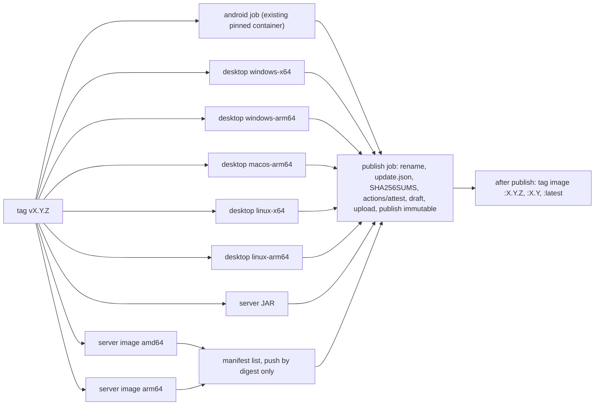

# Research notes: desktop distribution (and release of the sync server)

Research area: **desktop-distribution**. Date: 2026-10-05. Scope: how to build, package, publish and update the Compose Multiplatform (JVM) desktop app for Windows (x64, arm64), macOS (Apple silicon, Intel) and Linux (x64, arm64) **through GitHub Releases only**, without any paid or registered code-signing identity; how the YouTube engine (yt-dlp) is hosted on desktop and how its trust chain carries over; how the self-hosted sync server is released. Anything not checked against a primary source is marked **Unverified**. "Measured" means I downloaded the artefact on 2026-10-05 and measured it in this session (Linux x64 host).

---

## Recommendation

1. **Targets (five native builds, one optional).** Build on GitHub-hosted runners, one native runner per OS/arch, because Compose's packaging "cross-compilation is currently not supported":
   - Windows x64 (`windows-2025`), Windows arm64 (`windows-11-arm`), Linux x64 (`ubuntu-24.04`), Linux arm64 (`ubuntu-24.04-arm`), macOS Apple silicon (`macos-15`).
   - **macOS Intel: not built by default.** Compose Multiplatform 1.12.1 lists only "macOS 13 arm64" as supported, androidx `sqlite-bundled` (Room's bundled driver) ships no `osx_x64` native, macOS 26 Tahoe is the last release for Intel Macs, Homebrew moved Intel to Tier 3 in September 2026, and GitHub drops x86_64 macOS runners in fall 2027. The owner can opt in, but only if we compile the SQLite JNI library ourselves (see Technical detail).
   - **Windows arm64 needs the same native fix:** `sqlite-bundled` has no `windows_arm64` native, and neither do `quickjs-kt` or the official QuickJS-ng binaries. Until we build those, a Windows arm64 user can run the x64 build under Windows 11's Prism emulation. Recommended: ship native arm64 once the SQLite JNI library is built for it, and the x64 build (documented as "runs emulated") until then.
2. **Formats.** Use Compose's jpackage-based `nativeDistributions`:
   - Windows: **MSI** (`perUserInstall = true`, so no UAC prompt; frozen `upgradeUuid`) plus a **portable ZIP** of the app image.
   - macOS: **DMG** with an app that jpackage signs **ad hoc** (it does this automatically when no identity is set).
   - Linux: **DEB**, **RPM** and a **tar.gz** of the app image.
   - **Not offered:** AppImage (its type-2 runtime statically links libfuse, which is LGPL-2.1), Flatpak through Flathub (a store), the official Homebrew cask (casks that fail Gatekeeper have been disabled since September 2026), and winget (a Microsoft-moderated catalogue that can refuse any submission).
   - An own Scoop bucket and an own Homebrew tap would both be GitHub repositories. They are possible later, if the owner agrees they are not "stores".
3. **No signing identities.** We use no Apple Developer ID or notarization, no Authenticode certificate (including Azure Artifact Signing and SignPath), and no package signing on Linux. Integrity relies on what D79 already does for the APKs: an immutable GitHub release, `SHA256SUMS`, and `actions/attest` build-provenance attestations over every desktop asset. README and help pages document what users must do:
   - **macOS:** Privacy & Security, then "Open Anyway" (or `xattr -dr com.apple.quarantine`).
   - **Windows:** SmartScreen's "More info", then "Run anyway". **Smart App Control must be off**; it has no per-app override.
   - **Linux:** nothing extra.
4. **Java runtime: a licensing blocker that needs an owner decision.** Every self-contained Compose desktop build ships an OpenJDK runtime image and jpackage's native launcher. That means GPL-2.0 code (HotSpot has **no** Classpath Exception), GPL-2.0 with Classpath Exception (the class library, the jpackage launchers, the `wixhelper.dll` custom action inside the MSI), GCC's libgcc/libstdc++ (GPL-3.0 with the Runtime Library Exception) in the Linux builds, and Microsoft's proprietary VC++ runtime DLLs on Windows. D3/N8 currently forbid all of this; the plan already removed the GPL+CE NIO desugaring runtime for that reason.
   - **Recommended:** the owner approves a narrowly scoped "runtime exception": the unmodified OpenJDK runtime image, jpackage's launcher and helper, and the platform C/C++ runtimes. We attach the runtime's corresponding source (Temurin's source tarball, about 121 MB) to every release that ships it.
   - **If refused:** the only GPL-free desktop path is "bring your own JRE": a runtime-free ZIP with our own launch scripts, plus DEB/RPM that depend on the distribution's JRE. There would be no MSI and no DMG.
   - **Allowing LGPL would not solve this.** It would only re-enable AppImage and Linux container base layers.
5. **Runtime vendor.** Use **Temurin 21** (all six targets, jmods included, one vendor and one source tarball), or JDK 25 once Temurin publishes Windows aarch64. Today only the Microsoft Build of OpenJDK has a JDK 25 Windows arm64 build. Trim the runtime with jlink: **94 MB on disk**, measured for a Temurin 25 linux-x64 image with 12 modules; 32 MB as tar.gz.
6. **YouTube engine on desktop.**
   - **Python:** bundle **python-build-standalone CPython 3.14.x** (`install_only_stripped`; PSF plus permissive dependencies, libedit instead of readline, `_gdbm` disabled upstream). We delete `_dbm` (Berkeley DB 6.0.19 under the Sleepycat licence), Tcl/Tk/tkinter, pip, idlelib and tests. **Measured: 44 MB on disk, 15.6 MB as tar.gz** (linux-x64).
   - **Process model:** run CPython as a **child process**, using the JSON-over-stdio protocol that 04 already specifies for Android fallback A2. Never use PyInstaller (GPL-2.0+ with a bootloader exception; yt-dlp's own PyInstaller executables contain GPL parts), and do not rely on a system Python.
   - **JS challenges:** follow D75 (JS-free by default). If the provider ships, prefer the same in-process **quickjs-kt** (Apache-2.0, has JVM natives) behind a stdio callback from the Python shim. **Do not use the `qjs` CLI by default:** a script started with `qjs --script` (exactly how yt-dlp starts QuickJS) can `import("qjs:os")` and call `os.exec` (tested). Deno (MIT, sandboxed) costs 96 MB per target.
   - **Trust chain:** the same pinned Ed25519 manifest key, the yt-dlp OpenPGP key, the 11 checks, anti-rollback and self-test. Only the storage paths and the host adapter change.
7. **Update check: notify only, as D78.** Add a `desktop` object and a `server` object to the existing `neutrodyne-update.json`. These are schema-1 additive fields, which the Android parser already ignores. The desktop app shows a banner and an optional OS notification, and opens the release page or the asset for its OS, architecture and install kind in the browser. It never downloads or installs anything.
8. **Sync server releases.**
   - A **multi-arch OCI image on GHCR** (`ghcr.io/<owner>/neutrodyne-server`, linux/amd64 and linux/arm64, attested with `actions/attest` `push-to-registry`). GHCR is GitHub Packages, so I count it as "GitHub only"; the owner should confirm.
   - A platform-independent **server JAR** on the same release (if the server is JVM). Native binaries only if the server is written in a language that produces them.
   - Under a strict D3, any image containing a JRE and a Linux userland redistributes GPL/LGPL code. The compliant fallback is the JAR plus a `compose.yaml` that runs it in the upstream `eclipse-temurin` image, so the user pulls Adoptium's image and we redistribute nothing.
9. **One version line.** Each `vX.Y.Z` tag publishes Android, desktop and server assets together in one immutable release.
   - Desktop assets are built only from tags ≥ `v1.0.0`, because jpackage rejects a macOS app version whose first number is 0, which breaks D63's `0.x` tester builds. Before 1.0, desktop tester builds are workflow artefacts.
   - Expect about 1.2 GB of desktop assets per release. GitHub has no limit on total release size.

---

## Options considered (trade-off table)

### A. Java runtime strategy for the desktop app

| Option | Users install | Licence content we distribute | UX | Verdict |
|---|---|---|---|---|
| **A1 jlink-trimmed runtime bundled by jpackage** (Compose default) | nothing | OpenJDK: GPL-2.0 (HotSpot, no CE) + GPL-2.0+CE (class library, jpackage launcher, `wixhelper.dll`); Linux: libgcc/libstdc++ GPL-3.0+RLE; Windows: VC++ runtime DLLs (proprietary, redistributable) | best: MSI/DMG/DEB/RPM | **Recommended, needs owner exception (Q1)** |
| A2 Bring your own JRE: runtime-free ZIP/tar with our own launch scripts; DEB/RPM `Depends:` the distribution's JRE | Temurin 21+ (or distro package) | only our jars and permissive libraries (Skiko natives, SQLite JNI, CPython…) | poor on Windows/macOS (separate Java install, no MSI/DMG, no Start-menu/Finder integration from us); fine on Linux | Fallback if Q1 is refused |
| A3 GraalVM Native Image | nothing | SubstrateVM and the compiled-in class library are GPL-2.0+CE (GraalVM CE licence) | small and fast, but AWT/Compose support on all six targets is Unverified | No: no licence gain, high risk |
| A4 Kotlin/Native desktop | nothing | permissive | Compose Multiplatform has no Windows/Linux Kotlin/Native desktop target (only JVM desktop is listed) | Not available |
| A5 Different UI stack (e.g. Tauri/Rust with the system WebView) | nothing | permissive (WebView is part of the OS) | a second UI codebase | Out of scope here; the only GPL-free *installer* path if Q1 is refused and A2 is unacceptable |
| A6 Browser client (Compose for Web/Wasm) served by the sync server | nothing | permissive | no yt-dlp, no downloads, limited background audio | Not a replacement |

### B. Package formats

| OS | Format | Built by | Unsigned UX | Notes | Verdict |
|---|---|---|---|---|---|
| Windows | MSI | jpackage + WiX 3.14 or 5.x | SmartScreen "Windows protected your PC" → "More info" → "Run anyway"; per-user install avoids UAC | upgrades need a frozen `upgradeUuid`; contains jpackage's `wixhelper.dll` (GPL+CE) | **Yes** |
| Windows | EXE | jpackage (an MSI wrapped by `msiwrapper`, GPL+CE) | same as MSI | no advantage over MSI | No |
| Windows | portable ZIP (app image) | `createDistributable` + zip | SmartScreen on first start if the Mark of the Web propagated (Unverified for each extractor) | no Start-menu entry, no uninstaller | **Yes** |
| Windows | MSIX | — | an unsigned MSIX cannot be installed by the public | needs a certificate | No |
| macOS | DMG | jpackage (`hdiutil`) | Gatekeeper: "Apple could not verify…" → System Settings → Privacy & Security → "Open Anyway" (button lives ≈ 1 h) → login password | ad-hoc signed app inside | **Yes** |
| macOS | PKG | jpackage | the same Gatekeeper path, plus an installer that would need a separate Developer ID Installer certificate to be trusted | no benefit | No |
| macOS | ZIP of `.app` | zip | the same as the DMG; Archive Utility keeps quarantine | optional for scripted installs | Optional |
| Linux | DEB | jpackage (`dpkg-deb`, `fakeroot`) | none; `apt install ./file.deb` | installs to `/opt/neutrodyne` | **Yes** |
| Linux | RPM | jpackage (`rpmbuild`) | none; local packages are not GPG-checked by default (`localpkg_gpgcheck` off, Unverified for current dnf5) | version must not contain `-` | **Yes** |
| Linux | tar.gz (app image) | `createDistributable` + tar | none | portable, no root | **Yes** |
| Linux | AppImage | appimagetool + type-2 runtime | none | the runtime statically links patched **libfuse 3.15.0 (LGPL-2.1)**; Compose's `TargetFormat.AppImage` is only jpackage's app-image *directory* | **No (LGPL)** |
| Linux | Flatpak via Flathub | flatpak-builder | — | Flathub is a store; runtimes come from Flathub | No |
| Linux | Flatpak bundle/own repo on Pages | flatpak-builder | needs the Flathub remote for `org.freedesktop.Platform` (Unverified details) | maintenance cost | Later, maybe |

### C. Package-manager channels ("are they stores?")

| Channel | Who controls the index | Binaries come from | Unsigned app allowed? | Store-like? | Verdict |
|---|---|---|---|---|---|
| Homebrew official cask (`homebrew/cask`) | Homebrew maintainers | our GitHub release | **No**: casks that fail Gatekeeper are disabled since September 2026; `--no-quarantine` is deprecated | yes (curated) | Not possible |
| Own Homebrew tap (`<owner>/homebrew-neutrodyne`, a GitHub repo) | us | our GitHub release | yes, but quarantine still applies (same "Open Anyway" step); Homebrew 6 makes users explicitly trust third-party taps | no (our repo) | Optional, later |
| winget (`microsoft/winget-pkgs`) | Microsoft moderators ("reserves the right to refuse a submission for any reason"; AV scans, installer must come from the publisher's site) | our GitHub release | probably (Unverified: rules for unsigned installers) | **yes** (curated catalogue with policies) | No in v1 |
| Own Scoop bucket (GitHub repo) | us | our GitHub release (ZIP) | yes | no | Optional, later |
| Scoop "extras" bucket, AUR, Chocolatey community | third parties | our GitHub release | varies | yes | No |

### D. Python host for yt-dlp on desktop

| Option | Licence | Size per target | Pros | Cons | Verdict |
|---|---|---|---|---|---|
| **python-build-standalone 3.14.x `install_only_stripped`**, trimmed | PSF + permissive (libedit, OpenSSL, SQLite, libffi…); `_dbm` (Sleepycat BDB 6.0.19) and Tcl/Tk removed by us | 22–36 MB download (upstream archive); **44 MB on disk / 15.6 MB tar.gz after trimming (measured, linux-x64)** | all six targets incl. `aarch64-pc-windows-msvc`; relocatable; used by uv; same CPython minor as Android | Windows build carries `vcruntime140*.dll` (Microsoft redistributable) | **Recommended** |
| System Python | — | 0 | smallest | absent on Windows and on macOS without Xcode CLT; version drift (yt-dlp needs ≥ 3.10) | No (maybe a Linux distro-package option later) |
| PyInstaller-frozen engine | PyInstaller GPL-2.0-or-later with bootloader exception | — | single exe | GPL code in the binary; a frozen engine cannot load a downloaded yt-dlp zip as cleanly | **No** |
| yt-dlp's own `yt-dlp.exe`/`yt-dlp_macos` | contains GPL/LGPL parts (`THIRD_PARTY_LICENSES.txt`) | — | — | D3 forbids it | **No** |
| Nuitka-compiled host | Apache-2.0 (Unverified details) | Unverified | — | build complexity per target | No |
| GraalPy on the JVM | UPL (Unverified) | large | in-process | yt-dlp compatibility and speed Unverified | No |

### E. JS runtime for yt-dlp's EJS challenges (only if D75's provider ships)

| Option | Licence | Size | Isolation | Targets | Verdict |
|---|---|---|---|---|---|
| None (JS-free `visionos` path, D75 v1) | — | 0 | — | all | **Default** |
| **quickjs-kt in the JVM**, called back from the Python shim over stdio | Apache-2.0 + QuickJS MIT | ≈ 0.8–1 MB per target | no `std`/`os` modules exposed (Unverified that quickjs-kt registers none) | linux x64/aarch64, macOS x64/aarch64, windows x64 (**no windows arm64**) | **Recommended** (parity with Android D75) |
| QuickJS-ng `qjs` CLI via yt-dlp's built-in `quickjs` runtime | MIT | 1.3–2.6 MB | **none**: `qjs --script` can `import("qjs:os")` and `os.exec` (tested) | linux, darwin arm64/x86_64, windows x86/x86_64 (**no windows arm64**) | Fallback only |
| Deno 2.x | MIT | 38–43 MB zipped, **96 MB unpacked** (linux x64) | permission sandbox (no FS/network) | all six incl. windows arm64 | Alternative if the owner prefers sandboxing over size; D3 currently says "never Deno" |
| Node.js ≥ 22 | MIT + bundled deps | large | partial | all | No |
| Bun | statically links JavaScriptCore (LGPL-2) | large | none | — | **No (LGPL)** |

### F. Sync server release forms

| Form | Where | Licence content | Users | Verdict |
|---|---|---|---|---|
| **OCI image, multi-arch** | GHCR (`ghcr.io`) | our code + base layers + JRE (if JVM) → GPL/LGPL unless the base is `scratch` with a static non-JVM binary | NAS/Docker users (majority of self-hosters) | **Yes**, subject to Q1/Q8 |
| **Server JAR** | GitHub release asset | our code + permissive deps | anyone with Java 21+ | **Yes** (if JVM) |
| JAR + `compose.yaml` using upstream `eclipse-temurin` image | release asset (YAML) | we distribute no GPL | Docker users under strict D3 | Fallback |
| jlink'd runtime tarballs per OS/arch | release asset | GPL/GPL+CE | bare-metal users | Optional with Q1 |
| GraalVM native binaries | release asset | GPL-2.0+CE inside | — | No (no licence gain, per-OS runners) |
| Static Go/Rust binary + `FROM scratch` image | release + GHCR | permissive only | all | Only if the server-language research picks a non-JVM server |
| Docker Hub, distro repos, Unraid/TrueNAS app stores | third parties | — | — | No (not GitHub) |

### G. Code-signing services (all excluded by the owner; listed so the decision is explicit)

| Service | Cost | Identity | Effect | Verdict |
|---|---|---|---|---|
| Apple Developer Program (Developer ID + notarization) | USD 99/yr (Unverified price) | legal identity with Apple | no Gatekeeper prompt | Excluded |
| Azure Artifact Signing | ≈ USD 9.99/month | Microsoft identity validation; individuals only in USA/Canada | reputation builds over time; SAC passes | Excluded |
| OV certificate | USD 150–300/yr | CA validation, HSM | same as above | Excluded |
| SignPath Foundation (OSS) | free | certificate issued to *SignPath Foundation* as publisher; public team roles, MFA, manual approval per release | Windows Authenticode only | Owner's call (Q6); recommended: no |
| Self-signed | free | none | "same behavior as no signature" | Pointless |

---

## Technical detail

### 1. Target matrix, runners and native-library coverage

| Target | Runner (public repo) | JDK for jpackage | Skiko (Compose 1.12.1) | androidx `sqlite-bundled-jvm` 2.7.1 / 2.8.0-alpha01 | quickjs-kt-jvm 1.0.15 | python-build-standalone 3.14.8 | QuickJS-ng 0.17.0 `qjs` |
|---|---|---|---|---|---|---|---|
| windows-x64 | `windows-2025` | Temurin 21/25 | yes | `windows_x64` | `windows_x64` | `x86_64-pc-windows-msvc` | `qjs-windows-x86_64.exe` |
| windows-arm64 | `windows-11-arm` (4 vCPU, 16 GB) | Temurin 21; JDK 25 only from Microsoft | yes (`skiko-awt-runtime-windows-arm64`) | **missing** | **missing** | `aarch64-pc-windows-msvc` | **missing** |
| macos-arm64 | `macos-15` (M1, 3 vCPU, 7 GB) or `macos-26` | Temurin | yes | `osx_arm64` | `macos_aarch64` | `aarch64-apple-darwin` | `qjs-darwin-arm64` |
| macos-x64 (optional) | `macos-15-intel` (retired fall 2027) | Temurin | yes, but CMP lists only "macOS 13 arm64" as supported | **missing** | `macos_x64` | `x86_64-apple-darwin` | `qjs-darwin-x86_64` |
| linux-x64 | `ubuntu-24.04` | Temurin | yes | `linux_x64` | `linux_x64` | `x86_64-unknown-linux-gnu` (glibc ≥ 2.17) | `qjs-linux-x86_64` |
| linux-arm64 | `ubuntu-24.04-arm` | Temurin | yes | `linux_arm64` | `linux_aarch64` | `aarch64-unknown-linux-gnu` | `qjs-linux-aarch64` |

Closing the `sqlite-bundled` gaps (only needed for windows-arm64 and macos-x64):

- (a) Build androidx's SQLite JNI library (Apache-2.0; SQLite is public domain) for those two targets in CI, and put it where the driver's loader finds it. Unverified: whether `BundledSQLiteDriver`'s JVM loader can be pointed at an external library or needs a repacked jar.
- (b) Write our own `SQLiteDriver` over xerial `sqlite-jdbc` (Apache-2.0). Unverified: its native coverage, and whether Room 3 accepts a custom driver on JVM.
- (c) Ship x64 for Windows arm64. Prism emulates x64 user-mode code on Windows 11 on Arm. An arm64 JVM cannot load x64 JNI libraries, so it must be all-x64 or all-arm64.

Every other native dependency the desktop app adds (audio playback, media keys, notifications) must be checked against this table before it is accepted. That belongs to the desktop-playback research; the same rule applies.

### 2. Gradle/Compose configuration sketch

```kotlin
// desktop/app/build.gradle.kts (sketch; module names are for the KMP research to decide)
compose.desktop {
    application {
        mainClass = "ch.lkmc.neutrodyne.desktop.MainKt"
        jvmArgs += listOf("-Xss2m", "-XX:+UseSerialGC") // tune later; Unverified best GC for a player
        nativeDistributions {
            targetFormats(TargetFormat.Msi, TargetFormat.Dmg, TargetFormat.Deb, TargetFormat.Rpm)
            packageName = "Neutrodyne"
            packageVersion = neutrodyneVersionName           // X.Y.Z, ≥ 1.0.0 for macOS (see §5)
            vendor = "Neutrodyne contributors"
            licenseFile.set(rootProject.file("LICENSE"))
            modules("java.desktop", "java.logging", "java.naming", "java.net.http", "java.prefs",
                    "java.management", "java.sql", "jdk.unsupported", "jdk.accessibility", "jdk.zipfs")
            appResourcesRootDir.set(layout.buildDirectory.dir("engine-resources")) // common/, <os>/, <os>-<arch>/
            windows {
                perUserInstall = true
                upgradeUuid = "<generate once, freeze forever>"   // like the application ID
                menuGroup = "Neutrodyne"; shortcut = true; dirChooser = false
            }
            macOS { bundleID = "ch.lkmc.neutrodyne"; /* no signing block: jpackage signs ad hoc */ }
            linux { packageName = "neutrodyne"; appCategory = "AudioVideo"; menuGroup = "AudioVideo" }
        }
    }
}
```

- `appResourcesRootDir` merges `common/`, `<os>/` and `<os>-<arch>/` (for example `macos-arm64/`) into the app image. At run time the directory is in the system property `compose.application.resources.dir`. CPython, the yt-dlp zip, the shim and (optionally) `qjs` go there.
- Tasks: `createDistributable` (app image), `packageDistributionForCurrentOS`, `packageReleaseDistributionForCurrentOS` (ProGuard; JDK 25 needs ProGuard ≥ 7.8.0, the default from CMP 1.12.0), and `suggestModules` (jdeps). The plugin does **not** work out the modules itself; a missing module only shows up at run time as `ClassNotFoundException`, so a CI smoke test must start the packaged app.
- Recommended: start **without** ProGuard, like Android's unminified published builds (D2), to avoid keep-rule failures in kotlinx.serialization and Room. Revisit if the size matters.

### 3. Java runtime: vendor, jlink size, licences

- **Vendor.** Temurin 21.0.12.1 is available for all six targets (Adoptium API). Temurin 25.0.4.1 is available for five; there is **no Windows aarch64** build. The Microsoft Build of OpenJDK 25.0.4.1 covers all six.
  - Recommended: **one vendor and one version for every target**, so that there is one corresponding-source archive. Temurin 21 today; JDK 25 when Temurin ships Windows aarch64 (or switch everything to Microsoft's build; Unverified that its runtime image is linkable).
- **No jmods in Temurin 25.** The Temurin 25 linux-x64 JDK has no `jmods/` directory (JEP 493 "linking run-time images without JMODs"). jlink still worked from the runtime image (measured), so Compose's `createRuntimeImage` works. Cross-target jlink is impossible this way, which does not matter because we build natively.
- **Measured jlink output** (Temurin 25.0.4.1 linux-x64; `java.base, java.desktop, java.logging, java.naming, java.net.http, java.prefs, java.management, jdk.unsupported, jdk.accessibility, jdk.zipfs, java.sql, jdk.crypto.ec`, with `--strip-debug --no-header-files --no-man-pages`): **94 MB on disk, 32.3 MB as tar.gz**. `lib/modules` is 58 MB and `lib/server` (HotSpot) 29 MB. With `--compress=zip-6` the image is 63 MB on disk but 40.0 MB as tar.gz, so jlink compression makes the *download* bigger; prefer no jlink compression, since installers compress anyway.
- **What the runtime image contains, licence-wise (verified):**
  - `legal/java.base/LICENSE`: GPL-2.0 plus the "CLASSPATH" EXCEPTION. The exception applies only to files whose header says so. HotSpot sources (for example `src/hotspot/share/runtime/thread.cpp`) are **GPL-2.0-only without CE**; `java/lang/String.java` carries the CE.
  - `legal/java.base/gcc.md` (Linux build): "GCC - libgcc and libstdc++ 14.2.0", GPL-3.0 (with the GCC Runtime Library Exception, Unverified wording in that file).
  - `legal/java.desktop/`: freetype, harfbuzz, lcms, libpng, giflib, jpeg, mesa3d and pipewire headers (permissive). `public_suffix.md` is MPL-2.0 (data).
  - Windows zip: `bin/msvcp140.dll`, `ucrtbase.dll`, `vcruntime140.dll`, `vcruntime140_1.dll` (Microsoft redistributables).
- **jpackage's own pieces.** The native app launcher (`src/jdk.jpackage/share/native/applauncher/*.cpp`) and the MSI custom-action DLL `wixhelper.dll` (`libwixhelper.cpp`, embedded via `<Binary Id="JpCaDll" SourceFile="wixhelper.dll"/>` in `main.wxs`) are GPL-2.0 with the Classpath Exception. So even a BYO-JRE build is not GPL-free if it uses jpackage at all.
- **GPL-2.0 §3 compliance if Q1 is accepted.** Distribution "by offering access to copy from a designated place" is satisfied by "offering equivalent access to copy the source code from the same place". Attach `OpenJDK21U-jdk-sources_<ver>.tar.gz` (Temurin 25's is 120,577,922 bytes) to each release that ships that runtime, together with a short `RUNTIME-SOURCES.md` naming the vendor build and the jpackage launcher source. §3(c) (passing on the upstream offer) is only for non-commercial redistribution of binaries received with such an offer; do not rely on it. Not legal advice.
- **WiX.** jpackage 25 looks for "WiX v3 light.exe and candle.exe or WiX v4/v5 wix.exe". WiX is MS-RL, a build tool. Its OSMF EULA fee applies only to revenue-generating users with ≥ USD 10,000 annual revenue, so we are exempt. Pin WiX 3.14 or 5.x. Unverified: whether a default jpackage MSI embeds any WiX-licensed binary (WixUI dialogs appear only with `dirChooser`/shortcut prompts).

### 4. Size estimate per target (installed; download ≈ 40–50 % of it)

| Piece | Size | Source |
|---|---|---|
| jlink runtime | 94 MB | measured (linux-x64, Temurin 25) |
| Skiko native (`libskiko-linux-x64.so`) | 29.6 MB (12.3 MB in its jar; Windows jar 10.6 MB, macOS 18.3 MB) | measured, Maven Central |
| Compose, Kotlin, coroutines, OkHttp, Room, app jars | ≈ 25–40 MB | **Unverified estimate** |
| CPython 3.14.8, trimmed | 44 MB (15.6 MB tar.gz) | measured (linux-x64) |
| yt-dlp zipimport asset | 3.1 MB | 04 |
| quickjs-kt native (if shipped) | ≈ 0.8–1 MB | measured from the 1.0.15 jar |
| **Total** | **≈ 195–215 MB installed, ≈ 80–100 MB download** | estimate; first desktop spike measures it |

Per release: Windows 2 × (MSI + ZIP), macOS 1 × DMG, Linux 2 × (DEB + RPM + tar.gz). That is 11 files of ≈ 80–110 MB, so **≈ 1.0–1.2 GB**, plus the runtime source (≈ 121 MB) if Q1 is accepted. GitHub allows up to 1000 assets per release, each under 2 GiB, with "no limit on the total size of a release, nor bandwidth usage".

### 5. macOS details (no Developer ID, no notarization)

- **Signing.** On Apple silicon "the operating system enforces that any executable must be signed… a simple ad-hoc signature is sufficient… However… binaries signed this way cannot pass through Gatekeeper." jpackage 25 signs with the ad-hoc identity `"-"` when no identity is configured (`CodesignConfig.ADHOC_SIGNING_IDENTITY`, `MacPackagingPipeline.sign`).
  - Requirement: everything inside the bundle (CPython, its `.dylib`s, `qjs` if shipped) must be **signed after the last modification**. A bundle whose signature no longer matches makes macOS report the app as damaged ("can't be opened… modified or damaged"), which `Open Anyway` does not cure. Unverified: whether jpackage's signer covers files added through `appResourcesRootDir`. The spike checks `codesign --verify --deep --strict` and a real download-and-open.
- **First start (macOS 15 Sequoia and later, including macOS 27).** The Control-click override is gone ("users will no longer be able to Control-click to override Gatekeeper… They'll need to visit System Settings > Privacy & Security"). Steps per Apple:
  1. Try to open the app.
  2. Open System Settings, then Privacy & Security.
  3. Under Security, click "Open Anyway". The button "is available for about an hour after you try to open the app".
  4. Enter the login password.

  The app is then saved as an exception. Terminal alternative for the README: `xattr -dr com.apple.quarantine /Applications/Neutrodyne.app`.
- **Every update.** A newly downloaded DMG is quarantined again, and the new build has a new ad-hoc identity, so expect the Open Anyway step **after every update** (Unverified, but consistent with Apple's statements on ad-hoc identity).
- **Identity consequences of ad-hoc signing.** Apple TN3127: "Ad hoc signed code… has a DR but it's tied to that specific version of the code. In both cases macOS can't reliably track the identity of the code." Consequences:
  - TCC permissions (microphone not needed; Accessibility or Input Monitoring if we ever use global hotkeys) reset with every update.
  - Keychain items created by the app prompt again after every update. Recommendation: do not keep the sync token in the Keychain; use a `0600` file in Application Support, or accept the prompts (Q-level detail).
  - **Local Network privacy (macOS 15+):** "Local network privacy tracks the identity of your program using its code signature. This presents a challenge on macOS, which allows for unsigned code and ad hoc signed code." A desktop app that syncs with a **server on the LAN** (the typical self-hosted case) will show the Local Network prompt and may lose the grant on every update (Unverified exact behaviour). It needs `NSLocalNetworkUsageDescription` in `Info.plist`, which Compose lets us extend. Document it.
  - Notifications, Now Playing and media keys (MPRemoteCommandCenter), and login items (`SMAppService`): **Unverified** for ad-hoc-signed JVM apps. Spike items. Recommendation: no auto-start in v1.
- **App Translocation.** A quarantined app started from the DMG or Downloads runs from a randomized read-only path until Finder moves it. The README says "drag to Applications first". Unverified on macOS 27.
- **Intel.** macOS 26 is the last Intel release; Rosetta stays general-purpose through macOS 27, then only for games (secondary sources: MacRumors, Macworld). Homebrew: Intel Tier 3 from September 2026, unsupported from September 2027. GitHub: no x86_64 macOS runners after the macOS 15 image retires in fall 2027.
- **Versions.** jpackage (`CFBundleVersion.java`) rejects an app version whose first component is 0: "The first number in an app-version cannot be zero or negative." Compose passes `--app-version = packageVersion` and writes `CFBundleShortVersionString` and `CFBundleVersion` itself. **D63's `0.{n+1}.P` tester tags therefore cannot be packaged for macOS.** Options: desktop assets only from `v1.0.0`, or a macOS-only mapped version (confusing). Recommended: the former (Q10).

### 6. Windows details (no Authenticode)

- **SmartScreen** (Microsoft, "SmartScreen reputation"): for "No signature": "Warning — 'Windows protected your PC'; User must choose 'Run anyway' before the app can run. Enterprise policy can prevent continuation entirely." "Unsigned files must build reputation anew with every update." Every release therefore starts with the warning. EV certificates "no longer bypass SmartScreen" (since 2024).
- **Smart App Control** (Windows 11; available on clean installs; recent updates allow turning it on again without reinstalling):
  - "Apps cannot be run unless they are recognized by Microsoft's app intelligence services, or they are signed with a trusted certificate."
  - "There is currently no way to bypass Smart App Control protection for individual apps."
  - Its "signature checks apply to all executable files, not just those downloaded from the Internet." That includes our jpackage launcher, `python.exe` and `qjs.exe`; the portable ZIP does not escape it.
  - **Users with SAC on must turn it off.** The README states this plainly. This is the sharpest consequence of "no signing" on Windows.
- **UAC.** A per-machine MSI elevates and shows "Unknown publisher" (Unverified wording). `perUserInstall = true` installs without elevation (Unverified install path: jpackage per-user default).
- **arm64.** Native requires the SQLite JNI gap closed (§1); otherwise ship x64 (emulated under Prism, Windows 11 24H2+). Windows 10 on Arm emulates only x86, so x64 Java does not run there, but Compose's Windows arm64 support itself targets Windows 10+ (Unverified for Windows 10 on Arm).
- **Mark of the Web.** Browsers tag downloads with MOTW; Explorer's built-in ZIP extraction propagates it to the extracted files (Unverified for current Windows 11), so SmartScreen also prompts for the portable ZIP. Antivirus false positives on unsigned, freshly built launchers are a known nuisance (Unverified rate). Mitigation: consistent file names and the provenance attestations; never pack or obfuscate executables.

### 7. Linux details

- No platform gate. DEB via `sudo apt install ./neutrodyne-X.Y.Z-linux-x64.deb`; RPM via `sudo dnf install ./…rpm` (local RPMs are not GPG-checked unless `localpkg_gpgcheck=1`; Unverified for dnf5); tar.gz runs from any directory.
- No apt/dnf repository in v1. An apt repo on GitHub Pages would still be "GitHub", but it needs a repo signing key, which means key custody (Q5 detail).
- python-build-standalone glibc builds need glibc ≥ 2.17. Compose lists Ubuntu 20.04 as its minimum.

### 8. Release workflow changes (`release.yml`)



- **Desktop jobs need no secrets.** Nothing is signed, and the macOS ad-hoc signing needs no keychain. They can run before the `release` environment approval; only the publish job sits in the environment.
- **Each desktop job:**
  1. `actions/setup-java` with the pinned vendor and version (checksum-verified).
  2. Install WiX (Windows), and `rpm`/`fakeroot` on Linux if the image lacks them (Unverified).
  3. Fetch python-build-standalone by exact release and SHA-256 (pinned in `desktop/engine/python.lock`), trim it (§10), and verify that the trimmed tree contains no forbidden files.
  4. `./gradlew :desktop:app:packageDistributionForCurrentOS`.
  5. Smoke test: start the packaged app headless (`-Dneutrodyne.smoke=true` opens the DB, runs `ping`/`selftest` of the engine subprocess, then exits 0). Unverified on macOS/Windows runners without a display; Linux uses `xvfb-run`.
  6. Run `scripts/ci/check-desktop-image.sh`, the licence and content scan.
  7. Upload the workflow artefact.
- **Asset names:** `neutrodyne-{v}-windows-x64.msi`, `neutrodyne-{v}-windows-x64.zip`, `…-windows-arm64.{msi,zip}`, `neutrodyne-{v}-macos-arm64.dmg`, `neutrodyne-{v}-linux-{x64,arm64}.{deb,rpm,tar.gz}`, `neutrodyne-server-{v}.jar`, plus (Q1) `openjdk-runtime-sources-{jdkver}.tar.gz`.
- **Integrity** is identical to D79: `SHA256SUMS` over every asset, `actions/attest@v4` `subject-path` for every desktop asset and the JAR, and for the image `subject-name: ghcr.io/<owner>/neutrodyne-server`, `subject-digest` and `push-to-registry: true`. The release body gets "Verify a download" lines for Windows (`Get-FileHash`), macOS (`shasum -a 256`) and `gh attestation verify`.
- **Immutable releases cannot gain assets later.** One flaky `windows-11-arm` job blocks the tag; `release.yml` retries the matrix job once. A target that still fails means fixing forward with the next PATCH, never publishing a partial release. Unverified: queue times of arm64 runners against N11's 30-minute budget. Measure in the spike and, if needed, extend N11 for desktop.
- **Reproducibility (report-only, nightly).** DMG/MSI/DEB/RPM embed timestamps and GUIDs, so they are not byte-reproducible. Compare the **application JARs** inside the app image instead: Gradle `isPreserveFileTimestamps = false` and `isReproducibleFileOrder = true` make them reproducible (Unverified for the Compose plugin's jar tasks).

### 9. Notify-only update check on desktop (D78 extended)

`neutrodyne-update.json` keeps schema 1. 09 says: "Unknown fields are ignored, so later schema-1 additions stay compatible"; the manifest must stay ≤ 64 KB. Add:

```json
{ "schema": 1, "versionName": "1.4.0", "versionCode": 1040095, "releaseUrl": "…/releases/tag/v1.4.0", "notes": "…",
  "apks": [ … unchanged … ],
  "desktop": [
    { "os": "windows", "arch": "x64",   "kind": "msi",    "file": "neutrodyne-1.4.0-windows-x64.msi", "url": "…", "size": 0, "sha256": "…", "minOs": "10" },
    { "os": "windows", "arch": "x64",   "kind": "zip",    "file": "…", "url": "…", "size": 0, "sha256": "…" },
    { "os": "macos",   "arch": "arm64", "kind": "dmg",    "file": "…", "url": "…", "size": 0, "sha256": "…", "minOs": "13" },
    { "os": "linux",   "arch": "x64",   "kind": "deb",    "file": "…", "url": "…", "size": 0, "sha256": "…" }
  ],
  "server": { "jar": { "file": "neutrodyne-server-1.4.0.jar", "url": "…", "size": 0, "sha256": "…" },
              "image": "ghcr.io/<owner>/neutrodyne-server@sha256:…" } }
```

- The desktop app knows its `os`, `arch` and **install kind** from a build-time `BuildInfo` value (the MSI, ZIP, DMG, DEB, RPM and tar.gz builds differ only in a resource file written by the packaging task). It offers "Open release on GitHub" and "Download for this computer" (the matching `kind`, else the release page).
- The URL rule from D78 applies unchanged: links must lie under `{repoUrl}/releases/`.
- Links open through `java.awt.Desktop.browse`, with `xdg-open` as the fallback on Linux desktops where `Desktop` is unsupported (Unverified which).
- Daily check (jittered) while the app runs, plus "Check now". No background service, no downloads, no installs. That avoids every install-time security prompt inside the app, which matters most on macOS and Windows.

### 10. YouTube engine on desktop

**Bundle layout** (`<resources>/engine/`): `python/` (trimmed python-build-standalone), `ytdlp/yt-dlp` and `ytdlp/bundled.json` (the same vendored file as Android, verified at build time by the same `verifyBundledYtDlp`), `shim/neutrodyne_ytx/` (shared Python code with a desktop host adapter), `cacert.pem` (certifi, MPL-2.0 data, already allowed by D3), and optionally `qjs`.

**Trim list** (applied by `scripts/engine/trim-python.sh`, then checked by `check-desktop-image.sh`):

- Remove `include/`, `share/`, `lib/pkgconfig`, `lib/libpython3.14.so*` (the Linux `python3.14` executable is statically linked; measured), `bin/{idle*,pip*,pydoc*,*-config}`, `Lib/{tkinter,idlelib,turtledemo,test,ensurepip,pydoc_data,__phello__}`, `site-packages/pip*`, `config-3.14-*`, all of Tcl/Tk (`lib/libtcl*`, `tcl9*`, `tk9*`, `itcl*`, `thread*`, Windows `tcl/`, `DLLs/tcl*.dll`), `_tkinter*`, and `_dbm*` (Berkeley DB 6.0.19 is statically linked into that Linux extension under the Sleepycat licence; "Modern versions of Berkeley DB are licensed under GNU AGPL v3. Versions 6.0.19 and older are licensed under the more permissive Sleepycat License").
- The result was measured at 44 MB, and `ssl`, `sqlite3`, `json`, `http.client`, `xml.etree`, `zipimport` and `ctypes` still import.
- Keep the upstream `LICENSE.txt`. Generate notices from the `full` archive's `PYTHON.json` licence metadata, which upstream provides for this purpose.

**Process model** (D73 analogue):

- `YtxProcess` in the JVM starts `python -I -X utf8 <shim-bootstrap> --lib <active version dir>`. `-I` is isolated mode: it ignores `PYTHON*` environment variables and user site-packages.
- One long-lived child process with worker threads; JSON lines over stdin/stdout, carrying 04's methods (`ping`, `version`, `selftest`, `resolve`, `facts`, `lookup`, `tab_*`, `search_*`) and deadlines.
- The JVM kills the child on hang (deadline + 5 s) and 3 min after the last call. Same states as 04's process table.
- This is fallback **A2** of D72, promoted to the primary desktop host.

**Networking** (D74 analogue). Start with A2's rule: yt-dlp's built-in urllib handler, with `source_address` forcing the IP family the JVM asks for, so the `ip=` of googlevideo URLs matches the JVM's media requests. Python's OpenSSL (3.5.9 in this build, measured) then carries the traffic, with `SSL_CERT_FILE` pointing at the bundled `cacert.pem`. The default verify paths of the build are `/etc/ssl/cert.pem` and `/etc/ssl/certs` (measured), which do not exist everywhere (Unverified for Fedora/macOS/Windows). Later option: an HTTP-over-stdio bridge to OkHttp (one TLS stack, real cancellation), as D74 does through Chaquopy.

**JS challenges** (D75 analogue):

- If the provider ships, the desktop shim registers a `JsChallengeProvider` (`…JCP`) that sends the solver input to the JVM over the same stdio channel. The JVM evaluates it in **quickjs-kt** (the Android implementation, with limits and an interrupt).
- On windows-arm64 (no quickjs-kt native) the provider is absent and the JS-free path applies.
- Do **not** default to yt-dlp's built-in `quickjs` runtime. It runs `qjs --script <tmpfile>`, and a dynamic `import("qjs:os")` there yields `os.exec` (tested with QuickJS-ng 0.17.0), so YouTube-supplied player code would run with the user's full privileges.

**Trust chain** (D76; 04's checks 1–11):

| 04 check | Desktop |
|---|---|
| 1 Ed25519 manifest signature, pinned slots | same keys and file; JDK 15+ `Signature("Ed25519")` on every desktop JVM (no Tink needed) |
| 2–4 sequence, shim range, revoked/rejected | same; the canary must also run the **desktop host** variant of `shimTest`, and the manifest's `shimApi` range must cover both host adapters (or add a `hosts` field) |
| 5 anti-rollback | "bundled" = the version in this desktop build |
| 6 origin | same URLs (`github.com/yt-dlp/yt-dlp/releases/download/…`, `<owner>.github.io` for the manifest) |
| 7 upstream OpenPGP signature | same `OpenPgpDetachedVerifier` (JDK `SHA512withRSA`), shared JVM code |
| 8–10 hashes, size, zip content, `ORIGIN`, `CHANNEL` | same |
| 11 self-test in a fresh engine | fresh child process |

- **Storage.** `EngineStore` lives in the per-user data directory (§11): `…/ytdlp/active.json`, `versions/<v>/` (`.pyc` compiled by the bundled interpreter, files made read-only), `staging/`, and the cache in the OS cache directory. No native code is ever downloaded, so Gatekeeper, SmartScreen and SAC are not involved in engine updates. The downloaded zip is opened only by our interpreter, never executed as a binary.
- **Difference from Android:** there is no app sandbox. A malicious engine update would run with the **user's full file and network access** (SSH keys, browser profiles), not just the app's UID. The trust chain is the only barrier. OS sandboxing of the child is possible but platform-specific: macOS `sandbox-exec` (deprecated), Linux Landlock (bubblewrap is LGPL-2.0+, so excluded), Windows job objects or AppContainer. That is a v1.x hardening item and should be a recorded risk.

**Licence scan** (`check-desktop-image.sh`, N8 analogue). Fail the build on `_dbm*`, `libdb*`, `_gdbm*`, `readline*` (other than libedit's), `libreadline*`, `_tkinter*`, `libtcl*`, `pip/`, `mutagen`, `bgutil`, `deno`, `node`, `bun`, `AppRun` or `libfuse`. Compare the Python component lock (`desktop/engine/python.lock`: PBS release, CPython version, the component list from `PYTHON.json`) against D3's allow-list. Keep `legal/` from the jlink image and the PBS `LICENSE.txt` for the Licences screen.

### 11. App data locations per OS

| Data | Windows | macOS | Linux (XDG Base Directory 0.8) |
|---|---|---|---|
| Database, settings, engine versions, downloads (default) | `%LOCALAPPDATA%\Neutrodyne\` (`FOLDERID_LocalAppData`, default `%USERPROFILE%\AppData\Local`; not Roaming, which may sync across machines in domains) | `~/Library/Application Support/ch.lkmc.neutrodyne/` | `$XDG_DATA_HOME/neutrodyne/` (default `~/.local/share`) |
| Small config (optional split) | same | same | `$XDG_CONFIG_HOME/neutrodyne/` (`~/.config`) |
| Logs, window state | `%LOCALAPPDATA%\Neutrodyne\logs` | `~/Library/Logs/Neutrodyne/` (Unverified convention) | `$XDG_STATE_HOME/neutrodyne/` (`~/.local/state`; "state data that should persist between (application) restarts") |
| Caches (artwork, yt-dlp cachedir) | `%LOCALAPPDATA%\Neutrodyne\cache` | `~/Library/Caches/ch.lkmc.neutrodyne/` | `$XDG_CACHE_HOME/neutrodyne/` (`~/.cache`) |

- Resolve the paths with a ≈ 50-line Kotlin helper (environment variables plus `SHGetKnownFolderPath` through JNA on Windows if `%LOCALAPPDATA%` is absent). There is no need for a library.
- Uninstalling the MSI, DEB or RPM never deletes user data; the help page says where it is.
- The backup ZIP format (05) is the cross-device and cross-OS migration path.

### 12. Sync server release mechanics

- **Image.**
  - Build natively per architecture (`ubuntu-24.04` → `linux/amd64`, `ubuntu-24.04-arm` → `linux/arm64`; no QEMU). Push **by digest**, merge with `docker buildx imagetools create`, and attest with `actions/attest@v4` (`push-to-registry: true`).
  - Tag `:X.Y.Z`, `:X.Y` and `:latest` **after** the GitHub release is published, so that a failed release never moves `:latest`. Put the digest in the release body and in the `server.image` field.
  - Add the label `org.opencontainers.image.source=https://github.com/<owner>/Neutrodyne`.
  - **First publish is private by default.** Make the package public once in the GitHub UI; this is irreversible ("Once you make a package public, you cannot make it private again").
  - GitHub Packages is "free for public packages"; Container registry storage and bandwidth are "currently free"; public images can be pulled anonymously.
- **Base image choices (JVM server):**
  - `gcr.io/distroless/java25-debian13` exists. It contains the Debian base layer (glibc LGPL-2.1, CA certificates, tzdata…) plus Temurin (GPL-2.0/+CE), so it needs Q1 **and** an LGPL allowance for glibc.
  - `eclipse-temurin:*-jre` (Ubuntu userland incl. GPL tools) is broader.
  - Alpine includes BusyBox (GPL-2.0).
  - **Under strict D3 no JVM image is publishable.** Ship the JAR and a `compose.yaml`:

```yaml
services:
  neutrodyne-server:
    image: eclipse-temurin:25-jre        # Adoptium's image, pulled by the user; we redistribute nothing
    command: ["java", "-jar", "/opt/neutrodyne/neutrodyne-server.jar"]
    volumes:
      - ./neutrodyne-server-1.4.0.jar:/opt/neutrodyne/neutrodyne-server.jar:ro
      - ./data:/var/lib/neutrodyne
    ports: ["8080:8080"]
    restart: unless-stopped
```

- **Non-JVM server** (if the server research picks Go or Rust): a static binary per OS/arch on the release, and a `FROM scratch` image that contains only permissive code. This is the cleanest licence story and worth weighing in that decision.
- **Server versioning.** The same tag as the apps; the sync protocol carries its own `protocolVersion` so that an older app and a newer server negotiate (owned by the sync research).

---

## Impact on the existing plan

| Item | Change |
|---|---|
| **Vision and non-goals (§1.2)** | Remove "Neutrodyne server, accounts, cross-device sync" from the non-goals (owner direction 2026-10-05). Add desktop targets. Add non-goals: notarized/Authenticode-signed builds, app-store/package-catalogue listings (Homebrew core cask, winget, Flathub), Intel-Mac builds (unless Q3), AppImage. |
| **D2 build variants** | Desktop is a separate Gradle application (Compose `nativeDistributions`), not a product flavor or build type. Rule: "published desktop builds are non-ProGuard builds" (parity with debug APKs). |
| **D3 / N8 licensing** | **Must be amended or the desktop cannot ship installers.** Proposed text: allow, *for desktop runtime images only*, the unmodified OpenJDK runtime (GPL-2.0 incl. HotSpot, GPL-2.0 WITH Classpath-exception-2.0), jpackage's launcher and `wixhelper.dll` (GPL-2.0 WITH Classpath-exception-2.0), GCC runtime libraries (GPL-3.0 WITH GCC-exception-3.1) and Microsoft VC++ runtime redistributables, with corresponding source attached. Add python-build-standalone's component licences to the allow-list (already mostly covered: PSF, OpenSSL Apache-2.0, SQLite PD, libffi, zlib, xz, bzip2, mpdecimal, zstd, expat, libedit BSD, ncurses MIT-style, Unverified for each). Add to "Never shipped": PBS `_dbm` (Sleepycat), Tcl/Tk (unneeded), the AppImage runtime (LGPL libfuse), Bun (LGPL), the `qjs` CLI as default JS runtime (security). Amend "never Deno/Node" if Deno is chosen for desktop. |
| **D13 modules** | New modules (names for the KMP research): `:desktop:app` (Compose desktop entry, packaging), a desktop engine host (`:youtube:ytdlp-host-desktop` or a JVM source set of `:youtube:ytdlp`: `YtxProcess`, stdio protocol, `EngineStore` paths), `build-logic` convention `neutrodyne.desktop.packaging` (resources assembly, PBS fetch and trim, checks), `:server:*` (sync research). The update-check classes move to shared code (`AppUpdateChecker`, parser) with platform notifiers. |
| **D60 CI** | New matrix jobs on `windows-2025`, `windows-11-arm`, `macos-15`, `ubuntu-24.04`, `ubuntu-24.04-arm` (PR CI: Linux x64 desktop build + smoke; nightly: all targets). New checks: `check-desktop-image.sh`, `desktop/engine/python.lock` licence check, packaged-app smoke start, `codesign --verify --deep --strict` on macOS. Renovate: pin PBS release, JDK vendor/version, WiX. |
| **D61 signing and IDs** | Desktop: no keys at all. Freeze **macOS bundle ID `ch.lkmc.neutrodyne`**, **MSI `upgradeUuid`** (generated once, recorded in the plan), Linux package name `neutrodyne`, Windows `menuGroup`. Changing the `upgradeUuid` later breaks MSI upgrades (side-by-side installs). |
| **D63 versioning** | Desktop assets only for tags ≥ `v1.0.0` (jpackage macOS rule); MSI fields `MAJOR ≤ 255`, `MINOR ≤ 255`, `BUILD ≤ 65535`; RPM: no `-`. The SemVer scheme fits all of them. |
| **D72–D76 engine** | D72: on desktop the host is python-build-standalone CPython in a child process (A2 promoted); Chaquopy stays Android-only. D73: desktop process model per §10. D74: desktop uses A2's urllib + `source_address` rule first. D75: desktop provider = quickjs-kt in the JVM via stdio callback; never the `qjs` CLI by default. D76: same keys, manifest and checks; the canary also tests the desktop host adapter; the manifest's shim range covers both adapters. |
| **D77 per-ABI APKs** | Generalise to "per platform artefacts": six desktop targets (five by default). No universal desktop build. |
| **D78 update check** | Additive `desktop[]` and `server` fields in schema 1; desktop notifier and banner; same URL rules. |
| **D79 release engineering** | `release.yml` gains desktop and server jobs, a publish job collecting everything, image tagging after publish, runtime-source asset (Q1), extended `SHA256SUMS`, attestations for every desktop asset and the image, release body sections "Install on Windows/macOS/Linux" and "Run the server". |
| **D80 developer verification** | Desktop analogue: no Apple Developer Program, no notarization, no Authenticode, no SignPath. README and help pages: Gatekeeper "Open Anyway" and `xattr`, SmartScreen "Run anyway", **Smart App Control must be off**, Linux nothing. |
| **N3 privacy** | Desktop traffic inventory: update check and engine updates (GitHub, GitHub Pages), sync server (user-configured). |
| **N5 budgets** | Add desktop budgets: installed ≤ 230 MB, download ≤ 110 MB per target (to be set after the spike), cold start, engine first resolve. |
| **N7 platform compliance** | Desktop analogue: Windows 10+/11 x64 and arm64, macOS 13+ arm64, Ubuntu 20.04+-class glibc x64/arm64. |
| **N11 maintainability and time budget** | The release now waits for the slowest desktop runner; re-measure the 30-minute budget. |
| **N12 integrity** | Extend to desktop assets and the server image (attested by digest). |
| **Milestones** | Add a **desktop packaging spike (S-D1)** early, before the KMP split hardens: package a hello-world Compose app plus Room bundled driver plus a PBS child process running yt-dlp `selftest` on all five targets; measure sizes; test the unsigned first-run UX on macOS 15/26/27, Windows 11 (SmartScreen, SAC on/off) and Ubuntu/Fedora. Then a desktop track (shared core, desktop UI, desktop playback, desktop engine, desktop release) and a server track. M11-style release hardening needs a desktop counterpart. |
| **Risks (new)** | See Pitfalls: licence carve-out (L), native-gap (T), unsigned UX and SAC (P), ad-hoc identity (P), engine without sandbox (S), runner availability (T), Apple/Microsoft tightening (P). |
| **09 doc** | `release.yml` is no longer "one job in one pinned container"; the reproducibility job gains a desktop-JAR comparison; distribution channels table adds desktop and GHCR. (09 still describes the old in-app updater in places; PLAN D78 governs.) |

---

## Verified facts (with URLs)

Compose Multiplatform and packaging
- Compose Multiplatform 1.12.1 released 22 September 2026; supported platforms: "macOS 13 arm64", "Windows 10 (x86-64, arm64)", "Ubuntu 20.04 (x86-64, arm64)"; "Only JDK 17 or later is supported for packaging native distributions due to jpackage limitations." — https://kotlinlang.org/docs/multiplatform/compose-compatibility-and-versioning.html , https://kotlinlang.org/docs/multiplatform/whats-new-compose-112.html
- Native distribution formats Dmg/Pkg/Exe/Msi/Deb/Rpm; "Cross-compilation is currently not supported"; Windows version `MAJOR.MINOR.BUILD` ≤ 255/255/65535; RPM no dash; modules are not determined automatically; "JDK 25 requires at least ProGuard 7.8.0, which is the default starting with Compose Multiplatform 1.12.0"; `perUserInstall`, `upgradeUuid` — https://kotlinlang.org/docs/multiplatform/compose-native-distribution.html
- `TargetFormat.AppImage` maps to jpackage `app-image` (a directory) — https://github.com/JetBrains/compose-multiplatform/blob/master/gradle-plugins/compose/src/main/kotlin/org/jetbrains/compose/desktop/application/dsl/TargetFormat.kt
- `appResourcesRootDir` merges `common`, `<os>`, `<os>-<arch>` — https://github.com/JetBrains/compose-multiplatform/blob/master/gradle-plugins/compose/src/main/kotlin/org/jetbrains/compose/desktop/application/internal/configureJvmApplication.kt (lines 88–92); property `compose.application.resources.dir` — `internal/ComposeSystemProperties.kt`
- Compose passes `--app-version` and writes `CFBundleShortVersionString`/`CFBundleVersion` — https://github.com/JetBrains/compose-multiplatform/blob/master/gradle-plugins/compose/src/main/kotlin/org/jetbrains/compose/desktop/application/tasks/AbstractJPackageTask.kt
- Skiko 0.150.1 runtimes exist for linux-x64/arm64, macos-x64/arm64, windows-x64/arm64; `desktop-jvm-windows-arm64` and `desktop-jvm-macos-x64` 1.12.1 on Maven Central — https://repo1.maven.org/maven2/org/jetbrains/skiko/ , https://repo1.maven.org/maven2/org/jetbrains/compose/desktop/ ; `libskiko-linux-x64.so` 29,625,992 bytes (measured)

jpackage (OpenJDK 25u)
- macOS app version: "The first number in an app-version cannot be zero or negative." — https://github.com/openjdk/jdk25u/blob/master/src/jdk.jpackage/macosx/classes/jdk/jpackage/internal/CFBundleVersion.java , `…/resources/MacResources.properties` line 64
- Ad-hoc identity `"-"` used when unsigned — https://github.com/openjdk/jdk25u/blob/master/src/jdk.jpackage/macosx/classes/jdk/jpackage/internal/CodesignConfig.java (line 130), `MacPackagingPipeline.java` (`sign`)
- Launchers and `wixhelper.dll` are GPL-2.0 + Classpath Exception; MSI embeds `wixhelper.dll` — https://github.com/openjdk/jdk25u/tree/master/src/jdk.jpackage/share/native/applauncher , `…/windows/native/libwixhelper/libwixhelper.cpp`, `…/windows/classes/jdk/jpackage/internal/resources/main.wxs` line 68
- WiX: "WiX v3 light.exe and candle.exe or WiX v4/v5 wix.exe" — `…/windows/classes/jdk/jpackage/internal/resources/WinResources.properties` line 45; WiX is MS-RL, OSMF fee only for revenue-generating users ≥ USD 10,000 — https://github.com/wixtoolset/wix/blob/main/LICENSE.TXT , https://github.com/wixtoolset/wix/blob/main/OSMFEULA.txt

Java runtime
- Temurin 25.0.4.1: JDK for linux/mac x64+aarch64 and Windows x64; **no Windows aarch64**; Temurin 21.0.12.1 for all six — https://api.adoptium.net/v3/assets/latest/25/hotspot?architecture=aarch64&image_type=jdk&os=windows&vendor=eclipse (empty), https://api.adoptium.net/v3/assets/latest/21/hotspot?architecture=aarch64&image_type=jdk&os=windows&vendor=eclipse
- Microsoft Build of OpenJDK 25.0.4.1 and 21.0.12.1 include Windows AArch64 — https://learn.microsoft.com/en-us/java/openjdk/download
- Temurin 25 linux-x64 JDK has no `jmods/`; jlink of 12 modules → 94 MB (tar.gz 32,342,919 B); `--compress=zip-6` → 63 MB (tar.gz 39,965,997 B) — measured from https://github.com/adoptium/temurin25-binaries/releases/tag/jdk-25.0.4.1%2B1 ; JEP 493 — https://openjdk.org/jeps/493
- Runtime `legal/java.base/gcc.md`: "GCC - libgcc and libstdc++ 14.2.0", GPL v3 text; `LICENSE` = GPL-2.0 + Classpath Exception ("only where Oracle has expressly included in the particular source file's header…") — measured from the same Temurin build
- HotSpot `thread.cpp` header GPL-2.0-only without the Classpath designation; `java/lang/String.java` with it — https://github.com/openjdk/jdk25u/blob/master/src/hotspot/share/runtime/thread.cpp , https://github.com/openjdk/jdk25u/blob/master/src/java.base/share/classes/java/lang/String.java
- Temurin 25 Windows x64 zip contains `bin/msvcp140.dll`, `ucrtbase.dll`, `vcruntime140.dll`, `vcruntime140_1.dll` (central directory inspected) — https://github.com/adoptium/temurin25-binaries/releases/download/jdk-25.0.4.1%2B1/OpenJDK25U-jdk_x64_windows_hotspot_25.0.4.1_1.zip
- Temurin source tarball `OpenJDK25U-jdk-sources_25.0.4.1_1.tar.gz`, 120,577,922 bytes — same release
- GPL-2.0 §3(a)–(c) and "offering equivalent access to copy the source code from the same place counts as distribution of the source code" — GPL-2.0 text shipped in the runtime's `legal/java.base/LICENSE`; https://www.gnu.org/licenses/old-licenses/gpl-2.0.html
- "GraalVM Community Edition is distributed under version 2 of the GNU General Public License with the 'Classpath' Exception" — https://www.graalvm.org/faq/

Native libraries used by the plan
- `androidx.sqlite:sqlite-bundled-jvm` 2.7.1 and 2.8.0-alpha01 natives: `linux_arm64`, `linux_x64`, `osx_arm64`, `windows_x64` only — https://dl.google.com/android/maven2/androidx/sqlite/sqlite-bundled-jvm/2.7.1/sqlite-bundled-jvm-2.7.1.jar ; docs list "JVM (Desktop)" without arch detail — https://developer.android.com/kotlin/multiplatform/sqlite
- `quickjs-kt-jvm` 1.0.15 natives: `linux_aarch64`, `linux_x64`, `macos_aarch64`, `macos_x64`, `windows_x64` — https://repo1.maven.org/maven2/io/github/dokar3/quickjs-kt-jvm/1.0.15/
- Windows 11 on Arm emulates x86 and x64 apps (Prism in 24H2); "emulation only supports user mode code" — https://learn.microsoft.com/en-us/windows/arm/apps-on-arm-x86-emulation

GitHub
- Public-repo runners: `ubuntu-24.04-arm`, `ubuntu-22.04-arm`, `windows-11-arm` (4 CPU, 16 GB), `windows-2025`, `macos-15` (M1), `macos-15-intel`, `macos-26`, `macos-14` — https://docs.github.com/en/actions/reference/runners/github-hosted-runners
- "GitHub will no longer support this architecture on macOS after the macOS 15 runner image is retired in Fall 2027"; `macos-15-intel` — https://github.blog/changelog/2025-09-19-github-actions-macos-13-runner-image-is-closing-down/
- Releases: ≤ 1000 assets, each < 2 GiB, "no limit on the total size of a release, nor bandwidth usage" — https://docs.github.com/en/repositories/releasing-projects-on-github/about-releases
- `actions/attest@v4` supports `subject-path`, `subject-digest` + `subject-name`, `push-to-registry` — https://github.com/actions/attest
- GitHub Packages "free for public packages"; Container registry storage and bandwidth "currently free" — https://docs.github.com/en/billing/concepts/product-billing/github-packages ; anonymous pulls of public images, `org.opencontainers.image.source`, multi-arch, `GITHUB_TOKEN` — https://docs.github.com/en/packages/working-with-a-github-packages-registry/working-with-the-container-registry ; first publish private, public is irreversible — https://docs.github.com/en/packages/learn-github-packages/configuring-a-packages-access-control-and-visibility

macOS
- Apple silicon: executables must be signed; ad-hoc sufficient; ad-hoc "cannot pass through Gatekeeper" — https://developer.apple.com/documentation/macos-release-notes/macos-big-sur-11_0_1-universal-apps-release-notes
- Sequoia removed the Control-click override (news of 2024-08-06) — https://developer.apple.com/news/?id=saqachfa
- Open Anyway steps; "available for about an hour"; login password; page covers "macOS 27 Golden Gate" — https://support.apple.com/guide/mac-help/open-a-mac-app-from-an-unknown-developer-mh40616/mac
- Warning texts, "Open Anyway", damaged-app alert — https://support.apple.com/en-us/102445
- "Ad hoc signed code… has a DR but it's tied to that specific version of the code" — https://developer.apple.com/documentation/technotes/tn3127-inside-code-signing-requirements
- Local network privacy on macOS 15; "tracks the identity of your program using its code signature… challenge on macOS, which allows for unsigned code and ad hoc signed code" — https://developer.apple.com/documentation/technotes/tn3179-understanding-local-network-privacy
- macOS 26 last Intel release; Rosetta general use through macOS 27 (secondary sources) — https://www.macrumors.com/2026/02/16/macos-tahoe-26-4-rosetta-2-warnings/ , https://www.macworld.com/article/3162408/macos-27-warning-your-intel-apps-are-nearly-dead.html
- Homebrew 5.0.0: "We will disable all Homebrew/homebrew-cask casks that fail Gatekeeper checks in September 2026"; `--no-quarantine` deprecated; Intel Tier 3 from September 2026 — https://brew.sh/2025/11/12/homebrew-5.0.0 ; Homebrew 6.0.0: taps must be explicitly trusted; Intel unsupported September 2027 — https://brew.sh/2026/06/11/homebrew-6.0.0/ ; cask rule — https://docs.brew.sh/Acceptable-Casks

Windows
- Unsigned: "'Windows protected your PC'; User must choose 'Run anyway'"; "Unsigned files must build reputation anew with every update"; SAC "signature checks apply to all executable files, not just those downloaded from the Internet" — https://learn.microsoft.com/en-us/windows/apps/package-and-deploy/smartscreen-reputation
- Artifact Signing ≈ USD 9.99/month, individuals USA/Canada only; OV USD 150–300/yr; EV no SmartScreen bypass since 2024; SignPath mentioned — https://learn.microsoft.com/en-us/windows/apps/package-and-deploy/code-signing-options
- SAC blocks "unknown, unsigned code"; enforcement mode — https://learn.microsoft.com/en-us/windows/apps/develop/smart-app-control/overview ; can now be re-enabled without a clean install; "no way to bypass Smart App Control protection for individual apps" — https://support.microsoft.com/en-us/windows/smart-app-control-frequently-asked-questions-285ea03d-fa88-4d56-882e-6698afdb7003
- SignPath Foundation: OSI licence, certificate "issued to SignPath Foundation… the publisher", roles, MFA — https://signpath.org/terms
- winget: Microsoft "reserves the right to refuse a submission for any reason"; installer must come "directly from the publisher's website"; AV scans — https://learn.microsoft.com/en-us/windows/package-manager/package/repository
- `FOLDERID_LocalAppData` default `%LOCALAPPDATA% (%USERPROFILE%\AppData\Local)` — https://learn.microsoft.com/en-us/windows/win32/shell/knownfolderid

Linux
- XDG Base Directory 0.8 defaults (`~/.local/share`, `~/.config`, `~/.local/state`, `~/.cache`) — https://specifications.freedesktop.org/basedir/latest/
- AppImage type-2 runtime is "linked statically" and built against libfuse 3.15.0 with a patch (`scripts/common/install-dependencies.sh`, `patches/libfuse/mount.c.diff`); MIT — https://github.com/AppImage/type2-runtime ; libfuse `lib/` and `include/` are LGPL-2.1 — https://github.com/libfuse/libfuse/blob/master/LICENSE
- dnf: local packages not GPG-checked unless `localpkg_gpgcheck=1` (secondary; dnf5 Unverified) — https://bugzilla.redhat.com/show_bug.cgi?id=1311258

Python and yt-dlp
- python-build-standalone release `20261003`: CPython 3.14.8 and 3.13.16 for `{x86_64,aarch64}-{apple-darwin,pc-windows-msvc,unknown-linux-gnu}` and more; stripped archive sizes 36.3 MB (linux x64), 30.4 MB (linux arm64), 23.2 MB (win x64), 22.2 MB (win arm64), 26.9 MB (mac x64), 26.7 MB (mac arm64) — https://github.com/astral-sh/python-build-standalone/releases/download/20261003/SHA256SUMS (HTTP sizes measured)
- Linux x64 build: libedit readline, `_dbm` = Berkeley DB, no `_gdbm`, OpenSSL 3.5.9, SQLite 3.53.1 (measured); trimmed 44 MB / 15,609,866 B tar.gz (measured); Windows build contains `vcruntime140.dll`, `vcruntime140_1.dll` (measured)
- Upstream: libedit "to avoid this GPL dependency"; "We globally disable the `_gdbm` extension"; BDB 6.0.19 Sleepycat for `_dbm` on Linux; gettext disabled — https://github.com/astral-sh/python-build-standalone/blob/main/docs/running.rst , https://github.com/astral-sh/python-build-standalone/blob/main/docs/technotes.rst ; glibc ≥ 2.17 — `docs/running.rst`
- PyInstaller: GPL-2.0-or-later with a bootloader exception — https://github.com/pyinstaller/pyinstaller/blob/develop/COPYING.txt
- yt-dlp supports CPython 3.10+; JS runtimes deno (default), node, quickjs, bun — https://github.com/yt-dlp/yt-dlp/blob/master/README.md ; QuickJS run as `qjs --script <tmpfile>`; recommended minimums quickjs 2025-4-26 and quickjs-ng 0.12.0 — https://github.com/yt-dlp/yt-dlp/blob/master/yt_dlp/extractor/youtube/jsc/_builtin/quickjs.py ; Deno ≥ 2.3.0, Node ≥ 22.0.0, Bun 1.2.11–1.3.14 (deprecated); Deno restricted permissions — https://github.com/yt-dlp/yt-dlp/wiki/EJS
- QuickJS-ng v0.17.0 assets: `qjs-linux-<arch>`, `qjs-darwin-{arm64,x86_64}`, `qjs-windows-{x86,x86_64}.exe` (no Windows arm64); MIT — https://github.com/quickjs-ng/quickjs/blob/master/.github/workflows/release.yml , https://github.com/quickjs-ng/quickjs/blob/master/LICENSE ; sizes 2,562,504 B (linux x64), 2,546,520 B (linux aarch64), 1,320,208 B (darwin arm64), 2,151,363 B (windows x64) (measured); `qjs --script` + `import("qjs:os")` → `os.exec` is a function (tested)
- Deno v2.9.7 zips 38.5–42.6 MB per target, including `aarch64-pc-windows-msvc`; linux x64 binary 95,830,104 B (measured); MIT — https://github.com/denoland/deno/releases/tag/v2.9.7 , https://github.com/denoland/deno/blob/main/LICENSE.md
- Bun "statically links JavaScriptCore (and WebKit) which is LGPL-2 licensed" — https://github.com/oven-sh/bun/blob/main/LICENSE.md

Server images
- Distroless Java images `java17-debian13`, `java21-debian13`, `java25-debian13` (Temurin) — https://github.com/GoogleContainerTools/distroless/blob/main/java/README.md

---

## Pitfalls & risks

| # | Risk | Likelihood / impact | Mitigation |
|---|---|---|---|
| DD1 | **Licence carve-out refused (Q1):** no MSI/DMG/DEB with a runtime, and no JVM server image | medium / high | BYO-JRE ZIP plus distro-JRE DEB/RPM; JAR + upstream-image compose file; or a non-JVM UI/server stack |
| DD2 | Carve-out accepted but compliance slips (wrong source tarball, missing `legal/`, jlink `--strip-…` removing notices) | medium / medium | release-blocking check that the runtime's `release` file vendor/version matches the attached source tarball; `legal/` present |
| DD3 | **Native gaps** (`sqlite-bundled` lacks `windows_arm64`/`osx_x64`; quickjs-kt and qjs lack Windows arm64) | certain / medium | build the JNI libraries ourselves, or ship x64 for Windows arm64; drop Intel Mac |
| DD4 | **Smart App Control** blocks the app with no override; growing as clean Windows 11 installs spread | medium / high for affected users | README; consider SignPath (Q6) if reports grow |
| DD5 | SmartScreen and antivirus false positives on every release (unsigned files never accumulate reputation) | high / medium | documentation, attestations, stable file names; submit false positives to Microsoft |
| DD6 | **macOS:** "Open Anyway" after every update; TCC, Keychain and **Local Network** grants lost on every update (ad-hoc identity); possible "damaged" errors if any nested binary is unsigned | high / medium | ad-hoc sign everything last and verify in CI; no Keychain for the token; document LAN prompt and `xattr` |
| DD7 | Apple tightens further (for example requiring notarization for all non-App-Store apps, or removing "Open Anyway") | low–medium / very high | none without Developer ID; recorded as a risk the owner accepts |
| DD8 | jpackage rejects `0.x` versions on macOS → no macOS tester builds before 1.0 | certain / low | desktop assets from `v1.0.0`; workflow artefacts for testers |
| DD9 | **Engine on desktop runs with the user's full privileges** (no app sandbox); a malicious engine update or JS could reach user files | low / very high | the trust chain unchanged and mandatory; never the `qjs` CLI by default; OS sandboxing of the child process in v1.x |
| DD10 | python-build-standalone ships `_dbm` (Sleepycat) and other unneeded parts; an upstream change adds a GPL component | medium / high | trim script + content scan + `PYTHON.json` licence lock reviewed on every PBS bump |
| DD11 | CA trust differences in Python (`/etc/ssl/cert.pem` missing on some systems) break engine HTTPS | medium / medium | bundle certifi `cacert.pem`, set `SSL_CERT_FILE`; later an OkHttp bridge |
| DD12 | `windows-11-arm`/`ubuntu-24.04-arm` queue or outage blocks an immutable release; Intel runners vanish in fall 2027 | medium / medium | retry once; fix forward with PATCH; no Intel builds by default |
| DD13 | Release assets ≈ 1.2 GB per tag; long release workflow (N11) | certain / low | GitHub allows it; parallel jobs; measure |
| DD14 | Desktop and Android share one version line: an Android hotfix re-publishes desktop and server unchanged | certain / low | accepted (simplest update logic); release notes say which platforms changed |
| DD15 | GHCR package private by default; making it public is irreversible; GHCR tags are mutable (`:latest` moves) | certain / low | one-time setup step; publish digests; tag only after the release is published |
| DD16 | JVM server image under strict D3 is impossible; LGPL glibc in any Debian base | certain / medium | Q1/Q8; compose-with-upstream-image fallback; or a non-JVM server |
| DD17 | Compose officially supports only macOS arm64; Windows arm64 support is listed but less exercised | medium / medium | spike S-D1 on real hardware; Windows arm64 can fall back to x64 |
| DD18 | Missing JDK module found only at run time (`ClassNotFoundException`) | medium / medium | `suggestModules` in CI + packaged-app smoke start on every target |

---

## Questions the owner must answer (with a recommended default each)

1. **Java runtime licences (GPL-2.0 HotSpot, GPL-2.0 + Classpath Exception, GCC runtime exception, Microsoft VC++ runtime).** May the desktop installers (and a JVM server image) bundle an unmodified OpenJDK runtime and jpackage's launcher, with the runtime's corresponding source attached to each release? **Recommended: Yes**, as a narrow, written exception in D3/N8 limited to these runtime components (our own code and every other dependency stay Unlicense or permissive). If **No**: desktop ships only as a runtime-free ZIP plus DEB/RPM that depend on the distribution's JRE, there is no MSI or DMG, and the server ships as a JAR plus compose file.
2. **LGPL.** Should LGPL stay excluded? **Recommended: keep it excluded.** For distribution it only costs us AppImage (libfuse) and Linux base layers in container images. It does not unblock the runtime question (Q1). The desktop-playback research may raise it again for media libraries.
3. **Target matrix.** Build macOS Intel? Build Windows arm64 natively? **Recommended:** no Intel Mac. Windows arm64: native once we build the SQLite JNI library for it; until then publish the x64 build and document that it runs under Prism emulation.
4. **Formats.** **Recommended:** Windows MSI (per-user) + ZIP; macOS DMG; Linux DEB + RPM + tar.gz. No AppImage, no Flatpak, no EXE or PKG.
5. **Package-manager channels.** Are an own Homebrew tap and an own Scoop bucket (both GitHub repositories pointing at our release assets) "GitHub only"? Are winget, the official Homebrew cask, Flathub and AUR "stores"? **Recommended:** treat winget, Flathub, official Homebrew and AUR as stores (out). Allow an own tap and bucket later, not in the first desktop release. No apt or dnf repository (it would need a signing key).
6. **Code signing.** Does "no developer registration" also exclude the free SignPath Foundation programme (Windows only; SignPath becomes the named publisher; the team's roles are public; MFA; manual approval per release)? **Recommended: Yes, exclude it for now** (consistent with PO-5); revisit if Smart App Control reports become common.
7. **JS runtime on desktop.** Same decision as D75 (JS-free by default)? If the provider ships, may desktop use quickjs-kt in the JVM (no new licence), with Deno as an alternative? **Recommended:** same D75 decision; quickjs-kt via stdio callback; never the `qjs` CLI by default; Deno not bundled (96 MB per target), which keeps D3's "never Deno/Node".
8. **Server channels.** Is GHCR acceptable as "GitHub Releases only"? **Recommended: Yes** (GitHub Packages, same account and terms). Publish a multi-arch image plus a server JAR on each release; no Docker Hub. Image contents depend on Q1 and the server language.
9. **Release coupling.** One tag and one immutable release for Android, desktop and server? **Recommended: Yes.** One version line, one `neutrodyne-update.json`, simplest support.
10. **Desktop before 1.0.** jpackage forbids `0.x` versions on macOS. **Recommended:** desktop assets appear on GitHub releases from the first tag ≥ `v1.0.0` (or the first release after the desktop track finishes, whichever is later); earlier desktop builds are workflow artefacts for testers.
11. **Desktop update behaviour.** Notify only, like Android (banner + optional OS notification, open the release page or the asset in the browser)? **Recommended: Yes**, on by default with a first-run disclosure, no in-app download or install.
12. **macOS LAN sync caveat.** Accept that an unsigned Mac app may ask for Local Network permission again after updates when syncing with a server on the LAN? **Recommended: Accept**, document it, and suggest a reverse-proxied hostname for users who find it annoying (Unverified whether that avoids the prompt).
13. **Intel/legacy cut-offs.** Minimum OS versions. **Recommended:** Windows 10 22H2+/11 x64 (Windows arm64 on Windows 11 only), macOS 13+ on Apple silicon (Compose's minimum), Linux with glibc ≥ 2.31 (Ubuntu 20.04 class; PBS needs only 2.17).
