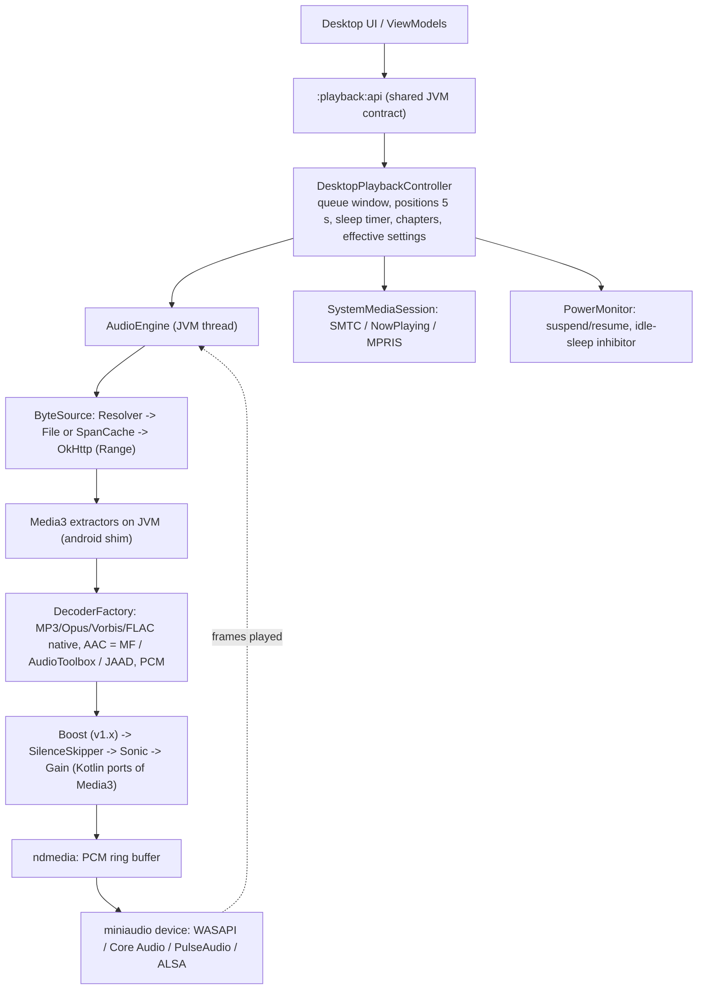

# Desktop playback (Windows, macOS, Linux): research notes

Research area: **desktop-playback**. Date 2026-10-05. Context: the owner's direction of 2026-10-05 adds desktop operating systems as build targets. This note covers only how a Kotlin/JVM desktop build plays audio, and later video, and how it integrates with each OS. The sync server, desktop UI framework, desktop packaging and installers, and desktop YouTube engine hosting belong to other research areas. They are mentioned here only where playback depends on them.

Binding constraints: Unlicense repository. No GPL or AGPL anywhere; LGPL is excluded today (D3, N8) and is evaluated separately in this note. GitHub Releases only. No platform developer registration. Package prefix `ch.lkmc`.

Evidence types used below: primary sources (URLs in [Verified facts](#verified-facts-with-urls)), plus two local spikes run in this session on Linux x64 with JDK 21.0.11 and FFmpeg 6.1.1 used only as a test-media generator. Spike code is in the session scratchpad under `research3/_dp/spike` and `research3/_dp/native`, not in the repository:

- **Spike A (JVM):** the unmodified Media3 **1.11.1** extractor, common and container `classes.jar` (taken from the AARs) run on a plain JDK with 14 tiny `android.*` stub classes. Media3 demuxed, seeked and extracted chapters from MP3 (CBR, Xing-VBR, ID3 `CHAP`), M4A (progressive, Nero/QuickTime chapters), **fragmented DASH M4A like YouTube itag 140**, **WebM Opus like itag 251**, Ogg Opus, Ogg Vorbis, FLAC and WAV. JAAD, a public-domain pure-Java decoder, then decoded the AAC samples to the same RMS level as FFmpeg's decode of the same file (not a bit-exact comparison), at 137–166× real time.
- **Spike B (native):** one shared library containing miniaudio 0.11.25, libopus 1.6.1, libvorbis 1.3.7 and libogg 1.3.6, built with gcc in about 16 s. It is 1.2 MB stripped and depends only on libc and libm (miniaudio loads PulseAudio and ALSA at run time). It was called from Java through the FFM API: native MP3 frame decoding of 120 s of audio took 105 ms, and a null-backend output device consumed 49,440 frames in 1 s at 48 kHz.

---

## Recommendation

**Build one Neutrodyne audio engine for all three desktop operating systems, from permissive parts only. Put a small set of per-OS adapters behind common Kotlin interfaces. Do not adopt a ready-made media framework.** The stack:

| Layer | Choice | Licence | Notes |
|---|---|---|---|
| Public contract | Existing `:playback:api` (`PlaybackController`, `PlaybackStateSource`), already pure JVM | Unlicense (own) | Desktop gets its own implementation. Features and ViewModels stay unchanged |
| Engine core (JVM) | New `AudioEngine` in Kotlin: one playback thread, a projection window of items like D38, command queue, clock | Unlicense | Same semantics as Android: positions every 5 s, guard against overwriting a position with 0, item transitions |
| Bytes | OkHttp `Range` / `If-Range` reader plus own sparse **span cache** (LRU 500 MB, same key rules as D40) plus local files | Apache-2.0 (OkHttp) + own | Reuses the D39 resolver idea: `episodeId` → local file, pinned enclosure or YouTube URL, re-resolved on each connection |
| Demux | **Media3 1.11.x extractors used unchanged on the JVM** with an `android.*` shim of about 14 classes (Spike A). Fallback: a source fork of the same Apache-2.0 files | Apache-2.0 (Media3) | Same CBR/Xing/VBRI seeking, fMP4 `sidx`, Matroska cues, Ogg bisection, LAME/iTunes gapless data and ID3/MP4 chapters as the Android build (06 Chapters) |
| Decoders | MP3: miniaudio's embedded dr_mp3 frame decoder. Opus: libopus. Vorbis: libvorbis + libogg. FLAC: dr_flac (in miniaudio). PCM/WAV: JVM. **AAC: OS decoder on Windows (Media Foundation AAC MFT) and macOS (AudioToolbox `AudioConverter`); JAAD (public domain, pure Java) on Linux and as fallback everywhere**, for example on Windows N without the Media Feature Pack | Public domain / MIT-0, BSD-3, OS components | No FAAD2 (GPL), no fdk-aac (non-standard licence), no FFmpeg |
| DSP | **Port Media3's `Sonic` (speed 0.5–3× with pitch preserved) and `SilenceSkippingAudioProcessor` to the desktop module** with the same parameters as Android (06 Player configuration), plus a gain stage and the v1.x boost limiter slot | Apache-2.0 (Media3, originally Sonic by Bill Cox) | Same sound and the same skip-silence behaviour as Android. `Sonic.class` has no Android or Media3 utility dependencies (checked) |
| Output | **miniaudio** device (WASAPI / Core Audio / PulseAudio, including PipeWire through pipewire-pulse / ALSA), shared mode, f32, fed through miniaudio's lock-free PCM ring buffer; clock = frames consumed by the device callback | Public domain or MIT-0 | Automatic stream rerouting on default-device change is built in for WASAPI and Core Audio |
| OS integration | Windows: **SMTC** through `ISystemMediaTransportControlsInterop::GetForWindow` (C++/WinRT shim). macOS: **MPNowPlayingInfoCenter + MPRemoteCommandCenter** (Objective-C shim). Linux: **MPRIS 2** in pure Kotlin over **dbus-java** (MIT) | Own code + MIT | Media keys and headset or Bluetooth buttons arrive through these sessions; no global key hooks |
| Power | Windows `RegisterSuspendResumeNotification` + `SetThreadExecutionState(ES_CONTINUOUS \| ES_SYSTEM_REQUIRED)` while playing. macOS `NSWorkspaceWillSleep/DidWake` + `IOPMAssertion` (NoIdleSleep). Linux logind `PrepareForSleep` + portal `Inhibit` (flag 4, Suspend) | OS APIs | Pause and save the position immediately on sleep; never resume automatically on wake |
| Native packaging | **One own shared library per OS/arch** (`ndmedia`), with miniaudio, libopus, libvorbis and libogg linked statically, plus the per-OS AAC, OS-session and power glue. Loaded with the **Java FFM API (final since JDK 22; bundle JDK 25 LTS)** from the app's resources directory | Unlicense + the above | Six targets: windows-x64, windows-arm64, macos-arm64, macos-x64 (or one universal2 dylib), linux-x64 and linux-arm64 (glibc ≥ 2.28), built on GitHub-hosted runners of the same OS |
| Video | **Not in the desktop v1.** Video podcasts play as audio, which matches Android v1.0 (D64, 06 Video). Later: per-OS native video (Media Foundation / AVFoundation, Linux through a GStreamer the user already has, not one we ship), modelled on the MIT-licensed ComposeMediaPlayer | n/a | YouTube stays audio-only (PO-9) |

**Why this stack:**

1. **It is the only option that meets every requirement under the current licence policy.** That covers all listed formats, including YouTube itags 140, 251 and 250, Range streaming with our own disk cache, speed with pitch preservation, skip silence, gapless-ish transitions, an accurate clock and OS integration. The other options fail on licence (vlcj, FAAD2, mpv by default, GStreamer, FFmpeg, OpenAL Soft), on formats (JavaFX Media, AVPlayer, Media Foundation without Store extensions), on features (no skip silence and no custom cache in JavaFX, AVPlayer or MF MediaPlayer), or on Linux AAC.
2. **It behaves like the Android build.** Media3's extractors, Sonic and silence skipper are the same code paths as Android's ExoPlayer chain. Chapters, gapless trimming, seek accuracy and skip-silence feel therefore match on both platforms, and one test corpus checks both.
3. **The risky parts have been spiked.** Spike A and Spike B show that the two pieces most likely to fail (Media3 off Android, and the native build with FFM) work.

**LGPL in one paragraph** (details in [What allowing LGPL would change](#what-allowing-lgpl-would-change)): allowing LGPL would make one layer much simpler, but not the whole engine. A minimal FFmpeg LGPL build (libavformat, libavcodec and libswresample as separate shared libraries) would replace the Media3 shim, the three AAC paths, and the libopus and libvorbis glue. It would also solve Linux AAC without JAAD. Everything else stays to be written: cache, DSP, clock, transitions, OS sessions and power handling. libmpv in an LGPL build would add caching, speed and video too, but makes skip silence, our cache semantics and exact positions hard. **A permissive solution exists, so LGPL is not needed.** Keep the decoder and demuxer boundary swappable (`DecoderFactory`, `ExtractorHost`) so that FFmpeg-LGPL can be a drop-in plan B if the owner allows it later.

**Precondition outside this area (the owner must decide):** every JVM desktop distribution ships a Java runtime, and OpenJDK is **GPLv2 with the Classpath Exception**. D3 and N8 ("no GPL … code anywhere", "every shipped artefact") therefore have to be amended for desktop, or desktop on the JVM is impossible. The same exception covers JavaFX. See [Questions](#questions-the-owner-must-answer) Q1.



---

## Options considered

Legend: Yes = meets the requirement. **No** = fails. Partial = meets it partly or with work. "Licence (shipped)" means what we would have to distribute.

| # | Option | Licence (shipped) | Formats (MP3 / AAC incl. 140 / Opus-WebM 251 / Ogg / FLAC / WAV) | Speed 0.5–3× with pitch kept | Skip silence | Range + **our** disk cache | Video | Engineering effort | Verdict |
|---|---|---|---|---|---|---|---|---|---|
| **A** | **Own engine: Media3 extractors (shim) + miniaudio + libopus/libvorbis + OS AAC / JAAD + ported Sonic/silence (recommended)** | Apache-2.0, PD/MIT-0, BSD-3, PD (JAAD), own code | All. Spike A demuxed every container; the decoders are verified individually | Yes (Sonic) | Yes (Media3 algorithm) | Yes (own reader) | No (later, per OS) | Medium-high | **Recommended** |
| B | JavaFX Media (OpenJFX 25) | GPLv2+CE (`javafx.media`) **plus bundled LGPL GStreamer-lite (Win/mac/Linux) and GLib-lite (Win/mac)**; on Linux it needs the system's libavcodec | MP3, AAC, PCM, HLS only. **No Opus, Vorbis, FLAC, WebM or Ogg** | Rate 0–8; pitch preservation undocumented (Unverified) | **No** | **No** (`Media(String uri)` only; would need a local HTTP proxy) | H.264/H.265 | Low | Rejected: formats, features, ships LGPL |
| C | vlcj + libVLC | **vlcj is GPL-3.0** (commercial licence on request); libVLC LGPL-2.1+; some VLC modules remain GPL | All | Yes | Partial (audio filters only) | Partial (libVLC demux and cache) | Yes | Medium; large bundle | Rejected: GPL |
| D | Own JNA/FFM bindings to libVLC | LGPL core + per-module audit (some GPL) | All | Yes | Partial | Partial | Yes | Medium; large bundle; module licence audit | Rejected while LGPL is excluded |
| E | GStreamer (bundled) via gst1-java-core or own bindings | LGPL-2.1+; **gst1-java-core is LGPL-3.0**; patent-sensitive plugins sit in "ugly" | All (with the right plugins) | Yes (scaletempo) | Partial (`removesilence` in plugins-bad) | Partial (appsrc) | Yes | High; very large bundle on Win/mac | Rejected (LGPL; size) |
| F | **FFmpeg LGPL build** (own minimal build or JavaCPP presets) for demux/decode + rest of A | LGPL-2.1+ (own build) or **LGPLv3** (JavaCPP's default build uses `--enable-version3`; `-gpl` artefacts are GPL) | All | Yes (Sonic) | Yes | Yes (custom AVIOContext) | Possible later | Medium (saves the shim, AAC per OS and the codec glue) | **Plan B if LGPL is ever allowed** |
| G | libmpv built with `-Dgpl=false` (LGPL) + LGPL FFmpeg | LGPL-2.1+ (only if built that way; GPLv2+ by default) | All | Yes (scaletempo2) | **Hard** (no PCM tap; `silenceremove` breaks the clock) | Partial (mpv's own cache semantics) | Yes | Medium; own builds on 3 OSes | Rejected (LGPL; skip silence; cache) |
| H | Per-OS native players: WinRT `MediaPlayer`/MF, macOS `AVPlayer`, Linux GStreamer (as ComposeMediaPlayer does) | OS components; Linux GStreamer LGPL (could be the system's copy, not shipped) | **Gaps:** AVPlayer has no WebM and no Ogg Opus (Ogg Vorbis since 15.4); MF needs the Store "Web Media Extensions" for Ogg/Vorbis; Linux depends on installed plugins | Yes on Win/mac (OS rate); GStreamer on Linux | **No** on Win/mac without custom DSP taps | Hard (AVAssetResourceLoader, custom IRandomAccessStream, appsrc) | Yes | High: three different engines | Rejected for audio; **the model for optional video later** |
| I | Rust core: Symphonia + cpal/rodio + libopus via JNI | **MPL-2.0** (Symphonia) + MIT/Apache | Symphonia 0.6.1: MP3, AAC-**LC only**, FLAC, Vorbis, MP4, MKV/WebM, Ogg; **no Opus decoder, no HE-AAC** | Needs Sonic | Own | Own | No | Medium + a second language toolchain | Rejected (MPL not on the allow-list; gaps remain) |
| J | Pure-JVM decoders + `javax.sound.sampled` | Mixed: Concentus (Opus, BSD-3) and JAAD (AAC, PD) are fine, but the common Java MP3 decoders (JLayer/mp3spi) and JOrbis are **LGPL** | MP3 has no permissive pure-Java decoder found | Sonic | Own | Own | No | Medium | Rejected as the main path. JAAD is kept as the AAC fallback |
| K | Media3 ExoPlayer itself on desktop | Apache-2.0 | n/a | n/a | n/a | n/a | n/a | n/a | **Impossible**: published as AARs; the player relies on `MediaCodec`, `AudioTrack`, `Looper`/`Handler`, `Context`. Only the extractors (and Sonic) are reusable (Spike A) |
| L | ComposeMediaPlayer (kdroidFilter, MIT) as-is | MIT; its JVM audio module wraps **Rodio → Symphonia (MPL-2.0)**; its Linux video uses GStreamer | JVM audio: MP3/AAC/FLAC/OGG/WAV (per its README), no Opus listed | **`setRate` is a no-op on JVM** | No | No | Video: MF / AVPlayer / GStreamer | Low | Rejected for audio; good reference for later video |
| M | OS-integration libraries: JMTC (JavaMediaTransportControls 0.0.3) | POM says "MIT License" but links Apache-2.0 (ambiguous); JNA + dbus-java | n/a | n/a | n/a | n/a | n/a | n/a | Reference only: no macOS support, last release April 2024 |

**Output back-ends considered for option A:** miniaudio (PD or MIT-0; automatic rerouting on WASAPI and Core Audio; one source file; **chosen**). cubeb (ISC; Firefox's; robust, but a heavier build and a Rust macOS back-end). PortAudio (MIT-style; no automatic rerouting found, Unverified). `javax.sound.sampled` (part of the JDK; no device following; poor latency information; kept only as a last-resort diagnostic). OpenAL Soft (**LGPL**, rejected).

**Time-stretch back-ends considered:** Sonic (Apache-2.0; tuned for speech above 2×; what Android uses; **chosen**). Signalsmith Stretch (MIT; higher music quality; optional later). SoundTouch (LGPL, rejected). Rubber Band (GPL, rejected). TarsosDSP (GPL, rejected).

**AAC decoders considered:**

| Decoder | Licence | Profiles | Use |
|---|---|---|---|
| Windows Media Foundation AAC MFT (`CLSID_CMSAACDecMFT`) | OS component (the vendor carries the patent licence) | LC (multichannel), HE-AAC v1, HE-AAC v2 (stereo); raw AUs with `HEAACWAVEINFO` + ASC in `MF_MT_USER_DATA`; ≤ 48 kHz; no 960-sample frames | Windows primary |
| macOS AudioToolbox `AudioConverter` (`kAudioFormatMPEG4AAC`, `_HE`, `_HE_V2`) | OS component | LC, HE v1, HE v2 | macOS primary |
| JAAD (sourceforge "jaadec", forks DV8FromTheWorld/JAADec and walkyst/JAADec-fork) | **Public domain** | LC, HE-AAC (SBR); the `ps` package exists (HE v2), quality Unverified | Linux primary; fallback on all OSes (Windows N without MF, MF failures) |
| fdk-aac | FDK licence (source-availability duty; no fees; **no patent licence, use allowed "only for purposes … authorized by appropriate patent licenses"**); Debian non-free | LC, HE v1/v2, ELD | Rejected (not on the allow-list) |
| FAAD2 | GPL-2.0+ | All | Rejected |
| FFmpeg native AAC | LGPL | All | Only under plan B |
| Symphonia AAC | MPL-2.0 | LC only | Rejected |

---

## Technical detail

### Shared contract and module placement (proposal)

The `:playback:api` contract is already pure JVM (PLAN 5.1 rule 3). Desktop implements it rather than inventing a new one:

| Proposed module | Kind | Contents |
|---|---|---|
| `:playback:api` (existing) | JVM | Unchanged. Must stay free of Media3 types. 06's v1.x plan to expose the session `Player` "under a qualifier declared in `:playback:api`" (06 Video, M14) must move to an Android-only module |
| `:playback:engine` (new) | JVM | `AudioEngine`, the `ByteSource` stack and `SpanCache`, `ExtractorHost` (Media3 + `android.*` shim), `DecoderFactory` SPI, JAAD (vendored source, PD), `PcmDecoder`, the DSP ports (`Sonic`, `SilenceSkipper`, `Gain`, later `BoostLimiter`), the clock and timeline. Unit-tested headless on all three CI OSes |
| `:playback:native` (new) | JVM + C/C++/ObjC sources + CMake | `ndmedia` sources, FFM bindings (hand-written or jextract), loader, per-OS AAC decoders, output sink |
| `:playback:desktop` (new) | JVM | `DesktopPlaybackController : PlaybackController`, `PlaybackStateSource` implementation, queue projection (logic of 06's `QueueProjector` without Media3), position saver, sleep timer, chapters (reuses 06's priority rules), `EffectiveSettingsResolver` use |
| `:desktop:system` (new) | JVM (+ native shims in `ndmedia`) | `SystemMediaSession` (SMTC / NowPlaying / MPRIS), `PowerMonitor`, `IdleSleepInhibitor`, `AudioRouteMonitor` |

Engine interface sketch (illustrative):

```kotlin
interface AudioEngine : AutoCloseable {
    val state: StateFlow<EngineState>                 // Idle, Buffering, Ready(playing), Ended, Error(reason)
    val events: SharedFlow<EngineEvent>               // ItemTransition(from, to, reason), Discontinuity(SEEK | SILENCE_SKIP),
                                                      // TracksKnown(durationUs, chapters, gapless), DeviceRerouted, DeviceLost
    fun setWindow(items: List<EngineItem>, currentIndex: Int, startPositionMs: Long?)   // D38-style projection window
    fun updateWindow(diff: WindowDiff)                // projector diffs; the current item is never re-prepared
    fun play(); fun pause(); fun seekTo(positionMs: Long)
    fun setSpeed(speed: Float)                        // 0.5..3.0, Sonic
    fun setSkipSilence(enabled: Boolean)
    fun setVolume(linear: Float)
    fun positionMs(): Long                            // lock-free; from the device clock and the timeline markers
}
data class EngineItem(val episodeId: Long, val cacheKey: String, val localHint: Boolean)   // ep:{id}:{fp} or yt:{videoId}
fun interface SourceResolver { suspend fun resolve(item: EngineItem, attempt: Int): ResolvedSource }  // file | http(url, headers) | youtube(url, formatId)

interface AudioDecoder : AutoCloseable {             // one per track; created from a Media3 Format
    fun decode(au: ByteArray, len: Int, timeUs: Long, out: FloatPcmSink)
    fun flush()                                       // on seek
}
fun interface DecoderFactory { fun create(format: androidx.media3.common.Format): AudioDecoder? }   // ordered chain

interface SystemMediaSession {                        // Win SMTC / mac NowPlaying / Linux MPRIS
    fun publish(np: NowPlaying)                       // title, podcast, artwork file path, durationMs, positionMs, rate, state, canNext/Prev
    val commands: Flow<RemoteCommand>                 // Play, Pause, Toggle, Next, Previous, SkipFwd, SkipBack, SeekTo(ms), SetRate(x)
}
```

### Source layer: HTTP streaming, Range, disk cache, local files

- **Reader:** an OkHttp call with `Range: bytes=n-`, `If-Range` (ETag or Last-Modified), `Accept-Encoding: identity`, the same `AuthInterceptor` and User-Agent as Android (06 DataSource stack), and http→https redirects followed. A seek or a `RESULT_SEEK` from an extractor cancels the call and reopens at the new offset.
- **Look-ahead loader:** a separate loader thread keeps 60 s minimum and 600 s maximum of audio ahead of the read position, bounded by a byte cap. These are Android's load-control numbers (06 Player configuration), so "back 10 s" is instant and short network drops are absorbed.
- **`SpanCache`:** the desktop equivalent of D40.
  - One directory per cache key, holding sparse span files plus an index.
  - LRU 500 MB by default (user-adjustable), in the OS cache directory: `%LOCALAPPDATA%\Neutrodyne\cache\media`, `~/Library/Caches/ch.lkmc.neutrodyne/media`, `$XDG_CACHE_HOME/neutrodyne/media`. Unverified: the final directory names are a desktop-foundation decision.
  - Same rules as D40: every new RSS pin starts with an empty resource (DAI safety, risk T7); only `yt:{videoId}:{formatId}` keys are reused across sessions; downloads never live in the cache.
  - Media3's `SimpleCache` is **not** reusable. Its index uses Android's `DatabaseProvider` (android.database).
- **Local files:** a direct `FileChannel` reader. The `nd.local` hint enables `FLAG_ENABLE_INDEX_SEEKING` for MP3, exactly as on Android.
- **Errors:** 401/403/404/410 on `ep:` keys retry once after re-resolving the pinned URL, then fail (06 `NdLoadErrorHandlingPolicy`). `yt:` 403/410 re-resolve through the YouTube engine. URLs are IP-bound and last about 6 h (04), so an IP change after waking from sleep is expected to 403.

### Demuxing: Media3 extractors on the JVM (Spike A)

- **Why it works:** in 1.11.1 the audio extractors reference only a handful of Android classes:
  - `android.util.SparseArray`, `LongSparseArray`, `SparseIntArray`, `SparseBooleanArray`, `Pair`
  - `android.net.Uri` (in the factory)
  - `android.util.Log`, `android.os.Build` and `android.text.TextUtils` (through `Util`, `Log`, `ParsableByteArray`)
  - exception and interface types that the verifier resolves: `PackageManager.NameNotFoundException`, `android.os.Parcelable`/`Parcel`, `android.app.ActivityManager.isRunningInTestHarness()`
- Subtitle and image paths reference `android.text.*` and `android.graphics.*`, but they are never loaded for audio.
- `Format` and `Metadata` no longer implement `Parcelable` (checked with `javap`), so their class loading does not need the Android framework.
- **The shim:** 14 small classes (about 150 lines) in a desktop-only module, with real behaviour where Media3 needs it (sparse arrays, `Pair`) and no-ops elsewhere (`Log`). On the JVM, `Build.VERSION.SDK_INT` is read with `getstatic`, so the shim's constant `36` is used.
- **Spike A results:**

| Corpus file (made with FFmpeg) | Extractor | Seek map | Notable output |
|---|---|---|---|
| CBR MP3 128 kbps | `Mp3Extractor` | `ConstantBitrateSeeker`, 120.000 s | LAME gapless delay 1105 / padding 335; seek 61 s → first sample 61.005 s |
| VBR MP3 (Xing, flags 15) | `Mp3Extractor` | `XingSeeker`, 120.000 s | seek → 61.008 s |
| MP3 with ID3 `CHAP`/`CTOC` | `Mp3Extractor` | CBR | 3 `ChapterFrame`s with correct start and end |
| M4A, `moov` first | `Mp4Extractor` | `Mp4SeekMap` | ASC in `initializationData`, encoder delay 1024 |
| M4A with chapters | `Mp4Extractor` | `Mp4SeekMap` | 3 chapters (`ChapterImpl`) |
| **Fragmented M4A with `sidx` (DASH, like itag 140 `m4a_dash`)** | `FragmentedMp4Extractor` | `ChunkIndex` | seek lands on the fragment at 60.047 s, then decode-and-discard |
| **WebM Opus (like itag 251/250 `webm_dash`)** | `MatroskaExtractor` | `MatroskaSeekMap` (cues) | `initializationData` = OpusHead, codec delay, seek pre-roll |
| Ogg Opus / Ogg Vorbis | `OggExtractor` | `OggSeekMap` | Vorbis packets carry 4 appended sample-count bytes (`appendNumberOfSamples`); the decoder must strip them |
| FLAC | `FlacExtractor` | `BinarySearchSeekMap` | STREAMINFO in `initializationData` |
| WAV | `WavExtractor` | `WavSeekMap` | `audio/raw` |

- **Integration:**
  - A `DataReader` over `ByteSource`, with `DefaultExtractorInput`.
  - Sniff with `DefaultExtractorsFactory().setConstantBitrateSeekingEnabled(true)` and keep using **the same input that sniffed** (as Media3's `BundledExtractorsAdapter` does). Reopening at offset 0 broke Xing detection in a first harness run.
  - A `TrackOutput` that forwards samples to the decoder queue and ignores video and text tracks. Video podcasts therefore play as audio, like 06 Video.
- **Gradle:** Media3 modules are published as `aar` (the POM says so). A JVM module needs a small artifact transform or extraction task that unpacks `classes.jar`. Pin the same Media3 version as Android, and fail CI if the corpus test meets a `NoClassDefFoundError`.
- **Fallback:** if a future Media3 release pulls in more of the framework, source-fork the required Apache-2.0 files (`extractor/{mp3,mp4,mkv,ogg,flac,wav,ts(Adts),metadata/id3}` and their `common`/`container` helpers) and replace `android.*` with JDK types. Both routes need the Apache-2.0 NOTICE.
- **Alternative reference:** lavaplayer (Apache-2.0) has streaming-oriented Java container parsers (MP3, MP4, Matroska/WebM, Ogg, FLAC, WAV, ADTS). Its natives include mpg123 (LGPL) and fdk-aac, so only its Java parts are usable. Media3 is preferred because it is the code Android already runs.

### Decoders per format

| Format (typical source) | Container → extractor | Codec data from Media3 `Format` | Desktop decoder | Licence | Gapless / pre-roll handling |
|---|---|---|---|---|---|
| MP3 (most RSS) | MP3 → `Mp3Extractor` | none; LAME/Xing → `encoderDelay`/`encoderPadding` | `ma_dr_mp3dec_decode_frame` (frame-level; in miniaudio). Spike B: 120 s decoded in 105 ms | PD / MIT-0 | Trim delay and padding (LAME) |
| AAC-LC / HE-AAC (M4A, M4B; YouTube 140) | MP4 / fMP4 → `Mp4Extractor` / `FragmentedMp4Extractor`; ADTS → `AdtsExtractor` | AudioSpecificConfig in `initializationData[0]`; `encoderDelay` from edit list / iTunSMPB | Windows: MF AAC MFT (payload type 0 raw, `MF_MT_USER_DATA` = `HEAACWAVEINFO` tail + ASC). macOS: `AudioConverterNew` + `AudioConverterFillComplexBuffer` with the ASC wrapped as an `esds` magic cookie. Linux and fallback: **JAAD** `Decoder.create(asc).decodeFrame(au)`; Spike A: RMS 0.0625, identical to FFmpeg's decode of the same file, 137–166× real time | OS / PD | Trim delay (1024 in the spike) and padding; the fMP4 edit list may be absent, in which case use the default AAC priming |
| Opus (YouTube 251/250; some RSS `.opus`) | WebM → `MatroskaExtractor`; Ogg → `OggExtractor` | OpusHead + codec delay ns + seek pre-roll ns | libopus `opus_decode_float` (multistream for more than 2 channels) | BSD-3 | Apply pre-skip; on seek, decode the 80 ms pre-roll and discard it; apply OpusHead output gain |
| Vorbis (Ogg; old WebM) | Ogg / WebM | id + setup headers | libvorbis `vorbis_synthesis` on `ogg_packet`s built from raw packets (strip Media3's 4 trailing bytes for Ogg) | BSD-3 | Granule-based trimming |
| FLAC | FLAC → `FlacExtractor` | `fLaC` + STREAMINFO | dr_flac (`ma_dr_flac_open` with a read callback that serves STREAMINFO followed by frames), or libFLAC's stream decoder (BSD-3), as Media3's `decoder_flac` extension does | PD / BSD-3 | n/a |
| WAV / PCM | WAV → `WavExtractor` | `pcmEncoding` | JVM conversion to f32 | own | n/a |

All decoders emit interleaved f32. Sample-rate and channel conversion to the device format happens once, in native code (`ma_data_converter`), so the device keeps running across items with different rates. If the linear-plus-low-pass resampler is not good enough for music, add libsamplerate (BSD-2).

### DSP chain: skip silence, speed with pitch preserved, volume

The order is the same as Android's (06 Player configuration):

`[BoostLimiter (v1.x, pass-through)] → SilenceSkipper → Sonic → Gain`

- **SilenceSkipper:**
  - A Kotlin port of Media3 1.11's `SilenceSkippingAudioProcessor` (Apache-2.0), called with Android's parameters: `(250_000, 0.2f, 400_000, 10, 1024)`, marked "Unverified tuning" in 06.
  - Its only Media3 dependencies are `BaseAudioProcessor` and `Util`, so porting means copying two small classes.
  - It emits a `Discontinuity(SILENCE_SKIP)` event for the UI and for MPRIS `Seeked`.
- **Sonic:** Media3's `Sonic.java` is self-contained (its bytecode references only `Sonic` itself) and is a port of Bill Cox's Apache-2.0 Sonic. It is used directly at speeds 0.5–3.0 (R4.8), pitch 1.0.
- **Gain:** volume is a linear multiply in the chain, not `ma_device_set_master_volume`, so the boost and limiter stage can come later without rework.
- **Threading:** all three run on the engine thread. Sonic at 3× on 48 kHz stereo is cheap. Unverified: measure CPU on the slowest supported machine.

### Output, clock and position accuracy

- **Device:**
  - One miniaudio playback device in shared mode, f32 stereo, at the device's native rate. miniaudio converts channel counts.
  - The engine thread writes into `ma_pcm_rb`, a single-producer single-consumer lock-free ring of about 200 ms. The device callback only copies from the ring and adds the frames to a 64-bit `framesPlayed` counter. No JVM code runs on the audio thread, so there are no FFM upcalls on the real-time path.
  - On underrun, play silence and raise `Buffering` after more than 300 ms (Unverified threshold).
- **Clock:**
  - With every block (about 10–20 ms) the engine records a timeline marker `(outputFrameIndex, mediaTimeUs, speed)`.
  - `positionMs()` = the latest marker at or before `framesPlayed` + `(framesPlayed − marker.outFrame) × speed / rate`. This stays correct across Sonic speed changes and silence skips.
  - Device latency is a constant offset per back-end: one WASAPI period is about 10 ms; Unverified for Core Audio, PulseAudio and Bluetooth.
  - Expected error: below about 30 ms on wired outputs. Bluetooth adds roughly 100–250 ms that miniaudio cannot report (Unverified). This matters only for the visual sync of chapter and position display.
- **Positions:** saved every 5 s while playing, and on pause, seek, transition (outgoing item first), app quit, **system suspend** and **device loss**. A non-zero position is never overwritten with 0 (D41, N1).

### Transitions and gapless-ish playback

- The engine holds the current item plus the next item of the projection window.
- About 10 s before the current item ends, it opens the next item's source, extractor and decoder, so that the first PCM is ready.
- At end of stream it continues writing the next item's PCM into the same ring buffer, after trimming the outgoing item's padding and the incoming item's delay. The device never stops, so there is no device restart and no click. Podcasts need "gapless-ish", not sample-exact; this approach is close to sample-exact anyway.
- When the next item is remote and not prefetched, the transition shows `Buffering` for the time to first byte.
- Item-transition events drive the controller: mark played, save the outgoing position first, advance Up next (D38, 06 Transitions).

### OS media integration

| Concern | Windows 10/11 | macOS | Linux |
|---|---|---|---|
| API | **SMTC** for desktop apps: `ISystemMediaTransportControlsInterop::GetForWindow(HWND, IID)` | `MPNowPlayingInfoCenter` (macOS 10.12.2+) + `MPRemoteCommandCenter` (10.12.1+); set `playbackState` (macOS-only) "every time the app begins or halts playback" | **MPRIS 2** `org.mpris.MediaPlayer2` + `.Player` on the session bus |
| Our implementation | C++/WinRT (MIT headers) inside `ndmedia.dll`; C ABI `smtc_init(hwnd, cb)`, `smtc_publish(...)`; button and seek events come to the JVM through one FFM upcall that only enqueues | Objective-C (ARC) in `libndmedia.dylib`; command handlers are blocks inside the shim that call a C function pointer (one FFM upcall); artwork through `MPMediaItemArtwork` from the pinned artwork file | Pure Kotlin: dbus-java 5.2.x (MIT), transport `native-unixsocket` (JDK AF_UNIX) or junixsocket (Apache-2.0); bus name `org.mpris.MediaPlayer2.neutrodyne`, `DesktopEntry` = the `.desktop` id |
| Metadata | Title, artist (podcast), album, thumbnail (`RandomAccessStreamReference` from the artwork file); timeline (start, end, position) | Title, artist, album, duration, elapsed, rate (`MPNowPlayingInfoPropertyPlaybackRate`), artwork | `xesam:title`, `xesam:artist`, `xesam:album`, `mpris:length`, `mpris:artUrl` = `file://` pinned art (D42), `mpris:trackid` = `/ch/lkmc/neutrodyne/episode/{id}` |
| Commands | Play, Pause, Next, Previous, FastForward/Rewind (mapped to skip), `PlaybackPositionChangeRequested`, `PlaybackRateChangeRequested` | play, pause, togglePlayPause, next/previousTrack, skipForward/skipBackward (`preferredIntervals` = user skip settings), changePlaybackPosition, changePlaybackRate (`supportedPlaybackRates`) | Play, Pause, PlayPause, Stop, Next, Previous, `Seek(offset)`, `SetPosition(trackId, pos)`, `Rate` with `MinimumRate` 0.5 and `MaximumRate` 3.0 |
| Position | Push the timeline on state change and seek, and at most every 5 s (Unverified best cadence) | Update elapsed + rate on every state, rate or seek change; the system extrapolates | `Position` is **not** signalled (spec); emit `Seeked` on every discontinuity, including silence skips (throttled, at most 1 per second) |
| Window dependency | GetForWindow needs a top-level HWND. Use a hidden top-level window owned by the shim, so SMTC survives the main window closing to the tray (Unverified: whether SMTC accepts it; spike) | None | None |
| App identity | Unpackaged apps: call `SetCurrentProcessExplicitAppUserModelID("ch.lkmc.neutrodyne")` and give the Start-menu shortcut the same AUMID, so the flyout shows the name and icon (Unverified) | Bundle id `ch.lkmc.neutrodyne` | `.desktop` file name `ch.lkmc.neutrodyne.desktop` |

**Media keys and headset or Bluetooth buttons:**
- Windows: hardware media keys go to the active SMTC session.
- macOS: they go to the "Now Playing" app selected by `MPRemoteCommandCenter` together with `playbackState`.
- Linux: GNOME and KDE route `XF86Audio*` keys to the active MPRIS player; Bluetooth AVRCP arrives as input events that the desktop maps to those keys.
- **No global keyboard hooks** (JNativeHook is GPL/LGPL, and hooks are unnecessary).

### Sleep, wake and idle-sleep inhibition

| | Windows | macOS | Linux |
|---|---|---|---|
| Suspend notice | `RegisterSuspendResumeNotification` (Windows 8+), `PBT_APMSUSPEND` / `PBT_APMRESUMEAUTOMATIC` | `NSWorkspaceWillSleepNotification` / `DidWake` (or `IORegisterForSystemPower`) | logind `PrepareForSleep(true/false)` signal. A **delay inhibitor** returns an fd: holding it needs fd passing, which dbus-java's native-unixsocket transport lacks, so use junixsocket or rely on the signal plus 5-s saves (recommended) |
| Keep the machine awake while playing | `SetThreadExecutionState(ES_CONTINUOUS \| ES_SYSTEM_REQUIRED)`, cleared on pause | `IOPMAssertionCreateWithName(kIOPMAssertionTypeNoIdleSleep, …)`, released on pause; prevents idle sleep only | `org.freedesktop.portal.Inhibit` flags `4` (Suspend); release with `Request.Close`. Per-desktop behaviour is Unverified |
| Policy | Suspend → pause, save the position, close HTTP. Wake → evict OkHttp pooled connections, reopen the device if it was lost. **No automatic resume.** This follows D43's spirit that playback starts only from user action | same | same |

Unverified: Windows Modern Standby (S0ix) delivers suspend notices differently. Test on a Modern Standby laptop.

### Audio device changes

- **Follow the default output:** miniaudio reroutes automatically on WASAPI and Core Audio (`wasapi.noAutoStreamRouting = false`, the default). PulseAudio and PipeWire move streams themselves. The rerouted notification fires only where the back-end reports it, so do not depend on it for correctness.
- **"Becoming noisy" parity (R4.7):** pause when the endpoint in use **disappears** (headphones unplugged, Bluetooth disconnected), but not when the user merely switches the default.
  - Windows: `IMMNotificationClient::OnDeviceStateChanged` in the shim.
  - macOS: `kAudioDevicePropertyDeviceIsAlive` / default-device listeners.
  - Linux: best effort through miniaudio's stopped notification; a PulseAudio sink-removal subscription is v1.x.
  - Unverified per OS; spike.
- **Device loss** (stopped notification, or an error from `ma_device_start`): save the position, pause, re-create the device on the next play.

### Video (optional, later)

Desktop v1 stays audio-only. That matches Android v1.0 (D64; video surface in M14) and keeps YouTube audio-only (PO-9). Paths for later:

1. **Per-OS native video:** a Media Foundation Media Engine or WinRT `MediaPlayer` frame server on Windows, `AVPlayer` with `AVPlayerItemVideoOutput` on macOS (both OS components), and on Linux a GStreamer that the user installed, loaded dynamically and not shipped. ComposeMediaPlayer (MIT, version 0.11.4 in August 2026) shows each of these in Compose. Video would then use OS decoding, not our audio engine, so it is a separate `VideoPlayer` behind the same controller.
2. **Plan B under LGPL:** FFmpeg decoders for video (heavy).
3. **"Watch in browser":** external, for YouTube video.

### Native library: contents, ABI, build and packaging per OS/arch

- **Contents of `ndmedia`:**
  - miniaudio 0.11.x with `MA_NO_ENCODING` and `MA_NO_GENERATION`; its built-in dr_mp3, dr_flac and dr_wav are kept.
  - libopus 1.6.x (DRED, OSCE and deep PLC are off by default in its CMake).
  - libvorbis 1.3.7 + libogg 1.3.x.
  - Own glue: decoder handles, ring buffer and device, the data converter.
  - Windows only: the MF AAC decoder, SMTC, power and endpoint notifications.
  - macOS only: the AudioToolbox AAC decoder, Now Playing, power and the device listener.
  - Linux has no OS shim (MPRIS and logind are Kotlin).
- **ABI style:** a flat C API with opaque handles, e.g. `nd_dec_open(codec, csd, csdLen, rate, ch)`, `nd_dec_decode(h, in, len, out, cap)`, `nd_out_open(...)`, `nd_out_write(...)` (non-blocking), `nd_out_frames_played(...)`. Bindings are FFM downcalls (JDK 22+ final API). Upcalls are limited to low-rate OS events, and every upcall body catches all exceptions, because an exception escaping an upcall crashes the JVM.
- **Size:** Spike B produced 1.2 MB stripped on linux-x64 with whole-archive linking, so expect about 1–2 MB per target (Unverified for Windows and macOS).

| Target | Runner (GitHub-hosted) | Toolchain | Notes |
|---|---|---|---|
| windows-x64 | `windows-latest` | MSVC + CMake, static CRT `/MT` | C++/WinRT for SMTC; no VC++ redistributable needed |
| windows-arm64 | `windows-11-arm` (GA for public repos) | MSVC arm64 | Same sources |
| macos-arm64 + macos-x64 | `macos-15` (arm64) | Apple clang `-arch arm64 -arch x86_64` → universal2 dylib; deployment target = the JDK 25 floor (Unverified) | Frameworks: AudioToolbox, CoreAudio, MediaPlayer, AppKit, IOKit. Ad-hoc signature (`codesign -s -`); no notarization, which matches "no platform developer registration" (packaging area) |
| linux-x64 | `ubuntu-24.04` with a `manylinux_2_28` container (glibc 2.28 baseline) | gcc + CMake | miniaudio loads libpulse, libasound and libjack at run time, so the binary has no hard audio dependencies (Spike B `ldd`: libc and libm only) |
| linux-arm64 | `ubuntu-24.04-arm` (GA for public repos) with a manylinux_2_28 aarch64 container | gcc | Same sources |

- **Loading:** Compose Desktop's `nativeDistributions.appResourcesRootDir` copies `resources/<os>-<arch>/` into the app image, and at run time `System.getProperty("compose.application.resources.dir")` gives the path. `SymbolLookup.libraryLookup(path, Arena.global())` then opens it.
- **JVM flag:** add `--enable-native-access=ALL-UNNAMED` (or the module name) to the launcher's JVM options. Restricted FFM methods warn without it, and JEP 454 says the flag is likely to become mandatory.
- **Build placement:** each OS's packaging job builds its own `ndmedia` first; jpackage cannot cross-package anyway.
- **Licence manifest:** a `native-components.lock` file (name, version, SPDX, source URL, SHA-256) checked by CI, alongside the Gradle Licensee check and the existing Python lockfile check (N8). Notices go into `THIRD_PARTY_NOTICES`:
  - miniaudio: elect MIT-0
  - libopus, libvorbis, libogg: BSD-3-Clause
  - JAAD: public domain
  - Media3: Apache-2.0 + NOTICE
  - Sonic: Apache-2.0
  - dbus-java: MIT
  - junixsocket (if used): Apache-2.0
  - C++/WinRT headers: MIT

### Testing

- **Headless corpus tests on all three OSes:** short clips of each format, including a real itag-140 fMP4 and an itag-251 WebM fetched once and checked in if their licence allows, otherwise generated. Checks: duration, seek accuracy (±50 ms after decode-and-discard), gapless trim (sample counts against reference counts), PCM RMS against references, chapter extraction. Run with miniaudio's `ma_backend_null` (Spike B confirms it runs without a sound card).
- **Decoder parity:** on Windows and macOS, compare the OS AAC decoder with JAAD; flag RMS differences above −60 dB.
- **HTTP tests:** MockWebServer with throttling, mid-stream disconnects, 403-then-OK, servers without `Range`, and wrong `Content-Type`.
- **Clock tests:** at 0.5×, 1×, 2× and 3× with skip silence on, check that the reported position stays within 50 ms of a reference timeline.
- **Manual OS-integration checklist per release:** media keys, flyout or Control Center or GNOME panel, sleep and wake, headphone unplug, Bluetooth.

### What allowing LGPL would change

| Area | Permissive plan (recommended) | With LGPL allowed (FFmpeg minimal LGPL build, shared libraries) | Saved / added |
|---|---|---|---|
| Demux | Media3 extractors + `android.*` shim (spiked) | libavformat (mov/fMP4, matroska, ogg, mp3, flac, wav, aac) with a custom `AVIOContext` on our `ByteSource` | Saves the shim and its upgrade risk, about 1 week. Loses identical-to-Android behaviour and Media3's chapter types (FFmpeg exposes chapters differently) |
| AAC | MF / AudioToolbox / JAAD: three paths | libavcodec `aac` everywhere | Saves about 1–2 weeks and the JAAD quality risk on Linux |
| Opus / Vorbis / FLAC / MP3 | libopus / libvorbis / dr_flac / dr_mp3 glue | libavcodec native decoders | Saves about 0.5 week |
| Output, cache, DSP, clock, OS sessions, power | Own | **Still own** | Nothing saved |
| Obligations | Notices only | Ship FFmpeg as separately replaceable `.dll`/`.dylib`/`.so`; publish the exact FFmpeg source, configure line and build scripts with every release; LGPL notices; avoid `--enable-gpl` and `--enable-version3` unless LGPLv3 is accepted; no `-gpl` JavaCPP artefacts (JavaCPP's default FFmpeg build already uses `--enable-version3`, i.e. LGPLv3, and enables many external libraries) | Adds about 1 week of build and compliance work plus recurring per-release duties |
| Patents | MP3 (generally reported expired; Unverified), AAC-LC (US patents expired per Red Hat's 2017 review), HE-AAC only through OS decoders on Win/mac and JAAD on Linux | FFmpeg's HE-AAC on every OS | Same or slightly worse exposure |

**Verdict:** LGPL would save roughly 2–4 weeks of decoder and demuxer work and remove the Linux AAC question. It adds lasting compliance work, and the engine, cache, DSP and OS integration remain. That is a real but not decisive simplification. libmpv (LGPL build) would simplify more for plain playback and bring video, but it conflicts with skip silence, our cache semantics and the accurate clock. libVLC and GStreamer add size and plugin-licence audits. **Recommendation: keep LGPL excluded.** Keep the `DecoderFactory` and `ExtractorHost` seams so that FFmpeg-LGPL can be dropped in if the Media3 shim or JAAD ever fail.

### Effort (rough, Unverified, one experienced developer)

| Work package | Estimate |
|---|---|
| Engine core: threads, window, clock, transitions, errors | 3–4 weeks |
| Source layer + `SpanCache` | 1.5–2 weeks |
| Media3 shim + `ExtractorHost` + corpus | 1 week |
| `ndmedia` (miniaudio sink, opus/vorbis/mp3/flac glue) + CI build matrix (6 targets) | 2 weeks |
| AAC: MF + AudioToolbox + JAAD integration and parity tests | 1.5 weeks |
| DSP ports + tests | 0.5–1 week |
| SMTC / NowPlaying / MPRIS + power + device monitors | 3 weeks |
| **Total** | **about 13–15 weeks** |

Desktop UI, database and sync are not included.

---

## Impact on the existing plan

| Item | Change |
|---|---|
| **D3 / N8 (licensing)** | Must be amended for desktop. (a) Allow the **unmodified Java runtime image (GPLv2 + Classpath Exception)** bundled by jpackage, with the corresponding source published or linked for each release; no other GPL. (b) Add SPDX ids that are now used: `MIT-0` (miniaudio election), `CC0-1.0`/public domain (JAAD; minimp3 lineage), and keep BSD-3-Clause and Apache-2.0. (c) State that OS-provided codecs and frameworks (Media Foundation, AudioToolbox, Core Audio, WASAPI, logind/portal) are platform components, not shipped code. (d) Extend the CI licence enforcement to desktop artefacts: a native-component lockfile and a scan of the app image (runtime `legal/` folder, `resources/`). LGPL stays excluded unless the owner chooses plan B |
| **D13 / module graph (5.1)** | New desktop modules (proposal): `:playback:engine` (JVM), `:playback:native`, `:playback:desktop`, `:desktop:system`, plus a desktop composition root (owned by the desktop-foundation research). Rule 3 still holds: `:playback:api` stays pure JVM. **06's M14 idea of exposing a Media3 `Player` qualifier through `:playback:api` must move to an Android-only API module** |
| D37 (MediaLibraryService) | Android-only. Desktop equivalent: `DesktopPlaybackController` + `SystemMediaSession` |
| D38 (DB-owned queue, projection window) | **Reused unchanged** on desktop (same `queue_entry`/`play_session` semantics; the projector logic is ported without Media3) |
| D39 (one URI per episode, resolved per connection) | Same concept: `EngineItem(episodeId, cacheKey)` resolved by a desktop `SourceResolver` (local file → pinned enclosure → YouTube) |
| D40 (streaming cache) | Same rules (LRU 500 MB, `ep:`/`yt:` keys, empty resource per new RSS pin), implemented by `SpanCache` (Media3 `SimpleCache` needs android.database) |
| D41 / N1 (positions) | Same: 5 s plus event saves; adds **save on system suspend and device loss** |
| D42 (artwork store) | Desktop needs the same pinned `ArtworkStore` files: SMTC thumbnail, macOS artwork and MPRIS `artUrl` read local files |
| D43 (Android 17 background audio) | Not applicable; its principle carries over as "never auto-play at start-up or on wake" |
| D45 (effective settings) | Reused (speed and skip silence per podcast → group → global) |
| D64 / 06 Video | Desktop v1 audio-only too; video podcasts play as audio (extractor ignores video tracks) |
| D65 (listening extras) | Same v1 set on desktop: speed, skip silence, sleep timer, chapters. Boost slot in the chain from day one |
| 06 Chapters | Desktop gets ID3 and MP4 embedded chapters from the same Media3 extractor classes (`ChapterFrame`, MP4 `ChapterImpl` verified in Spike A). P2.0 JSON and PSC logic reused |
| R4.7 | Needs a desktop wording: OS media session, media and headset keys, pause on output-device removal; no audio focus and no resumption card (restore the last session paused at app start instead) |
| R4.8 | Unchanged on desktop (speed 0.5–3.0×, skip silence, skip intervals, sleep timer, chapters) |
| 09 Quality and release | CI matrix gains Windows x64/arm64, macOS arm64 and Linux x64/arm64 jobs (native build, corpus tests with the null back-end, packaging); per-release manual OS-integration checklist |
| Milestones | New desktop track after Android M5's playback semantics are frozen, for example **MD0 spike** (2 weeks: SMTC hidden-window, MF/AudioToolbox AAC, device-removal detection, Modern Standby, JAAD on a real HE-AAC corpus), **MD1 desktop playback core** (stream, local, seek, cache, speed, skip silence, positions, transitions), **MD2 desktop system surfaces** (SMTC/NowPlaying/MPRIS, keys, power, device changes), **MD3 YouTube on desktop** (depends on the desktop yt-dlp host research). Numbering is for the plan owner |
| Risks (section 8) | Add the risks below (R-DP1 to R-DP10) |

---

## Verified facts (with URLs)

Versions and dates were checked on 2026-10-05.

**Licences and versions of candidates**

- miniaudio: "Your choice of either public domain or MIT No Attribution". Back-ends: WASAPI, DirectSound, WinMM, Core Audio, PulseAudio, ALSA, JACK, and others; **no PipeWire back-end** in 0.11.x. Built-in decoders WAV, MP3, FLAC; Opus and Vorbis only through extras or stb_vorbis. "Automatic stream routing is … explicitly enabled for WASAPI and Core Audio". `wasapi.noAutoStreamRouting` defaults to false. Low-level `ma_dr_mp3dec_decode_frame`, `ma_dr_flac_open(onRead, …)`, `ma_pcm_rb_*`. — https://github.com/mackron/miniaudio, https://raw.githubusercontent.com/mackron/miniaudio/master/miniaudio.h (section 8 "Decoding", section 17, `MA_VERSION 0.11.25`)
- miniaudio releases: 0.11.25 (2026-03-03), 0.11.24 (2026-01-16), 0.11.23 (2025-09-10); 0.11.22 deprecated the libvorbis/libopus extras in favour of modular decoders ahead of 0.12. — https://github.com/mackron/miniaudio/releases
- libopus 1.6.1 (2026-01-14); opusfile 0.12 (2020-06-27). — https://opus-codec.org/downloads/
- libopus, libvorbis and libogg are BSD-style (3-clause). — https://github.com/xiph/opus/blob/main/COPYING, https://github.com/xiph/vorbis/blob/master/COPYING, https://github.com/xiph/ogg/blob/master/COPYING
- libFLAC: libraries under Xiph's BSD-like licence; the tools are GPL. — https://github.com/xiph/flac/blob/master/README.md
- minimp3 is CC0-1.0. dr_libs are public domain. stb_vorbis is MIT or public domain. libwebm is BSD-3 (Google). — https://github.com/lieff/minimp3/blob/master/LICENSE, https://github.com/mackron/dr_libs, https://github.com/nothings/stb/blob/master/stb_vorbis.c, https://chromium.googlesource.com/webm/libwebm/+/refs/heads/main/LICENSE.TXT
- Sonic: "released under the Apache 2.0 license"; it includes a Java port. — https://github.com/waywardgeek/sonic
- Concentus (pure Java/C#/Go Opus, based on libopus 1.1.2): BSD-style licence; Java artefact 1.0.2 (2024-05). — https://github.com/lostromb/concentus, https://repo1.maven.org/maven2/io/github/jaredmdobson/concentus/maven-metadata.xml
- JAAD: "The library is released open-source as public domain"; decodes AAC-LC and HE-AAC; the forks keep public domain. The DV8FromTheWorld fork has `sbr` and `ps` packages. walkyst/JAADec-fork 0.1.3 is on JitPack (jar built 2022-01-15). — https://jaadec.sourceforge.net/, https://github.com/DV8FromTheWorld/JAADec, https://jitpack.io/com/github/walkyst/JAADec-fork/maven-metadata.xml
- fdk-aac licence: "Software License for The Fraunhofer FDK AAC Codec Library for Android". It requires making the source available with binaries, forbids licence fees, and says "NO EXPRESS OR IMPLIED LICENSES TO ANY PATENT CLAIMS … You may use this FDK AAC Codec software … only for purposes that are authorized by appropriate patent licenses". — https://github.com/mstorsjo/fdk-aac/blob/master/NOTICE
- FDK status: the FSF considers it free but discourages it; Debian lists it as non-free; Fedora ships `fdk-aac-free` (LC only); US LC-AAC patents have expired. — https://en.wikipedia.org/wiki/Fraunhofer_FDK_AAC
- Symphonia: MPL-2.0. AAC-LC "Great", HE-AAC not implemented, Opus not implemented, MKV/WebM "Good". Crate 0.6.1 (2026-08-13). — https://github.com/pdeljanov/Symphonia, https://crates.io/crates/symphonia
- Rodio 0.22.2: "MIT OR Apache-2.0"; decoding through Symphonia features. — https://github.com/RustAudio/rodio/blob/master/Cargo.toml
- ComposeMediaPlayer: MIT. Desktop video: GStreamer (Linux), Media Foundation (Windows), AVPlayer (macOS), all through JNI. Audio module: "JVM uses Rodio"; "`setRate(rate)` is supported on Android/iOS/Web; on JVM it is currently a no-op". Latest 0.11.4 (2026-08-07). — https://github.com/kdroidFilter/ComposeMediaPlayer (README_AUDIO.MD, README_VIDEO.MD, LICENSE), https://repo1.maven.org/maven2/io/github/kdroidfilter/composemediaplayer/maven-metadata.xml
- JMTC 0.0.3: SMTC and MPRIS only; macOS "TODO". POM licence name "MIT License" with an Apache-2.0 URL; depends on JNA 5.14.0 and dbus-java 5.0.0. — https://github.com/Selemba1000/JavaMediaTransportControls, https://repo1.maven.org/maven2/io/github/selemba1000/JavaMediaTransportControls/0.0.3/
- lavaplayer: Apache-2.0. Java container parsers for MP3, FLAC, WAV, Matroska/WebM, MP4, Ogg, ADTS; natives include mpg123 1.25.10 and fdk-aac 2.0.0; AAC through a JAAD fork. — https://github.com/lavalink-devs/lavaplayer (README, natives/build.gradle)
- dbus-java: MIT; latest 5.2.2 (2026-09-26). The native-unixsocket transport "does not support file descriptor passing"; junixsocket does. junixsocket is Apache-2.0. — https://github.com/hypfvieh/dbus-java, https://repo1.maven.org/maven2/com/github/hypfvieh/dbus-java-core/maven-metadata.xml, https://github.com/kohlschutter/junixsocket
- JNA: `Apache-2.0 OR LGPL-2.1-or-later` (our choice); latest 5.19.1. — https://github.com/java-native-access/jna/blob/master/LICENSE, https://repo1.maven.org/maven2/net/java/dev/jna/jna/maven-metadata.xml
- cubeb is ISC; PortAudio is MIT-style; **OpenAL Soft is LGPL**; libsamplerate is BSD-2 (2012–2016 Erik de Castro Lopo); Signalsmith Stretch is MIT. — https://github.com/mozilla/cubeb/blob/master/LICENSE, https://github.com/PortAudio/portaudio/blob/master/LICENSE.txt, https://github.com/kcat/openal-soft/blob/master/COPYING, https://github.com/libsndfile/libsamplerate/blob/master/COPYING, https://github.com/Signalsmith-Audio/signalsmith-stretch

**JavaFX, VLC, mpv, FFmpeg, GStreamer**

- OpenJFX 25 media: containers AIFF, HLS (MP2T, MP3, fMP4), MP3, MP4, WAV; audio AAC, MP3, PCM; video H.264, H.265; protocols FILE, HTTP, HTTPS, JAR, HLS. For HTTP, MP4 needs its headers at the start of the file. — https://openjfx.io/javadoc/25/javafx.media/javafx/scene/media/package-summary.html
- `MediaPlayer.rate` supported range is `[0.0, 8.0]`; pitch is not documented. — https://openjfx.io/javadoc/25/javafx.media/javafx/scene/media/MediaPlayer.html
- JavaFX bundles GStreamer 1.28.3 as `libgstreamer-lite`/`gstreamer-lite.dll` ("The overarching license is LGPL 2.1") and GLib 2.84.3 as `glib-lite` on Windows and macOS. — https://github.com/openjdk/jfx/blob/master/modules/javafx.media/src/main/legal/gstreamer.md, https://github.com/openjdk/jfx/blob/master/modules/javafx.media/src/main/legal/glib.md
- On Linux, JavaFX media uses per-version `libavplugin` wrappers around the system libavcodec. — https://bugs.openjdk.org/browse/JDK-8194065
- OpenJFX and OpenJDK: GPLv2 with the Classpath Exception: "permission to link this library with independent modules … and to copy and distribute the resulting executable under terms of your choice". — https://github.com/openjdk/jfx/blob/master/LICENSE, https://openjdk.org/legal/gplv2+ce.html
- vlcj: "provided under the GPL, version 3 or later"; commercial licence on request. — https://github.com/caprica/vlcj (README "License")
- libVLC and libVLCcore were relicensed to LGPL on 2011-12-21; most playback modules followed in 2012; the VLC application stays GPLv2+. — https://www.videolan.org/press/lgpl-libvlc.html, https://images.videolan.org/press/lgpl-modules.html
- mpv: "licensed under … GPL version 2 or later … by default … LGPLv2.1+ … if built without using any GPL only files" (`-Dgpl=false`). — https://github.com/mpv-player/mpv/blob/master/Copyright
- FFmpeg: LGPL-2.1+ by default; `--enable-gpl` makes all of FFmpeg GPL; the compliance checklist includes dynamic linking and distributing the source. — https://ffmpeg.org/legal.html
- JavaCPP Presets FFmpeg: `8.1.2-1.5.14` is the latest. The default build uses `--enable-version3` (LGPLv3) and many external libraries; the `ffmpeg-platform-gpl` artefacts add `--enable-gpl` with x264 and x265. The presets themselves are Apache-2.0 or GPLv2+CE (your choice). — https://github.com/bytedeco/javacpp-presets/tree/master/ffmpeg, https://github.com/bytedeco/javacpp-presets/blob/master/ffmpeg/cppbuild.sh, https://github.com/bytedeco/javacpp-presets/blob/master/LICENSE.txt, https://repo1.maven.org/maven2/org/bytedeco/ffmpeg/maven-metadata.xml
- GStreamer: LGPL; "We do not accept GPL code to be added to our plugins modules"; patent-encumbered plugins go to "ugly". gst1-java-core is LGPL-3.0. — https://gstreamer.freedesktop.org/documentation/frequently-asked-questions/licensing.html, https://github.com/gstreamer-java/gst1-java-core/blob/master/LICENSE.md

**OS frameworks**

- Media Foundation documented formats (page dated 2018): MP3, MPEG-4 (.m4a), ADTS, WAV; AAC and MP3 decoders. FLAC, Opus and WebM came with Windows 10 per secondary sources; Ogg/Vorbis/Theora need the free Store add-on "Web Media Extensions". — https://learn.microsoft.com/en-us/windows/win32/medfound/supported-media-formats-in-media-foundation, https://www.ctrl.blog/entry/windows-ogg.html
- MF AAC decoder: LC (multichannel), HE-AAC v1 and v2; raw or ADTS; `MF_MT_USER_DATA` = the `HEAACWAVEINFO` tail + AudioSpecificConfig; ≤ 48 kHz; ≤ 6 channels; no 960-sample frames; Windows 7+. — https://learn.microsoft.com/en-us/windows/win32/medfound/aac-decoder
- Windows N/KN editions lack the Media Feature Pack (Media Foundation) until the user installs it. — https://support.microsoft.com/topic/78cfeea5-c7d9-4aa8-b38f-ee4df1392009 (via search; not fetched)
- macOS: AVPlayer does not support WebM; Opus plays in MP4 on iOS 17+ (Apple engineer on the forums). — https://developer.apple.com/forums/thread/775937
- macOS 15.4 / iOS 18.4 added native Ogg Vorbis (secondary source). — https://www.macg.co/macos/2026/02/apple-ajoute-le-support-de-logg-vorbis-en-douce-dans-macos-et-ios-avec-une-lecture-native-306585
- AudioToolbox: `kAudioFormatMPEG4AAC_HE_V2` since macOS 10.5; `kAudioFormatOpus` since 10.13; `AudioConverterFillComplexBuffer` since 10.2. — https://developer.apple.com/documentation/coreaudiotypes/kaudioformatmpeg4aac_he_v2, https://developer.apple.com/documentation/coreaudiotypes/kaudioformatopus, https://developer.apple.com/documentation/audiotoolbox/audioconverterfillcomplexbuffer(_:_:_:_:_:_:)
- `MPNowPlayingInfoCenter`: macOS 10.12.2+. `playbackState`: "This property only applies to macOS. You must set this property every time the app begins or halts playback, otherwise remote control functionality may not work as expected." — https://developer.apple.com/documentation/mediaplayer/mpnowplayinginfocenter, https://developer.apple.com/documentation/mediaplayer/mpnowplayinginfocenter/playbackstate
- `MPRemoteCommandCenter`: macOS 10.12.1+; skip commands with `preferredIntervals`; `changePlaybackPositionCommand`, `changePlaybackRateCommand`. — https://developer.apple.com/documentation/mediaplayer/mpremotecommandcenter
- macOS idle sleep: `IOPMAssertionCreateWithName(kIOPMAssertionTypeNoIdleSleep …)` prevents idle sleep only; sleep and wake notices through NSWorkspace or `IORegisterForSystemPower`. — https://developer.apple.com/library/archive/qa/qa1340/_index.html
- SMTC for Win32: `ISystemMediaTransportControlsInterop::GetForWindow(HWND appWindow, REFIID, void**)` in `systemmediatransportcontrolsinterop.h`. — https://learn.microsoft.com/en-us/windows/win32/api/systemmediatransportcontrolsinterop/nn-systemmediatransportcontrolsinterop-isystemmediatransportcontrolsinterop
- `SetThreadExecutionState`: `ES_SYSTEM_REQUIRED` with `ES_CONTINUOUS`; cannot block a user-initiated sleep. — https://learn.microsoft.com/en-us/windows/win32/api/winbase/nf-winbase-setthreadexecutionstate
- `RegisterSuspendResumeNotification`: Windows 8+; `PBT_APMSUSPEND`, `PBT_APMRESUMEAUTOMATIC`. — https://learn.microsoft.com/en-us/windows/win32/api/winuser/nf-winuser-registersuspendresumenotification
- MPRIS Player: `Rate`, `MinimumRate`, `MaximumRate`, `Seek`, `SetPosition(TrackId, Position)`, `Seeked`; "PropertiesChanged … is **not** emitted" for `Position`. — https://specifications.freedesktop.org/mpris/latest/Player_Interface.html
- logind inhibitors: delay and block modes; `PrepareForSleep` is sent before and after sleep; `Inhibit()` returns an fd; default `InhibitDelayMaxUSec` = 5 s. — https://systemd.io/INHIBITOR_LOCKS/
- XDG portal `Inhibit`: flags 1 logout, 2 user switch, 4 suspend, 8 idle; release with `Request.Close`. — https://flatpak.github.io/xdg-desktop-portal/docs/doc-org.freedesktop.portal.Inhibit.html

**JVM and build**

- FFM API final in JDK 22 (JEP 454). Restricted methods warn unless `--enable-native-access` is set; the flag is likely to become mandatory. — https://openjdk.org/jeps/454
- JDK 25 GA on 2025-09-16, LTS. — https://openjdk.org/projects/jdk/25/
- Media3 latest release 1.11.1; `media3-extractor` packaging is `aar` and depends on media3-common, container and decoder; media3-common needs Guava 33.3.1. — https://dl.google.com/android/maven2/androidx/media3/media3-extractor/maven-metadata.xml, https://dl.google.com/android/maven2/androidx/media3/media3-extractor/1.11.1/media3-extractor-1.11.1.pom, https://dl.google.com/android/maven2/androidx/media3/media3-common/1.11.1/media3-common-1.11.1.pom
- **Spike A (this session, local):**
  - The media3-extractor classes reference `android.util.SparseArray` (89×), `Pair` (56×) and `android.net.Uri`; media3-common (380 classes) references Bundle, Context, Handler and Looper.
  - Audio extraction ran on JDK 21 with 14 stub classes and gave the results in the table above.
  - JAAD decoded the AAC samples to RMS 0.0625, the same as FFmpeg's decode and the WAV source, at 137–166× real time.
  - `Sonic.class` references nothing but itself; `SilenceSkippingAudioProcessor` references only `BaseAudioProcessor` and `Util`.
- **Spike B (this session, local):**
  - libopus 1.6.1, libogg 1.3.6 and libvorbis 1.3.7 built statically (DRED and OSCE off by default), plus miniaudio 0.11.25, gave `libndspike.so` of 1,229,768 bytes stripped, depending on libc and libm only.
  - JDK 21 FFM (preview API) downcalls worked: MP3 frame decoding of 5,294,592 samples per channel (120.06 s) took 105 ms, and the libopus and libvorbis version strings came back.
  - A null-back-end device consumed 49,440 frames in about 1 s at 48 kHz.
- GitHub-hosted arm64 runners for public repositories are generally available: `ubuntu-24.04-arm`, `ubuntu-22.04-arm`, `windows-11-arm`; macOS arm64 (`macos-15`, `macos-14`, `macos-26`). — https://github.blog/changelog/2025-08-07-arm64-hosted-runners-for-public-repositories-are-now-generally-available/, https://docs.github.com/en/actions/reference/runners/github-hosted-runners
- Compose Desktop: `nativeDistributions.appResourcesRootDir` plus the system property `compose.application.resources.dir` for bundled native libraries. — https://kotlinlang.org/docs/multiplatform/compose-native-distribution.html
- yt-dlp sets `container = ext + '_dash'` for single-stream YouTube formats (`m4a_dash`, `webm_dash`). — https://github.com/yt-dlp/yt-dlp/blob/master/yt_dlp/extractor/youtube/_video.py

---

## Pitfalls & risks

| Id | Risk | Likelihood / impact | Mitigation |
|---|---|---|---|
| R-DP1 | A Media3 upgrade adds `android.*` references to an audio path, or `Util`'s static initialiser grows, and the shim breaks at run time (`NoClassDefFoundError`) | Medium / High | Pin the same Media3 version as Android; run the corpus test on JVM CI for every upgrade; source-fork fallback; FFmpeg-LGPL plan B |
| R-DP2 | Re-using Media3 binaries on a non-Android JVM is unsupported upstream; no bug fixes for that use | Certain / Low | The code paths are the same ones Android runs; we only add the shim |
| R-DP3 | JAAD is old (core from about 2010; fork jar 2022) and has edge-case bugs (HE-AAC v2/PS, odd streams), affecting Linux and the fallback | Medium / Medium | Vendor the source (public domain, so it can be fixed in-tree); HE-AAC corpus; prefer OS decoders on Win/mac; the user-visible error offers "Download" or "Open externally"; plan B |
| R-DP4 | SMTC on unpackaged Win32 apps: the display name and icon come from the AUMID or executable; GetForWindow needs a top-level HWND and the session vanishes if the window is destroyed | Medium / Medium | Hidden top-level window owned by the shim; explicit AUMID + Start-menu shortcut; spike in MD0 |
| R-DP5 | macOS without notarization (owner: no developer registration): Gatekeeper blocks first launch; arm64 code must be at least ad-hoc signed; hardened-runtime library validation would refuse an unsigned dylib if ever enabled | High / Medium | Ad-hoc sign the dylib and the app; never enable library validation; installation guide (packaging research) |
| R-DP6 | Native build matrix of 6 targets increases CI time and maintenance; Windows arm64 and Linux arm64 runners are free only for public repositories | Medium / Medium | One CMake project; build per OS in the packaging job; cache third-party builds; keep the native surface small (decode, sink, OS shims) |
| R-DP7 | FFM upcalls: an exception escaping an upcall crashes the JVM; upcalls from the real-time audio thread would cause glitches | Low / High | No upcalls on the audio path; OS-event upcalls only enqueue, wrapped in catch-all |
| R-DP8 | Linux audio diversity: PipeWire without pipewire-pulse, pure ALSA, Flatpak or Snap sandboxes; no reliable "device removed" signal | Medium / Low | miniaudio back-end order PulseAudio → ALSA → JACK; document requirements; best-effort device-removal handling |
| R-DP9 | Licence-policy mismatch: the JRE is GPLv2+CE; JavaFX would add LGPL; FFmpeg (plan B) LGPL. Accidentally adding JavaFX or JavaCPP's `-gpl` artefacts | Medium / High | Owner decision Q1; CI scan of the app image; deny-list (`org.openjfx:javafx-media`, `org.bytedeco:*-gpl`, `uk.co.caprica:vlcj`, gst1-java-core, OpenAL Soft) |
| R-DP10 | Patents: AAC/HE-AAC decoding in our own code (JAAD) on Linux; MP3 (generally reported expired, Unverified) | Low / Medium | OS decoders on Win/mac (vendor-licensed); LC is the dominant podcast profile (US LC patents expired per Red Hat); note the residual risk in `PRIVACY`/`LICENSES` docs |
| — | Clock drift on Bluetooth (unreported latency) | Medium / Low | Cosmetic; optionally a per-device latency offset later |
| — | Vorbis from Media3's Ogg path has 4 extra bytes per packet; Opus pre-skip lives in `initializationData`, not `encoderDelay`; fMP4 may lack an edit list | Certain / Low | Handled in decoder adapters; covered by corpus tests |
| — | Using the sniffing input for reading is mandatory (reopening at 0 broke Xing detection in Spike A's first run) | Certain / Low | `ExtractorHost` follows `BundledExtractorsAdapter`'s pattern |
| — | Windows Modern Standby may not deliver `PBT_APMSUSPEND` before audio stops | Unknown | MD0 spike; the 5-s saves bound the loss |
| — | Gradle cannot consume AARs from a pure JVM module directly | Certain / Low | Artifact transform that extracts `classes.jar`; documented in 01 |

---

## Questions the owner must answer

| # | Question | Recommended default |
|---|---|---|
| Q1 | A JVM desktop app must ship a Java runtime, and OpenJDK is **GPLv2 + Classpath Exception**: our code stays Unlicense, but the runtime binaries carry GPLv2 duties (source availability). D3/N8 forbid any GPL today. May the desktop builds bundle an **unmodified OpenJDK runtime image** under GPLv2+CE? | **Yes, limited to the unmodified runtime image** (jlink'd JDK 25 LTS from a reputable vendor), with its exact source linked or attached for each release. Without this, desktop on the JVM is impossible |
| Q2 | Keep **LGPL excluded** on desktop, given that a permissive stack exists (this note)? | **Yes, keep it excluded.** Revisit only if the MD0 spike or later corpus tests show the Media3 shim or JAAD failing. Plan B is then FFmpeg-LGPL as separate shared libraries, with source published per release |
| Q3 | AAC on Linux: JAAD (public domain, pure Java) vs fdk-aac (FDK licence, not on the allow-list) vs loading a system codec library | **JAAD**, vendored. fdk-aac not allowed. OS decoders stay primary on Windows and macOS |
| Q4 | May the app use **OS-provided codecs and frameworks** (Media Foundation AAC, AudioToolbox, WASAPI, Core Audio, D-Bus services)? They are part of the OS and not shipped by us | **Yes.** Record them in D3 as platform components |
| Q5 | Desktop video: v1 audio-only (video podcasts play as audio, like Android v1.0)? | **Yes.** Later per-OS native video (MF / AVFoundation) |
| Q6 | For optional future features on Linux only (such as video), may the app **dynamically load a system library the user installed** (for example GStreamer, LGPL) if it is never shipped and audio never depends on it? | **Yes for optional features only**, with feature detection and a clear "requires GStreamer" message. Audio playback never depends on it |
| Q7 | Supported desktop matrix | **Windows 10 22H2 / 11 on x64 and arm64; macOS on arm64 and x64 (universal) at the floor of JDK 25 and Compose (Unverified, likely 12+); Linux x64 and arm64 with glibc ≥ 2.28 and PulseAudio or PipeWire-pulse** |
| Q8 | On system sleep: pause and stay paused after wake, or resume? | **Pause, save the position, never auto-resume** (consistent with D43's principle) |
| Q9 | Pause when the output device in use disappears (headphones unplugged, Bluetooth disconnected), as Android pauses on "becoming noisy" (R4.7)? | **Yes** (Windows and macOS reliable; Linux best effort in v1) |
| Q10 | Keep the machine from **idle-sleeping while audio plays**? | **Yes** while playing only (`SetThreadExecutionState` / `IOPMAssertion` / portal Inhibit Suspend), released on pause; never block a user-initiated sleep or lid close |
| Q11 | Media keys only through the OS media session (SMTC / Now Playing / MPRIS), with no global keyboard hooks? | **Yes** (no extra permissions; JNativeHook is GPL/LGPL anyway) |
