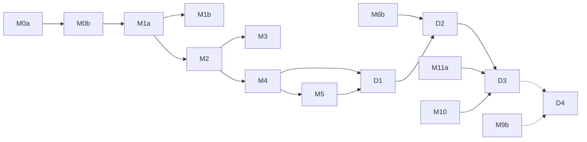

# Research notes — KMP architecture (Android + desktop JVM, iOS door open)

Research area: `kmp-architecture`. Date: 2026-10-05. Scope: how the planned Android-only architecture (`/home/user/Neutrodyne/docs/PLAN.md` §3 D4–D14 and §5; `/home/user/Neutrodyne/docs/design/01-foundation.md`) becomes Kotlin Multiplatform with an Android app and a desktop app (Windows, macOS, Linux on the JVM), without closing the door to iOS. Desktop playback, desktop media keys/notifications, the sync server and release packaging are owned by other researchers and are only touched where they constrain the architecture.

Versions were checked on 2026-10-05 against Maven Central / Google Maven metadata, Gradle module metadata (`.module` files) and official docs. Anything not checked against a primary source is marked **Unverified**.

---

## Recommendation

1. **Restructure from M0, not later.** Nothing is coded yet, so going KMP now costs mostly build logic and library choices; retrofitting it after M3 would mean rewriting most modules. Every shared module becomes a KMP module with two targets: `android` (AGP 9's `com.android.kotlin.multiplatform.library`) and `jvm("desktop")`. There are two app shells: the existing `:app` (`com.android.application`, kept as is: built-in Kotlin, ABI splits, debug builds) and a new `:desktopApp` (Kotlin/JVM plus the Compose Multiplatform application plugin). **No iOS target is added now.**
2. **Write in `commonMain` first. JVM-only code goes into small plain-JVM "islands", and nowhere else.** Kotlin does not officially support a shared JVM+Android source set ([KMP hierarchy docs](https://kotlinlang.org/docs/multiplatform/multiplatform-hierarchy.html)). So a library that exists only for the JVM (kxml2/XmlPullParser, jsoup, the OkHttp client builder) lives in a pure `kotlin("jvm")` module. That module is consumed from both `androidMain` and `desktopMain` and sits behind an interface declared in `commonMain`. Android-only frameworks stay in Android-only modules or in `androidMain`:
   - Media3
   - WorkManager and UIDT jobs
   - Chaquopy and AIDL (the Android-KMP plugin does not support AIDL)
   - ACRA, Auto Backup and `ContentProvider`s
3. **Pick KMP libraries for `commonMain`:**
   - Compose Multiplatform **1.12.1**. It is built on Jetpack Compose 1.12.1, which is exactly what the plan's BOM 2026.09.00 gives Android.
   - JetBrains **material3 1.9.0** and **material3-adaptive-navigation-suite 1.9.0**. On Android these resolve to androidx material3 1.4.0, the plan's D6 choice. Every newer multiplatform material3 is an alpha of the Expressive 1.5.0 line.
   - **adaptive / adaptive-navigation3 1.3.0-rc01**. On Android this resolves to the stable androidx 1.3.0; only the desktop binaries are an rc.
   - Google's KMP **navigation3-runtime 1.2.0**, plus JetBrains **navigation3-ui 1.1.2** (stable; Android resolves androidx 1.1.7, and the app can force 1.2.0).
   - JetBrains **lifecycle 2.11.0**, including `lifecycle-viewmodel-navigation3`.
   - **Room 3.0.3** KMP with `BundledSQLiteDriver`, **Paging 3.5.1**, **DataStore 1.2.1**, **Coil 3.6.3**.
   - **Ktor client 3.6.0** as the HTTP API in common code, running on the OkHttp engine with the plan's single `OkHttpClient` passed in as `preconfigured`. OkHttp **5.5.0** stays the transport on both JVM targets. Media3 and Coil keep using OkHttp directly.
   - **Okio 3.18.2** for files and hashing; **kotlinx-datetime 0.8.0** together with `kotlin.time.Instant`.
4. **Replace Hilt with Metro 1.4.5.** Metro checks the graph at compile time, supports KMP, and keeps Dagger's `@Binds`/multibinding/assisted-injection model with Anvil-style `@ContributesTo`. It supports Kotlin 2.4.20 from Metro 1.2.0. Because minSdk is 26, `metrox-android` (which needs minSdk 28) is not used: Activities, Services and Workers get member injection and a Metro-built `WorkerFactory` instead. Koin 4.2.2 with its compiler plugin is the fallback.
5. **Background work on desktop runs in-process.** One coroutine scheduler in the app process drives refresh, downloads, the update check and artwork sync. It reads the DB-persisted `nextRefreshAt` and the download rows the plan already designs as the source of truth. Around it:
   - A single-instance lock is required, because Room's multi-instance invalidation is Android-only.
   - Closing the window can keep the app running in the tray or menu bar.
   - "Start at login" is optional (Windows Run key, macOS `SMAppService.mainApp`, XDG autostart).
   - There is no separate background daemon in desktop v1.
6. **Roadmap.** Android v1.0 stays the release gate:
   - **M0** is KMP-structured and builds and smoke-tests an empty desktop shell in CI.
   - **M1–M3** features land in `commonMain` and reach desktop for free.
   - Four new desktop milestones run beside or after the Android track: **D1** desktop playback, **D2** desktop background work and OS integration, **D3** desktop packaging and release, and **D4** a desktop YouTube engine (v1.x).
   - Desktop ships "external YouTube only" until D4.
   - Estimated cost of the KMP structure on the Android v1.0 path: **+6–9 engineer-weeks (≈ +15–25 %)**. Desktop parity after that: **+10–16 weeks**. Both are Unverified planning estimates.
7. **Licensing:**
   - **Allowing LGPL would not materially simplify the KMP architecture.** Every KMP building block above is Apache-2.0 or MIT. JNA can be used under its Apache-2.0 option, and dbus-java is MIT. LGPL only matters for desktop media back-ends, which belong to the playback research.
   - **The real conflict is the Java runtime.** Any normal desktop installer (jpackage/jlink) bundles an OpenJDK runtime licensed **GPL-2.0 with the Classpath Exception**. D3 forbids that ("no GPL … anywhere", "every shipped binary"), and the plan already banned the GPL+CE desugaring runtime.
   - **There is a compliant option: ship the app's JARs without a JRE, and have users install a Java 21+ runtime themselves** (Temurin, or the distro's OpenJDK). Recommended default until the owner decides; it has real UX costs on macOS and Windows. A one-click installer needs an explicit, narrowly scoped D3 amendment (owner question Q1).
   - ProGuard is GPL-2.0, so Compose's ProGuard "release" packaging tasks must not be used.
8. **iOS:** keep `commonMain` free of `java.*` and pick KMP libraries, and nothing more. iOS distribution without the Apple Developer Program is limited to free provisioning that expires after 7 days. That conflicts with the owner's no-registration stance, so iOS work is not worth paying for now.

---

## Options considered (trade-off table)

### A. Overall structure

| Option | What it means | Pros | Cons | Verdict |
|---|---|---|---|---|
| **A1. KMP modules, `commonMain` first, JVM islands (recommended)** | Every shared module is KMP (`android` + `jvm("desktop")`). JVM-only libraries live in pure-JVM modules consumed from `androidMain`/`desktopMain`. | Officially supported model; iOS door stays open; Room/DataStore/Paging/Lifecycle/Compose are already KMP; DB and logic tests run on the desktop JVM without Robolectric | Interfaces at a few seams (XML parser, HTML sanitizer, OkHttp builder); Compose resources replace Android `R.string`; Hilt must go | **Recommended** |
| A2. KMP with a hand-made `jvmShared` source set (android + desktop) | Put OkHttp/jsoup/kxml2 code in an intermediate source set shared by `androidMain` and `desktopMain` | Least code splitting | "Kotlin doesn't currently support sharing a source set for … JVM + Android targets" ([docs](https://kotlinlang.org/docs/multiplatform/multiplatform-hierarchy.html)); IDE and metadata-compilation surprises; closes the iOS door for that code | Rejected |
| A3. "All JVM": shared logic in plain `kotlin("jvm")` modules; only UI modules KMP | Both shipping targets run on the JVM | Minimal change to the plan's "pure JVM" modules | Room, DataStore and Lifecycle need platform variants, so data modules end up KMP anyway; a JVM module compiled against desktop variants and run with Android variants is fragile; no iOS path | Rejected |
| A4. Separate desktop codebase, or desktop only after v1.0 | Ship Android as planned, then port | No impact on the Android schedule | Expensive retrofit (Hilt, `R.string`, Android types in every module); desktop delayed by 6+ months | Rejected (the owner asked for desktop as a build target) |

### B. Dependency injection (Hilt is Android-only)

| Option | Version (2026-10) | Compile-time safety | KMP | Android integration without Hilt | Risk |
|---|---|---|---|---|---|
| **Metro (recommended)** | 1.4.5 (2026-09-24) | Yes (compiler plugin) | Yes; `metrox-viewmodel-compose` publishes jvm, iOS, macOS, JS and wasm variants | `metrox-android` (AppComponentFactory) **needs minSdk 28**, so member injection is used for Activity/Service; WorkerFactory via multibinding | Compiler plugin coupled to Kotlin versions ("N+.2 best effort"); essentially a one-maintainer project (Unverified) |
| Koin + Koin Compiler Plugin | Koin 4.2.2 (2026-06-15); compiler plugin 1.2.1 (2026-09-10) | Yes with the plugin (also a compiler plugin) | Yes | Mature (`koin-android`, WorkManager support) | Service-locator style at runtime; graph verification is newer than Koin itself |
| kotlin-inject + kotlin-inject-anvil | 0.9.0 (2026-01-07) / 0.1.7 (2026-01-27) | Yes (KSP) | Yes | Manual | Slow release cadence; KSP cost |
| Plain Dagger on both JVM targets (Hilt on Android only) | 2.60.1 | Yes | **JVM only** (closes the iOS door) | Hilt on Android, plain Dagger on desktop means two graph styles | Two DI dialects |
| Manual DI | — | Compiler only | Yes | Manual | Boilerplate for about 150 bindings |

### C. HTTP API in common code

| Option | Pros | Cons | Verdict |
|---|---|---|---|
| **Ktor client 3.6.0 in `commonMain`, OkHttp engine with `preconfigured` (recommended)** | Common code can do HTTP; one OkHttp pool, DNS hints and interceptors still serve Ktor, Media3 and Coil; Darwin engine for a future iOS; the sync client can share DTOs with a Ktor server | Second API surface; `NetErrorClassifier` must also map Ktor exception types; manual redirects for feed-move chains | **Recommended** |
| OkHttp only, with HTTP-using code in JVM islands | Matches D10 exactly | Most of the data layer (fetcher, downloads, directories, update check, sync) cannot live in `commonMain` | Rejected |
| Ktor with the CIO engine everywhere | Pure Kotlin | Loses OkHttp's maturity and the Media3/Coil sharing; HTTP/2 not supported by CIO ([Ktor engines](https://ktor.io/docs/client-engines.html)) | Rejected |

### D. Desktop runtime and packaging (licensing; detail with the distribution research)

| Option | GPL in shipped artefacts? | UX | Verdict |
|---|---|---|---|
| **D-a. BYO-JRE: per-OS JAR distribution (Compose `packageUberJarForCurrentOS`, or an app JAR set plus launchers), user installs Java ≥ 21** | **None** (the user's own runtime) | Extra install step on Windows and macOS; poor OS integration on macOS/Windows: no `.app` bundle, so no URL scheme, Dock name "java", taskbar grouping (Unverified details) | **Default while D3 stands** |
| D-b. jpackage/jlink-bundled runtime (MSI/EXE, DMG/PKG, DEB/RPM) | **Yes**: OpenJDK runtime, GPL-2.0 + Classpath Exception (the HotSpot VM itself is reportedly plain GPL-2.0 per file headers; Unverified) | Normal installers; file associations, URL schemes, bundle ID | Needs a scoped D3 amendment (owner Q1) |
| D-c. A launcher that downloads a Temurin JRE from Adoptium on first run | None shipped by us (Adoptium distributes) | Native launcher per OS (unsigned, so Gatekeeper/SmartScreen still apply); a privacy host to add to N3 | Possible middle path; extra engineering (Unverified UX) |
| D-d. GraalVM Native Image | Yes (the JDK class library and SubstrateVM are GPL-2.0 + CE) | Fast start | Compose/AWT native-image support immature; still GPL+CE: rejected |
| D-e. Kotlin/Native desktop UI | None | — | Compose has no Windows/Linux native target: not viable |

---

## Technical detail

### 1. Target and version matrix

| Item | Choice | Notes |
|---|---|---|
| Kotlin (KGP, KMP plugin, Compose compiler, serialization) | 2.4.20 (unchanged, D4) | KMP plugin 2.4.20 is tested with Gradle 7.6.3–9.7.0 and AGP 8.5.2–9.3.1 ([compat guide](https://kotlinlang.org/docs/multiplatform/multiplatform-compatibility-guide.html)): the same AGP 9.4.1 gap that the plan's spike S1 already covers |
| AGP | 9.4.1 (fallback 9.3.3) | Shared modules use `com.android.kotlin.multiplatform.library`; `:app` stays `com.android.application` |
| Compose Multiplatform Gradle plugin `org.jetbrains.compose` | 1.12.1 (Sept 2026) | Built on Jetpack Compose 1.12.1 ([CMP changelog](https://github.com/JetBrains/compose-multiplatform/blob/master/CHANGELOG.md)). Its dependency aliases (`compose.ui`) are deprecated since 1.10, so coordinates go in the catalog |
| UI core | `org.jetbrains.compose.{runtime,ui,foundation,animation}:*:1.12.1` | Android resolves `androidx.compose.*` 1.12.1 (= BOM 2026.09.00) |
| Material 3 | `org.jetbrains.compose.material3:material3:1.9.0`, `material3-adaptive-navigation-suite:1.9.0` | Android variant depends on `androidx.compose.material3:material3:1.4.0` / `…navigation-suite:1.4.0` (module metadata). Desktop binaries were built against Compose 1.9.1, so binary compatibility with 1.12.1 needs a spike (S9). Newer CMP material3 (1.12.0-alpha03) is Jetpack 1.5.0-alpha22 (Expressive), rejected by PO-4 |
| Adaptive | `org.jetbrains.compose.material3.adaptive:adaptive*:1.3.0-rc01` incl. `adaptive-navigation3` | Android variant depends on stable `androidx…adaptive-navigation3:1.3.0`; desktop variant is the rc build |
| Navigation 3 | `androidx.navigation3:navigation3-runtime:1.2.0` (Google, KMP incl. desktop) + `org.jetbrains.androidx.navigation3:navigation3-ui:1.1.2` | JetBrains 1.1.2's Android variant resolves androidx `navigation3-ui:1.1.7`; JetBrains 1.2.0-beta01 is the newest. Google's `navigation3-ui` is Android-only (plus JVM stubs) |
| Lifecycle | `org.jetbrains.androidx.lifecycle:lifecycle-{viewmodel-compose,runtime-compose,viewmodel-navigation3}:2.11.0` | Matches the plan's lifecycle 2.11.0 |
| Room 3 | `androidx.room3:room3-{runtime,paging,testing}:3.0.3` (+ compiler via KSP per target) | jvm variants exist; `androidx.sqlite:sqlite-bundled:2.7.1` |
| Paging | `androidx.paging:paging-{common,compose}:3.5.1` | `paging-compose` has a desktop variant |
| DataStore | `androidx.datastore:datastore-preferences-core:1.2.1` | Only Preferences DataStore is KMP ([docs](https://developer.android.com/kotlin/multiplatform/datastore)) |
| Images | Coil 3.6.3 (`coil`, `coil-compose`, `coil-network-okhttp`) | `coil-network-okhttp` publishes androidJvm + jvm; `coil-network-ktor3` exists for iOS later |
| HTTP | Ktor client 3.6.0 (`ktor-client-core`, `ktor-client-okhttp`; `ktor-client-darwin` for iOS later) over OkHttp 5.5.0 | `ktor-client-okhttp` is JVM-only (used from `androidMain`/`desktopMain`, or from the `:core:network:okhttp` JVM island) |
| IO / time / serialization | Okio 3.18.2; kotlinx-datetime 0.8.0 + `kotlin.time.Instant/Clock` (stable since Kotlin 2.3.0, [what's new 2.3](https://kotlinlang.org/docs/whatsnew23.html)); kotlinx-serialization 1.11.0; coroutines 1.11.0 (+ `kotlinx-coroutines-swing` on desktop for `Dispatchers.Main`) | Compose desktop does not pull in coroutines-swing (it depends on `kotlinx-coroutines-core` only), so it must be added explicitly |
| DI | Metro 1.4.5 (`dev.zacsweers.metro` Gradle plugin + runtime; `metrox-viewmodel`, `metrox-viewmodel-compose`) | Replaces Hilt 2.60.1, androidx.hilt 1.4.0 and Dagger in the JVM modules |
| Other KMP-ready libraries already in the plan | `material-color-utilities` 5.0.1, `reorderable` 3.1.0, `kotlinx-collections-immutable` 0.5.2, Turbine 1.2.1, AboutLibraries core 15.2.0 | Module metadata shows common/jvm/native variants for each |
| Desktop runtime | JDK ≥ 17 to package, ≥ 11 to run ([CMP compat](https://kotlinlang.org/docs/multiplatform/compose-compatibility-and-versioning.html)); the plan's bytecode 17 means a **Java 17+ runtime; recommend requiring 21 LTS** | See §15 for the licensing consequences |
| Desktop OS support (CMP 1.12.1) | Windows 10 x86-64/arm64; **macOS 13 arm64 only**; Linux (Ubuntu 20.04) x86-64/arm64; 64-bit only | `sqlite-bundled-jvm` 2.7.x ships natives only for linux_arm64, linux_x64, osx_arm64 and windows_x64 (no osx_x64, no windows_arm64; 2.6.2 still had osx_x64) — checked in the JARs |

### 2. Build setup (AGP 9 + KMP)

- **Why the app shells must be separate.** Under AGP 9, "the Kotlin Multiplatform Gradle plugin stops being compatible with the `com.android.application` and the `com.android.library` plugins" ([JetBrains AGP 9 migration](https://kotlinlang.org/docs/multiplatform/multiplatform-project-agp-9-migration.html)). Entry points therefore live in their own modules: `:app` (Android) and `:desktopApp`.
- **What the Android-KMP library plugin does and does not support.** The plugin (`com.android.kotlin.multiplatform.library`, min AGP 8.10, [Android docs](https://developer.android.com/kotlin/multiplatform/plugin)) has a single variant:
  - No build types, product flavors or `BuildConfig`. `BuildInfo` already comes from `:app`, so nothing is lost.
  - No AIDL, RenderScript or `externalNativeBuild`.
  - Android resources are opt-in (`androidResources { enable = true }`).
  - Host and device tests are opt-in (`withHostTestBuilder {}`, `withDeviceTestBuilder {}`; source sets `androidHostTest` / `androidDeviceTest`).
  - Java compilation is opt-in, and consumer keep rules must be enabled explicitly.
- **Modules that must stay `com.android.library`:**
  - `:youtube:ytdlp`: Chaquopy plus the AIDL interface `IYtxEngine`.
  - `:playback:impl` (Media3): Android-only anyway; keeps its `lint.xml` opt-in rule.
  - `:benchmark` stays `com.android.test`.
- **Built-in Kotlin** covers only `:app` and the Android-only library modules. KMP modules apply `org.jetbrains.kotlin.multiplatform` explicitly. The ban on `org.jetbrains.kotlin.android` stays.
- **New convention plugins** (sketch; names follow 01's scheme):

| Plugin | Applies | Notes |
|---|---|---|
| `neutrodyne.kmp.library` | `org.jetbrains.kotlin.multiplatform`, `com.android.kotlin.multiplatform.library`; targets `android { namespace = "ch.lkmc.neutrodyne"+path; compileSdk = 37; minSdk = 26 }` + `jvm("desktop")`; `jvmTarget = 17`; `applyDefaultHierarchyTemplate()` | Replaces `neutrodyne.jvm.library` and `neutrodyne.android.library` for shared modules |
| `neutrodyne.kmp.compose` | + `org.jetbrains.kotlin.plugin.compose`, `org.jetbrains.compose`; `compose.resources { publicResClass/packageOfResClass }`; `androidResources.enable = true` (Compose resources on the Android-KMP target need it, [resources setup](https://kotlinlang.org/docs/multiplatform/compose-multiplatform-resources-setup.html)); stability config file | Replaces `neutrodyne.android.compose` for shared UI |
| `neutrodyne.kmp.feature` | kmp.compose + Metro + the feature dependency set | Replaces `neutrodyne.android.feature` |
| `neutrodyne.metro` | `dev.zacsweers.metro` | Replaces `neutrodyne.hilt` |
| `neutrodyne.room` (amended) | `androidx.room3` + KSP with `kspAndroid` / `kspDesktop`; `@ConstructedBy` + `expect object …Constructor` ([Room KMP](https://developer.android.com/kotlin/multiplatform/room)) | Schema directory unchanged |
| `neutrodyne.desktop.application` | `org.jetbrains.kotlin.jvm`, `org.jetbrains.compose`, `kotlin.plugin.compose`; `compose.desktop.application { mainClass; nativeDistributions { packageName="Neutrodyne"; macOS.bundleID="ch.lkmc.neutrodyne"; windows.upgradeUuid=<fixed>; linux.packageName="neutrodyne" } }` | **Never registers or runs the ProGuard `*Release*` packaging tasks** (ProGuard is GPL-2.0, §15) |

- **Policy tasks (01 "Gradle-side policy tasks"):**
  - Licensee supports `org.jetbrains.kotlin.multiplatform` ([README](https://github.com/cashapp/licensee)). Apply it in `:app` and `:desktopApp`; the desktop runtime classpath gets the same allow-list.
  - module-graph-assertion documents a KMP section ([README](https://github.com/jraska/modules-graph-assert)); whether it handles KMP `api`/`implementation` per source set is Unverified, so S8 checks it.
  - `checkBannedApis` gains per-source-set rules:
    - no `android.*` in `commonMain` (the compiler already enforces this);
    - `ProcessBuilder`/`Runtime.exec` allowed only in a future `youtube/ytdlp-desktop/` (D4);
    - `java.awt.Desktop` allowed only in `desktopMain` of the platform module.
- **CI** (09):
  - The `unit` job adds `desktopTest`.
  - `assemble` adds `:desktopApp:packageUberJarForCurrentOS`. It needs no jpackage and could build all three per-OS JARs on Linux by depending on each OS's Skiko runtime artifact (Unverified that the Compose plugin allows a non-current-OS uber JAR; a manual `shadowJar`-style task works otherwise).
  - `nightly` adds macOS and Windows runners for a desktop smoke test.
  - jpackage installers can only be built on their own OS ("Cross-compilation is currently not supported", [native distributions](https://kotlinlang.org/docs/multiplatform/compose-native-distribution.html)).

### 3. Module layout (proposed)

Rule of thumb: **contracts and logic go in `commonMain`; platform frameworks go in `androidMain`/`desktopMain` or in Android-only modules; JVM-only third-party libraries go in pure-JVM island modules.**

| Module | Today (plan) | Proposed | Source sets / notes |
|---|---|---|---|
| `:core:model` | JVM | KMP, common-only | Deeply immutable models; `compose-stability.conf` unchanged |
| `:core:common` | JVM | KMP | `Outcome`, `suspendRunCatching`, `Clock`, `Log`, `Redactor` in common (its `java.net.URI` use is replaced by Ktor's `Url` or a small parser). `javax.inject` qualifiers become **Metro** `@Qualifier` annotations, because `javax.inject` is JVM-only. `AppDirs` in `desktopMain` |
| `:core:domain`, `:playback:api`, `:download:api`, `:youtube:api` | JVM | KMP, common-only | Interfaces plus `paging-common` (KMP) |
| `:core:navigation` | Android lib | KMP | Keys, `AppNavigator`, `NdSceneMetadata`, plus **one `SerializersModule` listing every `NavKey`** (needed by `rememberNavBackStack(SavedStateConfiguration, …)` on non-Android, [CMP Nav3](https://kotlinlang.org/docs/multiplatform/compose-navigation-3.html)) |
| `:feeds` | JVM | **Split**: `:feeds` (KMP common) + `:feeds:jvm` (JVM island) | Common part: `ParsedFeed` models, `EpisodeKeys`, `UrlNormalizer`, `FeedDates` (kotlinx-datetime), OPML/backup models, add-input normalizers, the `FeedParser`/`OpmlReader`/`ShowNotesSanitizer` interfaces. Island: the hand-written `XmlPullParser` parser (Android platform parser; kxml2 as a **runtime** dependency on desktop), the OPML pull-parser cascade, and the jsoup sanitizer. Later iOS port: xmlutil 1.0.2 (Apache-2.0; its cross-platform reader "is derived from the Android implementation", [README](https://github.com/pdvrieze/xmlutil)) + Ksoup 0.2.6 (MIT). Relaxed mode and HTML-entity predefinition on xmlutil are Unverified |
| `:core:database` | Android lib | KMP | Entities, DAOs, migrations, `TableRebuild`, `FeedQueryBuilder` (`@RawQuery` → `PagingSource` via `room3-paging`'s `PagingSourceDaoReturnTypeConverter`) in common. `DatabaseOpener` builder per platform (Android `Context` path; desktop file under `AppDirs.data`). Migration and DAO tests run in `desktopTest` |
| `:core:datastore` | Android lib | KMP | `settings` / `device_settings` split unchanged; file paths per platform |
| `:core:network` | Android lib | KMP + JVM island `:core:network:okhttp` | Common: `HttpClient` factory (Ktor), `NetError` taxonomy, `NetworkMonitor` interface. Island: the OkHttp client family, interceptors, `DnsFamilyHints`, local-network guard. `ConnectivityNetworkMonitor` in `androidMain`; desktop monitor in `desktopMain` |
| `:core:data` | Android lib | KMP | Repositories, ingestion diff, `FeedRefresher`, `FetchStateBatcher`, `CredentialLookup` and `AppUpdateChecker` logic in common. WorkManager workers (`RefreshWorker`, `UpdateCheckWorker`, …) in `androidMain`. `DesktopJobRunner` bindings in `desktopMain` |
| `:core:artwork` | Android lib | KMP | `ArtworkStore` on Okio and Coil components in common; `ArtworkProvider` (`ContentProvider`, D42) in `androidMain` only |
| `:core:designsystem`, `:core:ui` | Android lib | KMP Compose | Dynamic colour (`dynamicLightColorScheme(context)`) behind `expect`; desktop uses the brand/artwork schemes. `UiText.Res` holds a Compose `StringResource` instead of `@StringRes Int` |
| `:core:testing` | Android lib | KMP | Fakes in `commonMain`; Android-only helpers in `androidMain` |
| `:feature:*` | Android lib | KMP Compose | Screens and ViewModels in common. Android-only actions (share sheet, SAF picker, notification-permission prompt) go behind small `:core:ui` interfaces with platform implementations |
| `:playback:impl` | Android lib | **Stays Android-only (Media3)**; new `:playback:core` (KMP) and `:playback:desktop` | `:playback:core`: queue/play-context rules, position-saving policy, sleep-timer and chapter logic, effective-settings use. The split along `QueueProjector`'s Media3 boundary is owned by the playback research |
| `:download:impl` | Android lib | KMP | Engine, state machine, transfer core (Ktor streaming into Okio `.part` files, Range/If-Range), planner and cleanup in common. UIDT `JobService` and WorkManager lanes plus manifest entries in `androidMain`; in-process lanes in `desktopMain` |
| `:youtube:impl` | Android lib | KMP | Layer A (channel resolution, Atom feeds) over Ktor in common |
| `:youtube:ytdlp` | Android lib + Chaquopy + AIDL | Unchanged (Android-only) | Desktop engine is a later `:youtube:ytdlp-desktop` (JVM, §16) |
| `:app` | Android app | Android app; Metro graph replaces Hilt | Keeps build types, ABI splits, signing, ACRA, Auto Backup rules, intent routing |
| `:desktopApp` (new) | — | JVM app | `main()`, `Window`, `MenuBar`, `Tray`, single-instance lock, Metro desktop graph, `DesktopJobRunner`, crash file writer, packaging config |
| `:sync:protocol`, `:sync:client` (new, owned by sync research) | — | KMP common | kotlinx.serialization DTOs shared with a JVM Ktor server module; client on Ktor |

**Dependency-rule changes (01 rules 1–13):**

- Rule 3 changes from "pure JVM" to "**common-only**": `:core:{model, common, domain}` and `:*:api` have no `androidMain`/`desktopMain` code, except tiny `expect`/`actual` declarations allowed in `:core:common`.
- New rule: JVM islands (`:feeds:jvm`, `:core:network:okhttp`) depend on nothing above infrastructure and may be used only from `androidMain`/`desktopMain` of implementation modules.
- New rule: `:desktopApp` is the second composition root, and nothing depends on it.

### 4. Compose Multiplatform for desktop

- **Status.** Desktop has been stable for years. CMP 1.12.0 (Aug 2026) added an experimental new `WindowState` API, `LocalAwtWindow`, dark-theme polling on Windows/macOS, Hot Reload 1.2.0 and an MCP server for Hot Reload ([changelog](https://github.com/JetBrains/compose-multiplatform/blob/master/CHANGELOG.md)).
- **Material 3 and adaptive layouts.** The plan's components (`NavigationSuiteScaffold`, `PrimaryScrollableTabRow` + `HorizontalPager`, `ModalBottomSheet`, `AnchoredDraggableState` `PlayerSheet`, `ListDetailSceneStrategy`) are all in the multiplatform artifacts above. Desktop windows usually report medium or expanded width classes, so the plan's ≥ 840 dp side-panel player (D56) and list-detail panes become the desktop default. Minimum window size: about 600 × 480 dp (proposal).
- **Window management:** `application { Window(onCloseRequest, state = rememberWindowState(…)) }`, multiple windows possible, window position and size persisted in `device_settings`. In-app sheets and dialogs render as Compose popups/layers. The plan's "window-based `NdModalBottomSheet`" requirement maps to desktop popups; `compose.layers.type=WINDOW` exists (changelog). Unverified: z-order above an expanded `PlayerSheet` must be checked in S9.
- **Tray, menus, notifications.** `Tray(icon, menu, state, tooltip, onAction)` and `trayState.sendNotification(rememberNotification(title, message))`; `MenuBar` in `Window` maps to the macOS global menu bar ([tray docs](https://kotlinlang.org/docs/multiplatform/compose-desktop-tray.html), [components](https://kotlinlang.org/docs/multiplatform/compose-desktop-components.html)). These AWT-based notifications are basic. Rich notifications, media keys (SMTC / MPNowPlayingInfoCenter / MPRIS) and Now Playing belong to the playback research. GNOME shows no AWT tray icon without an AppIndicator extension (Unverified).
- **Desktop UX work the Android design does not cover (M10 desktop slice):**
  - keyboard shortcuts (`onPreviewKeyEvent`; space for play/pause, arrows to seek, Ctrl/Cmd+F for search);
  - hover states and right-click context menus (`ContextMenuArea`) that replace swipe actions and long-press;
  - visible scrollbars (`VerticalScrollbar`, a desktop-only API in `desktopMain`);
  - drag-and-drop of OPML files;
  - Escape as back. How Nav3/NavigationEvent maps Escape on desktop is Unverified.
- **Accessibility.** macOS is "fully supported"; Windows works through Java Access Bridge (off by default; the `jdk.accessibility` module must be in a bundled runtime); **Linux is "not supported"** ([docs](https://kotlinlang.org/docs/multiplatform/compose-desktop-accessibility.html)). N4 (WCAG 2.2 AA, screen reader) therefore cannot be met on Linux desktop, and the owner should accept that as a documented limitation. `ui-test-junit4-accessibility` (ATF) is Android-only, so desktop accessibility checking is a manual VoiceOver/NVDA checklist.
- **Performance:**
  - Rendering is Skia through Skiko (GPU back-ends per OS; Unverified which defaults per OS).
  - The JVM's cold start (≈ 1–2 s) and memory (≈ 250–400 MB RSS) are the main costs (Unverified estimates).
  - Mitigations: a JDK class-data-sharing archive (`-XX:+AutoCreateSharedArchive`, a JDK feature with no extra dependency); keep Coil's memory cache at a fixed size rather than the Android heap percentage; one `ImageLoader`.
  - Measure in D3; no N5-style budget until then.
- **Hot Reload** (dev only) is bundled from CMP 1.12. It is useful for desktop-first UI iteration, which also speeds up Android UI work.

### 5. Navigation

- The plan's mechanics move to `commonMain` unchanged in shape:
  - one `NavBackStack` per top-level tab;
  - `rememberDecoratedNavEntries` per tab;
  - `rememberSaveableStateHolderNavEntryDecorator`;
  - `rememberViewModelStoreNavEntryDecorator`;
  - `NavDisplay` with the overlay strategies and `ListDetailSceneStrategy`.
- **Serialization requirement:** use the `rememberNavBackStack(config: SavedStateConfiguration, …)` overload with a `SerializersModule` registering every key (`polymorphic(NavKey::class) { subclass(…) }`). Reflection-based serialization is unavailable on non-JVM targets ([CMP Nav3](https://kotlinlang.org/docs/multiplatform/compose-navigation-3.html)). Desktop JVM would work without it, but declaring it in M0 keeps iOS open and avoids a later migration. A unit test asserts that every `NavKey` subclass is registered.
- **API level:** `commonMain` sees JetBrains' **1.1.x** API. The plan's needs are 1.1 features: metadata DSL, scene decorators, `NavigationBackHandler`, `DialogSceneStrategy`. The 1.2 deep-link matcher is only optional inside the router. Android can still run androidx 1.2.0 by declaring it in `:app` (Gradle picks the higher version). Move to JetBrains 1.2.x when it is stable.
- **Intent routing:** stays in `:app`. Desktop routing (`podcast://`, `feed:` URLs, `.opml` files) arrives through:
  - `java.awt.Desktop.setOpenURIHandler` / `setOpenFileHandler` on macOS (works only in a bundled `.app` with `CFBundleURLTypes`);
  - command-line arguments on Windows and Linux;
  - a second launch forwarding its arguments over the single-instance channel.

  All of these reuse the same `IntentRouter` rules ("routes only navigate").

### 6. Lifecycle, ViewModels and threading

- **ViewModels are KMP** (`androidx.lifecycle:lifecycle-viewmodel` publishes jvm/native/js variants). The JetBrains 2.11.0 artifacts add Compose integration and `lifecycle-viewmodel-navigation3`. `SavedStateHandle` is KMP (savedstate 1.4.0).
- `viewModelScope` needs `Dispatchers.Main`: on desktop that is `kotlinx-coroutines-swing` 1.11.0 (the Swing EDT).
- `collectAsStateWithLifecycle` works on desktop. Window minimise and restore map to lifecycle events (Unverified exact mapping).
- The plan's threading table holds, with two desktop differences:
  - Room's query context is set with `setQueryCoroutineContext(Dispatchers.IO)` on both platforms.
  - The Media3 "main looper" rules stay Android-only.

### 7. Persistence

- **Room 3 KMP:**
  - Room 3 "focuses on Kotlin Multiplatform"; it needs a `SQLiteDriver`, KSP, coroutine DAOs and `withWriteTransaction` ([Room 3 release notes](https://developer.android.com/jetpack/androidx/releases/room3)).
  - Not available outside Android: `setQueryCallback`, `setAutoCloseTimeout`, prepackaged databases and **multi-instance invalidation** ([Room KMP](https://developer.android.com/kotlin/multiplatform/room)). The plan uses none of the first three, and the last one is the reason desktop must be **single-process**.
  - `BundledSQLiteDriver` on desktop JVM ships its own SQLite natives for linux x64/arm64, macOS arm64 and Windows x64 only.
- **Tests:**
  - DAO, migration and `MigrationTestHelper` tests (`room3-testing` has jvm variants) run in `desktopTest` on the CI host with the real bundled driver, without Robolectric. The plan's S4 workaround (Robolectric needing `AndroidSQLiteDriver` because the bundled `.so` files are device ABIs) is then only needed for Android-specific integration tests.
  - The GMD instrumented run keeps the Android driver honest.
- **Paging:** `paging-common` and `paging-compose` 3.5.1 are KMP. `collectAsLazyPagingItems()` works on desktop.
- **DataStore:** `datastore-preferences-core` 1.2.1 KMP; desktop uses `FileStorage(PreferencesSerializer, produceFile = { AppDirs.config / "settings.preferences_pb" })` ([docs](https://developer.android.com/kotlin/multiplatform/datastore)). D35's split holds. Auto Backup (D34) is Android-only.

### 8. Networking (D10 amended)

- **One transport.** `:core:network:okhttp` (JVM island) builds the plan's `OkHttpClient` family on both JVM targets. `:core:network` (common) exposes Ktor `HttpClient`s created with `HttpClient(OkHttp) { engine { preconfigured = derivedClient } }` ([Ktor engines](https://ktor.io/docs/client-engines.html)). On a future iOS the same factory uses `Darwin`.
- **Direct OkHttp users stay:** Media3's `OkHttpDataSource` (Android) and Coil's `OkHttpNetworkFetcherFactory` (both JVM targets) use the island's client directly, so D10's "one client family" still holds.
- **Fetch pipeline (03):**
  - conditional GET with stored validators: plain headers;
  - redirect chains for feed moves: `followRedirects = false` plus a manual loop that records each 301/308 hop (the plan needs the chain);
  - streaming to a temp file with SHA-256: `bodyAsChannel()` into an Okio `HashingSink`;
  - the 32 MB cap: count bytes in the copy loop;
  - cancellation: coroutine cancellation cancels the OkHttp call.
  - `NetErrorClassifier` maps both `java.io` exceptions (from the island) and Ktor's timeout types.
  - Spike S12 checks all of this against MockWebServer.
- **Downloads (07):** the transfer core (Range/If-Range, `Accept-Encoding: identity`, `.part` → verify → rename) is plain HTTP plus Okio `FileSystem`, so it fits `commonMain`. Runners stay per platform.

### 9. Images, serialization, time

- **Coil 3** is KMP. The `ArtworkRef` mapper (pinned file first) and the YouTube thumbnail interceptor live in common code.
  - `ArtworkStore` files use Okio paths.
  - Memory cache sizing differs: a fixed MB budget on desktop, because the Android heap percentage is meaningless there.
- **kotlinx-serialization** is unchanged and already KMP.
- **Time.** Use `kotlin.time.Instant`/`Clock` (stable in Kotlin 2.3.0) and kotlinx-datetime 0.8.0. `FeedDates`' custom RFC 822 algorithm moves to common code (it already avoids `DateTimeFormatter`).
- **Gap: localised date formatting is not in kotlinx-datetime.** "5 Oct 2026" for the UI therefore needs a small `expect` `DateFormatter` (`java.time.format` on both JVM targets, `NSDateFormatter` later). Unicode NFC normalisation for group-name uniqueness (R2.1) also needs `expect`/`actual` (`java.text.Normalizer` on the JVM).

### 10. Dependency injection with Metro (D8 replaced)

| Hilt concept in 01 | Metro equivalent |
|---|---|
| `@HiltAndroidApp`, `SingletonComponent` | `@DependencyGraph(AppScope::class) interface AndroidAppGraph` in `:app`, created in `NeutrodyneApplication.onCreate` (only in the main process); `DesktopAppGraph` in `:desktopApp` |
| `@Module @InstallIn(SingletonComponent)` + `@Binds` | `@ContributesTo(AppScope::class)` interfaces with `@Binds`, or `@ContributesBinding(AppScope::class)` on the implementation |
| `@IntoSet` (`Set<AppInitializer>`, `Set<EntryProviderInstaller>`) | `@ContributesIntoSet`; `@Multibinds` for empty sets (rule 5 maps directly) |
| `@HiltViewModel` + assisted key | `metrox-viewmodel(-compose)`: `ViewModelAssistedFactory` / `@ViewModelKey` + `metroViewModel()` ([MetroX ViewModel](https://zacsweers.github.io/metro/latest/metrox-viewmodel/)); the per-entry ViewModel store decorator is unchanged |
| `@AndroidEntryPoint` Activity/Service/Receiver | `metrox-android` needs **minSdk 28** ([MetroX Android](https://zacsweers.github.io/metro/latest/metrox-android/)), and the plan's minSdk is 26, so use **member injection** instead: `appGraph.inject(this)` in `onCreate`/`onReceive`, with `@Inject lateinit var` fields of `Lazy<…>` types (01 rule 7 unchanged) |
| `@HiltWorker` + `HiltWorkerFactory` | A `WorkerFactory` built from a multibound `Map<String, (Context, WorkerParameters) -> ListenableWorker>` (`@ContributesIntoMap`), installed through `Configuration.Provider` |
| `ArtworkProvider` `@EntryPoint` | Lazy graph lookup through `(context.applicationContext as GraphHolder).graph` in `openFile` |
| `:ytx` process (`YtxService`) | A separate small `YtxGraph` created only in the `:ytx` process (no DB or DataStore bindings, as today) |
| `@TestInstallIn(replaces = …)` | Test graphs and `replaces` on contributions (Unverified exact API; S8) |
| `javax.inject` in JVM modules | Metro's KMP annotations in common code |

Metro facts: 1.4.5 (2026-09-24); Kotlin 2.4.20 supported "1.2.0 –" ([compatibility](https://zacsweers.github.io/metro/latest/compatibility/)); Apache-2.0. A side benefit: Hilt and Dagger's KSP processors leave the build, so KSP remains only for Room.

### 11. Background work on desktop (D14, D25, D47 amended)

- **`DesktopJobRunner`** (in `:core:data/desktopMain`, plus lanes from `:download:impl/desktopMain`) runs in `@ApplicationScope` with a 60 s tick. On each tick it:
  - refreshes due feeds (per-feed `nextRefreshAt`, backoff, the 6-global/2-per-host fan-out: all unchanged and already in common code);
  - runs the daily update check and artwork sync;
  - works the download lanes. Rows in the DB are the only state (D46), so a crash or quit simply resumes on the next start.
- **Not needed on desktop:** the 8-minute soft deadlines and continuations, which exist because of Android quotas. Keep them as harmless no-ops.
- **Sleep and wake:** the next tick catches up from the persisted times.
- **Constraints:**
  - Desktop has no reliable metered-network signal from the JVM (Unverified, per OS: Windows has a metered-connection API, macOS has Low Data Mode, Linux NetworkManager has a `Metered` property). Treat desktop networks as **unmetered** by default and show "Wi-Fi only" policies as not applicable on desktop.
  - "Requires charging" is ignored on desktop.
- **Lifecycle:**
  - A single-instance lock (`FileChannel.tryLock` on `AppDirs.state/instance.lock`) plus a loopback handshake that forwards arguments to the running instance.
  - "Keep running in the background when the window is closed" (tray / menu bar).
  - Optional "Start at login, minimised":
    - **Windows:** `HKCU\Software\Microsoft\Windows\CurrentVersion\Run` value, written without shelling out (JNA platform under its Apache-2.0 licence, or a Startup-folder `.lnk`). Unverified implementation detail.
    - **macOS 13+:** `SMAppService.mainApp.register()` ([Apple](https://developer.apple.com/documentation/servicemanagement/smappservice)). Needs native interop and an `.app` bundle; Unverified for an unsigned or ad-hoc-signed app.
    - **Linux:** `~/.config/autostart/neutrodyne.desktop` ([XDG autostart](https://specifications.freedesktop.org/autostart/latest/)).
- **No separate background agent in v1.** It would need IPC and a second DB writer, and Room KMP has no multi-instance invalidation outside Android.

### 12. Notifications and media keys (owned by playback research — boundary only)

- `:playback:api` and the notifier interfaces (`NewEpisodeNotifier`, `UpdateNotifier`) stay in `commonMain`.
- Android implementations: notification channels (D36), `MediaSession`.
- Desktop implementations: tray notifications at minimum; system media controls (SMTC on Windows, MPNowPlayingInfoCenter on macOS, MPRIS over D-Bus with dbus-java 5.2.2, MIT) are the playback researcher's choice.
- None of this needs LGPL: dbus-java is MIT, and JNA is dual LGPL-2.1+/Apache-2.0 (POM), usable under Apache-2.0.

### 13. File storage paths per OS (D48/D49 amended for desktop)

| Purpose | Windows | macOS | Linux |
|---|---|---|---|
| Database, artwork store, `settings`/`device_settings` | `%LOCALAPPDATA%\Neutrodyne\` (non-roaming; large data) | `~/Library/Application Support/ch.lkmc.neutrodyne/` | `$XDG_DATA_HOME/neutrodyne` (default `~/.local/share`) for the DB and artwork; `$XDG_CONFIG_HOME/neutrodyne` (default `~/.config`) for DataStore |
| Caches (Coil disk cache, streaming cache) | `%LOCALAPPDATA%\Neutrodyne\Cache\` | `~/Library/Caches/ch.lkmc.neutrodyne/` | `$XDG_CACHE_HOME/neutrodyne` (default `~/.cache`) |
| Logs, lock file, crash files | `%LOCALAPPDATA%\Neutrodyne\Logs\` | `~/Library/Logs/Neutrodyne/` | `$XDG_STATE_HOME/neutrodyne` (default `~/.local/state`) |
| Downloads (default, user-changeable) | `%LOCALAPPDATA%\Neutrodyne\Downloads\` or the user's Music folder | `…/Application Support/ch.lkmc.neutrodyne/Downloads/` (Music and Downloads may trigger TCC prompts; Unverified) | `$XDG_DATA_HOME/neutrodyne/downloads` or `XDG_MUSIC_DIR` |

- Implement this as a ~100-line `AppDirs` in `desktopMain` (environment variables plus documented defaults; [XDG basedir 0.8](https://specifications.freedesktop.org/basedir/latest/)).
- Do **not** use `dev.dirs:directories`: its POM says **MPL-2.0**, which D3 allows only for unmodified data files. `net.harawata:appdirs` 1.5.0 (Apache-2.0, JNA) is an alternative if needed.
- D49's file layout (`<Podcast Title> [p<id>]/…`) applies unchanged, with Windows-reserved characters and names (`CON`, `:`, `?`, trailing dots) sanitised. 07's sanitiser must gain the Windows rules (Unverified whether it already has them).

### 14. Resources and localisation (N10)

- **Strings move to `composeResources/values*/strings.xml`.** The format is Android's, including `<plurals>` and `<string-array>`. Access is `Res.string.x` in composition and `suspend getString()`/`getPluralString()` outside it, which notifications and workers need ([resources usage](https://kotlinlang.org/docs/multiplatform/compose-multiplatform-resources-usage.html)).
  - The generated `Res` is internal per module by default; `:core:ui` sets `publicResClass = true`.
  - CMP 1.12 supports BCP 47 qualifiers (`values-b+sr+Latn`, `values-b+es+419`).
- **Weblate** keeps working: it supports Android string XML ([formats](https://docs.weblate.org/en/latest/formats/android.html)). Component file masks move to the `composeResources` paths (Unverified that no Compose-specific quirks exist).
- **In-app language:**
  - Desktop: `Locale.setDefault` plus a composition-local key ([resource environment](https://kotlinlang.org/docs/multiplatform/compose-resource-environment.html)).
  - Android: keep AppCompat per-app language. Whether Compose resources follow `AppCompatDelegate.setApplicationLocales` without the doc's `updateConfiguration` workaround is Unverified; spike S11 checks it.
- **Pitfall: Android's locale config.** `generateLocaleConfig` only sees Android `res/` folders. Compose resources are packaged as assets and do not count. Keep a per-locale `res/values-xx/strings.xml` in `:app` containing at least `app_name` (the launcher label needs it anyway), so `locales_config.xml` stays correct (Unverified mechanism; S11).
- **Manifest labels, notification-channel names and Android Auto browse titles** stay Android resources, or are set at runtime from `getString`.

### 15. Desktop packaging and the Java runtime (cross-reference: distribution research)

- **The licence conflict.** jpackage-based native distributions bundle a jlink'd runtime ("application image with bundled JDK", [native distributions](https://kotlinlang.org/docs/multiplatform/compose-native-distribution.html)). That runtime is OpenJDK, "GNU General Public License, version 2, with the Classpath Exception" ([OpenJDK legal](https://openjdk.org/legal/gplv2+ce.html)). JetBrains Runtime's `LICENSE` is the same GPL-2.0 text with the "CLASSPATH" EXCEPTION section. The exception keeps Neutrodyne's code free of GPL obligations, but the release artefact would still contain GPL code. **That contradicts D3/N8** ("no GPL … anywhere", "every shipped binary"), just as the GPL+CE desugaring runtime did.
- **Compliant default: D-a, BYO-JRE.**
  - Ship `neutrodyne-{v}-desktop-{os}-{arch}.jar` (Compose uber JAR per OS) or a zip of the app JARs with launchers (`neutrodyne.bat`, `neutrodyne.sh`, and on Linux a `.desktop` file).
  - The README says to install Java 21+ (Eclipse Temurin JRE, or the distro's OpenJDK package) and run the launcher.
  - Accessibility on Windows then needs `jabswitch /enable` on the user's JRE.
- **What BYO-JRE loses:**
  - normal installers;
  - macOS bundle identity (URL schemes, `Desktop.setOpenURIHandler`, Dock name and icon need `-Xdock:` flags; Unverified);
  - Windows taskbar identity (AppUserModelID; Unverified);
  - Gatekeeper/SmartScreen behaviour for a downloaded `.jar` or `.command` launcher differs from an `.app`/`.exe` and must be tested (Unverified).
- **Do not use the ProGuard release tasks.** "For each default packaging task (without ProGuard), the Gradle plugin provides a release task (with ProGuard)" (docs). ProGuard's POM licence is **GPL-2.0** (`com.guardsquare:proguard-base:7.8.0`). It is a build-time tool, but CLAUDE.md bans GPL Gradle dependencies. Use only the non-ProGuard tasks. This matches Android's no-R8 published builds.
- **If the owner amends D3 for an unmodified OpenJDK runtime (D-b):**
  - Use `nativeDistributions` with `modules(…)` from `suggestModules`, including `jdk.accessibility`. Formats per OS: DMG, MSI or EXE, and DEB plus RPM.
  - Publish the matching JDK source on each release.
  - Keep `upgradeUuid` and `bundleID = ch.lkmc.neutrodyne` fixed forever.
  - Version strings: Windows MSI/EXE need `MAJOR.MINOR.BUILD` with MAJOR ≤ 255, MINOR ≤ 255, BUILD ≤ 65535 (docs), which `0.x.y` tester versions satisfy. jpackage on macOS has historically rejected a leading `0` (Unverified for current JDKs), which would break `0.x` DMGs.
- **Platform trust without registration (owner refused Google verification, and by extension Apple and Microsoft):**
  - macOS Sequoia removed the Control-click override for unsigned or unnotarized software; users must approve it in System Settings › Privacy & Security ([Apple, 2024-08-06](https://developer.apple.com/news/?id=saqachfa)).
  - An unsigned downloaded app can show "is damaged and can't be opened" ([CMP docs](https://kotlinlang.org/docs/multiplatform/compose-native-distribution.html)).
  - Windows SmartScreen warns on unsigned installers (Unverified specifics).
  - These belong in the distribution research and the README's install guide, just as D80 handles Android.

### 16. YouTube engine on desktop (effect on D72–D77)

- Chaquopy is Android-only ([chaquo.com](https://chaquo.com/chaquopy/)). `:youtube:ytdlp` stays Android-only.
- **Desktop ships in external mode first.** YouTube episodes open in the browser; this is the D77 external mode that `YouTubeCapabilitiesSource` already models. `:desktopApp`'s bindings use `StaticYouTubeCapabilitiesSource(NOT_IN_THIS_BUILD)`, which needs a new `ExternalReason` value or reuse of `NOT_IN_THIS_APK` with desktop wording.
- **A later desktop engine (D4, v1.x):**
  - The same Python shim and trust chain (D76 manifest and signatures) and the same yt-dlp zipimport file.
  - Hosted by a **CPython from python-build-standalone in a child process**, talking JSON-RPC over stdin/stdout. That maps 1:1 to the `:ytx` process model: kill on idle, restart on crash.
  - python-build-standalone builds against libedit instead of readline and disables `_gdbm` "to avoid … a GPL dependency" ([docs](https://gregoryszorc.com/docs/python-build-standalone/main/running.html)). Its remaining bundled libraries need the same `python-components.lock` review.
  - It needs a reviewed `ProcessBuilder` exception scoped to `youtube/ytdlp-desktop/` in `checkBannedApis`.
  - The D74 OkHttp request handler bridge cannot exist across a process boundary. Python does its own HTTP (urllib, OpenSSL Apache-2.0) or proxies requests over the pipe (design choice for D4).
  - yt-dlp's PyInstaller executables remain banned (they bundle GPL parts, D3).

### 17. Testing (D59 amended)

| Layer | Where | Tools |
|---|---|---|
| Pure logic (domain, ingestion, effective settings, queue rules, `FeedDates`, keys) | `commonTest` | `kotlin-test`, `kotlinx-coroutines-test`, Turbine (KMP). Truth and TestParameterInjector are JVM-only, so tests needing them sit in `desktopTest` (fine while all targets are JVM) |
| Feed parser golden corpus | `:feeds:jvm` tests (kxml2), plus Robolectric/instrumented runs for the AOSP parser as planned | Unchanged |
| Room DAO and migrations | `desktopTest` with `BundledSQLiteDriver` on host natives (linux_x64 on CI) and `MigrationTestHelper` (`room3-testing` jvm) | Much faster than Robolectric/GMD; GMD keeps one Android run |
| Network | `desktopTest` with MockWebServer 5.5.0 against the Ktor+OkHttp stack | Unchanged tooling |
| Compose UI (shared) | `commonTest` with `runComposeUiTest` (`org.jetbrains.compose.ui:ui-test:1.12.1`), run on the desktop JVM and as Android instrumented tests. "You cannot run common Compose Multiplatform tests using `android (local)` test configurations" ([docs](https://kotlinlang.org/docs/multiplatform/compose-test.html)) | Desktop runs need a display or Xvfb on Linux CI (Unverified) |
| Screenshots | Roborazzi 1.76.0: Android via Robolectric (as planned) plus `roborazzi-compose-desktop` 1.76.0 for desktop | Two golden sets; desktop fonts differ per OS, so render on one OS (Linux) only |
| Accessibility | Android: `ui-test-junit4-accessibility` (ATF) unchanged; desktop: manual VoiceOver/NVDA checklist in M10/D3 | Linux: none (unsupported) |
| DI graph | One graph test per app shell: Metro reports missing bindings at compile time; a runtime test checks one installer per `NavKey` | Replaces the Hilt graph test |

### 18. Keeping the iOS door open (what to do and not do)

- **Do:**
  - common-only contracts;
  - KMP libraries in `commonMain` (Ktor, Okio, Room, DataStore, Coil, Compose MP, Metro, kotlinx-*);
  - an `expect` for every platform service;
  - the Nav3 `SerializersModule`;
  - Compose resources;
  - no `java.*` in common code (the compiler enforces it).
- **Do not:**
  - add iOS targets (each one adds a native compile and a macOS CI runner);
  - design for iOS background execution;
  - port the JVM islands now.
- **Reality check on distribution.** Without a paid Apple Developer Program membership, on-device installs use free provisioning, whose profiles "expire 7 days from issuance" with at most 3 apps per device ([Apple DTS forum answer](https://developer.apple.com/forums/thread/69248)). The EU alternative-distribution routes also require Apple membership (Unverified detail). That clashes with the owner's no-registration stance (PO-5 / D80 logic).
- **Remaining iOS blockers if ever pursued:**
  - `:feeds:jvm` → xmlutil + Ksoup;
  - Media3 → AVPlayer;
  - WorkManager → BGTaskScheduler;
  - the YouTube engine: no runtime code download is allowed on the App Store, and none exists for sideloading.

---

## Impact on the existing plan

### Decisions (D-ids)

| D-id | Change |
|---|---|
| D1 | Unchanged for feeds: still distributed, no central poller. The optional self-hosted sync server is a separate decision (sync research) |
| D2 | Android unchanged. New desktop "build types": one published desktop configuration, unminified (no ProGuard), plus a local `-Pneutrodyne.devTools=true` variant for desktop tooling |
| D3 / N8 | Add a desktop artefact clause. Either "no Java runtime is shipped (BYO-JRE)" or a scoped exception for an unmodified OpenJDK runtime (owner Q1). Also ban the ProGuard tasks and keep `dev.dirs:directories` (MPL-2.0) out |
| D4 | Add `org.jetbrains.kotlin.multiplatform` 2.4.20, `com.android.kotlin.multiplatform.library` (AGP 9.4.1), `org.jetbrains.compose` 1.12.1 and `dev.zacsweers.metro` 1.4.5. Remove Hilt and androidx.hilt. KSP remains for Room only |
| D5 | Android unchanged. Desktop: Windows 10+ x64, macOS 13+ arm64, Linux x64 (arm64 best effort); Java 21 runtime |
| D6 | JetBrains material3 1.9.0 and navigation-suite 1.9.0 (= androidx 1.4.0 on Android); adaptive 1.3.0-rc01 (= androidx 1.3.0 on Android). Expressive stays rejected |
| D7 | Nav3: Google `navigation3-runtime` 1.2.0 (KMP) and JetBrains `navigation3-ui` 1.1.2 in common code; `SerializersModule` for keys; desktop routing sources |
| D8 | **Hilt → Metro** (§10) |
| D9 | Room 3 KMP. The driver is a platform binding (`BundledSQLiteDriver` on both; `AndroidSQLiteDriver` in Android Robolectric tests). DAO and migration tests run on desktop JVM |
| D10 | OkHttp stays the only transport (JVM island). **Ktor client 3.6.0 is the HTTP API in common code**, with the OkHttp engine `preconfigured` |
| D11 | Parser design unchanged but moved to the `:feeds:jvm` island; models, identity and dates in common `:feeds` |
| D12 | "Pure JVM" contract modules become **common-only KMP**; layering otherwise unchanged |
| D13 | Module list: add `:desktopApp`, `:feeds:jvm`, `:core:network:okhttp`, `:playback:core`, `:playback:desktop` (playback research), and later `:youtube:ytdlp-desktop`, `:sync:*` |
| D14, D25, D47 | WorkManager/UIDT become the Android implementation of common scheduler interfaces; desktop uses the in-process `DesktopJobRunner` (§11) |
| D34, D36, D42, D43, D62, D64 | Android-only. Desktop counterparts: manual backup plus sync instead of Auto Backup; tray notifications; plain files instead of `content://`; playback start rules per desktop UX; crash file plus `mailto:` consent instead of ACRA (Unverified design); no Auto/Wear |
| D48, D49 | Desktop roots per §13; Windows filename sanitisation |
| D57, D58 | Unchanged libraries (both KMP); Coil memory cache sized in MB on desktop |
| D59, D60 | §17 testing split; CI adds `desktopTest`, the desktop JAR build, macOS/Windows nightly smoke runs, and Licensee on `:desktopApp` |
| D72–D77 | Android-only. Desktop is external-only until D4 (§16) |
| D78, D79 | `neutrodyne-update.json` gains desktop assets per OS/arch; the update card's "Download for this device" picks by `os.name`/`os.arch` (distribution research) |
| N4 | Linux desktop cannot meet the screen-reader criteria (CMP limitation); Windows needs Java Access Bridge |
| N5 | Desktop budgets are new (start time, RSS, scroll jank), measured in D3 |
| N7 | Android-only; add a desktop compliance list (single instance, file paths, no exec) |
| N10 | Compose resources; Weblate masks; Android locale config pitfall (§14) |

### Spikes to add (01 "Spikes"; numbered after S7)

| Spike | Question | Fallback |
|---|---|---|
| S8 Metro | Graph across KMP modules under KGP 2.4.20 + AGP 9.4.1; assisted ViewModels per `NavKey`; WorkerFactory; member injection into Services and Receivers at minSdk 26; `:ytx` graph; test graph replacements; module-graph-assert on KMP | Koin 4.2.2 + compiler plugin 1.2.1 |
| S9 CMP UI stack | CMP 1.12.1 core with material3 1.9.0 + adaptive 1.3.0-rc01 + nav3-ui 1.1.2 on desktop and Android; per-tab back stacks; list-detail; sheets above `PlayerSheet`; Escape/back on desktop | Material3 1.12.0-alpha03 (needs a PO-4 change) or a home-grown list-detail scene |
| S10 Room 3 on desktop | `BundledSQLiteDriver` natives on all three CI OSes; `@RawQuery` → `PagingSource` in common code (extends S2); `MigrationTestHelper` on JVM; `foreign_keys` behaviour (extends S3) | Self-built `osx_x64` natives (only if Intel Macs are in scope) |
| S11 Resources and locales | Strings and plurals in KMP modules; Android per-app language with Compose resources; `locales_config.xml`; Weblate masks | Keep Android `res/` for Android-only strings |
| S12 Ktor fetch pipeline | Conditional GET, manual redirect chain, streaming SHA-256, caps, cancellation, error mapping over `preconfigured` OkHttp | OkHttp in a JVM island behind a `FeedHttp` interface |
| S13 Desktop shell | Single-instance handshake; BYO-JRE launch on Windows, macOS and Linux (Gatekeeper/SmartScreen behaviour); tray; window state persistence | — |

### Effort deltas per milestone (Unverified planning estimates; one engineer with AI sessions)

| Milestone | Plan size | Delta for KMP structure (Android v1.0 path) | Desktop content added in that milestone |
|---|---|---|---|
| M0 | L | **+1.5–2.5 w**: split into **M0a** (Android scaffold as planned, KMP-structured: convention plugins, Metro, Compose resources) and **M0b** (`:desktopApp` shell with five empty destinations, window, tray, menu; desktop CI; S8–S13) | Shell only, not published |
| M1a | L | +3–5 d (Ktor fetcher, `:feeds` split, desktop DB/paths, runner stub) | Library, podcast and episode screens, refresh while running |
| M1b | M | +2–4 d (desktop credential storage, or defer private feeds on desktop) | Private feeds, if the OS keychain choice is made (java-keyring 1.0.4 is BSD-3 but last released 2023; transitive licences Unverified) |
| M2 | L | +2–3 d (key serializers; group notifications Android-only) | Groups and group feeds |
| M3 | L | +3–5 d (desktop open/save dialogs, OPML drag-and-drop; Auto Backup Android-only) | Import, export, backup |
| M4 | L | +3–5 d (extract `:playback:core` from the Media3 module) | — (desktop playback in D1) |
| M5 | M | +0–2 d | — |
| M6a/M6b | L/M | +4–6 d (transfer core on Ktor+Okio in common; desktop lanes) | Downloads, while running |
| M7 | M | +1–2 d | Discovery |
| M8 | L | +2 d | YouTube subscriptions (external mode) |
| M9a/M9b | L/M | 0 | — |
| M10 | L | +1–2 w (desktop keyboard, mouse, scrollbars, window sizes, desktop screenshots, macOS/Windows accessibility pass) | Desktop polish |
| M11a | S | +2–3 d (desktop assets in the update manifest, OS/arch selection) | Update check |
| M11b | L | 0 (Android) | — |
| **Total on the Android v1.0 path** | | **≈ +6–9 weeks (+15–25 %)** | |
| **D1** Desktop playback | new | — | L–XL (3–6 w), depends on the playback research's engine choice |
| **D2** Desktop background and OS integration | new | — | M (1.5–2 w): `DesktopJobRunner` hardening, single instance, URL and file handlers, login item, tray behaviour |
| **D3** Desktop packaging and release | new | — | M (1–2 w), +1 w if jpackage installers are approved (Q1) |
| **D4** Desktop YouTube engine | new (v1.x) | — | L (2–4 w) |

### Proposed sequencing

- **M0a/M0b:** KMP-structured from the first commit, with the desktop shell compiled and smoke-tested on every PR. This is the cheap insurance that keeps Android code from leaking into common modules.
- **M1–M3** need no desktop-specific work beyond the deltas above. Desktop "preview" JARs can be attached to tester releases from M3 for dogfooding the library, groups and OPML, labelled as a preview with no playback (owner Q3).
- **D1 after M4/M5** (the playback core is extracted then). With two engineers, run D1 → D2 beside M6–M8; with one, after M6b.
- **D3 before or with M11b**, but **Android v1.0 is not blocked by desktop.** Desktop 1.0 can be v1.1 if D1–D3 lag.
- **D4 in v1.x**, after M9b's trust chain exists (reused).

---

## Verified facts (with URLs)

| Fact | Source |
|---|---|
| CMP 1.12.1 (Sept 2026) is the latest stable; based on Jetpack Compose UI/Foundation/Runtime 1.12.1; 1.13.0-alpha01 exists | https://github.com/JetBrains/compose-multiplatform/blob/master/CHANGELOG.md ; https://repo1.maven.org/maven2/org/jetbrains/compose/compose-gradle-plugin/maven-metadata.xml |
| CMP 1.12.x ships Material3 `1.12.0-alpha03` (= Jetpack Material3 1.5.0-alpha22); since CMP 1.10 every multiplatform material3 is an alpha of the 1.5.0 line | CMP CHANGELOG (Components tables of 1.10.0, 1.11.0, 1.12.0, 1.12.1) |
| Last stable multiplatform material3 is 1.9.0; its Android variant depends on `androidx.compose.material3:material3:1.4.0`, desktop built against Compose 1.9.1 | https://repo1.maven.org/maven2/org/jetbrains/compose/material3/material3/1.9.0/material3-1.9.0.module ; https://repo1.maven.org/maven2/org/jetbrains/compose/material3/material3-desktop/1.9.0/material3-desktop-1.9.0.module |
| `material3-adaptive-navigation-suite` 1.9.0 → androidx 1.4.0 | https://repo1.maven.org/maven2/org/jetbrains/compose/material3/material3-adaptive-navigation-suite/1.9.0/material3-adaptive-navigation-suite-1.9.0.module |
| Material3 Adaptive multiplatform: stable 1.2.0; latest 1.3.0-rc01 (= Jetpack 1.3.0); `adaptive-navigation3` exists only as 1.3.0-x; its Android variant depends on androidx `adaptive-navigation3:1.3.0` | https://repo1.maven.org/maven2/org/jetbrains/compose/material3/adaptive/adaptive-navigation3/maven-metadata.xml ; …/adaptive-navigation3-android/1.3.0-rc01/adaptive-navigation3-android-1.3.0-rc01.module |
| JetBrains `navigation3-ui`: stable 1.1.2 (→ androidx navigation3 1.1.7 on Android), latest 1.2.0-beta01 | https://repo1.maven.org/maven2/org/jetbrains/androidx/navigation3/navigation3-ui/maven-metadata.xml ; …/navigation3-ui-android/1.1.2/navigation3-ui-android-1.1.2.module |
| Google `navigation3-runtime` 1.2.0 is KMP (desktop, iOS, …); Google `navigation3-ui` 1.2.0 is Android-only (+ jvmStubs) | https://dl.google.com/android/maven2/androidx/navigation3/navigation3-runtime/1.2.0/navigation3-runtime-1.2.0.module ; https://dl.google.com/android/maven2/androidx/navigation3/navigation3-ui/1.2.0/navigation3-ui-1.2.0.module |
| Nav3 in CMP since 1.10 for all platforms; non-JVM targets need `rememberNavBackStack(SavedStateConfiguration{ serializersModule … })` | https://kotlinlang.org/docs/multiplatform/compose-navigation-3.html |
| JetBrains lifecycle 2.11.0 stable, incl. `lifecycle-viewmodel-navigation3` | https://repo1.maven.org/maven2/org/jetbrains/androidx/lifecycle/lifecycle-viewmodel-navigation3/maven-metadata.xml |
| CMP 1.12.1 platforms: Android 5.0+, iOS 14, macOS 13 arm64, Windows 10 x86-64/arm64, Ubuntu 20.04 x86-64/arm64; 64-bit only; JDK 11+ to run, 17+ to package | https://kotlinlang.org/docs/multiplatform/compose-compatibility-and-versioning.html |
| KMP plugin 2.4.20 compatible with Gradle 7.6.3–9.7.0 and AGP 8.5.2–9.3.1 | https://kotlinlang.org/docs/multiplatform/multiplatform-compatibility-guide.html |
| With AGP 9, the KMP plugin is incompatible with `com.android.application`/`com.android.library`; migrate to `com.android.kotlin.multiplatform.library` and a separate Android app module | https://kotlinlang.org/docs/multiplatform/multiplatform-project-agp-9-migration.html |
| Android-KMP library plugin: min AGP 8.10; single variant; no build types/flavors/BuildConfig; no AIDL/RenderScript/NDK; resources, tests and Java opt-in | https://developer.android.com/kotlin/multiplatform/plugin |
| "Kotlin doesn't currently support sharing a source set for … JVM + Android targets" | https://kotlinlang.org/docs/multiplatform/multiplatform-hierarchy.html |
| Room 3.0 is KMP-focused (SQLiteDriver-only, KSP-only, coroutines); room3 3.0.3 runtime/paging/testing publish jvm variants | https://developer.android.com/jetpack/androidx/releases/room3 ; https://dl.google.com/android/maven2/androidx/room3/room3-runtime/3.0.3/room3-runtime-3.0.3.module |
| Room KMP: `@ConstructedBy` + expect `RoomDatabaseConstructor`; KSP per target; query callback, auto-close, prepackaged DB and multi-instance invalidation are Android-only | https://developer.android.com/kotlin/multiplatform/room |
| `sqlite-bundled-jvm` 2.7.1 natives: linux_arm64, linux_x64, osx_arm64, windows_x64 (2.6.2 also osx_x64) | Inspected JARs: https://dl.google.com/android/maven2/androidx/sqlite/sqlite-bundled-jvm/2.7.1/sqlite-bundled-jvm-2.7.1.jar and …/2.6.2/… |
| DataStore KMP (Preferences only) since 1.1.0, JVM supported; `FileStorage` example | https://developer.android.com/kotlin/multiplatform/datastore |
| Paging 3.5.1 `paging-compose` and Lifecycle 2.11.0 `lifecycle-viewmodel` publish jvm variants | https://dl.google.com/android/maven2/androidx/paging/paging-compose/3.5.1/paging-compose-3.5.1.module ; https://dl.google.com/android/maven2/androidx/lifecycle/lifecycle-viewmodel/2.11.0/lifecycle-viewmodel-2.11.0.module |
| WorkManager 2.12.0 and Media3 1.11.1 are Android-only (no KMP variants) | https://dl.google.com/android/maven2/androidx/work/work-runtime/2.12.0/work-runtime-2.12.0.module ; https://dl.google.com/android/maven2/androidx/media3/media3-exoplayer/1.11.1/media3-exoplayer-1.11.1.module |
| Coil 3.6.3; `coil-network-okhttp` publishes androidJvm + jvm | https://repo1.maven.org/maven2/io/coil-kt/coil3/coil-network-okhttp/3.6.3/coil-network-okhttp-3.6.3.module |
| Ktor 3.6.0 (Maven lastUpdated 2026-09-16); `ktor-client-okhttp` is JVM; Darwin engine for Apple; OkHttp engine `preconfigured` | https://repo1.maven.org/maven2/io/ktor/ktor-client-core/maven-metadata.xml ; https://ktor.io/docs/client-engines.html |
| OkHttp 5.5.0, Okio 3.18.2, kotlinx-coroutines(-swing) 1.11.0, kotlinx-serialization 1.11.0, kotlinx-datetime 0.8.0 | Maven Central metadata (e.g. https://repo1.maven.org/maven2/org/jetbrains/kotlinx/kotlinx-datetime/maven-metadata.xml) |
| `kotlin.time.Instant`/`Clock` stable in Kotlin 2.3.0 | https://kotlinlang.org/docs/whatsnew23.html |
| Metro 1.4.5 (2026-09-24), Apache-2.0; Kotlin 2.4.20 supported from Metro 1.2.0; KMP | https://repo1.maven.org/maven2/dev/zacsweers/metro/runtime/maven-metadata.xml ; https://zacsweers.github.io/metro/latest/compatibility/ ; https://zacsweers.github.io/metro/latest/ |
| `metrox-android` requires minSdk 28 (AppComponentFactory) | https://zacsweers.github.io/metro/latest/metrox-android/ |
| `metrox-viewmodel-compose` 1.4.5 publishes common/jvm/iOS/macOS/js/wasm | https://repo1.maven.org/maven2/dev/zacsweers/metro/metrox-viewmodel-compose/1.4.5/metrox-viewmodel-compose-1.4.5.module |
| Koin 4.2.2 (2026-06-15); Koin compiler plugin 1.2.1 (2026-09-10) | https://repo1.maven.org/maven2/io/insert-koin/koin-core/maven-metadata.xml ; https://repo1.maven.org/maven2/io/insert-koin/koin-compiler-plugin/maven-metadata.xml |
| kotlin-inject 0.9.0; kotlin-inject-anvil 0.1.7 | https://repo1.maven.org/maven2/me/tatarka/inject/kotlin-inject-runtime/maven-metadata.xml ; https://repo1.maven.org/maven2/software/amazon/lastmile/kotlin/inject/anvil/runtime/maven-metadata.xml |
| Compose Desktop accessibility: macOS full; Windows via Java Access Bridge (off by default; `jdk.accessibility` module); Linux not supported | https://kotlinlang.org/docs/multiplatform/compose-desktop-accessibility.html |
| Native distributions: jpackage; DMG/PKG, EXE/MSI, DEB/RPM; no cross-compilation; jlink runtime; ProGuard release tasks; unsigned macOS apps show "damaged"; MSI version limits | https://kotlinlang.org/docs/multiplatform/compose-native-distribution.html |
| OpenJDK licence is GPL-2.0 with the Classpath Exception | https://openjdk.org/legal/gplv2+ce.html |
| JetBrains Runtime `LICENSE`: GPL-2.0 with the "CLASSPATH" exception | https://raw.githubusercontent.com/JetBrains/JetBrainsRuntime/main/LICENSE |
| ProGuard (`proguard-base` 7.8.0) POM licence: GPL-2.0 | https://repo1.maven.org/maven2/com/guardsquare/proguard-base/7.8.0/proguard-base-7.8.0.pom |
| Compose resources: Android-format XML, `getString`/`getPluralString` suspend APIs, `publicResClass`; `androidResources.enable = true` for the Android library target (AGP ≥ 8.8) | https://kotlinlang.org/docs/multiplatform/compose-multiplatform-resources-usage.html ; https://kotlinlang.org/docs/multiplatform/compose-multiplatform-resources-setup.html |
| In-app locale override on desktop via `Locale.setDefault` (documented workaround) | https://kotlinlang.org/docs/multiplatform/compose-resource-environment.html |
| Multiplatform UI tests: `runComposeUiTest`; common tests cannot run as Android local tests | https://kotlinlang.org/docs/multiplatform/compose-test.html |
| Tray and notifications API on desktop | https://kotlinlang.org/docs/multiplatform/compose-desktop-tray.html |
| macOS Sequoia: no Control-click Gatekeeper override; approve in System Settings | https://developer.apple.com/news/?id=saqachfa |
| macOS 26 Tahoe is the last release for Intel Macs (secondary source) | https://en.wikipedia.org/wiki/MacOS_Tahoe |
| XDG Base Directory 0.8 defaults; autostart dir `~/.config/autostart` | https://specifications.freedesktop.org/basedir/latest/ ; https://specifications.freedesktop.org/autostart/latest/ |
| `SMAppService` (macOS 13+) registers LoginItems/LaunchAgents; `mainApp` = main app as login item | https://developer.apple.com/documentation/servicemanagement/smappservice |
| Free provisioning profiles expire after 7 days; ≤ 3 apps per device | https://developer.apple.com/forums/thread/69248 |
| python-build-standalone uses libedit (not readline) and disables `_gdbm` to avoid GPL | https://gregoryszorc.com/docs/python-build-standalone/main/running.html |
| Licences: xmlutil core 1.0.2 Apache-2.0; Ksoup 0.2.6 MIT; `dev.dirs:directories` 26 MPL-2.0; `net.harawata:appdirs` 1.5.0 Apache-2.0; JNA 5.19.1 LGPL-2.1-or-later OR Apache-2.0; dbus-java 5.2.2 MIT; java-keyring 1.0.4 BSD-3; Metro, Koin, kotlin-inject, Ktor, CMP Apache-2.0 | POMs under https://repo1.maven.org/maven2/ (paths per coordinate) |
| Licensee supports `org.jetbrains.kotlin.multiplatform`; modules-graph-assert documents KMP | https://github.com/cashapp/licensee ; https://github.com/jraska/modules-graph-assert |
| AboutLibraries core 15.2.0, material-color-utilities 5.0.1, reorderable 3.1.0, kotlinx-collections-immutable 0.5.2, Turbine 1.2.1 publish common/jvm/native variants; `roborazzi-compose-desktop` 1.76.0 exists | Module metadata on Maven Central |

---

## Pitfalls & risks

1. **GPL+CE Java runtime vs D3** (high). This is the single licensing blocker for normal desktop installers (§15). Mitigation: BYO-JRE by default, or a scoped owner amendment.
2. **ProGuard is GPL-2.0** (medium). The Compose plugin's `*Release*` tasks pull it in. Mitigation: never run them; add a `verifyDependencyPolicy` check that fails if `com.guardsquare:proguard*` resolves in any configuration.
3. **Intel Macs and Windows on ARM** (medium). CMP 1.12.1 lists macOS 13 **arm64** only, and `sqlite-bundled` 2.7.x has no `osx_x64` or `windows_arm64` natives. Windows on ARM can run an x64 JVM under emulation (Unverified performance). Intel Mac support would need self-built SQLite JNI natives and is out of support upstream; recommend not supporting it.
4. **Pre-release UI artifacts on desktop** (medium):
   - adaptive / adaptive-navigation3 1.3.0-rc01;
   - material3 1.9.0's desktop binary built against Compose 1.9.1 but used with 1.12.1 (binary compatibility expected, not proven: S9);
   - Nav3 1.2 features on desktop only as beta.

   Android still resolves stable androidx artifacts.
5. **Version skew between platforms** (medium). Gradle resolves the highest androidx version on Android (e.g. navigation3-ui 1.2.0 forced by `:app`), while desktop runs the JetBrains build of 1.1.2. Common code compiles against the older common API. Mitigation: pin both in the catalog, upgrade them together, and run the desktop UI smoke test on every PR.
6. **Metro coupling to Kotlin** (medium). A Kotlin bump waits for a Metro release ("N+.2" best effort). Metro is young (1.0 in Apr 2026) and has a small maintainer base (Unverified). Mitigation: S8; Koin fallback; Renovate groups Kotlin with Metro.
7. **minSdk 26 vs `metrox-android`** (low). Member injection is needed for Activities, Services and Receivers, so the `Lazy`/`Provider` rule (01 rule 7) must be followed by hand.
8. **Compose resources on Android** (medium). Per-app language interplay and `generateLocaleConfig` (S11); hard-coded-text Lint checks and `MissingTranslation` do not see `composeResources`. Mitigation: extend `checkBannedApis`' `Text("` scan and add a translation-completeness Gradle check.
9. **Linux accessibility unsupported** (medium, product). N4 cannot be claimed for Linux desktop.
10. **Single-process desktop** (medium). There is no Room multi-instance invalidation, so a second launch must hand over, and a second writer must never open the DB. Mitigation: lock file plus handshake in M0b/S13.
11. **Desktop background semantics** (medium). Nothing refreshes while the app is quit. "Close to tray" and "Start at login" are the only levers. Metered and charging policies have no reliable JVM signal.
12. **GNOME tray** (low–medium). There is no AWT tray without the AppIndicator extension (Unverified). Fallback: window-only, with playback controls in the window and MPRIS.
13. **Wayland and HiDPI on Linux** (low–medium). AWT/Skiko generally run under XWayland; fractional scaling and Wayland-native behaviour vary (Unverified).
14. **JVM-only islands and test libraries** (low). Truth, TestParameterInjector and MockWebServer keep some tests in `desktopTest`. Fine for now; tests move to `commonTest` only if iOS is ever added.
15. **Ktor exceptions and semantics** (low–medium). Error classification and redirect handling differ from raw OkHttp. Mitigation: S12 runs the plan's MockWebServer matrix against the Ktor stack.
16. **Windows file-system rules** (low). Reserved names and characters, `MAX_PATH`, and case-insensitivity in D49's layout.
17. **Desktop distribution without platform registration** (medium, product). Gatekeeper on macOS 15+ and SmartScreen on Windows put friction on every install and update. This is owned by the distribution research but determines how "desktop OS as build targets" feels.
18. **Effort underestimation** (medium). The deltas above assume desktop playback is a separate milestone and that the playback research picks a permissively licensed back-end. An LGPL-only back-end would reopen the licensing question.

---

## Questions the owner must answer (with a recommended default each)

| # | Question | Recommended default |
|---|---|---|
| Q1 | **Java runtime licence.** Desktop installers (MSI/DMG/DEB) must bundle an OpenJDK runtime (GPL-2.0 with the Classpath Exception), which D3 currently forbids. Amend D3 with a narrow exception ("an unmodified OpenJDK runtime in desktop packages, with its source published on each release"), or keep D3 and require users to install Java 21+ themselves? | **Keep D3 for now: BYO-JRE desktop preview builds.** Revisit before desktop 1.0. A narrowly scoped runtime exception is the only route to normal installers, file associations and URL handlers on macOS/Windows. LGPL is a separate question: allowing it would **not** simplify the KMP architecture |
| Q2 | **Desktop OS/arch matrix.** Which platforms are supported? | Windows 10/11 x64, macOS 13+ on Apple silicon, Linux x64 (Ubuntu 22.04+ class). Linux arm64 best effort. **No Intel Macs** and no 32-bit |
| Q3 | **Release gating.** Does desktop block Android v1.0, and when do desktop builds appear on GitHub Releases? | **Android v1.0 is not blocked.** Attach desktop "preview" JARs to tester releases once desktop playback (D1) works; desktop 1.0 can follow as v1.1 |
| Q4 | **YouTube on desktop.** Is in-app YouTube playback needed in the first desktop release? | **No: external mode ("Watch on YouTube") first**; a desktop yt-dlp engine (child-process CPython from python-build-standalone) in v1.x |
| Q5 | **iOS.** iOS needs an Apple Developer Program membership for anything beyond 7-day free provisioning, which conflicts with the no-registration stance. Should any iOS work be planned? | **No iOS target or work.** Keep the door open only through clean common code (no extra cost) |
| Q6 | **Pre-release libraries.** May desktop use release candidates (material3-adaptive 1.3.0-rc01) while Android uses the stable androidx equivalents? | **Accept RCs, not alphas or betas.** Expressive (alpha) stays rejected per PO-4; Nav3 stays on JetBrains 1.1.2 stable in common code |
| Q7 | **Desktop background behaviour.** What happens when the window closes, and does Neutrodyne start at login? | Closing the window **keeps running in the tray/menu bar only while playing or downloading**, otherwise quits. "Keep running in background" and "Start at login (minimised)" are **off by default**, user-enabled in Settings |
| Q8 | **Linux accessibility.** Accept that Linux desktop cannot meet N4's screen-reader criteria (a Compose limitation)? | **Accept and document** in the README and the Accessibility statement; keep N4 for Android, macOS and Windows |
| Q9 | **Desktop download folder default.** | App data folder by default (`…/Neutrodyne/Downloads`, no OS permission prompts), with "Change folder…" in Settings and "Show in Explorer/Finder" |
