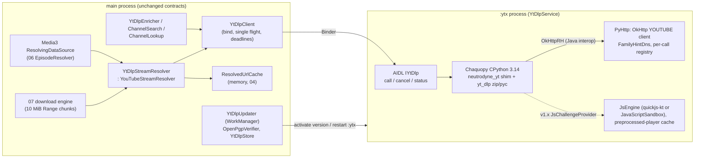

# Research: bundling yt-dlp on Android for Neutrodyne (GPL-free)

Research date 2026-10-05. Area: `ytdlp-android`. Inputs: [04-youtube.md](/home/user/Neutrodyne/docs/design/04-youtube.md), [PLAN.md](/home/user/Neutrodyne/docs/PLAN.md) PO-1/PO-2/PO-5, 01/09 toolchain and size budgets. Product-owner decisions taken as given: avoid GPL, GitHub Releases only, no Google developer verification, package prefix `ch.lkmc` (the design already uses `ch.lkmc.neutrodyne`).

Method: primary sources only (repos cloned and read, release assets downloaded and hashed, signatures checked with `gpg`, Maven Central metadata, official Android/Python docs). Several numbers were **measured in this sandbox** (CPython 3.11.15 on a 2.1 GHz Xeon). A live YouTube extraction test from the sandbox was **not possible**: YouTube answered with HTTP 429 and "Sign in to confirm you're not a bot" (a data-centre IP). Device timings are therefore third-party reports or marked as estimates.

---

## Recommendation

**Yes. Neutrodyne can drop NewPipe Extractor and use yt-dlp while every shipped artefact stays GPL-free. The catch is that we ship yt-dlp's Python *source*, not yt-dlp's "binary", inside an embedded CPython.**

1. **What to ship.**
   - **yt-dlp (Unlicense).** Take the official zipimport release asset `yt-dlp`, which already contains `yt_dlp_ejs` 0.8.0, and leave out every optional dependency.
   - **CPython (PSF-2.0).** Its bundled C libraries are all permissive: OpenSSL 3 (Apache-2.0), SQLite (public domain), libffi, expat, mpdecimal, zlib, bzip2, xz and zstd.
   - **Chaquopy (MIT).** Embeds CPython in the app.
   - **Our own shim (Unlicense).**

   Do **not** use:
   - youtubedl-android (GPL-3.0). This rules out Seal's and YTDLnis's code too.
   - yt-dlp's PyInstaller "binaries". They are GPLv3+ (readline, mutagen, libidn2) and are Linux glibc/musl executables in any case.
   - A Termux-built Python. It ships GNU readline, which is GPL-3.0.
   - `mutagen` (GPL-2.0+).
   - `bgutil-ytdlp-pot-provider` (GPL-3.0).

   yt-dlp is under the same Unlicense as our repository, so the build needs no GPL boundary, no corresponding-source tarball and no `play`/`foss` licence split.

   youtube-dl ("yt-dl") is also Unlicense, but its last stable release was 2021.12.17 and its nightlies stopped at 2025.11.26. Use yt-dlp.

2. **Host.** Run CPython via Chaquopy in a dedicated **`:ytx` service process**. Keep one long-lived interpreter that is pre-warmed on demand and stopped when idle. Route yt-dlp's HTTP through our OkHttp with a custom yt-dlp `RequestHandler`, called from Python via Chaquopy's Java interop. This gives:
   - one network stack and one TLS fingerprint;
   - our DNS family hints;
   - real cancellation;
   - Python's bundled OpenSSL never touches the network.

   The process boundary isolates crashes and memory away from playback. It also lets us switch yt-dlp versions without killing the main process, and kill a hung extraction.

3. **No JS runtime in v1.** yt-dlp 2026.08.19 uses the `visionos` client by default when no JS runtime exists. That client needs no JS player and no PO token, and returns direct audio URLs. It is the same client the current NPE design depends on.

   What we lose without JS: "made for kids" videos and some age-restricted embeddable videos. The existing design already maps those to `Unavailable(KIDS_ONLY / AGE_RESTRICTED)`.

   For v1.x, add an **in-process JS challenge provider** through yt-dlp's public `JsChallengeProvider` API. It would run QuickJS through the JNI binding quickjs-kt (Apache-2.0), or androidx `JavaScriptSandbox` (V8 from WebView), and cache the preprocessed player in memory. Never exec Deno (about 88 MiB) or Node.

4. **Runtime updates without app releases.** Download the official `yt-dlp` zipimport from yt-dlp's GitHub releases (stable by default, nightly as an option). Before activating it:
   - verify `SHA2-256SUMS.sig` against the pinned key `AC0CBBE6848D6A873464AF4E57CF65933B5A7581`, then the SHA-256 of the zip;
   - check anti-rollback and run a self-test;
   - compile it to `.pyc` on the device.

   Keep the previous version for automatic rollback. This turns most YouTube hotfixes from "cut an APK" into "the app fetches a signed yt-dlp". That matters more now: with no developer verification, APK updates will need Google's "advanced flow" from 2027, while a yt-dlp update needs no install.

5. **Costs to accept.**
   - **Size:** about +15 MB (legacy packaging) to +22 MB (default packaging) per 64-bit ABI. This breaks N5's 25 MB universal APK, so ship **per-ABI APKs** (arm64-v8a, x86_64).
   - **32-bit ARM** gets no extraction on Python ≥ 3.12. It falls back to the external-only YouTube capability set, or uses Python 3.11 (EOL 2027-10).
   - **Latency (estimate):** about 1–3 s for the first resolve after `:ytx` starts, then network-bound (0.5–1.5 s). Hidden by pre-warm and the existing 60 s pre-resolve.
   - **Memory (estimate):** about 70 MB in `:ytx` while it is alive.

6. **Gate before M9: Chaquopy on AGP 9.4.1 with targetSdk 37.** The released Chaquopy **17.0.0** (2025-12-01) documents AGP 7.3–8.13. Support for AGP 9.0–9.4 and the Android 17 read-only `.so` fix exist **only on master** (VERSION 17.1.0, unreleased on 2026-10-05). Run a one-week spike in M0/M1.

   Fallback A2: embed python.org's official Android package (3.14.8, arm64 + x86_64, 16 KB aligned, API 24+) ourselves. Run it as a long-lived child process from a tiny launcher in `jniLibs` (`useLegacyPackaging = true`), speaking JSON over stdio.

**Risks that would change this recommendation:**
- Neither Chaquopy 17.1 nor manual embedding works with AGP 9.4.1 and targetSdk 37 by M9.
- The PO rejects +15–22 MB per ABI or dropping YouTube on 32-bit. Then use option C: a Kotlin port of yt-dlp's VISIONOS/InnerTube code. The Unlicense lets us copy it, but we maintain it and every fix needs an app release.
- YouTube closes `visionos` without a JS-only fallback, or enforces PO tokens everywhere. Then a JS engine plus an in-app BotGuard/PO-token path becomes mandatory for any extractor, NPE included.
- yt-dlp changes the internal or plugin APIs our shim uses. There is no backward-compatibility promise; a nightly CI canary mitigates this.

---

## Options considered (trade-off table)

| Option | Licence of shipped APK | Size impact | Latency | Hotfix path | Main risks | Verdict |
|---|---|---|---|---|---|---|
| **A1. Chaquopy-embedded CPython + yt-dlp zip in a `:ytx` service process, OkHttp transport, signed runtime updater** (recommended) | Unlicense + PSF + MIT + Apache-2.0 + MPL-2.0 (CA bundle file) — no GPL | ≈ +15–22 MB per 64-bit ABI (see [Cost](#4-cost)) | Cold ≈ 1–3 s (estimate), warm network-bound | Runtime yt-dlp update in hours; APK release only for shim changes | Chaquopy 17.1 unreleased (AGP 9 / API 37); yt-dlp plugin API not stable; per-ABI APKs; 32-bit | **Recommended** |
| **A2. Official python.org Android CPython + yt-dlp as long-lived child process (exec launcher `lib…so` from `nativeLibraryDir`), JSON-RPC over stdio** | Same as A1 minus Chaquopy | Similar (arm64 + x86_64 only; no armeabi-v7a) | Similar; spawn ≈ process start + import | Same updater | Requires `useLegacyPackaging = true`; NDK/CMake launcher; Python does its own HTTP (urllib + its OpenSSL); phantom-process killer; no Java interop (no OkHttp, no in-process JS bridge) | **Fallback** if Chaquopy blocks |
| B. youtubedl-android-style exec per call (process per request) | Our own build is fine; **the library itself is GPL-3.0** | Library ships 12.8–14.3 MB/ABI Python zip + QuickJS | Per-call process start + compile from zipimport; Seal reported 17–20 s per info fetch on a Redmi Note 4 | Same | Cold start every call; GPL if we reuse the library; Termux Python ships GNU readline (GPL) | Reject |
| C. Kotlin port of yt-dlp's VISIONOS player request, channel-tab browse, search parsing (copying is legal: Unlicense) | Unlicense | ≈ 0.1 MB | Fastest (no interpreter) | Every fix needs an APK release (friction without developer verification); optional signed remote "client constants" JSON | We become the extractor maintainers; tab/search parsing churn | Fallback if size is unacceptable |
| D. Keep NewPipe Extractor (status quo) | GPL-3.0-or-later for the full build | ≈ 2–3 MB | Fast | Renovate fast lane + APK release | PO wants to avoid GPL | Rejected by PO direction |
| E. YouTube.js + googlevideo + BgUtils (MIT) in an embedded JS engine (old plan C) | MIT/Unlicense | JS engine + bundle ≈ 3–5 MB (estimate) | Medium | APK release (or downloadable JS bundle) | 2–3 milestones; own JS bridge | Not preferred: yt-dlp gives more for less |
| F. On-demand "YouTube engine pack" (Python + yt-dlp downloaded after install, `System.load` of read-only `.so` from app storage) | No GPL | Base APK unchanged; ≈ 15 MB download on first YouTube use | As A | As A | Downloaded native code (allowed by the OS outside Play, read-only on API 37); Chaquopy cannot do it, needs manual embedding; larger attack surface | Keep in reserve if N5 must hold |
| Exec Deno / Node as JS runtime | MIT | Deno ≈ 88 MiB per ABI | — | — | Size; exec restrictions | Reject |

---

## Technical detail

### 1. Licensing of everything that would ship

| Component (version checked) | Licence | Needed? | Notes |
|---|---|---|---|
| yt-dlp 2026.08.19 (stable) / 2026.09.27.232945 (nightly) | Unlicense ([LICENSE](https://github.com/yt-dlp/yt-dlp/blob/master/LICENSE), `pyproject.toml` `license = "Unlicense"`) | **Yes** | README "Licensing": the git repo, PyPI sdist and wheel "only contain code licensed under the Unlicense". The zipimport `yt-dlp` and the tarball add yt-dlp-ejs's ISC (meriyah) and MIT (astring) code. "The PyInstaller-bundled executables include GPLv3+ licensed code" ([README](https://github.com/yt-dlp/yt-dlp#licensing)) |
| yt-dlp PyInstaller binaries (`yt-dlp_linux`, `_musllinux_aarch64`, …) | **GPLv3+** combined work | **No** | THIRD_PARTY_LICENSES.txt lists GNU Readline GPL-3.0-or-later, mutagen GPL-2.0-or-later, libidn2/libunistring LGPL-3.0, libintl LGPL-2.1. They are also glibc/musl Linux builds, not Android |
| yt-dlp-ejs 0.8.0 (bundled in the zipimport; pinned by `pyproject.toml`) | Unlicense; bundles meriyah 6.1.4 (ISC) and astring 1.9.0 (MIT) ([ejs package.json](https://github.com/yt-dlp/ejs/blob/main/package.json)) | Yes (only used if a JS provider exists) | Attribution for meriyah and astring on the Licences screen |
| `brotli` / `brotlicffi` | MIT | No | OkHttp decodes content encodings for us |
| `certifi` | MPL-2.0 | No (yt-dlp) | Chaquopy ships its own CA bundle taken from certifi (changelog: "Update CA bundle to certifi 2026.7.22", master 2026-10-03). MPL-2.0 is file-level copyleft; listing it is enough |
| `requests`, `urllib3`, `charset-normalizer`, `idna` | Apache-2.0, MIT, MIT, BSD-3 | No | Our OkHttp `RequestHandler` replaces them; yt-dlp's built-in urllib handler is the fallback |
| `websockets` | BSD-3 | No | Live chat only |
| `pycryptodomex` | BSD-2 / public domain | No | AES-128 HLS; not needed for audio-only HTTPS formats |
| **`mutagen`** | **GPL-2.0-or-later** | **No — must not ship** | In yt-dlp's `default` extras. Not inside the zipimport. CI must assert it is absent |
| `secretstorage`, `cryptography`, `jeepney` | BSD-3, Apache-2.0/BSD, MIT | No | Linux keyring |
| `curl_cffi` (+ curl-impersonate, BoringSSL, nghttp2, …) | MIT + permissive | No | Native; YTDLnis ships it for arm64 only |
| CPython 3.13/3.14 | PSF-2.0 | Yes | [Incorporated software](https://docs.python.org/3/license.html): OpenSSL 3.x Apache-2.0, SQLite public domain, libffi MIT, expat MIT, libmpdec BSD-2, zstd BSD-3, HACL* MIT, xz 0BSD, bzip2 bzip2-1.0.6, zlib (Android system `libz.so`). The official Android build links only `libc/libm/libdl/liblog/libz`, has no readline or curses module and ships `LICENSE.txt` (checked in `python-3.14.8-aarch64-linux-android.tar.gz`) |
| Chaquopy 17.0.0 (17.1.0 on master) | MIT ([LICENSE.txt](https://github.com/chaquo/chaquopy/blob/master/LICENSE.txt), "Copyright (c) 2017-2025 Chaquo Ltd and contributors") | Yes (A1) | Runtime includes `libc++_shared.so` (Apache-2.0 with LLVM exception) |
| BeeWare / Briefcase | BSD-3 | Not needed | Briefcase's Android template itself applies `com.chaquo.python` ([template build.gradle](https://github.com/beeware/briefcase-android-gradle-template)). There is no separate BeeWare Android runtime to choose |
| python.org Android embeddable package | PSF-2.0 (+ the above) | A2 only | 3.14.0–3.14.8 and 3.15.0rc3, **aarch64 and x86_64 only**, API level ≥ 24 (`android-env.sh`), all `.so` LOAD segments aligned 0x4000 (checked) ([downloads/android](https://www.python.org/downloads/android/)) |
| youtubedl-android (yausername 0.18.1; JunkFood02 fork, Maven `io.github.junkfood02.youtubedl-android`) | **GPL-3.0** (LICENSE in both repos) | **No** | Also its bundled Termux Python 3.12 ships `libreadline.so.8.3` (GPL-3.0), ncurses and other libraries |
| Seal, YTDLnis | GPL-3.0 | No (behaviour reference only; 01's no-copy rule) | — |
| yt-dlp-android by ffmpegkit-maintained (Maven `dev.ffmpegkit-maintained:yt-dlp-android:2.0.2`) | MIT | Possible reference | Chaquopy 17.0.0 + AGP 8.7.3 + Python 3.13; `pip install yt-dlp` without extras; no JS runtime; no in-app updates |
| QuickJS 2026-06-04 / QuickJS-ng 0.17.0 | MIT | v1.x option | quickjs-kt 1.0.15 (Apache-2.0, bundles bellard/quickjs as a submodule); Zipline 1.28.0 (Apache-2.0) |
| androidx.javascriptengine 1.1.1 (2026-09-23) | Apache-2.0 | v1.x option | Uses the system WebView's V8 in a sandboxed process |
| Deno, Node | MIT (+ bundled deps) | No | Size and exec |
| bgutil-ytdlp-pot-provider | **GPL-3.0** | **No** | Also needs Node ≥ 22 or Deno ≥ 2.0 plus the `canvas` npm module, as a server or a script ([README](https://github.com/Brainicism/bgutil-ytdlp-pot-provider)) |

**Conclusion:** the APK would contain Unlicense, PSF-2.0, MIT, ISC, BSD, Apache-2.0, 0BSD, zlib, bzip2 and public-domain code, plus one MPL-2.0 data file (the CA bundle). It contains no GPL or LGPL.

Licence-check changes:
- The Licensee allow-list adds PSF-2.0, ISC and 0BSD.
- `verifyDependencyPolicy` keeps banning GPL, LGPL and AGPL.
- A new APK check asserts that no `mutagen`, `readline` or `libreadline` is present.

Unverified: whether Chaquopy's Gradle artifacts carry SPDX metadata that Licensee can read. A manual AboutLibraries entry may be needed.

### 2. JavaScript runtime requirement (EJS)

- **Timeline.** yt-dlp 2025.11.12 introduced EJS. Running YouTube without a JS runtime has been "deprecated" since then: "format availability will be limited, and severely so in some cases (e.g. for logged-in users)" ([#15012](https://github.com/yt-dlp/yt-dlp/issues/15012), 2025-11-12).
- **Supported runtimes in 2026.08.19** (source `yt_dlp/utils/_jsruntime.py`, [EJS wiki](https://github.com/yt-dlp/yt-dlp/wiki/EJS)):

  | Runtime | Version required | Notes |
  |---|---|---|
  | deno | ≥ 2.3.0 | The only one enabled by default |
  | node | ≥ 22.0.0 | |
  | quickjs | ≥ 2023-12-09 | Warns below 2025-04-26 |
  | quickjs-ng | any | Warns below 0.12.0 |
  | bun | 1.2.11–1.3.14 | Deprecated |

  Others must be enabled with `--js-runtimes` / the `js_runtimes` parameter.
- **How they are invoked.** Every built-in provider **execs a subprocess** (`yt_dlp/extractor/youtube/jsc/_builtin/*.py`). Node gets the script on stdin with `--permission`. QuickJS is run as `qjs --script <tempfile>` because it cannot read stdin.
  - The script is the EJS `lib` (meriyah + astring, 151 KB minified) plus `core`, followed by `console.log(JSON.stringify(jsc({type:'player', player:<player JS>, requests:[{type:'n'|'sig', challenges:[…]}], output_preprocessed:true})))`.
  - The expensive step is `preprocessPlayer` (meriyah parses the 2–3 MB player, astring regenerates it). A call carrying `{type:'preprocessed', preprocessed_player}` skips it.
  - yt-dlp's own on-disk cache of preprocessed players is switched off (`_ENABLE_PREPROCESSED_PLAYER_CACHE = False`, "files are large and we do not support rotation").
- **In-process engine: yes, through the public API.**
  - `yt_dlp/extractor/youtube/jsc/provider.py` is marked `"""PUBLIC API"""`. It exports `JsChallengeProvider`, `JsChallengeRequest`/`Response`, `NChallengeInput`, `SigChallengeInput`, `register_provider` and `register_preference`.
  - A provider subclass implements `is_available()` and `_real_bulk_solve(requests)`. `self._get_player(video_id, player_url)` returns the player JS.
  - We can build the EJS input from `yt_dlp_ejs.yt.solver.lib()` / `.core()` and call a Kotlin `JsEngine` through Chaquopy (`from java import jclass`). Chaquopy releases the GIL during Java calls ([Chaquopy python.rst](https://github.com/chaquo/chaquopy/blob/master/product/runtime/docs/sphinx/python.rst)).
  - The Kotlin side keeps `preprocessed_player` in memory per `player_url`, so only the first challenge per player version pays the preprocessing cost.
  - Precedents that use the same extension point: [yt-dlp-apple-webkit-jsi](https://github.com/topics/yt-dlp-jsc-provider) (WebKit JavaScriptCore on Apple devices) and yt-dlp-remote-cipher.
  - `js_runtime_available` in `_get_requested_clients` is `any(p.is_available() for p in providers)`, so a plugin provider switches yt-dlp to its JS-enabled defaults.
  - Caveat: `globals.py` says "no backwards compatibility is guaranteed for the plugin system API". Subclassing the private `_builtin.ejs.EJSBaseJCP` would be shorter but more fragile.
- **Performance.**
  - quickjs-ng is "roughly 10s against node's 4s" per extraction, measured on a desktop ([stemdeck #438](https://github.com/stemdeckapp/stemdeck/issues/438), 2026-08-25).
  - QuickJS 2026-06-04 claims to be 42 % faster than its predecessor ([bellard.org/quickjs](https://bellard.org/quickjs/)).
  - On a Pixel 6a (Android 17), a QuickJS binary rebuilt for API 29 gives a YouTube preview about 4 s after typing for a 12-minute video ([video-dl PR #68](https://github.com/Kenshin9977/video-dl/pull/68), merged 2026-09-26).
  - That PR also found that a static arm64 QuickJS built for API 24 crashed ("TLS segment is underaligned … needs to be at least 64"), so yt-dlp silently never solved challenges.
  - A Rust rewrite (ytdlp-ejs, SWC) was faster still in a 316-case CI benchmark ([dev.to](https://dev.to/ahaoboy/improving-yt-dlp-ejs-with-rust-smaller-and-faster-5cnl), 2025-12-02).
  - Unverified: in-process QuickJS-on-phone times. Expect seconds for the first, uncached preprocessing.
- **What breaks without a JS runtime (source of 2026.08.19, `_video.py` / `_base.py`):**
  - Default clients become `_DEFAULT_JSLESS_CLIENTS = ('visionos',)` instead of `('visionos', 'web')`, with a one-time warning.
  - `visionos` has `REQUIRE_JS_PLAYER: False` and **no GVS PO-token policy**, so its audio formats come through. Its comment says "Made for kids" videos aren't available with this client.
  - Not attempted: the made-for-kids fallback to `web_embedded` + `tv_downgraded` (code requires "a JS runtime is available"); the `web_embedded` age-gate workaround (that client needs the JS player); and any format that has `signatureCipher` or an `n` parameter (skipped when `skip_player_js`).
  - `web` gains little even *with* JS for an anonymous user: its HTTPS/DASH formats need a GVS PO token (`WEB_PO_TOKEN_POLICIES … required=True`), and "YouTube is forcing SABR streaming for this client".
  - **Net effect:** without JS we get the same coverage as the current NPE design (VISIONOS only). With an in-process JS provider we gain kids videos and some age-restricted embeddable videos, plus a second path if `visionos` degrades.

### 3. Running on Android

**Chaquopy (A1).**
- **Versions.**
  - Latest release on Maven Central: `com.chaquo.python:gradle` **17.0.0** (`lastUpdated 20251130`). Its tag's `android.rst` says AGP "between 7.3.x and 8.13.x".
  - Master: `VERSION.txt` 17.1.0, last commit 2026-10-03. It contains "Update to Android Gradle plugin version 9.0.0 (closes #1096)" (2026-01-23) up to 9.4.1 (2026-09-19), Python 3.15, and **"Update target API level to 37 (#1481)"** (2026-10-02).
  - That last commit makes extracted `.so` files read-only because "In API level 37, native libraries loaded using System.load must be read-only".
  - The plugin only checks a minimum AGP version (7.3.0), not a maximum. Between 17.0.0 and master the plugin source changed its dependency notation (map → string) for Gradle 9.
  - **Unverified: whether 17.0.0 works under AGP 9.4.1 / Gradle 9.7 / targetSdk 37. Spike required.**
- **Kotlin.** The plugin does not depend on KGP. The AGP 9 built-in Kotlin should not matter (Unverified).
- **Placement.** "The Chaquopy plugin can only be used in one module per app: either in the app module, or in exactly one library module" ([android.rst](https://github.com/chaquo/chaquopy/blob/master/product/runtime/docs/sphinx/android.rst)). That fits a single `:youtube:ytdlp` library module.
- **ABIs and Python versions.**
  - `arm64-v8a` and `x86_64`. `armeabi-v7a` and `x86` exist **only for Python 3.11 and older**.
  - Runtime builds published: 3.10.19, 3.11.14, 3.12.12, 3.13.9 and **3.14.0** (Maven `com.chaquo.python:target`; master's `Common.java` lists the same plus 3.15.0rc2).
  - The 3.14.0 runtime bundles **OpenSSL 3.0.18** and SQLite 3.50.4. python.org's 3.14.8 has OpenSSL 3.5.9 and SQLite 3.53.4. Chaquopy's runtime therefore lags security point releases, which is one more reason not to let Python's OpenSSL do network I/O.
  - yt-dlp: `MIN_SUPPORTED (3,10)`, `MIN_RECOMMENDED (3,11)`. Python 3.10 reached end of life on 2026-10-01 ([devguide](https://devguide.python.org/versions/)). Use 3.14 (fallback 3.13).
- **Packaging.**
  - `libpython`, `libcrypto`, `libssl` and `libsqlite` go to `jniLibs`. `lib-dynload` extension modules and the stdlib `.pyc` zip go to assets and are extracted or imported at runtime.
  - The FAQ says "APK splits … won't help much. Instead, use a product flavor dimension" per ABI.
  - Bytecode is compiled at build time when `buildPython` (same major.minor) is available.
  - pip requirements are installed at build time, wheels only (`--only-binary` since 17.0).
- **Startup.** `Python.start(AndroidPlatform(context))` runs once per process. "Chaquopy runs Python within your main app process" unless a manifest `android:process` is used (FAQ "Interrupt a Python call", master 2026-10-03).
- **Interrupting.** Either cooperative flags or `PyThreadState_SetAsyncExc`. Hence our OkHttp transport (cancel the `Call`, Python sees an exception) and kill-the-process as the last resort.

**Exec model (B / A2).**
- **The W^X rule.** "Untrusted apps that target Android 10 cannot invoke `execve()` directly on files within the app's home directory" ([Android 10 behaviour changes](https://developer.android.com/about/versions/10/behavior-changes-10)).
- **The established workaround** (youtubedl-android, YTDLnis, Seal) is to package executables as `lib<name>.so` in `jniLibs` and set `android:extractNativeLibs="true"` / `jniLibs.useLegacyPackaging = true`. The installer then extracts them to `nativeLibraryDir`, which is executable, and the app execs them from there.
  - youtubedl-android runs `libpython.so` (a 4 KB launcher), unzips `libpython.zip.so` into `noBackupFilesDir`, and passes `--js-runtimes quickjs:<nativeLibraryDir>/libqjs.so`.
  - YTDLnis additionally installs **helper APKs** (`com.deniscerri.ytdl.deno`, `…nodejs`, …) and execs from *their* `nativeLibraryDir`.
  - Termux stays on targetSdk 28 to keep exec-from-data ([termux-app #1072/#2155](https://github.com/termux/termux-app/issues/2155)); that is not an option for us.
- **dlopen versus execve.** The Android 10 rule blocks `execve` only. It also blocks writable-to-exec mappings. Reading `.py` or `.pyc` files is just data, so runtime yt-dlp updates are not W^X violations.
- **Android 14** "Safer dynamic code loading" (read-only before write) covers DEX/JAR/APK ([Android 14 changes](https://developer.android.com/about/versions/14/behavior-changes-14)).
- **Android 17 (targetSdk 37)** extends it to native code: "All native files loaded using `System.load()` must be marked as read-only. Otherwise, the system throws `UnsatisfiedLinkError`" ([Android 17 behaviour changes](https://developer.android.com/about/versions/17/behavior-changes-17)). The page has nothing new on exec, child processes or ProcessBuilder.
- **Phantom process killer (Android 12+).** It kills app child processes beyond 32 system-wide and child processes with excessive CPU. That is a risk for exec'd QuickJS or Python in the background ([agnostic-apollo docs](https://github.com/agnostic-apollo/Android-Docs/blob/master/en/docs/apps/processes/phantom-cached-and-empty-processes.md)). A1 has no child processes.
- **16 KB pages.**
  - Play blocks non-compliant updates from 2027-02-01. That is irrelevant for GitHub-only, but 16 KB devices exist (Pixel 8/9 developer option and newer devices).
  - Android 16+ runs non-aligned apps in "16 KB backcompat mode" with a warning dialog on first launch ([page sizes](https://developer.android.com/guide/practices/page-sizes)).
  - Checked: Chaquopy 3.14.0 `libpython3.14.so`, `libcrypto_python.so` and `_ssl…so` are LOAD-aligned 0x4000; so are python.org 3.14.8's libs and youtubedl-android's `libpython.so` and `libqjs.so`.
  - Chaquopy 17.0: "For best compatibility with these devices, use Python 3.13 or later".
  - Keep 09's `zipalign -c -P 16` check. It must also cover assets-extracted `.so` files: run `llvm-readelf -l` over the Chaquopy asset zips in CI.

### 4. Cost

**APK size.** Measured from artifacts; totals are estimates.

| Piece | arm64-v8a | Notes |
|---|---|---|
| `jniLibs` (libpython3.14 5.81 MB, libcrypto 3.72 MB, libssl 0.62 MB, libsqlite3 0.89 MB) | 11.0 MB stored uncompressed (default packaging) / ≈ 4 MB compressed (`useLegacyPackaging`) | `target-3.14.0-0-arm64-v8a.zip` (7.17 MB compressed, includes headers) |
| `lib-dynload` (assets, per ABI) | ≈ 2.5 MB compressed | `_zstd` alone is 2.0 MB uncompressed |
| stdlib `.pyc` (ABI-independent) | 4.48 MB compressed (10.6 MB uncompressed) | `target-3.14.0-0-stdlib-pyc.zip` |
| yt-dlp zipimport asset | 3.07 MB (10.2 MB uncompressed, 1,053 files) | Or build-time `.pyc`: 5.8 MB compressed (measured with 3.11); YouTube-only trimming 1.5 MB, but that breaks drop-in updates |
| Chaquopy Java runtime + JNI + bootstrap | ≈ 0.5–1 MB | Unverified |
| **Total, first 64-bit ABI** | **≈ 21–22 MB** (default) / **≈ 15 MB** (legacy packaging) | Each additional ABI ≈ +13.5 MB / +6.5 MB |

For comparison (F-Droid listings): Seal 1.13.1 is 38–43 MiB per ABI (with ffmpeg and aria2c); YTDLnis 1.9.0 (2026-09-11) is 54–64 MiB per ABI; youtubedl-android's Python zip is 14.3 MB (arm64) and 12.8 MB (armeabi-v7a), plus 0.6–1.0 MB QuickJS.

Consequences: N5 ("`foss` APK < 25 MB" universal) cannot hold. 09's "one universal APK" decision (made for F-Droid and Obtainium) can be revisited now that F-Droid is gone. The proposal:
- `arm64-v8a` APK with YouTube engine;
- `x86_64` APK with YouTube engine;
- `armeabi-v7a` APK without the engine (YouTube external-only, like the former `play` capabilities), or with Python 3.11 until 2027-10.

Budget proposal: arm64 APK < 40 MB.

**Latency.**

| Measurement | Value | Source |
|---|---|---|
| Host, import from the zipimport (no `.pyc`; zipimport cannot write caches) | 0.50–0.60 s, plus `YoutubeDL()` and IE init 0.30–0.37 s | This sandbox, Xeon 2.1 GHz, CPython 3.11 |
| Host, same code extracted with `.pyc` | 0.13–0.16 s + 0.07–0.12 s | This sandbox |
| Host, `compileall` of the whole zip, single thread | 1.43 s | This sandbox |
| Device, exec model per call (no `.pyc`, process per call) | 17–20 s per info fetch for Seal; YTDLnis 54–81 s | Redmi Note 4, Android 11 ([ytdlnis #1088](https://github.com/deniscerri/ytdlnis/issues/1088), 2026-02-01) |
| Device, in-process Python + QuickJS | ≈ 4 s for a preview | Pixel 6a, Android 17 (video-dl #68) |

Estimate for A1 on a mid-range phone:
- `:ytx` process start + `Python.start` + import ≈ 1–2 s;
- then about 3 InnerTube requests per resolve (watch page, initial data, `visionos` player — seen in the sandbox log) ≈ 0.5–1.5 s;
- warm resolves are network-bound;
- `player_skip=webpage,configs` could cut requests but loses made-for-kids detection and some metadata.

Unverified on device: M9 checklist measures p50/p95.

**Memory.** Host RSS was 8 MB → 35 MB after `import yt_dlp` → 43 MB with `YoutubeDL` + YouTube and YouTubeTab IEs (measured). Add an ART process for `:ytx` (≈ 20–30 MB, estimate). A JS preprocess of a 2–3 MB player in QuickJS may need 100+ MB transiently (Unverified).

**Battery.** A resolve is a few hundred ms of CPU plus a few small HTTPS requests, so negligible. JS solving adds several CPU-seconds per player version (cached) or per video (uncached). A long-lived `:ytx` costs nothing when idle, but must be stopped when idle to give back memory.

### 5. Updates

- **Release assets** ([README "Release files"](https://github.com/yt-dlp/yt-dlp#release-files)):
  - Every stable release (`yt-dlp/yt-dlp`) and nightly (`yt-dlp/yt-dlp-nightly-builds`) publishes `yt-dlp` (platform-independent zipimport; "Needs Python"), `SHA2-256SUMS`, `SHA2-256SUMS.sig`, `SHA2-512SUMS` and `SHA2-512SUMS.sig`.
  - Public key: [`public.key`](https://github.com/yt-dlp/yt-dlp/blob/master/public.key), RSA-4096, created 2023-02-26, fingerprint **`AC0C BBE6 848D 6A87 3464 AF4E 57CF 6593 3B5A 7581`**, uid "Simon Sawicki (yt-dlp signing key)".
  - Checked with `gpg --verify`: stable 2026.08.19's `SHA2-256SUMS.sig` ("Good signature", made 2026-08-19 23:48 UTC) and nightly 2026.09.27.232945's (made 2026-09-27 23:32 UTC); same key for both.
  - The `.sig` is a 566-byte binary OpenPGP v4 signature: RSA, **digest algorithm 10 = SHA-512**, signature class 0x00 (binary document), with an issuer-fingerprint subpacket.
  - Verification on Android needs no Bouncy Castle. A ~150-line Kotlin verifier is enough: parse packet tag 2 v4, hash data ‖ hashed area ‖ `0x04 0xFF` ‖ length with SHA-512, then `Signature("SHA512withRSA")` against the pinned modulus extracted from `public.key` at build time. Alternatively PGPainless (Apache-2.0) or Bouncy Castle `bcpg` (MIT-style).
- **What yt-dlp itself does.** Its updater checks only SHA-256 from `SHA2-256SUMS`, not the GPG signature (`yt_dlp/update.py`).
- **Precedents.**
  - youtubedl-android: `YoutubeDLUpdater` queries `api.github.com/repos/yt-dlp/{yt-dlp,yt-dlp-nightly-builds,yt-dlp-master-builds}/releases/latest`, downloads the `yt-dlp` asset, does **no checksum or signature check**, and deletes the old version first. It falls back to the bundled raw resource on error.
  - YTDLnis: same channels and no signature check (`RuntimeManager.updateYTDL`). It hashes only its own assets.
- **Channels** ([README "Update"](https://github.com/yt-dlp/yt-dlp#update)):
  - `stable`: "(mostly) monthly", "often 'stale' and prone to external breakage".
  - `nightly`: "the recommended channel for regular users".
  - `master`: per push.
  - Stable tags in 2026: 01.29, 01.31, 02.04, 02.21, 03.03, 03.13, 03.17, 06.09, 07.04, 08.19 (`git ls-remote`). Note the gap from 03.17 to 06.09.
- **Policy outside Play.**
  - No Play policy applies.
  - The OS restricts DEX/JAR/APK (API 34+) and `System.load` `.so` (API 37+), not interpreted Python.
  - Google developer verification governs APK installs, not data the app downloads. Runtime yt-dlp updates keep working for users who sideloaded via the advanced flow.
  - Unverified: whether Play Protect heuristics flag sideloaded apps that download code.
- **Security.** The downloaded code runs with the app's UID: it can read the app database and use the network. Process isolation (`:ytx`) is not privilege isolation. An `android:isolatedProcess` service would be a real sandbox, but it has no data directory, which Chaquopy needs (Unverified; not pursued).
  - Mitigations: pinned key; TLS; anti-rollback; ORIGIN check (`yt_dlp/version.py` `ORIGIN` ∈ {`yt-dlp/yt-dlp`, `yt-dlp/yt-dlp-nightly-builds`}); size cap (10 MB); our shim's API probe before activation; a user-visible version and "Reset to bundled".
  - Never use the `remote_components` (`ejs:github`, `ejs:npm`) download paths; the EJS scripts come from the verified zip.

### 6. Robustness 2025–2026

- **Client state in 2026.08.19** (source, Unlicense; [release notes](https://github.com/yt-dlp/yt-dlp/releases/tag/2026.08.19)):
  - `visionos` was added on 2026-07-09 (#17184) and made a logged-out default (#17261, 2026-07-20).
  - `android_vr` was removed from the defaults on 2026-08-18 (#17461) after [#17456](https://github.com/yt-dlp/yt-dlp/issues/17456) (403s, 2026-08-18). The source comment says: "Since 2026.08.17, ALL formats (including live HLS and itag 18) are 403'd with version 1.65.10".
  - `web_embedded` fallbacks were added on 2026-08-18 (#17462). The nightly then changed the `web_embedded` user agent to Safari (2026-09-16, #17684).
- **Same single point of failure as NPE.** The existing design notes that NPE `dev` also relies on VISIONOS alone. yt-dlp's advantage is cadence: nightlies are published daily and can be fetched at runtime, versus NPE releases plus an APK release.
- **PO tokens.**
  - The [PO Token Guide](https://github.com/yt-dlp/yt-dlp/wiki/PO-Token-Guide) (updated Jul 12 2026, stale on `android_vr`) says `web` (only SABR formats), `mweb`, `web_music`, `tv_simply`, `android` and `ios` need GVS tokens.
  - `visionos` has no policy in source.
  - The only maintained provider plugin (bgutil) is GPL-3.0 and needs Node/Deno plus `canvas`, so it is unusable.
  - An in-app path would be BotGuard in a WebView, following LuanRT's BgUtils (MIT) or NewPipe's PoToken WebView (GPL — behaviour only). This is a research item, not v1.
- **SABR.** yt-dlp does not support SABR in core; it skips "missing URL" formats with "YouTube is forcing SABR streaming for this client". An experimental plugin, [yt-dlp-ytse](https://pypi.org/project/yt-dlp-ytse) (coletdjnz), exists. Unverified: its maturity.
- **Preroll wait.** yt-dlp computes `available_at` from preroll `adPlacements`/`adSlots` in the player response and sleeps before downloading (`_get_available_at_timestamp`, `downloader/common.py`). `use_ad_playback_context` "Skip[s] preroll ads to eliminate the mandatory wait period … Only effective with the `mweb` and `web_music` player clients".
  - Unverified whether `visionos` responses carry such placements. We should carry `availableAtMs` in `ResolvedAudio` and honour it, because the URL may 403 before then.
- **URL properties.** googlevideo URLs keep the `expire` (≈ 6 h) and `ip` parameters. That is unchanged by switching extractor; see 04's VISIONOS probe of 2026-10-04.

### 7. Features via the Python API (no CLI)

Common options:
```python
{
    'quiet': True, 'no_warnings': False, 'logger': ShimLogger(),
    'skip_download': True, 'noplaylist': True,
    'cachedir': f'{cache_dir}/yt-dlp',
    'js_runtimes': {},            # stop deno probing (subprocess)
    'remote_components': set(),
    'ignore_no_formats_error': True,
    'extractor_args': {'youtube': {'skip': ['hls', 'dash', 'translated_subs']}},
}
```
Without the `js_runtimes` setting, yt-dlp probes `deno --version` through a subprocess at init. Upcoming and live videos then return metadata instead of raising.

| Need | Call | Fields used |
|---|---|---|
| Resolve audio for a video ID | `ydl.extract_info(f'https://www.youtube.com/watch?v={id}', download=False, process=False)` | `formats[]` where `vcodec == 'none'`: `format_id` (`'140'`, `'251-drc'`), `url`, `ext`/`container` (`m4a_dash` / `webm_dash`), `acodec`, `tbr`/`abr`, `filesize`, `language`, `language_preference`, `format_note`, `available_at`, plus `duration`, `live_status`, `availability`, `age_limit` |
| Itag, track and DRC from the URL | Parse the URL query in Kotlin: `itag`, `clen`, `lmt`, `expire`, `ip`, `mime`, `xtags` (`acont=original/dubbed/dubbed-auto/descriptive`, `drc=1`, `lang=`) | Feeds 04's `AudioCandidate`, so `AudioStreamSelector` and the `formatId` rules stay as they are |
| Video facts (upcoming, live, members-only, age) | Same call | `live_status` ∈ {`is_upcoming`, `is_live`, `post_live`, `was_live`, `not_live`}, `release_timestamp`, `availability` ∈ {`subscriber_only`, `premium_only`, `needs_auth`, `private`, `unlisted`, `public`}, `age_limit` |
| Uploads beyond the 15-entry Atom feed | `extract_info(f'https://www.youtube.com/channel/{UC}/videos', process=False)` with `extract_flat='in_playlist'`, `lazy_playlist=True`, `extractor_args={'youtubetab': {'approximate_date': ['']}}` | `entries` is a lazy generator. Each `next()` page pulls continuations. Keep the generator in `:ytx` memory under an opaque cursor token (matches 04's in-memory `UploadsCursor`). Flat entries carry `id`, `title`, `duration`, `live_status`, `availability` (`subscriber_only` for members), `timestamp` (approximate), `release_timestamp` (`_tab.py _extract_video` / lockup view model). Tabs: `/videos`, `/shorts`, `/streams` |
| Channel search | `extract_info('https://www.youtube.com/results?search_query=…&sp=EgIQAg%253D%253D', process=False, extract_flat=True)` (yt-dlp's own test URL for the channel filter) | Entries from `_extract_channel_renderer`: `channel_id`, `title`, `channel_follower_count`, `thumbnails`, `description`, `channel_is_verified`, `uploader_id` (handle). The generator is the `SearchCursor` |
| Handle / legacy URL → channel ID | `extract_info('https://www.youtube.com/@handle', process=False, extract_flat=True)`; read the playlist-level fields and do not iterate `entries` | `channel_id`, `channel`, `uploader_id`, `thumbnails` (avatar and banner variants), `description`, `channel_follower_count` ("Always extract channel metadata", #17386) |
| Errors | `yt_dlp.utils.DownloadError` wrapping `ExtractorError` (`expected`, `msg`), `GeoRestrictedError`, network errors | Classified in the Python shim into stable codes (see the architecture below) |

Marshalling: the shim returns **JSON strings** (`json.dumps` of a trimmed dict); Kotlin parses them with kotlinx.serialization DTOs. No `PyObject` trees cross the boundary. The only Python objects kept alive are cursors in a dictionary inside `:ytx`.

### 8. Precedents

| App / library | Licence | Python host | yt-dlp update | JS runtime | Size | Known problems |
|---|---|---|---|---|---|---|
| Seal 1.13.1 ([repo](https://github.com/JunkFood02/Seal) at 7677f61, 2026-09-25) | GPL-3.0 | youtubedl-android 0.17.3, exec per call; `useLegacyPackaging`, `extractNativeLibs`, ABI splits, targetSdk 35 | GitHub API, no signature | None bundled; [#2640](https://github.com/JunkFood02/Seal/issues/2640) (2026-09-17) proposes Deno 2.8.3 at about 88 MiB | 38–43 MiB per ABI (F-Droid) | Slow fetches on old devices |
| YTDLnis 1.9.0 ([repo](https://github.com/deniscerri/ytdlnis) at 96de43b, 2026-10-04) | GPL-3.0 | Own Python 3.14.6 package (`io.github.deniscerri:ytdlnis_packages.python`, 2026-09-04), exec | GitHub API stable/nightly/master, no signature | Downloadable runtime packages and helper APKs (deno, node, quickjs) | 54–64 MiB per ABI (F-Droid, 2026-09-11) | Slower info fetch than Seal (#1088) |
| youtubedl-android 0.18.1 ([repo](https://github.com/yausername/youtubedl-android), 2025-11-16) | GPL-3.0 | Termux Python 3.12 (with readline) as `libpython.zip.so`, launcher `libpython.so` | GitHub API, no verification | QuickJS `libqjs.so` via `--js-runtimes quickjs:` | 12.8–14.3 MB zip + 0.6–1.0 MB qjs per ABI | Requires `extractNativeLibs` |
| yt-dlp-android 2.0.2 ([repo](https://github.com/ffmpegkit-maintained/yt-dlp-android), 2026-07-11) | MIT | Chaquopy 17.0.0, Python 3.13, AGP 8.7.3 | None (library bump) | None | — | No AGP 9 |
| video-dl (flet) | — | In-process Python + QuickJS executable | — | QuickJS 2026-06-04 rebuilt for API 29 | — | TLS-alignment crash, unwritable cache dir (`HOME` unset → set `XDG_CACHE_HOME`), GIL contention from about 30 concurrent extractions |

### 9. Proposed architecture for Neutrodyne



**Modules** (all Unlicense; `:youtube:streams` and its GPL machinery are deleted):

| Module | Contents |
|---|---|
| `:youtube:api` (JVM) | Unchanged. Add `availableAtMs: Long?` to `ResolvedAudio`, and `TransientKind.ENGINE_UNAVAILABLE` if wanted |
| `:youtube:ytdlp` (Android library; the only module applying `com.chaquo.python`; AIDL enabled here) | Kotlin: `YtDlpClient`, `YtDlpService`, `PyHttp`, `YtDlpStreamResolver`, `YtDlpEnricher`, `YtDlpChannelSearch`, `YtDlpChannelLookup`, `YtDlpErrorMapper`, `YtDlpAudioMapper` (format JSON + URL query → `AudioCandidate`), `YtDlpStore`, `YtDlpUpdater`, `OpenPgpDetachedVerifier`, `JsEngine` (v1.x). Python `src/main/python/neutrodyne_yt/`: `bridge.py`, `okhttp_rh.py`, `errors.py`, `jsc_provider.py` (v1.x). Asset `ytdlp/yt-dlp-<ver>.zip` + `ytdlp/manifest.json` |
| `:app` | `android:process=":ytx"` service declaration; per-ABI product flavour dimension; process-aware `Application.onCreate` |

`:ytx` runs `Application.onCreate` again. Room, WorkManager and App Startup initialisers must be skipped there by checking the process name (`Application.getProcessName()` on API 28+, `/proc/self/cmdline` on 26–27). The service receives a settings snapshot (locale, UA policy) in its `init` call and never opens the database.

**Python shim** (sketch; uses public APIs only):
```python
# neutrodyne_yt/okhttp_rh.py
from yt_dlp.networking.common import RequestHandler, Response, register_rh, register_preference
from yt_dlp.networking.exceptions import HTTPError, TransportError
from java import jclass
PyHttp = jclass('ch.lkmc.neutrodyne.youtube.ytdlp.PyHttp')

@register_rh
class NeutrodyneOkHttpRH(RequestHandler):
    RH_KEY = 'NeutrodyneOkHttp'
    _SUPPORTED_URL_SCHEMES = ('http', 'https')
    _SUPPORTED_PROXY_SCHEMES = ()
    def _send(self, request):
        r = PyHttp.execute(current_call_id(), request.method, request.url,
                           json.dumps(dict(request.headers)), request.data,
                           int((request.extensions.get('timeout') or self.timeout) * 1000))
        if r.getError() is not None: raise TransportError(cause=r.getError())
        resp = Response(io.BytesIO(bytes(r.getBody())), r.getUrl(), json.loads(r.getHeaders()), r.getStatus())
        if not 200 <= resp.status < 300: raise HTTPError(resp)
        return resp

@register_preference(NeutrodyneOkHttpRH)
def _pref(rh, request): return 1000
```
`bridge.call(method, payload_json, call_id)` dispatches `resolve | facts | tab_open | tab_next | search_open | search_next | lookup | version | selftest`.

`errors.py` maps exceptions to codes:
- `RATE_LIMITED`: "Sign in to confirm you’re not a bot", HTTP 429.
- `AGE_RESTRICTED`: "Sign in to confirm your age", or `age_limit ≥ 18` with no audio formats.
- `MEMBERS_ONLY`: "members-only", or availability `subscriber_only` / `premium_only`.
- `PRIVATE`: "Private video".
- `REGION_BLOCKED`: `GeoRestrictedError`, "not made this video available in your country".
- `UPCOMING`: `live_status` `is_upcoming`.
- `LIVE`: `is_live` / `post_live`.
- `KIDS_ONLY`: "made for kids" with no formats.
- `UNAVAILABLE`: "Video unavailable".
- `EXTRACTION`: anything else, including `ExtractorError(expected=False)`.

Kotlin applies 04's existing table, including the "two other videos within 10 min" cluster rule. Messages are not a stable API: the recorded-response tests and the nightly canary watch them.

**Threading, timeouts and cancellation.**
- **Main-process API is unchanged.** Every `suspend` API is main-safe. Binder calls run on `@Dispatcher(IO)`; single flight and the concurrency caps stay as in 04.
- **Deadlines.**
  - `resolveAudio` 20 s; the first call after a cold `:ytx` start gets 25 s, and 06 already wraps it in 25 s.
  - `enrich` 20 s; `search` 10 s; `uploadsPage` 20 s.
  - JS-path retries (v1.x) run only in background contexts (downloads, "Check again"), with 45 s.
- **Inside `:ytx`.** Two Python worker threads (the GIL is released during OkHttp calls). Each call carries a `callId` and an absolute deadline. `PyHttp` registers every OkHttp `Call` under the `callId`.
- **Cancel sequence.** A coroutine cancel sends `IYtDlp.cancel(callId)`. That cancels the registered OkHttp calls, sets the shim's cancel flag (checked before each request) and interrupts the JS engine.
- **Hard stop.** If a call overruns its deadline by 5 s, the client kills `:ytx` (`Process.killProcess`, same UID), rebinds and returns `Transient(TIMEOUT)`.
- **Lifecycle.**
  - Pre-warm: bind and `ping` when the queue projection contains a YouTube item, a YouTube podcast screen opens, or a YouTube download is claimed.
  - Idle stop: unbind 3 min after the last call.
  - N5 cold start is unaffected because Python never starts in the main process.
- **Integration.**
  - `ResolvedUrlCache`, `AudioStreamSelector`, the `formatId` rules, format pinning, 403/410 invalidation, network-change `invalidateAll()`, the IP-family hint (from the URL's `ip=`) and the breaker are all reused unchanged.
  - The download engine stays our own OkHttp chunked engine in the main process; yt-dlp never downloads media.
  - New: if `availableAtMs > now`, `EpisodeResolver` waits (≤ 30 s, otherwise `Transient`) before opening the `DataSpec`, and 07 sets `nextAttemptAt`.
  - yt-dlp's `cachedir` lives under `cacheDir` and holds only player JS and solver data, no stream URLs, so D50 still holds.
  - Cookies stay in memory only (yt-dlp's own `SOCS`/consent handling).

**Runtime-update subsystem.**
1. **Baseline.** CI task `:youtube:ytdlp:fetchYtDlp`:
   - downloads `releases/download/<tag>/{yt-dlp,SHA2-256SUMS,SHA2-256SUMS.sig}`;
   - verifies the signature with the pinned key and the SHA-256;
   - writes `manifest.json` (version, channel, sha256, ejs version).

   A Renovate-style script bumps the tag. The verification metadata is committed.
2. **Check.** WorkManager, daily, any network (≈ 3 KB). Also expedited when the breaker records `ParseFailure`/`ForbiddenFreshUrl` clusters, at most once per 3 h. Steps:
   - resolve the tag from the `Location` header of `github.com/<repo>/releases/latest`;
   - fetch `SHA2-256SUMS` + `.sig` for *that tag* and verify the signature;
   - read the `yt-dlp` line; if it equals the active or a rejected hash, stop.
   - Using the tag avoids a race with "latest" moving, and `releases/download` URLs are not subject to the GitHub API's unauthenticated rate limit.
3. **Fetch and verify.** Download `yt-dlp` (≤ 10 MB cap) and check its SHA-256. Open the zip and read `yt_dlp/version.py`: require `ORIGIN` in the allow-list, `__version__` greater than the active one (anti-rollback), and a channel matching the setting. Require `yt_dlp_ejs` present, with `_version.py` matching `jsc/_builtin/vendor/_info.py VERSION`.
4. **Stage.** Extract to `noBackupFilesDir/ytdlp/<ver>.staging/`. Ask `:ytx` to `compileall` it with legacy `.pyc` layout and delete the `.py` files (≈ 12 MB on disk). Make the files read-only. Run `selftest` in a fresh `:ytx`: import, build `YoutubeDL`, and probe the shim's required symbols (`RequestHandler`, `register_rh`, `JsChallengeProvider`, `YoutubeIE`, `YoutubeTabIE`) without network.
5. **Activate.** Atomically write `active.json` = {current, previous, bundled}. Restart `:ytx` immediately if it is idle, otherwise at the next idle.
6. **Rollback.**
   - Immediate, if import or selftest fails.
   - Automatic, if within 30 min of activation there are ≥ 3 `ParseFailure`s on distinct videos and zero successes while the previous version had a success in the last 24 h. The version is marked rejected.
   - Settings › YouTube shows the engine version and channel, plus "Check for engine update" and "Reset to bundled".
   - Keep at most 2 downloaded versions.
7. **Channel.** Default `stable`. Opt-in `nightly`. Optionally auto-escalate to nightly while stable is broken (PO question).
8. **CI.** A nightly job runs the shim's recorded-response tests and a smoke import against the **latest yt-dlp nightly**, to catch API drift before users download it. This replaces NPE's Renovate lane, `emergency-patch-check` and `collectGplSources`.

### 10. Fallbacks if a blocker is found

- **Chaquopy blocked (AGP 9.4.1 or targetSdk 37):** use A2. Bundle the python.org Android package in `:youtube:ytdlp` (`jniLibs` libs + assets stdlib), add a ~50-line C launcher built with NDK/CMake as `libndpython.so`, set `useLegacyPackaging = true`, and run one long-lived child process per `:ytx`-equivalent, with a JSON-RPC loop on stdio.
  - HTTP goes through Python's urllib and OpenSSL 3.5.9 (no OkHttp interop). Cancel = kill the child; version switch = restart the child.
  - No armeabi-v7a.
  - Alternatively build Chaquopy master ourselves and publish it to a local Maven repo. It is MIT, so that is allowed; it is heavy but contained.
- **Size unacceptable:** option C. Port yt-dlp's `visionos` player request, the InnerTube browse (tabs) and search parsing to Kotlin in `:youtube:impl` (Unlicense source, copying allowed; credit yt-dlp). Make the client constants (name, version, UA) a signed JSON fetched from our own GitHub repo so the most common breakage needs no APK. Or option F: a downloadable engine pack.
- **`visionos` closed without a no-JS replacement:** the v1.x in-process JS provider becomes mandatory (`web_embedded`/`tv_downgraded`). Fully broken anonymous access then needs a PO-token path (BotGuard in WebView). That is equally true for NPE.

---

## Verified facts (with source URLs and dates)

All accessed 2026-10-05 unless noted.

**yt-dlp, licensing and release files**
1. yt-dlp is Unlicense; `pyproject.toml` has `license = "Unlicense"`, `requires-python = ">=3.10"`, and the `default` extras brotli, certifi, mutagen, pycryptodomex, requests, urllib3, websockets and `yt-dlp-ejs==0.8.0`. https://github.com/yt-dlp/yt-dlp/blob/master/LICENSE · https://github.com/yt-dlp/yt-dlp/blob/master/pyproject.toml
2. README "Licensing": PyInstaller executables include GPLv3+ code; the zipimport and tarball contain ISC (meriyah) and MIT (astring) code; the git repo, sdist and wheel are Unlicense only. The dependency list marks mutagen GPLv2+ and certifi MPLv2. https://github.com/yt-dlp/yt-dlp#licensing · https://github.com/yt-dlp/yt-dlp#dependencies
3. THIRD_PARTY_LICENSES.txt (PyInstaller bundles) lists GNU Readline GPL-3.0-or-later, mutagen GPL-2.0-or-later, libidn2/libunistring LGPL-3.0-or-later, libintl LGPL-2.1-or-later, among others. https://github.com/yt-dlp/yt-dlp/blob/master/THIRD_PARTY_LICENSES.txt
4. Latest stable is **2026.08.19** (`RELEASE_GIT_HEAD 594bd50c…`). The zipimport `yt-dlp` is 3,072,469 bytes, SHA-256 `1fa6733c37ea6fb51c99ad8fe785e7b7e5f3246c9b980230329d4fb72ed8d4d6`, 1,053 files, 10.16 MB uncompressed, and includes `yt_dlp_ejs` 0.8.0 and `lazy_extractors.py`. Latest nightly is **2026.09.27.232945** (3,072,972 bytes, SHA-256 `36de87e6…e858`). https://github.com/yt-dlp/yt-dlp/releases/latest · https://github.com/yt-dlp/yt-dlp-nightly-builds/releases/latest
5. Signing key fingerprint `AC0CBBE6848D6A873464AF4E57CF65933B5A7581` (RSA-4096, 2023-02-26, "Simon Sawicki (yt-dlp signing key)"). Stable and nightly `SHA2-256SUMS.sig` verify as good. The signature is v4, RSA, SHA-512 (digest algorithm 10). https://github.com/yt-dlp/yt-dlp/blob/master/public.key
6. yt-dlp's own updater verifies only SHA-256 from `SHA2-256SUMS` (`yt_dlp/update.py`, 2026.08.19). Python versions: `MIN_SUPPORTED (3,10)`, `MIN_RECOMMENDED (3,11)`.
7. Stable tags in 2026: 01.29, 01.31, 02.04, 02.21, 03.03, 03.13, 03.17, 06.09, 07.04, 08.19 (`git ls-remote`). youtube-dl's last stable tag is 2021.12.17; ytdl-nightly's last is 2025.11.26. https://github.com/ytdl-org/youtube-dl

**yt-dlp, YouTube extraction and JS runtimes**

8. yt-dlp-ejs is Unlicense, depends on meriyah 6.1.4 and astring 1.9.0, and requires deno ≥ 2.3, node ≥ 22, quickjs ≥ 2023-12-9, quickjs-ng any, bun (deprecated) 1.2.11–1.3.14. https://github.com/yt-dlp/ejs
9. External JS runtime required for full YouTube support since 2025.11.12 (announcement 2025-11-12). https://github.com/yt-dlp/yt-dlp/issues/15012 · https://github.com/yt-dlp/yt-dlp/wiki/EJS
10. Source facts for 2026.08.19:
    - `_DEFAULT_CLIENTS = ('visionos','web')`; `_DEFAULT_JSLESS_CLIENTS = ('visionos',)`;
    - `visionos` has `REQUIRE_JS_PLAYER: False`, no PO-token policy, "Made for kids videos aren't available";
    - `android_vr` comment "Since 2026.08.17, ALL formats … are 403'd";
    - the kids fallback to `web_embedded`/`tv_downgraded` requires a JS provider;
    - `web` HTTPS/DASH need a GVS PO token;
    - built-in JS providers exec subprocesses;
    - `jsc/provider.py` is marked "PUBLIC API";
    - `globals.py` says "no backwards compatibility is guaranteed for the plugin system API";
    - `networking/common.py` exposes `RequestHandler` + `register_rh`.
11. Commit history: visionos added 2026-07-09 (#17184); "Add visionos to logged-out default clients" 2026-07-20 (#17261); `android_vr` removed from defaults 2026-08-18 (#17461, after #17456); `web_embedded` fallbacks 2026-08-18 (#17462); Safari UA for `web_embedded` 2026-09-16 (#17684). https://github.com/yt-dlp/yt-dlp/commits/master/yt_dlp/extractor/youtube · https://github.com/yt-dlp/yt-dlp/issues/17456
12. JS runtime performance: quickjs-ng ≈ 10 s vs node ≈ 4 s per extraction (2026-08-25), https://github.com/stemdeckapp/stemdeck/issues/438. QuickJS 2026-06-04 "42% faster", https://bellard.org/quickjs/. Pixel 6a / Android 17 QuickJS fix and timings (2026-09-26), https://github.com/Kenshin9977/video-dl/pull/68
13. JS challenge provider plugins exist (yt-dlp-apple-webkit-jsi, yt-dlp-remote-cipher, ytdlp-jsc, …); none is Android/JVM. https://github.com/topics/yt-dlp-jsc-provider
14. bgutil-ytdlp-pot-provider is GPL-3.0 and needs Node ≥ 22 or Deno ≥ 2.0.0 (plus `canvas`). https://github.com/Brainicism/bgutil-ytdlp-pot-provider
15. PO Token Guide (last updated Jul 12 2026). https://github.com/yt-dlp/yt-dlp/wiki/PO-Token-Guide

**Chaquopy**

16. Chaquopy is MIT. The latest release on Maven Central is 17.0.0 (2025-11-30/12-01). The 17.0.0 docs say AGP 7.3.x–8.13.x. Master (`VERSION.txt` 17.1.0, 2026-10-03) adds AGP 9.0–9.4.1, Python 3.15, target API 37 and read-only extracted `.so`. armeabi-v7a and x86 are only for Python ≤ 3.11. Runtime versions: 3.10.19, 3.11.14, 3.12.12, 3.13.9, 3.14.0. https://github.com/chaquo/chaquopy · https://repo1.maven.org/maven2/com/chaquo/python/gradle/maven-metadata.xml · https://chaquo.com/chaquopy/doc/current/android.html
17. Chaquopy 3.14.0 runtime: arm64 zip 7.27 MB (libpython3.14 5.81 MB, libcrypto 3.72 MB, …), stdlib-pyc 4.57 MB, OpenSSL 3.0.18, SQLite 3.50.4, LOAD alignment 0x4000. https://repo1.maven.org/maven2/com/chaquo/python/target/3.14.0-0/

**CPython on Android**

18. python.org publishes Android embeddable packages (aarch64, x86_64): 3.14.0 (2025-10-07) to **3.14.8 (2026-09-30)**, plus 3.15.0rc3 (2026-10-02). The 3.14.8 aarch64 package is 22.9 MB with OpenSSL 3.5.9, SQLite 3.53.4, API level ≥ 24 and 0x4000 alignment; no readline or curses modules. https://www.python.org/downloads/android/ · https://docs.python.org/3/using/android.html
19. Python 3.10 reached EOL on 2026-10-01; 3.11 is EOL October 2027. https://devguide.python.org/versions/

**Android platform**

20. Android 10: no `execve()` on files in the app home directory for apps targeting API 29+. https://developer.android.com/about/versions/10/behavior-changes-10
21. Android 14: dynamically loaded DEX/JAR/APK must be read-only. https://developer.android.com/about/versions/14/behavior-changes-14
22. Android 17: `System.load()` files must be read-only (targetSdk 37); no exec or process changes listed. https://developer.android.com/about/versions/17/behavior-changes-17
23. 16 KB: Play blocks non-compliant updates from 2027-02-01; Android 16+ has a backcompat mode with a warning; `zipalign -c -P 16`. https://developer.android.com/guide/practices/page-sizes
24. androidx.javascriptengine 1.1.1 stable (2026-09-23); a separate sandboxed process; API 26+ when WebView supports it (`isSupported()`); file-descriptor evaluation. https://developer.android.com/jetpack/androidx/releases/javascriptengine · https://developer.android.com/develop/ui/views/layout/webapps/jsengine
25. quickjs-kt 1.0.15 (Maven, 2026-09-03) is Apache-2.0 and bundles bellard/quickjs. Zipline 1.28.0 (2026-09-29). QuickJS-ng is MIT, latest tag v0.17.0. https://github.com/dokar3/quickjs-kt · https://github.com/quickjs-ng/quickjs

**Precedent apps**

26. youtubedl-android and the JunkFood02 fork are GPL-3.0. 0.18.1 bundles a Termux Python 3.12 (`libpython.zip.so` 14,305,904 B arm64, including `libreadline.so.8.3`) and QuickJS `libqjs.so`. Its updater does no verification. https://github.com/yausername/youtubedl-android · https://github.com/JunkFood02/youtubedl-android
27. Seal 1.13.1 is GPL-3.0; F-Droid APKs 38–43 MiB. https://f-droid.org/en/packages/com.junkfood.seal/ · Deno bundling proposal at about 88 MiB: https://github.com/JunkFood02/Seal/issues/2640
28. YTDLnis 1.9.0 is GPL-3.0; F-Droid APKs 54–64 MiB (2026-09-11). It uses Python 3.14.6 helper packages and has no signature check on updates. https://f-droid.org/en/packages/com.deniscerri.ytdl/ · https://github.com/deniscerri/ytdlnis · timings: https://github.com/deniscerri/ytdlnis/issues/1088
29. yt-dlp-android (MIT): Chaquopy 17.0.0, Python 3.13, AGP 8.7.3, no in-app updates. https://github.com/ffmpegkit-maintained/yt-dlp-android
30. Termux targets SDK 28 to keep exec-from-data. https://github.com/termux/termux-app/issues/2155. The phantom process killer has a limit of 32. https://github.com/agnostic-apollo/Android-Docs/blob/master/en/docs/apps/processes/phantom-cached-and-empty-processes.md

**Sandbox measurements**

31. Host measurements (this sandbox, 2026-10-05, CPython 3.11.15, Xeon 2.1 GHz):
    - import from the zip 0.50–0.60 s, plus init 0.30–0.37 s;
    - from extracted `.pyc` 0.13–0.16 s, plus 0.07–0.12 s;
    - `compileall` 1.43 s;
    - RSS 43 MB;
    - `.pyc` zip 5.8 MB (full) / 1.5 MB (YouTube-only).

---

## Pitfalls & risks

1. **Chaquopy release gap (high).** AGP 9.x and targetSdk 37 support exist only on unreleased master (17.1.0). Spike in M0/M1:
   - apply 17.0.0 and then a master build to `:youtube:ytdlp` under AGP 9.4.1 / Gradle 9.7.1 / Kotlin 2.4.20;
   - run on an API 37 16 KB image;
   - record the result in 01's spike log.

   Fallback A2 or self-built Chaquopy.
2. **N5 size budget breaks (certain).** The universal APK goes from < 25 MB to ≈ 45–60 MB. Per-ABI flavours are needed (Chaquopy's FAQ: ABI splits "won't help much"). 09's universal-APK, reproducibility and Obtainium notes need revisiting. Unverified: Obtainium's handling of per-ABI assets.
3. **32-bit ARM.** No Python ≥ 3.12 for armeabi-v7a anywhere (Chaquopy or python.org). Choose between Python 3.11 (EOL 2027-10; yt-dlp will drop 3.10 soon and 3.11 later) and a YouTube-external-only 32-bit build.
4. **Plugin and internal API drift.** `RequestHandler` and `JsChallengeProvider` are public-ish, but the plugin system has no backward-compatibility guarantee. Error *messages* used for classification are not an API. Mitigations: nightly canary against yt-dlp nightly; selftest before activation; rollback.
5. **Single-client dependency.** `visionos` is the only JS-less, PO-token-less client, as for NPE. `android_vr` died on 2026-08-17. Expect a period with no working anonymous client again. yt-dlp nightlies adapt fastest, but may require a JS engine or PO tokens that we do not have in v1.
6. **Bot checks and rate limits are per IP**, whatever the extractor. The sandbox's data-centre IP was refused (HTTP 429 + "Sign in to confirm you're not a bot"). Keep 04's rate-limit pause. More requests per resolve (watch page + next + player ≈ 3) than a bare player call could raise exposure. Consider `player_skip` after measuring.
7. **Preroll `available_at` waits.** Unverified for `visionos`. If present, early requests 403 and could be mistaken for `ForbiddenFreshUrl` and trip the breaker. Carry and honour `availableAtMs`.
8. **Executing downloaded code.** It runs with the app's UID. Mitigate with the pinned key, anti-rollback, origin checks and size caps, and never enable `remote_components`. Key rotation by yt-dlp would stall updates until an APK release ships the new key; allow a second pinned key or fall back to the bundled version.
9. **Process model.** `:ytx` re-runs `Application.onCreate`; initialisers must be process-aware or there will be duplicate WorkManager/Room init. Binder payload limit is about 1 MB, which is fine for JSON pages; never send player JS over Binder.
10. **GIL and concurrency.** Many concurrent extractions starve each other (video-dl saw about 30 threads). Keep 2 workers and 04's caps.
11. **Cold start on low-end devices.** The exec plus zipimport model measured 17–20 s per fetch on a 2016 phone. Our design avoids per-call starts and compiles `.pyc` once, but first-call latency is unmeasured on device (M9 checklist).
12. **Stale Python runtime in Chaquopy.** 3.14.0 with OpenSSL 3.0.18 lags 3.14.8 with OpenSSL 3.5.9. Mitigation: OkHttp transport keeps Python's TLS out of the network path; track Chaquopy releases.
13. **Static QuickJS binaries** need an API-29 target for TLS alignment on arm64 (video-dl). This is avoided by using a JNI engine (quickjs-kt), which must also be checked for 16 KB alignment.
14. **Licence regressions.** Pip extras (`yt-dlp[default]`) would pull mutagen (GPL-2.0+). Pin "no extras" and CI-scan the APK assets for `mutagen` and `readline`.
15. **Legal posture (unchanged).** YouTube's ToS forbids automated access and downloading. yt-dlp has the same exposure as NPE. The PO also declines developer verification, so the app is "unverified" for 2027 sideloading. Runtime yt-dlp updates reduce reliance on APK updates, which is a plus for that friction.

---

## Open questions for the product owner

1. **Size and ABIs.** Accept per-ABI APKs on GitHub (arm64-v8a ≈ base + 15–22 MB; x86_64 similar) and revise N5 (for example "arm64 APK < 40 MB")? For 32-bit ARM, choose one:
   - (a) a 32-bit APK without in-app YouTube playback and downloads;
   - (b) Python 3.11 until 2027-10;
   - (c) drop armeabi-v7a.
2. **Update channel.** yt-dlp `stable` by default with opt-in `nightly`, or `nightly` by default (yt-dlp recommends it for regular users)? Should the app auto-switch to nightly while stable is broken?
3. **Automatic code updates.** Is it acceptable that the app downloads and runs new yt-dlp code (signed by yt-dlp's maintainers) without an app release? Should users be able to turn that off ("Engine updates: automatic / ask / off")?
4. **JS engine in v1.x.** Worth adding the in-process JS provider (QuickJS via quickjs-kt, ≈ 1 MB/ABI; or WebView-based JavaScriptSandbox, 0 MB but needs a recent WebView) to recover kids and some age-restricted videos?
5. **Flavours.** With GitHub-only distribution, should the `play` flavour and the GPL machinery be retired entirely, keeping only an emergency "no YouTube engine" build switch?
6. **Fallback preference** if Chaquopy cannot be used in time: manual CPython embedding (A2, more native work) or a Kotlin port of yt-dlp's YouTube code (C, small but self-maintained, fixes need APK releases)?
7. **Crediting.** yt-dlp asks for nothing (Unlicense). Do we still want an "Powered by yt-dlp" credit in About? The Licences screen must list PSF, Chaquopy, OpenSSL, meriyah and astring anyway.
