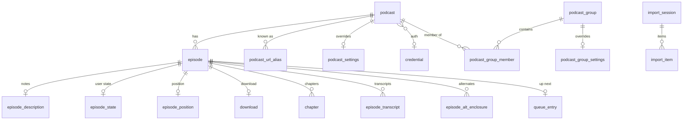

# Neutrodyne design-doc skeleton (BINDING for all design-doc writers)

Written by the lead architect, 2026-10-04. This is a scratch file: **never link to it** (or to the research notes) from any document in the repository.

Precedence: `docs/PLAN.md` > this skeleton > research notes. If a research note contradicts this skeleton, the skeleton wins; if you believe the skeleton is wrong, follow it anyway and record the concern in your document's `## Open questions` section, prefixed `Architect review:`.

Read `docs/PLAN.md` in full before writing. It defines the requirement IDs (R, N), decisions (D1–D67), product-owner decisions (PO-1–PO-20), milestones (M0–M15) and risks. This skeleton adds the canonical names, schema, versions and per-document briefs that keep the nine documents consistent.

---

## 1. Writing conventions

1. **Format.** GitHub-flavoured Markdown. Mermaid for module graphs, state machines, sequences and ER diagrams. Short Kotlin sketches for interfaces and data shapes (aim for ≤ 40 lines per block; no full implementations). Tables for decisions, comparisons, settings and test matrices.
2. **File header** (exactly this shape, first lines of the file):
   ```markdown
   # 0N — <Title from the index below>

   > Status: Draft v1, 2026-10-04 · Implements: R… / N… · Milestones: M… · Honours: D…, D… · Owns: <one line>
   ```
3. **Mandatory sections.** Use the H2 headings listed for your document in [§7](#7-per-document-briefs) **verbatim and in that order** (other documents and PLAN.md link to their anchors). Add H3/H4 freely. Extra H2 sections are allowed only immediately before `## Open questions`. Every document ends with `## Open questions` then `## Sources`.
4. **Anchors.** GitHub anchors lowercase the heading, drop punctuation except `-` and `_`, and turn spaces into `-`. Keep headings you expect to be linked free of `&`, `/`, `:`, `(`, `)`. Table headings in 02 are the bare table name (e.g. `### episode_state` → `#episode_state`).
5. **Cross-references.** Relative links only:
   - other design docs: `[02 Tables](02-data-model.md#tables)`, `[episode](02-data-model.md#episode)`;
   - plan items: `[D39](../PLAN.md#3-key-decisions)`, `[R2.3](../PLAN.md#21-functional-requirements)`, `[N5](../PLAN.md#22-non-functional-requirements)`, `[PO-1](../PLAN.md#po-1-licensing-of-shipped-binaries)` (PO-8 … PO-20: `../PLAN.md#48-further-product-owner-decisions`);
   - milestones: `../PLAN.md#m0-scaffold-and-ci`, `#m1-subscribe-and-ingest-rss`, `#m2-groups-and-group-feeds`, `#m3-import-export-and-backup`, `#m4-playback-core`, `#m5-playback-features-and-system-surfaces`, `#m6-downloads`, `#m7-discovery`, `#m8-youtube-subscriptions-in-all-builds`, `#m9-youtube-playback-and-downloads-in-foss`, `#m10-covers-theming-adaptive-layouts-and-accessibility`, `#m11-release-hardening-and-v10`; v1.x themes M12–M15 at `#74-after-v10-v1x-themes`.
6. **Traceability.** Tag each major section with the requirement IDs it serves and "Delivered in Mx". Use the exact IDs from [§5](#5-ids).
7. **Do not restate** what another document owns ([§8](#8-ownership-matrix)); link to it. In particular: library versions appear in full only in 01; entity definitions appear in full only in 02 (others may show the subset of columns they read or write, with a link); PO decisions and D-ids are defined only in PLAN.md (cite them, do not re-argue them).
8. **Canonical names** in [§2](#2-canonical-names) and [§3](#3-canonical-data-model) are used verbatim. If you need a new name (class, column, work name, setting key), introduce it in your document in a table titled "New names introduced here"; it must not collide with any canonical name. Never rename a canonical name.
9. **Facts and sources.** Carry over the source URLs from the research notes' "Verified versions & facts" tables for every version, platform rule or third-party behaviour you state, either inline or in `## Sources`. Prefix anything not verified with **"Unverified:"**. Never link to the research notes, the scratchpad or this skeleton.
10. **Defaults.** Use the [canonical defaults](#213-canonical-defaults). A default not listed there is defined by the owning document.
11. **Settings.** Every behaviour document that adds user-facing settings includes a settings table: key (`<area>.<name>`), type, default, file (`settings` = portable, `device_settings` = device-bound), UI location, milestone.
12. **Audience.** Future engineers and AI coding sessions implement milestone by milestone from your text. Be literal and specific: class names, file paths, SQL, intent filters, algorithms with numbers, acceptance tests. No marketing filler; no "we could also"; decide.
13. **Mermaid hygiene** (diagrams must render on GitHub): no `;` inside sequence messages, no `<…>` except `<br/>`, quote node labels containing `:` or punctuation (`a[":core:model"]`).
14. **Length.** Dense and complete; typically 500–1,200 lines. Do not create any files other than your assigned document.

---

## 2. Canonical names

### 2.1 Identity

| Item | Value |
|---|---|
| Product name | Neutrodyne |
| Kotlin base package | `app.neutrodyne`; a module's package = base + module path with `:` → `.` (`:core:model` → `app.neutrodyne.core.model`, `:feature:feeds` → `app.neutrodyne.feature.feeds`, `:playback:impl` → `app.neutrodyne.playback.impl`, `:feeds` → `app.neutrodyne.feeds`, `:app` → `app.neutrodyne`). AGP `namespace` = module package |
| `applicationId` | `app.neutrodyne` (working value, PO-8), identical for `foss` and `play`; debug suffix `.debug` |
| Application / activities | `app.neutrodyne.NeutrodyneApplication`, `app.neutrodyne.MainActivity` (`AppCompatActivity`), `app.neutrodyne.ExternalImportActivity` (OPML/backup receiver) |
| Stable component names (never rename) | `app.neutrodyne.playback.impl.NeutrodynePlaybackService`, `app.neutrodyne.download.impl.ManualDownloadJobService`, `app.neutrodyne.download.impl.DownloadActionReceiver`, `app.neutrodyne.core.artwork.ArtworkProvider`, `androidx.media3.session.MediaButtonReceiver` |
| Room database | class `NeutrodyneDatabase`, file `neutrodyne.db`, schema version 1 created in M1 |
| User-Agent | `Neutrodyne/<versionName> (Android <Build.VERSION.RELEASE>; +<repository URL>)` |
| OPML extension namespace | prefix `nd`, URI `urn:neutrodyne:opml:1`; attributes `nd:source` (`rss`/`youtube`), `nd:ytVariants` (e.g. `UULF,UUSH`), `nd:groupColor`, `nd:groupIcon` |
| Backup format | id `neutrodyne-backup`, `formatVersion = 1`, file name `neutrodyne-backup-<yyyy-MM-dd-HHmm>.zip` |
| Convention plugin IDs | `neutrodyne.android.application`, `neutrodyne.android.library`, `neutrodyne.android.compose`, `neutrodyne.android.feature`, `neutrodyne.android.testing`, `neutrodyne.android.lint`, `neutrodyne.hilt`, `neutrodyne.room`, `neutrodyne.jvm.library`, `neutrodyne.quality` (root) |

### 2.2 Gradle modules

Included build `build-logic` (project `:convention`, path `build-logic/convention`). Everything else is in the root build. "JVM" = `neutrodyne.jvm.library` (no Android). Licence is the Unlicense unless stated. **Every module except `:benchmark`, `:playback:cast` and `:feature:widgets` is created as a compiling stub in M0** (PLAN M0) so the dependency rules are enforced from the first commit; the "Content from" column says when real code lands.

| Module | Kind | Content from | Purpose |
|---|---|---|---|
| `:app` | Android app, flavors `foss`/`play` | M0 | Composition root: `NeutrodyneApplication`, `MainActivity`, `ExternalImportActivity`, root scaffold (`NavigationSuiteScaffold`, `NavDisplay`, `PlayerSheet` host), Coil `ImageLoader` factory, WorkManager `Configuration.Provider`, flavor DI bindings in `src/foss` and `src/play`, manifest |
| `:core:model` | JVM | M0 | Plain data types and enums ([§3.2](#32-enums-in-coremodel)): `Podcast`, `Episode`, `EpisodeRow`, `Group`, `FeedSource`, `FeedFilters`, `ArtworkRef`, `RowLive`, … |
| `:core:common` | JVM | M0 | `Clock`, `@Dispatcher(NeutrodyneDispatchers.IO/Default)`, `@ApplicationScope`, `Outcome`, `suspendRunCatching` (rethrows `CancellationException`), redacting `Log` facade |
| `:core:domain` | JVM (+ `androidx.paging:paging-common`) | M0 | Repository **interfaces**, cross-repository use cases, `EffectiveSettingsResolver`, `EpisodeLiveStateSource`, `IngestionEvents` |
| `:core:navigation` | Android library (no Compose) | M0 | `@Serializable` Nav3 keys ([§2.12](#212-navigation-keys)), `EntryProviderInstaller` typealias, `AppNavigator` |
| `:core:database` | Android, `neutrodyne.room` | M1 | `NeutrodyneDatabase`, entities, DAOs, `FeedQueryBuilder`, migrations, exported schemas (`core/database/schemas/`) |
| `:core:datastore` | Android | M0 | `SettingsStore` (`settings`), `DeviceSettingsStore` (`device_settings`) |
| `:core:network` | Android | M0 | Shared `OkHttpClient`, `UserAgentInterceptor`, `AuthInterceptor`, `NetworkMonitor`, network security config |
| `:core:data` | Android | M1 | Implementations of `:core:domain` interfaces; `FeedFetcher`, `FeedRefresher`, `RefreshWorker`, `RefreshScheduler`, `CredentialStore`, search providers, import/backup/restore/snapshot workers, `DbMaintenanceWorker`, `NewEpisodeNotifier` |
| `:core:artwork` | Android | M1 (Coil components), M4 (store) | `ArtworkStore`, `ArtworkSyncWorker`, `ArtworkProvider`, `MonogramRenderer`, `ArtworkColorExtractor` (M10), and the Coil components `ArtworkRefMapper`, `YouTubeThumbnailInterceptor` (M8) and `NeutrodyneImageLoaderFactory` that `:app` installs |
| `:core:designsystem` | Android + Compose | M0 | `NeutrodyneTheme`, colour/typography/shape/motion tokens, `CoverArt`, `MonogramPainter`, `Nd*` component wrappers, Material Symbols vectors |
| `:core:ui` | Android + Compose | M1 | Model-aware shared composables: `EpisodeRow`, `CoverTile`, `GroupMosaic`, `EmptyState`, `ShowNotes` renderer |
| `:core:testing` | Android (test fixtures) | M0 | Fakes of every domain and api interface, `MainDispatcherRule`, `TestClock`, data builders, `fakeImageLoader` |
| `:feeds` | JVM | M1 | I/O-free formats: feed parser (RSS/Atom/iTunes/Podcasting 2.0/PSC), identity keys, URL normaliser, show-notes sanitiser (jsoup), HTML autodiscovery, search-response parsers, OPML reader/writer, NewPipe/LibreTube/Takeout parsers, backup codec |
| `:playback:api` | JVM | M0 | `PlaybackController`, `PlaybackStateSource` and their data types |
| `:playback:impl` | Android | M4 | `NeutrodynePlaybackService`, `PlayerFactory`, `EpisodeResolver`, `QueueProjector`, `PositionTracker`, `SleepTimer`, `Chapters`, `MediaLibraryTree`, `PlayerConnection`, controller implementations |
| `:download:api` | JVM | M0 | `DownloadController`, `LocalMediaIndex`, `DownloadProgressSource` |
| `:download:impl` | Android | M6 | `DownloadEngine`, `DownloadScheduler`, `ManualDownloadJobService`, `DownloadLaneWorker`, `RssTransferSource`, `YouTubeTransferSource`, `StorageRoots`, `AutoDownloadPlanner`, `CleanupWorker`, `DownloadReconciler`, `DownloadNotifications` |
| `:youtube:api` | JVM | M3 (classifier), M8 (rest) | `YtRef`, `YouTubeUrlClassifier`, `YouTubeChannelResolver`, `YouTubeStreamResolver`, `YouTubeEnricher`, `YouTubeCapabilities`, plus pure helpers `YouTubeFeedUrls` (variant URLs), `YouTubeEntryRules` (Shorts detection, title source, availability from Atom signals) and `YouTubeThumbnails` (URL fallback chain) so `:core:data` and `:core:artwork` can apply them without an implementation module |
| `:youtube:impl` | Android | M8 | Layer A network code: `HtmlAutodiscoveryChannelResolver` (incl. avatar/banner extraction), `OEmbedClient`, `ExternalOnlyYouTubeStreamResolver` (bound in `play`) |
| `:youtube:streams` | Android, **GPL-3.0-or-later**, `foss` only | M9 | Layer B: NewPipe Extractor wrapper: `NpeYouTubeStreamResolver`, `InnertubeChannelResolver`, `NpeEnricher`, `OkHttpNpeDownloader`, channel search |
| `:feature:feeds` | Android feature | M1 (All), M2 | Feeds destination: group tabs + pager, feed lists, filter chips, "All groups" sheet |
| `:feature:library` | Android feature | M1 | Cover grid, Podcasts/Groups views, selection mode |
| `:feature:groups` | Android feature | M2 | Group editor, manage groups, add-to-groups sheet, group settings |
| `:feature:podcast` | Android feature | M1 | Podcast detail and preview, podcast settings |
| `:feature:episode` | Android feature | M1 | Episode detail, show notes, chapters list |
| `:feature:player` | Android feature | M4 | `PlayerSheet` (mini/full), speed and sleep-timer sheets |
| `:feature:queue` | Android feature | M4 | Up next |
| `:feature:downloads` | Android feature | M6 | Downloads screen |
| `:feature:discover` | Android feature | M1 (add by URL), M7 | Discover, search results, add-podcast sheet |
| `:feature:importexport` | Android feature | M3 | Import preview/progress/report, export, backup/restore |
| `:feature:settings` | Android feature | M0 | Settings pages, About, Licences, Diagnostics (M11) |
| `:benchmark` | `com.android.test` | M11 | Macrobenchmarks and baseline-profile generator |
| `:playback:cast` | Android, `play` only | v1.x (M13) | Reserved: Chromecast |
| `:feature:widgets` | Android feature | v1.x (M13) | Reserved: Glance widgets |

### 2.3 Dependency rules

Enforced with `com.jraska.module.graph.assertion` (rules written in 01):

1. `:app` → anything. Nothing → `:app`. Only `:app` has product flavors. `:youtube:streams` is added only as `fossImplementation`; `:playback:cast` (v1.x) only as `playImplementation`.
2. `:feature:*` → `:core:{domain, model, common, designsystem, ui, navigation}`, `:playback:api`, `:download:api`, `:youtube:api`. Never feature → feature; never → `:core:{data, database, datastore, network, artwork}`, `*:impl`, `:youtube:streams`.
3. `:core:domain` → `:core:{model, common}`, `:playback:api`, `:download:api`, `:youtube:api`, `paging-common`.
4. `:core:data` → `:core:{domain, model, common, database, datastore, network, artwork}`, `:feeds`, `:youtube:api`.
5. `:core:artwork` → `:core:{model, common, database, network}`, `:youtube:api`.
6. `:playback:impl` → `:playback:api`, `:download:api`, `:youtube:api`, `:core:{domain, model, common, database, datastore, network, artwork}`. `:download:impl` → `:download:api`, `:youtube:api`, `:core:{domain, model, common, database, datastore, network, artwork}`. `:youtube:impl` and `:youtube:streams` → `:youtube:api`, `:core:{model, common, network}`. No impl → `:core:data`, no impl → another impl. YouTube Atom feeds are fetched and parsed by the generic refresh engine in `:core:data` (03) using `:youtube:api` helpers; no YouTube module parses Atom.
7. `:core:designsystem` → `:core:model` only. `:core:ui` → `:core:{designsystem, model, common}`. `:core:navigation` → nothing project-internal.
8. JVM-only: `:core:model`, `:core:common`, `:core:domain`, `:feeds`, `:*:api`. `:feeds` depends on nothing project-internal.
9. `:core:testing` → `:core:{domain, model, common}`, `:*:api`.

Implementations are bound to `:core:domain`/`*:api` interfaces with Hilt `@Binds` modules inside the implementing module; `:app` aggregates them.

### 2.4 Build flavors and build types

| Item | `foss` | `play` |
|---|---|---|
| Dimension | `distribution` | `distribution` |
| Channels | GitHub Releases (+ Obtainium), IzzyOnDroid, F-Droid | Google Play (publication gated by PO-2) |
| Binary licence | GPL-3.0-or-later (contains `:youtube:streams`) | No GPL-3.0 code: Unlicense code + permissive dependencies (plus the GPL-2.0-with-Classpath-Exception desugaring runtime if 01 cannot limit desugaring to `foss`) |
| YouTube | Layers A + B: subscribe, stream audio, download, enrich, search, back catalogue | Layer A only: subscribe, browse, "Watch on YouTube" |
| `YouTubeCapabilities` | `inAppPlayback = true, downloads = true, channelSearch = true, enrichment = true, backCatalogue = true` | all `false` |
| `YouTubeStreamResolver` binding | `NpeYouTubeStreamResolver` (`:youtube:streams`) | `ExternalOnlyYouTubeStreamResolver` (returns `Unsupported`) |
| Proprietary SDKs | none (CI ban) | none in v1.0; Cast in v1.x |
| Self-update / links to the other flavor | none | none (Play policy) |

Build types: `debug` (`applicationIdSuffix = ".debug"`, `versionNameSuffix = "-debug"`), `release` (R8 full mode via `optimization { enable = true }`, `-dontobfuscate` in `:app` keep rules, signed only when `NEUTRODYNE_KEYSTORE*` env vars exist). The baseline-profile plugin adds its own variants in M11.

`BuildConfig` fields (no timestamps, ever): `PODCASTINDEX_KEY`, `PODCASTINDEX_SECRET` (empty when the Gradle property is absent), `ACRA_MAILTO` (empty disables ACRA), `REPO_URL`.

Flavor-specific DI lives only in `:app/src/foss/kotlin/app/neutrodyne/flavor/FlavorModule.kt` and `:app/src/play/kotlin/app/neutrodyne/flavor/FlavorModule.kt` (plus Hilt modules shipped inside `:youtube:streams`).

### 2.5 Key interfaces per module

Signatures are canonical; documents may add members but not rename or change these. Owning document in brackets.

```kotlin
// :core:model  [02, plus owners of each type]
sealed interface FeedSource {
    data object All : FeedSource
    data object Ungrouped : FeedSource
    data class Group(val groupId: Long) : FeedSource
    data class Podcast(val podcastId: Long) : FeedSource
}
data class FeedFilters(val unplayedOnly: Boolean = false, val downloadedOnly: Boolean = false,
    val inProgressOnly: Boolean = false, val media: MediaFilter = MediaFilter.ALL, val minSortDate: Long? = null)
data class ArtworkRef(val key: String, val url: String?, val version: Int)
data class RowLive(val positionMs: Long?, val durationMs: Long?, val downloadState: DownloadState?,
    val waitReason: WaitReason?, val downloadedBytes: Long?, val totalBytes: Long?,
    val isNowPlaying: Boolean, val isPlaying: Boolean)
data class NewEpisodes(val podcastId: Long, val episodeIds: List<Long>, val initialFetch: Boolean)
```

| Module | Interface / class | Purpose | Owner doc |
|---|---|---|---|
| `:core:domain` | `PodcastRepository` | Observe podcasts and library tiles; unsubscribe; `includeInAll`; custom title | 03 |
| | `EpisodeRepository` | Observe episode detail and description; set played/unplayed (bulk), favourite | 03 (played semantics: 06) |
| | `FeedRepository` | `pagedFeed(source: FeedSource, filters: FeedFilters, order: FeedOrder): Flow<PagingData<EpisodeRow>>`; `observeGroupCounts(sinceMs: Long)` | 05 (SQL: 02) |
| | `GroupRepository` | Group CRUD, reorder, delete-with-undo, memberships both directions | 05 |
| | `QueueRepository` | Up next edits, `play_session` (current + context), `observeVirtualQueue(k: Int)` | 06 |
| | `RefreshController` | `refreshNow(scope: RefreshScope)`, `reschedulePeriodic()`, `observeStatus()`; `RefreshScope = All \| Group(id) \| Podcasts(ids)` | 03 |
| | `AddPodcastResolver` | `resolve(input: String): AddResolution` (Feed / Choose / YouTube / Failure) | 03 (YouTube branch: 04) |
| | `SubscribeUseCase` | Persist a previewed feed or YouTube channel with group IDs | 03 |
| | `SearchRepository` | Aggregated directory search, charts | 03 |
| | `ImportRepository` | Import sessions: create from `ImportSource(uri: String, displayName: String?)`, preview, confirm, per-item retry/edit/remove | 05 |
| | `BackupRepository` | Create backup, inspect, restore (`RestoreMode.MERGE/REPLACE`) | 05 |
| | `SettingsRepository` | Typed flows over both DataStore files | 01 (keys: each doc) |
| | `EffectiveSettingsResolver` | Resolve playback/auto-download/notification/refresh settings with source attribution (D45) | 05 |
| | `EpisodeLiveStateSource` | `observe(visibleIds: Flow<Set<Long>>): Flow<Map<Long, RowLive>>` | 08 (inputs: 06, 07) |
| | `IngestionEvents` | `val newEpisodes: SharedFlow<NewEpisodes>` | 03 |
| `:playback:api` | `PlaybackController` | `playEpisode(episodeId)`, `playFeed(source, filters, order, startEpisodeId?)`, play/pause/seek/skip, `setSpeed(speed, scope: SettingScope)`, `setSkipSilence(enabled, scope)`, `setSleepTimer(mode)`, chapter next/prev | 06 |
| | `PlaybackStateSource` | `nowPlaying: StateFlow<NowPlaying?>`, `positionTicks`, `sleepTimer`, `currentChapter`, `effectivePlayback` (value + source) | 06 |
| `:download:api` | `DownloadController` | `request(episodeIds, trigger: DownloadLane, allowMetered: Boolean?)`, pause/resume/cancel/retry/promote, `delete(episodeIds, byUser)`, observe one/all, storage usage | 07 |
| | `LocalMediaIndex` | `localUriOrNull(episodeId: Long): String?` (synchronous, in-memory mirror; used on the player loader thread) | 07 |
| | `DownloadProgressSource` | `observe(ids: Set<Long>): Flow<Map<Long, LiveProgress>>` (≤ 4 Hz) | 07 |
| `:youtube:api` | `YtRef` + `YouTubeUrlClassifier` | Pure parsing of any YouTube input (`Channel`, `Handle`, `LegacyPath`, `Video`, `Playlist`, `Query`) | 04 |
| | `YouTubeChannelResolver` | `resolve(ref: YtRef): ChannelResolution` (UC ID, title, avatar URL, banner URL) | 04 |
| | `YouTubeStreamResolver` | `resolveAudio(videoId: String, pref: AudioPref): ResolveResult` (`Ok`, `Unavailable(reason)`, `Transient(cause)`, `Unsupported`); `invalidate(videoId)` | 04 |
| | `YouTubeEnricher` | Durations/availability for new video IDs (`foss`) | 04 |
| | `YouTubeCapabilities` | Flavor capability flags ([§2.4](#24-build-flavors-and-build-types)) | 04 |
| `:core:artwork` | `ArtworkStore` | `pinnedFile(key): File?`, `pin(ref, reason: PinReason, ownerId)`, `unpin(…)`, `contentUri(key, version): String` | 08 |
| `:feeds` | `FeedParser` (`VERSION`), `EpisodeKeys` (`VERSION`), `UrlNormalizer`, `PodcastGuid`, `ShowNotesSanitizer` → `ShowNotesDocument`, `Autodiscovery` | Feed formats | 03 |
| | `OpmlReader`, `OpmlWriter`, `ImportSourceSniffer`, `BackupCodec` | OPML and backup formats | 05 |
| | `NewPipeSubscriptions`, `LibreTubeBackupParser`, `TakeoutSubscriptionsParser` | YouTube import formats | 04 |
| `:core:navigation` | `EntryProviderInstaller = EntryProviderScope<NavKey>.() -> Unit`; `AppNavigator` (`push(key)`, `selectTab(key)`, `pop()`) | Navigation contracts | 08 (wiring: 01) |

### 2.6 URIs, media IDs, authorities, intents

| Name | Format | Notes / owner |
|---|---|---|
| Player media URI | `neutrodyne://episode/{episodeId}` | Every playable episode (RSS and YouTube). `?mode=video` reserved for v1.x. Resolved by `EpisodeResolver` (06). No `yt://` scheme exists (D39) |
| `MediaItem.mediaId` | `episode:{episodeId}` | Queue diffing, Auto, resumption (06) |
| Browse-tree media IDs | `root`, `upnext`, `groups`, `group:{groupId}`, `downloads`, `podcasts`, `podcast:{podcastId}` | Android Auto / AVRCP (06) |
| Cache keys | RSS `ep:{episodeId}:{enclosureFingerprint}`; YouTube `yt:{videoId}:{itag}` | `SimpleCache` (06, 04) |
| Artwork keys | `u-{sha1hex(normalisedUrl)}` (fetched image), `m-{sha1hex(feedKey)}` (monogram), `g-{groupUuid}` (group mosaic) | URL-safe (08) |
| Artwork content URI | `content://${applicationId}.artwork/{artworkKey}?v={version}` | Read-only exported provider `ArtworkProvider` (08; consumers 06) |
| FileProvider | authority `${applicationId}.fileprovider`, paths `cache/export/`, download roots | Export/share (05, 07) |
| YouTube canonical feed URL (stored in `podcast.feedUrl`) | `https://www.youtube.com/feeds/videos.xml?channel_id={UC…}` | Export/dedupe identity (04) |
| YouTube polled URLs (computed, never stored) | `…/feeds/videos.xml?playlist_id=UULF{id}` (`UUSH`, `UULV` when opted in; `{id}` = channel ID without `UC`) | 04 |
| YouTube episode guid / watch URL | `yt:video:{videoId}` / `https://www.youtube.com/watch?v={videoId}` | 04 |
| Exported VIEW schemes (subscribe) | `feed:`, `pcast:`, `podcast:`, `itpc:`, `https://podcasts.apple.com/…` (not App Links), `neutrodyne://subscribe?url={urlEncoded}` | `MainActivity` → `AddPodcastKey` (03) |
| Share target | `ACTION_SEND text/plain` → `MainActivity` → `AddPodcastKey(input)` | 03, 04 |
| File import | `ExternalImportActivity`: VIEW/SEND `text/x-opml`, `text/xml`, `application/xml`; SEND `application/octet-stream`; API 31+ alias with `pathSuffix=".opml"`; `application/zip` for backups | 05 |
| Internal deep links (explicit intents only, not exported) | `neutrodyne://open/episode/{id}`, `/podcast/{id}`, `/group/{groupUuid}`, `/downloads`, `/player`, `/import/{sessionId}`, `/settings/{page}`, `/diagnostics` | Notifications, widgets (08) |
| JobScheduler namespace | `downloads` | 07 |

### 2.7 Session custom commands

| Action | Args | Owner |
|---|---|---|
| `nd.SLEEP_SET` | `mode` (`minutes`/`end_of_episode`/`off`; `end_of_chapter` v1.x), `minutes` | 06 |
| `nd.SLEEP_EXTEND` | `minutes` | 06 |
| `nd.SPEED_CYCLE` | — (notification overflow button) | 06 |
| `nd.SPEED_SET_SCOPE` | `speed`, `scope` (`podcast`/`group`/`global`) | 06 |
| `nd.SKIP_SILENCE` | `enabled`, `scope` | 06 |
| `nd.BOOST` | `db`, `scope` (v1.x) | 06 |
| `nd.CHAPTER_NEXT`, `nd.CHAPTER_PREV` | — | 06 |
| `nd.PLAY_CONTEXT` | `contextType`, `contextId`, `order`, `filterFlags`, `startEpisodeId?` | 06 |

### 2.8 WorkManager unique work names and job IDs

| Unique name | Kind | Worker | Module | Policy | Owner |
|---|---|---|---|---|---|
| `refresh-periodic` | periodic (interval per D25, flex = interval / 3) | `RefreshWorker` | `:core:data` | `UPDATE` | 03 |
| `refresh-now` | one-time, expedited (`RUN_AS_NON_EXPEDITED_WORK_REQUEST`) | `RefreshWorker` | `:core:data` | `APPEND_OR_REPLACE` | 03 |
| `refresh-continuation` | one-time, 1 min delay | `RefreshWorker` | `:core:data` | `KEEP` | 03 |
| `import-{sessionId}` | one-time, expedited, connected | `ImportFetchWorker` | `:core:data` | `KEEP` | 05 |
| `backup-restore` | one-time | `RestoreWorker` | `:core:data` | `KEEP` | 05 |
| `backup-auto-snapshot` | periodic 24 h, idle + charging | `AutoSnapshotWorker` | `:core:data` | `UPDATE` | 05 |
| `backup-auto-snapshot-now` | one-time, 10 min delay | `AutoSnapshotWorker` | `:core:data` | `REPLACE` | 05 |
| `backup-scheduled` | periodic weekly (v1.x) | `ScheduledBackupWorker` | `:core:data` | `UPDATE` | 05 |
| `artwork-sync` | one-time, network + storage-not-low | `ArtworkSyncWorker` | `:core:artwork` | `APPEND_OR_REPLACE` | 08 |
| `download-lane-MANUAL` | one-time, expedited (API < 34 or UIDT fallback) | `DownloadLaneWorker` | `:download:impl` | `KEEP` (continuations `APPEND_OR_REPLACE`) | 07 |
| `download-lane-AUTO` | one-time, policy constraints, never expedited | `DownloadLaneWorker` | `:download:impl` | `KEEP` (continuations `APPEND_OR_REPLACE`) | 07 |
| `download-cleanup` | periodic 24 h | `CleanupWorker` | `:download:impl` | `UPDATE` | 07 |
| `download-reconcile` | one-time at app start | `DownloadReconcileWorker` | `:download:impl` | `KEEP` | 07 |
| `download-move` | one-time | `DownloadMoveWorker` | `:download:impl` | `APPEND_OR_REPLACE` | 07 |
| `db-maintenance` | periodic 24 h, idle | `DbMaintenanceWorker` | `:core:data` | `UPDATE` | 02 |

Tags: `refresh`, `import`, `backup`, `artwork`, `download`, `maintenance`. JobScheduler: namespace `downloads`, `JOB_ID_MANUAL = 1001` (`ManualDownloadJobService`) — stable forever. Workers use `@HiltWorker`; the default `WorkManagerInitializer` is removed in the manifest.

### 2.9 Notification channels and IDs

| Channel ID | User-visible name | Importance | Owner | Content |
|---|---|---|---|---|
| `playback` | Playback | LOW | 06 | Media3 media notification (`DefaultMediaNotificationProvider` configured with this ID) |
| `downloads` | Downloads | LOW | 07 | UIDT / foreground progress (one aggregated notification) |
| `download_errors` | Download problems | DEFAULT | 07 | Failed downloads, storage full |
| `import_backup` | Import and backup | LOW | 05 | Import progress and report, restore, backup-folder problems |
| `alerts` | App alerts | DEFAULT | 06, 04 | "Tap to resume", "YouTube playback is temporarily broken" |
| `new_episodes` | New episodes | DEFAULT | 03 | Default channel for podcasts in no notifying group |
| `new_episodes_{groupUuid}` | the group's name | DEFAULT | 03 (lifecycle: 05) | One per group with notifications on; in channel group `grp_new_episodes` |

Notification ID ranges: 1000–1999 playback, 2000–2999 downloads (`NOTIF_ID_MANUAL_DOWNLOAD = 2001`), 3000–3999 import/backup, 4000–4999 alerts, 5000+ new episodes. `POST_NOTIFICATIONS` is requested contextually (first download, first notification opt-in), never at launch; media notifications are exempt.

### 2.10 DataStore files and setting keys

| File | Path | Backed up | Contents |
|---|---|---|---|
| `settings` | `filesDir/datastore/settings.preferences_pb` | yes (Auto Backup and backup ZIP `settings.json` via whitelist) | Portable preferences |
| `device_settings` | `filesDir/datastore/device_settings.preferences_pb` | never | SAF grants, volume UUIDs, prompt flags, selected tab/group, onboarding flags |

- Key format `<area>.<name>` in snake_case, areas: `appearance`, `feeds`, `discover`, `groups`, `playback`, `downloads`, `youtube`, `backup`, `privacy`, `diagnostics`, `ui` (device-bound UI state).
- Only one `DataStore` instance per file (singleton providers in `:core:datastore`).
- Secrets (Basic-auth passwords, a user's Podcast Index key/secret) are never stored in DataStore: they go through `CredentialStore` (Android Keystore AES-GCM) into the [`credential`](#33-tables) table.
- Detecting a fresh install uses Room's `onCreate` callback, never a DataStore flag.

### 2.11 Files and directories

| Path | Purpose | Owner |
|---|---|---|
| `databases/neutrodyne.db` | Room database | 02 |
| `filesDir/datastore/` | DataStore files | 01 |
| `filesDir/artwork/{artworkKey}.jpg` / `.png` | `ArtworkStore` (≤ 1024 px) | 08 |
| `filesDir/media-cache/` | Media3 `SimpleCache` (streaming only) | 06 |
| `filesDir/backup/auto-snapshot.zip` (`.tmp` while writing; `restored-{ts}.zip` after restore) | Auto Backup snapshot | 05 |
| `filesDir/downloads/` | Internal download root (`rootId = "int"`) | 07 |
| `getExternalFilesDir(DIRECTORY_PODCASTS)` = `Android/data/{applicationId}/files/Podcasts/` | Default download root (`rootId = "ext:primary"`; removable `ext:{volumeUuid}`) | 07 |
| `<root>/.partial/{episodeId}.part` | In-progress downloads | 07 |
| `<root>/<Podcast Title> [p<podcastId>]/<yyyy-MM-dd> <Episode Title> [e<episodeId>].<ext>` | Completed downloads (RSS and YouTube, D49) | 07 |
| `cacheDir/coil/` | Coil disk cache (256 MB) | 08 |
| `cacheDir/feeds/` | Temp feed bodies | 03 |
| `cacheDir/import/{sessionId}.bin` | Copied import payloads (deleted 7 days after `DONE`) | 05 |
| `cacheDir/export/` | Files handed to the share sheet | 05 |

### 2.12 Navigation keys

All in `:core:navigation`, `@Serializable`, implementing `NavKey`, carrying IDs and strings only.

| Key | Kind | Owner feature |
|---|---|---|
| `FeedsKey`, `LibraryKey`, `UpNextKey`, `DownloadsKey`, `DiscoverKey` (sealed `TopLevelKey`) | top-level tabs | feeds, library, queue, downloads, discover |
| `PodcastKey(podcastId: Long)` | detail pane | podcast |
| `PodcastPreviewKey(feedUrl: String)` | detail pane (unsubscribed, in-memory) | podcast |
| `EpisodeKey(episodeId: Long)` | detail / extra pane | episode |
| `GroupEditKey(groupId: Long?)` (null = new) | screen | groups |
| `GroupsManageKey` | screen | groups |
| `GroupSettingsKey(groupId: Long)`, `PodcastSettingsKey(podcastId: Long)` | screen | groups, podcast |
| `DirectoryKey(query: String?, genreId: Int?)` | screen | discover |
| `ImportKey(sessionId: Long)`, `BackupKey` | screen | importexport |
| `SettingsKey(page: SettingsPage)` (`APPEARANCE, FEEDS, DISCOVER, PLAYBACK, DOWNLOADS, YOUTUBE, BACKUP, PRIVACY, ABOUT`), `LicencesKey`, `DiagnosticsKey` | screen | settings |
| `AddPodcastKey(input: String?)` | sheet | discover |
| `AddToGroupsKey(podcastIds: List<Long>)` | sheet | groups |
| `AllGroupsKey` | sheet | feeds |
| `ExportKey(groupId: Long?)` | dialog | importexport |
| `SleepTimerKey`, `SpeedKey` | sheet | player |

The player is **not** a key: `PlayerSheet` lives at the root (D56). Sheets/dialogs are Nav3 entries rendered by a bottom-sheet/dialog scene strategy (Unverified: whether Nav3 1.2 ships one or the `nav3-recipes` one must be copied — M0 spike).

### 2.13 Canonical defaults

| Setting / constant | Default | Owner |
|---|---|---|
| Global refresh interval; refresh tick | 4 h; tick = min effective interval, floor 1 h | 03 |
| Refresh constraints | connected network, battery not low (Wi-Fi-only is an option) | 03 |
| Refresh parallelism; worker soft deadline | 6 global, 2 per host; 8 min, then continuation | 03 |
| Feed HTTP | connect 15 s, read 30 s, call 120 s; body cap 32 MB | 03 |
| Refresh on app foreground | on, when the last global refresh is older than the interval | 03 |
| Paged feeds on subscribe | follow `rel=next` in background up to 50 pages / 5,000 items | 03 |
| New-episode notifications | off globally, per group and per podcast | 03 |
| Search providers | Apple on, fyyd on, Podcast Index only with a key; 8 s per-provider timeout | 03 |
| Apple rate limiting | token bucket 20/min; 600 ms debounce, ≥ 3 chars; in-memory LRU 30 min | 03 |
| Group names | 1–40 chars, emoji allowed, unique by `nameKey` | 05 |
| Group `feedOrder` / `playOrder` | `NEWEST_FIRST` / `NEWEST_FIRST` | 05 |
| Ungrouped tab | off | 05 |
| Group counts window | 30 days, or the group's `hideOlderThanDays` if smaller | 05 |
| Delete-group undo | 10 s | 05 |
| OPML export | grouped (hybrid), include YouTube on, include passwords off | 05 |
| Import options | treat existing episodes as played: off; notifications for imported podcasts: off | 05 |
| Restore mode | Merge | 05 |
| Auto snapshot | every 24 h (idle + charging) + 10 min after significant changes; size guard 20 MB | 05 |
| Projection window K | 20 | 06 |
| Position save | every 5 s while playing + pause/seek/transition/destroy | 06 |
| Mark played | remaining ≤ max(30 s, 3 % of duration) | 06 |
| Start at saved position on transition | when saved > 5 s and < duration − 30 s | 06 |
| Skip back / forward | 10 s / 30 s | 06 |
| Speed | 1.0×; range 0.5–3.0×, step 0.05 | 06 |
| Pause for navigation prompts (speech mode) | on | 06 |
| Hardware next / previous | next / previous episode (setting: skip forward / back) | 06 |
| Smart resume | on: rewind 5 s when resuming after > 5 min paused | 06 |
| Sleep timer | counts only while playing; 10 s fade-out | 06 |
| Streaming cache | 500 MB | 06 |
| Stream on metered network | Allow (Ask / Never available) | 06 |
| Load control | min buffer 60 s, max 600 s, back buffer 60 s | 06 |
| Parallel downloads | 3 global, 2 per host, 1 YouTube | 07 |
| Manual download on metered | Ask (Always / Never) | 07 |
| Auto-download | off; when on: keep newest 3 unplayed (YouTube 2), unmetered, no charging requirement, no back-catalogue (D67) | 07 |
| Delete after played | 24 h, auto and manual downloads | 07 |
| Never auto-deleted | favourites, playing episode, next 3 Up-next items, unplayed manual downloads | 07 |
| Storage cap | unlimited (presets 1 / 2 / 5 / 10 / 20 GB) | 07 |
| Download retries | in-runner 2 s / 8 s / 30 s; then `min(30 s · 2^attempt, 6 h)` ± 20 % jitter; `FAILED` after attempt 8 | 07 |
| Free-space check | `(totalBytes ?: estimate ?: 150 MB) + 200 MB` | 07 |
| Progress cadence | bus ≤ 4 Hz; notification ≤ 1 Hz | 07 |
| Stale `.part` cleanup | 14 days untouched | 07 |
| `hasFragileUserData` | true | 07 |
| YouTube variants | long-form only (`UULF`) | 04 |
| YouTube audio | itag 140 > 251 > 250 > 139 > 249; original track; non-DRC | 04 |
| YouTube resolved-URL TTL | min(`expire` − 10 min, 5 h), memory only | 04 |
| YouTube concurrency | enrichment 2, downloads 1 (0.5–2 s jitter between 10 MiB chunks; 429 → ≥ 30 min backoff) | 04, 07 |
| YouTube circuit breaker | 5 parse failures within 1 h → pause 6 h (12 h if it re-opens within 24 h) | 04 |
| YouTube outage notice | > 50 % of YouTube feeds fail in one refresh cycle | 04 |
| Artwork store | ≤ 1024 px; JPEG q88 (PNG when alpha) | 08 |
| Coil | memory 20 % (25 % of that while backgrounded), disk 256 MB | 08 |
| Library grid | min cell 100 dp (72 / 100 / 152) | 08 |
| Row swipe actions | off in Feeds, on elsewhere | 08 |
| Theme | follow system; dynamic colour on; artwork tint on; pure black off | 08 |
| Episode retention | delete `inFeed = 0` episodes after 90 days unless protected (D23) | 02 |
| Crash reporting | ACRA dialog per crash; disabled when `ACRA_MAILTO` is empty | 09 |

---

## 3. Canonical data model

02 owns the full Kotlin `@Entity` definitions, types, defaults, indices and SQL; everyone else uses these table and column names. Conventions: table names `snake_case`; column names `camelCase` (Room default from property names); all timestamps epoch milliseconds UTC (`Long`); booleans as Room `Boolean`; enums stored as `TEXT` by name; UUIDs as `TEXT` (D21); `foreign_keys` pragma on; WAL.

### 3.1 Churn classes (drives D16)

| Class | Tables | May be joined by paged list queries? |
|---|---|---|
| Low-churn (user edits, refresh, state transitions) | `podcast`, `episode`, `podcast_group`, `podcast_group_member`, `podcast_group_settings`, `podcast_settings`, `episode_state`, `download`, `artwork` | Yes |
| High-churn (every few seconds) | `episode_position` | **Never**; read via `EpisodeLiveStateSource` `IN (:visibleIds)` queries |
| Other | everything else | Not needed by lists |

### 3.2 Enums in `:core:model`

`SourceType { RSS, YOUTUBE_CHANNEL, YOUTUBE_PLAYLIST /* reserved, not creatable in v1 */ }` · `PodcastStatus { PENDING_FIRST_FETCH, ACTIVE }` · `FeedOrder { NEWEST_FIRST, OLDEST_FIRST }` · `MediaFilter { ALL, AUDIO, VIDEO }` · `GroupKind { MANUAL, SMART /* reserved */ }` · `MemberSource { MANUAL, RULE /* reserved */ }` · `Availability { AVAILABLE, UPCOMING, LIVE, MEMBERS_ONLY, AGE_RESTRICTED, REGION_BLOCKED, PRIVATE, KIDS_ONLY, UNAVAILABLE }` · `ChapterSource { PODCASTING20_JSON, PSC, ID3, MP4, YOUTUBE_DESC }` · `PositionSource { STREAM, DOWNLOAD }` · `ContextType { GROUP, PODCAST, ALL, UNGROUPED, DOWNLOADS, EXTERNAL }` · `SettingScope { PODCAST, GROUP, GLOBAL }` · `NetworkPolicy { UNMETERED, ANY }` · `DeleteAfter { IMMEDIATELY, AFTER_24H, NEVER }` · `DownloadState { QUEUED, RESOLVING, DOWNLOADING, PAUSED, VERIFYING, COMPLETED, MISSING, FAILED }` · `DownloadLane { MANUAL, AUTO }` · `WaitReason { NONE, NETWORK, UNMETERED_NETWORK, CHARGING, STORAGE, BACKOFF, SYSTEM, NEEDS_FOREGROUND, SLOT }` · `DownloadError { HTTP_NOT_FOUND, HTTP_GONE, HTTP_AUTH, HTTP_CLIENT, HTTP_SERVER, HTTP_RATE_LIMITED, NETWORK_IO, NOT_MEDIA, SIZE_MISMATCH, STORAGE_FULL, STORAGE_UNAVAILABLE, YT_UNAVAILABLE, YT_EXTRACTION, YT_FORBIDDEN, UNSUPPORTED_STREAM, CANCELLED_BY_SYSTEM, UNKNOWN }` · `SourceKind { RSS_ENCLOSURE, YOUTUBE }` · `ImportFormat { OPML, NEWPIPE_JSON, LIBRETUBE_JSON, TAKEOUT_CSV, NEUTRODYNE_BACKUP }` · `ImportState { PREVIEW, COMMITTED, FETCHING, DONE, CANCELLED }` · `ImportItemStatus { PREVIEW, QUEUED, SUBSCRIBED, ALREADY_SUBSCRIBED, MERGED, DUPLICATE_IN_FILE, INVALID_URL, NOT_A_FEED, NO_MEDIA, AUTH_REQUIRED, GONE, FETCH_FAILED, YOUTUBE_UNSUPPORTED_YET }` · `PinReason { SUBSCRIPTION, DOWNLOAD, GROUP_MOSAIC, MONOGRAM }`.

### 3.3 Tables

Key columns only; 02 completes every column list. "FK→x CASCADE" = foreign key with `ON DELETE CASCADE`.

| Table | Key columns | Relationships and constraints | Written by (owner) |
|---|---|---|---|
| `podcast` | `id` PK; `sourceType`; `feedUrl` (current fetch URL); `feedKey` UNIQUE (= `UrlNormalizer.forIdentity(feedUrl)`, the cross-device podcast key); `youtubeChannelId` (UC…, nullable); `youtubeVariants` (bitmask LONG_FORM=1, SHORTS=2, LIVE=4); `podcastGuid`, `podcastGuidDerived`; `title`, `customTitle`, `author`, `descriptionHtml`, `link`, `language`, `categoriesJson`, `explicit`, `showType`, `medium`, `locked`, `complete`; `artworkUrl`, `artworkKey`, `bannerUrl`; `status` (`PodcastStatus`), `initialFetch`, `includeInAll` (default 1), `subscribedAt`, `latestEpisodeAt`; validators `etag`, `lastModified`, `contentSha256`, `parserVersion`, `lastParseOk`; scheduling `lastAttemptAt`, `lastSuccessAt`, `nextRefreshAt`, `failureCount`, `lastErrorKind`, `lastErrorDetail`, `gone`, `needsCredentials`, `ttlMinutes`, `updateFrequencyRrule`; paging `pagingNextUrl`, `pagingComplete`; `hubUrl`, `usesPodping`; `credentialId` | `credentialId` FK→`credential` SET NULL; indices `feedKey` (unique), `nextRefreshAt`, `podcastGuid` | ingestion (03), YouTube fields (04), `includeInAll`/`customTitle` (05) |
| `podcast_url_alias` | `url` PK; `podcastId` | FK→`podcast` CASCADE; index `podcastId` | 03 |
| `credential` | `id` PK; `origin`; `username`; `secretCipher` (BLOB); `iv` (BLOB); `createdAt` | Keystore AES-GCM; also holds a user Podcast Index key (`origin = "podcastindex"`) | 03 |
| `podcast_settings` | `podcastId` PK; nullable overrides: `playbackSpeed`, `skipSilence`, `boostDb`, `introSkipMs`, `outroSkipMs`, `autoDownload`, `autoDownloadKeepLatest`, `autoDownloadNetwork`, `autoDownloadRequireCharging`, `deleteAfterPlayed`, `includeVideoInAutoDownload`, `notifyNewEpisodes`, `refreshIntervalMinutes` | FK→`podcast` CASCADE; null = inherit (D20) | 05 (consumers 06, 07, 03) |
| `podcast_group` | `id` PK; `uuid` UNIQUE (TEXT); `name`; `nameKey` UNIQUE; `sortOrder`; `colorArgb`; `iconKey`; `kind`; `ruleJson`; `feedOrder`; `playOrder`; `filterFlags` (UNPLAYED=1, DOWNLOADED=2, IN_PROGRESS=4); `mediaFilter`; `hideOlderThanDays`; `showAsTab`; `lastViewedAt`; `createdAt`; `updatedAt` | index `sortOrder` | 05 |
| `podcast_group_member` | PK (`groupId`, `podcastId`) `WITHOUT ROWID`; `sortOrder`; `addedAt`; `source` | FK→`podcast_group` CASCADE, FK→`podcast` CASCADE; index (`podcastId`, `groupId`) | 05 |
| `podcast_group_settings` | `groupId` PK; same nullable columns as `podcast_settings` | FK→`podcast_group` CASCADE | 05 |
| `episode` | `id` PK; `podcastId`; `identityKey`; `guid`; `title`; `pubDate`; `rawPubDate`; `sortDate`; `feedOrder`; `firstSeenAt`; `lastSeenAt`; `inFeed`; `isNew`; `enclosureUrl`; `enclosureType`; `enclosureLength`; `externalMediaId` (YouTube video ID); `isVideo`; `durationMs` (feed hint); `season`; `seasonName`; `episodeNumber`; `episodeDisplay`; `episodeType`; `explicit`; `imageUrl` (null when equal to podcast art); `artworkKey`; `link`; `chaptersUrl`; `chaptersType`; `snippet` (≤ 200 chars plain text); `contentHash`; `availability`; `isShort` | FK→`podcast` CASCADE; UNIQUE (`podcastId`, `identityKey`); indices (`podcastId`, `sortDate`), (`sortDate`), (`firstSeenAt`). **Written only by ingestion** (D15) | 03 (YouTube fields 04) |
| `episode_description` | `episodeId` PK; `html` | FK→`episode` CASCADE | 03 |
| `episode_transcript` | PK (`episodeId`, `url`); `type`; `language`; `rel` | FK→`episode` CASCADE | 03 |
| `episode_alt_enclosure` | PK (`episodeId`, `ordinal`); `type`; `length`; `bitrate`; `height`; `lang`; `title`; `rel`; `sourcesJson`; `integrityType`; `integrityValue` | FK→`episode` CASCADE | 03 |
| `person` | `id` PK; `ownerType` (`PODCAST`/`EPISODE`); `ownerId`; `name`; `role`; `grp`; `imageUrl`; `href` | index (`ownerType`, `ownerId`); deleted with owner by ingestion | 03 |
| `funding` | `id` PK; `ownerType`; `ownerId`; `url`; `label` | as `person` | 03 |
| `chapter` | PK (`episodeId`, `source`, `ordinal`); `startMs`; `endMs`; `title`; `imageUrl`; `linkUrl`; `hidden` | FK→`episode` CASCADE; PSC rows written by ingestion, other sources by playback | 06 (PSC: 03) |
| `episode_state` | `episodeId` PK; `startedAt`; `playedAt`; `playCount`; `lastPlayedAt`; `isFavorite`; `downloadDismissedAt` (tombstone); `measuredDurationMs`; `updatedAt` | FK→`episode` CASCADE; index `playedAt`; low-churn | 06 (tombstone: 07, favourite: 03 UI) |
| `episode_position` | `episodeId` PK; `positionMs`; `durationMs`; `positionSource`; `updatedAt` | FK→`episode` CASCADE; **high-churn, never joined by paged queries** | 06 |
| `queue_entry` | `id` PK; `episodeId` UNIQUE; `ordinal` (REAL, fractional for cheap reorder); `addedAt` | FK→`episode` CASCADE | 06 |
| `play_session` | `id` PK (always 0); `currentEpisodeId`; `contextType`; `contextId`; `contextOrder`; `contextFilterFlags`; `contextAnchorEpisodeId`; `generation`; `updatedAt` | `currentEpisodeId` FK→`episode` SET NULL; no position column (positions live in `episode_position`) | 06 |
| `download` | `episodeId` PK; `lane`; `state`; `waitReason`; `priority` (MANUAL 100, AUTO 0, "download next" 200); `requestedAt`; `sourceKind`; `sourceRef` (enclosure URL or video ID); `formatPref`; `resolvedItag`; `rootId`; `tempPath`; `relativePath`; `finalUri`; `totalBytes`; `downloadedBytes` (persisted on transitions only, D17); `estimatedBytes`; `etag`; `lastModified`; `mimeType`; `allowMetered`; `attempt`; `integrityFailures`; `nextAttemptAt`; `lastError`; `lastHttpStatus`; `lastStopReason`; `completedAt`; `runnerToken` | FK→`episode` CASCADE; index (`state`, `lane`, `priority`, `requestedAt`). **No resolved/stream URL columns** (D50) | 07 |
| `artwork` | `key` PK; `url`; `localPath`; `width`; `height`; `seedArgb`; `avgArgb`; `version`; `fetchedAt`; `pinCount`; `lastError` | referenced by `podcast.artworkKey`, `episode.artworkKey` (no FK; keys are deterministic) | 08 |
| `import_session` | `id` PK; `createdAt`; `sourceName`; `sourceFormat`; `state`; `recoveredBySalvage`; `payloadPath`; `optionsJson`; `warningsJson` | deleted 7 days after `DONE` | 05 |
| `import_item` | PK (`sessionId`, `ordinal`); `title`; `originalUrl`; `normalizedUrl`; `kind` (`RSS`/`YOUTUBE`); `groupNamesJson`; `selected`; `status`; `podcastId`; `errorDetail` | FK→`import_session` CASCADE; index (`sessionId`, `status`) | 05 |

Reserved for later (do not create in v1): `podcast_group_exclusion` (smart groups), `episode_fts` (FTS4 search, v1.x), `sponsor_segment` (SponsorBlock, v1.x).



Identity contracts (02 documents storage and versioning, 03 the algorithm): episode `identityKey` prefixes `g:` (guid), `u:` (normalised enclosure URL), `t:` (sha1 of title + day), `l:` (sha1 of link), `h:` (sha1 of title + description head); `EpisodeKeys.VERSION = 1` travels in backups as `kv`. Podcast cross-device key = `feedKey`. Group cross-device key = `uuid`.

---

## 4. Canonical versions

Verified 2026-10-04. **Only 01 restates this table in full** (as the version catalog); other documents write "see [01 Toolchain and versions](01-foundation.md#toolchain-and-versions)" and may mention a version only where behaviour depends on it.

| Area | Item | Version | Notes / conflict resolution |
|---|---|---|---|
| Toolchain | Kotlin (KGP, Compose compiler plugin, serialization plugin) | 2.4.20 | Tested by JetBrains only up to AGP 9.3.1 / Gradle 9.7.0 |
| | Android Gradle Plugin | 9.4.1 (fallback 9.3.3) | Built-in Kotlin; no `kotlin-android`, no kapt |
| | Gradle | **9.7.1** | Conflict: 9.8.0 is current (`quality.md`) but outside Kotlin's tested range → stay on 9.7.1 |
| | KSP | 2.3.12 | |
| | JDK | 21 (Temurin) runs Gradle; bytecode 17 | Robolectric SDK 36+ tests need JDK 21 |
| | Android Studio | Rabbit 1 (2026.2.1) | |
| | SDK | minSdk 26, compileSdk 37, targetSdk 37; Build Tools 36.0.0 | PO-7 |
| UI | Compose BOM | 2026.09.00 (ui/foundation 1.12.1, material3 1.4.0, navigation-suite 1.4.0) | Conflict: Expressive (`material3` 1.5.0-alpha29) rejected — pulls Compose 1.13.0-alpha01 (D6) |
| | material3-adaptive (incl. `adaptive-navigation3`) | 1.3.0 | |
| | Navigation 3 | 1.2.0 | |
| | Lifecycle (incl. `lifecycle-viewmodel-navigation3`) | 2.11.0 | |
| | activity-compose / appcompat / core-ktx / core-splashscreen | 1.13.0 / 1.8.0 / 1.19.1 / 1.2.0 | AppCompat for per-app language |
| | graphics-shapes | 1.1.0 | Play/pause morph only |
| | `com.materialkolor:material-color-utilities` | 5.0.1 | Not `material-kolor` (Compose artifact compiled against M3 1.5 alpha), not `androidx.palette` (D57). Unverified: POM licence (MIT vs Apache-2.0) — both allow-listed |
| | Coil 3 (`coil-compose`, `coil-network-okhttp`, `coil-test`) | 3.6.3 | 3.6.3 fixes an AGP 9.4 R8 issue |
| | `sh.calvin.reorderable:reorderable` | 3.1.0 | Apache-2.0; Up next and group reordering |
| | Glance (`glance-appwidget`, `glance-material3`) | 1.2.0 | v1.x only |
| DI | Dagger/Hilt | 2.60.1 | |
| | androidx.hilt (`hilt-lifecycle-viewmodel-compose`, `hilt-work`, compiler) | 1.4.0 | |
| Data | Room 3 (`room3-runtime`, `room3-paging`, `room3-testing`, plugin `androidx.room3`) | 3.0.3 | Conflict: UUID columns stored as `TEXT` (built-in `Uuid` only in 3.1.0-alpha01) |
| | `androidx.sqlite:sqlite-bundled` | 2.7.1 | Production driver; tests use `AndroidSQLiteDriver` |
| | Paging (`paging-common`, `paging-compose`) | 3.5.1 | |
| | DataStore Preferences | 1.2.1 | |
| | WorkManager (`work-runtime`, `work-testing`) | 2.12.0 | minSdk 24 |
| | documentfile | 1.1.0 | SAF (v1.x) |
| Network | OkHttp (BOM; `okhttp`, `okhttp-coroutines`, `mockwebserver3`, `mockwebserver3-junit4`) | 5.5.0 | Conflict: **no OkHttp `Cache`** (D10) |
| | Okio | 3.18.2 | |
| | kotlinx.serialization JSON | 1.11.0 | |
| | kotlinx.coroutines (core, android, guava, test) | 1.11.0 | `-guava` for Media3 futures |
| | kotlinx-collections-immutable | 0.5.2 | |
| | jsoup | 1.23.2 | Show notes, autodiscovery (MIT) |
| Media | Media3 (`exoplayer`, `session`, `datasource-okhttp`, `ui-compose`, `common-ktx`, `inspector`, `test-utils`, `test-utils-robolectric`) | 1.11.1 | `@UnstableApi` opt-in in `:playback:impl` only; `media3-cast` (pulls play-services-cast-framework 22.3.1) v1.x `play` only |
| YouTube (`foss`) | NewPipe Extractor `com.github.teamnewpipe:NewPipeExtractor` | v0.26.5 (JitPack, content-filtered repo) | GPL-3.0-or-later; keep the extractor-tested Rhino 1.8.1 with a strict constraint (the extractor pins it because Rhino 1.9 requires minSdk ≥ 26 and is untested by the extractor) |
| | `com.android.tools:desugar_jdk_libs_nio` | 2.1.5 | Needed by NewPipe Extractor below API 33. 01 decides whether desugaring can be limited to `foss` (Unverified); otherwise enable it in `:app` for both flavors (GPL-2.0 with Classpath Exception, allow-listed explicitly) |
| | android-youtube-player | 13.0.0 | v1.x optional `play` IFrame player only |
| Quality | JUnit 4 / TestParameterInjector / Truth / Turbine / MockK | 4.13.2 / 1.24 / 1.4.5 / 1.2.1 / 1.14.11 | MockK only for rare JVM cases, never in `androidTest` |
| | Robolectric | 4.17 (pin `sdk=36`) | Conflict: Media3 test-utils pulls Robolectric 4.16 and MockWebServer 4.12 → force 4.17 and `okhttp-bom` 5.5.0 |
| | Roborazzi | 1.76.0 | Conflict: chosen over Compose Preview Screenshot Testing (alpha) and Paparazzi (D59) |
| | kxml2 | 2.3.0 | `compileOnly` + `testImplementation` in `:feeds` only |
| | androidx.test runner / ext-junit / espresso / orchestrator / uiautomator | 1.7.0 / 1.3.0 / 3.7.0 / 1.6.1 / 2.4.0 | |
| | Compose `ui-test-junit4` (v2 APIs) and `ui-test-junit4-accessibility` | 1.12.1 (BOM) | |
| | benchmark / baselineprofile plugin; profileinstaller | 1.5.0; 1.4.1 | M11 |
| | LeakCanary | 2.14 | debug only |
| Tooling | Spotless / ktlint / compose-rules | 8.10.3 / 1.8.0 / 0.6.7 | blocking |
| | detekt | 2.0.0-alpha.6 | non-blocking (only release matching the toolchain) |
| | Licensee / AboutLibraries / module-graph-assertion | 1.14.1 / 15.2.0 / 2.9.1 | |
| | Gradle Play Publisher | 4.1.1 | M11, if Play |
| | ACRA (`acra-mail`, `acra-dialog`) | 5.14.2 | |
| CI | actions/checkout, setup-java, gradle/actions, upload-artifact, action-gh-release, codeql-action | v7.0.1, v6.0.1, v6.4.0, v7.0.1, v3.0.3, v4.38.2 (pinned by SHA) | android-emulator-runner v2.38.0 as GMD fallback |

Banned: `org.jetbrains.kotlin.android`, `kotlin-kapt`, `material-icons-extended`, `androidx.palette`, OkHttp `Cache`, any Google Play services / Firebase artifact outside `play*` configurations.

---

## 5. IDs

### 5.1 Requirements (full statements in PLAN.md §2)

| ID | Short title |
|---|---|
| R1.1 | Import OPML from picker/share/open-with, tolerant of malformed files |
| R1.2 | Import preview; folders and `category` map to groups; wrappers ignored; memberships for existing podcasts |
| R1.3 | Non-blocking import with per-item status, report, no notification/auto-download storm |
| R1.4 | Export OPML (hybrid default, flat option) with lossless group round trip |
| R1.5 | Export/share a single group |
| R1.6 | YouTube in OPML; NewPipe/LibreTube/Takeout import; NewPipe export |
| R1.7 | Full backup ZIP and Merge/Replace restore |
| R1.8 | Automatic cloud backup via Auto Backup snapshot, restored on first launch |
| R1.9 | No passwords in exports by default; private-URL warning |
| R2.1 | Group CRUD, colour, icon, reorder, delete with undo, name rules |
| R2.2 | Many-to-many membership editable from four places |
| R2.3 | Each group is a paged feed; virtual All and Ungrouped |
| R2.4 | Tabs + swipe between feeds; persistent selection |
| R2.5 | In-feed filters and hide-older-than |
| R2.6 | Group actions: refresh, play, mark played, download all, share OPML |
| R2.7 | Per-group defaults with effective-value attribution |
| R2.8 | Per-group unplayed and new counts |
| R2.9 | Group feed query performance at scale |
| R3.1 | Subscribe to a channel from any URL form (and by name in `foss`) |
| R3.2 | Channel as podcast with avatar, banner, thumbnails; long-form only by default |
| R3.3 | New uploads on refresh; outage tolerance |
| R3.4 | YouTube channels behave like podcasts everywhere |
| R3.5 | `foss`: background audio playback with transparent re-resolution |
| R3.6 | `foss`: audio downloads through the download engine |
| R3.7 | `play`: external episodes opened in YouTube |
| R3.8 | Classified failures, circuit breaker, queue continues |
| R4.1 | Streaming with seek, resume, metered setting |
| R4.2 | Manual downloads with pause/resume/retry, crash- and reboot-safe |
| R4.3 | Downloaded episodes play locally and offline in the same queue item |
| R4.4 | Auto-download per podcast/group/global with tombstones |
| R4.5 | Auto-delete after played, protections, storage cap |
| R4.6 | Downloads screen with wait reasons and storage |
| R4.7 | Background playback and system controls, resumption card |
| R4.8 | Up next, positions, mark played, speed, skip silence, skip intervals, sleep timer, chapters |
| R5.1 | Adaptive cover grid and group mosaics |
| R5.2 | Covers on every surface incl. notification, lock screen, Auto |
| R5.3 | Offline artwork store |
| R5.4 | Monogram placeholders, no grey flashes |
| R5.5 | Dynamic colour + artwork-derived schemes; light/dark/black |
| R5.6 | Group colour, icon, mosaic |
| R5.7 | Shared-element transitions; adaptive layouts |
| R5.8 | YouTube thumbnails 16:9-correct; square avatars on system surfaces |
| N1 | Reliability and data safety |
| N2 | Background and battery compliance |
| N3 | Privacy |
| N4 | Accessibility |
| N5 | Performance and scale |
| N6 | Offline |
| N7 | Platform compliance |
| N8 | Licensing and store policy |
| N9 | Security of untrusted input |
| N10 | Localisation |
| N11 | Maintainability |

### 5.2 Milestones

| ID | One-line goal |
|---|---|
| M0 | Scaffold and CI: every module, both flavors, green CI, empty five-tab app |
| M1 | Subscribe and ingest RSS: complete schema, parser, refresh, library grid, podcast and episode screens |
| M2 | Groups and group feeds: many-to-many groups, Feeds pager, filters, counts, per-group notifications |
| M3 | Import, export and backup: tolerant OPML import, hybrid export, backup/restore, Auto Backup |
| M4 | Playback core: Media3 library service, DB queue, player sheet, positions, artwork store |
| M5 | Playback features and system surfaces: sleep timer, chapters, resumption, Auto, video-as-audio |
| M6 | Downloads: engine, UIDT/WorkManager runners, auto-download, cleanup, offline playback |
| M7 | Discovery: search providers, charts, autodiscovery, share/deep links |
| M8 | YouTube subscriptions in all builds |
| M9 | YouTube playback and downloads in `foss` |
| M10 | Covers, theming, adaptive layouts and accessibility to release quality |
| M11 | Release hardening and v1.0 |
| M12–M15 | v1.x themes: listening extras; surfaces (Auto polish, widgets, Cast); media (video, PiP, YouTube video, SponsorBlock); library (FTS, scheduled backup, SAF folder, LAN feeds, Expressive) |

### 5.3 Decisions (titles; definitions in PLAN.md §3)

D1 distributed architecture · D2 flavors · D3 licensing structure · D4 toolchain · D5 SDK levels · D6 Material 3 stable · D7 Navigation 3 and key naming · D8 Hilt · D9 Room 3 + bundled driver · D10 one OkHttp client, no OkHttp Cache · D11 own XmlPullParser · D12 layering (`:core:domain` interfaces) · D13 module names · D14 Room as source of truth · D15 feed data vs user state split · D16 list invalidation hygiene · D17 download progress persistence · D18 episode identity with version · D19 `sortDate` · D20 typed per-scope settings, no per-episode overrides · D21 UUID as TEXT · D22 complete schema in M1, migrations from first tester build · D23 retention 90 days · D24 previews in memory, unsubscribe deletes · D25 refresh scheduling · D26 discovery providers · D27 show notes · D28 network policy · D29 group model · D30 group feed paging · D31 hybrid OPML export · D32 OPML import pipeline · D33 backup format · D34 include-only Auto Backup · D35 DataStore split · D36 per-group notification channels · D37 `MediaLibraryService` · D38 DB queue + projection window · D39 single `neutrodyne://episode/{id}` URI · D40 streaming cache · D41 5 s positions + guard · D42 artwork store for system surfaces · D43 Android 17 start paths · D44 play group keeps Up next first · D45 effective settings rules · D46 own download engine · D47 download runners · D48 download storage · D49 uniform file layout · D50 stream URLs never persisted · D51 YouTube layers A/B, no Data API · D52 YouTube audio format · D53 no YouTube playlists in v1 · D54 five destinations · D55 tabs + pager · D56 root player sheet · D57 colour extraction · D58 Coil config · D59 testing stack · D60 CI and tooling · D61 single key, same applicationId · D62 privacy and ACRA · D63 versioning · D64 deferred surfaces · D65 listening extras split · D66 import back catalogue · D67 no auto-download backfill.

### 5.4 Product-owner decisions

PO-1 licensing (default: Unlicense repo, GPL `foss` APK) · PO-2 channels (default: `foss` channels at 1.0, Play gated) · PO-3 Podcast Index key (default: BYOK until permission) · PO-4 Expressive (default: no) · PO-5 developer verification (default: register before M11) · PO-6 Chromecast (default: not in v1.0) · PO-7 minSdk (default: 26) · PO-8 application ID and key custody · PO-9 YouTube defaults · PO-10 crash reporting · PO-11 group and queue semantics · PO-12 auto-download/cleanup defaults · PO-13 cleartext/LAN · PO-14 languages · PO-15 cloud backup privacy · PO-16 third-party controllers · PO-17 brand · PO-18 hosting · PO-19 tablets · PO-20 sleep timer and hardware buttons. Documents implement the defaults and mention the PO-id where a default could change.

---

## 6. Resolved research conflicts

Every conflict found between the research notes, with the binding resolution. Writers must not reopen these.

| # | Conflict | Resolution | D-id |
|---|---|---|---|
| C1 | `stack.md`: OkHttp `Cache` (64 MB) for feed conditional GET. `feeds.md`: manual validators, no OkHttp cache for feeds | No OkHttp `Cache` at all in v1: feeds store `etag`/`lastModified`/`contentSha256` themselves; Coil has its own disk cache; media uses `SimpleCache`; search uses an in-memory LRU | D10 |
| C2 | `playback.md`: `ArtworkProvider` backed by Coil's disk cache. `ui.md`: pinned `ArtworkStore` | `ArtworkStore` files serve `ArtworkProvider` and Coil (pinned file first) | D42 |
| C3 | `stack.md` group-feed SQL joins `episode_state` with position and `download` with progress; `playback.md` keeps position in `EpisodePlayState`; `downloads.md` persists `downloadedBytes` often. `opml-groups.md`/`ui.md`: high-churn data out of list queries | Split `episode_state` (low churn) / `episode_position` (high churn, never joined); `download.downloadedBytes` persisted on transitions only; rows get live data from `EpisodeLiveStateSource` | D15, D16, D17 |
| C4 | `downloads.md` puts `downloadDismissedAt`, `isFavorite`, `playedAt` on `episode`. `feeds.md`: ingestion never writes user state, which lives in its own table | All user state in `episode_state`; `episode` is ingestion-only | D15 |
| C5 | `playback.md`: one scope-keyed `PlaybackOverrides` table (`"podcast:3"`). `opml-groups.md`: typed `podcast_settings` / `podcast_group_settings` | Typed tables with FK cascade; globals in DataStore; no per-episode overrides in v1 | D20 |
| C6 | `downloads.md` Auto Backup rules exclude only download folders (DB still backed up). `opml-groups.md`: include-only snapshot + portable DataStore | Include-only rules (`auto-snapshot.zip`, `settings.preferences_pb`) | D34 |
| C7 | `prior-art.md`: flat OPML + `category` by default, nested optional. `opml-groups.md`: hybrid nested default, flat option | Hybrid default, flat option | D31 |
| C8 | `prior-art.md`: mirror the whole queue into ExoPlayer. `playback.md`: projection window | Projection window, K = 20 | D38 |
| C9 | Position save cadence: `playback.md` 10 s, `prior-art.md` 5 s + non-zero guard | 5 s + guard, into `episode_position` | D41 |
| C10 | `stack.md`: `NeutrodynePlaybackService : MediaSessionService`. `playback.md`: `PlaybackService : MediaLibraryService` | `NeutrodynePlaybackService : MediaLibraryService` | D37 |
| C11 | YouTube media URI: `youtube.md` `yt://<videoId>`; `playback.md` `neutrodyne://yt/{videoId}?mode=audio` | Single `neutrodyne://episode/{episodeId}`; YouTube resolved inside `EpisodeResolver` | D39 |
| C12 | `downloads.md` persists `resolvedUrl`/`resolvedExpiresAt`. `youtube.md`: never persist stream URLs (IP-bound, ~6 h) | No stream/CDN URL columns; memory-only `ResolvedUrlCache` | D50 |
| C13 | Module names: `stack.md` (`:feature:add`, `:download:impl`, `:youtube:impl`), `feeds.md` (`core/work`, `feature/discover`), `downloads.md` (`:core:download`), `youtube.md` (`:youtube-api`, `:youtube-streams`), `quality.md` (`:youtube:impl-streams`, `:playback:impl-cast`), `opml-groups.md` (`:feature:importexport`) | Canonical list in [§2.2](#22-gradle-modules) (`:feature:discover`, `:download:impl`, `:youtube:streams`, `:playback:cast`, `:feature:importexport`; workers in their owning modules, no `:core:work`) | D13 |
| C14 | Repository interfaces: `stack.md` left "features may depend on `:core:data`" open | Interfaces in pure-JVM `:core:domain`; features never see `:core:data` | D12 |
| C15 | Refresh: `prior-art.md` hourly tick, 4 threads; `feeds.md` user-interval tick, 6 global / 2 per host; `opml-groups.md` per-group refresh intervals | Tick = smallest effective interval (floor 1 h, default 4 h) + per-feed `nextRefreshAt`; 6 / 2 | D25 |
| C16 | `downloads.md` open question on `dataSync` FGS on API 26–33; `prior-art.md` "WorkManager foreground dataSync below 34" | `dataSync` only for MANUAL lane on API 26–33 and only when started while visible; UIDT on 34+; AUTO never foreground | D47 |
| C17 | File layout: `downloads.md` per-podcast folders with IDs; `youtube.md` separate `Neutrodyne/YouTube/<channel>/` tree | One layout for both sources | D49 |
| C18 | Show-notes table: `feeds.md` `episode_description`; `prior-art.md` `episode_notes` | `episode_description` | — |
| C19 | Inline chapters: `feeds.md` `episode_inline_chapter`; `playback.md` `ChapterRow` | One `chapter` table with `source` column | — |
| C20 | Episode retention: `feeds.md` open; `prior-art.md` 90-day policy | 90 days with protected set; `db-maintenance` | D23 |
| C21 | Backups: `prior-art.md` periodic raw DB export; `opml-groups.md` JSON ZIP keyed by identities | JSON ZIP; `VACUUM INTO` only for a diagnostics export | D33 |
| C22 | Notification channels: `stack.md` single `new_episodes`; `opml-groups.md` per-group channels | Per-group `new_episodes_{groupUuid}` + default `new_episodes` | D36 |
| C23 | Expressive: `stack.md` "alpha artifact, isolate in designsystem"; `ui.md` alpha29 drags Compose core to 1.13.0-alpha01 | Stable M3 1.4.0 at launch | D6 |
| C24 | Colour: `stack.md` "MaterialKolor or androidx.palette"; `ui.md` `material-color-utilities` only | `material-color-utilities` 5.0.1, seeds precomputed | D57 |
| C25 | Coil: `stack.md` loader uses OkHttp with its cache, disk `cacheDir/covers`; `ui.md` client without cache, `cacheDir/coil`, background trimming, two-tier keys | `ui.md` configuration | D58 |
| C26 | Screenshot tests: `ui.md` Compose Preview Screenshot Testing; `quality.md` Roborazzi | Roborazzi | D59 |
| C27 | Room 3 UUID: `stack.md` "built-in `kotlin.uuid.Uuid`"; `opml-groups.md` "only in 3.1.0-alpha01" | `TEXT` columns | D21 |
| C28 | Gradle: `stack.md` 9.7.1; `quality.md` notes 9.8.0 current | 9.7.1 | D4 |
| C29 | Top-level destinations: `stack.md` Library/Groups/Downloads-Queue/Settings; `ui.md` Feeds/Library/Up next/Downloads/Discover | `ui.md` five; Settings as gear | D54 |
| C30 | Full player: `stack.md` `PlayerKey` nav entry; `ui.md` root `PlayerSheet` | Root sheet | D56 |
| C31 | Nav key naming: `stack.md` `*Key`, `ui.md` `*Route` | `*Key` | D7 |
| C32 | Podcast source types: `stack.md` `RSS/YT_CHANNEL/YT_PLAYLIST`; `feeds.md` `RSS/YOUTUBE`; `youtube.md` `YOUTUBE_CHANNEL` and "refuse PL playlists in v1" | `RSS`, `YOUTUBE_CHANNEL`, `YOUTUBE_PLAYLIST` reserved/not creatable | D53 |
| C33 | Widget timing: `ui.md` Now-playing widget in v1; `prior-art.md` later | v1.x | D64 |
| C34 | Skip silence / boost / intro-outro: `playback.md` first cut; `prior-art.md` later | Skip silence v1.0; boost, intro/outro, end-of-chapter v1.x (columns reserved) | D65 |
| C35 | Mark-played threshold: `playback.md` max(30 s, 3 %); `downloads.md` ≥ 95 % or < 30 s left | max(30 s, 3 %) — owned by 06 | — |
| C36 | YouTube import parsers: `youtube.md` in the YouTube area; `opml-groups.md` in `:feeds` | Parsers in `:feeds` (pure), specified by 04; pipeline by 05; URL classification in `:youtube:api` | — |
| C37 | `opml-groups.md` uses `p.isSubscribed` and persisted previews; `feeds.md` preview before subscribe | No unsubscribed rows (previews in memory); `podcast.status` + `initialFetch` instead | D24 |
| C38 | Artwork keys: `ui.md` `sha1(url)` and `"gen:<podcastKey>"` (contains `:`) | URL-safe `u-…`, `m-…`, `g-…` keys | — |
| C39 | OPML extension attribute prefix: `youtube.md` `neutrodyne:source`; `opml-groups.md` `nd:` | Prefix `nd`, URI `urn:neutrodyne:opml:1` | D31 |
| C40 | `play_session.currentPositionMs` (`playback.md`) duplicates positions | No position column in `play_session` | D41 |
| C41 | Episode-level speed override in `playback.md` resolution order | Dropped in v1 | D20 |
| C42 | `:core:navigation` "jvm" in `stack.md` (Nav3 runtime JVM availability unverified) | Android library without Compose | D13 |
| C43 | Cleartext: `stack.md`/`feeds.md` allow globally; `ui.md` "never silently enable global cleartext" for artwork | Cleartext allowed globally by network security config (PO-13 default); scheme-less user input tries `https` first | D28 |
| C44 | YouTube refresh parallelism: `youtube.md` 4–6 per host; `opml-groups.md` 2 on youtube.com | 2 per host applies to `youtube.com` too | D25 |

---

## 7. Per-document briefs

Each brief lists: mandatory H2 outline (verbatim, in order), research notes to read (read at least each primary note's Recommendation, Technical detail, Pitfalls and Open questions in full; dip into secondaries as indicated), decisions to honour, what the document owns, what it must not cover, and the questions it must answer. Every document also states which milestone delivers each part.

### 7.1 `docs/design/01-foundation.md` — Foundation

**Mandatory outline:** `## Scope` · `## Toolchain and versions` · `## Module layout` · `## Dependency rules` · `## Architecture patterns` · `## Dependency injection` · `## Navigation` · `## Build flavors` · `## Networking baseline` · `## Platform compliance` · `## Manifest and permissions` · `## Licensing and dependency policy` · `## M0 scaffold checklist` · `## Spikes` · `## Open questions` · `## Sources`

**Read:** primary `stack.md` (all). Secondary: `quality.md` §2 (test convention plugin), §11–§14 (static analysis, signing config, F-Droid/Play build constraints); `youtube.md` §5 (Gradle, JitPack filter, desugaring, R8 Rhino rules); `ui.md` Recommendation (Expressive cost, Coil, icons); `playback.md` §1–§2 (Media3 artifacts, manifest); `downloads.md` §10 (download manifest entries); `feeds.md` §2 (cleartext, CT, LAN); `opml-groups.md` §H (DataStore split).

**Honours:** D2, D3, D4, D5, D6, D7, D8, D9, D10, D12, D13, D14, D28, D35, D43, D60, D61.

**Owns:** the version catalog (only document restating all versions); convention plugins; module creation and dependency rules; Hilt components/scopes and flavor bindings; Nav3 wiring mechanics (entry installers, per-tab back stacks, scene strategies, deep-link plumbing); app start-up sequence; coroutine, dispatcher, error-handling and logging conventions; the shared OkHttp client and its derived clients; network security config; Android 15/16/17 compliance checklist; the merged manifest (all components and permissions with the declaring module and justification); licence policy (Licensee allow-list, SPDX rule, AboutLibraries, packaging excludes); the M0 checklist and spikes.

**Must not cover:** schema (02), feature behaviour (03–07), screens (08), CI workflows and release process (09 — 01 only defines Gradle-side hooks they call).

**Questions to answer:**
1. Complete `gradle/libs.versions.toml` (versions, libraries, bundles, plugins) for every item in [§4](#4-canonical-versions), and which artifacts each module uses (table: module → plugins → project deps → external deps).
2. `settings.gradle.kts` (repositories, JitPack restricted to `com.github.teamnewpipe`/`com.github.TeamNewPipe`, included build) and `gradle.properties`; whether to enable Gradle dependency verification (decide).
3. How KGP 2.4.20 is forced onto the classpath under AGP 9 built-in Kotlin and how CI asserts it; the AGP 9.3.3 fallback procedure.
4. Exactly what each `neutrodyne.*` convention plugin configures (SDK levels, JVM 17 target, Compose compiler + stability config, KSP/Hilt, Room schema directory, lint defaults, Material3 experimental opt-ins in designsystem only, `@UnstableApi` opt-in in `:playback:impl` only, test config hooks owned by 09).
5. Module-graph assertion configuration implementing [§2.3](#23-dependency-rules) verbatim.
6. Hilt: component/scope table (client, database, DAOs, DataStore, repositories, `PlayerConnection`, workers, services), how `SQLiteDriver` is bound and overridden in tests, how `foss`/`play` `FlavorModule`s bind `YouTubeStreamResolver` and `YouTubeCapabilities`.
7. Nav3: `EntryProviderInstaller` multibinding, `AppNavigator`, per-tab back stacks with state saving, `ListDetailSceneStrategy` metadata conventions, bottom-sheet/dialog scene strategy for sheet keys, `rememberViewModelStoreNavEntryDecorator`, assisted ViewModel injection, handling of `neutrodyne://open/…` and exported subscribe intents in `MainActivity`.
8. Application start-up order (ACRA process guard, Hilt, WorkManager `Configuration.Provider`, periodic work scheduling, `download-reconcile`, first-launch restore hook from 05), splash hold rule.
9. Networking: base client builder (timeouts, `UserAgentInterceptor`, `AuthInterceptor` same-origin contract, dispatcher limits), derived clients for feeds, media, downloads (longer read timeout, `Accept-Encoding: identity` enforced by 07), images (no cache), YouTube (`foss`); network security config XML; Android 17 CT and local-network behaviour and the error types other docs map them to.
10. Platform compliance table: every Android 14–17 behaviour change relevant to us → mechanism → owning doc.
11. Merged manifest: permissions (`INTERNET`, `ACCESS_NETWORK_STATE`, `POST_NOTIFICATIONS`, `WAKE_LOCK`, `FOREGROUND_SERVICE`, `FOREGROUND_SERVICE_MEDIA_PLAYBACK`, `FOREGROUND_SERVICE_DATA_SYNC`, `RUN_USER_INITIATED_JOBS`, `RECEIVE_BOOT_COMPLETED`; explicitly *not* `ACCESS_LOCAL_NETWORK`, `REQUEST_IGNORE_BATTERY_OPTIMIZATIONS`, storage permissions), components with their declaring module, `<queries>` needs, `android:allowBackup`/backup rule attributes (content owned by 05), `hasFragileUserData`.
12. Licensing: Licensee allow-list (Apache-2.0, MIT, BSD-2/3, Unlicense, CC0-1.0, explicit GPL-2.0-with-CPE for desugaring, GPL-3.0-or-later only for `fossRuntimeClasspath` via `:youtube:streams`), SPDX headers for `:youtube:streams`, AboutLibraries configuration, licence statements per flavor in About.
13. Architecture patterns: UDF/MVVM rules, `UiState` shape, one-shot events, `collectAsStateWithLifecycle`, paging in ViewModels, use-case rule (only when spanning repositories), `Outcome`/error conventions, `suspendRunCatching`, `Clock` injection, redacting logger (URLs with credentials/tokens).
14. M0 checklist: ordered steps an AI session follows to create the scaffold, with the acceptance criteria from PLAN.md M0.
15. Spikes: KGP pin, Room 3 `@RawQuery` → `PagingSource`, `foreign_keys` with bundled driver, Robolectric + `AndroidSQLiteDriver`, Nav3 1.2 API names and sheet scene, bundled SQLite 16 KB alignment/size — each with method, pass criterion, fallback and where the result is recorded.

### 7.2 `docs/design/02-data-model.md` — Data model

**Mandatory outline:** `## Scope` · `## Conventions` · `## Entity relationship diagram` · `## Tables` (one `### <table_name>` per table, in [§3.3](#33-tables) order) · `## Identity keys` · `## Indices` · `## Key queries` · `## Invalidation hygiene` · `## Retention and maintenance` · `## Migrations and schema testing` · `## Open questions` · `## Sources`

**Read:** primary `feeds.md` §4 (tables, identity, diff), `opml-groups.md` §I–§J (groups, feed queries, indices, invalidation) and §C/§G (import and backup data), `downloads.md` §2 (download entity, claim query), `playback.md` §10–§11 (queue, session, play state), `ui.md` §6.1 and §9 (artwork table, live row state). Secondary: `stack.md` §F and pitfalls 9–12 (Room 3 specifics, drivers, FTS), `prior-art.md` §7 and DB pitfalls (retention, growth), `quality.md` §4 (schema export, migration tests, drift check).

**Honours:** D9, D15, D16, D17, D18, D19, D20, D21, D22, D23, D24, D29, D30, D33, D38, D41, D50.

**Owns:** every `@Entity`, column type, nullability, default, PK/FK/index; enum/type converters; the ER diagram; identity-key storage format and versioning; all SQL for key queries; invalidation rules and `observedEntities`; retention SQL and `db-maintenance`; Room 3 usage conventions; migration policy and schema tests.

**Must not cover:** the ingestion algorithm (03), group behaviour and settings resolution rules (05), queue projection (06), download state machine semantics (07) — link to them; show only what the SQL needs.

**Questions to answer:**
1. Kotlin `@Entity` sketch for every table in [§3.3](#33-tables) with all columns (complete the key-column lists), types, defaults, nullability, FK actions, indices, `WITHOUT ROWID` where specified.
2. Type converters for every enum and the `filterFlags`/`youtubeVariants` bitmasks; JSON columns (`categoriesJson`, `groupNamesJson`, `optionsJson`, `sourcesJson`) and their serialisers.
3. Identity keys: exact stored formats and prefixes, `EpisodeKeys.VERSION` handling, uniqueness constraint behaviour on GUID rewrites (key update in place), podcast `feedKey` and alias semantics, migration path when the key algorithm version changes.
4. Exact SQL (with bound parameters) for: `FeedQueryBuilder` (All, Ungrouped, Group, Podcast × filters × order) and its fallback generated queries; group counts; group mosaic; context tail for play contexts (row-value keyset); live-state `IN (:ids)` queries for `episode_position`, `episode_state`, `download`; refresh due selection; download `nextCandidate` + `claim` transaction; auto-download candidates; cleanup candidates; retention delete; backup export streaming; restore matching (by `feedKey`/alias/`podcastGuid`, by `identityKey`/enclosure/guid).
5. Index list with the `EXPLAIN QUERY PLAN` expectation for each key query, and `PRAGMA optimize` usage.
6. Invalidation hygiene: per-DAO observed tables, the churn-class table, tests that prove zero paged-feed invalidations from position writes, and rules for adding new tables.
7. Room 3 conventions for implementers: builder (`BundledSQLiteDriver`, `setQueryCoroutineContext`), `withWriteTransaction`, `useReaderConnection`, `@DaoReturnTypeConverters(PagingSourceDaoReturnTypeConverter::class)`, `RoomRawQuery`, `foreign_keys` and WAL, Room 2 → Room 3 API mapping table (to stop AI sessions emitting Room 2 code).
8. Transaction boundaries and batch sizes: per-feed ingest, import commit (500), restore (1,000), cleanup.
9. Retention policy SQL (D23) including the protected set and the newest-item watermark; expected DB size at 300 podcasts / 50k episodes and how show notes are kept out of hot tables.
10. Migration policy: schema export path `core/database/schemas/`, version bump rules, `MigrationTestHelper` usage with both drivers, "migrate all versions" test, CI drift check, invariants every migration must preserve (N1).

### 7.3 `docs/design/03-feeds-and-discovery.md` — Feeds and discovery

**Mandatory outline:** `## Scope` · `## Parser` · `## Fetch pipeline` · `## Ingestion and diff` · `## Feed moves, auth and paging` *(anchor `#feed-moves-auth-and-paging`)* · `## Refresh scheduling` · `## Show notes` · `## Add podcast flow` · `## Search and discovery` · `## Deep links and share targets` · `## New-episode notifications` · `## Settings` · `## Testing` · `## Open questions` · `## Sources`

**Read:** primary `feeds.md` (all). Secondary: `prior-art.md` §4 and refresh/battery pitfalls (scheduler lessons, duplicate guesser, validators), `stack.md` §G–§H (networking, XML), `opml-groups.md` §C step 6–7 and pitfalls 19–22 (initialFetch, aliases, merges), `ui.md` §13 (onboarding entry points) and the show-notes rows of §1, `youtube.md` §2 mapping table (only to define the generic "item without enclosure but with `externalMediaId`" path).

**Honours:** D1, D10, D11, D15, D18, D19, D24, D25, D26, D27, D28, D36, D45, D66.

**Owns:** `:feeds` feed-parsing API and namespace handling; fetch pipeline and HTTP policy for feeds; ingestion diff (the identity-matching algorithm); podcast dedupe; feed moves, aliases, Basic auth and `CredentialStore`; RFC 5005 paging; refresh engine and scheduling; show-notes sanitisation and the `ShowNotesDocument` block model; add-podcast pipeline and autodiscovery; search providers and charts; external subscribe intents and share target; `IngestionEvents` and new-episode notifications (posting, channel choice, permission prompt); chapter/transcript ingestion (PSC rows, chapter URL storage).

**Must not cover:** YouTube-specific URL handling, Atom variants and enrichment (04 — 03 calls `AddPodcastResolver`'s YouTube branch and treats YouTube entries generically); OPML (05); schema definitions (02); show-notes Compose rendering (08); notification channel lifecycle on group rename/delete (05).

**Questions to answer:**
1. `:feeds` package layout and public API; `PullParserFactory`; parser setup (namespace-aware, relaxed, predefined HTML entities, charset detection, re-parse on encoding heuristics); `FeedParser.VERSION` bump policy.
2. Namespace registry (both Podcasting 2.0 URIs, iTunes case variants, `media`, `content`, `atom`, `psc`, `googleplay`, `yt`) and the field-mapping precedence table; v1 ingest / store-only / ignore tiers.
3. Dates, durations, enclosure type inference, artwork candidate selection (feeds to `podcast.artworkUrl`/`episode.imageUrl`).
4. Fetch pipeline: headers (Accept, User-Agent, validators), no `Accept-Encoding` override, timeouts, 32 MB cap with streaming SHA-256 to `cacheDir/feeds/`, sniffing, response-code → state table (304, 401/403 Basic, 404 backoff and "possibly dead", 410 gone, 429/503 Retry-After, 5xx), validator storage timing, Android 17 LAN-timeout mapping and CT failure surfacing, cleartext rules.
5. Ingestion diff, step by step in one transaction: maps, secondary matching (enclosure, query-less enclosure, title+day; AntennaPod duplicate-guesser heuristic as behaviour reference), duplicate GUIDs in one document, `contentHash` updates, `sortDate`, `isNew` rule, `initialFetch`, `inFeed` marking, "never delete on bad input", `NewEpisodes` emission, artwork-URL change → `artwork-sync`.
6. Podcast dedupe (feed key, aliases, real `podcastGuid`, final URL) and merge behaviour after redirects.
7. Feed moves (301/308 chain rule, `new-feed-url` validation, self-reference), aliases, Basic auth (`user:pass@` stripping, same-origin interceptor, `needsCredentials` flow), tokenised-URL secrecy, RFC 5005 paging caps and loop detection, `podcast:guid` derivation.
8. Refresh scheduling: tick interval computation (D25) and when it is rescheduled, constraints, `nextRefreshAt` policy table, per-host semaphores, CPU-bound parse dispatcher, mutex, 8-min deadline and continuation, triggers (foreground, pull-to-refresh for a FeedSource, group action, import, subscribe), stop-reason logging, weekly unconditional fetch for stuck-304 feeds.
9. Show notes: sanitiser safelist, tracking-pixel removal, `ShowNotesDocument` data classes handed to 08, timestamp linkifier grammar, image-loading policy setting, snippet generation.
10. Add podcast flow: `AddResolution`, input normalisation (schemes, wrappers, scheme-less https-first), host recognisers, fetch-and-sniff, autodiscovery ranking and probes, chooser, in-memory preview, `SubscribeUseCase` transaction (with group IDs, aliases, artwork pin request, paging scheduling), "already subscribed" handling.
11. Search and discovery: `PodcastSearchProvider` contract, Apple/fyyd/Podcast Index specifics (endpoints, auth headers, clock-skew retry, filtering), rate limiting, caching, merge/dedupe, country, charts and genre mapping to group names, BYOK storage via `CredentialStore`, privacy disclosure text.
12. Deep links and share targets: intent-filter XML, `neutrodyne://subscribe`, unwrapping rules (subscribeonandroid, AntennaPod deeplink, `?url=`), Spotify explanation.
13. New-episode notifications: subscription to `IngestionEvents`, effective setting via `EffectiveSettingsResolver`, channel choice (first notifying group by `sortOrder`, else `new_episodes`), summary/grouping, suppression for `initialFetch` and back-catalogue dumps, contextual `POST_NOTIFICATIONS` request.
14. Settings table (`feeds.*`, `discover.*`).
15. Testing: corpus list with each edge case, snapshot (golden JSON) format and update switch, MockWebServer cases, diff scenarios, platform-parser run under Robolectric, nightly live canary (non-blocking).

### 7.4 `docs/design/04-youtube.md` — YouTube channels as podcasts

**Mandatory outline:** `## Scope` · `## Flavor matrix` · `## Channel resolution` · `## Atom feed ingestion` · `## Artwork and thumbnails` · `## Content flags and filtering` · `## Stream resolution` · `## Playback integration` · `## Download integration` · `## Import and export formats` · `## Error handling and circuit breaker` · `## Licensing and legal` · `## Maintenance and hotfix process` · `## Settings` · `## Testing` · `## Open questions` · `## Sources`

**Read:** primary `youtube.md` (all). Secondary: `downloads.md` §8 (YouTube transfers), `playback.md` §6, §14 and pitfall 19 (resolver, video, googlevideo throttling), `prior-art.md` §E, §4 (two-phase refresh) and YouTube/policy pitfalls, `quality.md` risks 2–5 and pitfalls 10, 12–14 (CI without live YouTube, F-Droid lag, Play traps), `opml-groups.md` §L and §D (YouTube in groups, import formats), `ui.md` §6.5 (thumbnail interceptor), `stack.md` §K (GPL).

**Honours:** D2, D3, D39, D45, D49, D50, D51, D52, D53, D64, D66, D67; PO-1, PO-2, PO-9 defaults.

**Owns:** the flavor capability matrix and `YouTubeCapabilities`; `:youtube:api`, `:youtube:impl`, `:youtube:streams` contents; input classification and channel-ID resolution; Atom variant selection, mapping and YouTube refresh policy (the YouTube-specific parts layered on 03's engine); avatar/banner/thumbnail **sources and URL rules**; availability flags; enrichment and back catalogue; stream selection and `ResolvedUrlCache`; the YouTube branch contract with 06 and the `YouTubeTransferSource` contract with 07; NewPipe/LibreTube/Takeout format specs (parsers implemented in `:feeds`) and OPML YouTube attributes; error classification and circuit breaker; GPL boundary, notices, Play guardrails, F-Droid anti-feature; extractor maintenance and hotfix runbook.

**Must not cover:** generic player mechanics (06), the download engine and state machine (07), the import pipeline and OPML structure (05), generic Atom parsing (03), thumbnail rendering/cropping in Compose (08).

**Questions to answer:**
1. Flavor matrix: every YouTube capability × `foss`/`play` (matching PLAN.md PO-2 table), `YouTubeCapabilities` values, DI bindings, what the UI must hide per flavor (handed to 08).
2. `YtRef` grammar: hosts, regexes (channel ID validation `^UC[0-9A-Za-z_-]{21}[AQgw]$`), uploads-playlist prefix stripping, tracking-parameter removal, handles with non-ASCII; resolution order per flavor (regex → InnerTube `resolve_url` in `foss` → HTML autodiscovery with `SOCS=CAE=` and head-only streaming parse → oEmbed for videos); failure UX; never storing handles.
3. Atom ingestion: URL builder for `UULF`/`UUSH`/`UULV` and the `channel_id` fallback with `/shorts/` filtering; mapping table to `episode` columns; podcast title from `author/name`; ignoring `<updated>`; merging variants by video ID; max-age 900 s and no validators; 404 as transient; global outage detection and notice; 15-entry window implications; optional `UUMO` check.
4. Artwork and thumbnails: avatar from `og:image` with `=s\d+` rewrite (sizes per surface), banner extraction, thumbnail URL fallback chain and the `mqdefault` row rule, square avatar for system surfaces; what 08's interceptor receives.
5. Content flags: `Availability` mapping from each signal per flavor, premiere/live hold-back, members-only, kids, Shorts; exclusion from auto-download, Play group and counts.
6. Stream resolution (`foss`): NewPipe init (downloader on the shared pool, user locale/country), `AudioPref` ranks (D52), original-track and DRC rules, kids fallback, `ResolvedUrlCache` TTL, IPv4/IPv6 mismatch hypothesis and the IPv4-only `Dns` retry, bot-check (429/`ReCaptchaException`) handling, concurrency, enrichment trigger and cost, back-catalogue paging, text search.
7. Playback integration contract with 06: how `EpisodeResolver` calls `YouTubeStreamResolver` for an episode with `sourceType = YOUTUBE_CHANNEL`, cache key `yt:{videoId}:{itag}`, near-expiry and 403/410 re-resolve, pre-resolve next item, mapping of `ResolveResult` to player errors and queue skipping, description-timestamp chapters.
8. Download integration contract with 07: resolve at `RESOLVING`, 10 MiB ranges, clen/itag checks, re-resolve rules, concurrency 1 and jitter, 429 backoff, MIME → extension, auto-download keep-2 rule.
9. Import and export formats: NewPipe JSON (import and export schema), LibreTube JSON (alternate keys, groups), Takeout CSV (RFC 4180, localised headers, ZIP scan; `.tgz` decision), list-of-URLs text, OPML recognition rules and `nd:source`/`nd:ytVariants`; default "YouTube" group suggestion on import.
10. Error handling: `ResolveResult` taxonomy, per-episode unavailable reasons shown in UI, circuit breaker state machine (Mermaid) with the [§2.13](#213-canonical-defaults) parameters, notice on channel `alerts`, interaction with downloads and auto-download.
11. Licensing and legal: GPL module boundary and CI checks, SPDX headers, About/Licences texts per flavor, source-offer statement, F-Droid `NonFreeNet` text, Play guardrails (no extraction, no background YouTube, no download wording, no link to `foss`, no `<queries>` for helper apps), no Data API, SponsorBlock licence note for v1.x, how to cut an emergency build without `:youtube:streams`.
12. Maintenance: Renovate fast lane, pinning a JitPack commit for hotfixes, recorded-response refresh procedure, < 30 min hotfix runbook, signals that the `VISIONOS` client broke, plan C (YouTube.js) staying behind `YouTubeStreamResolver`.
13. Settings table (`youtube.*`: variants per channel, audio quality, prefer-RSS suggestion).
14. Testing: classifier tests, recorded HTML/oEmbed/InnerTube/player responses, Atom fixtures, no live YouTube in CI, device checklist for M9.

### 7.5 `docs/design/05-groups-opml-backup.md` — Groups, OPML and backup

**Mandatory outline:** `## Scope` · `## Group model and lifecycle` · `## Group feeds` · `## Effective settings resolution` · `## Playing a group` · `## OPML export` · `## OPML import` · `## Other import formats` · `## Full backup and restore` · `## Auto Backup` · `## Receiving files` · `## Settings` · `## Testing` · `## Open questions` · `## Sources`

**Read:** primary `opml-groups.md` (all). Secondary: `prior-art.md` §1 (groups rows), §3, Recommendation items 1–3 and Groups/OPML pitfalls; `playback.md` §10 (play session, context) and open questions 1–3; `downloads.md` §9 (policy merge); `feeds.md` §4.4 and §9 (dedupe, refresh triggers); `youtube.md` §9 (YouTube in OPML/import); `ui.md` §1, §5.4, §8 (group UI contract).

**Honours:** D16, D20, D29, D30, D31, D32, D33, D34, D35, D36, D44, D45, D66; PO-11, PO-15 defaults.

**Owns:** group semantics and lifecycle (validation, palette, icon keys, undo, channel create/rename/delete); `FeedSource`/`FeedFilters`/`FeedOrder` behaviour and the `FeedRepository` contract (SQL in 02); "new since last visit" semantics and counts window; `EffectiveSettingsResolver` rules and attribution strings; play-context membership rules for every `FeedSource` (what "Play group" plays); OPML export and import (formats, pipeline, preview, statuses, report); integration of other import formats into the pipeline; backup archive format, write/restore algorithms and Merge/Replace semantics; Auto Backup rules and snapshot lifecycle; `ExternalImportActivity` and file intents; the portable-settings whitelist mechanism.

**Must not cover:** schema DDL (02), refresh engine internals (03), YouTube URL classification and YouTube format specs (04), queue projection mechanics (06), screen visuals (08).

**Questions to answer:**
1. Group lifecycle: name validation and `nameKey`, the 12 palette ARGB values, the icon key set (stable strings), `sortOrder` rewriting, delete + 10 s undo, cascade effects (members, settings, channel, play sessions), group `uuid` generation.
2. Group feeds: `FeedRepository` contract, pager integration hand-off to 08 (one `Pager` per visible page), filters and `hideOlderThanDays`, `lastViewedAt` updates and where All/Ungrouped "last viewed" lives (`device_settings`), counts window and `includeInAll` semantics.
3. Effective settings: complete table for speed, skip silence, (reserved) boost/intro/outro, auto-download fields, delete-after-played, include video, notifications, refresh interval; resolver API returning value + source; how 06, 07, 03 call it.
4. Playing a group: start-item rule per order (with `hideOlderThanDays`/`subscribedAt` lower bound for oldest-first), context tail semantics including filters and excluded items (played, Up next, `play`-flavor YouTube, unavailable), what Play does for All, Ungrouped, Podcast and Downloads contexts.
5. OPML export: exact XML rules (hybrid and flat), attribute escaping and percent-encoding in `category`, invalid-character stripping, empty groups, `nd` namespace attributes, passwords option, private-URL warning heuristic, SAF `CreateDocument("text/x-opml")` with `"wt"`, share-sheet `FileProvider`, file naming, per-group export.
6. OPML import: copy-on-receipt, sniffing, parser cascade with caps (XXE off, depth/count/size), attribute case-insensitivity, folder vs feed detection, wrapper detection heuristics, Overcast extended and gPodder quirks, group mapping (`category` ∪ parent folder, NFC + case-insensitive match), dedupe and already-subscribed memberships, preview contract (data model for 08), commit transaction (chunked 500), `ImportFetchWorker`, per-item statuses and report actions, session cleanup, behaviour for YouTube items before M8.
7. Other import formats: how NewPipe/LibreTube/Takeout/backup files enter the same pipeline and preview; LibreTube group mapping.
8. Full backup and restore: archive entries and `@Serializable` DTOs v1 (manifest, library, episodes JSONL with `kv`, queue/session, settings), streaming write in one read transaction, validation caps and SHA-256 checks, Merge/Replace rules table, stub insertion and later matching by ingestion, settings whitelist, re-download offer, `initialFetch` refresh after restore.
9. Auto Backup: XML for `data_extraction_rules.xml` and `backup_rules.xml` (include-only, `disableIfNoEncryptionCapabilities="true"` per PO-15), `AutoSnapshotWorker` schedule and triggers, atomic write, 20 MB size guard degradation steps, first-launch restore detection via Room `onCreate`, `bmgr` test procedure.
10. Receiving files: `ExternalImportActivity` filters (incl. API 31+ `pathSuffix` alias), why no broad `*/*`, hand-off to `MainActivity` with `ImportKey(sessionId)`.
11. Settings table (`groups.*`, `backup.*`), scheduled backup (v1.x) outline.
12. Testing: golden OPML fixtures, round-trip property test, hostile inputs, backup merge tests, snapshot restore instrumentation test.

### 7.6 `docs/design/06-playback.md` — Playback

**Mandatory outline:** `## Scope` · `## Service architecture` · `## Player configuration` · `## Media items and URI resolution` · `## Streaming cache` · `## Queue and play context` · `## Positions and played state` · `## Per-scope playback settings` · `## Sleep timer` · `## Chapters` · `## Notification and media buttons` · `## System surfaces` · `## Video` · `## Background restrictions` · `## UI boundary` · `## Settings` · `## Testing` · `## Open questions` · `## Sources`

**Read:** primary `playback.md` (all). Secondary: `prior-art.md` §6 and playback pitfalls 18–21 (position-loss bug class, FGS start denial), `ui.md` §6 (artwork store/provider) and §7 (player sheet ↔ controller contract), `downloads.md` §1 and pitfall 22 (local URI contract, deleting while playing), `youtube.md` §6 (resolver), `opml-groups.md` §K (group context tail), `stack.md` §J rows on Android 15–17.

**Honours:** D20, D37, D38, D39, D40, D41, D42, D43, D44, D45, D64, D65; PO-16, PO-20 defaults.

**Owns:** `:playback:api` and `:playback:impl`; service lifecycle and session/connection policy; ExoPlayer configuration; `MediaItem` shape and `EpisodeResolver` (local/remote/YouTube branching, pinning, auth headers); `SimpleCache`; `queue_entry`/`play_session` semantics and `QueueProjector`; positions, played state and measured duration; applying effective playback settings; sleep timer; chapter sources, fetching and current-chapter state; notification layout and media-button handling; Android Auto/AAOS browse tree, Assistant, resumption, Bluetooth; video handling; Android 15–17 playback restrictions; `PlayerConnection`, `PlaybackController`/`PlaybackStateSource` implementations; threading.

**Must not cover:** download engine (07), YouTube extraction internals (04), artwork store internals (08 — 06 consumes `ArtworkStore.contentUri`), which episodes form a group context (05 — 06 consumes the context-tail query), player UI layout (08).

**Questions to answer:**
1. Service: class list (per [§2.2](#22-gradle-modules)), creation order on the main looper, Hilt injection, `onConnectAsync` policy (notification controller, trusted, Auto companion, untrusted read-only), `onTaskRemoved`, foreground timeout handling, `onForegroundServiceStartNotAllowedException` → "Tap to resume" on `alerts`.
2. Player configuration: audio attributes (speech/music by setting), focus, noisy, wake mode per item, `DefaultLoadControl` values, extractor flags (CBR seeking, artwork metadata disabled, index seeking for local MP3), audio processor chain (boost slot reserved), seek increments and runtime updates.
3. Media items: full `MediaItem` mapping (mediaId, URI, cache key fingerprint definition, metadata, artwork URI from `ArtworkStore`, extras for Auto), immutable `LocalConfiguration` rule, metadata refresh via `replaceMediaItem`.
4. `EpisodeResolver`: synchronous lookup structures (`LocalMediaIndex`, in-memory episode source index), pinning per item playback (DAI), auth headers for private feeds, YouTube branch per 04, 403/410 handling, error-recovery `replaceMediaItem`, behaviour when a download completes or is deleted mid-play.
5. Streaming cache: `SimpleCache` singleton, evictor, size setting, "clear streaming cache", flags, separation from downloads.
6. Queue and play context: virtual queue definition, `observeVirtualQueue(K)`, projector algorithm (Mermaid sequence), never touching the playing index, LCS moves, generation guard, external `onSetMediaItems`/`onAddMediaItems` writing the DB first, Up next operations, transition handling (AUTO vs SEEK), removing played items from Up next, `play`-flavor YouTube items never projected.
7. Positions and played state: `PositionTracker` events and 5 s cadence, outgoing-item save on transition, non-zero guard, mark-played rule (max(30 s, 3 %)), `END_OF_MEDIA_ITEM` pause, measured duration write-back to `episode_state.measuredDurationMs`, `positionSource`, start-at-saved-position rule, smart resume.
8. Per-scope playback settings: `EffectiveSettingsResolver` usage at each transition and before first `prepare()`, custom commands (`nd.SPEED_SET_SCOPE`, `nd.SKIP_SILENCE`), attribution shown in UI, v1.x hooks for boost/intro/outro.
9. Sleep timer state machine (Mermaid): duration (counts while playing, fade), end of episode (`pauseAtEndOfMediaItems` lifecycle), v1.x end-of-chapter and shake.
10. Chapters: source priority, Podcasting 2.0 JSON fetch/caching into `chapter`, PSC rows from ingestion, ID3/MP4 from `onTracksChanged`, `MetadataRetriever` at download time, YouTube description timestamps (`foss`), current-chapter ticker, chapter commands.
11. Notification and media buttons: `CommandButton` slots and icons, speed cycling, hardware next/previous setting via `onMediaButtonEvent`, channel `playback`.
12. System surfaces: lock screen and System UI, Bluetooth/AVRCP, Android Auto/AAOS browse tree (IDs per [§2.6](#26-uris-media-ids-authorities-intents), paging, root-children limit, completion/download extras, browse actions), Assistant search, resumption (`onPlaybackResumption` with boot card using local art), Wear.
13. Video: v1.0 audio-only for video enclosures (track disabling rules), v1.x surface/PiP plan.
14. Background restrictions: table of Android 15/16/17 rules → our mechanism; allowed start paths; demotion after 10 min; testing with `set-enable-hardening throw`; no BOOT_COMPLETED starts.
15. UI boundary: `PlayerConnection` lifecycle (release on process stop), controller implementations, `PlaybackStateSource` flows and tick rates, `media3-ui-compose` state holders for 08, threading rules.
16. Settings table (`playback.*`) and testing (Robolectric/Media3 test utils, instrumented session tests, manual device matrix).

### 7.7 `docs/design/07-downloads.md` — Downloads

**Mandatory outline:** `## Scope` · `## Engine architecture` · `## State machine` · `## Runners and scheduling` · `## Transfer core` · `## YouTube transfers` · `## Storage layout` · `## Progress and notifications` · `## Auto-download policy` · `## Cleanup and quota` · `## Lifecycle and reconciliation` · `## Backup exclusion` · `## Settings` · `## Testing` · `## Open questions` · `## Sources`

**Read:** primary `downloads.md` (all). Secondary: `prior-art.md` §5 and download pitfalls (AntennaPod/Pocket Casts lessons), `youtube.md` §7 and stream pitfalls 12–13, `playback.md` pitfalls 7 and 12 (DAI, deleting while playing), `opml-groups.md` §H and pitfall 1 (backup cliff), `quality.md` §14 (Play `dataSync` declaration).

**Honours:** D15, D17, D45, D46, D47, D48, D49, D50, D66, D67; PO-12 default.

**Owns:** `:download:api` and `:download:impl`; the download state machine and `waitReason`s; runner selection (UIDT, WorkManager lanes, `dataSync` rules) and JobScheduler/WorkManager details; HTTP transfer rules; YouTube transfer mechanics (using 04's resolver contract); storage roots, naming and integrity; progress source and download notifications; `AutoDownloadPlanner`, `CleanupPlanner`, quota and low-space handling; reconciliation, Task Manager stops, reboot, update, uninstall; moving downloads between roots; download-related manifest entries.

**Must not cover:** how playback resolves local URIs (06), YouTube extraction (04), effective-policy merge rules (05 — 07 consumes them), Downloads screen visuals (08), Auto Backup XML (05 — 07 only states what must be excluded).

**Questions to answer:**
1. Component diagram and responsibilities; slots (global/per-host/YouTube semaphores, MANUAL priority), cancel registry, single-process assumption.
2. State machine (Mermaid) and transition table with triggers, `waitReason` meanings and UI strings, cancellation as a transition, `PAUSED` vs Task Manager stop.
3. Runners: `DownloadScheduler.ensureScheduled` logic, UIDT job (namespace, ID, network request, estimated bytes, notification within 10 s, `onStopJob`, never rescheduling a running job), `DownloadLaneWorker` (expedited rules, `setForeground(dataSync)` only on API < 34 when visible, soft deadline, continuation), KEEP races and the lane mutex, mixed-network demotion, promote, reboot persistence, stop-reason logging, behaviour when `POST_NOTIFICATIONS` is denied.
4. Transfer core: request headers (`Accept-Encoding: identity`, `If-Range`, Basic auth via interceptor), 200/206/416 handling, weak ETag rule, `Retry-After`, content sniffing and captive portals (≤ 64 KB written before rejecting `text/*`), tracking redirects (never cache final CDN URLs), in-runner retries and backoff numbers, integrity (size, magic, optional SRI), fsync and rename/copy, DAI length-change restart.
5. YouTube transfers: the `YouTubeTransferSource` algorithm using `YouTubeStreamResolver` (resolve at `RESOLVING`, 10 MiB chunks, near-expiry re-resolve, 403/410 handling, clen mismatch restart, jitter, 429 backoff, circuit-breaker interplay), extension from MIME, `play` flavor (never queued).
6. Storage layout: roots and `rootId` formats, directory and naming rules (NFC, forbidden characters, 100-byte components, `[p…]`/`[e…]` suffixes), extension precedence, removable volumes and `MISSING`, allocatable-bytes check, SAF design notes for v1.x.
7. Progress and notifications: `DownloadProgressSource` (≤ 4 Hz), persistence policy (D17), aggregated notification (≤ 1 Hz, actions via `DownloadActionReceiver`), `download_errors`, Data Saver hint, no Live Update promotion.
8. Auto-download policy: `AutoDownloadPolicy` fields, resolution via `EffectiveSettingsResolver`, planner algorithm (candidates, no back-catalogue D67, round-robin fairness, admission against quota/free space, removal of no-longer-wanted AUTO rows), triggers (after refresh via `IngestionEvents`, policy change), YouTube specifics, `initialFetch` suppression.
9. Cleanup and quota: eligibility order, protected set, grace period, tombstones only for user deletions, deferral while playing, cap computation from `COMPLETED.totalBytes`, ENOSPC handling with `ACTION_MANAGE_STORAGE`.
10. Lifecycle and reconciliation: `DownloadReconcileWorker` steps, Task Manager stop detection (Unverified exit reason), app update, `hasFragileUserData`, restore onto a new phone (`MISSING` + re-download offer), moving between roots (`download-move`).
11. Manifest entries and permissions with justification; Play `dataSync` declaration text and demo-video checklist (with 09).
12. Settings table (`downloads.*`) and testing (MockWebServer transfer suite, engine tests with fakes, WorkManager test driver, UIDT instrumentation on API 34+, API 33 FGS test, reconcile tests).

### 7.8 `docs/design/08-ui-ux.md` — UI and UX

**Mandatory outline:** `## Scope` · `## Information architecture` · `## Navigation` · `## Screens` (one `### <Screen name>` per screen with wireframe) · `## Components` · `## Player sheet` · `## Group feed pager` · `## Live row state` · `## Theming and colour` · `## Artwork pipeline` · `## Adaptive layouts` · `## Accessibility` · `## Onboarding and empty states` · `## Flavor differences in UI` · `## Settings` · `## Testing` · `## Open questions` · `## Sources`

**Read:** primary `ui.md` (all). Secondary: `opml-groups.md` §M and pitfalls 22–25 (group UI, counts), `playback.md` §14, §17 (video surface, controller boundary), `youtube.md` §3 and §10 (artwork sources, `play` external episodes), `feeds.md` §8 (show-notes block model), `downloads.md` §5 and the `waitReason` list (download UI states), `prior-art.md` covers/UI pitfalls and §1 table-stakes rows.

**Honours:** D6, D7, D16, D42, D54, D55, D56, D57, D58, D64; PO-4, PO-17, PO-19 defaults.

**Owns:** information architecture and screen inventory (with Nav keys and owning feature modules); navigation behaviour (per-tab stacks, re-tap, list-detail panes, sheets, predictive back); every screen's layout, states and actions (ASCII wireframes); shared components (`EpisodeRow`, `CoverTile`, `GroupMosaic`, mini/full player, podcast header, show-notes renderer, empty states); `PlayerSheet`; the Feeds pager; `EpisodeLiveStateSource` contract and visible-ID strategy; theming (app scheme, artwork-scoped schemes, group colours, tokens, `Nd*` wrappers); the artwork pipeline (`ArtworkStore`, `ArtworkSyncWorker`, `ArtworkProvider`, Coil `ImageLoader`, two-tier keys, YouTube thumbnail interceptor, monograms); adaptive layouts; accessibility rules; onboarding; flavor UI differences; Settings screen structure; widgets outline (v1.x).

**Must not cover:** SQL and query semantics (02, 05), playback behaviour (06), download logic (07), YouTube data sources (04 — 08 renders what 04 supplies).

**Questions to answer:**
1. IA: destinations, Settings pages, screen inventory table (screen → `NavKey` → feature module → pane role → milestone).
2. Navigation: per-tab back stacks and state saving, re-tap behaviour, list-detail metadata per key, sheet keys rendering, deep-link targets from notifications (`neutrodyne://open/…`), predictive back ordering with `PlayerSheet`.
3. Screens: ASCII wireframes (compact phone) for Feeds, Library (Podcasts and Groups views), Podcast detail (incl. YouTube banner and preview mode), Episode detail, Group editor, Manage groups, Up next, Downloads, Discover, Directory results, Add podcast sheet, Import preview/progress/report, Export dialog, Backup/restore, Settings, Diagnostics (M11); each with loading/empty/error/offline states and actions.
4. Components: `EpisodeRow` anatomy and every state (played, in progress, each download state and `waitReason`, now playing, video, YouTube external, unavailable), thumbnail policy, a11y summary and custom actions; `CoverTile`; `GroupMosaic`; mini and full player; podcast header; show-notes renderer from 03's `ShowNotesDocument`; filter chips; snackbars/undo.
5. Player sheet: `AnchoredDraggableState` implementation, morph mapping table, nav-suite hide/show, insets, back handling, tabs (Up next, Chapters, Notes), speed/sleep sheets, side panel ≥ 840 dp, tabletop, video surface placeholder, `media3-ui-compose` state holders.
6. Group feed pager: tabs and pager keyed by group id, persisted selection in `device_settings`, deleted-group fallback, "All groups" sheet, chips per group, "Play group" header, pull-to-refresh scope, gesture policy and the swap setting.
7. Live row state: `EpisodeLiveStateSource` implementation contract (visible IDs + margin, debounce, inputs from 06 and 07), what the paged row contains vs the overlay.
8. Theming and colour: dynamic/brand scheme, MCU → Compose mapping, artwork-scoped schemes (tone clamps, monochrome handling), which roles animate, pure black, group palette usage, typography/shape/motion tokens, `Nd*` wrapper list, status-bar icon handling.
9. Artwork pipeline: `ArtworkStore` API and storage, pin reasons and unpinning, `ArtworkSyncWorker` (batching, normalisation, seed/avg extraction from M10), `ArtworkProvider` (paths, permissions, content URIs for 06), Coil `ImageLoader` (D58), two-tier memory keys and shared-element keys, YouTube thumbnail interceptor and crop rules, monogram generation and rasterisation, cleartext and broken-image fallbacks, memory budgets.
10. Adaptive layouts per width class, posture, keyboard/mouse.
11. Accessibility checklist (N4) with implementation rules and automated checks.
12. Onboarding and empty states for every destination, suggested-groups card, contextual permission prompts.
13. Flavor differences in UI (from 04's matrix), licence/About texts placement.
14. Settings: Settings screen structure and the `appearance.*`/`ui.*` keys; widgets (v1.x) outline.
15. Testing: Roborazzi matrix, accessibility checks, Macrobenchmark scroll journeys, pseudo-locales/RTL.

### 7.9 `docs/design/09-quality-and-release.md` — Quality and release

**Mandatory outline:** `## Scope` · `## Test strategy` · `## Test infrastructure` · `## CI pipelines` · `## Static analysis` · `## Dependency updates` · `## Versioning and signing` · `## Distribution channels` · `## Reproducible builds` · `## Developer verification` · `## Privacy` · `## Crash reporting and diagnostics` · `## Localisation` · `## Performance budgets` · `## Release checklist` · `## Open questions` · `## Sources`

**Read:** primary `quality.md` (all). Secondary: `stack.md` §K and licensing pitfalls, `youtube.md` §10 and pitfalls 20, 23–26 (release lag, Play listing, GPL obligations, package names), `prior-art.md` reliability pitfalls (what the E2E suite must cover), `downloads.md` §10 (Play `dataSync` declaration), `ui.md` §15 (screenshot and performance testing).

**Honours:** D2, D3, D59, D60, D61, D62, D63; PO-2, PO-5, PO-8, PO-10, PO-14, PO-18 defaults.

**Owns:** test pyramid and per-module test types; `:core:testing` contents and fake contract tests; the `neutrodyne.android.testing` configuration (locale/timezone, Robolectric pin, driver override); Roborazzi, MockWebServer, Media3 test utils, GMD device definitions, recorded YouTube responses policy; GitHub Actions workflows (PR, main, nightly, release); static analysis gates; Renovate; versioning, `release.sh`, signing and key ceremony; distribution channel procedures (GitHub/Obtainium, IzzyOnDroid, F-Droid metadata, Play guardrails, declarations, Data safety); reproducibility; developer verification; `PRIVACY.md` and network inventory; ACRA and the diagnostics screen's content; localisation workflow; performance budgets, benchmarks and size budgets; release checklists.

**Must not cover:** feature behaviour (03–08); the version catalog itself (01).

**Questions to answer:**
1. Test pyramid table: test type → modules → runner (JVM / Robolectric / GMD) → trigger; required tests per milestone type (parser, DAO, ViewModel, worker, UI, screenshot, E2E).
2. `:core:testing` inventory and the fake-contract-test pattern; ViewModel test template (Turbine + `MainDispatcherRule`).
3. Gradle test config (JDK 21, `sdk=36`, `de_DE` + `America/St_Johns`, golden-update switch, OkHttp BOM alignment, Robolectric 4.17 forcing), Robolectric + `AndroidSQLiteDriver`, Room migration tests on both drivers.
4. GMD definitions (API 26 `aosp`, API 36 `aosp-atd`, API 37 16 KB image) and sharding; which E2E journeys run (subscribe → group feed → play → download, import, backup restore, YouTube smoke with recorded responses on `fossRelease`).
5. CI workflows (`ci.yml`, nightly, `release.yml`): jobs, triggers, timings, caching (`cache-provider: basic` decision), disk cleanup, SHA pinning, artifacts, the KGP/buildEnvironment assertion, `play` classpath ban job, Room schema drift check.
6. Static analysis: Lint (`warningsAsErrors`, baseline, SARIF), Spotless/ktlint/compose-rules, detekt non-blocking, Licensee, proprietary-dependency ban, SPDX check for `:youtube:streams`, module graph.
7. Renovate configuration: groups (Kotlin+KSP+Compose compiler; AGP+Lint; Media3; Robolectric+Roborazzi+Compose), NewPipe Extractor fast lane, schedules, wrapper handling.
8. Versioning (D63), `release.sh`, changelog/fastlane rules, key ceremony and custody (PO-8), signing config, Play App Signing with own key (PEPK) before first release.
9. Distribution: GitHub release assets and naming, Obtainium badge, IzzyOnDroid, F-Droid metadata (`Binaries`, `AllowedAPKSigningKeys`, `NonFreeNet`, JDK 21), Play (`playRelease` AAB, guardrails, FGS declarations with demo videos, Data safety, listing rules, no self-update), beta channels.
10. Reproducible builds: hygiene list, nightly two-build diff, baseline.prof and R8 coroutine workarounds, `vcsInfo`, fallback if F-Droid signs (register its key).
11. Developer verification: who/when (PO-5), steps, key registration, timeline.
12. Privacy: `PRIVACY.md` outline, complete network inventory (host → purpose → when → flavor), redaction rules, Data safety answers.
13. Crash reporting and diagnostics: ACRA configuration (fields, no logcat, redaction, `:acra` process guard), diagnostics screen contents (with 08 for visuals), "copy diagnostics / open issue" flow, no battery-exemption request.
14. Localisation: Weblate components, string conventions (plurals, no concatenation), pseudo-locales, RTL screenshots, per-app language, fastlane metadata translation.
15. Performance budgets (cold start, jank, query budgets from R2.9, APK sizes, memory), reference devices, Macrobenchmark journeys, baseline/startup profiles.
16. Release checklist for every release and the v1.0 gate (mapping to PLAN.md M11 acceptance criteria).

---

## 8. Ownership matrix

| Topic | Owner | Consumers (link, don't restate) |
|---|---|---|
| Library versions, catalog, convention plugins | 01 | all |
| Module list and dependency rules | 01 (names fixed here) | all |
| Manifest (merged view), permissions | 01 | 03, 05, 06, 07 list their own components |
| Network client, User-Agent, cleartext/CT/LAN policy | 01 | 03, 04, 06, 07 |
| DataStore files and key conventions | 01 | every doc's Settings table |
| Schema, SQL, indices, migrations, retention | 02 | 03, 05, 06, 07, 08 |
| Feed parsing, fetch, ingestion diff, refresh engine | 03 | 04, 05 |
| Add-podcast pipeline, search, external subscribe intents | 03 | 04 (YouTube branch), 08 (screens) |
| New-episode notifications (posting) | 03 | 05 (channel lifecycle) |
| Show-notes sanitising and block model | 03 | 08 (rendering), 06 (timestamp seek) |
| YouTube capabilities, resolution, Atom specifics, YouTube formats, legal | 04 | 03, 05, 06, 07, 08, 09 |
| Groups, group feeds, effective settings, play-context membership | 05 | 06, 07, 03, 08 |
| OPML, import pipeline, backup/restore, Auto Backup | 05 | 04 (YouTube formats), 07 (exclusions), 09 (tests) |
| Player, queue, positions, chapters, system surfaces | 06 | 05, 07, 08 |
| Download engine, storage, auto-download, cleanup | 07 | 06 (local URIs), 08 (screens) |
| Screens, components, navigation behaviour, theming | 08 | all features |
| Artwork store, provider, Coil configuration | 08 | 06 (system surfaces), 07 (pin on download), 03 (sync trigger) |
| Testing, CI, release, distribution, privacy, l10n, performance budgets | 09 | all |
